# Radio Communications

The AH-64D’s communications systems are fully integrated into the avionics, allowing either crewmember to
interact with and use any radio onboard the aircraft through the EUFD and MPD controls.

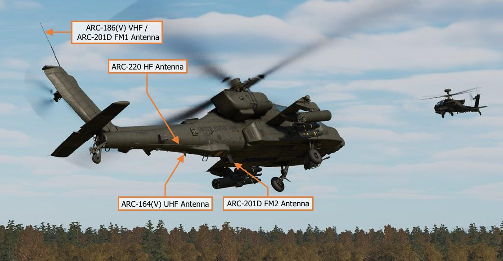

The ARC-186(V) VHF radio provides two-way line-of-sight communications over VHF-AM frequencies and is
normally used for communicating with Air Traffic Control (ATC). The radio is not capable of secure
communications. Its antenna is located on the top of the cambered fin.

The ARC-164(V) UHF radio provides two-way line-of-sight communications over UHF-AM frequencies and is
normally used for communicating with ATC, other aircraft, or ground forces. The radio contains an additional
receiver tuned to the GUARD frequency of 243.0 MHz, the ability to communicate on HAVE QUICK frequency-
hopping nets, and can be connected to a KY-58 module for secure communications. Its antenna is located on the
underside of the tail boom, aft of the navigational sponson containing the Doppler velocity and radar altimeter
antennas.

Two ARC-201D SINCGARS (Single Channel Ground and Airborne Radio System) radio sets provide two-way line-
of-sight communications over VHF-FM frequencies and are normally used for communicating with ground forces
and other AH-64 team members. Both radios have embedded secure communications capability and can
communicate on frequency-hopping nets. The FM1 radio shares the tail-mounted whip antenna with the VHF
radio, and the FM2 antenna is located on the underside of the tail boom, forward of the navigational sponson.
The FM1 radio is paired with an Improved FM (IFM) amplifier which can vary the output power of the radio.

The ARC-220 HF radio provides two-way, non-line-of-sight (NLOS) and over-the-horizon (OTH) communications
over shortwave frequencies. The radio has an embedded modem for sending and receiving data transmissions,
can operate using frequency-hopping nets, and can be connected to a KY-100 module for secure communications
capability. The ARC-220 is also capable of communications using Automatic Link Establishment (ALE) multi-
channel nets to decrease crew workload and increase communications reliability. The HF radio utilizes a near-
vertical incidence skywave (NVIS) type antenna which runs along the right side of the tail boom and is paired
with a dedicated amplifier which can vary the output power of the radio.

### Communications Architecture

The operation of the AH-64D’s communications system is designed for use in combat, in which the expected
nature of the mission involves the employment of teams, platoons, or entire companies of AH-64D’s against
conventional ground forces. The architecture of the communications system integrates voice and data networks
into a single interface and is optimized for pre-planned operations; but remains sufficiently flexible to respond to
a rapidly evolving battlefield or last-minute changes in the mission.

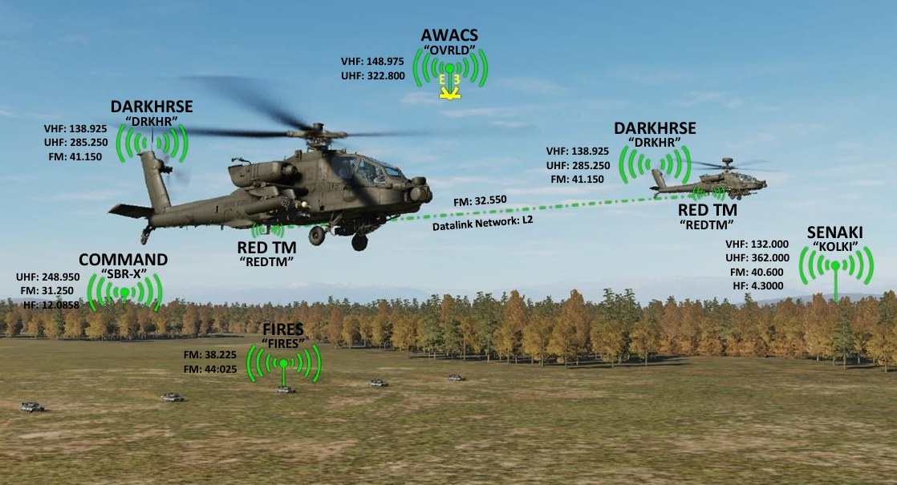

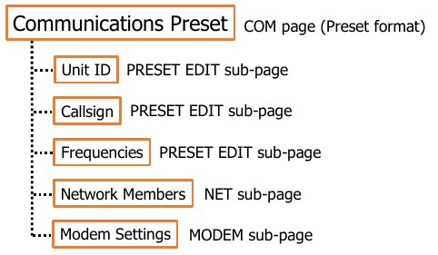

The architecture of the AH-64D communications interface
primarily revolves around the use of “presets”. Up to 10 presets
may be accessed on the COM page at any given time. Unlike
singular preset frequencies that may be selected from a physical
radio control panel, each preset within the AH-64D includes:

- Details regarding the unit, echelon, or organization the
       preset pertains to.

- A list of frequencies that may be utilized for voice and data
       transmission, to include the primary frequency and radio
       that are intended to be used during the mission.

- A list of flight members that may send/receive data through the datalink network associated with that preset.

- Modem settings used when sending/receiving data over the datalink network associated with that preset.

When one of the ten presets are selected on the main COM page, the COM page is displayed in Preset format,
which presents information pertinent to that preset, such as the unit ID, callsign, and frequencies, and allows
that preset to be tuned (which will also configure the datalink according to the network and modem settings).

If desired, the crewmember may edit details or frequencies of the preset itself by accessing the PRESET EDIT
sub-page. Additionally, the network members of the preset may be edited on the NET sub-page, and the modem
settings on the MODEM sub-page. (See the Datalink chapter for more information regarding datalink network
and modem settings.)

### Communications Controls

The aircrew interacts with and controls the communications equipment using a combination of the Multi-Purpose
Displays (MPD), the Enhanced Upfront Display (EUFD), and the Communications Panel located within each
cockpit. (See the COM page for more information regarding MPD controls.)

#### EUFD Controls

The Enhanced Up-Front Display (EUFD) provides the aircrew with a consolidated location for viewing the current
configuration and datalink settings of each radio, and the transponder.

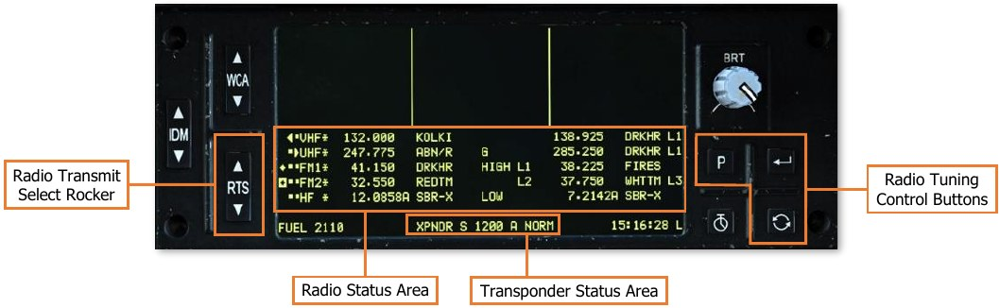

If generator power is lost, crewmembers may still use any radio using the EUFD while operating on battery power,
to include tuning preset frequencies.

(See Enhanced Up-Front Display (EUFD) for more information.)

#### Communications Panel Controls

The Communications panel controls
the volume of the intercom and radios.
The panel can also be used to toggle
the squelch of an individual radio or
change the ICS mode of operation.

(See Communications Panel for more
information.)

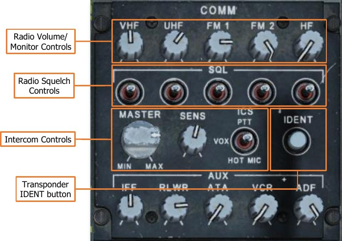

### Communications (COM) Page

The Communications page presents an overview of the aircraft’s communications system. The COM page displays
10 presets that may be assigned to a radio for voice/data communications, the aircraft’s current datalink
configuration, and the transponder state. The COM page also includes access to additional MPD pages for
configuring specific radio equipment, manually tuning a radio frequency for voice-only communications, and
sending/receiving text messages and mission files over the datalink.

See the Datalink chapter for more information regarding the Datalink (DL) page, Originator ID (ORIG ID) sub-
page, and Message (MSG) sub-pages.

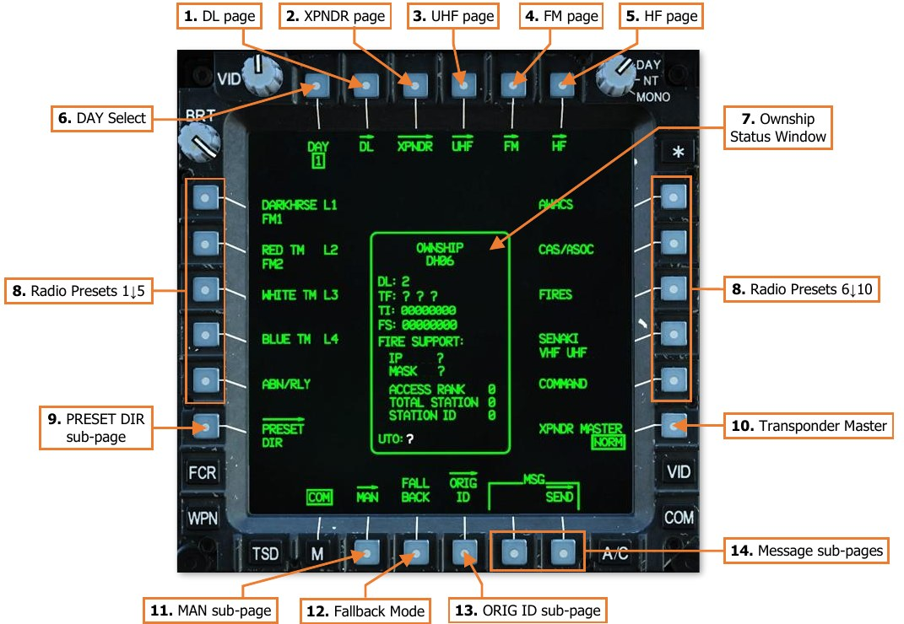

1.   **DL page.** Displays the Datalink (DL) page. (N/I)

2.   **XPNDR page.** Displays the Transponder (XPNDR) page. (N/I)

3.   **UHF page.** Displays the UHF radio page. (N/I)

4.   **FM page.** Displays the FM radio page. (N/I)

5.   **HF page.** Displays the HF radio page. (N/I)

6.   **DAY Select.** Not implemented.

7.   **Ownship Status Window.** Displays the aircraft’s current network configuration for datalink operations.

8.   **Radio Presets.** Displays the Preset format with additional options for editing or tuning the selected preset.
     Each preset entry is labeled using the preset’s Unit ID and the selected modem protocol, if any.
     If any radios have been tuned to the preset, the corresponding radio(s) will be identified in the second line
     of text directly below the preset entry. If more than three radios have been tuned to the same preset, the
     VHF, UHF, FM1, FM2, and HF radios will be truncated as V, U, 1, 2, and H, respectively.

9.   **PRESET DIR sub-page.** Not implemented.

10. **Transponder Master.** Sets the transponder to Normal (NORM) operation or Standby (STBY).

11. **Fallback Mode.** Not implemented.

12. **MAN sub-page.** Displays the Manual (MAN) sub-page.

13. **ORIG ID sub-page.** Displays the Originator ID (ORIG ID) sub-page.

14. **Message sub-pages.** Displays the corresponding sub-pages for sending or receiving messages via the
    datalink.

### Tuning a Radio to a Preset

When a preset is selected, the COM page displays information about the preset, options along the top of the
page for tuning the preset to a radio net, and options along the bottom of the page for editing the preset itself.

#### COM Preset Format

Selecting a preset displays the COM page in Preset format with a box around the preset selection. Selecting the
same preset a second time de-selects the preset and returns the COM page to its original format.

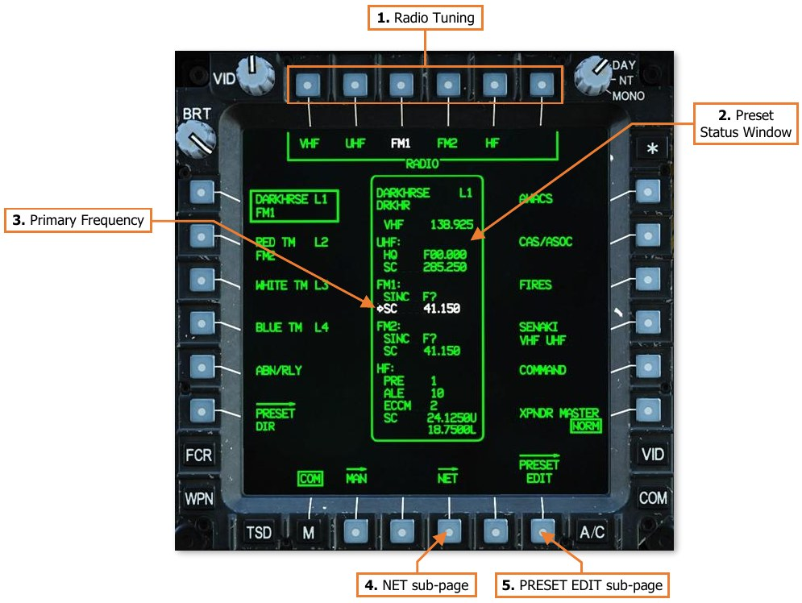

1.   **RADIO Tuning.** Displays preset tuning options for any of the aircraft’s radios.

    -  **RADIO – VHF.** Displays VHF tuning options.

    -  **RADIO – UHF.** Displays UHF tuning options.

    -  **RADIO – FM1.** Displays FM1 tuning options.

    -  **RADIO – FM2.** Displays FM2 tuning options.

    -  **RADIO – HF.** Displays HF tuning options.

2.   **Preset Status Window.** Displays the preset’s unit ID, callsign, frequency list, primary frequency, and
     modem protocol, if any.

3.   **Primary Frequency.** The preset’s primary frequency and corresponding radio is highlighted in white.

4.   **NET sub-page.** Displays the Network (NET) sub-page. (See the Datalink chapter for more information.)

5.   **PRESET EDIT sub-page.** Displays the Preset Edit (PRESET EDIT) sub-page.

#### COM Preset Format – Tuning Options

Selecting a radio when the COM page is in Preset format will display additional options for how the preset is
assigned to the corresponding radio. Selecting the same radio a second time de-selects the radio, removes the
additional options, and restores the MAN, NET, and PRESET EDIT sub-page options.

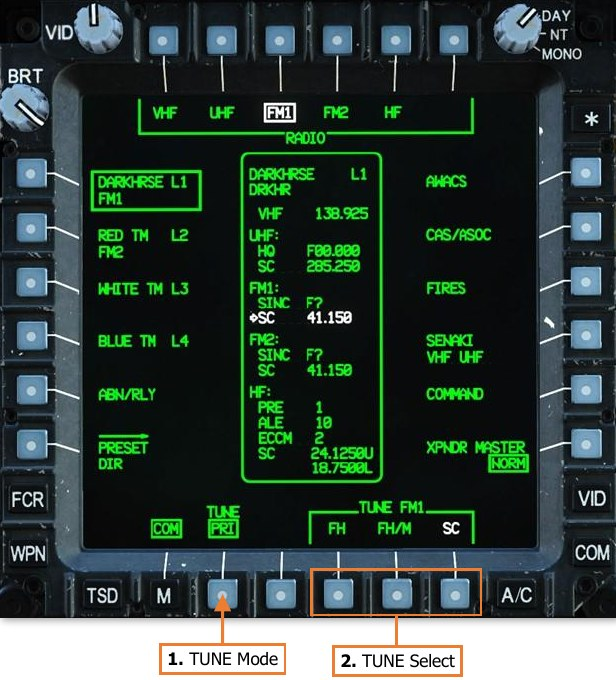

1.   **TUNE Mode.** Selects the radio tuning mode that will be used when a preset is assigned to the selected
     radio.

    - **PRI.** The selected preset will be assigned to the primary slot of the selected radio.
          When a preset is assigned to a radio in the primary slot, the corresponding radio will be tuned to the
          preset. The preset or manual frequency that is already in the primary slot will be transferred to the
          standby slot, and the preset or manual frequency that is already in the standby slot will be removed.

    - **STBY.** The selected preset will be assigned to the standby slot of the selected radio.
          When a preset is assigned to a radio in the standby slot, the preset or manual frequency that is already
          in the standby slot will be replaced by the selected preset.

2.   **TUNE Select.** Displays tuning options for the selected preset and selected radio.

    - **TUNE – FH.** Not implemented.

    - **TUNE – FH/M.** Not implemented.

    - **TUNE – SC.** Assigns the single-channel (i.e., single frequency) radio net displayed within the Preset
          Status window to the selected radio, in accordance with the selected Tune mode.

#### Tuning a Radio to a Preset using an MPD

When a preset is selected from the COM page, tuning options will be sequentially presented for the crewmember
to choose which radio to assign the preset, whether the preset is assigned to the primary or standby slots on the
EUFD, and which type of radio net is assigned to the radio.

To assign a preset frequency/network to a radio using an MPD,
perform the following:

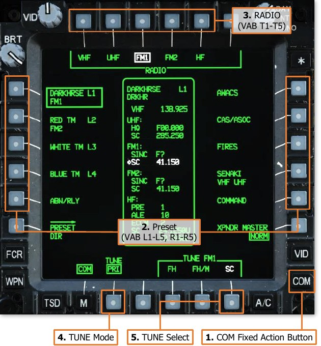

1.   COM Fixed Action Button – Press.
2.   Preset (VAB L1-L5, R1-R5) – Select as
     desired.
3.   RADIO (VAB T1-T5) – Select as desired.
4.   TUNE Mode (VAB B2) – Set as PRI or
     STBY as desired.
5.   TUNE Select (VAB B6) – Select SC.

After the radio is tuned as selected, the TUNE
Select options will collapse and a different
radio may be selected (VAB T1-T5) to tune
from the same preset.

#### Tuning a Radio to a Preset using the EUFD

Pressing the EUFD Preset button displays the Preset list for the selected radio along the right side of the EUFD.
While this menu is displayed, the WCA rocker is used to scroll up and down within the preset list. Once a preset
has been selected with the arrow, pressing the Enter button will assign the selected preset to the primary slot of
the corresponding radio, which will then be tuned to the preset frequency.

To assign a preset frequency/network to a radio using the EUFD, perform the following:

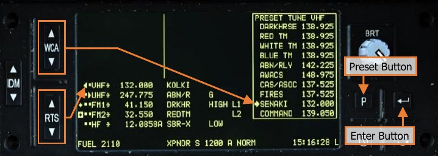

1.   EUFD Preset button – Press to
     display the preset list
2.   RTS rocker switch – Select
     radio to tune.

3.   WCA rocker switch – Select
     preset frequency from preset
     list.
4.   EUFD Enter button – Press.

The EUFD Preset function can be useful to tune a radio without changing an MPD to the COM page. The Preset
function on EUFD is limited to tuning single-channel frequencies only and cannot be used to tune frequency-
hopping nets.

### Editing a Preset

Any preset may be edited from within the cockpit by either crewmember. The preset may be modified in how it
is presented on the MPDs and EUFD, which frequencies are tuned when the preset is assigned to a radio, or the
composition of the network and modem settings when the preset is utilized for datalink functions.

#### COM Preset Edit (PRESET EDIT) Sub-Page

The PRESET EDIT sub-page allows the aircrew to modify any data associated with the selected preset. The
datalink network and modem settings associated with the preset may be modified from the NET and MODEM
sub-pages respectively. (See the Datalink chapter for more information.)

##### UNIT Edit Options

The UNIT options allow the crewmember to edit how the preset itself is presented on the MPDs and EUFD.

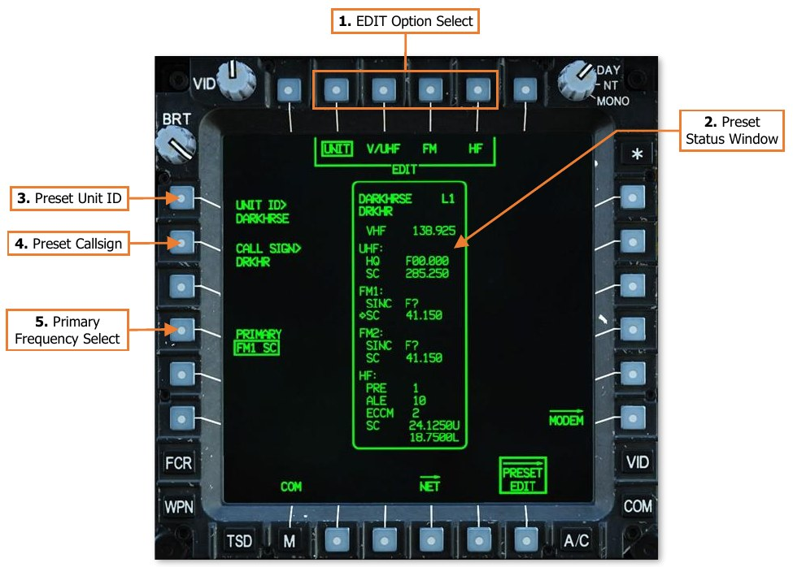

1.   **EDIT Option Select.** Displays options for editing other data fields within the displayed preset.

2.   **Preset Status Window.** Displays the preset’s unit ID, callsign, frequency list, primary frequency, and
     modem protocol, if any. Data fields that may be changed using the current Edit options are shown in full-
     intensity. Data fields that may be changed from another Edit option are shown in partial-intensity.

3.   **Preset Unit ID.** Activates the KU for inputting a Unit ID for the preset. The Unit ID determines how the
     preset is displayed on the COM page and EUFD Preset list. Up to 8 alphanumeric characters may be entered.

4.   **Preset Callsign.** Activates the KU for inputting a Callsign for the preset. The Callsign determines how the
     preset is displayed on the EUFD when assigned to a radio. Up to 5 alphanumeric characters may be entered.

5.   **Primary Frequency Select.** Displays options for designating a primary frequency and radio for the preset.
     When assigned as Primary, the corresponding entries on the COM Preset format are displayed in white to
     highlight the intended radio and net with which the preset is intended to be utilized. The primary designation
     does not affect the function of any radio equipment or how the preset is assigned to a specific radio.

##### V/UHF Edit Options

The V/UHF edit options allow the crewmember to edit the VHF and UHF radio configurations when the preset is
assigned to the ARC-186(V) or ARC-164(V) radios, respectively.

6.   **VHF Frequency.** Activates the KU for inputting a VHF-AM frequency for the preset. Valid frequency entries
     are between 108.000 and 151.975 MHz in 0.025 MHz increments. Frequencies between 108.000 and
    115.975 MHz are limited to receive-only

7.   **UHF Settings.** Displays settings for configuring UHF radio nets for the preset.

    - **MODE.** Toggles the UHF radio between unsecure (PLAIN) and secure (CIPHER) communications. (N/I)

    - **CNV.** Displays options for secure radio communications. (N/I)

    - **HQ NET>.** Activates the KU for inputting a Have Quick net for the preset. (N/I)

    - **FREQ>.** Activates the KU for inputting a single-channel UHF-AM frequency for the preset. Valid
          frequency entries are between 225.000 and 399.975 MHz in 0.025 MHz increments.

##### FM Edit Options

The FM edit options allow the crewmember to edit the FM1 or FM2 radio configurations when the preset is
assigned to either of the ARC-201D radios.

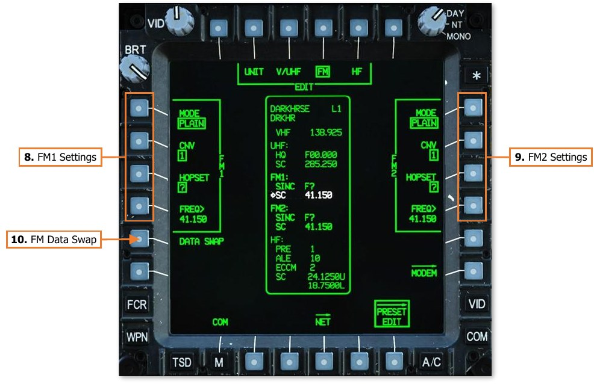

8.   **FM1 Settings.** Displays settings for configuring FM1 radio nets for the preset.

    - **MODE.** Toggles the FM1 radio between unsecure (PLAIN) and secure (CIPHER) communications. (N/I)

    - **CNV.** Displays options for secure radio communications. (N/I)

    - **HOPSET.** Displays options for frequency-hopping radio communications. (N/I)

    - **FREQ>.** Activates the KU for inputting a single-channel VHF-FM frequency for the preset. Valid
          frequency entries are between 30.000 and 87.975 MHz in 0.025 MHz increments.

9.   **FM2 Settings.** Displays settings for configuring FM2 radio nets for the preset.

    - **MODE.** Toggles the FM2 radio between unsecure (PLAIN) and secure (CIPHER) communications. (N/I)

    - **CNV.** Displays options for secure radio communications. (N/I)

    - **HOPSET.** Displays options for frequency-hopping radio communications. (N/I)

    - **FREQ>.** Activates the KU for inputting a single-channel VHF-FM frequency for the preset. Valid
          frequency entries are between 30.000 and 87.975 MHz in 0.025 MHz increments.

10. **FM Data Swap.** Swaps the FM radio options between the FM1 and FM2 configurations.

##### HF Edit Options

The HF edit options allow the crewmember to edit the HF radio configuration when the preset is assigned to the
ARC-220 radio.

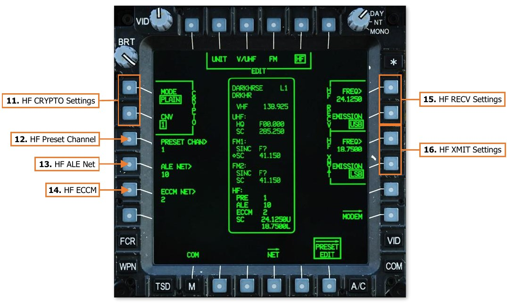

11. **HF CRYPTO Settings.** Displays settings for configuring the HF radio for secure radio communications.

    - **MODE.** Toggles the HF radio between unsecure (PLAIN) and secure (CIPHER) communications. (N/I)

    - **CNV.** Displays options for secure radio communications. (N/I)

12. **HF Preset Channel.** Activates the KU for inputting a preset HF channel for the preset. (N/I)

13. **HF ALE Net.** Activates the KU for inputting an HF ALE net for the preset. (N/I)

14. **HF ECCM Net.** Activates the KU for inputting an ECCM net for the preset. (N/I)

15. **HF RECV Settings.** Displays settings for configuring single-channel HF radio reception for the preset.

    - **HF Receive Frequency.** Activates the KU for inputting a single-channel HF frequency for the preset.
          Valid frequency entries are between 2.0000 and 29.9999 MHz, in 0.0001 MHz increments.

    - **HF Receive Emission Mode.** Not implemented.

16. **HF XMIT Settings.** Displays settings for configuring single-channel HF radio transmissions for the preset.

    - **HF Transmit Frequency.** Activates the KU for inputting a single-channel HF frequency for the preset.
          Valid frequency entries are between 2.0000 and 29.9999 MHz, in 0.0001 MHz increments.

    - **HF Transmit Emission Mode.** Not implemented.

### Manually Tuning a Radio

If necessary, the radios may be manually tuned to a frequency that is not included within a programmed preset.
However, manually tuning a radio will also remove any datalink capability through that radio. When a radio is
manually tuned, the Callsign list on the EUFD will display “MAN” to the right of the corresponding frequency.

When a manual frequency is entered, it is always assigned in the primary slot of the corresponding radio, which
will be immediately tuned to the frequency. The preset that is already in the primary slot will be transferred to
the standby slot. This allows any unplanned radio communications over the manual frequency to occur
immediately, which may be time critical due to a change in mission or rapid changes on the battlefield; but also
allows the aircrew to just as easily return to the previous preset (and datalink network) prior to the radio being
manually tuned.

#### COM Manual (MAN) Sub-Page

The MAN sub-page allows either crewmember to tune a radio frequency that is not included within a programmed
preset or to rapidly tune the VHF or UHF radios to international GUARD frequencies.

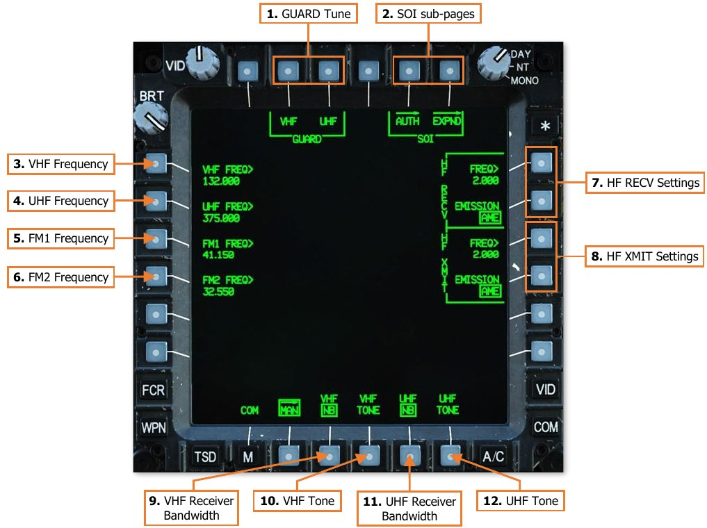

1.   **GUARD Tune.** Immediately tunes the VHF or UHF radios to a GUARD frequency.

    -   **VHF.** Sets the current VHF frequency to the standby frequency slot and tunes the primary VHF
            frequency to 121.500 MHz.

    -   **UHF.** Sets the current UHF frequency to the standby frequency slot and tunes the primary UHF
            frequency to 243.000 MHz.

2.   **SOI sub-pages.** Not implemented.

3.   **VHF Frequency.** Activates the KU for inputting a VHF-AM frequency. If the entry is valid, the current VHF
     frequency will be set to the standby frequency slot and the frequency entered on the KU will be tuned to
     the primary VHF frequency slot.
     Valid frequency entries are between 108.000 and 151.975 MHz in 0.025 MHz increments. Frequencies
     between 108.000 and 115.975 MHz are limited to receive-only.

4.   **UHF Frequency.** Activates the KU for inputting a UHF-AM frequency. If the entry is valid, the current UHF
     frequency will be set to the standby frequency slot and the frequency entered on the KU will be tuned to
     the primary UHF frequency slot.
     Valid frequency entries are between 225.000 and 399.975 MHz in 0.025 MHz increments.

5.   **FM1 Frequency.** Activates the KU for inputting a VHF-FM frequency. If the entry is valid, the current FM1
     frequency will be set to the standby frequency slot and the frequency entered on the KU will be tuned to
     the primary FM1 frequency slot.
     Valid frequency entries are between 30.000 and 87.975 MHz in 0.025 MHz increments.

6.   **FM2 Frequency.** Activates the KU for inputting a VHF-FM frequency. If the entry is valid, the current FM2
     frequency will be set to the standby frequency slot and the frequency entered on the KU will be tuned to
     the primary FM2 frequency slot.
     Valid frequency entries are between 30.000 and 87.975 MHz in 0.025 MHz increments.

7.   **HF RECV Settings.** Manually sets the HF receive frequency and emission mode.

    - **HF Receive Frequency.** Activates the KU for inputting an HF frequency. If the entry is valid, the
         current HF frequency will be set to the standby frequency slot and the frequency entered on the KU
         will be tuned to the primary HF frequency slot.
         Valid frequency entries are between 2.0000 and 29.9999 MHz, in 0.0001 MHz increments.

    - **HF Receive Emission Mode.** Not implemented.

8.   **HF XMIT Settings.** Manually sets the HF transmit frequency and emission mode.

    - **HF Transmit Frequency.** Activates the KU for inputting an HF transmission frequency. If the entry is
         valid, the current HF transmit frequency will be set to the standby frequency slot and the frequency
         entered on the KU will be tuned to the primary HF frequency slot.
         Valid frequency entries are between 2.0000 and 29.9999 MHz, in 0.0001 MHz increments.

    - **HF Transmit Emission Mode.** Not implemented.

9.   **VHF Receiver Bandwidth.** Not implemented.

10. **VHF Tone.** When pressed, the VHF audio channel will emit a solid tone for maintenance testing.

11. **UHF Receiver Bandwidth.** Not implemented.

12. **UHF Tone.** When pressed, the UHF audio channel will emit a solid tone for maintenance testing.

#### Manually Tuning a Radio Frequency

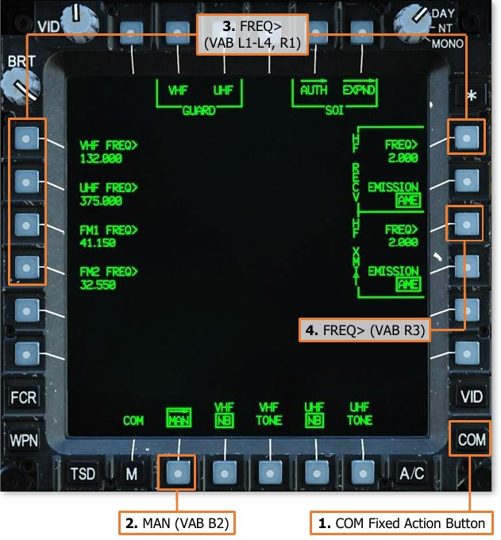

To manually tune a VHF frequency, perform
the following:

1.   COM Fixed Action Button – Press.
2.   MAN (VAB B2) – Select.
3.   VHF> (VAB L1) – Select and input the
     frequency.

To manually tune a UHF frequency, perform
the following:

1.   COM Fixed Action Button – Press.
2.   MAN (VAB B2) – Select.
3.   UHF> (VAB L2) – Select and input the
     frequency.

To manually tune an FM frequency, perform
the following:

1.   COM Fixed Action Button – Press.
2.   MAN (VAB B2) – Select.
3.   FM1> (VAB L3) – Select and input the
     frequency.

    or

    FM2> (VAB L4) – Select and input the frequency.

To manually tune an HF frequency, perform the following:

1.   COM Fixed Action Button – Press.
2.   MAN (VAB B2) – Select.
3.   HF RECV – FREQ> (VAB R1) – Select and input the receive frequency.
4.   HF XMIT – FREQ> (VAB R3) – Select and input the transmit frequency.
{!abbr.md!}
{!dev-docs/ah64d/abbr.md!}
{!docs/ah64d/abbr.md!}
