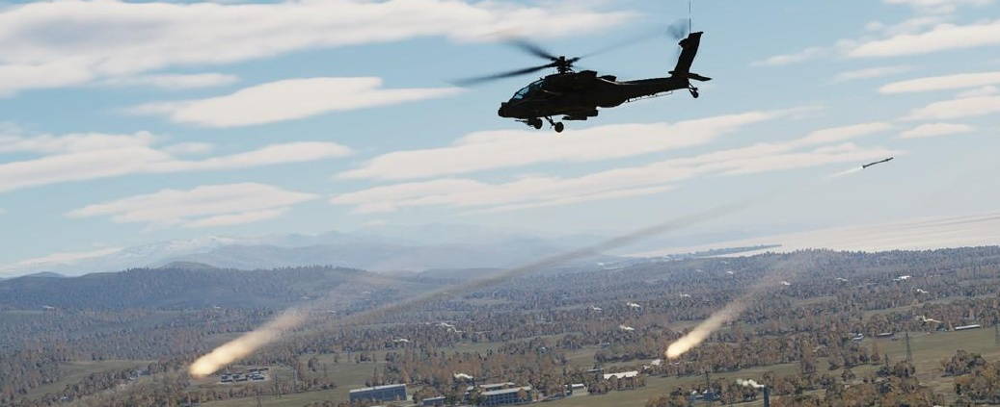
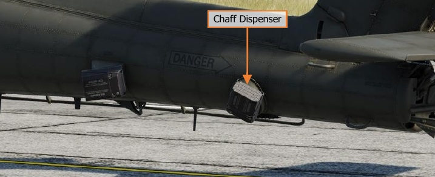
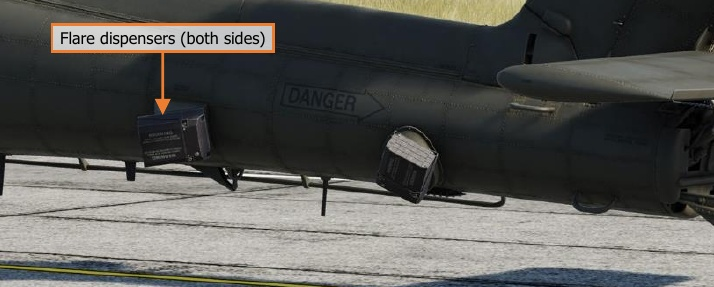
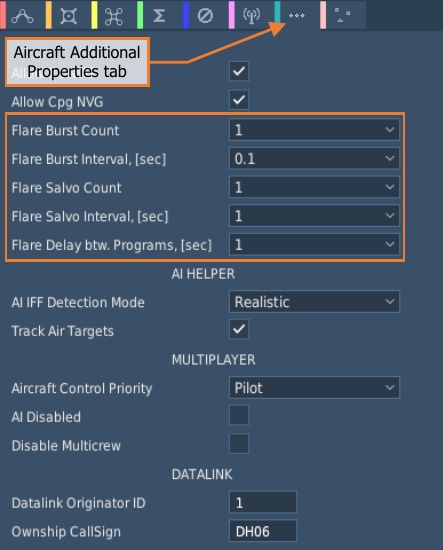
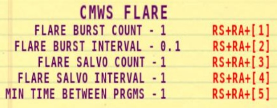

# Countermeasures Dispensers

The AH-64D is equipped with three expendable countermeasures dispensers: a single M-141 dispenser for chaff
and two Improved Countermeasure Dispensers (ICMD) for flares. Due to each dispenser’s mounted location and
orientation, the countermeasures loaded in each dispenser are not interchangeable between chaff and flares.

### Chaff Dispenser

The M-141 chaff dispenser is mounted on the left side of the tail boom and can hold 30 chaff cartridges. Chaff
cartridges may be dispensed individually in MANUAL mode, or sequentially when in PROGRAM mode. The
dispenser mode is toggled between MANUAL and PROGRAM on the ASE or ASE UTIL pages, and the chaff program
may be edited on the ASE UTIL page as well.

The chaff dispenser can only be set to ARM when the aircraft is airborne. If the aircraft is weight-on-wheels, the
chaff dispenser is automatically set to SAFE and inhibited from dispensing.

Either crewmember may arm the chaff dispenser or configure the chaff settings, which are common between
each crewstation, and either crewmember may dispense chaff by pressing the Chaff button on the Cyclic Grip.

The chaff quantity and ARM/SAFE status is also indicated on the WPN page.

### Flare Dispensers

A pair of Improved Countermeasures Dispensers (ICMD) are mounted on opposing sides of the tail boom and
each can hold 30 flare cartridges. Flares may be dispensed automatically by the CMWS itself or manually by either
crewmember when the CMWS BYPASS/AUTO switch on the CMWS Control Panel is set to the AUTO position. If
the switch is set to the BYPASS position, automatic flare dispensing is bypassed and may only be manually
dispensed by the aircrew by pressing the Flare button on the Cyclic Grip.

The flare dispensers are only armed when the aircraft is airborne. If the aircraft is weight-on-wheels, the flare
dispensers will be inhibited from dispensing, regardless of the position of the CMWS ARM/SAFE switch on the
CMWS Control Panel in the Pilot crewstation.

The flare dispensers utilize a pre-set flare program, which can only be modified by an external panel by ground
support crews when the engines are off. Flares are dispensed using this program regardless of whether the
dispensing is commanded automatically by the CMWS or manually by the aircrew.
The flare program may be edited on the Aircraft Additional Properties tab within the Mission Editor, or from the
cockpit by utilizing the player kneeboard. The available program options include Burst Count, Burst Interval, Salvo
Count, Salvo Interval, and Minimum Time Between Programs.

{!abbr.md!}
{!dev-docs/ah64d/abbr.md!}
{!docs/ah64d/abbr.md!}
