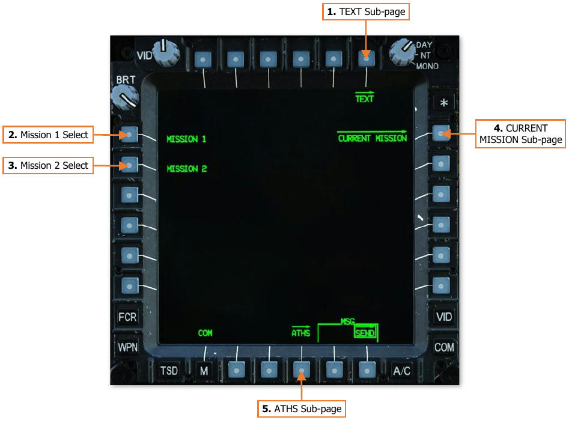
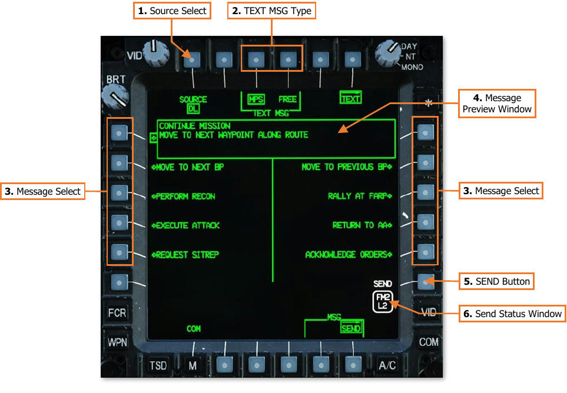
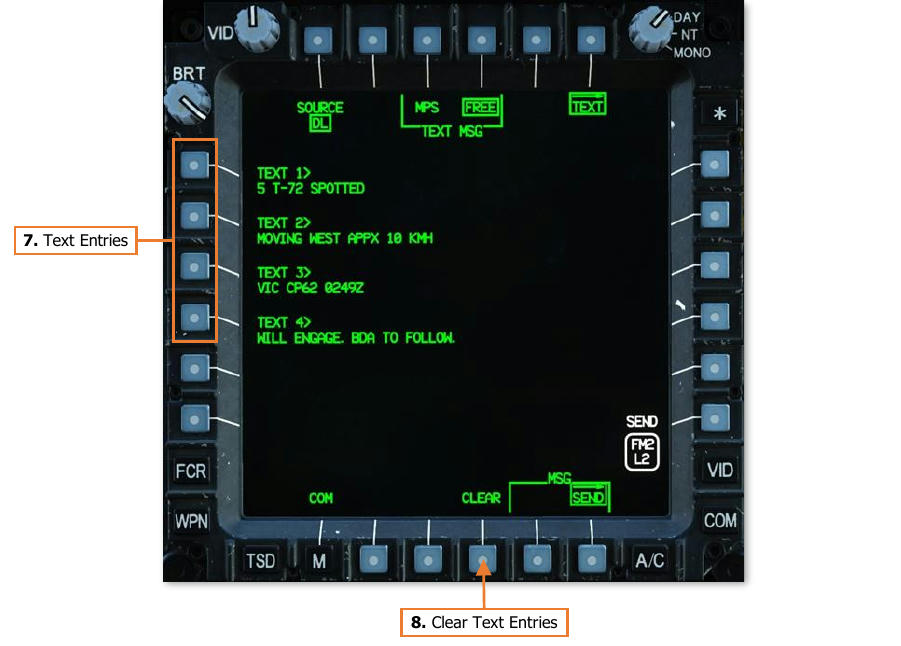
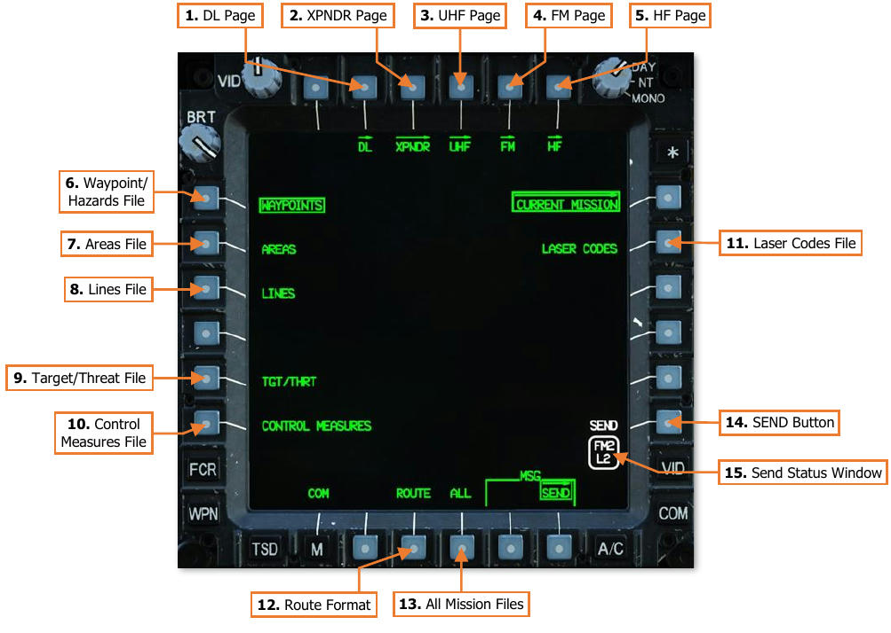
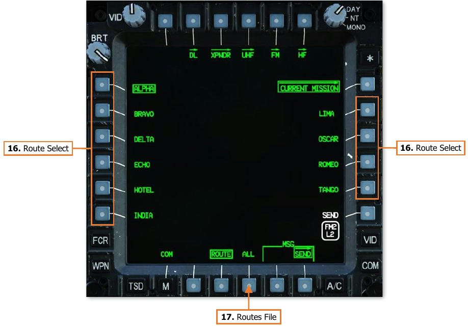
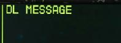
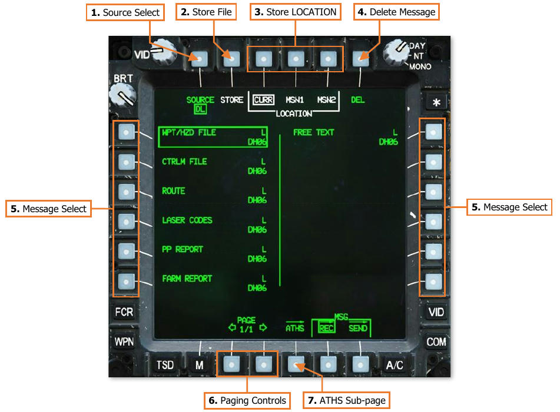
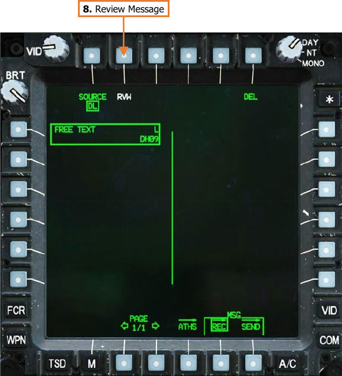
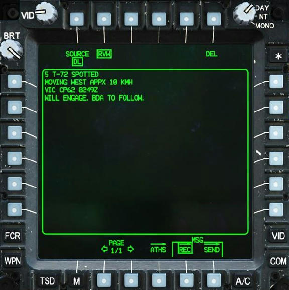

# Team Messages

Team messages are used to relay and distribute command and control information, mission updates, or
reconnaissance information among networks of AH-64D’s. These message types include individual text messages
and entire mission files. Any time a text message or mission file is transmitted across a datalink network, all
subscribers designated as a Team member within that network will receive them.

Although Team messages themselves cannot be selectively sent to individual aircraft within a datalink network,
the networks themselves may be configured to facilitate this. Team member designations within a network may
be altered from the NET sub-page, or separate datalink networks may be configured with unique Team member
designations.

## COM Message Send (MSG Send) Sub-Page

The Message Send sub-page presents several options for sending text messages or mission files.

1.   **TEXT sub-page.** Displays the Text sub-page.

2.   **MISSION 1.** Not implemented.

3.   **MISSION 2.** Not implemented.

4.   **CURRENT MISSION sub-page.** Displays the Current Mission sub-page.

5.   **ATHS sub-page.** Not implemented.

## Sending Text Messages

Text messages may contain up to 4 lines of text, with each line consisting of no more than 44 alphanumeric
characters (or spaces), for a maximum of 176 characters.

### COM MSG-SEND Text (TEXT) Sub-Page

The TEXT sub-page allows aircrews to select a pre-composed text message for transmission across the datalink
network, or manually compose a text message themselves using the Keyboard Unit (KU).

##### Text Message - MPS Format

Ten text messages may be composed using Mission Planning Systems prior to the mission. These text messages
allow aircrews to rapidly send critical or time-sensitive messages between aircraft without needing to manually
input each message prior to transmission.

1.   **Source Select.** Not implemented.

2.   **TEXT MSG Type.** Selects a page format for sending pre-composed or manually entered text messages.

    - **TEXT MSG – MPS.** Displays up to 10 text messages that have been composed prior to the mission.

    - **TEXT MSG – FREE.** Displays options for manually composing a text message using the KU.

3.   **Message Select.** Selects an MPS Text message for preview.

4.   **Message Preview Window.** Displays the text message that will be transmitted if the SEND button is
     pressed.

5.   **SEND Button.** The SEND button is displayed when a MPS Text message is selected for preview, or at least
     one character has been entered into one line of a Free Text message, and the Datalink Transmit Select
     Indicator is set to a radio that has been configured for transmitting digital messages.
     When the SEND button is pressed, the text message will be sent to all network subscribers that are
     designated as Team members.

6.   **Send Status Window.** Displays the radio and datalink network over which the text message will be
     transmitted.

    ###### Text Message - Free Format

    Free text messages may be composed in the cockpit using the Keyboard Unit (KU). This allows aircrews to send
text messages regarding unplanned events, contingencies, or reconnaissance information.

    

7.   **Text Entries.** Activates the KU for inputting a line of text. Each line of text may contain a maximum of 44
     characters.

8.   **Clear Text Entries.** Deletes all characters from each line of text.

## Sending Mission Files

Mission files may be sent from the aircraft database across the datalink network, which will overwrite the
corresponding mission file when stored in the receiving aircraft. Each mission file may be individually selected for
transmission, or the entire mission database may be selected for transmission.

### COM MSG-SEND Current Mission (CURRENT MISSION) Sub-Page

The CURRENT MISSION sub-page transmits mission files from the aircraft memory across the datalink network.
When stored, the mission files onboard the receiving aircraft will be replaced with the received mission file. This
allows commanders or team leaders to synchronize information displayed on the TSD of each AH-64D as changes
in mission occur in real-time. This may also be used to update the TSD database of subsequent teams entering
the battlespace from those already on-station performing reconnaissance or conducting a “battle handover”.

1.   **DL Page.** Displays the Datalink page.

2.   **XPNDR Page.** Displays the Transponder page.

3.   **UHF Page.** Displays the UHF Radio page.

4.   **FM Page.** Displays the FM Radio page.

5.   **HF Page.** Displays the HF Radio page.

6.   **Waypoint/Hazards File.** Selects the Waypoint/Hazards file (W01-W50) for transmission.

7.   **Areas File.** Selects the Areas file for transmission. (N/I)

8.   **Lines File.** Selects the Lines file for transmission. (N/I)

9.   **Target/Threat File.** Selects the Target/Threat file (T01-T50) for transmission.

10. **Control Measures File.** Selects the Control Measures file (C51-C99) for transmission.

11. **Laser Codes File.** Selects the Laser Codes file (Codes A-R) for transmission.

12. **Route Format.** Displays the Route format.

13. **All Mission Files.** Selects all mission files residing within the aircraft memory for transmission. Each mission
    file will be transmitted in rapid succession to each Team member.

14. **SEND Button.** The SEND button is displayed when a mission file is selected and the Datalink Transmit
    Select Indicator is set to a radio that has been configured for transmitting digital messages.
     When the SEND button is pressed, the selected mission file(s) will be sent to all network subscribers that
     are designated as Team members.

15. **Send Status Window.** Displays the radio and datalink network over which the mission file will be
    transmitted.

    ##### Route Format
    
    The Route format allows each route to be individually selected for transmission, or the entire Route file may be
    transmitted.
    
    !!! note
        If a route contains any points with different coordinates (or are simply not present) within the receiving
        aircraft, the route sequence will appear differently within the receiving aircraft when stored. The corresponding
        points within each route should be transmitted to, and stored within, the receiving aircraft before the routes
        themselves are transmitted and stored.

    

16. **Route Select.** Selects an individual route from within the Routes file for transmission.

17. **Routes File.** Selects the Routes file (Routes 1-10) for transmission.

## Receiving Text Messages & Mission Files

Either crewmember may review, store, or delete any received text message, mission file, or other datalink
message. However, deleting or storing a datalink message will perform the action for both crewstations.

When a text message or mission file has been received through the datalink, the EUFD
will display a “DL MESSAGE” advisory, prompting the aircrew to access the MSG REC
sub-page to review (or store) the received datalink message.

### COM Message Receive (MSG REC) Sub-Page

The MSG REC sub-page allows aircrews to view a list containing all datalink messages that have been received.

1.   **Source Select.** Not implemented.

2.   **Store File.** Stores the selected mission file, TSD point, tactical report, or PF/NF zones.

3.   **Store LOCATION.** Selects a location for storing the selected mission file, TSD point, or PF/NF zones. This
     option is not available when a tactical report is selected from the message list. (N/I)

    - **LOCATION – CURR.** Stores the selected data within the database residing in the aircraft memory.

    - **LOCATION – MSN1.** Stores the selected data within the MISSION 1 database residing on the DTC.

    - **LOCATION – MSN2.** Stores the selected data within the MISSION 2 database residing on the DTC.

4.   **Delete Message.** Deletes the selected message.

5.   **Message Select.** Selects a received message for review, storing, or deletion.

6.   **Paging Controls.** Cycles forward and back through multiple pages of the message list.

7.   **ATHS sub-page.** Not implemented.

8.   **Review Message.** Displays the Review format when a text message is selected from the message list.
     This option will be displayed in white if the selected text message has not been reviewed by either
     crewmember. Once the text message has been reviewed, the option will be displayed in green.

    

    

{!abbr.md!}
{!dev-docs/ah64d/abbr.md!}
{!docs/ah64d/abbr.md!}
