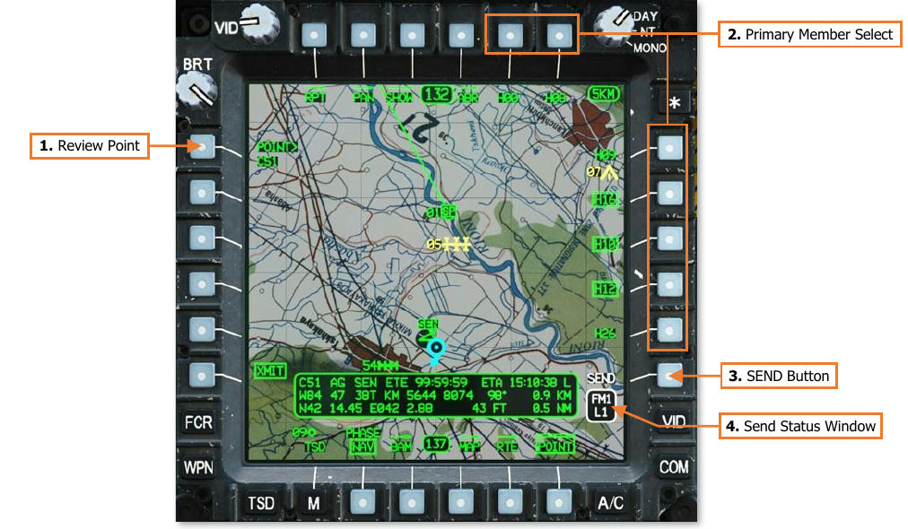
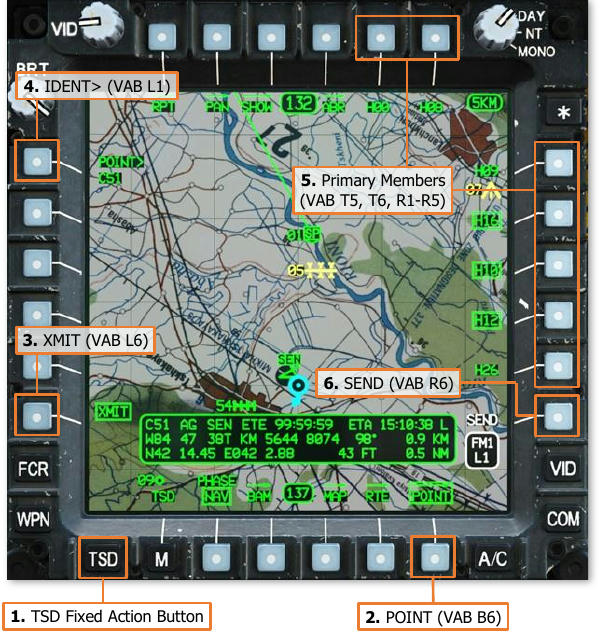
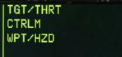
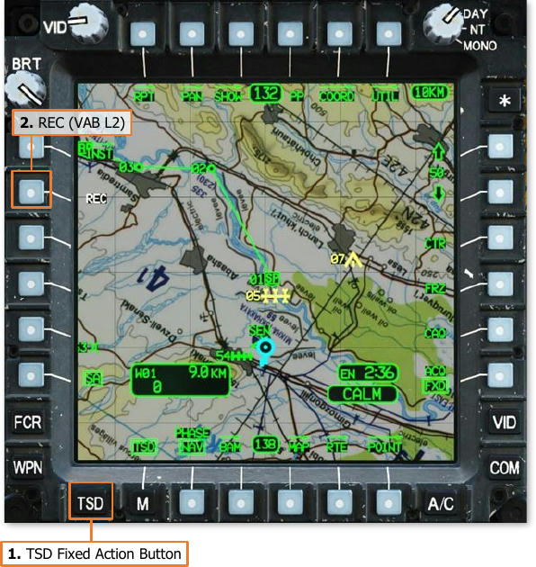
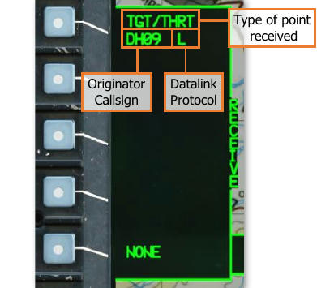
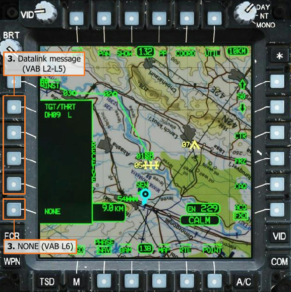

# TSD Points

Any point residing within the TSD database may be transmitted across the datalink network. However, unlike
mission files which are transmitted to all Team members within the datalink network, TSD points may only be
transmitted to selected Primary members. This facilitates target handovers between individual aircraft by sending
Target points, it allows team leaders to develop hasty control measures during the mission, and permits a more
limited transfer of TSD points to specific aircraft in lieu of sending an entire file to all Team members.

## Transmitting A Point

Points may be transmitted while the POINT sub-page is displayed in XMIT format. By default, no Primary members
are selected to receive a point transmission; each Primary member must be selected as a method of confirming
which subscribers should receive the selected point.

### POINT Transmit (XMIT) format

Pressing the XMIT button (VAB L6) displays the POINT sub-page in Transmit format. Pressing the XMIT button a
second time returns the POINT sub-page to the original format.

1.   **Review Point.** Activates the KU for inputting a point file for transmission. Alternatively, a point may be
     selected for review directly from the TSD by using the MPD cursor.

2.   **Primary Member Select.** Displays a list of Primary members within the selected datalink network that
     may be selected to receive the selected point. Each entry within the list is generated from the Callsigns of
     Primary members as displayed on the NET sub-page, truncated to the last three alphanumeric characters.
     For example, “DH08” is displayed as “H08” within the Primary member list on the TSD page.
     If the Datalink Transmit Select Indicator is moved to a different datalink network on the EUFD, the Primary
     member list will update to reflect the Primary members within the selected datalink network. If the Datalink
     Transmit Select Indicator is moved to a radio that has not been tuned to a preset with a datalink network,
     or that network contains no Primary members, no callsigns will be displayed within the Primary member list.

3.   **SEND Button.** The SEND button is displayed when a point is selected, the Datalink Transmit Select Indicator
     is set to a radio that has been configured for transmitting digital messages, and at least one Primary member
     has been selected to receive it.

4.   **Send Status Window.** Displays the radio and datalink network over which the point will be transmitted.

### Transmitting A Point

To transmit a point, ensure the EUFD Datalink
Transmit Select Indicator is set to the datalink
network over which the transmission is
intended, and then perform the following:

1.   TSD Fixed Action Button – Press.
2.   POINT (VAB B6) – Select.
                                               
                                               
3.   XMIT (VAB L6) – Select.
4.   POINT> (VAB L1) – Select and input the
     point index of the point to be transmitted
     into the KU (e.g., “W11”, “H05”, “C51”,
     “T04”, etc).
                                               
     or                                        

4.   MPD Cursor Controller/Enter – Select
     the point to be transmitted on TSD.

    

5.   Primary Member(s) (VAB T5, T6, R1-R5) – Select as desired.
6.   SEND (VAB R6) – Press.

Once SEND (VAB R6) is pressed, the SEND text label will be displayed in inverse video as the transmission is
performed to each Primary member that is selected to receive the point. When the transmission is complete, the
SEND text label will revert to normal video.

If an acknowledgement of receipt is not received from any Primary member selected to receive the point, a “XMIT
NAK” advisory will be displayed on the EUFD.

## Receiving A Point

When a point has been received through the datalink, the EUFD will display an advisory
indicating the type of point received. The “TGT/THRT” advisory will also be
accompanied by an audio ring tone, prompting the aircrew to access the MSG REC sub-
page or the TSD Receive List to store the received Target/Threat point.

Any time a datalink message intended for
Primary members is received, the aircrew
within the receiving aircraft may store the
contents of the message by selecting the COM
page and then the MSG REC sub-page, or they
may store it directly from the TSD. A white
REC option will be displayed at VAB L2, which
will open the TSD Receive list.

The Receive list will display the four most
recent datalink messages that have not
already been stored (excluding text messages
and mission files). Each entry will include the
type of data that has been sent within the
message, the originator callsign that sent the
message, and the modem protocol through 
which it was received.

In the example on this page, a TGT/THRT
point was received from “DH09” through the
DATALINK protocol, indicated by an “L”.

To store a point within the database, perform
the following:

1.   TSD Fixed Action Button – Press.
2.   REC (VAB R2) – Select to display the
     Receive list.
3.   Datalink message (VAB L2-L5) – Select.
                                             
     or

3.   NONE (VAB L6) – Select to close the
     Receive list without storing a message.
{!abbr.md!}
{!dev-docs/ah64d/abbr.md!}
{!docs/ah64d/abbr.md!}
