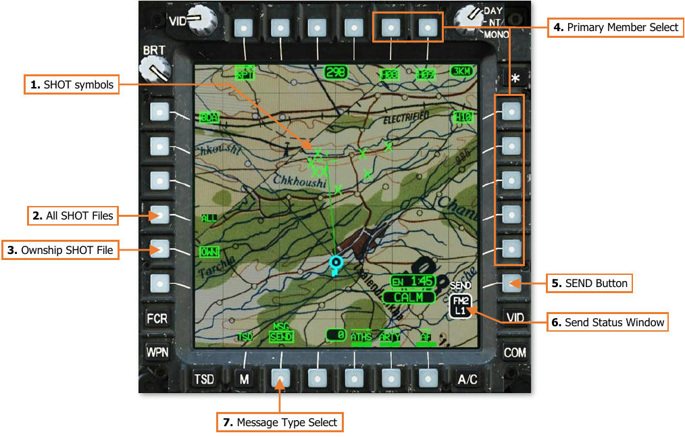
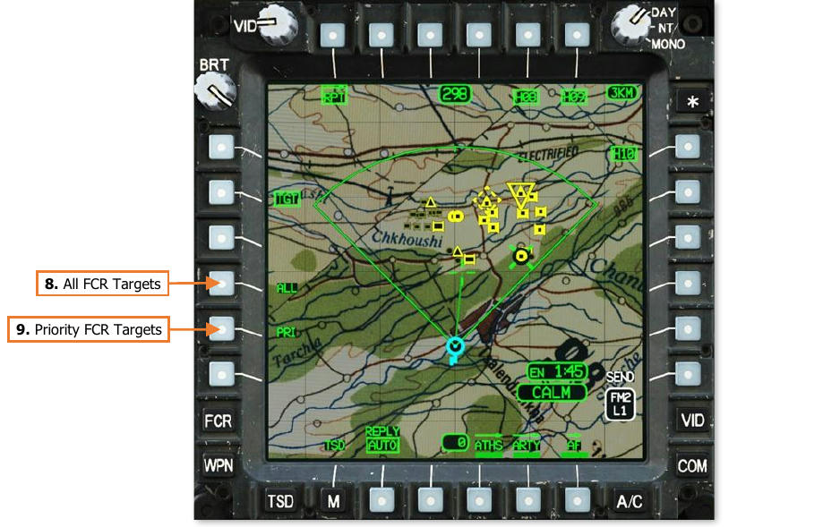
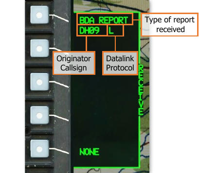

# Tactical Reports

Tactical reports may be transmitted between AH-64D’s across the datalink network. These reports streamline and
digitize the distribution of tactical information between AH-64D’s during the mission, which facilitates a more
efficient use of the radios for voice communications.

Crewmembers may send reports to any AH-64D Primary member(s) within the selected datalink network, or they
may send a request for a report, also known as a “query”. In addition, crewmembers may configure the modem
to automatically send reports in response to queries without aircrew interaction; or they may disable this function,
which will require a manual reply to such report queries.

**Battle Damage Assessment Report.** BDA reports allow crewmembers to send missile engagement data to
their flight leaders, which can then forward that data across other datalink networks to AH-64D commanders.

**Target Report.** Target reports allow FCR-equipped AH-64D’s to distribute FCR-generated targeting or
reconnaissance data to other AH-64D’s across the datalink network, which can be used to maintain situational
awareness of the battlespace or aid in target acquisition within their own aircraft.

**Present Position Report.** Present Position reports update the positions of other AH-64D’s on the datalink
network and displays their positions as friendly helicopter symbols on the TSD. These reports may be used to
monitor the movements of each team of AH-64D’s, allowing flight leaders and commanders to synchronize tactical
movements and actions.

**Fuel/Ammunition/Rockets/Missiles Report.** Also known as FARM, these reports send the current state of
fuel, munitions, and expendable countermeasures remaining onboard, allowing flight leaders and commanders
to monitor the remaining time-on-station, ordnance, and defensive capabilities of the AH-64D’s at any point
during the mission.

All reports may be transmitted, requested, received, or reviewed through the TSD; or stored from the COM MSG
REC sub-page.

## TSD Report (RPT) Sub-Page

Sending or requesting tactical reports is performed through the RPT sub-page on the TSD. This sub-page allows
crewmembers to send Battle Damage Assessment (BDA) reports, FCR Target (TGT) reports, Present Position (PP)
reports, or report the status of their onboard fuel, munitions, and expendable countermeasures using FARM
reports. This page also allows crewmembers to disable the modem’s automatic replies to queries.

1.     **BDA Report format.** Displays the Battle Damage Assessment Report format.

2.     **TGT Report format.** Displays the FCR Target Report format.

3.     **PP Report format.** Displays the Present Position Report format.

4.     **FARM Report format.** Displays the Fuel/Ammunition/Rockets/Missiles Report format.

5.     **SIT Report format.** Not implemented.

6.     **SPOT Report format.** Not implemented.

7.     **Status Message Select.** Not implemented.

8.     **Automatic Reply Mode.** Enables/disables the automatic reply function of the datalink modem.

    - **AUTO.** The modem will automatically transmit reports in response to queries.

    - **OFF.** The aircrew will be notified of incoming queries and will be responsible for sending reports as
             necessary.

9.     **ATHS sub-page.** Not implemented.

10. **ARTY sub-page.** Not implemented.

11. **AF sub-page.** Not implemented.

### Selected Report (BDA, TGT, PP, FARM) format

Pressing the BDA (VAB L1), TGT (VAB L2), PP (VAB L3), or FARM (VAB L4) buttons displays the RPT sub-page in
the selected report format. Pressing the corresponding report button a second time returns the RPT sub-page to
the original format.

##### Battle Damage Assessment (BDA) Report

BDA reports transmit the SHOT file stored within the onboard database, which stores the details of each missile
engagement performed by the ownship. The BDA report can also forward SHOT files that have already been
received from other AH-64D’s via the datalink. SHOT files may be reviewed on the TSD SHOT sub-page.

1.    **SHOT Symbols.** Missile engagement locations are stored to the ownship SHOT file and displayed on the
      TSD and FCR pages as green X symbols. Missile engagement locations received via the datalink are displayed
      as partial-intensity green X symbols on the TSD and FCR pages.

2.    **All SHOT Files (ALL).** All SHOT file entries will be transmitted within the BDA report, which includes SHOT
      files stored by the ownship and SHOT files received through the datalink from other AH-64D’s.

3.    **Ownship SHOT File (OWN).** Ownship SHOT file entries will be transmitted within the BDA report. This is
      the default selection.

4.    **Primary Member Select.** Displays a list of Primary members within the selected datalink network that
      may be selected to receive the report. Each entry within the list is generated from the Callsigns of Primary
      members as displayed on the NET sub-page, truncated to the last three alphanumeric characters. For
      example, “DH08” is displayed as “H08” within the Primary member list on the TSD page.

    If the Datalink Transmit Select Indicator is moved to a different datalink network on the EUFD, the Primary
      member list will update to reflect the Primary members within the selected datalink network. If the Datalink
      Transmit Select Indicator is moved to a radio that has not been tuned to a preset with a datalink network,
      or that network contains no Primary members, no callsigns will be displayed within the Primary member list.

    When BDA is the selected report type, no members are selected by default. However, if TGT, PP, or FARM
     are the selected report type, all members are selected by default.

5.   **SEND Button.** The SEND button is displayed when a report is selected, the Datalink Transmit Select
     Indicator is set to a radio that has been configured for transmitting digital messages, and at least one
     Primary member has been selected to receive it.

6.   **Send Status Window.** Displays the radio and datalink network over which the report will be transmitted.
7.   Message Type Select. Toggles the type of message that will be sent to the selected Primary members.
     This option is not displayed when the RPT sub-page is displayed in TGT format; FCR Target reports may be
     sent, but they cannot be requested.

    - **SEND.** A report will be sent to each Primary member that has been selected.

    - **RQST.** A query will be sent to each Primary member that has been selected.

    ##### Target (TGT) Report
    
    TGT reports distribute FCR target data to other AH-64D’s. TGT reports may contain individually-selected FCR
    targets, high-priority FCR targets, or all FCR targets which includes high- and low-priority targets.
    
    (See the Fire Control Radar chapter for more information.)
    
    
    

8.   **All FCR Targets (ALL).** All FCR targets will be transmitted within the TGT report, which includes the 16
     high-priority targets and all low-priority targets.

9.   **Priority FCR Targets (PRI).** The 16 high-priority FCR targets will be transmitted within the TGT report.

    The MPD cursor may be used to individually select FCR targets for transmission within the TGT report. If any
    FCR target is cursor-selected on the TSD while the TGT report format is displayed, that FCR target will be
    included within the FCR target report. Cursor-selecting any FCR target in this manner will de-select the ALL and
    PRI options, since a custom TGT report has been started using cursor-selected targets. Subsequently selecting
    ALL or PRI will erase the custom TGT report.
    
    !!! note
        There are no indications as to which FCR targets have been cursor-selected for a custom TGT report.
    
    ##### Present Position (PP) Report
    
    PP reports transmit the ownship’s present position to other AH-64D’s, which will be displayed as Datalink
    Subscriber control measure symbols on the TSD within the receiving aircraft. Each unique present position report
    is stored as C93 through C99 within the TSD database, allowing a maximum of 7 present position points to be
    displayed at any given time. If a PP report is received from a subscriber ID that corresponds with an existing
    point within C93-C99, the coordinate data of the point is updated with the most recent position received. If each
    point within C93-C99 is already occupied by present position data, each PP report that is subsequently received
    from a unique subscriber ID will overwrite the data stored in C93, then C94, etc. in a cyclic manner.
    
    !!! note
        Present Position reports are only transmitted on demand. These points are static in nature and are not
        automatically updated as each AH-64D within the datalink network moves across the battlefield.
    
    

10. Present Position Points. Displays the positions of other AH-64D’s within the datalink network. The last
    three alphanumeric characters within the corresponding subscriber’s callsign are entered as the point’s Free
    Text, which allows the crewmembers to identify the positions of other AH-64D’s on the TSD.

    ##### Fuel/Ammo/Rockets/Missiles (FARM) Report
    
    FARM reports transmit the fuel state, munitions inventory, and the quantity of expendable countermeasures
    remaining onboard the aircraft. The FARM report also includes the present position and MSL altitude (above mean
    sea level) of the originating aircraft, and the time at which the data was transmitted. FARM reports may be
    reviewed on the TSD FARM sub-page.
    
    

## Sending Tactical Reports

To send a report, ensure the EUFD Datalink
Transmit Select Indicator is set to the datalink
network over which the transmission is
intended, and then perform the following:

1.   TSD Fixed Action Button – Press.
2.   RPT (VAB T1) – Select.
3.   Report Type (VAB L1-L4) – Select the
     desired report format.
4.   MSG (VAB B2) – Set to SEND.
5.   Report Options (VAB L4/L5) – Select as
     necessary prior to transmitting a BDA or
     TGT report.
                                                
     or

5.   MPD Cursor Controller/Enter – Select
     individual FCR targets to be transmitted
     within the TGT report.
6.   Primary Member(s) (VAB T5, T6, R1-R5)
     – Select as desired.
7.   SEND (VAB R6) – Press.

Once SEND (VAB R6) is pressed, the SEND
text label will be displayed in inverse video as 
the transmission is performed to each Primary
member that is selected to receive the report.
When the transmission is complete, the SEND
text label will revert to normal video.

If an acknowledgement of receipt is not
received from any Primary member selected
to receive the report, a “XMIT NAK” advisory
will be displayed on the EUFD.

## Requesting Tactical Reports

To request a report, ensure the EUFD Datalink
Transmit Select Indicator is set to the datalink
network over which the transmission is
intended, and then perform the following:

1.   TSD Fixed Action Button – Press.
2.   RPT (VAB T1) – Select.
3.   Report Type (VAB L1, L3, or L4) – Select                                                
     the desired report format.

    !!! note
        FCR TGT Reports cannot be
        requested.

4.   MSG (VAB B2) – Set to RQST.
5.   Primary Members (VAB T5, T6, R1-R5) –
     Select.
6.   SEND (VAB R6) – Press.

Once SEND (VAB R6) is pressed, the SEND
text label will be displayed in inverse video as
the transmission is performed to each Primary
member that is selected to receive the query.
When the transmission is complete, the SEND
                                                
text label will revert to normal video.
If an acknowledgement of receipt is not
received from any Primary member selected
to receive the query, a “XMIT NAK” advisory
will be displayed on the EUFD.

## Receiving Tactical Reports

When a tactical report has been received through the datalink, the EUFD will display an
advisory indicating the type of report received. “BDA REPORT” and “FCR TGT REPORT”
advisories will be accompanied by an audio ring tone, prompting the aircrew to access
the MSG REC sub-page or the TSD Receive List to store the received report.

Any time a datalink message intended for
Primary members is received, the aircrew
within the receiving aircraft may store the
contents of the message by selecting the COM
page and then the MSG REC sub-page, or they
may store it directly from the TSD. A white
REC option will be displayed at VAB L2, which
will open the TSD Receive list.

The Receive list will display the four most
recent datalink messages that have not
already been stored (excluding text messages
and mission files). Each entry will include the
type of data that has been sent within the
message, the originator callsign that sent the
message, and the modem protocol through
which it was received.

In the example on this page, a BDA report was
received from “DH09” through the DATALINK
protocol, indicated by an “L”.

To store a tactical report within the database,
perform the following:

1.   TSD Fixed Action Button – Press.
2.   REC (VAB R2) – Select to display the
     Receive list.
3.   Datalink message (VAB L2-L5) – Select.

     or

3.   NONE (VAB L6) – Select to close the
     Receive list without storing a message.

## Reviewing Tactical Reports

After receiving BDA and FARM reports, the information contained within the reports is extracted and stored within
the aircraft database. The information from these reports may be reviewed from the TSD COORD sub-page.

### TSD Shot (SHOT) Sub-page

The SHOT sub-page displays engagement data for every missile fired from the ownship and any BDA reports
received through the datalink.

1.   **Missile Engagement Data.** Every AGM-114 missile that is fired will generate a unique missile engagement
     index within the ownship SHOT file.

    - **Shot Index.** The index for each ownship missile engagement is numbered 1 through 16. Any SHOT
           files that are extracted from BDA reports received via the datalink will be stored in indexes 17-128,
           allowing a total of 16 missile engagements from 7 other AH-64D’s within the network.
           If the number of missile engagements from the ownship exceeds 16, which may occur after rearming
           at a Forward Arming and Refueling Point (FARP), the 17th missile engagement that is recorded will
           overwrite the data in index 1, the 18th missile engagement will overwrite the data in index 2, and so
           on in a cyclic manner.

        If the number of imported missile engagements extracted from BDA reports exceeds 112, missile
           engagement data will begin overwriting the data in index 17, then 18, and so on in a cyclic manner.

    - **Target Classification.** If an RF missile engagement is conducted against an FCR-detected target, the
           corresponding FCR target symbol will be displayed next to the Shot index. If an RF missile engagement
           is conducted using the TADS to generate target data, an “Unknown” (square) target symbol will be
           displayed. All SAL missile engagements will be displayed with an “Unknown” (square) target symbol.

    - **Missile Type.** “RF” will be displayed when an AGM-114L missile is employed, or “SAL” when an AGM-
          114K missile is employed.

    - **Time of Engagement.** The missile engagement is recorded at the moment that launch is commanded.

    - **Ownship (OWN)/Datalink (DL).** “OWN” will be displayed for missile engagements 1-16. “DL” will
          be displayed for missile engagements 17-128 that have been received over the datalink network.

    - **Location of Engagement.** The MGRS coordinates of the target, to include the Earth Datum and
          Datum Code, are displayed based on the location of the target handover data when employing an RF
          missile, or the line-of-sight and range source of the selected sight at the moment of launch when
          employing a SAL missile.

2.   **DEL button.** Pressing the DEL button (VAB L3) replaces the DEL button with a two-button Grouped button
     confirmation option. Pressing the NO button (VAB L3) will abort the deletion process. Pressing the YES
     button (VAB L2) will delete all missile engagement data received over the datalink network.
     Ownship (OWN) missile engagement data cannot be deleted.

3.   **Paging Controls.** Cycles forward and back through multiple pages of the SHOT file.

### TSD Fuel/Ammunition/Rockets/Missiles (FARM) Sub-page

The FARM sub-page displays onboard fuel, munitions, countermeasures, and present position coordinate data of
other AH-64D’s received through the datalink.

1.   **TYPE Select.** Selects the type of FARM report data that is displayed.

    - **BASIC.** The Basic FARM report format displays the datalink subscriber’s callsign, the time the report
          was received, the total fuel onboard (lbs.), remaining rounds of 30mm ammunition, remaining rockets
          onboard (of any type), and the remaining missiles onboard, separated between RF and SAL variants.

        

    - **MSL.** The Missile (MSL) FARM report format displays the datalink subscriber’s callsign, the time the
    report was received, and the remaining missiles onboard, separated between RF, SAL1, SAL2, and
    Other missile variants. Only RF (AGM-114L) and SAL2 (AGM-114K) are simulated within DCS: AH-64D.

        

    - **EXPEN.** The Expendables (EXPEN) FARM report format displays the datalink subscriber’s callsign, the
    time the report was received, and the remaining expendable countermeasures onboard, separated
    between Flare, Chaff, and Other. Only flares and chaff are simulated within DCS: AH-64D.

        

    - **PP.** The Present Position (PP) FARM report format displays the datalink subscriber’s callsign, the time
    the report was received, the subscriber’s present position in both MGRS and Latitude/Longitude
    coordinate formats, and the subscriber’s altitude in feet above mean sea level (MSL).

        

{!abbr.md!}
{!dev-docs/ah64d/abbr.md!}
{!docs/ah64d/abbr.md!}
