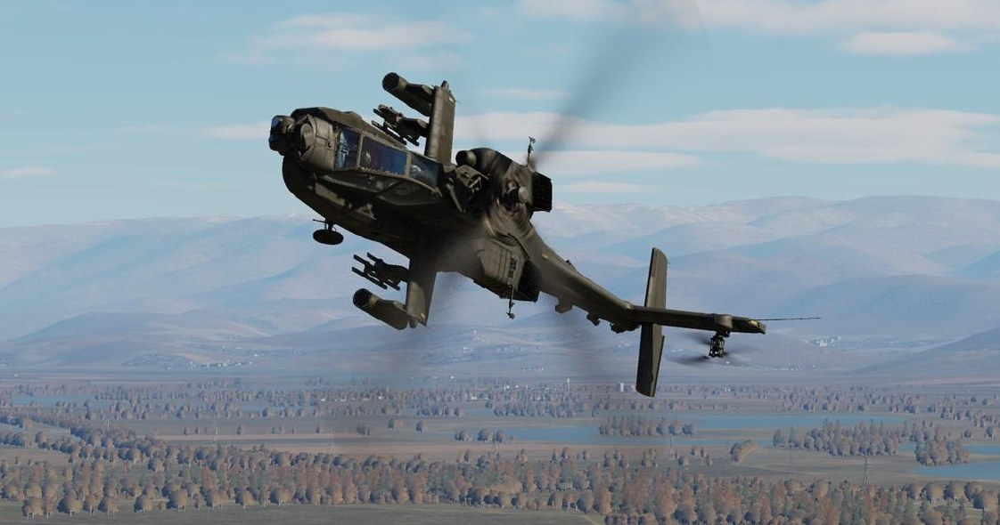
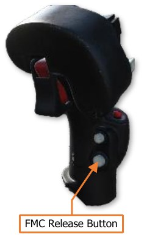
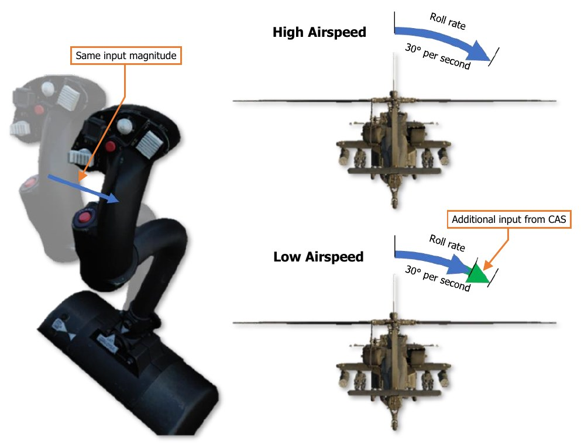
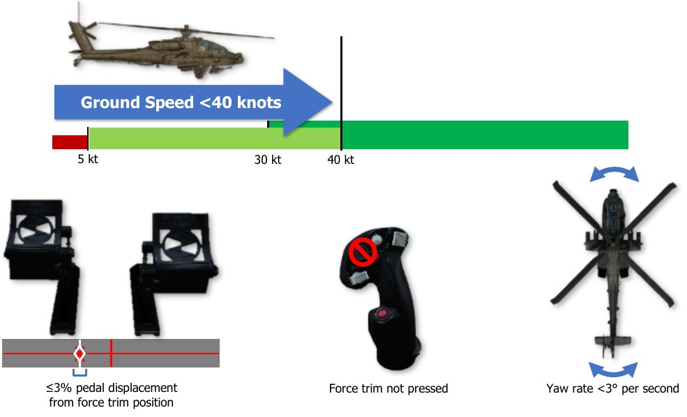
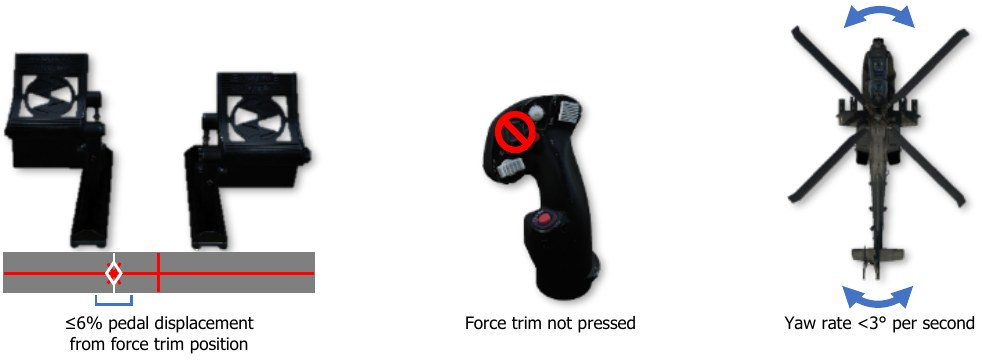
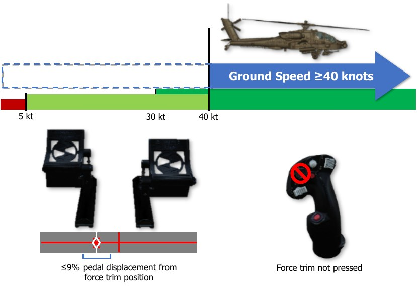
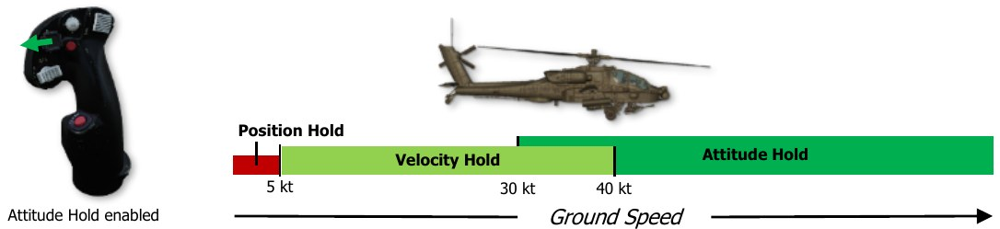
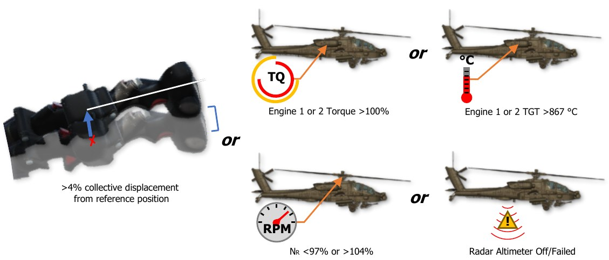
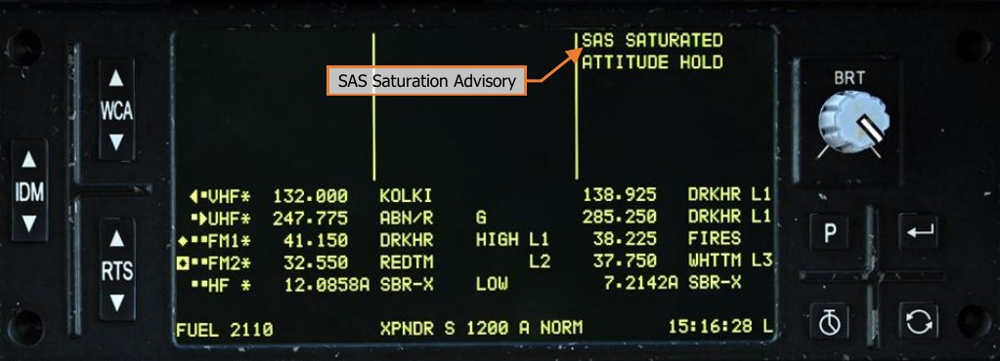

# Flight Management Computer (FMC)

The AH-64D incorporates a Flight Management Computer (FMC) that can electronically command movement to
the flight control servo-actuators for reduced pilot workload and accurate weapons delivery. The FMC also
provides stabilator scheduling based on collective position and longitudinal calibrated airspeed; and Back-Up
Control System (BUCS) functionality in case of jams or severances within the cockpit flight controls.

The FMC’s three primary functions regarding aircraft control are Stability
Augmentation, Command Augmentation, and Hold mode functionality. The Stability
and Command Augmentation Systems (collectively referred to as “SCAS”) are always
active within the FMC channels, however each FMC channel may be individually
enabled/disabled via the Aircraft Utility (UTIL) page. Alternatively, all FMC channels
may be disabled immediately using the FMC Release “pinkie” button on the Cyclic Grip
in either crewstation.

The cyclic, collective, and pedals in each cockpit utilize a collection of sensors called
Linear Variable Differential Transducers (LVDT) to measure the position and
movement of each flight control axis and relay these movements to the FMC. These
movements are used by the FMC to process SCAS commands to the flight controls
during normal operations, or to provide full “fly-by-wire” flight control functions during
an emergency when in BUCS mode.

Each FMC channel corresponds to an individual hydromechanical servo-actuator that manipulates the main or tail
rotor swashplate assemblies; and each of these servo-actuators includes an electronically commanded hydraulic
valve. This valve can be commanded by the FMC to initiate movement of the servo-actuator control linkage to
the swashplate independently of, or in conjunction with, direct mechanical inputs from the flight controls within
the crewstations. The component within each servo-actuator that initiates these control movements is referred
to as the “SAS sleeve”, and each possesses a limited range of motion to provide SCAS and hold mode functionality
(±10% authority in all axes except the pitch axis, which is +20% forward and -10% aft authority).

The FMC commands the flight control servo-actuators based on the following:

- Flight control inputs as reported through the Linear Variable Differential Transducers (LVDT)

- Aircraft rate information from the EGI’s

- Helicopter Air Data System (HADS)

- Radar altimeter

- Pitot and static port pressure sensors

The FMC can only command movement to the servo-actuators via the SAS sleeves through the Primary hydraulic
system. Therefore, if the Primary hydraulic system fails or loses pressure, the aircraft can still be flown using the
Utility hydraulic system, but without the stability and augmentation the FMC provides; nor will hold modes or
BUCS be available.

When flying from the cockpit, the Controls Indicator may be displayed by pressing [[RCtrl + Enter]] to view a
visual representation of the flight control positions and their behavior, as commanded by the FMC. (See the DCS
Fundamentals chapter for more information.)

### Stability Augmentation System

The Stability Augmentation System (SAS) function of the FMC provides a stable aircraft for reduced pilot workload
and increased weapons delivery accuracy. SAS is active in each FMC control axis that is enabled via the Utility
(UTIL) page any time the force trim release on the Cyclic Grip is not pressed. SAS inputs are limited by the
authority of the SAS sleeves within each flight control servo-actuator (±10% authority in all axes except the pitch
axis, which is +20% forward and -10% aft authority).

When necessary, the FMC commands movement of the SAS sleeves within the applicable flight control servo-
actuator(s) to provide the following:

- Yaw rate damping <40 knots ground speed. When accelerating, yaw rate damping will be present until
      ground speed is ≥40 knots. When decelerating from ground speeds ≥40 knots, yaw rate damping
      won’t return until ground speed is <30 knots.

- Turn coordination ≥40 knots ground speed. When decelerating from ground speeds ≥40 knots, turn
      coordination will be present until ground speed is <30 knots. When accelerating, turn coordination
      won’t return until ground speed is ≥40 knots.

- Lateral (roll) and Longitudinal (pitch) rate damping at all speeds.

    - Atmospheric upset damping.

Rate damping minimizes attitude oscillations within the respective pitch, roll and yaw axes, but will not prevent
attitude drift from the force trimmed positions of the flight controls. Atmospheric upset damping reduces the
effect of atmospheric disturbances (such as turbulence) from affecting the aircraft's flight path.
The EGI inertial measurements provide airframe movements/rates to the FMC, which compares the EGI data to
the flight control LVDTs. If there are no changes in the flight control positions, the FMC commands the respective
servo-actuator SAS sleeves to counter the un-commanded movements.

### Command Augmentation System

The Command Augmentation System (CAS) function of the FMC provides an immediate and uniform aircraft
response at all longitudinal airspeeds. CAS is active in each FMC control axis that is enabled via the Utility (UTIL)
page. CAS input limitations are the same as SAS (±10% authority in all axes except the pitch axis, which is +20%
forward and -10% aft authority).

When a control input is made, the FMC detects the flight control movement in the respective LVDT axis (or axes)
and will command movement of the SAS sleeve within the applicable flight control servo-actuator(s). This provides
a “power steering” response to remove the lag effect of mechanical inputs into the flight control servo-actuators.
At lower longitudinal airspeeds, the amount of CAS input is proportionally increased to ensure the aircraft handling
remains consistent with flight at higher airspeeds.

CAS is disabled in the FMC Yaw channel when the aircraft is on the ground (determined by the weight-on-wheels
or “squat” switch). This prevents over-steering during ground taxi.

CAS is disabled in the FMC Yaw channel when the aircraft is on the ground (determined by the weight-on-wheels
or “squat” switch). This prevents over-steering during ground taxi.

### Force Trim & “Breakout” Values

The Cyclic Grip includes the Force Trim/Hold Mode switch. When this
4-way switch is pressed to the forward R (Release) position, the force
trim magnetic brakes on the cyclic and pedals are released. This
position is analogous to pressing the “force trim interrupt” button in
other helicopters. The force trim release in the AH-64D serves three
purposes in flight:

- Disengages the magnetic brakes of the force trim system
      on the cyclic and pedals.

- Temporarily disengages any active hold modes that are
      currently engaged in the pitch, roll, and yaw axes and
      (while pressed) allows the SAS sleeves to re-center within
      the respective servo-actuators.

- Sets new reference values of pitch, roll, heading, sideslip,
      velocity, or position; depending on what Attitude Hold
      modes/sub-modes are active at any given time.

When the Force Trim/Hold Mode switch is pressed to the left AT position, Attitude Hold is enabled, and will enter
one of three sub-modes based on current ground speed (see Attitude Hold for more information). A subsequent
press to the right AL position will disable the Attitude Hold.

When the Force Trim/Hold Mode switch is pressed to the right AL position, Altitude Hold is enabled (if within
vertical speed parameters), and will enter one of two sub-modes based on current ground speed and altitude
above ground level (see Altitude Hold for more information). A subsequent press to the left AT position will disable
the Attitude Hold.

When the Force Trim/Hold Mode switch is pressed to the aft D position, Attitude Hold and Altitude Hold modes
will be disabled.

Any time the force trim release is pressed, Attitude Hold (if enabled) and Heading Hold (always enabled) will be
temporarily disengaged. When the force trim release is no longer pressed, these hold modes will attempt to re-
engage and “capture” new reference values to hold, based on the sub-mode within which they are operating.
Even if the force trim release is not pressed, a “breakout” value within each flight control axis of the cyclic and
pedals allows the pilot to “fly through” the hold modes. These breakout values do not disable the hold modes
altogether but will temporarily disengage their function, and the SAS sleeves in the corresponding flight control
servo-actuators will no longer hold the commanded reference value(s) until the conditions for hold mode re-
engagement are met.

### Hold Modes

The hold modes are designed to provide limited hands-off flight and decrease pilot workload. Like the SAS and
CAS functions of the FMC, the hold modes utilize the same SAS sleeves within the servo-actuators to affect the
aircraft flight controls. As such, they are subject to the same limited control authorities (±10% in roll, yaw and
collective; +20% and -10% in pitch) and are not autopilot functions.

To best utilize the FMC hold mode functionality, the pilot should first fly the aircraft to a stable, force-trimmed
state. Once the aircraft is set at the desired flight condition, engage the desired hold mode(s).
Although there are only two Hold mode selections that can be made by the pilot (enabling/disabling the Attitude
Hold or the Altitude Hold), the Hold modes themselves include multiple sub-modes within each flight control axis
that are contextually selected by the FMC based on the specific flight conditions within which the aircraft is being
operated. As a whole, this can be considered a “task”-based approach to sub-mode selection, in which the FMC
selects the best sub-modes in the applicable flight control axes to achieve the level of flight control assistance
requested by the pilot. This is distinct from manual selection of hold sub-modes, which would require additional
interaction by the pilot to manage the hold modes themselves as flight conditions changed, counter to the original
purpose of reducing pilot workload.

Each sub-mode within the corresponding flight control axis is mutually exclusive, meaning that only one sub-
mode can be active within a flight control axis at any given time. The applicable hold sub-modes within each FMC
axis are shown below.

Attitude (AT) Hold sub-modes           |  Heading Hold sub-modes                  | Altitude Hold (AL) sub-modes
---------------------------------------|------------------------------------------|-----------------------------
Pitch and Roll axes:                   |  Yaw axis only:                          | Collective axis only:
- Attitude Hold                        | - Heading Hold                           | -   Barometric Altitude Hold
- Velocity Hold                        | - Turn Coordination                      | -   Radar Altitude Hold
- Position Hold                        |   (SAS function) |

Heading Hold is distinct in that it is always active and cannot be enabled/disabled independently of the yaw axis
itself. In addition, Turn Coordination, although it is a SAS function and not a hold sub-mode, is always enabled
along with Heading Hold, and will be referenced in the following sections. However, like the sub-modes in the
other axes, Heading Hold and Turn Coordination are mutually exclusive and are automatically selected by the
FMC based on flight conditions.

With regard to sub-mode selection, the pilot should not adjust the flight conditions to force the FMC to utilize one
hold mode over the other. Rather, the pilot should understand the unique flight control requirements that exist
under various flight conditions which lead to the FMC’s logic in selecting the most appropriate sub-mode that
should be utilized at any given time. The pilot only needs to enable hold mode assistance using the Force
Trim/Hold Mode switch, and the appropriate hold sub-mode will assist the pilot in performing the current task,
provided the force trim is not being depressed and the flight controls are within their respective breakout values.

As an example of this concept, the Attitude Hold will enter one of its three sub-modes based on the ground speed
of the aircraft.

- If the aircraft is ≤5 knots ground speed, the FMC will select Position Hold. The FMC will attempt to hold a
     hover over a fixed position on the ground since such a flight condition would most likely only exist if the
     pilot was attempting to do so.

- If the aircraft is >5 knots but <40 knots ground speed, the FMC will select Velocity Hold sub-mode. In this
     instance, the FMC will attempt to maintain the current velocity and direction across the surface since such
     a flight condition would most likely only exist if the pilot was attempting to perform low-speed flight at a
     constant speed and direction (possibly even sideways or backwards) between battle positions or when
     maneuvering near obstacles at low altitude.
     As a helicopter’s attitude directly affects its velocity and direction, maintaining a constant attitude will result
     in a constant velocity and direction; however, when operating at speeds below 40 knots the main rotor wash
     and flight direction may produce different airflow effects across different portions of the airframe, which
     may be exacerbated by local surface winds. As a result of these influences and flight maneuver requirements,
     the FMC uses the velocity and direction as its reference instead of simply the pitch/bank attitude.

- If the aircraft is ≥40 knots ground speed, the FMC will select Attitude Hold sub-mode. When performing
     flight above 40 knots, the pilot is most likely performing forward “cruise” flight since sideways flight with
     excessive sideslip at such speeds would be quite hazardous for safe aircraft operation. As such, the FMC will
     attempt to maintain the pitch and roll attitudes to maintain the cruise flight condition.
     If in a turn, the FMC will maintain the current bank angle to continue the turn. If the bank angle is <3°, the
     FMC assumes the pilot intends to maintain level flight and will auto-level the aircraft to 0° bank angle. The
     pitch angle will also be maintained by the FMC, which in turn will maintain the aircraft velocity since a
     helicopter’s pitch attitude directly affects its velocity in forward flight, but is not subject to the same airflow
     disturbances when compared to low speeds.

When Attitude Hold is enabled, a box will be placed around the airspeed indicator in the HDU Flight symbology
and on the FLT page; and the “ATTITUDE HOLD” advisory will be displayed on the EUFD.

When Altitude Hold is enabled, a “home plate” box will be placed around the VSI indicator in the HDU Flight
symbology and on the FLT page; and either the “RAD ALT HOLD” or the “BAR ALT HOLD” advisory will be
displayed on the EUFD, depending on what Altitude Hold sub-mode is entered.

Any time the Attitude Hold or Altitude Hold are disabled using the Force Trim/Hold Mode switch, the hold mode
indicators within the HMD symbology and on the FLT page will flash and an audio tone will alert the crew that a
hold mode has been deactivated.

#### Heading Hold & Turn Coordination Sub-modes

The FMC Yaw channel operates within two SAS sub-modes: Yaw Damping and Turn Coordination. Either of these
sub-modes are enabled any time FMC Yaw channel is turned on, depending on the measured ground speed of
the aircraft. In addition, the FMC Yaw channel may also operate in a Heading Hold mode. None of these modes
may be disabled; however, condition-based logic will determine within which sub-mode the Yaw channel is
operating, and whether that sub-mode is engaged or disengaged from affecting the flight control servo-actuators
at any given time.

The primary condition that determines which sub-mode is enabled is the helicopter’s ground speed, and in
addition whether Attitude Hold is enabled. If the ground speed is <40 knots, Heading Hold or Yaw Damping sub-
mode is enabled. If the ground speed is ≥40 knots, Turn Coordination is enabled. If the ground speed is ≥40
knots and Attitude Hold is enabled, the sub-mode may switch between Heading Hold and Turn Coordination,
based on criteria described below.

The “breakout values” within the Yaw channel become incrementally larger with forward speed. The purpose
behind this is to desensitize the pedals to prevent disengaging the Heading Hold during cruise flight.

##### Heading Hold

Heading Hold assists the pilot in maintaining the magnetic heading reference. If the force trim release is pressed,
Heading Hold is disengaged and the FMC Yaw channel will only provide command augmentation. When the pilot
stops pressing the force trim release and the parameters for Heading Hold engagement are met, the FMC will
update the Heading Hold reference to the current magnetic heading and engage Heading Hold.

If Attitude Hold is disabled, Heading Hold will engage when all of the following conditions are true:

- One second has elapsed since Heading Hold was disengaged

- The helicopter is off the weight-on-wheels (“squat”) switch

- Ground speed <40 knots

- Pedal displacement ≤3% in yaw axis from the force trim reference position

- Force trim is not pressed

- Yaw rate <3° per second

If Attitude Hold is enabled in Position or Velocity sub-modes, Heading Hold will engage when all of the
following conditions are true:

- Pedal displacement ≤3% in yaw axis from the force trim reference position in Position Hold sub-mode
      or ≤6% in yaw axis from the force trim reference position in Velocity Hold sub-mode

- Force trim is not pressed

- Yaw rate <3° per second

Heading Hold will engage under certain conditions if Attitude Hold is enabled and in Attitude Hold sub-mode, but
this logic is inter-woven along with Turn Coordination and is described below.

##### Turn Coordination Sub-mode

Turn Coordination sub-mode assists the pilot in maintaining the sideslip angle, and is a function of roll attitude,
airspeed, and sideslip. Sideslip angle is a derived quantity based on inertial velocity as opposed to air data. This
method of determining sideslip angle provides more stable and reliable sideslip information than can be obtained
from an air data sensor. If the force trim release switch is pressed, Turn Coordination is disengaged, and the
FMC Yaw channel will only provide command augmentation and rate damping. When the pilot stops pressing the
force trim release switch, the FMC will update the Turn Coordination sideslip angle reference to the current trim
ball position.

If Attitude Hold is disabled, Turn Coordination will engage when all of the following conditions are true:

- Ground speed ≥40 knots

- Pedal displacement ≤9% in yaw axis from the force trim reference position

- Force trim is not pressed

If Attitude Hold is enabled with ground speed ≥40 knots, Turn Coordination will switch to Heading Hold when
all of the following conditions are true:

- Pedal displacement ≤9% in yaw axis from the force trim reference position

- Cyclic displacement ≤2.25% in roll axis from the force trim position

- Roll (bank) angle is ≤3° from level attitude

- Force trim is not pressed

If Attitude Hold is enabled with ground speed ≥40 knots, Heading Hold will revert to Turn Coordination if any
of the following conditions are true:

-  Pedal displacement >9% in yaw axis from the force trim reference position

-  Cyclic displacement >2.25% in roll axis from the force trim position

-  Roll (bank) angle is >7° from level attitude

-  Force Trim is pressed

#### Attitude Hold & Position/Velocity Hold Sub-modes

The FMC Pitch and Roll channels operate with Attitude Hold and two additional sub-modes: Position Hold and
Velocity Hold. Only one of these three sub-modes can be activated at any given time, only when the Attitude
Hold is activated using the Force Trim/Hold Mode switch when pressed to the Left/AT position, and only when
the FMC Pitch and Roll channels are turned on. Condition-based logic will determine which sub-mode the
Pitch/Roll channels are using, and whether that sub-mode is engaged or disengaged from affecting the flight
control servo-actuators at any given time.

The condition that determines which Attitude Hold sub-mode the Pitch/Roll channels operate within is the
helicopter’s ground speed. If the ground speed is ≤5 knots, Position Hold sub-mode is activated. If the ground
speed is >5 knots but <40 knots, Velocity Hold sub-mode is activated. If ground speed is ≥40 knots, Attitude
Hold sub-mode will be activated.

Attitude Hold may be activated while still on the ground, however it will not engage in any sub-mode until the
helicopter is off the weight-on-wheels (“squat”) switch.

##### Position Hold Sub-mode

When Position Hold sub-mode is engaged, the FMC will use velocities provided by the EGI to approximate and
maintain its position. If the pilot presses the force trim, or displaces the cyclic beyond the breakout values in
pitch or roll (2.5% in the pitch axis or 2.25% in the roll axis) without pressing the force trim, Position Hold will
disengage and the SAS will revert to rate damping only. Once the cyclic is returned within the breakout values
and the force trim is no longer pressed, the aircraft’s current position will be captured as the new reference
position, Position Hold will re-engage, and the FMC will command SAS sleeve inputs into the Pitch and Roll servo-
actuators to maintain the aircraft over the reference position.

To re-position the helicopter and set a new position reference, the pilot should press and hold the force trim
release switch, translate the helicopter to the desired location, and then stop pressing the force trim release
switch when a stable hover has been established. Pressing the force trim release switch is not necessary if the
cyclic position exceeds the breakout values, however pressing and holding the force trim will allow the SAS
sleeves to center themselves within their respective axes, ensuring maximum authority in each direction when
Position Hold is re-engaged. If the pilot accelerates the aircraft above 5 knots ground speed and then returns the
cyclic within the breakout values and stops pressing the force trim, Velocity Hold sub-mode will be entered.
Since Position Hold is only engaged when ground speed is ≤5 knots while the force trim release switch is not
pressed, Heading Hold will also be active in the FMC Yaw axis while operating in this sub-mode. However, if the
pedals are displaced ≥3% from the force trim reference position, Heading Hold will disengage and will only re-
engage given the conditions listed in the Heading Hold & Turn Coordination Sub-modes description.

##### Velocity Hold Sub-mode

When Velocity Hold sub-mode is engaged, the FMC will use inertial velocities provided by the EGI to maintain a
2-dimensional velocity and in the horizontal plane. If the pilot presses the force trim, or displaces the cyclic
beyond the breakout values in pitch or roll (2.5% in the pitch axis or 2.25% in the roll axis) without pressing the
force trim, Velocity Hold will disengage and the SAS will revert to rate damping only. Once the cyclic is returned
within the breakout values and the force trim is no longer pressed, the aircraft’s current velocity and vector will
be captured as the new reference velocity, Velocity Hold will re-engage, and the FMC will command SAS sleeve
inputs into the Pitch and Roll servo-actuators to maintain the current velocity and relative direction over the
ground.

To establish a new velocity and/or vector reference, the pilot should press and hold the force trim release switch,
adjust the flight controls to attain the desired velocity and vector, and then stop pressing the force trim release
switch when a stable flight condition has been established. Pressing the force trim release switch is not necessary
if the cyclic position exceeds the breakout values, however pressing and holding the force trim will allow the SAS
sleeves to center themselves within their respective axes, ensuring maximum authority in each direction when
Velocity Hold is re-engaged. If the pilot accelerates the aircraft to 40 knots ground speed or greater and then
returns the cyclic within the breakout values and stops pressing the force trim, Attitude Hold sub-mode will be
entered. If the pilot decelerates the aircraft to 5 knots ground speed or less and then returns the cyclic within
the breakout values and stops pressing the force trim, Position Hold sub-mode will be entered.

Since Velocity Hold is only engaged when ground speed is >5 knots and <40 knots while the force trim release
switch is not pressed, Heading Hold will also be active in the FMC Yaw axis while operating in this sub-mode.
However, if pedals are displaced ≥6% from the force trim reference position, Heading Hold will disengage and
will only re-engage given the conditions listed in the Heading Hold & Turn Coordination Sub-modes description.

##### Attitude Hold

When Attitude Hold sub-mode is engaged, the FMC will use rates and attitudes provided by the EGI to maintain
a pitch and roll attitude. If the pilot presses the force trim, or displaces the cyclic beyond the breakout values in
pitch or roll (2.5% in the pitch axis or 2.25% in the roll axis) without pressing the force trim, Attitude Hold will
disengage and the SAS will revert to rate damping only. However, unlike Position or Velocity Hold submodes,
Attitude Hold will only disengage in the respective axis in which a breakout value has been exceeded.

As an example, if the pilot displaces the cyclic >2.25% in the Roll axis only, the FMC will disengage Attitude Hold
in the Roll servo-actuator only, but still provide SAS rate damping functions for that actuator. The FMC will
continue to maintain the referenced pitch attitude by commanding movement to the SAS sleeve within the Pitch
servo-actuator. Once the cyclic is returned within the breakout values, the aircraft’s current pitch and/or roll
attitude will be captured as the new reference attitude, Attitude Hold will re-engage in the respective axis, and
the FMC will command SAS sleeve inputs into the Pitch and Roll servo-actuators to maintain the current pitch and
roll attitude. However, if the roll reference is <3° from a level roll attitude, the bank angle will be commanded to
0° and the aircraft will auto-level.

This axis-specific breakout logic allows a pilot to adjust the airspeed or bank angle without disengaging the other
axis being commanded by the FMC in Attitude Hold sub-mode, or by pressing the force trim. This can be
convenient for flying an orbit or navigating a route at cruise speeds.

To establish a new attitude reference, the pilot should press and hold the force trim release switch, adjust the
flight controls to attain the desired attitude, and then stop pressing the force trim release switch when a stable
flight condition has been established. Pressing the force trim release switch is not necessary if the cyclic position
exceeds the breakout values, however pressing and holding the force trim will allow the SAS sleeves to center
themselves within their respective axes, ensuring maximum authority in each direction when Attitude Hold is re-
engaged.

If the ground speed decreases below 40 knots but remains above 30 knots, and the pilot does not displace the
cyclic beyond its breakout values nor press the force trim, Attitude Hold will be maintained and will not enter
Velocity Hold sub-mode.

However, if the pilot displaces the cyclic beyond its breakout values and then returns the cyclic within the breakout
values while still below 40 knots ground speed, Velocity Hold sub-mode will be entered. Likewise, if the ground
speed decreases below 40 knots but above 30 knots and the pilot presses the force trim prior to accelerating
back to 40 knots ground speed or greater, Velocity Hold will be entered.

If the ground speed decreases below 30 knots ground speed, Velocity Hold will be entered regardless of
whether the pilot has displaced the cyclic beyond its breakout values or pressed the force trim.

Heading Hold or Turn Coordination will also be active in the FMC Yaw axis while operating in Attitude Hold sub-
mode, subject to the logic described in the Heading Hold & Turn Coordination Sub-modes description.

Attitude Hold will engage when all the following conditions are true:

-  The helicopter is off the weight-on-wheels (“squat”) switch

-  Cyclic displacement ≤2.25% in roll and ≤2.5% in pitch from the force trim reference position

-  Roll attitude <±60° and Pitch attitude <±30°

-  Pitch and Roll rates <5° per second (Attitude Hold sub-mode only)

-  Force trim is not pressed

#### Altitude Hold Modes

{align=right} The FMC Collective channel operates within two hold sub-modes: Radar Altitude Hold and
Barometric Altitude Hold. Only one of these sub-modes can be engaged at any given time,
and only when the Altitude Hold is activated using the Force Trim/Hold Mode switch when
pressed to the Right/AL position, and only when the FMC Collective channel is turned on.
Condition-based logic will determine which sub-mode the Collective channel is using, and
whether that sub-mode is engaged or disengaged from affecting the flight control servo-
actuators at any given time.

The conditions that primarily determine which Altitude Hold sub-mode the Collective channel
operates within is the helicopter’s ground speed and the radar altimeter. If the ground speed
is <40 knots and the radar altitude is ≤1,428 feet AGL, Radar Altitude Hold sub-mode will
be activated. If the ground speed is ≥ 40 knots or the radar altitude is >1,428 feet AGL,
Barometric Altitude Hold sub-mode is activated. Additional logic governing the activation or de-activation of these
sub-modes are listed below.

##### Radar Altitude Hold Sub-Mode

Radar Altitude Hold is not a terrain following mode. It provides distance from the ground directly below the
aircraft and does not provide any approaching terrain variation information.

Radar Altitude Hold may only be engaged when all of the following conditions are true:

-  Ground speed <40 knots

-  Altitude is ≤1,428 feet above ground level (AGL)

-  Vertical velocity is ≤100 feet per minute

-  The radar altimeter is powered on and operational

Radar Altitude Hold is automatically disengaged when any of the following conditions are true:

-  Pilot displaces the collective >4% from the reference position (collective position at the time Radar
       Altitude Hold mode is activated)

-  Either engine torque (TQ) >100%

-  Either engine Turbine Gas Temperature (TGT) >867° C

-  Rotor speed (NR) is <97% or >104%

-  The radar altimeter is turned off or has failed

##### Barometric Altitude Hold Sub-Mode

Barometric Altitude Hold can only be activated when both of the following conditions are true:

-  If conditions for Radar Altitude Hold sub-mode activation cannot be met

-  Vertical velocity is within the limits below as determined by aircraft ground speed:
    - If ground speed is <40 knots, vertical velocity is ≤200 feet per minute
    - From 40 to 160 knots ground speed, the vertical velocity rate limit increases linearly from
                  ±200 feet per minute at 40 knots to ±400 feet per minute at 160 knots. (Example: at 100
                  knots ground speed, the vertical velocity rate limit must be ≤300 feet per minute)

Barometric Altitude Hold is automatically disengaged when any of the following conditions are true:

- Pilot displaces the collective >4% from the reference position (collective position at the time Radar
      Altitude Hold mode is activated)

- Either engine torque (TQ) >100%

- Either engine Turbine Gas Temperature (TGT) >867° C

- Rotor speed (NR) is <97% or >104%

### Flight Control Advisories

Since the SAS sleeve within each servo-actuator possesses a limited authority to affect the flight controls (±10%
authority in all axes except the pitch axis, which is +20% forward and -10% aft authority), if a hold mode is
engaged and the SAS sleeve has reached the limit of its authority, the SAS sleeve is described as “saturated”. If
the saturation condition persists, the FMC’s ability to maintain the reference values of pitch, roll, heading, sideslip,
velocity, or position will be degraded. Any time one or more servo-actuator has become saturated, a brief Flight
Control audio tone will be heard and an advisory will be displayed on the EUFD to alert the crew.

The Flight Control audio tone will sound with an associated EUFD advisory when the criteria listed below is met
for each respective sub-mode:

- If in Attitude Hold sub-mode, the SAS SATURATED advisory will be presented to the crew after 90 seconds
     of continuous saturation within the Pitch, Roll or Collective axes or 10 seconds of continuous saturation
     within the Yaw axis.
- If in Velocity Hold sub-mode, the SAS SATURATED advisory will be presented to the crew after 2 seconds
     of continuous saturation within the Pitch, Roll or Collective axes or 7 seconds of continuous saturation within
     the Yaw axis.
- If in Position Hold sub-mode, the SAS SATURATED advisory will be presented to the crew after 1 second of
     continuous saturation within the Pitch, Roll or Collective axes or 5 seconds of continuous saturation within
     the Yaw axis.
- If in Position Hold sub-mode, the HOVER DRIFT advisory will be presented to the crew if the aircraft drifts
     greater than 48 feet (one rotor diameter) from the reference position.
- If in Barometric Altitude Hold, the ALTITUDE DRIFT advisory will be presented to the crew if the aircraft
     drifts greater than ±100 feet from the reference altitude.
- If in Radar Altitude Hold, the ALTITUDE DRIFT advisory will be presented to the crew if the aircraft drifts
     greater than ±5 feet from the reference altitude at 10 feet, increasing to ±100 feet at 1,400 feet altitude.

When the pilot presses the force trim release (which also interrupts any hold modes that are enabled in the FMC
Pitch, Roll and/or Yaw channels), the SAS sleeves within the Pitch, Roll, and Yaw servo-actuators will return to
center within 3 to 5 seconds. While the SAS sleeve is moving to center, it will continue to provide command
augmentation to ensure an immediate and uniform flight control response.

During sideward flight or hovering flight with high crosswinds without the force trim pressed, a SAS SATURATED
advisory and Flight Control audio tone may be presented to the crew. Under these conditions, the relative wind
from sideward flight or high crosswinds will apply force to the vertical tail, creating a weathervane effect in which
the nose will turn into the wind. The FMC will attempt to compensate for this weathervane effect while in Heading
Hold sub-mode, which may result in saturation of the SAS sleeve within the Yaw servo-actuator.

{!abbr.md!}
{!dev-docs/ah64d/abbr.md!}
{!docs/ah64d/abbr.md!}
