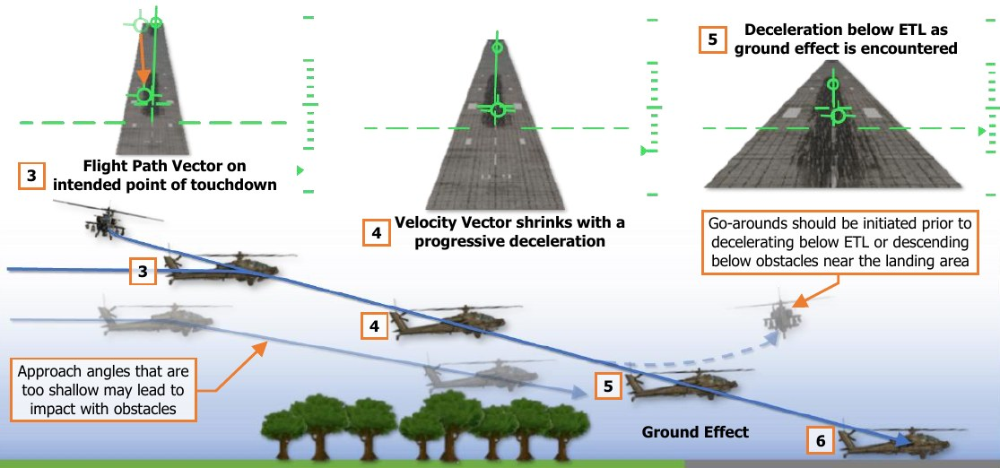
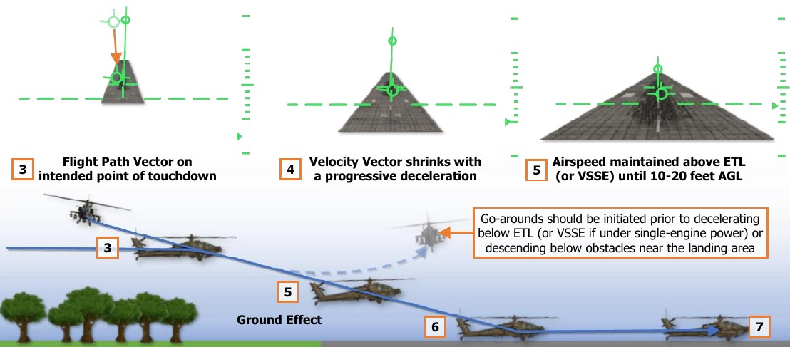

# Landing

Several different types of landing maneuvers may be performed, depending on the nature of the landing area,
obstacles near the landing area, and the power margins available. When possible, the crew should perform an
approach that ensures the maximum amount of excess power is available for performing a go-around while
maintaining a safe distance from any potential hazards to the aircraft, such as vertical hazards or structures.

**VMC Approach.** A VMC Approach is normally performed when sufficient power margins allow for normal
approach angles and deceleration prior to arriving over the intended point of touchdown. Variations in the
execution of the VMC Approach are based on the nature of the landing area, obstacles around the landing area,
and the whether the aircraft has the power margins to hover out of ground effect (OGE).

**Roll-on Landing.** A Roll-on Landing may be performed when insufficient power exists to perform a normal VMC
Approach. In such a scenario when the aircraft hover performance is calculated to be near its maximum dual-
engine torque available (MAX Q – DE) or its dual-engine transmission limit (100% TQ), and a suitable landing
area such as a runway, a road, or other improved surface is available, this landing maneuver is performed.

## Before Landing

Prior to landing, perform the following:

1.   [[**PLT & CPG**]]   Weapons systems – Check the following:

    -  A/S button – “SAFE” light is illuminated. (see Armament Panel for more information.)

    -  GND ORIDE button – Off; “ON” light is not illuminated. (see Armament Panel for more information.)

    -  Weapons not actioned – Verify. (see HMD High Action Display for more information.)

2.   [[**PLT / CPG**]]   ASE – As required.
3.   [[**PLT / CPG**]]   TAIL WHEEL button – Verify locked; “UNLOCK” light is not illuminated.
4.   [[**PLT**]]   PARK BRAKE – Ensure brakes are released, PARK BRAKE handle is inward.

## VMC Approach

A VMC Approach may be performed to the ground or to a stationary hover. When performing the maneuver to
the ground, the maneuver is typically performed in the following manner:

1.     Select Transition symbology mode (Symbology Select switch – Forward) and place the LOS
       Reticle on the intended point of touchdown. (see IHADSS Flight Symbology for more
       information.)
2.     Press and hold the force trim (Force Trim/Hold Mode switch – Forward).
3.     When the desired approach angle is intercepted (whether on final or while still in a base
       turn toward the landing area), decrease the collective so that the Flight Path Vector (FPV)
       is aligned with the intended point of touchdown when on the final approach course. Apply
       aft cyclic to initiate a deceleration at a rate appropriate for the remaining distance to
       touchdown. Adjust the pedals to maintain the aircraft “in trim”. (“Trim ball” centered on the
       Skid/Slip Indicator).
       
    !!! note
        Steep approach angles should only be utilized if adequate power is available to maintain a slow rate
        of descent, or if the aircraft performance is such that a hover out of ground effect (OGE) may be performed.

4.     Use left/right cyclic inputs to maintain the desired ground track. Use forward/aft cyclic inputs to progressively
       decelerate so that the Velocity Vector arrives at the center of the LOS Reticle as the aircraft arrives at the
       intended point of touchdown, effectively reaching zero forward velocity as the aircraft touches down.
5.     As the aircraft descends below 50 feet AGL or below the obstacles surrounding the landing area, adjust the
       pedals to align the aircraft with the landing direction.
6.     Once the aircraft touches down, lower the collective to 27-30% torque and adjust the cyclic to eliminate any
       remaining velocity. Once the aircraft is stationary, neutralize the cyclic and fully lower the collective.

When performing a VMC Approach to a hover, each step is performed in the same manner as an approach to the
ground, except the forward velocity and vertical speed are reduced to zero prior to contact with the ground. A
VMC Approach may be terminated to a hover in ground effect (IGE) or out of ground effect (OGE), but the aircraft
performance must be adequately calculated when terminating to an OGE hover to avoid settling with power.

## Roll-on Landing

A Roll-on Landing is performed when the aircraft’s power margin is insufficient to perform a normal approach
and a suitable landing area such as a runway, a road, or other improved surface is available. The maneuver is
typically performed in the following manner:

1.       Select Transition symbology mode (Symbology Select switch – Forward) and place the LOS
         Reticle on the intended point of touchdown. (see IHADSS Flight Symbology for more
         information.)
2.       Press and hold the force trim (Force Trim/Hold Mode switch – Forward).
3.       When the desired approach angle is intercepted (whether on final or while still in a base
         turn toward the landing area), decrease the collective so that the Flight Path Vector (FPV)
         is aligned with the intended point of touchdown when on the final approach course. Apply
         aft cyclic to initiate a deceleration at a rate appropriate for the remaining distance to
         touchdown. Adjust the pedals to maintain the aircraft “in trim”. (“Trim ball” centered on the
         Skid/Slip Indicator).
4.       Use left/right cyclic inputs to maintain the desired ground track and left/right pedal inputs to maintain the
         aircraft “in trim”. Adjust the cyclic throughout the approach to progressively decelerate so that the aircraft
         remains above ETL (24 knots) until 10-20 feet AGL over the landing area.
         
    !!! note
        If performing an approach under single-engine power, do not decelerate below Velocity Safe Single
        Engine (VSSE) until 10-20 feet AGL over the landing area. (see PERF page for more information.)

5.       As the aircraft descends below 50 feet AGL or below the obstacles surrounding the landing area, adjust the
         pedals to align the aircraft with the landing direction.
6.       If possible, adjust the attitude to ensure the aircraft touches down on all three wheels at once to avoid
         excessive loads on the tail wheel. After touchdown, use left/right cyclic inputs to maintain the ground track
         across the landing surface and left/right pedal inputs to maintain heading.
7.       Lower the collective to a minimum of 30% torque (60% torque if under single-engine power) and apply aft
         cyclic to aerodynamically decelerate, and/or apply wheel brakes. Once the aircraft is stationary, neutralize
         the cyclic and fully lower the collective.

{!abbr.md!}
{!dev-docs/ah64d/abbr.md!}
{!docs/ah64d/abbr.md!}
