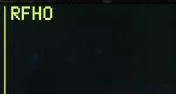

# Radar Target Handovers

Radar-generated targets detected by FCR-equipped AH-64D’s may be transmitted to other AH-64D’s across the
datalink network. Unlike FCR TGT Report datalink messages, which only provide situational awareness or aid in
target acquisition using the receiving aircraft’s own sensors, RF Handover (RFHO) datalink messages may be
used for direct targeting by AGM-114L radar-guided missiles without the receiving aircraft acquiring the target.

RFHO datalink messages may be sent to any AH-64D Primary member(s) within the selected datalink network,
allowing the receiving aircraft to engage the FCR target with RF missiles, rockets, or 30mm gunfire, regardless
of whether the receiving aircraft is equipped with an FCR themselves. However, if received by an AH-64D that is
equipped with an FCR, the RFHO data will replace any target data generated by the receiving aircraft’s own FCR.

## FCR Page RF Handover (RFHO) Selection Menu

Sending an FCR target handover is performed from the RFHO selection menu on the FCR page. This selection
menu is accessed by pressing the RFHO (VAB R4) button and allows crewmembers to send the Next-To-Shoot
(NTS) target to a Primary member within the selected datalink network. The RFHO button is displayed on the
FCR page when the FCR is the crewmember’s selected sight, an NTS target has been designated, and the Datalink
Transmit Select Indicator on the EUFD is set to a radio that has been tuned to a preset with at least one Primary
member within the corresponding datalink network. (See the Fire Control Radar chapter for more information.)

1.      **Next-To-Shoot (NTS) Select.** Advances the NTS and ANTS target designations through the 16 high
        priority targets in a descending order before cycling back to the first target on the list.
        Each time an RFHO is transmitted, the NTS and ANTS designations will automatically sequence to the next
        targets on the High Priority Target List, allowing rapid engagement of the high priority targets by RF missiles
        fired from the ownship and/or other AH-64D’s receiving RFHO messages.

2.      **Next-To-Shoot (NTS) Target.** The NTS target symbol indicates the designated target location to which
        all sighting functions of the FCR are performed, or which target will be transmitted via an RFHO.

3.      **Primary Member Select.** Displays a list of Primary members within the selected datalink network that
        may be selected to receive the RFHO. Each entry within the list is generated from the Callsigns of Primary
        members as displayed on the NET sub-page, truncated to the last three alphanumeric characters. For
        example, “DH08” is displayed as “H08” within the Primary member list on the FCR page.
        If the Datalink Transmit Select Indicator is moved to a radio that has not been tuned to a preset with a
        datalink network, the Primary member list will be closed and the RFHO (VAB R4) option will be removed
        from the FCR page.

4.      **SEND Button.** The SEND button is displayed when a Primary member has been selected to receive the
        current NTS target as an RFHO.

5.      **Send Status Window.** Displays the radio and datalink network over which the report will be transmitted.

## Sending An RF Handover

To send an RFHO, ensure the EUFD Datalink
Transmit Select Indicator is set to the datalink
network over which the transmission is
intended, and then perform the following:

1.   Sight Select switch – FCR, if FCR is not
     the selected sight. (Collective Mission
     Grip or TEDAC Right Handgrip)

    or

    FCR Fixed Action Button – Press, if FCR is
     the selected sight.

2.   NTS (VAB T1) – Select to advance NTS
     designation to desired FCR target for RF
     Handover.

    or

    MPD Cursor Controller/Enter –
     Designate desired FCR target as NTS for
     RF Handover.

3.   RFHO (VAB R4) – Select.
4.   Primary Member (VAB T5, T6, R1-R5) –
     Select as desired.
5.   SEND (VAB R6) – Press.

Once SEND (VAB R6) is pressed, the SEND
text label will be displayed in inverse video as
the transmission is performed to the Primary
member that is selected to receive the RFHO.

When the transmission is complete, the SEND
text label will revert to normal video.

If an acknowledgement of receipt is not
received from any Primary member selected
to receive the RFHO, a “XMIT NAK” advisory will be displayed on the EUFD.

## Receiving An RF Handover

When an RFHO has been received through the datalink, the EUFD will display an “RFHO”
advisory accompanied by an audio ring tone, prompting the aircrew to access the MSG
REC sub-page or the TSD Receive List to store the RFHO message. (See the Weapon
Employment chapter for more information regarding engagement of an RFHO target)

Any time a datalink message intended for
Primary members is received, the aircrew
within the receiving aircraft may store the
contents of the message by selecting the COM
page and then the MSG REC sub-page, or they
may store it directly from the TSD. A white
REC option will be displayed at VAB L2, which
will open the TSD Receive list.

The Receive list will display the four most
recent datalink messages that have not
already been stored (excluding text messages
and mission files). Each entry will include the
type of data that has been sent within the
message, the originator callsign that sent the
message, and the modem protocol through
which it was received.

In the example on this page, an RFHO
message was received from “DH06” through
the DATALINK protocol, indicated by an “L”.

To store an RFHO within the database,
perform the following:

1.   TSD Fixed Action Button – Press.
2.   REC (VAB R2) – Select to display the
     Receive list.
3.   Datalink message (VAB L2-L5) – Select.

    or

    NONE (VAB L6) – Select to close the
     Receive list without storing a message.

{!abbr.md!}
{!dev-docs/ah64d/abbr.md!}
{!docs/ah64d/abbr.md!}
