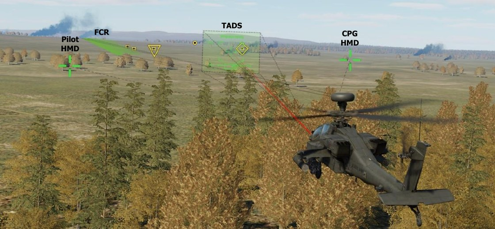

# Sights And Sensors

The AH-64D uses a wide range of sensors to detect, acquire, and engage targets on the battlefield. These sensors
range from the basic “Mark 1 eyeball” to an advanced fire control radar, and each sensor is integrated into the
aircraft’s Data Management System to enhance situational awareness and facilitate rapid engagement of enemy
forces during day or night.

Although the AH-64D is equipped with a multitude of sensors for various purposes (such as the radar altimeter
or Doppler radar velocity sensor that aid in flight operations and navigation), sensors such as the optical cameras
in the nose turret or the mast-mounted fire control radar perform targeting against enemy locations and
equipment. These sensors are grouped within specific sensor arrays called “sights”, which generate targeting
solutions for employment of aircraft weapon systems.

Four sights are available to the AH-64D crew, but only one sight may be used within a crewstation at any given
time. These sights are the Pilot’s Helmet-Mounted Display (HMD), the Copilot’s HMD, the Target Acquisition
Designation Sight (TADS), and the Fire Control Radar (FCR). Each of these sights includes multiple sensors that
may be used individually or cooperatively to employ the weapon system selected by the crewmember; and each
has its own advantages and disadvantages when deciding how and when to engage the enemy.

Each sight and its corresponding sensors are shown below.

HMD (Pilot and CPG)                 | TADS (CPG only)                          | FCR (Pilot or CPG)
------------------------------------|------------------------------------------|----------------------
- Visual Crewmember eyesight             | - FLIR Forward-Looking Infrared          |  -   FCR Fire Control Radar
- NVS Night Vision System (PNVS or TADS) | - DTV Daytime Television                 |  -   RFI Radar Frequency Interferometer
- NVG Night Vision Goggles               | - LRFD Laser Rangefinder/Designator      |
                                         | - LST Laser Spot Tracker                 |

Night vision goggles may aid either crewmember in detecting weapons fire or IR pointers on the battlefield,
but they are not intended to be used for direct targeting when using HMD as a sight. They may be used to direct
the TADS to an area for subsequent targeting or observation. (See Night Vision Goggles for more information.)

#### Helmet-Mounted Display (HMD)

The HMD may be used to rapidly direct weapons toward enemy locations at close range. When selected as the
crewmember’s sight, weapon solutions are generated for the crewmember’s actioned weapon based on the
crewmember’s helmet position and their current range source.

NVS mode may be used in conjunction with the HMD to augment the crew’s ability to engage targets at night.

(See the Helmet-Mounted Display chapter for more information.)

#### Target Acquisition Designation Sight (TADS)

The TADS uses a combination of electro-optical sensors in the visible and infrared spectrums to detect and
target enemy forces at long range or perform reconnaissance during day or night. When selected as the
Copilot/Gunner’s sight, weapon solutions are generated for the CPG’s actioned weapon based on the TADS turret
position and the CPG’s current range source.

(See the Target Acquisition Designation Sight chapter for more information.)

#### Fire Control Radar (FCR)

The FCR mast-mounted assembly consists of an active radar antenna to rapidly scan large areas of the battlefield
(or the airspace above it) and a passive radar detection antenna array to target radar-emitting air defense
systems. When selected as the crewmember’s sight, weapon solutions are generated for the crewmember’s
actioned weapon based on the location of the Next-To-Shoot (NTS) target on the FCR page.
(See the Fire Control Radar chapter for more information)

### Sight Selection Logic

Sight selection logic is outlined below.

- Both crewmembers may select their respective HMD as their sight at any time since each crewmember’s
     helmet position is tracked independently of the other; but they cannot select the opposite crewmember’s
     HMD as their sight.

- Only the CPG may select TADS as a sight, however either crewmember may utilize TADS as their selected
     NVS sensor. (See Night Vision System for more information.)

- Either crewmember may select FCR as their sight, however only one crewmember may do so at any given
     time. If the CPG’s selected sight is FCR and the Pilot selects FCR, the CPG’s sight will automatically be set
 to HMD and any actioned weapon in the CPG crewstation will be de-actioned. If the Pilot’s selected sight is
 FCR and the CPG selects FCR, the Pilot’s sight will automatically be set to HMD and any actioned weapon in
 the Pilot crewstation will be de-actioned.

- The TADS may be linked to the FCR Next-To-Shoot (NTS) target. If the Pilot’s selected sight is FCR and the
 CPG’s selected sight is TADS, when the Pilot links the TADS to the FCR the CPG’s sight will automatically be
 set to HMD and any actioned weapon in the CPG crewstation will be de-actioned.

- The FCR may be linked to the TADS line-of-sight. If the CPG’s selected sight is TADS and the Pilot’s selected
 sight is FCR, when the CPG links the FCR to the TADS the Pilot’s sight will automatically be set to HMD, and
 any actioned weapon in the Pilot crewstation will be de-actioned.

{!abbr.md!}
{!dev-docs/ah64d/abbr.md!}
{!docs/ah64d/abbr.md!}
