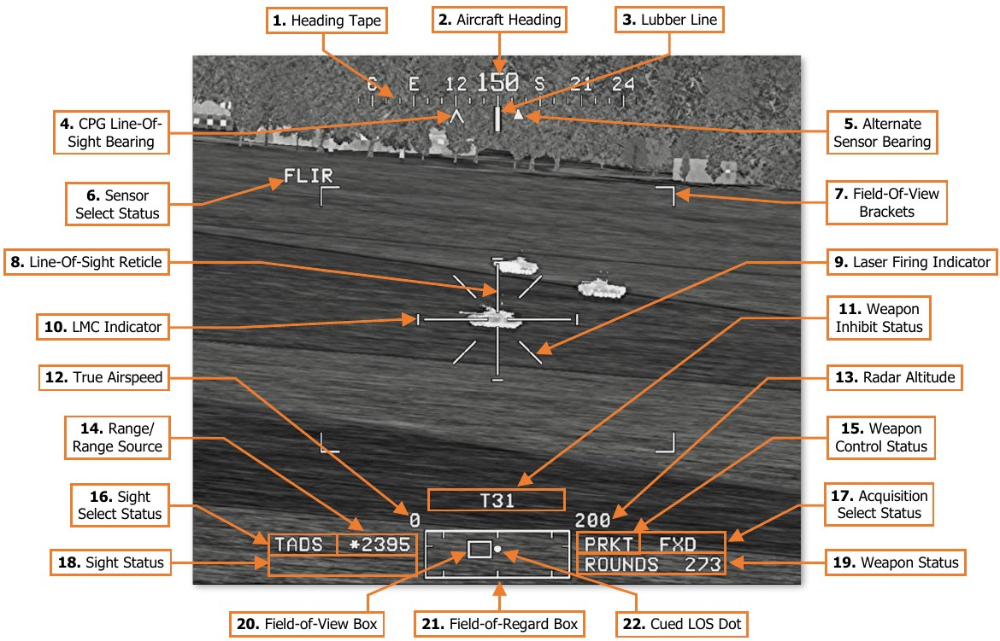
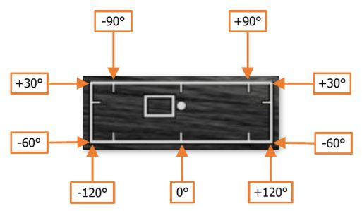

# TADS Weapon Symbology

If the Copilot/Gunner’s selected sight is TADS, TADS sensor video is displayed on the CPG’s HDU and TDU,
overlaid with TADS Weapon symbology. Weapon symbology includes several symbology elements that are
common with HMD Flight symbology, such as the HMD High Action Display.

1.    **Heading Tape.** Displays a 180° hemisphere of magnetic headings. Major tick marks are displayed in 30°
      increments and marked by a cardinal direction or heading in the tens value. Minor tick marks are displayed
      in 10° increments.

2.    **Aircraft Heading.** Displays a digital readout of the aircraft’s current magnetic heading in 1° increments,
      superimposed over the Heading Tape.

3.    **Lubber Line.** The Lubber Line is aligned to the centerline of the aircraft and serves as a reference for the
      aircraft heading.

4.    **CPG Line-of-Sight Bearing.** Displays the bearing of the Copilot/Gunner’s selected sight on the Heading
      Tape when the CPG’s selected sight is HMD or TADS.

5.    **Alternate Sensor Bearing.** Displays the bearing of the Pilot’s helmet sight on the Heading Tape when the
      Pilot’s selected sight is set to HMD.

6.    **Sensor Select Status.** Indicates the selected TADS sensor when the CPG’s selected sight is TADS.
 

    -    **FLIR.** The Forward-Looking Infrared camera is selected as the current TADS sensor.
 

    -    **DTV.** The Daytime Television camera is selected as the current TADS sensor.

7.   **Field-Of-View Brackets.** Indicates the relative area that can be seen by the currently selected TADS
     sensor if the next narrower field-of-view is selected. If Zoom FOV is selected, no further fields-of-view are
     available and the Field-Of-View Brackets are removed from the TADS video.

8.   **Line-Of-Sight Reticle.** Indicates the TADS sensor line-of-sight (LOS). When the CPG’s selected sight is
     TADS, the LOS Reticle is used as an aiming crosshair for weapons employment and laser designation.
     The LOS Reticle flashes when the selected sight’s LOS is invalid or has reached its slew limit.

9.   **Laser Firing Indicator.** Displayed continuously any time the Laser Rangefinder/Designator (LRFD) is firing.

10. **LMC (Linear Motion Compensation) Indicator.** Displayed when Linear Motion Compensation is
    enabled.
11. **Weapon Inhibit Status.** Displays any pertinent safety or performance inhibits that may affect weapons
    employment, based on the currently actioned weapon within the crewstation.

     If the CPG stores a Waypoint or Target point by placing the STORE/UPDT switch on the TEDAC Left Handgrip
     to the STO position, “W##” or “T##” (respectively) will be displayed in the Weapon Inhibit Status field for
     4 seconds, where ## indicates the specific point number to which the Waypoint or Target location has been
     stored.

12. **True Airspeed.** Indicates the true airspeed (TAS) of the aircraft in 1 knot increments, from 0 to 210 knots.
13. **Radar Altitude.** Indicates the radar-detected altitude above ground level from 0 to 1,428 feet. The Radar
    Altitude is displayed in increments of 1 foot from 0 to 50 feet in altitude, and increments of 10 feet between
    50 feet and 1,428 feet in altitude.

     The Radar Altitude is not displayed when the altitude exceeds 1,428 feet above ground level.

14. **Range Source/Range.** Displays the range source in use and the current range in tenths of kilometers, or
    meters if the range source is the LRFD.

    - **Default range.** Default range is selected upon initial aircraft power-on, or any time the crewmember’s
          current range source is no longer valid. The Default range for the Pilot is 1.5 km, and 3.0 km for the
          CPG (displayed as “1.5” and “3.0” respectively).

    - **Manual range.** Manual range may be selected and modified on the WPN page and may be set in 1-
          meter increments between 100 and 50,000 meters (displayed as “M0.1” to “M50.0”).

    - **Automatic range.** Auto range may be selected on the WPN page and provides dynamic range
          calculations between 0.1 km and 50 km (displayed as “A0.1” to “A50.0”).

    - **Navigation range.** Navigation range is automatically entered as the range source any time the
          crewmember’s sight is slaved to an acquisition source that has been set to a stored point within the
          navigational database. A Nav range is dynamically updated to reflect the current slant range between
          the aircraft and the point set as the acquisition source, between 0.1 km and 32 km (displayed as “N0.1”
          to “N32.0”).

    - **Radar range.** Radar range is automatically entered as the range source any time the crewmember’s
          selected sight is set to FCR. A radar range is dynamically updated to reflect the current slant range
          between the aircraft and the Next-To-Shoot FCR target, between 0.1 km and 9.9 km (displayed as
          “R0.1” to “R9.9”).

    - **Laser range.** Laser range is automatically entered as the range source any time the CPG fires the
          LRFD. The laser range is displayed in 1-meter increments between 500 and 9,999 meters (displayed
          as 500 to 9999). An asterisk `*` is displayed to the left of the laser range any time the LRFD is firing
          and processing a stable laser return from the object or surface within the TADS Line-of-Sight Reticle.

15. **Weapon Control Status.** Indicates the opposite crewmember’s actioned weapon system. If the Weapon
    Control Status field is blank, no weapon system is actioned by the opposite crewmember.

    - **PGUN.** Displayed in the CPG’s symbology to indicate the Pilot’s actioned weapon is the gun.

    - **PRKT.** Displayed in the CPG’s symbology to indicate the Pilot’s actioned weapon is rockets.

    - **PMSL.** Displayed in the CPG’s symbology to indicate the Pilot’s actioned weapon is missiles.

    - **CGUN.** Displayed in the Pilot’s symbology to indicate the CPG’s actioned weapon is the gun.

    - **CRKT.** Displayed in the Pilot’s symbology to indicate the CPG’s actioned weapon is the rockets.

    - **CMSL.** Displayed in the Pilot’s symbology to indicate the CPG’s actioned weapon is the missiles.

    - **COOP.** Displayed in both crewmember’s symbology to indicate both crewmembers’ actioned weapon
          is rockets, in Cooperative mode.

16. **Sight Select Status.** Indicates the sight currently selected within the crewstation.

    - **P-HMD.** Displayed in the Pilot’s symbology when the Pilot’s selected sight is HMD.

    - **P-FCR.** Displayed in the Pilot’s symbology when the Pilot’s selected sight is FCR.

    - **C-HMD.** Displayed in the CPG’s symbology when the CPG’s selected sight is HMD.

    - **C-FCR.** Displayed in the CPG’s symbology when the CPG’s selected sight is FCR.

    - **TADS.** Displayed in the CPG’s symbology when the CPG’s selected sight is TADS.

17. **Acquisition Select Status.** Indicates the acquisition source currently selected within the crewstation.

    - **PHS.** When slave is enabled, the currently selected sight will slave to the azimuth and elevation of the
          Pilot’s Helmet Sight.

    - **GHS.** When slave is enabled, the currently selected sight will slave to the azimuth and elevation of the
          Copilot/Gunner’s Helmet Sight.

    - **SKR.** If the next-to-shoot AGM-114 is tracking a laser designation or target in LOBL mode when slave
          is enabled, the currently selected sight will slave to the azimuth and elevation of the missile seeker.

    - **FCR.** When slave is enabled, the currently selected sight will slave to the location of the Next-To-Shoot
          (NTS) target detected by the Fire Control Radar. This option is only displayed if the FCR mast-mounted
          assembly is installed and the FCR is powered.

    - **FXD.** When slave is enabled, the currently selected sight will slave to a fixed forward direction along
          the Armament Datum Line (ADL, 0° in azimuth/-4.9° in elevation).

    - **W##, H##, C##, T##.** When slave is enabled, the currently selected sight will slave to the location
          of the Waypoint, Hazard, Control Measure, or Target/Threat point set as the acquisition source within
          the crewstation, and the range source will switch to a Navigation range equal to the slant range
          between the aircraft and the selected point. ## indicates the specific point number to which the
          Waypoint, Hazard, Control Measure, or Target/Threat point has been stored.

    - **TRN.** When slave is enabled, the currently selected sight will slave to the location of the terrain location
          cursor-selected on the TSD within the crewstation, and the range source will switch to a Navigation
          range equal to the slant range between the aircraft and the Terrain point.

18. **Sight Status.** Displays status messages regarding the currently selected sight within the crewstation and
    the employment of laser-guided AGM-114 missiles when launched in a Remote Fire mode.
19. **Weapon Status.** Displays status messages regarding the currently actioned weapon within the crewstation.
20. **Field-Of-View (FOV) Box.** 

    

    The FOV box indicates the             
    relative position of the TADS line-of-sight within the larger
    Field-of-Regard box. The FOV box represents a 30° x 40°
    field of view and is driven by the TADS sensor turret          
    position.

21. **Field-Of-Regard (FOR) Box.**   The FOR box indicates
    azimuth limits for the TADS sensor turret. Tick marks
    around the edges of the TADS FOR box mark 0° and ±90°
    in azimuth, and 0° elevation.                                  

22. **Cued Line-Of-Sight Dot.** Indicates the relative location
    of the selected acquisition source within the Field-of-
    Regard box.

### TADS Sight Status Messages

The following status messages pertain to the use of the TADS as the selected sight within the crewstation and
when employing AGM-114K SAL missiles in which an offboard source of laser designation is providing terminal
guidance.

- **FIXED:** The TADS turret has been
slaved to fixed forward (FXD)

    CPG should press the SLAVE button to de-slave the
TADS turret, if required.

- **FLIR OFF:** The TADS FLIR has been
powered off.

    CPG should power the TADS FLIR on the WPN Utility
sub-page, if required for targeting or NVS operations.

- **LIMITS:** The TADS has encountered a slew limitation.          

    Adjust the TADS turret position to within the slew
limits to regain the ability to fire the LRFD.

- **REMOTE:** The SAL missile channel that
has been designated as the
Priority channel does not match
the laser code set to the TADS 
LRFD.  

    Set the Priority channel to the same laser code set to
the TADS LRFD to perform an autonomous (self-
lasing) missile engagement.

    Coordinate with an offboard source of laser
designation to provide terminal guidance for the next
SAL missile. Ensure the source is using a laser code
that corresponds with that set as the Priority channel.

- **TARGET DATA?:** RF missiles have been actioned while the TADS is the selected sight, but a target handover has not been performed.

    Designate the intended target for 3 seconds to
perform a target handover to the next RF missile.

### TADS Weapon Inhibit Messages

The following conditions will result in momentary TADS-related messages being displayed within the CPG’s Weapon Inhibit data field of the High Action Display. These messages are for informational purposes only and have no effect on the function or employment of any weapon systems.

- **ALL TRKS DEL**

    TADS automatic tracking has been commanded to delete all tracks.

- **TRK # DEL**

    TADS automatic tracking has been commanded to delete the numbered track.

- **TRK # DROP**

    TADS automatic tracking is unable to maintain the numbered track.

- **T##**

    A Target (TG) point has been stored in the numbered index within the TGT/THRT partition.

- **W##**

    A Waypoint (WP) has been stored in the numbered index within the WPTHZ partition.

{!abbr.md!}
{!dev-docs/ah64d/abbr.md!}
{!docs/ah64d/abbr.md!}
