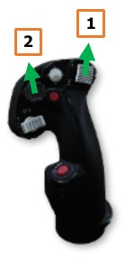
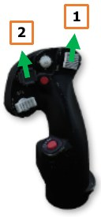
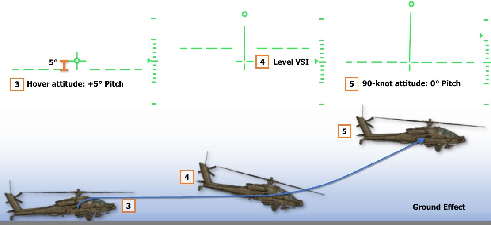
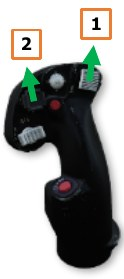
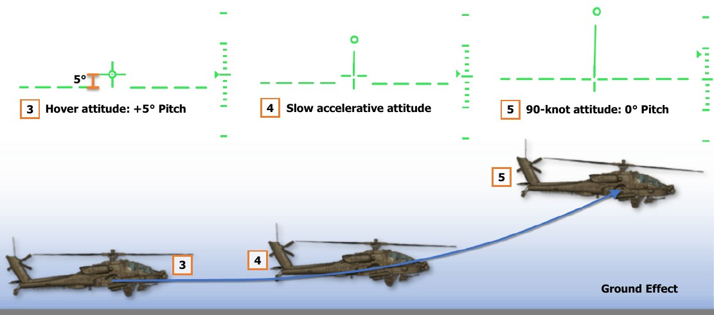
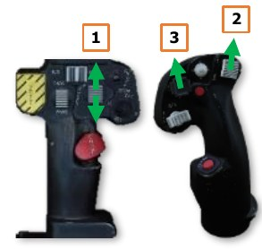
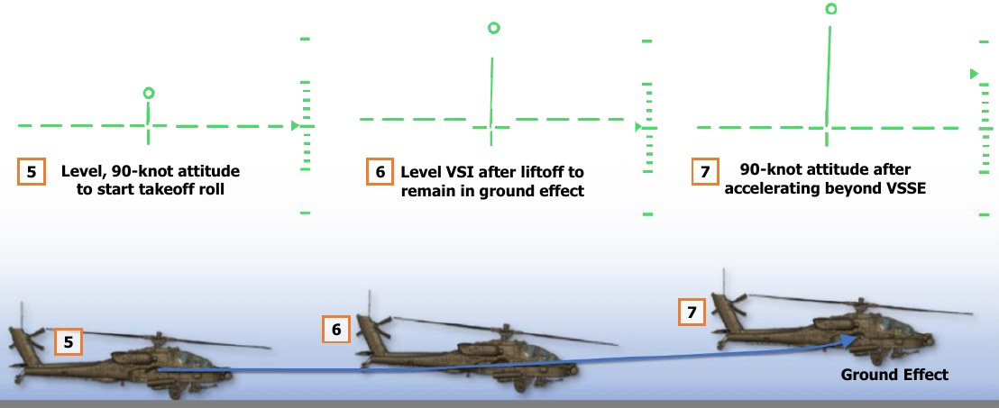

# Takeoff

Several different types of takeoff maneuvers may be performed, depending on the nature of the takeoff area,
obstacles or terrain beyond the takeoff area, and the power margins available. When possible, the crew should
perform a takeoff that ensures the maximum amount of excess power is available for contingencies while
maintaining a safe distance from any potential hazards to the aircraft on climb out, such as vertical hazards or
structures. The four types of takeoffs that may be performed in Visual Meteorological Conditions (VMC), and their
applications for use, are listed below.

**VMC Takeoff.** A VMC Takeoff is the most common type of takeoff and can be initiated from the ground or when
already established in a stationary hover. This type of takeoff is used when a sufficient power margin (≥10% TQ)
is available between the torque required to hover in ground effect (HOVER Q – REQUIRED IGE) and the maximum
dual-engine torque available (MAX Q – DE) that does not exceed the dual-engine transmission limit (100% TQ).

**VMC Level Acceleration Takeoff.** A VMC Level Acceleration Takeoff is considered the safest type of takeoff
but requires a sufficient area that is free of obstacles to permit such a maneuver to be performed. It is preferred
that a sufficient power margin (≥10% TQ) is available to perform this maneuver; but unlike the VMC Takeoff, it
is not necessarily required, depending on the takeoff environment and necessity. The advantage this maneuver
provides is remaining outside the “height-velocity avoid” region until a safe single-engine airspeed can be
attained, in case of an engine failure.

**VMC Minimum Power Takeoff.** A VMC Minimum Power Takeoff is performed when there is insufficient power
margin (<10% TQ) available between the torque required to hover in ground effect (HOVER Q – REQUIRED IGE)
and the maximum dual-engine torque available (MAX Q – DE) that does not exceed the dual-engine transmission
limit (100% TQ). In such a scenario when the aircraft is hovering near its maximum dual-engine torque available
or its dual-engine transmission limit, this takeoff maneuver is performed. This type of takeoff is used when a
combination of environmental conditions and/or weapon and fuel requirements are negatively impacting the
aircraft’s performance capabilities, but the surface within the takeoff area is unsuitable for a Rolling Takeoff.

**Rolling Takeoff.** A Rolling Takeoff is performed as the preferred alternative to the VMC Minimum Power Takeoff
when conditions permit. In such a scenario when the aircraft is hovering near its maximum dual-engine torque
available (MAX Q – DE) or its dual-engine transmission limit (100% TQ), and a suitable takeoff area such as a
runway, a road, or other improved surface is available, this takeoff maneuver is performed.

### VMC Takeoff

A VMC Takeoff may be performed from the ground or from a stationary hover. When performing
the maneuver from the ground, the maneuver is typically performed in the following manner:

1.   Select Transition symbology mode (Symbology Select switch – Forward).
2.   Press and hold the force trim (Force Trim/Hold Mode switch – Forward).
3.   With the cyclic in the neutral position, increase the collective until the aircraft becomes light
     on the wheels while applying left pedal to counter the torque and maintain heading.
     Continue increasing the collective to approximately 10% above the torque required to hover
     in ground effect (HOVER Q – REQUIRED IGE).
     
    !!! note
        A minimum climb rate of 500 feet per minute (FPM) is typically desired. However, depending on the
        nature of the takeoff area, additional torque may be necessary to achieve a higher rate of ascent and a
        steeper climb angle in order to clear obstacles. The Flight Path Vector (FPV) may be used to judge whether
        the aircraft will clear obstacles within the path of the aircraft. (See [IHADSS Flight Symbology for more information](07.ihadss.md).)

4.   As the aircraft leaves the ground, apply forward cyclic to obtain a “90-knot” pitch attitude, which corresponds
     with the Horizon Line bisecting the LOS Reticle within the HDU Flight symbology or the Horizon Line bisecting
     the Waterline symbol on the [MPD FLT page](09.mpd.md/#flight-flt-page). Use forward/aft cyclic inputs as necessary to maintain this level
     pitch attitude as the aircraft accelerates through effective translational lift (ETL). The force trim should be
     held throughout this maneuver if able, but it may be released and pressed intermittently as necessary.

     Use left/right cyclic inputs to maintain the desired ground track and left/right pedal inputs to maintain the
     takeoff heading until the aircraft has ascended through 50 feet AGL or is clear of all obstacles within the
     takeoff area.

     Once the aircraft has climbed above 50 feet AGL and is clear of obstacles, adjust the pedals to place the
     aircraft “in trim” (“Trim ball” centered on the Skid/Slip Indicator).

When performing a VMC Takeoff from a hover, each step is performed in the same manner as departing from
the ground, except the 90-knot attitude may be achieved at the initiation of the maneuver rather than as the
aircraft leaves the ground.

### VMC Level Acceleration Takeoff

A VMC Level Acceleration Takeoff may be performed from the ground or from a stationary hover.
When performing the maneuver from the ground, the maneuver is typically performed in the
following manner:

1.    Select Transition symbology mode (Symbology Select switch – Forward).
2.    Press and hold the force trim (Force Trim/Hold Mode switch – Forward).
3.    With the cyclic in the neutral position, increase the collective until the aircraft becomes light
      on the wheels while applying left pedal to counter the torque and maintain heading.

      Continue increasing the collective to approximately 10% above the torque required to hover
      in ground effect (HOVER Q – REQUIRED IGE).
      
    !!! note
        Depending on the length of the takeoff area, additional power may be necessary to accelerate and
        achieve the desired climb airspeed within a shorter distance in order to clear obstacles.

4.    As the aircraft leaves the ground, apply forward cyclic to maintain the aircraft in ground effect with a level
      VSI. Use forward/aft cyclic inputs as necessary to maintain the VSI at 0 feet per minute (FPM) as the aircraft
      accelerates through minimum safe single-engine airspeed (VSSE). The force trim should be held throughout
      this maneuver if able, but it may be released and pressed intermittently as necessary.

      Use left/right cyclic inputs to maintain the desired ground track and left/right pedal inputs to maintain the
      takeoff heading.

5.    As the aircraft accelerates beyond minimum safe single-engine airspeed (VSSE), adjust the cyclic to obtain
      the required pitch attitude for the desired climb airspeed.

      Once the aircraft has climbed above 50 feet AGL and is clear of obstacles, adjust the pedals to place the
      aircraft “in trim” (“Trim ball” centered on the Skid/Slip Indicator).

When performing a VMC Level Acceleration Takeoff from a hover, each step is performed in the same manner as
departing from the ground, except the accelerative attitude may be achieved at the initiation of the maneuver
rather than as the aircraft leaves the ground.

### VMC Minimum Power Takeoff

A VMC Minimum Power Takeoff may be performed from the ground but is typically performed
from a stationary hover after verifying the aircraft has sufficient power to hover in ground effect.

When performing the maneuver from a hover, the maneuver is typically performed in the
following manner:

1.   Select Transition symbology mode (Symbology Select switch – Forward).
2.   Press and hold the force trim (Force Trim/Hold Mode switch – Forward).
3.   From a stationary hover, slowly apply forward cyclic to initiate a level acceleration across
     the surface while remaining in ground effect. Increase the collective as necessary, not to
     exceed the maximum dual-engine torque available (MAX Q – DE) or the dual-engine
     transmission limit (100% TQ), whichever is less.
     
    !!! note
        If a hover in ground effect (IGE) at 5 feet AGL can be maintained without exceeding the maximum
        dual-engine torque available or the dual-engine transmission limit, a VMC Minimum Power Takeoff can be
        performed. When training this maneuver, IGE hover power is maintained throughout the maneuver.
        However, during operational missions, any remaining power margin should be utilized without exceeding
        the maximum dual-engine torque available or the dual-engine transmission limit.

4.   As the aircraft accelerates through effective translational lift (ETL) and the rotor system becomes more
     efficient at producing lift, the aircraft will begin to ascend. Use forward/aft cyclic inputs as necessary to
     maintain the VSI at 0 feet per minute (FPM) and remain within ground effect. The force trim should be held
     throughout this maneuver if able, but it may be released and pressed intermittently as necessary.

     Use left/right cyclic inputs to maintain the desired ground track and left/right pedal inputs to maintain the
     takeoff heading until the aircraft has ascended through 50 feet AGL or is clear of all obstacles within the
     takeoff area.

5.   As the aircraft accelerates beyond minimum safe single-engine airspeed (VSSE), adjust the cyclic to obtain
     the required pitch attitude for the desired climb airspeed.

     Once the aircraft has climbed above 50 feet AGL and is clear of obstacles, adjust the pedals to place the
     aircraft “in trim” (“Trim ball” centered on the Skid/Slip Indicator).

### Rolling Takeoff

A Rolling Takeoff is performed when the aircraft’s power margin is insufficient (<10% below maximum dual-
engine torque; MAX Q – DE) to perform a normal takeoff and a suitable takeoff area such as a runway, a road,
or other improved surface is available. The maneuver is typically performed in the following manner:

1.       Manually set the stabilator angle to 0° (Stabilator Control Switch on the
         Collective Flight Grip), as indicated on the ENG Systems sub-page.

2.       Select Transition symbology mode (Symbology Select switch – Forward).
3.       Press and hold the force trim (Force Trim/Hold Mode switch – Forward).
4.       With the cyclic in the neutral position, increase the collective to 30-35%.
5.       Apply forward cyclic to begin the takeoff roll while progressively increasing
         collective to approximately 3-5% below the maximum dual-
         engine torque available (MAX Q – DE). As the tail comes off the surface, use
         forward/aft cyclic inputs to achieve and maintain a level, 90-knot attitude.
         
    !!! note
        When training this maneuver, increase the collective to 10% below the torque required to hover in
        ground effect (HOVER Q – REQUIRED IGE) to simulate a limited-power condition.

    Apply left pedal to counter the torque and then left/right pedal inputs as necessary to maintain heading.
    Use left/right cyclic inputs to maintain the ground track across the takeoff surface. The force trim should be
    held throughout this maneuver if able, but it may be released and pressed intermittently as necessary.

6.       As the aircraft accelerates and the rotor system becomes more efficient at producing lift, the aircraft will
         become light on the wheels. Use forward/aft cyclic inputs as necessary to maintain the level, 90-knot attitude
         until the aircraft lifts off the surface. After liftoff, use forward/aft cyclic inputs to remain within ground effect
         with the VSI at 0 feet per minute (FPM) as the aircraft continues to accelerate.

    Once the aircraft has lifted off the surface, adjust the pedals to place the aircraft “in trim” (“Trim ball”
    centered on the Skid/Slip Indicator) while using left/right cyclic inputs to maintain the desired ground track
    within the takeoff area.

7.       As the aircraft accelerates beyond minimum safe single-engine airspeed (VSSE), adjust the cyclic to obtain
         the required pitch attitude for the desired climb airspeed and reset the stabilator to Automatic mode.

{!abbr.md!}
{!dev-docs/ah64d/abbr.md!}
{!docs/ah64d/abbr.md!}
