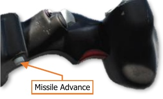
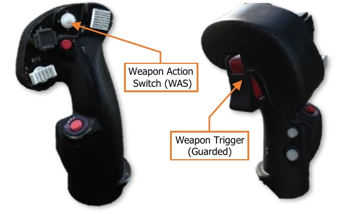
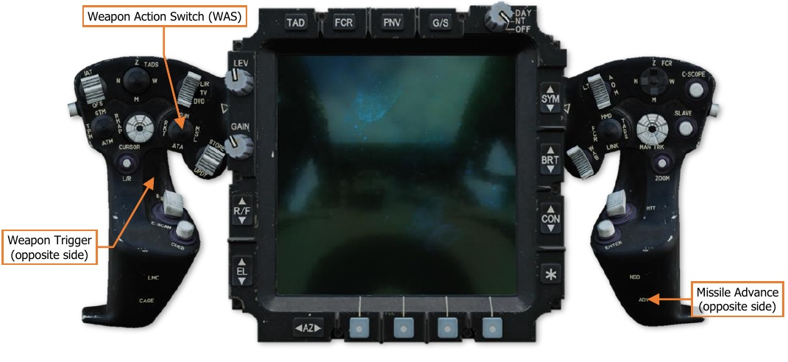

# Weapon Hand Controls

Either crewmember may employ any aircraft weapon system independently of the other crewstation. However,
only the Copilot/Gunner can use the TADS to provide laser guidance for the AGM-114K Hellfire missile.

## Cyclic & Collective Controls

The Pilot and Copilot/Gunner Cyclic and Collective Mission Grips include identical controls for weapons
employment. However, the CPG’s cyclic weapon trigger is only activated if the CPG actions a weapon using the
Weapon Action Switch on the cyclic.

## TEDAC Controls

The CPG’s TEDAC weapon trigger is only activated if the CPG actions a weapon using the Weapon Action Switch
on the TEDAC Left Handgrip.

{!abbr.md!}
{!dev-docs/ah64d/abbr.md!}
{!docs/ah64d/abbr.md!}
