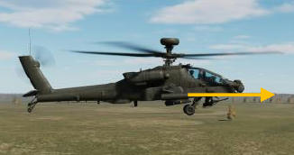

# Weapons Employment

It is recommended that the Tactical Employment chapter is reviewed prior to reading this chapter. This will
familiarize the reader with the roles that sights and acquisition sources play when employing weapons in a tactical
scenario.

Additionally, the Helmet-Mounted Display (HMD), Target Acquisition Designation Sight (TADS), and Fire Control
Radar (FCR) chapters should be reviewed prior to reading through the weapon procedures within this chapter
which rely on the corresponding sights and their associated range sources.

!!! attention
    When describing cockpit controls or specific tasks performed in each crewstation, the following symbols will be
    used to denote each crewstation or cockpit control effects between the crewstations.
    
    [[**PLT**]] Denotes a task that is performed by the Pilot.
    
    [[**CPG**]] Denotes a task that is performed by the Copilot/Gunner.
    
    [[**PLT/CPG**]] Denotes a task that may be performed by either crewmember.
    
    [[**PLT & CPG**]] Denotes a task that is performed by both crewmembers.
    
    **©**      Denotes a cockpit control, option, or setting that is “common” between crewstations. A change
                performed in one crewstation will affect both crewstations. Any item that does not have this symbol is
                “independent” between crewstations.
    
    **“Pilot”**    Denotes the crewmember occupying the aft crewstation.
    
    **“pilot”**    Denotes the crewmember manipulating the aircraft flight controls in the conduct of performing a
                specific flight maneuver.

Each weapon system of the AH-64D is fully integrated into the fire control system and automatically managed by
the Weapon Processors (WP). This integration increases the aircrew’s combat effectiveness by allowing each
crewmember to focus on the targeting of enemy positions using their selected sight. The WP’s generate weapon
solutions and command the positions of the gun turret and wing pylons in accordance with the selected
weapon(s), the calculated weapon aiming solution(s), and the specific weapon settings within each cockpit.

When a crewmember intends to employ a weapon system, the weapon is selected, or “actioned”, using the cyclic-
or TEDAC-mounted Weapon Action Switch (WAS); also known as “WASing” (pronounced “Wahz-ing”). When the
crewmember selects the same weapon that is already actioned, the weapon is “de-actioned”; also known as “de-
WASing”.

Neither crewstation has priority control of any weapon system over the other, allowing either crewmember to
action a weapon at any time, taking control away from the opposite crewmember using a “last actioned” logic.
As an exception to this logic, both crewmembers may action the rocket system in a Cooperative (COOP) mode.

The AH-64D’s three weapon systems are the AGM-114 missiles, 2.75-inch unguided rockets, and 30mm gun.

- **Hellfire Modular Missile System (HMMS).** The AGM-114 missile is a highly accurate anti-armor
     munition, capable of engaging point targets at long range across a wide variety of battlefield conditions.
     The Hellfire is the primary weapon system of the AH-64D.

- **Aerial Rocket Sub-system (ARS).** The 2.75-inch unguided rockets are an aerial rocket bombardment
     system designed for engaging or suppressing area targets at close or long range and is effective against
     groups of vehicles or personnel in the open.

- **Area Weapon System (AWS).** The 30mm gun is designed for engaging or suppressing targets at close
     range and is effective against lightly armored vehicles, unarmored vehicles, and personnel.

Both crewmembers may employ separate weapon systems independently and simultaneously, however only one
weapon system may be physically fired at any given time. If a weapon system is in the process of firing or is
already committed to launching a munition, the other weapon system will be inhibited from firing for two seconds
to prevent interference with the other. (See Weapon Inhibits on the following page for more information.)

### Weapon Inhibits

If a condition exists that would prevent the safe employment of a weapon system (such as another weapon
system already firing), or a condition that could negatively impact a weapon’s effectiveness under the current
conditions, the Weapons Processors will present a “Weapon Inhibit” message to the crewmember(s) to which the
message pertains. Weapon inhibits are grouped into two categories: Performance Inhibits and Safety Inhibits.

##### Performance Inhibits

Performance inhibits alert the crewmember(s) that the actioned weapon system cannot perform effectively under
the current flight or sighting conditions. The actioned weapon system will be inhibited from firing if the
crewmember pulls the weapon trigger to the first detent; but these inhibits may be overridden by pulling the
trigger to the second detent.

##### Safety Inhibits

Safety inhibits alert the crewmember(s) that employment of the actioned weapon system under the current flight
or sighting conditions would present a potential safety hazard to the aircraft and aircrew, or friendly forces in the
vicinity. These inhibits cannot be overridden using the second detent of the weapons trigger.

Performance and safety inhibits that are specific to the Area Weapon System, Aerial Rocket Sub-system, or Hellfire
Modular Missile System are described in their relevant sections.

### Weapon Aiming Solution

The fire control system of the AH-64D is highly automated and only requires the crewmembers to perform
accurate sighting against the intended target. Factors such as aircraft speed, altitude above the target, range to
target, winds, or the ballistics of the weapon itself are automatically calculated to produce a weapon aiming
solution.

The EGI supplies the Weapon Processors with aircraft inertial data such as attitude, linear velocities, and angular
rates. The Airspeed And Direction Sensor (AADS) probes mounted to the engine nacelles sense airspeed
magnitude, direction, and free airstream temperature, which is used by the High Integrated Air Data Computer
(HIADC) to compute air mass related data such as relative winds and local air density. The crewmember’s selected
sight is used to determine the targets relative position from the aircraft in azimuth, elevation, and range.

The Weapon Processors use the supplied data along with crewmember’s selected weapon and cockpit settings to
calculate where the actioned weapon must be aimed in order to place rounds on target. This aiming solution
determines the commanded position of the gun turret, the commanded pylon angle of the rocket launchers, and
the vertical and lateral position of the rocket steering cursor within the crewmember(s) sight symbology.

Crewmember actions that typically increase the accuracy of the weapon aiming solution are ensuring the selected
sight is stabilized on the intended target and ensuring precise ranging data is supplied throughout the
engagement. In addition, the Pilot should strive to maintain a stable attitude as much as possible to assist the
Copilot/Gunner in targeting and to provide a stable weapon platform when munitions are being fired or launched.

### Pylon Articulation

Hydraulically-driven articulation mechanisms are integrated into each of the four wing pylons of the AH-64 which
facilitates the swivel of the weapon mounts in the vertical axis. The articulation of each pylon is independently
controlled by the AH-64D’s Weapons Processors, based on the state of the aircraft (in flight or on the ground),
the selected weapon system of either crewmember, the current weapon inventory onboard the pylon, and the
calculated ballistic solution of the weapon itself, if applicable. The operation of the wing pylons is fully automatic
and does not require management by the crewmembers.

As any helicopter’s longitudinal airspeed is a function of its pitch attitude, the articulation of the wing pylons
allows the missile and rocket launchers to be “decoupled” from the pitch attitude of the helicopter. This mostly
eliminates the requirement to adjust the pitch attitude of the helicopter to align the weapon system with the
calculated weapon solution in the vertical axis. This in turn facilitates the employment of these weapons across
a wide range of airspeeds, while performing acceleration/deceleration maneuvers, or from a stationary hover.

However, the articulation range of each pylon is limited to +4° to -15°, relative to the aircraft datum line (ADL).
In the event the calculated weapon solution is beyond the articulation range of the pylon at the current aircraft
attitude, a corresponding weapon inhibit message will be presented to the crewmember within their sight
symbology. Under such circumstances, it may be necessary to adjust the pitch attitude of the aircraft to bring
the weapon solution within the articulation range of the applicable weapon system.

This should be expected when employing unguided rockets against targets at long ranges, in which case it is
unlikely the rocket launchers can elevate high enough without performing a positive pitch maneuver with the
aircraft. (See Aerial Rocket Sub-system for more information.)

## Weapon employment tips and recommendations

The following points are recommended practices for employing weapons from the DCS: AH-64D. These
recommendations are not all-encompassing, nor do they reflect the best procedure for every situation, but will
typically increase the chances of successful weapon engagements.

- The settings for each weapon system may be changed by manually selecting the corresponding weapon
    along the bottom row of options on the Weapon (WPN) page. This permits the weapons to be configured
    prior to being actioned by a crewmember. During start-up procedures, it is recommended that these settings
    be configured as appropriate based on the anticipated tactical situation instead of waiting until the weapons
    are actioned for employment; in some circumstances in which enemy contact has already occurred.
- The MANRNG> value on the WPN page defaults to 1,500 meters for the Pilot and 3,000 meters for the
    Copilot/Gunner (CPG). If the selected sight is set to HMD when the gun is actioned, the crewmember’s range
    source will be automatically set to a Manual range value corresponding with the MANRNG> setting for the
    purposes of hasty engagements against close-range targets (or threats). Therefore, during start-up
    procedures, it is recommended that this value be set between 1000 and 1500 meters to ensure the range
    setting corresponds with a range that will be most practical for HMD gun engagements.
- Off-axis gun engagements are useful for hasty, close-range shots using the HMD; however, the gun will be
    most accurate when employed in a deliberate manner by placing the target off the nose and using TADS for
    targeting.
- If intending to use TADS Linear Motion Compensation (LMC), an approximate range measurement of the
    target area will assist the CPG in establishing an appropriate LMC slew rate prior to pulling the laser trigger
    to the 2nd detent for designation, which will minimize large “range jumps” when the laser is fired.

    - Switch to Automatic ranging by entering “A” as the MANRNG> value on the WPN page. This will
              automatically adjust the range value based on the radar altitude and TADS look-down angle.
                                                               or

    - Use the 1st detent of the laser trigger to fire a brief ranging pulse to measure the range to the
              target area prior to enabling LMC.

- If intending to autonomously employ laser-guided missiles (self-designating), ensure the Priority missile
    channel is set to the same laser code as the TADS laser rangefinder/designator (LRFD).

    - The TADS LRFD laser code is set on the WPN Code sub-page.

    - The missile channels are set on the WPN Channel sub-page.

    - The Priority missile channel is selected on the WPN page when set to MSL format.

- If intending to autonomously employ laser-guided missiles in LOBL mode, ensure TRAJ (VAB R3) is set to
    “DIR” on the WPN page MSL format. This will slave the AGM-114K missile seeker to the TADS line-of-sight
    prior to the LRFD being fired, which will ensure the missile will detect the laser designation.
- If the TADS LRFD is not firing when the laser trigger is pulled (indicated by the X pattern displayed around
    the TADS LOS Reticle), verify the following within the CPG cockpit:

    - The selected sight is TADS.

    - The A/S button on the Armament Panel is set to ARM.

    - The LT switch on the TEDAC Right Handgrip is set to the center Off position. If the LST is set to
              Automatic or Manual mode, the LRFD is inhibited from firing.

    - LASER (VAB L6) is powered on the WPN Utility sub-page.

- When using a laser designator from a helicopter at low altitudes, precision is more critical when lasing at
    shallow angles across the terrain than compared to a fixed-wing aircraft that is lasing from high-altitudes
    with steep look-down angles. When using the TADS LRFD to measure range for the gun or rockets, being
    precise with the laser will result in a more precise weapon aiming solution. When designating for laser-
    guided missiles, it is even more important to ensure the missile actually impacts the target; versus hitting
    the ground nearby or beyond it.
- GND STOW (VAB R5) may be enabled on the WPN Utility sub-page from either crewstation. This will fix the
    wing pylons to -5° relative to the Aircraft Datum Line (ADL), which will correspond with the Head Tracker
    within the HMD symbology.

    - This may be used as a “fixed” rocket mode, allowing the pilot to use the Head Tracker as an
              aiming reticle for the rockets. However, ballistic compensation for range will not be provided, so
              the Head Tracker will need to be elevated above the intended target to account for the trajectory
              drop of the rockets as the range to target increases.

    - When employing laser-guided missiles in a dive, GND STOW may be used to force the missile
              launchers to align with the Head Tracker. This allows the pilot to use the Head Tracker as an
              aiming reticle for the missiles. If the TADS is set as the Pilot’s ACQ, maneuvering the aircraft so
              that the Head Tracker is pointed at the Cued LOS Reticle while the CPG is lasing will ensure the
              missiles can maneuver toward the laser designation after they leave the launcher rail.

- Performance inhibits may be overridden using the 2nd detent of the weapon trigger; but ensuring that no
    weapon inhibit messages are displayed prior to pulling the trigger increases the chances of the desired
    weapon effects. If tactically feasible, efforts should always be taken to improve the likelihood of a successful
    engagement by correcting the conditions that are resulting in the display of performance inhibits.
- The AH-64 aircrew consists of two crewmembers. Employing weapons accurately and effectively is just as
    much the responsibility of the Pilot as it is the Copilot/Gunner (CPG). A Pilot that flies haphazardly makes
    the CPG’s job more difficult, and a CPG that doesn’t coordinate with the Pilot prior to releasing munitions is
    needlessly complicating his or her own tasks.

## Weapon (WPN) Page

The WPN page presents a top-down overview of the aircraft weapons load along with relevant sight, sensor, and
countermeasure statuses. The WPN page will contextually change format to display additional weapon-specific
settings any time a weapon is actioned within the crewstation or manually selected along the bottom row of
Variable Action Buttons (VAB).

Other key settings that may be accessed from this page include changing the selected acquisition source (ACQ),
selecting a manual or automatic range source, changing the laser codes assigned to the TADS Laser
Rangefinder/Designator and Laser Spot Tracker, or boresighting the IHADSS.

1.   **CHAN sub-page.** Displays the WPN Channel sub-page.

2.   **ASE page.** Displays the Aircraft Survivability Equipment (ASE) page.

3.   **CODE sub-page.** Displays the WPN Code sub-page.

4.   **COORD sub-page.** Displays the WPN Coordinates sub-page. (See TSD Coordinate sub-page for more
     information.)

5.   **UTIL sub-page.** Displays the WPN Utility sub-page.

6.   **ARM/SAFE Status.** Displays the master armament state.

    - **SAFE.** No weapons are actioned. TADS                                  
                LRFD is inhibited from firing.                                       

    - **ARM.** No weapons are actioned. TADS                                   
                LRFD may be fired.                                                   

    - **SAFE.** Actioned weapon(s) and TADS
      LRFD are inhibited from firing.

    - **ARM.** Actioned weapon(s) and TADS
      LRFD may be fired.

7.   **Sight Select Status.** Indicates the sight currently selected within the crewstation.

    - **HMD.** Displayed when the crewmember’s selected sight is HMD.

    - **TADS.** Displayed when the crewmember’s selected sight is TADS (CPG only).

    - **FCR.** Displayed when the crewmember’s selected sight is FCR.

8.   **Acquisition Select Status.** Indicates the acquisition source currently selected within the crewstation.

    - **PHS.** When slave is enabled, the currently selected sight will slave to the azimuth and elevation of the
             Pilot’s Helmet Sight.

    - **GHS.** When slave is enabled, the currently selected sight will slave to the azimuth and elevation of the
             Copilot/Gunner’s Helmet Sight.

    - **SKR.** If the next-to-shoot AGM-114 is tracking a laser designation or target in LOBL mode when slave
             is enabled, the currently selected sight will slave to the azimuth and elevation of the missile seeker.

    - **FCR.** When slave is enabled, the currently selected sight will slave to the location of the Next-To-Shoot
             (NTS) target detected by the Fire Control Radar. This option is only displayed if the FCR mast-mounted
             assembly is installed and the FCR is powered.

    - **FXD.** When slave is enabled, the currently selected sight will slave to a fixed forward direction along
             the Armament Datum Line (ADL, 0° in azimuth/-4.9° in elevation).

    - **W##, H##, C##, T##.** When slave is enabled, the currently selected sight will slave to the location
             of the Waypoint, Hazard, Control Measure, or Target/Threat point set as the acquisition source within
             the crewstation, and the range source will switch to a Navigation range equal to the slant range
             between the aircraft and the selected point. ## indicates the specific point number to which the
             Waypoint, Hazard, Control Measure, or Target/Threat point has been stored.

    - **TRN.** When slave is enabled, the currently selected sight will slave to the location of the terrain location
             cursor-selected on the TSD within the crewstation, and the range source will switch to a Navigation
             range equal to the slant range between the aircraft and the Terrain point.

9.   **LST Code Status.** Displays the laser code that the TADS Laser Spot Tracker will scan for when enabled.
     (See WPN Code sub-page for more information.)

10. **LRFD sub-page.** Displays the laser code that the TADS Laser Rangefinder/Designator will emit when fired.
    (See WPN Code sub-page for more information.)

11. **Gun Status/Symbol.** Displays the status of the Area Weapon System and the remaining quantity of
    ammunition onboard. If the gun system is powered off, the gun symbol will be removed from the page.
    (See Area Weapon System for more information.)

12. **Missile Symbol/Missile Launcher.** Displayed when a missile is loaded onto the corresponding missile
    launcher rail underneath the corresponding wing pylon, the type of missile that is loaded, and the missile’s
    status. If the missile system is powered off, missile and launcher symbols will be removed from the page.
    (See Hellfire Modular Missile System for more information.)

    - **BIT.**

        

        A built-in-test is
                being performed to
                determine the status
                of any missiles that
                are detected onboard
                the launcher.

    - **SAFE.**

        

        The missile
     launcher is in a SAFE
     status. Missiles are
     inhibited from being
     launched.

    - **ARM.**

        

        The missile
     launcher is in an
     ARM status. Missile
     launch is permitted.

13. **Rocket Launcher Symbol.** Displayed when a rocket launcher is loaded underneath the corresponding
    wing pylon, along with the rocket warhead type that is selected within the crewstation. If the rocket
    system is powered off, any rocket launcher symbols will be removed from the page. (See Aerial Rocket
    Sub-system for more information.)

14. **Chaff Dispenser Status.** Displays the arming state of the chaff dispenser and the remaining quantity of
    individual chaff cartridges.

    - **SAFE.** 30 chaff cartridges remain on
               board. Chaff is inhibited from being
               dispensed.

    - **ARM.** 30 chaff cartridges remain on
     board. Chaff may be dispensed.

15. **Training Mode.** Not implemented.

16. **BORESIGHT sub-page.** Displays the WPN Boresight sub-page. (See IHADSS Boresight for more
    information.)

17. **HMD Grayscale Select.** Selects a grayscale pattern for display within the HDU. The grayscale pattern is
    used to set the appropriate brightness and contrast levels for the HDU video output.

18. **LRFD Ranging Setting.** Selects which laser return is utilized by the LRFD when fired using the 1 st detent
    of the LRFD trigger on the TEDAC Right Handgrip. This setting is common between crewstations.

    - **FIRST.** The first laser return that is received by the LRFD is utilized for range.

    - **LAST.** The last laser return that is received by the LRFD is utilized for range.

19. **Acquisition Source (ACQ).** Displays the acquisition source selection menu. (See Acquisition Sources in
    the Tactical Employment chapter for more information.)

20. **GUN format.** Displays the WPN Gun format.

21. **MSL format.** Displays the WPN Missile format.

22. **RKT format.** Displays the WPN Rocket format.

23. **Manual Range Setting.** Activates the KU for inputting a manual or automatic range as the range source
    for that crewstation.

    - **Manual Range.** May be entered in 1-meter increments between 100 and 50,000 meters, and then
            pressing ENTER on the KU. If a range value is not entered prior to pressing ENTER on the KU, the
            manual range value already displayed on the WPN page will be entered as the range source.

    - **Automatic Range.** May be enabled by entering a value of “A”, and then pressing ENTER on the KU.

### WPN Channel (CHAN) Sub-page

The CHAN sub-page allows either crewmember to change the laser code assigned to each of the four missile
channels. When the WPN page is displayed in MSL format and the missile TYPE is set to SAL, any of these four
missile channels may be selected as either the Priority or Alternate channel.

1.   **Channel Selection.** Selects the missile channel for laser code assignment.

2.   **Channel Status.** Displays the missile channel that is currently selected for laser code assignment.

3.   **Code Ranges Status.** Displays the pulse repetition frequencies that may be entered into any of the 16
     preset laser codes.

4.   **Code Selection.** Assigns the corresponding laser code to the selected missile channel. The laser code
     currently assigned to the selected missile channel will be boxed.
     Laser codes are assigned using one of 16 presets labeled “A” through “R”, excluding I and O to prevent
     confusion with one and zero respectively.

### WPN Code (CODE) Sub-page

The CODE sub-page allows either crewmember to change the laser code assigned to the TADS Laser
Rangefinder/Designator (LRFD) and Laser Spot Tracker (LST).

The FREQ sub-page may also be accessed from this sub-page, permitting either crewmember to modify the
specific pulse repetition frequency (PRF) value used by each laser code.

1.   **CHAN sub-page.** Displays the WPN Channel sub-page.

2.   **LRFD/LST Setting.** Toggles the selected TADS sensor (LRFD or LST) for laser code assignment.

3.   **FREQ sub-page.** Displays the WPN Frequency sub-page.

4.   **LRFD/LST Status.** Displays the TADS sensor (LRFD or LST) that is selected for laser code assignment.

    - **LRFD.** The TADS LRFD will emit the selected laser code when fired.

    - **LST.** The TADS LST will search for an offboard laser designation source that matches the selected laser
            code when set to Automatic or Manual mode. (See Laser Spot Track for more information.)

5.   **Code Ranges Status.** Displays the pulse repetition frequencies that may be entered into any of the 16
     preset laser codes.

6.   **Code Selection.** Assigns the corresponding laser code to the selected TADS sensor (LRFD or LST). The
     laser code currently assigned to the selected TADS sensor will be boxed.
     Laser codes are assigned using one of 16 presets labeled “A” through “R”, excluding I and O to prevent
     confusion with one and zero respectively.

### WPN Frequency (FREQ) Sub-page

The FREQ sub-page allows either crewmember to modify the specific pulse repetition frequency (PRF) value used
by each laser code using the Keyboard Unit (KU).

1.   **CHAN sub-page.** Displays the WPN Channel sub-page.

2.   **Code Ranges Status.** Displays the pulse repetition frequencies that may be entered into any of the 16
     preset laser codes.

3.   **Code Frequency.** Activates the KU for inputting a pulse repetition frequency into the corresponding laser
     code.

### WPN Utility (UTIL) Sub-page

The UTIL sub-page allows either crewmember to enable/disable power to specific sight, sensor, or weapon
systems, or modify the settings of such systems. The format of this page is contextual depending on which
crewstation is viewing the sub-page, and will only present options that are relevant to that crewstation; although
some options are available in both crewstations.

The LOAD sub-page may also be accessed from this sub-page, permitting either crewmember to modify the
quantity of rounds loaded into the ammunition handling system or change the warhead ballistic values assigned
per rocket launcher zone.

##### Pilot Crewstation Options

The format of the UTIL sub-page when displayed within the Pilot crewstation is shown below.

1.   **IHADSS Power.** Enables/disables the Integrated Helmet And Display Sighting System. This setting is
     common between crewstations.

2.   **PNVS Power.** Enables/disables the Pilot Night Vision System. If either crewmember is using the PNVS as
     their NVS sensor, this option will be “barriered” and unavailable for selection.

3.   **EOCCM Filter.** Selects the electro-optical counter-countermeasure filter setting in use
     by the NVS sensor assigned to the Pilot crewstation, as protection against optical
     countermeasures. (N/I)

    

    - **FILTER 1.** Selects EOCCM Filter 1.

    - **CLEAR.** No filter is applied.

    - **FILTER 2.** Selects EOCCM Filter 2.

4.   **ACQ Cueing.** Enables/disables cueing symbology to the Pilot’s acquisition source. When
     disabled, the Cued LOS Reticle and Cueing Dots will be removed from the Pilot’s HMD symbology.

5.   **Launcher Arm.** Manually commands the external ARM/SAFE switches on all M299
     missile launchers to rotate to the ARM position.

    

     This command will not permit AGM-114 missiles to be launched if the A/S button on
     the Armament Panel is set to SAFE. However, if the external ARM/SAFE switches on
     the missile launchers themselves are set to SAFE, missiles cannot be launched even
     if the A/S button is set to ARM.

    !!! note
        When ground personnel are rearming the aircraft, they will set the external
        ARM/SAFE switches on each M299 missile launcher to the SAFE position.

     Each time the master armament state is toggled from SAFE to ARM via the A/S button, this arming command
     is automatically sent to the missile launchers.

6.   **Pylon Ground Stow.** Manually commands each wing pylon to the Ground Stow position (-5° relative to
     the Aircraft Datum Line), which corresponds to the position of the Head Tracker. This will ensure the wing
     pylons remain level with the surface when the aircraft is landed and facilitates easier loading of munitions
     by ground personnel.
    
    !!! note
        When the aircraft is weight-on-wheels, the wing pylons are automatically commanded to the Ground
        Stow position. Four seconds after the weight-on-wheels switch detects the aircraft is airborne, the wing
        pylons are automatically commanded to the Flight Stow position (+4° relative to the Aircraft Datum Line).

7.   **Gun System Power.** Enables/disables the Area Weapon System.

8.   **Missile System Power.** Enables/disables the Hellfire Modular Missile System.

9.   **Rocket System Power.** Enables/disables the Aerial Rocket Sub-system.

10. **LOAD sub-page.** Displays the WPN Load sub-page.

    ##### Copilot/Gunner Crewstation Options
    
    
    **The format of the UTIL sub-page when displayed within the Copilot/Gunner crewstation is shown below.**
    
    
    
    
11. **TADS Power.** Enables/disables the Target Acquisition Designation Sight. If either crewmember is using the
    TADS as their NVS sensor, or if the CPG is using the TADS as a sight, this option will be “barriered” and
    unavailable for selection.

12. **FLIR Power.** Enables/disables the TADS FLIR sensor. If either crewmember is using the TADS as their NVS
    sensor, this option will be “barriered” and unavailable for selection.
     When disabled, a “FLIR OFF” message will be displayed within the Sight Status field of the High Action
     Display when the CPG’s selected sight is TADS.

13. **Laser Power.** Enables/disables the TADS Laser Rangefinder/Designator (LRFD).

14. **TADS Stow.** Manually commands the TADS turret to the stow position, rotating the sensor turret 180°
    toward the rear, facing inwards. If either crewmember is using the TADS as their NVS sensor, or if the CPG
    is using the TADS as a sight, this option will be “barriered” and unavailable for selection. If the crewmember
    that is assigned TADS as their NVS sensor sets their NVS Mode switch to the NORM or FIXED positions, this
    option will be automatically de-selected.

### WPN Utility, Load (LOAD) Sub-page

The LOAD sub-page is not implemented.
{!abbr.md!}
{!dev-docs/ah64d/abbr.md!}
{!docs/ah64d/abbr.md!}
