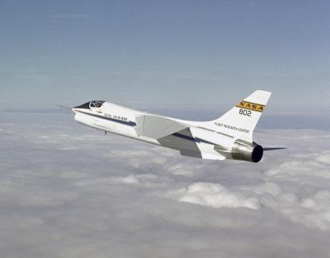
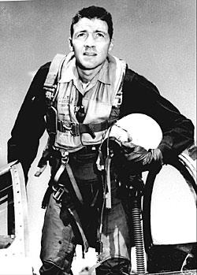
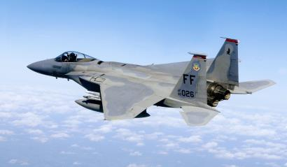
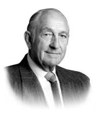
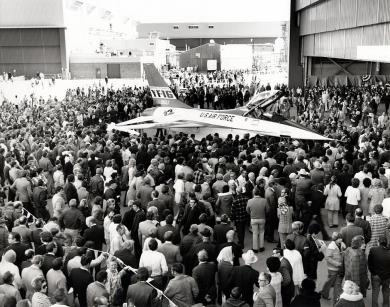
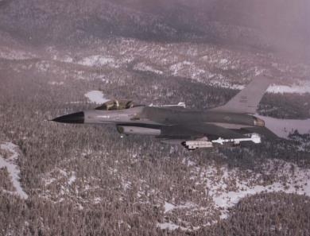
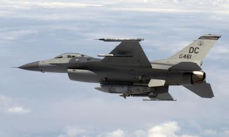
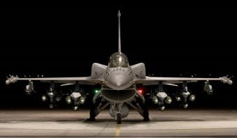

# Aircraft History

The history of the F-16 is closely linked to the history of fly-by-wire. Fly-by-wire substitutes the traditional
hydromechanical link between pilot and control surfaces for a computer. When the pilot moves the stick left,
they are essentially telling the fly-by-wire computer that they wish to bank left; it’s then up to the computer to
decide how to translate that command into a series of control surface deflections. Fly-by-wire opened the door
to aircraft designed with relaxed static stability: designs that would be too unstable for a human pilot to fly
manually, but whose instability translated to improved maneuverability.

The F-16’s pioneering fly-by-wire system is owed to a man named Harry Hillaker. In the 1940s, fresh out of
college, Hillaker joined Consolidated Aircraft as an aircraft designer. There Hillaker contributed to the designs of
the B-36 Peacemaker and the F-111, among others, and in doing so, he began to lament a trend among Air
Force aircraft: Each new generation was becoming bigger, heavier, and less efficient. By the mid-1960s,
Hillaker started contemplating a small, agile fighter that forsook contemporary Air Force dogma.
While Hillaker pondered his new fighter, NASA was breaking
ground on fly-by-wire technology. Fly-by-wire was first used on
the Gemini 2 capsule, and ultimately made its way to the Apollo
lunar landers, where it impressed astronaut Neil Armstrong.
Following the cancellation of the Apollo program, Armstrong was
promoted to Deputy Associate Administrator for Aeronautics at
NASA. Wanting to further investigate fly-by-wire technology,
Armstrong acquired a lunar lander computer, and had it installed
in an F-8 Crusader, to be used as a testbed for airborne fly-by-
wire. This F-8, designated NASA 802, flew in May of 1972, thus
becoming the United States’s first fly-by-wire aircraft. NASA 802
caught the notice of Hillaker, who noted the drastic improvement
in control responsiveness, a full 2.5 times that of an unmodified
F-8.

## The Fighter Mafia

Few fighter pilots are as well-known (or notorious) as Col. John Boyd. Following a
1953 tour in Korea as an F-86 Sabre pilot, Boyd attended the USAF Fighter
Weapons School, where he quickly became a star pupil. His outstanding
performance earned him an invite to return as an instructor, and through the
1960s, Boyd worked as teacher and tactician, conceiving of and developing his
energy-maneuverability theory. E-M theory was an entirely novel analysis of
aircraft combat, with a quantifiable underpinning contributed by mathematician
Thomas Christie. Boyd and Christie crunched the numbers using Air Force
computers, and the results led Boyd to the conclusion that a fighter with maximal
thrust-to-weight ratio and minimal energy loss in turns would hold a competitive
advantage over contemporary designs, which emphasized bigger, heavier engines
and airframes.

In the late 1960s, in an effort to continue to push his ideas, Boyd put together a
team of likeminded experts: The “Fighter Mafia.” Among them was Harry Hillaker of
Consolidated Aircraft, which had since been sold to General Dynamics. The Fighter
Mafia worked from inside the Air Force to advance the concept of a lightweight fighter.

In 1967, Boyd was recalled to USAF headquarters to apply his E-M theory to the flagging F-X project. The F-X
project was to be the next generation USAF fighter aircraft, but it had stalled amidst doubts among USAF
generals that it had become too large and costly. Boyd’s analyses helped convince the Air Force to reduce the
weight and complexity of the F-X. The lighter F-X proposal would be nicknamed the F-X “Blue Bird,” but Boyd
and the Fighter Mafia continued to push for an even smaller, even more nimble air superiority fighter, which
they called the F-X “Red Bird.”

The Fighter Mafia was a diverse group of fighter pilots and engineers, but they all had in common a desire to
see the Air Force adopt a lightweight fighter design. This put them squarely at odds with the Air Force brass,
most of whom leaned heavily on the upcoming “Blue Bird.” The F-
X program was seen as a sort of rebirth for the USAF fighter
inventory, at this time comprised mostly of F-111s and F-4s. The
F-111 had by then evolved into something ungainly and sluggish,
and the F-4 was thought of as the Navy’s bird, something the Air
Force adopted only afterwards. The F-X represented a prideful
Air Force future, embracing its “higher, faster, further” motto, and
many in the USAF command ranks were emotionally invested in
an aircraft that embodied those words.

The F-X program continued undeterred. In 1970, the Air Force
announced that McDonnell-Douglas was selected to develop the 
F-X, now designated the F-15 Eagle.

## Lightweight Fighter Program

Towards the end of the 1960s, the Deputy Secretary of Defense, David Packard (of Hewlett-Packard) had
become concerned that the upcoming USAF and Navy frontline fighters — the F-15 and the F-14 Tomcat —
represented future budget problems for the Armed Forces. The Fighter Mafia had continued to push the USAF
towards their “Red Bird” concept, now also known as the F-XX. Their studies also helped convince
manufacturers such as General Dynamics and Northrop to start investigating potential lightweight fighter
designs. In late 1970, as the F-14 continued to experience budget and maintenance issues, Lockheed-Martin
took the initiative and delivered to Packard an unsolicited proposal for a lightweight fighter. Other companies in
the industry quickly followed suit, including General Dynamics.

Deputy SecD Packard had been looking to implement a new “fly-before-you-buy”
purchasing policy and had become recently enamored of competitive prototyping. He
saw the new LWF proposals to advance his ideas. The Air Force was still lukewarm to
the idea of a lightweight fighter, until the Fighter Mafia coined the “high/low mix” — the
concept that the F-15 and F-XX would complement each other, occupying the high-cost
and low-cost brackets of Air Force spending, respectively. The high/low mix idea
reframed the LWF as an ally to the F-15, and lifted resistance among Air Force brass.

Packard’s Lightweight Fighter RFP produced five proposals, among which two were
selected for funding: The General Dynamics Model 401, and the Northrop P-600. Each
company would be granted funding to build demonstrator aircraft, which would be
tested against each other in a series of trials — the fingerprint of Deputy SecD
Packard’s influence. The P-600 would be redesignated the YF-17, and the Model 401
would become the YF-16.

## Air Combat Fighter Competition

At General Dynamics, Robert. H Widmer became the chief engineer on the YF-16 project. At Harry Hillaker’s
insistence, the YF-16 was to incorporate a production fly-by-wire system — but as the engineers were still
uncertain if fly-by-wire was feasible, the YF-16 program was designed with a contingency. Should it be
necessary, the YF-16’s wings could be shifted aftward to restore the airframe’s static stability, and the analog
fly-by-wire system was designed to be easily removable and replaced with traditional flight controls.

Along with its revolutionary control system, the YF-16 became a
testbed for other innovations: The aircraft would be capable of 9-g
maneuvers, and the seat was reclined 30° to improve the pilot’s g-
tolerance. The reclined seat, and concern about the pilot’s ability to
manipulate systems during high-g maneuvering, guided the
development of its HOTAS, which put more capability on the stick
and throttle than prior aircraft. The small cockpit necessitated that
the stick be moved to the side, so that it wouldn’t obscure cockpit
instruments.

In December 1973, the completed YF-16 prototype was unveiled at
Edwards Air Force Flight Test Center, where it began flight trials.
Its first flight on January 20, 1974 was unintended: During a fast-
taxi run, a fault in the fly-by-wire system created a worsening
control problem that forced the test pilot to lift off for a trip around
the pattern. The actual, intended first flight occurred a few weeks
later in February, following repairs of the prototype.

The Air Force had set the initial stakes of the LWF competition by committing to purchasing 650 aircraft of
whichever model won. But by early 1974, interest in the Lightweight Fighter competition had grown, and as
word spread to NATO allies, other countries began committing to purchases of the winner as well. In response
to the heightened interest, the LWF competition was expanded into a new program called Air Combat Fighter
(ACF). The ACF program specified a multirole lightweight fighter aircraft and required that any purchase of the
winning model must also be in parallel to a purchase of F-15s. This requirement shut down the last of the
resistance to the LWF program within the Air Force.

The expanded ACF program brought in foreign competitors, among them Dassault-Breguet, SEPECAT, and
Saab. Ultimately, after flying 330 trial sorties spanning 417 flight hours, test pilots unanimously favored the YF-16. 
So it was January 13, 1975 when Secretary of the Air Force John L. McLucas announced that General
Dynamics had won the ACF competition, and with it, hundreds of domestic and foreign orders for the F-16.

## The F-16A and B

Through 1974 and 1975, General Dynamics developed the YF-
16 into the F-16, making numerous structural modifications. What
was originally envisioned as Boyd’s lightweight fighter now had to
become a multirole aircraft, per the ACF program requirements.
The radome was enlarged to fit the AN/APG-68 radar, and two
more pylons were added. These and other changes ultimately
netted a 25% weight increase.

So much was the Air Force’s desire to keep the new fighter from
impinging on the F-15’s glory, that Air Force brass prohibited the
F-16 from carrying AIM-7 Sparrows, the medium-range BVR
missile of the day. (This requirement would impel one of the
Fighter Mafia, General Mike Loh, to order the design of a
medium-range missile that could be mounted on AIM-9
Sidewinder stations — a project that would ultimately produce the
AIM-120 AMRAAM.)

In late 1975, the first F-16A FSD (full-scale development) was manufactured, and on October 20, 1978, the first
production model rolled off the assembly line. The production F-16A first flew in November of that year, and the
Air Force received its first delivery in January. The F-16 entered operational service with the 388th Tactical
Fighter Squadron at Hill AFB, Utah in 1979. A year later, the F-16 was given the official moniker of “Fighting
Falcon” — but of course, its pilots called it the “Viper.”

In all, 475 F-16As and Bs (dual-seat variant) were produced. The model variant spanned blocks 1, 5, 10, 15,
and 20. Many Block 20 F-16As have since undergone the Mid-Life Upgrade (MLU), becoming functionally
equivalent to F-16Cs.

## The F-16C and D

On June 12, 1987, the block 30 F-16 was introduced, designated the F-16C and D. Block 30 was the result of
the Alternative Fighter Engine (AFE) program, a project to allow the F-16 to be configured with either the
existing Pratt & Whitney F100-PW-220 engine, or with the General Electric F110-GE-100 as an alternative. The
original plan was for the F-16 to have a common engine bay, allowing any aircraft to swap between the two
engines. This idea was scrapped when it was discovered that the GE engine required widening the inlet. Due to
the airframe change, beginning with block 30, the blocks were split in two: The 30, 40, 50, and 70 blocks were
equipped with a GE engine, and the 32, 42, 52, and 72 blocks had a P&W.

Along with the diversity of engine choices, the block 30/32 Viper received an upgraded mission computer with
more storage, an AN/ALE-47 countermeasures dispenser, and the capability to employ AGM-45 Shrike and
AIM-120 AMRAAM missiles.

Block 30/32 F-16s would be delivered to the USAF Thunderbirds demonstration squadron in 1986 and 1987;
these aircraft are today some of the oldest still-operating F-16s. Other block-30/32s were delivered to the US
Navy, re-designated the F-16N, and used as stripped-down aggressor aircraft in USN air combat training.
The block 40/42 model, commonly called the “Night Falcon,” was
debuted in December 1988. As implied by its nickname, the Night
Falcon introduced a suite of night attack technologies, including the
LANTIRN navigation and targeting pods, and terrain-following
radar. The aircraft also got an upgraded fire control radar and
RWR, a holographic HUD capable of displaying FLIR video, and an
improved mission computer. The aircraft got an exterior makeover
as well: The hull was treated with radar-absorbent materials, and
the iconic gold-tinted canopy debuted. Despite all these
improvements, the USAF was in general disappointed with the
 increased weight and decreased performance of the Night Falcon
series.

January 1991 saw the start of Operation Desert Storm in Iraq, and with it, the F-16’s first combat deployment for
the USAF. On December 27, 1992, LTC Gary North of 33rd Tactical Fighter Squadron earned the first combat
kill in a USAF F-16 after shooting down a Syrian MiG-25 that violated airspace restrictions. The MiG-25 was
also the first aircraft destroyed by an AIM-120 AMRAAM.

In October of 1991, block 50/52 rolled out, restoring the Viper’s performance and maneuverability. The aircraft
got an up-rated engine (the F110-GE-129 or the F100-PW-229), and with it a 20% increase in thrust. The radar
was again upgraded, integrated datalink modem (IDM) support was added, and the block-40’s holographic HUD
was replaced with the original block-30 HUD. Some block 50 Vipers were configured to carry the advanced
HARM Targeting System (HTS) pod; these SEAD aircraft were designated the F-16CJ and DJ.

The F-16C continues to see improvements and upgrades to keep it in step with technological innovations.
Between 2003 and 2010, the Air Force’s Common Configuration Implementation Program (CCIP) modernized
and standardized the avionics and capabilities across the fleet of block-40 and block-50 F-16Cs. The FCC was
upgraded, the MFDs were replaced with new color displays, support for JHMCS and Link 16 was added, and
the IFF was modernized. F-16CJ and DJ SEAD models that underwent modernization through this program
were redesignated the F-16CM or DM.

Today, while the USAF no longer purchases F-16s, it still operates a
fleet of over 1,000 active-duty F-16Cs and Ds. F-16s have served in
virtually every US air combat action since Operation Desert Storm, and
F-16s are scheduled to continue to remain in service until 2025, when
they will be replaced with the F-35A Lightning II.

Aside from the US, twenty-six other countries have purchased or leased
F-16s, and all but one (Italy) continue to fly them as an integral part of
their air forces. After purchasing General Dynamics, Lockheed-Martin
 continues to improve on the F-16 for foreign customers. The United Arab
Emirates funded development of the F-16E and F models (block 60), and
many other countries have pledged to purchase the upcoming F-16V (block 70/72). The V model is expected to
be delivered to buyers starting in 2023.

{!abbr.md!}
