# F-16C Stores

## M61A1 Vulcan 20mm Cannon

The F-16 is equipped with an M61 Vulcan internal cannon. The M61 fires
standard M50 20mm rounds at 6,000 rounds per minute. It is effective
against both surface and air targets. The ammunition drum carries 510
rounds.

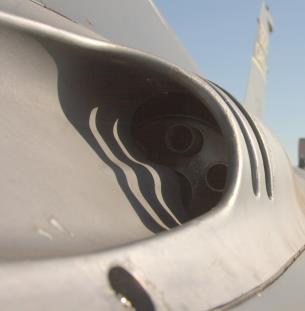

In DCS, you can load the following ammunition types:

**HEI**. High-explosive incendiary rounds. HEI rounds have both explosive
and incendiary effects, making them effective against personnel and light
vehicles.

**HEI-T**. High-explosive incendiary rounds with tracer mix. Tracer rounds
are substituted for HEI rounds at regular intervals. The tracer rounds
glow brightly when fired, allowing the pilot to visually see the ballistic path 
of the fired projectiles.

**AP**. Armor-piercing rounds. Armor-piercing rounds are made from depleted uranium, making them able to
penetrate many layers of armor. They have no incendiary or explosive effects upon impact, and as such as less
effective against personnel.

**TP**. Target practice rounds. TP rounds are inert with only kinetic effects upon impact. TP mix always contains
tracer rounds at regular intervals.

**SAPHEI**. Semi-armor piercing high-explosive incendiary rounds. These rounds have both incendiary/explosive
effects and armor-piercing capability. The rounds are constructed such that the incendiary and explosive effects
are triggered after penetration of the armor. SAPHEI rounds are effective against a wide range of vehicles but
are not generally effective against personnel.

## AIM-9 Sidewinder

The AIM-9 Sidewinder is an infrared-guided (heat-seeking) short-range air-
to-air missile. It first entered service in 1956 and has since become one of
the most successful missiles in the West. Its longevity is thanks to its
versatility and continued improvement over multiple generations.

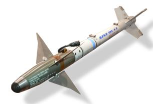

The AIM-9 uses an array of up to five scanning infrared sensors, cooled by
an internal argon bottle (L and M models). The Sidewinder has a maximum
speed of over Mach 2.5 and a maximum range of around 10 to 20 miles,
depending on the variant. Minimum range is around 3,000 feet. 

A single AIM-9 can be mounted on any of the F-16’s air-to-air stations.
AIM-9L Sidewinder. The 1977 “Lima” model was the first all-aspect Sidewinder, meaning it no longer required
the target to present a rear profile. The AIM-9L earned its first kill when it struck a Libyan Su-22, after being
fired from an F-14 Tomcat, in the infamous Gulf of Sidra engagement of 1981.

**AIM-9M Sidewinder**. The 1982 “Mike” model improved on the Guidance Control Section (GCS). Susceptibility
to flares was reduced, and background discrimination was improved, resulting in a greater chance of lock-on.
The motor’s smoke signature was reduced, making the missile less likely to be detected.

**AIM-9X Sidewinder**. The 2003 “X-ray” model is the latest iteration of the Sidewinder. The X-ray adds high off-
boresight (HOBS) capability and the ability to slave the seeker head to the JHMCS. The missile’s
maneuverability was boosted with all-axis thrust-vectoring capability. These changes allow the pilot to simply
“point their head and shoot” in nearly any direction, and the missile will make its way to the target. The infrared
sensor was replaced with focal-plane arrays (FPAs) and counter-countermeasures capability was improved
further. Electronic fuzing was added to reduce minimum range.

**CAP-9M**. Captive variant of the AIM-9M. The captive variant has the same size, weight, and drag
characteristics as the AIM-9M, for training effectiveness. It also contains an integrated infrared sensor and will
provide audio and visual guidance cues to the pilot, but it does not have a motor and does not release from the
aircraft.

## AIM-120 AMRAAM

The AIM-120 AMRAAM is an active radar homing (ARH) medium-
range air-to-air missile. First introduced in 1982, the AMRAAM was
intended to replace the semi-active radar homing AIM-7 Sparrow,
which was the medium-range BVR missile in the US inventory at
the time.

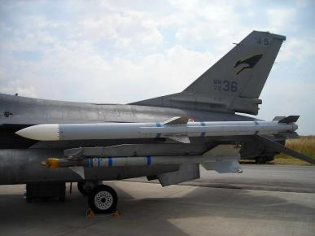

The AIM-120 uses both command guidance and radar homing to
reach its target. The AIM-120’s integral radar has a comparatively
short range, and so until the missile is within that range, it is guided
by datalink commands sent automatically from the launching
aircraft. The AMRAAM has a maximum speed around Mach 4 and
a maximum range of 30 to 40 miles. 

**AIM-120B AMRAAM**. This 1994 variant is the earliest variant still in production.

**AIM-120C AMRAAM**. The 1996 variant improved target detection, homing capability, and fuzing.

## AGM-88 HARM

The AGM-88 High-speed Anti-Radiation Missile (HARM) is a passive
radar homing air-to-ground missile used in the suppression of enemy
air defenses (SEAD) role. The HARM has a radar receiver and
processor that detects and identifies signals from enemy surface
radars. When launched, it can guide to the target by homing on its
specific radar emissions. The missile also has an inertial guidance
system to provide mid-course guidance prior to detection of the radar
signal (or if the signal is lost).

The AGM-88 has a maximum speed of Mach 1.84 and an operational
range of around 80 nautical miles. It uses a laser proximity fuze for
detonation.

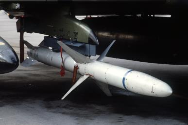

**AGM-88C**. This mid-1980s variant incorporates field-reprogrammable
software and improved guidance and fuzing.

## AGM-65 Maverick

The AGM-65 Maverick is a medium-range air-to-ground missile
designed for the close air support role. The AGM-65 family contains
a diverse set of variants and guidance systems, including infrared,
electro-optical, and laser guidance.

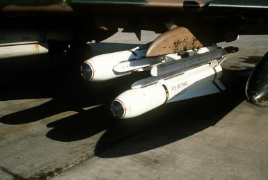

The AGM-65 has a maximum range of around 13 nautical miles. It
was first delivered in 1972. A single Maverick can be mounted to an
LAU-117 rack, or up to 3 can be carried on an LAU-88 rack.

**AGM-65D Maverick**. The D model contains an imaging infrared
sensor and guidance system. The sensor can locate and tracking
targets during daylight and night, in clear or restricted-visibility 
weather conditions. It contains a 126-pound shaped-charge warhead.

**AGM-65G Maverick**. The G model has the same guidance system as the D model, but with a larger 300-pound
penetrating warhead, making it more effective against hardened targets.

**AGM-65H Maverick**. The H model uses a digital CCD sensor, making it effective in daylight only. The H model
is capable of forced correlation and does not require a target centroid to track. It contains a 126-pound shaped-
charge warhead.

**AGM-65K Maverick**. The K model has the same guidance system as the H model, but with a larger 300-pound
penetrating warhead.

## CBU-87 CEM

The CBU-97 Combined Effects Munitions (CEM) is an unguided cluster
bomb. It was first developed in 1986. Each bomb contains an SUU-
65/B canister and 202 submunitions. The submunitions have both
fragmentation and incendiary effects and are effective against both
vehicles and personnel.

After being released, the CBU-87 begins spinning. It falls to a
preprogrammed burst altitude, at which point the canister separates
and the submunitions are dispersed.

The CBU-87 can be mounted directly to any air-to-ground pylon, or up
to three can be mounted on a TER-9A triple ejector rack.

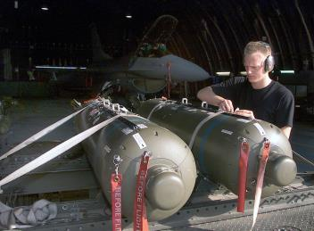

## CBU-97 SFW

The CBU-97 Sensor Fuzed Weapon (SFW) is an unguided cluster
bomb containing target-discriminating submunitions. Each bomb
contains a SUU-66/B canister and 10 BLU-108 submunitions. When the
bomb approaches its preprogrammed burst altitude, the canister opens
and all 10 submunitions are released. The submunitions deploy
parachutes at preprogrammed intervals to increase lateral spacing.

Once the submunitions reach the burst altitude, the parachute is
separated, and a rocket motor spins the submunition and stops its
descent. Each submunition contains four “skeets,” which are then released in four different directions.
The skeets have ground-facing laser and infrared sensors. Both sensors are used to detect the presence of a
vehicle. When a vehicle is detected, the skeet detonates, firing an explosively formed projectile (EFP)
downward toward the vehicle. The EFP strikes the radiative part of the vehicle (usually the engine) and
penetrates its armor at high speed.

The skeets do not detonate if a vehicle is not detected, instead self-destructing before reaching the ground. This
helps reduce collateral casualties associated with the use of cluster munitions.

The CBU-97 can be mounted directly to any air-to-ground pylon, or up to three can be mounted on a TER-9A
triple ejector rack.

## Paveway II Laser Guided Bomb

The Paveway II is a series of laser-guided bombs based on
conventional general-purpose bombs. The guidance kit consists of a
laser detector and processor in the front and a set of steering fins in the
back. The bomb detects and tracks reflected laser energy off a target.
The laser designation can come from the launching aircraft, another
aircraft (“buddy lasing”), or from a laser-capable ground unit such as a
JTAC.

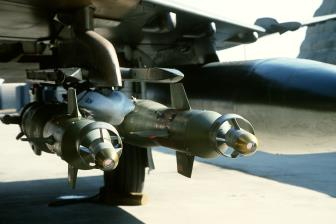

The Paveway II series was introduced in the early 1970s to replace the
first-generation Paveway series of laser-guided bombs. The Paveway II
improved sensor reliability and added extendible rear fins to extend 
glide range. The Paveway II series uses “bang-bang” control (where the
fins can only deflect fully in either direction), limiting its maximum range and forcing it to follow a sinusoidal path
to the target.

The Paveway II series of weapons can be mounted on any air-to-ground pylon. The GBU-12 can be mounted in
pairs using a TER-9A triple ejector rack.

**GBU-12**. Paveway II bomb based on the Mk. 82, a 500-pound conventional bomb.

**GBU-10**. Paveway II bomb based on the Mk. 84, a 2,000-pound conventional bomb.

## Joint Direct Attack Munitions (JDAM)

JDAM is an inertial and GPS guidance kit that can be applied to a
general-purpose bomb. When equipped with a JDAM kit, the
bomb can attack a pinpoint target based on coordinates
downloaded from the aircraft. It is not capable of post-launch
redesignation or attacking moving targets. JDAM precision is not
degraded by weather and is completely fire-and-forget.

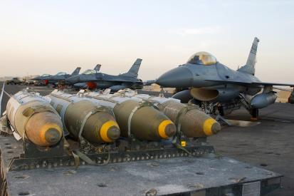

JDAM development began in 1992 from a proposal for an
adverse-weather precision-guided munition. The proposal was
created in response to degraded laser-guided bomb performance
during Operation Desert Storm. The first JDAM kits were
delivered to the US military in 1997, and the first employment
was from a B-2 during Operation Allied Force. 

**GBU-38**. Mk. 82 500-pound bomb with JDAM guidance kit.

**GBU-31(V)1/B**. Mk. 84 2,000-pound bomb with JDAM guidance kit.

**GBU-31(V)3/B**. BLU-109 2,000-pound hardened penetration bomb with JDAM guidance kit.

## AGM-154 Joint Standoff Weapon (JSOW)

JSOW is an inertially-aided glide bomb with exceptional glide
range due to its folding wings. Like JDAM, JSOW can attack
pinpoint targets using pre-designated GPS coordinates. JSOW
precision is not degraded by weather and the bomb is
completely fire-and-forget.

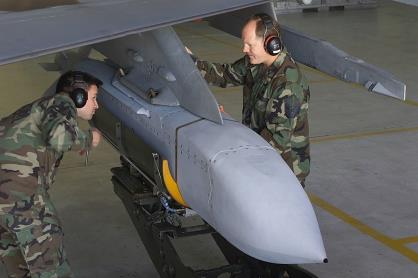

JSOW entered service in January 1999. Range is dependent on
launch parameters, especially the altitude and speed of the
aircraft at release. For high-altitude launches, the bomb can
glide as far as 70 nautical miles.

**AGM-154A**. The baseline AGM-154 variant consists of 145 BLU-
97/B combined effects submunitions, with both armor-piercing
and incendiary effects. These submunitions are identical to the 
ones used in the CBU-97. The AGM-154A cannot be re-targeted
after launch.

## Wind-Corrected Munitions Dispensers (WCMD)

WCMD (pronounced “wick-mid”) is a tail kit for the CBU-87 and
CBU-97 cluster weapons. When equipped with WCMD, these
munitions become precision-guided. The tail kit includes an
integrated INS which is initialized from the aircraft’s onboard GPS
position just before release. The WCMD guidance system can also
be programmed with the winds aloft to enhance accuracy, giving it
down to an 85-foot circular error probable (CEP).

**CBU-103**. CBU-87 Combined Effects Munition (CEM) equipped
with WCMD.

**CBU-105**. CBU-97 Sensor-Fuzed Weapon (SFW) equipped with
WCMD.

## Mark 80-Series General-Purpose Bomb

The Mk. 80-series of general-purpose bombs is a series of unguided
bombs dating back to the Vietnam War. The bombs come in nominal
weights of 500, 1,000, and 2,000 pounds. The bombs are very versatile,
and they can be fitted with both nose and tail fuzes, as well as different
guidance kits.

GP bombs can be fitted to any air-to-ground pylon. The Mk. 82 can also
be mounted to a triple ejector rack (the TER-9A) in pairs or triples.
Mk. 82. A general-purpose bomb with a nominal weight of 500 pounds.

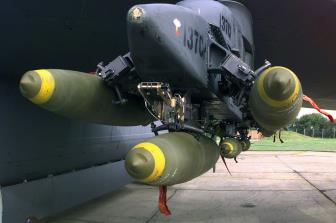

**Mk. 82 Snakeye**. A Mk. 82 with retarding petals that extend after
release. The petals reduce the bomb’s downrange speed after release, allowing aircraft to perform low-level
straight-through deliveries at lower altitudes without risk of frag damage.

**Mk. 82 AIR**. A Mk. 82 with an Air Inflatable Retarder (AIR). The AIR is a ballute that expands after release,
performing the same retarding function as the Snakeye. The AIR is a newer technology and is more effective
than the Snakeye, making the bomb safe to use at higher speeds than the Snakeye.

**Mk. 84**. A general-purpose bomb with a nominal weight of 2,000 pounds.

## Rockets

The LAU-3 is a rocket pod that can carry up to 19 folding-fin aerial rockets
(FFARs). It is designed to carry Hydra 70mm FFARs but can carry any 70mm
rocket. The Hydra 70 is a versatile rocket that accepts many different types of
explosives and fuzes. The LAU-3 can be loaded on any air-to-ground pylon.

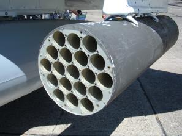

In DCS, you can load the following FFAR variants:

**MK151 HE**. A high-explosive warhead with fragmentation effects, effective
against personnel and light vehicles.

**MK156 WP**. A non-lethal white phosphorous warhead that creates a smoke
effect when loaded. Used for aerial target designation. 

**MK5 HEAT**. A high-explosive anti-tank warhead that has both fragmentation
and armor piercing effects, usable against personnel and most vehicles.

**MK61 WP**. A white phosphorous warhead intended for training use.
WTU-1/B WP. A white phosphorous warhead intended for training use.

## Fuel Tanks

External fuel tanks carry additional fuel to increase the F-16’s range and
combat radius. Like most munitions, the fuel tanks are capable of being
jettisoned when needed. The external tanks can be refueled during air-to-air
refueling. The weight of the tank depends on the amount of fuel carried.

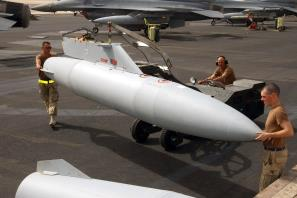

**370-gallon tank**. The 370-gallon variant adds approximately 2,500 pounds of
fuel. It can be carried on pylons 3 and 7.

**300-gallon tank**. The 300-gallon variant adds approximately 2,000 pounds of
fuel. It can only be carried on pylon 5.

## AN/AAQ-28 LITENING II Targeting Pod

The AN/AAQ-28 LITENING II is an electro-optical and infrared targeting pod that can be attached to the right
chin hardpoint on the F-16. It includes a steerable camera with a wide zoom range, capable of daylight and
nighttime target detection and laser designation.

## BDU-33

The BDU-33 is an inert, releasable training munition with the same weight and drag profile as the Mk. 82
general-purpose bomb. Upon impact, the BDU-33 releases a smoke cloud that can be used to identify the
impact point.

The BDU-33 can be loaded in sets of three on the TER-9A triple ejector rack.

## AN/ASQ-T50 TCTS Pod

The AN/ASQ-T50 is a Tactical Combat Training System (TCTS) pod. It incorporates a sensor platform and
datalink transceiver, allowing it to record and transmit real-time aircraft telemetry to monitoring stations. TCTS
pods are used during training exercises to monitor and record aircraft positions, for many purposes, including
debriefing analysis.

The TCTS pod is captive and cannot be released. It can be mounted to either outboard wingtip station.

## MXU-648 Travel Pod

The MXU-648 is a travel pod, used to transport equipment or the pilot’s belongings when the aircraft is
repositioned. The MXU-648 has a maximum load capacity of 300 pounds, and an internal volume of 4.75 cubic
feet.

The MXU-648 can be mounted on any air-to-ground pylon.

{!abbr.md!}
