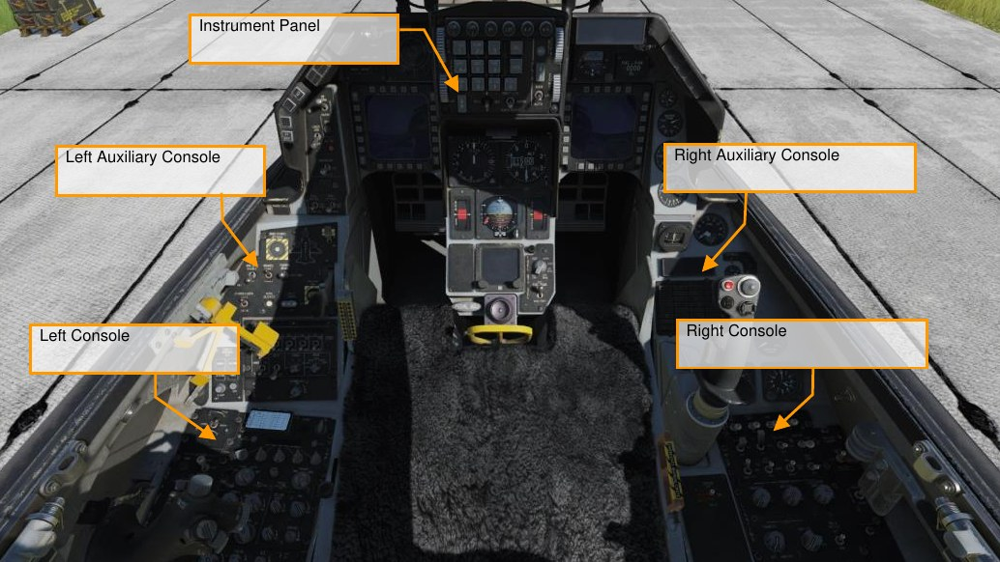
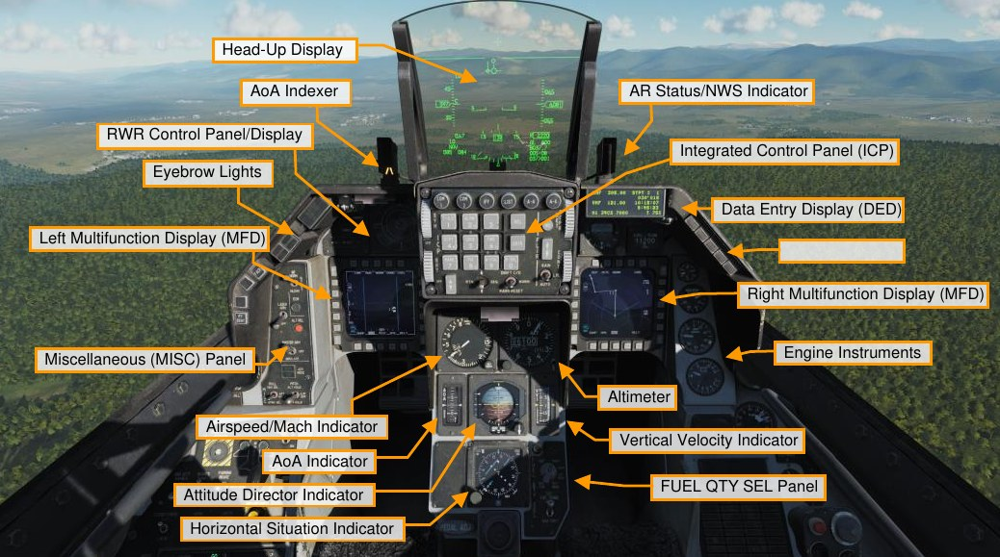
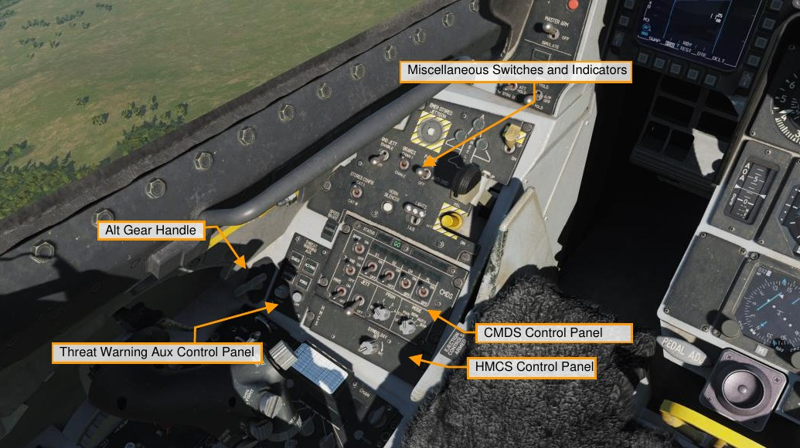
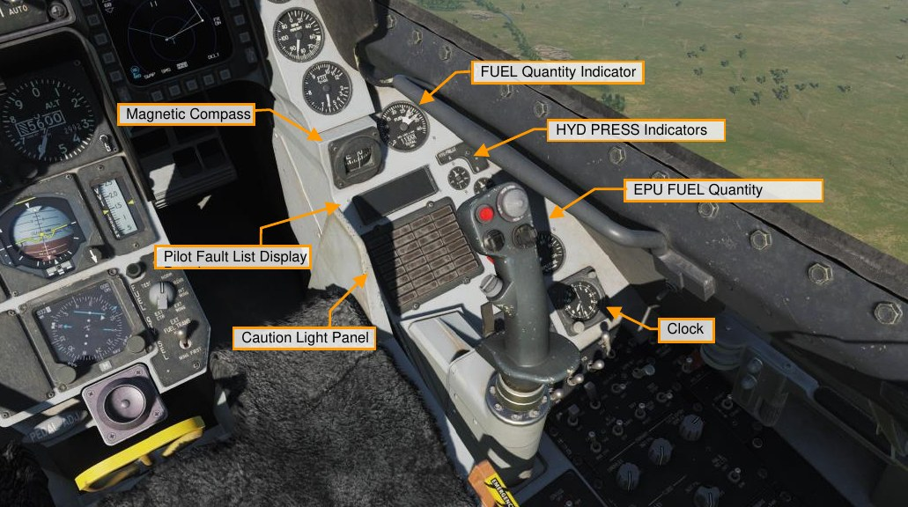
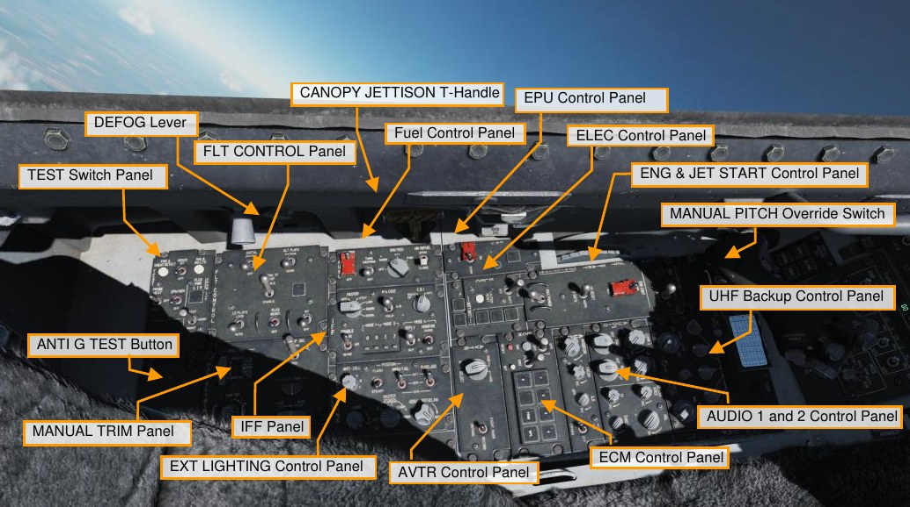
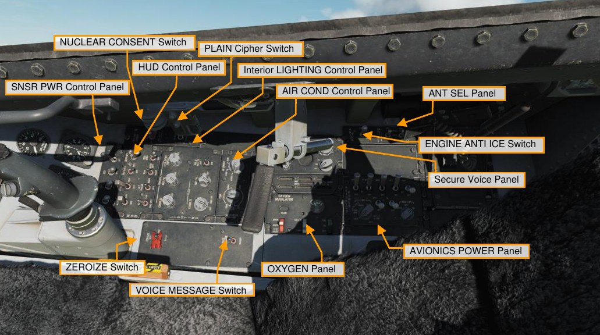

# Cockpit Overview

Once in the cockpit, it’s best to have a general understanding of where the various controls are located. To help
locate items more easily, we have broken the cockpit into five primary areas: Left Console, the Left Auxiliary
Console, the Instrument Panel, the Right Auxiliary Console, and the Right Console.

We will reference these locations in later sections of this manual.

## Instrument Panel

### Head-Up Display (HUD)

The HUD provides flight symbols relating to attack, navigation, weapon, aiming, and landing modes. It also
provides symbols for essential aircraft performance data including altitude, airspeed, attitude, and heading.

### AoA Indexer

The angle of attack indexer consists of three lights. If the top light is illuminated with a red chevron, you are
above 14° of angle attack and you are pulling with an energy depleting angle of attack. If the center, green circle
is illuminated, your angle of attack is between 11 and 13 degrees and you are on-speed with optimal angle of
attack; and if the lower light with an amber chevron is illuminated, your angle of attack is below 11° and you are
energy gaining with an angle of attack less than optimum. This is duplicated on the angle of attack gauge on the
instrument panel and the angle of attack bracket on the HUD, which is only visible with the gear down.

When landing, you will be shooting for between 11 and 13 degrees of AoA. Also note that these lights are
always on, not just with gear down.

### AR Status/NWS Indicator

The center NWS light illuminates green when nosewheel steering is engaged. When engaged, rudder pedal
movement allows steering of the nosewheel. When performing aerial refueling the top ready light is blue and
indicates the door is open and ready, the middle AR light is green when the refueling boom is latched, and the
bottom disconnect light is displayed when a disconnect occurs.

### Integrated Control Panel (ICP)

The integrated control panel, or ICP, fills the top portion of the center instrument panel and is one of the core
systems of the communications, navigation, and IFF, or CNI, in the Viper. This is covered in its own section
below.

### Data Entry Display

The data entry display, or DED, provides a display of communication, navigation aids, and identification, termed
CNI, and weapon delivery related information. Manipulation of the DED is done with the ICP.

### RWR Prime Control Panel/Azimuth Display

The ALR-56M threat warning azimuth indicator is the radar warning receiver scope in the Viper. It is a plan-form
design with your aircraft in the center and emitters projected 360° around it. To the left of the scope are the
threat warning indicator lights.

### Eyebrow Lights

**IFF Identification Light**. Pressing the IFF identification button initiates and IFF response to an interrogation or
request from air traffic control.

**Fault Acknowledge Light**. When a fault appears on the Pilot Fault List Display, or PFLD, the fault
acknowledge button is pressed to clear the fault.

**Master Caution Light**. The master caution light will illuminate anytime a caution light is lit to indicate
malfunction or specific condition has occurred. It can be reset by pressing on the light button.

### Left and Right Multifunction Display (MFD)

The left multifunction display, or MFD, consists of a full color CRT screen with 20 surrounding option select
buttons, or OSBs, in four groups of five. At the corners of the MFD are rocker switches for display gain, symbol
brightness, contrast, and display brightness.

### Miscellaneous (MISC) Panel

**Autopilot Roll and Pitch Switches**. The two autopilot switches allow you to set pitch and roll. The pitch switch
can be set to ALT HOLD to maintain the current altitude, the A/P OFF setting turns it off, and the ATT HOLD
setting sets the aircraft to maintain the current pitch/roll attitude. The roll switch includes the HDG SEL setting to
have the aircraft turn to and maintain the heading selected with the bug on the HSI, ATT HOLD maintains the
current roll/pitch attitude, and STRNG SEL directs the autopilot to steer to the selected steerpoint on the DED.
Both switches can be used in unison.

**ADV Mode Switch**. The terrain avoidance button here is for terrain following radar and not used in the Block 50
Viper.

**Master Arm Switch**. The master arm switch has three positions. In the off position, weapons release is
inhibited except for an emergency jettison. In ARM and SIMULATE the radar and store management system
operate normally, but no weapons can be released in SIMULATE. SIM mode is normally used in training to get
weapons symbology without actual release/launch, except for an emergency jettison.
ALT Release Button. The alt release button functions as a backup to the weapons release button on the
control stick in case of its malfunction.

**Laser Arm Switch**. If a targeting pod is loaded, the laser arm switch arms the laser.
ECM Enable Light. When ECM is transmitting, the ECM light will illuminate.

**RF Switch**. The radio frequency, or RF, switch, is a three-position switch that allows you to control emissions
from your aircraft. When set to silent, all electronic signals for the aircraft are disabled, to include the radar,
radar altimeter, data link, TACAN transmit, and ECM. In quiet mode though, the radar, TACAN, and data link
transmit but all other emissions are inhibited.

### Warning Lights

**Engine and Engine Fire Warning Lights**. Along the right eyebrow are a series of split emergency lights that
often require immediate action when illuminated. The Engine light will illuminate when RPM and FTIT indicator
signals indicate an over-temperature, flameout, or stagnation has occurred. This means an RPM of less than 60
percent or an FTIT of 1000 Celsius or more. The Engine Fire light illuminates if a fire is detected in the engine
bay.

**Hydraulic and Oil Pressure Warning Light**. Both the hydraulic and oil pressure lights will illuminate if the oil
pressure falls below 10 psi for more than 30 seconds, or if either the A or B hydraulic system is below 1000 psi.

**FLCS and DBU Warning Lights**. The FLCS warning light illuminates if a malfunction is detected with the FLCS
processors, power supplies, input commands or sensors, angle of attack, or air data inputs. It will also illuminate
if the leading-edge flaps are locked, or built-in test fails. The DBU light will illuminate if the FLCS digital back up
is enabled.

**Takeoff and Landing Configuration Warning Lights**. The takeoff and landing configuration light illuminates if
the landing gear is not down when the aircraft is below 10,000 feet, the airspeed is less than 190 knots, and the
descent rate is greater than 250 feet per minute. This will also correspond to the landing gear intermittent horn
sound.

**Canopy and Oxygen Low Warning Lights**. The canopy light is lit when the canopy is not down and locked
and the low oxygen light will illuminate if the oxygen system is below 5 PSI or there is a BIT test failure.

### Engine Instruments

**Oil Pressure Indicator**. The engine is equipped with a self-contained oil system to lubricate the engine and
gear box. The indicator reads between 0 and 100 PSI. Normal idle throttle PSI is around 15 when on the ground
and 60 when at military power and above.

**Engine Nozzle Position Indicator**. The engine nozzle is variable and consists of two sections, the divergent
nozzle that moves freely in conjunction with the nozzle. The nozzle is opened and closed by four hydraulic
actuators and the percentage the nozzle is open is indicted by this gauge.

**Engine RPM Indicator**. The RPM indicator indicates engine RPM as supplied by the engine alternator. It’s
expressed as a percentage value of 1 to 110.

**FTIT Indicator**. The Fan Turbine Inlet Temperature, or FTIT, indicates an average temperature in degrees
Celsius, and it can range from 200 to 1200 degrees in increments of 100.

### Airspeed and Mach Indicator

The Airspeed and Mach indicator is pneumatically powered by the pitot-static system. Airspeed is indicated by
the outside gauge and pointer between 80 and 850 knots, and Mach is indicated in the window near the top of
the indicator between 0.5 and 2.2 Mach. The red triangle on the indicator indicates the VNE, or velocity never
exceed.

### Altimeter

The altimeter is servo-pneumatic that can indicate altitudes between negative 1,000 to plus 80,000 feet. It has
both a primary electrically powered mode and a secondary pneumatic mode. If in secondary mode, the PNEU
flag appears on the gauge to indicate pneumatic mode.

The barometric setting knob allows you to input the desired altimeter setting, as indicated in the small window
below and to the right of the digital altimeter window.

### Angle of Attack Indicator

The angle of attack indicator duplicates the same information as on the angle of attack indexer next to the HUD,
but ranges between -5° and +32°. The tape is colored to match the indexer lights next to the HUD. The bar in
the center of the tape indicates your current angle of attack in relation to the center of the tape.

### Attitude Director Indicator

The attitude director indicator, or ADI, displays the aircraft’s pitch and roll attitude as supplied by the inertial
navigation system, or INS. The indicator also includes a turn rate needle in which one needle width equates to 1
to 1.2° per second turn rate and a ball, slip indicator.

The pitch trim knob can be used to adjust the sphere in relation to the aircraft symbol.
When the instrument landing system (ILS) is enabled, the ADI will also display localizer and glideslope bars with
associated off warning flags.

### Vertical Velocity Indicator

The vertical velocity indicator, or VVI, displays the rate of climb or descent on a moving tape with a range of
6,000 feet per minute in a climb or dive.

### Horizontal Situation Indicator

The horizontal situation indicator, or HSI, displays a plan-view with the aircraft in the center of the display. The
compass around the aircraft symbol is driven by the INS so that magnetic north is always read at the lubber
line.

The heading set knob allows you to set the heading indicators and the course knob allows you to set the
course.

### Fuel Quantity Select Panel

The Fuel Quantity Select panel allows you to determine what fuel information is displayed on the fuel gauge.

- Test will place both pointers at 2000 pounds and the totalizer should display 6000 pounds. Both fuel
low caution lights should illuminate.
- In NORM, the AL pointer indicates remaining fuel in the aft left reservoir and the A-1 fuselage tank,
and the FR pointer indicates the sum fuel in the forward right reservoir tank and the F-1 and F-2
fuselage tanks.
- Reservoir (RSVR) moves the AF and FR pointers to display fuel in the aft and forward reservoir
tanks.
- Internal Wing (INT WING) moves the AF and FR pointers to display fuel in the internal left and right
fuel tanks.
- External Wing (EXT WING) moves the AF and FR pointers to display fuel in the in the wing external
fuel tanks
- External Centerline (EXT CTR) moves the FR pointer to indicate the centerline external fuel tank
load.
- The External Fuel Transfer switch allows you control fuel transfer from the external tanks. NORM
transfers from the centerline tank then the wing tanks. WING FIRST transfers from the wing tanks first
then the centerline.

## Left Auxiliary Console

### Miscellaneous Switches and Indicators

**EMER STORES JETTISON Button**. The emergency jettison button will jettison all fuel tanks, carted
suspension racks, and free fall ordnance.

**WHEELS Down Lights**. These show the state of the mains and nosewheel. When green, the gear is down and
locked. When the landing gear is transit, the landing gear handle will shine red and when the main/nose gear
are in the position commanded by the gear handle, its light will turn off

**HOOK Switch**. This switch extends the hook for emergency arrestment on airfields equipped with an
arrestment system. Once the hook is dropped though, the hook cannot be fully retracted from the cockpit.

**ANTI-SKID Switch**. The brake switch can be set to anti-skid or parking brake modes.

**LANDING TAXI LIGHTS Switch**. The landing and taxi light switch allows you to set the lights for takeoff/landing
or taxi operations.

**DN LOCK REL Button**. The down lock override button mechanically unlocks the spring-actuated handle lock if
the electrical solenoid should fail or not be powered. It overrides all electrical LG control signals.

**LG Handle**. Movement of the handle operates electrical switches to command landing gear retraction or
extension. A warning light in the LG handle illuminates when the gear and doors are in transit or have failed to
lock in the commanded position. The warning light also illuminates when all LG are not down and locked,
airspeed is less than 190 knots, altitude is less than 10,000 feet, and rate of descent is greater than 250 feet per
minute.

**SPEED BRAKE Position Indicator**. The speed brake indicator has three possible indications, closed, open,
and no power. When closed the indicator displays closed, when open it has a series of nine dots, and when it
has no power, it has striped lines.

**STORES CONFIG Switch**. The stores configuration switch has positions for CAT I and CAT III. This generally
translates to CAT 1 being air-to-air load outs and CAT III being heavier air-to-ground load outs or lots of gas
under the wings. When set to CAT III the FLCS limits the angle of attack and onset rates in order to increase
departure resistance.

**HORN SILENCER Button**. The landing gear horn silence button allows you to turn off the audio horn when you
get below 190 knots, below 10,000 feet, trailing flaps extended, and the landing gear is not down and locked.
This generally warns you to lower the landing year, but you may also hear it if you get slow in a dogfight below
10,000 feet MSL.

**GND JETT ENABLE Switch**. The OFF position inhibits emergency jettison with the landing gear down and
weight on wheels and inhibits selective jettison and normal release functions with the landing gear down. The
ENABLE position permits all arming and release conditions, regardless of landing gear or weight on wheels
conditions. This is used during maintenance operations for checkout of the aircraft armament system.

**BRAKES Channel Switch**. The toe brakes can be initiated by either electrical channel 1 or 2, which also
operate the brake hydraulic valves. You will normally keep this set to channel 1.

### CMDS Control Panel

Controls and displays related to countermeasures dispenser set are located on this panel. Modes and programs
for chaff/flare dispensing and jammer use can be selected from here and activated using HOTAS controls on
your stick.

### Threat Warning Aux Control Panel

Controls for powering up and managing the RWR are located on this panel.

### ALT GEAR Handle

The alternate landing gear release handle lowers the landing gear in case of a hydraulic failure and/or inability
to lower the main landing gear handle.

### HMCS Control Panel

This allows flight and weapons cue information to be displayed on the helmet visor. Rotating the knob allows
you to turn it off and on and adjust its brightness.

## Right Auxiliary Console

### Magnetic Compass

The magnetic compass is a self-contained indicator which shows the heading of the aircraft in relation to
magnetic north.

### Fuel Quantity Indicator

The fuel gauge displays total remaining fuel in the digital window in pounds of fuel, and the two needles indicate
fuel in the aft and left, and forward and right. If the two needles become too divergent, indicating a fuel
imbalance, then red will be down at the base of a needle. In such a case, you would use the engine feed switch
on fuel panel to correct the imbalance.

### Hydraulic Pressure Indicators for System A and B

The hydraulic pressure in the A and B systems are indicated on the two gauges. Normal operation is between
2,850 and 3,250 PSI.

### Pilot Fault List Display

The Pilot Fault List Display, or PFLD, lists all FLCS detected faults. Two types of PFLDs are displayed: warning
level and caution level. Warnings are associated with the FLCS and have a bracket around them. Cautions are
associated with other FLCS elements, engine, and avionics systems. When a PFLD item is displayed, its
corresponding caution light indicator will illuminate and the and the master caution light will be lit. To clear a
PFLD fault, the fault acknowledge button is pressed.

### Caution Light Panel

The caution light panel consists of multiple lights associated with possible detected fault conditions.

### EPU Fuel Quantity Indicator

The EPU quantity indication shows the remaining supply of hydrazine as a percentage. At 100%, the EPU can
run for about 10-15 minutes.

### Clock

The clock is an 8-day, manually wound clock with a provision for an elapsed time of up to 60 minutes.

## Left Console

### Test Switch Panel

This panel includes the following controls and displays:

- A fire and overheat detection test button that tests the overheat detection system. This then triggers
the overheat caution light and the engine fire eyebrow light. These in turn trigger the master caution
light.
- The Pitot heat power and test switch allows heating of the data probes when in the on position. When
set to test, the probe heat caution light flashes after a good test.
- A test switch for the on-board oxygen generation system (OBOGS). This will trigger the low oxygen
eyebrow light.
- Emergency Power Unit (EPU) test switch tests the system after engine start.
- An indicator light test button that tests the warning and caution lights, as well as audio voice
messages.
- The flight control system (FLCS, pronounced “flick-us”) power test switch for the left and right A, B, C,
and D light indicators for the four redundant flight control channels. Below it is the FLCS test power
test switch, that when held to test, tests power output to the FLCS when the electrical power is first
set to battery.

### FLT Control Panel

As you might imagine, this panel allows you to set manual controls of the F-16’s flight control systems.
Normally, you don’t have to touch most of this because Viper’s flight control systems are highly automated.

- The Digital Back Up, or DBU switch, selects the FLCS backup software. If enabled, you will see the
DBU caution light and a HUD warning.
- The Alt Flap switch allows manual trailing edge flap engagement rather than the automatic schedule.
You would use this if you had a flap failure with asymmetric flap settings.
- The alternate manual TF fly-up switch is for terrain following radar, and this is not used on the Block
50 Viper.
- Manual or automatic control of the leading-edge flaps is available with the LE Flaps switch. This
allows the leading-edge flaps to be controlled based on the schedule or locked in place. The manual
setting might be used if one lead edge flap gets stuck and you need to have both leading-edge flaps
at the same setting.
- The FLCS Reset switch allows a reset of the FLCS warning and related lights, and it resets servo and
electrical FLCS system failures.
- The FLCS BIT switch commands a BIT test of the FLCS if there is weight on wheels. Running the BIT
test will run the flight control surface test sequence and something you’d do during start up. The
switch is magnetically held to the BIT position while the BIT is run, which lasts about 45 seconds.

    While running, the green BIT light illuminates. Once complete and successful, the light turns off and
the switch snaps back to center. A red fail light appears if a problem is encountered in the BIT, and
the failure would be listed on the pilot fault list display, or PFLD.

### Manual Trim Panel

Under normal flight conditions, you’ll never have to use this panel as the F-16 does a great job in auto-trimming
in pitch, but you can trim for pitch and roll using the trim switch on the control stick.

- In the top left corner of the panel is the roll trim wheel and indicator.
- In the bottom right corner is the pitch trim wheel and indicator.
- In the bottom left corner is the yaw trim dial without indicator.
- The trim autopilot disconnect switch allows you to disable control stick trim and autopilot mode in
case the trim hat on the stick malfunctions.

### Fuel Control Panel

The fuel control panel includes controls for fuel system management.

- On the leftmost side is the Master Fuel switch, which is guarded. It opens or closes the main fuel
shutoff valve. This is normally guarded to the on position.
- Next to it is the Tank Inerting switch that can pump non-volatile halon gas into the fuel tanks to reduce
internal pressure and reduce risk for fire during an emergency (e.g., from battle damage).
- To the right of that is the Engine Feed knob that energizes or de-energizes the fuel pumps and
maintains center of gravity with fuel loading.
- The engine feed dial provides you automatic or manual aircraft fuel balancing. An imbalance is
indicated on the fuel gauge by a divergence between the two fuel needles. The Aft and Forward
settings allow selective pump control for those fuel tanks with cross-feed. These also allow manual
shifting of center of gravity. The norm position allows the fuel system to try to auto-balance, and off
turns off the fuel pumps.
- On the right side of the panel is the Air Refuel switch that opens or closes the aerial refueling door on
the spine of the aircraft, behind the canopy and sets the flight control gains to take-off-and land.

### IFF Control Panel

The IFF control panel provides backup control of essential CNI functions and some primary functions of IFF.

### EXT Lighting Control Panel

The External Lighting Control Panel controls all externally mounted lights on the aircraft.

- The anti-collision knob has an OFF and seven options that apply to the anti-collision lights when in
flashing mode: 1 to 4 and A to C. These vary in their flash pattern.
- The Flash and Steady switch toggles the position lights between flashing and steady modes.
- Both the Wing/Tail and Fuselage switches have three positions that can be set to bright, OFF, or
dimmed.
- In the bottom left corner of the panel is the Formation Lights Knob that controls brightness of the
formation lights.
- To the right of this is the Master Covert knob that has positions for external lights overt and convert
modes for night vision.
- Finally, there is the Aerial Refueling door light that sets the brightness of the light that shines on the
refueling receptacle so that the air refueling boom operator can identify the receptacle during night
refueling operations.

### EPU Control Panel

The EPU is a hydrazine-powered, self-contained unit that can provide emergency hydraulic and electrical power
for about 10 to 15 minutes. You would most often use this if you lose your engine, and the EPU would provide
power to the hydraulic and electrical systems.

- At the bottom of the panel is the guarded EPU switch. In the NORM position it will operate
automatically when conditions demand, like loss of both hydraulic systems and/or loss of both
MAIN/STBY generators, but it can also be manually used when set to the ON position. When the
EPU is running and within proper turbine range, the EPU Run light illuminates.
- The AIR light illuminates when the EPU is engaged and running on Air and not Hydrazine and the
HYDRAZINE light is lit when hydrazine is used to power to the turbine.

### ELEC Control Panel

The Electrical Panel selects the electrical power source for the aircraft.

- From the power switch you can select Main Power that connects external power or the main
generator to the electrical system; Battery connects the battery to the battery bus; and Off disables
electrical power. When starting the aircraft, you would first place the switch in battery power to run
tests, and after that place that switch to main power for engine start.
- Below the switch is the Electrical Caution Reset button that can clear electrical system caution lights
and resets the main and standby generators.
- On the right side of the panel are a series of lights that include an amber Main Generator light when
there is no external or main generator power; an amber Standby Generator light that indicates that
standby generator power is not available; an amber EPU Generator light that the EPU is running but
not providing power to both emergency buses; and an amber EPU Permanent Magnet Generator that
indicates the EPU has been turned on, but there is not enough power from the PMG to power all
branches of the FLCS.
- Along the bottom of the panel are the Aircraft Battery Indicator Lights. The Fail light comes on if there
is less than 20 volts in the battery when airborne or a battery failure on the ground; if the TO FLCS
light illuminates it means that one or more FLCS branches is getting less than 25 volts while airborne
or battery power is going to one or more FLCS branches while on the ground; and the FLCS RLY will
illuminate if one or more FLCS branches is getting less than 20 volts or one or more are not
connected to the battery.

### ECM Control Panel

This panel includes controls and indicators related to ECM equipment if installed.

### AVTR Control Panel

The Airborne Video Tape Recorder, or AVTR, records HUD and MFDs or helmet and MFDs depending on the
setting.

### ENG & JET Start Control Panel

As the name implies, the Engine and Jet Start Control Panel governs starter for the GE-129 engine and related
controls.

- At the top of the panel is the Jet Fuel starter switch with OFF and START1 and START2 positions.
These use one or two brake/jet fuel starter accumulators to drive the hydraulic starter motor. Using
JP8 fuel, start 2 should be used.
- Next to the switch is the JFS run light that illuminates within 30 seconds after JFS initiation.
- Below is the guarded switch for Primary and Secondary engine control modes. You normally have
this in primary mode unless you run into a failure of the engine’s digital electronic control, in which
case you can select secondary mode, or you will have to cycle it to restart the engine after a
flameout. Note that in secondary mode you have no afterburner. Also, in secondary mode, the sec
light will illuminate on the caution panel and you will have a higher thrust at idle power.
- The max power switch at the bottom of the panel is inoperative and not used for the GE-129 engine.

### UHF Backup Control Panel

While most of your radio use will be through the integrated control panel, or ICP, and data entry display, or
DED, on the instrument panel, a backup UHF radio control panel is also available. It must be used before
engine start as it’s the sole radio that functions on battery power. This includes a door with the preset channel
entry button behind it with the selected preset channel to the right of the door. To the right of that is the knob to
select a preset channel.

For those familiar with our A-10C, this is the same UHF radio.
In the center of the panel are the controls to set a frequency with input dials display windows.
Along the bottom is the function knob to control radio power and mode, a tone signal button, the volume knob,
squelch select, and mode select knob for manual, preset or guard frequency (243.0).

### Audio 1 Control Panel

The audio 1 panel controls the power and volume of both radios, comm 1 and comm 2, and both radios have
settings to disable the squelch, enable squelch, and guard setting. On the right side of the panel are controls to
set secure voice volume, Sidewinder missile seeker volume, audio threat warning volume, and a TF tone knob
that is not functional in the real jet.

### Audio 2 Control Panel

Just below the audio 1 control panel is the control panel for audio 2, and this includes an intercom volume knob
that controls communication volume for the ground crew and boom operator, a TACAN code volume,
instrument landing system, or ILS, power and localizer identification signal volume, and a hot mic switch.

### Manual Pitch Override Switch

In case of a deep stall departure, the pitch override switch allows you to command greater authority from the
stabs to help get the nose pointed downhill so you can pick up speed for controlled flight. The guards on either
side of the switch allow the pilot to better grip the switch in case of an inverted departure when hanging upside
down from the seat straps.

### Canopy Jettison Handle

In case of emergency, you can pull the canopy jettison handle. This would be used if the primary ejection
handle is pulled but the canopy fails to separate, preventing ejection.

### De-Fog Lever

The de-fog lever can be moved forward and back to provide de-fogging to the canopy.

## Right Console

### Sensor Power Control Panel

The sensor control panel consists of four switches. They are all power switches to turn off and on power to the
chin pod stations, the fire control radar, or FCR, and the radar altimeter.

### HUD Remote Control Panel

As the name implies, the HUD control panel determines what and how information is displayed to the HUD.
Operation is covered in detail in the HUD section below.

### Interior Lighting Control Panel

The interior lighting panel consists of three knobs that turn on and control the brightness of the cockpit
instruments. Most of the lighting is green to support night vision systems. The primary consoles knob controls
the lighting of the left and right consoles. The primary instrument panel knob sets the lighting for the instrument
panel and auxiliary panels. The primary data entry display knob controls the lighting of the DED and PFLD
displays.

The dim bright switch sets the AoA indexer, nose wheel steering / aerial refueling lights, the DED, ECM control
panel, MFDs, PFLD, and threat warning indicators to either bright or dim.
The flood instrument knob controls the flood light intensity on the instrument panel and the flood consoles knob
controls flood light intensity on the left and right consoles.

### Air Cond Control Panel

The Environmental Control System Panel is split between setting the cockpit temperature and setting the bleed
air source. The temp control has no real function in a simulation, but the air source knob has options of off that
closes all engine bleed air valves. NORM sets the ECS for automatic operation; DUMP dumps cockpit pressure
and uses conditioned bleed air to ventilate the cockpit and avionics; and RAM dumps cockpit pressure, closes
the bleed air valves, and uses ram air to ventilate the cockpit and avionics.

### Secure Voice Panel

The secure voice system is used in conjunction with the UHF and VHF radios to provide secure voice
communications.

### Voice Message Switch

The Voice Message Inhibit switch allows you to silence all aircraft voice messages when set to inhibit.

### Oxygen Panel

The oxygen regulation panel controls the flow of O2 to the facemask. The supply lever enables the system to be
off, supply air in the on setting, or also include pressure breathing for G with the PBG setting. The dilute lever
can be set to normal O2 mixture or 100% 02, and the emergency lever can set the system between emergency,
normal, and mask test. At the top of the panel is a gauge that indicates the PSI of the O2 system.

### Engine Anti Ice Switch

The anti-ice system prevents ice buildup on probes and the engine. It is activated by placing the switch in the
ON position or it can be set to AUTO and will automatically turn one if ice is detected. Off disables the system.

### ANT SEL Panel

The two switches of the antenna select panel allow you to select the upper, both, or just lower antennas for IFF
and the UHF radios.

### Avionics Power Panel

The avionics power control panel has the following functions:

- Power to the modular mission computer (MMC)
- Power to the store stations (ST STA)
- Power to the two MFDs
- Power to the upfront controls (UFC)
- There is also a map power switch (not functional in the Block 50 Viper)
- Power to the GPS receiver
- And power to the data link (DL)
- The inertial navigation system (INS) knob has selections for off, stored, and normal ground alignment,
normal INS navigation, in-flight alignment (IFA), and attitude (ATT) mode. The ATT mode provides
pitch, roll, and heading information only. The IFA mode allows you correct INS alignment by flying a
stable attitude while the INS realigns.
- The multifunctional information distribution system (MIDS) knob that can turn off the MIDS radio or
zeroize all data.

### Zeroize Switch

In an emergency, the zeroize switch can erase all sensitive data from all systems like secure voice, GPS keys,
and others.

{!abbr.md!}
