# Hands-on Controls (HOTAS)

The Hands-On Controls, sometimes referred to as Hands on Throttle and Stick (HOTAS), allows control of key
systems while never taking your hands off the flight controls. Switches on the throttle and stick allow hands-on
interface with the fire control system and perform various weapons delivery functions. Some of these switches
are multipurpose and their function at any one time depends upon master mode, weapons delivery mode, and
the sensor of interest (SOI).

## Stick

The primary function of the control stick is to provide pitch and roll commands to maneuver the aircraft. Pushing
and pulling on the stick affects aircraft pitch (moves the horizontal tails) and moving the stick from side to side
inputs roll (moves the flaperons and horizontal tails).

The stick has several buttons and hats that allow you to manipulate the various systems without having to take
your hands off the stick.

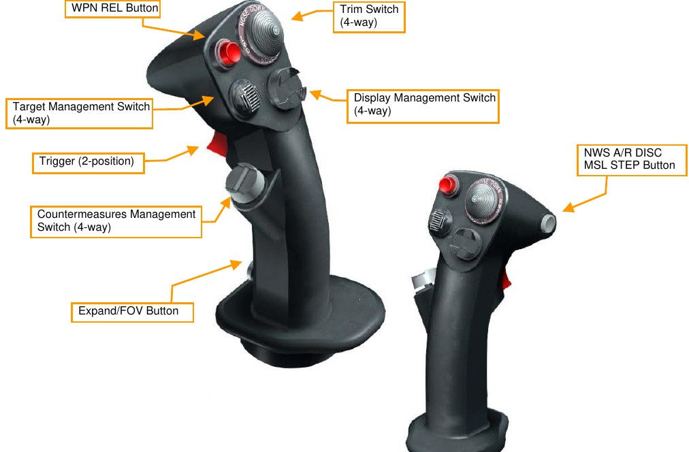

**WPN REL Button**. Press and hold to release air-to-ground weapons, including bombs, rockets, and air-to-
surfaces missiles.

**Trigger Switch**. Squeezing to the first detent fires the laser if a targeting pod is equipped. Squeezing the trigger
past the detent fires the gun if selected and armed.

**NWS A/R DISC MSL STEP Button**. This button has different functions depending on the state of the aircraft:

- Nose-wheel Steering. On the ground, momentarily pressing the button activates and engages nose-
wheel steering. Pressing the button a second time disables nose-wheel steering.
- A/R Disconnect. When in flight and the AIR REFUEL switch in the OPEN position, pressing the
button disconnects boom latching.
- Missile Step. When in flight, pressing the button in EO or A-A mode selects the next weapon station.
Pressing the button in A-G Mode cycles between CCRP, CCIP and DTOS. A long press of the button
switches between missile types in A/A mode.

**TRIM Button**. Positioning the button forward and aft trims the aircraft nose up and nose down. Positioning the
button left and right trims the aircraft left wing down and right wing down.

**Display Management Switch (DMS)**. The DMS is used to control Sensor of Interest (SOI) selection.

| DIRECTION | HUD        | FCR                 | TGP                 | WPN                 |
|-----------|------------|---------------------|---------------------|---------------------|
| FWD       |            | SOI to HUD          | SOI to HUD          | SOI to HUD          |
| AFT       | SOI to MFD | SOI MFD Swap        | SOI MFD Swap        | SOI MFD Swap        |
| LEFT      |            | Next LFT MFD Format | Next LFT MFD Format | Next LFT MFD Format |
| RIGHT     |            | Next RT MFD Format  | Next RT MFD Format  | Next RT MFD Format  |

**Target Management Switch (TMS)**. The TMS controls target designation and data management for the radar,
AGM-65 Maverick missile, and the targeting pod.

| DIRECTION | DURATION | HUD                   | FCR                       | TGP           | WPN           | HSD       |
|-----------|----------|-----------------------|---------------------------|---------------|---------------|-----------|
| FWD       | Short    | DTOS/EO-Vis Designate | RWS Spotlight / ACM BORE  | Point Track   | Track         | Designate |
|           | Long     |                       |                           |               |               |           |
| AFT       | Short    | Target Reject         | Target Reject             |               | Target Reject | Drop      |
|           | Long     |                       |                           |               |               |           |
| LEFT      | Short    |                       | Interrogate All           | Polarity Swap | Polarity Swap |           |
|           | Long     |                       | Interrogate Tgt           |               |               |           |
| RIGHT     | Short    |                       | TWS bug step / ACM rotary | Area Track    |               |           |
|           | Long     |                       | TWS/RWS Swap              |               |               |           |

**Countermeasures Management Switch (CMS)**. The CMS controls deployment of countermeasures and
operation of the ECM pod if installed.

| DIRECTION | FUNCTION                                              |
|-----------|-------------------------------------------------------|
| FWD       | Dispenses selected manual program                     |
| AFT       | Gives consent in SEMI and enables AUTO dispense modes |
| LEFT      | No function                                           |
| RIGHT     | Disables AUTO dispense mode                           |

**Expand/FOV Button**. Pressing this button cycles through the available field-of-view for the sensor or system
that is currently selected.

**Paddle Switch (not shown)**. This switch interrupts the autopilot while switch is pressed.

## Throttle

The engine is controlled by a throttle mounted above the left console with detents at OFF, IDLE, MIL, and MAX
AB. The OFF position terminates engine ignition and fuel flow. The IDLE position commands minimum thrust
and is used for all ground starts and air starts. From IDLE to MIL, the throttle controls the output of the engine.
Forward of the MIL position, the throttle controls the operation of the afterburner.

The throttle also contains switches that provide various systems control. As with the control stick, the HOTAS
functions of the throttles vary in functionality depending on the state and operational modes of the aircraft.
Those are discussed in the appropriate sections of this document.

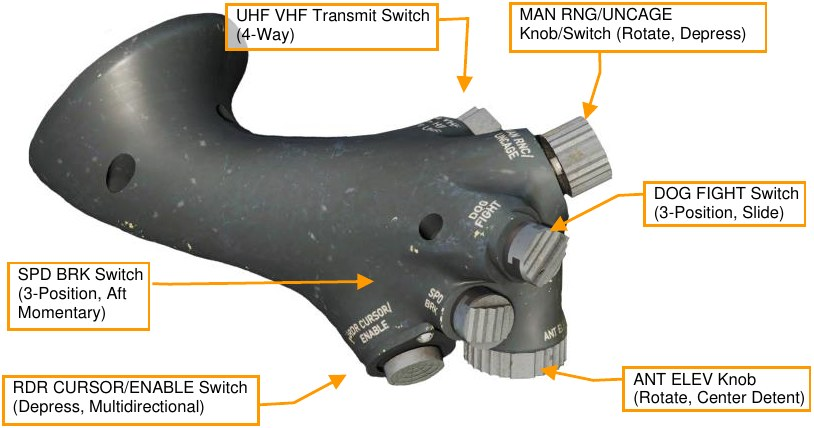

**UHF VHF Transmit Switch**. The switch initiates UHF (aft) and VHF (forward) transmissions. Pressing inboard
(right) short (less than .5 seconds) filters datalink information on the FCR display. Pressing outboard (left) short
toggles datalink tracks on and off.

**Manual Range/Uncage/Gain (MAN RNG/UNCAGE) Control**. This has different functions depending on the
master mode and selected system. Rotating the knob controls zoom level for Targeting Pod video. Pressing the
switch commands the AIM-9 or AGM-65 seeker to uncage.

**Dogfight/Missile Override (DOGFIGHT) Switch**. DOGFIGHT is a three-position switch that overrides any
mode except emergency jettison. Returning the switch to the center returns to the last selected Master Mode.

- DOGFIGHT (outboard): This provides symbology on the HUD for both 20mm gun firing and A-A
missile delivery.
- Missile Override (inboard): This position provides symbology for A-A missile firing only.

**Antenna Elevation (ANT ELEV) Knob**. The ANT ELEV knob is used to manually set the radar antenna
elevation angle.

**Cursor/Enable (CURSOR/ENABLE) Control**. This control is used for slewing of the fire control radar cursor or
TGP/weapon video. Pressing the control changes the BORE/SLAVE option for the AIM-9 and AIM-120 missiles
in A-A master mode. Pressing the control will step through PRE/VIS/BORE options for the AGM-65 missiles in
A-G master mode.

**Speedbrake Switch**. The open (aft) position allows the speedbrakes to be incrementally opened. The closed
(forward) position closes the speedbrakes.

### Sensor of Interest (SOI)

The SOI is the sensor or display for which the hands-on controls are currently active. Similar functions are
activated by the same switches, whenever possible, to provide consistent operation regardless of the SOI or
mode selected. Further operation of these switches is detailed in the appropriate mode discussions later in this
guide.

The current SOI can be identified by the box around the MFD screen or the asterisk in the top left of the HUD.

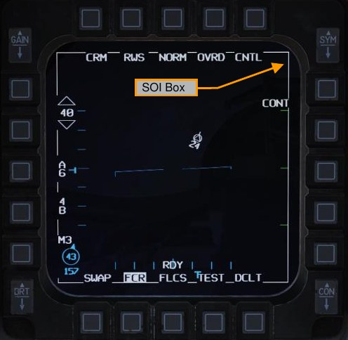
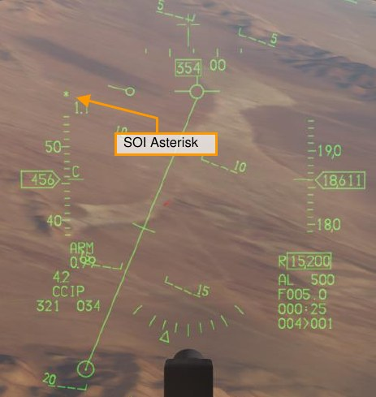

The SOI is changed from display to display with the Display Management Switch (DMS). Basic functionality as it
applies to SOI is:

- DMS FWD. SOI transitions to the HUD if in A-G Master Mode
- DMS AFT. SOI transitions from the HUD to the highest priority MFD. DMS Aft again swaps SOI to the
other MFD.

### Sensor Point of Interest (SPI)

The sensor point of interest (SPI) is the location that all sensors onboard the aircraft are normally slaved to.
Without any input from the pilot, the SPI follows the current steerpoint, and so all sensors that are slaved to the
SPI will initially be looking at the current steerpoint.

The SPI can be moved off the steerpoint location by slewing the cursor of a sensor, such as the air-to-ground
radar or targeting pod. When the sensor cursor is slewed, the SPI follows it, and all steerpoints offset by the
slew amount. To wit, if your steerpoint #2 were directly over a road intersection, and your steerpoint #3 were
200 feet south of a tank column, and you slewed your SPI 200 feet north to put it directly on the tank column,
your steerpoint #2 would now be 200 feet north of the road intersection. In fact, all your steerpoints will be
shifted 200 feet north.

*Steerpoint #2 is directly over a road intersection* 
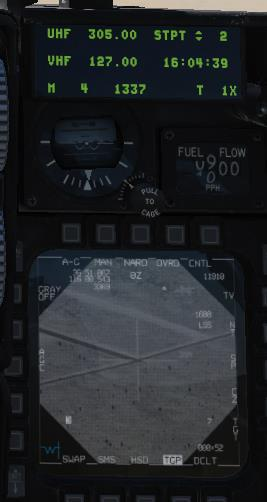

*Steerpoint #3 is 200 feet to the left of a tank column* 
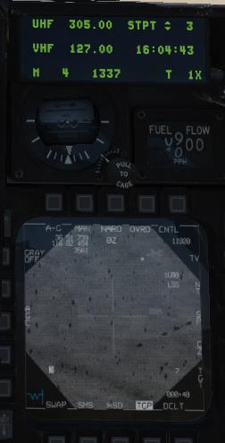

*Steerpoint #3 is slewed onto the tank column* 
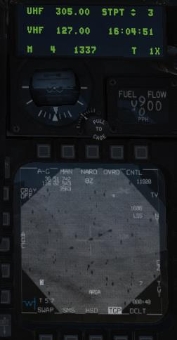

*Steerpoint #2 is now shifted to the right of the road intersection* 
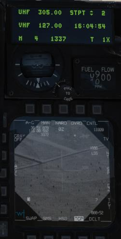

This behavior might seem puzzling at first, but remember that prior to the availability of GPS, coordinates were
not precise and navigation systems would drift over time. It is assumed that if the target steerpoint is not directly
over the target, then by slewing the sensor to the target, any accumulated drift in the navigational system has
been removed.

The change in SPI position caused by slewing the sensors is called “system delta.” To remove system delta,
you can press the OSB labeled Cursor Zero (CZ), PB9 in the above picture. This will remove any delta from the
system; steerpoint 2 will be back at the road intersection, and steerpoint 3 will no longer be over the tank
column. The CZ OSB is available on most MFD sensor formats.

In addition to the system delta, some sensors (such as the AGM-65 WPN page) can have their own deltas,
independent of system delta. When you slew the targeting pod cursor, it changes the system delta; however,
when you slew the AGM-65 cursor, it changes only its own delta, and the system delta (and SPI) are not
moved.

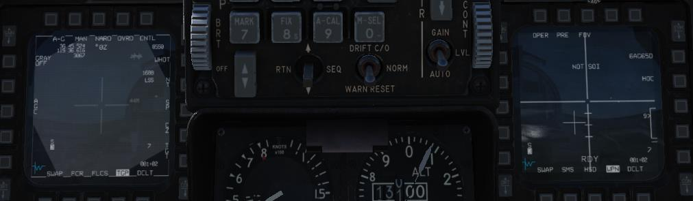

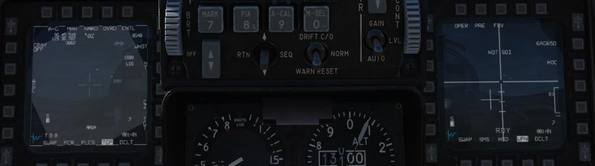

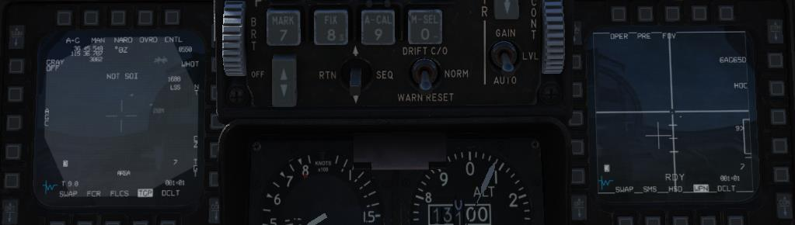

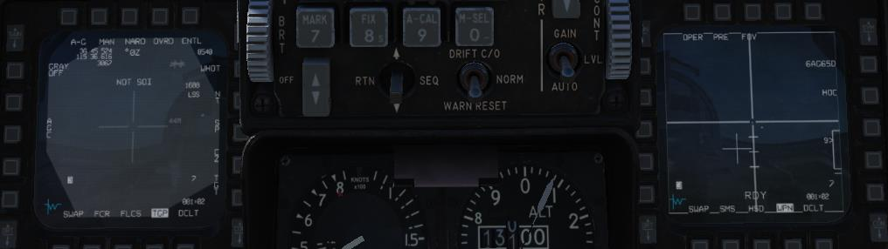

{!abbr.md!}
