# Up-front Controls (UFC)

The upfront controls (UFC) include the Integrated Control Panel (ICP) and the Data Entry Display (DED). These
provide for quick access of either navigation control, radio frequencies and channels and fire control system
modes and data. Most of your time will be spent using the ICP to control these functions but less frequently
used functions, such as power and audio volume, are located on console panels.

Data accessed through the ICP is displayed on the DED.

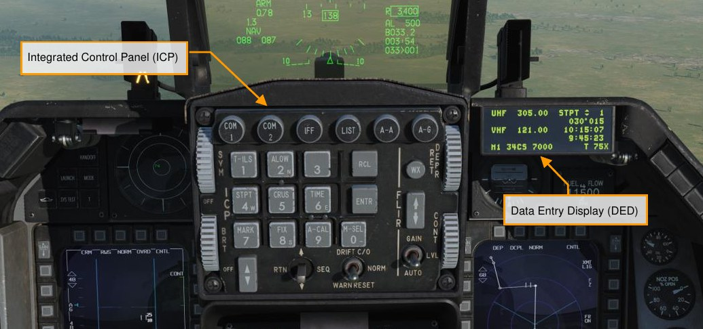

The upfront controls are available during normal operations when the C&I knob (IFF Control Panel) is set to the
UFC position. This provides for control of communications, navigation, and IFF primarily via upfront controls. In
the event of failure of the upfront controls, the BACKUP position provides for alternate operation of the radios
and IFF, using their cockpit panels.

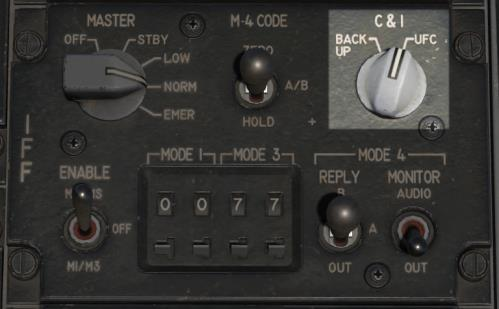
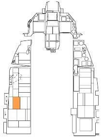

## Integrated Control Panel (ICP)

The ICP provides master mode selection, control of communication, navigation, and identification (CNI)
equipment, data entry of weapons delivery related information, and HUD power/intensity control.

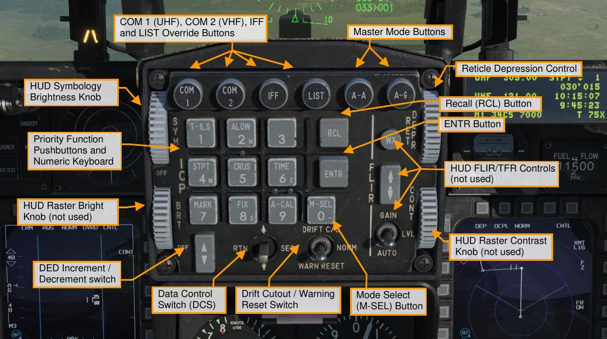

**Master Mode Buttons**. Pressing these buttons selects the Air-to-Air or Air-to-Ground master mode. This
configures the aircraft systems and displays for the selected attack mode in one easy step. Pressing the same
button a second time returns to the previous mode.

**Override Buttons**. Four override buttons provide for quick selection and control of high priority systems. These
override the current DED page to show the page that corresponds to the pressed button. Pressing the button a
second time returns to the previous page.

- COM 1 selects the UHF (primary) radio page
- COM 2 selects the VHF (aux) radio page
- IFF selects the IFF page
- LIST displays a list of less frequently used pages that may be selected by pressing the corresponding
number on the keyboard

**Priority Function Buttons**. Pressing one of the nine labeled buttons on the keypad selects the associated
page for that frequently used function. The keyboard may then be used to enter or change data.

**Data Control Switch (DCS)**. This switch is used to move the asterisk on DED pages, sequence through
different data fields, toggle wind data on the CNI page, and return to the CNI page from other pages.

**DED Increment/Decrement Switch**. This switch increases or decreases values for the field selected on the
current DED page. Values that can be increased or decreased are identified by an up and down arrow next to
them on the display. The DCS is used to cycle between available fields.

**Mode Select (M-SEL) Button**. This button is used on some pages to cycle through available modes.

**Enter (ENTR) Button**. Press this to enter the numbers typed into a field with the keyboard.

**Recall (RCL) Button**. Press this button once to erase the last digit that was entered, e.g., backspace key.
Press it a second time to restore the originally entered value.

**Symbology Brightness (SYM) Knob**. Rotate this knob to turn the HUD on and adjust the symbology
brightness.

**Reticle Depression (RET DEPR) Control**. This knob raises and lowers the depressible reticle when it is
displayed on the HUD. Values from 0 to 260 milliradians can be set.

**Drift Cutout (DRIFT C/O)/Warn Reset (WARN RESET) Switch**. This switch is used to reset flashing warnings
displayed on the HUD and to center the flight path marker and pitch line when they drift out of view from
crosswinds or sideslip.

## Data Entry Display (DED)

The DED shows a digital readout of communications, navigation and IFF (CNI) systems data. Different pages
are called up and manipulated using the controls on the ICP as described above.

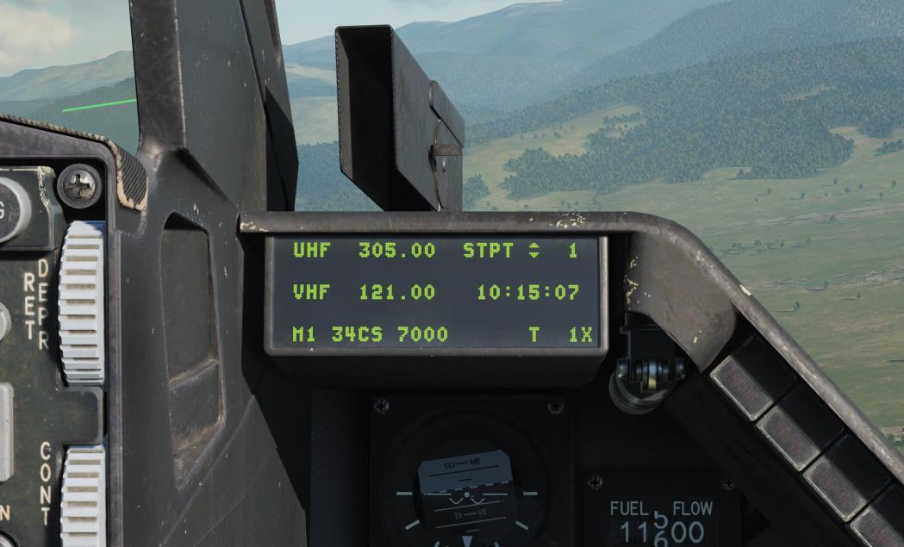

## CNI Page

This page shows the current UHF and VHF channel or frequency, steerpoints, system time, IFF status, and
TACAN channel. Wind data can be turned on and off by toggling the DCS switch to SEQ. Hack time is
displayed below system time when enabled at the Time page. The CNI page is displayed at power-up and can
be accessed any time by toggling the DCS to RTN.

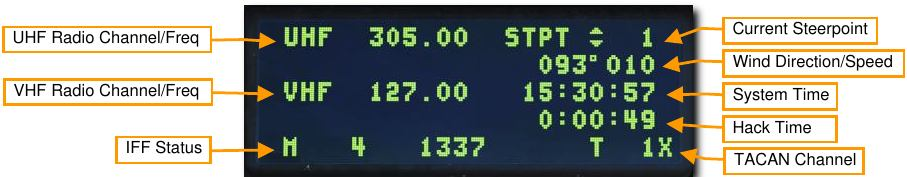

## COM 1 and COM 2 Page

See the [Radio Communications section](12.radio.md#radio-frequencies) for a detailed description.

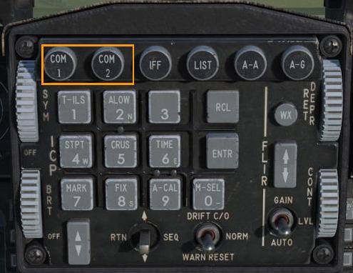

## LIST Page

Pressing the LIST button calls up a list of additional pages that may be accessed for display on the DED. Press
the character on the keyboard that corresponds to the desired page.

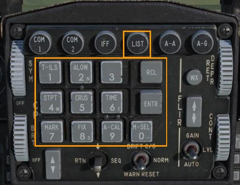

An additional list may be accessed by selecting the 0-MISC option.

## T-ILS Page

See the [TACAN](09.tacannav.md) and [ILS Navigation](08.insnav.md) section for details.

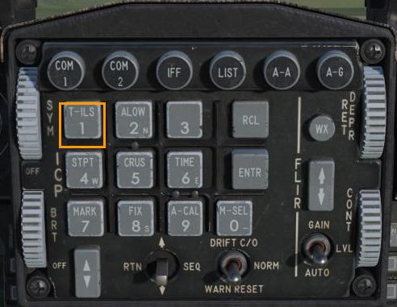

## ALOW Page

This page allows you to set the altitudes the ALTITUDE – ALTITUDE aural alerts that are played by the Voice
Message System (VMS). It is accessed from the ALOW (2) priority function button.

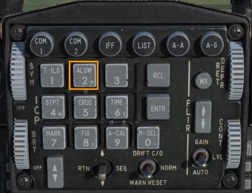
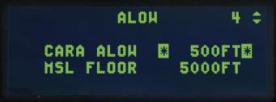

**CARA ALOW**. The VMU provides an ALTITUDE – ALTITUDE aural warning when descending through the
CARA ALOW altitude. The AL value will also flash on the HUD. This message is based on radar altitude and
requires an operational radar altimeter to function.

To enter a new altitude, DCS up or down until the asterisks are at the CARA ALOW field. Type the new altitude
with the ICP keypad and press ENTR. The new setting will be visible on the HUD.

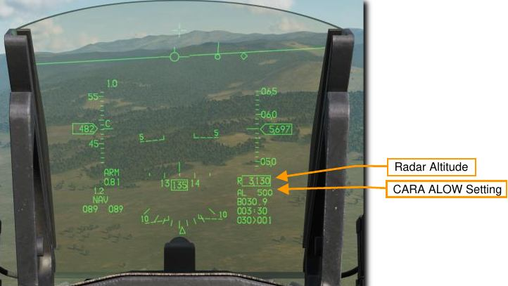

**MSL FLOOR**. The VMU also provides an ALTITUDE – ALTITUDE aural warning when descending through the
MSL FLOOR altitude. This message is based on barometric altitude.

To enter a new altitude, DCS up or down until the asterisks are at the MSL FLOOR field. Type the new altitude
with the ICP keypad and press ENTR.

Both messages are inhibited when the landing gear are down.

## STPT Page

This page shows information on the currently selected steerpoint. It is accessed from the STPT (4) priority
function button.

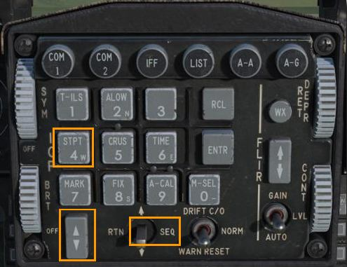

**Auto-Step Option**. Toggles between manual (MAN) and Automatic (AUTO) advancement to the next steerpoint
in sequence. With MAN selected, steerpoints are selected using the Increment/Decrement switch on the ICP.

With AUTO selected, the next steerpoint is selected when the aircraft is within two nautical miles of the current
steerpoint, and range is decreasing.

To toggle the auto-step option, use the DCS to position the cursor over the MAN/AUTO field, and press 0 (M-
SEL) to cycle between MAN and AUTO.

Auto-step sequencing will not advance past steerpoint 20.

**Steerpoint Number**. The current steerpoint is displayed. Steerpoints may be selected using the
Increment/Decrement switch or by typing in the desired steerpoint number with this field highlighted.

**Latitude**. The latitude of the selected steerpoint. New coordinates may be entered using the keypad when this
field is highlighted.

**Longitude**. The longitude of the selected steerpoint. New coordinates may be entered using the keypad when
this field is highlighted.

**Elevation**. The elevation in feet of the selected steerpoint. A new elevation may be entered using the keypad
when this field is highlighted.

**Time over Steerpoint**. If applicable, the desired time over steerpoint / time on target may be entered into this
field.

## MGRS Coordinate Display

The DED can display Military Grid Reference System (MGRS) coordinates for steerpoints 21 through 25. The
MGRS coordinate system is an alternative to latitude and longitude used by many military systems.

To display MGRS coordinates, first select a steerpoint between 21 and 25 from the STPT page, that press DCS
Right (SEQ). After a three-second delay, the MGRS coordinates will be shown:

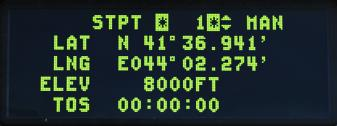

The DED will display the MGRS grid, square, and easting/northing coordinates, as well as the steerpoint
elevation. Only the elevation is editable; all other fields are read-only.

## TIME Page

This page shows the current date and time used by the aircraft’s avionics systems. It is accessed from the Time
(6) priority function button.

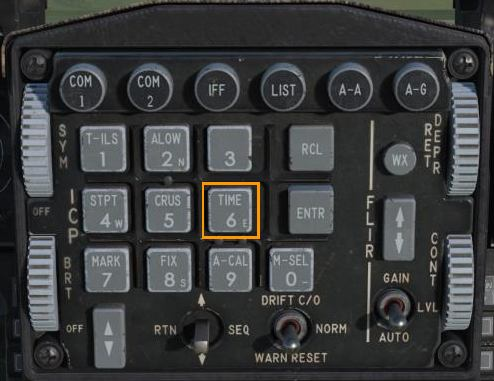
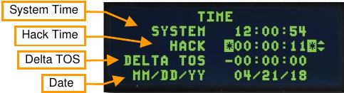

**System Time**. This is the time used by aircraft systems for navigation. System time is automatically entered
into the avionics system based on GPS data. No manual entering of system time is required. However, to enter
a new system time, position the DCS switch up or down until the asterisks are next to the system time field.

Enter the time using the ICP keypad and press the ENTR pushbutton.

**Hack Time**. This allows for an additional time reference independent of system time. Examples of its use
include setting a backup time reference for local, or some other pre-arranged time or using it as a stopwatch for
low level navigation.

To enter a new time, position the DCS switch up or down until the asterisks are next to the hack time field. Enter
the time using the ICP keypad and press the ENTR pushbutton. The new hack time will be displayed here and
on the CNI page.

Pressing the INC/DEC switch up to INC starts the timer. Pressing it again stops the timer.

Pressing the INC/DEC switch down to DEC resets the timer to zero.

**Delta Time over Steerpoint (TOS)**. This allows you to update the Time over Steerpoint for all steerpoints from
one place. This could be useful if, for example, the planned time on target for all aircraft in a strike package
changes. TOS may be updated by entering a delta TOS value on the DED. The entered time will be added to or
subtracted from all TOS values. Enterable values range from -23:59:59 to 23:59:59.

**Date**. A new date may be entered here using the MM/DD/YY format.

## BNGO Page

This page allows entry of a bingo fuel value. Voice Message and HUD warnings will be based on the amount of
fuel in pounds entered here. It is accessed by selecting option (2) from the LIST menu.

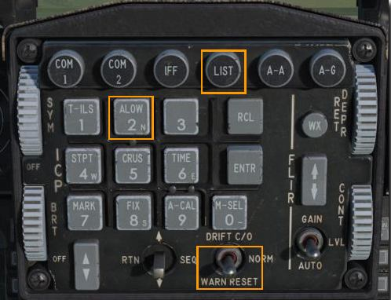

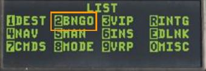

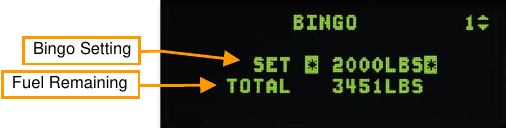

**Bingo Setting**. The desired bingo fuel setting may be entered here. When total fuel remaining decreases below
this value, “Bingo-Bingo” will be heard through the pilot’s headset, the letters FUEL will be displayed in the
lower left of the HUD and the letters FUEL will flash in the center of the HUD. The flashing warning may be
reset by positioning the DRIFT C/O switch on the ICP to the WARN RESET position. All three warnings may be
reset by entering a bingo level lower than current fuel remaining.

**Fuel Remaining**. Total fuel remaining in pounds.

## VIP Page

This page allows you to define a visual initial point (VIP) for a steerpoint. A VIP is used when the target location
is known only relative to a visually identifiable reference. See Using Visual Initial Points for more information.

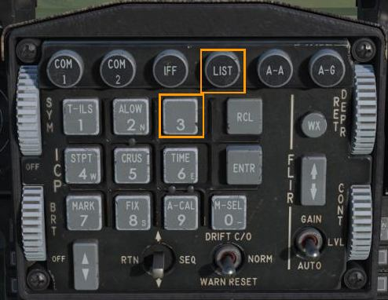

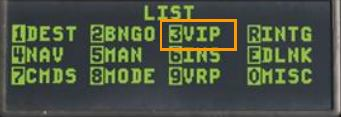

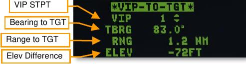

## NAV Page

This page shows the status and health of the navigation system. It is accessed by selecting option (4) NAV from
the LIST menu. Cycle between the NAV STATUS and NAV COMMANDS page by toggling the DCS right to
SEQ.

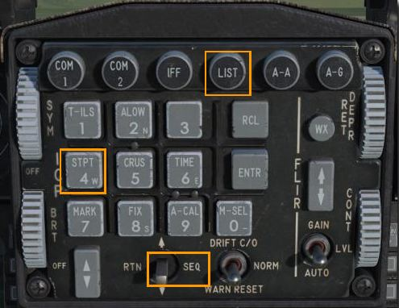

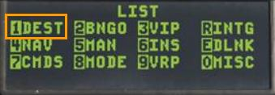

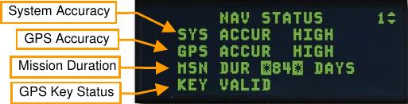

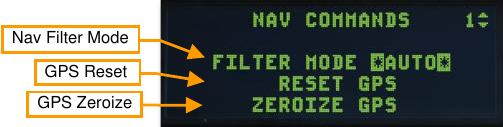

**System Accuracy**. This is an estimation of total nav system accuracy. Possible options are HIGH (less than 50
ft), MED (less than 600 ft), or LOW (greater than 600 ft).

**GPS Accuracy**. This is an estimation of GPS system accuracy. Possible options are HIGH (less than 300 ft),
LOW (greater than 300 ft), and NO TRK (no satellites tracked).

**Mission Duration**. This is an enterable number that represents the desired number of consecutive days of GPS
keys. This affects the GPS Key Status listed below.

**GPS Key Status**. The validity of loaded GPS keys for the number of entered days. Possible options are KEY
VALID (valid daily keys), KEY INVALID (invalid daily keys), INSUFF KEYS (insufficient keys for entered mission
duration), KEY NOT VERIFIED (key validity unknown), EXPIRE AT 2400 HRS (keys expire at next midnight
GMT), Blank (no keys loaded).

**Nav Filter Mode**. Navigation system GPS filter mode. Toggles between AUTO (GPS data is integrated with INS
data using a Kalman filter) or INS (GPS data is ignored and only INS data is used).

**GPS Reset**. The GPS Receiver may be reset by highlighting this field and pressing the M-SEL (0) button on the
keypad.

**GPS Zeroize**. The GPS data may be erased (zeroized) by highlighting this field and pressing the M-SEL (0)
button on the keypad. This erases crypto data from the GPS and INS memory.

## MAN Page

The page is accessed by selecting option (5) MAN from the LIST menu.

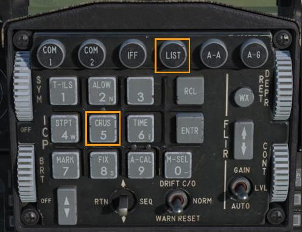

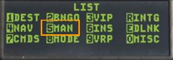

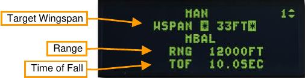

**Target Wingspan**. With this field highlighted, a manual target wingspan may be entered using the ICP keypad.

This will adjust the width of the EEGS Funnel to provide accurate range when the target wings are bracketed
within.

Manual ballistics data for weapons not integrated into the F-16 avionics may also be entered here if desired.
This data is found in ballistics manuals for each munition type. Use of this feature is very rare. These options
are not yet implemented in DCS World.

**Range**. This data field is for manual entry of bomb range, or the horizontal distance a bomb is expected to
travel under specific conditions.

**Time of Fall**. This data field is for manual entry of bomb time of fall, or the length of time a bomb is expected to
take to impact the ground under specific conditions.

## INS Page

See the [INS Alignment section](08.insnav.md#ins-alignment) for a detailed description.

## DLNK Page

See the [Link 16 Datalink section](15.datalink.md#dlnk-ded-pages) for a detailed description. 

## CMDS Page

See the [Defensive Systems section](20.defence.md#cmds-ded-pages) for a detailed description.

## MODE Page

This page allows a backup capability to change master modes in the event of a master mode button failure. It is
accessed by selecting option (8) MODE from the LIST menu.

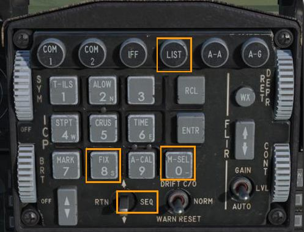

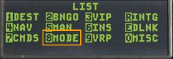

Pressing any ICP number key or sequencing the DCS switch right to SEQ toggles the highlighted field between
A-A and A-G. Pressing the M-SEL (0) key selects that master mode.

## VRP Page

This page allows you to define a visual reference point (VRP) for a target steerpoint. A VRP is to indicate a
location relative to the target steerpoint on the HUD. See Using Visual Reference Points for more information.

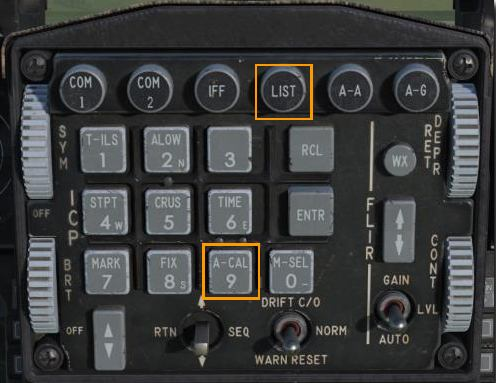

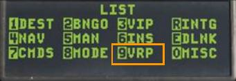

## MAGV Page

This page allows manual entry for Magnetic Variation, or number of degrees between magnetic north and true
north. This data is used by the aircraft navigation system. It is accessed by selecting option (0) MISC from the
LIST menu, then pressing 2 to select the MAGV page.

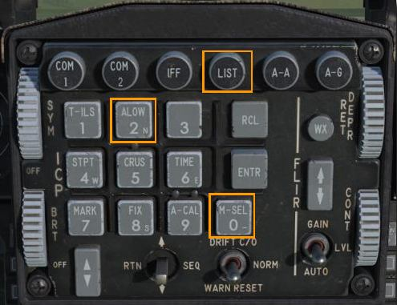

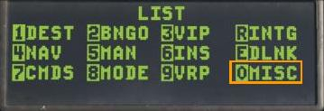

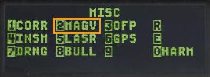

Two options are available: AUTO (automatic) and MAN (manual). These may be toggled by pressing any
number key on the ICP or positioning the DCS Switch right to SEQ.

In AUTO, magnetic variation is set based on values stored in the navigation system for the aircraft location. In
MAN, a new value may be entered manually by highlighting the field and entering the desired value.

## LASR Page

See the [Targeting Pod section](16.ltpod.md#lasr-ded-page) for a detailed description.

## HMCS Page

This page allows you to control the JHMCS display. It is accessed by selecting option (0) MISC from the LIST
menu, then pressing RCL to select the HMCS page.

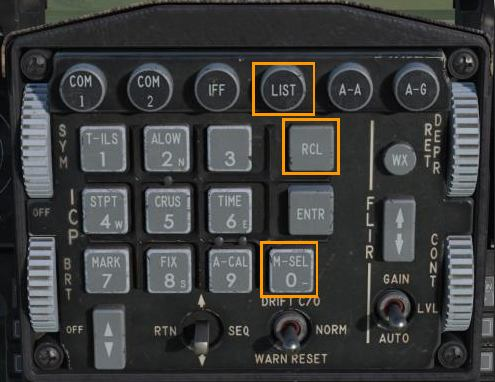

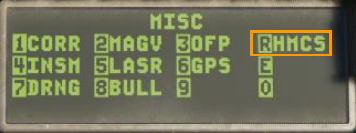

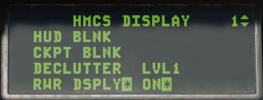

**HUD BLANK**. Toggles on or off HMCS blanking when looking at the HUD. If this setting is on, HMCS
symbology will disappear when looking at the HUD. To change, ensure the cursor is over the HUD BLANK field,
then press (0) M-SEL to cycle between ON and OFF.

**CKPT BLNK**. Toggles on or off HMCS blanking when looking down in the cockpit. If this setting is on, HMCS
symbology will disappear when looking inside the cockpit. To change, ensure the cursor is over the CKPT
BLANK field, then press (0) M-SEL to cycle between ON and OFF.

**DECLUTTER**. Sets the declutter level. Positioning the cursor over the DECLUTTER field and pressing M-SEL
(0) cycles through declutter levels.

- LVL1. All symbology is displayed.
- LVL2. Heading tape, altimeter, and waypoint information is removed.
- LVL3. G-meter, airspeed tape, and master arm mode are removed.

**RWR DSPLY**. Toggles on or off display of the priority RWR threat. To change, ensure the cursor is over the
RWR DSPLY field, then press (0) M-SEL to cycle between ON and OFF.

{!abbr.md!}
