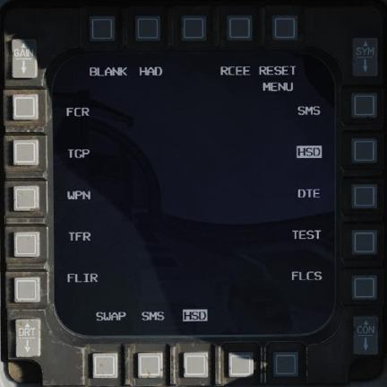
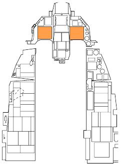
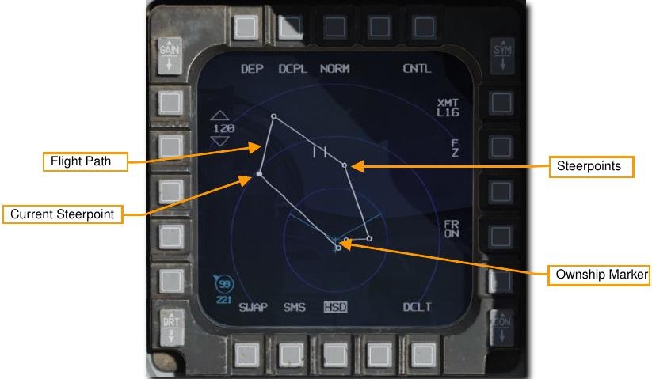
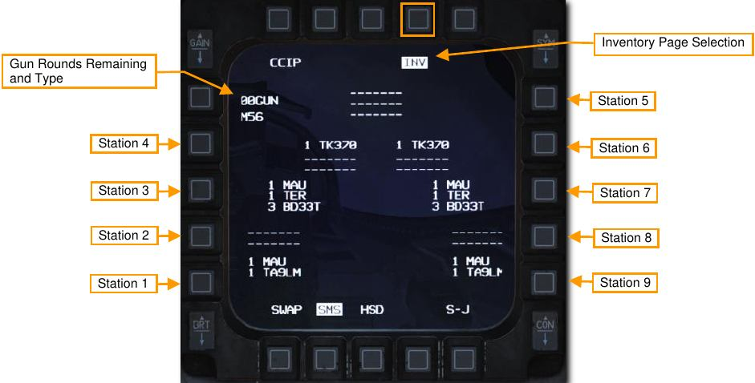
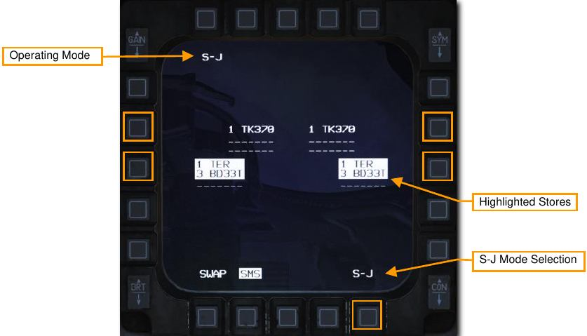
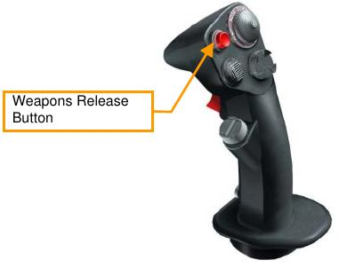

# Multifunction Displays (MFD)

Two color multi-function displays (MFD), left and right, provide video and text data for the following systems:

- Fire Control Radar
- Targeting Pod
- AGM-65 Weapon Video
- Stores Management Set
- Horizontal Situation Display
- Data Transfer Equipment
- Tests
- Flight Controls

Systems are controlled through option select buttons (OSBs) around the display screen of each MFD. Each
OSB interacts with the text displayed next to it to toggle through functions or select different sub-pages.

## Horizontal Situation Display (HSD)

The HSD displays a plan-view of your current tactical situation with the symbols representing your aircraft
position (Ownship), current steerpoint, active flight plan, and range rings.

Tactical information is also displayed based on pre-planned threat locations, information received through
onboard sensors, or information received through the Link 16 datalink. See the [section on Link 16](15.datalink.md#display-symbology) for details.

## Stores Management Set (SMS)

The Stores Management Set (SMS) MFD page and subpages allow for viewing, configuration and status
monitoring of loaded stores. Different options are available depending on the type of weapons that are selected.

An Inventory page is available that shows the stores loaded on each station and allows modification if required.

A Selective Jettison page is also available that allows selected stores to be jettisoned in an unarmed state.
Functions of the SMS page that relate to normal employment of weapons are covered in the following sections:

[A/A Guns SMS Page](18.ata.md#air-to-air-gunnery)

[AIM-9 SMS Page](18.ata.md#aim-9mx-employment)

[AIM-120 SMS Page](18.ata.md#sms-format)

[Bombs SMS Page](19.atg.md#unguidedlaser-guided-bombs-sms-page)

[A/G Guns SMS Page](19.atg.md#target-attack)

[Rockets SMS Page](19.atg.md#target-attack-ccip)

### Inventory Page

Stores inventory can be viewed or changed by selecting the OSB adjacent to INV. This displays loaded stores
by station, starting with station 1 at the bottom left, and ending with station 9 at the bottom right. The type of gun
ammunition and number rounds remaining is displayed at the top right.

### Selective Jettison (S-J) Page

This page allows jettison of selected stores in an unarmed state. This provides more flexibility in the stores that
are jettisoned than is available with the Emergency Jettison button, that jettisons all jettisonable stores.

The S-J Page is accessed by selecting the OSB adjacent to S-J at the bottom right. Jettisonable stores are
displayed and available for selection. Pressing the OSB next to the store highlights it for jettison.

If more than one jettisonable store is loaded on a station, for example stores on a TER-9 rack, one press of the
OSB highlights the store and another press highlights both the store and the rack.

The highlighted stores are jettisoned when the Weapons Release button is pressed.

{!abbr.md!}
