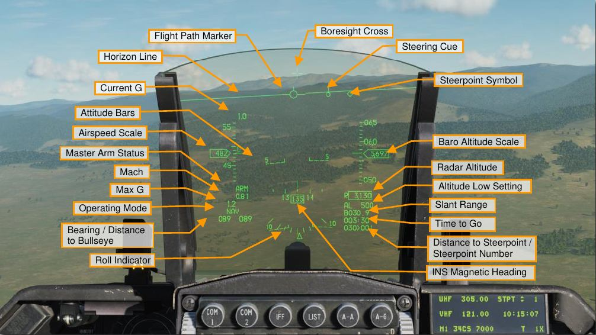
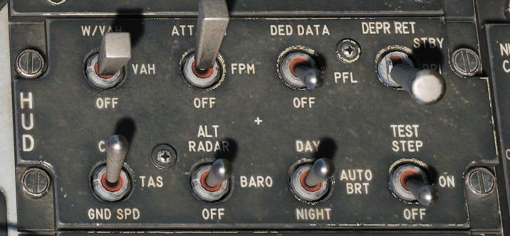
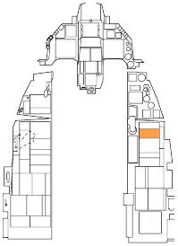

# Heads-up Display (HUD)

The Head Up Display, or HUD, is one of your most important instruments and provides valuable information as
to your aircraft flight performance and weapon / sensor information. In later sections of this guide, we will
discuss aspects of the HUD that are specific to certain weapons and sensors, but the HUD does have a
common set of information that is almost always displayed.

All information is displayed on a combining glass mounted in the forward field of view at eye level. The
symbology is focused at infinity and superimposed upon the outside world along the flightpath of the aircraft.
The HUD remote control panel (right console) provides control of the HUD set.

Together, the remote and integrated control panels control the symbology displayed. HUD data is displayed as
a function of the selected master mode and sub-mode. The display surface field of view is 25° in diameter and
extends down to a line 10.5° below the FOV center.

**Time to Go**. The time to reach the Steerpoint selected - with current parameters.

**Slant Range**. Calculate the distance between the F-16 and an intercept point. The vector between the F-16 and the Boresight Cross (where that vector intersects the ground), is the Slant Range. Used for Ground Attack. Measured in miles.
**B**: Calculated with Barometric Altitude.
**F**: Calculated by the Fire Control Radar.
**D**: Calculated by DTS.
**R**: Calculated by CARA.

**Altitude Low Setting**: Measured in feet. The aircraft will give us a warning if we go below that limit.

**Steering Cone**: Tells us how to steer to get to the Steerpoint Symbol. If you move the Flight Path Marker to the Steering Line, it will lead the aircraft towards the Steerpoint Symbol.

**Flight Path Marker**: Displays a vector of where the aricraft is travelling to right now. If there are heavy winds, it can be outside of the HUD area. Press DRIFT C/O in the UFC, in order to recenter it.

**Boresight Cross**: Also called a DATUM cross, or Longitudinal Axis. Shows where the aircraft is pointing to. The angle between the Boresight Cross and the Flight Path Marker is the A, also called Angle of Attack.

**Altitude Bars**: Also known as Altitude Indicator, or Pitch Ladder.
If the are dotted lines, it's NEGATIVE.
If the are solid lines, it's POSITIVE.

**Horizon Line**: If it goes outside of the HUD, it becomes a dotted line. The limits of the HUD are 330 degrees Lateral, 220 degrees Vertical.

**Airspeed Scale**: The letter will indicate what type of speed is being shown. For example, C means Calibrated Air Speed.

**Operating Modes**:
NAV (Navigation)
AAM (Air to Air Mode). Click A-A on the UFC, in order to activate it.
CCIP (Air to Ground Mode). Click A-G on the UFC, in order to activate it.

## HUD Remote Control Panel

As the name implies, the HUD control panel determines what and how information is displayed to the HUD. The
panel consists of eight switches.

**Scales Switch**. When set to VV/VAH, the vertical velocity scale, velocity scale, altitude scale, and heading tape
are displayed. When set to VAH, all the scales are displayed except the vertical velocity scale. Off removes all
scales but digital readouts.

**Flightpath Marker Switch**. When set to ATT/FPM displays both the flight path marker and attitude reference
bars. When set to FPM, just the flight path marker is displayed. Off removes both.

**DED Data/PFL Switch**. This switch allows data from these displays to visible on the HUD, based on DED or
PFLD selection. Off displays neither.

**Depressible Reticle Switch**. The depressed reticle switch controls selection of the primary and secondary
standby reticles on the HUD. Standby displays the standby reticle and removes all other HUD symbology.
Primary displays the primary reticle but does not remove any HUD symbology. Off does not display either
reticle.

**Velocity Switch**. The airspeed switch allows airspeed to be displayed as calibrated airspeed, true airspeed, or
ground speed.

**Altitude Switch**. This switch allows the altitude tape to indicate radar altitude, barometric altitude, or off. When
set to off, radar altitude is displayed when above ground altitude is below 1,500 feet and barometric altitude
when above.

**Brightness Control Switch**. The HUD brightness switch has default brightness settings for day and night and
an auto brightness function that will adjust accordingly.

**Test Switch**. Displays a test pattern in ON. The TEST STEP position steps through the four different test
patterns.

{!abbr.md!}
