# TACAN Navigation

The Tactical Air Navigation (TACAN) system is a world-wide array of omni-directional beacons with unique
frequency codes used primarily by military aircraft. Civilian aircraft use a similar system called VOR’s (VHF
omni-direction Beacon) on a different frequency range. Many VOR stations are collocated with a TACAN. These
stations broadcast both signals so they can be used by military and/or civilian aircraft. These stations are known
as “VORTACS”.

TACAN beacons can not only be set on the ground, but they can also be attached to aircraft and even ships
(aircraft carriers). TACAN serves as a useful means to quickly navigate to a defined location.

The TACAN is part of the MIDS terminal and must be activated by rotating the MIDS LVT knob on the Avionics
Power Panel to the ON position. TACAN audio tone volume is controlled on the AUDIO 2 panel.

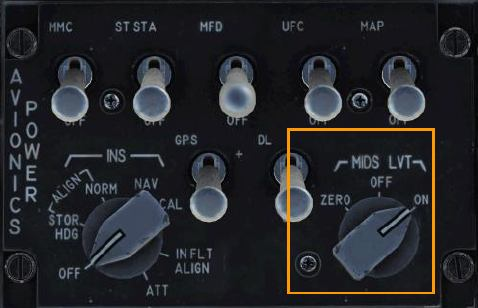
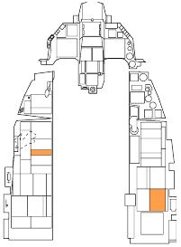
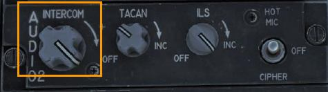

The currently selected TACAN station is always displayed on the bottom right of the DED CNI page. You can
see station 1X is selected in this example.

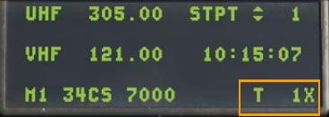

Before navigating using TACAN though, you will want to do the following:

#### Select TACAN Station

1. To select a new station, press the T-ILS priority function button on the ICP. That displays the TACAN/ILS
page on the DED. Information on the TACAN system is displayed on the left half of the page.

    
    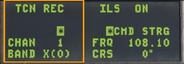

2. On the ICP, toggle the DCS switch down to highlight the CHAN field. Use the ICP keypad to type in the
new channel. Press ENTR to accept the changes.

    In this example, channel 25 is entered. The system has identified it as beacon GTB, a TACAN station at
    Tbilisi.

    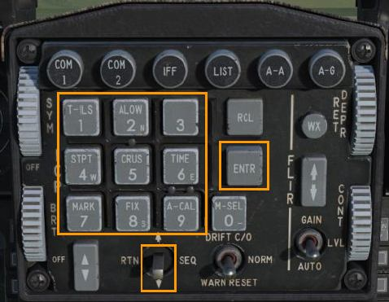
    

3. If required, you may change the band by typing 0 (M-SEL) into the CHAN field or scratchpad and pressing
ENTR. This toggles the band between X and Y.

    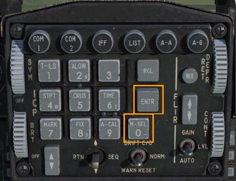
    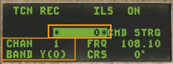

4. On the ICP, toggle the DCS right to cycle through the following options: REC, T/R, A/A REC, or A/A TR.
REC. The TACAN operates in receive mode only and provides bearing, course deviation, and station
identification.

    **T/R**. The TACAN acts in a transceiver mode (send and receive) and provides bearing, range, deviation,
    and station identification. This will be your most common selection.

    **A/A REC**. TACAN operates in Air-to-Air mode and can only receive bearing, course deviation and station
    identification for a TACAN-equipped aircraft.

    **A/A T/R**. TACAN operates in Air-to-Air transceiver mode and provides bearing, range, deviation, and
    station identification with a TACAN-equipped aircraft.

    In most cases, you will keep the TACAN set to the T/R mode.

    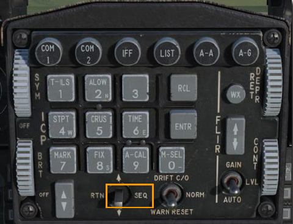
    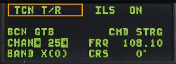

5. Toggle the DCS left to RTN. This will return you to the CNI page where your new TACAN channel is
displayed at the bottom right.

    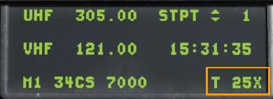

#### Navigate to Selected TACAN Station

Once a valid TACAN station has been entered on the DED, the station is within operative range, steering
information is available on the HSI.

Press the Mode selector until TCN is displayed in the Current Mode field. Operation is identical to steerpoint
navigation except the bearing pointer points to the TACAN station instead of the steerpoint.

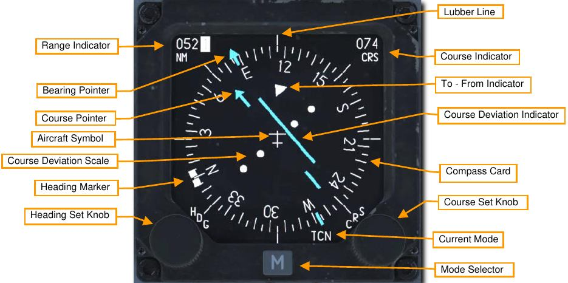

Note: TACANs are considered reliable for only 130 nm, so the maximum distance between TACAN stations is
generally 260 nm.

{!abbr.md!}
