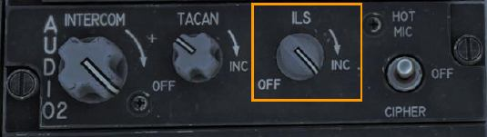
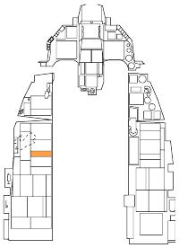
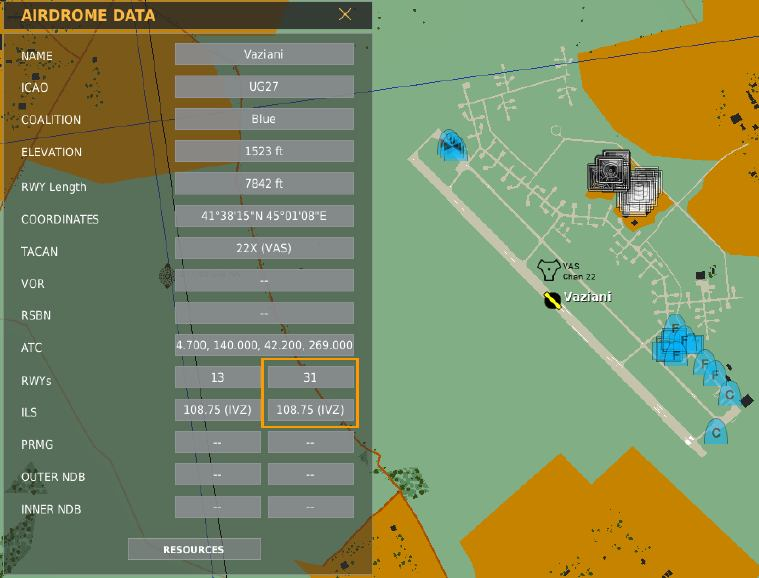
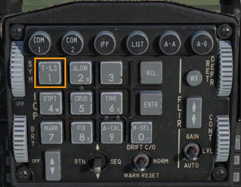
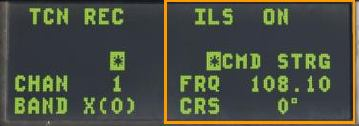
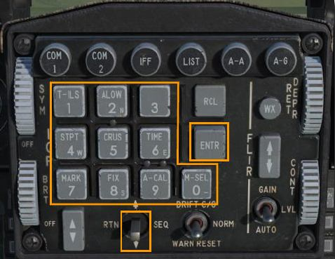
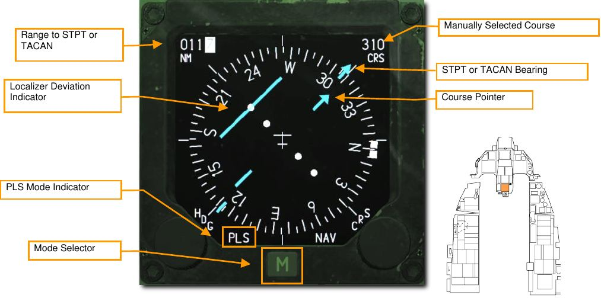
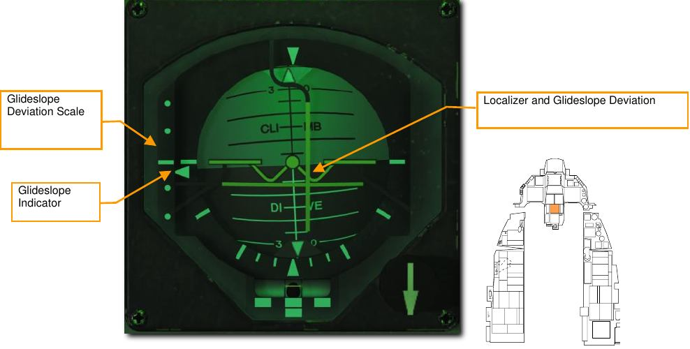
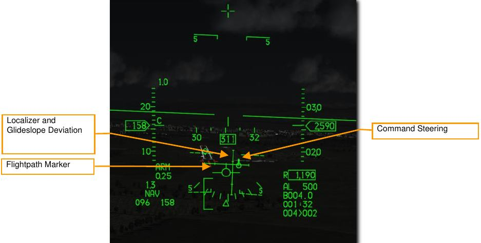

# Instrument Landing System Navigation

The landing approach using the Instrumented Landing System (ILS) is generally used under Instrument Flight
Rules (IFR) conditions due to night or bad weather. When used, the ILS provides vertical and horizontal
steering information to help you fly down the correct glide slope and heading to a safe landing. The ILS
frequency is set using the Up-Front Controls (UFC) and ILS steering is selected on the HSI. Steering
information is then presented on the HUD, ADI and HSI instruments. The ILS provides steering for a straight in
approach.

In addition to the instrument indications, the ILS has a localizer audio signal. The ILS provides an audio cue
when flying over either the outer or inner marker beacons. You can control the audio levels on the Audio 2
control panel.

Most, but not all runways, allow landings from either direction but will depend on the wind direction. The ILS
system should be used for the appropriate landing runway as directed by ATC.

The ILS system must be activated by rotating the ILS knob on the Audio 2 Control Panel out of the OFF
position.

The ILS operates between 108.1 and 111.95 MHz. The frequency for any runway equipped for ILS may be
seen on the Mission Planner map before mission start or in-game using the F10 map view. Click any airfield
and the information will be displayed.

In the next example, we will set the system up for a landing at Vaziani runway 31, using frequency 108.75.

## Select ILS Frequency

1. To select a new station, press the T-ILS priority function button on the ICP. That displays the TACAN/ILS
page on the DED. Information on the ILS system is displayed on the right half of the page.

    
    

2. On the ICP, toggle the DCS switch down to highlight the FREQ field. Use the ICP keypad to type in the
new frequency.

    Press ENTR to accept the changes.

3. Then, toggle the DCS switch down to highlight the CRS field. Use the ICP keypad to type in the localizer
course.

    Press ENTR to accept the changes.

    
    

In this example, we set the system up for a landing at Vaziani runway 31, using frequency 108.75. CMD STRG
is highlighted indicating the ILS signal is being received.

## Navigate with ILS Glide Slope and Localizer

Once a valid ILS station has been entered, the station is within operative range, and ILS is selected as the
activate navigation mode, you will be provided steering information on the ADI and HSI to the selected station
(much like TACAN).

Selecting one of the PLS (Precision Landing System) modes on the HSI is required before ILS deviation data
(localizer and glide slope) can be displayed on the HSI, HUD, and ADI.

### HSI Indications

Press the Mode Select button on the HSI until either PLS NAV or PLS TCN mode is displayed.

Operation is identical to steerpoint navigation except the bearing pointer points to the ILS localizer instead of
the steerpoint.

### ADI Indications

The ADI provides indications that show your position in relation to the glideslope.

**Localizer and Glide Slope Deviation**. When the horizontal bar is centered on the ADI, you are flying on glide
slope. If the bar is above the center of the ADI, it indicates that you are below glide slope and you need to
increase altitude. The vertical localizer bar indicates if you are left or right of runway alignment. If the bar is right
of ADI center, fly to the right to center it, then resume localizer course. For a proper glide slope approach, you
want the two bars centered and forming a perfect cross on the ADI (aka “center the bars”).

**Glide Slope Deviation Scale and Glide Slope Indicator**. Located along the left side of the ADI, this fixed
scale and moving caret indicator displays the position of the glide slope in relation to the aircraft. Basically, the
caret is the glide slope. If it is high, you are low. For example: if the caret is on the bottom dot, you are above
the glide slope. The common terminology would be “you are 2 dots high”. Conversely, if the caret is on the first
dot above middle you are below the glide slope. The term would be “you are 1 dot low”. It is a general rule that if
you go more than 1 dot low or more than 2 dots high you go missed approach and try again.

**Glide Slope and Localizer Warning Flags (not visible)**. When displayed, this indicates that there is a problem
in receiving adequate ILS glide slope or localizer signal.

### HUD Indications

The HUD also shows your position in relation to the glideslope. Command Steering guidance is also provided if
CMD STRG is highlighted on the ILS DED page.

**Command Steering Symbol**. This symbol will be displayed on the HUD to guide you through the approach
when valid localizer data is received. A tic mark appears on the symbol when nearing the center of the
glideslope to indicate the pitch steering data is valid.

**Localizer and Glide Slope Bars**. These bars serve the same function as those on the ADI. When the
horizontal bar is centered on the Flight Path Marker (FPM), you are flying down the glide slope projected by
the ILS vertical steering component. If the bar is above the center of the FPM, it indicates that you are below
glide slope and you need to increase altitude. The vertical localizer bar indicates if you are left or right of runway
alignment. If the bar is right of FPM center, fly to the right to center it. For a proper glide slope approach, you
want the two bars centered and forming a perfect cross on the FPM (aka “center the bars”).

{!abbr.md!}
