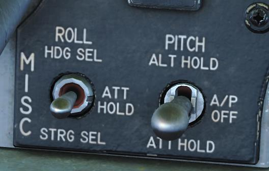
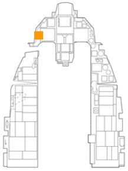

# AUTOPILOT

The two autopilot switches allow you to set and hold pitch and roll. Any combination of switch settings may be
used.

**PITCH – ALT HOLD**. This maintains the aircraft at a constant altitude. The autopilot will attempt to maintain the
current altitude from when the switch is set but may not be able to capture the desired altitude if the aircraft is in
a climb or dive. An altitude within the control authority of the autopilot will be commanded. The altitude may be
changed by pressing the paddle switch, flying to a new altitude, and releasing the paddle switch.

**PITCH – ATT HOLD**. This maintains the aircraft’s current pitch attitude, nose up or nose down. The autopilot
will not engage if the pitch angle exceeds ±60°, however, the switch may remain engaged. The stick may be
used to change the attitude in this mode.

**ROLL – HDG SEL**. This causes the aircraft to fly the heading selected on the HSI. Roll commands are limited
to a 30° bank or a 20° per second roll rate to capture the desired heading. The autopilot will not engage if the
roll angle exceeds ±60°, however, the switch may remain engaged.

**ROLL – ATT HOLD**. This maintains the aircraft’s current roll attitude. The autopilot will not engage if the roll
angle exceeds ±60°, however, the switch may remain engaged. The stick may be used to change the attitude in
this mode.

The switches are held in place until they are returned to the OFF position or any of these situations occur:

- air refueling door opened
- alt flaps extended below 400 knots
- A/P FAIL PFL
- AoA exceeds 15°
- DBU on
- landing gear extended
- low-speed warning
- MPO switch in OVERRIDE
- STBY GAIN PFL
- TRIM/AP DISC switch set to DISC

Holding the paddle switch presses disengages the autopilot until the switch is released.

