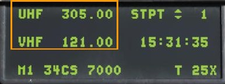
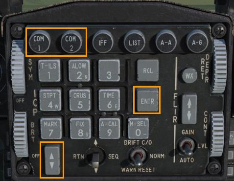
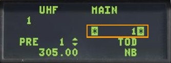
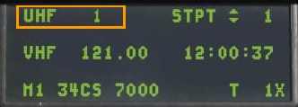
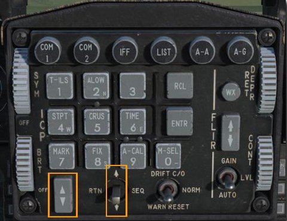
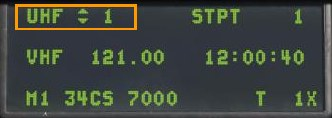
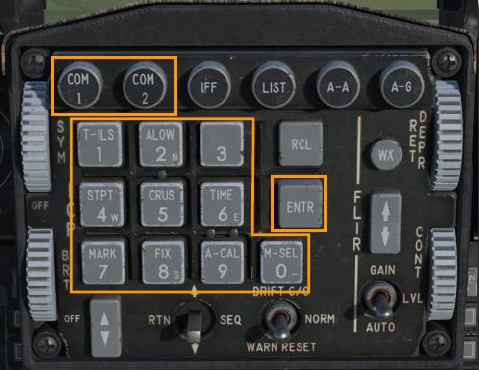
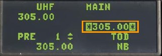
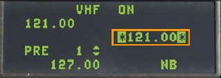
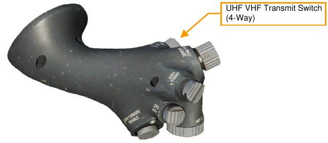

# Radio Communications

## Radio Frequencies

The current frequency for the UHF (COM 1) and VHF (COM 2) radios are shown on the DED CNI page.

When a mission is created, each agency is provided a VHF and/or a UHF frequency. Each frequency
corresponds to a preset channel on your radios, but you may also manually enter them. These are generally
noted in the mission briefing and should be set on your radios at the start of the missions.

Generally, the following rules apply:

- Your flight is most often assigned a VHF frequency. You will use this frequency for intra-flight
communications.
- Other friendly flights operate on a common UHF frequency assigned to the operating area. When set
correctly, you will hear radio communications from other flights operating in the area. AWACS will
usually be on this common frequency.
- The JTAC is most often assigned a unique VHF or UHF frequency.
- Each airbase ATC is assigned a VHF and/or a UHF frequency.
- Each tanker is assigned a unique VHF or UHF frequency.

As such, you may have to juggle multiple frequencies during a mission. The frequency preset features on the
radio will become a big help.

### Preset Frequency Change

1. Press the COM 1 or COM 2 override button on the ICP.

    

2. Type in the desired preset channel and press ENTR

    

3. The radio will now transmit and receive on the new preset frequency.

    

With a preset channel shown on the DED home page, you can also cycle through available presets:

1. Toggle the DCS up or down until the arrows are displayed next to the preset channel.

    

2. Use the Increment/Decrement switch to change the channel.

    

### Manual Frequency Change

1. Press the COM 1 or COM 2 override button on the ICP.

    

2. Type in the new frequency with the ICP keypad and press ENTR

    

3. The radio will now transmit and receive on the new frequency.

    

## Radio Commands

Commands or requests to and from other agencies must be made through the radio system. On the ground, the
radio communications window may be accessed by a press of the [\] key. Once airborne, communications are
only initiated using the HOTAS controls.

UHF VHF Transmit Switch:

- Forward: VHF (Aux) radio [[RCtrl ]] + [[\]]
- Aft: UHF (Prim) radio [[RAlt ]] + [[\]]
- Up: No function
- Down: No function

There are two optional modes of using the radio that depend on the “EASY COMMUNICATION” OPTION under
the GAMEPLAY tab.

### Easy Communication Not Enabled

This is the more realistic mode and requires you to know the correct modulation / frequencies for each recipient.
You must select the correct channel pre-set or manually enter the frequencies on the correct radio.

### Easy Communication Enabled

The radio communications window is accessed by a press of the \ backslash key (this is for US keyboards;
other language keyboards may vary). Upon doing so, the list of radio command recipients is displayed along
with the function ([[Fx]]) key required to view its sub-command window.

When the radio menu is displayed, recipients are color-coded as follows:

- Recipients on which at least one of the radios is tuned to are colored white.
- Recipients on which at least one of the radios can be tuned to, but are not currently on the correct
frequency, are colored gray.
- Recipients that cannot be contacted due to range or terrain masking / earth curvature are colored
black.

Each will also have their modulation / frequency listed. When you select a recipient, the appropriate radio will
automatically be tuned to communicate with the selected recipient.

Using the transmit switch, recipients will be color-coded according to their being on the same modulation as the
selected radio.

{!abbr.md!}
