# Procedures

## Cold Start

There are two methods you can use to start a cold and dark aircraft. The first, and easiest, is the Auto-Start. By
pressing [[LWin]]+[[Home]], the aircraft will be started automatically for you. To cease the Auto-Start, you can
press [[LWin]]+[[End]].

Being a DCS title though, the aircraft really shines when you take advantage of the detailed systems modeling,
like manually starting the aircraft.

1. **MAIN PWR switch [[BATT]]**

    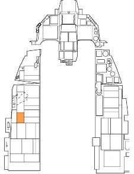

    1. Verify the FLCS RLY light is on

    The amount of power available from the battery is limited so do not leave
    the MAIN PWR switch in BATT or MAIN PWR for more than 5 minutes.
    Start the engine or apply external power if more time is needed.

2. **FLCS PWR TEST switch [[TEST and hold]]**

    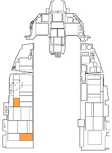
    
    1. Verify lights on ELEC Panel:
    
        - FLCS PMG on
        - TO FLCS on
        - FLCS RLY light turns off
    
    1. Verify lights on TEST Panel:
    
        - FLCS PWR (4) on

    This test verifies operation of the Flight Control Computer with the aircraft
battery as the power source.

3. **FLCS PWR TEST switch [[Release]]**

    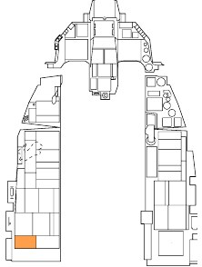

4. **MAIN PWR switch [[MAIN PWR]]**

    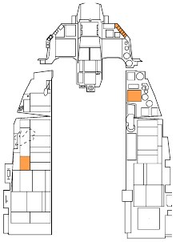

    Verify lights on:
    
    - ENGINE
    - HYD/OIL PRESS
    - ELEC SYS
    - SEC
    - FLCS RLY

5. **EPU GEN and EPU PMG lights [[Confirm off]]**

    
    
    Illumination of either light indicates criteria for EPU activation are met.
    The EPU will activate and create a hazardous condition if the EPU safety
    pin is removed by the ground crew.
    
    Turn the MAIN PWR switch to OFF and abort the aircraft (re-start the
    mission) if the lights are on.

6. **JFS switch [[START 2]]**

    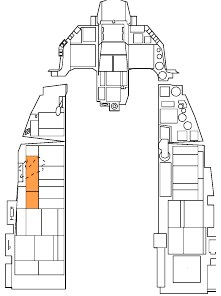
    
    The JFS RUN light illuminates within 30 seconds indicating the Jet Fuel
    Starter is operational. Engine rpm should start to increase.
    
    Power is applied to the Flight Control System relays when the JFS
    Switch is set to either position. The FLCS RLY light should turn off and
    the FLCS PMG light and ACFT BATT TO FLCS light should illuminate.

7. **At 20% RPM – Throttle [[Advance to IDLE]]**

    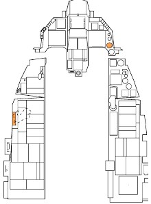
    
    Keyboard Command: [[RShift]]+[[Home]]
    
    Advance throttle to IDLE after 20 percent rpm is reached.
    
    The engine should light-off within 10 seconds and engine RPM and FTIT
    should increase. Only the RPM and FTIT indicators function until the
    standby generator is online.

8. **SEC caution light [[Off]]**

    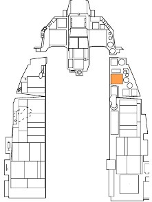
    
    The SEC caution light goes off at 20 percent rpm.

9. **ENGINE warning light [[Off]]**

    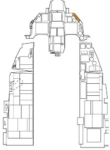
    
    The standby generator becomes operational at approximately 60% RPM.
    This should extinguish the ENGINE warning light.
    
    Five to ten seconds after the standby generator comes online, the main
    generator comes online, and the standby generator goes offline.
    
    Checking the SEAT NOT ARMED caution light and three green WHEELS
    down lights are on prior to the main generator coming online confirms the
    emergency busses are being powered by the standby generator.

10. **JFS switch [[Confirm Off]]**

    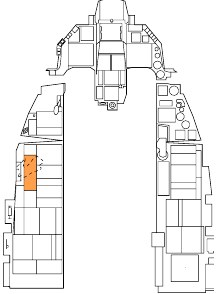
    
    The JFS should have automatically shut down at approximately 55%
    RPM. Turn the JFS off if that did not occur.

11. **Engine instruments [[Check]]**

    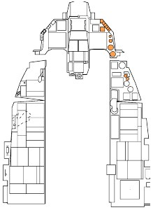
    
    Normal indications after engine start are:
    
    - HYD/OIL PRESS warning light – Off
    - FUEL FLOW – 700-1700 pph
    - OIL pressure – 15 psi (minimum)
    - NOZ POS – Greater than 94 percent
    - RPM – 62-80 percent
    - FTIT – 650⁰ C or less
    - HYD PRESS A & B – 2850-3250 psi

12. **PROBE HEAT [[Check]]**

    
    
    1. PROBE HEAT switch – PROBE HEAT
    
        - Verify PROBE HEAT caution light off.
        - Illumination means one or more probe heaters are inoperative
        or a failure of the monitoring system has occurred.
    
    1. PROBE HEAT switch – TEST
    
        - PROBE HEAT caution light should flash 3-5 times per second.
        - The probe heat monitoring system is inoperative if this does
        not occur.
    
    1. PROBE HEAT switch – OFF

13. **FIRE & OHEAT DETECT button [[Test]]**

    
    
    Verify ENG FIRE warning light and OVERHEAT caution light illuminated
    when button is pushed.
    
    This checks for continuity of the fire and overheat detection loops.

14. **MAL & IND LTS button [[Test]]**

    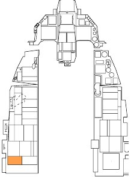
    
    All cockpit warning, caution and indicator lights should illuminate when
    the button is pressed.
    
    Voice Message System (VMS) audio alerts should play in priority
    sequence (PULLUP, ALTITUDE, WARNING, etc.). A brief LG warning
    horn should be heard prior to the WARNING and CAUTION words.

15. **AVIONICS POWER Panel [[Set]]**

    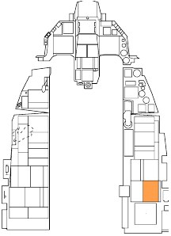
    
    1. MMC Switch – MMC
    1. ST STA Switch – ST STA
    1. MFD Switch – MFD
    1. UFC Switch – UFC
    1. GPS Switch – GPS
    1. DL Switch – DL
    1. MIDS LVT Knob – On
    
    This applies power to the aircraft’s avionics and begins running built-in-
    test (BIT) checks.

16. **INS Knob [[ALIGN NORM]]**

    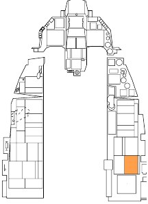
    
    This begins alignment of the INS ring laser gyro navigation system. A
    normal alignment takes eight minutes or less to accomplish if the aircraft
    remains stationary.
    
    The knob should be set to NAV prior to taxi.
    
    See the [INS Alignment section](08.insnav.md#ins-alignment) for details.

17. **SNSR PWR Panel [[Set]]**

    
    
    1. LEFT HDPT Switch – OFF
    1. RIGHT HDPT Switch – As Required
    1. FCR Switch – FCR
    1. RDR Alt switch – RDR ALT
    
    Set RIGHT HDPT on if a Targeting Pod is installed on the hardpoint.
    
    Radar and Radar Altimeter transmission is inhibited until the aircraft
    becomes airborne. Activation of these systems may be delayed until just
    before takeoff if desired.

18. **HUD Control Panel [[As Desired]]**

    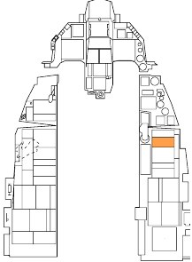
    
    Set switches to display you desired HUD symbology and format.

19. **C&I Knob [[UFC]]**

    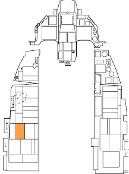

    This enables control of primary communications, navigation, and
identification functions from the upfront controls.

20. **ECM panel [[As Required]]**

    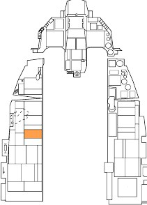

21. **Throttle SPD BRK switch [[Cycle and Close]]**

    

    This verifies proper operation on the speedbrakes. Confirm visually and
monitor speedbrake indicator.

22. **WHEELS down lights [[Check three green]]**

    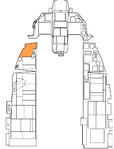

    This indicates all three landing gear are down and locked.

23. **SAI [[Set]]**

    

    Pull and rotate knob to uncage the stand-by attitude indicator.

24. **Engine SEC Mode [[Check]]**

    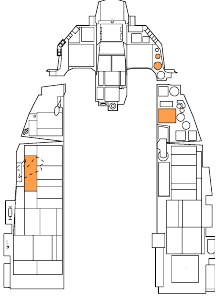
    
    1. ENG CONT switch – SEC
    1. SEC caution light – On
    1. RPM – Stabilized.
    
        RPM may drop up to 10 percent from PRI value before stabilizing.
        Stabilized SEC idle rpm may be up to 5 percent lower than that in
        PRI.
    
    1. Throttle - Snap to MIL and then snap to IDLE when rpm reaches 85
    percent. Check for normal indications and smooth operation.
    1. NOZ POS - 10 percent or less within 30 seconds after selecting
    SEC
    1. ENG CONT switch – PRI
    1. SEC caution light – Off
    1. NOZ POS – Greater than 94%

    This checks engine operation in the Secondary Engine Control
     (SEC) mode. This mode is selected in the case of failure of the
    engine-mounted digital computer that controls scheduling of engine
    fuel flow.

25. **FLCS BIT [[Initiate and Monitor]]**

    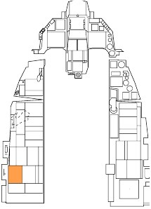
    
    1. Flight Controls – Cycle
    This is done in preparation for running the Flight Control System
     (FLCS) bit check. Maximum stick inputs warm and remove air
    bubbles from the hydraulic fluid
    1. Position BIT switch to BIT.
    The RUN light on FLCP illuminates. At successful completion of BIT
     (approximately 45 seconds), the RUN light goes off, the BIT switch
    returns to OFF, and the FAIL light and FLCS warning light remain
    off. A BIT pass message appears on the FLCS MFD page.
    Other tasks may be completed while the FLCS BIT runs.

26. **FUEL QTY SEL knob [[Check]]**

    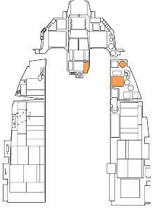
    
    1. TEST - FR, AL pointers indicate 2000(±100) pounds and totalizer
    indicates 6000 (±100) pounds. FWD and AFT FUEL LOW caution
    lights illuminate.
    1. NORM - AL pointer indicates approximately 2810 pounds. FR
    pointer indicates approximately 3250 pounds.
    1. RSVR - Each reservoir indicates approximately 480 pounds.
    1. INT WING - Each wing indicates approximately 550 pounds.
    1. EXT WING - Each external wing tank indicates approximately 2470
    pounds for full tanks.
    1. EXT CTR - FR pointer indicates approximately 1800/1890 pounds
    for full tank. AL pointer drops to zero.
    1. FUEL QTY SEL knob - As desired

27. **DBU [[Check]]**

    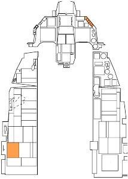
    
    1. DIGITAL BACKUP switch - BACKUP. Verify that DBU ON warning
    light illuminates.
    1. Operate controls - All surfaces respond normally.
    1. DIGITAL BACKUP switch - OFF. Verify that DBU ON warning light
    goes off.
    
    This checks operation of the digital backup software. It is used if
    problems arise with the primary FLCS software.

28. **Trim [[Check]]**

    
    
    1. TRIM/AP DISC switch - DISC
    
        - Stick TRIM button - Activate in roll and pitch
        - No control surface motion
        - No TRIM wheel or indicator motion
    
    1. TRIM/AP DISC switch - NORM
    
        - Stick TRIM button - Check and center
        - Control surface motion
        - TRIM wheel and indicator motion
    
    1. Rudder trim check.
    
        - YAW TRIM knob - Check and center

29. **MPO [[Check]]**

    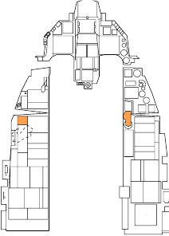
    
    1. Stick - Full forward and hold; note horizontal tail deflection.
    1. MPO switch - OVRD and hold; confirm that horizontal tail trailing
    edges move farther down.
    1. Stick and MPO switch – Release; confirm that the horizontal tail
    returns to its original position.

30. **EPU FUEL quantity [[Check 95%–102%]]**

    
    
    This indicates the percentage of hydrazine remaining.

31. **EPU [[Check]]**

    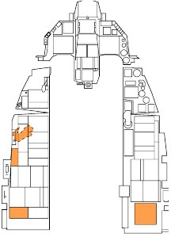
    
    1. OXYGEN - 100%
    1. Engine rpm - Increase 10 percent above normal idle
    1. EPU/GEN TEST switch - EPU/GEN and hold. Check lights:
    
        - EPU AIR light – On
        - EPU GEN and EPU PMG lights - Off (may come on
        momentarily at start of test)
        - FLCS PWR lights - On
        - EPU run light - On for a minimum of 5 seconds
    
    1. EPU/GEN TEST switch – OFF
    1. Throttle – IDLE
    1. OXYGEN – NORMAL
    
    This check verifies EPU electrical power is available in case of an
    emergency. It may be delayed until just before takeoff if desired.

32. **Avionics [[Program as required]]**

    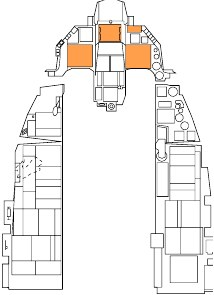
    
    Use the time on the ground as your INS aligns to check and set your
    systems for the assigned mission. Things to consider include SMS pages
    and profiles, radio channels and frequencies, navigation data, bingo fuel
    settings, ALOW settings and any other system applicable to the mission.

## Taxi

Whether you have completed a cold start or are starting the mission in a “hot” aircraft, your next step will be to
taxi to the runway.

When you are ready to start rolling, slowly advance the throttle [[PgUp]] or [[Num+]] and use the rudder pedals to
steer left [[Z]] and right [[X]]. Reduce throttle by pressing [[PgDn]] or [[Num-]]. Press [[W]] to apply wheel brakes.
Nosewheel steering gain is proportional to ground speed. As your aircraft speeds up, the rudder will become less
sensitive when controlling the nosewheel.

1. **Canopy [[Close and Lock]]**

    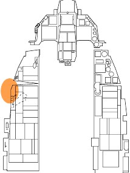
    
    Keyboard Command: [[LCtrl]]+[[C]]

2. **Altimeter [[Set and Check]]**

    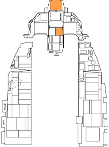
    
    Verify altitude displayed on your HUD matches the altitude on your altimeter.
    Check that the altimeter readings in ELECT and PNEU are ±75 feet of a known
    elevation and are ±75 feet of one another.

3. **Exterior Lights [[As required]]**

    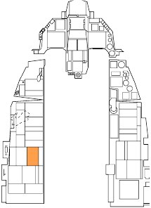

4. **INS Knob [[NAV]]**

    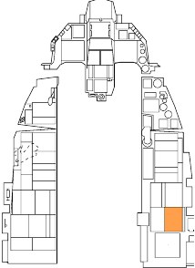
    
    
    Verify flashing RDY is visible on the DED INS page or flashing ALIGN is visible
    on the HUD if full alignment is desired.
    
    See [INS Alignment section](08.insnav.md#ins-alignment) for details.

5. **NWS [[Engage]]**

    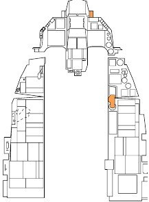

    Press the NWS/AR Disc button on your stick. The NWS/AR light right of the
HUD should illuminate to indicate NWS is engaged.

6. **Throttle [[Advance]]**

    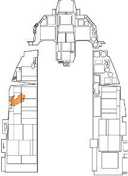

    A throttle setting just beyond idle will be required to begin rolling. Return
throttle to idle after desired speed is reached.

7. **Brakes and NWS [[Check]]**

    Gently test the brakes and nosewheel steering immediately after your aircraft
    begins to move forward.
    
    Heat may build up quickly if brakes are used for an extended period so do not
    ride the brakes to control taxi speed. Use one firm application of the toe brakes
    to slow the aircraft.

8. **Heading and Flight Instruments [[Check]]**

    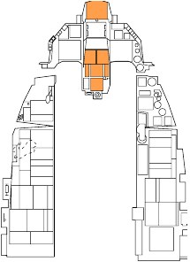
    
    Verify aircraft heading updates as your aircraft turns and that all instruments
    behave as expected.

## Before Takeoff

A series of last-minute checks should be made just prior to entering the runway. Some airfields have arm/dearm
areas you may temporarily park at to keep the taxiway clear for other traffic. You may also perform these
checks while parked on the taxiway.

1. **PROBE HEAT switch [[PROBE HEAT]]**

    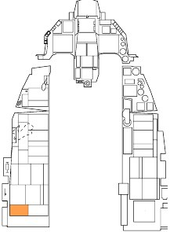
    
    This should be done at least two minutes prior to takeoff if icing conditions
    exist. Delay selection of probe heat as long as possible prior to takeoff if
    icing is not expected to prevent overheat and damage to probe
    components.

2. **ALT FLAPS Switch [[Verify NORM]]**

    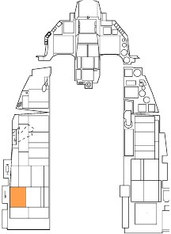

3. **Trim [[Check]]**

    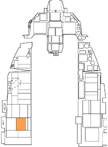

    1. Pitch and yaw trim - Centered
    1. Roll trim - As required
    
    This is a final verification the trim settings are correct for takeoff and have
    not been inadvertently changed.

4. **ENG CONT switch [[Verify PRI (guard down)]]**

    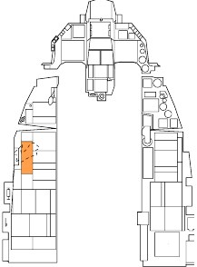

5. **Canopy [[Verify closed, locked, light off]]**

    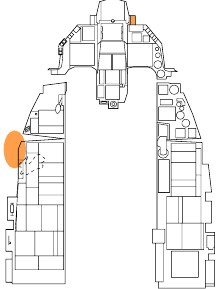

6. **STORES CONFIG switch [[As Required]]**

    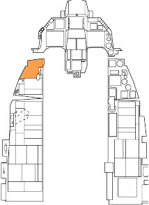
    
    In general:
    
    - CAT I: Air to Air loadouts without external wing tanks.
    - CAT III: Air to Ground loadouts, or any loadout with external wing
    tanks.

7. **Speedbrakes [[Verify closed]]**

    

8. **IFF [[Set and check]]**

    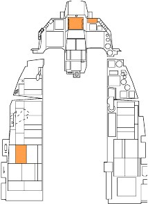

9. **External Tanks [[Verify Feeding]]**

    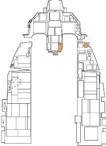
    
    Wing external fuel tanks should feed first and have a lower quantity than at
    engine start. The internal wing tanks should be full.
    
    If three external tanks are installed, verify that the centerline tank is
    feeding. This action checks that pressurization is available to all tanks.

10. **FUEL QTY SEL knob [[NORM]]**

    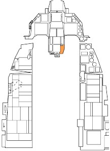
    
    The FUEL QTY SEL knob must be set to the NORM position to allow the
    automatic forward fuel transfer system, trapped fuel warning, and for the
    BINGO fuel warning computation to be based on fuselage fuel.

11. **Flight Controls [[Cycle]]**

    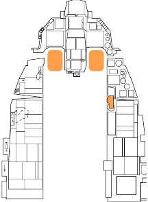
    
    This is to verify freedom of movement and ensure controls are not
    obstructed.

12. **OIL Pressure [[Check]]**

    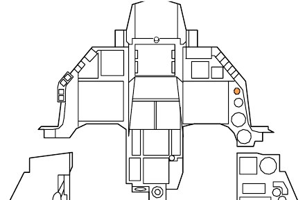
    
    Normal indication is 15–65 psi

13. **All warning and caution lights [[Check]]**

    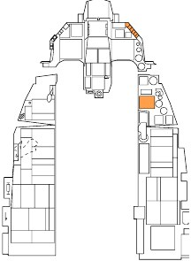

    Verify no unexpected indications.

14. **TGP (if installed) [[Stow]]**

    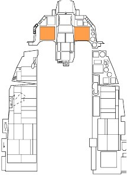

    Targeting Pod is stowed by selecting STBY on the Targeting Pod Control
    Page.

    This is done prior to takeoff and before landing to prevent foreign object
    damage to components.

15. **Ejection safety lever [[Arm (down)]]**

    
    
    This arms the ejection seat and allows ejection when the ejection handle is
    pulled. This is delayed for as long as possible to prevent inadvertent
    ejection on the ground. Egress through other means is usually preferable.

## Takeoff

Once lined up for takeoff on the directed runway, you may perform a final run-up check:

1. **Brakes [[Hold]]**

    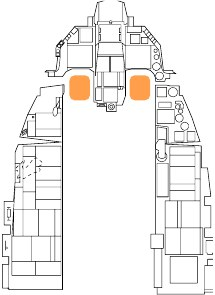

2. **Parking Brake [[Verify disengaged]]**

    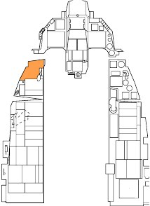

3. **Throttle [[90% RPM]]**

    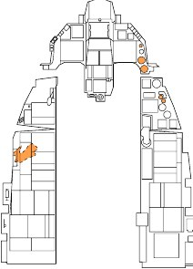

    Check for normal engine indications:

    - HYD/OIL PRESS warning light – Off
    - OIL pressure – 25-65 psi (must increase as RPM increases)
    - FTIT – 935⁰ C or less
    - HYD PRESS A & B – 2850-3250 psi

4. **Brakes [[Released]]**

    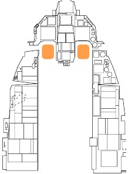

5. **Throttle [[Advance to desired thrust]]**

    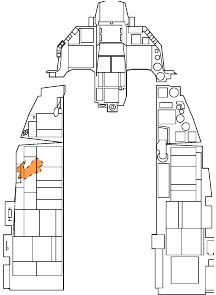

    Engine FTIT and RPM should stabilize within 5-15 seconds while on the takeoff
roll. Check for normal acceleration and normal engine indications.

6. **NWS [[Disengage at 70 Knots]]**

    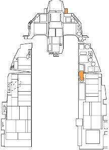

Gently pull back on the stick and establish takeoff attitude (8–12°) at approximately 10 knots below takeoff
speed for MIL power or 15 knots below takeoff speed for AB.

Acft Weight (lbs) | TO Speed (KIAS)
------------------|----------------
20,000            |128
24,000            |142
28,000            |156
32,000            |168
36,000            |178
40,000            |188
44,000            |198

Low stick forces are needed for rotation. Pulling back on the stick early may lead to uncontrollability due to early
lift-off at low speed and increase the distance needed to take off.

Ensure a positive rate of climb is established and raise the landing gear. The trailing edge flaps retract at the
same time as the landing gear and may cause the aircraft to settle and scrape the runway when lift is lost.

The landing gear should be up and locked before exceeding 300 knots. Higher airspeeds may detach wiring
and other components or cause structural damage to the landing gear doors.

### Crosswind Takeoff

When taking off in a crosswind, the aircraft will want to weather-vane into the wind (turn into the wind). This will
have the result of raising the upwind wing. To counteract, you want to use a slight amount of left or right stick
into the wind direction. This will help keeping the wing level. You will also want to use a little rudder input to
keep a straight takeoff roll down the center of the runway.

During rotation, be careful to smoothly blend rudder input to establish a proper crab angle into the wind. With a
proper crab angle, the Flight Path Marker (FPM) should be aligned down the runway when becoming airborne.

## Normal Flight

There are no specific procedures to follow once airborne. You will need to rely on your own understanding of
aircraft systems and basic flight to keep the aircraft in one piece and accomplish the mission.

### In-flight Checks

At frequent intervals, check the aircraft systems, engine instruments, cockpit pressure, and oxygen flow
indicator and system operation. Monitor fuel in each internal and external tank to verify that fuel is transferring
properly by rotating the FUEL QTY SEL knob and checking that the sum of the pointers and totalizer agree, and
that fuel distribution is correct.

### Trimming the Aircraft

The Flight Control System does a great job of maintaining aircraft trim but there are some situations where you
will need to manually trim the aircraft. When out of trim, you will notice the aircraft wanting to pitch, roll or yaw
(roll being the most common).

The trim switch is used to move the control stick to a new “neutral “position. For example: if the nose wants to
raise, you can input some nose down trim that will move the neutral point forward to a new position. This
relieves you from maintaining continuous pressure on the stick to maintain level flight when out of trim.

The most common need for trim is when stores are released that cause an asymmetric configuration. For
example, releasing a bomb from a left wing station but not the right will cause a roll to the right, in the direction
of the heavier wing. Roll trim will be required for the aircraft to maintain wings level flight with no stick input.

## Air Refueling

Some missions may require air refueling to ensure you have enough fuel to reach the target and return safely to
base. Even if more fuel is not required, you may wish to top off your tanks to allow more options in the target
area, like a low altitude, high speed ingress or more liberal use of the afterburner.

Tanker locations will be noted in the mission briefing or displayed on the Mission Planner screen. Tankers are
also equipped with air-to-air TACAN to help with the rendezvous. If in doubt, you may also request a vector to
the nearest tanker from AWACS.

You should announce your intent to refuel before approaching the tanker using the communications menu.

The tanker will respond with their current altitude and airspeed and clear you to the pre-contact position.
Continue to fly the rendezvous using radar or TACAN as a guide.

The following steps should be taken to make your aircraft safe before approaching the tanker.

1. **MASTER ARM Switch [[OFF]]**

    

2. **LASER ARM Switch [[OFF]]**

    

3. **Emitters [[OFF/STBY]]**

    
    
    Radiation from emitters like ECM, Radar or Radar Altimeter may present
    a hazard to tanker aircraft and personnel. Use them during the
    rendezvous if required but turn them off prior to reaching the pre-contact
    position.
    
    This can be done using the individual panels for each system or with the
    RF Switch. When set to SILENT, all radiation from the aircraft is disabled,
    to include the radar, radar altimeter, data link, TACAN transmit, and ECM.
    In QUIET mode though, the radar, TACAN, and data link transmit but all
    other emissions are inhibited.

    Take the following steps to configure the aircraft for refueling.

4. **AIR REFUEL Switch [[Open]]**

    
    
    This should be done 3-5 minutes prior to refueling with external fuel
    tanks to depressurize the tanks and allow them to be filled.
    
    Flight control gains change to takeoff and landing settings to allow fine
    control.

5. **AR status light [[Verify RDY]]**

    

6. **HOT MIC / CIPHER switch [[HOT MIC]]**

    

    This allows direct communication through the refueling boom.

7. **Exterior lights [[As required]]**

    

    At night, exterior lights should be set to DIM and STEADY settings and
the Anti-Collision light should be set to OFF.

8. **DED Bingo Page [[Monitor]]**

    

    As a technique, you may choose to pull the Bingo page up on the DED
    by selecting LIST→2 on the ICP. Your total fuel load will be displayed.
    This allows you to verify you are tasking fuel without going heads-down
    to the fuel quantity indicator.
    
    

Take the pre-contact position directly behind the boom and report you are ready to refuel.

The boomer will clear you to the contact position. Use small, smooth control inputs, and add a very slight
amount of throttle. Be patient and allow that power change to move you forward.

Allow the boom to pass just left or right of your canopy, about 2-3 feet above your head. This serves as a good
first check that you are at the proper height relative to the tanker. Continue to move slowly forward, maintaining
alignment with the yellow stripe painted on the bottom of the tanker.

Fly formation on the tanker and allow the boom operator to fly the boom into the refueling receptacle behind the
cockpit on your aircraft. Use the director lights on the bottom of the tanker to maintain a position within the limits
of the boom.

The lights are directive, meaning they tell you the direction to travel and not your current position. In other
words, preface the D, U, F and A with the word “go”. If the light moves toward the D, go down; if it moves
toward the U, go up. If the light moves toward the A, go aft; if it moves toward the F, go forward.

The boomer will announce ‘contact’ and ‘you are taking fuel’ when the connection is established. The AR/NWS
light next to the HUD will illuminate. Monitor your fuel transfer on the DED or Fuel Quantity indicator.
It is likely you will unintentionally disconnect at some point in the process, especially on your first few attempts.

If this happens, return to the pre-contact position, and try again.

Perform the following steps when refueling is complete.

1. **A/R DISC button on stick [[Press]]**

    

    This unlatches from the boom.
    
    Verify the DISC light is illuminated next to the HUD.

2. **AIR REFUEL Switch [[CLOSE]]**

    

3. **HOT MIC / CIPHER switch [[OFF]]**

    

4. **Fuel Quantity [[Check]]**

    

    Verify proper transfer and balance after refueling is complete.

5. **AR Status Lights [[All OFF]]**

    

6. **Emitters [[As Required]]**

    

    Emitters like ECM, Radar or Radar Altimeter were turned off prior to
    refueling. If this was done on the individual cockpit panels, set them
    back to the desired positions.
    
    If this was done using the RF Switch, set the switch to the desired
    position.

7. **MASTER ARM Switch [[As Required]]**

    

8. **LASER ARM Switch [[As Required]]**

    

9. **Exterior lights [[As Required]]**

    

## Descent/before Landing

You should set up the aircraft in preparation for landing the aircraft.

1. **Fuel [[Check quantity/transfer/balance]]**

    

2. **Landing [[Light On]]**

    

3. **Altimeter [[Set and Check]]**

    

    Verify altitude displayed on your HUD matches the altitude on your
    altimeter.
    
    Check that the altimeter readings in ELECT and PNEU are ±75 feet of a
    known elevation and are ±75 feet of one another.

4. **Attitude references [[Check]]**

    

    Attitude indications for ADI, HUD and SAI should agree.

5. **ANTI ICE Switch [[As required]]**

    

6. **TGP [[Stow]] (if installed)**

    
    
    Targeting Pod is stowed by selecting STBY on the Targeting Pod Control
    Page.
    
    This is done prior to takeoff and before landing to prevent foreign object
    damage to components.

## Landing

After completing a sortie, perhaps the most challenging part may still await you… the landing.

1. Initial Approach. Align your aircraft with the landing runway at 1,500 feet above ground level (AGL) and
300 knots calibrated airspeed (KCAS).
2. Overhead Break. Break left or right over the desired touchdown point, set throttle to about 80% RPM, and
open the speedbrakes. Fly the break at about 70 deg of bank and 3-4 G. Align the HUD Flight Path Marker
with the Horizon Line to maintain a level turn.
3. Downwind Leg. Roll out on the downwind leg opposite the landing heading at about 200-220 KCAS and
1,500 feet AGL. Extend the landing gear and confirm three green gear down indications. Reduce speed as
required to prevent excessive airspeed buildup in the base turn and trim to an angle of attack (AoA) of 11°.
4. Base Turn. Initiate the base turn when abeam the rollout point. You may estimate this position by starting
the turn when your wingtip is at the end of the runway when viewed from the cockpit. Lower the nose to 8–
10° and fly the turn at 11° AoA.
5. Final Turn. Use your throttle to control airspeed while using the stick maintain 8–10° nose low and 11°
AoA through the turn. Roll out on final and raise the nose to maintain proper glide path. The goal is to roll
out in line with the runway at approximately 300 feet AGL one mile from the touchdown point. Align the
HUD flight path marker and 2.5° pitch ladder with the runway threshold to ensure proper glidepath while
maintaining 11° AoA.
6. Short Final. When over the overrun, the portion of the runway before the primary surface starts, shift the
flight path marker forward to a point 300-500 down the runway. Gently pull back on the stick to flare and
reduce the descent rate but do not level off. Pull the throttle back to idle and touchdown with a maximum
AoA of 13°. More than 15° during the landing roll-out may cause the speedbrakes or engine nozzle to
contact the runway so use gentle stick inputs to avoid overcontrolling the aircraft.
7. Roll-Out. Maintain 13° nose-up attitude for two-point aerodynamic braking until your airspeed has reduced
to approximately 100 knots. Reduce back stick pressure and lower the nosewheel to the runway. Open the
speedbrakes fully and maintain full aft stick for maximum braking effectiveness.

    Apply moderate to heavy braking to slow the aircraft. Engage nosewheel steering when below 30 knots
unless it is required earlier to prevent departure from the runway.

### Crosswind Landing

When landing in a crosswind, you should maintain wings-level and allow the aircraft to crab through touchdown.

At touchdown, quickly correct with rudder to maintain alignment down the runway. After touchdown, the aircraft
will want to weathervane into the wind, so you must compensate with rudder use or differential braking. A small
amount of left or right stick into the wind direction may be required to help keep the wings level.

Perform the landing roll-out as described above but maintain two-point aerobraking until below 100 knots or
aircraft control becomes a problem.

High rudder pedal force may cause an abrupt yaw as nosewheel steering is engaged. Center the rudder before
engaging nosewheel steering if possible.

## After Landing

When the aircraft is safely back on the ground it is time to start powering down systems and preparing for
shutdown. These tasks may be performed as you taxi clear of the runway. You may also pull into an arm/de-
arm area to complete the tasks if desired.

1. **PROBE HEAT switch [[OFF]]**

    

    Leaving heating applied to the probe without airflow to cool it may damage
probe components.

2. **ECM Power [[OFF]]**

    

3. **Speedbrakes [[Close]]**

    

4. **Ejection safety lever [[Safe (up)]]**

    

    The ejection seat is safed after landing to prevent inadvertent ejection. A
ground egress is usually preferable to ejection in an emergency on the
ground.

5. **IFF MASTER knob [[STBY]]**

    

6. **LANDING / TAXI light [[As required]]**

    

7. **Armament Switches [[Off, Safe, or Normal]]**

    

    This should be accomplished before ground personnel approach the
aircraft.

8. **Avionics [[Off]]**

    

    This may be delayed until you are stopped at the parking location if you
wish to record data or maintain INS alignment.

## Engine Shutdown

Perform the following after coming to a stop in your parking location. This is much simpler than aircraft start-up
because the order is less critical and proper operation of the systems are not being checked.

1. **Throttle [[Off]]**

    
    
    Keyboard Command: [[RShift]]+[[End]]
    
    This terminates ignition and shuts off the fuel supply to the engine. The
    engine spools down and the generator drops offline. Caution and Warning
    lights are to be expected.

2. **JFS RUN light [[Confirm Off]]**

    

3. **EPU GEN and EPU PMG lights [[Confirm off]]**

    

    Check after main generator power drops offline. Lights on may indicate
impending activation of the EPU and a hazardous condition.

4. **MAIN PWR switch [[Off]]**

    
    
    Delay placing MAIN PWR switch to OFF until after engine rpm decreases
    through 20 percent. This delay should allow the exhaust nozzle to remain
    open and makes it easier for the crew chief to accomplish the post flight
    inspection.

5. **OXYGEN REGULATOR [[Off and 100%]]**

    
    
    This closes the regulator valve and prevents damage from foreign objects
    or small particles entering the system.

6. **Canopy [[Open]]**

    
    
    Keyboard Command: [[LCtrl]]+[[C]]

{!abbr.md!}
