# Link 16 Datalink

## Overview

The aircraft relies on the Multifunction Information Distribution System (MIDS) radios that allow the transmission
and reception of data over the Link 16 Tactical Data Information Link (TADIL) network. Link 16 allows NATO
and other services to share data with each other.

Link 16 is part of the MIDS radio system and must be activated by rotating the MIDS LVT knob on the Avionics
Power Panel to the ON position. The DL switch next to the knob is not applicable to this block of the F-16C and
may be left OFF if desired.

The primary purpose of Link 16/MIDS is to provide a near-real-time picture of the tactical area around the pilot’s
aircraft. Data from ownship sensors, other friendly fighters on the network, and surveillance assets like AWACS
are correlated to create a unified situational awareness picture. This in turn allows a more coordinated
engagement and less chance of fratricide.

## Display Symbology

Each trackfile is represented by a symbol on the HSD and Radar Display. Depending on the shape and color,
you can determine whether it is friendly or hostile, and what the source of the track is; onboard systems,
offboard donors, or a combination of the two.

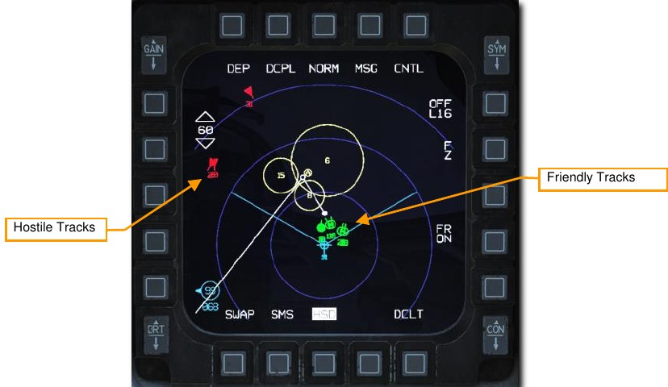
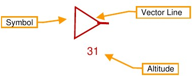

**Symbol**. The basic symbol changes shape and color to represent different information. See below for
examples.

**Vector Line**. This line points in the direction the track is heading.

**Altitude**. This displays the track’s altitude in thousands of feet

The Radar Display presents the information in much the same way as the HSD but includes an additional
identifier when a target is ‘bugged’ as the primary target by another donor aircraft on the network. This is a great
aid to target sorting as it allows the pilot to prioritize targets not being engaged by other aircraft in the area.

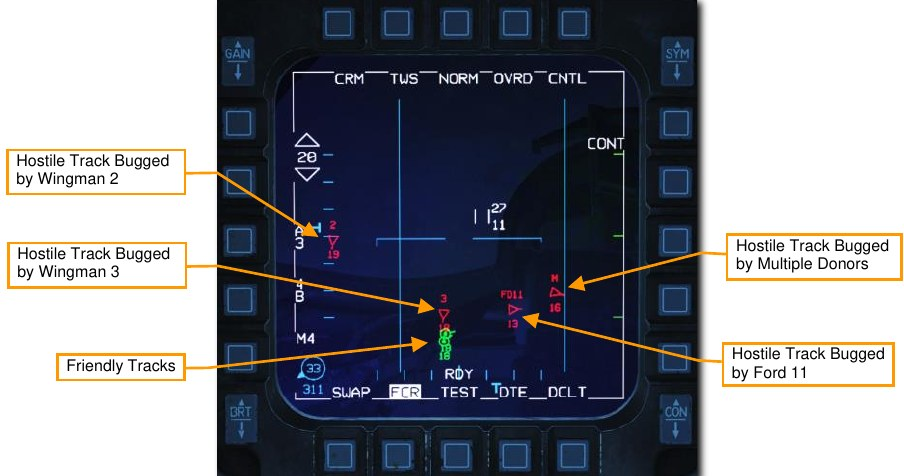
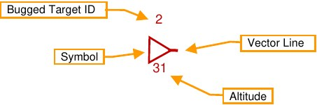

The Bugged Target ID shows the aircraft that is currently targeting a hostile track and may be interpreted as
follows:

**1, 2, 3, or 4**. These identify the member of the pilot’s flight that is currently bugging the target.

**FD11, EN23, CY14, etc**. The first and last letters of the callsign and flight position number is displayed when a
target is bugged by a donor that is not a member of the pilot’s flight. For example, FD11 identifies Ford 11,
CY14 identifies Chevy 41, and so on.

**M**. The target is bugged by multiple donors.

Bugged targets are identified differently on the HSD than on the radar display. A dashed cyan Wingman
Lockline is drawn from wingmen to their currently bugged targets. Wingman Locklines are only displayed for
flight members and not for all donors on the network.

Bugged Target IDs are shown on the radar display only and Wingman Locklines are displayed on the HSD only.

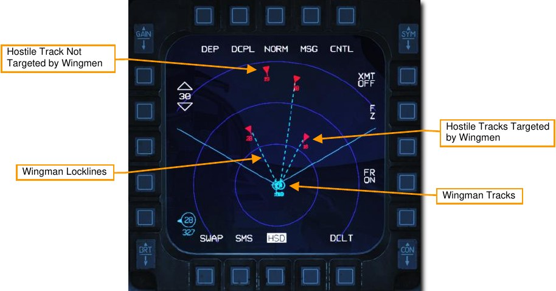

Link 16/MIDS can receive and display three types of trackfiles:

- **Surveillance Tracks**. These are tracks provided by data sources like AWACS and radar ground
stations.

    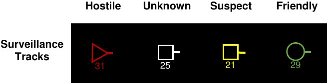

- **Fighter Tracks**. These are tracks provided by donor aircraft, other fighters providing track data, on
the network. They are all correlated against each other to avoid duplicate trackfiles. These are
visually identical to surveillance tracks.

    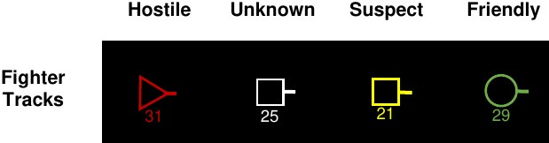

- **Precise Participant Location and Identification (PPLI) Tracks**. These show the location and status
of members of the pilot’s own flight and up to four additional donor aircraft.

    

Trackfiles from each of these three sources (offboard) are then correlated with the sensors of the player’s
aircraft (onboard). This is termed Multi Source Integration (MSI).

### Radar Display Filtering

Track symbols displayed on the FCR page may be filtered using the UHF/VHF Transmit switch. This affects
tracks displayed on the radar display only and does not affect those displayed on the HSD.

Positioning the switch inboard short (less than .5 sec) rotates between three filter options:

- ALL. All symbols are displayed
- FTR+. Surveillance tracks are removed
- TGTS. Surveillance and PPLI tracks are removed

Positioning the switch outboard short (less than .5 sec) selects NONE and removes all datalink tracks.
Selecting outboard short again returns to the previously selected filter option.

The current option is displayed at the bottom left of the radar display.

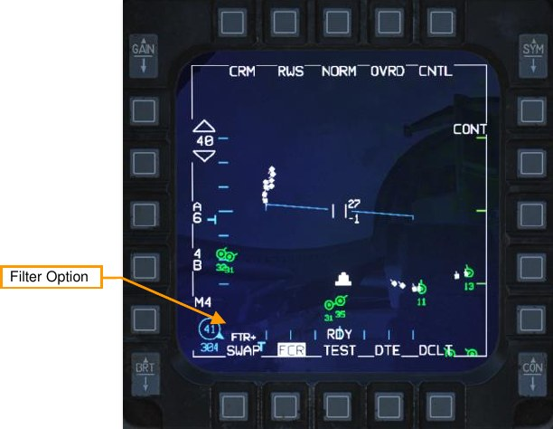

## DLNK DED Pages

Three datalink (DLNK) pages are available on the DED to monitor and verify configuration of the Link 16
system. The first page is accessed by pressing the LIST button on the ICP and selecting ENTR (“E”). The next
page can be selected by toggling the DCS right to the SEQ position.

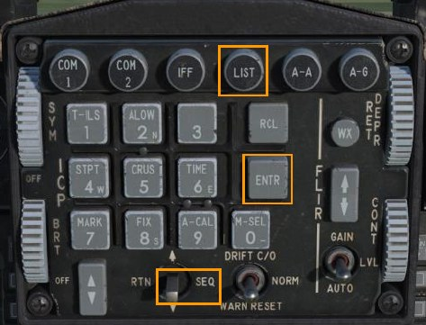
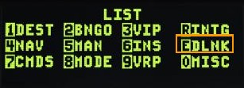

### Network Status

Page 1 displays network status and time references.

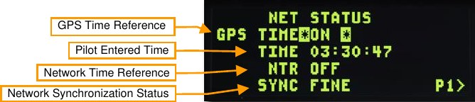

**GPS Time Reference**. All Link 16 network participants must work off a common time reference. This is
provided by GPS clock data when this is set to ON.

**Pilot Entered Time**. If GPS is not used or not available, network participants may enter a time based on a pre-
arranged reference.

**Network Time Reference**. If enabled, this identifies the aircraft as the network controller. This is normally set to
OFF.

**Network Synchronization Status**. This displays the quality of time synchronization with the network.

### MIDS Radio Options

Page 2 sets MIDS radio options, including channels for data reception and transmission power.

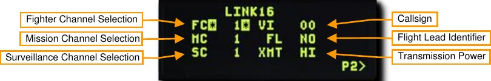

**Fighter, Mission and Surveillance Channel selection**. This selects the MIDS channel data from flight
members, other flights and AWACS aircraft is received on. These are pre-set and do not need to be changed.

**Callsign**. This is the identifier for data coming from the aircraft.

**Flight Lead Identifier**. If enabled, this identifies the aircraft as the flight lead.

**Transmission Power**. This selects the power output for the MIDS radios.

### Flight Management

Page 3 allows management and identification of flight members on the network.

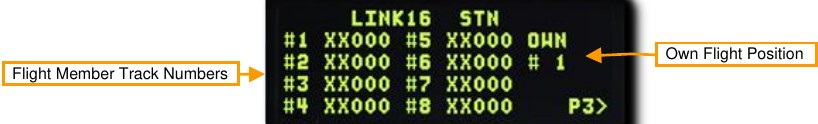

**Flight Member Track Numbers**. These identify the tracks for members of a flight. These are pre-set and do not
need to be changed.

**Own Flight Position**. This identifies the aircraft’s position in the flight.

{!abbr.md!}
