# Litening At Targeting Pod

## Overview

The targeting pod provides you the ability to view, track, or designate targets day or night. There are two live
video modes: Charge Coupled Device (CCD) (like a TV display) and Forward Looking Infrared (FLIR) in both
Black Hot and White Hot sub-modes.

The main function modes and sub-modes for the TGP include:

- Standby (STBY)
- Air-to-Ground (A-G)
    - Slave (Ground)
    - AREA Track
    - POINT Track
    - INR Track
    - Laser Spot Search (LSS)
- Air-to-Air (A-A)
- Slave (Body)
    - POINT Track
    - RATE Track
    - HUD

Each of these modes also has a Control Page that provides you with the ability to configure TGP features.

## TGP Activation

The following switches must be set on the Avionics Power Panel for all TGP features to function:

- MMC switch – MMC
- ST STA switch – ST STA
- MFD switch – MFD
- UFC switch – UFC
- INS – NORM

Power is applied to the TGP from the Sensor Control Panel:

- RIGHT HDPT switch – RIGHT HDPT

Select TGP from the MFD Menu to access the TGP page.

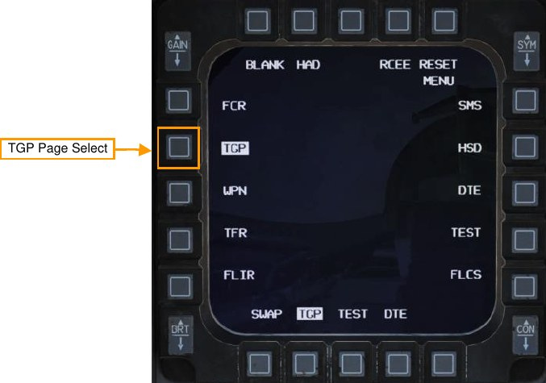

When the TGP is initially activated, the Standby page will be displayed with a “NOT TIMED OUT” message
displayed in the upper center portion. Time is needed to run automatic power-up self-tests and for the FLIR
sensor to cool down.

A “FLIR HOT” message is displayed in white text on a black background with half the text height as the “NOT
TIMED OUT” message. After about three minutes, the message will be removed, video will appear, and the
Standby mode page will be selected.

## Standby (STBY) Mode

This will be the first TGP mode screen displayed upon activation of the TGP. After the “NOT TIMED OUT”
message has been removed (after 3 minutes), the mode may be exited by selecting one of the other two TGP
modes or the standby control page.

The following OSB functions may be displayed:

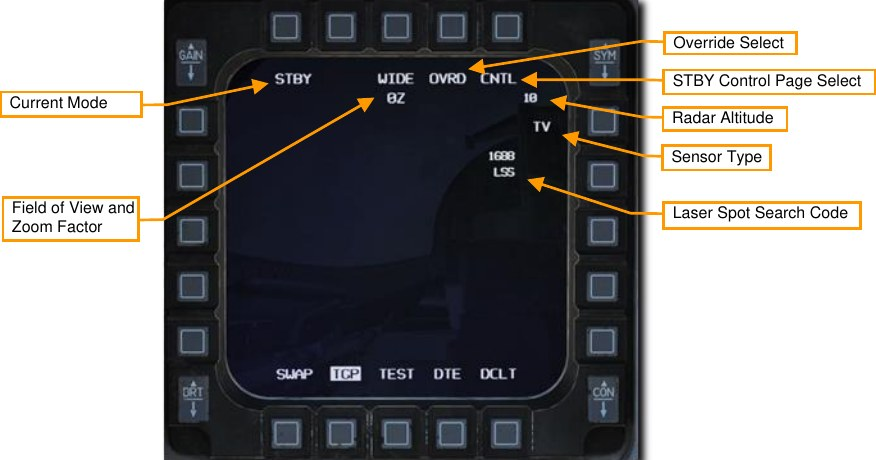

**Current Mode**. This is the mode the TGP is currently in.

**Field of View**. Pressing this OSB toggles between Narrow Field of View (NFOV) or Wide Field of View
(WFOV). These views can vary between the CCD and FLIR sensors in the TGP.

- FLIR field of view:

    - Wide Field of View (WFOV) is 4° × 4°
    - Narrow Field of View (NFOV) is 1° × 1°

- CCD field of view:

    - Wide Field of View (WFOV) is 3.5° × 3.5°
    - Narrow Field of View (NFOV) is 1° by 1°

**Zoom Factor**. Within an FOV selection, you may additionally adjust the zoom-factor by zooming in and out with
the RANGE knob. The zoom range goes from 0Z (no zoom) to 9Z (highest level of zoom within FOV). Objects
within the TGP field of view double in size from 0 to 9 zoom.

**OVRD Select**. Pressing this OSB overrides any current mode and returns to STBY. The last selected mode is
returned to when OVRD is selected a second time.

**STBY Control Page Select**. Pressing this OSB selects the STBY Control Page. Options and functions are
described below.

**Radar Altitude**. The current radar altitude is displayed.

**Sensor Type**. Displayed in the upper right corner, this text field indicates the current video mode that the TGP
is collecting in. The three options include:

- WHOT. Using the FLIR camera, hot objects appear lighter than a cooler background.
- BHOT. Using the FLIR camera, hot objects appear darker than a cooler background.
- TV. The Charge Coupled Device camera displays this image. This is a daytime, electro-optical
camera.

**Laser Spot Search Code**. This is the laser pulse rate frequency (PRF) code the TGP will attempt to locate in
laser spot search (LSS) mode.

### Mode Selection

You may change modes by pressing the OSB 1 adjacent to STBY. The following options will be displayed
depending on Master Mode:

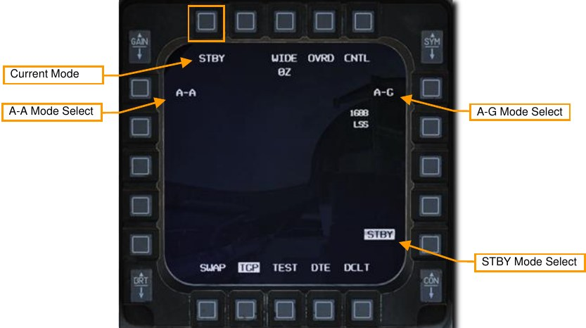

**A-A Mode Select**. Pressing this OSB selects A-A mode.

**A-G Mode Select**. Pressing this OSB selects A-G mode.

**STBY Mode Select**. Pressing this OSB selects STBY mode.

## Air-To-Ground (A-G) Mode

When A-G mode is first entered, the TGP will boresight at 150 mils below the zero sight line of the aircraft,
directly forward and slightly down. The following elements may be displayed:

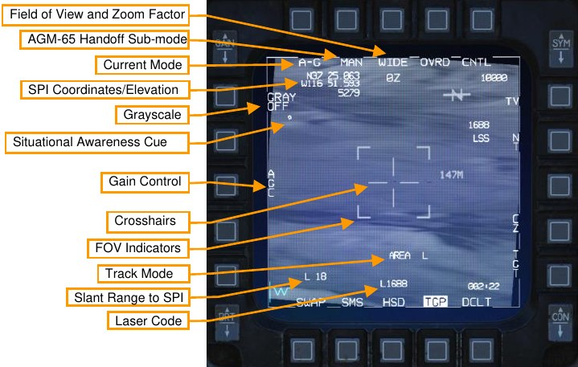

**Field of View**. Pressing this OSB toggles between Narrow Field of View (NFOV) or Wide Field of View
(WFOV). These views can vary between the CCD and FLIR sensors in the TGP.

- FLIR field of view:

    - Wide Field of View (WFOV) is 4° × 4°
    - Narrow Field of View (NFOV) is 1° × 1°

- CCD field of view:

    - Wide Field of View (WFOV) is 3.5° × 3.5°
    - Narrow Field of View (NFOV) is 1° by 1°

**Zoom Factor**. Within an FOV selection, you may additionally adjust the zoom-factor by zooming in and out with
the RANGE knob. The zoom range goes from 0Z (no zoom) to 9Z (highest level of zoom within FOV). Objects
within the TGP field of view double in size from 0 to 9 zoom.

**AGM-65 Handoff Sub-mode**. This OSB toggles between MAN and AUTO for AGM-65D/G Maverick hand off
mode.

- MAN. The AGM-65 will be slaved to the Line of Sight of the TGP but will not automatically be handed
off the lock. Pilot must manually change SOI to AGM-65 and command lock manually.
- AUTO. TMS right will hand off the lock to the AGM-65 if the target contrast and size meets criteria of
missile lock.

**Current Mode**. This is the mode the TGP is currently in.

**SPI Coordinates/Elevation**. The lat/lon coordinates and elevation in feet of the current System Point of Interest
(SPI) is displayed. This is usually the point in the center of the crosshairs at ground level.
Grayscale. When pressed, it displays a 10-stage gray scale bar at the bottom of the display. When enabled,
the label changes to GRAY ON.

**Situational Awareness Cue**. The SA cue provides you a reference to indicate the TGP’s current line of sight in
reference to the pod’s longitudinal (boresight) axis, which is coincidental with the aircraft longitudinal axis. The
cue is represented as a small square that can move to any spot within the display. The position of the SA
square represents the current TGP line of sight.

**Gain Control**. Pressing this OSB toggles between manual and automatic gain control for the FLIR video.

- MGC. If selected, level control arrows are displayed on the OSBs below (not shown). Gain may be
controlled with the physical gain rocker switch on the top left of the MFD. The current selected gain is
indicated on the top left corner of the TGP page (not shown).
- AGC. Gain is adjusted automatically, and the level control arrows and gain indicator are both
removed.

Note: The AGC/MGC label and associated OSB labels are displayed even if the TGP is in TV mode.

**Crosshairs**. Line of sight for targeting and laser fire.

**Field of View (FOV) Indicators**. These four corner brackets are only shown when WIDE FOV is enabled and
indicate the portion of the image that will be displayed if NARO FOV is enabled.

**Track Mode**. If the TGP is in a track mode, this field will indicate the track mode it is in. Types include:

- AREA. In AREA track mode, the TGP performs image correlation to track an overall scene. AREA
track mode is effective at tracking fixed objects.
- POINT. In POINT track mode, the TGP attempts to follow the centroid of a visible object using edge
detection. POINT track mode is effective at tracking moving objects that are well-defined against their
background, either because they are warmer (in HOC/COH sub-modes) or brighter (TV sub-mode).
- INR (inertial rates). In INR mode, the TGP maintains its LOS on a position using only inertial
integration. It does not do any image processing. INR track mode is effective at approximately
maintaining the TGP LOS when the target is at risk of being masked or obscured.

**Slant Range to SPI**. This indicates the slant range in nautical miles to the SPI. The preceding letter indicates
the source of the range data.

- L. Laser (priority over all other sources)
- T. TGP passive ranging
- (blank). Sensor that is not the TGP is providing range (for example, FCR A-G ranging)

**Laser Code**. If the laser is firing (flashing L), the targeting pod laser code being used should display the code
as set on the LASR DED page. This is an octal value of 1 to 8 with a range between 1111 and 2888.

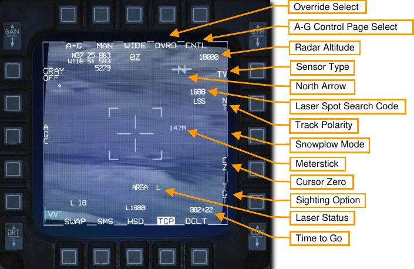

**OVRD Select**. Pressing this OSB overrides any current mode and returns to STBY. The last selected mode is
returned to when OVRD is selected a second time.

**A-G Control Page Select**. Pressing this OSB selects the STBY Control Page.

**Radar Altitude**. The current radar altitude is displayed.

**Sensor Type**. Displayed in the upper right corner, this text field indicates the current video mode that the TGP
is collecting in. The three options include:

- WHOT. Using the FLIR camera, hot objects appear lighter than a cooler background.
- BHOT. Using the FLIR camera, hot objects appear darker than a cooler background.
- TV. The Charge Coupled Device camera displays this image. This is a daytime, electro-optical
camera.

**North Arrow**. The north arrow cue consists of the letter N with an arrow, displayed on the top right corner of the
TGP base page. The arrow points to magnetic north in 1.4° increments relative to the TGP cross hairs line of
sight.

**Laser Spot Search Code**. This is the laser pulse rate frequency (PRF) code the TGP will attempt to locate in
laser spot search (LSS) mode.

**Track Polarity**. For either FLIR or TV, pressing this OSB toggles between Neutral Track (NT) and White Track
(WT). When TV is selected, the OSB cycles between NT, WT, and Black Track (BT).

- NT mode allows both white and black targets to be point tracked. This is the default A-G mode.
- WT only allows white point targets to be tracked. This is the default A-A mode
- BT allows black point targets to be tracked.

Pressing this OSB twice within 0.5 seconds toggles the Laser Spot Tracker (LST) function on and off.

**Snowplow Mode**. This mode is available in NAV and A-G modes while the TGP is not tracking. This mode is
available when SP is displayed adjacent to the OSB (not shown). When SP is pressed, both the FCR and TGP
are commanded to snowplow mode.

In snowplow mode, the TGP LOS is commanded straight ahead and angled downwards to point to the ground
ahead at ½ of the currently selected FCR scale (for example, if selected FCR scale is 40nm, the TGP will look
at the point on the ground 20nm ahead). Because the location determined by the reticle is snowplowing, the SPI
itself will also snowplow.

Slewing is disabled; however, it is possible to ground-stabilize by pressing TMS-fwd. This will exit SP mode and
enter a normal AREA track.

**Meterstick**. The meterstick is a number to the right of the reticle that indicates the length of the ground under
the crosshair, in meters.

**Cursor Zero**. Pressing CZ erases the cursor slew and returns the SPI to the currently selected steerpoint.

**Sighting Option**. This OSB will cycle between TGT-OAP1-OAP2 where OAP is the Offset Aim-Point (OAP)
which can be added to each steer point. An OAP can be useful if the target is obscured by weather, but the
OAP is in the clear. By selecting OAP1 or 2, the TGP slaves to the clear OAP and the aiming can be confirmed,
although the steering and weapon delivery calculations will be to the target.

**Laser Status**. This displays the current state of the laser designator.

- (blank). Laser not armed
- L. Laser armed.
- Flashing L. Laser firing.

**Time to Go**. This shows the time to the next event depending on the aircraft status. Time to reach the
steerpoint is displayed if in NAV master mode. Time to release weapon is displayed if in A-G mode if a target
has been designated in an auto-delivery mode. Time to impact is displayed if a weapon has been released.

Weapons delivery using the TGP in A-G mode is covered in the Laser Guided Bombs section.

### Track Modes

The LITENING II targeting pod can employ one of three different modes to track a target: AREA, POINT, INR
(inertial rates), and SP (snowplow). Each track mode is suitable for a different situation.

- In AREA track mode, the TGP performs image correlation to track an overall scene. AREA track
mode is effective at tracking fixed objects.
- In POINT track mode, the TGP attempts to follow the centroid of a visible object using edge detection.
POINT track mode is effective at tracking moving objects that are well-defined against their
background, either because they are warmer (in HOC/COH sub-modes) or brighter (TV sub-mode).
- In INR mode, the TGP maintains its LOS on a position using only inertial integration. It does not do
any image processing. INR track mode is effective at approximately maintaining the TGP LOS when
the target is at risk of being masked or obscured.
- In SP mode, TGP LOS is commanded straight ahead and angled downwards to point to the ground
ahead at ½ of the currently selected FCR scale (for example, if selected FCR scale is 40nm, the TGP
will look at the point on the ground 20nm ahead).

Therefore, it is recommended to use AREA track mode for stationary targets and POINT track mode for moving
targets. In situations where the targeting pod is likely to become masked (intensive maneuvering, concealment
behind terrain, or turning away from the target), it’s recommended to first change the TGP to INR track mode to
preserve the LOS as best as possible. SP mode is useful for locating targets directly ahead without reference to
steerpoints or other anchor points loaded into the aircraft.

When the targeting pod is initially brought out of standby, it is not in any track mode. The pilot can move the
targeting pod between track modes using the TMS switch:

SWITCH POSITION | INR MODE |AREA MODE |POINT MODE |SP MODE
----------------|----------|----------|-----------|------
TMS FORWARD     | Commands POINT track | Commands POINT track | | Commands POINT track
TMS RIGHT       | Commands AREA track | | Commands AREA track | Commands AREA track
TMS DOWN        | Commands Cursor Zero | Commands INR track | Commands INR track | 

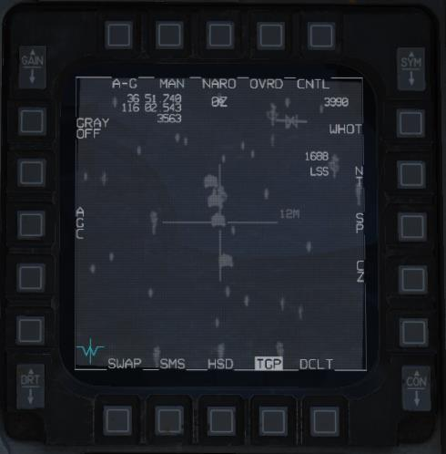

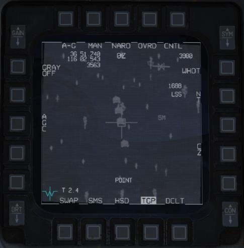

When the TGP cursor is slewed, the targeting pod automatically and temporarily changes to INR track mode.
The previous track mode (AREA or POINT) is re-commanded once slewing stops.

### Laser Ranging

One very important feature of the Targeting Pod’s laser designator is the ability to measure the slant range to
the target. The laser is fired and the time it takes to receive the reflected laser energy is measured, providing a
precise range. This information is then fed to the Fire Control Computer to update the stored target elevation
and greatly improve the accuracy of the computed firing solution.

This can and should be done when possible for all weapons delivery types, not just laser guided bombs. To
facilitate this, the TGP automatically slaves to the pipper while in gun, rocket, and bomb CCIP modes, and to
the target designator while in CCRP and DTOS modes.

These weapons delivery modes are discussed fully in the Air-to-Ground Employment section. //link

To take a laser range, the Laser Arm Switch must be set to ARM. Laser firing is inhibited with the switch set to
OFF.

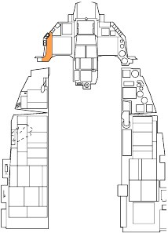

The Laser status is displayed as an L on the HUD and TGP display when the Laser Arm switch is set to arm.

The laser is fired by squeezing the trigger to the first detent. The L flashes when the laser designator is firing.
Releasing the trigger stops lasing.

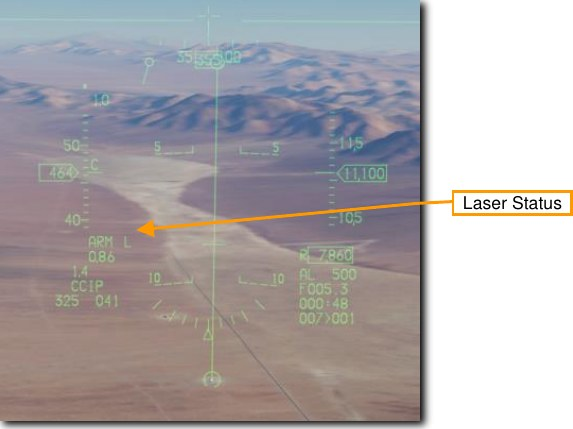
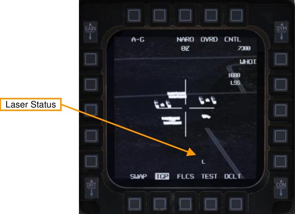

## Air-To-Air (A-A) Mode

The TGP is automatically commanded to the radar line-of-sight when A-A master mode is selected, and the
radar is tracking a target. If the radar is not tracking an aerial target, the pod directs its line-of-sight straight
ahead at -3° elevation.

From the boresight, you may slew the TGP crosshair using the CURSOR switch. When slewing, the TGP
camera moves in a space stabilized manner. When in this slewed mode, but not tracking a target, “RATES” is
indicated on the display. After being slewed, the crosshairs will be reduced to half-size.

If the valid air target passes within the narrow field of view area (represented by the four corner markers), the
TGP will attempt to track the target and place a cross “+” on it. If the target flies outside the narrow field of view
area, the cross will disappear.

If you then command TMS Forward Short HOTAS command (command point track), the target will be centered
in the crosshair and a box will be drawn around the target to conform to its size. When in this mode, “POINT”
will be displayed as well as the tracking cross. To exit POINT track, the user may command INR track (TMS
Right) or return to slave mode (TMS Aft).

The following elements may be displayed:

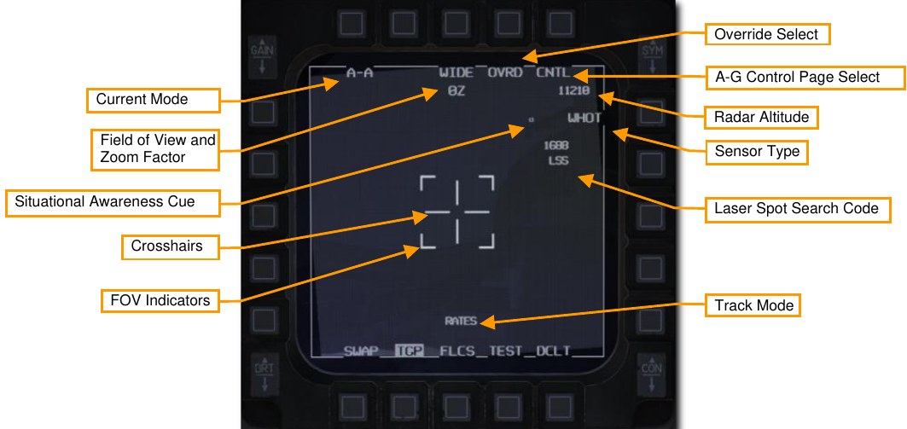

**Current Mode**. This is the mode the TGP is currently in.

**Field of View**. Pressing this OSB toggles between Narrow Field of View (NFOV) or Wide Field of View
(WFOV). These views can vary between the CCD and FLIR sensors in the TGP.

- FLIR field of view:
    - Wide Field of View (WFOV) is 4° × 4°
    - Narrow Field of View (NFOV) is 1° × 1°
- CCD field of view:
    - Wide Field of View (WFOV) is 3.5° × 3.5°
    - Narrow Field of View (NFOV) is 1° × 1°

**Zoom Factor**. Within an FOV selection, you may additionally adjust the zoom-factor by zooming in and out with
the RANGE knob. The zoom range goes from 0Z (no zoom) to 9Z (highest level of zoom within FOV). Objects
within the TGP field of view double in size from 0 to 9 zoom.

**Crosshairs**. Line of sight for targeting and laser fire.

**Field of View (FOV) Indicators**. These four corner brackets are only shown when WIDE FOV is enabled and
indicate the portion of the image that will be displayed if NARO FOV is enabled.

**OVRD Select**. Pressing this OSB overrides any current mode and returns to STBY. The last selected mode is
returned to when OVRD is selected a second time.

**A-G Control Page Select**. Pressing this OSB selects the STBY Control Page.

**Radar Altitude**. The current radar altitude is displayed.

**Sensor Type**. Displayed in the upper right corner, this text field indicates the current video mode that the TGP
is collecting in. The three options include:

- WHOT. Using the FLIR camera, hot objects appear lighter than a cooler background.
- BHOT. Using the FLIR camera, hot objects appear darker than a cooler background.
- TV. The Charge Coupled Device camera displays this image. This is a daytime, electro-optical
camera.

**Laser Spot Search Code**. This is the laser pulse rate frequency (PRF) code the TGP will attempt to locate in
laser spot search (LSS) mode.

**Track Mode**. If the TGP is in a track mode, this field will indicate the track mode it is in. Types include:

- RATES. When in A-A mode and the slew function is released, the TGP will automatically enter
RATES mode (indicated in the tracking-type field).
- POINT. As with A-G mode, the user may command a Point track over an object. This mode is also
used for radar locked targets.

**Situational Awareness Cue**. The SA cue provides you a reference to indicate the TGP’s current line of sight in
reference to the pod’s longitudinal (boresight) axis, which is coincidental with the aircraft longitudinal axis. The
cue is represented as a small square that can move to any spot within the display. The position of the SA
square represents the current TGP line of sight.

Weapons delivery using the TGP is covered in the Air to Air Employment section. //link

## HOTAS Commands

The following HOTAS commands are available when the TGP is sensor of interest (SOI):

**TMS Fwd**. Enters AREA track when pressed, then POINT track when released. If POINT track fails, it remains
in AREA track.

**TMS Aft**. If TGP is tracking, break track and return to slave mode (e.g., slaved to A/G SPI or A/A FCR line of
sight). If TGP is already in slave mode, cursor zero (i.e., return to boresight position).

**TMS Left**. Toggle FLIR polarity between white hot and black hot.

**TMS Right (Maverick not selected)**. Enter AREA track mode.

**TMS Right (Maverick selected)**. Attempt Maverick handoff.

**Trigger (First Detent)**. Fire Laser.

**Trigger (Second Detent)**. Fire laser for 30 seconds if in CCIP bombing mode. (See Laser Ranging section.)

**Expand/FOV**. Toggle FOV between Wide and Narrow.

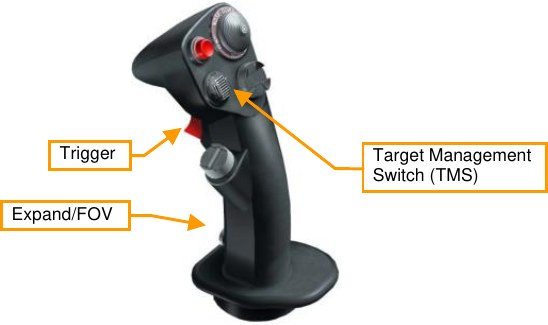

**Manual Slew**. The TGP view can be slewed to scan the scene and search for targets using the cursor controls.
Manual slew is available is either in Slave mode or in one of the tracking sub-modes (e.g., area track or point
track).

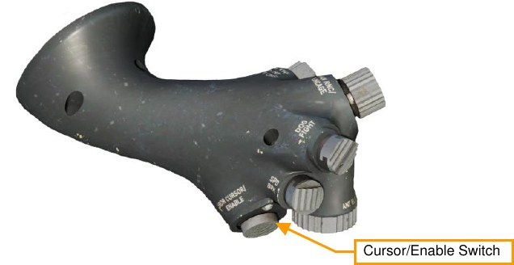

## LASR DED Page

The laser code for TGP designation and LST search are set on the LASR DED page.

1. Select the LIST page and press 0 to bring up the MISC page.
2. Then, press 5 to select the LASR page.

    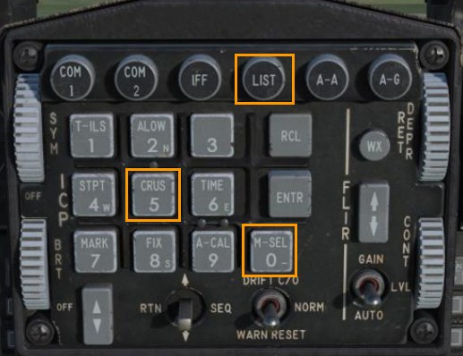
    
    
    
    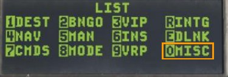
    
    
    
    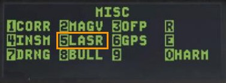

3. Type in the new TGP laser code or LST code on the keypad and press ENTR.

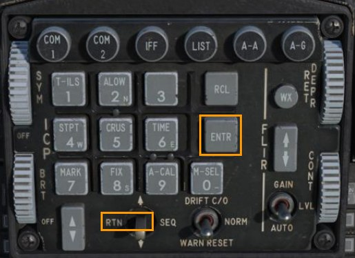
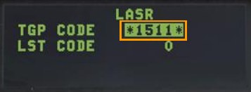

The TGP will now fire the laser designator at the new TGP code or search for laser spots with the new LST
code. Position the DCS left to return to the CNI page.

The laser designator on the Targeting Pod must be set to match the code on the bomb. See the section on the
Bomb Seeker Laser Code for procedures. //link

{!abbr.md!}
