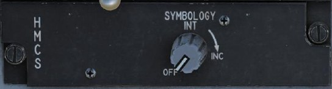
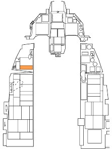
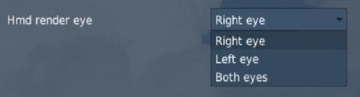
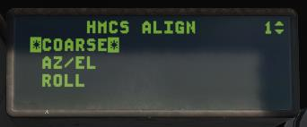
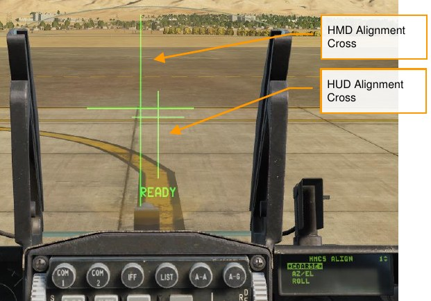
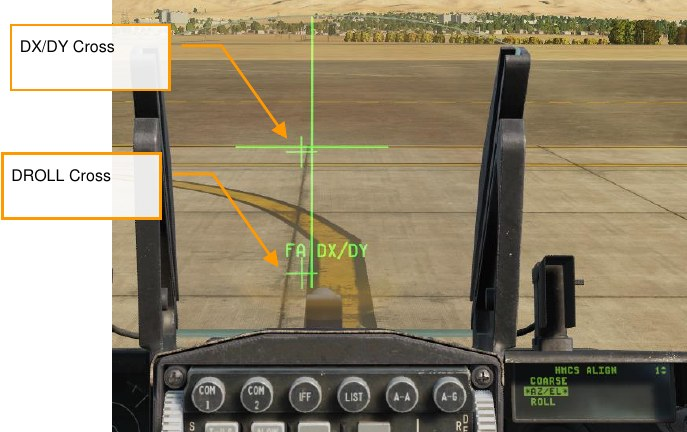
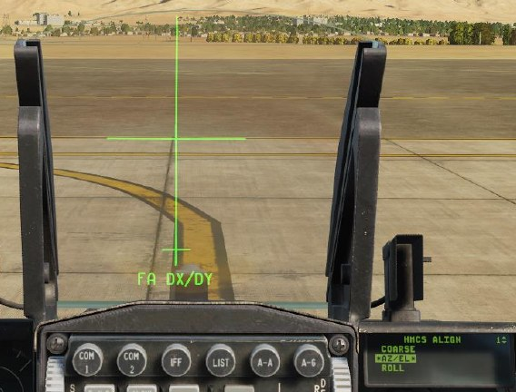
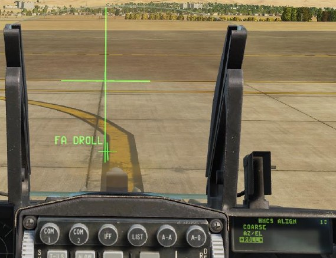
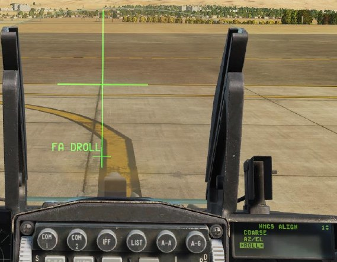

# HELMET-MOUNTED CUEING SYSTEM

## OVERVIEW

The Helmet Mounted Cuing System (HMCS) is a bolt-on kit to the flight helmet that always allows the pilot to
view aircraft and weapon information on the helmet visor. This is referred to as the Helmet Mounted Display
(HMD).

It also allows the slaving of sensors and weapons to the helmet’s line of sight. This is a particularly effective
system when paired with the AIM-9X high off-boresight dogfight missile. The helmet can slave weapons and
sensor up to 80° off boresight.

Power to the HMD is selected from the HMD control knob on the left auxiliary console. Rotating the knob
clockwise from the OFF position to INC (increase) provides power to the HMD. Continued clockwise rotation
increases HMD brightness.

Symbology on the HMD is only visible in the right eye. This may cause discomfort in VR so you may change the
way it is rendered in the DCS: World options F-16C Special tab. These options are available:

Weapons delivery using the HMCS is covered in the following sections:

- AIM-9M/X HMCS Missile BORE Employment //link
- AIM-9M/X HMCS Radar BORE Employment

## Alignment

To use the HMCS, it must be aligned prior to takeoff. HMCS alignment is completed for you if the mission
begins with your aircraft already started, but for cold-start missions, you must complete the HMCS alignment
yourself. To align the HMCS, do the following:

1. Power on the HMCS by rotating the HMCS knob out of “OFF”.
2. Press LIST to show the LIST menu on the DED, then press M-SEL (0) to enter the MISC menu, and
finally RECALL to enter the HMCS menu.
3. Press the dobber switch right to view page 2. Verify that the cursors are around the COARSE
alignment option.

    

4. Press M-SEL (0). The coarse alignment cross will be displayed on the HUD and HMD.

    

5. Move your head to align the two crosses.
6. While holding your head steady, press and hold the Cursor Enable button on the throttle. “ALIGNING”
will display on the HUD for about 2.5 seconds. After alignment is complete, the HUD will display
 “ALIGN OK.”
7. Press M-SEL (0) to advance to the AZ/EL alignment phase. The DX/DY cross will be displayed in the
HMD, and “FA DX/DY” (fine alignment) will be displayed in the HUD below the alignment cross.

    

8. Use the TDC to align the DX/DY cross with the HUD cross, and then press M-SEL (0).

    

9. The cursor will advance to the ROLL phase. Press M-SEL (0) to begin the ROLL alignment.
10. The text in the HUD will change to “FA DROLL.” Use the TDC to rotate the DROLL cross until it’s
aligned with the bottom portion of the alignment cross.

    
    

11. Once alignment is satisfactory, press M-SEL (0). Alignment mode will exit, and alignment is complete.

After aligning, you can turn off the HMCS using the Power knob if desired.

### Non-Designated Mode

The basic features of the HMCS can be illustrated in the non-designated mode. This can be thought of as an
extension of the HUD, with much of the symbology mimicked on the HMD. These features apply to all HMCS
modes:

**Acceleration (G)**. Duplication of the current G.

**Airspeed**. Duplication of airspeed from HUD.

**Master Arm Status**. Master Arm Switch Position: OFF, ARM or SIM.

**Master Mode**. Current Master Mode.

**Bearing/Range to Bullseye**. Bearing and range from your aircraft to the Bullseye.

**Altitude**. Duplication of the HUD barometric altitude.

**Dynamic Aiming Cross**. While in A/A mode in the HMD, the aiming cross can be in one of three locations on
the HMD, based on HMD view angle.

- When HMD LOS is 0° or less above the stabilized horizon, the aiming cross is centered in the HMD.
- When HMD LOS is between 0° and 30° above stabilized horizon, the aiming cross is centered
between the airspeed and altitude indicators on the HMD.
- When HMD LOS is greater than 30° above stabilized horizon, the aiming cross is centered above the
heading tape on the HMD.

**Distance to Target**. Displays distance to target or steerpoint in nautical miles. Displays “XXX” when no target is
locked.

**Helmet Heading**. Heading scale and number indicates helmet line of sight heading (not aircraft heading).

**RWR Display**. Displays the priority RWR threat surrounded by a circle. Plotted on the circle is a diamond
indicating threat direction relative to aircraft nose. (Aircraft nose is at the 12 o’clock position.) The small gap in
the circle indicates helmet LOS direction. When the gap is aligned with the diamond, the pilot’s head is facing
the threat.

The RWR display is blanked when there is no priority threat. The RWR display can also be inhibited from the
LIST→MISC→HMCS page on the DED (see HMCS Page).

