# AIR-TO-GROUND EMPLOYMENT

## ATTACK PREPARATION

Prior to reaching the target area and conducting your attack, you will want to configure several aircraft systems
ahead of time so that you can most efficiently communicate and set up your attack. When at a minimum of 40
nm from the target, you will want to take the following steps:

1. Position the Master Arm Switch to ARM. Weapons may be released normally when in the ARM
position. If the Master Arm switch is placed in the SAFE position, weapon release is inhibited.

2. Position the Laser Arm Switch to ARM. This is required to enable firing of the laser designator. Laser
firing is inhibited with the switch set to OFF.

    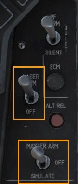
    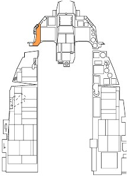

3. Place the fire control system in A-G mode by pressing the A-G Master Mode Button on the ICP.

    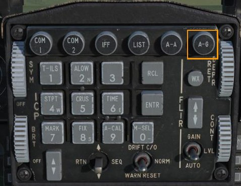
    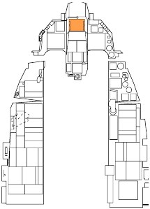

## M6A1 20MM CANNON STRAFE

The M61A1 20MM automatic gun system provides the pilot with a formidable weapon capability. It is a six-barrel
Gatling type gun mounted in the left strake of the aircraft. The system has a capacity of 512 rounds of
ammunition fired at 6,000 rounds per minute.

!!! summary

    1. Select A-G Master Mode [[2]]
    2. Set Master Arm Switch to Arm
    3. Set Laser Arm Switch to Arm if laser ranging updates are desired
    4. Select STRF sub-mode on SMS MFD
    5. Fly the Pipper onto the target
    6. Squeeze the Trigger [[Space]] to the second detent to fire the gun

### Target Attack

Upon selection of the A-G master mode, the SMS Air-to-Ground (SMS A-G) page is displayed on the right MFD.
Based on the priority weapon, the information on the SMS A-G page can vary. Follow these steps to achieve
the correct configuration and attack ground targets with the gun:

1. **Select the STRF sub-mode on the MFD by pressing OSB 1 until GUN is displayed.**

    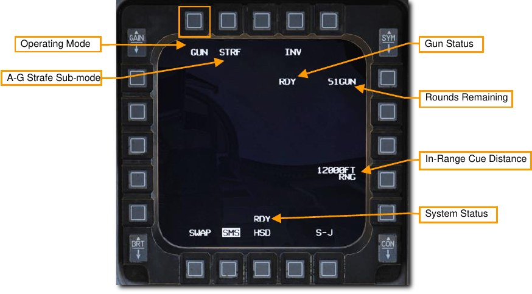

2. **Verify STRF symbology is displayed in the HUD.**

    The Strafe Reticle is the default air to ground gunsight and provides aiming information required to
    fire the gun effectively. The center of the reticle is the aiming pipper and represents where the gun
    rounds will go assuming the target is within range. Using the pipper, it is simply a case of “putting the
    thing on the thing” and pulling the trigger.
    
    Line of sight range is indicated by the digital range numeric on the bottom right of the HUD and the
    ranging reticle that winds or unwinds within the reticle. The position of the ranging reticle indicates the
    slant range to the pipper’s position on the ground. Each quarter circle tick on the strafe reticle
    represents 3,000 feet of slant range, so:
    
    - 12 o’clock = 12,000 ft
    - 9 o’clock = 9,000 ft
    - 6 o’clock = 6,000 ft
    - 3 o’clock = 3,000 ft
    
    The in-range cue position may be set by the pilot provide an additional visual cue for the effective
    range against the planned target.
    
    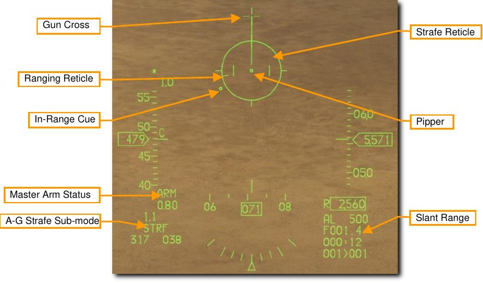

3. **Maneuver your aircraft to position the pipper on target.**

    One technique is to place the pipper short of the target and allow it to track along the ground until it
reaches the target. This will happen naturally as slant range decreases.

    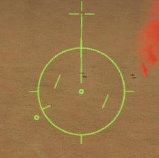
    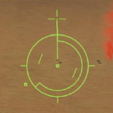

    Laser ranging may be performed to improve the computed firing solution if a targeting pod is installed.

    See the [Laser Ranging section](16.ltpod.md#track-modes) for more information.

4. **Squeeze the trigger all the way to the second detent to fire the gun when the pipper is over the target and you are within effective range.**

    In this example, the pipper is on-target at a slant range of about 5,500 feet as shown by the position
    on the ranging reticle.
    
    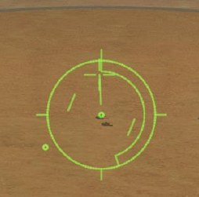
    
    Slant range greatly affects gun effectiveness. As the rounds come out of the gun, they will gradually
    disperse and lose velocity. Increased dispersion and loss of velocity reduce the accuracy and
    effectiveness of the gun. Effective engagement range is generally from 2,500 to 7,000 feet. For
    armored vehicles, closer is better, and you should attack from behind the target where its armor is
    weakest.
    
    When lining up a shot, be careful to avoid target fixation. Target fixation can lead to you not noticing
    an unseen threat or pressing the attack too close. Don’t make yourself an easy target for the machine
    gun on the top of that APC!

Once you have reached the minimum attack range, break off in both the horizontal and vertical to avoid hostile
return fire. You may also wish to release flares in case an infrared-SAM near the enemy target has been
launched at you, but you did not see it.

### In-Range Cue Update

The position of the In-Range Cue on the reticle may be updated by selecting the OSB next to the In-Range Cue
distance on the SMS page.

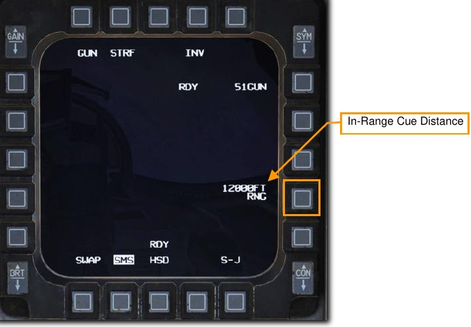

Type in the new in-range cue distance using the OSBs on the left and right of the display and select ENTR. You
may correct numbers entered in error by selecting RCL or return to the SMS page without making changes by
selecting RTN.

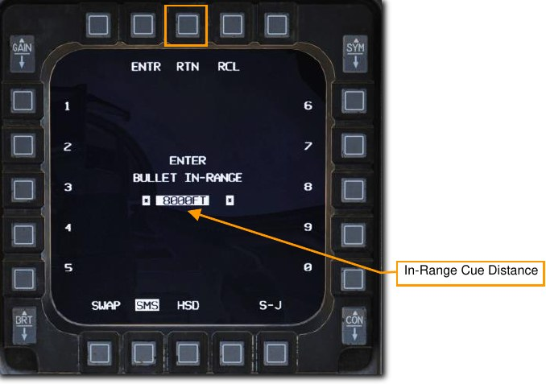

You will be returned to the SMS page and the new value will be displayed. The cue will be placed on the HUD
Strafe Reticle at that new distance.

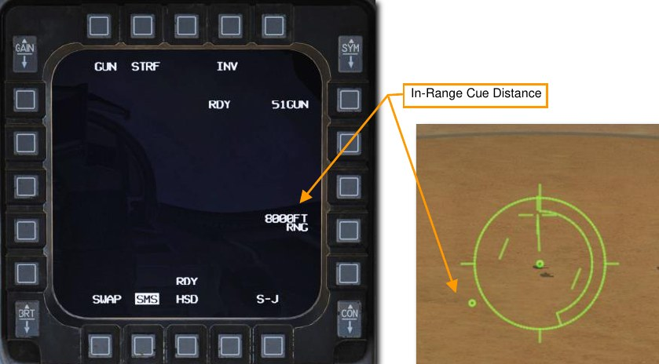

## 2.75-INCH ROCKETS

Aerial rockets pack more punch than the 20mm gun but are still best used as an area suppression weapon.
These come with different warhead options for different purposes including High Explosive (HE), High Explosive
Anti-Tank (HEAT), and Armor Piercing (AP). White Phosphorus (WP) rounds may also be used for incendiary
effect or to mark targets on the ground with their distinctive white smoke.

!!! summary

    1. Select A-G Master Mode [[2]]
    2. Set Master Arm Switch to Arm
    3. Set Laser Arm Switch to Arm if laser ranging updates are desired
    4. Select Rockets and desired options on SMS MFD
    5. Fly the Pipper onto the target
    6. Depress the Weapons Release button [[RAlt]]+[[Space]] to fire the rockets

### Target Attack (CCIP)

Upon selection of the A-G master mode, the SMS Air-to-Ground (SMS A-G) page is displayed on the right MFD.
Based on the priority weapon, the information on the SMS A-G page can vary. Follow these steps to achieve
the correct configuration and attack ground targets with rockets in CCIP mode:

1. **Select the Rockets on the MFD by pressing OSB 6 until rockets are displayed.**

    

2. **Verify CCIP release mode is selected (OSB 2) and set desired Single/Pair option (OSB 8).**

    Rockets may be fired with either Single (SGL) or Pair (PAIR) selected. With SGL selected, rockets
will be fired from only one launcher. With PAIR selected, rockets will be fired from each rocket
launcher, assuming launchers are loaded on station 3 and 7.

    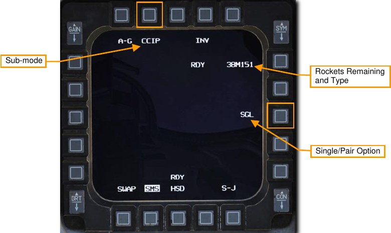

3. **Verify CCIP Rockets symbology is displayed in the HUD.**

    CCIP mode is perhaps the most intuitive means to put a weapon on target and mostly involves
    placing the “death dot” of the CCIP pipper over the target and releasing the weapon… put the thing
    on the thing.
    
    The center of the CCIP pipper represents where the rockets will go assuming the target is within
    range. Line of sight range is indicated by the digital range numeric on the bottom right of the HUD. An
    In-Range Cue will be displayed over the CCIP pipper when slant range is less than 8,000 feet and
    rockets are most effective.
    
    
    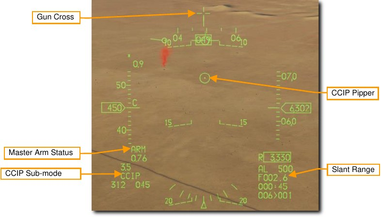

4. **Maneuver your aircraft to position the CCIP pipper on target.**

    One technique is to place the pipper just short of the target and allow it to track along the ground until
    it reaches the target. This will happen naturally as slant range decreases. Monitor slant range
    displayed in the bottom right of the HUD and watch for the in-range cue to appear over the pipper.
    
    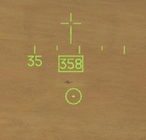
    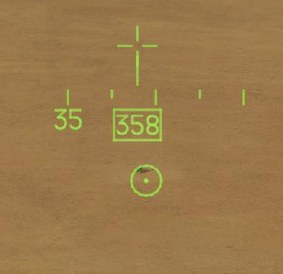
    
    
    Laser ranging may be performed to improve the computed firing solution if a targeting pod is installed.

    See the [Laser Ranging section](16.ltpod.md#track-modes) for more information.

5. **Press the Weapon Release button to fire the rockets when the CCIP pipper is over the target and you are within effective range.**

    The In-Range Cue is a line over the CCIP pipper that is displayed when slant range is less than 8,000
    feet. In this example, the pipper is on-target and the in-range cue is displayed.
    
    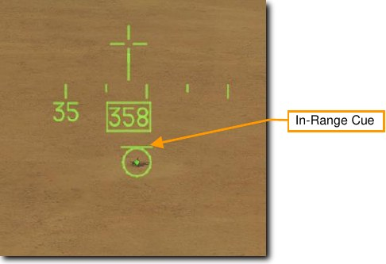
    
    When lining up a shot, be careful to avoid target fixation. Target fixation can lead to you not noticing
    an unseen threat or pressing the attack too close. Don’t make yourself an easy target for the machine
    gun on the top of that APC!

Once you have reached the minimum attack range, break off in both the horizontal and vertical to avoid hostile
return fire. You may also wish to release flares in case an infrared-SAM near the enemy target has been
launched at you, but you did not see it.

## UNGUIDED BOMBS

Unguided bombs that the F-16C can employ fall into three categories: General Purpose (GP), Cluster, and
Training.

### General Purpose Bombs

**MK 82 LDGP**. The standard MK 82 is a low drag “slick” bomb, also referred to as a Low Drag General Purpose
(LDGP) bomb. The bomb is aerodynamically streamlined with four conical tail fins for flight stability. The bomb
has a thin steel jacket that contributes to fragmentation effects.

The MK 82 may be carried singly on a Wing Weapons Pylon (WWP) or three may be loaded on a Triple Ejector
Rack (TER)

The MK 82 serves as the basis for several other bombs including the MK 82AIR, GBU-12, and GBU-38.

**MK 82 AIR**. This version of the MK 82 adds the BSU-49/B high drag tail assembly, also called a “ballute”. This
allows the bomb to rapidly slow down after release. By slowing down, you can release such a retarded weapon
at low altitude and not be caught in the blast effect of the weapon. You can choose to release the MK 82AIR in
either retarded or “slick” (no ballute deployed) modes. To drop as a slick, select only a nose fuze, and to release
retarded, select nose/tail or tail fuze setting on the SMS page.

**MK 82 SE**. This ‘Snake Eye” version of the MK 82 pre-dates the MK 82 AIR and uses fins that deploy from the
Mk-15 tail assembly to slow the bomb’s fall. You can choose to release the MK 82 SE in either retarded or
“slick” modes. To drop as a slick, select only a nose fuze, and to release retarded, select nose/tail or tail fuze
setting on the SMS page.

**MK 84 LDGP**. The MK 84 is the big brother of the MK 82 and it weighs 2,039 lbs. with 945 lbs. of H-6 or Tritonal
high explosive. Although most effective against unarmored and lightly armored targets, the MK 84 can also be
effective against armored targets when dropped in proximity. The MK 84 can only be mounted on a WWP and
cannot be loaded on a TER.

The MK 84 forms the basis for other bombs including the GBU-10 and GBU-31 that the F-16C also carries.

### Cluster Bombs

**CBU-87**. The CBU-87 Combined Effects Munitions (CEM) weighs 950 lbs. and is an all-purpose cluster bomb.
The SUU-65 Tactical Munitions Dispenser that makes the body of the bomb contains 202 BLU-97/B Combined
Effects Munitions (CEM) bomblets and they are effective against lightly armored and unarmored targets. The
dispersal footprint of the bomblets depends on the Height of Function (HOF) and RPM spin setting set with dials
on the bomb and displayed on the SMS page. However, the general bomblet footprint coverage is 200 by 400
meters.

The CBU-87 can be mounted singly on a WWP. Only two may be loaded on a TER when wing external fuel
tanks are installed due to clearance constraints. This is commonly referred to as a ‘slant load’.
Each BLU-97/B CEB consists of a shaped charge, a scored steel casing, and a zirconium ring, for anti-armor
and anti-personnel fragmentation and incendiary effects. Each CEB is designed to fragment into 300 fragments.

Given the top attack angle of the weapon, the CEB can be effective against the generally light armor covering
the top of an armored vehicle such as a tank.

**CBU-97**. The CBU-97 is a 1,000-pound class weapon containing sensor-fused sub-munitions in a SUU-66B
Dispenser for specifically attacking armor. This Sensor Fused Weapon (SFW) contains 10 BLU-108/B sub-
munitions, and 40 “hockey puck” shaped skeet infrared sensing projectiles.

As with the CBU-87, the dispersal footprint of the bomblets depends on the Height of Function (HOF) set with
dials on the bomb and displayed on the SMS page. The RPM is not applicable on this dispenser. The same
carriage restrictions as the CBU-87 apply: one per WWP and two per TER.

### Training Bombs

**BDU-33**. The BDU-33 is a miniaturized training bomb that mimics the ballistics of larger general-purpose
bombs. The BDU-33 contains a small smoke charge to help round spotting.

### Unguided/Laser Guided Bombs SMS Page

The A-G SMS display and procedure for setting up an attack with guided or unguided bombs is very similar for
all types. The initial set-up will only be covered once, with differences in CCIP, CCRP sub-modes covered in
separate sections below.

!!! summary

    1. Select A-G Master Mode [[2]]
    2. Select bombs and set desired options on SMS A-G MFD

Upon selection of the A-G master mode, the SMS Air-to-Ground (SMS A-G) page is displayed on the right MFD.
Based on the priority weapon, the information on the SMS A-G page can vary. Follow these steps to achieve
the correct configuration and attack ground targets with GP bombs in CCIP mode:

1. **Select the desired weapons on the MFD by pressing OSB 6 until the weapons you want to release are displayed.**

    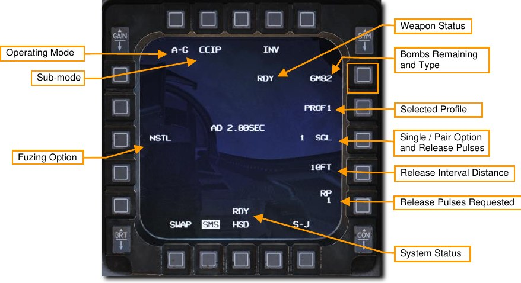

2. **Select the desired profile for the selected weapons.**

    Two different profiles are pre-set by default. These include typical settings for delivery mode, fuze
    arming option, bomb impact spacing, and release quantity. If a profile already matches your planned
    attack profile, you are all set; no more changes are required! If not, follow the steps that follow in this
    section to set the profile up to your liking.
    
    Selecting the OSB next to the current profile to cycle between the two options: PROF1 and PROF2.
    
    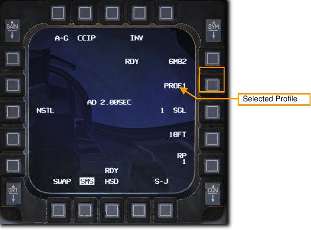
    
    Changes to settings made while a profile is selected are saved for later use. These should typically
    be set or verified as part of aircraft startup, although they may be changed at any time.

3. **Select your desired release sub-mode. (OSB 2)**

    If a sub-mode other than the one you want is selected, you may press OSB 2 to display the following
    options:
    
    - CCIP – Continuously Computed Impact Point
    - CCRP – Continuously Computed Release Point
    - DTOS – Dive Toss
    - LADD – Low Altitude Drogue Delivery
    - MAN – Manual
    
    Then, select the OSB next to your desired sub-mode. That will set the new active sub-mode and
    return you to the SMS A-G page.
    
    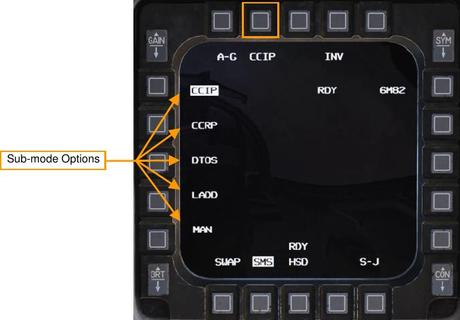
    
    You may also cycle between sub-modes by pressing the Missile Step (MSL STEP) button on your
    stick.

4. **Set desired bomb fuzing option. (OSB 18)**

    Bombs are typically equipped with two fuzes, one in the nose and one in the tail. These are
    sometimes set with different impact delay settings to provide the pilot with the choice of how the fuze
    functions and when the bomb detonates after impact. Sometimes an instantaneous detonation is
    desired for fragmentation effects and sometimes a delayed detonation is desired to allow target
    penetration or cratering.
    
    Selecting OSB 18 cycles between three fuze arming options: NOSE, TAIL and NSTL (Nose/Tail).
    This is typically set to NSTL (Nose/Tail) for redundancy unless a specific effect is desired when the
    weapon detonates.
    
    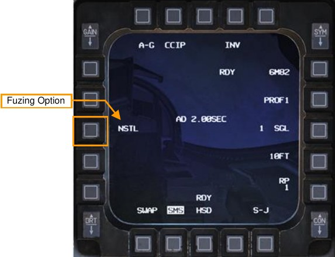
    
    There are also some special cases where the fuze option changes how the weapon behaves after
    release:
    
    - MK 82 AIR/SE
    
        - NSTL – High Drag
        - NOSE – Low Drag
        - TAIL – High Drag
    
    - CBU-87/97
    
        - NSTL – Bomblets dispense using settings displayed on SMS page
        - NOSE – Bomblets dispense immediately after release
        - TAIL – Dud

5. **Set desired Single/Pair option. (OSB 8)**

    Bombs may be released with either Single (SGL) or Pair (PAIR) selected. With SGL selected, bombs
    will be released from only one station. With PAIR selected, bombs will be released from both opposite
    stations, assuming identical bombs are loaded on stations 4 and 6 or 3 and 7.
    
    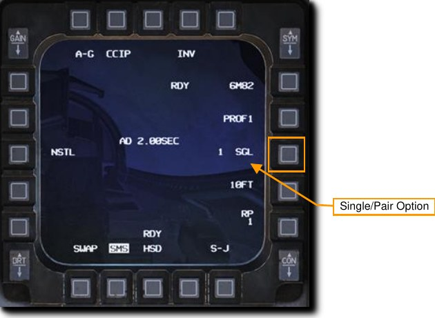

6. **Set the desired release interval distance if more than one bomb is to be released. (OSB 9)**

    The timing between release pulses is computed by the aircraft to space multiple weapons in a ‘stick’
    along the ground at the specified distance. Valid distances range from 10-999 feet. This setting has
    no effect if only one bomb or one pair of bombs is released.
    
    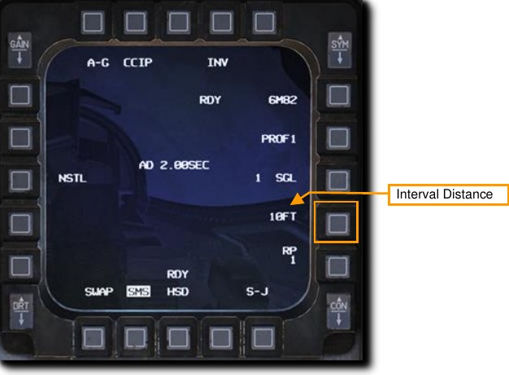
    
    Type in the new impact spacing distance using the OSBs on the left and right of the display and
    select ENTR. You may correct numbers entered in error by selecting RCL or return to the SMS page
    without making changes by selecting RTN.
    
    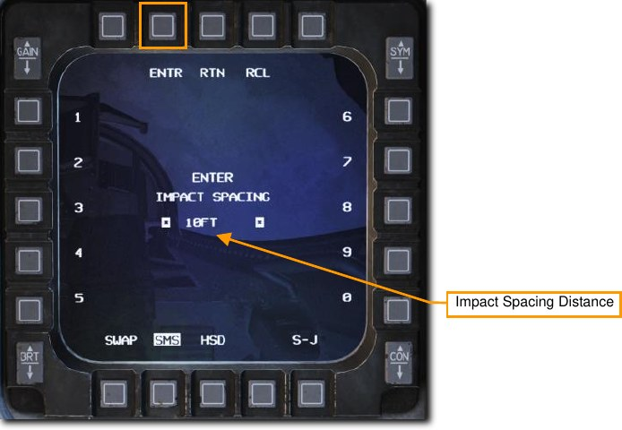

7. **Set the number of release pulses if more than one bomb is to be released. (OSB 10)**

    This sets the number of release pulses sent to the weapons stations when the Weapon Release
    button is pressed. For example, a setting of 1 releases only one bomb or pair of bombs at a time
    while a setting of 4 releases four bombs or pairs of bombs at a time. This is commonly known as a
     ‘ripple release’.
    
    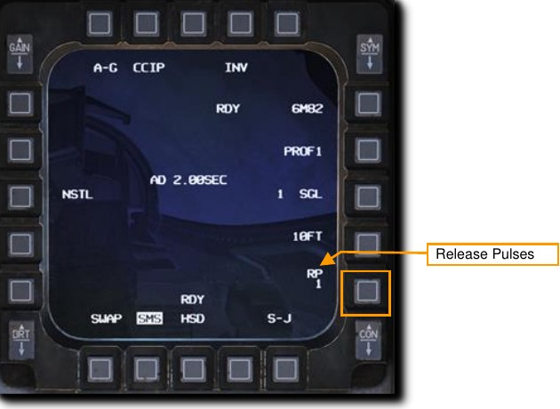
    
    Type in the desired number of release pulses using the OSBs on the left and right of the display and
    select ENTR. You may correct numbers entered in error by selecting RCL or return to the SMS page
    without making changes by selecting RTN.
    
    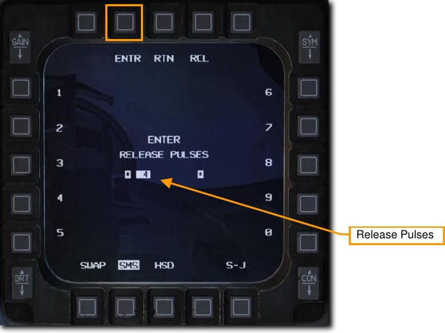

### Unguided Bombs CCIP Attack

The Continuously Computed Impact Point (CCIP) mode is a computed visual delivery mode with manual
weapon release. This mode allows a high degree of flexibility since the point on the ground at which the weapon
will impact is continuously indicated by a CCIP Pipper on the HUD. No target designation is required. Place the
thing on the thing and drop the bomb.

!!! Summary

    1. Select A-G Master Mode [[2]]
    2. Set Master Arm Switch to Arm
    3. Set Laser Arm Switch to Arm if laser ranging updates are desired
    4. Select Bombs and desired options on SMS MFD
    5. Fly the Pipper onto the target
    6. Depress the Weapons Release button [[RAlt]]+[[Space]] to expend weapons

1. **Verify CCIP symbology is displayed in the HUD.**

    If the CCIP impact point does not lay within the HUD field of view, the Time Delay Cue (TDC) is
    shown as a short, horizonal line on the Bomb Fall Line. The CCIP Pipper is outside the HUD field of
    view when this is displayed. A second, ‘post-designate CCIP’ technique may be used in this situation
    but that will be covered in the next section.
    
    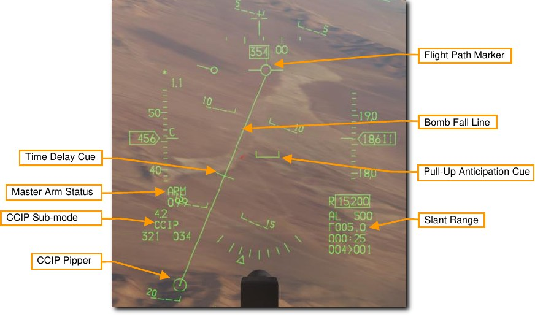

2. **Maneuver your aircraft to position the CCIP Pipper on target.**

    When the TDC is no longer displayed on the Bomb Fall Line, the pipper is in the HUD field of view.
    That will be the impact point if the bombs are released immediately.
    
    One technique is to place the FPM ahead of the target and the pipper just short of the target. Fly the
    Bomb Fall Line over the target and allow the pipper to track straight up the line. This will happen
    naturally as slant range decreases.
    
    
    
    Monitor the Pull-Up Anticipation Cue to ensure it does not go above the Flight Path Marker. The Pull-
    Up Anticipation Cue (PUAC) provides a visual representation of the altitude required for the bomb
    fuze to arm or altitude to initiate a pull-up to avoid impacting the ground, whichever is more
    immediate. It moves up toward the Flight Path Marker (FPM) as the aircraft loses altitude. Releasing
    a bomb with the FPM below the PUAC will not give the bomb time to arm and result in a dud.
    
    Laser ranging may be performed to improve the computed firing solution if a targeting pod is installed.
    
    See the [Laser Ranging section](16.ltpod.md#track-modes) for more information.

3. **Press the Weapon Release button to release the bombs when the CCIP pipper is over the target.**

    The pipper will be at the center of the ‘stick’ if more than one bomb is released in a ripple delivery.
    Hold the Weapons Release button long enough to ensure all weapons come off. The FPM flashes
    after weapons are released.
    
    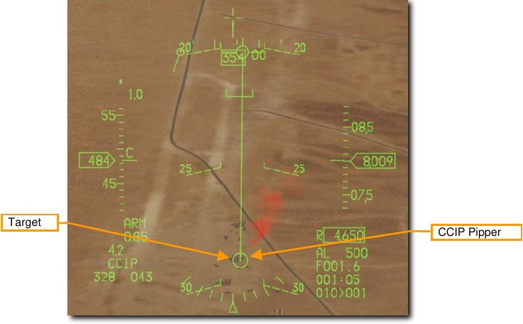
    
    Pull up immediately and take evasive action to avoid flying into bomb fragments and to avoid enemy
    fire.

### Unguided Bombs CCIP Attack (Post-Designate)

An additional option for CCIP bombs delivery is available for situations where the target cannot be within the
HUD field of view at release. This can sometimes happen on attacks from a shallow dive angle or high altitude.

The steps to enter CCIP mode are the same as described above. The difference is in when you press and hold
the Weapons Release button.

1. **Maneuver your aircraft to position the CCIP Pipper on target.**

    When the Time Delay Cue is displayed on the Bomb Fall Line, the pipper is not in the HUD field of
    view, however you will still place the pipper over the intended target.
    
    You will designate that location as the target by pressing and holding the Weapons Release button.
    The fire control computer will do the rest.
    
    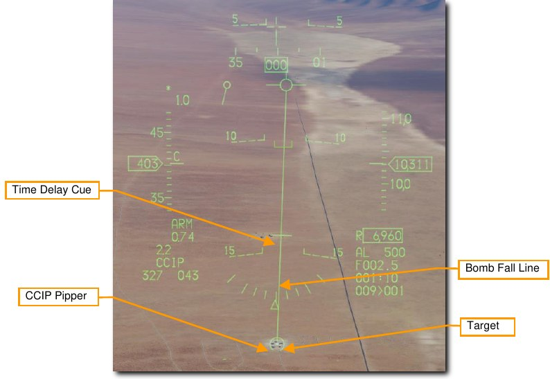
    
    Laser ranging may be performed to improve the computed firing solution if a targeting pod is installed.

    See the [Laser Ranging section](16.ltpod.md#track-modes) for more information.

2. **Press and HOLD the Weapons Release button.**

    The HUD symbology displayed is identical to that used for a CCRP delivery. Keep the Flight Path
    Marker aligned with the Steering Line. This will align your aircraft with the target even though the
    target will be out of sight.
    
    A Solution Cue is displayed at the top of the Steering Line. It will fall down the line as the range
    decreases and the weapon is about to be released.
    
    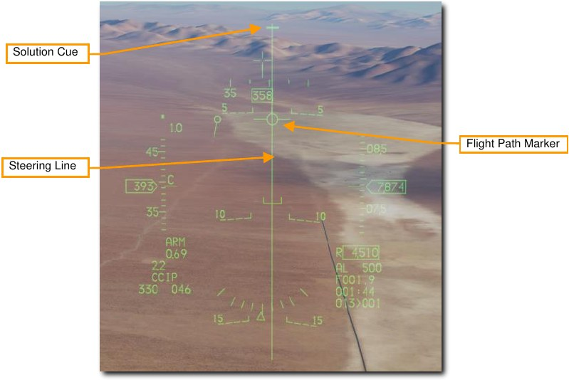

3. **Keep the Weapons Release button held until after the Solution Cue passes the Flight Path Marker.**

    Keep flying the Flight Path Marker over the Steering Line as the Sulution Cue continues to track
    downward. The bombs are released when the Steering Cue passes the Flight Path Marker.
    
    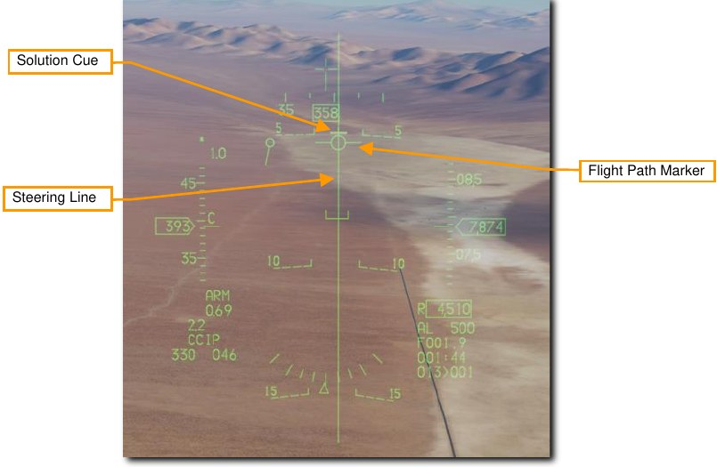
    
    Hold the Weapons Release button long enough to ensure all weapons come off. The FPM flashes
    after weapons are released. Pull up immediately and take evasive action to avoid flying into bomb
    fragments and to avoid enemy fire.

### Unguided Bombs CCRP Attack

The Continuously Computed Release Point (CCRP) mode provides computed, automatic release of bombs.
This can be done from a dive, but also from wings-level or a nose-high attitude.

This mode requires a target designation point from which to build the bombing solution. Command steering is
provided to the appropriate weapon release point and the weapon will release automatically at the proper time
such that the weapons hit the target.

!!! Summary

    1. Select A-G Master Mode [[2]]
    2. Set Master Arm Switch to Arm
    3. Set Laser Arm Switch to Arm if laser ranging updates are desired
    4. Select Bombs and desired options on SMS MFD
    5. Set desired steerpoint number or designate target with TGP
    6. Center FPM on Steering Line
    7. Depress and hold Weapons Release button [[RAlt]]+[[Space]] to expend weapons at
    computed point

1. **Verify CCRP symbology is displayed in the HUD.**

    The fire control system provides a Steering Line (SL) to provide steering to the designated target. By
    placing the Flight Path Marker (FPM) on the SL and holding down the Weapon Release Button, the
    weapon will release at the proper time and account for wind.
    
    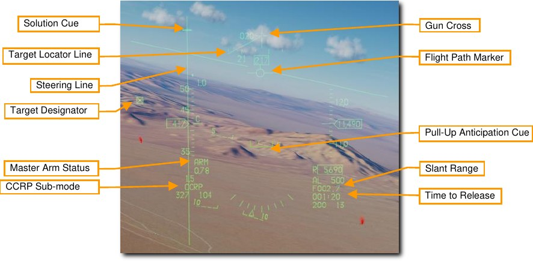
    
    A Solution Cue is displayed at the top of the SL. It will fall down the line as the range decreases and
    the weapons are about to be released.
    
    When the Target Designator (TD) is outside the HUD field on view as shown above, a Target Locator
    Line (TLL) extends from the Gun Cross pointing directly at the target. The relative angle is displayed
    next to the Gun Cross showing the number of degrees in tens between the cross and the target.

2. **Designate the desired target.**

    To calculate a bombing solution in CCRP mode, a target first must be designated. This can be done
    by:
    
    - Selecting a Steerpoint that was placed at the target location
    - Designating a target with the Targeting Pod (if installed)
    
    Updates to the target location may be made by slewing the TD Box in the HUD or slewing the TGP
    cursor onto a new position with the Cursor/Enable Control.
    
    
    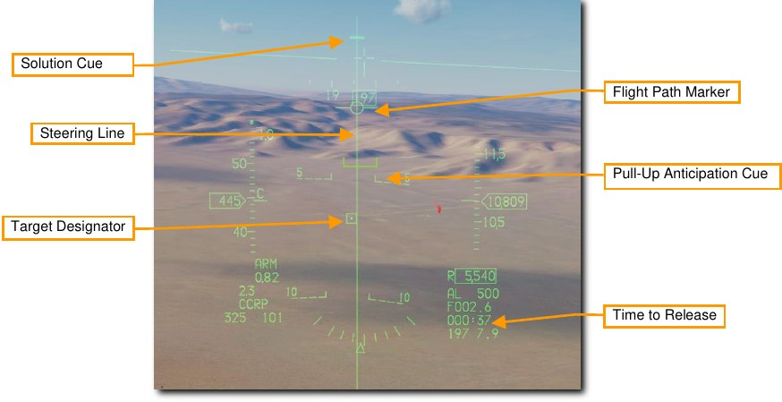
    
    Monitor the Pull-Up Anticipation Cue to ensure it does not go above the Flight Path Marker. The Pull-
    Up Anticipation Cue (PUAC) provides a visual representation of the altitude required for the bomb
    fuze to arm or altitude to initiate a pull-up to avoid impacting the ground, whichever is more
    immediate. It moves up toward the Flight Path Marker (FPM) as the aircraft loses altitude. Releasing
    a bomb with the FPM below the PUAC will not give the bomb time to arm and result in a dud.
    
    Laser ranging may be performed to improve the computed firing solution if a targeting pod is installed.

    See the [Laser Ranging section](16.ltpod.md#track-modes) for more information.

3. **Press and HOLD the Weapon Release button.**

    Keep the Flight Path Marker aligned with the Steering Line. This will align your aircraft with the target
    even though the target will be out of sight.
    
    Time to release counts down at the lower right of the HUD.
    
    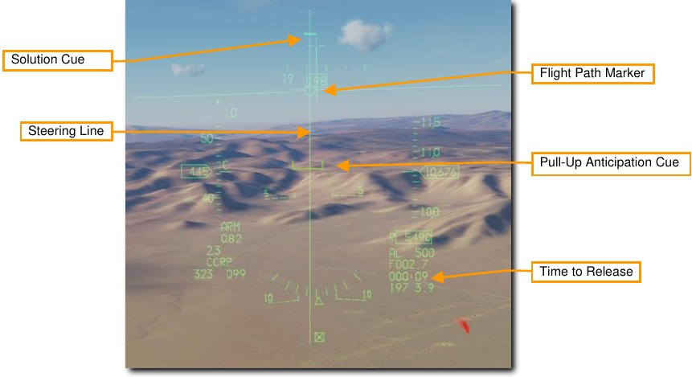
    
    
    When the Solution Cue begins to move down the Steering Line, about 10 seconds prior to release,
    press and hold the Weapon Release button. This provides the fire control computer consent to
    release the weapons.

4. **Keep the Weapons Release button held until after the Solution Cue passes the Flight Path Marker.**

    Keep flying the Flight Path Marker over the Steering Line as the Sulution Cue continues to track
    downward. The bombs are released when the Steering Cue passes the Flight Path Marker.
    
    
    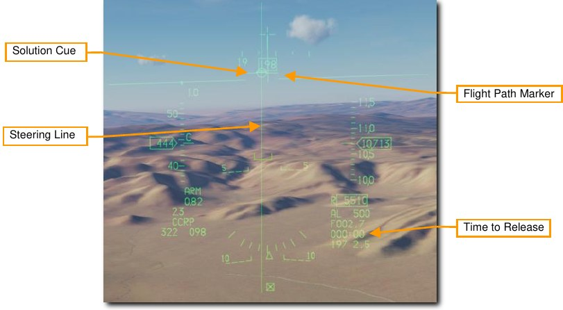
    
    Hold the Weapons Release button long enough to ensure all weapons come off. The FPM flashes
    after weapons are released.

## LASER-GUIDED BOMBS

The development of laser guided weapons has dramatically improved the accuracy of weapon guidance and
delivery. With the assistance of build-up guidance kits, general GP bombs are turned into laser-guided bombs
(LGBs). The kits consist of a computer- control group (CCG), guidance canards attached to the front of the
warhead to provide steering commands, and a wing assembly attached to the aft end to provide lift. LGBs are
maneuverable, free-fall weapons requiring no electronic interconnect to the aircraft. They have an internal semi-
active guidance system that detects laser energy and guides the weapon to a target illuminated by an external
laser source. The designator can be in the delivery aircraft, another aircraft, or a ground source.

All LGB weapons have a Computer Control Group (CCG), a warhead (bomb body with fuze), and an airfoil
group. The computer section transmits directional command signals to the appropriate pair of canards. The
guidance canards are attached to each quadrant of the control unit to change the flight path of the weapon. The
canard deflections are always full scale (referred to as “bang, bang” guidance).

The LGB flight path is divided into three phases: ballistic, transition, and terminal guidance. During the ballistic
phase, the weapon continues via the unguided trajectory established by the flight path of the delivery aircraft at
the moment of release. In the ballistic phase, the delivery attitude takes on additional importance since
maneuverability of the LGB is related to the weapon velocity during terminal guidance. Therefore, airspeed lost
during the ballistic phase equates to a proportional loss of maneuverability. The transition phase begins at
acquisition. During the transition phase, the weapon attempts to align its velocity vector with the line-of-sight
vector to the target. During terminal guidance, the LGB attempts to keep its velocity vector aligned with the
instantaneous line-of-sight. At the instant alignment occurs, the reflected laser energy centers on the detector
and commands the canards to a trail position, which causes the weapon to fly ballistically with gravity biasing
towards the target.

**GBU-10 Paveway II**. This Guided Bomb Unit (GBU) weighs 2,562 lbs. and is basically a laser-guided version of
the Mk-84 unguided bomb with a general-purpose warhead. The laser detector on the nose of the seeker
detects the reflected energy of the designating laser at the set laser code. Once dropped, the wing-like airfoil
surfaces at the rear of the bomb extend and are used to maneuver the bomb to the laser designation point.
Rather than smooth and constant input of course-corrections to reach the target, the bomb uses a series of
discreet input corrections and this is often referred to as “bang-bang” guidance mode.

GBU-10 can only be hung from a MAU-12 ejector rack on stations 3, 4, 6, and 7.

Suitable targets for the GBU-10 are large and/or hardened targets that require an accurate and powerful strike.
Such targets often include bridges, bunkers, and hardened command posts.

**GBU-12 Paveway II**. This GBU is the laser-guided version of the Mk-82 unguided, general purpose bomb. The
GBU-12 guides using the same principles as the GBU-10, the only difference being the bomb the LGB is based
on.

The GBU-12 can be mounted singly on a MAU-12 ejector rack at stations 3, 4, 6, and 7. Only two may be
loaded on a TER when wing external fuel tanks are installed due to clearance constraints. This is commonly
referred to as a ‘slant load’.

### Bomb Seeker Laser Code

The seeker head on each laser guided bomb is set to track only a specific laser pulse rate frequency (PRF)
code. These are manually set by the weapons load crew during ground operations and may not be set from the
cockpit during flight.

To replicate this, the laser code may be set using the mission editor. In this example, the laser code on each
bomb seeker head is 1564.

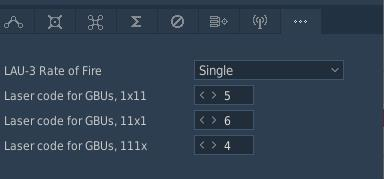

An additional method to set the bomb seeker laser code is included on the in-game kneeboard. You may
access this using keyboard command [[RShift]]+[[K]], then use the [[ [ ]] and [[ ] ]] keys to access the page. Use
the keyboard commands listed to the right of each digit to change the laser code.

Bomb seeker laser codes can only be changed using this method on the ground prior to engine start and with
the STA POWER switch on the right console OFF.

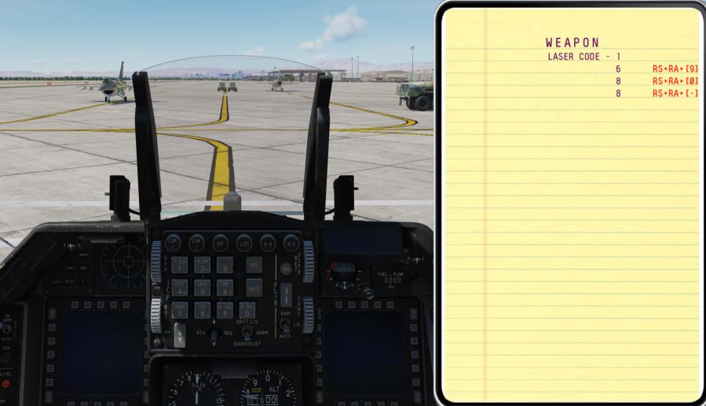

The laser designator on the Targeting Pod must be set to match the code on the bomb. See the section on the
[LASR DED  Page](16.ltpod.md#lasr-ded-page) for procedures.

### SMS Page

The A-G SMS display and procedures for setting up an attack with guided or unguided bombs are identical. See
the section on the [Bombs A-G SMS Page](#unguidedlaser-guided-bombs-sms-page) for procedures.

### Laser Guided Bomb CCRP Attack

The Continuously Computed Release Point (CCRP) mode provides computed, automatic release of bombs.
This can be done from a dive, but also from wings-level or a nose-high attitude. The laser guided bomb attack is
identical to unguided bombs with the addition of laser designation with the Targeting Pod (TGP)
This mode requires a target designation point from which to build the bombing solution. Command steering is
provided to the appropriate weapon release point and the weapon will release automatically at the proper time
such that the weapons hit the target.

The bomb laser code must match the TGP laser designator laser code. See the sections on [Bomb Seeker
Laser Code](#bomb-seeker-laser-code) and [Laser Designator Code](16.ltpod.md#lasr-ded-page) for procedures.

!!! Summary

    1. Select A-G Master Mode [[2]]
    2. Set Master Arm Switch to Arm
    3. Set Laser Arm Switch to Arm
    4. Select Bombs and desired options on SMS MFD
    5. Set desired steerpoint number or designate target with TGP
    6. Center FPM on Steering Line
    7. Depress and hold Weapons Release button [[RAlt]]+[[Space]] to expend weapons at
    computed point
    8. Lase target at least 8-12 seconds prior to impact

 

1. **Verify CCRP symbology is displayed in the HUD.**

    The fire control system provides a Steering Line (SL) to provide steering to the designated target. By
    placing the Flight Path Marker (FPM) on the SL and holding down the Weapon Release Button, the
    weapon will release at the proper time and account for wind.
    
    
    
    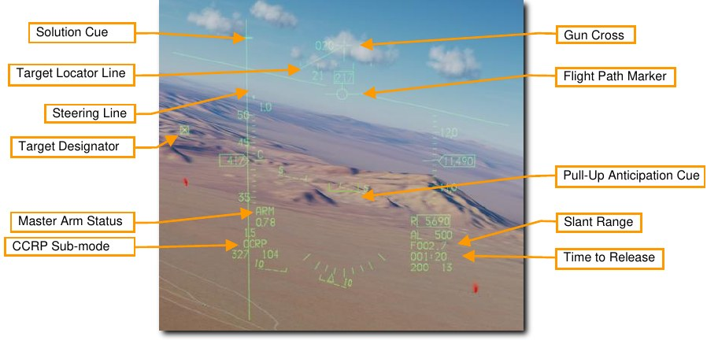
    
    A Solution Cue is displayed at the top of the SL. It will fall down the line as the range decreases and
    the weapons are about to be released.
    
    When the Target Designator (TD) is outside the HUD field on view as shown above, a Target Locator
    Line (TLL) extends from the Gun Cross pointing directly at the target. The relative angle is displayed
    next to the Gun Cross showing the number of degrees in tens between the cross and the target.

2. **Verify TGP is configured for target search and laser fire.**

    Select A-G mode on the TGP to configure it for target acquisition and weapon guidance. The line of
    sight will slave to the current steerpoint when CCRP delivery mode is selected.
    
    The TGP display may be made the sensor of interest (SOI) by positioning the Display Management
    Switch (DMS) Down. The current SOI can be identified by the box surrounding the display.
    
    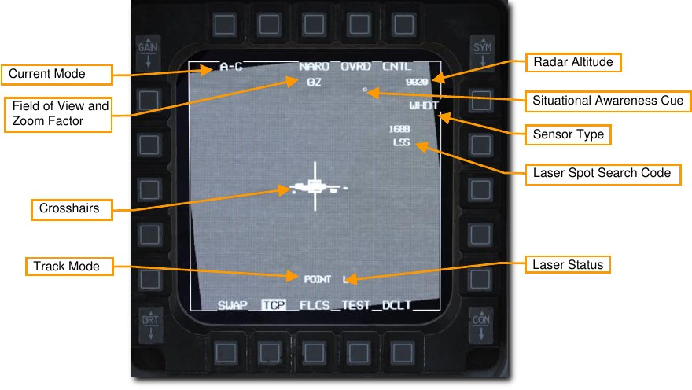
    
    
    The TGP crosshairs may then be slewed to a new position using the Cursor/Enable Control. Slewing
    the Target Designator with the HUD as SOI will also slew the TGP crosshairs.

3. **Locate and designate the desired target.**

    To calculate a bombing solution in CCRP mode, a target first must be designated. This can be done
    in two ways:
    
    - Select a Steerpoint that was placed at the target location. The Target Designator box
    on the HUD will be placed at the steerpoint. The TGP will slave to that location when CCRP
    mode is selected.
    - Locate a target with the Targeting Pod. With the TGP SOI, position the TMS Down to
    undesignate. The TGP will return to the boresight position near the center of the HUD. Fly
    or slew the TGP line of sight to the desired target location. TMS Up to designate. The
    Target Designator box on the HUD will be placed at that location.
    
    Updates to the target location may be made by slewing the TD Box in the HUD or slewing the TGP
    cursor onto a new position with the Cursor/Enable Control. The Targeting Pod line of sight is used to
    calculate the bombing solution regardless of the track mode used.
    
    Command an area track with TMS Up to stabilize the crosshairs over the target. A Point Track may
    also be commanded using TMS Up to aid in targeting if desired.
    
    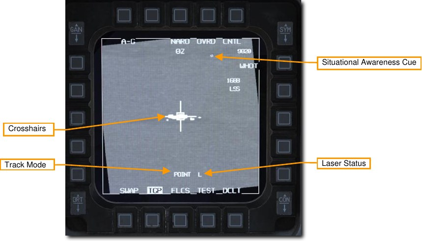
    
    Laser ranging may be performed prior to weapon release to improve the computed firing solution.
    
    See the [Laser Ranging section](16.ltpod.md#track-modes) for more information.
    
    The laser designator may be fired with any sensor type selected and from any track mode. The Laser
    status is displayed as an L near the bottom of the display when the Laser Arm switch is set to arm.
    
    The laser is fired by squeezing the trigger to the first detent. The L flashes when the laser designator
    is firing.

4. **Execute a CCRP bombing delivery.**

    Weapons delivery for laser guided bombs is identical to unguided bomb CCRP delivery.
    Keep the Flight Path Marker aligned with the Steering Line. This will align your aircraft with the target
    even though the target will be out of sight.
    
    The Steering Cue will fall down the Steering Line as the range decreases and the weapon is about to
    be released. Time to release counts down at the lower right of the HUD.
    
    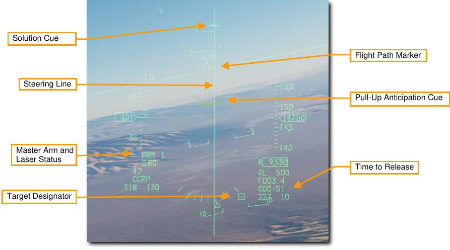
    
    Monitor the Pull-Up Anticipation Cue to ensure it does not go above the Flight Path Marker. The Pull-
    Up Anticipation Cue (PUAC) provides a visual representation of the altitude required for the bomb
    fuze to arm or altitude to initiate a pull-up to avoid impacting the ground, whichever is more
    immediate. It moves up toward the Flight Path Marker (FPM) as the aircraft loses altitude. Releasing
    a bomb with the FPM below the PUAC will not give the bomb time to arm and result in a dud.

5. **Press and HOLD the Weapon Release button.**

    When the Solution Cue begins to move down the Steering Line, about 10 seconds prior to release,
    press and hold the Weapon Release button. This provides the fire control computer consent to
    release the weapon.
    
    Keep the Flight Path Marker aligned with the Steering Line. This will align your aircraft with the target
    even though the target will be out of sight.
    
    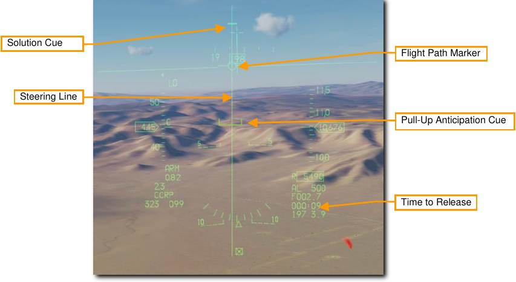

6. **Keep the Weapons Release button held until after the Solution Cue passes the Flight Path Marker.**

    Keep flying the Flight Path Marker over the Steering Line as the Sulution Cue continues to track
    downward. The bombs are released when the Steering Cue passes the Flight Path Marker.
    
    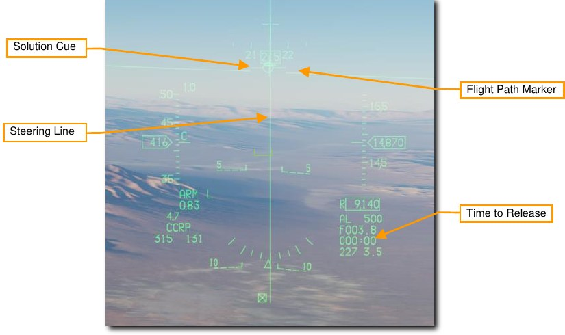
    
    
    Hold the Weapons Release button long enough to ensure all weapons come off. The FPM flashes
    after weapons are released.
    
    Execute a 30-45 degree check turn to the left or right to avoid overflight of the target and possible
    TGP gimbal roll. Continue to track the target in the TGP and update the crosshair aimpoint if
    necessary.
    
    
    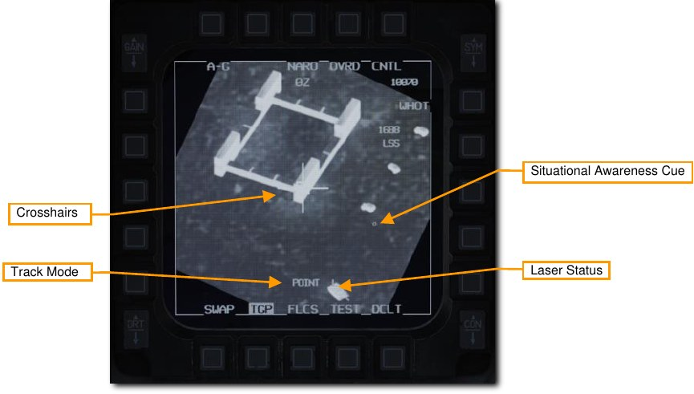

7. **Lase the target with the TGP.**

    Squeeze the Trigger to lase the target no later than 8-12 seconds prior to impact. The L flashes when
    the laser designator is firing. At impact, the screen will wash out from the IR energy of the explosion.
    
    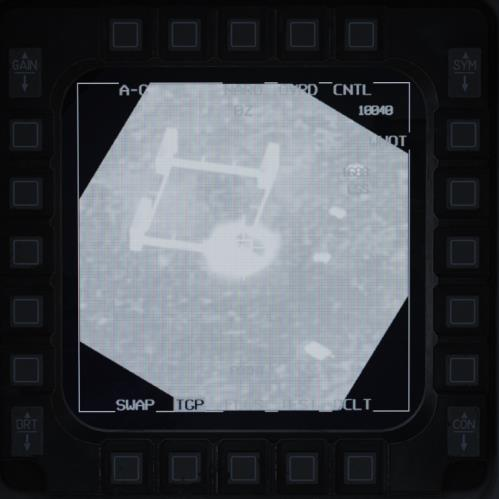
    
    
    Switch to a wide field of view for an assessment and documentation of target damage. Set up for a
    re-attack if necessary or exit the area.

## JOINT DIRECT ATTACK MUNITIONS (JDAM)

JDAM is an inertial and GPS guidance kit that can be attached to the Mk. 82 or Mk. 84 general-purpose bombs.
When released, the aircraft downloads the target coordinates to the JDAM. The JDAM then guides to those
coordinates. The weapon is completely fire-and-forget but cannot be steered or re-targeted post-launch.

### JDAM SMS Format

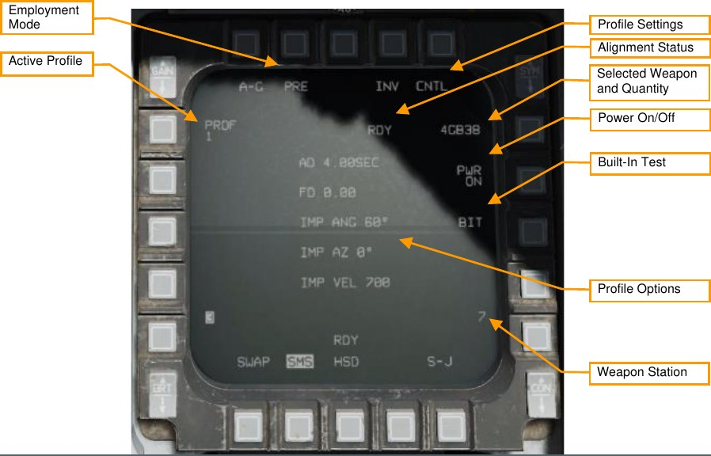

**Employment Mode**. Toggles between pre-planned (PRE) and visual (VIS) employment modes (see
Employment in Pre-Planned (PRE) Mode and Employment in Visual (VIS) Mode).

**Active Profile**. Cycles between four different employment profiles (see SMS Control Page).

**Profile Settings**. Press this OSB to open the Control page, where you can modify the active profile (see SMS
Control Page).

**Alignment Status**. When the weapon is first powered on, will display “A10” (unstable alignment). During the
alignment process, it will count down, and then display “RDY” when alignment is complete.

**Selected Weapon and Quantity**. Displays the weapon quantity and “GB38” or “GB31”.

**Power On/Off**. Press to toggle power to all JDAM stations.

**Built-In Test**. Runs built-in tests. (N/I)

**Profile Options**. Displays the parameters of the selected profile (see SMS Control Page).

**Weapon Station**. The selected weapon station for the next release is displayed in reverse video.

#### SMS Control Page

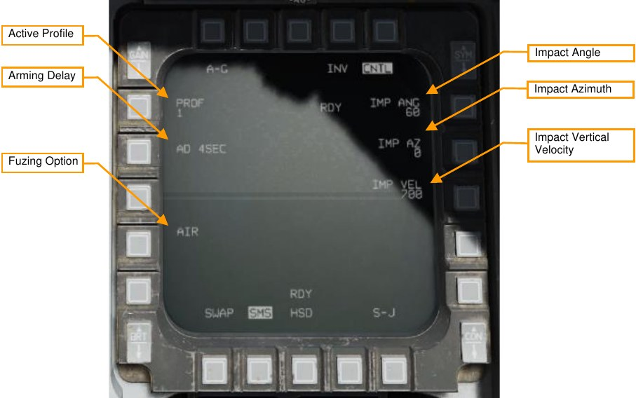

**Active Profile**. Cycles between four different profiles to edit.

**Arming Delay**. Selects the delay between weapon release and arming. Options are 4, 4.5, 5, 5.5, 6, 6.5, 7, 7.5,
8, 8.5, 9, 9.5, 10, 14, 21, and 25 seconds.

**Fuzing Option**. Sets the fuzing option:

    - AIR: Weapon will air-burst above the target. This reduces the penetrative effect of the bomb but
    improves its area effect.
    - GND: Weapon will explode on impact. Selecting GND will reveal an additional option labeled FD
     (fuzing delay). Selectable fuzing delays are 0 (instant), 5, 15, 25, 45, 60, 90, 180, and 240
    milliseconds. Adding a fuzing delay allows the weapon to penetrate the target prior to exploding.
    - GND DLY: Weapon will impact target inert, and then explode after an extended period. Selecting
    GND DLY will reveal an additional option labeled FD (fuzing delay). Selectable fuzing delays are
    0.25, 0.5, 0.75, 1, 4, 8, 12, 16, 20, and 24 hours after impact.

**Impact Angle**. Sets the angle that the bomb will attempt to impact the target at (e.g., 60°). A higher impact
angle should be used if tall structures surround the target.

**Impact Azimuth**. Sets the heading that the bomb will attempt to fly to the target during the terminal phase. A
value of “0” means no specific heading; use a value of “360” if you want the bomb to impact the target from the
south flying north.

**Impact Vertical Velocity**. Sets the vertical velocity the bomb will attempt to achieve when impacting the target,
in feet per second. A higher vertical velocity creates more effective penetration.

### JDAM HUD Symbology

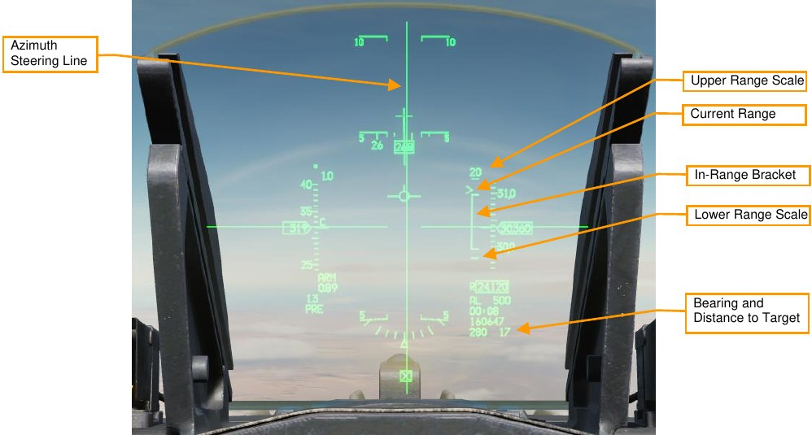

**Azimuth Steering Line**. Center the Flight Path Marker over this line to fly the fastest course to the launch
acceptability region (LAR).

**Upper Range Scale**. Indicates the top range of the dynamic launch zone (DLZ) in nautical miles.

**Current Range**. The caret indicates the aircraft’s current range to the target. If the caret is within the in-range
bracket, the weapon can reach the target if released.

**In-Range Bracket**. Indicates the range where the weapon can reach the target.

**Lower Range Scale**. Indicates zero range.

**Bearing and Distance to Target**. Indicates the bearing (degrees) and distance (nautical miles) the current SPI,
which is the location the bomb will fly to after release.

### Employment in Pre-Planned (PRE) Mode

!!! Summary

    1. Select A-G Master Mode [[2]]
    2. Set Master Arm Switch to Arm
    3. Select JDAM and power on
    4. Set desired options on SMS format
    5. Set desired steerpoint or designate target
    6. Center FPM on Steering Line and fly in range
    7. Depress and hold Weapons Release button [[RAlt]]+[[Space]] to expend weapons at
    computed point

 

1. **Select JDAM and power on.**

    Set the master mode to A-G, and on the SMS format, use OSB 6 to select GBU-38 (GB38) or GBU-
    31 (GB31) as the active weapon. Press OSB 7 (PWR OFF) to power on the weapon and begin the
    alignment process. Alignment will take a few minutes.
    
    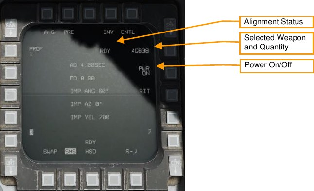

2. **Set desired options on SMS format.**

    On the SMS format, select and configure the profile you want to use.

    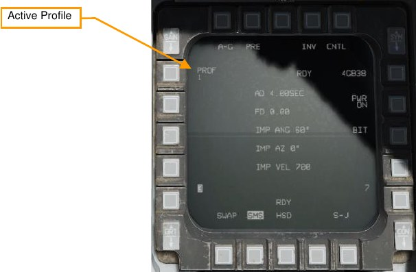

3. **Set desired steerpoint or designate target**

    The weapon will guide to the current sensor point of interest (SPI) when released. If no cursor has
    been added, or cursor zero (CZ) has been pressed, the SPI will be the current steerpoint. Designating
    a target (e.g., using the targeting pod) will shift the SPI to that location.

4. **Center FPM on Steering Line and fly in range**

    Steer to place the azimuth steering line (ASL) over the flight path marker. Fly until the range caret is
within the in-range bracket.

    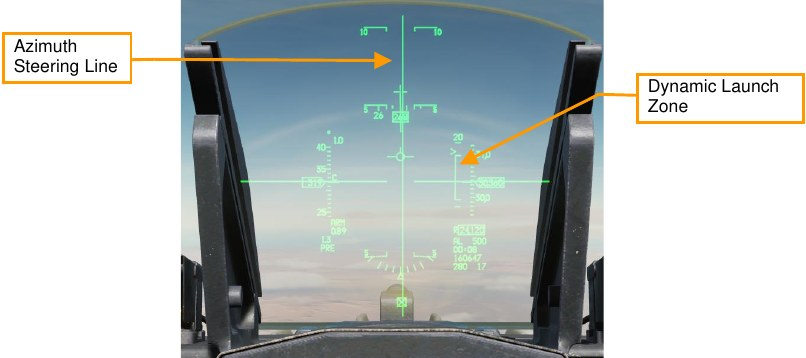

5. **Depress and hold Weapons Release button**

You must hold the Weapons Release button continuously until the weapon releases. During this
process, target coordinates and profile data is downloaded to the JDAM kit. If this process is
interrupted by releasing the Weapons Release button before the download finishes, the weapon will
become a hung store and will be unusable.

### Employment in Visual (VIS) Mode

!!! Summary

    1. Select A-G Master Mode [[2]]
    2. Set Master Arm Switch to Arm
    3. Select JDAM and power on
    4. Set VIS mode and desired options on SMS format
    5. Use HUD and TDC to designate target
    6. Center FPM on Steering Line and fly in range
    7. Depress and hold Weapons Release button [[RAlt]]+[[Space]] to expend weapons at
    computed point

 

1. **Select JDAM and power on.**

    Set the master mode to A-G, and on the SMS format, use OSB 6 to select GBU-38 (GB38) or GBU-
31 (GB31) as the active weapon. Press OSB 7 (PWR OFF) to power on the weapon and begin the
alignment process. Alignment will take a few minutes.

    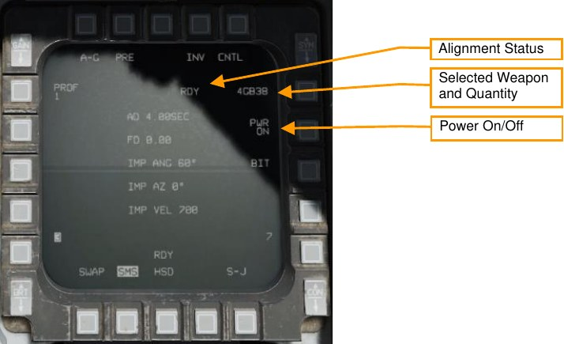

2. **Set VIS mode and desired options on SMS format.**

    On the SMS format, select and configure the profile you want to use. Press OSB 2 to change the
delivery mode to VIS.

    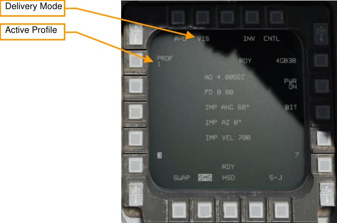

1. **Use HUD and TDC to designate target**

    Upon enabling VIS mode, a target-designator (TD) box will appear on the HUD, and the HUD will
become SOI. Use the TDC to slew the TD box over the target, then press TMS Forward to designate.

    

2. **Center FPM on Steering Line and fly in range**

    Steer to place the azimuth steering line (ASL) over the flight path marker. Fly until the range caret is
within the in-range bracket. You can continue to adjust the position of the TD box using the TDC.

    

3. **Depress and hold Weapons Release button**

    You must hold the Weapons Release button continuously until the weapon releases. During this
    process, target coordinates and profile data is downloaded to the JDAM kit. If this process is
    interrupted by releasing the Weapons Release button before the download finishes, the weapon will
    become a hung store and will be unusable.

## AGM-154 JOINT STANDOFF WEAPON (JSOW)

JSOW is an inertially-aided glide bomb capable of striking targets up to 70 NM away, depending on the altitude
and speed of launch. When released, the aircraft downloads the target coordinates to the JSOW. The JSOW
then guides to those coordinates. The weapon is completely fire-and-forget. The AGM-154A variant has BLU-
97/B warheads and cannot be re-targeted after launch.

### JSOW SMS Format

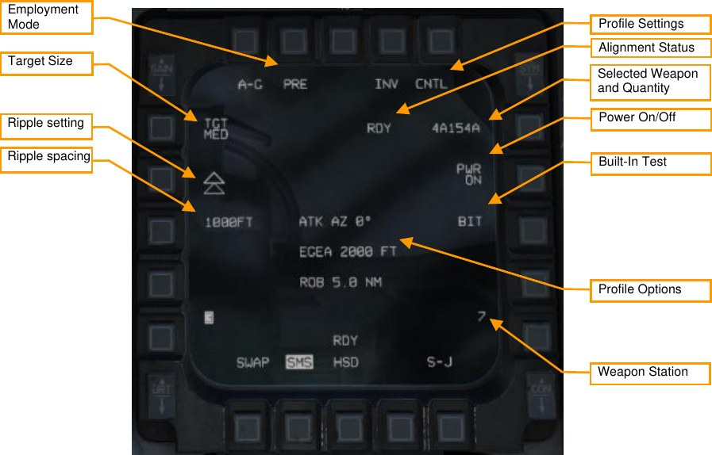

**Employment Mode**. Toggles between pre-planned (PRE) and visual (VIS) employment modes (see
[Employment in Pre-Planned (PRE) Mode](#employment-in-pre-planned-pre-mode_1) and [Employment in Visual (VIS) Mode](#employment-in-visual-vis-mode_1)).

**Target Size**. Not yet implemented.

**Profile Settings**. Press this OSB to open the Control page, where you can modify the active profile (not
implemented).

**Alignment Status**. When the weapon is first powered on, will display “A10” (unstable alignment). During the
alignment process, it will count down, and then display “RDY” when alignment is complete.

**Selected Weapon and Quantity**. Displays the weapon quantity and “A154A”.

**Power On/Off**. Press to toggle power to all JSOW stations.

**Built-In Test**. Runs built-in tests. (N/I)

**Profile Settings**. Displays the parameters of the selected profile. (N/I)

**Weapon Station**. The selected weapon station for the next release is displayed in reverse video.

**Ripple setting**. Toggle between single release and pairs release with longitudinal or lateral separation.

**Ripple spacing**. Press to enter the distance in feet between the two bombs at height of function. Not displayed
if the single release mode is selected.

### JSOW HUD Symbology

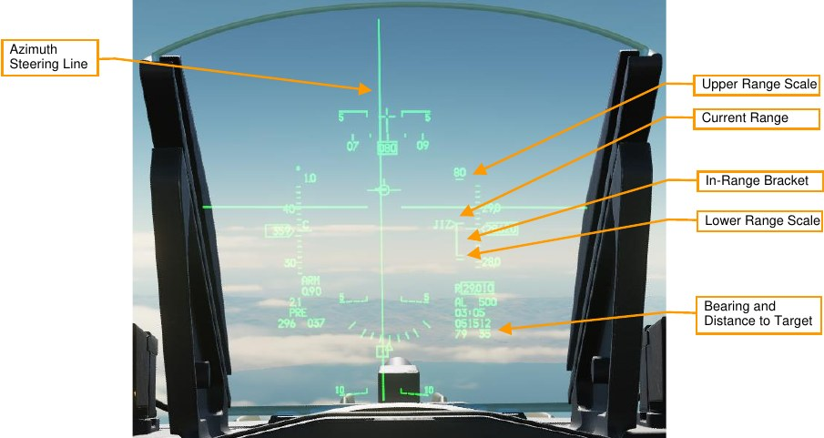

**Upper Range Scale**. Indicates the top range of the dynamic launch zone (DLZ) in nautical miles.

**Current Range**. The caret indicates the aircraft’s current range to the target. If the caret is within the in-range
bracket, the weapon can reach the target if released.

**In-Range Bracket**. Indicates the range where the weapon can reach the target.

**Lower Range Scale**. Indicates zero range.

**Bearing and Distance to Target**. Indicates the bearing (degrees) and distance (nautical miles) the current SPI,
which is the location the bomb will fly to after release.

### Employment in Pre-Planned (PRE) Mode

!!! Summary

    1. Select A-G Master Mode [[2]]
    2. Set Master Arm Switch to Arm
    3. Select JSOW and power on
    4. Set desired options on SMS format
    5. Set desired steerpoint or designate target
    6. Center FPM on Steering Line and fly in range
    7. Depress and hold Weapons Release button [[RAlt]]+[[Space]] to expend weapons at
    computed point

 

1. **Select JSOW and power on.**

    Set the master mode to A-G, and on the SMS format, use OSB 6 to select AGM-154A (A154A) as the
    active weapon. Press OSB 7 (PWR OFF) to power on the weapon and begin the alignment process.
    Alignment will take a few minutes.
    
    
    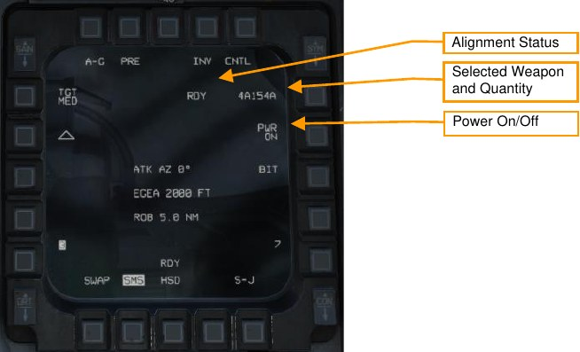

2. **Set desired options on SMS format.**

    On the SMS format, configure the weapon as desired.

3. **Set desired steerpoint or designate target**

    The weapon will guide to the current sensor point of interest (SPI) when released. If no cursor has
been added, or cursor zero (CZ) has been pressed, the SPI will be the current steerpoint. Designating
a target (e.g., using the targeting pod) will shift the SPI to that location.

4. **Center FPM on Steering Line and fly in range**

    Steer to place the azimuth steering line (ASL) over the flight path marker. Fly until the range caret is
within the in-range bracket.

    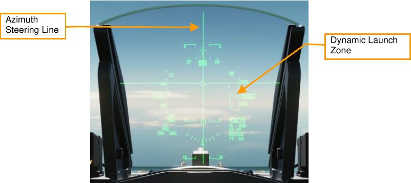

5. **Depress and hold Weapons Release button**

    You must hold the Weapons Release button continuously until the weapon releases. During this
process, target coordinates and profile data is downloaded to the JSOW. If this process is interrupted
by releasing the Weapons Release button before the download finishes, the weapon will become a
hung store and will be unusable.

### Employment in Visual (VIS) Mode

!!! Summary

    1. Select A-G Master Mode [[2]]
    2. Set Master Arm Switch to Arm
    3. Select JSOW and power on
    4. Set VIS mode and desired options on SMS format
    5. Use HUD and TDC to designate target
    6. Center FPM on Steering Line and fly in range
    7. Depress and hold Weapons Release button [[RAlt]]+[[Space]] to expend weapons at
    computed point

1. **Select JSOW and power on.**

    Set the master mode to A-G, and on the SMS format, use OSB 6 to select AGM-154A (A154A) as the
active weapon. Press OSB 7 (PWR OFF) to power on the weapon and begin the alignment process.
Alignment will take a few minutes.

    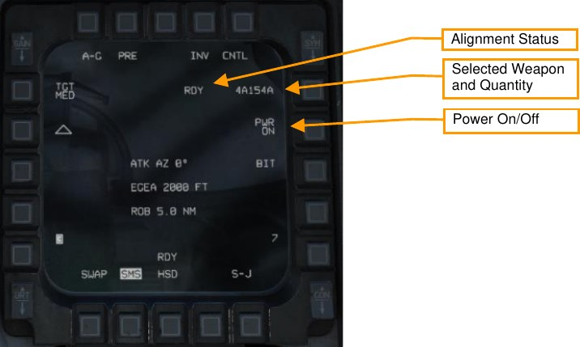

2. **Set VIS mode and desired options on SMS format.**

    On the SMS format, select and configure the options you want to use. Press OSB 2 to change the
delivery mode to VIS.

    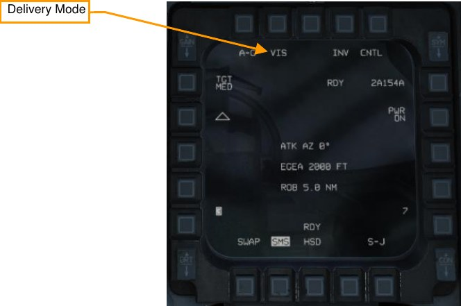

4. **Use HUD and TDC to designate target**

    Upon enabling VIS mode, a target-designator (TD) box will appear on the HUD, and the HUD will
become SOI. Use the TDC to slew the TD box over the target, then press TMS Forward to designate.

    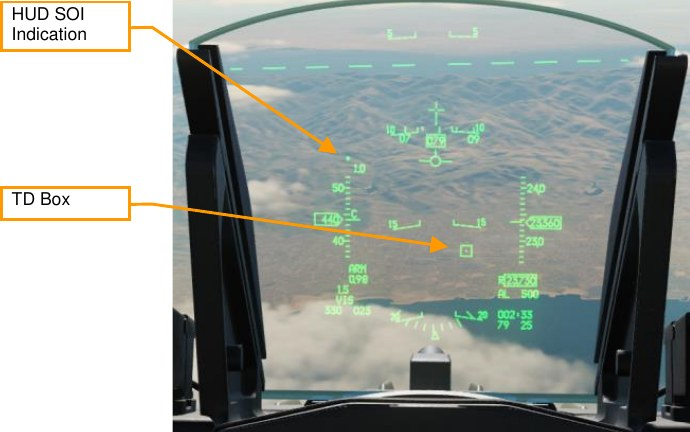

5. **Center FPM on Steering Line and fly in range**

    Steer to place the azimuth steering line (ASL) over the flight path marker. Fly until the range caret is
within the in-range bracket (labeled “JIZ”). You can continue to adjust the position of the TD box using
the TDC.

    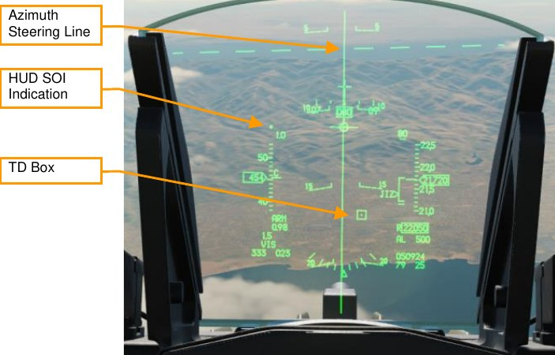

6. **Depress and hold Weapons Release button**

    You must hold the Weapons Release button continuously until the weapon releases. During this
process, target coordinates and profile data is downloaded to the JSOW. If this process is interrupted
by releasing the Weapons Release button before the download finishes, the weapon will become a
hung store and will be unusable.

## WIND-CORRECTED MUNITIONS DISPENSERS

Wind-Corrected Munitions Dispensers (WCMD, pronounced “wick-mid”) are tail kits that can be equipped to a
CBU-87 CEM or CBU-97 SFW, giving the precision guidance capability. WCMD includes an onboard INS and
can be programmed with the winds aloft to improve accuracy.

When the CBU-87 is equipped with WCMD, it is called the CBU-103. A CBU-97 with WCMD is called a CBU-
105.

### WCMD SMS Format

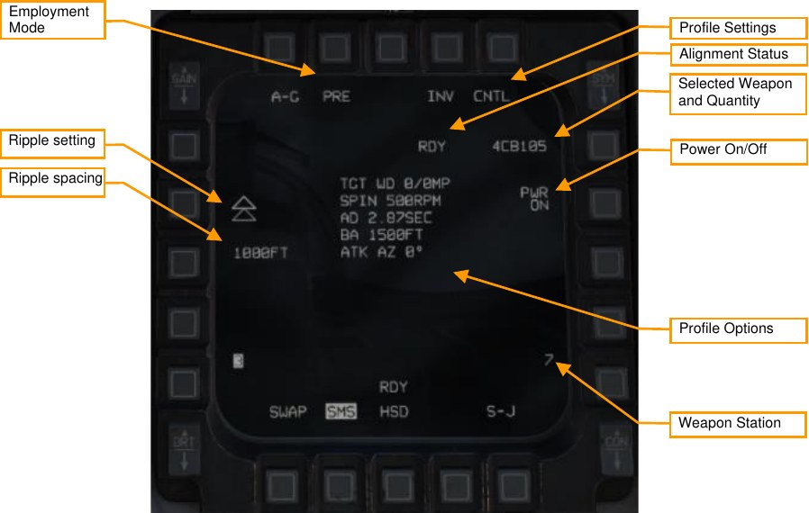

**Employment Mode**. Toggles between pre-planned (PRE) and visual (VIS) employment modes (see
[Employment in Pre-Planned (PRE) Mode](#employment-in-pre-planned-pre-mode_2) and [Employment in Visual (VIS) Mode](#employment-in-visual-vis-mode_2)).

**Profile Settings**. Press this OSB to open the Control page, where you can modify the active profile (see
WCMD CNTL Page).

**Alignment Status**. When the weapon is first powered on, will display “A10” (unstable alignment). During the
alignment process, it will count down, and then display “RDY” when alignment is complete.

**Selected Weapon and Quantity**. Displays the weapon quantity and “CB103” or “CB105”.

**Power On/Off**. Press to toggle power to all WCMD stations.

**Profile Settings**. Displays the parameters of the selected profile.
Weapon Station. The selected weapon station for the next release is displayed in reverse video.

**Ripple setting**. Toggle between single release and pairs release with longitudinal or lateral separation.

**Ripple spacing**. Press to enter the distance in feet between the two bombs at height of function. Not displayed
if the single release mode is selected.

### WCMD HUD Symbology

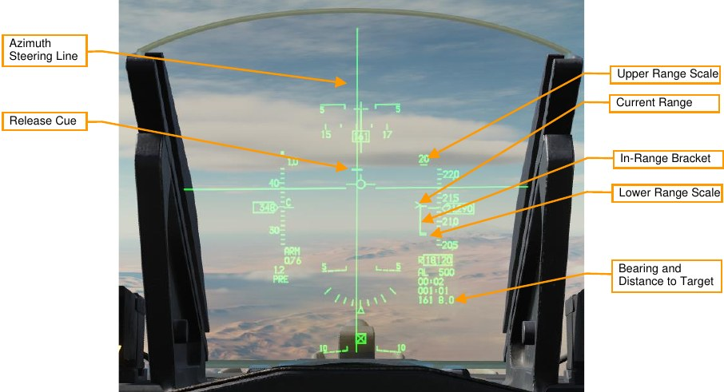

**Upper Range Scale**. Indicates the top range of the dynamic launch zone (DLZ) in nautical miles.

**Current Range**. The caret indicates the aircraft’s current range to the target. If the caret is within the in-range
bracket, the weapon can reach the target if released.

**In-Range Bracket**. Indicates the range where the weapon can reach the target.

**Lower Range Scale**. Indicates zero range.

**Bearing and Distance to Target**. Indicates the bearing (degrees) and distance (nautical miles) the current SPI,
which is the location the bomb will fly to after release.

### WCMD CNTL Page

The CNTL page lets you configure the WCMD engagement profile and other options.

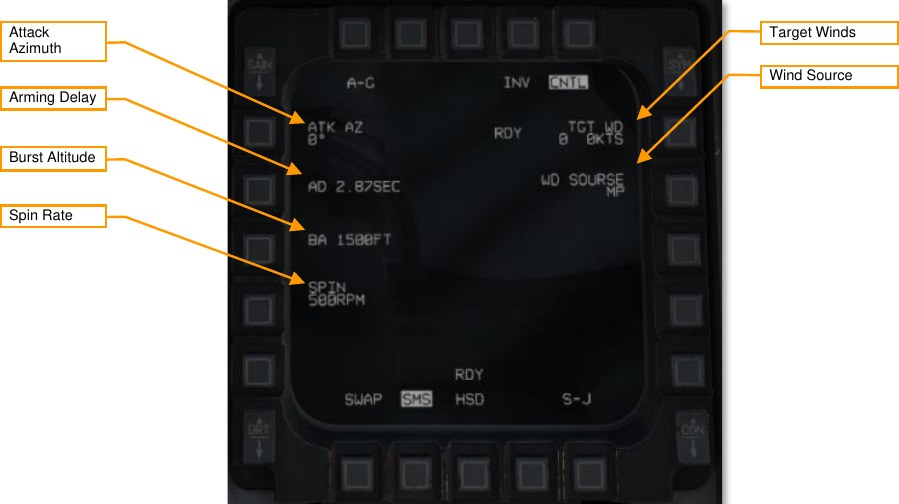

**Attack Azimuth**. Sets the attack direction that the bombs will attempt to achieve. A setting of “0” means that the
bombs will use the most direct attack direction (“360” means attack heading north). (Not implemented.)

**Arming Delay**. Sets the delay after release before the weapon arms. (Not implemented.)

**Burst Altitude**. Sets the height of function, which is the altitude (MSL) when the submunitions will be released.
Higher burst altitudes create a wider dispersal.

**Spin Rate**. The bomb will begin rotating at this RPM value prior to submunitions release (CBU-103 only).
Higher spin rates create a wider dispersal.

**Target Winds**. Manual winds aloft entry. Not implemented.

**Wind Source**. Toggles wind data from mission planning (MP), pilot-entered (PI), and avionics system (SY).
Currently only MP is available.

### Employment in Pre-Planned (PRE) Mode

!!! Summary

    8. Select A-G Master Mode [[2]]
    9. Set Master Arm Switch to Arm
    10. Select WCMD and power on
    11. Set desired options on SMS format
    12. Set desired steerpoint or designate target
    13. Center FPM on Steering Line and fly in range
    14. Depress and hold Weapons Release button [[RAlt]]+[[Space]] to expend weapons at
    computed point

6. **Select WCMD and power on.**

    Set the master mode to A-G, and on the SMS format, use OSB 6 to select WCMD (CB103 or CB105)
as the active weapon. Press OSB 7 (PWR OFF) to power on the weapon and begin the alignment
process. Alignment will take a few minutes.

    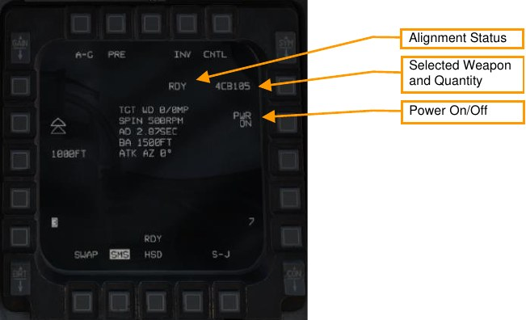

7. **Set desired options on SMS format.**

    On the SMS format, configure the weapon as desired.

8. **Set desired steerpoint or designate target**

    The weapon will guide to the current sensor point of interest (SPI) when released. If no cursor has
been added, or cursor zero (CZ) has been pressed, the SPI will be the current steerpoint. Designating
a target (e.g., using the targeting pod) will shift the SPI to that location.

9. **Center FPM on Steering Line and fly in range**

    Steer to place the azimuth steering line (ASL) over the flight path marker. Fly until the range caret is
within the in-range bracket.

    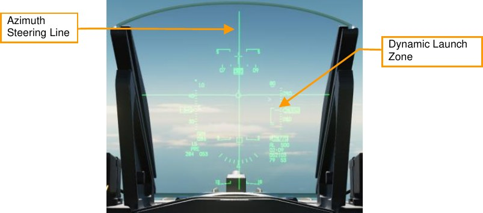

10. **Depress and hold Weapons Release button**

    You must hold the Weapons Release button continuously until the weapon releases. During this
process, target coordinates and profile data is downloaded to the WCMD. If this process is interrupted
by releasing the Weapons Release button before the download finishes, the weapon will become a
hung store and will be unusable.

### Employment in Visual (VIS) Mode

!!! Summary

    8. Select A-G Master Mode [[2]]
    9. Set Master Arm Switch to Arm
    10. Select WCMD and power on
    11. Set VIS mode and desired options on SMS format
    12. Use HUD and TDC to designate target
    13. Center FPM on Steering Line and fly in range
    14. Depress and hold Weapons Release button [[RAlt]]+[[Space]] to expend weapons at
    computed point

3. **Select WCMD and power on.**

    Set the master mode to A-G, and on the SMS format, use OSB 6 to select WCMD (CB103 and
CB105) as the active weapon. Press OSB 7 (PWR OFF) to power on the weapon and begin the
alignment process. Alignment will take a few minutes.

    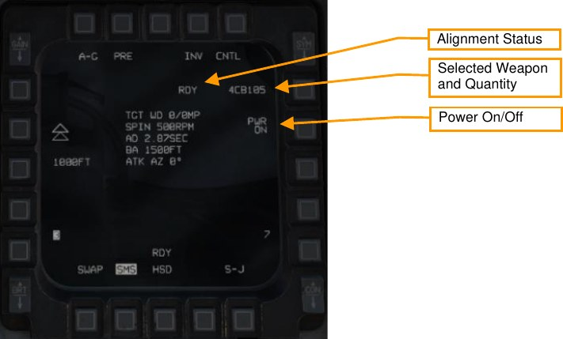

4. **Set VIS mode and desired options on SMS format.**

    On the SMS format, select and configure the options you want to use. Press OSB 2 to change the
delivery mode to VIS.

    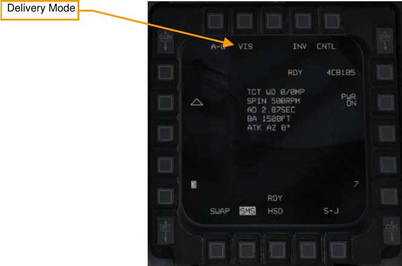

7. **Use HUD and TDC to designate target**

    Upon enabling VIS mode, a target-designator (TD) box will appear on the HUD, and the HUD will
become SOI. Use the TDC to slew the TD box over the target, then press TMS Forward to designate.

    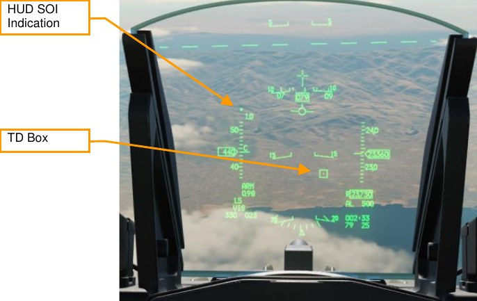

8. **Center FPM on Steering Line and fly in range**

    Steer to place the azimuth steering line (ASL) over the flight path marker. Fly until the range caret is
within the in-range bracket. You can continue to adjust the position of the TD box using the TDC.

    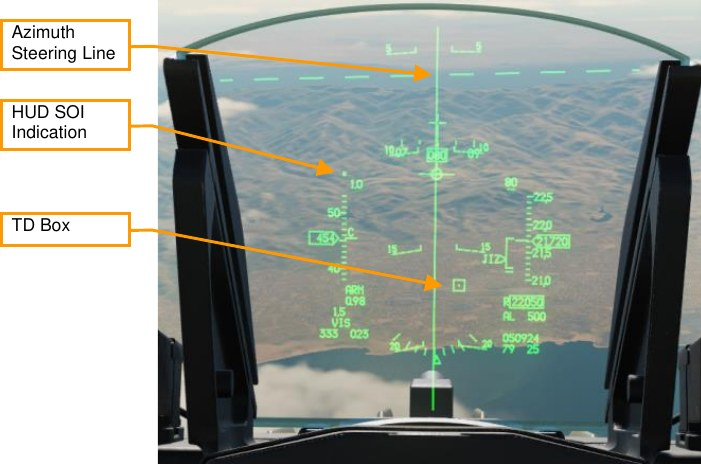

9. **Depress and hold Weapons Release button**

    You must hold the Weapons Release button continuously until the weapon releases. During this
process, target coordinates and profile data is downloaded to the WCMD. If this process is interrupted
by releasing the Weapons Release button before the download finishes, the weapon will become a
hung store and will be unusable.

## AGM-88 HARM

The AGM-88 High-speed Anti-Radiation Missile (HARM) is a supersonic, passive radar-guided air-to-ground
missile intended to strike air defense radar sites and vehicles. The missile has an onboard radar receiver that
homes in on radar energy emitted by ground-based radars, making it fire-and-forget. The pilot can designate
targets using the missile’s onboard radar receiver, or using the separate HARM Targeting System (HTS) pod
(not yet implemented). The HARM may be loaded on stations 3, 4, 6, or 7, but is only flight-certified for stations
3 and 7.

The HARM can be targeted using its onboard radar receiver in one of three modes: position known (POS),
HARM-as-sensor (HAS), or datalink (DL). Currently, DL is not implemented in DCS.

Communication with the HARM missile is managed by the aircraft launcher interface computer (ALIC) onboard
the LAU-118 pylon. The ALIC provides HARM sensor video to the SMS and allows the SMS to hand off threat
types to the AGM-88. The AGM-88 will home in on threats matching the handed-off threat type after launch.

### Symbology

#### SMS Format

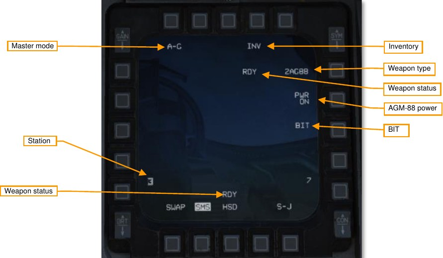

**Master mode**. Toggles between A-G and STRF (gun strafe) air-to-ground modes.

**Inventory**. Pressing this OSB displays the Inventory page.

**Weapon type**. Displays “AG88” for AGM-88 HARM, and the number of missiles loaded.

**Weapon status**. Displays “RDY” when the AGM-88 is ready for launch.

**AGM-88 power**. Displays “PWR ON” or “PWR OFF”. Pressing commands spin-up or spin-down to all loaded
AGM-88 missiles.

**BIT**. Commands execution of a built-in test. The status of each station will be updated following completion of
the BIT.

**Station**. Displays the stations on which HARMs are loaded. The station selected for launch is boxed. Above the
station number is a character indicating the missile degrade state for that station: “D” for degraded or “F” for
failed. No character above the station number indicates a functioning missile.

#### WPN Format

The AGM-88 HARM can be targeted using its onboard sensor in one of three modes: position known (POS),
HARM-as-sensor (HAS), or datalink (DL). (Currently DL is not supported in DCS.) Each mode has its own WPN
format.

##### POS Mode

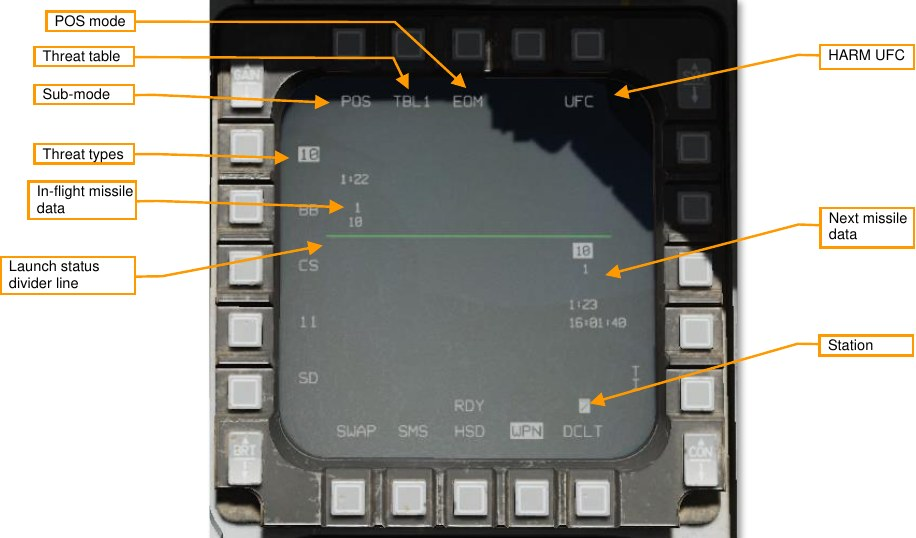

**Sub-mode**. Displays “POS” in Position Known sub-mode.

**Threat table**. Displays the current threat table (TBL1, TBL2, or TBL3). Pressing cycles through the three tables.
Pressing the TMS switch left when the WPN page is SOI also cycles through threat tables.

**HARM UFC**. Pressing this OSB displays the HARM page on the DED, where threat tables can be modified.

**POS mode**. Selects the attack profile to use: EOM (equations of motion), PB (pre-briefed), or RUK (range
unknown).

**Threat types**. Lists the threats in the current table. Pressing the OSB adjacent to a threat hands off that threat
type to the ALIC.

**Next missile data**. Information about the next missile to be launched. Not displayed if all missiles have been
launched. Line 1 is the threat type to be handed off to the missile. Line 2 is the steerpoint to be handed off to
the missile. Line 3 is the predicted time until impact, and line 4 is the predicted impact time, if the missile were
launched now. Only lines 1 and 2 are shown for RUK attacks.

**In-flight missile data**. Information about the in-flight missile. If multiple missiles are in-flight, multiple
datablocks will be shown along this row. Line 1 is the predicted time until impact. Line 2 is the steerpoint that
was handed off to the missile, and line 3 is the threat type that was handed off to the missile. Only lines 2 and 3
are shown for RUK attacks.

**Launch status divider line (LSDL)**. Divides in-flight missile information from next missile information.

##### HAS Mode

**Sub-mode**. Displays “HAS” in HARM-as-Sensor sub-mode.

**Threat table**. Displays the current threat table (TBL1, TBL2, or TBL3). Pressing cycles through the three tables.
Pressing the TMS switch left when the WPN page is SOI also cycles through threat tables.

**FOV**. Displays the missile field of view: “CTR” for center, “LT” for left, “RT” for right, and “WIDE” for wide.
Pressing cycles through FOV settings. The FOV setting controls which portion of the missile’s forward
hemisphere it searches. Pressing the FLCS pinky switch also cycles FOV settings.

**Search filter**. Pressing this OSB allows the pilot to toggle on and off threats within the current threat table.
Reducing the number of threats that the ALIC is searching for reduces the time for each scan cycle.

**HARM UFC**. Pressing this OSB displays the HARM page on the DED, where threat tables can be modified.

**DTSB**. The detected target status box lists detected threat types. When a new threat is detected, its type (e.g.,
“2” for SA-2) is added to the DTSB.

**Scan counter**. This counter increments after each successive scan made by the AGM-88.

**Restart search**. Pressing this OSB cancels the current scan cycle and begins a new one.

**ALIC video**. Detected threats are displayed in this area. Only threats from the active threat table are displayed.
ALIC video is ground stabilized and referenced to missile boresight line. Threats displayed as characters
representing their type (e.g., “2” for SA-2). If the threat is active (radiating), the letter “A” follows the threat type.
If the threat is tracking (guiding an in-flight missile), the letter “T” follows the threat type. If the threat is not
radiating (memory threat), or multiple threats of the same time are co-located, no “A” or “T” is shown.

Pressing TMS forward commands designation of the threat under the TDC. The ALIC video display will switch
to a non-ground-stabilized display of the targeted threat, with crosshairs indicating missile boresight.

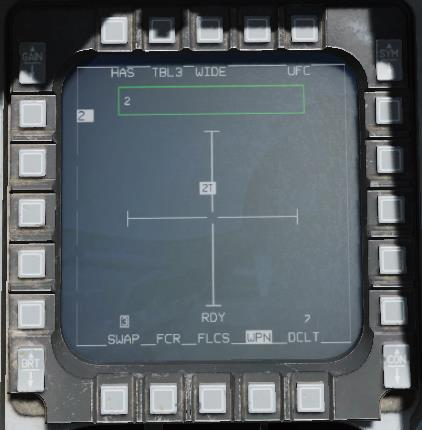

**Station**. Shows which stations have AGM-88s loaded. The station selected for next launch is boxed. A “D” or
“F” is displayed over the station number to indicate a degraded or failed missile.
**TDC**. The target designator cursor is slewed over a target the pilot wishes to designate, using the cursor control
on the TQS. Pressing TMS forward commands designation of the threat under the TDC, and hands off the
threat type to the AGM-88.
**Boresight**. Indicates the missile boresight axis.
**Scan time**. Shows worst-case scan time. The ALIC will repeatedly scan for threats according to the chosen
parameters. Reducing the number of threats to be scanned using the SRCH OBS, or reducing the FOV, will
reduce the scan time and therefore decrease the amount of time before a threat is detected.
**Threat types**. The five threat types for the current threat table (TBL1, TBL2, or TBL3) are shown along the left
side. If a threat is designated, its type is highlighted. The adjacent OSBs have no function in the HAS sub-
mode.

#### HUD

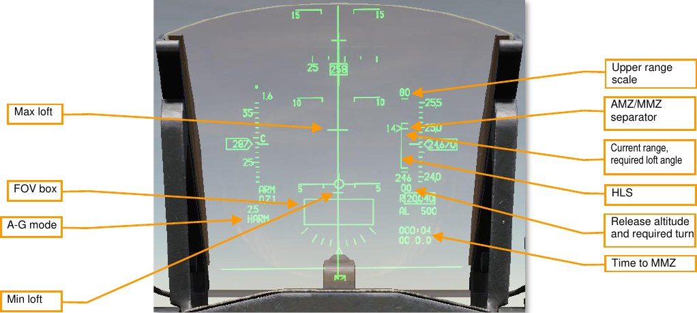
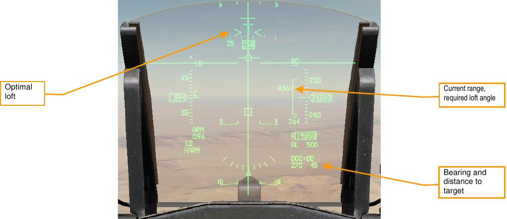

On the right side is the HARM Launch Scale (HLS), which indicates the range potential of the missile to reach
the current target. The target is assumed to be at the current steerpoint. The SMS estimates both the aircraft
maneuver zone (AMZ), and the missile maneuver zone (MMZ). The AMZ is the zone where the missile can
reach the target if the launching aircraft lofts or turns towards the target first. The MMZ is the zone where the
missile can reach the target by doing entirely its own maneuvering.

**FOV box**. Indicates the end-game field-of-view of the HARM. The FOV box flashes when the aircraft is within
the missile maneuver zone, target handoff is completed, and the missile is ready to be fired.

**HLS**. The HARM launch scale (HLS) staple represents the combined AMZ and MMZ; in other words, the
ranges at which the missile can reach the target with or without aircraft maneuvering. The horizontal dash within
the staple indicates the top of the MMZ range and the bottom of the AMZ range. The bottom of the staple
indicates minimum launch distance. The pickle button is only hot when the staple is within the MMZ.

The HLS and all associated symbology are inhibited in HAS mode.

**Current range, required loft angle**. The position of the caret along the staple represents the current aircraft
range to target along the HLS range scale. If the caret is above the AMZ/MMZ separator, the aircraft must first
maneuver before the missile can reach the target. The number adjacent to the caret is the required loft angle to
place the aircraft within the MMZ. The loft angle is prefixed by an “A” when the aircraft is within the MMZ. The
caret is inhibited when in PB mode and more than 10° off-bearing.

**Upper range scale**. Will be either 40 or 80 NM, whichever is sufficient to cover the distance to the target.

**Zero range**. The bottom end of the HLS is a target distance of zero.

**Min loft, optimal loft, max loft**. The horizontal ticks along the azimuth steering line (ASL) indicate the
minimum and maximum loft required for the missile to reach the target. Maximum loft is the larger tick and
represents the loft angle that will give the missile maximum range. Minimum loft is the smaller tick and
represents the range where the missile would have to do a max-g pulldown to reach the target. In PB mode,
optimal loft is also shown as a pair of whiskers along the ASL. Optimal loft represents the loft angle that gives
the missile the maximum energy available at impact.

Loft cues are inhibited in HAS and POS/RUK modes.

**Release altitude**. The top number of this datablock is the predicted release altitude assuming the aircraft
makes a 4-g loft to the optimal loft altitude (or the maximum loft altitude if not within the MMZ).

**Required turn**. The bottom number of this datablock is the required turn to place the aircraft within the MMZ
(e.g., “L03” if a 3° left turn is required). Shows “00” if the aircraft is on-bearing but not yet within the MMZ range.
Once the aircraft is within the MMZ, this field shows the aircraft required turn to face the target (e.g., “L90” if the
aircraft nose is 90° right of the target).

This datablock is not displayed in HAS and POS/RUK modes.

**Time to MMZ**. Displays the estimated time until the aircraft reaches the MMZ. Displays “0:00” when the aircraft
is inside the MMZ. Not displayed in HAS or POS/RUK modes.

**Bearing and distance to target**. The bearing and distance (in nautical miles) from the aircraft’s present
position to the target. Not displayed in HAS mode.

#### HARM DED Page

The HARM DED page is accessed by pressing the LIST button on the UFC, then the 0/M-SEL button to select
MISC, and then the 0/M-SEL button again to select HARM. Note that the HARM option is only displayed when
AGM-88 is the selected on the SMS.

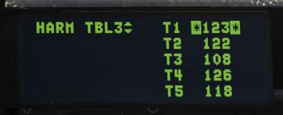

Pressing INC/DEC cycles through the three threat tables (TBL1, TBL2, and TBL3). Each threat table can store
up to five numeric threat IDs. Pressing the dobber switch up or down moves the cursor between slots. Use the
numeric buttons on the UFC to enter a new threat ID. Threat IDs supported in DCS are listed in ALIC Codes.

### Preparation

Prior to departure, set up your threat tables as necessary. The threats you expect to fire against must be
present on at least one threat table for the HARM to detect them. Most of the time, you will be able to use one
of the default threat tables:

TBL1 (MODERN SAMS)  |TBL2 (AAA, SHORAD)  |TBL3 (OLDER SAMS)
--------------------|--------------------|-----------------
10 (SA-10 FCR)      |19 (SA-19 TAR)      |3 (SA-3 TR)
BB (SA-20 SR)       |15 (SA-15 TELAR)    |S (SA-3 SR)
CS (SA-10 SR)       |8 (SA-8 TELAR)      |6 (SA-6 STR)
11 (SA-11 TELAR)    |A (ZSU-23-4 STR)    |2 (SA-2 TR)
SD (SA-11 TAR)      |DE (DOG EAR MRCC)   |13 (SA-13 TELAR)

If your expected threat does not appear on any of these tables, you will need to add it to one of the tables. You
will also improve your ability to efficiently employ HARMs if you consolidate expected threats onto a single
table.

To edit threat tables, first select air-to-ground master mode by pressing the A-G button on the ICP. Then, on the
SMS format, select AG88 as the active weapon type. Display the HARM page on the DED by pressing the LIST
button on the ICP, then the 0/M-SEL button to select MISC, and the 0/M-SEL button again to select HARM.

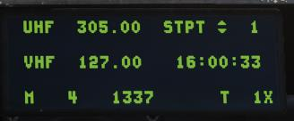

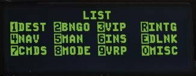

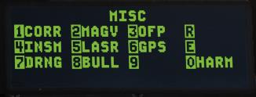

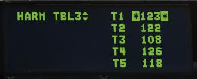

Use the INC/DEC rocker on the ICP to select a threat table, then use the dobber to place the cursor over a
threat you wish to edit. Use the ICP to enter a new threat number, then press the ENTR button.

Prior to employing HARMs, press the A-G button on the ICP to select air-to-ground master mode. Ensure that
the SMS and WPN formats are visible on an MFD. From the SMS format, power on the HARMs:

Prior to firing a HARM, ensure the MASTER ARM switch is in ARM.
Employment using Position Known (POS) Mode
Summary
1. Select A-G Master Mode [[2]].
2. Set MASTER ARM switch to ARM.
3. Select AG88 on SMS page (OSB6).
4. Select POS sub-mode on the WPN page (OSB1).
5. Select the attack profile on the WPN page (OSB3).
6. Select the desired threat table and threat on the WPN page (OSB2).
7. Select the target steerpoint.
8. Fly to the AMZ, follow the loft and required turn cues, and wait until the FOV box on the
HUD is flashing.
9. Fire the missile using the weapon release button [[RAlt]]+[[Space]].

Position Known (POS) mode is a pre-planned employment mode that relies on a steerpoint being placed at or
near the target radar. The radar type will be downloaded to the ALIC, and the HARM will fly towards the target
steerpoint until the radar is detected, at which point it will home on the radar signal.
In POS mode, the pilot selects one of three attack profiles: Equations of Motion (EOM), Pre-Briefed (PB), or
Range Unknown (RUK). Each of these profiles makes different assumptions about the aircraft maneuver zone
(AMZ) and missile maneuver zone (MMZ). The AMZ is the zone where the missile can reach the target,
assuming the aircraft maneuvers to a required bearing and loft angle first. The MMZ is the zone where the
missile can reach the target without requiring the aircraft to turn or loft.
Equations of Motion (EOM) mode is the most effective profile for off-boresight launches but requires the most
accurate target steerpoint data. To launch with EOM selected, the pilot must first fly to the AMZ, then loft and
launch once within the MMZ. EOM is useful when attacking threats that require high off-boresight (HOBS)
defensive tactics.
Pre-Briefed (PB) mode is the most effective profile at longer ranges but requires an on-bearing attack. To
launch with PB selected, the pilot must first turn the aircraft to point at the target, then fly to the AMZ, then loft
and launch once within the MMZ. PB is most effective at longer ranges but requires the aircraft to fly directly at
the target.
Range Unknown (RUK) mode is the most versatile profile when working with degraded target data. To launch
with RUK selected, the pilot must fly the aircraft into the MMZ, where the missile can make all required
maneuvering to reach the target. RUK is much more tolerant of inaccurate target steerpoints, or when fighting
threats where only bearing information is available.
1. Select POS sub-mode on the WPN page.
Press OSB1 if necessary to change to POS sub-mode. You will see the launch status divider line
 (LSDL) and next-launch information below the LSDL.
1. Select the attack profile.
On the WPN page, press OSB3 until the desired attack profile is shown.
2. Select the threat table and threat.
On the WPN page. press OSB2 until the desired threat table is shown, and then press the OSB
adjacent to the threat you wish to attack from the list on the left side. This will hand off the threat to
the ALIC.
3. Select the target steerpoint.
Activate the steerpoint co-located with the threat you are attacking.
4. Fly to the AMZ, follow the required turn and loft cues, and wait until the FOV box on the HUD
is flashing.
The attack profile you will fly is dependent on whether you have selected EOM, PB, or RUK.
EOM Attacks
In EOM mode, you can launch from any relative bearing, as long as you follow the cues to the MMZ.
First fly towards the target until the HLS range caret indicates that you are within the AMZ. If a
required turn is indicated on the datablock below the HLS, turn as indicated until it reads “00”. (You
do not necessarily need to be facing the target, as long as there is no required turn.) Then, pull up
until the VVI is between the minimum and maximum loft cues on the ASL. When the FOV box is
flashing, you can launch.
PB Attacks
In PB mode, you must be within 10° of bearing to the target. Once your aircraft is pointed towards the
target, fly towards the target until within the AMZ. You will see the minimum, optimal, and maximum
loft cues on the ASL. Pitch the aircraft to place the VVI between the minimum and maximum loft cues.
When the FOV box is flashing, you can launch.
RUK Attacks
In RUK mode, you must fly the aircraft all the way to the MMZ. Follow the azimuth steering line (ASL)
on the HUD towards the target until the FOV box on the HUD is flashing. Once it is flashing, you are
within the MMZ and the weapon release button will be hot. For RUK attacks, the HARM will loft, but
the loft angle will be limited to the maximum the missile can achieve while keeping the threat within its
field of view.
Because range information is degraded or unavailable for RUK attacks, no time-until-intercept or
time-to-impact data is shown on the WPN page, and loft information is suppressed on the HUD.

Employment using HARM-as-Sensor (HAS) Mode
Summary
1. Select A-G Master Mode [[2]].
2. Set MASTER ARM switch to ARM.
3. Select AG88 on SMS page (OSB6).
4. Select HAS sub-mode on the WPN page (OSB1).
5. Make the WPN page SOI.
6. Select the desired threat table on the WPN page (OSB2).
7. Wait until your threat appears in the ALIC video display on the WPN page.
8. Move the TQS cursor over the threat and designate with TMS forward [[RCtrl]]+[[Up]].
9. Fire the missile using the weapon release button [[RAlt]]+[[Space]].

HARM-as-sensor (HAS) mode is a target-of-opportunity employment mode using the HARM’s onboard radar
receiver. The HARM detects air defense radar signals and transmits that information to the aircraft. The pilot
can then select a radar to attack and launch a HARM against it. With this mode, distance to the target is not
known, only bearing, so the HARM does not loft, which decreases its effective range.
In HAS mode, the HARM repeatedly scans for threats that match the current active threat table. The HARM
begins with a full scan of its FOV, once for each of the selected threat types. If any targets are found, a detailed
scan is performed to determine the target coordinates. The HARM then steps to the next threat type. In all, this
results in a worst-case scan cycle time of 90 seconds.
The ALIC is in HAS mode when the master mode is A-G, AG88 is the selected weapon on the SMS page, and
“HAS” is displayed as the active sub-mode on the WPN page.
1. Select HAS mode and make WPN page SOI.
Press OSB1 if necessary to change to HAS sub-mode. Ensure that the WPN page is SOI; if not,
press DMS aft to change SOI to the WPN page.

2. Select the appropriate threat table.
Press OSB2 or TMS left until the desired threat table is selected.
3. Reduce the scan time by selecting only the threats you wish to scan for (optional).
If you want to reduce scan time, press SRCH (OSB4), then leave highlighted only the threats you are
interested in searching for.

Press HAS (OSB1) to return to the HAS page.
4. Select an FOV (optional).
You can further reduce scan time by using the pinky switch (or OSB3) to cycle through FOV options
until you find an appropriate FOV.
5. Locate and designate your target.
Point your aircraft (and the missile seeker) in the direction of your expected threat. As each scan
cycle completes, detected threats will be shown in the ALIC video area and placed into the DTSB.
Slew the cursor over the detected threat, then press TMS forward to designate it. The HAS display
will change to indicate the designated threat.

Note that you can designate and fire against any threat that appears on the HAS display, but many
radar operators will cycle their radars on and off or track different targets. This will result in the HARM
being unable to continue tracking the target, and the missile will become ineffective.
To increase probability of kill, you may wish to wait until the threat radar is guiding a missile at you
 (“T” appears next to threat type on HAS display) before firing, since a radar operator is less likely to
cease tracking you while guiding a missile. However, this strategy comes with its own obvious risks!
6. Fire the missile.
Verify the proper threat is highlighted, “RDY” is displayed in the SMS and WPN pages, and the FOV
box in the HUD is flashing, then press and hold the pickle button to fire the missile.
AGM-65 MAVERICK
The AGM-65 Maverick is an optically guided air-to-ground missile intended for the close air support (CAS)
mission. It uses an onboard electro-optical (E/O) or infrared imager that tracks the target, giving it “fire and
forget” capability. The pilot locks the target using the image from the onboard seeker head and fires the missile.
The missile tracks to the target using the image from its seeker head.
The AGM-65 was developed by Hughes Missile Systems Division in 1966 and entered service in 1972.

Operation
The AGM-65 must be warmed up before it can be used. During the warm-up period, onboard image-stabilizing
gyroscopes spin up to operating speed. The missile’s video can be used before the gyroscopes have spun up,
but the image will not be ground stabilized.
Missile video will become available on the WPN page once the gyroscopes are spun up. If you wish to shorten
the warm-up period, pressing the Uncage button while the WPN page is SOI will activate missile video once the
gyroscopes have reached 90% of operating speed.
The pilot can locate and designate targets using the fire control radar (FCR) or heads-up display (HUD), using
the AGM-65’s own seeker head, or the pilot can handoff targets designated from the Sniper Advanced
Targeting Pod (TGP).
When handing off targets from the TGP, the missile boresight correlator (MBC) compares the image from the
targeting pod with the image from the missile seeker head and slews the missile seeker head until the images
match. The MBC is only active when in A/G mode with an AGM-65 selected, and the TGP is sensor of interest
(SOI).
When the Maverick is fired, its onboard imager continues to track the target until the target grows to fill about
75% of the seeker head field of view (FOV). At this point, to continue to impact, the Maverick uses forced
correlation.
The AGM-65 has a ground-configurable fuzing delay and a ground-selectable LAND/SHIP selector that
changes the tracking algorithm to be more suitable for vehicles or ships.

Limitations
Standby time 1 hour
Video time 30 minutes
Seeker gimbal limits
AGM-65D ±42° horizontally
 ±30-54° vertically
SMS Page

E/O sub-mode Inventory

SMS master mode Control menu
mode

Missile quantity and type

Missile step Power on/off

Release pulses

Station

SMS master mode: Toggles between A-G and STRF (gun strafe) master modes.
E/O sub-mode: Cycles between PRE, VIS, or BORE E/O sub-modes. See the Employment sections, below, for
more information on the different sub-modes. You can also toggle sub-modes using the cursor enable button
quadrant system (TQS).
Inventory page: Press to show the Inventory page.
Control page: Press to show the Control page.
Missile quantity and type: Cycles between different types of loaded AGM-65s.
Auto power toggle: Toggles on or off the auto-power feature (see Automatic Power-On, below).
Release pulses: Controls the number of missiles released per press of the weapon release button. Only
available for AGM-65D and -65G.
Stations: Shows the stations loaded with AGM-65s. The next station to fire is highlighted.
Missile step: Cycles the next station to fire between loaded stations.

SMS Page, CNTL Sub-Page
Auto power toggle: Turns on or off the auto power-on feature.
Auto power steerpoint: Sets the steerpoint where the Maverick will automatically turn on.
Auto power direction: Sets the general direction the airplane must be going when it crosses that steerpoint to
automatically power on the Mavericks. Cycles between north/east/south/west.
WPN Page

E/O sub-mode
Operating mode Field of view

TGP boresight Weapon type and quantity

Expand FOV
Tracking gate
Polarity
Pointer cross
LAR
Max range
Reticle depressions
Current range
Min range
Stations Zero range

TTI
Weapon status

Operating mode: Cycles between STBY (standby) and OPER (operating) modes.

E/O sub-mode: Cycles between PRE, VIS, or BORE E/O sub-modes. See the Employment sections, below, for
more information on the different sub-modes. You can also toggle sub-modes using the Cursor Enable button
on the TQS.

TGP boresight: Press to mark this Maverick station as boresighted to the targeting pod. This should be done
after confirming that the targeting pod and Maverick seeker head are pointing at the same target. See Missile
Boresighting, below, for more information.

Tracking gate: Indicates the missile track target. The crosshairs will expand to indicate the boundaries of the
target being tracked.

Pointer cross: Indicates the seeker head direction relative to boresight (center of the screen). The AGM-65D
seeker head is capable of ±42° horizontally, and +30–54° vertically.

The pointer cross will flash when any of the following launch criteria are not met:

- Seeker head must be within 10° horizontally and vertically of boresight.
- Target image must be large enough to maintain continuous track.
Reticle depressions: Indicates 5°, 10°, and 15° of reticle depression.

Stations: Shows the stations loaded with AGM-65s. The next station to fire is highlighted. Above the station
number will be a character indicating the status of the MBC:

- S: Slave (MBC has not been commanded to slew missile)
- 1: Slew 1 (MBC is slewing to match missile LOS to TGP LOS)
- 2: Slew 2 (MBC is slewing to match missile video to TGP video)
- T: Track (MBC has commanded missile to track)
- C: Complete (MBC has finished correlating)
- I: Impossible (MBC was unable to complete handoff)
Weapon status: One of the following:

- REL: Release signal being transmitted to weapon.
- RDY: Weapon is armed and ready for release.
- MAL: Weapon cannot be released due to malfunction.
- SIM: Weapon is unarmed and will not be released, but release symbology is being displayed.
- (blank): MASTER ARM is in OFF position.
Field of view: Toggles between wide and narrow FOV. You can also toggle FOV using the pinky switch on the
flight control stick (FCS) when the WPN format is SOI, or using the Uncage button on the TQS regardless of
SOI.

Weapon type: Cycles between the different types of loaded AGM-65s. Shows the quantity and type of AGM-65
loaded and active.

Expand FOV: Outlines the boundaries of the expanded field of view.

Polarity: Toggles between hot-on-cold (HOC) and cold-on-hot (COH) polarity. You can also press TMS right to
toggle between polarities. The AGM-65G and -H additionally have an AREA mode for forced correlation mode
(see Force Correlate, below).

LAR: The launch acceptable region for the next missile, showing the acceptable launch range and current
range adjacent to the caret. Accurate range data is only available if the SPI is in proximity to the missile LOS.

Time to impact (TTI): The time until the next missile impacts its target, if launched now.

Preparation
The AGM-65 has a duty cycle of one hour in standby, and 30 minutes when active. After powering the
AGM-65s, the missiles will begin their 3-minute warm-up period. Once three minutes has passed, the missiles
are in standby mode and ready for employment. In standby mode, the missiles have one hour of available duty
time. Once a missile’s video is activated, it has 30 minutes of available duty time. When a missile’s duty time
has expired, it must be powered off for two hours.

Automatic Power-On
The SMS can be configured to automatically power on the Mavericks when crossing a configured steerpoint, so
that the pilot does not need to remember to power them on at least three minutes prior to employment.

Summary
1. On the SMS format, select Mavericks.
2. Display the Control page.
3. Choose the steerpoint.
4. Choose the direction and enable auto power-on.

1. On the SMS format, select Mavericks.
On the SMS format, press OSB6 until AG65 is shown as the active weapon.
2. Display the Control page.
Press the CNTL (OSB5) to display the Control page.

3. Choose the steerpoint.
Press OSB19, labeled STPT X.
Using the OSBs, enter the steerpoint number, then press the OSB labeled ENTR. The Mavericks will
be powered on upon crossing this steerpoint. You can press RCL to undo an errant digit, or RTN to
return to the Control page without changing the steerpoint number.
4. Choose the direction and enable auto power-on.
Press OSB20 (NORTH OF) to cycle between different direction options. The Maverick will not be
powered on until the aircraft crosses the configured steerpoint traveling in generally this direction.
Press AUTO PWR (OSB7) to turn on the automatic power-on feature.

You can leave the Control page by pressing the CNTL (OSB5) again.

Missile Boresighting
Missile boresighting should be done prior to employing Mavericks using TGP handoff. It can be done either on
the ground or in the air while en route.
Summary
1. Power on the Mavericks and TGP.
2. Set GND JETT ENABLE ON, MASTER ARM SIM, A-G master mode [[2]], and A/G TGP
mode.
3. On the SMS format, select AG65 and set E/O sub-mode to PRE or VIS.
4. On the TGP format, slew the seeker head to the boresight target.
5. On the WPN format, slew the seeker head to the same target and designate.
6. Press the BSGT button (OSB20).
7. Repeat steps 4–6 for each station.
8. Power off the Mavericks and reset all switches.

1. Power on the Mavericks and TGP.
Place the TGP format on one MFD, and the SMS format on another.
If the Mavericks are not already powered on: On the SMS format, press the PWR OFF (OSB7) to
power on the Mavericks.

If the TGP is not already powered on: Set the RIGHT HDPT power switch to on, on the SENSOR
panel.
2. Set GND JETT ENABLE ON, MASTER ARM SIM, A-G master mode, and A/G TGP mode.
If on the ground, set GND JETT ENABLE to ON. Press the A-G button on the ICP to switch to air-to-
ground master mode. Set the MASTER ARM switch to SIM.
If the TGP is not already in air-to-ground mode, then on the TGP format, press the OSB labeled
STBY, then the OSB labeled A-G to put the targeting pod in A/G mode.
3. On the SMS format, select AG65 and set E/O sub-mode to PRE or VIS.
On the SMS format, press OSB2 until PRE or VIS is shown as the Maverick sub-mode. (You can also
use the cursor enable button on the TQS to cycle between delivery modes.) Use PRE if your
boresight target is co-located with a steerpoint; use VIS if you are visually locating your boresight
target. Confirm that AGM-65 PRE or VIS symbology is shown on the HUD. Choosing a target further
away will reduce parallax errors.
Change the MFD displaying the SMS format to the WPN format. On the WPN format, verify that NOT
TIMED OUT is no longer displayed, indicating the missiles have completed their three-minute warm-
up. The WPN page should begin displaying video from the missile seeker head.
4. On the TGP format, slew the seeker head to the boresight target.
Use DMS aft to move SOI to the TGP. Using the TQS cursor, slew the TGP pointing cross over the
boresight target.

5. On the WPN format, slew the seeker head to the same target and designate.
Press DMS aft until SOI moves to the WPN format. Use the TQS cursor to slew the Maverick tracking
gate over that same boresight target, then press TMS forward to designate. Verify that the tracking
gate closes, and the correct target is being tracked.

6. Press the BSGT button (OSB20).
Press OSB20, labeled BSGT, to boresight the missiles.
Press TMS aft to break missile track, then verify the missile LOS follows the TGP LOS.
7. Repeat steps 4–6 for each station.
Press MSL STEP to move to the next pylon. Repeat this procedure for each pylon loaded with AGM-
65s.
8. Power off the Mavericks and reset all switches.
When you are finished boresighting your missiles, go back to the SMS format and press the OSB
labeled PWR ON. This will prevent your Mavericks from running through their duty time before you
enter the combat area.
Be sure to reset the positions of the MASTER ARM and GND JETT ENABLE switches, as well as the
master mode.

Employment using PRE mode
The PRE (pre-planned) delivery mode allows you to lock targets in the vicinity of a sensor point of interest (SPI),
such as a steerpoint. PRE uses CCRP-style HUD symbology, and the Maverick seeker head will be slaved to
the SPI.

Summary
1. On the WPN format, set E/O sub-mode to PRE. Make sure WPN page is SOI.
2. Slew the tracking gate over the target and designate [[RCtrl]]+[[Up]].
3. Fire the missile [[RAlt]]+[[Space]].

1. On the WPN format, set E/O sub-mode to PRE. Make sure WPN page is SOI.
On the WPN format, set the delivery mode to PRE using Cursor Enable or OSB2. The Maverick
seeker head will be slaved to the SPI (typically the current steerpoint). Confirm that seeker head
video is available.

Press DMS aft until the WPN page is SOI.
2. Slew the tracking gate over the target and designate.
Use the TQS cursor to slew the tracking gate over the target, then press TMS forward to designate.
The tracking gate will close on the target. Confirm that the missile is tracking the correct target, the
pointer cross is not flashing, and that the target is in range.

3. Fire the missile.
Fire the missile with the weapon release button.

Employment using VIS mode
The VIS (visual) delivery mode allows you to lock targets that you can see in front of you, by using the HUD to
slew a TD box onto the target. VIS uses DTOS-style sighting. VIS mode is unavailable if the Mavericks are
loaded onto an LAU-88/A rack.

Summary
1. On the WPN format, set E/O sub-mode to PRE.
2. On the HUD, slew the TD box over the target and designate [[RCtrl]]+[[Up]].
3. On the WPN format, slew the tracking gate over the target and designate [[RCtrl]]+[[Up]].
4. Fire the missile [[RAlt]]+[[Space]].

1. On the WPN format, set E/O sub-mode to PRE.
On the WPN format, set the delivery mode to VIS using cursor enable or OSB2. SOI will move to the
HUD, and a TD box will appear, initially caged to the flight path marker (FPM). Confirm that seeker
head video is available on the WPN page.
2. On the HUD, slew the TD box over the target and designate.
Uncage the TD box and slew it over the target using the TQS cursor.
Press TMS forward to designate the target in the TD box. The TD box will ground-stabilize and SOI
will move to the WPN format.

If the wrong target is designated, reject the designation by setting HUD as SOI using DMS forward,
and then undesignate with TMS aft.
3. On the WPN format, slew the tracking gate over the target and designate.
Use TMS left or OSB7 to change video polarity, if desired.
Use the TQS cursor to place the target within the crosshairs on the WPN format, then press TMS
forward to designate the target. The crosshairs will close on the target. Confirm that the missile is
tracking the correct target, the pointer cross is not flashing, and that the target is in range.
4. Fire the missile.
Fire the missile with the weapon release button.

Employment using BORE mode
BORE (boresight) delivery mode is intended for quick reactive or target-of-opportunity shots. Missiles can be
launched against any target in BORE mode without having to change the SPI. In BORE mode, the Maverick
seeker head is slaved to the pointer cross on the HUD.

Summary
1. On the WPN format, set E/O sub-mode to BORE.
2. On the HUD, fly the boresight cross over the target and designate [[RCtrl]]+[[Up]].
3. Fire the missile [[RAlt]]+[[Space]].

1. On the WPN format, set E/O sub-mode to BORE.
On the WPN format, set the delivery mode to BORE using cursor enable or OSB2. SOI will move to
the WPN format. Confirm that seeker head video is available. SOI will move to the WPN page and
missile seeker head position will be displayed on the HUD as a cross. Seeker head position will
initially be boresight.
2. On the HUD, fly the boresight cross over the target and designate.
Fly the pointer cross near your target, then use the TQS cursor to slew the pointer cross over the
target. Reference both the HUD and the WPN format to correctly place the pointer cross, then press
TMS forward to designate.

Confirm that the missile is tracking the correct target, the pointer cross is not flashing, and that the
target is in range.
3. Fire the missile.
Fire the missile with the weapon release button.
Employment using TGP handoff
The TGP can hand-off targets to the MBC, which will correlate the seeker head video with the TGP video and
attempt to automatically track the TGP target. To improve the likelihood of a successful handoff, perform the
steps listed in Missile Boresighting, above, prior to entering the target area.
You should have the TGP format active on one MFD and the WPN format active on the other.

Summary
1. On the WPN format, set the delivery mode to PRE or VIS using cursor enable [[Enter]]
or OSB2. Confirm that seeker head video is available.
2. Using the DMS, move SOI to the TGP format [[RAlt]]+[[.]].
3. Using the TQS cursor, slew to the target. For a moving target, use TMS forward
 [[RCtrl]]+[[Up]] to switch to POINT track. (For more information, see Fehler!
Verweisquelle konnte nicht gefunden werden..)

While the TGP is slewed, the MBC will command the seeker head to match slew and automatically attempt a
track. During the attempt, HANDOFF IN PROGRESS will be displayed on the WPN format. The amount of time
to complete correlation is reduced if the missile boresight procedure was completed prior to weapon
employment.
If handoff succeeds, a “C” (correlated) will be displayed over the active pylon number. There is no need to
switch SOI away from the TGP format. Confirm that the missile is tracking the correct target, the pointer cross is
not flashing, and that the target is in range, then press the weapon release button to fire.
If the handoff cannot succeed, “I” (impossible) is displayed above the pylon number instead.

Ripple Fire
Up to two Mavericks can be queued with separate targets for a ripple fire (a.k.a. “quick-draw”) attack. When
more than one Maverick is tracking a target, two 10-mr LOS circles will appear on the HUD, labeled “1” and “2”.
The AGM-65s must be loaded on LAU-117 pylons for ripple fire to be available.

Summary
1. On the SMS format, set RP to 2 (optional).
2. Using one of the delivery modes above, designate a target for the first Maverick
 [[RCtrl]]+[[Up]].
3. Press the MSL STEP button [[S]] to step to the next missile.
4. Designate a target [[RCtrl]]+[[Up]] for the second Maverick.
5. Fire both missiles.

1. On the SMS format, set RP to 2 (optional).
Optionally, set the release pulses to two. To do this, from the SMS page, press OSB8 (labeled RP).
Use the MFD to set the releases pulses to 2, then press ENTR (OSB2).
2. Using one of the delivery modes above, designate a target for the first Maverick.
Using one of the delivery modes above, locate and designate a target for the first Maverick. Confirm
that the missile is tracking the correct target. Do not fire the missile.

3. Step to the next missile.
Press the MSL STEP button to step to the next missile.
4. Designate a target for the second Maverick.
Using the same procedure, locate and designate a target for the second missile. Confirm that the
missile is tracking the correct target, the pointer cross is not flashing, and that the target is in range.
On the HUD, LOS circles labeled “1” and “2” will indicate missile LOS and the order the missiles will
fire in.
5. Fire both missiles.
If you set releases pulses to two, press and hold the weapon release button until both missiles have
come off the rail. If not, press and hold the weapon release button once for each missile (twice total).

Force Correlate
The AGM-65G and -H models can be launched in force-correlate mode. This mode does not use the normal
centroid tracking algorithm suitable for targeting vehicles, instead using an image-correlation algorithm suitable
for tracking elements within a picture. Force-correlate mode is useful when launching Mavericks against static
targets such as buildings and structures, when it is desired that the Maverick impact a specific part of that
structure. Instead of tracking the target centroid, the Maverick will strive to impact the exact part of the image
that was targeted (e.g., the base of an antenna).

Summary
1. Using one of the delivery modes above, locate a target.
2. Set the polarity mode to AREA.
3. Designate the image feature you wish to target [[RCtrl]]+[[Up]].
4. Fire the missile. [[RAlt]]+[[Space]]

1. Using one of the delivery modes above, locate a target.
Select either PRE, VIS, or BORE mode and locate your target.
2. Set the polarity mode to AREA.
Press OSB6, use the cursor enable button, or (if the WPN page is SOI) press TMS right to cycle
between polarity modes until AREA is shown next to OSB6.
3. Designate the image feature you wish to target.
Press DMS aft until the WPN page is SOI.
Using the TQS cursor, slew the targeting gate to the image feature you wish to target, then press
TMS forward to designate it. Confirm that the missile is tracking the correct portion of the image, the
pointer cross is not flashing, and the target is in range.

4. Fire the missile.
Fire the missile with the weapon release button.
VIPS, VRPS, AND PUPS
The F-16 has the capability of displaying visual indicators to assist in making attacks from locations relative to
the target. These indicators can assist the pilot in knowing where the target is relative to a prominent visual
reference, where to commence the attack, and when to begin a pop-up attack. These visual indicators are
programmed using the Data Entry Display (DED) and are displayed on the HUD in pre-planned air-to-ground
sub-modes (e.g., CCRP).
A visual initial point (VIP) is used when the location of the target is not known precisely but is known relative
to a visually prominent object. For example, the target may be known to be five miles northwest of an
identifiable bridge. A visual reference point (VRP) is used when the pilot desires a visual indication of a
location to begin an attack (or otherwise reference relative to a known target position). A pull-up point (PUP) is
a location where a pop-up attack commences.
Note that a single steerpoint cannot have both a VIP and a VRP active.

Using Visual Initial Points
When a visual initial point is specified for a steerpoint, the steerpoint is treated as the initial point, and a target
indication is automatically shown relative to that steerpoint on the HUD. Navigation steering is provided to the
initial point, the idea being that the pilot flies to and visually acquires the initial point, and then performs an INS
update using an overfly or HUD designation. (At this time, INS updates are not implemented.) Once the initial
point location has been updated, the target designation should be directly on top of the actual target position.

Visual Initial Point
 (steerpoint)
Target

In the screenshot above, the location of the target (a factory) is known relative to a radio tower, marked as
steerpoint 1 and depicted as a diamond. The target is shown as a TD box.
To define a VIP, first ensure that you are in air-to-ground CCRP mode, then press LIST on the ICP, then “3”, to
show the VIP page. The VIP-TO-TGT page is then shown. Ensure the “VIP-TO-TGT” text is surrounded by the
cursor, and press “0” (M-SEL) to activate VIP-TO-TGT. (It will be displayed in reverse video when active.)
Dobber down to the VIP line and select the steerpoint located at the visual initial point. Dobber down to each
successive line and enter the bearing from the VIP to the target, then the range from the VIP to the target, and
finally the elevation difference from the VIP to the target. (To enter a negative number, first press “0” twice.)
On the HUD, a TD box will appear at the target location when in air-to-ground mode and when the VIP
steerpoint is active. Navigation steering will be to the VIP, and the ASL will reference the target.

Using Visual Reference Points
A visual reference point (VRP) is used when a target location is known, and the pilot wishes to mark a reference
point relative to the target. This could be a location to commence the attack from, the location of friendly forces,
etc. With a VRP, the steerpoint is the target point, and the reference point is defined relative to the target
steerpoint. (A VIP works the opposite way; the steerpoint is the reference point, and the target is defined
relative to the reference point).

Target (steerpoint)

Visual Reference
Point

In the screenshot above, steerpoint 2 is over the target (TD box), and a visual reference point (diamond) is
defined relative to it.
To define a VRP, first ensure that you are in air-to-ground CCRP mode, then press LIST on the ICP, then “9”, to
show the VRP page. The TGT-TO-VRP page is then shown. Ensure the “TGT-TO-VRP” text is surrounded by
the cursor, and press “0” (M-SEL) to activate TGT-TO-VRP. (It will be displayed in reverse video when active.)
Dobber down to the TGT line and select the target steerpoint. Dobber down to each successive line and enter
the bearing from the target to the VRP, then the range from the target to the VRP, and finally the elevation
difference from the target to the VRP. (To enter a negative number, first press “0” twice.)
On the HUD, a diamond will appear over the VRP when in air-to-ground mode with the target steerpoint
selected. Both navigation and weapon release steering will be to the target, as normal.

Using Pull-Up-Points
A pull-up-point (PUP) is a location where a pop-up attack begins. Pull-up locations are typically precomputed to
allow an aircraft to make a preplanned pop-up attack with sufficient altitude and time to release weapons and
perform a safe-escape maneuver prior to reaching minimum safe altitude. Once these calculations are
completed, the pull-up point configured in the DED the aircraft and displayed on the HUD.

Target (Steerpoint)

Pull-Up Point

In the screenshot above, a pull-up point is defined relative to the target steerpoint. The target is depicted as a
TD box and the pull-up point is shown as a circle. If the pull-up point is outside the HUD FOV, the circle is
clamped to the edge of the HUD and drawn inscribed with an “X”.
To define a pull-up point relative to the target steerpoint, first ensure that you are in air-to-ground mode, then
press LIST on the ICP, then “9”, to show the VRP page. The TGT-TO-VRP page is then shown. Press DCS
Sequence to move to the TGT-TO-PUP page. Ensure the “TGT-TO-PUP” text is surrounded by the cursor, and
press “0” (M-SEL) to activate TGT-TO-PUP. (It will be displayed in reverse video when active.)
Dobber down to the TGT line and select the target steerpoint. Dobber down to each successive line and enter
the bearing from the target to the pull-up point, then the range from the target to the pull-up point, and finally the
elevation difference from the target to the pull-up point. (To enter a negative number, first press “0” twice.)
If you are using VIP sighting for a target, you can define the pull-up point relative to the VIP rather than the
target. To do this, first ensure that you are in air-to-ground mode, then press LIST on the ICP, then “3”, to show
the VIP page. The VIP-TO-TGT page is then shown. Press DCS Sequence to move to the VIP-TO-PUP page.
Ensure the “VIP-TO-PUP” text is surrounded by the cursor, and press “0” (M-SEL) to activate VIP-TO-PUP. (It
will be displayed in reverse video when active.)
Dobber down to the VIP line and select the visual initial steerpoint. Dobber down to each successive line and
enter the bearing from the VIP to the pull-up point, then the range from the VIP to the pull-up point, and finally
the elevation difference from the VIP to the pull-up point. (To enter a negative number, first press “0” twice.)
DEFENSIVE SYSTEMS
AZIMUTH INDICATOR (RWR)
Detected radars are displayed on the Azimuth Indicator (aka Radar Warning Receiver).
The Azimuth Indicator is a circular-shaped display on the left of the front dash that provides you a visual
representation of radar emitters around your aircraft. The display is in planview with your aircraft in the center.
As threats are displayed around the center of the display, the icons represent the azimuth direction to the threat.
For example: an icon of the left side of the display would indicate an emitter located off your left. In addition to
the icons, an audio system will alert you to the status of the radars detected (search, track, and launch).
The locations of radar emitters on the display do not necessarily correlate to emitter range from your aircraft.
The distance of the threat icon from the center of the display indicates radar signal strength. The closer the icon
is to the center of the display generally indicates the closer the radar is to you. Any time a new emitter symbol is
displayed on the azimuth indicator status change tone is generated by the system. Special tones are also
generated for specific threats or critical threat modes of operation.

A symbol can have three states on the display:
- If a symbol is displayed with no circle around it, it indicates that the radar is in acquisition/search
mode. When a new emitter is detected, a new threat tone will be heard.
- If a symbol has a steady circle around it, it indicates that the radar is tracking/locked on to your
aircraft. When being tracked by an engagement radar, you will be provided a radar lock tone.
- If a symbol has a flashing circle around it, it indicates that the radar is supporting a missile that has
been launched at you. When being launched on by a radar-guided missile, you will hear a missile
launch tone and the LAUNCH light to the left will illuminate.
Indicator lights and buttons are located just to the left of the display.
HANDOFF. Not applicable.
LAUNCH. Illuminates when a missile launch is detected.
MODE. This button toggles between OPEN that can display the 16
highest priority threats or PRI that will only show the five highest threats.
UNKNOWN SHIP. Toggles display of emitter symbols of unknown
weapon systems on and off.
SYS TEST. Initiates the system self-test.
T (TGT SEP). Separates symbols that cover each other on the azimuth
indicator; the symbol with the highest threat priority remains in the right
place.

The Threat Warning Aux panel on the left auxiliary console is used to power the RWR on and off.

SEARCH. Not used.
ACT/PWR. Not used.
ALTITUDE. Not used.
POWER. Toggles RWR system power on and off.
COUNTERMEASURES DISPENSING SET (CMDS)
Selection and release of countermeasures (chaff and flare) is accomplished through a cockpit panel, HOTAS
controls, and a Data Entry Display (DED) page.

CMDS Control Panel
The left auxiliary console is dominated by the countermeasures dispensing system. This system provides
protection against tracking radar, air-to-air and surface-to-air missiles. Protection is provided by ejecting chaff or
flare.

Status Display. The left side displays the status of the CMDS, GO or NO GO. The right side displays
DISPENSE READY when manual consent is required to dispense countermeasures in the SEMI or AUTO
mode.
RWR and JMR Source Switch. These do not control power to the RWR or ECM (Jammer) but rather enable
their data to be used by the CMDS for dispensing in the SEMI or AUTO modes.
MWS Switch. The missile warning system is not applicable to the block 50 f-16C.
JETT Switch. This enables jettisoning of countermeasures when positioned up to JETT. This switch functions
even when the CMDS is turned off.
Quantity Indicators. The quantity remaining of each countermeasures type is displayed. LO is displayed when
the bingo level set on the DED is reached. System failure messages are also displayed in these fields when
applicable.
CH (Chaff) and FL (Flare) Switch. These switches must be enabled to allow dispensing of chaff or flare
countermeasures.
PRGM Knob. This selects one of four pre-set countermeasures programs to be dispensed by HOTAS
command CMS forward.
MODE Knob. This selects the CMS operating mode.
- MAN – The selected manual program may be dispensed by positioning the CMS forward.
- SEMI – The aircraft systems determine the program to be dispensed based on the threat. Consent to
dispense must be given by positioning the CMS aft.
- AUTO – The aircraft systems determine the program to be dispensed based on the threat.
Countermeasures are dispensed automatically. This mode must also be enabled by positioning the
CMS aft. It may be disabled by selecting CMS right.
- BYPASS – This is selected to allow manual dispensing of countermeasures when failures prevent the
other modes from working.

HOTAS
On the stick, there is a four-place switch for countermeasures.

Countermeasures
Management Switch

Center. This is the OFF position and no dispense action is taken.
Forward. This dispenses the manual program selected on the CMDS Panel with the PRGM knob.
Aft. This gives consent to dispense the requested program when the MODE knob is in SEMI. This also enables
the AUTO mode when the MODE knob is in AUTO.
Left. No function.
Right. This disables the AUTO dispense mode.

CMDS DED Pages
The CMDS upfront controls are accessed from the LIST page by pressing 7 on the ICP. Pages may be cycled
through by positioning the DCS switch right to SEQ.
The default bingo quantities for CH (chaff) and FL (flare) are listed on the first page. These quantities may be
changed by placing the CMDS Mode knob in STBY and entering the new bingo quantity in each field.

Chaff Bingo Quantity
Feedback Message
Flare Bingo Quantity
Request Countermeasures Message
Not used
Bingo Message

Three voice message options may also be toggled on or off from this page.
Feedback (FDBK). This enables or disables the ‘Chaff Flare’ audio message that plays when a
countermeasures program has been initiated.
Request Countermeasures (REQCTR). This enables or disables the ‘Counter’ audio message that plays when
consent to release countermeasures is requested in the SEMI or AUTO mode.
BINGO. This enables or disables the ‘Low’ or ‘Out’ audio message that plays when the bingo quantity is
reached, or all countermeasures have been expended.
The next DED pages display the number of countermeasures and interval between release for each
countermeasure type. The values may be changed by manually inputting new quantities and intervals. The
CMDS Mode knob should be set to STBY before changing the programs using the DED pages.
The values shown are for the program displayed at the top right of the page. Any of the four programs may be
changed using the Increment/Decrement switch on the ICP to select each in sequence. The pages for chaff and
flare are identical so only the flare page is shown below.

Burst Quantity

Burst Interval Manual Program Selection

Salvo Quantity

Salvo Interval

Burst Quantity. The number of countermeasures released per burst.
Burst Interval. The interval in seconds between countermeasures per burst. This is usually a very small value.
Salvo Quantity. The number of bursts commanded when release consent is given.
Salvo Interval. The time in seconds between each burst.
In the example above, two flares will be released every second for 10 seconds.
APPENDICES
ALIC CODES
The emitter codes listed under the “ID” column can be used to program the AGM-88 HARM to search for
specific radar types in POS mode, as described in the POS Mode section of the AGM-88 HARM chapter.
ID RADAR TYPE PLATFORM
101 1L13 EWR
102 55Zh6 “TALL RACK” EWR
103 5N66M “CLAM SHELL” SR S-300PS / SA-10D “GRUMBLE”
104 64N6E “BIG BIRD” SR S-300PMU / SA-20 “GARGOYLE”
107 9S18M1 “SNOW DRIFT TAR Buk / SA-11 “GADFLY”
108 1S91 “STRAIGHT FLUSH” STR 2K12 “Kub” / SA-6 “GAINFUL”
109 9S80M1 Skorba / “DOG EAR” MRCC
110 30-N6 “FLAP LID” FCR S-300P / SA-10 “GRUMBLE”
115 9A310M1 TELAR Buk / SA-11 “GADFLY”
117 9A33 TELAR 9K33 Osa / SA-8 “GECKO”
118 9A35M3 TELAR 9K35 Strela-10M3 / SA-13 “GOPHER”
119 9A331 TELAR Tor / SA-15 “GAUNTLET”
120 1RL144 “HOT SHOT” TAR 2S6 Tunguska / SA-19 “GRISON”
121 RPK-2 “GUN DISH” STR ZSU-23-4 Shilka
122 P-19 “Danube” / “FLAT FACE B” SR S-125 “Neva” / SA-3 “GOA”
123 SNR-125 “LOW BLOW” TR S-125 “Neva” / SA-3 “GOA”
124 Marconi DN 181 “Blindfire” TR Rapier FSA
125 Rapier FSA Launcher STR Rapier FSA
126 SNR-75 “FAN SONG” TR S-75 Dvina / SA-2 “GUIDELINE”
127 HQ-7 Firing Unit TELAR HQ-7 (Hong Qi-7)
128 HQ-7 Acquisition and Coordination SR HQ-7 (Hong Qi-7)
Unit
129 5N62 / “SQUARE PAIR” GIR S-200 Angara / SA-5 “GAMMON”
130 19Zh6 / “TIN SHIELD” SR S-200 Angara / SA-5 “GAMMON”
201 Thales Domino TR Roland
202 AN/MPQ-53 STR MIM-104 Patriot
203 AN/MPQ-50 SR MIM-23 Hawk
204 AN/MPQ-46 TR MIM-23 Hawk
205 Siemens MPDR 16 SR Roland
206 AN/MPQ-55 CWAR MIM-23 Hawk
207 Gepard radar STR Flakpanzer Gepard
208 AN/VPS-2 RR M163 Vulcan ADS
209 AN/MPQ-64 Sentinel F1 FCR NASAMS
301 Admiral Kuznetsov-class CV / Project 11435
303 Moskva-class CG / Project 1164
306 Grisha-class FL / Project 1124.4
309 Rezky-class FF / Project 1135M
312 Molniya-class FSG / 1241.1MP
ID RADAR TYPE PLATFORM
313 Piotr Velikiy-class CGN / Project 1144.2
315 Ticonderoga-class CG
319 Neutrashimy-class FFG / Project 11540
320 Admiral Kuznetsov-class CV (2017 overhaul)
401 Oliver Hazard Perry-class FFG-7
402 USS Carl Vinson CVN-70
403 USS Theodore Roosevelt CVN-71
404 USS Abraham Lincoln CVN-72
405 USS George Washington CVN-73
406 USS John C. Stennis CVN-74
407 USS Tarawa LHA-1
408 Type 071 LPD / “YUZHAO”
409 Type 052B Guangzhou-class DD / “LUYANG I”
410 Type 052C DD / “LUYANG II”
411 Type 054A FFG / “JIANGKAI II”
412 Arleigh Burke-class DDG, flight IIA
413 USS Harry S. Truman CVN-75
Under the “Type” column, the following acronyms are used:
CWAR Continuous-wave acquisition radar
EWR Early-warning radar
FCR Fire control radar
GIR Guidance and illumination radar
MRCC Mobile air target reconnaissance and command center
RR Ranging radar
SR Surveillance radar
STR Search and tracking radar
TAR Target acquisition radar
TELAR Transporter erector launcher and radar
TR Tracking radar
Good hunting!
The Eagle Dynamics SA team

