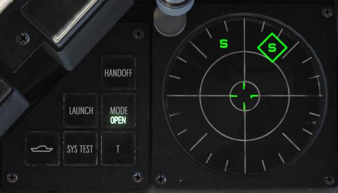
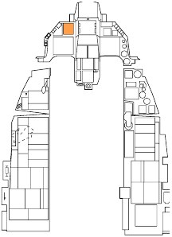
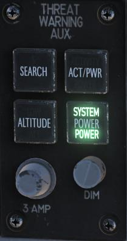
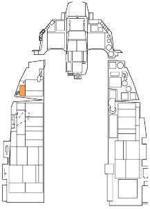
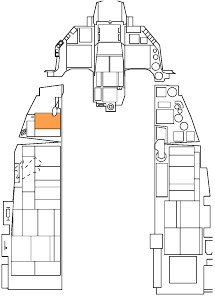
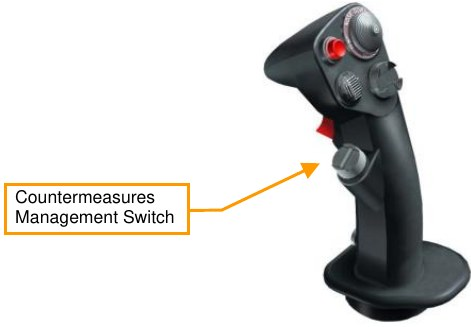
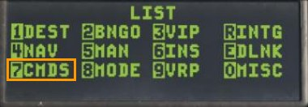
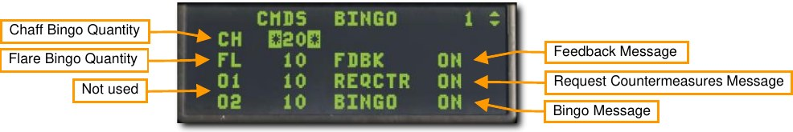
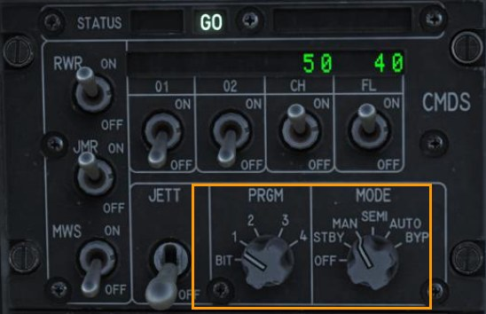
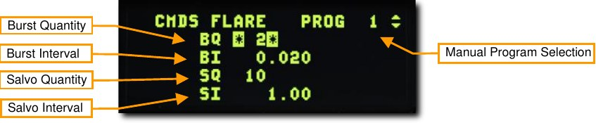

# Defensive Systems

## Azimuth Indicator (RWR)

Detected radars are displayed on the Azimuth Indicator (aka Radar Warning Receiver).

The Azimuth Indicator is a circular-shaped display on the left of the front dash that provides you a visual
representation of radar emitters around your aircraft. The display is in planview with your aircraft in the center.
As threats are displayed around the center of the display, the icons represent the azimuth direction to the threat.

For example: an icon of the left side of the display would indicate an emitter located off your left. In addition to
the icons, an audio system will alert you to the status of the radars detected (search, track, and launch).

The locations of radar emitters on the display do not necessarily correlate to emitter range from your aircraft.

The distance of the threat icon from the center of the display indicates radar signal strength. The closer the icon
is to the center of the display generally indicates the closer the radar is to you. Any time a new emitter symbol is
displayed on the azimuth indicator status change tone is generated by the system. Special tones are also
generated for specific threats or critical threat modes of operation.

A symbol can have three states on the display:

- If a symbol is displayed with no circle around it, it indicates that the radar is in acquisition/search
mode. When a new emitter is detected, a new threat tone will be heard.
- If a symbol has a steady circle around it, it indicates that the radar is tracking/locked on to your
aircraft. When being tracked by an engagement radar, you will be provided a radar lock tone.
- If a symbol has a flashing circle around it, it indicates that the radar is supporting a missile that has
been launched at you. When being launched on by a radar-guided missile, you will hear a missile
launch tone and the LAUNCH light to the left will illuminate.

Indicator lights and buttons are located just to the left of the display.

{ align=left }

**HANDOFF**. Not applicable.

**LAUNCH**. Illuminates when a missile launch is detected.

**MODE**. This button toggles between OPEN that can display the 16
highest priority threats or PRI that will only show the five highest threats.

**UNKNOWN SHIP**. Toggles display of emitter symbols of unknown
weapon systems on and off.

**SYS TEST**. Initiates the system self-test.

**T (TGT SEP)**. Separates symbols that cover each other on the azimuth
indicator; the symbol with the highest threat priority remains in the right
place.

The Threat Warning Aux panel on the left auxiliary console is used to power the RWR on and off.

**SEARCH**. Not used.

**ACT/PWR**. Not used.

**ALTITUDE**. Not used.

**POWER**. Toggles RWR system power on and off.

## Countermeasures Dispensing Set (CMDS)

Selection and release of countermeasures (chaff and flare) is accomplished through a cockpit panel, HOTAS
controls, and a Data Entry Display (DED) page.

### CMDS Control Panel

The left auxiliary console is dominated by the countermeasures dispensing system. This system provides
protection against tracking radar, air-to-air and surface-to-air missiles. Protection is provided by ejecting chaff or
flare.

**Status Display**. The left side displays the status of the CMDS, GO or NO GO. The right side displays
DISPENSE READY when manual consent is required to dispense countermeasures in the SEMI or AUTO
mode.

**RWR and JMR Source Switch**. These do not control power to the RWR or ECM (Jammer) but rather enable
their data to be used by the CMDS for dispensing in the SEMI or AUTO modes.

**MWS Switch**. The missile warning system is not applicable to the block 50 f-16C.

**JETT Switch**. This enables jettisoning of countermeasures when positioned up to JETT. This switch functions
even when the CMDS is turned off.

**Quantity Indicators**. The quantity remaining of each countermeasures type is displayed. LO is displayed when
the bingo level set on the DED is reached. System failure messages are also displayed in these fields when
applicable.

**CH (Chaff) and FL (Flare) Switch**. These switches must be enabled to allow dispensing of chaff or flare
countermeasures.

**PRGM Knob**. This selects one of four pre-set countermeasures programs to be dispensed by HOTAS
command CMS forward.

**MODE Knob**. This selects the CMS operating mode.

- MAN – The selected manual program may be dispensed by positioning the CMS forward.
- SEMI – The aircraft systems determine the program to be dispensed based on the threat. Consent to
dispense must be given by positioning the CMS aft.
- AUTO – The aircraft systems determine the program to be dispensed based on the threat.
Countermeasures are dispensed automatically. This mode must also be enabled by positioning the
CMS aft. It may be disabled by selecting CMS right.
- BYPASS – This is selected to allow manual dispensing of countermeasures when failures prevent the
other modes from working.

### HOTAS

On the stick, there is a four-place switch for countermeasures.

**Center**. This is the OFF position and no dispense action is taken.

**Forward**. This dispenses the manual program selected on the CMDS Panel with the PRGM knob.

**Aft**. This gives consent to dispense the requested program when the MODE knob is in SEMI. This also enables
the AUTO mode when the MODE knob is in AUTO.

**Left**. No function.

**Right**. This disables the AUTO dispense mode.

### CMDS DED Pages

The CMDS upfront controls are accessed from the LIST page by pressing 7 on the ICP. Pages may be cycled
through by positioning the DCS switch right to SEQ.

The default bingo quantities for CH (chaff) and FL (flare) are listed on the first page. These quantities may be
changed by placing the CMDS Mode knob in STBY and entering the new bingo quantity in each field.

Three voice message options may also be toggled on or off from this page.

**Feedback (FDBK)**. This enables or disables the ‘Chaff Flare’ audio message that plays when a
countermeasures program has been initiated.

**Request Countermeasures (REQCTR)**. This enables or disables the ‘Counter’ audio message that plays when
consent to release countermeasures is requested in the SEMI or AUTO mode.

**BINGO**. This enables or disables the ‘Low’ or ‘Out’ audio message that plays when the bingo quantity is
reached, or all countermeasures have been expended.

The next DED pages display the number of countermeasures and interval between release for each
countermeasure type. The values may be changed by manually inputting new quantities and intervals. The
CMDS Mode knob should be set to STBY before changing the programs using the DED pages.

The values shown are for the program displayed at the top right of the page. Any of the four programs may be
changed using the Increment/Decrement switch on the ICP to select each in sequence. The pages for chaff and
flare are identical so only the flare page is shown below.

**Burst Quantity**. The number of countermeasures released per burst.

**Burst Interval**. The interval in seconds between countermeasures per burst. This is usually a very small value.

**Salvo Quantity**. The number of bursts commanded when release consent is given.

**Salvo Interval**. The time in seconds between each burst.

In the example above, two flares will be released every second for 10 seconds.

{!abbr.md!}
