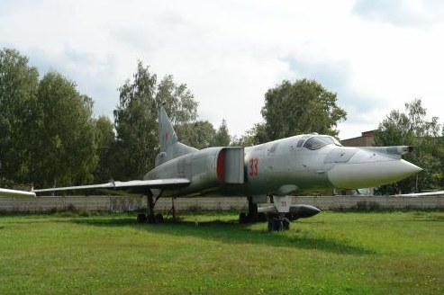
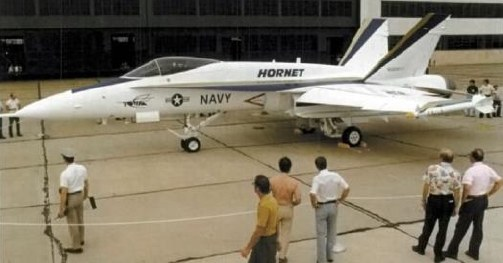

# Aircraft History

The McDonnell-Douglas F/A-18 Hornet was a groundbreaking aircraft from its very first flight. It holds
the honors of being of the US Navy’s first carrier-based true multirole fighter, the first aircraft with
carbon-fiber wings, and the first fighter aircraft with a fully digital fly-by-wire flight control system.
What began as the “loser” of the US Air Force’s LWF program evolved into a prolific front-line fighter
and attack aircraft that served the needs of the United States and seven other countries for nearly
forty years.

## The VFAX Programs

{ align=right }

In the early 1960s, the US Navy’s principal
concern was the fleet defense mission. The
discovery of the Tu-26 “Backfire” by US
intelligence caused worry among Navy
admirals that the Soviet Union would soon be
capable of attacking carrier fleets, launching
sea-skimming cruise missiles from well
outside the defensible range of the carrier.

In response to this new threat, the Navy
began the VFAX program, intended to
develop a long-range, highly maneuverable
air superiority and fleet defense aircraft. The
program mirrored the US Air Force’s
concurrent F-X program, which ultimately
resulted in the F-15 Eagle. VFAX was intended to replace the Navy’s aging fleet of fighter aircraft,
especially the F-111Bs, which were seen as very lacking in the fleet defense role.

{ align=right }

Grumman Aerospace proposed combining its design experience with the F-111B and the A-6 Intruder
to produce a new aircraft, named Design 303.
The new aircraft would be built around a pair of
new technologies originally developed for the F-
111B: the powerful AN/AWG-9 radar and the
long-range AIM-54 Phoenix missile.

The combination of the AWG-9 and AIM-54,
placed in a smaller, more agile airframe, was
compelling enough to convince the Navy to
restructure the design requirements of the VFAX
program. The result was the VFX program, which
ultimately produced the F-14 Tomcat, the Navy’s new frontline fleet defense and air superiority
fighter.

The F-14 enjoyed immediate success as a fleet defense aircraft, but by the 1970s, it became
apparent that it was too expensive and maintenance-heavy to supplant all existing Navy fighters. The
Secretary of Defense, William H. Clements Jr., ordered the Navy to seek proposals for a smaller,
cheaper alternative to the F-14. Grumman responded with a proposal for the F-14X, a lightweight,
less expensive variant of the F-14. McDonnell-Douglas suggested navalizing the F-15. Both of those
were rejected by Clements.

{ align=right }

At the time, the only two major proponents of the lightweight
multirole fighter concept were VAdm. Kent Lee, commander of
Naval Air Systems Command (NAVAIR), and VAdm. William
Houser, Deputy Chief Naval Officer. Though Houser and Lee had
very different ideas of what a multirole fighter would look like, they
were alone among the Navy brass in believing that the future of
the combat aircraft was multirole capability.

Lee’s motivations stemmed partially from his experience at sea,
where he estimated that around fifty man-hours of maintenance
effort were being expended for every one hour an aircraft spends
in-flight. When Lee was selected to serve as NAVAIR’s Commander,
he began to advocate for a single airframe that could replace F-4s,
A-7s, and A-4s. Likewise, Houser had become disillusioned with the
existing Navy doctrine during his deployments, seeing firsthand the
difficulty in flying and maintaining numerous types of aircraft, each
with their own maintenance practices and parts requirements.

Now that the F-14 had been swept aside as a potential replacement for the Navy’s fleet of fighter and
strike aircraft, Lee saw an opportunity to realize his vision. After doggedly advocating his viewpoint to
Clements, Clements went along with Lee’s recommendation, and Lee was given the green light. The
Navy then began another VFAX program under Lee’s stewardship, this time with a greater emphasis
on multirole capability.

Lee’s opinions were still unpopular with the other admirals, which made it difficult for Lee to secure
Congressional funding for the new project. Concurrent with the VFAX proposals, the US Air Force had
also been looking for a lightweight fighter (LWF) to complement its expensive F-15s. The House
Armed Services Committee, looking to reduce costs, ordered the Navy and Air Force to combine their
efforts. Funding was diverted from VFAX into a new program, titled Navy Air Combat Fighter (NACF).
NACF would be a new naval aircraft developed from the contenders already participating in the Air
Force’s LWF competition.

## The YF-17 “Cobra”

{ align=right }

Five defense companies submitted proposals
for the LWF competition, but only two were
selected to participate: Northrop and General
Dynamics. Northrop had already developed its
popular F-5E Tiger II into an internal project
titled N-300. The N-300 added distinctive
leading-edge root extensions (LERX) and
more powerful engines to the F-5E, among
other improvements. The N-300 evolved into
the P-530, which modified the design of the
LERXes, giving the P-530 much improved
maneuverability at high angles of attack.
Northrop selected the P-530 as its LWF
contender, slightly modifying it into the P-600. General Dynamics meanwhile had
produced the Model 401, later designated the
YF-16, and both companies were awarded
contracts of approximately $38 million to develop their proposals into functional prototypes.

International and domestic interest in the LWF program grew, and with it the stakes of the
competition. In response to the ballooning
demand, the USAF merged the LWF program
into the new Air Combat Fighter (ACF) program. The ACF program solidified the requirement that the
LWF contenders be truly multirole aircraft.

The YF-16 and YF-17 were tested by the US Air Force in a series of trial flights, and in 1975, the YF-
16 was selected to be the new USAF lightweight fighter. The YF-16 had superior acceleration, climb
rates, endurance, and turn rate. Its selection as the winner of the LWF competition secured it
numerous procurement orders among the USAF and NATO allies.

Because the NACF program ran simultaneously with the ACF program, both General Dynamics and
Northrop had also developed naval variants of their contenders. Neither firm had prior experience
developing carrier aircraft. General Dynamics paired with Vought to develop the Vought Model 1600,
a proposal for a strengthened, carrier-capable F-16; Northrop paired with McDonnell-Douglas to
propose the F-18, a carrier-capable YF-17 variant.

Though the YF-16 had won the USAF competition, the Navy wasn’t happy with its single engine and
narrow landing gear. Thus, in 1975, The Navy announced its selection of the YF-17, which was to be
transformed into a carrier-based multirole combat aircraft.

## Development of the F-18

McDonnell-Douglas and Northrop combined forces to develop the YF-17 into the F-18, then called
Model 267. Both companies agreed to split manufacturing responsibilities evenly: McDonnell-Douglas
would build the forward fuselage, wings, and stabilators; Northrop would build the center and aft
fuselage components and the vertical stabilizers. Final assembly would be at McDonnell-Douglas.

The F-18 was largely similar in appearance to the YF-17 but underwent many structural and exterior
changes to meet the stringent requirements of a carrier-based aircraft. The entire aircraft was
strengthened to withstand the forces of carrier launch and recovery, and the undercarriage and
tailhook were enlarged and fortified. The wings and stabilizers were enlarged, and the fuselage
widened, and the extra size was used to boost the internal fuel capacity by 4,460 pounds, sufficient
to meet US Navy blue-water reserve requirements. A fully digital fly-by-wire system with quadruple-
redundant flight control computers was added, making the F-18 the first fighter aircraft with such a
control system. Accessories were added to support catapult launches. In all, the modifications
brought the gross weight of the F-18 to 37,000 pounds, a 10,000-pound increase over the YF-17.

Originally, the F-18 was to be developed in
three variants: An F-18 fighter variant, an A-
18 attack variant, and a TF-18 trainer
variant. The F-18 and A-18 variants would
later be combined when improvements in the
avionics and weapons capability of the
aircraft allowed a single variant to perform
both roles effectively. On March 1, 1977, the
F-18 was given the “Hornet” moniker.

McDonnell-Douglas agreed to be the prime
contractor for the naval F-18, with Northrop
taking ownership of the proposed land-based F-18L export variant. The F-18L would never come to
fruition, and Northrop and McDonnell-Douglas would end their partnership on bad terms when export
variants of the F-18A drew sales away from the upcoming F-18L. Northrop would later sue
McDonnell-Douglas, claiming that the latter illegally used technologies developed by Northrop for the
F-20 Tigershark, a lawsuit that ultimately ended in a settlement award of $50 million paid to
Northrop. In exchange, McDonnell-Douglas was free to sell the F-18, both internationally and
domestically.

On September 13, 1978, the first production F-18 Hornet rolled off the assembly line. Unlike previous
aircraft, which underwent flight testing at their place of manufacture, the F-18 was flight-tested at
the Naval Air Test Center at Patuxent River, Maryland. Its first production flight occurred in
November 1978, launching from Pax River, and flown by a US Navy-trained test pilot instead of a
civilian employed by the manufacturer.

## F/A-18A and B Deployment

Following the completion of Navy flight testing,
the F-18A and B models began appearing at
fleet replacement squadrons (FRS) on both
coasts. VMFA-314, based at MCAS El Toro,
became the first squadron to receive the F-18
in January 1983. On April 1, 1984, the
Secretary of the Navy announced that the new
aircraft would be designated the F/A-18
Hornet, in recognition of its multirole
capability.

The F/A-18 spent a short amount of time
grounded prior to its first deployment, after
fatigue cracks began appearing on the vertical
stabilizers. The cracks were found to be due to
the turbulent airflow from the LERXes that passed across the stabilizers. The stabilizers were
strengthened and the LERXes were redesigned. Years later, small fences would be placed atop each
LERX, to divert tip vortices away from the stabilizers. These changes additionally gave the Hornet a
small boost in controllability at high angles of attack.

The Hornet saw its first combat deployment
between February and August of 1985, aboard
the USS Constellation. Naval aviators were
pleased with its reliability in contrast to the F-14. In April 1986, F/A-18s saw action for the first time
aboard the USS Coral Sea, on deployment off the coast of Libya for Operation Prairie Fire, with VFA-
131, VFA-132, VMFA-314, and VMFA-323 aboard.

The A and B model Hornet was also awarded the distinct privilege of being selected as the eighth
aircraft type to be flown by the US Navy’s Blue Angels, replacing the A-4 Skyhawk in November 1986.

In total, more than 400 F/A-18A and B Hornets were produced.

## F/A-18C and D Deployment

In 1987, development of the F/A-18C began, commencing with Lot 10. The C and D models
incorporated numerous improvements, including upgraded avionics that added the ability for the
Hornet to employ advanced, modern weapons such as the AIM-120 AMRAAM, AGM-65 Maverick, and
AGM-84 Harpoon. Lot 10 also added the airborne self-protection jammer (ASPJ) and a ground-
mapping synthetic aperture radar.

As with the A and B models, the F/A-18C was the single-seat variant, the D having two seats. The D
model could be configured either as a training variant or as an all-weather strike craft, as used by the
Marines.

In 1989, the C and D models were further upgraded with expanded night attack capability by
including the AN/AAR-50 navpod, the AN/AAS-38 forward looking infrared (FLIR), the LITENING II
targeting pod, and night vision goggles. 1989 also saw the Hornet gain three full-color multipurpose
displays, including adding color moving-map capability to the center AMPCD.

In 1989, during the first Gulf War, F/A-18
Hornet pilots successfully shot down two
MiG-21s during a strike mission. The
pilots were able to switch from the air-to-
ground to air-to-air role, destroy the MiGs
within 40 seconds of the E-2C’s initial
contact, then swap back to air-to-ground
and complete their strike, cementing the
credibility of the multirole concept. (You
can play an Instant Action mission
inspired by these events in DCS, if you
own the Persian Gulf map.)

Through the 1990s, US F/A-18Cs and Ds
served in Operation Southern Watch and
Operation Enduring Freedom while
continuing to see further technology
improvements. The F404-GE-402 turbofan engine was incorporated in 1992, adding 10% more static
thrust. In 1993, Hornets began equipping the AN/AAS-38A laser target designator/ranger (LTD/R),
giving them the ability to target their own laser-guided munitions. A year later the avionics received
another bump, swapping the venerable AN/APG-65 for the powerful and precise AN/APG-73 attack
radar.

Production of the F/A-18C and D Hornets ended in
August 2000. The last C model was assembled in
Finland for the Finnish Air Force. Hornets continued to
serve the US for the next two decades. The C model’s
last cruise was aboard the USS Carl Vinson, which
ended in April of 2018, whereupon the Navy
announced that the C models would be retired from
combat duty in February 2019. The aircraft was
honored with a retirement ceremony, but a few C-
model Hornets continued to fly in training duty as
aggressor aircraft, or in the service of the Blue Angels.

The final flight of an F/A-18C for the US Navy was on
In all, nearly one thousand C and D model Hornets were produced, and C models served in the
armed forces of eight countries. Though the United States has retired the C-model Hornets, the
model still serves in the Royal Canadian Air Force, the Finnish Air Force, the Kuwait Air Force, and the
Swiss Air Force.

The US Navy has since replaced its carrier fighter fleet with the F/A-18E and F Super Hornet,
representing a major leap forward in the Hornet’s capability and lethality on the battlefield. Though
the E and F models share the name and same basic appearance as the C and D models, they are a
completely different design, with enlarged fuselage and wings, an entirely new avionics suite and
cockpit, upgraded engines, and many other improvements.

There are three US Navy F/A-18C Hornets on display in the US, with more coming as the Blue Angels
transition to the F/A-18E and F models:

 • BuNo 163106, painted in Blue Angels #2 livery, is at the Museum of Flight in Seattle, WA
 • BuNo 163439, painted in Blue Angels #1 livery, is at the Smithsonian Air and Space
Museum in Washington, DC
 • BuNo 163437 is outside the Headquarters, Naval Air Force Atlantic, at Naval Station Norfolk
in Virginia
