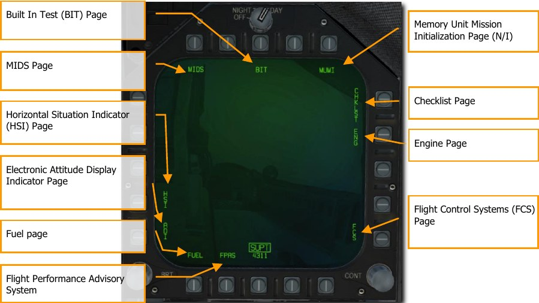
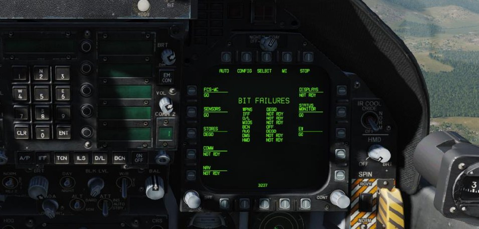
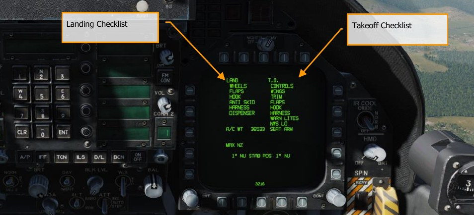
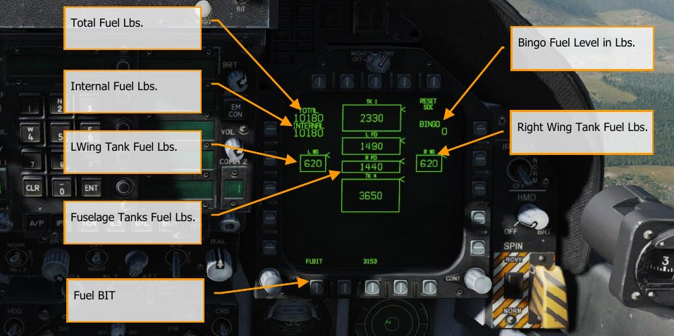
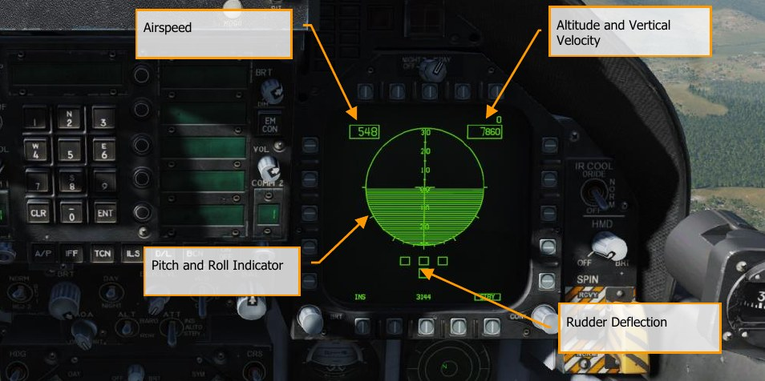
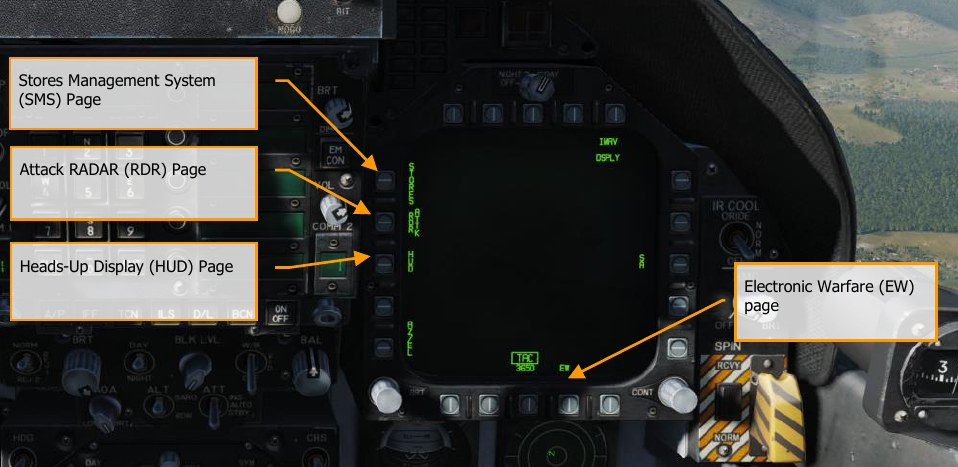
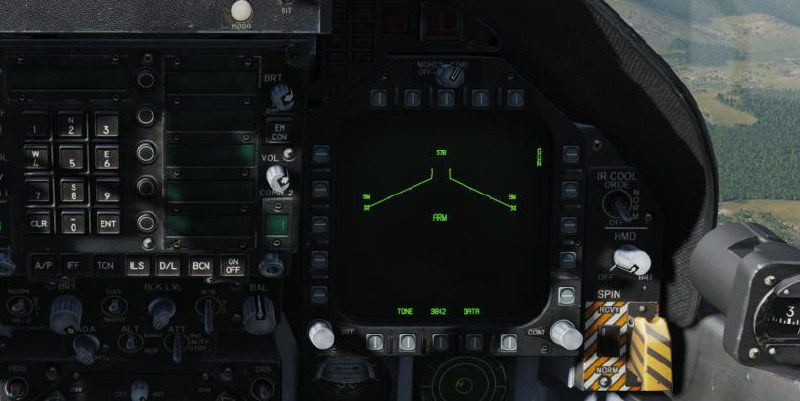
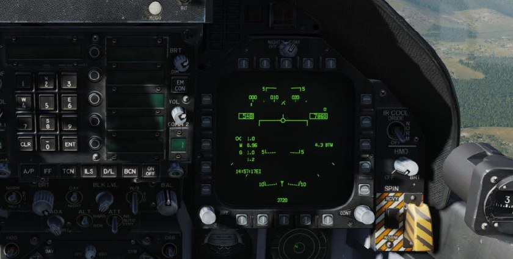

# DDI and AMPCD Pages

In addition to the physical controls of the Hornet cockpit, much of your interaction will be through the
multitude of pages on the left and right Digital Display Indicators (DDI) and the central Advanced
Multipurpose Color Display (AMPCD). The AMPCD is commonly referred to as just the MPCD.

Before we discuss common Hornet procedures, let’s review some of the more important DDI and
MPCD pages you’ll use. There are two primary pages in which all other pages are selected from: The
Support (SUPT) page and the Tactical (TAC) page. You can toggle between these pages, or return to
them, by pressing the pushbutton marked MENU. When airborne, the MENU pushbutton converts to
a timer, but still acts as a MENU button.

## Support (SUPT) Pages

### Built In Test (BIT) Page

The Hornet consists of a numerous sub system, each with has its own
built in test system. This page allows the pilot to test these systems and view their status.

### MIDS Page

See Hornet Datalink, Situational Awareness Page, and IFF. \\link

### Checklist (CHKLST) Page

In addition to providing checklists for landing and takeoff, this page
also displays aircraft weight and stabilator position.

- **STAB POS**. The horizontal stabilizer position, in degrees followed by NU (nose up) or ND
 (nose down). Takeoff trim position is 12° NU.
- **Maximum vertical g**. Maximum vertical acceleration experienced during the most recent
landing, rounded to the nearest .01 g.
- **Aircraft weight**. The aircraft gross weight rounded to the nearest pound.
Landing Checklist Takeoff Checklist

### Engine (ENG) Page

The Engine page provides important engine performance data for both
engines, which often duplicates engine data on the IFEI such as engine RPM, engine temperature,
fuel flow, and oil pressure. Most often though, you will be using the IFEI to check engine
performance.

- **INLET TEMP**. Engine inlet temperature in °C.
- **N1 RPM**. Fan speed in % rpm.
- **N2 RPM Compressor speed in % rpm**.
- **EGT**. Exhaust gas temperature in °C.
- **FF**. Fuel flow in pounds per hour.
- **NOZ POS**. Nozzle position in %.
- **OIL PRESS**. Oil pressure in psi.
- **THRUST**. No function.
- **VIB**. Engine vibration in inches per second.
- **FUEL TEMP**. Engine inlet fuel temperature in °C.
- **EPR**. Engine pressure ratio (ratio of exhaust pressure to ambient inlet pressure). EPR is a
ratio of exhaust pressure to ambient total inlet pressure. On all aircraft, EPR is valid only
during ground static conditions.
- **CDP**. Compressor discharge pressure in psia.
- **TDP**. No function.

### Flight Control System (FCS) Page

The FCS page displays monitoring data of the flight control
surfaces like the leading and trailing edge flaps, ailerons, rudders, and stabilator. It will also note any
FCS errors noted in the four channels as “Xs”. This page also displays the g limit based on aircraft
gross weight.

The FCS status display may be selected on a DDI. At top center, the display presents left and right
leading-edge flap (LEF), trailing edge flap (TEF), aileron (AIL), rudder (RUD), and stabilator (STAB)
positions in degrees with arrows which indicate the direction from neutral. For example: the control
positions shown in the figure are left LEF 1° leading edge down, right LEF 1° leading edge down, left
TEF 5° trailing edge down, right TEF 5° trailing edge up, left AIL 15° trailing edge down, right AIL
15° trailing edge up, both RUD 0°, left STAB 3° trailing edge down, right STAB 4° trailing edge up.
The tolerance for all control position indications is ±1°. The numbers and arrows change as control
surface deflections change. At 0° (neutral), the arrows may point in either direction. A blank is
displayed where the number is unreliable.

An X through the LEF, TEF, AIL, or RUD number, also referred to as a bold X, indicates that control
surface is no longer being commanded.

On either side of the position indicators are boxes which represent the FCS channels. On the left side,
reading left to right, the boxes represent channels 1 and 4 for the LEF, AIL, and RUD and 1 2 3 4 for
the TEF and STAB. An X in one of these boxes indicates that the FCS is no longer using that channel
to command the actuator due to a failure. On the right side, reading left to right, the boxes represent
channels 2 and 3 for the LEF, AIL, and RUD and 1 2 3 4 for the TEF and STAB. On the lower right
side of the DDI are boxes which display the status, by channel, of the CAS pitch (P), roll (R), and yaw
(Y); the stick position sensors (STICK), the rudder pedal force sensors (PEDAL); the angle of attack
sensing (AOA); the backup air data sensor assembly (BADSA); and the processor (PROC); and the
normal accelerometer (N ACC) and lateral accelerometer (L ACC). An X opposite one of these
components indicates a failure in the channel with the X. An X opposite degraded (DEGD) indicates a
switch failure or, for the TEF and STAB, a single shutoff valve failure. Flight controls are not affected
but the FCS should be reset.

Except for the LEFs, the control surface position may fail to match the commanded position without
indication to the aircrew.

An X in both CH1 and CH3 of PROC row indicates INS data is not being provided to the FCCs for
sideslip and AOA estimation calculations. There is no significant degradation to flying qualities,
departure resistance or roll performance with these failure indications. (Above approximately 30°
AOA in Flaps AUTO, the FCCs use INS data for sideslip and sideslip−rate feedback to provide roll
coordination and departure resistance. If INS data is not available, sideslip control, departure
resistance and roll performance may be slightly degraded). The PROC X’s in CH 1/3 may be caused
by: an INS failure, accompanied by an INS ATT caution; by placing the ATT switch to STBY; or by an
FCC−detected failure.

### Fuel (FUEL) Page

The FUEL display, which is menu selectable, is available in-flight and on the
ground. Displayed is the fuel available in each tank, total internal fuel, total internal and external fuel,
and currently selected BINGO fuel. A moving caret is shown on the right side of each tank to indicate
the ratio of fuel available to tank fuel capacity. The loss of valid fuel quantity information for a given
tank is indicated by display of 0 pounds fuel and INV (invalid). Loss of valid information is as follows:

- All probes in a tank declared invalid by the SDC (except left or right feed tanks).
- Tank 1 aft probe invalid while forward probe reads zero fuel.
- Tank 4 forward and center probes invalid while aft probe reads zero.

An estimated (EST) fuel quantity is determined by the SDC and displayed as follows:

- Use only the valid fuel probes in a multi-probe tank to estimate fuel available.
- Fuel probe invalid in left or right feed tank:

    - Display 0 pounds if FUEL LO is present.
    - Display 800 pounds if FUEL LO is not present.

The internal fuel and total fuel indications display the sum of valid and/or estimated tank quantities.
Each is cued as EST or INV as determined by the appropriate tank information with INV displayed if
INV and EST both apply.

The FLBIT PB will perform a test of the FUEL LO warning system. During the test, the FLBIT label will
be boxed. During the test, you should note a FUEL LO caution, a voice alert, and a MASTER CAUTION
indication. The full test takes 13 seconds. If tank two (L FD) or tank three (R FD) is already in a fuel-
low state prior to BIT initiation, NO TEST will be displayed next to the respective tank indication. If
tank 2 fails the BIT, tank 3 will not be tested, and NO TEST will be displayed. The FUEL LO caution
will be cleared within 60 seconds of test completion.

### Electronic Attitude Director Indicator (EADI) Page

The electronic attitude display indicator is
available for display on the left or right DDI as an alternative to the attitude display on the HUD. A
small circle is displayed on the ball to represent the zenith and a circle with an inscribed cross is
displayed to represent the nadir. The pitch ladder is displayed in 10° increments. A turn indicator
which displays FCS yaw rate is provided below the ball. A standard rate turn (3° per second) is
indicated when the lower box is displaced so that it is under one of the end boxes. The EADI display
is selected by pressing the ADI pushbutton on the MENU.

Selecting the INS or STBY options at the bottom of the display determines the source of attitude
information used to generate the display. Upon power-up with WOW, the EADI attitude initializes to
STBY (STBY boxed), thus using the standby attitude reference indicator for attitude source
information. With STBY boxed the EADI display should be compared to the visual display on the
standby altitude reference indicator. If the pitch and roll attitude display does not correlate on the
two instruments, the standby indicator is most likely defective, requiring maintenance. Selecting the
INS option (INS boxed) uses attitude information provided by the INS. Selection of the INS or STBY
on the EADI does not change the source of attitude data for the HUD.

Airspeed and altitude are displayed in a box at the top left and altitude source is displayed to the
right of the altitude box and the vertical velocity is displayed above the altitude box. When ILS is
selected, the deviation needles are displayed in reference to the waterline symbol. The ILS needles
are in yellow when COLOR is selected on the Attack display.

### Horizontal Situation Indicator (HSI) Page

Mostly displayed on the MPCD, the HSI provides a
top-down navigation display with your aircraft in the center. The HSI will be discussed in Hornet
Navigation. \\link

When displayed on the MPCD, a moving map can also be projected.

### Flight Performance Advisory System (FPAS) Page

The FPAS advises the pilot of the altitude
and airspeed corresponding to maximum inflight fuel efficiency based on current operating
conditions. The range and airspeed data provided by FPAS appears on the FPAS DDI page from the
SUPT menu. The page is divided into five data areas and two select options.

- Current Range
- Current Endurance
- Optimal Range
- Optimal Endurance
- TACAN and Waypoint Navigation To
- Optimal Climb
- Home Fuel

Let’s talk about each of these in reference to the image below.

**Current Range Data**. This informs you of the current range of the aircraft until only 2,000 lbs. of
fuel remains. This is based on the current altitude and Mach. In the example below, this is 329 nm.
When total fuel is less than 2,500 lbs., the TO 2000 LB changes to TO 0 LB and the data is in
reference to zero fuel remaining. If true airspeed is above Mach .9, the range data is removed
because they system is unable to calculate valid data.

Below is the data for BEST MACH and this lists the best Mach to fly to extend range at the current
altitude. In the example below, this is .54 Mach.

The bottom line of CURRENT RANGE lists the calculated range if the aircraft is flown at the optimal
Mach at the current altitude. In the example below, this is shown as 586 nm.

**Current Endurance Data**. The top line of the ENDURANCE indicates the time in hours:minutes the
aircraft can fly at the current Mach and altitude. This is shown as 27 minutes in the image below. If
total fuel is less than 2,500 lbs., the TO 2000 LB changes to TO 0 LB. If ground speed is above .9
Mach, the time is displayed as LIM (limit).

Below is the optimal Mach to fly to maximize flight endurance time at the current altitude. This is
displayed as .41 Mach in the example below.

The bottom line indicates the flight endurance time if the aircraft is flown at best Mach at the current
altitude. This is shown as 1 hour and 54 minutes.

**Navigation To Data**. Below the Current data is listed the time to reach, fuel remaining in lbs., and
fuel burn rate as lbs. per nautical mile of a selected TACAN station or waypoint. From the HSI, box
TCN or WYPT with a valid navigation point and the time, fuel remaining, and burn rate is
automatically calculated for you.

**Optimal Range Data**. The Optimal Range shows the altitude and Mach at which to fly to achieve
maximum range to 2,000 or 0 lbs. of fuel remaining. In the example above, this is shown as 37,900
feet, at Mach .84, with a range of 1,012 nm with 2,000 lbs. of fuel remaining.

**Optimal Endurance Data**. This shows the altitude and Mach to fly to achieve the maximum flight
endurance time in hours:minutes to 2,000 or 0 lbs. of fuel remaining. In the example above, this is
shown as flying at 33,001 feet, at Mach .71, for a maximum endurance time of 2 hours and 5
minutes.

**Optimal Climb Selection**. When the CLIMB option is boxed at pushbutton 20, the optimal climb
airspeed is displayed above the airspeed box on the HUD.

**Home Fuel Selection**. Using the up and down arrows on pushbuttons 16 and 17, you may
designate any waypoint as the HOME location. Generally, you would want to set this as your landing
waypoint. When it is calculated that 2,000 lbs. of fuel would remain upon reaching the location, the
Master Caution will activate, and the HOME FUEL caution is displayed on the DDI.

## Tactical (TAC) pages

### Electronic Warfare (EW) Page

The EW page combines the display of detected radar emitters,
control of Electronic Countermeasures (ECM), and control of expendable countermeasure that
includes chaff, flares, and ECM decoys.

### Stores Management System (SMS) Page

The SMS page allows you to view all loaded stores
and determine their delivery properties. We will discuss this page in detail in the weapon procedure
sections of this guide.

### Heads-Up Display (HUD) Page

The HUD page duplicates what is displayed on the HUD glass at
the top of the instrument panel. This is most often used when the HUD fails or is unreadable due to
lighting. It can also be useful when “head down” and unable to easily check the HUD.

### Attack radar (RDR) Page

See Air-to-Ground Radar and Air-to-Air Radar for details.

