# Hornet Air-To-Air (A/A)

For air-to-air weapon employment, you will need to be airborne with landing gear up and have the
Master Arm switch set to ARM and A/A selected. When the Master Mode switch in in SAFE, the
priority weapon indications on the HUD and radar will have an “X” through them. When in SAFE
mode, the SIM training option is available.

## Air-to-Air Radar

Perhaps the most important sensor of the F/A-18C is its’ AN/APG-73 radar. The AN/APG-73 is an x-
band, all-weather, coherent, multimode, multi-waveform search-and-track sensor that uses
programmable digital processors to provide great flexibility in air-to-air tasks.

### Basic Air-to-Air Radar Information

The AN/APG-73 is a pulse-Doppler, look-down / shoot-down radar with both Beyond Visual Range
(BVR) and close in, Air Combat Maneuvering (ACM) modes of operation.

The air-to-air radar display uses a standard B-scope format in which the ownship (your aircraft) is in
the bottom center of the display. As such, all indications on the b-scope are ahead of the ownship.
Targets on the scope are displayed in range from the closest being at the bottom and the more
distant being toward the top. Contacts left and right of the ownship are represented as being indicted
left and right of the center of the display to indicate azimuth.

Important, basic components of the b-scope include:

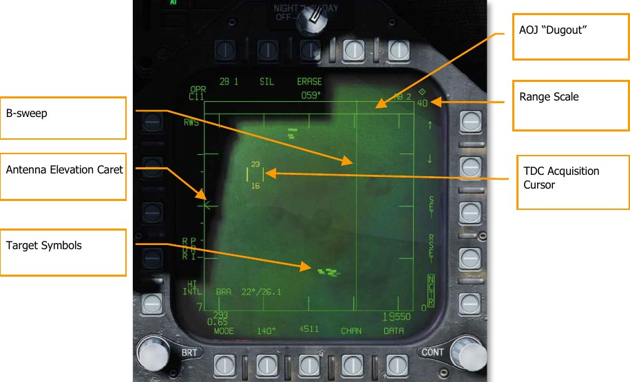

**B-sweep.** The B-sweep is a vertical sweep on the display that indicates the instantaneous azimuth
position of the radar antenna.

**Antenna Elevation Caret.** The antenna elevation caret symbol indicates antenna elevation in the
vertical plane. The symbol is pitch and roll stabilized in reference to the ownship horizontal plane. In
search modes, the symbol responds to the radar elevation control on the throttles.

**Range Scale.** The right side of the b-scope represents radar range. The scale includes marks for ¼,
½, and ¾ of the selected radar range.

**TDC Acquisition Cursor.** Consisting of two parallel, vertical lines, this cursor is moved in response
to Throttle Designation Control (TDC) commands on the throttles. When in a radar search mode, the
altitude band being covered by the radar beam is indicated above and below the cursor. When placed
over a target symbol, the contact’s airspeed is indicated to the left of the cursor and its altitude is
displayed to the right.

**Target Symbols.** Target symbols are displayed as solid rectangles (bricks). The horizonal position of
the target symbol indicates angular position in respect to ownship heading. The vertical position
indicates range.

**AOJ “Dugout”.** Targets that are denying the radar range information are placed at the top of the b-
scope in the Angle on Jam (AOJ) “dugout”. Only target azimuth information is available.

**Pushbuttons.** Around the periphery of the radar display are 20 buttons that can be used to control
radar modes and parameters. Depressing a button will enable or disable the function, or successive
depressions will cycle through all available options for that function.

### A/A Waypoint and Bearing and Range

To gain better situational awareness of the location of other aircraft, both an air-to-air waypoint (A/A
Waypoint), also referred to as a bullseye, and bearing and range indicators can be displayed on the
A/A radar format. These can be particularly useful in reference to position information from AWACS
and other flights and being able to send informative messages to your teammates.

#### A/A Waypoint

The A/A waypoint must coincide a waypoint in your waypoint database. It is therefore necessary that
the selected air-to-air waypoint is exactly at the same position where the bullseye is set for the
upcoming mission! In the mission editor, a waypoint from your F/A-18C is placed on your coalition
bullseye for this purpose. To make the corresponding waypoint an air-to-air waypoint, press
pushbutton 2 (A/A WP) on the DATA subpage of the HSI; this will make the waypoint on the bullseye
the selected air-to-air waypoint.

Note that you may need to use the pushbuttons 12 and 13 at the HSI or HSI DATA subpage to
change the current waypoint until the A/A waypoint is displayed. The DATA subpage of the HSI will
display “BULLS” at the top of the display, and the HSI itself will display “BULLS” at the top right when
the A/A waypoint is selected.

With an A/A Waypoint created, it will then be visible on the A/A radar format as either a circle or
diamond with an arrow that points to magnetic north. If the A/A Waypoint and the current waypoint
are the same waypoint, the symbol is a diamond. If, however they are different, the symbol is a
circle.
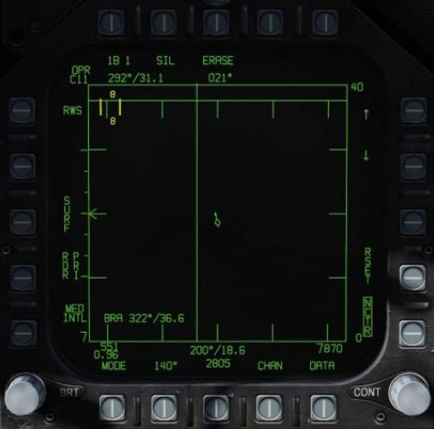

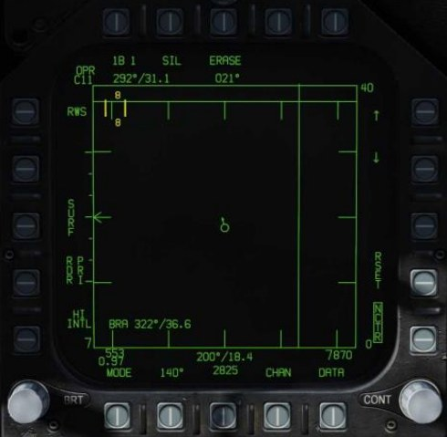

#### Bearing and Range Indications

The A/A Waypoint can now be used as bearing and distance reference:

- A/A Waypoint to TDC. In the top left of the A/A radar format page, the bearing and range
from the A/A Waypoint to the current TDC location is displayed.
- A/A Waypoint to Ownship. In the bottom center of the A/A radar format page, the bearing
and range from the A/A Waypoint to your location (ownship) is displayed.

Additionally, if BRA is enabled from the RWS / DATA sub-level, bearing and distance from yourself to
the TDC can also be displayed in the bottom left corner of the page.

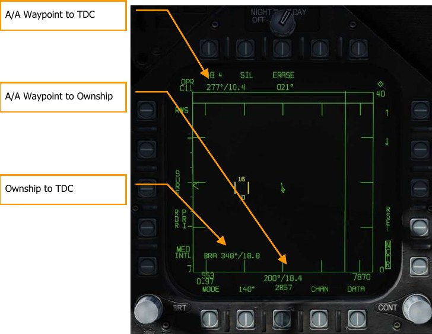

### Range While Search (RWS) Mode

Range While Search (RWS) is the default search mode for air-to-air or when an air-to-air missile is
placed in priority. RWS mode provides all-aspect (nose-on, tail-on) and all altitude (look-up, look-
down) target detection. The display shows range as the vertical axis and azimuth angle on the
horizontal.

While in RWS mode, the radar can maintain up to 10 trackfiles.

##### How to Use RADAR in Beyond Visual Range Mode

1. RADAR control switch on the Sensor Panel to Operate (OPR)
2. Master Mode switch to A/A or NAV (A/A and A/G unselected)
3. Select Attack RADAR (ATTK RDR) from the TAC page on the right DDI
4. Use Throttle Designator Control (TDC) to move the TDC cursor on the RADAR display
tactical area over a radar contact “brick”
5. Lock the target by pressing down on the TDC

Information and functions of RWS mode consist of:

Primary control of the air-to-air radar is done with the Throttle Designator Control (TDC). This can be
used to position the TDC cursor and pressed to initiate an action.

1. **Operational Mode.** When the radar operating and emitting, this indicator shows OPR.
When the radar is in standby mode, it displays as STBY. When the radar is switched off, a
crossed-out “RDY” is displayed.
2. **TDC Control Indication.** When the radar display is selected for TDC control, this
diamond symbol is displayed in the top right corner of the display. Selecting the radar for
TDC control is done by moving the Sensor Control Switch to the right. Note that the radar
is normally placed on the right DDI.
3. **Elevation Bar Scan.** When in RWS, successive presses cycle between 1, 2, 4 and 6 bars
of raster scanning. The greater the number of bars equates to a larger elevation volume
being scanned. However, the greater the number of bars equates to a longer period to
complete a complete scan (frame). Bar spacing is generally 1.3°; however, when 5 nm
scale is selected, it is 4.2°.

    The title of the pushbutton indicates the number of bars and the current bar. In the
    example image, “4B 1” indicates that the radar is scanning bar 1 of a four-bar scan.

4. **Silent (SIL) Mode.** When SIL mode is selected (boxed), the radar ceases scan operation
and places the radar in standby mode. This is also indicated by the Iron Cross shown in the
lower left portion of the display.

    When in SIL mode, the ACTIVE option is available in the top left corner of the display
     (replaces target aging indication). When pressed, the radar will conduct one complete scan
     / frame based on the current radar settings and properties. Once the scan is complete, it
    will automatically return to SIL mode.

5. **Erase.** By pressing the ERASE push button, all target history on the radar display is
removed until detected and displayed again. This also removes all history during Silent
 (SIL) operation. This can be useful when a long age time is selected.
6. **Heading.** Ownship heading in degrees. This is generally the magnetic heading, but true
heading can be selected from the HSI/DATA/A/C sublevel.
7. **Weapon and Number.** The name of the priority weapon and the quantity of the weapon
remaining.
8. **Display Range.** Selected display range of the radar. Possible settings are 5, 10, 20, 40, 80
and 160 nm.
9. **Range Increment.** Pressing this pushbutton increases the radar display range. When at
maximum range, the increment arrow is no longer displayed. The arrow and function is
removed if the radar is in STT mode.
10. **Range Decrement.** Pressing this pushbutton decreases the radar display range. When at
minimum range, the increment arrow is no longer displayed. The arrow and function is
removed if the radar is in STT mode.
11. **SET.** Pressing the SET pushbutton will save the radar settings for the weapon in priority.
This includes display range, elevation bar scan, azimuth, PRF, and target aging.
12. **RESET.** When pressed, the radar settings are returned to the default settings of the
weapon in priority.
13. **Altitude.** Ownship altitude.
14. **DATA.** Press this pushbutton to change the radar display to the DATA sublevel.
15. **Azimuth Scan.** The radar can have azimuth scan settings of 20°, 40°, 60°, 80°, and 140°.
Pressing this pushbutton cycles between the settings with successive presses.
16. **Airspeed.** Ownship airspeed in IAS and Mach.
17. **PRF.** Pulse Repetition Frequency (PRF) selection between Medium (MED), High (HI), and
INTL (Interleaved). Medium PRF minimizes “blind zones” reduces false targets, better all-
aspect detection but has less detection range. High PRF has greater range but has inferior
low to medium aspect detection. Interleaved alternates Medium and High bar coverage.
18. **Horizon Line.** Mirror of the HUD horizon line.
19. **Velocity Vector.** Mirror of the HUD velocity vector and is displayed at a fixed position and
used in conjunction with the moving horizon line to indicate ownship flight path pitch and
roll.
20. **Radar Mode.** Indication of the selected radar mode.
21. **Throttle Designator Control (TDC) Cursor.** Two vertical lines with radar elevation
volume above and below can be slewed using the TDC when the TDC is assigned to the
page.
22. **Non-Cooperative Target Recognition (NCTR).** When under correct parameters, allows
the identification of the STT-locked aircraft by type. See the next section.

### Single Target Track (STT) Mode

STT is entered at the completion of manual or automatic target acquisition.

- Pressing the TDC designate button when TDC cursor is over an RWS hit.
- Pressing the TDC designate button twice when the TDC cursor is over an LTWS trackfile.
- Use of AACQ mode or ACM mode.

STT is indicated by the radar attack display. The radar continually monitors the range and angle of
the tracked target. This data is used to compute missile or gun attack. The attack display provides
intercept course and launch/firing envelope based on computed data. ACM mode and STT launch
envelope are not available in navigation aircraft master mode. The AIM-7 requires an STT track for
launch unless in HOJ or FLOOD modes.

Automatic Range Scale Adjustment is a function of an STT track. Automatic range scale control is
enabled when the radar is operating in STT, or if the RSET pushbutton switch is pressed. If the L&S,
DT2, or STT target has a valid range and is within the tactical area, then it is used as a range scale
control target. The digital data computer automatically adjusts the range scale so that the furthest
range scale control target is displayed at between 40% and 90% of the selected range scale. When
the display is expanded about a range resolved L&S target, the digital data computer dynamically
adjusts the range scale so that the L&S target range is at the center and the display range limits are
that range of 5 nm. Automatic range scale control increments and decrements the range scale in
STT, but only increments the range scale in TWS. If the range scale is manually adjusted, then
automatic range scale control is disabled until the RSET pushbutton switch is pressed.

It is important to understand that when in STT mode, the radar is only focused on a single contact
and will not display other contacts.

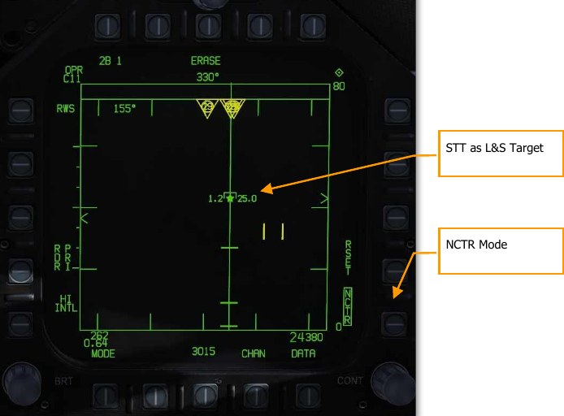

#### Non-Cooperative Target Recognition (NCTR) Mode

When a contact is tracked as the STT L&S target, the NCTR function allows aircraft type identification
under certain parameters. The NCTR function can be selected from pushbutton 15 on the RWS
format page.

NCTR works on the principle of the engine fan blades having distinct characteristics that can then be
correlated to an aircraft type. This can only be achieved with an STT track of the target and:

- Target is within 25 nm.
- Target is within 30° nose-on or tail-on.

The identification results are displayed on the SA page when the TDC cursor is placed over the
target. The type will then be displayed in the data block located in the bottom right corner of the
page.

NCTR can be an important function for two-factor target identification.

### One-Look RAID

One-look RAID applies RAID processing to returns detected while in single-target track mode. This
allows the radar to display targets nearby the L&S as bricks. One-look RAID has the capability to
break out targets within about 1.5° of the L&S (one beam width). At 25 NM, one-look RAID can
break out a target within 1 NM of the L&S.

To activate One-Look RAID, box it on the DATA page. See Range While Search (RWS) DATA.

When activated, a one-look RAID scan is performed every 1.5 seconds. Any additional targets
detected by one-look RAID are displayed as uncorrelated bricks.

### Spotlight (SPOT) Sub-Mode

Spotlight (SPOT) is an air-to-air radar sub-mode that constrains the radar azimuth to a specific area
under the TDC. SPOT mode provides a very high update rate and is used to discriminate between
closely spaced targets and acquire the desired target within a group.

SPOT sub-mode can be activated from any air-to-air radar mode except STT and STT RAID. To enter
SPOT sub-mode, first position the TDC over the area you wish to spotlight, then press and hold the
TDC z-axis for more than one second. The radar azimuth indicator will drive to the TDC location and
begin a scan centered on the cursor and constrained to 22° of azimuth.

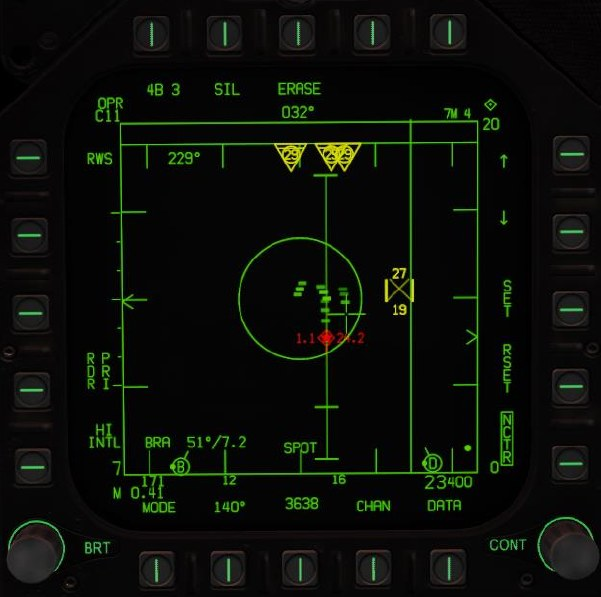

SPOT sub-mode is indicated by the presence of an “X” within the TDC. The scan area can be slewed
by moving the TDC left or right. To exit SPOT sub-mode, press and release the TDC. SPOT sub-mode
is also exited by pressing the undesignate button or assigning TDC to another display.

SPOT sub-mode can also be used with an AACQ mode. When SPOT sub-mode is activated from an
AACQ mode, the radar will attempt to STT the first target detected while SPOT is active.

### Air-to-Air Radar HOTAS Controls

When flying air combat missions, it is very helpful to keep your hands on the stick and throttle and
not have to take your hands off them to manipulate controls. The Hornet has an excellent set of
Hands-on Throttle and Stick (HOTAS) controls. Here are some of the more important HOTAS
functions to know for air-to-air combat:

#### Control Stick

On the control stick, the Sensor Control Switch and the Undesignate Button are vital. When in
Beyond Visual Range (BVR) mode, pressing the Sensor Control Switch to the right will set TDC
control to the radar when on the right DDI. When the display has the TDC assigned to it, a diamond
with a dot in the center is displayed in the top right corner of the display.

Pressing the Sensor Control Switch to the right when the TDC is already assigned to it will place the
radar in Auto Acquisition (AACQ) mode. If the TDC if over a target symbol when AACQ is
commanded, it will instruct the radar to lock on to that target. If AACQ is pressed with no target
symbol under the acquisition symbol, then the radar will attempt to lock on to the closest target
within the selected radar scan volume.

**Sensor Control Switch.** There are two general modes for this four-way switch. When in air-to-air
mode:

When in Beyond Visual Range (BVR) mode, it functions as:

- Forward: Switch to Air Combat Maneuvering (ACM) mode with Boresight being selected by
default
- Aft: Assigned TDC to center, MPCD
- Left: Assigns TDC to left DDI
- Right: TDC to right DDI or enters radar in Auto Acquisition mode if TDC already assigned to
the right DDI

When in ACM mode, the Sensor Control Switch works as:

- Forward: Radar Boresight (BST) mode
- Aft: Radar Vertical Acquisition (VACQ) mode
- Left: Radar Wide Angle Acquisition (WACQ) mode

**Weapon Select Switch.** This is a five-position switch that allows you quickly to set the selected air-
to-air weapon as priority. In doing so, it will also set the radar to default settings to best employ the
weapon:

- Forward: AIM-7 Sparrow
- Press Down: AIM-9 Sidewinder
- Aft: M61A1 20mm Gun
- Right: AIM-120 AMRAAM
- Left: No Function

**Trigger.** Fires forward directed weapons like the gun and air-to-air missiles.

**Undesignate Button.** When in air-to-air mode, the primary function of the Undesignate Button is to
un-lock a radar-designated targets. It can also be used to return to radar search mode when in a
radar ACM mode.

#### Throttle

The two most important radar controls are the Throttle Designator Controller (TDC) and the radar
elevation control.

The radar elevation control is a wheel that when rotated back elevates the radar scan and when
rotated forward lowers the elevation scan.

The TDC is a cursor control with a press-button function. When assigned to the radar on the right
DDI, it controls the TDC acquisition cursor within the radar tactical display area. When on the air-to-
air radar display, the number above and below the TDC cursor indicate the maximum and minimum
altitude coverage of the radar at the range of the TDC on the display.

When the TDC is moved across the display boundary, it can be used for radar mode and parameter
changes. If the TDC is moved over the boundary into the mode selection area, the mode options will
appear on the display. Positioning the cursor over the desired mode and depressing the TDC will
command the radar to display the optimum parameters for the mode selected. Other parameters
shown around the perimeter of the display may also be controlled.

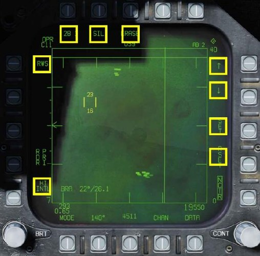

### Range While Search (RWS) DATA

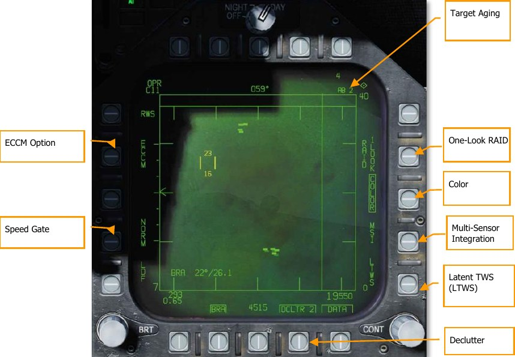

**Target Aging.** The amount of time a target symbol remains on the display after radar contact has
been lost can be adjusted with successive presses between 2, 4, 8, 16 and 32 seconds.
When SIL mode is selected, this field is replaced with the ACTIVE indication.

**One-Look RAID.** When boxed, performs one-look RAID analysis in STT mode. See One-Look RAID.

**Color.** Selects the radar display to be presented in monochrome or limited use of colors of three
colors. In addition to displaying the TDC cursor in yellow, it also allows trackfiles in LTWS and TWS
modes to be displayed in yellow and red.

**Latent Track While Scan (LTWS).** LTWS provides a Track While Scan (TWS) function while in
RWS mode. With LTWS enabled, placing the TDC over a target symbol will display Launch and Steer
(L&S) track symbols. However, no “Shoot” cues are displayed. An LTWS target will have its’ airspeed
in Mach displayed to the left and its altitude in thousands of feet to the right. Additionally, its range
and closure information are displayed along the right tactical border.

**Multi-Sensor Integration (MSI).** When enabled, allows datalink information to be integrated with
LTWS and TWS modes.
For more information on these two options, see Latent Track While Scan (LTWS) Mode in the next
section.

**DATA.** Exits the DATA sublevel.

**Declutter.** Allows selection of two levels of declutter form the radar display. DCLTR1 removes the
horizon line and velocity vector. DCLTR2 removes all DCLTR1 items, plus target differential altitude,
target heading, range rate numeric, and the range caret when in STT mode. The selected mode will
be indicated as boxed DCLTR1 OR DCLTR2.

**Speed Gate.** Selects between Normal (NORM) and WIDE target speed gates to determine the width
of the doppler radial velocity notch. This is used to not detect/filter out slow moving targets like cars
and general aviation aircraft. When in WIDE mode, the notch filter is increased, and slow targets will
be detected and displayed. (Coming later in Open Beta)

**ECCM.** Enables or disables Electronic Counter-Counter Measures. When enabled, the jamming effects
of hostile aircraft are less pronounced, but the sensitivity of the radar is reduced. (Coming later in
Open Beta)

### Air Combat Maneuvering (ACM) Modes

The ACM radar modes are designed for close-in combat with auto acquisition in mind. The ACM
modes can be selected by either pressing forward on the Sensor Control Switch while in air-to-air
BVR mode, or by pressing aft on the Weapon Select Switch to set A/A GUN as priority.
Except for the Guns Acquisition mode, any air-to-air missile can be used for all ACM modes.

##### How to Use Radar in Air Combat Maneuvering (ACM) Mode

1. Radar control switch on the Sensor Panel to Operate (OPR)
2. Master Mode switch to A/A
3. Select Attack Radar (ATTK RDR) from the TAC page on the right DDI
4. Press forward on the Sensor Control Switch to enter ACM mode, or…
5. Press aft on the Weapon Select Switch to set A/A Gun as priority and place the radar in
Gun Auto Acquisition (GACQ) mode
6. Once in ACM mode, use the Sensor Control Switch to select ACM modes: forward for
Boresight (BST), aft for Vertical (VACQ), and left for Wide Angle (WACQ)

There are four ACM modes:

- Gun Acquisition (GACQ) mode is automatically enabled when air to air guns is selected.
This mode is represented as a 20°, dashed circle on the HUD that encompasses the entire
HUD field of view. Unlike the other ACM modes, GACQ can only be used for guns. GACQ
searches for targets out to 5 miles.
- Boresight (BST) by pressing forward on the Sensor Control Switch. When selected, a
dashed, 3.3° circle is displayed on the HUD. This circle indicates the radar’s auto-
acquisition search zone. BST searches for targets out to 10 miles.
- Vertical Acquisition (VACQ) mode is selected by pressing aft on the Sensor Control
Switch. Upon doing so, two, dashed vertical line are displayed in the HUD. This vertical
auto-acquisition search pattern covers from -13° to +46°. VACQ searches for targets out to
5 miles.
- Wide Acquisition (WACQ) is a spaced-stabilized mode and is selected by pressing left
on the Sensor Control Switch. Upon doing so, a rectangle is displayed in the lower right
corner of the HUD. This rectangle represents the auto acquisition scan pattern and can be
slewed using the TDC controller when uncaged. The rectangle is placed on a grid that
represents the complete scan limits of the radar. WACQ searches for targets out to 10
miles.
- Automatic Acquisition Mode (AACQ) is selected from the BVR radar modes, like RWS.
It is not selected from the ACM modes. When in a BVR radar mode and the TDC cursor is
not over a target symbol, the radar will attempt to auto lock the nearest target in its search
pattern when the Sensor Control switch is moved right. AACQ searches for targets out to
range setting of the radar.

#### WACQ Uncaged Mode

When WACQ is active, the scan area is normally caged to the center 60° of azimuth and 10° of
elevation. By depressing the TDC, you can uncage the scan area and slew it with the TDC. When you
do, the scan area is displayed on the HUD:

Moving the TDC left or right shifts the 60° scan azimuth left or right within the 140° scannable cone.
Moving the TDC up or down shifts the 10° scan elevation up or down. The first target detected inside
of 10 nautical miles will be automatically locked.

### Track While Scan (TWS) Mode for the F/A-18C Hornet

#### Overview

The Track While Scan (TWS) air-to-air acquisition mode of the radar is the ideal choice maintaining
radar situational awareness, track and engage multiple targets, have more azimuth control of the
beam, and have the tools to break-out targets in close formation.

TWS mode can be selected from pushbutton 5 on the attack radar page. Pressing toggles between
RWS and TWS search modes. TWS appears like LTWS and includes L&S, DT2, LARs, etc. The primary
difference is the ability to show up to 10 trackfiles, plus raw hits, and more beam control options.
The other big difference is that it allows weapon engagement with the AIM-120.

In TWS mode, targets are ranked by threat priority. These are indicated with a HAFU and aspect
stem (L&S, DT2, and up to eight more Tracked Targets). If HITS is enabled, up to 64 contacts can be
displayed as a maximum. HITS appear as “bricks” on the radar display.

Only targets within the current range display are ranked. However, if a target is ranked and the
display scale is changed such that a contact is no longer displayed, it is kept as a primary or
secondary trackfile. In such a case, this target would be at the very top or bottom of the display.
The highest priority target is always assigned as the L&S target. An L&S target in TWS can be
commanded to STT by designating it. L&S data and symbology is the same as we currently have in
LTWS mode. If an TWS L&S target is engaged with an AIM-7, the radar will automatically change to
STT mode when launched.

The 2nd highest priority trackfile is the DT2 target. This is also displayed the same as we have for
LTWS mode.

When in TWS mode, press right on the Sensor Control switch will place the L&S target into STT.

#### Target Designation

When TWS is first selected, the highest priority tracked target is automatically set as the L&S, but no
DT2 is automatically set. To designate any tracked target as a DT2, designate that track using TDC
Designate. To set the DT2 track as the L&S track, designate the DT2 track (TDC Designate); this will
swap the DT2 and L&S tracks. You can also press the Undesignate button to swap the L&S and DT2.
If no DT2 is created, pressing the Undesignate button will cycle the L&S among tracks in priority
order.

If there is a DT2, pressing the Undesignate button will swap the priority of the L&S and DT2 targets.
In this way, you can quickly set the DT2 target as the L&S target.
Designating a non-tracked target (“hit”) will set it as a track. The lowest priority track would then be
dropped, displaying as a hit instead.

#### TWS Display Format

**HITS Option.** When enabled, “raw” hits (bricks) are displayed that are outside the 10 ranked
trackfiles. These are essentially RWS contacts that can be displayed in TWS mode. They are also
rendered at a lower intensity than the trackfiles.

**TWS Option.** If the radar is in STT mode with AIM-9 or AIM-7 selected, the TWS option is available.
If selected, it will exit STT to TWS and make the previous STT target the L&S.

**Azimuth Option / Elevation Bars Option.** When in TWS, there are three bar options with
corresponding azimuth options:

- 2 bar = 20°, 40°, 60°, and 80°
- 4 bar = 20° or 40°
- 6 bar = 20°

For 4 and 6 bars, the elevation bar spacing is 1.3-dgrees. For 2 bars it is 2°.

**Azimuth Centering Options.** When in TWS mode, the AUTO and MAN options are available on the
right side of the display. This allows either manual or automatic scan centering based on which
option is selected/boxed.

- **AUTO:** The azimuth and elevation TWS scan is centered on the L&S trackfiles. If TWS is
entered from an STT track, AUTO mode is automatically selected.

    When in AUTO mode, the player should be able to place their TDC cursor anywhere but on
    a contact and depress the TDC switch to re-center the scan azimuth on that location. When
    this is done, AUTO is replaced with BIAS on the display. This sets a new scan centroid.
    BIAS is removed when RESET is pressed, TWS is exited, RAID is selected, MAN mode is
    selected, or no trackfile exists.

- **MAN:** The scan center will not change automatically, but rather the azimuth scan center
can be moved with the TDC cursor. If the scan is positioned outside the gimbal limits of the
radar, the scan will be repositioned such that the scan will be able to search its entire
azimuth. MAN mode is the default.

Trackfiles that move outside of the scan volume area will disappear after a few seconds.

**RESET.** When pressed, all manually added trackfiles are dropped and resumes normal tracking and
trackfile prioritization.

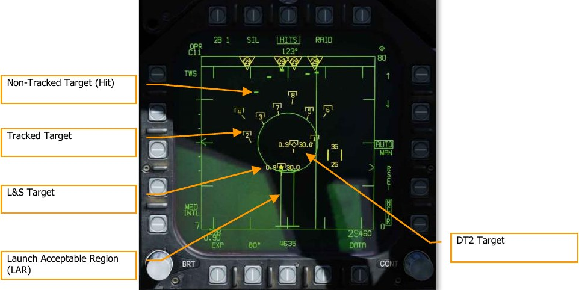

**Expand (EXP).** When there is an L&S target in TWS mode and EXP is pressed, the display will
change to a 10 nm range centered on the L&S with a 20° azimuth scan. The display range on the
right side of the display will indicate the 10 nm scan area (for example: 30 at the top and 20 at the
bottom). Despite the 20° azimuth scan, the legend will still indicate the previous setting and the b-
sweep line will freeze on the L&S.

This mode simply zooms in on that area, but the TWS scan operation, target rankings, etc. does not
change.

Trackfiles that are outside of the display will be clamped to the screen edge.

**SCAN RAID Mode.** This is selected from the SCAN RAID button on the throttle or by pressing PB9
 (RAID). It concentrates the TWS scan to a small area to break out closely spaced targets. When
enabled, the scan is centered on the L&S target. It is displayed in a standard range and azimuth
format in 10 nm zoomed in display at 22° of azimuth, with a 2-bar elevation. The b-sweep line is
frozen on the L&S target and SCAN RAID appears at the bottom of the display.

When in this mode, trackfiles and raw hits are displayed. If a new L&S target is designated, the RAID
SCAN will move to that location. Trackfiles that are outside the display area will be clamped to the
edge of the display.

When selected, AUTO scan centering is automatically selected and cannot be unselected while in this
mode.

## Hornet Datalink, Situational Awareness Page, and IFF

The F/A-18C for our simulation relies on two Multifunction Information Distribution System (MIDS)
terminals that allows the transmission and reception of data over the Link-16 Tactical Datalink (TDL)
network. Link-16 allows NATO and other services to share data with each other. In addition to data
transfer, Link-16 / MIDS also supports secure voice (MIDS 1 and MIDS 2 on throttle radio switch).
Both the lower and upper radio antennas support the MIDS terminal.

The primary purpose of Link-16/MIDS is to provide a near-real-time picture of the tactical area
around the pilot’s aircraft. This includes ownship sensors, other friendly fighters on the network, and
surveillance assets like AWACS. All of these sensor sources are then correlated to create a unified
situational awareness picture. This in turn allows a more coordinated engagement and less chance of
fratricide. It can display up to 16 separate trackfiles.

MIDS can receive and display to the pilot three types of trackfiles over Link-16 to the MIDS terminal:

- **Fighter-to-Fighter (F/F).** MIDS can receive up to seven donors (other fighters providing
track data) and each donor can share up to eight trackfiles. These are all correlated against
each other to avoid duplicate trackfiles.

- **Precise Participant Location and Identification (PPLI).** This is the data that allows
the display the location of the donor, what its sensors are doing, and payload remaining.

- **Surveillance Tracks (SURV).** These are non-fighter aircraft data sources like AWACS
and radar ground stations.

Trackfiles from each of these three sources (offboard) are then correlated with the sensors of the
player’s aircraft (onboard). This is termed Multi Source Integration (MSI). Trackfiles that correspond
to the player’s aircraft are not displayed.

- Trackfile information can be displayed three ways:
- Air-to-Air Radar Display
- Situational Awareness (SA) Display
- Joint Helmet Mounted Cueing System (JHMCS)

For this simulation, all network options will be configured automatically.

### MIDS MFD Format

The MIDS MFD format is available from the SUPT Menu.

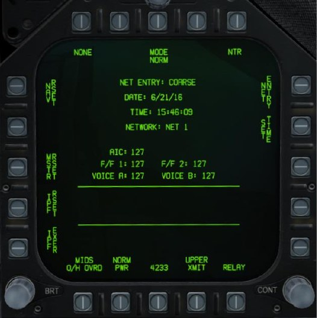

This format will be documented in a later edition of this manual.

### MIDS Link-16 UFC Control

To enter MIDS control on the UFC, the D/L button is pressed. Upon doing so, the UFC will appear as
seen below:

To enable power to the MIDS terminal, ON/OFF button on the UFC must first be pressed. When not
powered on, the scratch pad and all option select windows are blank. Once powered on, ON appears
in the scratchpad and the default indications on the option select windows:

- AIC
- F/F1
- F/F2
- VOCA
- VOCB

Turning MIDS off is done by pressing the UFC ON/OFF button a second time. The option select
window of AIC, F/F1, and F/F2 has no function.

Pressing the option select button for either VOCA or VOCB allows the player to enter the MIDS voice
channel for MIDS A and MIDS B. Upon selection, the keypad can be used to enter a channel number
between 1 and 126. The entered channel is displayed in the scratch pad and the ENT button is used
enable the set channel to the selected MIDS voice channel select. Selecting 127 turns off VOCA and
VOCB.

### MIDS Secure Voice

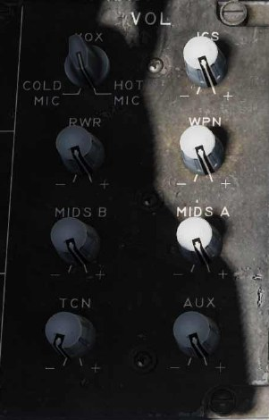

In addition to the ARC-210 radio COMM1 and COMM2, MIDS
provides two additional, secure radio transceivers, MIDS A
and MIDS B. Transmit over MIDS A by pressing the Comms
Switch forward, and over MIDS B by pressing the Comms
Switch aft.

Volume level of MIDS A and MIDS B is controlled by the
volume knobs on the volume panel on the left console. Note
that the CRYPTO switch should always be in the NORM
position. If set momentarily to HOLD or ZERO, it will erase
the secure radio settings for MIDS A and MIDS B.

### MSI Trackfiles

Multi-Sensor Integration (MSI) Trackfiles are objects
(symbols and data) which are generated either by external
sources (F/F donors and SURV), or by internal sensors (e.g.,
radar hits). Trackfiles are radar contacts which have been
classified by the Mission Computer and/or the pilot as “onboard” and/or from external donors as
“offboard”. These tracks are often represented on the screen by a symbol known as a HAFU.

When the Radar sweeps a track for the first time, the track is assigned a rank based on a number of
basic factors and weighted according to things like range, speed and aspect in order to prioritize it in
terms of a potential tactical threat.

### Situational Awareness (SA) Top Level

The SA page is selected from pushbutton 13 (SA) on the TAC page. Upon selecting the SA page, the
main SA page is displayed and, in many ways, duplicates the HSI page pushbutton options. Common
HSI pushbutton elements include:

- MAP, pushbutton 6
- SCL, pushbutton 7
- MK2 (Mark) Point, pushbutton 9
- DCNTR (Decenter display), pushbutton 10
- WYPT/OAP/TGT, pushbutton 11
- Up Arrow (increment waypoint), pushbutton 12
- Down Arrow (decrement waypoint), pushbutton 13
- WPDSG (waypoint designate), pushbutton 14
- SEQ (1-3) (sequence), pushbutton 15
- AUTO, pushbutton 16
- MENU/TIME, pushbutton 18

All the above will function as they do on the HSI page, and changes on the HSI will translate to the
SA page and vice versa.

Interior to the SA display also has much in common with the HSI display that includes:

- Compass Rose
- Lubber Line
- Waypoint/OAP/TGT Head and Tail
- TDC BRA to A/A Waypoint
- Ownship BRA to A/A Waypoint
- Aircraft Symbol
- TDC assignment symbol
- Air-to-Air Waypoint (bullseye)
- Selected Waypoint/OAP/TGT bearing, range, and time to (top right)
- Selected TACAN bearing, range, and time to (top left)

Unique pushbutton functions to the top-level SA page include:

**DCLTR** (declutter), pushbutton 7. Upon selection, five declutter options are made available
via pushbuttons 6 to 10.

- OFF. All symbols are displayed
- REJ1. The following items are hidden: compass rose, lubber line, and SAM rings
- REJ2: The following items are hidden: REJ1 items and Waypoint/OAP/TGT data,
TACAN data, waypoint head and tail, and TACAN head and tail
- MREJ1: Hide air defense symbols (SAM and AAA) and rings
- MREJ2: Hide surface unit symbols

Unique functions in the tactical area of the top-level SA page include:

**Sensors Sub-Level.** Press pushbutton 5 to select the Sensors sub-level page.

**Countermeasures.** In the bottom left corner of the SA page are four bars that graphically indicate
the number of remaining countermeasures. To the left of each bar, from top to bottom:

- C for chaff and remaining number
- F for flares and remaining number
- O1 for GEN-X and remaining number
- O2 for GEN-X and remaining number

Each bar is filled based on the initial loaded. For example: if the mission starts with 60 flares and 30
have been used, the bar is ½ filled.

**Air Defense Zones.** If a hostile air defense unit is placed in the mission, and not to be hidden, it will
appear on the SA display at its geographic location. The system is indicated by two alphanumeric
(same as from EW display) with a ring around it that equates to the engagement range (same as
indicated in the mission editor and F10 view).

**EW Symbols.** EW information is not correlated with an MSI track, it is only based on ownship
detection. Only the four highest threats are displayed on the SA page and can only be airborne
interceptor (AI) threats, friendly detections, and unknown detections. At the top of the symbol are 1
to 3 lines that indicate threat level:

- One line: Non-lethal threat
- Two lines: Lethal threat
- Three lines: Critical threat and will flash

The character code in the center of the symbol is the same as displayed on the EW/RWR display.

Transmit designation. When TXDSG is boxed, lines will be drawn between flight members/friendly
donor aircraft and their air-to-air or air-to-ground L&S designations:

### SA Sensor Sub-Level

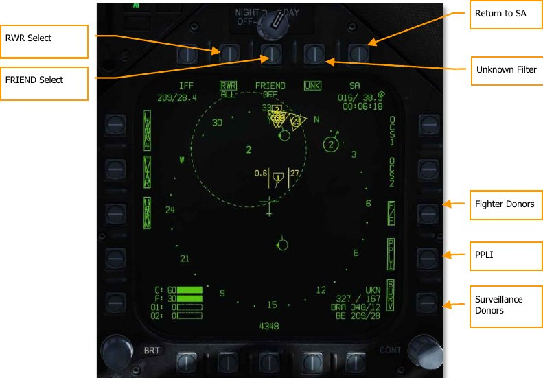

Upon pressing the SENSR pushbutton on the SA Top Level, the player is moved to the SA Sensor
page. On this page, the player can filter the sources of information that go into creating the MSI
picture.

**RWR Select.** Pushbutton 7. Successive presses of pushbutton 7 cycles through the options of the
lethality level of RWR contacts will be displayed on the SA page. In addition to the three boxed
options, there is a fourth un-boxed option in which no threat RWR is displayed.

- RWR ALL. All displayed under RWR option that includes non-lethal, lethal, and critical
detections displayed.
- RWR CRIT LETH. Only lethal and Critical detections displayed.
- RWR CRIT. Only critical detections are displayed.

**FRIEND Select.** Pushbutton 8. Successive presses of pushbutton 8 cycle the presentation of friendly
RWR detections:

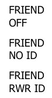

**Return to SA.** Pushbutton 10. Returns the display to the SA Top Level.

**Unknown Filter (UNK).** Pushbutton 9. Pressing pushbutton 9 toggles unknown HAFU symbols on
the SA page. When boxed, unknown HAFUs are displayed.

**Fighter Donors (F/F).** Pushbutton 12. When selected and boxed, track information from other
fighters with JTIDS/MIDS will be displayed. If not selected, no information from donor fighter aircraft
will be displayed.

**PPLI.** Pushbutton 13. When selected and boxed, location and information about other flight
members and other friendly aircraft with JTIDS/MIDS terminals will we be displayed. If not selected,
no information from these aircraft will be displayed.

**Surveillance Donors (SURV).** Pushbutton 14. When selected and boxed, track information from
AWACS aircraft will be displayed. If not selected, no information from AWACS aircraft will be
displayed.

### HAFU Symbology

Contacts on the SA page are displayed as HAFUs (Hostile, Ambiguous, Friendly, or Unknown). They
consist of multiple components that can include:

- Color: Green for Friendly, Yellow for Unknown, and Red for Hostile
- Top Half: The top half of the symbol indicates identification from your onboard sensors
- Bottom Half: The bottom half of the symbol indicates the identification by offboard sensors
 (donors)
- Threat Rank: If the contact is detected by your sensors and is an Unknown or Hostile, its
threat rank is displayed as a number in the center of the HAFU
- Vector: A line leading from the HAFU indicates the contacts direction of travel
- Shape: The top and bottom elements of the HAFU can have three shapes:
    - Hemisphere: Friendly
    - Bracket: Unknown
    - Caret: Hostile

#### PPLI SA Symbols

Aircraft that incorporate Link-16 datalink equipment (MIDS or JTIDS radios) can broadcast their
location to other aircraft over the same network. The Precise Participant Location and Identification
(PPLI) indicator on the SA page shows their location, and a TDC cursor over the contact displays its
information in the lower, right data block.

Based on the ability of the unit to share data over the network, its symbol will vary:

!!! note "Notes"
    - PPLI symbols have a stem indicating heading.
    - The PPLI symbol with dot in the center for a C2 unit is the AWACS aircraft (E-2 or E-3).
    - All AI aircraft with JTIDS or MIDS terminals can act as donors (indicated as dot on left side
    of circle).
    - Only player flight will have a wingman on-channel identifier in the center of the symbol.
    Player is A, Wingman 2 is B, Wingman 3 is C, and Wingman 4 is D.
    - Display of PPLIs can be toggled by pressing pushbutton 14 on the sensors sub-level of the
    SA page. This can be used to help declutter the display.

#### Onboard Sensor SA Symbols

Information pertaining to contacts that are only detected by your onboard sensors (radar) is indicate
by the top half of the symbol. Color and shape indicate its “side”. There are two ways to identify a
contact just using onboard sensors:

**Mode 4 Identify Friend or Foe (IFF).** This function uses the Hornet’s built-in IFF system to
interrogate the contact with a coded pulse interrogation. If the contact returns the correct reply, the
contact is deemed friendly (green and hemisphere). If the contact does not return a correct
interrogation, then the contact is deemed unknown or hostile (if NCTR prints the contact as hostile).

**Non-Cooperative Target Recognition (NCTR).** Once an STT lock is made on the contact and
NCTR is enabled from the radar RWS format page, an NCTR print can be made if the contact is within
25 nm and within 30° off the contacts nose or tail.

To classify a contact as hostile BOTH identifications be made. A truly hostile contact that is just
identified with one identification will be displayed as unknown.

Because onboard sensors are involved in the identification, the threat rank is included in the center of
the HAFU. This is used for target sorting priority and determine the order in which a contact is locked
using the AACQ mode.

As noted, a truly friendly contact only requires a Mode 4 identification to be classified as friendly, it
does not also require an NCTR print.

#### Offboard Fighter-to-Fighter SA Symbols

Donor F/F symbols that can be displayed on the SA page include both hostile and friendly elements.
These are part of the lower half of the HAFU. If it is a F/F only contact, there will be no threat rank
displayed.

The HAFU includes a stem that indicates the contact’s direction of travel.

#### Correlated Onboard Sensor and Offboard F/F and SURV Tracks

Contacts that detected by both your onboard sensors and offboard sensor(s) will have both upper
and lower elements to the HAFU symbol. This is termed a correlated contact. The color of the contact
is based on the onboard sensor identification and includes a threat rank unless the contact is
determined friendly.

Note that if the onboard identification is different than an offboard identification, then the HAFU can
be mixed. This is termed an ambiguous contact. For example: if the player has a contact on their
radar that has no IFF identification, then the HAFU will be unknown. If an offboard donor (F/F or
SURV) classifies the contact as hostile though, the HAFU would have a rectangular top but a triangle
bottom. In this way, there are many potential HAFU combinations.

Ambiguous contact, onboard seen as unknown and offboard seen as hostile

Correlated friendly contact

Correlated hostile contact

Offboard Surveillance (SURV) SA Symbols
An additional HAFU type are contacts only detected by a surveillance (SURV) asset. These contacts
are seen by an AWACS but not by you. These can be useful when you wish to run radar silent.
Contacts appear as either friendly (green circle) or hostile (red diamond) with a vector stem. These
symbols are ¾ the size of the other HAFUs.
SURV donor friendly symbol

SURV donor hostile symbol

Notes:
- For aircraft, the symbol also has a stem to indicate direction of travel.

- If a SURV track correlates to an F/F track, the F/F track symbol is displayed.

- If a SURV track correlates to an onboard only sensor track, an F/F symbol is displayed that
indicates onboard and offboard tracking.

- SURV symbols are only displayed if not correlated with PPLI, F/F, or onboard sensor.

- If SURV tracking is lost on a contact, the symbol flashes at 3 Hertz for six seconds. If
tracking is not re-established, the contract is removed from the SA page.

Ranking of Target Symbols
Each trackfile HAFU is ranked from 1 to 16 if tracked by ownship sensors. The greater the potential
threat, the lower the rank number. Factors that affect the rank include:
- Range
- Aspect
- Airspeed

Target Under Cursor (TUC) Data
When the TDC cursor is placed over a symbol on the SA page, information about the symbol is
displayed in bottom right corner as seen below:
If friendly:
- Aircraft type. For example: F15
- Unit callsign (first and last letter of the name and number) / remaining fuel
- Unit bearing and distance to player aircraft
Figure 170. Friendly TUC Data
If hostile:
- Aircraft type. For example: SU27. NCTR print
- Unit ground speed / bearing
- Unit bearing and distance to player aircraft

Figure 171. Hostile TUC Data

If unknown:
- Unknown (UKN) identification
- Unit ground speed / bearing
- Unit bearing and distance to player aircraft
Figure 172. Unknown TUC Data

Correlated HUD Indication
When an aircraft is locked in STT with datalink enabled, the HAFU “hat” will be drawn over the top of
the TD diamond, if there is correlation of identify of the target from on offboard source.
Correlated Hostile
Indication

Figure 173. Correlated Hostile HUD Indication

Latent Track While Scan (LTWS) Mode
When in RWS mode, the LTWS option is available on the DATA sub-level of the attack radar format.
The LTWS option is initially boxed by default, indicating that LTWS is selected. LTWS is only available
when the radar is in RWS mode.
When LTWS is disabled (unboxed), no HAFU symbols will be displayed on the radar, only bricks
representing radar returns. Boxing LTWS will display HAFU symbols for MSI trackfiles supported by
the radar only — in other words, donor HAFUs from other aircraft will not be displayed, only HAFUs
that are correlated to radar returns.
When LTWS is boxed, the pilot can designate the HAFU trackfile under the acquisition cursor.
Designating a trackfile displays its speed (in Mach) and altitude on either side of the HAFU, just as in
TWS mode. If the designated trackfile is one of the eight priority trackfiles, its launch zone will also
be displayed.
Designating an LTWS trackfile sets it as the L&S target (indicated by a star inscribed in the HAFU).
Once the L&S has been set, designation of a second trackfile will make that trackfile DT2 (indicated
by a diamond inscribed in the HAFU). In this manner, two trackfiles can be tracked, and a third can
also be tracked by hovering the acquisition cursor over its HAFU symbol.
It is important to note though that weapons cannot be employed in LTWS mode. To employ a
weapon, the radar must be in STT or TWS mode.
When LTWS is unboxed, HAFU symbols are not displayed, even when the acquisition cursor is
hovered over a radar target.

DT2 Trackfile

L&S Trackfile

MSI Select

LTWS Select

DATA sub-level

Figure 174. Latent Track While Scan

When both L&S and DT2 are created, they will appear as two separate indicators on the HUD. The
L&S appears as a box and the DT2 trackfile appears as an “X”.
L&S Trackfile
DT2 Trackfile

Figure 175. Latent Track While Scan HUD

Multi-Sensor Integration (MSI)
When LTWS mode is enabled, the pilot can further enable multi-sensor integration (MSI) using PB 14.
When MSI is boxed, donor targets are displayed as HAFUs even when the TDC is not over an LTWS
trackfile. This makes the radar presentation appear like the SA format, giving the pilot a more
complete air-to-air picture
Trackfiles detected solely by onboard sensors (without a contributing donor aircraft) are displayed as
standard RWS bricks.
Note that MSI for RWS can only be displayed when the LTWS mode is enabled.
Ownship-only
trackfile

MSI Select

Donor Trackfile

Figure 176. Latent Track Scan with MSI
AZ/EL Format
The azimuth-over-elevation (AZ/EL) format displays a forward-looking view of targets detected by the
radar and other sensors. Unlike the normal Attack Radar format, which is a top-down B-scope
display, the AZ/EL format is a boresight display, showing the “view out the nose.” The AZ/EL page
combines HAFU symbols from the multi-sensor integration (MSI) platform with returns detected by
either the radar or the FLIR.

CIT interrogation Aircraft heading
type

FOV cue toggle
Sensor status

ID option
Scan center

Azimuth-only
Selected sensor and contacts
mode

Elevation scale
Display stores

Azimuth scale Target data

Radar FOV CIT range

L&S interrogation HAFU symbol

Auto interrogation CIT FOV

Expand mode IFF declutter

CIT azimuth Elevation limit

Reset
Figure 177. AZ/EL Format

Selected sensor and mode: Pressing this pushbutton toggles between the radar and the FLIR as
the active sensor. In either case, MSI tracks are displayed along with sensor returns. The sensor
mode is shown as either RDR or FLIR, and underneath is the sensor sub-mode (RWS, TWS, or VS for
RDR; PNT or TRACK for FLIR).
Sensor status: Displays the status of the selected sensor. For RDR: OFF, STBY (standby), OPER
(operating), SIL (silent), DEGD (BIT or MUX failure), EMCON (suspended), or TEST (self-test). For
FLIR: OFF, STBY, OPER, DEGD, or TEST.
Elevation scale: Cycles between scan volumes: ±70°×±5°, ±70°×±15°, ±70°×±30°, or
±70°×±70°.
Elevation limit: Shows the positive and negative elevation limits, selectable using PB11 (EL SCALE).
The positive limit is shown at the top-right; the negative limit at the bottom-right.
Radar FOV: Shows the horizontal and vertical extent of the radar scan volume. This box is dimmed
when FLIR is the active sensor.
FOV cue toggle: Toggles on and off the radar and FLIR FOV cues.
Expand mode: See Expand Mode below.
Scan center: Shows the azimuth and elevation of the scan centerpoint. To change the scan center,
see Changing Radar Scan Centerpoint below.
HAFU symbol: MSI tracks are shown as HAFU symbols (see HAFU Symbology above). L&S and DT2
target information is the same as the Attack and SA formats.
Target data: Data for the L&S, or the track currently under the cursor. Includes closure velocity,
range to target, and target heading.
Reset: Exits expand mode and re-prioritizes MSI trackfiles (same function as on the Attack Radar
format).
Azimuth-only contacts: Contacts without elevation data are shown here in the “dugout.”
ID option: Determines the type of data shown in the HAFU datablock. Toggles between FULL (radar
and MSI data), RDR (radar data only), and unboxed (datablock hidden). This function, and the HAFU
datablock, are not yet implemented.
CIT interrogation type: Changes the type of automatic interrogations initiated by the combined
interrogator/transponder (CIT). Options are ALL (all IFF modes), SNGL (a selected IFF mode), and CC
(correct code, like SNGL but requires a specific SIF code). Not yet implemented.
CIT azimuth: Changes the horizontal extent of manual and automatic CIT interrogations. Cycles
between 20°, 40°, 80°, and 140°. Not yet implemented.
CIT FOV: Indicates the azimuthal extent of manual and automatic interrogations made by the CIT.
Not yet implemented.
CIT range: Shows the maximum range for manual (not automatic) CIT interrogations; returns
beyond this range are not displayed. The up and down arrows change the range. Options are 5, 10,
20, 40, 80, and 100 NM. Not yet implemented.
Auto interrogation: When boxed, automatically performs a single pointed CIT interrogation
whenever a new L&S is designated, when the L&S is stepped, or when a HACQ/LACQ is attempted.
Not yet implemented.
L&S interrogation: When boxed, automatically performs continuous pointed CIT interrogations on
the L&S (whenever an L&S is designated). Not yet implemented.
IFF declutter: When boxed, suppresses display of new CIT tracks, and allows existing tracks to age
out. Not yet implemented.
Display stores: Displays the STORES page when pressed.

Surveillance Data

Surveillance Data. This datablock displays information for each sensor that is contributing data to
the multi-sensor integration target under the cursor. In the screenshot above, the first line depicts a
friendly HAFU symbol and aircraft type of F/A-18 provided by Link-16. The second line indicates the
Link-16 pilot ID (“COLT1-1”). The third line displays “P” indicating the presence of a PPLI track for
this target, and “4” to indicate a friendly mode-4 reply.

Expand Mode
The AZ/EL expand mode can be entered by pressing PB20, labeled EXP. The expand mode is
continuously centered on the L&S.
Centerpoint
elevation Centerpoint
azimuth

Figure 178. AZ/EL Expand Mode

The azimuth and elevation of the FOV centerpoint are shown at the top-center and center-left of the
display area. The FOV in expand mode is always 20° in azimuth and 5° in elevation.
To exit expand mode, press PB20 to unbox the EXP label.

FLIR Sensor Mode
When the FLIR is selected as the active sensor, the AZ/EL format changes slightly, and some
pushbuttons have different functions.
FLIR FOV cycle

Slave FLIR to L&S

Display FLIR format

Boresight FLIR

FLIR LOS

Figure 179. AZ/EL Format with FLIR

FLIR FOV cycle: Cycles between available FLIR fields of view: WFOV (wide), MED (medium), and
NFOV (narrow).
FLIR LOS: Indicates the FLIR line-of-sight. Note that the circle does not display the FOV area, as
this would be excessively small. The circle will enclose a HAFU symbol when the FLIR is slaved to a
trackfile. This circle is dimmed when RDR is the selected sensor.
Display FLIR format: Pressing this pushbutton displays the FLIR format.
Slave FLIR to L&S: Boxing this option will keep the FLIR LOS slaved to the current L&S.
Boresight FLIR: Pressing this button drives the FLIR LOS to boresight. Because the AZ/EL view is
horizon-stabilized, but the boresight LOS is not, changes in aircraft pitch will cause the LOS circle to
drift up and down.

HOTAS Controls
The AZ/EL page can be quickly brought up using the HOTAS when it is not already displayed. When
in A/A master mode, bumping the Sensor Control Switch left will put the AZ/EL page on the left DDI,
if the left DDI cannot take TDC priority (e.g., the Stores format).
Pressing the TDC designate when the cursor is over an MSI trackfile designates that target as the
current L&S. If an L&S is already designated, the trackfile under the cursor is designated the DT2. If
the target under the cursor is the DT2, pressing TDC designate will make it the L&S, and the previous
L&S will be erased. (It will not be downgraded to DT2.)
When the sensor mode is set to FLIR, releasing TDC designate when the cursors are over a trackfile
commands the FLIR LOS to that trackfile. The FLIR will continuously track that target, even when the
L&S changes. Boxing the L+S pushbutton (see FLIR Sensor Mode, above) will return FLIR LOS to the
L&S.
Pressing and holding TDC designate when the cursor is not over an MSI trackfile, but in the display
area, changes the cursor to a pointing cross. See Changing Radar Scan Centerpoint, below.
Bumping the Sensor Control Switch in the direction of the DDI showing the AZ/EL format commands
the radar to attempt single-target track (STT) on the MSI trackfile under the cursor. If the radar is
already in STT mode, bumping the Sensor Control Switch in this manner commands a break-lock.

Changing Radar Scan Centerpoint
Pressing and holding TDC Designate when the cursor is not over a HAFU symbol will change the
cursor to a pointing cross, which can be slewed using the TDC.

Pointing cross

Figure 180. AZ/EL Pointing Cross

To the left of the pointing cross are the minimum and maximum altitudes (in thousands) for the
radar scan volume at one-half the range selected on the Attack Radar format. For example, if the
radar range is currently 40 NM, the altitudes shown next to the pointing cross represent the minimum
and maximum altitudes of the radar scan volume at 20 NM. If the active radar mode is VS (velocity
search), the altitudes shown are at a fixed range of 40 NM.
If FLIR is the selected sensor, only one altitude is shown adjacent the pointing cross, representing
the altitude along the FLIR LOS at one-half the selected range on the Attack Radar format.
Releasing TDC Designate re-centers the radar scan volume in the location of the pointing cross and
reverts the pointing cross back to a cursor.
M61A1 Gun, Air-to-Air Mode (A/A GUNS)
The A/A-49A1 M61A1 20mm automatic gun system provides the pilot with a formidable A/A weapon
capability. The system has a capacity of 578 rounds of ammunition. The rate select switch provides
for the selection of either 4,000 or 6,000 shots per minute.
The gun is used for close-in engagements and can either be radar-directed or not.
A/A GUNS is selected by an aft press on the Weapon Select Switch or [LShift] + [X]. To fire the
gun, press the Trigger on the Control Stick [Space].

Mission Practice: AA Gun and AIM-9 Sidewinder

How to Use the Gun Summary
1. Master Arm switch to ARM

2. Weapon Select switch to A/A GUNS

3. Fly to place target in dashed circle on the Heads-Up Display (HUD) to lock it on RADAR
when at 5 nautical miles or closer

4. Fly to place the dot in the center of the gun reticle over the target and squeeze the
trigger when you see the SHOOT cue on the HUD.

A/A GUNS SMS Page
Regardless of which air-to-air gun mode you select, the air-to-air gun (A/A GUNS) SMS page will remain
the same. The SMS page is accessed through the TAC menu DDI page, or it can be automatically called
up by selecting A/A GUNS.
The A/A GUNS SMS page allows you to configure the following weapon settings:
Gun rounds Remaining
Expected Target
Wingspan

Master Arm Cue

Gun Round Options

UFC Option

Gun Firing Rate Option

Figure 181. A/A GUNS SMS Page

Gun rounds Remaining. Displayed when available. If no rounds remain, XXX is displayed. A full
gun load is 578 rounds.
Gun Round Options. RND M50/PGU option is provided to select the type of 20mm ammunition
which is loaded. The selected ammunition type is boxed. The M50 option represents MK-50 series
ammunition and the PGU option represents PGU-28 ammunition.
Gun Firing Rate Option. High rate (HI) is initialized on power up, pressing the Option Select Button
selects the alternate gun fire rate (LO). Gun fire rate legend is boxed when selected. HI = 6,000
rounds per minute, and LO = 4,000 round per minute.
Master Arm Cue. The status of the Master Arm switch (ARM, SAFE) or the selection of simulation
mode (SIM) is displayed.
Expected Target Wingspan. The UFC is used to program the wingspan size for the expected
target. This selection is then used to properly adjust the Funnel Cue. The selectable wingspan values
are whole numbers between 10 to 150 with a default of 40 feet. The wingspan value is entered by
selecting the UFC Option Select Button 14 on the A/A GUNS SMS page. The current wingspan value is
displayed as WSPN XXX. With WSPN displayed, the pilot enters a wingspan value using the keypad,
followed by the ENT key.
UFC Option. Press to enable manual wingspan entry using the UFC.

A/A GUNS HUD
The Hornet has three functional A/A GUN modes:
- Radar Not Tracking Mode
- Radar Tracking Mode
- Training Mode with FEDS cue

Radar Not Tracking Mode
The Radar Not Tracking Mode, also called the Funnel Mode, is obtained immediately upon A/A GUNS
selection if the radar is not already tracking a target or at any time if radar track is lost or broken. To
use the funnel, fly to place the target aircraft’s wings between the funnel such that its wing tips just
touch the sides of the funnel.
A fixed range of 2,000 feet is used for the radar not tracking mode lead angle computations. A 12.5-
mil diameter stadia metric reticle, corresponding to a target wingspan of 25 feet at this range, is
displayed on the HUD.
Specific symbology to the Radar Not Tracking gun HUD includes:
Gun Cross

Gun Funnel
1,000 Foot
Range Cue

GUN Selected and
Armed Cue
2,000 Foot
Range Cue
Gun Round Remaining
Indication

Figure 182. A/A GUNS HUD, Radar Not Tracking Mode

Gun Cross. Displayed when A/A gun is selected. The Gun Cross is centered in azimuth and 2°above
aircraft waterline to indicate gun boresight.
Funnel Cue. The funnel mode is displayed if the radar is not tracking the L&S target, or if lock-on is
broken.
1,000 Foot Range Cue. A range of 1,000 feet is represented by the pipper.
2,000 Foot Range Cue. A range of 2,000 feet is represented by this pipper.
GUN Selected and Armed Cue. Indication of the gun being the selected weapon.
Gun Round Remaining Indication. Number of gun round remaining.
When A/A GUNS is selected, and the radar is operating, the radar will automatically enter the air-to-
air Guns Auto Acquisition mode (GACQ). This is a 5-bar elevation scan with 20° of elevation centered
4° below the radar boresight. This scan covers the entire HUD field of view. This mode also places
the radar in a 5-mile range setting. When any aerial target flies within this scan zone, it will
automatically be locked on to in Single Target Track (STT).
GACQ Scan Area

Figure 183. A/A GUNS Auto Acquisition Area
ACM Mode Indication GUN in Priority

Figure 184. A/A GUNS Acquisition Radar

At any time, you can also select one of the ACM radar sub modes. ACM sub modes are selected by
pressing the Sensor Control Switch forward. Once in ACM mode, the Sensor Control Switch can select
three ACM sub modes.
- Boresight (BST) Sensor Select switch forward
- Vertical Acquisition (VACQ) Sensor Select switch aft
- Wide Acquisition (WACQ) Sensor Select switch left

Note 1: When the radar is at a 5 nm range setting, ownship airspeed and altitude are displayed
inside the radar display.
Note 2: When in a turning fight, VACQ can often be a good choice to lock up a target above your lift
vector.
To return to GACQ, select GUNS on the Weapon Select Switch.
Radar Tracking Mode
Radar Tracking Mode is the primary air-to-air gun mode of the Hornet. Radar Tracking Mode is
obtained immediately upon gun selection if the radar is tracking an aerial target. Valid range, range
rate, and angle tracks are required for Radar Tracking Mode operation.
Once the radar is locked on, the Target Designator (TD) indicates the position of the target being
tracked, and target range is displayed on an analog bar on the 50-mil diameter gun reticle along with
a maximum firing range cue. Maximum gun firing range corresponds to a maximum bullet time of
flight of 1.5 seconds and a minimum impact velocity (bullet VC) of 500 feet per second or a minimum
bullet velocity (Vb) at impact of 1,000 feet per second, whichever range is less. Maximum firing range
is much greater head-on than tail-on.
An advantage of the Radar Tracking Mode is the use of radar track data. The use of track data makes
the lead angle computation dependent only on target motion and the encounter geometry. The
computed lead angle is essentially independent of aircraft attitude. The Radar Tracking Mode obtains
firing solutions quickly since rapid attitude changes have little short-term effect on the required lead
angle. As a result, the pilot’s task is solely flying to aim the gun reticle since the target tracking
function is being performed by the radar.
As a further aid to the pilot and for consistency with the missile modes, a SHOOT cue appears if the
target is within maximum firing range. If the predicted miss distance is less than 20 feet, and all
other firing constraints (master arm, weight off wheels) are satisfied, the SHOOT CUE comes on. The
SHOOT cue includes a 0.5 second anticipation needed for pilot reaction time plus gun delay time. The
SHOOT cue remains on until the predicted miss distance exceeds 30 feet.
Radar Tracking Mode is automatically selected if A/A GUNS is selected while there is a radar lock. If
there is no radar lock, it will go to Radar Not Tracking Mode.
Elements of the A/A GUNS Radar Tracking Mode on the HUD include:
Gun Cross

1-g Foresight Cue

Gun Reticle

Target Designator (TD)

Target Closure and
Range

Gun Rounds Remaining
9-g Foresight Cue

Figure 185. A/A GUNS HUD, Radar Tracking Mode

Gun Reticle. This circle indicates predicted gun impact location based on aircraft maneuvering.
Radar lock provides target range data that is included in the reticle. A maximum gun firing range cue
is displayed on the gun reticle display. It indicates the maximum effective gun firing range. The
target analog range bar inscribed in the gun reticle shows the current target range as indicated by
radar is presented as a circular arc about the gun reticle, the length of which represents the target
range increasing clockwise about the reticle. When the arc’s clockwise length is less than the position
of the Gun Maximum Range Cue, the target is within the range of the gun.
1-g and 9-g FORESIGHT Cues. Fluid Omni-Range/Rate Sight (FORSIGHT). The FORSIGHT cues
indicates the targets potential to maneuver. It is made up of two horizontal lines with center tick
marks. The upper or longer line represents the targets 1-g left or right out-of-plane maneuver
capability under 1 g in-plane loading. The lower or shorter line represents the targets 9-g left or right
out-of-plane maneuver capability under 9 g in-plane loading. The distance between the two
FORSIGHT cue lines represents the 1-g to 9-g in-plane maneuver potential for the target. The
separation between the 1-g and 9-g maneuver potential lines is not limited beyond RMAX (Gun
Maximum Range cue). The 1-g maneuver potential line is limited to the HUD field of view at the
same distance from the HUD center used for the gun reticle. When the 1-g maneuver potential line is
HUD limited, it is displayed flashing.
Gun Cross. The Gun Cross is centered in azimuth and 2°above aircraft waterline to indicate gun
boresight.
Target Designator (TD). This is an indication of target location. If the target is identified as hostile,
the box is rotated 45° to create a diamond symbol and an inverted “V” symbol is placed over the
diamond.
Target VC and Range. When a valid radar STT track is established on the target, the target range
and closing rate are displayed in nautical miles (NM) and feet/second. These are displayed in the
same location as displayed when a missile is the selected weapon. When the target comes within
1NM, the range display reverts to a display of target range in 100’s of feet.
Gun Rounds Remaining. Gun rounds remaining is displayed next to the GUN legend. XXX is
displayed when the MC receives the last rounds signal from the SMS.
Not pictured:
SHOOT Cue. The shoot cue is displayed until target miss distance exceeds 30 feet. The shoot cue is
provided when the below criteria have been satisfied:
- A/A Gun is selected
- All firing constraints are satisfied
- Radar is in STT on the target
- Target is inside gun RMAX for the selected round type (MK-50 or PGU-28)
- Target center is within 20 feet of an imaginary line connecting the 1-g and 9-g pippers of
the Foresight cue (maximum 20 feet miss distance)

BATR Cue. Bullet At Target Range (BATR). The BATR cue displays the real time position of a bullet
at target range. The BATR cue serves as a post-fire or hypothetical bullet hit position cue. The cue is
updated for each bullet fired as the bullet reaches the applicable target range. The cue is displayed
on the HUD when the gun is firing or in SIM mode with the trigger held. The cue is displayed using
the gun bore line offset from the target LOS.
Target Locator Line. Attached to gun cross, this arrow will point in direction of TD box when TD
box is off the HUD field of view. The number of degrees to the target is also displayed next to the
arrow.
When the radar is locked on to the target while in A/A GUNS in Single Target Track (STT) mode, the
radar picture will appears as shown below. Note that the GACQ is indicated on the left side as the
selected radar mode and that your airspeed and altitude are displayed inside the B-scope.
While in STT mode, the radar will automatically change scale based on the range to the locked
target.
ACM Sub mode
Indication

GUN Priority
Return to Search (RTS)
Indication

Ownship Altitude

Ownship Airspeed

L&S Target Target ASL

Target Range and Closure

Figure 186. A/A GUNS Radar, Radar Tracking Mode

ACM Sub mode Indication. This is a reminder that if an RTS is commanded, it will return to the
last ACM mode.
GUN Priority. When gun is the priority weapon, GUN is placed in the top right field of the radar
display.
Return to Search (RTS) Indication. When the radar is in STT mode, the search mode that is
entered when an STT lock is disengaged is displayed.
Ownship Airspeed. This is displayed when at a 5 nm radar range.
Ownship Altitude. This is displayed when at a 5 nm RADAR range.
L&S Target. When the target is locked in STT and set as the Launch and Steering (L&S) target, its
air speed in Mach is left and of the star symbol and altitude in thousands of feet to the right. When
tracked in STT, its aspect pointer is displayed as a line coming from the target symbol.
Target Range and Closure. The target closure velocity and range is displayed along the right side
range scale.
Target ASL. The L&S target will have an Azimuth Steering Line (ASL) running vertically through the
target symbol.
Not pictured:
SHOOT Cue. The shoot cue is displayed until target miss distance exceeds 30 feet. The shoot cue is
provided when the below criteria have been satisfied:
- A/A Gun is selected
- All firing constraints are satisfied
- Radar is in STT on the target
- Target is inside gun RMAX for the selected round type (MK-50 or PGU-28)
- Target center is within 20 feet of an imaginary line connecting the 1-g and 9-g pippers of
the Foresight cue (maximum 20 feet miss distance)

Training Mode with FEDS Cue
With Master Arm set to SAFE and SIM selected from the GUN SMS format, the FEDS cue can be
displayed on the HUD to provide an indication of where the rounds would land when using funnel
mode.
Firing Evaluation Display System (FEDS). The FEDS display consists of 2 electronic tracer
streams separated by target wingspan. The streams are displayed when the gun trigger is depressed
to the second detent with the Master ARM in TRAIN and it continues while the trigger is depressed.
FEDS projects out to a 2 second TOF.

FEDS Cue

Figure 187. FEDS Cue
AIM-9 Sidewinder Air-to-Air Missile
The AIM-9 is a short-range, infrared-guided missile best used in a dogfight. It is fire-and-forget and
can be used with and without a sensor-slaved lock. The primary indication of a seeker lock is a
higher-pitched lock tone and the SHOOT cue. The seeker can also be uncaged to ensure the seeker is
tracking the target when it has first been sensor-slaved to the target.
Note that the AIM-9 can be decoyed by flares and it’s a good idea to ensure you have a good seeker
lock before launching an AIM-9 with flares in the seeker field of view.
To select the AIM-9, press down on the Weapon Select Switch on the Control Stick [LShift] + [S].
Doing so will also automatically activate A/A Master Mode. To launch an AIM-9, press the Trigger on
the Control Stick [Space].

Mission Practice: Hornet AIM-9 Sidewinder

How to Use the AIM-9 Summary
1. Master Arm switch to ARM

2. Weapon Select Switch to AIM-9

3. Select ACM RADAR sub mode

4. Flying to place target in the ACM RADAR scan mode, as displayed on the Head-Up
Display (HUD), over the intended target to lock it on RADAR when at 5 nautical miles
or closer

5. Fly to place the Steering Dot inside the ASE/NIRD Circle and squeeze the trigger when
you see the SHOOT cue over the Target Designation (TD) box on the HUD

AIM-9 on the SMS Page
Regardless of which AIM-9 version the pilot selects, the SMS page will appear the same when the
AIM-9 is selected. The SMS page is accessed through the TAC menu DDI page, or it can
automatically be called up by selecting AIM-9 from the Weapon Select Switch. The selected AIM-9 on
the SMS page is indicated by the SEL indication above or below the station. In the case of a dual
launcher, it will be indicated as either the L (left) or R (right) rail. For example: L SEL would indicate
the left rail in the indication as the priority station.
Each included AIM-9 variant has a unique alpha numeric indication on the SMS page.
- CATM-9M = TST. This is a training version of the AIM-9 with an inert motor and warhead.

- AIM-9L = 9L. The first true all-aspect AIM-9 with a more sensitive seeker and limited
forward quarter engagement capability.

- AIM-9M = 9M. An improved version of the AIM-9L with improved seeker ability to detect
and track medium to low aspect targets and improved counter-counter measure
capabilities.

- AIM-9X = 9X. The current version of the AIM-9 adds high off boresight capability, thrust
vectoring, high flare resistance, and greater range.

You can cycle through all AIM-9 loaded stations with repeatedly selecting AIM-9 on the Weapon
Select Switch.
Unlike the other air-to-air weapons, there are no unique AIM-9 functions on the SMS page.
The SMS page presents the following indications:

Selected (SEL) Missile
Indication

Missile Designation

Missile Form

SAFE / ARM / SIM
Indication

Figure 188. AIM-9 SMS Page

- Missile Form
- Selected (SEL) Missile Indication
- Unselected Missile Indication
- SAFE / ARM Indication
- Missile Designation

AIM-9 HUD
There are three primary presentations of the AIM-9 HUD:
- Not locked and no radar acquisition mode
- Not locked but in a radar acquisition mode
- Radar locked

Not Locked and No Radar Acquisition Mode (Seeker Boresight Mode)
When the AIM-9 is selected without a radar lock and no radar acquisition mode is active, the AIM-9
seeker boresight reticle is indicated on the HUD. To use the AIM-9 in this manner, the pilot will fly
the aircraft and place the seeker boresight reticle over an aerial target until the audio threshold is
exceeded and: the angle of coincidence is no more than 15° of aircraft boresight; and the seeker is
uncaged. a high-pitched lock tone is heard. With seeker lock acquired, pulling the trigger on the
Control Stick will launch the missile.
When the AIM-9 seeker is locked on a target, it can be uncaged by pressing the Cage/Uncage button
on the Throttles to allow the seeker lock on and follow the target within the confines of the missile
seeker’s field of view. This is a useful tool to ensure the seeker is tracking the desired target.
AIM-9 Seeker Boresight
Reticle

Number of remaining
AIM-9

AIM-9 Selected and
Armed Cue

Figure 189. AIM-9 HUD, Seeker Boresight

This is a stealthy way to conduct an AIM-9 attack as it can be done without use of radar.

Not Locked but in Radar Acquisition Mode
When employing the AIM-9 in close range combat, one of the radar Air Combat Maneuvering (ACM)
auto acquisition modes can be used to lock a target and then slave the AIM-9 seeker to that target.
To select the ACM modes, press the Sensor Control Switch forward. Once in ACM mode, three ACM
modes are available:
- Boresight (BST) Sensor Select switch forward
- Vertical Acquisition (VACQ) Sensor Select switch aft
- Wide Acquisition (WACQ) Sensor Select switch left

These are explained in greater detail in Air Combat Maneuvering (ACM) Modes.
When in an ACM mode, the radar will indicate that it is in ACM mode and the specific ACM acquisition
mode.
When a target is within the scan zone of the select auto acquisition mode, it will automatically be
locked in a Single Target Track (STT) mode and the HUD will change to the AIM-9 sensor locked
target mode. Use the best ACM acquisition mode to match the combat situation.
Please refer to the Air-to-Air Radar chapter for an explanation of the radar ACM modes.

Radar Locked Mode
Upon locking a target with the AIM-9 as the priority weapon, the HUD will change to provide useful
information regarding target location, weapon ranges, and other data to assist in a successful
engagement. While the radar is in Single Target Track (STT) mode, the radar range scale will
automatically be adjusted based on the range to the locked target.
Elements of the AIM-9 HUD with radar lock include:

14
12

3
1

4
8

9 13

2

11
7

5
6

10

Figure 190. AIM-9 HUD, Radar Locked Target

1. Normalized In-Range Display (NIRD) / Allowable Steering Error (ASE) Circle.
The NIRD circle is centered on the aircraft waterline and relative range markers are
displayed inside and outside of the circle. Relative range is calculated from the 12 o’clock
position and increases clockwise. Rather than changing in size of the NIRD/ASE circle
based on target intercept changes, the Steering Dot rate of change is adjusted.
2. Relative Target Range. Relative range of the target on the NIRD circle in relation to the
missile range cues.

3. Minimum Launch Range. Computed minimum launch range for the priority AIM-9.

4. Gun Maximum Range. Indicated the maximum range for a valid gun shot and more than
12,000 feet. (Coming later in Open Beta)

5. No Escape Range (RNE). This is the calculated range at which the target will remain
within maximum range even if the target turns instantaneously 180° aspect.

6. Maximum Launch Range (RMAX). Computed maximum range of the missile against the
locked target.

7. RAERO. Maximum aerodynamic range is displayed when the launch aircraft has more
velocity than the missile, but the missile is still capable of a 5-g maneuver.

8. Target Aspect Angle Pointer. Displays relative target heading.

9. Steering Dot. The Steering Dot in conjunction with the NIRD/ASE circle indicates lead
angle steering to the locked target. The pilot should fly to place the Steering Dot inside the
NIRD/ASE circle to satisfy lead angle computations. The Steering Dot will flash when within
15° of the radar’s azimuth limit and when within 5° of the radar’s elevation limit.

10. AIM-9 Time of Flight. Displays the calculated time in seconds before launch for missile
to reach locked targets. After launch, Time to Go (TTG) and SW suffix are added indicate
calculated missile time to impact.

11. ACM Sub mode Cue. ACM is displayed when the system is in an ACM sub mode.

12. Target Designator (TD). This box indicates the line of sight between the aircraft and the
primary locked target. If the locked target is outside the HUD field of view, the TD box
flashes. If the target is identified as hostile, the box is rotated 45° to create a diamond
symbol and an inverted “V” symbol is placed over the diamond.

13. AIM-9 Seeker Circle. Indicates the seeker head position of the AIM-9. If the seeker is
pointed outside the HUD field of view, the circle flashes. When the AIM-9 is slaved to the
locked radar target, the TD box and AIM-9 Seeker Circle will coincide.

14. Shoot Cue. The word “SHOOT” is displayed above the TD box/diamond when AIM-9 shoot
conditions are satisfied. If the locked target is in the no escape zone (RNE), the Shoot Cue
flashes.

With a radar lock on the target for an AIM-9 launch, several pieces of important information are
presented on the radar display. Much of the information on the radar mirrors that on the HUD.
Note that when the target is outside the HUD field of view, the Target Locator Line appears and
points in the direction of the target. Additionally, degrees to the target is displayed next to the arrow.

1 2

3 6

11
8

12

7
4
10
9

5

Figure 191. AIM-9 Radar, Radar Locked Target

Return to Search (RTS) indication with RWS to be the return mode
1. Priority weapon and number remaining
2. RMAX
3. RNE
4. RMIN
5. ASE Circle
6. Steering Dot
7. Target Closure Velocity and Range
8. Breakaway “X”
9. Shoot Cue
10. Locked target in STT radar mode with airspeed in Mach to the left, altitude in thousands of
feet to the right, and velocity vector line. The Star symbol indicates that is the Launch and
Steering (L&S) target
11. Altitude Differential

Note that the range cues on the HUD and attack radar mirror each other, but use a different
presentation format:

Figure 192. Weapon Range Cues
AIM-7 Sparrow Air-to-Air Missile
The AIM-7 Sparrow is a Semi-Active Radar Homing (SARH) missile that requires the radar to be
tracking the target in Single Target Track (STT) mode the entire missile time-of-flight (Home-On-Jam
being the exception). The AIM-7 has a large warhead and can engage targets beyond visual range as
well as in close combat. The AIM-7 can be a deadly missile in close combat when combined with the
radar ACM sub modes.
The AIM-7 also has the FLOOD mode that allows it to launch and guide on a non-locked target, and it
has a LOFT option for extended range.
To select the AIM-7, push forward on the Weapon Select Switch on the CONTROL STICK [LShift] +
[W]. Selecting AIM-7 will automatically place the Master Mode in A/A.
The radar must be in Single Target Track (STT) mode to support guidance for an AIM-7. This can be
done by pressing the Cage/Uncage button less than .8 seconds when there is an L&S target.
Alternatively, you may press right on the Sensor Control switch when the radar is on the right DDI
and the target TDC is already over the target on the radar.

Mission Practice: Hornet AIM-7 Sparrow

How to Use the AIM-7 Summary
1. Master Arm switch to ARM

2. Weapon Select switch to AIM-7

3. Set TDC to attack RADAR page

4. Designate target on RADAR to Single Target Track (STT) or select ACM RADAR sub
mode and fly to place target in ACM RADAR scan mode, as displayed on the Heads-Up
Display (HUD), over the intended target to lock it on RADAR when at 5 nautical miles
or closer

5. Fly to place the Steering Dot inside the ASE Circle and squeeze the trigger when you
see the SHOOT cue over the Target Designation box on the HUD.
AIM-7 SMS Page
When selected as the priority weapon, the Stores pages includes the following information and
options for the AIM-7:

Target Size Select

Sparrow Special
Mode

Weapon Type
Sparrow Test

Missile Symbol

Figure 193. AIM-7 SMS Page

Missile Symbol. Missile shape indicating AIM-7 loaded on the station.
Weapon Type. AIM-7 alphanumeric, which will either be 7F or 7M. The priority AIM-7 will have a
SEL below this indication.
Target Size Select. Allows selection of missile fuzing based on intended target size. This can be
cycled between SML, MED, and LRG. When this option button is pressed, each option is shown as a
separate Option Select Button across the top of the page.
Sparrow Special Mode. This mode is only used for engagement of helicopters. When enabled,
HELO appears below the Option Select Button. When disabled, an “X” is through the HELO legend.
Sparrow Test. All Sparrows must be tuned before they are employed. The initial tune occurs at the
end of the Radar Operational Readiness Test and after the SMS has applied power to the missile for
approximately three minutes. The three-minute warm-up time begins at the completion of the SMS
BIT and weapon inventory. When the tune process begins, the TEST portion of the SP TEST option is
boxed. The radar provides a missile compatible PDI sample to the missile. The SMS receives a Missile
Ready Signal from each missile that has been successfully tuned. Successful tune of a Sparrow is
indicated by the removal of the “X” overlaying the 7F or 7M on the SMS page.

AIM-7, No Radar Tracking
When an AIM-7 is the priority weapon and no target has been designated with a sensor, the AIM-7
HUD includes the following indicators in addition to the standard air to air mode HUD indications:

AIM-7 Field of View
Circle

FLOOD Indication

AIM-7 Type and
Quantity

Figure 194. AIM-7 HUD, No Target

AIM-7 Field of View Circle. Displayed when AIM-7 is in priority, but no target has been
designated. This also delineates the FLOOD antenna coverage field of view.
AIM-7 Type and Quantity. Displays the type of AIM-7 in priority (7M or 7F) and the number of the
missile type remaining.
FLOOD Indication. If an AIM-7 is launched with no radar lock, the radar and missile will
automatically enter FLOOD mode as indicated on the HUD. Note that this indication is only visible if
an AIM-7 has been launched with no radar lock.
FLOOD Mode
With an AIM-7 launch with no radar lock, the radar will change to FLOOD mode and use the
illumination horn on the radar to illuminate the airspace delineated by AIM-7 ASE circle on the HUD.
By flying to keep a target within this circle, the seeker of the AIM-7 will attempt to lock on to and
guide on the nearest target. This is effective out to 10 nm.
Note that FLOOD mode forces the AIM-7 into pure-pursuit guidance and can be very inefficient
against crossing targets. FLOOD mode is best used against very high or very low aspect targets.
FLOOD mode can be a useful mode in a dogfight when you cannot gain a radar lock.
To exit FLOOD mode, press the Undesignate Button.

AIM-7 Default Radar Settings
When AIM-7 is selected as the priority weapon, the radar will default to the followings settings unless
a SET profile was already created:
- 140° azimuth
- 4-bar elevation scan
- 40 nm range
- 8 seconds aging
- Interleaved PRF

When the AIM-7 is the priority weapon, but no target has been designated, the radar includes the
following information:
Range While Search Mode AIM-7 in Priority, SAFE

Figure 195. AIM-7 Radar, No Lock

AIM-7, Radar Tracking
With an L&S trackfile created for a target, additional engagement information is displayed on the
HUD and radar. As with the AIM-9 sensor-locked mode, this additional information includes multiple
weapon range cues, target closure and aspect, target range, and other information to help provide a
successful AIM-7 engagement.
If though the target is being tracked but not in Single Track Target (STT) mode, a “GO STT” cue is
displayed on the HUD to remind the pilot to achieve an STT lock before launching the missile.
Components of the AIM-7 HUD with a radar-locked target include:
2
7

3
1

12

13
10

6

4
8

5
11

9

Figure 196. AIM-7 HUD with L&S Target

1. Normalized In-Range Display (NIRD) / Allowable Steering Error (ASE) Circle.
The NIRD circle is centered on the aircraft waterline and relative range markers are
displayed inside and outside of the circle. Relative range is calculated from the 12 o’clock
position and increases clockwise.
Rather than changing in size of the NIRD/ASE circle based on target intercept changes, the
Steering Dot rate of change is adjusted.
2. Relative Target Range. Relative range of the target on the NIRD circle in relation to the
missile range cues.

3. Minimum Launch Range. Computed minimum launch range for the priority AIM-7.

4. No Escape Range (RNE). This is the calculated range at which the target will remain
within maximum range even if the target turns instantaneously 180° aspect.

5. Maximum Launch Range (RMAX). Computed maximum range of the missile against a
locked, non-maneuvering target.

6. RAERO. Maximum aerodynamic range is displayed when the launch aircraft has more
velocity than the missile, but the missile is still capable of a 5 g maneuver.

7. Target Aspect Angle Pointer. Displays relative target heading.

8. Steering Dot. The Steering Dot in conjunction with the NIRD/ASE circle indicates lead
angle steering to the locked target. Fly to place the Steering Dot inside the NIRD/ASE circle
to satisfy lead angle computations. The Steering Dot will flash when within 15° of the
radar’s azimuth limit and when within 5° of the radar’s elevation limit.

9. AIM-7 Time of Flight. Displays the calculated time in seconds for missile to reach the
locked target. After launch, Time to Go (SP TTG) suffix is added indicate calculated missile
time to impact.

10. Target Designator (TD). This box/diamond indicates the line of sight between the
aircraft and the primary locked target. If the locked target is outside the HUD field of view,
the TD box flashes. A “GO STT” cue is displayed below the TD if the radar is not tracking
the target in Single Track Target mode.

If radar tracking on the target is lost, the TD box will be hashed to indicate the radar is in
memory (MEM) mode and extrapolating its position to reacquire it.
If the target is identified as hostile, the box is rotated 45° to create a diamond symbol and
an inverted “V” symbol is placed over the diamond.
11. Breakaway X. Displayed when range to target is less than Minimum Range Cue.

12. Gun Maximum Range. Indicates the maximum range for a valid gun shot and more than
12,000 feet.

13. Shoot Cue. The word SHOOT is displayed above the TD box when AIM-7 shoot conditions
are satisfied. If the locked target is in the no escape zone (RNE), the Shoot Cue flashes.
Note that when the target is outside the HUD field of view, the Target Locator Line appears and
points in the direction of the target.
Additionally, degrees to the target is displayed next to the arrow.

AIM-7 with L&S Target
With an AIM-7 as the priority weapon and the target locked in STT on the radar, the radar provides
the following useful information that is pertinent to an AIM-7 engagement:

17 20

18 2

1
3

10
16

9

13
15

22 4

11 12

8
14

21
19

5
7

23
6

Figure 197. AIM-7 Radar with L&S Target

1. Return to Search (RTS) Indication. Single Track Target (STT) mode with Return to
Search (RTS) indication.
2. FLOOD Indication. This field will display the FLOOD indication when the AIM-7 is
commanded to FLOOD mode. (Coming later in Open Beta)

3. Selected Weapon and Number Remaining. AIM-7 as Priority Weapon and Remaining
Number.

4. Target Range and Closure Indication. The range of the target is indicated in reference
to the range scale and selected radar range display setting. Left of the caret, closure
velocity (VC) is indicated.

5. Memory Mode indication and Memory Track Time. If the radar loses track on the
target, it will automatically enter memory (MEM) mode. During this period, the radar will
attempt to reacquire the target and the amount of time the radar is in memory mode is
displayed in seconds to the right. (Coming later in Open Beta)

6. Shoot and Lost Cue. When the target is within RMAX range, the Shoot Cue appears as
solid. When the target range is within RNE, the Shoot Cue flashes.

7. Missile Time of Flight. This indicates the estimated Time of Flight for the un-launched
missile to reach the locked target. Once the missile has been launched, the missile fly-out
indication displays missile time to go.

8. RMIN. Calculated minimum launch distance.

9. RNE. Calculated no escape distance.

10. RMAX. Calculated maximum range distance.

11. AIM-7 Fly-Out indication and Time to Go. Graphically displays the fly-out of the AIM-7
and the estimated Time to Go (TTG) until target intercept.

12. AIM-7 Max Seeker Range Cue. This small circle appears on the azimuth steering line
when the AIM-7 is in STT and LOFT is selected. The cue indicates the range at which the
AIM-7 Semi-Active Radar Homing (SARH) seeker can guide of radar illumination off the
locked target. If LOFT is not selected, the cue only appears when the SARH seeker range is
less than the target range and the target is between RMIN and RMAX. (Coming later in Open
Beta)

13. Locked Target. Around the L&S star symbol, target information is displayed that includes
Acceleration Vector, Target Aspect Angle Pointer, Tracked Target indication, Target Altitude
in thousands of feet, and Target Airspeed in Mach.

The Acceleration Vector is displayed in the direction of acceleration, perpendicular to the
target heading vector when the target exceeds 3 g. The length of the Acceleration Vector
lengthens with greater target g.
14. Allowable Steering Error (ASE) Circle. Static ASE circle for the AIM-7.

15. Steering Dot. In conjunction with the ASE circle, the Steering Dot indicates lead angle
steering to the locked target. Fly to place the Steering Dot inside the ASE circle to satisfy
lead angle computations. The Steering Dot will flash when within 15° of the radar’s
azimuth limit and when within 5° of the radar’s elevation limit.

16. Air-to-Air Waypoint with North Arrow. This is only displayed when selected from the
HSI A/AWP option and the waypoint is within the radar’s field of view. (Coming later in
Open Beta)

17. Target Bearing and Range to Air-to-Air Waypoint. If an air-to-air waypoint has been
created from the HSI/DATA/A/C sublevel, the bearing and range to that waypoint is
indicated in this field. (Coming later in Open Beta)

18. Target Heading. Flight heading of the L&S target.

19. Non-Cooperative Target Recognition (NCTR). When enabled, the radar will attempt
to identify the L&S target based on unique radar reflections. (Coming later in Open Beta)

20. RLOFT. Maximum range using a LOFT launch.

21. Pulse Doppler Illuminator (PDI) indication. When the AIM-7 is launched, it requires
PDI illumination to track the target. PDI is displayed when this illumination occurs.

22. Target Altitude Differential. Displays the difference in altitude between the target and
ownship in thousands of feet.

23. Maximum Aspect Cue. This cue can range from 1 to 18 and indicates shot quality. The
higher the number, the great probability of missile intercept.
AIM-120 Advanced Medium Range Air-to-Air
Missile (AMRAAM)
The AIM-120 AMRAAM is an Active Radar-Homing (ARH) air-to-air missile that can self-guide to a
target using the miniaturized-radar in its nose cone. The missile can also be guided by the Hornet’s
radar in both Single Target Track (STT) and Designated Track While Scan (DTWS) modes. Because of
the active seeker, the Hornet pilot can engage multiple targets at once and not be restricted to
supporting the missile its entire time of flight.
The AIM-120 is a medium range missile and can engage targets outside 20 nm. However,
engagement range is highly dependent on target aspect, engagement altitude, launch speed, and
post-launch maneuvers of the target. As such, the engagement range of the AIM-120 can be less
than 10 nm in some situations.
In close range air combat, the AIM-120 can also be launched in VISUAL mode with no need of
support from the Hornet’s radar. Once the missile is launched, it will seek out the first target it
detects within the AIM-120 reticle on the HUD. Be careful of friendlies!
To select the AIM-120, push right on the Weapon Select Switch on the stick [LShift] + [D].
Selecting AIM-120 will automatically place the Master Mode in A/A.

Mission Practice: AIM-120B/C Practice

How to Use the AIM-120 Summary
1. Master Arm switch to ARM

2. Weapon Select switch to AIM-120

3. Set TDC to attack RADAR page

4. Designate target on RADAR to Single Target Track (STT) or select ACM RADAR
sub mode and fly to place target in ACM RADAR scan mode, as displayed on the
Heads-Up Display (HUD), over the intended target to lock it on RADAR when at 5
nautical miles or closer

5. Fly to place the Steering Dot inside the ASE Circle and squeeze the trigger when
you see the SHOOT cue over the Target Designation box on the HUD.
AIM-120 SMS Page
When selected as the priority weapon, the Stores pages includes the following information and
options for the AIM-120:

Target Size Select

Target Radar Cross
Section

Step Selected
Station

Weapon Symbol

Selected Station

Figure 198. AIM-120 Stores Page

Missile Symbol. Missile shape indicating AIM-120 loaded on the station. Up to two AIM-120 can be
loaded on stations 2, 3, 7, and 8. Below the symbol(s), the type of AIM-120 is indicated as AB for
AIM-120B and AC as AIM-120C.
Selected Station. The selected AIM-120 is indicated by “SEL” displayed below the missile symbol(s)
and name. If a dual launcher station is selected, the selection indication is displayed as “R SEL” for
selection of the right missile rail on the station, or “L SEL” for the left missile rail.
Step Selected Station. Successive pressing of pushbutton 13 cycles each station an AIM-120 is
loaded. Upon reaching the last station, the selection process wraps back to the currently selected
station.
Target Size Select. Allows selection of missile fuzing based on intended target size. This can be
cycled between SML (small), MED (medium), and LRG (large). When this pushbutton is pressed, each
option is shown as a separate pushbutton across the top of the Stores page.
Target Radar Cross Section. Allows selection of missile radar seeker priority based on the radar
cross section of the intended target. This can be cycled between SML, MED, and LRG. When this
pushbutton is pressed, each option is shown as a separate pushbutton across the top of the Stores
page.
In addition to STEPPING through stations to select and AIM-120, repeated presses of the AIM-120
select switch on the control stick via the Weapon Selection switch will cycle through AIM-120
stations.

AIM-120, No Radar Tracking
When an AIM-120 is selected and no target has been designated with a sensor, the AIM-120 HUD
includes the following indicators in addition to the standard air to air mode HUD indications:

AIM-120 Field of
View Circle

AIM-120 Type and
Quantity

AIM-120 Visual
Mode Indication

Figure 199. AIM-120 HUD, No Target

AIM-120 Field of View Circle. Displayed when AIM-120 is selected but no target has been
designated. This also delineates the field of view of the AIM-120 antenna for a VISUAL launch.
AIM-120 Type and Quantity. Displays the type of AIM-120 in priority (AB or AC) and the number
of the missile type remaining.
AIM-120 VISUAL Mode Indication. When there is no target being track by a sensor that can
slave the AIM-120, the system is in VISUAL mode as indicated in the bottom center of the HUD.
When launched in this mode, the AIM-120 will engage the first target detected by its onboard radar
upon leaving the launch rail.
When AIM-120 is selected, the radar will default to the followings settings unless a SET profile was
already created:
- 140° azimuth
- 2-bar elevation scan
- 40 nm range
- 4 seconds aging
- Interleaved PRF

When the AIM-120 is selected but no target has been designated, the radar appears as shown below.
The only unique element is the weapon name and quantity indication.
AIM-120 Type and
Quantity

Figure 200. AIM-120 Radar, No Lock

AIM-120, Radar Tracking Pre-Launch
With an L&S trackfile created for a target, additional engagement information is displayed on the
HUD and radar to support an AIM-120 launch. As with the AIM-7 sensor-locked mode, this additional
information includes multiple weapon range cues, target closure and aspect, target range, and other
information to help provide a successful AIM-120 engagement. The primary difference being that the
AIM-120 does not require an STT lock during the entire missile fly-out to intercept. Instead, once the
AIM-120 seeker goes active, the player no longer needs to keep a radar lock on the target.
Let’s take a look at the HUD and radar when a target has been locked with an AIM-120 selected.
6
1

3
2
4
5
7

9

8

Figure 201. AIM-120 HUD with Radar Lock, Pre-Launch

1. Normalized In-Range Display (NIRD) / Allowable Steering Error (ASE) Circle.
The NIRD circle is centered on the aircraft waterline and relative range markers are
displayed inside and outside of the circle. Relative range is calculated from the 12 o’clock
position and increases clockwise. Rather than changing in size of the NIRD/ASE circle
based on target intercept changes, the Steering Dot rate of change is adjusted.

2. Relative Target Range. Relative range of the target on the NIRD circle in relation to the
missile range cues.

3. Minimum Launch Range (RMIN). Computed minimum launch range for the priority AIM-
120.

4. No Escape Range (RNE). This is the calculated range at which the target will remain
within maximum range even if the target turns instantaneously 180° aspect.

5. Maximum Launch Range (RMAX). Computed maximum range of the missile against a
locked, non-maneuvering target.

6. Target Aspect Angle Pointer. Displays relative target heading.
7. Steering Dot. The Steering Dot in conjunction with the NIRD/ASE circle indicates lead
angle steering to the locked target. Fly to place the Steering Dot inside the NIRD/ASE circle
to satisfy lead angle computations. The Steering Dot will flash when within 15° of the
radar’s azimuth limit and when within 5° of the radar’s elevation limit.

8. AIM-120 Time to Active (ACT) / Time to Go (TTG). Displays the calculated time in
seconds for missile to be in range to track the target with its onboard seeker. Upon
reaching ACT, this fields changes to Time to Go until it is estimated the AIM-120 will reach
the target.

9. Target Designator (TD). This box/diamond indicates the line of sight between the
aircraft and the locked target. If the locked target is outside the HUD field of view, the TD
box flashes.

If radar tracking on the target is lost, the TD box will be hashed to indicate the radar is in
memory (MEM) mode and extrapolating its position to reacquire it.
If the target is identified as hostile, the box is rotated 45° to create a diamond symbol.
Not pictured:
- RAERO. Maximum aerodynamic range is displayed when the launch aircraft has more
velocity than the missile, but the missile is still capable of a 5-g maneuver. This appears as
a diamond symbol on the outside of the NIRD circle (not pictured).

- Breakaway X. Displayed when range to target is less than Minimum Range Cue.

- Shoot Cue. The word SHOOT is displayed above the TD box when AIM-120 shoot
conditions are satisfied. If the locked target is in the no escape zone (RNE), the Shoot Cue
flashes.

- Target Locator Line. When the target is outside the HUD field of view, the Target
Locator Line appears and points in the direction of the target. Additionally, degrees to the
target is displayed next to the arrow.
Allowable Steering
Error Circle

Locked Target
AIM-120 Maximum
Range

Target Range and
Closure
Target Altitude
Differential

Steering Dot
AIM-120 No Escape
Range

AIM-120 Minimum
Range
AIM-120 Time of
Flight

Maximum Aspect
Cue

Figure 202. AIM-120 Radar with Radar Lock, Pre-Launch

Target Range and Closure Indication. The range of the target is indicated in reference to the
range scale and selected radar range display setting. Left of the caret, closure velocity (VC) is
indicated.
AIM-120 Minimum Range. Calculated minimum launch distance.
AIM-120 No Escape Range. Calculated no escape distance.
AIM-120 Maximum Range. Calculated maximum range distance.
Locked Target. Around the L&S star symbol, target information is displayed that includes
Acceleration Vector, Target Aspect Angle Pointer, Tracked Target indication, Target Altitude in
thousands of feet, and Target Airspeed in Mach.
The Acceleration Vector is displayed in the direction of acceleration, perpendicular to the target
heading vector when the target exceeds 3 g. The length of the Acceleration Vector lengthens with
greater target g.
Allowable Steering Error Circle. Static ASE circle for the AIM-120. Fly to place the steering dot
within the ASE circle to increase probability of a kill.
Target Altitude Differential. Displays the difference in altitude between the target and ownship in
thousands of feet.
Maximum Aspect Cue. This cue can range from 1 to 18 and indicates shot quality. The higher the
number, the great probability of missile intercept.
AIM-120 Time of Flight. This indicates the estimated Time of Flight for the un-launched missile to
reach the locked target. Once the missile has been launched, the missile fly-out indication displays
missile time to go.
Steering Dot. This small, solid dot provides a reference to required target lead based on the ASE
circle. Flying to place the Steering Dot inside the ASE circle allows the AIM-120 to pull less g at
launch and thereby have more energy to intercept the target.
Not pictured above:
- Shoot and Lost Cue. When the target is within RMAX range, the Shoot Cue appears as
solid. When the target range is within RNE, the Shoot Cue flashes.

AIM-120, Radar Tracking Post-Launch
Upon launch of an AIM-120 against a designated target, additional information becomes available on
the HUD and radar as described below.
AIM-120 Time To
Go

Figure 203. AIM-120 Radar Tracking, Post Launch HUD

AIM-120 Time to Go (TTG). Displays the calculated time in seconds for missile to be in range to
track the target with its onboard seeker. Upon reaching ACT, this fields changes to Time to Go until it
is estimated the AIM-120 will reach the target.
Range While Search
Return

Fly-Out and Time
To Go

Figure 204. AIM-120 Radar Tracking, Post Launch HUD

Fly-Out and Time to Go. Graphically displays the fly-out of the AIM-120 and the estimated Time to
Go (TTG) until target intercept. This appears as a pyramid on the Azimuth Steering Line to the target.
Prior to AIM-120 seeker activation, the time is seconds until activation is displayed. Upon seeker
activation, an “A” is displayed.
Range While Search Return. Pressing the RWS on pushbutton 5 discontinues the Single Target
Track (STT) and returns the radar to the RWS mode. You may also exit the lock to search by
pressing the Undesignate button [S].
Not pictured:
- Memory Mode indication and Memory Track Time. If the radar loses track on the
target, it will automatically enter memory (MEM) mode. During this period, the radar will
attempt to reacquire the target and the amount of time the radar is in memory mode is
displayed in seconds to the right.
Helmet Mounted Display (HMD)
The Joint Helmet Mounted Cuing System (JHCMS) is a bolt-on kit to the flight helmet
that always allows the pilot to view aircraft and weapon information. It also allows the
slaving of sensors and weapons to the helmet’s line of sight. This is a particularly
effective system when paired with the AIM-9X high off-boresight dogfight missile. The
helmet can slave weapons and sensor up to 80° off boresight.

HMD Power
Power to the HMD is selected from the HMD control knob on the right instrument
panel. Rotating the knob clockwise from the OFF position to BRT (brightness) provides
power to the HMD. Continued clockwise rotation increases HMD brightness.

HMD Built-In Tests
The JHMCS built-in test suite is activated from the DISPLAYS BIT. To access these
BITs, navigate to the SUPT menu, then press BIT (PB 8), then DISPLAYS (PB 11), then
HMD (PB 11).
Once the HMD BIT is started, IN TEST is displayed for the HMD BIT status indication.
This and the four test patterns will be displayed until the BIT STOP pushbutton (PB 10) is pressed.
- If STOP is pressed before all patterns are displayed, RESTRT will be displayed.
- If STOP is pressed after all patterns are displayed, GO will be displayed.
HMD BIT

Figure 205. HMD Built in Test (BIT)

HMD Alignment
To use the HMD, it must be aligned prior to takeoff. HMD alignment is completed for you if the
mission begins with your aircraft already started, but for cold-start missions, you must complete the
HMD alignment yourself. To align the HMD, do the following:
1. Power on the HMD by rotating the HMD knob out of “OFF”.

2. Start the built-in test as described in HMD Built-In Tests, above.

3. Wait until all four test patterns have been displayed, then press “STOP” (PB 10). Verify
 “PBIT GO” is shown on the MFD.
STOP Pushbutton

HMD PBIT Status

4. From the SUPT menu, navigate to HMD (PB 3), then ALIGN (PB 20). The coarse alignment
cross will be displayed on the HUD and HMD.

HUD Alignment
Cross

HMD Alignment
Cross

5. Move your head to align the two crosses.
6. While holding your head steady, press and hold the CAGE/UNCAGE button on the throttle.
 “ALIGNING” will display on the HUD for about 2.5 seconds. After alignment is complete,
the HUD will display “ALIGN OK”, and you can release the CAGE/UNCAGE button.

7. The DX/DY and DROLL crosses will be displayed in the HMD, and “FA DX/DY” (fine
alignment) will be displayed in the HUD below the alignment cross. Use the TDC to align
the DX/DY cross with the HUD alignment cross, then press and release the TDC.

DX/DY Cross

DROLL Cross

8. The text in the HUD will change to “FA DROLL.” Use the TDC to rotate the DROLL cross
until it’s aligned with the bottom portion of the HUD alignment cross.
9. Once alignment is satisfactory, exit alignment mode by moving TDC priority to another
display, exiting the HMD menu, or changing master mode. You can also restart the
alignment procedure if desired by exiting and re-entering HMD alignment mode.

After aligning, you can turn off the HMD using the Power knob if desired.
Note: If you look too far away from the HUD during the alignment process, the HUD will display the
text “CENTER DISPLAY”. If this happens, you must restart the alignment procedure by exiting and re-
entering HMD alignment mode.

HMD Format DDI Page
On the Support (SUPT) the HMD legend is located at pushbutton 13. Upon selection, the HMD Format
Page is displayed with the following functions:
HMD Reject HMD Brightness

HMD Auto Blanking

MIDS Setup

Figure 206. HMD SUPT Page

BRT (Brightness) Control. Pushbutton 11 controls the brightness of HMD (in conjunction with the
HMD knob). Successive presses of this pushbutton cycle through DAY, NIGHT, and AUTO.
- DAY. Full brightness
- NIGHT: ½ brightness
- AUTO: Automatic adjustment of brightness for best visibility

HMD REJECT. As with the HUD, the pilot can declutter the HMD display with successive presses of
pushbutton 7. They cycle through NORM, REJ 1, and REJ 2. The selected reject option is displayed as
the legend below pushbutton 7.
With the switch placed to NORM, the normal amount of symbology is provided for all HUD displays.
Placing the switch to REJ 1 removes aircraft Mach number, aircraft g, bank angle and pointer,
airspeed box, altitude box, peak positive g, and required ground speed cue from the HUD. Placing the
switch to REJ 2 removes all REJ 1 symbology plus the heading scale, current heading indication
(caret/T), command heading marker, NAV/TACAN range, and the ET / CD timer.
The reject settings can further be modified with the Reject Setup sub-level.
HMD AUTOMATIC BLANKING. When enabled, automatic blanking is enabled. This is done by
boxing the BLNK at pushbutton 12.
To avoid duplication of HMD symbology when the player is also looking through the HUD, much of
the HMD symbology is removed in such a circumstance. This is termed automatic blanking.
- When in air-to-air master mode, only the following is displayed:

- AIM-9 seeker reticle
- Radar boresight circle
- Aiming cross
- HMD line of sight elevation
- Target designation box
- Locator line

This will result in some “ghosting” of duplicate symbology. This can be removed with
manual blanking.
- When in air-to-ground mode, all HMD symbology is removed except the aiming cross
and HMD line of sight elevation.

- When in navigation mode, only the HMD aiming cross is still displayed.

Additionally, HMD manual blanking can be toggled by pressing the RECCE button on the control stick.
When enabled, all HMD symbology is hidden.
REJECT SETUP. From pushbutton 19, the pilot can further filter the information displayed based on
the reject level selected. Up and down arrows at pushbuttons 4 and 5 allow the selection of HMD
elements. The selected element becomes boxed for reject editing. When selected pressing 1 at
pushbutton 2 sets the item to appear in reject level 2, pressing pushbutton 2 sets the item to reject
level 2, and pressing pushbutton 3 enables the item to be visible on all reject levels.
Figure 207. HMD Reject Setup Sub Level

MIDS SETUP. The MIDS setup page allows you to prioritize which MIDS symbols appear on the
HMD:
List Item Up/Down

Select List Item

Closest Friendly
Return to HMD Page Blank

Member Blank

Figure 208. MIDS SETUP Page

To change the priority order, box the MIDS symbol you wish to reprioritize using the up/down arrows
adjacent PB4 and PB5. Then press the SEL button (PB2). SEL will be boxed, and you can use those
same up/down arrows to move the MIDS symbol up or down the priority list. Unbox SEL when
finished, and press RETURN (PB19) to return to the HMD page.
CLSTFR BLNK. When boxed, removes the closest friendly tracks from the display.
MEMBER BLNK. When boxed, removes division member tracks from the display.

Basic HMD Information
The basic features of the HMD can be illustrated in the non-designated mode. All features apply to all
HMD modes:
1 3

2

4
5

7

6

Figure 209. NORMAL HMD Mode

1. Helmet heading. Digital heading indication (XXX) of where helmet is pointed. As with the
HUD, command heading marks and steering diamond are displayed along the heading
tape.

2. Aircraft heading. Mirrors HUD heading.

3. LOS elevation. Indication line of sight above the horizon in degrees. + and - indications
are used before the value.

4. Altitude and Vertical Velocity. Duplication of the HUD barometric or radar altitude with
the vertical velocity value above.

5. Calibrated Airspeed. Duplication of the HUD airspeed.

6. Angle of Attack, Mach, and g. Duplication of the Angle of Attack, Mach, and
current/peek g.

7. Dynamic Aiming Cross. While in A/A mode in the HMD, the aiming cross can be in one
of three locations on the HMD, based on HMD view angle.

- When HMD LOS is 0° or less above the stabilized horizon, the aiming cross is centered
in the HMD.
- When HMD LOS is between 0° and 30° above stabilized horizon, the aiming cross is
centered between the airspeed and altitude indicators on the HMD.
- When HMD LOS is greater than 30° above stabilized horizon, the aiming cross is
centered above the heading tape on the HMD.

AIM-9 Undesignated Target
When A/A mode is selected and an air-to-air missile is selected, much of the symbology is consistent:

1

2

3

Figure 210. HMD A/A, No Target

1. Seeker FOV. This 5° reticle indicates the seeker FOV that it will search if uncaged.

2. Dynamic Aiming Cross.

3. Weapon and quantity. The SMS code of the selected weapon and number remaining.
AIM-9 Self-Track
To visually designate a target for the AIM-9 seeker, adjust your view to place the seeker FOV over
the target and press and HOLD the Cage/Uncage button on the throttle [C]. Once an AIM-9 seeker is
tracking a target and the seeker is uncaged, the seeker reticle will self-track the target. This is
indicated by the smaller seeker FOV reticle and the higher-pitched lock tone of the AIM-9 seeker.

AIM-120 and AIM-7 Undesignated
As with the HUD, the AIM-120 and AIM-7 field of view reticles are displayed on the HMD when the
weapons are selected. These are in reference to FLOOD (AIM-7) and VISUAL (AIM-120) modes.
Neither weapon seeker can be slaved to HMD line of sight.

HMD ACM Modes
When in an ACM mode and the HMD is active, the radar will use either Helmet Acquisition (HACQ)
mode or Long-Range Helmet Acquisition (LACQ) mode. The ACM mode must first be selected to
Boresight (BST) mode. These are selected by:
- HACQ: Sensor Control Switch forward for less than 800ms
- LACQ: Sensor Control Switch forward for greater than 800ms
HACQ / LACQ
Reticle

HACQ / LACQ
Indication

Figure 211. HMD ACM Mode

Using the HMD line of sight, the radar will center its scan on this location. As the HMD line of sight
moves, this is reflected on the radar page elevation caret and azimuth indicator B-sweep line. This is
in reference to the horizon, not the aircraft.
- HACQ: Auto acquisition of targets out to 10 nm that are within the reticle using MPRF.
- LACQ: Auto acquisition of targets out to 40 nm that are within the reticle using MPRF.

If attempting to slew the radar outside of radar gimbal limits, the HACQ/LACQ symbol will flash.
To break an ACM HMD lock, press the Undesignate button.

A/A Designated Target
Once an AA target has been locked on radar, new data becomes available:
1

4

3

2

5

Figure 212. HMD A/A. Locked Target, Outside FOV

1. Target Designator (TD) box. Displays line of sight to location of locked target. If outside
the HMD FOV, the TD box will be clamped to the display edge.

2. Closure and Range of Target. Closure can is displayed as a VC (XXX) value that can be
negative. Below is the range to target in nm as X.X RNG.

3. Target Locator Line (TLL). When the designated air target is outside the HMD display,
the TLL will be drawn from the aiming cross to the target, with bearing to the target
displayed above the aiming cross. The TLL is not displayed with the angle is less than 10°.

4. Sensor. Indication of the sensor being used to track the target, will indicate RADAR.

5. Normalized in Range Display (NIRD) circle. This is a 6° diameter circle that is
centered in the HMD. Outside of the circle are indications of the missile range envelope. If
target tracking is approaching radar gimbal limits, the NIRD will flash. If the target is closer
than the RMIN, an X will flash over the NIRD. Same as NIRD on HUD, including target aspect
indication.
Once the target is inside the HMD FOV:

1

Figure 213. HMD A/A. Locked Target, Inside FOV

1. Seeker LOS. The seeker LOS reticle will overlay the TD box, indicating that the seeker is
locked to the same radar target.

Not shown:
- SHOOT cue. If the target is in valid shot parameters (indicated on NIRD), then the SHOOT
cue will appear over the seeker LOS reticle. Same logic as HUD.
