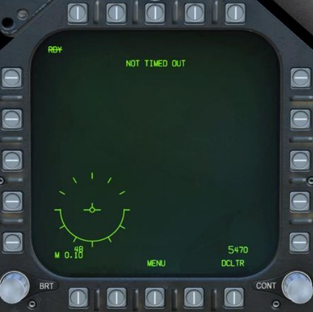
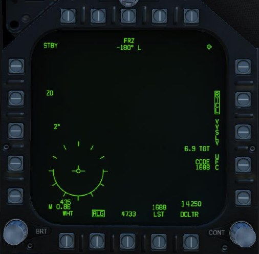
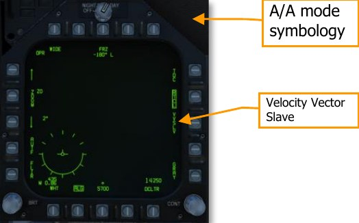
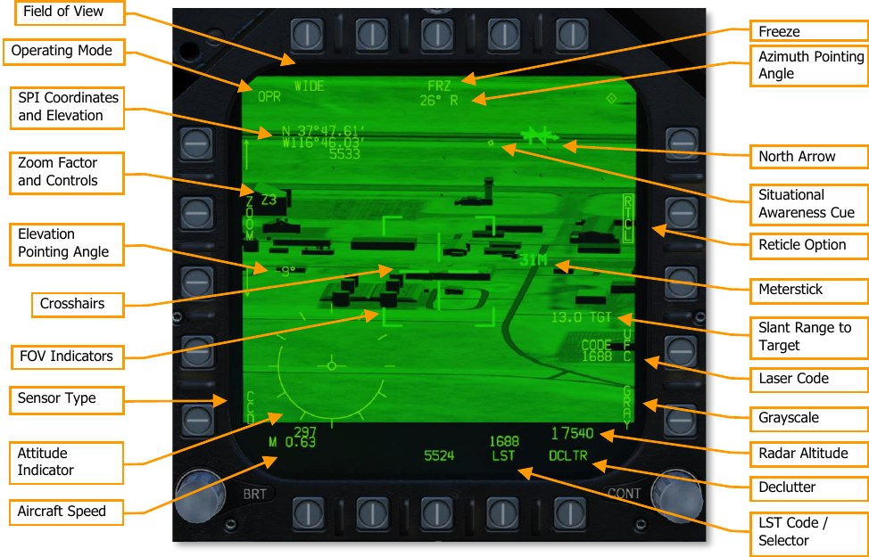
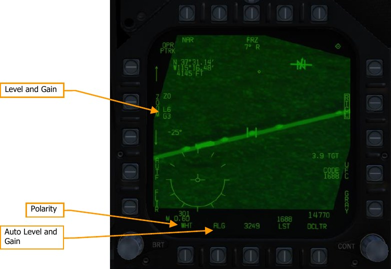
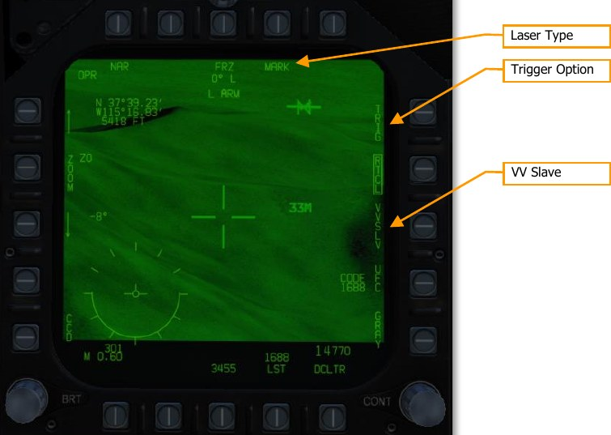
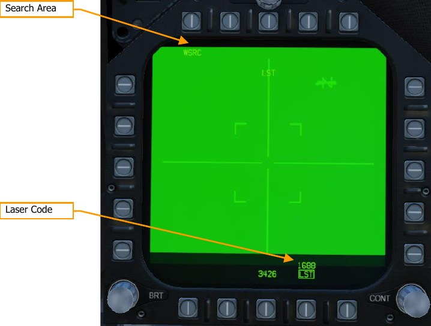
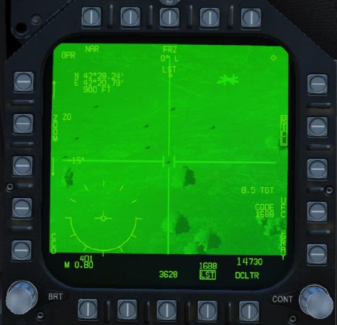
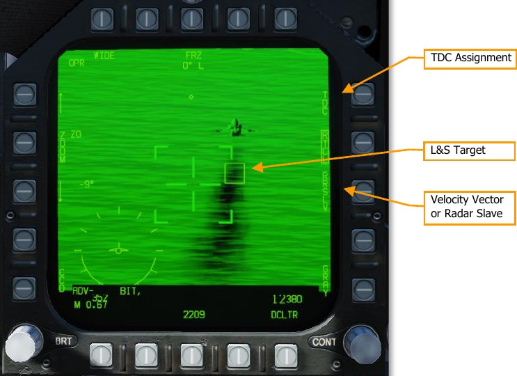

# Litening II Targeting Pod

The Litening II Targeting Pod is a combination TV video and infrared video sensor platform. It
provides the pilot with a live image from either the CCD (which senses light in the visible range) or
the forward-looking infrared (FLIR). The targeting pod is also capable of tracking moving targets,
cueing the designator laser, and searching for other laser designations.

The targeting pod can be selected to either the left or right DDIs, but not the central MPCD. It is
selected from the PB6 on the TAC page with the Master Mode set to A/G or NAV.

The targeting pod camera is slewed using the TDC, when the TDC is assigned to the DDI displaying
the FLIR format. As with other formats, a small diamond appears in the top-right corner of the
display when TDC is assigned to that DDI. TDC assignment is done using the Sensor Control Switch
on the stick.

The three primary operating modes of the targeting pod are standby (STBY), air-to-ground (A/G) and
air-to-air (A/A). The FLIR format also displays when the FLIR is off, or when it is warming up (“not
timed out”).

The targeting pod’s sensor suite is mounted on a gimballed platform that can move in two directions.
The sensor platform is normally stowed when the power switch is in OFF or STBY, when the landing
gear is down, and when the aircraft is stopped on the ground. When airborne and with the targeting
pod active, the sensor platform rotates, exposing the lenses.

The sensor platform is free to rotate in two axes but is limited by obscuration from the aircraft or the
rest of the targeting pod structure. This is true of the FLIR and CCD video, the laser target
designator, and the laser spot tracker. When the sensors are obscured by a part of the aircraft or the
pod itself, the sensors are said to be “masked.”

When the laser target designator (LTD) fires, it modulates the laser signal with a pre-coded pulse
repetition frequency (PRF). This PRF is coded as a four-digit number, from 1211 to 1688, which is
used to distinguish between different simultaneous laser designations made by other aircraft or
ground units. Likewise, when the laser spot tracker (LST) searches for a laser, it does so using a
specific PRF code, and ignores laser spots with a different code (or unmodulated laser emissions with
no code). The code used by the LTD and the one used by the LST need not be the same.

## Targeting Pod Activation

Before the targeting pod can be used, power must be applied. This is done by moving the FLIR
Power switch from OFF to either STBY or ON. After doing so, the targeting pod will enter a warm-up
period. During this time, the FLIR format will display NOT TIMED OUT:

Once the warmup period is complete, if the FLIR Power switch is in STBY, the FLIR format will display
STBY in the upper-left corner, and show standby symbology:

When the FLIR Power switch is in ON, OPR (operating) will display in the upper-left corner of the
FLIR format, but no video will be displayed initially:

To activate video, you must first designate an aimpoint for the targeting pod. In NAV or A/G master
modes, this can be done by designating a sensor point of interest (SPI). For example, you might use
the WPDSG pushbutton on the HSI to designate a target waypoint, or you might acquire an A/G
radar lock. When a SPI is designated, the targeting pod will drive its LOS to that location and begin
transmitting video.

## Air-to-Ground (A/G) Mode

The FLIR is in air-to-ground mode any time the aircraft Master Mode is set A/G.

**Operating Mode.** Line 1 displays STBY if the pod is in standby, and OPR if it is powered on and
operating. Line 2 is blank when the pod is in SCENE mode, or it displays ATRK when the pod is in
area track mode, or PTRK when in point track.

**Field of View.** Depressing this OSB toggles between Narrow Field of View (NFOV) or Wide Field of
View (WFOV). These views can vary between the CCD and FLIR sensors in the TGP. Field of view can
also be toggled using the FLIR FOV button on the throttle.

- FLIR field of view selections:
    - WFOV: 4° × 4°
    - NFOV: 1° × 1°
- CCD field of view selections:
    - WFOV: 3.5° × 3.5°
    - NFOV: 1° × 1°

**Sensor Type.** Sets current video mode, either FLIR (forward-looking infrared) or CCD (charge-
couple device, TV video).

**Target Coordinates/Elevation.** The lat/lon coordinates and elevation in feet of the current target.
This is usually the point in the center of the crosshairs at ground level.

**Zoom Factor and Controls.** Within an FOV selection, you may further adjust zoom factor using
the pushbutton arrows. The zoom range is Z0 (no zoom) to Z9 (highest level of zoom within FOV). Z9
represents double the zoom level of Z0. You can also control zoom level using the radar elevation
control on the throttles.

**Elevation Pointing Angle.** Indicates the current vertical angle away from boresight of TGP LOS.

**Crosshairs.** Indicates sensor line of sight. Sensor line of sight is used when designating targets and
firing the laser designator.

**Field of View (FOV) Indicators.** These four corner brackets are only shown when WIDE FOV is
enabled and indicate the portion of the image that will be displayed if NARO FOV is enabled.

**Freeze.** Freezes video when boxed. Symbology continues to change, representing current
conditions, but the image is frozen. Zoom changes and field of view changes are disabled while FRZ
is boxed.

**Azimuth Pointing Angle.** Indicates the current horizontal angle away from boresight of TGP LOS.

**North Arrow.** The arrowhead indicates the direction of north along the ground in the image.
Additional lines represent east, south, and west.

**Situational Awareness Cue.** The SA cue is a visual indication of LOS. Movement up and down the
display indicates longitudinal (forward and back) movement of the targeting pod LOS, and movement
across the display indicates lateral (left and right) movement of the targeting pod LOS. When the SA
cue is at the center of the display, the pod is pointing straight down.

**Reticle Option.** When boxed, the crosshairs and narrow FOV brackets are displayed in WFOV
mode, and the crosshairs are displayed in NFOV mode.

**Meterstick.** This indicates the length along the ground, in meters, spanned by one of the horizontal
crosshair lines. In the above image, the building directly under the crosshairs is well over 60 meters
wide.

**Slant Range to Target.** The direct line-of-sight range from the targeting pod to the object under
the crosshairs, in nautical miles.

**Laser Code.** Displays the current laser code, which will be used by the LTD when the laser
designator is fired. The code can be changed by pressing the adjacent pushbutton, labeled UFC. See
Designating Targets Using the Laser, below.

**Grayscale.** When boxed, displays a ten-stage grayscale indication, for brightness calibration.

**Attitude Indicator.** Visual representation of the aircraft’s current attitude. The solid portion of the
circle represents the part of an analog attitude indicator that is below the horizon. Removed when
declutter (DCLT) is active.

**Radar Altitude.** Current radar altitude above ground level.

**Aircraft Speed.** Displays current aircraft speed in KCAS and Mach.

**Declutter.** Hides the airplane Mach and velocity indicators, attitude indicator, azimuth steering line,
and sensor field of regard.

**LST Code.** Indicates the laser PRF code that will be searched by the laser spot tracker. Pressing this
pushbutton commands the pod to enter LST mode. (See Using Laser Spot Tracking, below.)

**Auto Level and Gain.** Boxing ALG commands the image processor to automatically control level and
gain for best image clarity. Unboxing ALG reveals the manual level and gain controls.

**Level and Gain.** Shows the current image level (brightness) and image gain (contrast) from the
FLIR. Pressing PB4 (labeled ZOOM) cycles between manual control of ZOOM, LVL (level), and GAIN.
Only shown when ALG is not boxed.

**Polarity.** Cycles between WHT (white hot) and BHT (black hot) image polarity.

**Laser Type.** Pressing this pushbutton cycles between laser types: MARK (target designation laser),
PTR (infrared pointer, used to visually point out targets at night), and BOTH.

**Trigger Option.** When boxed, pressing the trigger fires the laser for two seconds, and pressing and
holding the trigger fires the laser while the trigger is held. When unboxed, the laser automatically
fires:

- when a designation is made, for ranging purposes
- for AGM-65E launches, from when the Maverick is uncaged until 10 seconds after predicted
impact
- for laser guided bombs, from 15 seconds prior to predicted impact until 10 seconds after
predicted impact

**VV Slave.** When boxed, slaves the pod LOS to the total velocity vector (TVV) shown on the HUD.
Does not change the SPI.

### Locating and Tracking Surface Targets

Once targeting pod video is available, the targeting pod LOS initially follows the SPI. When the pod is
in SCENE mode, you can use the TDC to slew targeting pod LOS away from the SPI, to search the
surrounding area for targets. By switching between FLIR and CCD modes using PB1, you can make
concealed or camouflaged targets more visible due to their obvious heat signature against the
background. Use of FLIR mode is also necessary to get usable video at night or low-light situations.

Pressing the sensor control switch right cycles between SCENE, ATRK, and PTRK track modes. ATRK
is used to track stationary vehicles and structures.

PTRK is used when designating moving vehicles. The pod will attempt to maintain a track on the
centroid of the object under the crosshairs. The pod will only be able to maintain track if the object
under the crosshairs stands out from its background. If the tracked object becomes concealed,
masked, or indistinguishable from the background, the pod will enter inertial mode. In inertial mode,
the pod will continue slewing according to the last known direction and speed of the track target. If
the target reappears in the vicinity of pod LOS, the pod will automatically re-acquire track.

In PTRK mode, if the target centroid merges with a different moving vehicle, the pod may mistakenly
switch track to the other vehicle. When this happens, you will have to return to SCENE mode, place
the cursor over the original target, and return to PTRK mode.

In ATRK and PTRK modes, pressing the TDC shows the offset cursor. The offset cursor can be moved
away from the track target. The upper-left datablock, showing coordinates and altitude, will follow
the offset cursor instead of the track target.

### Designating Targets Using the Laser

The laser target designator/rangefinder (LTD/R) is a pulsed laser that is automatically aimed along
pod line of sight. In the designation role, the laser can provide a guidance solution for laser-guided
munitions, both onboard the designating aircraft and from other units; and it can train other
platforms’ sensors onto the designated target. In the range-finding role, the laser provides
continuous target slant range measurements to the aircraft avionics.

To use the LTD/R, the LTD/R switch on the Sensor Control Panel must be set to ARM. When the
LTD/R switch is in ARM, PB9 cycles between laser emitters. When set to MARK, the laser designator
will fire. This laser is invisible to the eye and provides a firing solution for laser-guided munitions like
the GBU-12 and AGM-65E. Normally, the laser will fire automatically when designating a target,
launching an AGM-65E, or dropping an LGB. Boxing the TRIG option (PB11) allows the laser to be
controlled by the trigger. This is useful when buddy-lasing, designating a target for another aircraft to
fire upon.

When the emitter is set to PTR, the LTD/R fires an eye-safe infrared pointer. This pointer is visible at
night when wearing night-vision goggles and is used to visually point out targets. It is not capable of
providing a firing solution to laser-guided munitions.

### Using Laser Spot Tracking

The LITENING pod can also detect and track laser signals emitted by other aircraft or ground units, in
laser spot track (LST) mode. In this mode, the targeting pod searches for a laser signal by a specific
PRF code. When the laser signal is detected, the pod LOS slews to the target being designated by
that laser. Laser spot tracking can by other aircraft or ground units to slew your targeting pod onto
their target.

To set the PRF code that the laser spot tracker searches for, press PB14 (UFC) on the FLIR format.

Pressing PB17 (labeled LST) commands the targeting pod into laser spot track mode. Initially, the
display will be blank and “LST” will flash in the MPCD and HUD. The pod will search for a laser
designation near its LOS, so it’s important to have the pod looking in the expected area of the target
when using LST.

**Search Area.** Toggles between WSRC (wide search) and NSRC (narrow search). Controls the size of
the search area the pod scans.

**Laser Code.** The PRF code that the LST is searching for. “LST” is boxed when LST mode is active.

Once a designation laser is detected, pod LOS will slew to its location, and “LST” will stop flashing in
the MPCD and HUD. You can then unbox LST with PB17 to initiate your own target track with the
pod.

## Air to Air (AA) Page

When the air-to-air master mode is selected, the targeting pod will be in air-to-air mode. This mode
can be used to acquire, track, and monitor airborne targets, designated using either the radar or
visually using the pod itself.

**TDC Assignment.** If the other MPCD is showing the Attack Radar format, this pushbutton toggles
the TDC between the radar and FLIR formats.

**Velocity Vector Slave (VVSLV).** Commands the FLIR LOS to the TVV. This option is only available
when the radar is in search mode, and when the pod is stowed, in auto-track mode, or in inertial LOS
mode.

**Radar Slave (RRSLV).** Commands the FLIR LOS to the radar target designation. This option is only
available when the radar is in track mode.

**Slave Radar.** Commands the radar to scan and track any target along pod LOS, effectively “handing
off” the pod track to the radar. Only available when the pod is in PTRK mode.

**Radar Silent.** Inhibits radar emissions when boxed. Because the FLIR is a non-emitting target
tracking system, inhibiting the radar can prevent the target from becoming aware that they are being
tracked.

### Tracking Aircraft

When initially in air-to-air mode, the targeting pod LOS will be slaved to the total velocity vector
(TVV) in the HUD. You can either locate and designate targets visually, using the pod itself, or by
slaving it to the radar.

#### Tracking Aircraft Using the LITENING II Pod

When the pod LOS is slaved to the TVV, you can visually acquire aircraft in the FLIR FOV by placing
the TVV over the aircraft. When TDC priority is on the FLIR format, pressing Castle Switch in the
direction of the MPCD displaying the FLIR format attempts a point track on a target within FLIR FOV.

If point track is successful, the operating mode will change to PTRK, and tracking gates will show on
either side of the track target (see Figure 234. FLIR Air-to-Air Format (Tracking)).

If the FLIR is tracking the wrong target, or you wish to cease tracking, pressing the VVSLV
pushbutton will return pod LOS to the TVV. While the FLIR is tracking, pressing Castle Switch in the
direction of the MPCD displaying the FLIR format again will cycle between point and area track.

Once the FLIR has a track target, pressing PB9 (SLAVE) will attempt a radar lock at the target along
FLIR LOS.

#### Tracking Aircraft Using the Radar

When the pod is not tracking its own target (e.g., slaved to the TVV), and the radar is in a track
mode (e.g., TWS or STT), pod LOS will automatically follow the L&S target. Once you have a radar
track, you can switch TDC priority to the FLIR format, and then press the Castle Switch in the
direction of the FLIR format again to command point track. This will momentarily freeze pod LOS, so
it’s recommended to wait until target LOS rate is small first. If point track is successful, the operating
mode will change to PTRK, and tracking gates will show on either side of the track target (see [Figure
234. FLIR Air-to-Air Format (Tracking)](#f234)).

Once point track is successful, you can then move TDC priority back to the radar format and change
L&S targets. The pod will continue tracking its own target until you select VVSLV or press the pinky
button to command to cage the targeting pod.
