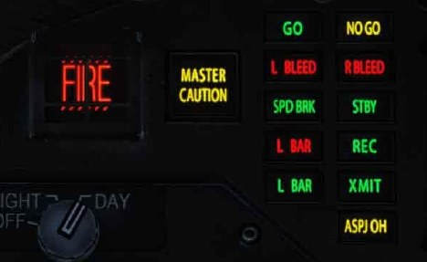
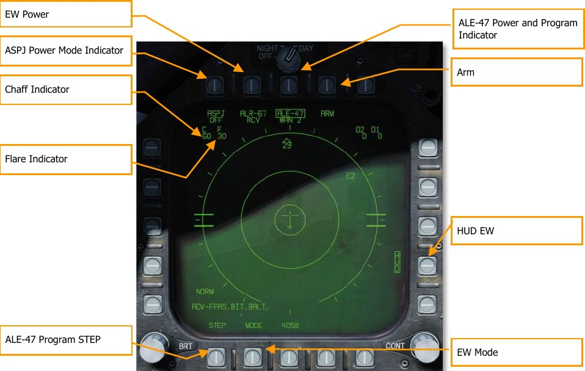
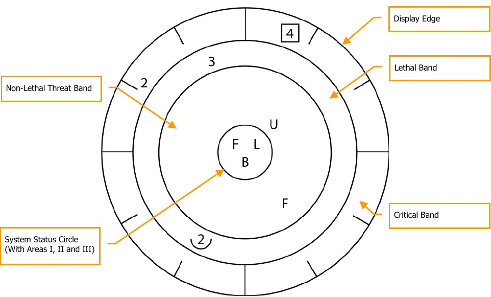
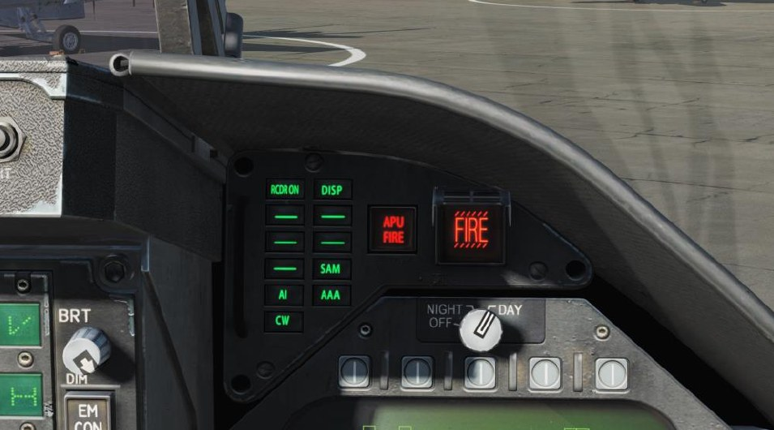
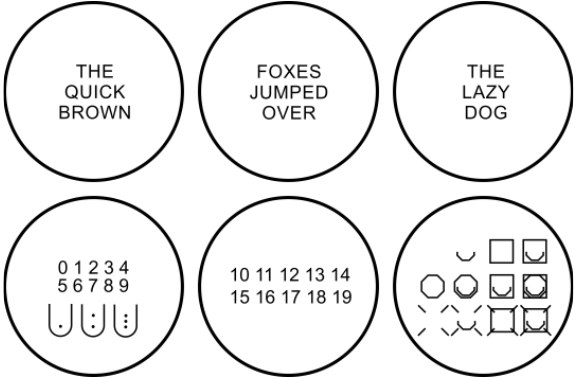
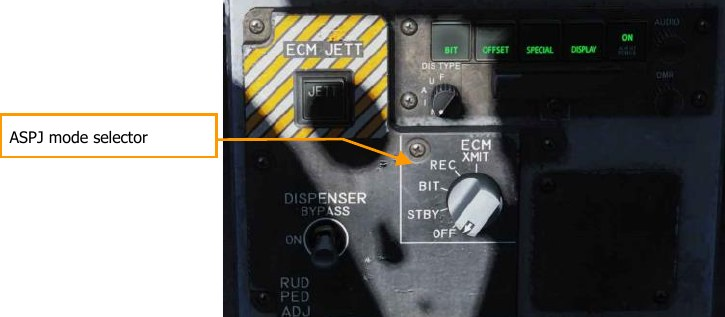
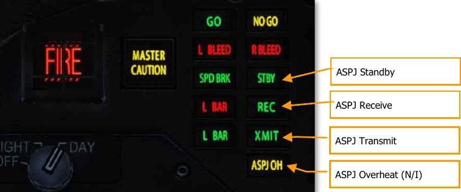

# Hornet Defensive Systems

As this is Digital COMBAT Simulator, you will often find yourself as the target of enemy weapon
systems. The Hornet includes several defensive systems to assist you in your fight to keep alive that
includes expendable countermeasures of chaff and flares and Electronic Countermeasures (ECM).

The lower console instrument group is dominated by the countermeasures dispensing system. This
system provides protection against tracking radar, air-to-air and surface-to-air missiles. Protection is
provided by ejecting chaff, flare, or jammer payloads (GEN-X).

The ALQ-165 Airborne Self Protection Jammer (ASPJ) is the onboard Electronic Countermeasure
(ECM) system. The ALQ-165 detects and deceives threat pulse fire control and guidance radars and
has four operating modes: standby, receive, transmit, and built-in test. This ECM system detects,
processes, and transmits a simulated target echo for deception when a radar signal is received. The
simulated echoes are recognized by the enemy radar as true target returns. Tracking radar then
tracks a false target and breaks lock from the true target. Threat radar indications are indicated as
both lights and the Radar Warning Receiver.

## Integrated Countermeasures Control Panel (ICMCP)

The ICMCP replaces the old ALR-39 panel and moves many of the control functions to the DDI EW
page.

Elements of the ICMCP include:

**Dispenser Jettison Button.** Pressing this button releases all chaff and flares onboard. This switch
only works with no weight on wheels and the button will illuminate when pressed.
Dispenser Mode Select Switch. This switch has three positions:

- **OFF:** Turns the CMDS power off and ALE-47 legend on the EW page has an X through it.
However, the ECM JETT button will still function.

- **BYPASS.** This selection bypasses the EW system entirely. When the throttle dispense
switch is pressed forward, two chaff are released; when pressed aft, two flares are
released, regardless of the selected program. When mode is set to BYPASS, the ALE-47
indication on the DDI EW page will have an “X” through it, and the EW page BIT element
will indicate NOT RDY.

- **ON:** When set to ON, there is a five second warm up period and a BIT is conducted. After
five seconds, it is ready for operation. When in ON mode, the release modes of STBY,
MAN, SEMI, and AUTO can be selected.

    When first set to ON, SF TEST will appear for five seconds below the EW legends on the
DDI EW page. After which, PBIT GO will be displayed for ten seconds. Once that is
complete, OFF or the selected mode will be displayed.

## EW Page

At the bottom of the countermeasure panel is the control indicator. This panel has the following
functions:

**ASPJ Power and Mode Indicator.** Based on the setting of the ALQ-165 ASPJ Power and Mode
Selector, the ASPJ legend will an OFF below it when the ASPJ is set to OFF. When set to one of the
other four modes, the mode is displayed below the ASPJ legend: XMIT, REC, STBY, or BIT. (N/I)

**Chaff Indicator.** This field indicates the number of chaff bundles remaining. A box is placed over
the number when a chaff bundle is released.

**Flare Indicator.** This field indicates the number of flares remaining. A box is placed over the
number when a flare is released.

**ALE-47 Power and Program Indicator.** When the dispenser switch is set to ON, the selected
release program type is displayed below the ALE-47 legend. There are 6 manual (MAN) programs
that can be stored and edited. Semi-Automatic (S/A) and Automatic modes (AUTO) are also available
that will select a program to match the threat and allow the pilot to initiate a program (S/A) or have
the CMDS initiate a program automatically (AUTO). To select manual (MAN) programs, successive
presses of the STEP OSB will cycle through the programs and the name of the selected program will
be displayed below the ALE-47 legend (i.e. MAN 5). If semi-automatic mode is selected, S/A will be
displayed and if automatic mode is selected AUTO will be displayed.

If the ALE-47 is powered off from the ICMCP panel, then OFF will be displayed below the ALE-47
legend.

When first set to ON, SF TEST will appear for five seconds below the EW legends on the DDI BIT
page. After which, PBIT GO will be displayed (EW BIT complete). Once the BIT is completed, the OFF
legend is removed.

Pressing the ALE-47 OSB should box the ALE-47 legend and the C, F, O1, and O2 indications should
appear on the along the top of the EW DDI page with the following values: C 14, F 18, O1 14, and
O2 14.

When the dispensers are set to Bypass, the legend will have a dash through it.

**EW Power.** Indicates power status of the ALR-67(V) system based on the Control Indicator Panel
power button. When un-powered, the EW legend has OFF below it. Also, when disabled, the EW
mode, offset, limit, and HUD status indications on the EW page are removed.

**HUD EW.** Displays EW contact symbols to the HUD when boxed.

**EW MODE.** Successive presses of the mode OSB will cycle through the EW mode options:

- **STBY.** The CMDS has power but cannot dispense countermeasures except for EW JETT.

- **MAN.** Up to six manual programs can be selected and programmed using the PROG sub-
level. Only on MAN mode are the STEP and PROG OSB options visible.

- **S/A.** The CMDS will choose from a library to select the best program against the primary
threat. The pilot though must consent to initiate the program. (Coming later in Open Beta)

- **AUTO.** The CMDS will choose from a library to select the best program against the primary
threat. The CMDS will automatically initiate the program. (Coming later in Open Beta)

**ARM.** When the ALE-47 OSB is pressed and boxed, the ARM legend is displayed. When the ARM OSB
is pressed, the SAVE OSB will appear next to the STEP OSB. Additionally, new manual programming
options will appear. To create a manual program, pressing the ARM OSB displays the CMDS PROG
sub-level. Successive presses of the STEP OSB will cycle through the five, manual programs. The
selected program can be seen in the center of the page (CMDS PROG x). Along the left side of the
page, OSBs to select chaff (CHAF), flares (FLAR), GEN-X decoys (OTH1 and OTH2), release repeat
(RRT), and release internal (INT) parameters are displayed. Pressing one of these OSBs will box the
legend and thereby select it for programming. Using the up and down arrows on the right side of the
page, you may adjust the value of the selected program element. The value for each program
element is displayed in the center of the page. Once complete, pressing the SAVE OSB will have the
parameters to the selected program and pressing the RTN (return) OSB will return to the main EW
page.

**ALE-47 Program STEP.** Manual programs can be cycles through (1-6) with successive presses of
the STEP OSB. The selected program number is indicated below the ALE-47 legend at the top of the
page.

The primary means for dispensing chaff and flares is with the countermeasures dispense switch on
the throttle.

- **Flare / Rear.** Releases one flare from each of the left and right dispensers that contain a
flare in a group of 10.

- **Chaff / Forward.** Released one chaff burst.

### EW Symbols

The EW page displays different symbols for air and ground radars, as well as hostile and friendly
radars:

Symbol | Description
-------|-------------
 | A semicircle above the threat symbol indicates a friendly air-to-air radar (in this case, a friendly F/A-18 Hornet).
 | A “house” enclosing the threat symbol indicates a surface-to-air radar (in this case, a Hawk ADS).
 | An open triangle over the threat symbol indicates an enemy air-to-air radar (in this case, an enemy MiG-19)
 |  “19” in house would indicate an SA-19 surface-to-air radar  (2S6 Tunguska).

## Azimuth Indicator

Detected radars by the ALR-67(V) are displayed on the Azimuth Indicator (aka Radar Warning
Receiver) and on the HUD when enabled.

When a radar emitter is detected, the ALR-67(V) Azimuth Indicator visually indicates the radar signal
source with a coded symbol. The coded symbol indicates the type of emitter detected, and its
position on the azimuth indicator indicates the relative bearing to the emitter. The ALR-67(V) system
detects multiple emitters and provides relative bearing to each emitter. Audio tones are produced as
an advisory for emitter, or BIT status change. This will mirror the DDI EW page.

The emitter and status display is shown on the azimuth indicator when power is applied to the ALR-
67(V) system. When an emitter is detected and analyzed by the ALR-67 system, an alphanumeric
symbol representing the emitter is displayed. Certain types of emitters, when detected, are assigned
unique alphanumeric symbols for display.

The azimuth position of the displayed emitter symbol represents the relative bearing of the emitter
with respect to the nose of the aircraft. As an example, the image above shows a naval threat
enhancement (boat symbol) at 40°.

The display area of the azimuth indicator is divided into four unique areas listed below:

- Critical band
- Lethal band
- Nonlethal band
- Status circle

The critical band is the outermost band in which specific threats or modes of lethal threats are
displayed. Azimuth tic marks are engraved in the outer most portion of the critical band. The tic
marks are in 30° increments. The lethal band is the second band in from the outer most portion of
the display. Emitters displayed in the lethal band are threats that have been determined to be lethal.
The nonlethal band is the innermost band of the display. Emitter symbols in the nonlethal band
represent unknown and friendly emitters. Known emitters that have been determined to be nonlethal
are also displayed in the nonlethal band.

The status circle is in the center of the azimuth indicator and displays ALR-67(V) system status. The
status circle is divided into three areas of display:

- Upper left quadrant of circle (area I)
- Upper right quadrant of circle (area II)
- Bottom half of circle (area III)

Area I displays the priority setting of the EW Mode as set on the EW page (N, I, A, U, or F).

Area II is either blank when ALR-67(V) system is operating in the full display mode or displays the
character L when operating in the display limit mode.

Area III displays current ALR-67(V) Built-In Test (BIT) status. Area III is blank when there are no
ALR-67(V) system failures. The character B is displayed when a failure is detected. The character T is
displayed when a thermal overload has been detected in Countermeasures Computer or Radar
Receiver.

Any time a new emitter symbol is displayed on the azimuth indicator, or an emitter symbol goes from
a less lethal to a more lethal band, a status change tone is generated by the ALR-67(V) system. Special
tones are also generated for specific threats or critical threat modes of operation. Threats no longer
transmitting or going from a more lethal to a less lethal band do not cause a status change tone.

## Right Instrument Panel Warning / Advisory / Threat Display Panel

Working as part of the ALR-67, green warning lights at the top of the right instrument panel alert the
pilot of the type of radar energy painting the aircraft:

- **AI:** Hostile air intercept radar in lock mode (lethal band)
- **CW:** Hostile radar in continuous wave mode and probably guiding a missile (critical band)
- **SAM:** Surface-to-Air Missile radar that has locked on (critical band)
- **AAA:** Radar directed anti-aircraft artillery.
- **DISP.** The ALE-47 has a program ready for the detected threat and is waiting for start
consent. In addition, a DISPENSE cue will be displayed on the HUD. (Coming later in Open
Beta)
- **GO and NO.** BIT result from when the Dispense switch is set to ON or BYPASS. BIT will
take five seconds.

## BIT

When conducting an EW BIT, both graphical and audio tests will be run.

On both the EW page and azimuth indicator, the following test images will be displayed with three
seconds between each.

In parallel, each of the ALR-67 tones would be played. These include:

- New Contact (waterfall)
- AAA
- Missile Launch
- Radar Lock
- Power Up

## Control Indicator Panel

At the bottom of the countermeasure panel is the control indicator. This panel duplicates the
functions on the DDI EW page. This panel has the following functions:

**POWER.** Turns the ALR-67(V) system on and off. When pressed to the on position, the POWER,
DISPLAY, SPECIAL, OFFSET AND BIT light will illuminate.

**LIMIT.** When pressed, LIMIT light on DISPLAY pushbutton switch comes on and emitter display is
limited to the six highest priority emitters. An “L” will be displayed in status circle area II on azimuth
indicator. Pressing again deselects the option.

**OFFSET.** When pressed, ENABLE light on OFFSET pushbutton switch comes on, and overlapping
symbols on azimuth indicator are separated to ease reading of display. Pressing again deselects the
option. (Coming later in Open Beta)

**BIT.** When pressed, enables current BIT status to be displayed on the azimuth indicator. FAIL light
on BIT pushbutton switch will come on whenever periodic BIT detects a failure. Pressing again
deselects the option.

**Dimmer.** Controls brightness of the lamps on the control-indicator. Clockwise rotation increases
brightness, counterclockwise rotation decreases brightness.

## HOTAS

On the throttle, there is a three-place switch for countermeasures.

- **Center.** This is the OFF position and no dispense action is taken.
- **Aft.** When in BYPASS mode, this will release one flare. If not in BYPASS mode or OFF,
AUTO, S/A, or MAN mode will initiate the program.
- **Forward.** When in BYPASS mode, this will release one chaff bundle. If not in BYPASS
mode or OFF, it will initiate manual program 5.

## Airborne Self-Protection Jammer (ASPJ)

The Lot 20 F/A-18C Hornet is equipped with the AN/ALQ-165 Airborne Self-Protection Jammer, or
ASPJ. The ASPJ is an integrated electronic countermeasures system that can detect and analyzing
inbound radar locks and selecting appropriate electronic countermeasures (jamming programs) to
counter the lock.

The ASPJ is a “gate-stealing” jammer. In contrast to a noise jammer, which attempts to deny the
enemy a target lock by overloading his radar receiver with radio noise, a gate-stealing jammer lures
the radar into tracking a “cover pulse,” a false echo generated by the jammer that is much more
intense than the actual echo. Once the enemy radar is tracking the cover pulse, the jammer can
modulate the signal to walk the range or velocity gate off the actual aircraft, then break the radar
lock by ceasing its transmissions.

The ASPJ is itself capable of detecting inbound radar locks and can also use data from the AN/ALR-67
radar warning receiver to determine when to run jamming programs.

The ASPJ mode is controlled with the ECM knob on the lower center console.

The mode is indicated on the EW page adjacent PB8:

**OFF.** The ASPJ is powered down. The “ASPJ” moniker will be crossed out on the EW page.

**STBY.** The ASPJ powers on and completes its warmup and built-in tests (BIT). It will not transmit or
receive. The warm-up period takes approximately five minutes to complete. When the BIT is
complete, the STBY light on the left alert panel will illuminate.

**BIT:** Not implemented.

**REC:** The ASPJ is powered on and will detect and alert for inbound radar locks.

**XMIT:** The ASPJ has consent to jam. It will automatically initiate jamming when a radar lock is
detected.

When the ASPJ detects a radar lock, the REC light will illuminate on the left alert panel. If the ASPJ is
in XMIT mode, the XMIT light will also illuminate during jamming. A “JAMMER ON” indication will
display on the attack radar format during transmission.

### Employing the ASPJ

The ASPJ should be powered on in STBY mode prior to entering the combat area. The warmup
period takes up to four minutes, during which BITs are run. If all BITs pass, the GO and STBY lights
will illuminate. The ASPJ should be placed into REC mode when enemy radar activity is expected.

The jammer should be placed in XMIT mode as needed during engagements. Jamming creates a
great deal of radar energy, which makes it easier for enemy radars to determine the azimuth of your
aircraft, while denying them range information or a radar lock. The jammer could potentially alert
enemy aircraft of your azimuth before they would normally detect you, so it should be left off until
the enemy is already aware of your presence. The jammer can then be used deny radar lock.

At closer ranges, the jammer will be unable to generate cover pulses of sufficient intensity to mask
actual radar returns. This is called “burn-through,” and closer than this point, the jammer will be less
effective at breaking lock. In addition, some missiles, such as the AIM-7 Sparrow and AIM-120
AMRAAM, have a home-on-jam (HOJ) mode, where the missile switches to passive radar guidance
and homes in on the radar energy from your jammer. For these reasons, the jammer should be
switched off during medium- to close-range engagements.
