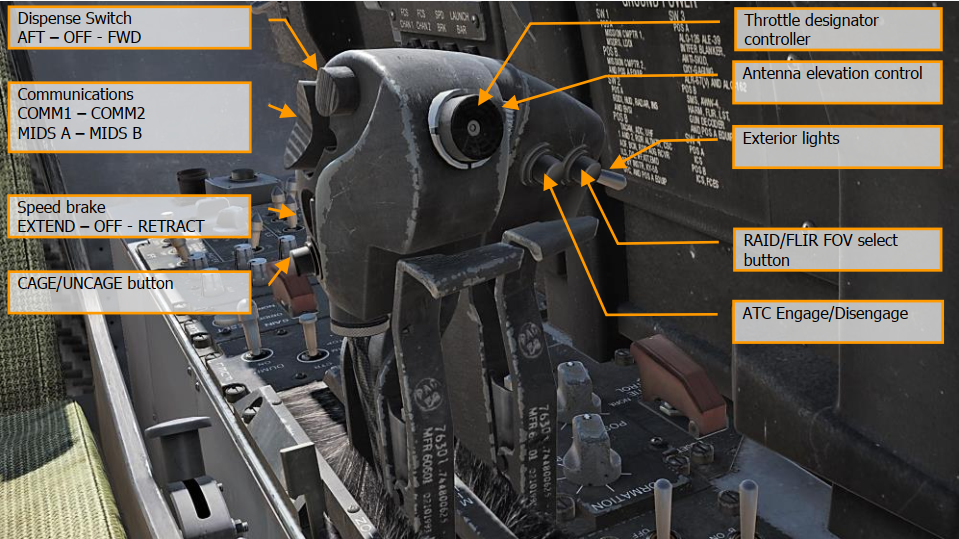
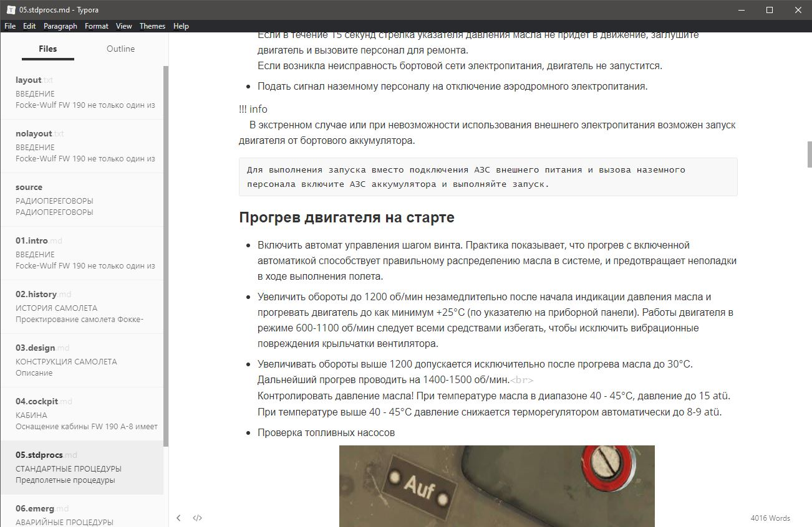

# Project Contribution

## How it works

Every page presented in main menu basically is a [Markdown](https://www.markdownguide.org/getting-started/) .md file. 
The site is built with [Mkdocs](https://www.mkdocs.org/) from markdown files and images.
One can examine raw files contents and structure on [github repository page](https://github.com/lord-vesel/dcs-doc/).

## Workflow

### Exporting PDF data

To export data [poppler-utils](http://poppler.freedesktop.org) `pdftotext` and `pdfimages` may be used. 
Alternatively exported text may be obtained from [project lead](people.md).

pdftotext recommended options: `-nopgbrk -y 60 -W 1280 -H 600 -layout`

Exported text must be splitted to chapters, one per .md file.

One file may contain only one [first level header](/help/#_12).

### Working with images

Images are stored in a subfolder relativly to markdown files. Links to images must be relative ``.

Orange notes over images are not exported, such images should to be screnshot.



#### Image requirements

Naming: page number - dash - position on page (71-1.jpg).

Up to 1000px width, 80% compression.

Screenshot image must not include shadow if it exists in original PDF.

### Markdown editors

For windows:

[Markdown Monster](https://markdownmonster.west-wind.com/): Ability to paste images from clipboard and save to subdirectory.


[Typora](https://typora.io/#windows): Ability to paste images from clipboard, saving to subdirectory must be enabled in settings.
Offers visual editing, which is not always convinient.



### What we get

Converted documentation must be presented as directory containg .md files, one per chapter, and subdirectory contaning images.

## Briefly about the Markdown syntax

Markdown is a concise and minimalistic way to mark up a document. This brings both ease of use and limitations that make it impossible to create a complex layout, such as combining cells in a table.

### Basic syntax

[Syntax description on the Markdown site](https://www.markdownguide.org/basic-syntax/)

#### Параграфы

Paragraphs are separated by empty lines. A line break in raw Markdown will not be displayed as a new line in HTML.

Example:

```
Уборка шасси производится 
на скоростях по прибору до 250 км/ч.
После отрыва слегка
нажмите тормоза, 
чтобы остановить 
вращение колес, 
после чего можете убрать шасси.
```

Результат:

> Уборка шасси производится 
> на скоростях по прибору до 250 км/ч.
> После отрыва слегка
> нажмите тормоза, 
> чтобы остановить 
> вращение колес, 
> после чего можете убрать шасси.

Пример параграфа:

```
Уборка шасси производится 
на скоростях по прибору до 250 км/ч.

После отрыва слегка
нажмите тормоза, 
чтобы остановить 
вращение колес, 
после чего можете убрать шасси.
```

Результат:

> Уборка шасси производится 
> на скоростях по прибору до 250 км/ч.
> 
> После отрыва слегка
> нажмите тормоза, 
> чтобы остановить 
> вращение колес, 
> после чего можете убрать шасси.


Это очень облегчающая жизнь особенность, в контексте обработки ПДФ, так как не нужно заботиться о висящих строках.

Если всё же необходимо перенести строку, не создавая новый абзац, нужно использовать тег `<br>`, что часто востребовано при оформлении заголовков таблиц:

```
Ручка, <br>угол поворота | Наддув, <br>ata| Обороты, <br>об/мин
-------|------|--------
22°    |  0.8   | 1500
26°    |  0.85  | 1600
```

Результат:

Ручка, <br>угол поворота | Наддув, <br>ata| Обороты, <br>об/мин
-------|------|--------
22°    |  0.8   | 1500
26°    |  0.85  | 1600

#### Заголовки

Заголовками мы задаём иерархию документа, по которой создаётся содержание в правой части страницы.

Синтаксис:

	# Заголовок 1
	## Заголовок 2

!!! warning
    В одном документе может быть только один заголовок первого уровня.
    Им определяется наименование страницы в главном меню.

    Вся навигация по документу строится, начиная со второго уровня.

#### Списки

Маркированные списки формируются дефисом и пробелом перед каждым элементом.

Второй уровень вложенности задаётся четырьмя пробелами перед дефисом.

    - Проверить работу подкачивающих насосов топливных баков;
    включать на панели переключателей топливной системы по одному
    АЗС каждого насоса и контролировать давление топлива
    (0,3-0,4 atü) по прибору. Выключить насосы.
    - Включить бензонасосы:
        - E14   Бензонасос переднего бака
        - E13   Бензонасос заднего бака
        - E16   Бензонасос подвесного бака, если он используется
        - E96   Насос системы дополнительного бака, если необходимо

Результат:

> - Проверить работу подкачивающих насосов топливных баков;
> включать на панели переключателей топливной системы по одному
> АЗС каждого насоса и контролировать давление топлива
> (0,3-0,4 atü) по прибору. Выключить насосы.
> - Включить бензонасосы:
>     - E14   Бензонасос переднего бака
>     - E13   Бензонасос заднего бака
>     - E16   Бензонасос подвесного бака, если он используется
>     - E96   Насос системы дополнительного бака, если необходимо

Нумерованные списки формируются цифрой (не важно какой), точкой и пробелом перед каждым элементом:

    1. в условиях высокой влажности и при температурах ниже 0°с включите обогрев трубки
        пито и лобового стекла.
    1. включите оба бензонасоса и переключите топливомер на задний бак.
    1. в случае, если полет проводится с подвесным топливным баком, включите бензонасосы
        только заднего и подвесного баков.
    2. установите щитки во взлетное положение на пульте на левой панели.

Результат:

> 1.  в условиях высокой влажности и при температурах ниже 0°с включите обогрев трубки
>     пито и лобового стекла.
> 1. включите оба бензонасоса и переключите топливомер на задний бак.
> 1. в случае, если полет проводится с подвесным топливным баком, включите бензонасосы
>     только заднего и подвесного баков.
> 2. установите щитки во взлетное положение на пульте на левой панели.

Если в элемент списка нужно добавить абзац, картинку, таблицу и т.п.,
не прерывая нумерацию,
то этот блок должен иметь отступ в четыре пробела от начала строки, а так же отделён пустыми строками до и после:

    1. Установить шаг винта на 12:00, отключить автоматическое управление шагом винта.
    2. Выполнять прогон без задержек. Контролируйте параметры работы по таблице:
    
        Шаг винта | Обороты, об/мин | Наддув, ata | Давление топлива, atü | Давление масла, atü | Температура масла, °С
        ----------|-----------------|-------------|-----------------------|---------------------|----------------------
        12:00 часов (Базовая настройка 12:35 при 25°) | 2430 ± 40 | 1,42 | От 1,25<br>До 1,75 | 15<br>8-9 | до 45<br>выше 45
    
        Проверка магнето и свечей зажигания на 2400 об/мин – последовательно переключать магнето в положения М1 и М2.<br>
        Обороты двигателя не должны упасть более, чем на 50 об/мин.
    
    3. Проверка автомата управления шагом винта. Контролировать соответствие параметров “Наддув – Обороты” по таблице:
    
        Наддув, <br>ata | Связанные обороты, <br>об/мин
        ------------|------------
        0,85 | 1600
        0,9 | 1700
        1,0 | 1900
        1,05 | 2000
        1,10 | 2100
        1,14 | 2250
        1,28 | 2350
        1,32 | 2400
        1,42 | 2700
    
        При включении автомата шага винта показатели приборов не должны отличаться от табличных значений более,
        чем на ±80 оборотов. Причина расхождений: инертность центрального поста управления и неточность индикации тахометра.
    
    4. Избегайте длительной работы двигателя на малых/холостых
    оборотах по причине недостаточной смазки клапанов и, если
    требуется более длительное время ожидания, установите обороты 1200 об/мин.

Результат:

> 1. Установить шаг винта на 12:00, отключить автоматическое управление шагом винта.
> 2. Выполнять прогон без задержек. Контролируйте параметры работы по таблице:
> 
>     Шаг винта | Обороты, об/мин | Наддув, ata | Давление топлива, atü | Давление масла, atü | Температура масла, °С
>     ----------|-----------------|-------------|-----------------------|---------------------|----------------------
>     12:00 часов (Базовая настройка 12:35 при 25°) | 2430 ± 40 | 1,42 | От 1,25<br>До 1,75 | 15<br>8-9 | до 45<br>выше 45
> 
>     Проверка магнето и свечей зажигания на 2400 об/мин – последовательно переключать магнето в положения М1 и М2.<br>
>     Обороты двигателя не должны упасть более, чем на 50 об/мин.
> 
> 3. Проверка автомата управления шагом винта. Контролировать соответствие параметров “Наддув – Обороты” по таблице:
> 
>     Наддув, <br>ata | Связанные обороты, <br>об/мин
>     ------------|------------
>     0,85 | 1600
>     0,9 | 1700
>     1,0 | 1900
>     1,05 | 2000
>     1,10 | 2100
>     1,14 | 2250
>     1,28 | 2350
>     1,32 | 2400
>     1,42 | 2700
> 
>     При включении автомата шага винта показатели приборов не должны отличаться от табличных значений более, чем на ±80 оборотов. Причина расхождений: инертность центрального поста управления и неточность индикации тахометра.
> 
> 4. Избегайте длительной работы двигателя на малых/холостых оборотах по причине недостаточной смазки клапанов и, если требуется более длительное время ожидания, установите обороты 1200 об/мин.

#### Таблицы

Как видно из примеров выше, таблицы рисуются, разделяя ячейки вертикальными чертами.
Первая строка - заголовок, вторая, состоящая из дефисов - отделяющая загловок от содержательной части.

Число ячеек в каждой строке должно совпадать.

Объединить ячейки нельзя. Если встречается подобная конструкция:


то можно вынести дублирующие значения в скобки:

    Вес, кг | Длина разбега, м<br>Бетон (Трава) | Скороподъемность<br>после взлета, м/с<br>(щитки 10°) | Длина пробега, м<br>Бетон (Трава) | Время пробега, с <br>Бетон (Трава)
    ---|-------|--------|--------|-------
    4000 |  640 (660)  | 11 | 380 (400) | 14,5 (15,5)
    4500 |  780 (820)  | 9  | 520 (560) |  18  (19,5)
    5000 |  960 (1110) | 7  | 680 (730) |  22  (24)
    5500 | 1200 (1280) | 5  | 880 (960) | 26,5 (29,5)

Результат:

Вес, кг | Длина разбега, м<br>Бетон (Трава) | Скороподъемность<br>после взлета, м/с<br>(щитки 10°) | Длина пробега, м<br>Бетон (Трава) | Время пробега, с <br>Бетон (Трава)
---|-------|--------|--------|-------
4000 |  640 (660)  | 11 | 380 (400) | 14,5 (15,5)
4500 |  780 (820)  | 9  | 520 (560) |  18  (19,5)
5000 |  960 (1110) | 7  | 680 (730) |  22  (24)
5500 | 1200 (1280) | 5  | 880 (960) | 26,5 (29,5)

#### Иллюстрации

Формируются следующим образом:

    

Содержимое квадратных скобок становится подписью.

Результат:


#### Ссылки

Синтаксис отличается от картинок только отсутствием восклицательного знака в начале.

    [Сайт mkdocs](https://www.mkdocs.org/)

Результат:

[Сайт mkdocs](https://www.mkdocs.org/)


### Дополнительные элементы

В проекте с помощью плагинов и расширений для python-markdown используется
дополнительный синтаксис. Эти элементы не будут корректно отображаться в markdown-редакторах.

#### Admonition

Блоки подсказок, предупреждений, информации и т.п.

Синтаксис:

    !!! warning
        Электрический стартер использовать с подключенным внешним электропитанием!
    
        Бортовой аккумулятор применять только в чрезвычайных ситуациях!
    
    !!! info
        В экстренном случае или при невозможности использования внешнего
        электропитания возможен запуск двигателя от бортового аккумулятора.

Результат:

!!! warning
    Электрический стартер использовать с подключенным внешним электропитанием!

    Бортовой аккумулятор применять только в чрезвычайных ситуациях!

!!! info
    В экстренном случае или при невозможности использования внешнего
    электропитания возможен запуск двигателя от бортового аккумулятора.

[Подробнее о возможных типах блоков.](https://squidfunk.github.io/mkdocs-material/extensions/admonition/#types)

#### Подстветка клавиатурных сочетаний

Синтаксис:

    Переключатель зажигания (магнето) перевести в положение M1+М2.
    Вперед [[End]], назад [[RShift]] + [[End]].

Результат:

> Переключатель зажигания (магнето) перевести в положение M1+М2.
> Вперед [[End]], назад [[RShift]] + [[End]].


