# QUICKSTART GUIDE

## How do I install this module?

Upon first starting DCS World after purchasing DCS: Supercarrier, you will first want to install the module. To do
so, select the Module Manager along the top of the Main Menu page:

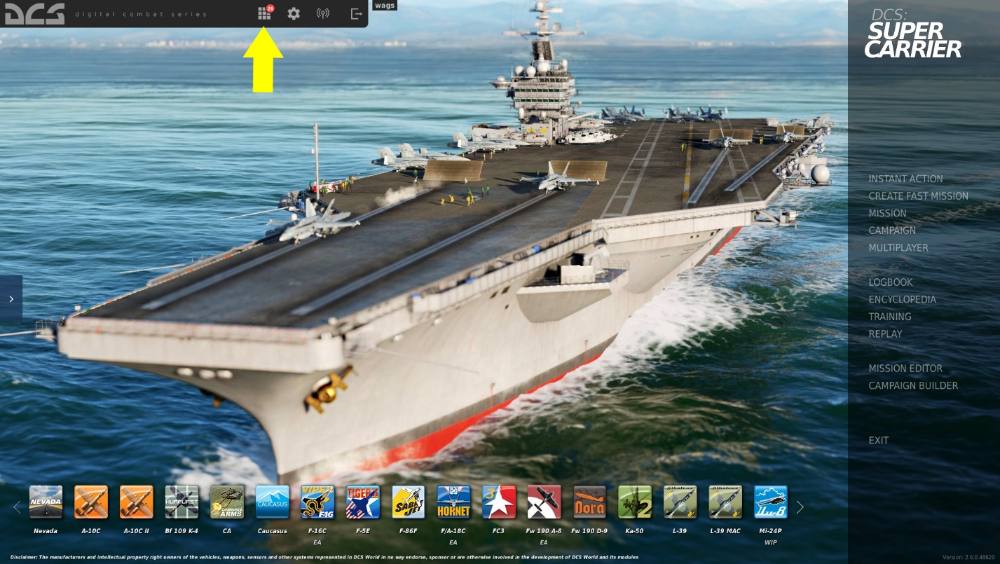

Once selected, the Module Manager will automatically prompt you to install DCS: Supercarrier.

## How do I know the module is installed?

You should now have DCS: Supercarrier installed and have its icon along the bottom of your Main Menu page.
You may need to use the left and right arrows at the ends of the icon bar to find it. From the icon, you can select
it as your Main Menu wallpaper.

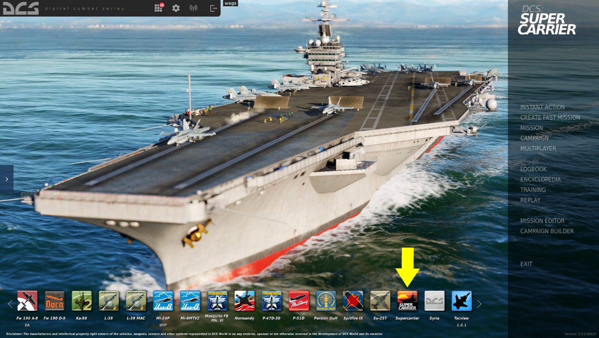

## How do I select a Supercarrier mission?

All missions on the Supercarrier are found in the aircraft Missions. There is not a Supercarrier Missions list. For
instance: to select F/A-18C Hornet missions that operate from the Supercarrier, select Missions from the Main
Menu page, and then select the F/A-18C.

Included are Hornet Supercarrier missions on both the Black Sea and Persian Gulf maps for:
 - Cold Start
 - Launch Start from Catapult
 - Case I Recovery (daylight landing)
 - Case II Recovery (reduced visibility)
 - Case III Recovery (night landing)

To get you started, select the “Mission Qualification – Supercarrier Launch” mission. This will place you hooked
up to catapult 1 and ready to go.

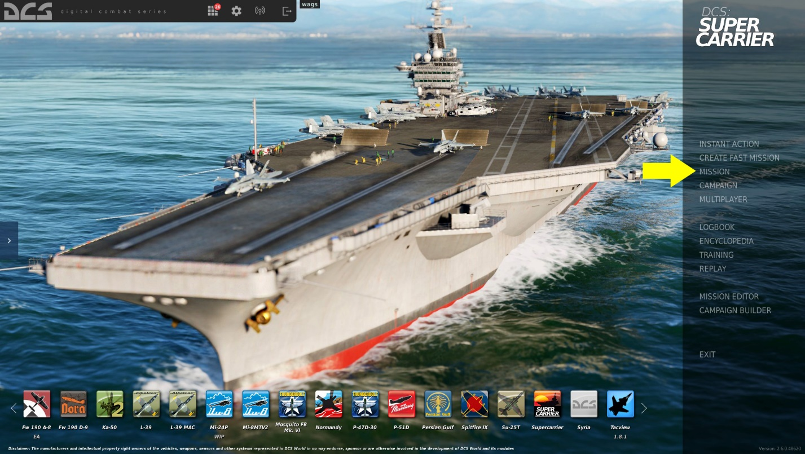

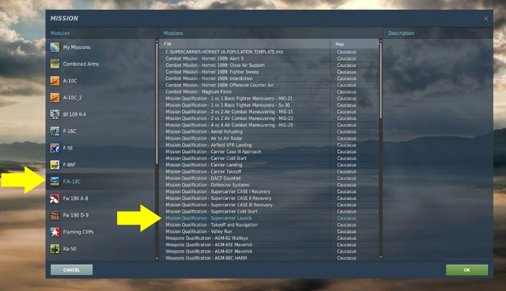

## Creating Your Own Mission

Once you have mastered the included familiarization Missions, you may wish to create your own using the
Mission Editor. Let’s go over some of the basics of how to add a Supercarrier.
Select the Mission Editor option from the Main Menu.

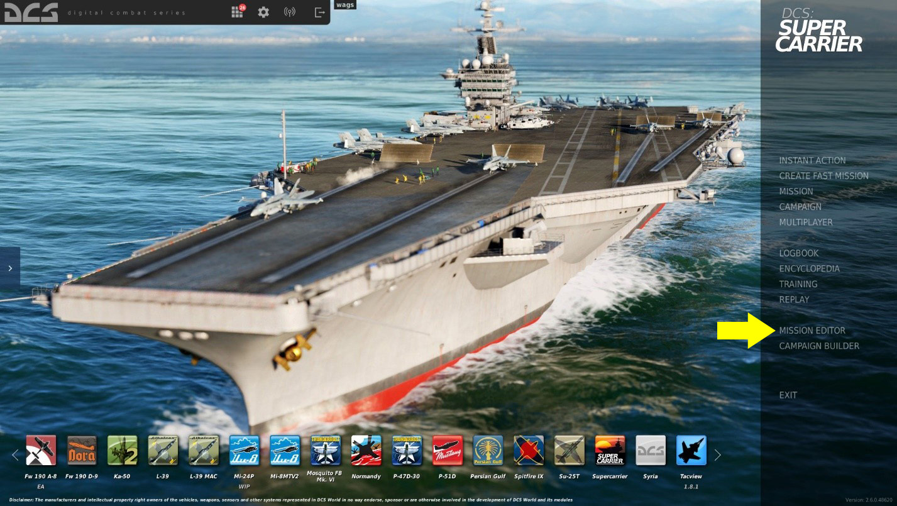

Next, select Create New Mission.

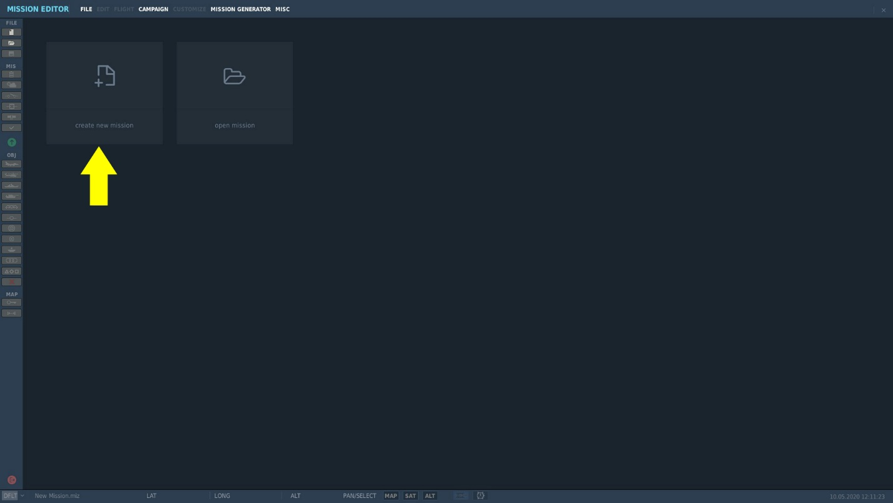

The next step is to select the map you wish to use as your canvas and the countries that will take part. In this
example, I have chosen the Persian Gulf map with the default Modern arrangement of countries to the Blue and
Red sides. Once ready, press the green OK button in the bottom right corner.

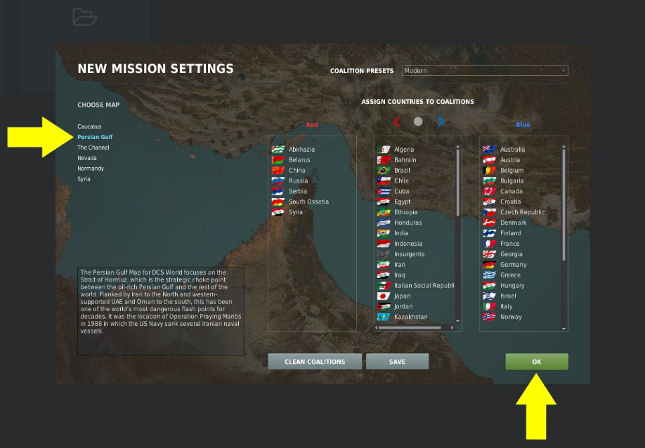

Welcome to the Mission Editor (ME)! This is a powerful system, but it can also be complex. Let’s go over the
very basics of adding a Supercarrier to a mission. From the Tool Bar along the left side of the ME, select the
ship icon. With that selected, the Naval Group options are displayed along the right side of the ME. To select a
Supercarrier:

1. Select Country to USA
2. Select Type to CVN-71 Theodore Roosevelt (you can select any of the listed CVNs)

Once set, left mouse-click on any sea area of the ME to create its starting location.
The Supercarrier location appears as a stylized icon with its air defense weapon search (yellow) and
engagement (red) circles around it.

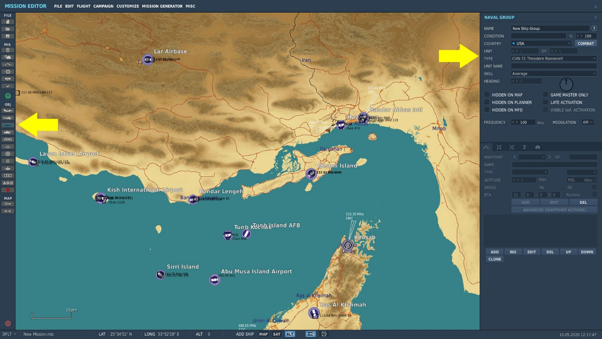

With the ADD button selected, left click again on the map to set the Supercarriers first navigation point.
Subsequent left mouse button clicks add more navigation points to create a route the Supercarrier will follow.

By selecting the EDIT button to the right of the ADD button, you can left mouse button click on a navigation
point to edit it, including holding down the left mouse button over the point and dragging it to a new location.

With the navigation point selected, you can adjust the speed of the supercarrier. With no wind, it is best to have
speed between 20 and 30 knots.

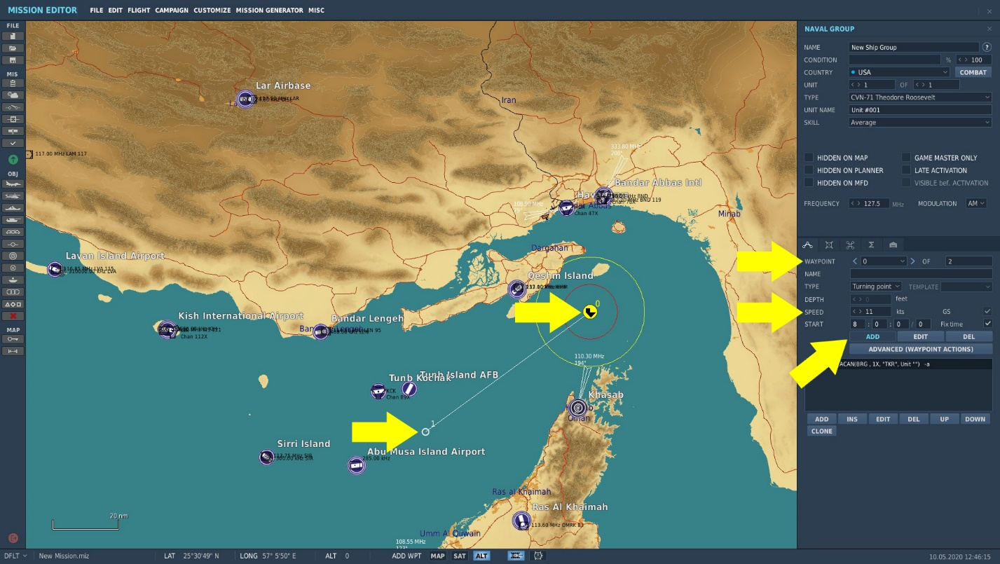

With the Supercarrier placed, you can then add an F/A-18C Hornet to the mission and place its first waypoint
next to the carrier. You can then set its first waypoint from the Type waypoint list to have it start on a catapult
(Takeoff from runway), start ready to go at a parking spot, or start from a cold and dark aircraft in the parking
area.

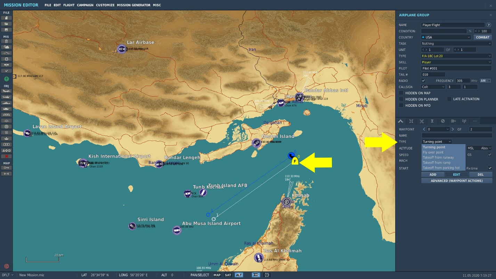

This was a brief overview to get you started. More detailed information can be found in the DCS: World manual,
with step by step guides to setting up the following:

 - Set TACAN channel
 - Set ICLS channel
 - Set Rules of Engagement
 - Setting weather conditions that include wind direction and speed
 - Setting radio frequency

## Catapult Start

As mentioned, the Mission Designer can elect to start your aircraft on a catapult or at one of the parking
locations. If you start on a catapult, you simply need to provide the Salute command to the deck crew and away
you go. This can be done either with the key command [[Left Shift + Left Control + S]] or pressing [[\]] to bring up the
radio menu dialog:

Select F11. Parent Menu

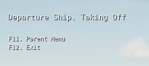

Select F8. Ground Crew…

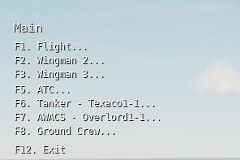

Select F6. Salute!

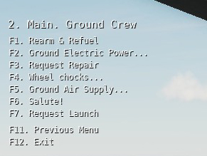

## Taxi to Catapult

If you find yourself at one of the parking locations in either a cold and dark aircraft or one ready to go, you will
need to taxi to a takeoff catapult. There are four catapults located on the Supercarrier: two on the bow and two
along the waist.

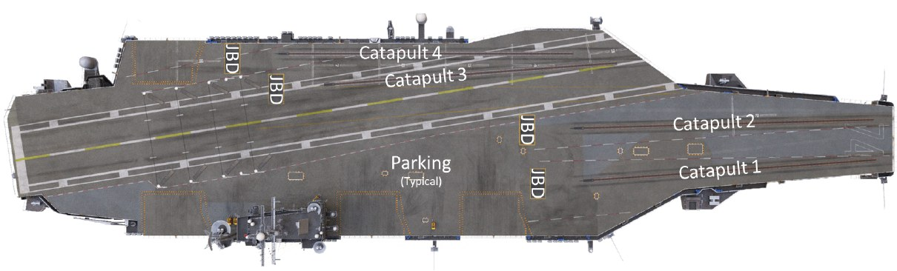

Behind each catapult is a Jet Blast Deflector (JBD). When you taxi to a catapult, taxi to approach the catapult
from directly behind it and slowly move forward until the taxi director (yellow shirt) on the catapult directs you.

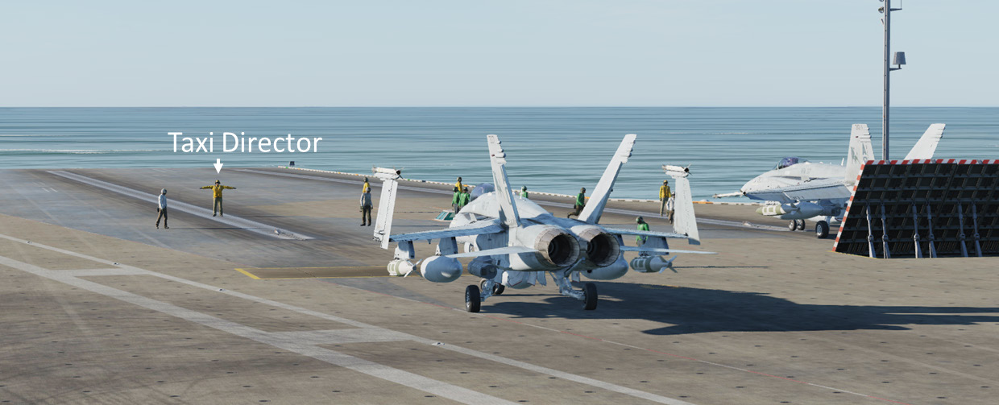

Based on other aircraft being launched, this may not be immediate. Sit tight and the taxi director will bring you
onto the catapult once they are ready.
The catapult hook-up procedure is detailed in the Launch Operations section below.

## Returning to the Boat

Recovery (landing) operations are more complicated than launching. These are explained in detail within the
Recovery Operations section below.

## Fly Safe and Have Fun

We hope this gets you up and flying with DCS: Supercarrier. Please remember that the following sections are
available to provide detailed instruction on both launches, and more importantly, recovery operations. It also
discusses other elements of the module that include the Landing Signal Officer (LSO) station, the landing
grading scores, and more.
