# THE NIMITZ CLASS AIRCRAFT CARRIER

## Overview

The Nimitz class aircraft carrier (CVN) is a set of ten nuclear powered aircraft carriers currently in service with
the US Navy. The general arrangement of these ships is similar to the previous Kitty Hawk class with a large
4.5-acre flight deck with an island structure on the starboard side reaching nearly 20 stories tall. The angled
deck used for landing is canted approximately 14 degrees to port and is almost 800 feet long. Four high speed
aircraft elevators, each more than 4,000 square feet, bring planes to the flight deck from the hangar below.

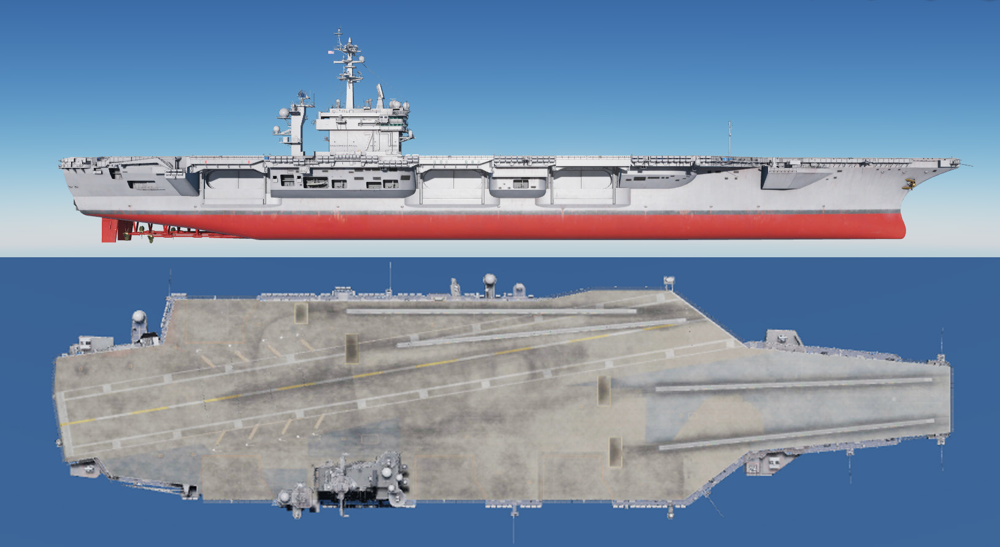

 - Displacement: 72,916 tons light, 96,000 - 102,000 full load.
 - Length: 1040 feet along the flight deck (317 meters).
 - Beam: 252 feet (76.8 meters).
 - Speed: 30+ knots (34.5+ miles per hour).
 - Power Plant: Two nuclear reactors, four geared steam turbines, four propellers (thirteen to fifteen
years between refueling or 800,000 to 1,000,000 miles).
 - Complement: 3,200 regular ship’s compliment + 2,480 Air Wing personnel.
 - Defense: Four NATO Sea Sparrow, three to four 20mm Vulcan Phalanx CIWS.
 - Air Wing (including legacy): 70-80 aircraft including F-14s, F/A-18s, EA-6Bs, E-2Cs, S-3A/Bs, C-2s,
SH-60Fs, HH-60Hs.

The DCS: Supercarrier module represents the Theodore Roosevelt subclass of the Nimitz carrier, often referred
to as the improved Nimitz class. The hulls available here include:

- **CVN-71 Theodore Roosevelt**. (TR, Big Stick) Date commissioned: 25 Oct 1986
- **CVN-72 Abraham Lincoln**. (Abe) Date commissioned: 11 Nov 1989
- **CVN-73 George Washington**. (The Spirit of Freedom, GW, G-Dub) Date commissioned: 04 Jul 1992

## Flight Deck Layout and Equipment

The enormous flight deck of a Nimitz class carrier is the core of its offensive capability. During flight operations,
it is regarded as one of the most dangerous places in the world to work.

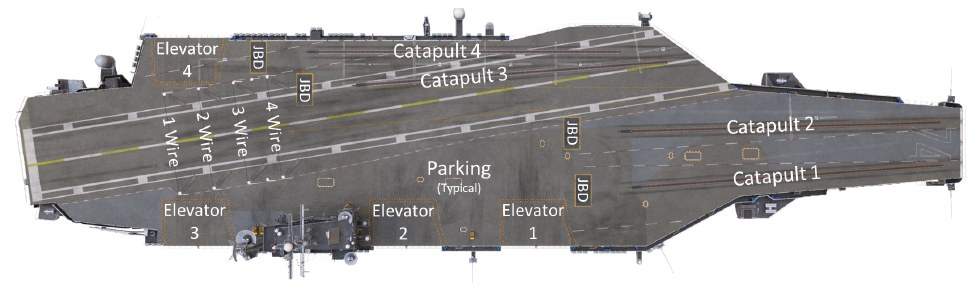

### Catapults

Four catapults are available to ‘slingshot’ aircraft off the deck and into the air. Catapults one and two are located
on the bow while catapult three and four are located on the waist. Together, on average these can launch one
aircraft every 20 seconds. The launch is initiated by personnel situated in the Integrated Catapult Control
Station (ICCS), also called the “bubble”. This is a small dome located between catapult 1 and 2 on the bow and
left of catapult 4 on the waist.

These are steam powered catapults with two cylinders running the length of each track. A piston on each
cylinder connects to a shuttle that extends out of each track. The launching aircraft taxis so the launch bar at its
nose wheel connects to the shuttle. At launch, high pressure steam is ported into the cylinders. This forces the
shuttle down the track at high speed, launching the aircraft. A water brake slows the shuttle at the end of the run
so it can be retracted for the next launch.

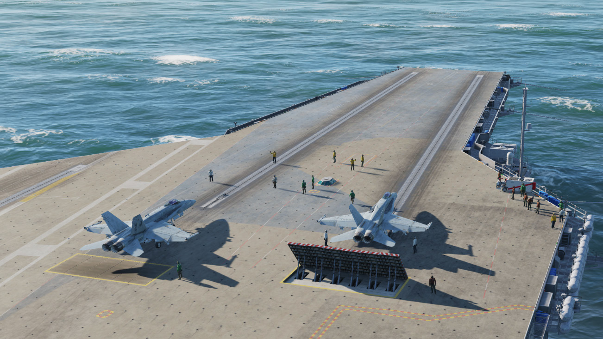

### Jet Blast Deflectors

These heavy-duty panels are located behind each catapult to deflect high speed exhaust produced by
launching aircraft’s engines. Hydraulic cylinders raise each panel into place upward at a 45 degree angle. A
seawater cooling system is installed in each to prevent damage from hot engine exhaust. These are retracted
when not in use and sit flush with the deck.

### Arresting Gear

Four steel arresting cables, also known as cross-deck pendants, span the landing area. The aircraft’s tailhook
connects to one of these cables on touchdown, hauling the aircraft to a stop in about 300 feet.

The cables are made of braided steel strands with a polyester core for flexibility. Each end is connected to an
arresting engine below deck via a purchase cable. The arresting engines are hydro-pneumatic systems that use
a ram and fluid within a cylinder to absorb and disperse the energy of the arrestment.

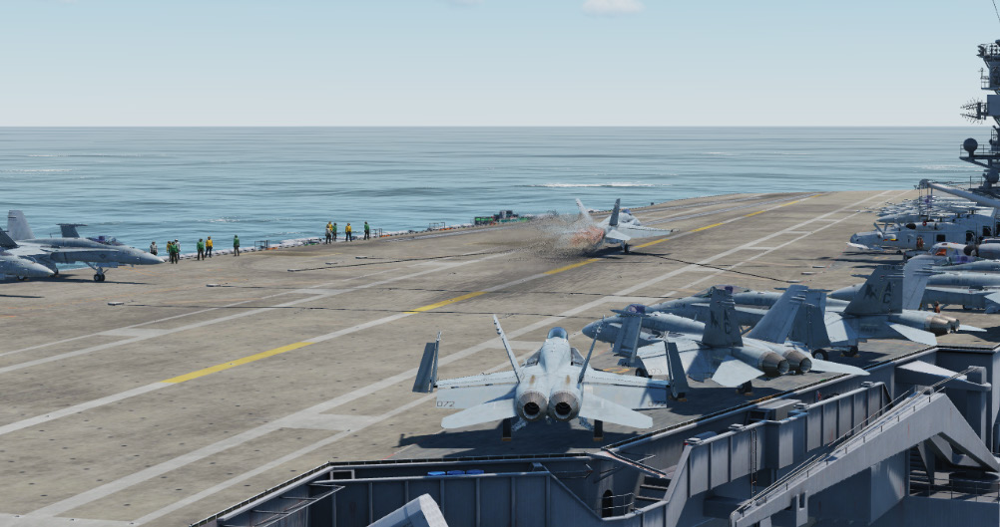

Cables are numbered one through four from back to front. Although there are four cables, the visual approach
aids are calibrated so the aircraft will catch the three wire on a well-executed approach. Landing short at the
one wire risks a ramp strike at the end of the ship. Landing long at the four wire risks missing the cables
altogether, known as a ‘bolter’.

### Hangar Bay

The hangar bay is located two decks below the flight deck and spans approximately two-thirds of the total
length of the carrier. The bay is divided into three areas separated by massive sliding doors that are intended to
limit the damage in the event of a fire or explosion.

The hangar bay is used for aircraft maintenance, as well as spare parts and equipment storage.

### Elevators

Four large elevators provide for movement of aircraft to and from the hangar bay and flight deck. Each can hold
two aircraft or about 150,000 lbs of equipment.

In addition to the four main elevators, there are several small weapons elevators located around the flight deck.

## Flight Deck Personnel

The DCS: Supercarrier module includes deck crew who will direct you into position on the catapults and perform
steps necessary to launch your aircraft. Additional crew members may also be placed on deck by mission
designers.

All personnel on the flight deck wear colored jerseys that indicate their role.

### Yellow Shirts

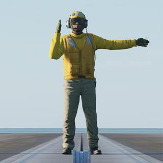

These include the Plane Directors who will guide you around the deck and into
position for launch. All taxi guidance comes from these personnel.
Other yellow shirts include Flight Deck Officers, Arresting Gear Officers, Catapult
Officers (Shooters), Catapult Spotters and Aircraft Handling Officers.

### Green Shirts

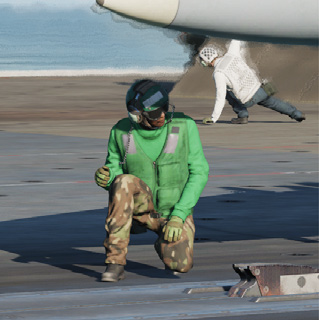

You will encounter these personnel during launch as Catapult and Arresting Gear
crews position the holdback bar and ensure proper attachment to the catapult
shuttle. Maintenance personnel of various specialties may also be on hand to
troubleshoot last minute problems with the aircraft.

Other green shirts include Helicopter Landing Signal Enlisted (LSE), Cargo-handling
personnel, Ground support equipment troubleshooters, Hook runners and
Photographers mates

### Brown Shirts

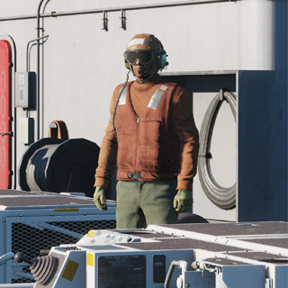

These include Plane Captains and Line Petty Officers. Aircraft general maintenance
and servicing is performed by these personnel. They are responsible for the safe
operation of the aircraft in flight and are often referred to as ‘owning’ the aircraft.

### Blue Shirts

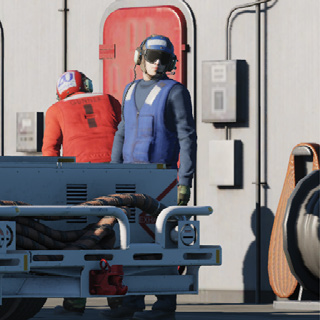

These personnel position aircraft on the deck when they are not being taxied by the
pilot. They include Aircraft handlers (pushers, chockers, chainers, etc.), Tractor
Drivers, Messengers and Phone Talkers and Elevator Operators.

### Purple Shirts

These are the Fueling personnel who are responsible for safely refueling aircraft and
equipment on deck. This is an important job due to the extreme risk fire poses to a
crowded flight deck.

### Red Shirts

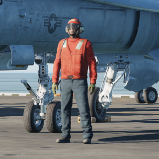

These are the Aviation Ordnancemen who build, test, transport, and load weapons
on the aircraft. They also test and maintain the aircraft gun systems, as well as
avionics and release equipment used to employ weapons in the air.

Crash and salvage crews and Explosive Ordnance Disposal (EOD) personnel are
also red shirts.

### White Shirts

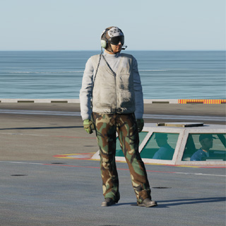

You will encounter these personnel during launch as Final Checkers give your
aircraft a last-minute look for problems.

The Landing Signal Officers (LSO) are also white shirts. For more on this, see the
section on the LSO Station below.

Other white shirts include Safety personnel, Medical personnel, Quality Assurance
personnel and Air Transfer Officers (ATO).

## Instrument Approach Equipment

The aircraft carrier is a floating airport, complete with all the equipment necessary to conduct instrument
approaches. See the section on mission editor features for information on how to set these up in a mission.

### Tactical Air Navigation System (TACAN)

The TACAN system provides relative bearing and/or slant range distance to a selected TACAN station (land,
ship or aircraft). TACAN range depends on aircraft altitude Line Of Sight (LOS) to the station, but can have a
maximum range of 200 miles for an airborne station and 390 miles for a surface station. Each TACAN station
has a three-letter identifier which is used to identify the beacon.

The ship’s TACAN is used primarily for determining its position while on approach or establishing a holding
pattern. The TACAN is referred to as “father” while the carrier is referred to as “mother”.

### Instrument Carrier Landing System (ICLS)

US Navy and Marine Corps carrier-based aircraft are equipped with the AN/SPN-41A Instrument Carrier
Landing System (ICLS). This operates much like a traditional ILS system, but it is only operational for US
aircraft carriers.

Using the ICLS is a matter of setting up the correct aircraft carrier ICLS channel and following the localizer and
glideslope beams to within visual distance of the IFLOLS visual reference at the ship.

The azimuth transmitter is installed at the stern of the ship, slightly below the centerline of the landing area. The
elevation transmitter is located above the flight deck, aft of the island.
The ICLS is referred to as “bullseye” to differentiate it from the ACLS.

### Automated Carrier Landing System (ACLS)

The AN/SPN-46 ACLS is similar to the ICLS in that it displays "needles" that provide approach guidance
information to the aircrew. But unlike the ICLS, the system is gyro-stabilized to provide accurate glideslope and
azimuth data regardless of deck movement in heavy seas. Up to two aircraft may be controlled by the system
simultaneously.

The ACLS has three modes for approach:

**Mode I**. This mode provides for an automatic, hands off approach. Command and error signals are transmitted
to the aircraft from the ACLS. The aircraft then translates them into the appropriate control actions to stay on
the proper approach path all the way to landing. (Mode 1a is a submode where the pilot takes over the
approach after visual acquisition of the IFLOLS.)

**Mode II**. This mode is similar to a conventional ILS approach. Glideslope and azimuth errors are transmitted to
the aircraft and shown on a display. The pilot manually ‘flies the needles’ to stay on the proper approach path.

**Mode III**. This is known as a Carrier Controlled Approach (CCA). No data is transmitted directly to the aircraft.
The approach controller provides verbal azimuth and glideslope information to the pilot, who flies the approach
manually based on this guidance.

See the applicable aircraft manual for information on system operation and available modes.

### Improved Fresnel Lens Optical Landing System (IFLOLS)

This device is mounted on the left side of the carrier to provide the pilot with visual glidepath information during
the final phase of the approach. The system displays a bright orange ‘ball’ that is dynamically stabilized to
compensate for ship’s pitch, roll and heave motion. The system is normally set for a 3.5° glideslope targeting
the 3-wire.

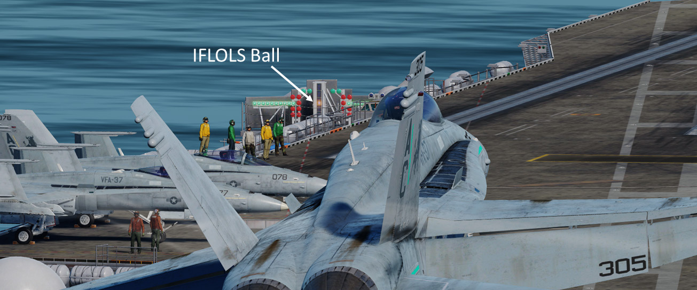

The ball appears aligned between two horizontal datum lights when the pilot is approaching on the optimum
glide path. If the ball is above the datum lights the aircraft is above the glidepath. If the ball is below the datum
lights, the aircraft is below glidepath.

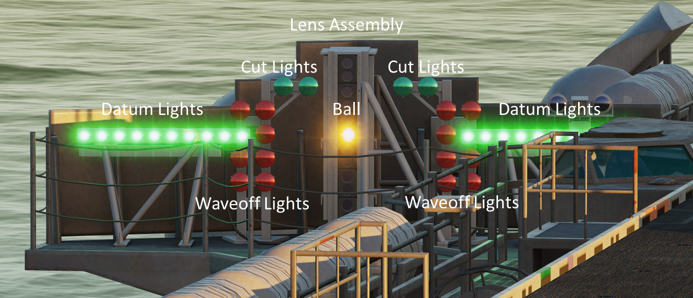

**Lens Assembly**. The lens assembly is a vertical box that contains 12 fiber optic light cells. The aircraft’s
position on the glidepath determines which cell is visible to the pilot. The upper cells are amber in color while
the bottom two are red. If a red lens is visible, the aircraft is dangerously low.

**Datum Lights**. Green datum lights are mounted horizontally to the lens assembly with ten lights on each side.
The position of the ball in reference to the datum lights provides the pilot with glideslope information. If the ball
is illuminated above or below the datums, the aircraft is high or low respectively.

**Cut Lights**. Mounted horizontally and centered above the lens box are four green cut lights. The cut lights are
used by the LSO to communicate with the aircraft during Zip Lip (no radio) operations. As the aircraft
approaches the groove, the LSO will momentarily illuminate the cut lights to indicate a “Roger ball” call.
Subsequent illumination of the cut lights indicates a call to add power.

**Waveoff Lights**. Waveoff lights are mounted vertically on each side of the lens box. These red lights are
controlled by the LSO. When they are illuminated, the aircraft must immediately execute a waveoff. The LSO
will initiate a waveoff any time the deck is foul (people or equipment in the landing area) or an aircraft is not
within safe approach parameters.

### FLOLS Overlay

An additional overlay with all the elements listed above is available to assist pilots flying in VR or with lower
screen resolutions, who may not be able to see the IFLOLS on the carrier clearly. It is activated when your
aircraft is on final approach and configured for landing.

The overlay may be repositioned by clicking and dragging the ‘FLOLS’ text at the top.

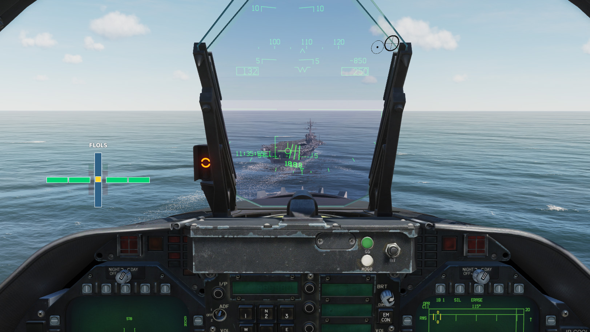

See the LSO Station section for additional information on related displays and controls.

### Long Range Laser Lineup System

The Long Range Laser Lineup System uses eye-safe, color-coded lasers to provide visual lineup information to
approaching aircraft. These low intensity lasers are projected aft of the ship and are visible out to 10 miles at
night.

The color of the laser light and rate at which they flash indicate the pilot’s position in relation to the angled
deck’s centerline.

 - Steady Amber – within 0.5 degree of centerline
 - Steady Green – 0.5 – 0.7 right of centerline
 - Slow Flashing Green – 0.75 – 4.0 degrees right of centerline
 - Fast Flashing Green - 4.0 – 6.0 degrees right of centerline
 - Steady Red – 0.5 – 0.7 left of centerline
 - Slow Flashing Red – 0.75 – 4.0 degrees left of centerline
 - Fast Flashing Red - 4.0 – 6.0 degrees left of centerline

## Defensive Systems

The Nimitz Class carriers rely on their own aircraft or other assets in the Carrier Battle Group for defense
against air or missile attack but still have their own defensive systems in case threats happen to break through.
These systems operate automatically unless defensive actions are intentionally disabled using the mission
editor.

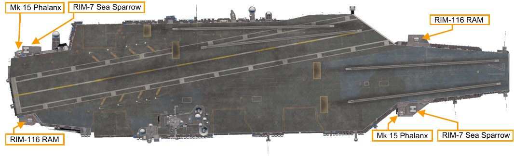

### RIM-7 Sea Sparrow Missiles.

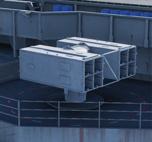

These are short to medium range semi-active radar
guided missiles housed in an 8-cell MK 29 box launcher. Their primary targets are
aircraft or anti-ship cruise missiles.

### RIM-116 Rolling Airframe Missiles (RAM).

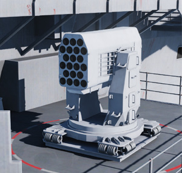

These are small heat-seeking missiles
used for point defense against anti-ship missiles. They are launched from MK 49 box
launchers, each holding 21 missiles.

### Mk 15 Phalanx Close-In Weapon System (CIWS).

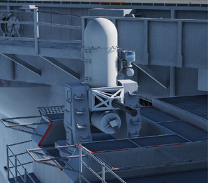

This system consists of radar-
guided 20 mm Vulcan cannon mounted on a swiveling base. It serves as a last line of
defense against anti-ship missiles.

## Viewing the Carrier

The standard ‘Ship View’ is available using the [[F9]] key. Use your mouse to move the view around and zoom in
and out.

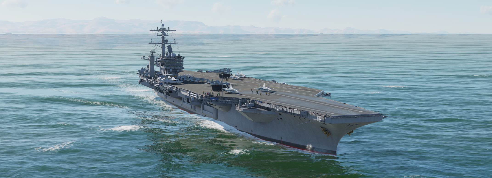

Select [[LALT]] + [[F9]] for a view from the LSO Station. This station has additional functionality, and is covered in
detail in the LSO Station section.

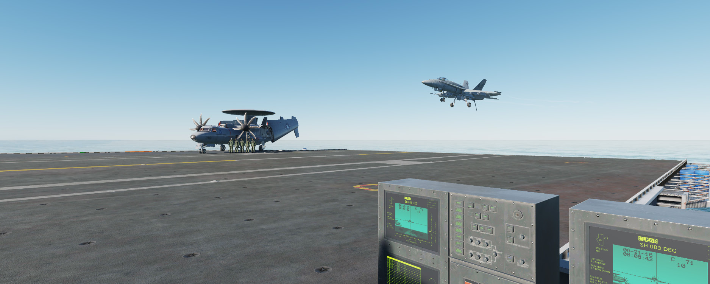

Select [[RCTRL]] + [[F9]] for a view from each catapult. Each subsequent press of the keyboard command takes you
to the next catapult in sequence.

Select [[RSHIFT]] + [[F9]] for a view of the Hangar Bay. Use the mouse to look around and the mouse wheel to move
fore and aft.

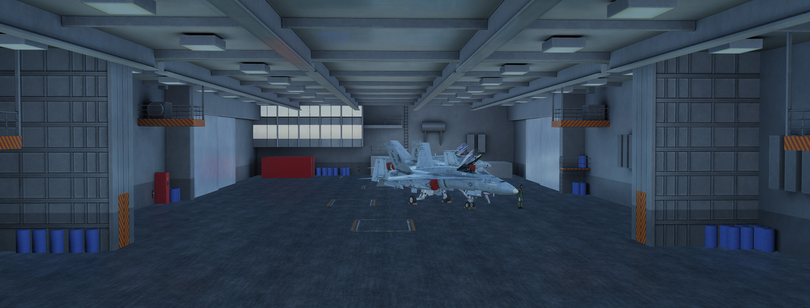

## Additional Supercarrier Module Assets

The new and upgraded features in the DCS: Supercarrier module focus on the Nimitz Class carriers but other
naval assets have received upgrades or additions with this module. These include the all new Arleigh Burke
Class guided missile destroyer (right) and a new model for the Admiral Kuznetsov aircraft carrier (left) that was
already included with DCS: World.

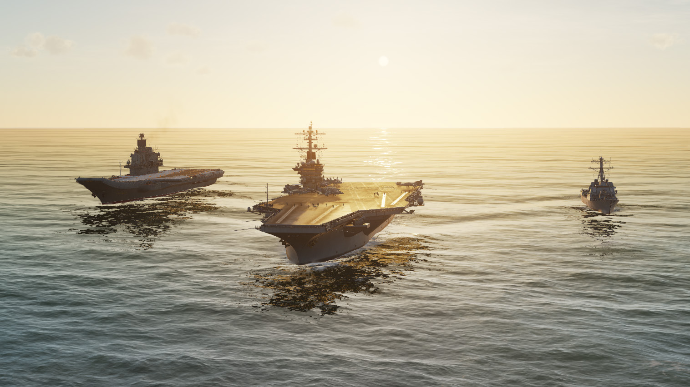

## Admiral Kuznetsov Aircraft Carrier

The Admiral Kuznetsov is the Russian Navy’s largest warship and its sole aircraft carrier capable of carrying
horizontal take-off and landing aircraft. Although an aircraft carrier at first glance, it is technically designated an
‘aircraft-carrying cruiser’, due to its formidable long-range anti-ship cruise missile capability. This designation
allows it to pass in and out of the Black Sea while conforming to the 1936 Montreux Convention, an
international agreement that does not allow aircraft carriers heavier than 15,000 tons to pass through the
Turkish Straits.

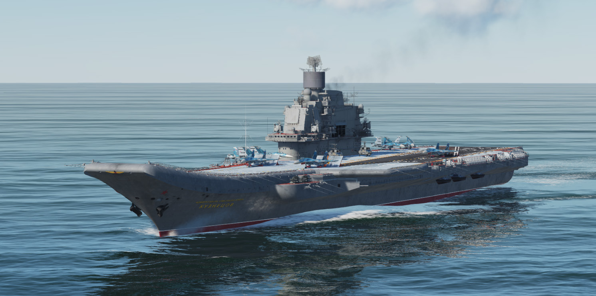

The Admiral Kuznetsov differs greatly from US aircraft carrier designs in that it does not feature catapults for
launching aircraft. Instead, it features a ‘ski-jump’, or upward curved ramp, that converts some of the aircraft’s
forward momentum into a positive rate of climb. This, along with wind over the deck from the carrier’s speed,
greatly reduces the required takeoff roll for aircraft.

Three starting positions are available for fighter aircraft. Positions 1 and 2 are located near the bow of the ship
and provide a 90-meter takeoff run. Position 3 is located farther aft and provides a takeoff run of 180 meters,
twice that of the other two. This third location should be selected for aircraft with heavier fuel or weapons
loadouts that require a longer takeoff run.

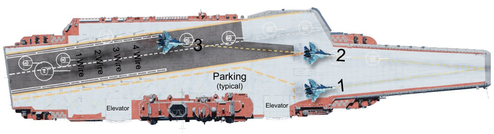

Each starting position features a jet blast deflector that serves the same function as on the Nimitz class carrier.
There are also two holdback devices, or ‘stoppers’, that extend upwards, forward of the main wheels. These
hold the aircraft in place until after the aircraft’s engines are run up before launch.

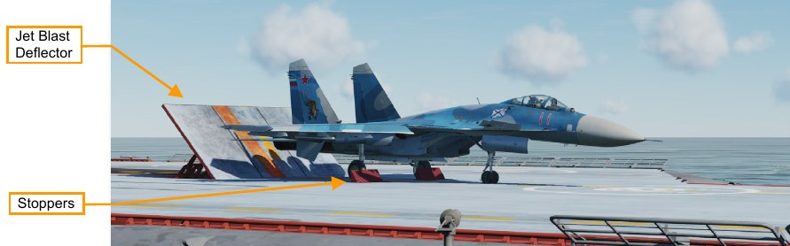

The Luna-3 Optical Landing System works in a manner similar to the Nimitz class’s IFLOLS system. A green
light indicator will be visible when on glideslope for landing. A yellow light will be visible when above glideslope
and red light will be visible when below glideslope.

Aircraft also land on an angled deck in a comparable way to those on the Nimitz class carrier. Four arresting
wires of the Svetlana-2 system are strung across the deck at a spacing of 12 meters. The aircraft’s tailhook
catches a wire and brings it to a stop.

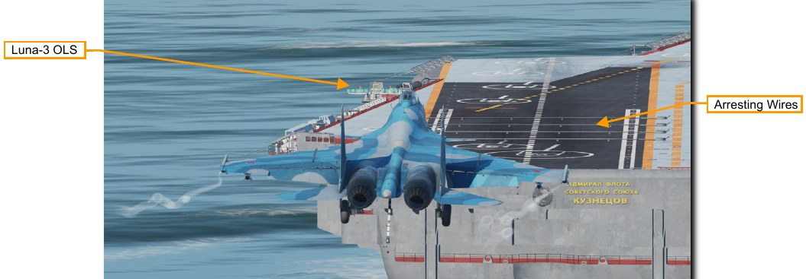

### Offensive Weapons

The Admiral Kuznetsov is equipped with SS-N-19 'Shipwreck' (P-700 Granit) anti-ship missiles, fired from 12
vertical launch tubes on the forward flight deck. A small solid rocket fires them clear of the launcher. Flight is
sustained by a turbojet propulsion system, accelerating the missile to a top speed of mach 2.5 at high altitude or
mach 1.2 at its normal low altitude. The maximum range is approximately 300 nm (550 km).
The missiles rely on their own inertial navigation system to approach the target then switch to active radar
homing for the terminal guidance phase. A 1,650 lb (750 kg) conventional warhead is fitted for use against
ships.

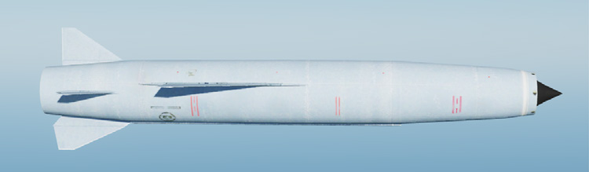

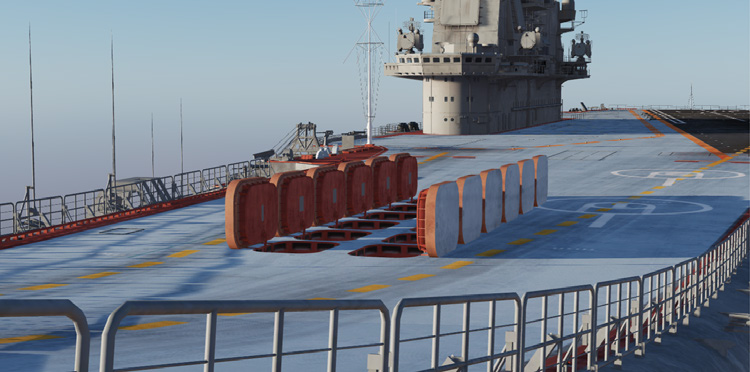

Engagements with these missiles are limited to a 90-degree arc in front of the firing vessel. The carrier must be
maneuvered into the proper position before firing.

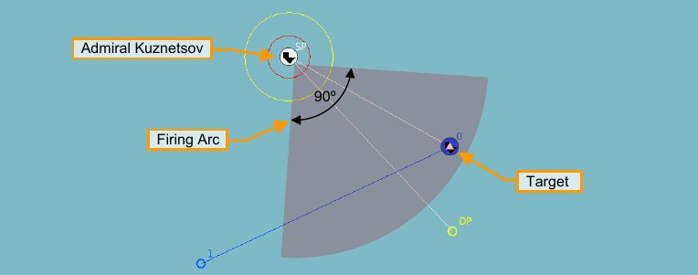

The ‘Attack Group’ task is recommended to allow realistic target sorting for waves of multiple missiles. See the
DCS: World manual for details on setting this up.

### Defensive Weapons

The Admiral Kuznetsov is equipped with multiple defensive weapon systems for defense against aircraft,
missile or submarine threats. Operation of these systems is automatic unless defensive actions are intentionally
disabled using the mission editor.

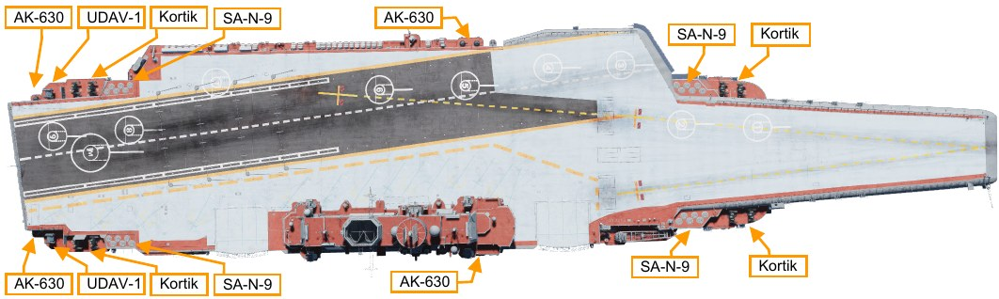

**SA-N-9 Gauntlet (3K95 Kinzhal)**. This is a navalized variant of the SA-15 Gauntlet air defense system.
Missiles are launched from vertical launch tubes with the exit ports flush-mounted with the ship’s structure. It is
capable of engaging threats out to a range of 6.5 nm (12 km).

**Kortik Air Defense System**. This is a combined gun and missile system, similar to the land-based SA-19

**Grison (Tunguska)**. It provides close-in engagement of aircraft and missile threats out to a range of 2.2 nm (4
km). The 30mm gun system is also capable of engaging ship or shore targets.

**AK-630 CIWS**. This fully automatic Close In Weapon System (CIWS) consists of turret mounted 30mm guns
directed by a radar. It is primarily used to defend against small, high-speed missile threats.

**UDAV-1**. This system operates in conjunction with the ship’s sonar to engage submarine or torpedo threats.
Different rocket types can be fired from turrets mounted on the stern of the ship.
