# LAUNCH OPERATIONS

## Flight Deck Procedures

After startup, you will need to taxi to a catapult for launch. Catapults 1 and 2 are on the bow and catapults 3 and
4 are on the waist. Unless you are directed to a specific catapult during the briefing, you may choose any of the
four.

Taxi to the desired catapult using small power inputs while using nosewheel steering in high gain.

Once behind the Jet Blast Defector (JBD) of the catapult you will launch from, follow the signals given by the
Taxi Director.

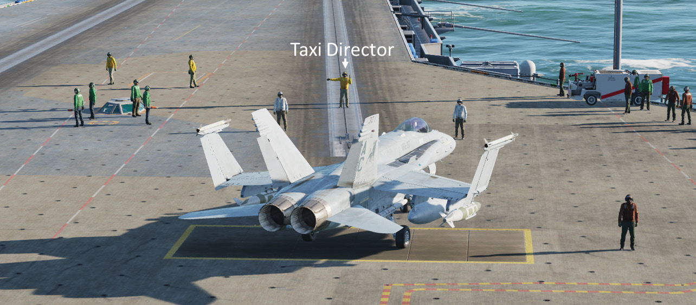

## Catapult Procedures

To ensure proper spotting on the catapult, you must follow the signals from the Taxi Director precisely. The
normal sequence for catapult operations is as follows:

1. **Unfold wings**. When directed, spread the wings using the applicable aircraft controls.

    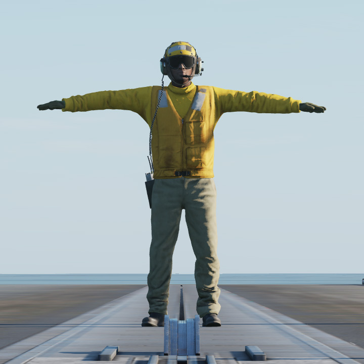

2. **Align with catapult track**. When directed, slowly move forward of the JBD. The Taxi Director will provide
signals for left or right turns to align your nosewheel along the catapult track.

    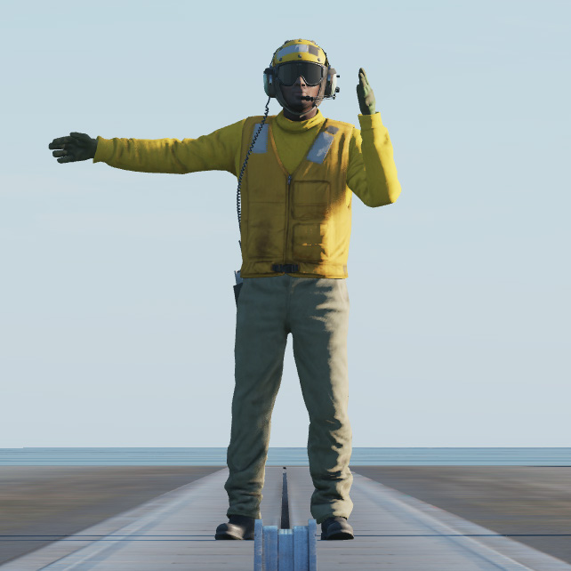
    
    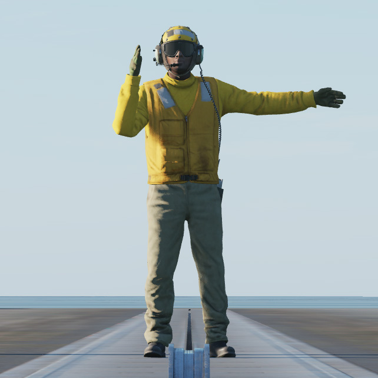

3. **Stop and extend launch bar**. When directed, stop and hold the brakes. Extend the launch bar using
applicable aircraft controls.

    
    

    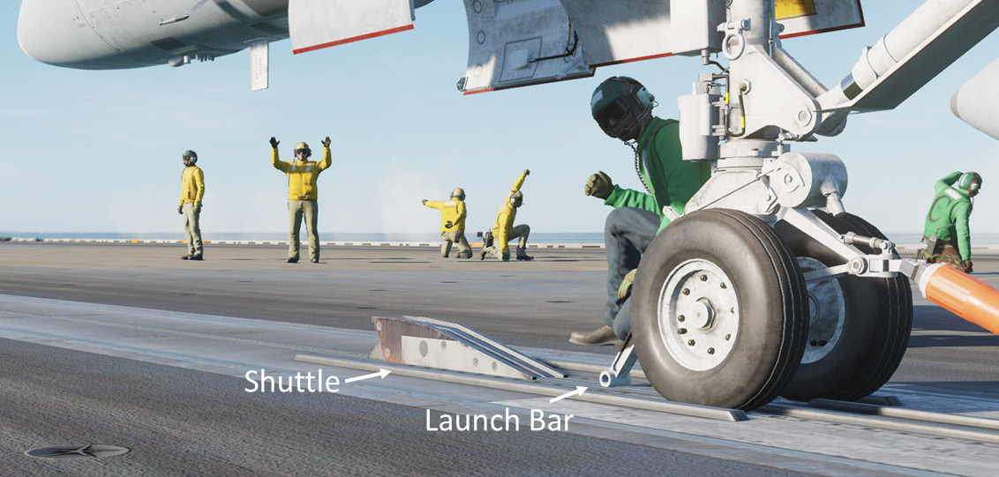

4. **Connect to catapult shuttle**. Following the Director’s signals, taxi forward slowly to position the launch bar
over the shuttle. Significant power, as much as 80-85% RPM, may be required. When the launch bar drops over
the shuttle, the aircraft will be stopped as the holdback engages the catapult buffer. Reduce power to idle.

    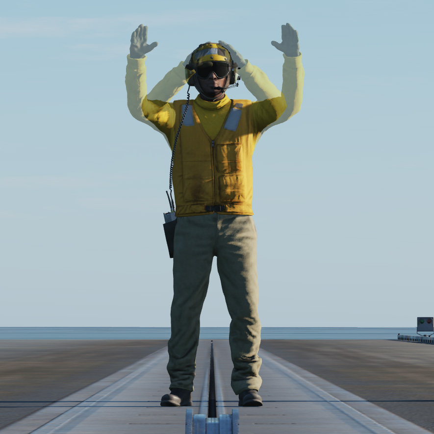
    

    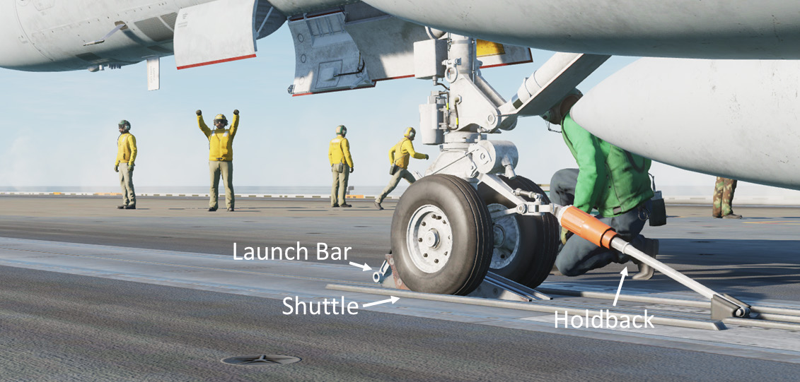

5. **Seat launch bar in shuttle**. When directed, raise the launch bar to seat it in the catapult shuttle. Note that
the bar will not fully retract until it is clear of the shuttle after launch.

    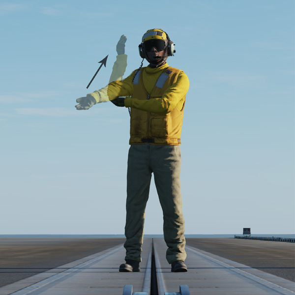

6. **Run up engines and perform final checks**. The Director will pass control to the Catapult Officer, who will
signal for engine run-up. Check the engine instruments and monitor the caution and warning lights. Wipeout the
controls and verify the full throw of the stick and rudder in all directions.

    

7. **Select ‘SALUTE’ from radio menu**. When ready for launch, give the ‘SALUTE’ command from the radio
menu or keyboard command [[LCtrl]] + [[LShift]] + [[S]]. The Catapult Officer will make final checks, looking fore and aft,
and then touch the deck.

    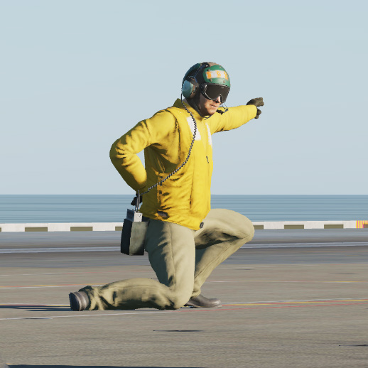

8. **Launch**. The catapult will fire, and the aircraft will accelerate, reaching end speed in about two seconds. As
the aircraft clears the end of the deck, rotate to a nose up attitude and establish a positive rate of climb. Gear
and flaps will be raised in accordance with the specific aircraft’s procedures.

## Case I Departure

Case I departures are flown during the day when weather conditions allow departure under visual flight rules
(VFR). The weather minimums are a cloud deck above 3,000 feet and visibility greater than 5 miles.

Once the aircraft clears the catapult and a positive rate of climb is established, execute a clearing turn to stay
clear of the ship’s path. Climb to 500 feet and fly parallel to the ship’s heading, or base recovery course (BRC).
Continue straight ahead at 500 feet and 300 KIAS paralleling BRC until 7 miles from the carrier. At that point,
climb along the planned route.

## Case II Departure

Case II departures are flown during the day when visual conditions are present at the carrier, but a controlled
climb through the clouds is required. The weather minimums are a cloud deck above 1,000 feet and visibility
greater than 5 miles.

After the clearing turn, proceed straight ahead at 500 feet and 300 KIAS paralleling the BRC as on Case I. At 7
miles from the carrier, turn to intercept the arc running 10 miles from the carrier, staying below the cloud deck.

Stay on this 10-mile arc until you reach the briefed departure radial. Climb on that course maintaining 300 KIAS
until clear of the clouds.

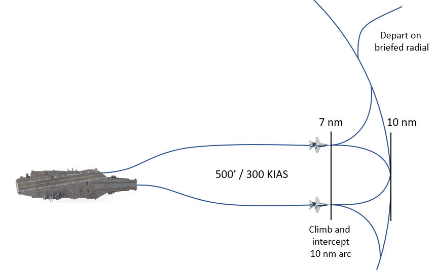

## Case III Departure

Case III departures are flown at night and when weather conditions are below the minimums of 1,000 feet cloud
deck and 5 miles visibility. A controlled climb is maintained throughout the departure.

The aircraft will launch with a minimum launch interval of 30 seconds between aircraft. Following the launch,
climb straight ahead at 300 KIAS, crossing 5 nautical miles from the carrier at 1500 feet AGL or above.

At 7 nm from the carrier, turn to intercept the 10 nm arc. Continue climbing along the arc until you reached the
briefed departure radial. Continue to climb on that course until clear of the weather.

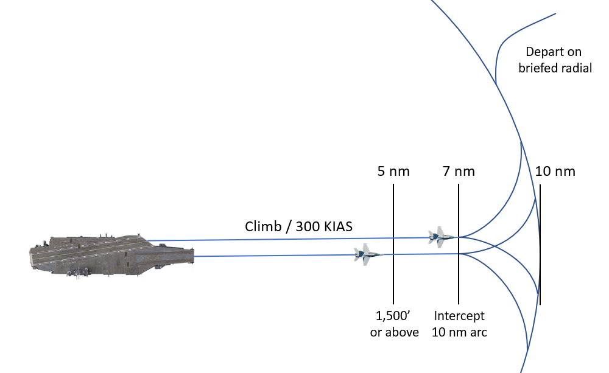

