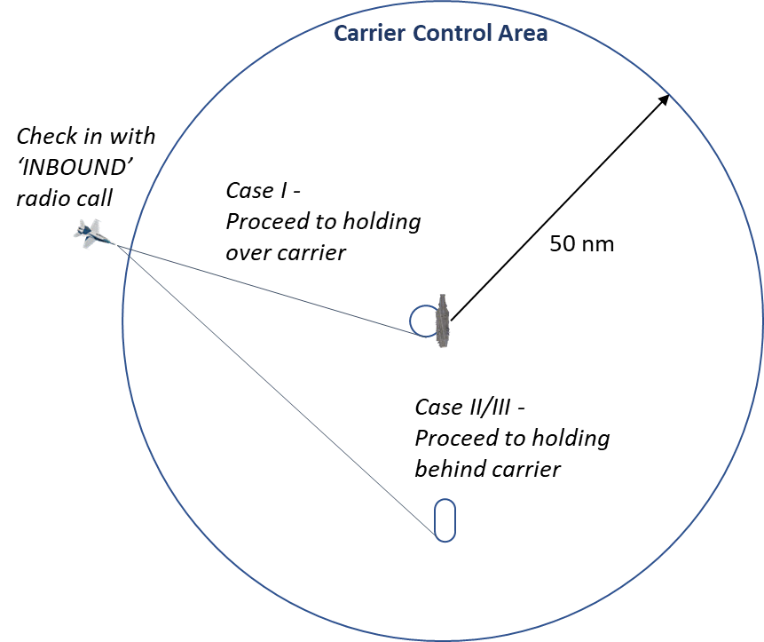
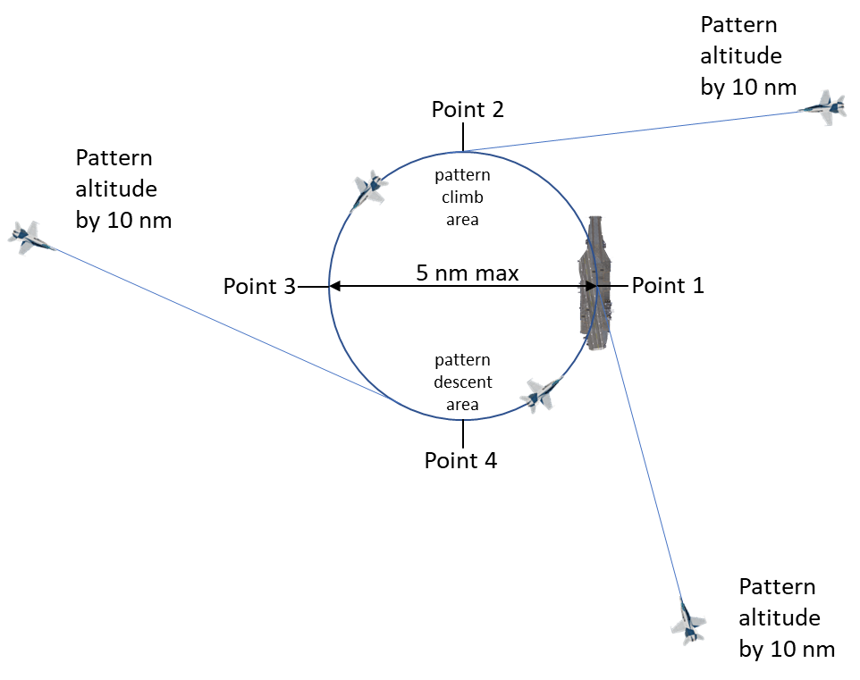
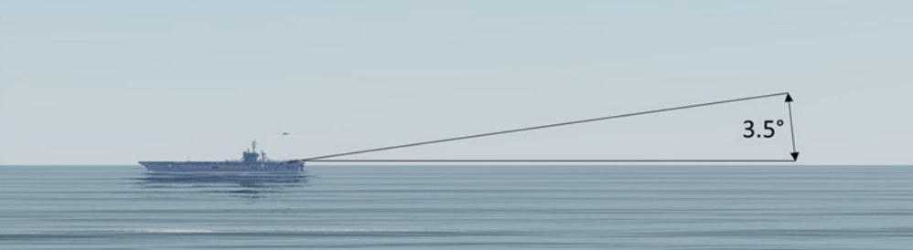
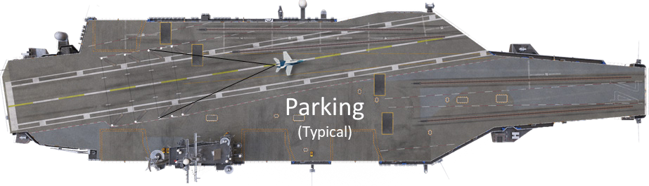
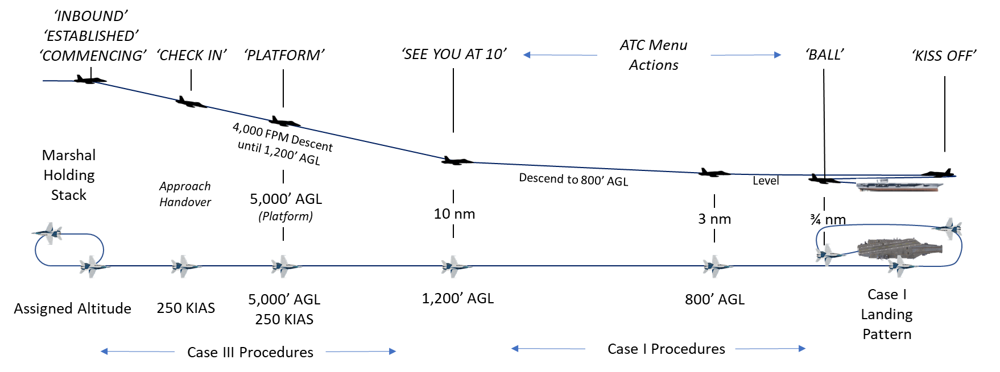
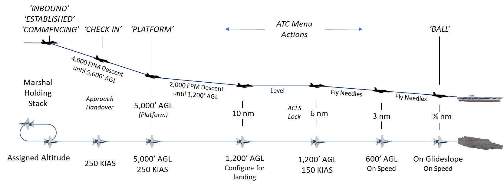
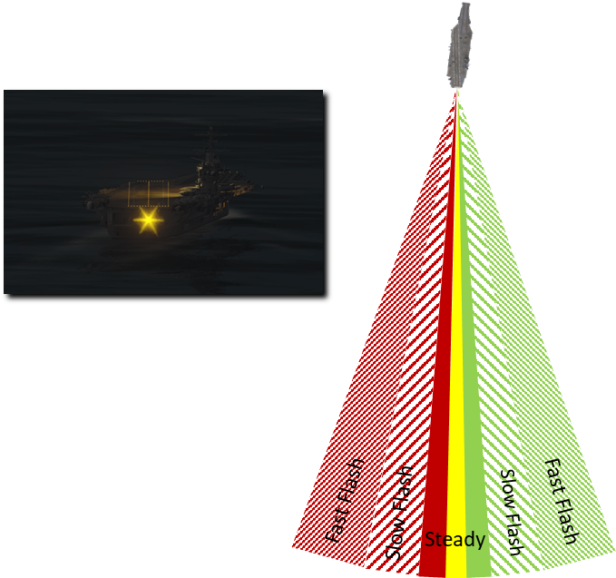

# RECOVERY OPERATIONS

## Overview

The recovery process starts on entry to the Carrier Control Area, or CCA. This is a fifty-mile radius circle around
the carrier where standardized procedures are followed to quickly recover large numbers of aircraft with as little
communication as possible.

Once inside the CCA, check in on Marshal frequency with call sign, position, altitude and fuel state. Marshal will
provide recovery holding instructions and pass the ship’s weather, altimeter setting and ship’s heading (BRC).
Three different types of recovery can be expected depending on the current weather conditions:

**Case I**: This is a daytime visual recovery flown in when the cloud deck is higher than 3,000 feet and visibility is
greater than 5 miles. Aircraft proceed to a holding stack over the carrier. Case I recoveries are used to the
maximum extent possible.

**Case II**: Case II recoveries are flown when weather conditions require instrument flight during the descent but
allow visual flight near the carrier. Case III procedures are used until the ship is in sight, at which point, Case I
procedures will be used. The minimum weather requirements are a 1,000-foot ceiling and 5-mile visibility.

**Case III**: This instrument recovery is used at night or when the weather is below Case II minimums. Case II and
III recoveries are flown from a marshal stack behind the carrier.

## Case I Recovery

Case I recovery begins when you contact the carrier Marshal with an ‘INBOUND’ radio command. After
receiving direction from Marshal, you will set up to enter the holding pattern over the carrier. At 10 miles, you
should have the carrier in sight and report ’SEE YOU AT 10’ over the radio. The Marshal controller will hand
you off to the tower and you will enter the holding stack.

The tower will clear you to leave the holding pattern and commence your landing approach. You will descend
from holding and fly by the carrier just outboard on the starboard side at 800 feet. You will give a ‘KISS OFF’
command to your flight and execute an overhead ‘break’ to the left and enter the landing pattern.

At ¾ nm behind the ship, you will enter ‘the groove’ and report in with the Landing Signal Officer (LSO) with a
‘BALL’ radio call. You will fly the rest of the approach and landing based on visual indications on the IFLOLS
ball and verbal instructions given by the LSO.

If all goes well, you will catch one of the arresting wires with your tailhook and taxi to parking. If not, you will
either ‘waveoff’, abort the approach and reenter the landing pattern, or ‘bolter’, touch down on the deck and
reenter the landing pattern.

Let us have a closer look at each phase in sequence.

### Marshal

At 50 miles or closer, you should select **‘INBOUND’** from the ATC carrier radio menu. Upon doing so, the
following message is sent from you to the marshal controller:

**“Marshal, [SIDE NUMBER] holding hands with [SIDE NUMBER], marking mom’s [BEARING FROM SHIP
TO PLAYER] for [RANGE], angels [ALTITUDE], [NUMBER IN FLIGHT], low state [REMAINING FUEL].”**

The carrier MARSHAL will respond with:

**“[SIDE NUMBER], mother’s weather is [VISIBILITY], [CLOUDS], altimeter [PRESSURE]. CASE I recovery
expected BRC is [HEADING OF CARRIER]. Report a see me at 10.”**

You will automatically acknowledge with:

**“[SIDE NUMBER].”**

### See You at 10

After the initial check in with Marshal, proceed directly to the carrier and enter overhead holding at your
squadron’s holding altitude. Altitudes are assigned in 1,000-foot increments starting at 2,000 feet above the
carrier, so your holding altitude could be 2,000 feet, 3,000 feet, 4,000 feet, and so on. Aircraft returning for Case
I recoveries must be established at their holding altitudes no later than 10 nautical miles from the carrier.

Once you are within 10 miles and visual contact is established, you should select **‘SEE YOU AT 10’** from the
ATC carrier radio menu item.

You will send:

**“[SIDE NUMBER] see you at 10.”**

Marshal will respond with:

**“[SIDE NUMBER], update state, go tower.”**

You automatically respond with:

**“[SIDE NUMBER], [FUEL REMANING]”**

You will then proceed to holding and enter the pattern at the outside of the turn. (See the visual aid below.) The
next radio call will happen automatically when you enter the holding pattern and are within 3 miles of the carrier.

### Holding Pattern

The overhead holding pattern is a left-hand pattern, with Point 1 located directly overhead the carrier and Points
2, 3 and 4 following in 90-degree increments. This holding pattern is often referred to as the “stack”. All aircraft
must remain within 5 nm of the carrier and no lower than 2,000 feet AGL.

Any climbs must be accomplished between points 1 and 3 while any descents must be accomplished between
points 3 and 1.

While holding, the flight will remain at max conserve fuel flow unless briefed otherwise.

Aircraft in overhead holding will stagger their intervals to ensure equal spacing from all flights at the same
altitude. If there are two total flights, then they should be 180-degrees apart. Three flights should be 120-
degrees apart. Four flights will be 90-degrees apart.

You will leave the holding pattern on the ‘charlie’ signal from the tower.

### Commencing the Approach

Once you are within 3 nm of carrier and enough interval exists between you and other landing aircraft, you will
automatically send:

**“[TOWER], [SIDE NUMBER], overhead, angels [ALTITUDE], [NUMBER IN FLGHT], low state [REMAINING
FUEL].”**

The tower responds with:

**“[SIDE NUMBER], Tower, Roger. BRC is [CARRIER HEADING], your signal is Charlie.”**

You will auto-respond with:

**“[SIDE NUMBER].”**

At this point, the next communication will be with the LSO at ¾ mile behind the carrier.

The flight will depart holding from outside point 3 and descend to 800 feet. An arcing turn will be flown to the
initial point 3nm astern of the ship. The flight will continue inbound and fly just outboard the starboard side of the
ship at 800 feet, paralleling BRC. The radio command ‘KISS OFF’ should be given to your flight and the landing
pattern should be entered.

## Overhead Break

The landing pattern is entered with the radio command **‘KISS OFF’** to your flight followed by a sharp break turn
to the left. The members of your flight will continue ahead and execute their own break to enter the pattern
behind you. A 15-20 second break interval will correspond to a proper 40-60 second landing interval.

If you are unable to break before 4 nm, you will have to depart and reenter the pattern. To accomplish this,
maintain 800 feet until 5 nm from the carrier, then climb to 1,200 feet and execute a left-hand descending arc
back to the initial.

Break altitude is 800 feet, and all breaks will be level. When established on downwind, you will descend to
pattern altitude of 600 feet, configure for landing and closely monitor the abeam distance. The optimal distance
varies from aircraft to aircraft but 1 ¼ to 1 ½ miles generally allows a smooth entry into the next phase called
‘the groove’.

### In the Groove

You will continue to descend in a left-hand turn, rolling out wings level ¾ nm astern of the ship in line with the
angled deck. This phase will be flown based on the state of the IFLOLS ball and verbal directions from the LSO.

#### Call the Ball

When your aircraft is in the groove (wings level) and you have the ball in sight, you should select **‘BALL’** from
the ATC carrier radio menu.

You will transmit: **“[SIDE NUMBER] [Ball] [FUEL STATE]”**

The LSO responds with: **“Roger ball”**

The LSO may also make these calls if your aircraft is not configured for landing:

**“Wave off, gear”** – Your landing gear is not extended.

**“Wave off, flaps”** – Your flaps are not configured for landing.

#### Clara

If you do not have the ball in sight, select **‘CLARA’** from the ATC menu. The LSO will provide the following calls
to get you on glidepath if necessary:

**“You’re high”** – You are far above the glidepath.

**“You’re low, POWER”** – You are far below the glidepath.

If you are still not within glidepath limits at ½ mile astern of the carrier the LSO will transmit **“Wave off, wave
off, wave off”**. The IFLOLS waveoff lights will also flash red.

**‘Clara’** may be transmitted automatically in some cases when you greatly exceed glidepath limits. **“Ball”** will be
automatically transmitted once you are back within glidepath limits. The LSO will respond with **“Roger ball”**.

#### Inside ¾ Mile

When inside ¾ mile and the ball call has been made, direction from the LSO is based on your deviation from
localizer centerline and 3.6-degree glidepath.

- No direction = under 1.7 degrees left or right of localizer and less than 1.5 degrees below and less
than 2.5 degrees above optimal glidepath
- Off centerline = greater than 1.7 degrees left or right of optimal localizer centerline
- Off glidepath = greater than 1.5 degrees below and greater than 2.5 degrees above optimal glidepath
- Far off centerline = greater than 2.9 degrees left or right of optimal localizer centerline
- Far off glidepath = 2.7 degrees or greater below or 4.9 degrees or greater above optimal glidepath

**“You’re high”**– Aircraft is far above the glidepath. 
**“You’re low, POWER”**– Aircraft is far below the glidepath. 
**“You’re lined up left”**– Aircraft is far left of centerline. 
**“You’re lined up right”**– Aircraft is far right of centerline. 
**“You’re fast”**– Angle of attack is too low. 
**“You’re slow”**– Angle of attack is too high. 
**“Easy with the nose”**– Aircraft has excessive pitch rate. (>5 degrees per second) 
**“Easy with your wings”**– Aircraft has excessive roll angle. (>20 degrees) 
**“Easy with it”**– Aircraft thrust changes are excessive. (>30% per second) 

#### Inside ½ Mile

As you approach the carrier’s stern, direction from the LSO becomes more precise.

**“You’re high” or “You’re high, bring it down” or “You’re high, work it down.”**: Aircraft is above glideslope
more than 3 seconds. 
**“Power”** (normal inflection): Aircraft is below glideslope more than two seconds or aircraft on glideslope but is
descending more than 1 degree per second for 2 seconds. If same call is made 2 seconds later: **“Power”** with
more urgent inflection. 
**“Power, Power, POWER”**: Aircraft is far below glidepath and sinking rapidly. 
**“Easy with it”**: Greater than 1 degree per second change in glidepath following a “power” call. 
**“Right for lineup”**: Aircraft is left of centerline. 
**“Come left”**: Aircraft is right of centerline. 
**“Wave off, wave off, wave off”**: Two or more of the above conditions are true at the same time for a 2
second or more duration or excessive glidepath and localizer deviation for more than 4 seconds. 
**“Wave off, wave off, wave off, foul deck”**: Another aircraft is in the landing area 
**“Bolter, bolter, bolter”**: Aircraft wheels touch and tailhook misses arresting cables. 

### Landing

Do not anticipate an arrested landing. When the aircraft touches down, advance the power to max and retract
the speed brakes in anticipation of a bolter. Maintain max power until the aircraft comes to a complete stop.

Then, release the brakes and allow the aircraft to be pulled back. The arresting wire will release from the hook
and you will be free to taxi to a parking location.

The LSO will grade each landing and display the results at the top right of your screen. The format is [GRADE]:
[MAIN ERRORS], [ERROR LOCATION], [WIRE CAUGHT].

A typical landing grade may look like this:

Transcription: “No grade. Drifted way right in close. Landed a little left in the wires. Caught number 4 wire.”

Grades:

- WO - Waveoff
- OWO - Own Waveoff
- _OK_ - Perfect pass
- OK - Reasonable deviations with good corrections
- (OK) - Fair. Reasonable deviations
- --- - No-grade. Below average but safe pass
- C - Cut. Unsafe, gross deviations inside waveoff window
- B - Bolter

Main errors:

- AFU - All “fouled” up
- DL - Drifted left
- DR - Drifted right
- EG - Eased gun (pulled throttles back to help set the hook for arrestment)
- F - Fast
- FD - Fouled deck
- H - High
- LL - Landed left
- LO - Low
- LR - Landed right
- LUL - Lined up left
- LUR - Lined up right
- N - Nose
- NERD - Not enough rate of descent
- NSU - Not set up
- P - Power
- SLO – Slow
- TMRD – Too much rate of descent
- W - Wings
- LLWD - Landed left wing down
- LRWD - Landed right wing down
- LNF - Landed nose
- 3PTS - Landed 3 points

Distance marks placed after error:

- BC - Ball call (before first 1/3 of glideslope)
- X - At the start (first 1/3 of glideslope)
- IM - In the middle (middle 1/3 of the glideslope)
- IC - In close (last 1/3 of glideslope)
- AR - At the ramp
- TL - To land (between AR and first wire)
- IW - In the wires
- AW – After wires

Note 1: Parentheses ( ) around any symbol signifies “a little” (e.g., "(F)" means “a little fast”)

Note 2: Underline. For emphasis (e.g."_H_" means “very high”)

Note 3: A square [ ] around any symbol indicates that a signal was not answered (e.g. “[BC]” means no ball call
has been made)

After landing, you have the option to taxi to a catapult and take off again immediately. To do so, alert the ground
crew by selecting ‘Request Launch’ from the ground crew communications menu. The catapult crew will be
ready to hook you up at whatever catapult you taxi to.

### Touch and Go & Bolters

The procedures for touch and go landings and bolters are identical. Continue to fly the ball all the way to
touchdown. Upon touchdown, simultaneously advance power to max, retract speed brakes, and rotate to
optimum AOA for takeoff. Maintain wings level and verify a positive rate of climb.

Once a positive rate of climb is established and your aircraft is forward of the bow, use a shallow right turn to
parallel the BRC. Climb to pattern altitude (600 feet) and turn downwind with proper interval with other landing
aircraft.

### Waveoff

Procedures for a waveoff are the same as touch and go or bolter, except you will depart straight down the
angled deck.

## Case II Recovery

Case II recovery occurs during daylight hours when conditions may be poor on the approach but adequate for
landing under visual flight rules. The cloud ceiling must be above 1,000 feet and visibility more than 5 nm.

This can be thought of as a combination of Case I and Case III. The Case III procedures are used outside 10
nm and Case I procedures are used inside 10 nm.

For a CASE II recovery, you will radio “see you at 10” when the aircraft is 10 nm from the carrier just as on a
Case I recovery. Radio control is transferred from the approach controller to the tower controller. At this point,
the pilot performs an overhead break and landing. No Case I holding stack is required.

## Case III Recovery

Case III recovery occurs when any cloud celling is below 1,000 feet or when visibility is less than 5 nm
regardless of cloud ceiling. All night operations are conducted in Case III.

This approach starts with an ‘INBOUND’ call to the Marshal who will assign a holding location, holding altitude
and an approach time. You will depart the holding stack at that approach time and radio ‘COMMENCING’ to the
Marshal controller.

You will descend and check in with the Approach Controller. Reduce descent rate when passing 5,000 feet and
report ‘PLATFORM’. Level off at 1,200 feet.

At 10 nm from the carrier, configure for landing. You will reduce speed to pass 6 miles from the carrier at 150
KIAS. You will achieve an ACLS lock if applicable and fly the needles on approach. Expect to reach 600 feet at
3 miles from the carrier, on speed for landing.

At ¾ nm behind the ship, you report in with the Landing Signal Officer (LSO) with a ‘BALL’ radio call. You will fly
the rest of the approach and landing based on visual indications on the IFLOLS ball and verbal instructions
given by the LSO.

If all goes well, you will catch one of the arresting wires with your tailhook and taxi to parking. If not, you will
either ‘waveoff’, abort the approach and reenter the landing pattern, or ‘bolter’, touch down on the deck and
reenter the landing pattern.

Let us look more closely at each step.

### Marshal

The first step for a Case II or III recovery is having your flight enter a marshal holding stack behind the carrier.
At 50 miles or closer, you will select **‘INBOUND’** from the ATC carrier radio menu. Upon doing so, the following
message will be sent from you:

**“Marshal, [SIDE NUMBER] holding hands with [FLIGHT MEMBERS], marking mom’s [BEARING FROM
SHIP TO PLAYER] for [RANGE], angels [ALTITUDE], low state [REMAINING FUEL].”**

Marshal responds with:

**“[SIDE NUMBER], [SHIP CALLSIGN] marshal, CASE II/III recovery, CV-1 approach, expected BRC
[CARRIER HEADING], altimeter [PRESSURE]. [SIDE NUMBER], marshal mother’s [MARSHAL RADIAL
BEARING] radial, [DISTANCE] DME, angels [ALTITUDE]. Expected approach time is [TIME]”**

If a two-ship checks in during CASE III, the aircraft that intends to land first (and get the lower marshal altitude)
should have their side number read first. Marshall will issue instructions to the first side number and after
“readback correct” give marshal instructions to the second one.

You will automatically respond with:

**“[SIDE NUMBER], marshal on the [RADIAL BEARING], for [RANGE] DME, angels [ALTITUDE]. Expected
approach time [TIME]. Approach button is [CHANNEL].”**

Marshal will reply:

**“[SIDE NUMBER], readback correct.”**

The distance of the holding stack is calculated as one nautical mile for every 1,000 feet of altitude, plus 15. So,
for example, if the aircraft is assigned a marshal stack altitude of 8,000 feet, the distance to the carrier is 23
nautical miles.

Altitude (ft) | Distance (nm)
-------|------
6,000 | 21
7,000 | 22
8,000  | 23
9,000  | 24
10,000  | 25
11,000  | 26
12,000  | 27
13,000  | 28
14,000  | 29
15,000  | 30
16,000 | 31

Once you are at the directed altitude and within 20 miles of the marshal stack, you will select **‘ESTABLISHED’**
from the ATC carrier menu.

Upon doing so, the following message will be sent:

**“[SIDE NUMBER], established angels [ALTITUDE]. State [FUEL LEVEL].”**

Marshal will reply:

**“[SIDE NUMBER], roger, state [FUEL LEVEL].”**

Aircraft will fly the marshal holding pattern with 6-minute left-hand turns: two minutes turns and one-minute legs.
Each flight (maximum of 2 aircraft per flight for Case II and one aircraft for Case III) will hold at offset patterns
with 1,000 feet of separation. The lowest flight in the stack will land next.

Each aircraft will generally push to the carrier from the marshal stack at minimum intervals of 60 seconds. This
provides at least 1-minute between each landing.

When you reach the assigned push time, you will select **‘COMMENCING’** from the ATC carrier menu. The
following message will be sent:

**“[SIDE NUMBER] commencing, [ALTIMETER], state [FUEL LEVEL].”**

Marshal will reply:

**“[SIDE NUMBER], radar contact [DME] miles, expected final bearing [DEGREES].”**

You will acknowledge with:

**“[SIDE NUMBER].”**

Once the aircraft leaves the marshal stack, it will descend at 4,000 feet per minute (fpm) at 250 knots until
5,000 feet altitude, at which point the descent rate is reduced to 2,000 fpm. This is maintained until 1,200 feet
for CASE II.

For a CASE II recovery, you will auto-radio “see you at 10” when the aircraft is 10 nm from the carrier just as
on a Case I recovery. Radio control is transferred from the marshal controller to the tower controller. At this
point, the pilot performs an overhead break and landing. No holding pattern is required.

## Approach

Shortly after leaving the marshal stack, you will be handed off to the Approach controller. Marshal will transmit:

**[SIDE NUMBER], switch approach.**

You will acknowledge with

**[SIDE NUMBER].**

At this point, control will be transferred from marshal to approach, and you must check in with the new
controller. From the ATC carrier menu, you will select **‘CHECK IN’**. Upon doing so, the following message will
be sent:

**“[SIDE NUMBER], checking in, [DISTANCE TO CARRIER] miles, [FUEL LEVEL].”**

Approach replies with:

**“[SIDE NUMBER], final bearing [BEARING].”**

You acknowledge with:

**“[SIDE NUMBER].”**

At 5,000 feet AGL you will select ‘PLATFORM’ from the ATC carrier menu. You will transmit:

**“[SIDE NUMBER], platform.”**

Approach will acknowledge with:

**“[SIDE NUMBER], roger.”**

When your aircraft intercepts final landing bearing, approach will transmit:

**“[SIDE NUMBER] fly bullseye.”**

You will acknowledge with:

**“[SIDE NUMBER].”**

‘Bullseye’ refers to the Instrument Carrier Landing System (ICLS) carrier-based aircraft are equipped with. It
functions identically to a land-based ILS system, where you will ‘fly the needles’, following the azimuth and
glidepath guidance provided on the HUD or instruments. See the aircraft manual for the aircraft you are flying
for a complete description of system operation.

At 10 nm, you should begin to reduce your speed and at 8 nm, you should configure for landing. At 6 nm, the
aircraft should be on-speed.

The Long Range Laser Lineup System (LRLLS) should be visible on the stern of the carrier. A steady amber
light means you are aligned with the angled deck for landing. A green light means you are lined up right and a
red light means you are lined up left.

The red and green lights flash at different rates to show how far off centerline you are. Slow flashing means you
are slightly off centerline while fast flashing means you are far off centerline.

### ACLS Lock

At 6-8 miles the approach controller will report:

**“[SIDE NUMBER] final radar contact, [DISTANCE TO CARRIER] miles.”**

You will acknowledge with:

**“[SIDE NUMBER].”**

At around 6 nm, aircraft equipped with the Automated Carrier Landing System will acquire ACLS lock. Approach
will then ask pilot to “say needles” to check ACLS alignment. Pilot responds by reporting how the aircraft must
be flown to be centered. That is, if the aircraft is low and left the pilot responds, “up and right.”

At ACLS lock on, the approach controller will transmit:

**[SIDE NUMBER], ACLS lock on [DISTANCE TO CARRIER] miles, say needles.**

You will reply automatically with:

**[SIDE NUMBER], [GLIDEPATH] [LOCALIZER].**

This is reference to the position of the ACLS circle on the HUD in relation to the velocity vector on the HUD. For
example:

If ACLS circle is below and to the right of the velocity vector, the message would be: “305, down and right.” 
If ACLS circle is above and to the left of the velocity vector, the message would be: “305, up and left.” 
If ACLS circle is level and to the right of the velocity vector, the message would be: “305, on and right.” 
If ACLS circle is over the velocity vector, the message would be: “305, on and on.” 

Approach will respond with:

**“[SIDE NUMBER], Concur, Fly Mode 2.”**

Approach will advise when you are approaching the final glidepath, usually at 4 miles:

**“[SIDE NUMBER], approaching glidepath.”**

You acknowledge with:

**[SIDE NUMBER].**

In the Groove
At ¾ nm, the approach controller directs the pilot to “call the ball” with:
“[SIDE NDUMBER], [GLIDEPATH LOCATION], [COURSE LOCATION], ¾ mile, call the ball.”

From the ATC carrier menu, you will select ‘BALL’. Upon doing so, the following message will be transmitted:
“[SIDE NUMBER], [AIRCRAFT TYPE] BALL, [FUEL STATE].”

Approach acknowledges:
“Roger ball, [WIND OVER DECK SPEED], [OPTIONAL DIRECTION].”

For example:
If the wind over the deck speed is 25 knots and the wind direction is coming from greater than 5-degrees to the
right of the landing deck angle: “Roger ball, 25 knots, starboard.”
If the wind over the deck speed is 25 knots and the wind direction is coming from greater than 5-degrees to the
left of the landing deck angle: “Roger ball, 25 knots, port.”
If the wind over the deck speed is 25 knots and the wind direction is coming from greater than 3-degrees to the
right of the landing deck angle: “Roger ball, 25 knots, axial.”

This phase will be flown based on the state of the IFLOLS ball and verbal directions from the LSO.

The LSO may make these calls if your aircraft is not configured for landing:
“Wave off, gear” – Your landing gear is not extended.
“Wave off, flaps” – Your flaps are not configured for landing.
Clara
If you do not have the ball in sight, select ‘CLARA’ from the ATC menu. The LSO will provide the following calls
to get you on glidepath if necessary:
“You’re high” – You are far above the glidepath.
“You’re low, POWER” – You are far below the glidepath.
If you are still not within glidepath limits at ½ mile astern of the carrier the LSO will transmit “Wave off, wave
off, wave off”. The IFLOLS waveoff lights will also flash red.
‘Clara’ may be transmitted automatically in some cases when you greatly exceed glidepath limits. “Ball” will be
automatically transmitted once you are back within glidepath limits. The LSO will respond with “Roger ball”.
Inside ¾ Mile
When inside ¾ mile and the ball call has been made, direction from the LSO is based on your deviation from
localizer centerline and 3.5-degree glidepath.

- No direction = under 1.7 degrees left or right of localizer and less than 1.5 degrees below and less
than 2.5 degrees above optimal glidepath
- Off centerline = greater than 1.7 degrees left or right of optimal localizer centerline
- Off glidepath = greater than 1.5 degrees below and greater than 2.5 degrees above optimal glidepath
- Far off centerline = greater than 2.9 degrees left or right of optimal localizer centerline
- Far off glidepath = 2.7 degrees or greater below or 4.9 degrees or greater above optimal glidepath

“You’re high” – Aircraft is far above the glidepath.
“You’re low, POWER” – Aircraft is far below the glidepath.
“You’re lined up left” – Aircraft is far left of centerline.
“You’re lined up right” – Aircraft is far right of centerline.
“You’re fast” – Angle of attack is too low.
“You’re slow” – Angle of attack is too high.
“Easy with the nose” – Aircraft has excessive pitch rate. (>5 degrees per second)
“Easy with your wings” – Aircraft has excessive roll angle. (>20 degrees)
“Easy with it” – Aircraft thrust changes are excessive. (>30% per second)
Inside ½ Mile
As you approach the carrier’s stern, direction from the LSO becomes more precise.

“You’re high” or “You’re high, bring it down” or “You’re high, work it down.” – Aircraft is above glideslope
more than 3 seconds.
“Power” (normal inflection) – Aircraft is below glideslope more than two seconds or aircraft on glideslope but is
descending more than 1 degree per second for 2 seconds. If same call is made 2 seconds later: “Power” with
more urgent inflection.
“power, Power, POWER” – Aircraft is far below glidepath and sinking rapidly.
“Easy with it” – Greater than 1 degree per second change in glidepath following a “power” call.
“Right for lineup” – Aircraft is left of centerline.
“Come left” – Aircraft is right of centerline.
“Wave off, wave off, wave off” – Two or more of the above conditions are true at the same time for a 2
second or more duration or excessive glidepath and localizer deviation for more than 4 seconds.
“Wave off, wave off, wave off, foul deck” – Another aircraft is in the landing area
“Bolter, bolter, bolter” – Aircraft wheels touch and tailhook misses arresting cables.
Landing
Do not anticipate an arrested landing. When the aircraft touches down, advance the power to max and retract
the speed brakes in anticipation of a bolter. Maintain max power until the aircraft comes to a complete stop.
Then, release the brakes and allow the aircraft to be pulled back. The arresting wire will release from the hook
and you will be free to taxi to a parking location.

The LSO will grade each landing and display the results at the top right of your screen. The format is [GRADE]:
[MAIN ERRORS], [ERROR LOCATION], [WIRE CAUGHT].
A typical landing grade may look like this:

Transcription: “No grade. Drifted way right in close. Landed a little left in the wires. Caught number 4 wire.”
Grades:
- WO - Waveoff
- OWO - Own Waveoff
- _OK_ - Perfect pass
- OK - Reasonable deviations with good corrections
- (OK) - Fair. Reasonable deviations
- --- - No-grade. Below average but safe pass
- C - Cut. Unsafe, gross deviations inside waveoff window
- B - Bolter

Main errors:
- AFU - All “fouled” up
- DL - Drifted left
- DR - Drifted right
- EG - Eased gun (pulled throttles back to help set the hook for arrestment)
- F - Fast
- FD - Fouled deck
- H - High
- LL - Landed left
- LO - Low
- LR - Landed right
- LUL - Lined up left
- LUR - Lined up right
- N - Nose
- NERD - Not enough rate of descent
- NSU - Not set up
- P - Power
- SLO – Slow
- TMRD – Too much rate of descent
- W - Wings
- LLWD - Landed left wing down
- LRWD - Landed right wing down
- LNF - Landed nose
- 3PTS - Landed 3 points

Distance marks placed after error:
- BC - Ball call (before first 1/3 of glideslope)
- X - At the start (first 1/3 of glideslope)
- IM - In the middle (middle 1/3 of the glideslope)
- IC - In close (last 1/3 of glideslope)
- AR - At the ramp
- TL - To land (between AR and first wire)
- IW - In the wires
- AW – After wires

Note 1: Parentheses ( ) around any symbol signifies “a little” (e.g., "(F)" means “a little fast”)
Note 2: Underline. For emphasis (e.g."_H_" means “very high”)
Note 3: A square [ ] around any symbol indicates that a signal was not answered (e.g. “[BC]” means no ball call
has been made)

After landing, you have the option to taxi to a catapult and take off again immediately. To do so, alert the ground
crew by selecting ‘Request Launch’ from the ground crew communications menu. The catapult crew will be
ready to hook you up at whatever catapult you taxi to.
Waveoff or Bolter
In the event of a waveoff or bolter, climb to 1,200 feet at 150 kts and raise the gear to save fuel, leaving flaps
down. When instructed by approach, turn downwind. Perform the landing checks on downwind and notify
approach with fuel state when abeam the ship. Expect a turn back to final 4-8 NM past abeam for another
approach, lowering the landing gear as you start this turn to final.
LANDING SIGNAL OFFICER (LSO) STATION
Overview
The DCS: Supercarrier module includes a fully functional Landing Signal Officer (LSO) station for directing
players in a multiplayer setting or observing aircraft in a single player setting.
You may enter the LSO station with keyboard command [LALT+F9].
You will be transported to the LSO position with the LSO workstation console in front of you. A separate Pilot's
Landing Aid Television (PLAT) Camera view will be opened in a separate window. This will be referred to here
as the LSO Main Screen Window.

LSO Main Screen
Window

LSO Workstation

You may look around using standard DCS view controls. Use keyboard command [LALT+C] to enable the
mouse cursor and interact with the LSO Main Screen window.
LSO Main Screen Window
The LSO Main Screen window shows a live view from the PLAT camera surrounded by additional information
on ship and aircraft status. You may open and close the window by clicking the top left. You may also reposition
the window by clicking and dragging it to a new location.
The view may be scrolled up and down using your mouse wheel or by clicking and dragging the bar at the right
side. The full LSO Main Screen is displayed at the top and a PLAT Camera view is displayed at the bottom.
This information is also available on the physical LSO consoles.

LSO Main Screen

PLAT Camera View
LSO Main Screen Display
The Main screen display shows information used to calibrate the IFLOLS optical landing system for the aircraft
on approach. The data displayed here ensures the glidepath information presented to the pilot is accurate.
The PLAT camera view is also shown in the center of the display. Details on this will be shown in the next
section.

Deck Status

Landing Queue
Ship Symbol
Ship Heading
ACLS Closure

Ship List and Trim

Hook to Ramp
Aircraft Type

Hook Touchdown

Ship Symbol. In the center of the ship symbol is the wind over deck speed in knots. If the axial wind is from the
left, P will be displayed to the left of the symbol it will indicate the wind speed and P (port). If the axial wind is
from the right, S will be displayed to the right of the symbol and it will indicate wind speed and S (starboard). If
there is less than 1 knot axial, this is not displayed.
ACLS Closure. If the active aircraft is using ACLS to land, this will display the closure of the aircraft to the ship
in knots.
Ship List and Trim. The top indication displays the real time list (roll) of the ship in degrees. Right of the X.X
value, it will display either STBD UP or STBD DOWN (starboard up and down). Trim works the same except the
real time trim (pitch) of the ship is displayed.
Aircraft Type. The aircraft next for landing is listed here. The H/E (hook to eye) distance is the number of feet
above the tailhook the pilot’s eyes are. This is used to calibrate the IFLOLS ball to be accurate for each aircraft
type. The B/A (basic angle) is the glidepath angle the crosshairs in the camera display are aligned to.
Deck Status. If there is an aircraft or deck crew in the landing area, this will show FOUL. If the area is clear, it
will display CLEAR.
Ship Heading. This shows the ships magnetic heading which is the same as the Base Recovery Course (BRC)
value in degrees.
Landing Queue. The next three aircraft in queue to land are listed here, with the next aircraft to land in the top
box. Each aircraft is listed by side number.
Hook Touch Down. This indicates the distance from the stern of the ship at which the IFLOLS landing system
directs the pilot to fly such that the hook will strike the indicated location. For a 3-wire, it should be 230 feet. The
four dots indicate the four arresting wires. The selected wire to capture is solid. The thick tick mark indicates the
exact, desired hook touch down point and the caret above is the dynamic point based on pitch up and down. As
the ship’s bow moves up and down, so will this caret.
Hook to Ramp. This vertical scale illustrates the desired height the bottom of the arresting hook should be
when it crosses over the stern of the ship. For a 3-wire, it should be 14.1 feet. The thick tick mark indicates the
desired hook over ramp height and the caret is the dynamic indication of hook to ramp based on the ship
pitching up and down.
PLAT Camera View
The center of the window shows the view from the PLAT camera. The camera is mounted on the deck and
angled up at 3-degrees along the aircraft landing glideslope to the arrestor wires. Information is superimposed
over the image to aid in LSO duties.

Deck Status
Date
Carrier Number
Local Time

Wind Over Deck

Crosshairs

Waveoff Indicator
 (not shown)
Distance

Descent Rate
Airspeed

Date. The current date.
Local Time. The current local time.
Crosshairs. These show the proper glideslope and azimuth for arriving aircraft.
Waveoff Indicator. A flashing ‘W’ for waveoff will be shown when if the deck is not clear or other conditions for
a waveoff are met.
Airspeed. True airspeed in knots is displayed if the aircraft is ACLS equipped. Otherwise, all zeros are
displayed.
Deck Status. This is the readiness state of the landing area. A ‘C’ means the deck clear and the aircraft on
approach may land safely. A flashing ‘F’ means the deck is foul and the aircraft’s landing zone is obstructed.
Carrier Number. This is the hull number of the carrier, in this case CVN 71.
Wind Over Deck. This is the wind over deck in knots, accounting for both wind speed and ship speed.
Distance: The distance between the carrier and the aircraft is displayed in feet if the aircraft is ACLS equipped.
Otherwise, all zeros are displayed.
Descent Rate: The rate of descent in feet per second is displayed if the aircraft is ACLS equipped. Otherwise,
all zeros are displayed.
MISSION EDITOR FEATURES
Overview
The DCS: Supercarrier module uses the standard mission editor interface. A complete explanation may be
found in the DCS: World User Manual located in your DCS World/Docs folder. That should be your first stop
when learning to set up missions using these assets.

In this section, we will briefly highlight some key features it is important to understand when setting up a mission
with the Supercarrier.
Ship Selection and Placement
The new ship assets included with the Supercarrier module appear in the TYPE dropdown list. The new Nimitz
Class carriers and Arleigh Burke destroyer are available when the COUNTRY is set to USA. The Admiral
Kuznetsov carrier is available with the COUNTRY set to Russia.
Note that the CVN-70 Carl Vinson and CVN-74 John C. Stennis are the original carrier assets included with
DCS: World. They are still available for users who do not own the Supercarrier module.

Wind Direction

It is best to face the carrier into the wind on launch and recovery to eliminate crosswind and reduce the
airspeed required to keep aircraft airborne. The carrier’s speed should be set so that the wind over deck (ship
speed plus wind speed) is near 30 knots.
It is important to remember the ship’s course in the mission editor is its true heading while Base Recovery
Course (BRC) used in carrier operations is magnetic heading. To get the BRC, add or subtract the magnetic
variation for the map being used or simply note the BRC shown at the LSO station in the mission.
Communications and Navigation Equipment
The radio frequency and NAVAID channels are all set in the mission editor. See the first section of this guide for
a description of each system. See the specific aircraft manual for exact system operation in the air and any
restrictions that may apply while setting them up on the carrier.

Radio Frequency
The ship’s ATC radio frequency and modulation are set by typing in the desired frequency or selecting the
desired modulation (AM/FM) from the dropdown menu.
All radio functions for the carrier (i.e. Marshal, Approach, Tower, and LSO) will use this single frequency. The
channel presets for the aircraft used in the mission should be set to match.
TACAN Channel
The carrier’s TACAN beacon must be activated by adding an advanced waypoint action. This is usually set at
waypoint 0, the ship’s starting location.
In this example, TACAN channel and band 71X is used. The callsign is set to TDR. A morse code signal will be
audible keying out those letters for identification. This identifier will also be shown on the aircraft’s displays
where applicable.
You must also select the unit within the group the TACAN signal will originate from. This should always be the
carrier. Note that the carrier’s unit name was changed to CVN-71 to make it easier to identify in the list.
ICLS Channel
The carrier’s ICLS channel is set by adding an advanced waypoint action in the same way as TACAN.
In this example, channel 11 will be used. Compatible aircraft will receive ICLS guidance on that channel. The
originating unit is selected as CVN-71.
AI Aircraft Parking and Taxi Logic
At mission start, there are 20 possible aircraft spawn locations available: the 16 parking locations listed below
and 1 on each catapult. Aircraft assigned "Takeoff from ramp" or "Takeoff from parking hot" in the mission editor
will spawn in one of the 16 parking locations listed based on the sequence it was added to the carrier. In a
multiplayer mission, parking spots are assigned based on when a client joins the server.
Aircraft assigned "Takeoff from runway hot" in the mission editor will spawn on the catapult specified in the
mission editor by the mission designer.
The number of available parking locations is reduced when a multiplayer server is un-paused. Spots 1-4 are
deactivated to clear the taxi route for other launching and recovering aircraft, leaving 16 possible spawn
locations: the 12 remaining parking locations and the four catapults.
The parking layout for small aircraft like the F/A-18C Hornet is shown below. This layout is also applies to the S-
3 Viking and E-2 Hawkeye support aircraft, except spots 1-4 are not used. The support aircraft are usually
airborne first so consider starting those either on a catapult or on spots 5-8.

The F-14 Tomcat is a larger aircraft and requires more ramp space. One parking spot on each of the elevators
and one spot on the stern is not available with an F-14 parked on the adjacent spot. Plan your launch sequence
accordingly, remembering aircraft occupy parking spots in the order they are added to the carrier. Those
unoccupied spots will become available again after aircraft begin to taxi clear.

Aircraft that cannot fit on the flight deck are stored below on the hangar deck until a suitable parking spot is free.
In a multiplayer setting, this may result in a ‘your flight is delayed to start - please wait’ message until space is
available.
When an aircraft lands, it requests a taxi route to exit the landing area. Deck control will search for an open
parking location by priority order listed below and provide a taxi route to it. First, it determines a free location
based on the maximum number of open parking locations. For example, if the parking spot aft of the island is
occupied, the next parking spot in priority order will be selected. Next, deck control will check that the chosen
parking location is suitable for the landing aircraft type and that there are no taxi route obstructions like other
“live” aircraft or static objects. Once these requirements are satisfied, the landing aircraft is routed to the open,
unobstructed parking location.

Aircraft like the F/A-18C Hornet, S-3 Viking and E-2 Hawkeye have a small deck footprint and will use any of
the available parking spots shown above. Large aircraft like the F-14 Tomcat may not be able to use some
parking spots or may prevent other aircraft from parking in the adjacent spots. For this reason, it is a good
practice to maintain an unobstructed path to elevator 1 and 2, forward of the carrier’s island structure. Aircraft
reaching those locations will be transported to the hangar deck below and help keep the deck clear.
If, however, a mission is constructed the prohibits landing aircraft from reaching a parking location, the aircraft
will be automatically removed from the simulation after landing.
Static Object Placement
A number of new static objects are included with the Supercarrier module that allow you to add more life to the
carrier deck, above and beyond the launch crews that are already present by default.
The new static objects are available under the headings ‘Airfield and Deck Equipment’ and ‘Personnel’. Of
course, all aircraft and other static objects included with DCS: World are compatible and may be used.

Before starting, you should depress the unit icon at the bottom of the mission editor screen. Enabling this option
will show the shape of the shape of all objects in the mission editor viewer. This allows placement of objects
with much more precision. Then, zoom in so the carrier deck is visible.
When an object is placed on the deck, it must be linked to the carrier. Select the carrier from the LINK UNIT
dropdown. Once this are set, the static object will be linked to the carrier and remain in position as it moves.

You may find it helpful to add additional objects by copying and pasting an object that is already linked to the
carrier, so you do not have to perform this step every time. You may do this by selecting the object, CTRL+C to
copy, then CTRL+V to paste.
It is important not to place static objects in locations they may interfere with flight operations so test your
mission thoroughly to find any problems. To assist with this, visual aids showing suitable locations on the deck
are included below.
Static
Launch Object Recovery
Operations Operations
Safe
4 Zones 4
Aircraft Aircraft

1

2

3

4

4
Static
Launch Object Recovery
Operations Operations
Safe
8 Zones 8
Aircraft Aircraft

1

2

3 5

6
4
8

7

6

5
7
4
8
Static
Launch Object Recovery
Operations Operations
Safe
16 Zones 16
Aircraft Aircraft

10

11

11 All
Remaining
1 12

2 13 9

3 5 All
Remaining
6
4
8

7

6

9 5
7
10 4
8
GLOSSARY
Air Boss: Officer in charge of all flight deck and tower operations within 5 nautical miles of the ship. Located in
Pri-Fly.
Angels: Altitude in thousands of feet. For example, Angels 3 = 3,000 feet.
Axial Winds: Winds down the longitudinal axis of the ship created by the ship’s forward movement. This
causes a right-to-left crosswind across the angled deck.
Ball: Light projected by source lens on the IFLOLS. Also referred to as “Meatball.”
Bingo Fuel: Aircraft fuel state in sufficient quantity necessary to fly to the bingo airfield or carrier with X lbs.
remaining, depending on aircraft type.
Bolter: A touchdown on the carrier in which the arresting hook does not engage the arresting wires.
BRC: Base recovery course, which is the ship’s magnetic course.
Buster: Proceed at maximum airspeed.
Carrier Air Traffic Control Center (CATCC): The centralized department responsible for the status-keeping of
all carrier air operations and control of all airborne aircraft involved in launch and recovery.
Carrier Control Zone (CCZ): The airspace within a circular limit defined by a 5 mile radius around the ship
surface up to and including 2,500 feet under the control of the Air Boss during visual; flight rules conditions.
Case I: Refers to departure/recovery procedures and landing patterns conducted in visual conditions when
greater than 3,000-foot ceiling and 5 nautical mile visibility exists within the carrier control zone. Case I
recoveries will marshal overhead the ship and enter the pattern via the break.
Case II: Case II recovery occurs during daylight hours when conditions may be poor on the approach but
adequate for landing under visual flight rules. The cloud ceiling must be above 1,000 feet and visibility more
than 5 nm. Case II recovery is a controlled descent to the break and the pattern. It is used when a visual
penetration cannot be made. The approach may be via radar vectors or a TACAN or ADF approach. In no case
will more than a section of two aircraft execute a Case II recovery. Case II departure is a procedure used to
climb through instrument conditions to visual conditions.
Case III: Used for weather less than 1,000/5, or at night.
CCA: Carrier-controlled approach.
Charlie: Refers to the time the first aircraft is expected at the ramp. A “Charlie” call is a directive to enter the
landing pattern.
Chicks: Wingmen in a flight.
Clara: Meatball is not in sight.
Clearing Turn: Associated with a Case I or II departure. Immediately after launch, aircraft from bow cats initiate
a right turn then a turn to parallel the BRC. Aircraft launched from the waist cats initiate a left turn then a turn to
parallel the BRC. The purpose of these turns is to provide aircraft lateral separation on multiple launches from
the carrier.
Cross-Deck Pendant (CDP): Arresting gear wire
Cut Lights: Green lights mounted horizontally and centered above the IFLOLS lens box and are controlled by
the LSO. Utilized during Zip Lip and EMCON conditions instead of UHF to give pilots clearance to land, i.e.,
“Roger Ball.” Subsequent cut lights mean “power.” Also, used in conjunction with waveoff lights to signal bingo.
Datum Lights: Green reference lights mounted horizontally on the IFLOLS, seen on each side of the centered
cell.
Departure Reference Radial (DRR): Preassigned radial usually passed during the brief or as standard
operating procedure.
Emission Control Procedures (EMCON): Electronic emission control procedures are in effect at the ship to
avoid detection. All radio, radar, and navigation equipment transmissions are eliminated except as required for
safety of flight.
Expected Approach Time (EAT): The future time at which an aircraft is cleared to depart inbound or penetrate
from a pre-assigned fix. Aircraft depart and commence approach at assigned time if no further instructions are
received.
Father: Code name for the ship’s TACAN.
Feet Wet or Feet Dry: Aircraft crossing the coastline enroute to or returning from the ship.
Final Bearing (FB): The magnetic bearing assigned by CATCC for final approach (an extension of the landing
area centerline); usually BRC minus the landing area angle of 10°.
Foul Deck: Landing area is not free of all obstructions or the flight deck is not ready to recover aircraft.
Foul Line: A line painted on both sides of the landing area to define the minimum area that must be free of
obstructions in order to consider the deck clear.
Hangar Deck: Area below the flight deck used to store and repair aircraft.
Holdback: Metal fitting designed to break or release at a preset level of force during a catapult stroke.
Hook to Eye: The vertical distance measured between the pilot’s eye and the aircraft’s hook.
Hook to Ramp: The clearance distance between the aircraft’s hook point and the flight deck as it crosses the
ramp.
Improved Fresnel Lens Optical Landing System (IFLOLS): Pilot’s landing aid, i.e., meatball.
Interval: The time between you and the aircraft you are to follow.
In the Middle Position: A distance on the groove that is between the “start” and the “in close” position. The
middle-third of the groove.
Jet Blast Deflector (JBD): Hydraulically lifted deck plate mounted behind each catapult.
Landing Signals Officer (LSO). Controls all fixed-wing aircraft on final approach, or ‘in the groove’ during
carrier landings.
Launch Bar: Metal arm attached to the nose gear and used to launch the aircraft.
Mark your Father: State bearing and distance from ship.
Marshal: Holding pattern during Case I, II, and III recoveries. Also the term used for the ship’s radar controller.
Mother: Code name used to signify the carrier.
Overhead Time: The scheduled time a flight of aircraft is expected overhead the ship for pattern entry.
Paddles: The call sign for the LSO.
Pilot Landing Assistance Television (PLAT): Video camera system used to record carrier operations.
Plane Guard: SAR helicopter or ship assigned during aircraft launch and recovery, usually located in starboard
Delta for a helicopter, three miles astern for a ship.
Platform: A reporting point in the ship’s TACAN approach (normally at 20 NM from the ship at 5,000 feet) at
which the rate of descent is decreased to 2,000 feet per minute.
Popeye: Code word used to signify that aircraft is operating on instruments in poor weather or low visibility.
Pri-Fly: Tower location where the Air Boss oversees the pattern and flight deck operations.
Pull Back: Action following arrestment whereby the wire is partially retracted to allow the pilot to raise the
tailhook.
Push Back: Action taken anytime the aircraft needs to be moved back by deck personnel.
Ramp: The aft end of the flight deck.
Roger Ball: The call made by the LSO that indicates you are cleared to land and the LSO has positive control
(call made less than a mile prior to landing).
Roll Angle: Movement of the lens about the roll axis (set for each type of aircraft) to maintain a constant
targeted hook touchdown point.
RTB: Signal to return to base.
See You: Communication used to indicate that flight lead has the ship in sight.
Shuttle: The portion of the catapult that attaches to the launch bar during catapult launches.
Starboard Delta: Holding pattern used by the helicopters and COD aircraft flown on the starboard side of the
ship and using right-hand turns at 500 feet.
Start: The first-third of the groove length.
Suspend: Stop the catapult launch sequence.
Sweet Lock: Positive TACAN lock-on.
Tension: The portion of the catapult launch sequence when the shuttle is hydraulically moved forward to
remove slack.
Tiedown: Chocks and chains used to secure aircraft on the flight deck.
Zip Lip: Condition in which radio communications are minimized.
Good hunting!
The Eagle Dynamics SA team
