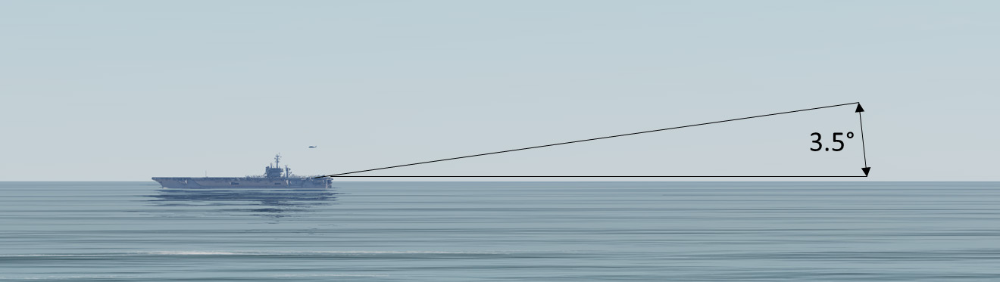

# Recovery Operations

## Overview

The recovery process starts on entry to the Carrier Control Area, or CCA. This is a fifty-mile radius circle around
the carrier where standardized procedures are followed to quickly recover large numbers of aircraft with as little
communication as possible.

Once inside the CCA, check in on Marshal frequency with call sign, position, altitude and fuel state. Marshal will
provide recovery holding instructions and pass the ship’s weather, altimeter setting and ship’s heading (BRC).
Three different types of recovery can be expected depending on the current weather conditions:

**Case I**: This is a daytime visual recovery flown in when the cloud deck is higher than 3,000 feet and visibility is
greater than 5 miles. Aircraft proceed to a holding stack over the carrier. Case I recoveries are used to the
maximum extent possible.

**Case II**: Case II recoveries are flown when weather conditions require instrument flight during the descent but
allow visual flight near the carrier. Case III procedures are used until the ship is in sight, at which point, Case I
procedures will be used. The minimum weather requirements are a 1,000-foot ceiling and 5-mile visibility.

**Case III**: This instrument recovery is used at night or when the weather is below Case II minimums. Case II and
III recoveries are flown from a marshal stack behind the carrier.

## Case I Recovery

Case I recovery begins when you contact the carrier Marshal with an ‘INBOUND’ radio command. After
receiving direction from Marshal, you will set up to enter the holding pattern over the carrier. At 10 miles, you
should have the carrier in sight and report ’SEE YOU AT 10’ over the radio. The Marshal controller will hand
you off to the tower and you will enter the holding stack.

The tower will clear you to leave the holding pattern and commence your landing approach. You will descend
from holding and fly by the carrier just outboard on the starboard side at 800 feet. You will give a ‘KISS OFF’
command to your flight and execute an overhead ‘break’ to the left and enter the landing pattern.

At ¾ nm behind the ship, you will enter ‘the groove’ and report in with the Landing Signal Officer (LSO) with a
‘BALL’ radio call. You will fly the rest of the approach and landing based on visual indications on the IFLOLS
ball and verbal instructions given by the LSO.

If all goes well, you will catch one of the arresting wires with your tailhook and taxi to parking. If not, you will
either ‘waveoff’, abort the approach and reenter the landing pattern, or ‘bolter’, touch down on the deck and
reenter the landing pattern.

Let us have a closer look at each phase in sequence.

### Marshal

At 50 miles or closer, you should select **‘INBOUND’** from the ATC carrier radio menu. Upon doing so, the
following message is sent from you to the marshal controller:

**“Marshal, [SIDE NUMBER] holding hands with [SIDE NUMBER], marking mom’s [BEARING FROM SHIP
TO PLAYER] for [RANGE], angels [ALTITUDE], [NUMBER IN FLIGHT], low state [REMAINING FUEL].”**

The carrier MARSHAL will respond with:

**“[SIDE NUMBER], mother’s weather is [VISIBILITY], [CLOUDS], altimeter [PRESSURE]. CASE I recovery
expected BRC is [HEADING OF CARRIER]. Report a see me at 10.”**

You will automatically acknowledge with:

**“[SIDE NUMBER].”**

### See You at 10

After the initial check in with Marshal, proceed directly to the carrier and enter overhead holding at your
squadron’s holding altitude. Altitudes are assigned in 1,000-foot increments starting at 2,000 feet above the
carrier, so your holding altitude could be 2,000 feet, 3,000 feet, 4,000 feet, and so on. Aircraft returning for Case
I recoveries must be established at their holding altitudes no later than 10 nautical miles from the carrier.

Once you are within 10 miles and visual contact is established, you should select **‘SEE YOU AT 10’** from the
ATC carrier radio menu item.

You will send:

**“[SIDE NUMBER] see you at 10.”**

Marshal will respond with:

**“[SIDE NUMBER], update state, go tower.”**

You automatically respond with:

**“[SIDE NUMBER], [FUEL REMANING]”**

You will then proceed to holding and enter the pattern at the outside of the turn. (See the visual aid below.) The
next radio call will happen automatically when you enter the holding pattern and are within 3 miles of the carrier.

### Holding Pattern

The overhead holding pattern is a left-hand pattern, with Point 1 located directly overhead the carrier and Points
2, 3 and 4 following in 90-degree increments. This holding pattern is often referred to as the “stack”. All aircraft
must remain within 5 nm of the carrier and no lower than 2,000 feet AGL.

Any climbs must be accomplished between points 1 and 3 while any descents must be accomplished between
points 3 and 1.

While holding, the flight will remain at max conserve fuel flow unless briefed otherwise.

Aircraft in overhead holding will stagger their intervals to ensure equal spacing from all flights at the same
altitude. If there are two total flights, then they should be 180-degrees apart. Three flights should be 120-
degrees apart. Four flights will be 90-degrees apart.

You will leave the holding pattern on the ‘charlie’ signal from the tower.

### Commencing the Approach

Once you are within 3 nm of carrier and enough interval exists between you and other landing aircraft, you will
automatically send:

**“[TOWER], [SIDE NUMBER], overhead, angels [ALTITUDE], [NUMBER IN FLGHT], low state [REMAINING
FUEL].”**

The tower responds with:

**“[SIDE NUMBER], Tower, Roger. BRC is [CARRIER HEADING], your signal is Charlie.”**

You will auto-respond with:

**“[SIDE NUMBER].”**

At this point, the next communication will be with the LSO at ¾ mile behind the carrier.

The flight will depart holding from outside point 3 and descend to 800 feet. An arcing turn will be flown to the
initial point 3nm astern of the ship. The flight will continue inbound and fly just outboard the starboard side of the
ship at 800 feet, paralleling BRC. The radio command ‘KISS OFF’ should be given to your flight and the landing
pattern should be entered.

### Overhead Break

The landing pattern is entered with the radio command **‘KISS OFF’** to your flight followed by a sharp break turn
to the left. The members of your flight will continue ahead and execute their own break to enter the pattern
behind you. A 15-20 second break interval will correspond to a proper 40-60 second landing interval.

If you are unable to break before 4 nm, you will have to depart and reenter the pattern. To accomplish this,
maintain 800 feet until 5 nm from the carrier, then climb to 1,200 feet and execute a left-hand descending arc
back to the initial.

Break altitude is 800 feet, and all breaks will be level. When established on downwind, you will descend to
pattern altitude of 600 feet, configure for landing and closely monitor the abeam distance. The optimal distance
varies from aircraft to aircraft but 1 ¼ to 1 ½ miles generally allows a smooth entry into the next phase called
‘the groove’.

### In the Groove

You will continue to descend in a left-hand turn, rolling out wings level ¾ nm astern of the ship in line with the
angled deck. This phase will be flown based on the state of the IFLOLS ball and verbal directions from the LSO.

#### Call the Ball

When your aircraft is in the groove (wings level) and you have the ball in sight, you should select **‘BALL’** from
the ATC carrier radio menu.

You will transmit: **“[SIDE NUMBER] [Ball] [FUEL STATE]”**

The LSO responds with: **“Roger ball”**

The LSO may also make these calls if your aircraft is not configured for landing:

**“Wave off, gear”** – Your landing gear is not extended.

**“Wave off, flaps”** – Your flaps are not configured for landing.

#### Clara

If you do not have the ball in sight, select **‘CLARA’** from the ATC menu. The LSO will provide the following calls
to get you on glidepath if necessary:

**“You’re high”** – You are far above the glidepath.

**“You’re low, POWER”** – You are far below the glidepath.

If you are still not within glidepath limits at ½ mile astern of the carrier the LSO will transmit **“Wave off, wave
off, wave off”**. The IFLOLS waveoff lights will also flash red.

**‘Clara’** may be transmitted automatically in some cases when you greatly exceed glidepath limits. **“Ball”** will be
automatically transmitted once you are back within glidepath limits. The LSO will respond with **“Roger ball”**.

#### Inside ¾ Mile

When inside ¾ mile and the ball call has been made, direction from the LSO is based on your deviation from
localizer centerline and 3.6-degree glidepath.

- No direction = under 1.7 degrees left or right of localizer and less than 1.5 degrees below and less
than 2.5 degrees above optimal glidepath
- Off centerline = greater than 1.7 degrees left or right of optimal localizer centerline
- Off glidepath = greater than 1.5 degrees below and greater than 2.5 degrees above optimal glidepath
- Far off centerline = greater than 2.9 degrees left or right of optimal localizer centerline
- Far off glidepath = 2.7 degrees or greater below or 4.9 degrees or greater above optimal glidepath

**“You’re high”**– Aircraft is far above the glidepath. 
**“You’re low, POWER”**– Aircraft is far below the glidepath. 
**“You’re lined up left”**– Aircraft is far left of centerline. 
**“You’re lined up right”**– Aircraft is far right of centerline. 
**“You’re fast”**– Angle of attack is too low. 
**“You’re slow”**– Angle of attack is too high. 
**“Easy with the nose”**– Aircraft has excessive pitch rate. (>5 degrees per second) 
**“Easy with your wings”**– Aircraft has excessive roll angle. (>20 degrees) 
**“Easy with it”**– Aircraft thrust changes are excessive. (>30% per second) 

#### Inside ½ Mile

As you approach the carrier’s stern, direction from the LSO becomes more precise.

**“You’re high” or “You’re high, bring it down” or “You’re high, work it down.”**: Aircraft is above glideslope
more than 3 seconds. 
**“Power”** (normal inflection): Aircraft is below glideslope more than two seconds or aircraft on glideslope but is
descending more than 1 degree per second for 2 seconds. If same call is made 2 seconds later: **“Power”** with
more urgent inflection. 
**“Power, Power, POWER”**: Aircraft is far below glidepath and sinking rapidly. 
**“Easy with it”**: Greater than 1 degree per second change in glidepath following a “power” call. 
**“Right for lineup”**: Aircraft is left of centerline. 
**“Come left”**: Aircraft is right of centerline. 
**“Wave off, wave off, wave off”**: Two or more of the above conditions are true at the same time for a 2
second or more duration or excessive glidepath and localizer deviation for more than 4 seconds. 
**“Wave off, wave off, wave off, foul deck”**: Another aircraft is in the landing area 
**“Bolter, bolter, bolter”**: Aircraft wheels touch and tailhook misses arresting cables. 

### Landing

Do not anticipate an arrested landing. When the aircraft touches down, advance the power to max and retract
the speed brakes in anticipation of a bolter. Maintain max power until the aircraft comes to a complete stop.

Then, release the brakes and allow the aircraft to be pulled back. The arresting wire will release from the hook
and you will be free to taxi to a parking location.

The LSO will grade each landing and display the results at the top right of your screen. The format is [GRADE]:
[MAIN ERRORS], [ERROR LOCATION], [WIRE CAUGHT].

A typical landing grade may look like this:

Transcription: “No grade. Drifted way right in close. Landed a little left in the wires. Caught number 4 wire.”

Grades:

- WO - Waveoff
- OWO - Own Waveoff
- _OK_ - Perfect pass
- OK - Reasonable deviations with good corrections
- (OK) - Fair. Reasonable deviations
- --- - No-grade. Below average but safe pass
- C - Cut. Unsafe, gross deviations inside waveoff window
- B - Bolter

Main errors:

- AFU - All “fouled” up
- DL - Drifted left
- DR - Drifted right
- EG - Eased gun (pulled throttles back to help set the hook for arrestment)
- F - Fast
- FD - Fouled deck
- H - High
- LL - Landed left
- LO - Low
- LR - Landed right
- LUL - Lined up left
- LUR - Lined up right
- N - Nose
- NERD - Not enough rate of descent
- NSU - Not set up
- P - Power
- SLO – Slow
- TMRD – Too much rate of descent
- W - Wings
- LLWD - Landed left wing down
- LRWD - Landed right wing down
- LNF - Landed nose
- 3PTS - Landed 3 points

Distance marks placed after error:

- BC - Ball call (before first 1/3 of glideslope)
- X - At the start (first 1/3 of glideslope)
- IM - In the middle (middle 1/3 of the glideslope)
- IC - In close (last 1/3 of glideslope)
- AR - At the ramp
- TL - To land (between AR and first wire)
- IW - In the wires
- AW – After wires

Note 1: Parentheses ( ) around any symbol signifies “a little” (e.g., "(F)" means “a little fast”)

Note 2: Underline. For emphasis (e.g."_H_" means “very high”)

Note 3: A square [ ] around any symbol indicates that a signal was not answered (e.g. “[BC]” means no ball call
has been made)

After landing, you have the option to taxi to a catapult and take off again immediately. To do so, alert the ground
crew by selecting ‘Request Launch’ from the ground crew communications menu. The catapult crew will be
ready to hook you up at whatever catapult you taxi to.

### Touch and Go & Bolters

The procedures for touch and go landings and bolters are identical. Continue to fly the ball all the way to
touchdown. Upon touchdown, simultaneously advance power to max, retract speed brakes, and rotate to
optimum AOA for takeoff. Maintain wings level and verify a positive rate of climb.

Once a positive rate of climb is established and your aircraft is forward of the bow, use a shallow right turn to
parallel the BRC. Climb to pattern altitude (600 feet) and turn downwind with proper interval with other landing
aircraft.

### Waveoff

Procedures for a waveoff are the same as touch and go or bolter, except you will depart straight down the
angled deck.

## Case II Recovery

Case II recovery occurs during daylight hours when conditions may be poor on the approach but adequate for
landing under visual flight rules. The cloud ceiling must be above 1,000 feet and visibility more than 5 nm.

This can be thought of as a combination of Case I and Case III. The Case III procedures are used outside 10
nm and Case I procedures are used inside 10 nm.

For a CASE II recovery, you will radio “see you at 10” when the aircraft is 10 nm from the carrier just as on a
Case I recovery. Radio control is transferred from the approach controller to the tower controller. At this point,
the pilot performs an overhead break and landing. No Case I holding stack is required.

## Case III Recovery

Case III recovery occurs when any cloud celling is below 1,000 feet or when visibility is less than 5 nm
regardless of cloud ceiling. All night operations are conducted in Case III.

This approach starts with an ‘INBOUND’ call to the Marshal who will assign a holding location, holding altitude
and an approach time. You will depart the holding stack at that approach time and radio ‘COMMENCING’ to the
Marshal controller.

You will descend and check in with the Approach Controller. Reduce descent rate when passing 5,000 feet and
report ‘PLATFORM’. Level off at 1,200 feet.

At 10 nm from the carrier, configure for landing. You will reduce speed to pass 6 miles from the carrier at 150
KIAS. You will achieve an ACLS lock if applicable and fly the needles on approach. Expect to reach 600 feet at
3 miles from the carrier, on speed for landing.

At ¾ nm behind the ship, you report in with the Landing Signal Officer (LSO) with a ‘BALL’ radio call. You will fly
the rest of the approach and landing based on visual indications on the IFLOLS ball and verbal instructions
given by the LSO.

If all goes well, you will catch one of the arresting wires with your tailhook and taxi to parking. If not, you will
either ‘waveoff’, abort the approach and reenter the landing pattern, or ‘bolter’, touch down on the deck and
reenter the landing pattern.

Let us look more closely at each step.

### Marshal

The first step for a Case II or III recovery is having your flight enter a marshal holding stack behind the carrier.
At 50 miles or closer, you will select **‘INBOUND’** from the ATC carrier radio menu. Upon doing so, the following
message will be sent from you:

**“Marshal, [SIDE NUMBER] holding hands with [FLIGHT MEMBERS], marking mom’s [BEARING FROM
SHIP TO PLAYER] for [RANGE], angels [ALTITUDE], low state [REMAINING FUEL].”**

Marshal responds with:

**“[SIDE NUMBER], [SHIP CALLSIGN] marshal, CASE II/III recovery, CV-1 approach, expected BRC
[CARRIER HEADING], altimeter [PRESSURE]. [SIDE NUMBER], marshal mother’s [MARSHAL RADIAL
BEARING] radial, [DISTANCE] DME, angels [ALTITUDE]. Expected approach time is [TIME]”**

If a two-ship checks in during CASE III, the aircraft that intends to land first (and get the lower marshal altitude)
should have their side number read first. Marshall will issue instructions to the first side number and after
“readback correct” give marshal instructions to the second one.

You will automatically respond with:

**“[SIDE NUMBER], marshal on the [RADIAL BEARING], for [RANGE] DME, angels [ALTITUDE]. Expected
approach time [TIME]. Approach button is [CHANNEL].”**

Marshal will reply:

**“[SIDE NUMBER], readback correct.”**

The distance of the holding stack is calculated as one nautical mile for every 1,000 feet of altitude, plus 15. So,
for example, if the aircraft is assigned a marshal stack altitude of 8,000 feet, the distance to the carrier is 23
nautical miles.

Altitude (ft) | Distance (nm)
-------|------
6,000 | 21
7,000 | 22
8,000  | 23
9,000  | 24
10,000  | 25
11,000  | 26
12,000  | 27
13,000  | 28
14,000  | 29
15,000  | 30
16,000 | 31

Once you are at the directed altitude and within 20 miles of the marshal stack, you will select **‘ESTABLISHED’**
from the ATC carrier menu.

Upon doing so, the following message will be sent:

**“[SIDE NUMBER], established angels [ALTITUDE]. State [FUEL LEVEL].”**

Marshal will reply:

**“[SIDE NUMBER], roger, state [FUEL LEVEL].”**

Aircraft will fly the marshal holding pattern with 6-minute left-hand turns: two minutes turns and one-minute legs.
Each flight (maximum of 2 aircraft per flight for Case II and one aircraft for Case III) will hold at offset patterns
with 1,000 feet of separation. The lowest flight in the stack will land next.

Each aircraft will generally push to the carrier from the marshal stack at minimum intervals of 60 seconds. This
provides at least 1-minute between each landing.

When you reach the assigned push time, you will select **‘COMMENCING’** from the ATC carrier menu. The
following message will be sent:

**“[SIDE NUMBER] commencing, [ALTIMETER], state [FUEL LEVEL].”**

Marshal will reply:

**“[SIDE NUMBER], radar contact [DME] miles, expected final bearing [DEGREES].”**

You will acknowledge with:

**“[SIDE NUMBER].”**

Once the aircraft leaves the marshal stack, it will descend at 4,000 feet per minute (fpm) at 250 knots until
5,000 feet altitude, at which point the descent rate is reduced to 2,000 fpm. This is maintained until 1,200 feet
for CASE II.

For a CASE II recovery, you will auto-radio “see you at 10” when the aircraft is 10 nm from the carrier just as
on a Case I recovery. Radio control is transferred from the marshal controller to the tower controller. At this
point, the pilot performs an overhead break and landing. No holding pattern is required.

### Approach

Shortly after leaving the marshal stack, you will be handed off to the Approach controller. Marshal will transmit:

**[SIDE NUMBER], switch approach.**

You will acknowledge with

**[SIDE NUMBER].**

At this point, control will be transferred from marshal to approach, and you must check in with the new
controller. From the ATC carrier menu, you will select **‘CHECK IN’**. Upon doing so, the following message will
be sent:

**“[SIDE NUMBER], checking in, [DISTANCE TO CARRIER] miles, [FUEL LEVEL].”**

Approach replies with:

**“[SIDE NUMBER], final bearing [BEARING].”**

You acknowledge with:

**“[SIDE NUMBER].”**

At 5,000 feet AGL you will select ‘PLATFORM’ from the ATC carrier menu. You will transmit:

**“[SIDE NUMBER], platform.”**

Approach will acknowledge with:

**“[SIDE NUMBER], roger.”**

When your aircraft intercepts final landing bearing, approach will transmit:

**“[SIDE NUMBER] fly bullseye.”**

You will acknowledge with:

**“[SIDE NUMBER].”**

‘Bullseye’ refers to the Instrument Carrier Landing System (ICLS) carrier-based aircraft are equipped with. It
functions identically to a land-based ILS system, where you will ‘fly the needles’, following the azimuth and
glidepath guidance provided on the HUD or instruments. See the aircraft manual for the aircraft you are flying
for a complete description of system operation.

At 10 nm, you should begin to reduce your speed and at 8 nm, you should configure for landing. At 6 nm, the
aircraft should be on-speed.

The Long Range Laser Lineup System (LRLLS) should be visible on the stern of the carrier. A steady amber
light means you are aligned with the angled deck for landing. A green light means you are lined up right and a
red light means you are lined up left.

The red and green lights flash at different rates to show how far off centerline you are. Slow flashing means you
are slightly off centerline while fast flashing means you are far off centerline.

### ACLS Lock

At 6-8 miles the approach controller will report:

**“[SIDE NUMBER] final radar contact, [DISTANCE TO CARRIER] miles.”**

You will acknowledge with:

**“[SIDE NUMBER].”**

At around 6 nm, aircraft equipped with the Automated Carrier Landing System will acquire ACLS lock. Approach
will then ask pilot to “say needles” to check ACLS alignment. Pilot responds by reporting how the aircraft must
be flown to be centered. That is, if the aircraft is low and left the pilot responds, “up and right.”

At ACLS lock on, the approach controller will transmit:

**[SIDE NUMBER], ACLS lock on [DISTANCE TO CARRIER] miles, say needles.**

You will reply automatically with:

**[SIDE NUMBER], [GLIDEPATH] [LOCALIZER].**

This is reference to the position of the ACLS circle on the HUD in relation to the velocity vector on the HUD. For
example:

If ACLS circle is below and to the right of the velocity vector, the message would be: “305, down and right.” 
If ACLS circle is above and to the left of the velocity vector, the message would be: “305, up and left.” 
If ACLS circle is level and to the right of the velocity vector, the message would be: “305, on and right.” 
If ACLS circle is over the velocity vector, the message would be: “305, on and on.” 

Approach will respond with:

**“[SIDE NUMBER], Concur, Fly Mode 2.”**

Approach will advise when you are approaching the final glidepath, usually at 4 miles:

**“[SIDE NUMBER], approaching glidepath.”**

You acknowledge with:

**[SIDE NUMBER].**

### In the Groove

At ¾ nm, the approach controller directs the pilot to “call the ball” with:
**“[SIDE NDUMBER], [GLIDEPATH LOCATION], [COURSE LOCATION], ¾ mile, call the ball.”**

From the ATC carrier menu, you will select ‘BALL’. Upon doing so, the following message will be transmitted:
**“[SIDE NUMBER], [AIRCRAFT TYPE] BALL, [FUEL STATE].”**

Approach acknowledges:
**“Roger ball, [WIND OVER DECK SPEED], [OPTIONAL DIRECTION].”**

For example:

If the wind over the deck speed is 25 knots and the wind direction is coming from greater than 5-degrees to the
right of the landing deck angle: **“Roger ball, 25 knots, starboard.”**

If the wind over the deck speed is 25 knots and the wind direction is coming from greater than 5-degrees to the
left of the landing deck angle: **“Roger ball, 25 knots, port.”**

If the wind over the deck speed is 25 knots and the wind direction is coming from greater than 3-degrees to the
right of the landing deck angle: **“Roger ball, 25 knots, axial.”**

This phase will be flown based on the state of the IFLOLS ball and verbal directions from the LSO.

The LSO may make these calls if your aircraft is not configured for landing:

**“Wave off, gear”** – Your landing gear is not extended.

**“Wave off, flaps”** – Your flaps are not configured for landing.

#### Clara

If you do not have the ball in sight, select **‘CLARA’** from the ATC menu. The LSO will provide the following calls
to get you on glidepath if necessary:

**“You’re high”** – You are far above the glidepath.

**“You’re low, POWER”** – You are far below the glidepath.

If you are still not within glidepath limits at ½ mile astern of the carrier the LSO will transmit **“Wave off, wave
off, wave off”**. The IFLOLS waveoff lights will also flash red.

**‘Clara’** may be transmitted automatically in some cases when you greatly exceed glidepath limits. **“Ball”** will be
automatically transmitted once you are back within glidepath limits. The LSO will respond with **“Roger ball”**.

#### Inside ¾ Mile

When inside ¾ mile and the ball call has been made, direction from the LSO is based on your deviation from
localizer centerline and 3.5-degree glidepath.

- No direction = under 1.7 degrees left or right of localizer and less than 1.5 degrees below and less
than 2.5 degrees above optimal glidepath
- Off centerline = greater than 1.7 degrees left or right of optimal localizer centerline
- Off glidepath = greater than 1.5 degrees below and greater than 2.5 degrees above optimal glidepath
- Far off centerline = greater than 2.9 degrees left or right of optimal localizer centerline
- Far off glidepath = 2.7 degrees or greater below or 4.9 degrees or greater above optimal glidepath

**“You’re high”** – Aircraft is far above the glidepath.
**“You’re low, POWER”** – Aircraft is far below the glidepath.
**“You’re lined up left”** – Aircraft is far left of centerline.
**“You’re lined up right”** – Aircraft is far right of centerline.
**“You’re fast”** – Angle of attack is too low.
**“You’re slow”** – Angle of attack is too high.
**“Easy with the nose”** – Aircraft has excessive pitch rate. (>5 degrees per second)
**“Easy with your wings”** – Aircraft has excessive roll angle. (>20 degrees)
**“Easy with it”** – Aircraft thrust changes are excessive. (>30% per second)

### Inside ½ Mile

As you approach the carrier’s stern, direction from the LSO becomes more precise.

**“You’re high” or “You’re high, bring it down” or “You’re high, work it down.”** – Aircraft is above glideslope
more than 3 seconds.

**“Power”** (normal inflection) – Aircraft is below glideslope more than two seconds or aircraft on glideslope but is
descending more than 1 degree per second for 2 seconds. If same call is made 2 seconds later: **“Power”** with
more urgent inflection.

**“power, Power, POWER”** – Aircraft is far below glidepath and sinking rapidly.

**“Easy with it” – Greater than 1 degree per second change in glidepath following a “power”** call.

**“Right for lineup”** – Aircraft is left of centerline.

**“Come left”** – Aircraft is right of centerline.

**“Wave off, wave off, wave off”** – Two or more of the above conditions are true at the same time for a 2
second or more duration or excessive glidepath and localizer deviation for more than 4 seconds.

**“Wave off, wave off, wave off, foul deck”** – Another aircraft is in the landing area

**“Bolter, bolter, bolter”** – Aircraft wheels touch and tailhook misses arresting cables.

### Landing

Do not anticipate an arrested landing. When the aircraft touches down, advance the power to max and retract
the speed brakes in anticipation of a bolter. Maintain max power until the aircraft comes to a complete stop.

Then, release the brakes and allow the aircraft to be pulled back. The arresting wire will release from the hook
and you will be free to taxi to a parking location.

The LSO will grade each landing and display the results at the top right of your screen. The format is [GRADE]:
[MAIN ERRORS], [ERROR LOCATION], [WIRE CAUGHT].
A typical landing grade may look like this:

Transcription: **“No grade. Drifted way right in close. Landed a little left in the wires. Caught number 4 wire.”**

Grades:

- WO - Waveoff
- OWO - Own Waveoff
- _OK_ - Perfect pass
- OK - Reasonable deviations with good corrections
- (OK) - Fair. Reasonable deviations
- --- - No-grade. Below average but safe pass
- C - Cut. Unsafe, gross deviations inside waveoff window
- B - Bolter

Main errors:

- AFU - All “fouled” up
- DL - Drifted left
- DR - Drifted right
- EG - Eased gun (pulled throttles back to help set the hook for arrestment)
- F - Fast
- FD - Fouled deck
- H - High
- LL - Landed left
- LO - Low
- LR - Landed right
- LUL - Lined up left
- LUR - Lined up right
- N - Nose
- NERD - Not enough rate of descent
- NSU - Not set up
- P - Power
- SLO – Slow
- TMRD – Too much rate of descent
- W - Wings
- LLWD - Landed left wing down
- LRWD - Landed right wing down
- LNF - Landed nose
- 3PTS - Landed 3 points

Distance marks placed after error:

- BC - Ball call (before first 1/3 of glideslope)
- X - At the start (first 1/3 of glideslope)
- IM - In the middle (middle 1/3 of the glideslope)
- IC - In close (last 1/3 of glideslope)
- AR - At the ramp
- TL - To land (between AR and first wire)
- IW - In the wires
- AW – After wires

!!! note "Note 1"
    Parentheses ( ) around any symbol signifies “a little” (e.g., "(F)" means “a little fast”)

!!! note "Note 2"
    Underline. For emphasis (e.g."_H_" means “very high”)

!!! note "Note 3"
    A square [ ] around any symbol indicates that a signal was not answered (e.g. “[BC]” means no ball call
    has been made)

After landing, you have the option to taxi to a catapult and take off again immediately. To do so, alert the ground
crew by selecting ‘Request Launch’ from the ground crew communications menu. The catapult crew will be
ready to hook you up at whatever catapult you taxi to.

### Waveoff or Bolter

In the event of a waveoff or bolter, climb to 1,200 feet at 150 kts and raise the gear to save fuel, leaving flaps
down. When instructed by approach, turn downwind. Perform the landing checks on downwind and notify
approach with fuel state when abeam the ship. Expect a turn back to final 4-8 NM past abeam for another
approach, lowering the landing gear as you start this turn to final.
