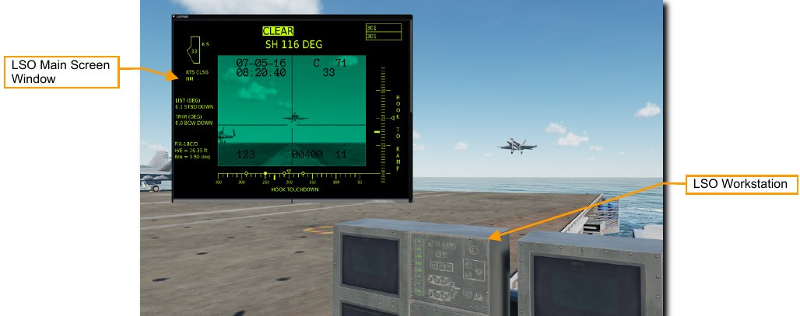
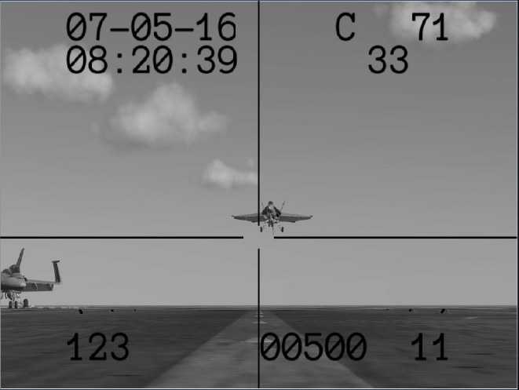
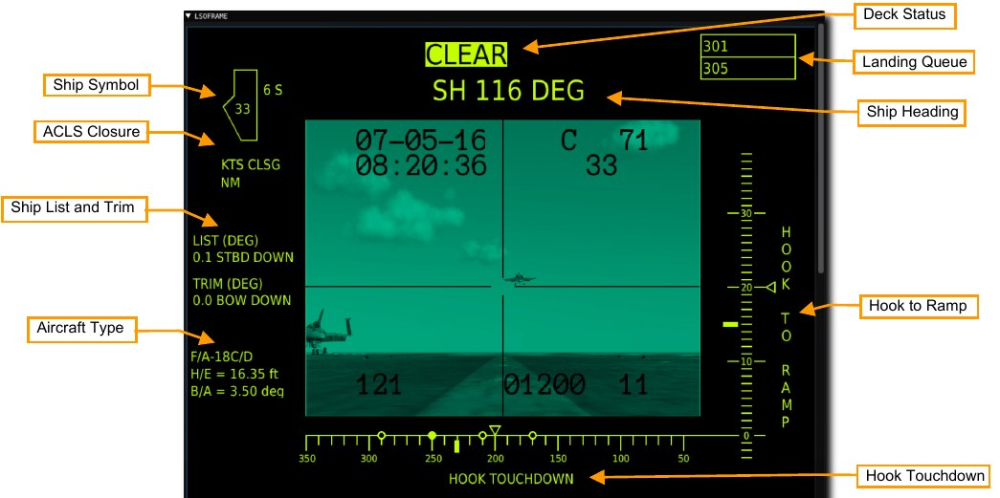
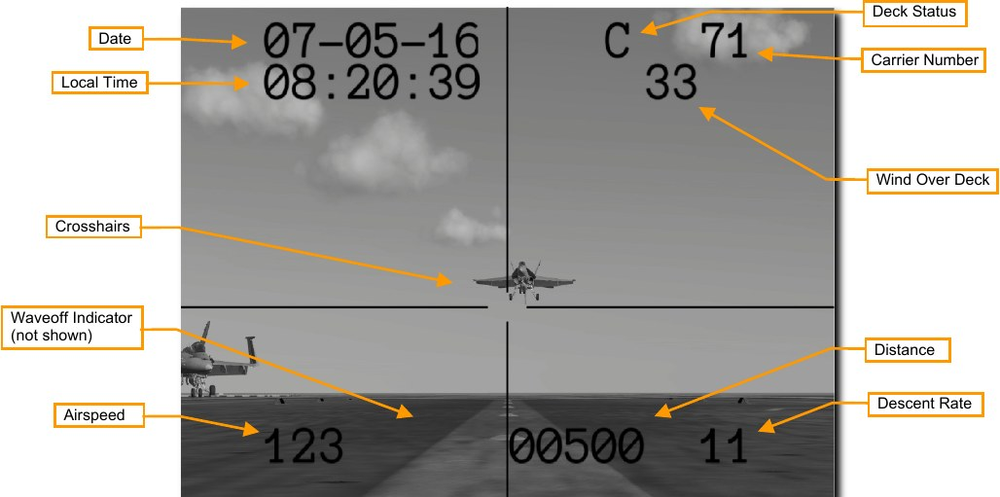

# Landing Signal Officer (LSO) Station

## Overview

The DCS: Supercarrier module includes a fully functional Landing Signal Officer (LSO) station for directing
players in a multiplayer setting or observing aircraft in a single player setting.

You may enter the LSO station with keyboard command [LALT+F9].

You will be transported to the LSO position with the LSO workstation console in front of you. A separate Pilot's
Landing Aid Television (PLAT) Camera view will be opened in a separate window. This will be referred to here
as the LSO Main Screen Window.

You may look around using standard DCS view controls. Use keyboard command [LALT+C] to enable the
mouse cursor and interact with the LSO Main Screen window.

## LSO Main Screen Window

The LSO Main Screen window shows a live view from the PLAT camera surrounded by additional information
on ship and aircraft status. You may open and close the window by clicking the top left. You may also reposition
the window by clicking and dragging it to a new location.

The view may be scrolled up and down using your mouse wheel or by clicking and dragging the bar at the right
side. The full LSO Main Screen is displayed at the top and a PLAT Camera view is displayed at the bottom.
This information is also available on the physical LSO consoles.

## LSO Main Screen Display

The Main screen display shows information used to calibrate the IFLOLS optical landing system for the aircraft
on approach. The data displayed here ensures the glidepath information presented to the pilot is accurate.

The PLAT camera view is also shown in the center of the display. Details on this will be shown in the next
section.

**Ship Symbol**. In the center of the ship symbol is the wind over deck speed in knots. If the axial wind is from the
left, P will be displayed to the left of the symbol it will indicate the wind speed and P (port). If the axial wind is
from the right, S will be displayed to the right of the symbol and it will indicate wind speed and S (starboard). If
there is less than 1 knot axial, this is not displayed.

**ACLS Closure**. If the active aircraft is using ACLS to land, this will display the closure of the aircraft to the ship
in knots.

**Ship List and Trim**. The top indication displays the real time list (roll) of the ship in degrees. Right of the X.X
value, it will display either STBD UP or STBD DOWN (starboard up and down). Trim works the same except the
real time trim (pitch) of the ship is displayed.

**Aircraft Type**. The aircraft next for landing is listed here. The H/E (hook to eye) distance is the number of feet
above the tailhook the pilot’s eyes are. This is used to calibrate the IFLOLS ball to be accurate for each aircraft
type. The B/A (basic angle) is the glidepath angle the crosshairs in the camera display are aligned to.

**Deck Status**. If there is an aircraft or deck crew in the landing area, this will show FOUL. If the area is clear, it
will display CLEAR.

**Ship Heading**. This shows the ships magnetic heading which is the same as the Base Recovery Course (BRC)
value in degrees.

**Landing Queue**. The next three aircraft in queue to land are listed here, with the next aircraft to land in the top
box. Each aircraft is listed by side number.

**Hook Touch Down**. This indicates the distance from the stern of the ship at which the IFLOLS landing system
directs the pilot to fly such that the hook will strike the indicated location. For a 3-wire, it should be 230 feet. The
four dots indicate the four arresting wires. The selected wire to capture is solid. The thick tick mark indicates the
exact, desired hook touch down point and the caret above is the dynamic point based on pitch up and down. As
the ship’s bow moves up and down, so will this caret.

**Hook to Ramp**. This vertical scale illustrates the desired height the bottom of the arresting hook should be
when it crosses over the stern of the ship. For a 3-wire, it should be 14.1 feet. The thick tick mark indicates the
desired hook over ramp height and the caret is the dynamic indication of hook to ramp based on the ship
pitching up and down.

## PLAT Camera View

The center of the window shows the view from the PLAT camera. The camera is mounted on the deck and
angled up at 3-degrees along the aircraft landing glideslope to the arrestor wires. Information is superimposed
over the image to aid in LSO duties.

**Date**. The current date.

**Local Time**. The current local time.

**Crosshairs**. These show the proper glideslope and azimuth for arriving aircraft.

**Waveoff Indicator**. A flashing ‘W’ for waveoff will be shown when if the deck is not clear or other conditions for
a waveoff are met.

**Airspeed**. True airspeed in knots is displayed if the aircraft is ACLS equipped. Otherwise, all zeros are
displayed.

**Deck Status**. This is the readiness state of the landing area. A ‘C’ means the deck clear and the aircraft on
approach may land safely. A flashing ‘F’ means the deck is foul and the aircraft’s landing zone is obstructed.
Carrier Number. This is the hull number of the carrier, in this case CVN 71.

**Wind Over Deck**. This is the wind over deck in knots, accounting for both wind speed and ship speed.

**Distance**. The distance between the carrier and the aircraft is displayed in feet if the aircraft is ACLS equipped.
Otherwise, all zeros are displayed.

**Descent Rate**. The rate of descent in feet per second is displayed if the aircraft is ACLS equipped. Otherwise,
all zeros are displayed.

