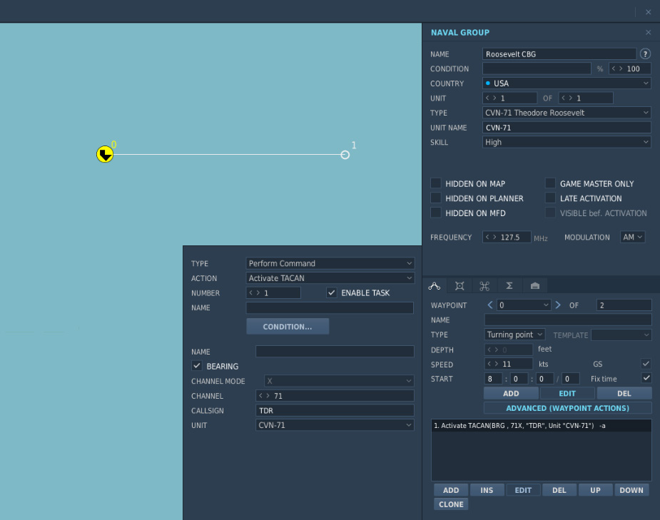
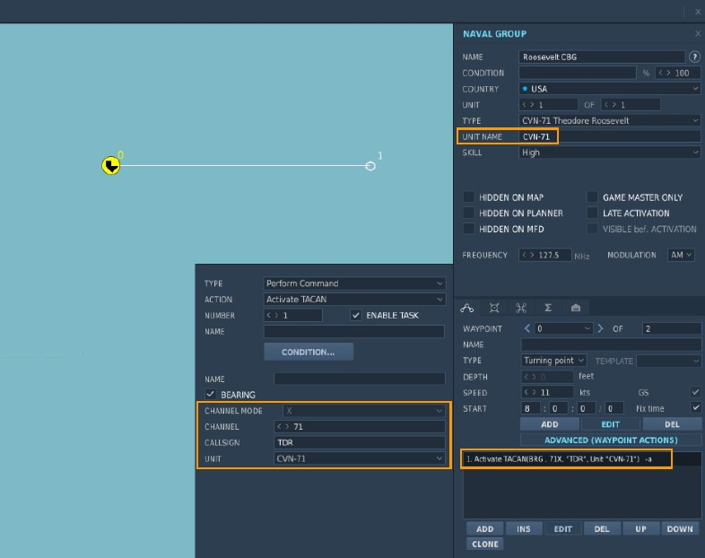
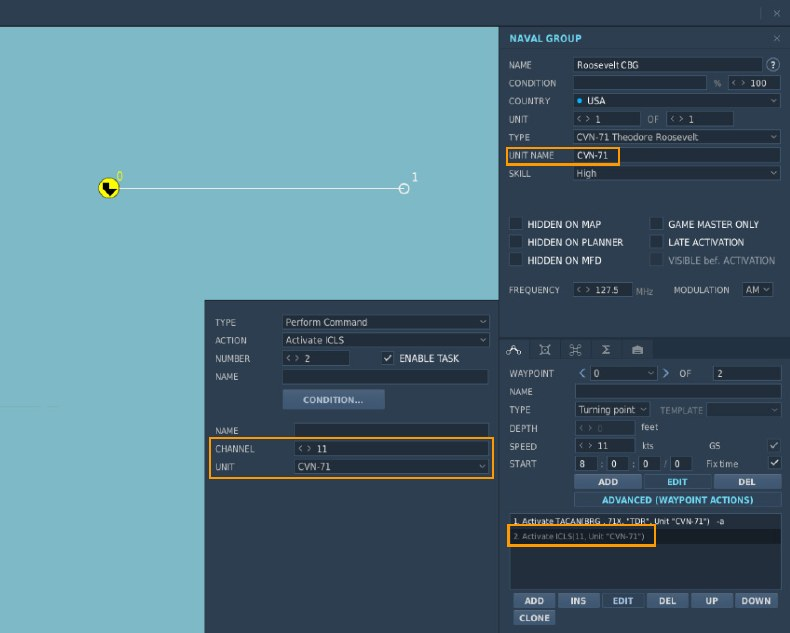
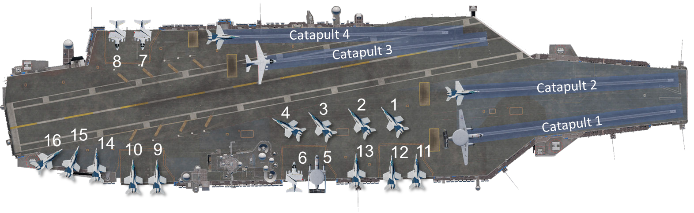
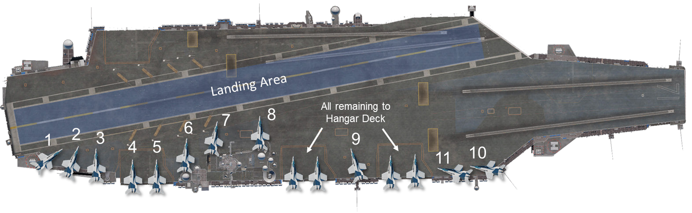
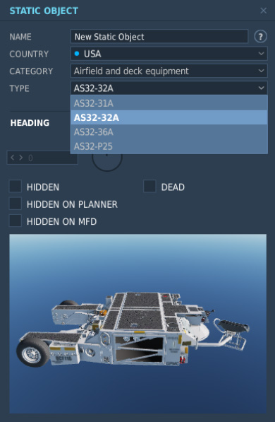
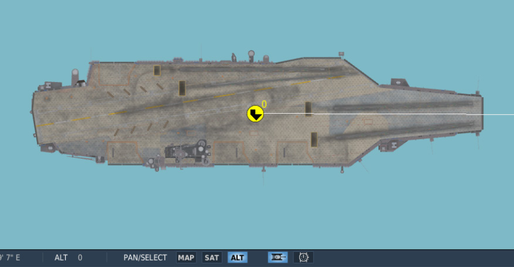
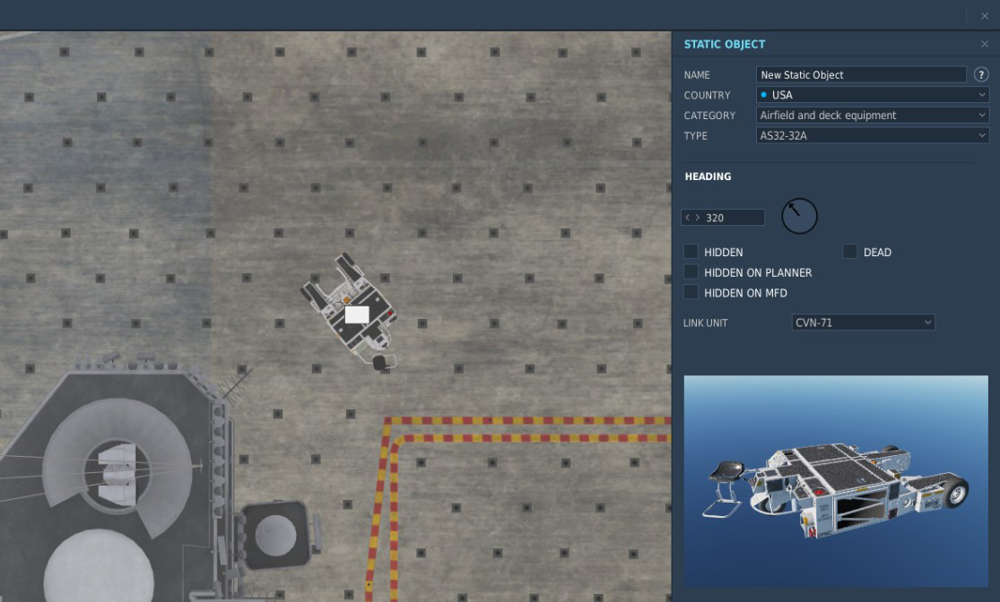

# Mission Editor Features

## Overview

The DCS: Supercarrier module uses the standard mission editor interface. A complete explanation may be
found in the DCS: World User Manual located in your DCS World/Docs folder. That should be your first stop
when learning to set up missions using these assets.

In this section, we will briefly highlight some key features it is important to understand when setting up a mission
with the Supercarrier.

## Ship Selection and Placement

The new ship assets included with the Supercarrier module appear in the TYPE dropdown list. The new Nimitz
Class carriers and Arleigh Burke destroyer are available when the COUNTRY is set to USA. The Admiral
Kuznetsov carrier is available with the COUNTRY set to Russia.

Note that the CVN-70 Carl Vinson and CVN-74 John C. Stennis are the original carrier assets included with
DCS: World. They are still available for users who do not own the Supercarrier module.

It is best to face the carrier into the wind on launch and recovery to eliminate crosswind and reduce the
airspeed required to keep aircraft airborne. The carrier’s speed should be set so that the wind over deck (ship
speed plus wind speed) is near 30 knots.

It is important to remember the ship’s course in the mission editor is its true heading while Base Recovery
Course (BRC) used in carrier operations is magnetic heading. To get the BRC, add or subtract the magnetic
variation for the map being used or simply note the BRC shown at the LSO station in the mission.

## Communications and Navigation Equipment

The radio frequency and NAVAID channels are all set in the mission editor. See the first section of this guide for
a description of each system. See the specific aircraft manual for exact system operation in the air and any
restrictions that may apply while setting them up on the carrier.

### Radio Frequency

The ship’s ATC radio frequency and modulation are set by typing in the desired frequency or selecting the
desired modulation (AM/FM) from the dropdown menu.

All radio functions for the carrier (i.e. Marshal, Approach, Tower, and LSO) will use this single frequency. The
channel presets for the aircraft used in the mission should be set to match.

### TACAN Channel

The carrier’s TACAN beacon must be activated by adding an advanced waypoint action. This is usually set at
waypoint 0, the ship’s starting location.

In this example, TACAN channel and band 71X is used. The callsign is set to TDR. A morse code signal will be
audible keying out those letters for identification. This identifier will also be shown on the aircraft’s displays
where applicable.

You must also select the unit within the group the TACAN signal will originate from. This should always be the
carrier. Note that the carrier’s unit name was changed to CVN-71 to make it easier to identify in the list.

### ICLS Channel

The carrier’s ICLS channel is set by adding an advanced waypoint action in the same way as TACAN.

In this example, channel 11 will be used. Compatible aircraft will receive ICLS guidance on that channel. The
originating unit is selected as CVN-71.

## AI Aircraft Parking and Taxi Logic

At mission start, there are 20 possible aircraft spawn locations available: the 16 parking locations listed below
and 1 on each catapult. Aircraft assigned "Takeoff from ramp" or "Takeoff from parking hot" in the mission editor
will spawn in one of the 16 parking locations listed based on the sequence it was added to the carrier. In a
multiplayer mission, parking spots are assigned based on when a client joins the server.

Aircraft assigned "Takeoff from runway hot" in the mission editor will spawn on the catapult specified in the
mission editor by the mission designer.

The number of available parking locations is reduced when a multiplayer server is un-paused. Spots 1-4 are
deactivated to clear the taxi route for other launching and recovering aircraft, leaving 16 possible spawn
locations: the 12 remaining parking locations and the four catapults.

The parking layout for small aircraft like the F/A-18C Hornet is shown below. This layout is also applies to the S-
3 Viking and E-2 Hawkeye support aircraft, except spots 1-4 are not used. The support aircraft are usually
airborne first so consider starting those either on a catapult or on spots 5-8.

The F-14 Tomcat is a larger aircraft and requires more ramp space. One parking spot on each of the elevators
and one spot on the stern is not available with an F-14 parked on the adjacent spot. Plan your launch sequence
accordingly, remembering aircraft occupy parking spots in the order they are added to the carrier. Those
unoccupied spots will become available again after aircraft begin to taxi clear.

Aircraft that cannot fit on the flight deck are stored below on the hangar deck until a suitable parking spot is free.
In a multiplayer setting, this may result in a ‘your flight is delayed to start - please wait’ message until space is
available.

When an aircraft lands, it requests a taxi route to exit the landing area. Deck control will search for an open
parking location by priority order listed below and provide a taxi route to it. First, it determines a free location
based on the maximum number of open parking locations. For example, if the parking spot aft of the island is
occupied, the next parking spot in priority order will be selected. Next, deck control will check that the chosen
parking location is suitable for the landing aircraft type and that there are no taxi route obstructions like other
“live” aircraft or static objects. Once these requirements are satisfied, the landing aircraft is routed to the open,
unobstructed parking location.

Aircraft like the F/A-18C Hornet, S-3 Viking and E-2 Hawkeye have a small deck footprint and will use any of
the available parking spots shown above. Large aircraft like the F-14 Tomcat may not be able to use some
parking spots or may prevent other aircraft from parking in the adjacent spots. For this reason, it is a good
practice to maintain an unobstructed path to elevator 1 and 2, forward of the carrier’s island structure. Aircraft
reaching those locations will be transported to the hangar deck below and help keep the deck clear.

If, however, a mission is constructed the prohibits landing aircraft from reaching a parking location, the aircraft
will be automatically removed from the simulation after landing.

## Static Object Placement

A number of new static objects are included with the Supercarrier module that allow you to add more life to the
carrier deck, above and beyond the launch crews that are already present by default.
The new static objects are available under the headings ‘Airfield and Deck Equipment’ and ‘Personnel’. Of
course, all aircraft and other static objects included with DCS: World are compatible and may be used.

Before starting, you should depress the unit icon at the bottom of the mission editor screen. Enabling this option
will show the shape of the shape of all objects in the mission editor viewer. This allows placement of objects
with much more precision. Then, zoom in so the carrier deck is visible.

When an object is placed on the deck, it must be linked to the carrier. Select the carrier from the LINK UNIT
dropdown. Once this are set, the static object will be linked to the carrier and remain in position as it moves.

You may find it helpful to add additional objects by copying and pasting an object that is already linked to the
carrier, so you do not have to perform this step every time. You may do this by selecting the object, [[CTRL]]+[[C]] to
copy, then [[CTRL]]+[[V]] to paste.

It is important not to place static objects in locations they may interfere with flight operations so test your
mission thoroughly to find any problems. To assist with this, visual aids showing suitable locations on the deck
are included below.

