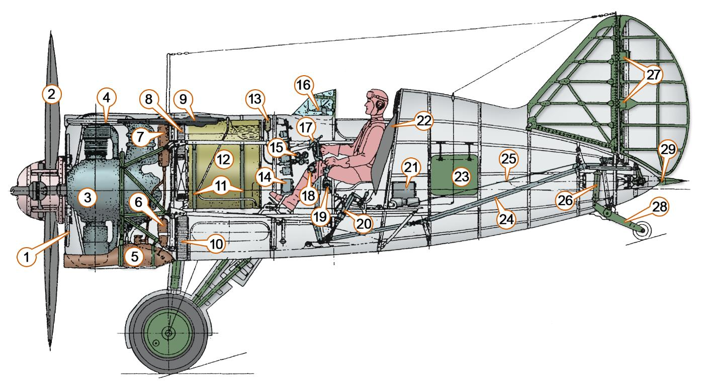
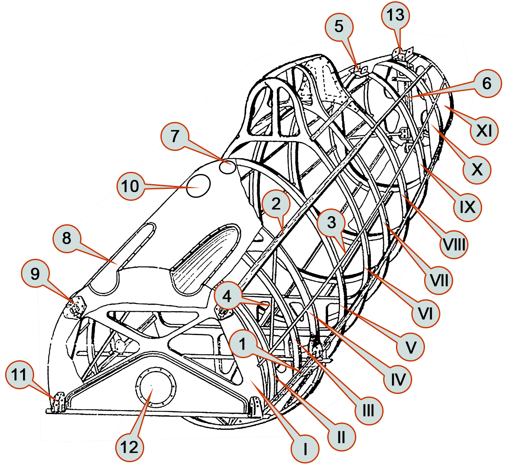
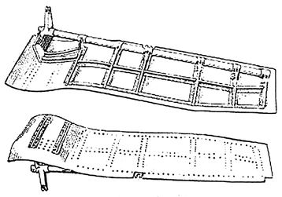
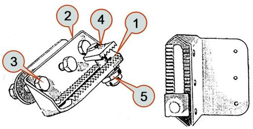
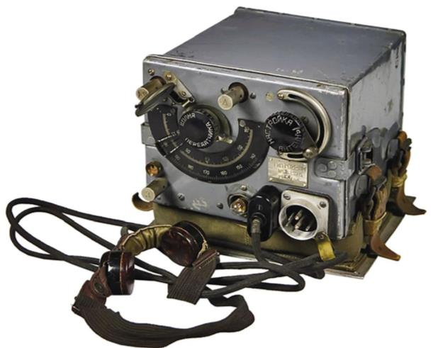
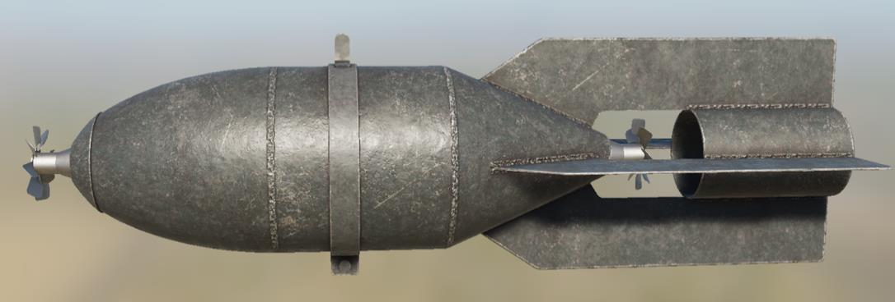

# Конструкция самолёта

## Описание

Истребитель И-16 - свободнонесущий моноплан с нижним расположением
крыла, классической схемы, имеет смешанную конструкцию, основными
материалами которой являются сталь, алюминий и дерево.

Фюзеляж - типа полумонокок, состоящий из двух половин. В качестве каркаса
используется набор деревянных лонжеронов, стрингеров и шпангоутов, сверху
обклеенных березовым шпоном. Каркас усилен стальными уголками, обшивка
обтягивается тканью, шпаклюется, окрашивается и полируется.

Крыло двухлонжеронное, состоит из центроплана и двух консолей. Лонжероны
изготовлены из стальных труб, нервюры – из дюралюминиевых профилей. В
передней части обшивка центроплана выполнена из фанеры, сзади – из
дюралюминия. Элероны занимают практически всю заднюю кромку консолей
крыла.

Хвостовое оперение однокилевое, с металлическим силовым набором и
полотняной обшивкой.

Самолет оснащен трехопорным убирающимся шасси с двумя главными
стойками и хвостовым костылем с небольшим колесом.

Колеса оборудованы тормозами колодочного типа с приводом от педалей.
Амортизация шасси – жидкостно-газовая. Уборка и выпуск шасси производятся
вручную, с помощью лебедки. Система уборки шасси уникальна и включает
большое количество элементов, что сказывается на ее надежности не в лучшую
сторону. Чтобы выпустить или убрать шасси, необходимо вручную выполнить 43
оборота рычагом лебедки подъемного механизма.

Кабина пилота – открытая, с козырьком. Подобное решение было
вынужденным: конструкция фонаря первых модификаций И-16 была неудачной.
Так, ранний закрывающийся фонарь существенно ограничивал обзор, а кроме того,
имел склонность к заклиниванию на высоких скоростях. Летчики опасались летать
с закрытым фонарем, закономерно полагая, что не успеют открыть его в экстренной
ситуации.

За    сиденьем   летчика     находится   бронеспинка,     обеспечивающая
противопульную защиту от огня с задней полусферы.

!!! info "ОСНОВНЫЕ ЛЕТНО-ТЕХНИЧЕСКИЕ ХАРАКТЕРИСТИКИ"
    Параметр                    |  Значение
    ----------------------------|--------------------
    Размах крыла                |   9.00 м 
    Длина                       |   6.13 м 
    Высота                      |   2.25 м 
    Площадь крыла               |   14.54 м2 
    Масса                       |
    ------ пустого                 |      1383 кг 
    ------ взлетная                |      1882 кг 
    Тип двигателя               |   М-63 
    Мощность                    |   900 л.с. 
    Максимальная скорость       |
    ------ у земли                 |      410 км/ч 
    ------ на высоте               |      462 км/ч 
    Скороподъемность            |   882 м/мин 
    Скорость сваливания         |   143-164 км/ч 
    Скорость отрыва             |   145-175 км/ч 
    Посадочная скорость         |   135-145 км/ч 
    Предельная скорость         |   610 км/ч 
    Практическая дальность      |   440 км 
    Практический потолок        |   9700 м 
    Экипаж                      |   1 человек 
    Вооружение                  |   4 пулемета ШКАС 7.62-мм 

## ОБЩАЯ КОМПОНОВКА САМОЛЕТА И-16 ТИП 24

1. Жалюзи капота                            
2. Винт АВ-1                                
3. Мотор М-63                               
4. Газоотводная трубка пулемета             
5. Маслорадиатор                            
6. Дополнительный маслобак (12л)            
7. Основной маслобак (23л)                  
8. Патронная коробка фюзеляжного пулемета   
9. Пулемет ШКАС                             
10. Патронная коробка центропланного пулемета                                
11. Дюралевые ленты крепления бензобака     
12. Бензобак (260л)                         
13. Заливной бачок (4л)                     
14. Приемник РСИ-3 «Сокол»                  
15. Кислородный прибор КПА-3                
16. Прицел ПАК-1                            
17. Сектор управления заслонкой      маслорадиатора и жалюзи (правый борт)   
18. Сектор управления форсажем и   шагом винта (левый борт)
19. Сектор управления нормальным    газом (левый борт)
20. Винтовой механизм управления     закрылками
21. Передатчик РСИ-3 «Орел»
22. Бронеспинка летчика
23. Эксплуатационный люк
24. Тяга управления рулем высоты
25. Тросовая проводка управления   рулем направления
26. Масляно-пневматический    амортизатор костыля
27. Подпружиненные шторки узлов  навески руля направления
28. Костыль с дюралевым колесом
29. Хвостовой аэронавигационный  огонь

## ФЮЗЕЛЯЖ

Фюзеляж И-16 представляет собой деревянный монокок овального сечения,
основой которого является каркас, покрытый скорлупой из березового шпона.

{ width="400" }

1. Нижний лонжерон                   
2. Верхний лонжерон                  
3. Стрингер                          
4. Подкос между 1-й и 4-й рамами     
5. Передний узел крепления киля      
6. Труба костыля                     
7. Отверстие для прицела ПАК-1        
8. Желоба для пулеметов              
9. Верхний узел крепления моторамы
10. Окно освещения доски приборов
11. Нижний узел креплении моторамы и  стыка с центропланом
12. Лючок для снятия стартера    «Эклипс»
13. Задний узел крепления киля
14. I-XI. Рамы фюзеляжа

Силовой каркас состоит из одиннадцати поперечных рам (шпангоутов),
четырех лонжеронов и восьми стрингеров. В передней части фюзеляжа от 1-й до
4-й рамы имеется вырез для установки центроплана.

Наиболее нагруженными и, вследствие этого, усиленными являются 1, 4 и
11-я рамы.

На 1-й располагаются узлы крепления мотора и противопожарная
перегородка, на 4-й раме укреплены задние узлы центроплана, 11-я рама усилена
с целью обеспечения достаточной жесткости хвостовому оперению самолета.

Обшивка фюзеляжа представляет собой скорлупу, выклеенную из нескольких
слоев березового шпона толщиной 0.5 мм. Общая толщина обшивки переменная:
от 1-й до 5 рамы – 2.5 мм, от 5-й до 11-й – 2 мм. Между 5-й и 6-й рамами обшивка
имеет вырезы с откидывающимися бортами кабины летчика. Также в обшивке
имеются различные технологические вырезы для доступа к внутренним
механизмам, стока воды, вентиляции.

В        целях         уменьшения
интерференции      –   аэродинамически
вредного взаимного влияния крыла и
фюзеляжа – в местах их стыка поставлены
переходы (феринги или зализы) с
оптимальными     в   аэродинамическом
отношении радиусами кривизны.

Снаружи    фюзеляж    покрывается
нитроклеем, обрабатывается шпаклевкой
АШ-22,    после    чего   обклеивается
миткалевым полотном на нитроклее и
снова шпаклюется. Далее следует окраска
и лакировка.

### КОЗЫРЕК И КАБИНА ПИЛОТА

Кабина И-16 тип 24 – открытого типа,
располагается между 4-й и 6-й рамами
фюзеляжа.

Для удобства попадания в кабину с
двух сторон предусмотрены откидные
борта, фиксирующиеся в закрытом
положении с помощью задвижек.

В передней части кабины на обшивке
фюзеляжа установлен козырек. Он
представляет     собой      прозрачный
плексигласовый обтекатель, заключенный
в металлический каркас. Стекло крепится к каркасу пистонами из нержавеющей
стали.

Большинство органов управления винтомоторной группой, радиаторами,
шасси, размещаются на бортах кабины и закреплены на элементах силового
набора фюзеляжа. Педали ножного управления, а также ручка управления
самолетом смонтированы на полу кабины, представляющем собой цельный
дюралюминиевый лист с отбортовками. Пол крепится к нулевой нервюре
центроплана, заднему лонжерону центроплана и к 5-й раме фюзеляжа.

Летчик располагается в сиденье, изготовленном из листового дюралюминия и
имеющем углубление для парашюта «чашку».

В верхней части спинки сиденья имеется мягкая подушка из кожзаменителя.
Для регулировки кресла под рост летчика предусмотрена специальная рычажная
система, позволяющая изменять высоту сиденья по вертикали в пределах 110 мм.

Элементов бронирования на самолете И-16 тип 24 не предусмотрено, за
исключением   опционально    устанавливаемой     бронеспинки. Бронеспинка
представляет собой стальной щит толщиной 8.5 мм, по своей форме
соответствующий контуру головы и туловища летчика. В случае оборудования
самолета бронещитом, стандартная спинка сиденья не ставится.

## КРЫЛО 

### ЦЕНТРОПЛАН

Центроплан       является
основным элементом силовой
конструкции самолета, к нему
крепятся     консоли     крыла,
фюзеляж,      шасси,     фермы
пулеметов, закрылок и т.д.

Силовая              часть
центроплана      состоит     из
переднего и заднего лонжеронов
ферменного      типа,    девяти
нервюр, десяти раскосов, двух
крестовин из лент-расчалок и
двух листов для повышения
жесткости каркаса. Центроплан
крепится к фюзеляжу четырьмя
узлами, расположенными на
переднем и заднем лонжеронах.

Обшивка центроплана на его верхней стороне сделана фанерной, на нижней
– преимущественно дюралевая. Для обеспечения доступа к пулеметам,
механизмам их перезаряжания и управления огнем, к другим внутренним
механизмам в обшивке предусмотрены лючки.

### ЗАКРЫЛОК

Закрылок расположен по всему
размаху центроплана и симметрично
разделен на правую и левую части
относительно оси самолета. По своей
форме закрылок представляет собой
контур нижней хвостовой обшивки
центроплана и по мере приближения к
оси самолета – контур феринга
фюзеляжа. Закрылок закреплен в
шести точках – по три на каждую
половину.   Управление    закрылком      
осуществляется вручную, при помощи       
винтового механизма.                     

При вращении рукоятки механизма приобретает поступательное движение
шток, который соединен с рычагом на лонжероне закрылка. Выпуская или убирая
шток, открывают или закрывают закрылок. Винтовой механизм монтируется с левой
стороны сиденья летчика у 5-й рамы фюзеляжа.

Максимальный угол отклонения закрылка составляет 53°±2°

### КОНСОЛЬ КРЫЛА

Консоль крыла в плане имеет трапециевидную форму с закругленным концом.
Угол установки крыла по размаху постоянный и равен 2°04'.

Конструкция консоли металлическая, обшитая полотном. Каркас консоли
крыла состоит из двух лонжеронов, двенадцати нервюр, лент-расчалок, обода
крыла и одиннадцати дополнительных полочек, установленных между нервюрами
сверху. Усиленные нервюры вместе с лонжеронами и лентами-расчалками
образуют основной силовой каркас крыла. На усиленных нервюрах установлены
кронштейны, при помощи которых шарнирно крепится элерон.

Присоединение консоли к центроплану осуществляется специальными
стыковыми узлами.

Обшивка консоли полотняная. Вследствие больших нагрузок на обшивку носок
консоли сверху на 44.5% и снизу на 14.5% хорды обшит листовым дюралюминием
толщиной 0.6 мм.

### ЭЛЕРОН

Элерон состоит з двух отсеков: корневого и концевого, и крепится к усиленным
нервюрам консоли крыла на четырех шарнирах.

Каркас элерона образуется из дюралевых нервюр и лонжерона. Обшивка
элеронов изготовлена из листового дюралюминия толщиной 0.5мм. Управление
элеронами осуществляется посредством тросовой проводки от РУС.

## ХВОСТОВОЕ ОПЕРЕНИЕ

Хвостовой оперение самолета         –    монопланное,    свободнонесущее,
металлическое, с полотняной обшивкой.

1. Киль                                
2. Передний узел крепления киля        
3. Задний узел крепления киля          
4. Руль направления                    
5. Двуплечий рычаг управления рулем      направления                        
6. Стабилизатор (левая часть)                             
7. Стабилизатор (правая     часть)                             
8. Передний (регулируемый) узел      крепления стабилизатора
9. Задний узел крепления стабилизатора
10. Узел разъема лонжеронов правой и   левой части стабилизатора
11. Руль высоты (левая  часть)
12. Руль высоты (правая    часть)
13. Качалка управления рулем высоты
14. Узел разъема лонжеронов правой и левой частей руля высоты
15. XI усиленная рама фюзеляжа

###    КИЛЬ

Киль неподвижно укреплен на фюзеляже и повернут на 2° влево по полету для
погашения силы сопротивления, вызванной реактивным моментом винта на крыле.
Для этого передний узел крепления киля снесен на 30 мм влево от оси самолета.

По конструкции киль металлический; его силовой набор состоит из двух
лонжеронов, шести нервюр, носка переднего обтекателя, раскоса и узлов
крепления. На заднем лонжероне киля установлены кронштейны для крепления
руля направления.

###    РУЛЬ НАПРАВЛЕНИЯ

Руль направления подвешен на заднем лонжероне киля и крепится в трех
точках, из которых две сверху находятся на киле и одна, нижняя, на 11-й раме
фюзеляжа. Кроме этих узлов, на нижнем конце лонжерона установлен двуплечий
рычаг управления рулем поворота. Отклонение руля направления осуществляется
ножными педалями посредством тросовой проводки.

Каркас руля направления образуют лонжерон, нервюры, хвостовой профиль.

###    СТАБИЛИЗАТОР

Стабилизатор — разъемный, состоит из двух симметричных половин,
стыкуемых на лонжеронах. Каркас каждой половины стабилизатора включает в
себя передний и задний лонжероны, соединенные нервюрами. Передняя кромка
стабилизатора обшита листовым дюралюминием, образующим обтекатель.

Стабилизатор монтируется на 10-й и 11-й рамах фюзеляжа в четырех точках,
причем передние узлы крепления стабилизатора сделаны регулируемыми по
вертикали. Изменение высоты передней точки крепления стабилизатора позволяет
настраивать его угол атаки, добиваясь оптимальной балансировки самолета
(минимальных усилий на ручке при расчетной скорости горизонтального полета).

Конструктивно основными элементами регулируемого узла являются опорная
скоба и болт, взаимное положение которых может настраиваться в определенных
пределах.

1. Гребенка
2. Опорная скоба
3. Болт крепления
4. Гребенчатый болт
5. Гайка болта

На поверхности опорной скобы фрезерована зубчатая гребенка. Крепление
стабилизатора осуществляется болтом с головкой, имеющей зубчатую
поверхность, соответствующую зубьям гребенки.

При установке стабилизатора на необходимый угол атаки болт
переставляется в прорези гребенки и затягивается. При этом зубцы болта входят
между зубцами гребенки и закрепляют стабилизатор в этом положении.
Перемещение гребенки на один зуб соответствует изменению угла установки
стабилизатора на 0°24'. Регулировка производится наземным персоналом.

###    РУЛЬ ВЫСОТЫ

Руль высоты состоит из двух половин и подвешен на заднем лонжероне
стабилизатора. Каркас каждой половины руля состоит из лонжерона и семи
нервюр, соединенных по носкам и по хвостовикам дюралевым профилем.

Руль крепится к кронштейнам стабилизатора в пяти точках: против нервюр №
3 и 6 руля и на узле разъема. Все узлы, за исключением среднего, конструктивно
аналогичны узлам руля направления.

Управление рулем высоты осуществляется с помощью жестких трубчатых тяг,
механически связывающих качалку руля высоты с ручкой управления самолетом.

##  ШАССИ

Шасси самолета И-16 составляют две убирающиеся основные стойки и
неубирающийся хвостовой костыль с небольшим дюралевым колесом. Основные
стойки представляют собой две трехстержневые пирамиды, образованные двумя
подкосами и амортизационной стойкой, шарнирно прикрепленными к лонжеронам
и торцовым нервюрам центроплана. В вершине каждой пирамиды имеется
тормозное колесо с пневматиком 700х150.

Амортизация основных стоек шасси обеспечивается шлицевыми масляно-
пневматическими амортизаторами.

Система торможения – механическая. Усилие с правой и левой тормозных
педалей через тросовую проводку передается непосредственно на тормозные
колодки соответствующего колеса.

Выпуск и уборка стоек шасси осуществляются от механического привода,
источником энергии в котором служат мускульные усилия летчика (вращение
рукоятки подъемного механизма). Сам принцип подобного подхода, несмотря на
внешнюю простоту, требует наличия ряда уникальных устройств, не присущих
самолетам с традиционной гидравлической или пневмо- системой выпуска шасси.
В частности, учитывая наличие единого привода, необходимо обеспечить
равномерные усилия всем элементам обоих стоек шасси (складывание подкосов,
подтягивание колес, т.д.) на протяжении всего процесса выпуска или уборки. Кроме
того, полностью механический привод требует гарантированно надежной работы
системы передачи усилий (тросовой проводки), а также ряда дополнительных
обеспечивающих механизмов (торможения барабанов, блокировки, т.п.).

Таким образом, для более полного понимания и правильной эксплуатации
механизма подъема шасси необходимо подробно рассмотреть его конструкцию.

### ЗАМОК ШАССИ

В процессе выпуска и уборки шасси узел крепления заднего подкоса
посредством специальной ползушки перемещается вдоль цилиндрической
направляющей, закрепленной на лонжероне центроплана.

1. Ползушка
2. Направляющая
3. Задний подкос шасси

Недотягивание ползушки при выпуске
шасси может вызвать при посадке его
самопроизвольное      складывание,    что
повлечет за собой неизбежную аварию. Этот
недостаток устраняется запором ползушки
специальным замком, конструкция которого
заключается в следующем.

В верхней части ползуна приварена
гребенка с тремя фрезерованными зубьями.
В кронштейн крепления направляющей к
заднему лонжерону центроплана ввернут
вильчатый болт. Крючок запора ползушки
входит в вилку и крепится шарнирно болтом
диаметром 6 мм. При сцеплении зубьев
ползушки     с     крючком    исключается
возможность ее обратного перемещения.

Крючок замка шасси посредством
тросовой проводки связан с рычагом
переключения собачки храпового колеса на
подъёмном механизме в кабине. Управление замком осуществляется совместно с
переключением собачки на выпуск или на уборку шасси.

Срабатывание замка и номер зуба, на котором произошло запирание
ползушки, контролируется летчиком по механическому указателю шасси.

### ПРИНЦИП ДЕЙСТВИЯ ПОДЪЕМНОГО МЕХАНИЗМА ШАССИ

Подъем шасси производится все время принудительно.

Первая часть процесса подъема происходит за счет перемещения ползушки
заднего подкоса вдоль лонжерона. Поскольку длина подкосов остается все время
постоянной, при перемещении ползушки нижний узел шасси вместе с колесом
отходит назад и поднимается. Во второй части процесса подъем осуществляется
преимущественно за счет подтягивания шасси тросами, идущими от подъемника в
кабине летчика к колесам самолета.

Опускание шасси происходит в обратном порядке.

На первом этапе стойки шасси «повисают» на тросах и выпускаются под
действием собственного веса. Летчик, вращая рукоятку, лишь удерживает шасси от
очень быстрого опускания.

Вторая часть процесса выполняется принудительно. Раскладывание шасси
происходит за счет движения ползушек по направляющим с дальнейшей
фиксацией в замках верхних узлов крепления задних подкосов.

### КОНСТРУКЦИЯ ПОДЪЕМНИКА

1. Рукоятка                                   подъема/выпуска шасси
2. Ручка аварийного                                стопора
3. Ручка переключения            собачки храпового колеса
4. Ручка регулировки        натяжения ленты     автоматического тормоза
5. Ведущая шестерня
6. Зубчатое колесо нижнего            барабана
7. Комбинированный                    барабан
8. Верхний барабан
9. Нижний барабан
10. Тормозная лента
11. Тормозной валик
12. Трос к правому подкосу
13. Трос к левому подкосу
14. Тросы к колесам

Подъем и опускание шасси самолета производят вращением рукоятки
подъемника, находящегося в кабине летчика. При подъеме рукоятку нужно вращать
43 оборота против часовой стрелки, при опускании - по часовой стрелке. Вращение
рукоятки подъемника через набор шестерен передается двум барабанам: на один
из них наматываются тросы от верхних скользящих креплений задних подкосов
шасси, а на другой — тросы, идущие к колесам самолета.
Надежный выпуск шасси требует дополнительного автоматического тормоза.
С этой целью в конструкцию подъемного механизма введена тормозная лента
«феродо»    (композитный    фрикционный     материал).    Лента  охватывает
комбинированный барабан и крепится к тормозному валику. Валик ложится сверху
на тросы колес и оттягивается пружиной так, что тросы нижнего барабана
постоянно находятся под некоторым натяжением. Так как действие тормозов
необходимо только при выпуске шасси, то на подъеме тормоз ослабляют при
помощи ручки, установленной с правой стороны в кабине летчика.

1. Ведущая шестеренка
2. Комбинированный барабан
3. Шестеренки – сателлиты (3 шт.)
4. Зубчатое колесо внутреннего зацепления
5. Стальная лента
6. Шестерня
7. Зубчатое колесо.

Чтобы шасси в полете не выпадало, рукоятка подъемного механизма
закрепляется при помощи храпового колеса и собачки. Собачка сделана
двустороннего действия, т. е. работает при подъеме и выпуске шасси.

Рукоятка подъема с храповым колесом насажена на валик ведущей
шестеренки 1. На этот же валик насажен комбинированный барабан 2 и с другой
стороны — верхний барабан.

Связь верхнего барабана с ведущей шестеренкой 1 осуществляется при
помощи трех свободно вращающихся шестеренок 3.

Насаженный на ведущий валик комбинированный барабан 2 выточен из
дюралюминия; в него впрессованы два шарикоподшипника. В кольцевую выточку
барабана вставлена шестеренка 4 внутреннего зацепления. По внешнему
диаметру на барабан наложена стальная лента 5, привернутая утопленными
винтами к кожуху барабана. Эти винты фиксируют одновременно шестеренку 4,
которая в собранном механизме охватывает три шестеренки 3.

Связь нижнего барабана с ведущей шестеренкой валика 1 имеет следующие
звенья: шестеренка 1 сцеплена с шестеренками 3 и через них с шестеренкой 4 с
внутренним зубом, шестеренка 4 связана с барабаном 2; к этому барабану
приклепана шестерня 6; шестерня 6 приводит в движение шестерню 7 нижнего
барабана, жестко связанную с ним болтами.

Таким образом, передаточный механизм представляет собой дифференциал,
позволяющий сообщать крутящий момент наименее нагруженному барабану, тем
самым равномерно распределяя усилия между подтягиванием колес и движением
подкосов.

###  КОСТЫЛЬ

Хвостовая стойка шасси представляет собой неубираемый стальной костыль
эллиптического сечения с дюралюминиевым колесом. Амортизация костыля
обеспечивается масляно-пневматическим амортизатором.

Управление костылем осуществляется совместно с рулем направления
посредством педалей. Поскольку костыль связан с органами управления
пружинными тягами, на стоянке либо очень низких скоростях руления
эффективность управления костылем может быть снижена.

1. Руль направления
2. Ось поворота руля направления
3. Двуплечий рычаг управления рулем направления
4. Тросовые тяги от педалей летчика
5. Хвостовой костыль с колесом
6. Амортизатор костыля
7. Ось поворота костыля
8. Качалка костыля
9. Пружинные тяги

##  ВИНТОМОТОРНАЯ ГРУППА

###    МОТОР

На самолете И-16      тип 24 установлен звездообразный мотор М-63 с
номинальной мощностью    у земли 930 л. с. Мотор М-63 — девятицилиндровый,
воздушного охлаждения,    имеет двухскоростной центробежный нагнетатель с
механическим приводом,   позволяющий поддерживать мощность с подъемом до
расчетной высоты.

!!! info "ОСНОВНЫЕ ХАРАКТЕРИСТИКИ МОТОРА"
    Параметр                    |  Значение
    ----------------------------|--------------------
    Степень сжатия               |     7.2 
    Рабочий объем, л.            |     29.87 
    Масса мотора, кг.            |     515 
    Мощность на форсаже, л.с.    |     1100 
    Мощность у земли, л.с.       |     930 
    Мощность на 4500м., л.с.     |     900 
    Частота вращения ном, об/мин |     2200 

###  ВИНТ

Самолет снабжен воздушным винтом АВ-1 изменяемого              шага,   с
автоматическим поддержанием постоянного числа оборотов.

!!! info "ОСНОВНЫЕ ДАННЫЕ ВИНТА АВ-1"
    Параметр                    |  Значение
    ----------------------------|--------------------
    Винт                        | тянущий, правого вращения
    Число лопастей              | 2
    Диаметр винта      | D = 2,8м или D = 2,7м с уширенной лопастью
    Диапазон изменения угла установки лопастей | 30°
    Полный вес винта            |  73кг

Постоянное число оборотов обеспечивается автоматическим регулятором
типа Р-2, гидравлически связанным с винтом. Кроме того, с помощью регулятора
винт можно принудительно поставить в положение минимального или
максимального шага. Управление регулятором осуществляется из кабины летчика.

### РЕГУЛЯТОР ПОСТОЯННОГО ДАВЛЕНИЯ

Мотор М-63 снабжен регулятором постоянного давления РПД-1,
автоматически ограничивающим давление за нагнетателем в определенных
пределах, равных 915±10 мм рт.ст.

Регулятор ограничивает две степени наддува: при взлете и номинальной
мощности. Переключение с одного положения на другое производится при помощи
рычага.

На корпусе РПД-1 расположен рычаг форсажа, который дает возможность
форсировать мощность мотора при взлете. Управление форсажем производится
при помощи тяги и сектора из кабины летчика.

### АВТОМАТИЧЕСКИЙ ВЫСОТНЫЙ КОРРЕКТОР

Карбюратор на моторе М-63 оснащен автоматическим высотным корректором
непосредственного действия и механизмом останова мотора.

С подъемом самолета на высоту сохранение постоянства соотношения
количества воздуха и горючего осуществляется автоматически при наличии
высотного корректора. Управление высотным корректором может осуществляться
и вручную из кабины в случае отказа автоматики.

## ТОПЛИВНАЯ СИСТЕМА

Самолет снабжен одним фюзеляжным топливным баком. Бак емкостью 260 л,
обтянут протектором установлен между рамами № 1 и 4 фюзеляжа (за приборной
доской летчика).

В случае необходимости могут быть подвешены два крыльевых ПТБ емкостью
по 93 л каждый. При этом горючее сначала расходуется из подвесных бензиновых
баков, потом - из центрального. Переключение баков осуществляется вручную из
кабины.

### ЗАЛИВНАЯ СИСТЕМА

При запуске мотора горючее подается под давлением из специального
заливного бачка емкостью 4 л, который расположен в верхней части фюзеляжа за
бензиновым баком. Давление в бачке создается вручную воздушным насосом,
расположенным на правой стороне доски приборов. Созданное насосом давление
в бачке дает возможность через трехходовой кран производить заливку
карбюратора и мотора перед пуском.

1. Центральный топливный бак            
2. Подвесные баки                       
3. Коллектор                            
4. Гибкая тяга управления коллектором   
5. Бензопроводы, сообщающие            
топливные баки с коллектором            
6. ------^^
7. ------^^
8. Бензопровод из коллектора в           
топливный фильтр                        
9. Топливный фильтр                     
10. Пожарный кран                       
11. Трубопровод между пожарным краном     
и бензонасосом                          
12. Трубопровод из бензонасоса в         
карбюратор                              
13. Кран слива топлива из центрального   
бака                                    
14. Трубопровод слива топлива из         
центрального бака                       
15. Трубопровод топливного манометра    
16. Заливной бачок                      
17. Воздушный насос для нагнетания       
давления в заливном бачке               
18. Трубка, соединяющая воздушный        
насос с заливным бачком                 
19. Бензопровод подачи топлива из
   заливного бачка к трехходовому
   крану
20. Трехходовый кран
21. Бензопровод, сообщающий заливной
   бачок с карбюратором
22. Бензопровод, сообщающий заливной
   бачок с мотором
23. Гибкая тяга управления пожарным
   краном
24. Карбюратор
25. Топливный насос (помпа)
26. Соединения топливной магистрали
       самолета с бензопроводом ПТБ
27. Трубка слива топлива из
   карбюратора
28. Трубка слива топлива из бензонасоса
29. Дренажная трубка картера
30. Дренажная трубка центрального
   бака
31. Указатель остатка топлива
   (бензомер)
32. Указатель давления топлива
   (трехстрелочный индикатор)

### СИСТЕМА СМАЗКИ

Для смазки мотора используется минеральное масло. Самолет оборудован
двумя масляными баками: центральным и дополнительным.

Центральный масляный бак емкостью 23 л расположен между мотором и
рамой №1. Дополнительный бак емкостью 12 л установлен перед передним
лонжероном центроплана с левой стороны. Масло поступает в мотор из
дополнительного бака под давлением 4,5- 5.5 кг/см3.

1. Центральный масляный бак                    
2. Дополнительный бак                          
3. Трубопровод для подачи масла в мотор        
4. Трубопровод, отводящий масло в радиатор     
5. Тяга управления заслонкой маслорадиатора    
6. Сектор управления заслонкой                  
маслорадиатора                                 
7. Трубопровод, отводящий охлажденное           
масло из радиатора                             
8. Трубопровод заправки центрального            
маслобака                                      
9. Маслопровод заправки
  дополнительного бака
10. Трубопровод, сообщающий
  центральный маслобак с
  дополнительным
11. Трехстрелочный индикатор
12. Трубопровод масляного
  манометра
13. Проводка датчика
  температуры входящего масла
14. Маслоотстойник
15. Слив из маслоотстойника

Для охлаждения нагретого масла используется восьмидюймовый сотовый
радиатор с термостатом, автоматически поддерживающим температуру масла в
пределах 60-75°С Воздухозаборник маслорадиатора расположен в нижней части
переднего кольца капота. Кроме термостата, регулировка охлаждения масла
производится при помощи заслонки, установленной в патрубке, отводящем воздух
из радиатора. Управление заслонкой осуществляется из кабины летчика, для
предотвращения чрезмерного переохлаждения масла в зимних условиях или на
больших высотах.

## СИСТЕМА ЭЛЕКТРОПИТАНИЯ

1. Аккумулятор 12А-5                 
2. Распределительная коробка         
3. Правый бортовой огонь             
4. Левый бортовой огонь              
5. Хвостовой огонь                   
6. Обогрев трубки Пито               
7. Электрощиток летчика
8. Кабинная лампа                    
9. Реостат кабинных ламп             
10. Лампа освещения прицела          
11. Реостат освещения прицела        
12. Розетка переносной лампы         
13. Розетка хвостового огня          
14. Вилка хвостового огня            
15. Двухклеммная разъемная коробка   
16. Трехклеммная разъемная коробка   
17. Обогрев часов                    
18. Тумблер
19. Розетка стартера
20. Магнето
21. Розетка обогрева спецустановки
22. Обогреватель
23. Кнопка включения
                                      
А – одинарная кнопка ракет; 
Б – выключатель обогрева Пито; 
В – выключатель АНО; 
Г – одинарная кнопка сигнального АНО; 
Д – контактная колодка; 
СА-189 – электроинерционный стартер; 
КП-1717 – пусковая катушка; 
РА-176 – реле храповика; 
ВМ-177 – магнитный включатель; 
КС-3 – кнопка стартера.

## КИСЛОРОДНАЯ СИСТЕМА

Для выполнения полетов на высотах от 4 км самолет оборудован прибором
КПА-3, автоматически дозирующим подачу кислорода. Кислородный прибор,
включающий в себя редуктор, манометр и индикатор кислородного потока,
смонтирован в кабине на правом борту фюзеляжа. Кислород поступает для
дыхания летчика через специальный шланг в маску открытого типа.
Запас сжатого кислорода содержится в баллоне емкостью 4 л.

## РАДИООБОРУДОВАНИЕ

Самолет             оборудован
радиостанцией      типа      РСИ-3,
являющейся      приемо-передающей
симплексной         коротковолновой
станцией.        В         комплект
радиооборудования входят приемник
РСИ-3 «Сокол» и передатчик РСИ-3
«Орел».
Приемник типа РСИ-3 «Сокол»
устанавливается на полу кабины
   пилота,   под  приборной  доской.

Станция рассчитана на прием пяти
фиксированных   волн    и  имеет
возможность плавной подстройки в пределах одной фиксированной волны.
Питание приемника автономное, от
двух сухих батарей типа БАС-60 и
щелочного аккумулятора типа 2-НКН-
10,   независимое     от   бортовых
источников    электроэнергии.    Это
позволяет исключить помехи приема,
присущие бортовой сети самолета.
Кроме приемной радиостанции
самолет      может       оснащаться
передатчиком РСИ-3 «Орел». Для
питания передатчика дополнительно
устанавливается            радийный  
электрогенератор          ГС-10-350.

 
Передатчик    устанавливается    вне
кабины – в фюзеляже за сиденьем летчика. Дистанционным управлением
передатчик не снабжен, соответственно установка волны и настройка передатчика
производятся перед вылетом на земле, причем ввиду недоступности для летчика
органов управления передатчиком, смена волн в полете не производится. Во
время полета передатчик остается настроенным на одну волну, органы настройки
неподвижно закреплены фиксаторами.

В фюзеляже за сиденьем летчика располагается также упаковка питания
приемника, причем принимаются меры к облегчению снятия и установки упаковки.
Прием и передача радиосигнала осуществляется с помощью антенного
провода, протянутого между съемной радиомачтой и верхней частью киля.

## ВООРУЖЕНИЕ

### ВСТРОЕННОЕ ВООРУЖЕНИЕ

Основное стрелковое вооружение самолета И-16 тип 24 составляют четыре
пулемета ШКАС (два фюзеляжных и два крыльевых).

!!! info "Основные характеристики пулемета ШКАС"
    Параметр                        | Крыльевой             | Синхронный
    --------------------------------|-----------------------|------------------
    Калибр                          |     7,62 мм           | 7,62 мм
    Патрон                          | 7,62×54 мм R          | 7,62×54 мм R
    Вид боепитания                  | разъемно-звеньевая лента | разъемно-звеньевая лента
    Масса                           |       9,8 кг          |       11,1 кг
    Скорострельность                |  1800 выстр./мин      |  1650 выстр./мин
    Начальная скорость пули         |     775-825 м/с       |    800-850 м/с

Два синхронных фюзеляжных пулемета установлены перед летчиком над
мотором. Стрельба из них ведется через винт. Боезапас составляет 900 патронов
на каждый пулемет. Крыльевые пулеметы смонтированы в центроплане,
синхронизаторами не оборудованы. Боезапас – 500 патронов на пулемет.

Управление огнем осуществляется посредством тросовых тяг от гашетки на
ручке управления самолетом.

Все стрелковое вооружение на самолете сведено и пристреляно на дистанцию
400 м.

### ПОДВЕСНОЕ ВООРУЖЕНИЕ

И-16 тип 24 оборудован встроенными в консоли крыла узлами подвески,
которые используются для установки направляющих для реактивных снарядов (РС)
и держателей для бомбового вооружения.

Самолет может нести до шести РС-82 и до 200 кг бомбовой нагрузки.
Применение подвесного вооружения осуществляется по электрическому
сигналу с боевой кнопки на РУС посредством электросбрасывателя ЭСБР-3.

### РАКЕТНОЕ ВООРУЖЕНИЕ

!!! info "Основные характеристики реактивного наряда РС-82"
    Параметр                    |  Значение
    ----------------------------|--------------------
    Калибр, мм                                                          | 82
    Длина снаряда, мм                                                   | 600
    Вес ВВ, кг                                                          | 0,36
    Вес ракетного топлива, кг                                           | 1,1
    Полный вес снаряда, кг                                              | 6,8
    Максимальная скорость снаряда (без учёта скорости самолета), м/с    | 340
    Максимальная дальность, км                                          | 6,2
    Радиус сплошного осколочного поражения, м                           | 6-7
    Рассеивание при стрельбе по наземным целям, тысячные доли дальности | 14-16

### БОМБОВОЕ ВООРУЖЕНИЕ

!!! info "Основные характеристики ФАБ-100св"
    Параметр                    |  Значение
    ----------------------------|--------------------
    Общая длина                                        | 1034...1050 мм
    Диаметр корпуса                                    |   280 мм;
    Размах оперения                                    |    310 мм
    Расстояние от центра тяжести до головного среза    |  320 мм;
    Масса авиабомбы без взрывателя                     |      103,30 кг
    Масса взрывчатого вещества                         |       36,02 кг;
    Используемые взрыватели                            | АПУВ, АПУВ-1, АПУВ-М

### ПРИЦЕЛЬНЫЕ ПРИСПОСОБЛЕНИЯ

На самолете установлен авиационный коллиматорный прицел ПАК-1,
позволяющий применять как пулеметное вооружение, так и ракетно-бомбовое (из
пикирования с учетом выноса точки прицеливания). Благодаря тому, что лучи от
коллиматора выходят параллельным пучком, летчик наблюдает одновременно
сетку и цель не напрягая глаз, линия прицеливания не смещается при повороте или
сдвиге головы летчика. Подсветка сетки прицела обеспечивается встроенной
лампой. На случай отказа в конструкции ПАК-1 предусмотрены дублирующие
механические прицельные приспособления.

### ФОТО-КИНО-ПУЛЕМЕТ

На самолете предусмотрена возможность установки фото-кино-пулемета
(ФКП) ПАУ-22 для контроля и фиксации результатов воздушной стрельбы. ФКП
заключен в обтекатель цилиндрической формы и устанавливается посредством
кронштейна на гаргроте самолета позади кабины летчика. Электропитание ФКП
осуществляется от бортовой сети самолета, включение происходит при нажатии на
гашетки пулеметов.
