# Стандартные процедуры

## ЭКСПЛУАТАЦИЯ МОТОРА

### ЗАПУСК

1.   Во   избежание    неконтролируемого
движения самолета, запуск и опробование
двигателя производят после установки
колесных колодок. Для этого необходимо
через меню радиокоманд отдать приказ
наземному персоналу «Колесные колодки» -
«Подключить».

    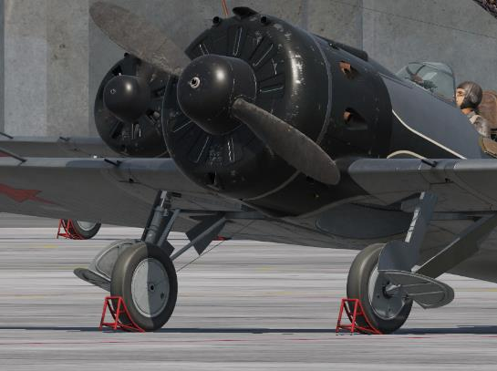

2. Если запуск мотора производится штатно,
на оборудованном аэродроме, для раскрутки
стартера необходимо подключить внешний
источник питания.

    Для подключения аэродромного питания
нужно подать наземному персоналу команду
«Наземное электропитание» - «Подключить»

    

3. Включить три выключателя на приборной
доске:

    - Аккумулятор;
    - Шунт;
    - Радио.

    

4. Установить пожарный кран в положение
«ОТКРЫТ» («от себя», ручка утоплена).

    

5. С помощью рукоятки заливного насоса
создать давление в заливном бачке.

    Для этого отвернуть ручку насоса против
часовой стрелки, выполнить 5 - 6 подач.
После    использования    насоса    ручку
завернуть по часовой стрелке до упора.

    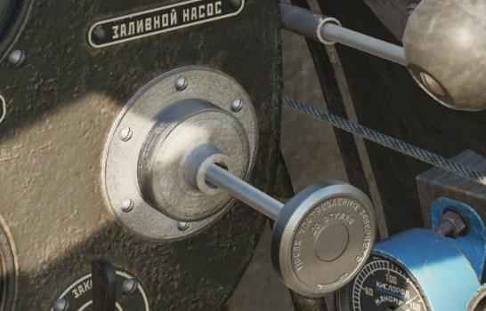

6. Краном заливной системы произвести
последовательно:

    - Заливку карбюратора (2 – 3 с);
    - Заливку мотора (2 – 3 с).

    После заливки вернуть кран
    в положение «ЗАКР.».

    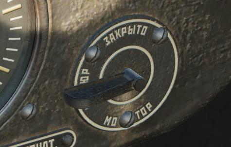

7.       По    показаниям     трехстрелочного
индикатора проконтролировать давление
топлива, которое должно составлять около
1 атм.

    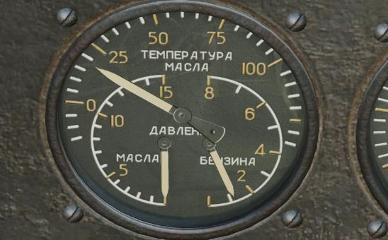

8. Включить магнето в позицию «1+2».

    

9. Ручку высотного газа установить           в
положение «НОРМ.» (в центр).

    

10. Регулятор оборотов (шаг винта)
установить в положение «НОМИНАЛ».

    

11. Жалюзи капота открыть (перевести ручку
в положение «от себя»).

    

12. Запуск

    1.  При    использовании       наземного
    источника электропитания:
    
        Ручкой     стартера    произвести    запуск
        двигателя:
        
        - Вытянуть ручку «на себя»;
        - Удерживая,     дождаться     раскрутки
        маховика (8 – 10 с - летом, 10 – 12 с -
        зимой);
        - Утопить ручку, удерживая ее до запуска
        мотора.
    
        
    
    2. При электромеханическом запуске:
    
        - Раскрутить маховик стартера вручную;
        - Нажатием кнопки «Реле храповика»
        соединить храповик стартера с валом
        двигателя и подключить пусковую
        катушку.
        
        
        
    
    
    3. При механическом способе запуска:
    
        - Раскрутить маховик стартера вручную;
        - Вытянуть на себя рукоятку ручного
        сцепления храповика.
        
        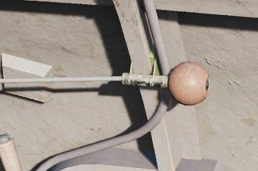
        
        Внимание: В этом случае, вследствие
        отсутствия бортового или наземного
        электропитания,     не   происходит
        усиления искры, запуск двигателя
        усложняется,   особенно  в   зимних
        условиях.

### ПРОГРЕВ МОТОРА

Установить режим работы мотора 1100 - 1200 об/мин и, удерживая самолет на
тормозах, выполнять прогрев до температуры масла не ниже 50ºС, не допуская
перегрева головок цилиндров (в этом случае начать движение).

### ВЫКЛЮЧЕНИЕ МОТОРА

1. Рычаг нормального газа установить в
положение «МАЛЫЙ ГАЗ».

    

2. Рычаг регулятора оборотов установить на
«МАЛЫЙ ШАГ» (от себя).

    

3. Включить «Стоп-кран» двигателя, вытянув
его рукоятку на себя.

    

4.     Выключить оба   магнето, переведя
соответствующий   переключатель   в
положение «0».

    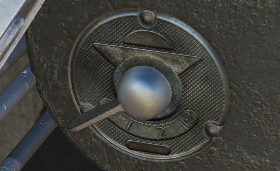

5. Выключить три тумблера на приборной
доске:

    - Аккумулятор;
    - Шунт;
    - Радио.
    
    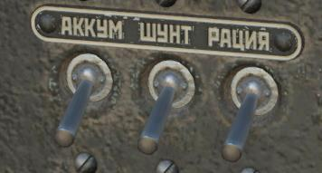

6. Жалюзи капота – закрыть (перевести ручку
в положение «на себя»).

    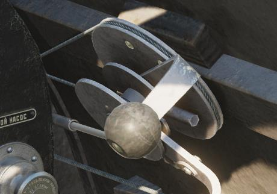

7. Пожарный кран – закрыть (вытянуть ручку
«на себя»).

    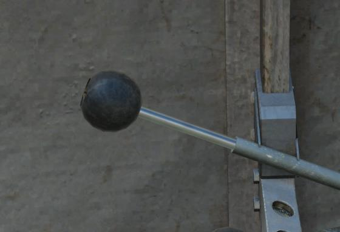

8.     Ручку высотного газа перевести в
положение «БОГАТО» (на себя). Для
снятия   рукоятки    с  фиксированного
центрального положения нужно нажать на
шарик вверху рычага.

    

9. Вентиль кислородного аппарата – закрыть.

    

### ОГРАНИЧЕНИЯ ПРИ ЭКСПЛУАТАЦИИ МОТОРА

- Не допускать при выполнении полетов падения температуры головок
цилиндров ниже 120° С. Это приводит к ухудшению приемистости мотора
и перебоям в его работе.
- Не допускать перегрева цилиндров: 235° С на взлетном не более 5 минут,
на остальных режимах - не более 15 минут.
- Не допускать перегрева масла, 85° С не более 3 минут (норма 60 - 75°С).
- Не допускать раскрутки мотора, 2350 об/мин не более 30 секунд, 2300
об/мин не более 4минут.
- Время работы форсажа (по наддуву) не более 5 минут.
- Форсаж: наддув более 910 мм рт.ст. и обороты 2300 об/мин.
- На высотах 3000 м и выше включить вторую скорость наддува.

## ЭКСПЛУАТАЦИЯ ПОДЪЕМНОГО МЕХАНИЗМА ШАССИ

### ПОДЪЕМ ШАССИ

1. Выключить аварийный стопор (ручку «от
себя»).

    

2. Ослабить пружину автоматического тормоза,
передвинув ее в переднее положение.

    

3. Поставить рычаг переключателя собачки
храпового колеса в положение «ПОДЪЕМ»
(вверх).

    

4. Выполнить около 43 оборотов рукояткой
подъемного    механизма,   контролируя
процесс подъема шасси по механическому
указателю.

    

5.      После   подъема    затянуть   пружину
автоматического тормоза поворотом рычага
в заднее положение.

    

### ВЫПУСК ШАССИ

1.       Проверить    натяжение      пружины
автоматического      тормоза,        при
необходимости переместить рычаг в заднее
положение.

    

2. Поставить рычаг переключателя собачки
храпового колеса в положение «СПУСК»
(вниз).

    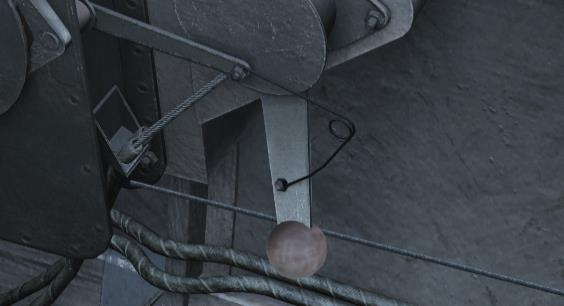

3. Выполнить 43 оборота рукоятки подъемного
механизма, контролируя процесс выпуска
шасси по механическому указателю.

    

4. Включить аварийный стопор (ручку на себя).

    

!!! warning "Внимание!"
    Если при вращении рукоятки шасси на спуск наблюдается
    провисание тросов нижнего барабана, это может свидетельствовать об отказе
    пружины автоматического тормоза. Шасси в таком случае остаются в
    промежуточном положении, а тросы будут выматываться, пока не размотаются
    полностью и не начнут наматываться на барабан в обратном направлении.
    
    Для продолжения выпуска шасси необходимо первым делом убедиться, что
    автоматический тормоз включен. Далее следует воспользоваться аварийным
    стопором, который жестко блокирует вращение нижнего барабана и позволяет
    дифференциалу передавать все вращение рукоятки верхнему барабану, т.е.
    ползушкам задних подкосов. Как только тросы колес натянутся, нужно выключить
    стопор, вращением рукоятки несколько вымотать нижние тросы и растянуть их с
    включенным стопором. Повторять процедуру до полного выпуска шасси.

!!! hint
    Клавиша [[G]] позволяет поочередно переключать состояния системы
    подъема/опускания шасси: перед подъемом :material-arrow-right: после подъема :material-arrow-right: перед опусканием :material-arrow-right: после опускания.

## ВЫПОЛНЕНИЕ ПОЛЕТОВ

### РУЛЕНИЕ

Перед началом руления не забудьте подать команду наземному персоналу
убрать колодки и отключить аэродромное электропитание. Руление выполняется
при оборотах двигателя 600 - 700 об/мин. Необходимо внимательно следить за
стремлением самолета к разворотам и своевременно парировать их тормозами.

При эксплуатации с бетонной ВПП для уменьшения нагрузки на костыль на
рулежке РУС можно отдать немного за нейтральное положение от себя. На
грунтовых аэродромах ручку следует держать в нейтральном положении. При
увеличении числа оборотов мотора свыше 1000 об/мин ручку необходимо
выбирать на себя соответственно увеличению оборотов мотора.

Вследствие ограниченного обзора вперед рулежку целесообразно
производить змейкой, т.е. менять направление до 30 - 35°. При длительном рулении
для лучшего обзора можно откинуть борта кабины и поднять сиденье летчика.

### ВЗЛЕТ

Перед взлетом необходимо убедиться в том, что:

- Пожарный кран открыт;
- Нагнетатель включен на первую скорость;
- Рычаг высотного газа – в положении «Норм.»;
- Рычаг шага винта – в положении «Номинал»;
- Температура головок цилиндров – не ниже 120° С;
- Температура масла – не ниже 50° С.

Также важно проконтролировать закрытие бортов кабины – после взлета
открытые борта «прижмет» набегающим потоком, и закрыть их будет
затруднительно.

Для взлета необходимо плавно передвинуть сектор нормального газа до
оборотов 940 об/мин и, по мере роста скорости, плавно давать ручку от себя. Хвост
самолета надо поднимать в течение первой половины разбега до положения
горизонтального полета.

Отрыв самолета производить на скорости 145 - 175 км/ч. После отрыва
следует выдержать самолет над землей до достижения скорости 180 км/ч.

### НАБОР ВЫСОТЫ

После выдерживания до скорости 180 км/час самолет переводить в режим
набора высоты.

Оптимальная скорость набора высоты до 1000 м с выпущенным шасси - 200
км/час, с убранным – 210 км/час.

Подъем шасси начинать после набора примерно 200 м не превышая скорости
250 км/ч до полной его уборки во избежание срыва щитков.

### ГОРИЗОНТАЛЬНЫЙ ПОЛЕТ

В горизонтальном полете на крейсерских режимах самолет имеет
незначительную тенденцию к опусканию носа. В условиях отсутствия на самолете
И-16 тип 24 триммеров для обеспечения прямолинейного полета летчику
необходимо постоянно контролировать тенденции самолета к изменению угла
атаки, крена, скольжения.

Горизонтальный полет на максимальной скорости необходимо производить
при n = 2100 об/мин, pk = 900 мм рт. ст.

При полетах на крейсерских скоростях (меньших максимальной скорости) и
патрулировании, когда требуется получить наибольшее время полета, обороты
мотора необходимо уменьшить, пользуясь управлением винта до 1800 - 1900
об/мин. После установления 1800 - 1900 об/мин сбавить газ до требуемых
скоростей.

Уменьшение оборотов мотора на крейсерских             скоростях   и   при
патрулировании уменьшит расход горючего и износ мотора.
При использовании посадочных факелов максимальная скорость самолета не
должна превышать 370 км/ч.

### ВИРАЖИ

При выполнении глубокого виража нога и ручка одновременно даются в
сторону виража, по мере увеличения крена прибавляется газ. Максимально
допустимый крен без потери высоты – не более 60 - 65°.

В установившемся режиме виража ручка незначительно подтягивается на
себя. Дальнейшее подтягивание ручки приводит к потере устойчивости, самолет
прекращает вращение, теряет скорость, выходит из крена. При передаче ноги и
перетягивании ручки самолет легко входит в штопор.

Самолет выводится из виража ногой и элеронами с одновременной дачей
ручки от себя и сбавлением газа.

### ПЛАНИРОВАНИЕ

Нормальная скорость планирования И-16 по прямой при ветре до 5 м/с – 160
км/ч. При порывистом ветре свыше 5м/с скорость планирования необходимо
держать на 10 — 20 км/ч больше, в зависимости от силы ветра. На всех скоростях
планирования начиная от 160 км/ч и выше самолет устойчив.

При продолжительном планировании с больших высот, особенно зимой,
мотор стынет. Необходимо использовать жалюзи, а в случае необходимости
делать площадки для прогрева мотора.

### ПОСАДКА

Расчет на посадку необходимо производить перед разворотом на глиссаду,
предварительно хорошо осмотрев посадочное поле, поскольку при выходе на
прямую оно закрывается капотами мотора. При работе с коротких взлетно-
посадочных полос для сокращения пробега самолета можно выпускать посадочные
щитки. Необходимо учитывать, что использование щитков допускается только на
скоростях ниже 350 км/ч.

Посадку производить на скорости 135 – 145 км/ч. Начинать выравнивание
следует с высоты 5 – 8 м, чтобы самолет был подведен к земле плавным
движением ручки. Посадку на три точки выполнять плавным движением, не
добирая ручки до отказа. Учитывая тенденцию самолета к резкому сваливанию на
крыло при незначительном перетягивании ручки, выдерживание над землей перед
приземлением должно быть не выше 0.5 м.

По ходу всего пробега самолета необходимо внимательно следить за
сохранением прямолинейного движения, тенденцию самолета к развороту
своевременно парировать короткими энергичными движениями педалей.

### ОШИБКИ ПИЛОТИРОВАНИЯ, ПРИВОДЯЩИЕ К СРЫВУ САМОЛЕТА В ШТОПОР

Самолет И-16 вследствие задней центровки и недостаточной продольной
устойчивости весьма склонен к срыву в штопор. Это необходимо учитывать при
пилотировании и не допускать возникновения следующих условий.

Самолет легко срывается в штопор:

- При резких энергичных движениях педалями в сочетании со взятием РУС на
себя.
- При перетягивании ручки на себя в условиях потери скорости.
- На вираже и спирали на скоростях 180 км/ч и менее при перетягивании РУС
на себя.
- С одинарного переворота, если выбрать РУС на себя и дать ногу до отказа.
- С бочек на скорости 220 – 200 км/ч при перетягивании РУС.

Средства, позволяющие избежать срыва в штопор:

- Не давать самолету самопроизвольно терять скорость;
- Не производить резких и больших движений ручки на себя;
- Не уменьшать скорость ниже 160 км/ч на прямой;
- Не держать скорость на развороте и вираже менее 180 км/ч и не перетягивать
ручку.

Для вывода из штопора следует: дать ногу до отказа против
направления штопора, РУС - от себя, плавным движением за нейтральное
положение. Самолет быстро прекратит вращение, после чего — выводить из
пикирования.

## ЭКСПЛУАТАЦИЯ КИСЛОРОДНОЙ СИСТЕМЫ

Для использования кислородной системы, необходимо полностью открыть
запорный вентиль (против часов стрелки). При этом, следует сверить показания
Индикатора кислородного потока (ИКП) с высотомером. Если высота ИКП не
соответствует высоте полета, необходимо отрегулировать высоту ИКП с помощью
маховичка анероидной коробки.

В случае неисправности анероидной коробки (ИКП не выдает нужного
значения) необходимо использовать аварийный вентиль, ориентируясь на
показания ИКП. Наличие кислорода в системе контролируется по манометру.

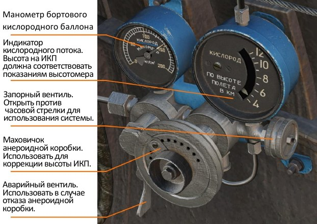

## БОЕВОЕ ПРИМЕНЕНИЕ

Перед началом воздушного боя или атаки наземных целей нужно установить
комфортный уровень яркости прицельной сетки коллиматорного прицела ПАК-1.
При необходимости можно поднять светофильтр.

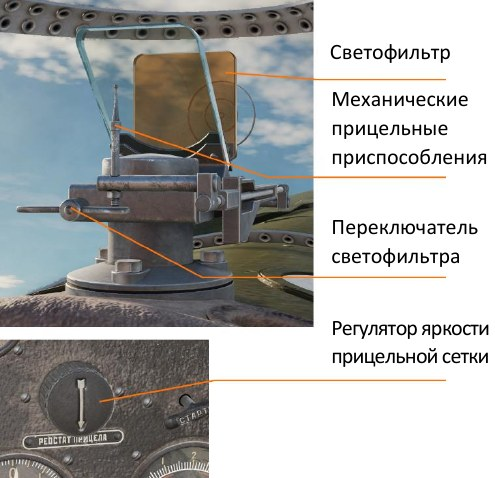

В случае выхода из строя прицела или электросистемы самолета можно
использовать механические прицельные приспособления – раскладные мушку и
целик.

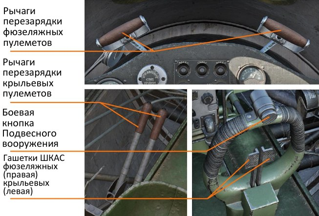

Стрелковое вооружение самолета составляют 4 пулемета ШКАС, при этом
ведение огня возможно как залпом, так и отдельно из фюзеляжных либо крыльевых
точек. Все пулеметы пристреляны и сведены на дистанцию 400 м, что необходимо
учитывать во время ведения огня при расчете выноса точки прицеливания.

Органы управления стрелковым вооружением представлены                 двумя
гашетками на баранке РУС и рычагами перезарядки пулеметов.
Работа с подвесным вооружением самолета (реактивные снаряды, бомбы)
осуществляется посредством электросбрасывателя. Пусковые направляющие для
РС всегда устанавливаются на узлы подвески №1 - 6, бомбодержатели – на узлы
№7 - 8.

### ПОРЯДОК РАБОТЫ С ПАНЕЛЬЮ УПРАВЛЕНИЯ ЭЛЕКТРОСБРАСЫВАТЕЛЯ ЭСБР-3П

1. Лимб установки
количества
авиационных средств
поражения (АСП) в
залпе
2. Выключатель
питания ЭСБР
3. Отметка «0» -
постановка ЭСБР на
предохранитель
4. Индексы
количества АСП в
залпе
5. -----^^
6. -----^^
7. Счетчик сброшенных АСП
(номера пилонов)
5. -----^^
5. -----^^

Электробрасыватель позволяет применять подвесное вооружение И-16 как с
одного узла подвески, так и залпом - с двух либо с четырех узлов одновременно.
На передней панели прибора располагаются лимб установки количества АСП
в залпе и выключатель. Вокруг лимба нанесена цифровая шкала, разделенная на
три группы римскими цифрами (I, II, IV), указывающими количество точек подвески,
с которых будет произведен залп.

Для применения вооружения необходимо включить питание ЭСБР и
установить маркер лимба на желаемое количество АСП в залпе. В процессе
применения     вооружения     лимб    будет    автоматически переключаться
последовательно по ряду арабских цифр, отсчитывая расход боеприпасов и
указывая, с какого держателя произведен пуск. При этом имеется возможность
выбрать узел подвески, с которого будет применено оружие.

Например, при необходимости применения          бомб   перед   пуском   РС
последовательность действий будет следующей:
поскольку бомбовые держатели установлены на узлах подвески №7, 8,
необходимо перевести лимб в позицию «6», произвести сброс с 7-го и 8-го узлов,
далее вернуть лимб в позицию «I» (либо «II» или «IV») и выполнить пуски РС.

### АТАКА НАЗЕМНЫХ ЦЕЛЕЙ

Для выполнения атак наземных целей истребитель И-16 тип 24 кроме
встроенного стрелкового вооружения может нести на внешних узлах подвески до 6
неуправляемых ракет РС-82 и до 200 кг бомбовой нагрузки. Самолет не оборудован
специализированным бомбовым прицелом, поэтому точность нанесения ракетно-
бомбовых ударов может представлять определенную сложность для
неподготовленных летчиков.

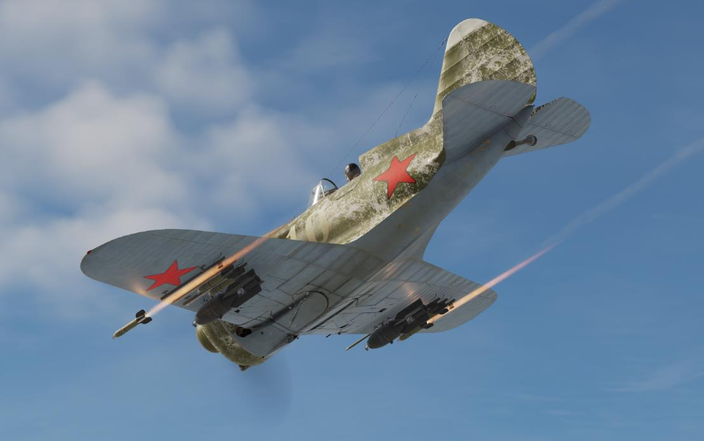

Атаку наземной цели пулеметным и ракетным вооружением наиболее
целесообразно выполнять с пологого пикирования под углом 15° - 30°. Огонь
рекомендуется открывать с дистанции 300 - 400 м до цели, прекращение стрельбы
и вывод из пикирования – на высоте 100 м. При прицеливании и выборе упреждения
необходимо учитывать, что перекрестие прицела указывает точку попадания
пулеметных очередей на дистанции 400 м.

Бомбовое вооружение, представленное двумя фугасными авиабомбами ФАБ-
100СВ, может применяться как с горизонтального полета, так и с пикирования.
Однако,   учитывая    отсутствие   специального    прицела,    эффективность
бомбометания с горизонтального полета крайне низка. Наибольшая точность
достигается при крутом пикировании в пределах 40° - 70°. Большие углы
пикирования также позволяют меньше находиться в зоне зенитного огня цели. Ввод
в пикирование при бомбометании осуществляется с высоты 1500 – 2000 м, высота
сброса бомб и вывода из пикирования 600 - 1000 м.

**ОБЩИЕ РЕКОМЕНДАЦИИ ПРИ РАБОТЕ ПО НАЗЕМНЫМ ЦЕЛЯМ**

- Нужно принимать во внимание, что оснащенный подвесным вооружением
самолет становится менее маневренным вследствие возросшей массы и
лобового сопротивления.
- Начинать атаку рекомендуется с применения бомбового вооружения,
ракетное и стрелковое оружие использовать в последующих заходах.
- Перед пикированием нужно убрать газ до минимума и закрыть жалюзи капота
для предотвращения переохлаждения мотора.
- В процессе пикирования учитывать быстрый разгон самолета и
контролировать приборную скорость, не допуская превышения 570 км/ч во
избежание флаттера.
- Во время атаки необходимо удерживать в центре шарик на индикаторе
скольжения, поскольку скольжение приводит к промаху.
- При выводе из пикирования установить газ на максимум, вывод выполнять
плавно, не перетягивая РУС, контролируя перегрузку.
- Отход от цели производить маневрируя, пользуясь особенностями рельефа
для защиты от зенитного огня.

