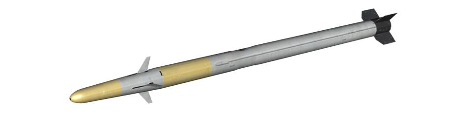
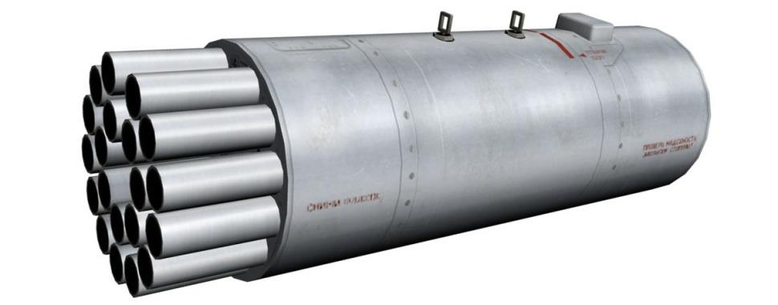
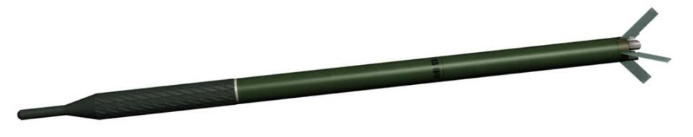

# ВООРУЖЕНИЕ ВЕРТОЛЁТА Ка-50

Комплекс вооружения вертолёта включает системы управляемого и неуправляемого
ракетного, стрелково-пушечного и бомбардировочного вооружения.

## Стрелково-пушечное вооружение

Стрелково-пушечное вооружение представляет собой несъемную подвижную установку НППУ-80, обеспечивающую ведение огня из 30-мм автоматической пушки
2А42 по воздушным, наземным и надводным целям. Максимальные углы отклонения
пушки по горизонтали -2°30´ … +9°, по вертикали +3°30´ … -37°. Стрельбу можно
вести как из подвижной пушки (прицеливание – с помощью комплекса «Шквал-В»),
так и из неподвижной (прицеливание по индикатору на лобовом стекле).

Боекомплект укладывается в два патронных ящика: передний на 220 патронов, для
бронебойно-трассирующих снарядов, и задний на 240 патронов, для осколочно-фугасно-зажигательных снарядов, что облегчает выбор необходимого боеприпаса. Системой управления регулируются темпы ведения огня: высокий (550 выстр./мин)
или низкий (200...300 выстр./мин) с автоматической отсечкой длины очереди (по 20
или по 10 снарядов). На внутренние крыльевые держатели могут быть подвешены
контейнеры УПК-23-250, в каждом из которых размещается неподвижная 23-мм
пушка ГШ-23Л с боекомплектом 250 снарядов.

### Пушка 2А42

В начале 70-х годов прошлого века советские конструкторы получили задание увеличить эффективность боевых машин пехоты. Была разработана малокалиберная
автоматическая нарезная пушка.

Пушка была разработана в Тульском КБ приборостроения (ныне НПО «Точность»)
под руководством В. Грязева. Она была рассчитана под 30-мм патрон АО-18. Длинный ствол и короткая казенная часть облегчали размещение пушки внутри башни и
позволяли достигать больших углов возвышения. Пушка обладала коротким откатом, электроспуск обеспечивал автоматический и одиночный огонь. Кроме того, автоматический огонь мог производиться с высоким и низким темпом стрельбы. Все
эти факторы увеличивали боевую эффективность.

Интенсивные тесты показали новые возможности боевых машин пехоты с этим ору
жием. Была значительно увеличена дальность и точность стрельбы (до 1500 м). Положительно сказывался большой боезапас пушки – 500 снарядов против 38 на старой пушке «Зарница». Пушка также могла применяться против различных типов целей.

В 1980 году на вооружение поступила новая БМП-2 с 30-мм пушкой, получившей индекс 2А42.

БМП-2 показала высокую боевую эффективность в период войны в Афганистане как
на равнине, так и в условиях гор. Заметным недостатком был большой объем пороховых газов, производимых при стрельбе, особенно в высоком темпе. Газы запол
няли даже боевое отделение. В дополнение ко всему, пушка оказалась неэффективной против окопавшихся духов-гранатометчиков. Боевой опыт также показал, что
низкий темп стрельбы является наиболее приемлемым в бою.

30-мм пушка 2А42 на БМП-2 может поражать легкобронированные цели на дальности до 1500 м, противотанковые установки, небронированные автомобили и пехоту
на дальности до 2000 м, а также воздушные цели. Она может стрелять как одиночными выстрелами, так и очередью до полного расхода боекомплекта.
Автоматика пушки работает на отводе газов. Затвор закрывается после поворота.
Питание ленточное, две металлические патронные ленты содержат раздельные звенья «Краб», соединенные с гильзами. Ленты подаются в оружие в зависимости от
положения переключателя в тыльной стороне казенной части. Патрон подается с
ленты в казенник. Гильзы выбрасываются вперед по стволу.

Пушка имеет блокиратор, который останавливает стрельбу, когда последний патрон
одной из лент поступает в казенник. При этом затвор остается взведенным. После
этого, в случае поступления следующей команды на стрельбу с другой ленты,
стрельба продолжается без перезарядки.
Высокая боевая эффективность этой пушки привлекла внимание вертолётных КБ в
процессе работы над программой перспективного армейского вертолёта (Ка-50 и
Ми-28). В результате, мощное автоматическое оружие появилось на борту Ка-50.
Этот шаг значительно увеличил огневую мощь вертолёта и сделал его очень опасным для бронированных машин противника.

**ТТХ пушки 2А42**

Характеристика                                      | Значение
----------------------------------------------------|-----------------
Калибр, мм                                          |  30
Темп стрельбы, выстр./мин                           |  500-600 / 200-300
Вес пушки, кг                                       |  115
Начальная скорость снаряда, м/с:
Осколочно-фугасный                                  |  950
Бронебойно-зажигательный                            |  980
Количество нарезов ствола, шт.                      |  16
Количество снарядов в боекомплекте, шт.             |  460 (220 бронебойные; 240 осколочнофугасные)

**Характеристики боеприпасов для пушки 2А42**

Характеристика патрона                              | Бронебойно-трассирующий|Осколочно-фугасно-зажигательный
----------------------------------------------------|------------------------|--------------------
Калибр патрона, мм                                  |      30                |   30
Вес патрона, кг                                     |    0,853               | 0,837
Длина патрона, мм                                   |     291                |  291
Вес взрывчатого вещества, кг                        |    0,127               | 0,123
Вес снаряда, кг                                     |    0,400               | 0,389
Начальная скорость снаряда, м/с                     |   960 - 980            |950 - 970
Возможное отклонение начальной скорости снаряда, м/с|       5                |   5
Время горения трассера, с                           |  Не менее 3,5          |  \- 

## Бомбардировочное вооружение

Бомбардировочное вооружение устанавливается на четыре балочных держателях
БД3-УВ на крыльевых пилонах. Ка-50 может нести как обычные свободнопадающие
бомбы, так и контейнеры мелких грузов (КМГУ), предназначенные для размещения
и серийного выбрасывания восьми блоков БКФ с осколочными, фугасными, зажигательными или противотанковыми бомбами малого калибра или авиационными минами.

Свободнопадающие бомбы не имеют никаких систем наведения и управления, падают по баллистической кривой, параметры которой зависят от скорости полета и
угла наклона траектории ЛА во время сброса.

### ФАБ-250 - бомбы общего назначения

Семейство фугасных авиабомб различной мощности. Цифра в названии бомбы определяет калибр бомбы (приблизительный вес). Фугасные авиабомбы эффективны
против техники, оборонительных сооружений, мостов, укреплений и иных наземных
объектов. Диапазон условий сброса: скорость 500-1000 км/ч и высота 300 – 5000 м.

### КМГУ (контейнер мелких грузов унифицированный)

Контейнеры мелких грузов КМГУ (КМГУ-2) предназначены для боевого применения
авиабомб малых калибров, не имеющих подвесных проушин, и мин. Бомбы и мины
укладываются в контейнер в специальных блоках - БКФ (блоках контейнерных для
фронтовой авиации). КМГУ состоит из корпуса цилиндрической формы с передним и
задним обтекателями и содержит 8 блоков БКФ с авиабомбами или минами, устанавливаемых в отсеки. Отсеки закрываются створками, управляемыми пневмосистемой.

Электросистема КМГУ обеспечивает тактический сброс боеприпасов поблочно, серией с интервалами между блоками 0.05, 0.2, 1.0 и 1.5 с. На самолетах семейства
Су-25 блоки БКФ обычно снаряжаются 12 осколочными авиабомбами АО-2,5РТ калибра 2.5 кг, или 12 противотанковыми минами ПТМ-1 массой 1.6 кг, или 156 фугасными минами ПФМ-1С массой 80 г. Контейнеры КМГУ (КМГУ-2) подвешиваются по
одному на универсальные балочные держатели типа БД3-У. Бомбометание производится на высотах 50-150 м.

## Управляемое ракетное оружие

Управляемое ракетное оружие включает в себя до 12 ПТУР 9А4172 «Вихрь» с лазерно-лучевой системой наведения. Управляемая ракета «Вихрь» запускается с подвижных пусковых установок УПП-800, которые крепятся на крайние точки подвески, на каждую устанавливается по 6 ПТУР. Для обеспечения пуска ракет и
«встреливания» ПТУР в поле зрения ОПС без изменения высоты полета предусмотрено отклонение УПП вниз на угол до 12°.

### Противотанковый комплекс 9К121 «Вихрь»

Авиационный противотанковый ракетный комплекс «Вихрь» предназначен для поражения бронированной техники, в том числе оснащенной реактивной броней, и
воздушных целей, летящих на скоростях до 800 км/ч. Разработка комплекса начата
в 1980 году в КБ приборостроения (НПО «Точность») под руководством главного
конструктора А.Г.Шипунова. Принят на вооружение в 1992 году. К началу 2000 года
комплекс используется на противотанковом штурмовике Су-25Т (подвешивается до
16 ракет на двух пусковых установках АПУ-8) и боевом вертолёте Ка-50 «Черная
Акула» (подвешивается до 12 ракет на двух АПУ-6). На западе комплекс «Вихрь»
получил обозначение AТ-12 (АТ-9). В состав комплекса ракетного оружия «Вихрь»
входят:

- сверхзвуковая управляемая по лучу лазера ракета 9А4172;
- круглосуточная обзорно-прицельная система И-251 (Су-25Т) и И-251В (Ка         50) «Шквал»;
- авиационная пусковая установка АПУ-8 (Су-25Т) или АПУ-6 (Ка-50).

Комплекс позволяет вести стрельбу одиночными ракетами и залпом из двух ракет.

Высокая сверхзвуковая скорость ракеты (до 610 м/c) способствует снижению уязвимости самолета во время атаки и позволяет в одном заходе поразить несколько целей. Дистанцию 4 км ракета преодолевает за 9 с.
Ракета выполнена по аэродинамической схеме «утка» со складным крылом. Ее наведение осуществляется при помощи автоматического прицельного комплекса
«Шквал». Обнаружив изображение цели на телевизионном экране, пилот обрамляет
цель сеткой прицела и нажимает кнопку захвата. Прицел переходит на автоматическое сопровождение цели. После достижения разрешенной дальности пуска выдается команда ПР, разрешающая пуск.

Тип старта - из транспортно-пускового контейнера вышибным зарядом.

Лазерно-лучевая система наведения в сочетании с автоматической системой сопровождения цели гарантирует достаточно высокую точность стрельбы, практически не
зависящую от дальности. Кроме того, лазерно-лучевая система обеспечивает значительную защищенность канала наведения от естественных (пыль, дым) и искусственных (дымовая завеса) помех.

На вертолёте Ка-50, как и на самолете Су-25Т, лазерный дальномер-целеуказатель
«Причал» сопряжен с прицельным комплексом «Шквал» и ночной низкоуровневой
станцией «Меркурий». «Шквал» автоматически сопровождает цели и подсвечивает
их лазерным целеуказателем. Ракета захватывает луч лазера и летит к цели, стараясь отслеживать его датчиками в хвостовой части. Так как на ракете установлена
только одна рулевая машинка, то для управления по тангажу и направлению ракета
вынуждена вращаться вокруг своей продольной оси. Вращаясь вокруг продольной
оси и следуя за постоянно перемещающимся лучом лазера, ракета описывает в воздухе характерную спиральную траекторию.

Хранение, транспортировка и применение ракеты осуществляются с использованием транспортно-пускового контейнера, обеспечивающего безрегламентное складирование ПТУР в течение 10 лет.

ТТХ ПТРК «Вихрь»

Характеристика                                     | Значение
---------------------------------------------------|-----------------------
**Дальность стрельбы, км:**
днем                                               |     0,5-8 (10)
ночью                                              |     до 5 (6)
Высота пуска, м                                    |    5-4000
**Время полета, с:**
на максимальную дальность                          |    28
на дальность 8000 м                                |    23
на дальность 6000 м                                |    14
Средняя скорость полета на дальность 8000 м, м/с   |    350
**Боевая часть**
Тип                                                | Тандемная кумулятивно-осколочно-фугасная
вес, кг                                            |     8
вес взрывчатого вещества, кг                       |     4
тип взрывателя                                     | контактный и не контактный
радиус действия неконтактного взрывателя, м        |  2,5-3,0
**Ракета 9А4172**
Число ступеней                                     |    2
Длина, мм                                          |   2750
Максимальный диаметр корпуса, мм                   |    125
Размах крыла, мм                                   |    240
Размах стабилизаторов, мм                          |    380
Стартовый вес, кг                                  |   40-45
Длина ТПК, мм                                      |   2870
Диаметр ТПК, мм                                    |    140
температура применения, C°                         | от -50 до +50
**Аппаратура управления И-251В "Шквал"**
Дневной канал                                      | телевизионный
Система сопровождения цели                         | автоматическая
**Авиационная пусковая установка АПУ-6**
Число ракет на ПУ                                  |      6
Вес пустой ПУ, кг                                  |     60
Длина ПУ, мм                                       |    1524
Ширина ПУ, мм                                      |     720
Высота ПУ, мм                                      |     436
Угол наведения в вертикальной плоскости, град      |     10

### Неуправляемые авиационные ракеты

Система неуправляемого ракетного вооружения состоит из четырех блоков НАР Б8В20А или Б-13Л5; в каждый блок Б-8В20А может быть заряжено по двадцать 80-мм
неуправляемых ракет С-8, а в Б-13Л5 – по пять 122-мм неуправляемых ракет С-13.

Пуски НАР из Б-8 ведутся по 1, 5 или 10 ракет из каждого блока. Из блоков Б-13
возможен пуск по 1, 2 или 5 ракет.

#### НАР С-8

В конце 60-х годов для повышения огневой мощи стрелково-пушечного вооружения
самолетов фронтовой бомбардировочной и истребительно-бомбардировочной авиации КБ "Точмаш" поручили создать 80-мм авиационные неуправляемые реактивные
снаряды. Это сопровождалось новыми требованиями к оружию, сформулированными на основе опыта эксплуатации в войсках авиационных реактивных систем калибра 57 мм. Заказчик требовал надежно защитить боеприпасы от аэродинамического нагрева, уменьшить влияние стрельбы ими на работу двигателя самолета-носителя, сократить временные интервалы между выстрелами, а также увеличить
дальность стрельбы и снизить минимальную высоту применения.

Появление широкой номенклатуры снарядов этого семейства обусловили два фактора. Во-первых, НАР нескольких марок составили комбинации ряда однотипных БЧ,
оснащенных различными ракетными двигателями. Во-вторых, на основе наиболее
удачных двигателей было создано большое количество типов боевых НАР и
снарядов вспомогательного назначения. На сегодня известны около 25 серийных
НАР калибра 80 мм и более 10 опытных моделей.

На основе базовой конструкции С-8 с универсальной кумулятивно-осколочной боевой частью было разработано несколько модификаций ракеты: С-8М и С-8КОМ с модернизированной боевой частью усиленного осколочного действия и твердотопливным двигателем, имеющим увеличенное время работы. С-8КОМ может пробивать
броню толщиной до 400 мм.

Кроме того, имеется еще несколько вариантов ракет, из которых следующие смоделированы в игре Черная Акула:
С-8М (С-8ОФП) - модернизированная. Отличается БЧ усиленного осколочного действия и двигателем с увеличенным временем работы.

С-8О и С-8ОМ - осветительные. Горючий состав весом 1,0 кг дает силу света порядка
2 млн. свечей в течение 35 секунд.

С-8ЦМ – целеуказательная, маркерная. При падении на землю образуют хорошо заметное облако оранжевого дыма, маркируя цель или точку поверхности.

Для пуска С-8 используются двадцатизарядные блоки Б-8, модернизированные Б-8М
и M1, а также Б-8-0 с теплозащитой. Вертолётное исполнение блока Б-8В20А отличается удлиненными пусковыми трубами и упрощенной конструкцией без носового
обтекателя (при небольших скоростях полета вертолётов прирост аэродинамического сопротивления незначителен).

По эффективности применения и мощности БЧ С-8 значительно превосходят С-5.

Так, залп 80-мм ракет из одного 20-зарядного блока Б-8 по поражающему действию
сопоставим с одновременным пуском С-5 из трех 32-зарядных блоков УБ-32, а по
дальности и точности превосходит их. Преимущества C8 привели к тому, что в
настоящее время боевые самолеты и вертолёты комплектуются в основном 80-мм
блоками НАР.

**ТТХ НАР С-8КОМ**

Характеристика                                     | Значение
---------------------------------------------------|-----------------------
Калибр, мм                                         |             80
Длина, мм                                          |            1570
Масса ракеты, кг                                   |            11,3
Масса БЧ, кг                                       |             3,6
Масса ВВ, кг                                       |             0,9
Дальность пуска, м                                 |         1300-4000
Максимальная скорость ракеты, м/с                  |             610

#### НАР С-13

В первой половине 70-х годов ирано-иракские вооруженные столкновения и арабоизраильская война продемонстрировали всему миру, что прежние подходы к вопросам базирования и маскировки самолетов на военных аэродромах устарели. Стоянка
машин в длинном ряду, как на параде, чревата тем, что их всех можно разом лишиться, «благодаря» одному случайно преодолевшему систему ПВО самолету противника. Обваловка открытых стоянок также перестала выполнять свои защитные
функции - сказывалась возросшая эффективность авиационного вооружения.

На основе чужого боевого опыта командование объединенных вооруженных сил
НАТО в Европе оперативно начало рассредоточивать свои самолеты на военных
авиабазах по индивидуальным укрытиям различного типа. Достаточно хорошо замаскированные укрытия выполняли из легкоразборных конструкций. На открытой
местности, где невозможно было спрятать эллинги, укрытия отливали из бетона
сплошным методом, используя стальную арматуру и внутреннюю гофрированную
противооткольную облицовку толщиной 5 мм. Затем все это засыпали толстым
слоем грунта, и получалось довольно солидное фортификационное сооружение, выдерживающее прямое попадание нескольких осколочных или осколочно-фугасных
авиабомб.

Руководство Советского Союза с целью адекватного ответа на возможную агрессию
со стороны НАТО считало крайне необходимым иметь на вооружении отечественных ВВС НАР, способные пробивать аэродромные укрытия арочного типа и эффективно поражать технику, размещенную в них. Эту задачу были способны успешно
решать НАР крупного калибра - С-25-ОФ. Однако теоретически для уничтожения одной авиабазы противника с самолетами, рассредоточенными по ЖБУ, при условии
необходимости преодоления противодействия ПВО, а также, учитывая вероятность
попадания в цель одной ракетой и наличие на аэродроме ложных целей, требовался просто гигантский наряд сил и средств. Существующие же авиационные средства поражения для выполнения задач такого рода невозможно было оптимизировать.

В то же время на основании анализа, проведенного в 1969 году, было предложено
уделить внимание калибру 127 мм (аналог американской НАР Zuni), способному занять промежуточное положение между 57-мм и 240-мм НАР. Эти доводы в дальнейшем использовали в Новосибирском институте прикладной физики (ИПФ) в работах
над 122-мм НАР семейства С-13 под руководством В.Ф. Минина.

Разработкой первых своих ракет сибиряки занялись в 1973 году. К 1979 году. ракета С-13 «Тулумбас» поступила на государственные испытания с универсальным
шестиствольным блоком орудий УБ-13.

Типовой целью на испытаниях, естественно, были несколько специально выстроенных ЖБУ арочного типа - цели достаточно габаритные, и вероятность попадания в
них была большой. Засыпанные пятиметровым слоем грунта железобетонные стены
одной из наиболее внушительных конструкций толщиной 1 м С-13 пробивали
насквозь и взрывались в земляном полу. После снятия грунта с ЖБУ открылись
входные отверстия в бетоне с диаметром воронок 1-2 м и глубиной 0,2-0,4 м.

Внутри укрытия вокруг выходных отверстий отколы бетона представляли собой воронки диаметром 1,5 м и глубиной 0,4 м. В 1983 году. НАР приняли на вооружение.

Однако С-13 был присущ один недостаток. При отстреле по типовому ЖБУ NATO бетонная крошка воронки выходного отверстия надежно удерживалась противооткольной стальной облицовкой и не выполняла функции вторичных осколков. НАР
прошивала грунт и бетонные стены укрытия, а также бетонный пол, после чего
взрывалась глубоко под землей, не нанося никакого ущерба самолету, если проходила рядом с планером. Изменять время срабатывания взрывателя не имело
смысла, поскольку толщина грунтовой засыпки купола ЖБУ была неравномерной. В
зависимости от того, в какую часть укрытия попадала НАР, постоянно требовалось
варьировать время замедления на доли секунды.

Еще не закончились испытания С-13, как в 1982 году ИПФ приступил к разработке
улучшенного образца бетонобойной НАР С-13Т с двумя модулями БЧ, расположенными тандемно. На новой НАР для сведения к минимуму отрицательных качеств
прототипа каждый из модулей БЧ имел индивидуальный взрыватель донного типа.
После встречи с преградой первый и второй модули БЧ подрывались в точках, разнесенных в пространстве. Таким образом, оба модуля как бы резервировали друг
друга - если первый сработает под полом ЖБУ, то второй - неизбежно внутри укрытия. И наоборот, если первый взорвется внутри ЖБУ, то второй - снаружи. Идеальным вариантом был подрыв обоих модулей внутри укрытия.
В 1984 году в НИИ ВВС прошли государственные испытания С-13Т на истребителебомбардировщике Су-17М4. Ведущим инженером на них назначили подполковника
А. Шерстюка, ведущим летчиком - подполковника А. Бородая. При этом выполнили
31 полет и отстреляли 99 НАР. 31 ракета, попавшая в ЖБУ с метровой бетонной
стенкой и грунтовой засыпкой от двух до шести метров толщиной, сработала внутри
укрытия.

Оружие обкатали и в стрельбе по ВПП. НАР не рикошетировали, разрушая железобетон толщиной 0,25 м на площади 15-17,5 м2. В залпе разброс ракет у цели не превышал 10 м. По результатам испытаний НИИ ВВС гарантировал на каждую ракету
двадцать взлетов и посадок в пределах срока хранения без ущерба для надежности
ее работы.

Учитывая калибр новой ракетной системы, разработчики предложили создать на ее
основе для борьбы с легкобронированной и легкоуязвимой техникой вне укрытий
более эффективную, чем С-8, осколочно-фугасную НАР с максимально стандартизированными узлами и деталями.

Имитация стрельбы по БМП-1 с комбинированной лобовой броней толщиной 20-25
мм продемонстрировала, что на дистанции 5 м осколки БЧ С-13ОФ легко пробивают
броню. Каждый такой подрыв дает 10-15 пробоин, а осколки обладают зажигательным действием. На расстоянии 10 м осколки рикошетируют от некоторых броневых
плоскостей, оставляя вмятины глубиной 5-10 мм. Таким образом, легкобронированная техника на расстоянии 25 м и легкоуязвимая - на 60 м гарантированно выходит
из строя. Степень нанесенного ущерба такова, что восстановить ее боеспособность
возможно не менее чем через два часа.
При попадании С-13-ОФ между осями БРДМ у борта в машине обнаружили 60 пробоин. Взрывом оторвало верхнюю половину кузова по шву, машину опрокинуло, а
также оторвало колесо со ступицей. Средняя площадь пробоин в броне достигала 58 см2, в дюрале - 8-10 см2. В результате прямого попадания у тяжелого танка ИС-3
вырвало направляющий каток и два опорных, а также 1,5 м гусеницы. Бронеплита
толщиной 50 мм, закрывающая моторный отсек, прогнулась на 25-30 мм. Пушка с
толщиной стенки ствола 20-30 мм из высококачественной орудийной стали была
пробита тремя осколками. Кроме того, на ней насчитали двенадцать вмятин и каверн глубиной 8-15 мм.
Летные испытания подтвердили, что осколочность С-13ОФ при воздушном подрыве
в полтора раза выше по легкоуязвимым целям и в два-три раза - по укрытым. В
начале 1986 года НАР приняли на вооружение ВВС.

**ТТХ НАР С-13ОФ**

Характеристика                                     | Значение
---------------------------------------------------|-----------------------
Калибр, мм                                         |              122
Длина, мм                                          |             2898
Масса ракеты, кг                                   |              69
Масса БЧ, кг                                       |              33
Масса ВВ, кг                                       |               7
Дальность пуска, м                                 |          1600-3000
Максимальная скорость ракеты, м/с                  |              530

## Управляемые ракеты воздух-воздух

Для борьбы с воздушными целями предусмотрена установка ракет типа «Игла-В»
класса «воздух-воздух» с ИК-головкой самонаведения с командно-аппаратными модулями - пусковыми установками «Стрелец». На дополнительных узлах подвески
Ка-50 возможно установить по два контейнера с УР (суммарно до 4 ракет).

### Пусковой модуль 9С846 «Стрелец»

Комплект аппаратуры управления и пусковых модулей (КАМ) 9С846 «Стрелец»
предназначен для обеспечения автоматизированного дистанционного одиночного
пуска ракет типа «Игла» с различных носителей наземного, воздушного и морского
базирования.

В состав комплекта «Стрелец» входят:

-   модуль универсальный пусковой для размещения двух ракет и обеспече        ния их включения, подготовки к пуску и пуска;
-   аппаратура управления и связи для связи с системой управления огнем
носителя;
-   комплект соединителей для обеспечения механического и электрического
соединения составных частей с элементами носителя;
-   контрольно-проверочная аппаратура для периодического контроля элек        трических параметров аппаратуры комплекта.

3-13: Комплект аппаратуры управления и пусковой модуль 9С846 «Стрелец»
Управляемая инфракрасная ракета 9М342 «Игла» является легкой ракетой класса
«воздух-воздух» малой дальности. Эта ракета разработана на базе ПЗРК 9К338
«Игла» и является модификацией с пусковым модулем для вооружения вертолетов
и наземной техники.
Предназначена для поражения дозвуковых воздушных целей. Разработчик – НПК
«КБ Машиностроения» в Коломне, один из ведущих российских конструкторских и
научно-производственных центров в области военной техники. Ракета выполнена
по аэродинамической схеме «утка» со складными крыльями и стабилизаторами. Вес
ракеты равен 11,3кг. Скорость полета достигает 570-600 метров в секунду. Дальность применения ограничена шестью километрами. Игла оснащается боевой частью весом 1,25 кг. Способна развивать большие перегрузки и имеет средние характеристики помехозащищенности.

3-14: Пусковой модуль 9С846 «Стрелец» с двумя ТПК «Игла»

3-15: Ракета 9М342 «Игла»
ТТХ УРВВ «Игла»
Дальность стрельбы, км:
Высота поражения цели, м                          10-3500
Дальность поражения цели, м                       500-6000
Скорость поражаемой цели, м/с
- навстречу                              до 400
- вдогон                                 до 320
Боевая часть
Тип                                           Осколочно-фугас                                                      ная
вес, кг                                             1,25
тип взрывателя                                Контактный и не                                                  контактный
Ракета 9М342 «Игла»
Маршевый двигатель                            Твердотопливный
Длина, мм                                           1690
Максимальный диаметр корпуса, мм                    72,2
Управление полетом                             Аэродинамиче                                                ские поверхности
Стартовый вес, кг                                   11,3
Вес ТПК 9К338 «Игла» в боевом положении, кг          19
Время прицеливания (боевой цикл), с                  55
Тип ГСН                                       Оптическая, двух                                                 спектральная,
следящая

Система управления                             Одноканальная
температура применения, C°                      от -50 до +50
Пусковой модуль 9С846 "Стрелец"
Число ракет на ПМ                                    2
Количество включений ракеты на одном ПМ              2
Режим стрельбы                                   Одиночный
Вес пустого ПМ, кг                                   41
Вес аппаратуры управления ПМ, кг                     4,5
ДИНАМИКА ПОЛЕТА
4         ВЕРТОЛЕТА
4 ДИНАМИКА ПОЛЁТА ВЕРТОЛЁТА
Если бы разработка вертикально взлетающих аппаратов была настолько же простой, как сама идея, то геликоптер наверняка был бы первым ЛА в истории. Первооткрывателем идеи вертолёта был Леонардо да Винчи, который создал эскиз винтокрыла, названного им «Хеликсптерон», еще в начале XVI века. В названии аппарата
Да Винчи использовал греческое слово Helix, обозначающее «спираль», скомбинированное с греческим словом «Pteron», обозначающим «крыло». Отсюда родился
современный термин, обозначающий ЛА с подвижным вращающимся крылом – геликоптер. В русском языке такие ЛА принято называть вертолётами.
Разработка винтокрылого
вертикальновзлетающего ЛА
была связана с рядом труд                                                     ностей и, в первую очередь,
с отсутствием подходящего
двигателя, который мог бы
обеспечить полет. Когда до                                                     статочно мощные и легкие
авиационные двигатели
были разработаны, мечта о
вертолёте стала реально                                                     стью.
На вертолёт распространя                                                   ются те же законы физики и
аэродинамики, что и на са                                                   молет. Но управление верто                                                   лётом сложнее и пилоту
приходится иметь дело с та                                                   кими понятиями, как: крутя   4-1: «Хеликсптерон» Леонардо да Винчи           щий момент, гироскопиче                                                   ская прецессия, ассиметричность подъемной силы, срыв потока на «отступающей» по потоку лопасти (при движении вперед) и обратное перетекание.
В этой главе описаны базовые понятия, касающиеся управления вертолётом, скорости, реактивного момента, гироскопической прецессии, ассиметрии подъемной
силы, срыва потока с лопастей, вихревого кольца, висения, эффекта земли, скоса
потока и авторотации.

Четыре силы, действующие на вертолёт
Сила тяжести и сопротивление воздуха действуют на вертолёт, как и на все ЛА. Однако подъемная и пропульсивная (толкающая вперед) силы создаются несущим
винтом (ротором). В простейшем понимании - несущий винт для вертолёта то же самое, что и крыло с винтом для самолета. Кроме того, наклоняя вектор тяги несущего винта, пилот вертолёта может выполнять полет в сторону или назад.
Пропульсивная
сила                       Подъемная сила

Сила
сопротивления

Сила тяжести

4-2: Силы, действующие на вертолет

Управление
На приведенном рисунке пока           Несущий винт   Рулевой винт         зана схема проводки управления
классического вертолёта. Сюда
входят: несущий винт, ручки
управления циклическим и об                                               щим шагом, педали, и рулевой
винт. Ручка общего шага управ                                               ляет общим шагом всех лопастей
Циклический                                  несущего винта, одновременно и
шаг                                          на одинаковое значение увеличи                                               вая или уменьшая подъемную
Общий шаг             силу винта в целом. Ручка цикли                                               ческого шага управляет автома                                               том перекоса, за счет чего шаг
Педали
лопастей изменяется циклически,
создавая пропульсивную силу,
которая определяет направление
4-3: Схема проводки управления            поступательного движения верто          классического вертолета              лёта. Шаг отдельно взятой лопа                                               сти в каждый момент времени
складывается из общего шага и циклического шага. Педали вертолёта управляют
шагом рулевого винта, увеличивая или уменьшая шаг его лопастей и позволяя выполнять разворот вертолёта в горизонтальной плоскости.
Скорость
Лопасти несущего винта вертолёта должны двигаться в воздухе с относительно высокой скоростью, чтобы создавать достаточную подъемную силу. Несущий винт вращается со скоростью, достаточной для создания потребной подъемной силы, в то
время как рулевой винт, вращаясь, создает силу, удерживающую вертолёт от разворота под воздействием реактивного момента от несущего винта.
Вертолёт может перемещаться вперед и ограниченно вбок и назад. Вертолёт также
может находиться в режиме висения с нулевой поступательной скоростью.

Реактивный момент несущего винта
Проблема реактивного момента характерна для одновинтовых (классических) схем
вертолётов. Несущий винт вертолёта вращается в одну сторону и создает реактивный момент, который стремится развернуть фюзеляж вертолёта в другую сторону.
Этот эффект следует из третьего закона Ньютона: «действие равно противодействию». У вертолётов реактивный момент несущего винта уравнивается компенсирующим моментом от тяги хвостового винта.
На вертолётах с двумя несущими винтами и, в частности, при использовании соосной схемы реактивный момент одного винта компенсируется противоположным моментом от другого винта.

Рулевой винт
Приведенный рисунок показывает направление
вращения несущего винта, направление реак                                  тивного момента и положение рулевого (хво  Направление                     стового) винта. Рулевой винт установлен на
вращения                        конце хвостовой балки вертолёта и предназна  несущего
винта                           чен для компенсации реактивного момента от
несущего винта. Он вращается от привода ос                                  новного двигателя вертолёта с постоянной ско                                  ростью и создает силу, действующую в горизон                                  тальной плоскости в направлении, противопо                                  ложном реактивному моменту несущего винта.
Компенси  рующий         Реактивный
момент не  момент
сущего       4-4: Компенсация рулевым винтом реак  рулевого                            тивного момента несущего винта
винта                винта
Гироскопическая прецессия
Управление вектором тяги винта через гироскопическую прецессию винта справедливо рассматривать только для схемы винтов фирмы «Белл» имеющих один осевой
шарнир лопасти.
Результирующая от началь                                                    ной силы, приложенной к
вращающемуся телу, при                                                    кладывается в точке, нахо     Начальная сила                                 дящейся в 90 градусах от
точки приложения началь                                                    ной силы в направлении
Результирующая          вращения тела. Этот эффект
сила                    называют гироскопической
прецессией. Например, если
сила, действующая вниз,
прикладывается к винту в
точке 9-ти часов, как на ри                                                    сунке, то результирующая
4-5: Гироскопическая прецессия               сила будет действовать в
точке 6-ти часов.

Направление                                        Изменение
вращения                                         циклического
шага

90°
вперед
по вра                                                    щению        Направление
управляющих
сил

4-6: Угловое смещение управляющих связей винта

Угловое смещение управляющих связей винта требуется как раз из-за этого эффекта, для того, чтобы пилот мог направлять вектор тяги в желаемом направлении.
На картинке показан поводок лопасти несущего винта, вынесенный вперед по вращению винта на угол 90 градусов. Если бы не было такого углового смещения, то
пилоту пришлось бы постоянно перемещать ручку циклического шага на 90 градусов вперед по вращению винта относительно желаемого направления движения.
Например, если пилот хотел бы двигаться вперед, ручку ему пришлось бы перемещать вправо.
Ассиметрия подъемной силы
Поверхность, находящаяся под окружностью, которую описывают законцовки лопастей несущего винта, называется ометаемой поверхностью. В режиме висения подъемная сила, возникающая на каждой лопасти, одинакова в любой точке окружности. Ассиметрия подъемной силы возникает при поступательном движении вертолёта на встречных к потоку лопастях относительно идущих по потоку.
Когда вертолёт находится в режиме висения, скорость концов лопастей лежит в
диапазоне около 180 м/с в пределах всей окружности вращения. Ассиметрия подъемной силы возникает из-за разностей скоростей на лопастях, идущих навстречу
воздушному потоку (опережающих лопастях) и идущих по потоку (отстающих лопастях). При движении по потоку к собственной скорости лопасти прибавляется скорость потока, равная скорости вертолёта; при отступании по потоку из скорости лопасти вычитается скорость потока.

180
Воздушный
поток

Скорость
конца лопасти
по воздушному по-                        50                          Скорость
току:                                                           конца лопасти
180-50=130 м/с                                              против воздушного
Поступательная
скорость вертолета                     потока:
130                  50 м/с                       180+50=230 м/с

180

4-7: Разница скоростей на концах лопастей несущего винта при по                   ступательном движении вертолета
Рисунок иллюстрирует значение скорости концов лопастей при поступательном движении вертолёта. На рисунке вертолёт движется вперед со скоростью 50 м/с, скорость концов лопастей составляет примерно 180 м/с. Следовательно, мы имеем результирующую скорость конца лопасти, идущей навстречу потоку 180+50=230 м/с,
а результирующая скорость конца лопасти, идущей по потоку, составляет 18050=130 м/с. В результате этого возникает различная подъемная сила на опережающих и отстающих лопастях.
Для компенсации ассиметрии подъемной силы на вертолётах установлен автомат
перекоса, который циклически изменяет шаг лопастей. Он уменьшает шаг опережающих лопастей и увеличивает шаг отстающих лопастей для компенсации ассиметрии подъемной силы. При увеличении поступательной скорости полета летчик должен постоянно корректировать циклический шаг, чтобы держать вертолёт прямо.
Изменение циклического шага производится во всем диапазоне скоростей вертолёта.

Срыв потока с лопастей винта
Срыв потока происходит на лопастях винта, движущихся по потоку и с большим углом атаки при поступательном движении вертолёта. Это основной фактор, ограничивающий максимальную скорость вертолётов. Также как срыв потока с крыла
ограничивает минимальную скорость самолета - срыв потока с лопасти винта вертолёта ограничивает максимальную скорость вертолёта, так как результирующая скорость отстающей лопасти падает с увеличением скорости вертолёта. В идеальном
случае, отстающая лопасть должна создавать подъемную силу, равную подъемной
силе, создаваемой опережающей лопастью. Поскольку скорость отстающей лопасти
меньше, чем опережающей, то угол атаки отстающей лопасти должен быть увеличен, чтобы уравнять подъемную силу по всей области диска несущего винта. При
увеличении скорости вертолёта, угол атаки отстающей лопасти все больше увеличивается, а ее скорость падает, пока не наступает срыв потока.

Зона отсутствия
подъемной силы

Зона корневой ча                                                   сти лопасти

4-8: Подъемная сила в режиме висения

Подъемная сила в этой
Зона                                           зоне создается лопа       отсутствия                                     стями на большом угле
подъемной                                      атаки
силы.
Увеличивается
ДОЛЖНЫ БЫТЬ РАВНЫ

Зона обратного                                 Подъемная сила в этой
обтекания                                      зоне создается лопа                                                      стями на малом угле
атаки

4-9: Распределение подъемной силы в нормальном полете
1. Зона срыва с концов ло  пастей.
Первые проявления вибра-                            Процедура выхода из
ции и раскачки                                      сваливания:
- уменьшить общий шаг
2. Если угол атаки лопастей                         - ручку управления в
продолжает оставаться вы-                           нейтраль
соким, зона срыва потока                            - уменьшить скорость
расширяется                                         - увеличить обороты
3. Вертолет увеличивает                             несущего винта
тангаж и кренится влево

4-10: Зоны распределения подъемной силы винта при срыве потока

Эффект срыва потока с лопастей проявляется в общем случае как повышение вибрации вертолёта, задирание носа и кренение. Если ручка управления (циклического
шага) продолжает удерживаться впереди и общий шаг не уменьшен, явления срыва
потока усугубляются и вибрация заметно возрастает. В такой ситуации контроль
над вертолётом может быть потерян.

Вихревое кольцо
Режим вихревого кольца возникает при снижении вертолёта и попадании несущего
винта в возмущенный воздушный поток, в результате чего происходит резкий «провал» подъемной силы.
Чаще всего это происходит при вертикальном или близком к вертикальному снижении, происходящем со скоростью более 3 м/с, при низкой поступательной скорости
и работающем двигателе с недостаточным запасом мощности для уменьшения скорости снижения. Эти условия создаются при наличии попутного ветра или при попадании вертолёта в спутный след от другого вертолёта.
В таких условиях вертолёт снижается с высокой скоростью, превышающей скорость
отбрасываемого потока воздуха от внутренних секций несущего винта. В результате, на внутренних секциях винта возникает эффект обратного перетекания, то
есть во внутренней части поверхности ометания винта воздушный поток перемещается не вниз, в вверх, что приводит к образованию вторичного вихревого кольца
(первичное вихревое кольцо существует в районе концов лопастей несущего винта
всегда), которое приводит к значительному падению подъемной силы.
4-11: Эпюра скоростей воздушного потока, отбрасываемого несущим
винтом на висении
Скорость отбрасываемого винтом потока воздуха максимальна у наружных секций
винта и падает к внутренним секциям из-за меньшей скорости движения внутренних
частей лопастей.
Приведенный ниже рисунок показывает направление скорости потока по диаметру
винта при возникновением вихревого кольца.

4-12: Эпюра скоростей в режиме вихревого кольца

В режиме вихревого кольца скорость снижения вертолёта значительна, начинается
обратное перетекание потока снизу-вверх через внутренние секции воздушного
винта. На рисунке такие потоки отмечены красными стрелками.

4-13: Вихревая система, возникающая в режиме вихревого кольца

Если пилот вертолёта не предпринимает попыток выхода из опасного режима при
ранних его проявлениях, в условиях недостатка мощности винт попадает в режим
вихревого кольца.
В режиме вихревого кольца возможна потеря управляемости вертолётом из-за значительной турбулентности и неустойчивости потока по диаметру несущего винта.
Режим вихревого кольца нестабилен. На ранних стадиях выход из него возможен
увеличением шага и мощности. Если мощности двигателя недостаточно, увеличение
шага винта может только ухудшить ситуацию. Если вертолёт втянулся в режим вихревого кольца и не имеет запаса мощности, то единственным способом для выхода
является отклонение ручки управления от себя для увеличения поступательной скорости. Оба приведенных выше способа требуют наличия достаточной высоты для
восстановления нормального полета.

Висение
Висением вертолёта называется режим, в котором вертолёт находится неподвижно
относительно точки в воздухе, обычно на сравнительно небольшой высоте. При висении несущий винт вертолёта должен создавать подъемную силу, равную весу вертолёта. Величина подъемной силы изменяется общим шагом винта.
На висении несущий винт
отбрасывает значительный
объем воздуха, который за                                                    хватывается над винтом и по
сторонам от него. Для висе                                                    ния требуется большая мощ                                                    ность, чем для прямолиней                                                    ного горизонтального по                                                    лета.
В режиме висения фюзеляж
и крыло вертолёта создают
сопротивление потоку воз    4-14: Схема воздушного потока от несу-          духа, отбрасываемому вин      щего винта без учета влияния земли            том, что приводит к потерям
тяги. Из-за этого требуется
большая мощность и расходуется большее количество топлива. В дополнение ко всему, на малой высоте несущий винт и двигатели работают в условиях запыления, что влечет за собой увеличение износа.
Эффект земли
Эффект земли проявляется в увеличении подъемной силы несущего винта при висении вертолёта над поверхностью. Эффект начинает сказываться при высоте висе                                                   ния, равной радиусу несу                                                   щего винта и ниже; для
Уменьшенное первичное                          стандартного вертолёта эта
вихревое кольцо от законцо-                    высота составляет 5-10 мет    вок лопастей
ров.
К увеличению подъемной
силы и эффективности
винта вблизи земли приво           Зона повышенного давления                дят различные факторы.
Первый и наиболее важный
фактор – уменьшение раз                                                    мера первичных вихрей у
законцовок лопастей. В
4-15: Схема воздушных потоков с учетом           обычной ситуации первич                 эффекта земли                      ные вихри создаются благо                                                    даря входящему и отбрасываемому от винта потокам; перетекание наверх части отбрасываемого вниз потока
уменьшает подъемную силу винта; когда размер этих вихрей, а, значит, и перетекающего воздуха уменьшается – подъемная сила винта увеличивается. Вторым важным фактором является то, что воздушный поток тормозится благодаря экрану земле и создает зону повышенного давления под вертолётом, воздействующую на
винт и увеличивающую подъемную силу. Максимальный коэффициент увеличения
подъемной силы за счет эффекта земли составляет 1,2 на нулевой высоте.

Косая обдувка
Эффективность несущего винта возрастает с увеличением поступательной скорости
движения и при наличии встречного ветра. При движении вертолёта вперед исчезает проблема «дефицита» воздуха, который должен отбрасывать винт, характерная для висения; воздух поступает в достаточном количестве с увеличением скорости вертолёта. Уже на скорости приблизительно около 40 км/ч несущий винт захватывает необходимый объем нетурбулентного воздуха. В этот момент подъемная
сила возрастает и вертолёт при той же мощности начинает набирать высоту.

Большая скорость молекул
воздуха захватываемая
задней частью винта

4-16: Косая обдувка несущего винта
В нормальном полете поток воздуха, проходящий через заднюю часть диска винта,
приобретает большую скорость, чем поток, проходящий через переднюю. Это явление называется косой обдувкой несущего винта. Разница в скоростях объясняется
увеличением траектории поступления потока воздуха (на которой он успевает приобрести большую скорость) при подсасывании его задней частью несущего винта.
На скоростях перехода от висения к горизонтальному полету, при смене осевой обдувки на косую (примерно от 20 до 40 км/ч), из-за разницы в сопротивлении лопастей в передней и задней частях винта может наблюдаться заметная тряска и кренение вправо для вертолётов с направлением вращения винта против часовой
стрелки.

Авторотация
При отказе двигателей или каких-либо других повреждениях вертолёта, не позволяющих использовать тягу двигателей, вертолёт может совершить безопасное приземление в режиме авторотации. Трансмиссия вертолёта устроена так, что позволяет
вращаться винтам при остановке двигателей. В этом случае для раскрутки несущего
винта используется энергия воздушного потока, и такой полет называется авторотацией.

3. Управление общим шагом –
настроить постоянную скорость
вращения винта не ниже
минимальной.

4. «Подрыв» - выполнить «подрыв»,
1. Управление общий шагом                         увеличивая общий шаг, для гашения
- уменьшить общий шаг для                         вертикальной скорости. Требуется
установки нормальных оборотов винта               четкий расчет начала выполнения
«подрыва».
2. Планирование на авторотации.
Установить экономическую приборную скорость:
110-130 км/ч для выдерживания нормальной
скорости снижения. Большая скорость, до 160
км/ч, может увеличить дистанцию планирования.

4-17: Посадка в режиме авторотации

В режиме авторотации пилот вертолёта начинает разменивать потенциальную энергию ЛА (его высоту) на кинетическую (скорость), необходимую для осуществления
вращения несущего винта. Для этого пилот направляет вертолёт в пологое снижение и поддерживает обороты винта на достаточном уровне. На рисунке показана
схема планирования вертолёта на авторотации.
Пропеллерная
зона

Автороти                                                   рующая
зона

Зона
срыва

4-18: Зоны винта при авторотации

Для понимания сил, действующих на несущий винт в режиме авторотации, его делят на три зоны, в каждой из которых действия сил различаются.
Зона А называется пропеллерной или ведомой, она располагается во внешнюю сторону от 70 % радиуса винта. Анализ сил, действующих на эту зону, показывает, что
аэродинамическая сила наклонена слегка назад от оси вращения. Следовательно,
эта зона тормозит винт.
Зона В называется авторотирующей или ведущей. Она располагается кольцом от
25 % до 70 % на радиусе винта. Эта зона работает на сравнительно большом угле
атаки, аэродинамическая сила в этой области наклонена слегка вперед. Именно
этот небольшой наклон силы обеспечивает поддержание вращений винта на необходимых оборотах.
Зона С находится внутри от 25 % радиуса винта и называется зоной срыва. Винт в
этой зоне работает на срывных углах атаки и создает только сопротивление.
Авторотирующая (ведущая) зона          Пропеллерная (ведомая) зона

Сила, создающая                    Сила,
авторотацию                        действующая
против
авторотации

а                                    а

V                                      V
Скорость
Результирующая     снижения            Результирую               скорость                               щая скорость         Скорость
Ось вращения                               снижения

4-19: Силы, действующие на лопасти винта при авторотации

В режиме авторотации пилот должен выдерживать экономическую скорость, а
также угол планирования в пределах 14-16°. Для приблизительного расчета удаления площадки, на которую можно спланировать, рекомендуется применять следующее правило: удаление площадки примерно равно четырем высотам. Перед приземлением для погашения вертикальной скорости необходимо энергично увеличить общий шаг винта и выполнить так называемый «подрыв». При этом необходимо точно
определить высоту начала «подрыва». В общем случае для вертолётов рекомендуют производить «подрыв» на высоте двух вертикальных скоростей. Например,
если у вертолёта вертикальная скорость снижения составляет 5 метров секунду, то
«подрыв» необходимо начинать на высоте 10 метров от земли.
В нижеприведенной диаграмме в масштабе скорость – высота показаны опасные
зоны, в которых не рекомендуется пилотировать вертолёт, так как при отказах двигателей безопасная посадка на авторотации не гарантируется.
Высота,
м

Избегайте продолжительного
нахождения в указанных зонах.
Однако если вы находитесь в этих
зонах, всегда будьте готовы пред                                          принять меры для выхода из них, в
случае угрозы отказа двигательной
установки.

Скорость, км/ч

4-20: Диаграмма скорость - высота

Выводы
Вес, подъемная сила, тяга и сила сопротивления – четыре основные силы, действующие на вертолёт. Циклический шаг для управления направлением полета, общий
шаг для управления высотой полета, педали для управления рулевым винтом, - три
основных управляющих органа вертолёта.
Реактивный момент несущего винта является неотъемлемой проблемой для одновинтовых вертолётов, и отсутствует у двухвинтовых и соосных вертолётов. Гироскопическая прецессия проявляется в направлении 90° по вращению винта к точке
приложения силы. Ассиметрия подъемной силы проявляется при поступательном
движении вертолёта на опережающих и отстающих лопастях несущего винта.
Попадание в режим вихревого кольца возможно на винте, использующем от 20 до
100 % мощности двигателя и малой горизонтальной скорости (менее 20 км/ч). В режиме висения несущий винт вертолёта требует большего объема воздуха, захватываемого из окружающего пространства, и большей мощности двигателя.
Эффект земли заметно увеличивает подъемную силу вблизи земли на расстоянии
около половины диаметра винта. Косая обдувка винта проявляется на скоростях более 20 км/ч и способствует увеличению тяги. Авторотация дает возможность безопасно приземлить вертолёт при отказе двигательной установки.
ДИНАМИКА ВЕРТОЛЕТА
5       СООСНОЙ СХЕМЫ
5 ДИНАМИКА ВЕРТОЛЁТА СООСНОЙ СХЕМЫ
Сегодня в мировом вертолётостроении используются, в основном, три схемы вертолётов: одновинтовая, соосная и продольная, причем подавляющее большинство
винтокрылых машин построено по одновинтовой схеме. Пионеры вертолётостроения хорошо знали принципиальные преимущества соосной схемы летательного аппарата. Однако зарубежным конструкторам удалось довести до массового производства и широкой эксплуатации только вертолёты одновинтовой схемы с рулевым
винтом. Эта схема и стала называться классической. В России одновинтовые вертолёты также получили широкое распространение.
Области применения соосных вертолётов определялись их характерными особенностями - малыми габаритами, высокими тяговооруженностью и маневренностью,
аэродинамической симметрией. Эти особенности обеспечили им удобное базирование на малоразмерных взлетно-посадочных площадках кораблей различного назначения. В условиях взлета и посадки на качающуюся палубу и полета над морем
ярко проявились уникальные качества соосных вертолётов. На кораблях ВоенноМорского Флота нашли применение вертолёты Ка-25 и Ка-27. В гражданской авиации эксплуатировались Ка-26 и Ка-32.
В начале 80-х годов фирма КАМОВ создала новый вертолёт соосной схемы Ка-50,
спроектированный для выполнения боевых задач. Летные испытания подтвердили
высокие летно-технические и маневренные характеристики летательного аппарата
и показали его преимущества по сравнению с боевыми вертолётами, построенными
по одновинтовой схеме. В свете этого особенно важно провести объективный сравнительный анализ особенностей вертолётов соосной и классической одновинтовой
схемы.

Компенсация реактивных моментов несущих винтов
Особенности соосных вертолётов связаны с реализацией принципиально нового
способа компенсации реактивного момента несущих винтов по сравнению с одновинтовыми вертолётами. Реактивные моменты винтов соосного вертолёта взаимно
уравновешиваются непосредственно на оси их вращения. На вертолёте одновинтовой схемы для компенсации реактивного момента несущего винта необходимо создание боковой силы рулевого винта, приложенной к фюзеляжу.
Конструкторами соосных вертолётов, по существу, был создан новый тип несущей
системы без реактивного момента. Реактивные моменты на винтах компенсируются
автоматически на протяжении всего полета без какого-либо вмешательства летчика. В силу этого изменение мощности на винтах соосного вертолёта не приводит
к разбалансировке вертолёта в путевом отношении. В установившемся полете верхний и нижний винты соосного вертолёта имеют нулевой суммарный реактивный момент. При перемещении педалей возникает разница реактивных моментов, благодаря которой осуществляется управление вертолётом по курсу.
Способ компенсации реактивного момента, используемый на одновинтовом вертолёте, требует в полете постоянного внимания летчика и регулирования тяги рулевого винта в целях балансировки вертолёта.
Коэффициент полезного действия
Соосные винты

Одиночный винт

Коэффициент силы тяги

5-1: Аэродинамическое совершенство соосных и одновинтовых вертолё                            тов на висении

Энергетические возможности
С энергетической точки зрения оптимальными для летательного аппарата являются
такие решения, при которых мощность силовой установки идет преимущественно на
полезные нужды. Для вертолёта это - создание необходимых подъемной и пропульсивной сил на заданном режиме полета.
На одновинтовом вертолёте часть мощности расходуется на привод рулевого винта,
который создает силу тяги, потребную для компенсации крутящего момента несущего винта. Эти затраты составляют до 10-12 % от мощности, приходящей на вал
несущего винта, и являются чистыми потерями.
На соосном вертолёте вся
свободная мощность силовой
установки используется для
привода несущих винтов, то
есть для создания подъемной
силы. При этом реактивные
моменты взаимно уравнове                                                     шены. Следовательно, на
компенсацию реактивных мо                                                     ментов нет прямых затрат
мощности. Кроме того, в ре                                                     жиме висения соосные винты
5-2: Схема потока воздуха через плоско-          оказывают друг на друга по               сти несущих винтов                    ложительное влияние, что
также приводит к экономии
мощности. Поскольку струя от верхнего винта сужается в плоскости нижнего винта
на 15-20 %, то нижний винт имеет возможность осуществлять дополнительный подсос воздуха. Это в целом увеличивает сечение струи и снижает затраты мощности
на создание подъемной силы. Кроме того, благодаря противоположному направлению вращения винтов, на соосной несущей системе существенно уменьшаются затраты энергии на закручивание струи, что также приводит к снижению непроизводительных потерь мощности.
Классическая схема                                 Хвостовой редук                 Ротор                                 тор
(90%)
Двигатель
(100%)                   Рулевой винт (10%)
Основной редуктор

Вал трансмис                            сии рулевого         Промежуточный редук                            винта                тор
Соосная схема
Роторы (100%)

Основной редук    тор                             Двигатель (100%)

5-3: Схема трансмиссии и распределения мощности вертолетов клас                    сической и соосной компоновок

Результаты летных испытаний и данные других экспериментов свидетельствуют,
что коэффициент полезного действия соосных несущих винтов в среднем в 1,06-1,1
раза (на 6-10 %) выше, чем одиночных. Учитывая экономию мощности, идущей на
компенсацию реактивного момента (10-12 %), получаем, что в целом коэффициент
полезного действия соосных вертолётов на 16-22 % выше, чем одновинтовых. Перечисленные энергетические особенности обеспечивают соосной схеме существенные преимущества в потолке висения и вертикальной скороподъемности.
На первый взгляд кажется, что за счет наличия двухвинтовой колонки соосные вертолёты должны иметь большее лобовое сопротивление, чем одновинтовые летательные аппараты. Однако при летных испытаниях это преимущество одновинтовых
вертолётов в потребной мощности не проявилось, что можно объяснить следующими факторами:
-   благоприятным взаимным влиянием соосных несущих винтов в поступа        тельном движении (эффект «бипланной коробки», обеспечивающий замет        ную экономию части располагаемой мощности силовой установки, которая
идет на создание подъемной силы и эквивалентной потребной индуктивной
мощности);
-   дополнительными затратами мощности на привод рулевого винта на одно        винтовых вертолётах;
-   дополнительным сопротивлением рулевого винта одновинтового верто        лёта, особенно с учетом интерференции рулевого винта и хвостовой балки
вертолёта;
-   дополнительным вредным сопротивлением фюзеляжа одновинтового вер        толёта в полете со скольжением, так как летчику предпочтительнее пило        тировать вертолёт без крена;
-   рядом мер, существенно уменьшающих на соосном вертолёте лобовое со        противление (например, на Ка-50 - убирающееся в полете шасси).

Массогабаритные характеристики
Соосная конструкция позволяет уменьшить габариты и массу вертолёта, что дает
ему ряд преимуществ.
Для сравнительной оценки массогабаритных характеристик соосных и одновинтовых вертолётов с рулевым винтом целесообразно рассмотреть два случая: первый,
когда соосный и одновинтовой вертолёты имеют одну и ту же полетную массу и
одинаковую располагаемую мощность силовой установки, и второй, когда соосный и
одновинтовой вертолёты имеют одинаковые диаметры винтов.

Момент инерции в канале курса кгс/м/с2

Одновинтовые вертолеты

Соосные вертолеты
Взлетный вес, кг

5-4: Моменты инерции соосных и одно                          винтовых вертолетов

В первом случае, использование соосной несущей системы позволяет уменьшить габаритные размеры вертолёта на 35-40 % по сравнению с одновинтовым. Во втором
случае, меньшее аэродинамическое качество и дополнительные потери мощности
на привод рулевого винта у одновинтового вертолёта обуславливают меньшее значение полетной массы. Из-за наличия рулевого винта габаритные размеры одновинтового вертолёта на 20 % больше соосного. Компактность планера соосного вертолёта и сосредоточение тяжелых агрегатов вблизи центра масс приводят к заметному уменьшению моментов инерции относительно вертикальной и поперечной
осей, что играет важную роль в обеспечении высоких характеристик управляемости
и маневренности.
Устойчивость и управляемость
Важнейшей особенностью соосного вертолёта, существенно улучшающей характеристики устойчивости и управляемости, является его аэродинамическая симметрия.
В процессе развития и становления авиастроения конструкторы неоднократно обращались к аэродинамически симметричным схемам. Аэродинамическая симметрия летательного аппарата обеспечивает целый ряд важных пилотажных свойств и, главное, простоту управления. Весьма наглядным в этом плане является пример развития самолетостроения: проектировались и строились только симметричные самолеты.
Вертолёт одновинтовой схемы является аэродинамически несимметричным летательным аппаратом с присущим только ему рядом характерных особенностей. В
вертолётостроении с этим смирились как с неизбежной платой за простоту технического решения. Однако история развития вертолётостроения показала, что эта простота - лишь кажущаяся. Создание работоспособного рулевого винта и трансмиссии,
имеющих приемлемые ресурс и характеристики - это чрезвычайно сложная проблема, и в настоящее время являющаяся актуальной.

Запаздывание по фазе, с

Уровень 3    Уровень 2   Уровень 1

Угловая скорость вращения, 1/с

5-5: Уровни управляемости вертолетов на
висении и в полете с малой скоростью

Аэродинамическая симметрия вертолёта соосной схемы обеспечивается отсутствием
реактивного момента на его корпусе, относительной близостью верхнего и нижнего
винтов и благоприятным влиянием их друг на друга, что приводит к малой разности
тяг в сбалансированном положении. Направленные в противоположные стороны боковые силы винтов уравновешивают друг друга, а поперечный момент, возникающий из-за малого разноса винтов, невелик. Благодаря отсутствию рулевого винта
на соосном вертолёте нет постоянно действующей переменной боковой силы. Конструкция соосных вертолётов обеспечивает гармоничное сочетание эффективности
управления и аэродинамического демпфирования, что влечет за собой улучшение
характеристик управляемости. На рисунке 5-5 представлены оценки характеристик
управляемости ряда вертолётов в поперечном канале по стандарту Авиационного
управления армии США ADS-33C «Требования к ручному управлению для военных
вертолётов» для режима висения и полета на малой скорости. График зависимости
постоянной времени запаздывания от характерной частоты отображает различные
уровни управляемости вертолётов. Видно, что вертолёт Ка-50 по своим характеристикам соответствует уровню управляемости 1 (отличные характеристики управляемости) «Требований» ADS-33C. При этом он имеет существенные преимущества перед другими вертолётами по величине запаздывания и по частоте.
Благодаря аэродинамической симметрии на соосном вертолёте практически отсутствуют связи между продольным и боковым движением, обеспечивается независимость каналов управления и простота пилотирования. Управление таким вертолётом доступно летчикам средней квалификации.
Аэродинамическая симметрия в значительной степени меняет «лицо» вертолёта.
Отсутствие переменного (по режимам полета) момента рыскания и боковой силы,
действующих на фюзеляж, улучшает характеристики устойчивости и управляемости, повышает безопасность полета и облегчает решение боевых задач в экстремальных условиях. На соосном вертолёте отсутствуют связи между изменением
мощности двигателей (общим шагом винтов), путевым и поперечным управлением.
На одновинтовом вертолёте все маневры, в процессе которых меняется режим работы двигателей (разгоны и торможения, изменения высоты полета, «горки» и пикирования, боевые развороты и др.), сопровождаются путевой перебалансировкой
и возникновением необходимости парирования возникающих боковых сил креном и
скольжением. Из-за отсутствия симметрии, а также постоянного изменения взаимосвязи между движением в вертикальной и горизонтальной плоскостях пилотирование одновинтового вертолёта усложняется, что требует большей тщательности обучения.
Соосные вертолёты по простоте управления сопоставимы с самолетами для первоначального обучения. В то же время по летным характеристикам устойчивости, управляемости и маневренности они имеют превосходство над одновинтовыми вертолётами.

Маневренность
В процессе маневрирования решаются две задачи: выход на заданное направление
и обеспечение требуемой разности высот по отношению к цели. Конечно, на практике эти задачи решаются в комплексе, но для лучшего понимания физической природы явлений рассмотрим их раздельно.
Маневры с изменением направления движения могут быть выполнены как под действием перегрузки (об этом мы поговорим отдельно), так и без нее. Маневры, при
которых продольная ось вертолёта ориентируется в заданном направлении, как
правило, путем ввода вертолёта в глубокое скольжение, называются «плоскими».
Специфическая особенность вертолёта - способность производить «плоские» развороты, реализуемая на висении и при перемещениях с малыми скоростями полета.
Наиболее известным «плоским» маневром является разворот вертолёта по курсу на
режиме висения. Нужно отметить, что интенсивность современного боя и необходимость достижения тактического превосходства в боевой обстановке требуют расширения диапазона скоростей полета, на которых может быть использован «плоский»
маневр.
Благодаря своим конструктивным особенностям соосный вертолёт имеет неограниченные возможности в реализации «плоского» разворота, намного превосходящие
возможности одновинтовых вертолётов. Особенности конструкции обеспечивают
концентрацию на соосном винте всех важнейших функций: создание подъемной и
пропульсивной (движущей) сил, продольного, поперечного и путевого управления,
а также управления общим шагом.
Путевое управление вертолётом с соосным несущим винтом осуществляется при использовании разницы моментов вращения на верхнем и нижнем винтах. Это приводит к тому, что система управления в целом становится практически независимой
от угла скольжения. Именно это обстоятельство, а также отсутствие рулевого винта
позволяет соосному вертолёту выполнять «плоский» разворот с большими углами
скольжения.
Для одновинтового вертолёта «плоский» разворот принципиально невозможен. На
одновинтовом вертолёте допустимые углы скольжения существенно ограничиваются наличием рулевого винта. Дело в том, что изменение угла скольжения приводит к изменению угла атаки рулевого винта, условий его работы и махового движения его лопастей, особенно на больших скоростях полета. Увеличение амплитуды
махового движения лопастей рулевого винта сверх допустимой является прямой
угрозой безопасности полета. Это обусловлено тем, что на рулевых винтах отсутствуют автоматы перекоса, а предотвращение чрезмерного роста амплитуды махового движения обеспечивается только регулятором взмаха, возможности которого
ограничены. Поэтому при росте амплитуды махового движения сверх допустимой
возможны удары лопастей рулевого винта о балку. Кроме того, с ростом амплитуды
махового движения растут нагрузки в элементах конструкции рулевого винта, что
также накладывает ограничения на углы скольжения.
На соосных вертолётах допустимы значительные углы скольжения. Как уже отмечалось, это объясняется отсутствием рулевого винта и независимостью системы путевого управления от угла скольжения. Хвостовое оперение соосного вертолёта не
накладывает каких-либо ограничений на величину угла скольжения, так как рассчитано на изменение угла скольжения в диапазоне до 180°.
«Плоский» разворот был отработан на боевом вертолёте Ка-50. При этом в диапазоне скоростей от 90 до 100 км/ч этот маневр можно выполнять в пределах скольжений (поворотов по курсу) до 180° как вправо, так и влево, а на больших скоростях (до 230 км/ч) - в пределах 90°, при этом крен вертолёта близок к нулю. «Плоский» разворот на большие углы является сугубо боевым маневром и обеспечивает
направление неуправляемого оружия вертолёта в сторону цели в кратчайшее
время. Использование «плоского» разворота дает боевому вертолёту преимущество
в бою против любого противника - как наземного, так и воздушного. Именно из-за
отсутствия рулевого винта на соосном вертолёте имеется возможность выполнять
маневры с большей эффективностью, используя отклонения педалей до упора с
максимально возможным темпом и созданием угловых скоростей рыскания без каких-либо ограничений.
На одновинтовом вертолёте эффективность путевого управления избыточна. Это
связано с необходимостью обеспечения путевой балансировки во всем диапазоне
изменения мощности силовой установки. Однако эта эффективность не может быть
полностью реализована в полете. Ограничение угловых скоростей вращения на
этих вертолётах вызвано необходимостью предотвращения попадания рулевого
винта в режим вихревого кольца, а также условиями прочности хвостовой балки,
рулевого винта и трансмиссии.
На соосных вертолётах путевое управление является сбалансированным, при этом
обеспечивается оптимальная степень эффективности путевого управления. Руль
направления увеличивает эффективность путевого управления соразмерно возрастающим аэродинамическим моментам планера при увеличении скорости полета. Пилотируя соосный вертолёт, летчики быстро привыкают к новым условиям и убеждаются, что на нем можно выполнять маневры, недоступные одновинтовому вертолёту.
На режимах снижения, близких к режиму самовращения, и при неизменной частоте
вращения несущих винтов у соосных вертолётов отмечается некоторое снижение
эффективности путевого управления. Необходимая степень эффективности путевого управления на этих режимах обеспечивается также благодаря рулям направления. Для увеличения эффективности путевого управления на соосных вертолётах
используется также перенастройка частоты вращения несущих винтов с уменьшением ее на 3-4 %.

Угловая скорость по рысканию, градус/с

Ka-50

Одновинтовой вертолет

Время, с.
Одновинтовой вертолет

Ka-50

5-6: Угловая скорость вращения вертолета
относительно вертикальной оси на режиме
висения

Отсутствие рулевого винта на соосном вертолёте дает летчику возможность осуществлять управление по курсу путем отклонения педалей до упора с максимально
возможным темпом, что обеспечивает кратчайшее время разворота на данный угол.
Это видно на рисунке, где отражены параметры движения при выполнении соосным
и одновинтовым вертолётами разворотов на режиме висения. Соосный вертолёт
имеет большое преимущество перед одновинтовым по темпу нарастания и по максимальной величине угловой скорости разворота, а также больший запас путевого
управления на висении, в том числе и на статическом потолке, независимо от
барометрической высоты. Это преимущество переходит в значительное тактическое
превосходство и обеспечивает выигрыш в дуэльной ситуации.
На одновинтовом вертолёте с ростом высоты полета или с ростом температуры
наружного воздуха из-за уменьшения избытка мощности силовой установки и увеличения шага рулевого винта существенно уменьшается располагаемый ход путевого управления, а следовательно, и эффективность разворота: на потолке висения, где используется вся располагаемая мощность, одновинтовой вертолёт не может совершать развороты без потери высоты.

Маневры с использованием перегрузок
Маневры с использованием вертикальных и тангенциальных перегрузок обеспечивают изменение траектории и скорости полета вертолёта. По принятой терминологии, обычно эти маневры подразделяются на вертикальные («горки», пикирования
и др.), горизонтальные (виражи, форсированные виражи, разгоны, торможения и
др.) и пространственные (восходящие и нисходящие спирали, боевые развороты,
повороты на «горке», развороты на пикировании).
Маневренные возможности вертолётов характеризуются, с одной стороны, допустимым уровнем перегрузок, а с другой - способностью эффективно их реализовывать.
Параметры несущей системы для соосных и одновинтовых вертолётов одного класса
определяют из одинакового уровня допустимых перегрузок. Сравнение же располагаемых перегрузок требует особого рассмотрения.
Маневры в вертикальной плоскости. При выполнении таковых существенно изменяется скорость полета, что сказывается на характеристиках маневренности. Вывод
вертолёта на заданную вертикальную перегрузку обеспечивается, как правило, увеличением угла тангажа и, соответственно, угла атаки несущего винта. При этом
темп роста перегрузки прямо связан с темпом роста угла тангажа, то есть с возможностями системы продольного управления, ее эффективностью и мощностью. Чем
выше эффективность продольного управления, тем быстрее изменяются угол тангажа и перегрузка. При этом за время роста перегрузки скорость полета не успевает
существенно уменьшиться, что увеличивает эффективность маневра. В случае недостаточной эффективности управления при выполнении маневра скорость полета
уменьшается быстрее, чем растет перегрузка, могут возникнуть проблемы при достижении заданных перегрузок.
Эффективность и мощность продольного управления у соосного вертолёта значительно выше, чем у одновинтового. Это обеспечивается меньшими моментами инерции и большими располагаемыми моментами управления, что объясняется большим
значением плеч сил, приложенных к втулкам верхнего и нижнего винтов относительно центра масс аппарата.
Ввод соосного вертолёта в пикирование выполняется эффективнее и безопаснее,
чем одновинтового. Дело в том, что при вводе в пике требуется дать ручку от себя,
при этом вертикальная перегрузка существенно уменьшается, происходит соответствующее искривление траектории и растет угловая скорость фюзеляжа на пикирование. В процессе гашения этой угловой скорости для перехода в установившееся
пикирование пилот берет ручку на себя.
При этом маховое движение лопастей развивается быстрее, чем изменяется угловая
скорость фюзеляжа. Если изменение угловой скорости фюзеляжа оказывается недостаточным из-за малой эффективности продольного управления (как, например, у
одновинтового вертолёта), то вследствие встречного относительного движения хвостовой балки и лопастей возможно их опасное сближение и даже соударение. На
вертолётах соосной схемы подобные явления невозможны. Таким образом, выполнение маневров с уменьшением вертикальной перегрузки на соосном вертолёте является более эффективным и безопасным.
Маневры в горизонтальной плоскости. Среди горизонтальных маневров целесообразно выделить маневры прямолинейные и криволинейные. Наиболее часто выполняются разгоны и торможения в горизонтальной плоскости, особенно при выполнении боевой задачи в полетах у земли. Возможность быстрого перемещения у земли
из одной точки в другую резко повышает живучесть вертолёта при выполнении им
боевых задач.
В качестве примера рассмотрим разгоны с режима висения (направление любое вперед, назад, вправо, влево). Эти маневры можно оценить следующими параметрами: максимальным ускорением разгона при использовании избытка мощности,
максимально допустимыми скоростями перемещения и временем выхода на эти скорости.
Больший избыток мощности из-за отсутствия рулевого винта и более высокое аэродинамическое качество соосных винтов по сравнению с одиночными позволяют соосному летательному аппарату выполнять разгон с режима висения с максимальным
ускорением и гораздо быстрее достигать заданной скорости. Это также повышает
боевые возможности винтокрылой машины.
Максимально допустимые скорости полета вбок и назад тоже характеризуют маневренность, так как в итоге определяют быстроту перемещения вертолёта из одной
точки в другую, что особенно важно в условиях боя. Скорость перемещения соосного вертолёта в любом направлении с режима висения ограничивается только максимальными располагаемыми ходами в системе управления винтами. На одновинтовом вертолёте наличие рулевого винта накладывает существенное ограничение на
скорость перемещения вбок с режима висения вследствие возможности попадания
рулевого винта в режим вихревого кольца.
Следует особо остановиться на криволинейных маневрах в горизонтальной плоскости. Здесь необходимо отметить возможность выполнения на соосных вертолётах
принципиально нового маневра - «воронки». Тактический смысл применения «воронки» заключается в том, что при ее выполнении вертолёт может длительное
время держать в зоне прицеливания наземные цели и производить по ним стрельбу,
несмотря на отрицательный угол тангажа.
5-7: Маневр «Воронка»

«Воронка» - сугубо боевой маневр, который выполняется на скорости 100-180 км/ч
с отрицательным углом тангажа до 30-35° и, по существу, является боковым виражом, при котором углы крена и тангажа меняются местами. При выполнении маневра составляющая тяги винта, параллельная горизонтальной плоскости, направлена к центру «воронки». Эта сила уравновешивается инерционными силами, возникающими при движении вертолёта по траектории, близкой к круговой, с углом
скольжения 90°.
Таким образом, выполнение «воронки» на соосном вертолёте основано на его способности совершать глубокие скольжения и перемещения вбок с большими скоростями.
Боевым маневром, который применяется для быстрого изменения направления движения, является форсированный вираж. Он может быть эффективен при атаке
наземных целей и в воздушном бою, при атаке на встречных курсах. На соосных
вертолётах обеспечивается большая интенсивность выполнения форсированных виражей. Это объясняется отсутствием ограничений по угловой скорости вращения и
возможностью выполнения форсированного виража с глубоким (до 60°) скольжением.
Соосные вертолёты имеют преимущества и при выполнении всех пространственных
маневров, особенно при выполнении маневров типа поворота на «горке», когда
необходимо развивать большие угловые скорости и использовать глубокие скольжения.
Кроме вышеперечисленных маневров, на соосных вертолётах успешно выполняются
такие фигуры высшего пилотажа, как: косая петля, кувырок, восходящая бочка и
другие.

Авторотация
Анализ статистических материалов, полученных на основе летных испытаний, показывает, что при одинаковой нагрузке на квадратный метр ометаемой несущим
винтом площади минимальные вертикальные скорости снижения на режиме авторотации у соосных вертолётов несколько меньше, чем у одновинтовых вертолётов.
Это объясняется наличием на соосной несущей системе бипланного эффекта,
уменьшающего индуктивные потери мощности.
Сравнение показывает, что минимальная вертикальная скорость боевого соосного
вертолёта, имеющего нагрузку на ометаемую площадь 57 кгс/м2, на 8-10 % больше,
чем вертикальная скорость одновинтового вертолёта с нагрузкой 43 кгс/м2. Однако
на посадочных характеристиках вертолётов эта разница не сказывается по следующим причинам:
- благодаря аэродинамической симметрии соосного вертолёта, отсутствию в
каналах управления перекрестных связей типа «общий шаг - педали» не
происходит существенной разбалансировки машины в пространстве при пе         реходе от моторного полета на режим авторотации;
- посадочные скорости соосных вертолётов на режиме авторотации при         мерно на 15 км/ч меньше, чем одновинтовых. Это объясняется более низким
(на 20-30 м) энергичным выравниванием машин с большими (до 10°) углами
тангажа, что обеспечивается более высокой мощностью продольного
управления и меньшими габаритами планера. Меньшие посадочные скоро         сти увеличивают безопасность посадки, особенно на пересеченной местно         сти.
Путевая управляемость соосных вертолётов на режиме авторотации обеспечивается
за счет развитого вертикального хвостового оперения и разности крутящих моментов на винтах.

Полет в режиме "вихревого кольца"
На фирме КАМОВ, в ЛИИ, ГНИКИ ВВС, ЦАГИ был проведен большой объем модельных и летных исследований соосных вертолётов и винтов на режиме «вихревого
кольца». Из полученных данных следует:
- верхние границы зон «вихревого кольца» для соосных и одиночного винтов
практически совпадают. При этом правая и нижняя границы зоны, где при         знаки этого режима достаточно слабы, для соосных винтов несколько шире;
- верхняя граница зоны «вихревого кольца» существенно зависит от нагрузки
на квадратный метр ометаемой площади несущего винта. При этом с уве         личением нагрузки растет допустимое в летной эксплуатации значение вер         тикальной скорости снижения винтокрылой машины. На соосных вертолё         тах с нагрузкой более 40-50 кг/м2 допустимая вертикальная скорость сни         жения на малых скоростях планирования такая же, как у одновинтовых вер         толётов (не менее 5 м/с);
- попадание соосного вертолёта в режим «вихревого кольца» и вывод ма         шины из него являются безопасными, как и у одновинтового вертолёта. Для
вывода винтокрылой машины любой схемы из режима «вихревого кольца»
необходимо иметь определенный запас высоты.
Безопасность полетов
В вопросах обеспечения безопасности полета решающее значение имеет человеческий фактор. Соосные вертолёты безопаснее одновинтовых, так как они более просты в управлении, имеют лучшие характеристики управляемости и маневренности,
высокое аэродинамическое качество.
Соосный вертолёт с меньшими, по сравнению с одновинтовым вертолётом того же
класса, габаритами более безопасен при маневрировании вблизи препятствий и на
малых высотах. Ввиду того, что габариты соосной машины определяются диаметрами несущих винтов, в процессе полета вблизи препятствий повреждение хвостового оперения соосного вертолёта маловероятно. Однако даже повреждение или
потеря хвостового оперения, например, при грубой посадке, не оказывает существенного влияния на безопасное завершение полета, так как путевая управляемость обеспечивается соосными винтами.
При сравнении безопасности полета соосных и одновинтовых вертолётов часто обращают внимание на опасность соударения лопастей на вертолётах соосной схемы.
Необходимо отметить, что проблема сближения лопастей с элементами конструкции
одинаково актуальна как для соосных, так и для одновинтовых вертолётов и решается известными методами.
Несущие винты соосных вертолётов конструируются с учетом обеспечения требуемой безопасности полета. Кроме того, в процессе проектирования вертолёта предусматриваются конструктивные запасы между лопастями нижнего винта и элементами конструкции вертолёта. На основе измерений и обобщения результатов испытаний соосных вертолётов на всех эксплуатационных режимах, в том числе и при
выполнении фигур высшего пилотажа, выработаны конструктивные меры по
предотвращению опасного сближения лопастей верхнего и нижнего винтов, а также
лопастей нижнего винта с элементами конструкции планера.
ПРИБОРНОЕ
6   ОБОРУДОВАНИЕ КАБИНЫ
6 ПРИБОРНОЕ ОБОРУДОВАНИЕ КАБИНЫ
Схемы приборных досок и пультов управления
в кабине летчика

Верхний пульт
Телевизионный
индикатор ИТ                                                             23МВ
Индикатор на лобо   вом стекле (ИЛС)

Дисплей системы
АБРИС
Приборная доска
левая
Приборная доска
правая
Центральный пульт

Пульт правый
Ручка продольно   поперечного
управления

Пульт левый

Пульт боковой

6-1: Схема расположения приборных досок, панелей и пультов управле                                ния
В кабине размещены приборные доски, пульты и панели для установки приборов,
индицирующих информацию о параметрах полета, работе оборудования вертолёта
и его двигателей, а также органов управления и сигнализации систем вертолёта.
Основные пилотажные приборы размещены на приборных досках, которые имеют
противобликовые козырьки.
Стоп-краны двига-                                  Рычаг общего
телей                                              шага (РОШ)

Тормоз несущих
винтов

Панель ВСУ

Рычаги раздель     ного управления
двигателями (РРУД)

6-2: Схема расположения ручек и рычагов управления двигателями и тор                         моз несущих винтов

Пульт контроля

Нижняя панель
пульта контроля

Пульт правый

6-3: Схема расположения панелей и пультов управления
Ручка продольно-поперечного управления
4

5
1

6

7

8

2
9

3

6-4: Ручка продольно-поперечного управления (ППУ)
1.   Блок гашеток ОГОНЬ РС – ВПУ.
2.   Рычаг колесного тормоза [W]. Парковочный тормоз - [LShift + W].
3.   Кнопка ВИСЕНИЕ – включение режима автопилота ВИСЕНИЕ [LAlt + T].
4.   Кнопка РАДИО – включение радиостанции на передачу (не реализовано).
5.   Кнопка ОСВ ПУЛЬТ – освещение пультов и приборов кабины [LShift + K].
6.     Кнопка ЦЕЛЬ УКАЗ – целеуказание для К-041 [O].
7.     Кнюппель МЕТКА – перемещение метки линии визирования И-251
[;], [.], [,], [/].
8.     Кнопка ТРИММЕР – снятие усилий с ручки триммерным механизмом. При
отпускании кнопки автопилот запоминает и удерживает текущее угловое
положение вертолёта [T].
9.     Кнопка ОТКЛ АП – аварийное отключение каналов автопилота [LAlt + A].

Блок гашеток РС – ВПУ
Блок гашеток располагается на обратной от летчика стороне ручки ППУ и предназначен для подачи сигналов стрельбы на соответствующие системы оружия.
По умолчанию гашетка встроенной пушечной установки (ВПУ) блокирована большой гашеткой РС. Гашетка РС предназначена для подачи сигналов об открытии огня
выбранным типом подвесного оружия (ПТУР, НАР, бомбовое вооружение, подвесные пушечные контейнеры).

1                                                                           2

6-5: Гашетки РС и ВПУ в положении ОГОНЬ РС (по умолчанию)
1                                                                                 2

6-6: Гашетки РС и ВПУ в положении ОГОНЬ РС (по умолчанию)
1.     ВПУ – стрельба из встроенной пушечной установки [Space]. Гашетка бло            кирована.
2.     РС – стрельба из подвесного оружия [RAlt + Space]. Гашетка в рабочем по            ложении.
Для стрельбы из ВПУ необходимо откинуть вверх большую гашетку РС [C], в результате чего в СУВ подается сигнал о применении ВПУ и разблокируется малая гашетка
ВПУ.

1                                                                                 2

6-7: Гашетки РС и ВПУ в положении ОГОНЬ ВПУ (гашетка РС откинута
вверх)
1.     ВПУ – стрельба из встроенной пушечной установки [Space]. Гашетка раз            блокирована.
2.     РС – стрельба из подвесного оружия [RAlt + Space]. Гашетка откинута
вверх.
Рычаг общего шага

5
1

6
2

7

3
8

4
9

6-8: Рычаг общего шага (РОШ)
1.   Переключатель управления перенастройкой оборотов свободной турбины
(оборотов винта). Низкие обороты [RAlt + Num-]. Номинальные обороты
[RAlt + Num+].
2.   Кнопка ГРУЗ (не используется).
3.   Кнюппель ФАРА. Управление поисково-посадочными фарами
[RCtrl + ;], [RCtrl + .], [RCtrl + ,], [RCtrl + /].
4.   Переключатель РАМКА – переключатель размера рамки цели для И-251В
Шквал [[], []].
5.   Кнюппель выбора подвесок:
o    ВНЕШН – внешние подвески [Y].
o    ВНУТР – внутренние подвески [I].
o    4П – все подвески [U].
o    ПС ВОЗД – подвески ракет воздух-воздух [LCtrl + U].
6.   Переключатель УПЗ-ШПЗ. Узкое поле зрения – широкое поле зрения И     251В Шквал [-], [=].
7.   Переключатель СНИЖЕН – МАРШ. Переключатель режимов автопилота
СНИЖЕНИЕ – МАРШРУТ [D], [R].
8.   Кнопка АВТ ЗАХВ. Захват цели автоматом И-251В Шквал [Enter].
9.   Гашетка стопора рычага общего шага [F]. Гашетка выполняет две функ     ции:
o   Отжимает тормоз РОШ. Тормоз нужен для предотвращения
сдвига рычага под действием вибрации или случайного сдвига.
o   При отпускании гашетки подается сигнал в ПрПНК для фиксации
нового значения высоты при полете в режиме стабилизации вы             соты.
Рычаги раздельного управления двигателями
Рычаги раздельного управления двигателями (РРУД) расположены на пульте управления двигателями под левой рукой летчика. Рычаги имеют общую ось вращения и
перемещаются в вертикальной плоскости.
Рычаги за счет своих пружинящих свойств могут быть зафиксированы в положениях
МАЛ ГАЗ, ОТКАЗ РО, АВТОМАТ, МАКСИМАЛ. Для фиксации их в положениях
АВТОМАТ и ОТКАЗ РО на рычагах имеются фиксирующие сухари, а на корпусе пластины с пазами под сухари. Кроме того, на пластинах в районе пазов ОТКАЗ РО
нанесена красная полоса облегчающая установку соответсвующего рычага в положение ОТКАЗ РО при отказе регулятора оборотов двигателя.
Для фиксации рычагов в положения МАЛ ГАЗ и МАКСИМАЛ на сухарях и кромках
пластин имеются треугольные шлицы.
Для удобства установки рычагов в положение АВТОМАТ на пульте имеется откидной упор, фиксирующийся пружиной.
На пластинах нанесены следующие надписи, соответствующие положениям рычагов:
- На левой пластине белой краской МАЛ ГАЗ и АВТОМАТ.
- На правой пластине красной краской – ОТКАЗ РО (напротив красной по          лосы).
- На верхней накладке нанесена надпись УРАВЛЕНИЕ ДВИГАТЕЛЯМИ,
надпись развернута на 180 градусов (вниз головой) для удобства чтения
летчика.

1                     2                   3                   4

Четыре фиксированных положения РРУД:
1.   Малый газ.
2.   Отказ РО.
3.   Автомат.
4.   Максимал.
В игре перемещение рычагов РУД выполняется двумя возможными способами:
1.   Кнопками [Page Up], [Page Down] для обоих двигателей сразу.
Правый двигатель [RShift + Page Up], [RShift + Page Down].
Левый двигатель [RAlt + Page Up], [RAlt + Page Down].
Каждое нажатие кнопок перемещает рычаги на одну позицию вверх или
вниз соответственно.
2.   Аналоговыми осями назначаемыми в опциях УПРАВЛЕНИЕ.
В режиме МАЛЫЙ ГАЗ выполняются все стартовые процедуры и большинство контрольно-проверочных операций.
Режим ОТКАЗ РО необходим в случае отказа регулятора оборотов двигателей, при
их повреждении или выходе из строя, во избежание перераскрутки двигателей.
Режим АВТОМАТ основной полетный режим при штатной работе силовой установки.
Все полеты должны выполнятся в этом режиме, кроме отдельных случаев нештатых
ситуаций.
Режим МАКСИМАЛ предназначен для выведения на максимальный режим работы
одного двигателя в случае отказа второго.
Левая и правая приборные доски
Приборная доска левая

19
1

18
2

17

16                                                             3

15                                                             4

14
5

13

6

7

8

12            11           10   9
9

6-9: Приборная доска левая
1.   Центральный сигнальный огонь [M].
2.   Табло светосигнальное.
3.   Вариометр ВАР-30ПВ.
4.   Индикатор командный пилотажный ИКП-81.
5.   Высотомер механический ВМ-15ПВ.
6.   Прибор навигационный плановый ПНП-72-16.
7.   Переключатель автоматического или ручного введения ЗК и ЗПУ.
8.   Переключатель режима работы лазера. Лазерный дaльномер – лазерный
целеуказатель.
9.   Сброс подсвета лазерного целеуказателя.
10. Индикатор шага винта ИШ1-15.
11. Авиационные часы АЧС-1.
12. Щиток управления шасси.
13. Индикатор частоты вращения винта.
14. Указатель радиовысотомера.
15. Указатель скорости УСВИ-400.
16. Табло-кнопка сигнализации выхода за допустимые пределы частоты вра        щения винта (зебра) [B].
17. Переключатель режима работы оборонного комплекса.
18. Кнопка контроля светосигнальных табло [LShift + L].
19. Акселерометр дистанционный АДП-1.
ПРИМЕЧАНИЕ. На рисунке положение подвижных шкал, индексов и стрелок на приборах не привязано к конкретной летной ситуации.
Приборная доска правая

1

2
14

3

4

5

6

7
13
13

8

9

12           11         10

6-10: Приборная доска правая
1.   Светильник ночной подсветки.
2.   Табло системы «Экран».
3.   Авиагоризонт АГР-81.
4.   Сопловой насадок системы кондиционирования кабины.
5.   Светильник ночной подсветки.
6.   Кнопки встроенного контроля указателя температуры газов двигателей.
При работающих двигателях используется РАБОТ [LCtrl + P].
При неработающих двигателях используется НЕ РАБОТ [LAlt + P].
7.   Указатель температуры выходящих газов двигателей.
8.   Сдвоенный указатель частоты вращения двигателей.
9.   Индикатор топливомера.
10. Манипулятор курсора системы АБРИС.
11. Кнопки управления системы АБРИС.
12. Ручка регулировки яркости дисплея АБРИС.
13. Выключатель системы АБРИС.
14. Дисплей системы АБРИС.

Индикатор командный пилотажный ИКП-81
Индикатор командный пилотажный (ИКП) предназначен для индикации пространственного положения вертолёта и его отклонения от заданной траектории полета в
горизонтальной и вертикальной плоскостях.
Индицирует:
- Угловое положение вертолёта относительно горизонтальной плоскости (по
крену и тангажу).
- Команды директорного управления (по крену и тангажу).
- Отклонение скорости вертолёта от заданной.
- Отклонение высоты полета от заданной.
- Боковое отклонение вертолёта от линии заданного пути или точки висе         ния.
- Скольжение вертолёта.
- Неисправности директорного управления, датчика авиагоризонта.
7
1

8
2

9
3

10
4

11
5

6

12

6-11: Индикатор командный пилотажный ИКП-81
1.   Планка отклонения от линии заданного пути.
2.   Бленкер отказа директорных планок по крену и тангажу.
3.   Планка отклонения от заданной скорости.
4.   Символ силуэта самолета.
5.   Бленкер отказа авиагоризонта.
6.   Кнопка ТЕСТ. Первое нажатие открывает крышку [LCtrl + LAlt + A], второе
нажатие включает тестовый режим [LAlt + LShift + A].
7.   Шкала углов тангажа.
8.   Планка команды по крену.
9.   Стрелка отклонения от заданного значения высоты.
10. Планка команды по тангажу.
11. Кремальера установки нулевого тангажа. Для установки тангажа кремаль        еру необходимо вращать влево [LAlt + LShift + ,] или вправо [LAlt + LShift
+ .].
12. Указатель скольжения («шарик»).

Прибор навигационный плановый ПНП-72-16
Прибор навигационный плановый (ПНП) предназначен для индикации курса вертолёта, навигационных параметров, контроля положения вертолёта в горизонтальной
плоскости при полете по маршруту и заходе на посадку относительно линии заданного пути и навигационных точек: поворотных пунктов маршрута (ППМ), оперативных точек (ОТ), аэродромов (АЭР).
Прибор индицирует следующие параметры:
- Текущий курс (ТК) вертолёта. Шкала имеет отметки через 5.
- Заданный курс (ЗК), задаваемый индексом ЗК автоматически от ПНК или
вручную.
- Заданный путевой угол (ЗПУ), задаваемый стрелкой ЗПУ автоматически от
ПНК или вручную. Кроме того, ЗПУ на текущую навигационную точку ин         дицируется на счетчике ЗПУ.
- Дальность до ППМ из ПНК. Индицируется на счетчике дальности.
- Курсовой угол радиостанции (КУР) от АРК-22, индицируемый стрелкой по
шкале КУР.
- Боковое отклонение от линии заданного пути (ЛЗП) или точки висения.
- Продольное отклонение от точки висения.

1                                                                          9

2                                                                          10

3                                                                          11

4                                                                          12

13

5
14

6
15

7
16

8
17

6-12: Прибор навигационный плановый ПНП-72-16
1.   Флаг отказа инерциальной курсо-вертикали (ИКВ). Бленкер КС.
2.   Счетчик дальности до ППМ.
3.   Индекс заданного курса (ЗК).
4.   Флажок отказа ЦВМ-Н. Бленкер К.
5.   Стрелка заданного путевого угла (ЗПУ).
6.   Планка отклонения от точки висения в продольном направлении.
7.   Кнопка ТЕСТ [LCtrl + LAlt + H].
8.   Кремальера ЗК. Для задания курса необхлодимо вращать кремальеру
влево [LCtrl + LShift + ,] или вправо [LCtrl + LShift + .].
9.   Индекс отсчета текущего курса.
10. Счетчик ЗПУ. Цифровое значение заданного путевого угла в градусах.
11. Шкала текущего курса.
12. Планка отклонения от точки висения в поперечном направлении.
13. Переключатель ЗПУ-ЗК РУЧН – АВТ [LCtrl + H]. Задает режим работы
стрелки ЗПУ и индекса ЗК на ПНП. В автоматическом режиме ЗПУ и ЗК ра         ботают от навигационных данных ПНК. В ручном режиме летчик имеет
возможность выставить ЗПУ и ЗК вручную с помощью соответствующих
кремальер на ПНП.
14. Флажок отказа ЦВМ-Н. Бленкер Г.
15. Стрелка курсового угла радиостанции (КУР).
16. Неподвижная (внешняя) шкала КУР.
17. Кремальера ЗПУ. Для задания путевого угла необходимо вращать крема         льеру влево [LCtrl + LAlt + ,] или вправо [LCtrl + LAlt + .].

Панель режимов работы лазерного дальномера - целеуказателя
1                                                                             2

6-13: Панель режимов работы лазерного дальномера - целеуказателя
1.   Кнопка СБРОС ЛДП – сброс лазерного подсвета цели [LAlt + LShift + O].
2.   Переключатель ЛД-ЛДП [LShift + O]. Выбор режима работы лазера: лазер          ный дальномер (ЛД) – лазерный подсвет (ЛДП). В нормальном режиме –
ЛД. ЛДП используется при лазерном подсвете цели для авиационных так          тических ракет типа Х-25МЛ, Х-29Л или управляемых авиабомб с лазер          ными головками самонаведения. Подсвет осуществляется в координации с
носителем соответствующих АСП в течение 20 секунд по нажатию кнопки
АВТ ЗАХВ.
Положение переключателя не влияет на работу автоматической системы
наведения ПТУР Вихрь.
Индикатор шага винта ИШ1-15
Индикатор шага винта предназначен для контроля общего шага несущих винтов.
При отклонении рычага общего шага (РОШ) вверх до упора стрелка указателя отклоняется полностью вправо до деления 15.

6-14: Индикатор шага винта ИШ1-15

Высотомер механический ВМ-15ПВ
Высотомер предназначен для измерения высоты полета вертолёта. Высотомер
имеет две стрелки: большую, один оборот которой соответствует 10 000 м, и малую,
один оборот которой соответствует 1 000 м. Оцифровка шкалы прибора – через
1 000 м, цена одного деления – 100 м (по большой стрелке).
Высотомер имеет кремальеру для изменения начала отсчета высоты – установки
высоты аэродрома (QFE); механически связанная с ней шкала (в нижней части прибора) проградуирована в мм. ртутного столба. При установке кремальерой стрелок
высотомера на ноль на шкале прибора должно индицироваться атмосферное давление аэродрома вылета.
На высотомере также имеется индекс заданной высоты (маленький желтый треугольный индекс на краю шкалы), облегчающий выдерживание в полете заданной
высоты.
1                                                                            4

5
2

3

6-15: Высотомер механический ВМ-15ПВ
1.   Большая стрелка (тысячи метров).
2.   Малая стрелка (метры).
3.   Кремальера установки высоты аэродрома (QFE). Для задания высоты
необходимо вращать кремальеру влево [RShift + -] или вправо [RShift +
=].
4.   Индекс заданной высоты (устанавливается вручную).
5.   Шкала установки высоты аэродрома в мм ртутного столба. Красная риска
– нормальное давление 760 мм.

Вариометр ВАР-30ПВ
Вариометр ВАР-30ПВ предназначен для измерения вертикальной скорости подъема
(снижения) вертолёта и ее индикации, а также для контроля выполнения горизонтального полета.

6-16: Вариометр ВАР-30ПВ
Указывает измеренную вертикальную скорость. Единицы измерения: м/с. Пределы
измерения: 30 м/с.

Индикатор частоты вращения винтов
Индикатор частоты вращения несущих винтов индицирует частоту вращения несущих винтов в процентах, измеренную тахометром несущих винтов.
Для сигнализации летчику о падении частоты вращения несущих винтов ниже допустимого предела 85 % или превышении 98 % на левой приборной доске высвечивается в проблесковом режиме табло-кнопка «НВ» (зебра), а в телефоны летчика выдается звуковой сигнал.

1

2

6-17: Индикатор частоты вращения винтов
1.   Максимально допустимое значение частоты вращения несущих винтов в
полете – 98 %.
2.   Минимально допустимое значение частоты вращения несущих винтов в
полете – 83 %.

Указатель скорости
Указатель скорости предназначен для измерения и индикации приборной скорости
полёта вертолёта. Пределы измерения — от 20 до 350 км/ч. Для значений приборной скорости от 20 до 50 км/ч используется шкала с увеличенными промежутками
между делениями. Шаг делений по всему диапазону 10 км/ч. Указатель скорости однако не способен показывать приборную скорость для значений ниже 50-70 км/ч
или при движении хвостом вперёд.
6-18: Указатель скорости

Акселерометр дистанционный
Акселерометр предназначен для индикации замеренного значения нормальной перегрузки вертолёта (белая стрелка), а также для фиксации значений максимальной
и минимальной достигнутых перегрузок в полете (красные стрелки).
Отсчет показаний значения перегрузки производится от цифры 1 (сила тяжести на
земле). Максимальное индицируемое значение положительной перегрузки – 4 g.
Максимальное индицируемое значение отрицательной перегрузки – минус 2 g.
Для сброса зафиксированных значений перегрузок используется кнопка, находящаяся справа - внизу шкалы прибора.

1                                                                          4

2

3

6-19: Указатель акселерометра
1.   Достигнутая минимальная перегрузка.
2.   Текущая нормальная перегрузка.
3.   Достигнутая максимальная перегрузка.
4.   Кнопка сброса зафиксированных значений перегрузок [LShift + -].
Указатель радиовысотомера
Радиовысотомер (РВ) предназначен для измерения и индикации истинной (геометрической) высоты полета в диапазоне от 0 до 300 м и представляет собой радиолокационную станцию непрерывного излучения с частотной модуляцией излучаемого
сигнала.

3
1

4
2

6-20: Указатель радиовысотомера
1.   Индекс установки опасной высоты желтого цвета.
2.   Кнопка ТЕСТ для проверки РВ [LAlt + LShift + R]. На исправном радиовы         сотомере, при нажатии кнопки ТЕСТ стрелка указывает значение высоты
15 метров.
3.   Бленкер. Выпадает при нерабочем состоянии указателя.
4.   Совмещенная ручка-сигнальная лампа ОПАСНАЯ ВЫСОТА для установки и
индикации опасной высоты. Желтая сигнальная лампа в виде треуголь         ника загорается при достижении значения опасной высоты при снижении.
Для установки значения используется вращение влево [LShift + ,] или
вправо [LShift + .].
Указатель имеет стрелку и шкалу от 0 до 300 м, с разбивкой в диапазонах:
- От 0 до 20 м – через 1 м.
- От 20 до 50 м – через 2 м.
- От 50 до 200 м – через 10 м.
- От 200 до 300 м – через 50 м.
При полете на истинной высоте более 300 м стрелка указателя уходит в сектор
выше 300 м с выпадением бленкера, сигнализирующего нерабочее состояние указателя.
Включение РВ происходит при включении ПрПНК (К-041), при этом примерно через
10 секунд стрелка указателя переместится из нуля в максимальное значение и обратно, исчезнет бленкер. Во время перемещения стрелки с максимального значения
высоты до нуля, при прохождении индекса опасной высоты сработает сигнализация
опасной высоты, загорится сигнальная лампа на ручке ОПАСНАЯ ВЫСОТА и раздастся предупреждающий звуковой сигнал.

Авиационные часы АЧС-1
Часы АЧС-1 предназначены для показания текущего времени в часах, минутах и секундах; измерения времени полета в часах и минутах; измерения в минутах и секундах коротких промежутков времени до одного часа.

4
1

2

3

5

6

6-21: Авиационные часы АЧС-1
1.   Циферблат времени полета для показания времени нахождения ЛА в по         лете.
2.   Циферблат обычных часов для отсчета текущего времени суток.
3.   Секундомер для замера и отсчета коротких промежутков времени.
4.   Сигнальный индикатор.
5.   Правая головка часов.
6.   Левая головка часов.
Механизм суточных часов работает непрерывно. Механизм времени полета может
включаться и выключаться с помощью нажатия левой головки [RAlt + RCtrl + RShift
+ C]. Механизм секундомера может включаться и выключаться с помощью нажатия
правой головки [RAlt + RShift + C].
Для установки стрелок на точное время необходимо в момент прохождения секундной стрелкой цифры 12 повернуть правую головку по часовой стрелке [RCtrl +
RShift + .], при этом стрелки часов остановятся. Затем вытянуть левую головку на
себя до упора правой кнопкой мыши [RShift + M], и вращая ее, перевести стрелки
на текущее время [LAlt + ,], [LAlt + .].
При подаче сигнала точного времени необходимо правую головку повернуть против
часовой стрелки [RCtrl + RShift + ,].
Показания времени полета отсчитываются на верхней шкале циферблата часов. Работа механизма времени полета определяется тремя положениями сигнального
индикатора, покрытого красным и белым покрытием. Пуск механизма времени полета осуществляется нажатием на левую головку [RAlt + RCtrl + RShift + C]; на индикаторе появится красный цвет, и стрелки часов начнут перемещаться. Остановка
механизма времени полета производится вторым нажатием левой головки; на индикаторе появится сочетание красного и белого цветов. Возврат стрелок в нулевое
положение осуществляется третьим нажатием левой головки.
Показания секундомера отсчитываются на нижней шкале циферблата часов, механизм которого управляется правой головкой. При первом нажатии на правую головку механизм секундомера приходит в действие, остановка механизма производится вторичным нажатием на ту же головку. Возврат стрелок в нулевое положение, когда они остановлены, осуществляется третьим нажатием на правую головку.
Заводят часы вращением левой головки против хода часовой стрелки до отказа.
Полный завод пружины обеспечивает работу механизма в течение двух суток.

Система ЭКРАН
Обобщенная система встроенного контроля и предупреждения экипажа ЭКРАН-3203.

1                                                                           2

3

4

6-22: Универсальное сигнальное табло (УСТ) системы ЭКРАН
1.    Сигнальное табло.
2.    Транспарант ОТКАЗ.
3.    Транспарант ПАМЯТЬ.
4.    Транспарант ОЧЕРЕДЬ.
Обобщенная система встроенного контроля и предупреждения экипажа ЭКРАН-3203 (в дальнейшем ЭКРАН) входит в состав единой системы внутрикабинной сигнализации и предназначена для:
-  Контроля работы всех систем и агрегатов вертолёта и выдачи летчику ин          формации об отказах в них или отклонений их параметров от нормы при
выполнении полета с их документированием.
- Проверки оборудования встроенными средствами контроля, выдачи ин         формации экипажу и документирования результатов контроля при назем         ной подготовке.
В состав ЭКРАНа входит универсальное сигнальное табло (УСТ), установленное на
правой приборной доске.
Включение ЭКРАНа производится установкой выключателя ВМГ ГИДРО ЭКРАН [LCtrl
+ LShift + N] на нижней панели пульта контроля в нижнее положение, электроснабжение при аварийном режиме производится от аккумулятора.
ЭКРАН работает в двух режимах:
- ПК – полетный контроль.
- НК – наземный контроль (не реализован в симуляторе).
Режим ПК начинается с момента включения ЭКРАНа, заканчивается с обесточиванием вертолёта и обеспечивает:
- Выдачу на УСТ текстовой информации об отказах и аварийных режимах
работы агрегатов и систем или рекомендаций летчику (например
ПРОВЕДИ КОРРЕКЦ КООРДИНАТ), при этом для привлечения внимания
летчика единая система внутрикабинной сигнализации включает цен         тральный сигнальный огонь (ЦСО) в проблесковом режиме, а также рече         вое сообщение.
- Запоминание поступающей информации для последующей выдачи ее в по         рядке очередности (приоритетности) на УСТ по вызову летчика или при
распечатке.
- Документирование на специальную пленку поступающей на УСТ информа         ции с отображением времени ее поступления, исчисляемого с момента
включения ЭКРАНа.
- Автоматическую распечатку на пленку в виде цифровых кодов последних
64-х сигналов, возникших в полете с момента отрыва и до приземления
вертолёта.
Режим ПК по объему контролируемых параметров можно условно подразделить на 4
этапа:
1.   От момента включения ЭКРАНа и до запуска двигателей.
2.   После запуска двигателей и до взлета, а также после приземления и до
обесточивания вертолёта.
3.   Полет.
4.   Распечатка на пленку последних возникших в полете 64-х сигналов через
8 секунд после посадки вертолёта.
Для включения голосового воспроизведения всех сигналов, которые в штатном режиме отображаются только на панели УСТ, необходимо включить выключатель
РЕЧЕВОЙ ИНФОРМАТОР на панели управления реечевым информатором в нижней
части центрального пульта.

Первый этап
На первом этапе от момента включения ЭКРАНа и установки одного из стоп-кранов
двигателей в положение ОТКРЫТО и до установки любого из РУД в положение
АВТОМАТ во избежание преждевременного появления сигналов в процессе запуска
двигателей задействованы только цепи следующих параметров двигателей и редукторов:
- ДАВЛЕНИЕ МАСЛА ПРИВОДОВ;
- ДАВЛЕНИЕ МАСЛА ЛЕВ/ПРАВ РЕД;
- ВИБРАЦИЯ ПРЕДЕЛЬН ЛЕВ/ПРАВ ДВ;
- ТЕМПЕР МАСЛА РЕД ЛЕВ/ПРАВ;
- СТРУЖКА ЛЕВ/ПРАВ ДВ;
- ДАВЛЕНИЕ МАСЛА ЛЕВ/ПРАВ ДВ;
- ДАВЛЕНИЕ МАСЛА ГЛАВ РЕД;
- ТЕМПЕР МАСЛА ГЛАВ РЕД;
- СТРУЖКА ГЛАВ РЕД.

Второй этап
На втором этапе от момента установки любого из РУД в положение АВТОМАТ и до
взлета (срабатывания концевого выключателя на шасси) задействуются все цепи
контролируемых систем, агрегатов и режимов, кроме включаемых при взлете. После
посадки (выполнения распечатки и появления на УСТ кадра ДОКУМЕНТ) второй
этап работы ЭКРАН продолжается до обесточивания вертолёта.

Третий этап
Третий этап ПОЛЕТ начинается при отрыве вертолёта (срабатывании концевого выключателя шасси) регистрацией времени взлета, исчисляемого от момента включения ЭКРАНа и появления на УСТ кадра РЕЙС. На этапе ПОЛЕТ к ЭКРАНу подключаются и документируются цепи всех контролируемых систем агрегатов и режимов,
при этом на УСТ индицируется только часть информации; другая часть документируется в памяти системы ЭКРАН, а 11 аварийных сигналов, высвечиваемых на красных табло системы САС, без отображения на УСТ сопровождаются звуковыми сообщениями, повторяемыми дважды.
Сигналы, выдаваемые на УСТ со сменой кадра, сопровождаются речевыми сообщениями «СМОТРИ ЭКРАН», а при установке переключателя ВКЛ – АВАР на панели
управления речевым информатором в положение АВАР – речевыми сообщениями,
соответствующими поступившим сигналам.
Заканчивается этап через 8 секунд после посадки (обжатии шасси).

Четвертый этап
Четвертый этап – автоматическая распечатка из памяти на пленку цифровым кодом
последних 64-х сигналов, возникших на этапе ПОЛЕТ. Начинается этап через 8 секунд после посадки с появлением на УСТ кадра ДОКУМЕНТ. Распечатка длится
около 20-и секунд, на этом четвертый этап заканчивается и продолжается второй
этап до обесточивания вертолёта.
Документирование сигналов на пленку и в память производится на всех этапах работы, а распечатка сигналов из памяти возможна только для сигналов, возникших
на этапе ПОЛЕТ.

Очередность
Сигналы на УСТ подаются с приоритетной очередностью. В случае поступления
сразу нескольких сигналов высвечивается сигнал с наибольшим приоритетом и
транспарант ОЧЕРЕДЬ.
Каждое новое появление в памяти очередного сигнала также сопровождается высвечиванием ЦСО в проблесковом режиме. Просмотр сигналов в очереди осуществляется последовательными нажатиями на центральный сигнальный огонь (ЦСО).
После первого нажатия на ЦСО исчезает его проблесковый режим свечения, после
второго нажатия – сигнал, высветившийся на УСТ, уходит в память; при этом высвечивается транспарант ПАМЯТЬ, а на УСТ выводится следующий сигнал. После просмотра сигналов в памяти, транспарант ПАМЯТЬ отключается, а на УСТ остается последний сигнал.

Цифровые коды сигналов
Цифровые сигналы выводятся на распечатку последовательно в формате: код сигнала (трехзначное число) – время поступления сигнала (четырехзначное число).
В примере ниже первый сигнал имеет код 132, время поступления 00 мин, 17 секунд с момента включения ЭКРАНа, второй сигнал имеет код 066, время поступления 03 минуты, 20 секунд.

1                                                                           2

3

4

5

6-23: Цифровые коды сигналов, поступающих на распечатку через 8 с по                            сле посадки
1.   Цифровой код сигнала.
2.   Время – десятки минут.
3.   Время – единицы минут.
4.   Время – десятки секунд.
5.   Время – единицы секунд.
Служебные сообщения на УСТ в режиме ПК
САМОКОНТ          Начало встроенного контроля.

ЭКРАН             Окончание встроенного контроля – ЭКРАН исправен.
ГОДЕН

ЭКРАН             Окончание встроенного контроля – обнаружен отказ.
ОТКАЗ

РЕЙС              Начало этапа ПОЛЕТ.

ДОКУМЕНТ          Начало режима ДОКУМЕНТ.

Таблица сигналов на УСТ в режиме ПК

Номер      При-    Сообще-                        Описание
в ката-    ори-      ние
логе       тет

1         1       ПРИНЯТЬ       Информация о наличии новой цели от системы
ЦУ            внешнего целеуказания.

2         2       ОСНОВНАЯ      Отказ основной гидросистемы.
ГИДРО

3         3       ОБЩАЯ         Отказ общей гидросистемы.
ГИДРО

4         4       ВЫПУСТИ       Стойки шасси не вышли (не встали на упоры).
ШАССИ
Полет происходит на предельно малой высоте со
снижением и Vпр < 30.0 км/ч.

5         5       ДАВЛЕНИЕ      Минимальное давление масла главного редук                  МАСЛА         тора.
ГЛАВ РЕД

6         6       ТЕМП          Перегрев масла главного редуктора.
МАСЛА
ГЛАВ РЕД

7         7       СТРУЖКА       Стружка в масле главного редуктора.
ГЛАВ РЕД

10        8       ВКЛЮЧИ        Включи запасной код СРО.
ЗАП КОД
ОТВЕТЧИК

11        9       СЕТЬ НА       Бортсеть на аккумуляторе.
АККУМУЛ

30        24      РАБОТАЙ       Отказ К-041, канал ИТ «Шквала» работает.
С ИТ
31     25   ВКЛЮЧИ     Отказ ЦВМ-Б или УВВ при пуске ПТУР.
РУ
РАБОТАЙ
С КИ-ИТ

34     28   ВКЛЮЧИ     Отказ ЦВМ-Н или УВВ. Включи резервирование
РЗН        навигационных задач.

14     12   ОТКАЗ      Отказ СУО РС.
СУО-РС

247,   13   ОТКАЗ      Отказ привода НППУ.
250         ППУ
Отказ СУО НППУ.

16     14   ПЕРЕДНИЙ   Мало топлива в переднем баке.
БАК 110

17     15   ЗАДНИЙ     Мало топлива в заднем баке.
БАК 110

20     16   ОБЛЕДЕН    Обледенение.
ВКЛЮЧИ
ПОС ВИНТ

21     17   РАДИО      Отказ радиовысотомера.
ВЫСОТОМ

22     18   КУРСО-     Отказ инерциального комплекса курсо-вертикали.
ВЕРТИК

23     19   ОТКАЗ      Отказ ЭЗУ ЦВМ-Ц.
ЭЗУ-Ц

24     20   ВКЛЮЧИ     Отказ блока связи К-041 при подвижной пушке.
СЕТКУ
РАБОТАЙ
С НПУ

25     21   РАБОТАЙ    Отказ канала управления подвижной пушкой К            С НПУ      041.

26     22   ОТКАЗ      Отказ телекода ВЦУ.
ТЕЛЕКОДА

40     31   ВКЛЮЧИ     Включи преобразователь вручную.
ПРЕОБРАЗ

44     35   ОТКАЗ      Отказ всех каналов системы предупреждения об
ЛР-РЭП     облучении.

45     36   ДАВЛЕНИЕ   Минимальное давление масла левого редуктора.
МАСЛА
ЛЕВ РЕД
46   37   ТЕМПЕР     Перегрев масла левого редуктора.
МАСЛА
ЛЕВ РЕД

47   38   СТРУЖКА    Стружка в левом редукторе.
ЛЕВ РЕД

50   39   ДАВЛЕНИЕ   Минимальное давление масла правого редуктора.
МАСЛА
ПРАВ РЕД

51   40   ТЕМПЕР     Перегрев масла правого редуктора.
МАСЛА
ПРАВ РЕД

52   41   СТРУЖКА    Стружка в правом редукторе.
ПРАВ РЕД

53   42   ДАВЛЕНИЕ   Минимальное давление масла коробки приводов.
МАСЛА
ПРИВОДОВ

54   43   ВКЛЮЧИ     Потребители СУО отключены.
БЛОКИР
СУО

55   44   РЕЗЕРВ     Отказ резервного авиагоризонта.
АВИА
ГОРИЗОНТ

56   44   ОТКАЗ      Отказ обогрева ПВД левого.
ОБОГРЕВА
ПВД ЛЕВ

57   44   ОТКАЗ      Отказ обогрева ПВД правого.
ОБОГРЕВА
ПВД ПРАВ

60   45   ИК-ВСП     Отказ комплекса высотно-скоростных парамет                     ров.

61   46   ДИСС       Отказ ДИСС.

41   32   НЕСХОД     Несход боеприпаса.
ИЗДЕЛИЯ

42   33   ОТКЛЮЧИ    Выключить Л-140.
СОЭП-РЭП

62   47   КАНАЛ      Отказ канала курса.
КУРСА

63   48   НЕТ        Отсутствие счисления координат.
СЧИСЛЕН
КООРД
64    49   СБОЙ       Сбой расчета параметров полета по маршруту.
РАСЧЕТА
МАРШРУТА

65    50   ЭЗУ-Н      Отказ ЭЗУ-Н.

66    51   ПРОВЕДИ    Вход в зону ориентира коррекции координат
КОРРЕКЦ    (R~18 км от ОР).
КООРД

67    52   ЛЕВ        Отказ левого генератора.
ГЕНЕР

70    53   ПРАВ       Отказ правого генератора.
ГЕНЕР

71    54   ЛЕВ        Отказ левого выпрямителя.
ВЫПРЯМИТ

72    55   ПРАВ       Отказ правого выпрямителя.
ВЫПРЯМИТ

73    56   ЭЛЕКТРОН   Отказ электронного регулятора левого двигателя.
РЕГУЛЯТ
ЛЕВ ДВ

74    57   ЭЛЕКТРОН   Отказ электронного регулятора правого двига           РЕГУЛЯТ    теля.
ПРАВ ДВ

43    34   ОТКАЗ      Отказ УВ-26.
ЛТЦ-РЭП

35    29   РАЗГЕРМ    Разгерметизация кабины.
КАБИНЫ

76    59   НЕТ        Нет давления наддува гидросистемы.
НАДДУВА
ГИДРО

36    29   ОТКАЗ      Отказ кондиционирования и вентиляции кабины.
СКВ

37    30   ОТКАЗ      Отказ ПОС винтов.
ПОС
ВИНТОВ

77    60   ПРЕДЕЛ     Предельная вибрация левого двигателя.
ВИБРАЦИЯ
ЛЕВ ДВ

100   61   ПРЕДЕЛ     Предельная вибрация правого двигателя.
ВИБРАЦИЯ
ПРАВ ДВ
142       62          ОТКАЗ       Отказ регистратора.
РЕГИСТР

102       63          ЭЗУ-Б       Включи резервирование боевых задач.

103       64          СТРУЖКА     Стружка в масле левого двигателя.
ЛЕВ ДВ

104       65          СТРУЖКА     Стружка в масле правого двигателя.
ПРАВ ДВ

105       66          ДАВЛЕНИЕ    Минимальное давление масла левого двигателя.
МАСЛА
ЛЕВ ДВ

106       67          ДАВЛЕНИЕ    Минимальное давление масла правого двигателя.
МАСЛА
ПРАВ ДВ

107       68          НЕТ         Отказ стопора подвижной пушечной установки.
СТОПОРА
ППУ

Авиагоризонт АГР-81
Авиагоризонт предназначен для индикации пространственного положения вертолёта по крену и тангажу, бокового скольжения и выдачи сигналов крена и тангажа
в регистрирующую аппаратуру. Установлен на вертолёт в качестве резервного.

1                                                                          5

2

6
3

4

6-24: Авиагоризонт АГР-81
1.   Шкала тангажа.
2.   Подвижный силуэт самолета.
3.   Шкала крена.
4.   Индикатор скольжения (шарик).
5.   Бленкер АГ.
6.   Ручка арретира/тест контроля.
Крен индицируется вращением подвижного силуэта самолета относительно неподвижной шкалы крена. При повороте силуэта по часовой стрелке индицируется правый крен, а при повороте силуэта против часовой стрелки индицируется левый
крен. Отсчет углов крена производится по шкале, которая имеет отметки через 5 в
диапазоне углов 0…30, далее через каждые 15. Отметки 30 и 60 оцифрованы.
Тангаж индицируется подвижной шкалой тангажа относительно центра силуэта самолета. При перемещении шкалы вниз от нулевого положения индицируется кабрирование, вверх - пикирование. Шкала имеет отметки 5-10-15-20 и далее через каждые 5. Отметки 10-20-30-40-50-60-70 оцифрованы.
Скольжение индицируется шариком, перемещающимся в трубке. Смещение шарика
влево от центра (обозначенного рисками) индицирует правое скольжение и наоборот.
После включения питания выключателем РЕЗЕРВ АГ, следует разарретировать авиагоризонт по истечении 60 секунд. Время приведения оси в вертикальное положение
– до 30 секунд.
Функции ручки арретира/тест контроля:
- Для проведения теста нажать ручку арретира/тест контроля.
- Арретирование. Вытянуть ручку арретира/тест контроля на себя. При
необходимости, зафиксировать в вытянутом положением поворотом ручки
по часовой стрелке.
- Установка шкалы тангажа. Поворот ручки арретира/тест контроля.
Курсовая/глиссадная планки не задействованы и уходят из поля зрения прибора после включения питания.
Бленкер АГ выпадает при отказе прибора, проведении тест-контроля и в случае,
если авиагоризонт заарретирован.
Увод авиагоризонта обусловлен следующими составляющими:
- Собственным постоянным и случайным дрейфом.
- Суточным вращением Земли.
- Перемещением вертолёта относительно Земли.
- Дрейфами, возникающими из-за небаланса массы (зависят от ускорений
объекта).
Радиальная коррекция выставляет ось гироскопа по кажущейся вертикали. Кажущаяся вертикаль – векторная сумма гравитационного ускорения и собственных ускорений объекта.
Радиальная коррекция отключается при действии на объект ускорений, эквивалентных отклонению вектора кажущейся вертикали от оси гироскопа на угол 8 или более градусов.
Увод гироскопа – от 0 до 5 градусов в минуту.
Указатель температуры выходящих газов двигателей
Указатель температуры выходящих газов двигателей предназначен для индикации
температуры газов двигателей перед турбинами.

1

2

3

4

6-25: Указатель температуры выходящих газов
1.   Кнопка контроля указателя температуры газов двигателей при неработаю         щих двигателях – НЕ РАБОТ [LAlt + P]. При нажатии кнопки стрелки указа         теля температуры должны установиться на отметках шкал более 800°C.
2.   Кнопка контроля указателя температуры газов двигателей при работаю         щих двигателях – РАБОТ [LCtrl + P]. При нажатии кнопки стрелки указа         теля температуры должны установиться на отметках шкал не более 150°C.
3.   Большая шкала указателя температуры газов двигателей. Шкала програ         дуирована в сотнях градусов Цельсия.
4.   Малая шкала указателя температуры газов двигателей. Шкала проградуи         рована в десятках градусов Цельсия.
Считывать показания температуры следует последовательно: сотни градусов с
больших шкал, десятки градусов с малых шкал.

Сдвоенный указатель частоты вращения двигателей
Указатель частоты вращения двигателей предназначен для индикации частоты вращения турбокомпрессоров двигателей. Шкала прибора проградуирована в процентах. 100 % по указателю соответствуют 19 537 об/мин двигателя.
6-26: Сдвоенный указатель частоты вращения двигателей
Взлетный режим – 97 %.
Номинальный режим – 95 %.
1-й крейсерский – 93 %.
2-й крейсерский – 92 %.
Малый газ – 72…78 %.

Индикатор топливомера
3
1

2                                                                          4

6-27: Индикатор топливомера
1.   Стрелка указателя остатка топлива в заднем баке.
2.   Стрелка указателя остатка топлива в переднем баке.
3.   Кнопка КОНТРОЛЬ ТОПЛИВОМЕРА [LCtrl + LAlt + LShift + P].
4.   Сигнальные лампы переднего и заднего баков, П и З.
Индикатор топливомера предназначен для индикации остатка топлива в переднем и
заднем баках вертолёта. Шкала прибора проградуирована от 0 до 800 кг.
Максимальный вес топлива, заправляемого в передний бак составляет 705 кг, в задний – 745 кг.
При минимальном аварийном остатке топлива в одном из основных баков (110 кг)
мигает лампа ЦСО, на УСТ системы ЭКРАН высвечивается информация ПЕРЕДНИЙ
БАК 110 КГ или ЗАДНИЙ БАК 110 КГ.
При нажатии на кнопку КОНТРОЛЬ ТОПЛИВОМЕРА происходит отклонение стрелок
на заданную величину относительно текущего остатка топлива и зажигаются сигнальные лампы П или З.

Табло светосигнальное

6-28: Табло светосигнальное САС левой приборной доски

Перечень уведомляющих сообщений на табло системы САС левой приборной доски
n ст ПРЕД ЛЕВ ДВИГ         Превышение оборотов левого двигателя.

n ст ПРЕД ПРАВ ДВИГ        Превышение оборотов правого двигателя.

ny                         Максимально допустимая перегрузка.

ВИБРАЦИЯ ЛЕВ ДВИГ          Превышение предельной вибрации левого двига                             теля.
ВИБРАЦИЯ ПРАВ ДВИГ            Превышение предельной вибрации правого двига                                теля.

Vmax доп                      Превышение допустимой приборной скорости по                                лета.

ГЛАВ РЕД                      Минимальное давление масла главного редуктора.

Перегрев масла главного редуктора.

Стружка в масле главного редуктора.

ПОЖАР                         Пожар в левом двигателе.

Пожар в правом двигателе.

Пожар во вспомогательной силовой установке.

Пожар в отсеке гидравлики.

Пожар в редукторном отсеке.

ОТКАЗ СРО                     Отказ ответчика.

АТАКА БЕРЕГИСЬ                Облучение вертолёта лазерными средствами наве                                дения.

ВЫПУСТИ ШАССИ                 Невыпуск или неустановка шасси на замки.

Щиток управления шасси

1                                                              3

2

6-29: Щиток управления шасси
1.       Индикаторы положения шасси.
Верхние (красные) светоиндикаторы индицируют убранное положение
шасси. Нижние (зеленые) светоиндикаторы индицируют выпущенное по            ложение шасси.
2.   Переключатель гидравлической системы шасси АВАР. В верхнем нормаль     ном положении выпуск и уборка шасси осуществляется от общей гидроси     стемы. В случае повреждения общей гидросистемы для выпуска шасси
необходимо подключить основную гидросистему; для этого открыть крас     ную крышку [LCtrl + G] и переключить переключатель в нижнее положе     ние [LAlt + G].
3.   Кран шасси УБОРКА – ВЫПУСК [G].
Верхний пульт
1         2           3          4           5           6               7

8

6-30: Верхний пульт. Левая часть.
1.   Переключатель регулировки яркости свечения БАНО [RAlt + L] (левый –
красного цвета, правый – зеленого цвета и ХС белого цвета) и подачи ко          дированных сигналов с помощью БАНО и ХС [LAlt + L].
2.   Переключатель стеклоочистителя лобового стекла кабины [LCtrl + LAlt +
W].
3.   Выключатель подачи омывающей жидкости.
4.   Регулятор яркости подсветки сигналов табло.
5.   Выключатель подогрева приемника полного давления и датчиков угла
атаки и сноса [LAlt + LShift + S].
6.   Выключатель подогрева приемника воздушного давления и часов [LCtrl +
LShift + S].
7.   Переключатель мощности обогрева лобового стекла.
8.   Магнитный компас.

Перечень уведомляющих сообщений на табло системы САС левой части
верхнего пульта
H рв СТАБ                  Включение стабилизации геометрической высоты.

ВИСЕНИЕ                    Включение режима висения.

СНИЖЕН                     Включение режима вертикального снижения.
МАРШРУТ ЗК                 Включение путевого способа выхода в НТ.

МАРШРУТ ЛЗП                Включение маршрутного способа выхода в НТ.

ППМ РАЗВОРОТ               Сигнализация о пролете ППМ и развороте на оче                               редной участок маршрута.

КОНЕЦ МАРШРУТА             Пролет заключительного по программе ППМ (НТ).

СЧИСЛЕНИЕ ГРУБОЕ           Индикация о счислении координат вертолёта в
курсо-воздушном режиме.

ВЗРЫВ (красный)            Переключатель ВЗРЫВ-НЕВЗРЫВ при аварийном
сбросе на ПУИ-800 установлен в положение
ВЗРЫВ.

ППУ                        Сигнализация о расстопоренном положении пу                               шечной установки.

КОЛЬЦЕВ ОТКРЫТО            Открытое положение крана кольцевания топлив                               ной системы.

МУФТА ОТКЛ                 Отключение коробки приводов от главного редук                               тора.

P масла ПРИВОДОВ           Нормальное давление масла в коробке приводов
при закрытых стоп-кранах.

ЗАМОК ОТКРЫТ               Открытое положение грузового замка транспорти                               ровки грузов на внешней подвеске.

1           2              3                                4            5

6-31: Верхний пульт. Правая часть.
1.     Выключатель противообледенительной системы винтов [LCtrl + LAlt +
LShift + S].
2.     Выключатель противообледенительной системы двигателей [LAlt + I],
[LCtrl + LAlt + I].
3.     Лампа контроля обогрева ПВД (левая и правая).
4.     Кнопка контроля обогрева ПВД.
5.     Переключатель вентиляторов системы кондиционирования кабины.

Перечень уведомляющих сообщений на табло системы САС правой части
верхнего пульта
БОЕВАЯ СЕТЬ ВКЛ            Выключатель главный на ПУИ-800 включен.

ТРЕНАЖ                     Включение режима ТРЕНАЖ на ПВР (для управляе                             мого оружия).

ОБЗОР (желт.)              Отказ изделия ОБЗОР-800М (нашлемная система це                             луказания).

РАНЕТ (желт.)              Отказ изделия РАНЕТ.

К-ЦВМ                      Высвечивается по окончании режима контроля
ЦВМ. Выключается свечение при отключении ре                             жима контроля ЦВМ на ППК.

ЦВС (желт.)                Отказ одной и более ЦВМ.

ПРЕОБРАЗ                   Включение преобразователя ПОС-500Б.

И-251В (желт.)             Отказ изделия ШКВАЛ.

ПОС ЛЕВ ДВИГ               Включение противообледенительной системы ле                             вого двигателя.

ПЗУ ЛЕВ ДВИГ               Включение пылезащитного устройства левого дви                             гателя.

ОГРАН РЕЖ ЛЕВ (желт.)      Достижение предельно допустимой величины обо                             ротов турбокомпрессора или температуры газов ле                             вого двигателя.

ПОС ВИНТ                   Включение противообледенительной системы вин                             тов.

ПОС ПРАВ ДВИГ              Включение противообледенительной системы пра                             вого двигателя.

ПЗУ ПРАВ ДВИГ              Включение пылезащитного устройства правого дви                             гателя.
ОГРАН РЕЖ ПРАВ           Достижение предельно допустимой величины обо    (желт.)                  ротов турбокомпрессора или температуры газов
правого двигателя.

ОБОГРЕВ ВУО              Включен обогрев визуального указателя обледене                             ния.

БАК ПЕРЕДНИЙ             Наличие давления за насосом переднего бака.

КРАН ЛЕВ ЗАКРЫТ          Закрытое положение перекрывного крана левого
(желт.)                  двигателя.

БАК ЛЕВ ВНЕШН            Наличие давления за насосом левого внешнего
бака.

БАК ЛЕВ ВНУТР            Наличие давления за насосом левого внутреннего
бака.

БАК ЗАДНИЙ               Наличие давления за насосом заднего бака.

КРАН ПРАВ ЗАКРЫТ         Закрытое положение перекрывного крана правого
двигателя.

БАК ПРАВ ВНЕШН           Наличие давления за насосом правого внешнего
бака.

БАК ПРАВ ВНУТР           Наличие давления за насосом правого внутреннего
бака.

Пульт режимов целеуказания ПРЦ
Пульт ПРЦ располагается с левой стороны верхнего пульта. Пульт входит в состав
аппаратуры внешнего целеуказания, которая входит в состав ПрПНК и предназначена для обеспечения передачи и приема информации об обнаруженных целях.
Пульт ПРЦ предназначен для выбора типа цели, приема-передачи целей адресатам
и управления внешним целеуказанием.

1                                                                           7

2                                                           8

3                                                                           9

4                                                           10

5                                                                           11

6                                                           12

6-32: Пульт режимов целеуказания ПРЦ
1.       Кнопка-табло «Бронетехника»/1 [LShift + 1]. Ввод и стирание типа/номера
цели. Тип - подвижная малоразмерная цель, бронетехника.
2.       Кнопка-табло «ПВО»/2 [LShift + 2]. Ввод и стирание типа/номера цели.
Тип – средства ПВО.
3.       Кнопка-табло 1 [LCtrl + 1]. Адресация информации первому вертолёту.
4.       Кнопка-табло 2 [LCtrl + 2]. Адресация информации второму вертолёту.
5.       Кнопка-табло 3 [LCtrl + 3]. Адресация информации третьему вертолёту.
6.       Кнопка-табло СТИР [LShift + T]. Стирание введенной информации.
7.       Кнопка-табло «Прочая цель»/3 [LShift + 3]. Ввод и стирание типа/номера
цели. Тип – прочие объекты.
8.       Кнопка-табло «Точка выхода» [LShift + 4]. Ввод и стирание точки выхода
к цели.
9.       Кнопка-табло 4 [LCtrl + 4]. Адресация информации четвертому вертолёту.
10. Кнопка-табло ВСЕМ [LCtrl + 5]. Адресация информации всем вертолётам.
11. Кнопка-табло ВЫХОД [LShift + Y] . Включение режима ВЫХОД на цель.
12. Кнопка-табло ПРД/ПАМ [LShift + U]. Включение режимов передачи или за        поминания информации.

Индикаторное устройство аппаратуры Л-140
Индикаторное устройство аппаратуры лазерной разведки Л-140 располагается под
пультом ПРЦ.
Индикаторное устройство предназначено для индикации направления лазерного облучения по азимуту и по углу места (нижняя – верхняя полусфера), а также индикации режима работы облучающего лазера.

1
3

4

5

2
6-33: Индикаторное устройство аппаратуры лазерной разведки Л-140
1.   Светосигнальные лампы информации о направлении, откуда производится
облучение.
2.   Светосигнальное табло оповещения об облучении со стороны верхней или
нижней полусфер.
3.   Светосигнальное табло оповещения об облучении лазерным дальномером.
4.   Кнопка обнуления индикации [L].
5.   Светосигнальное табло оповещения об облучении средствами наведения.

Пульт управления УВ-26
Пульт управления УВ-26 располагается с правой стороны верхнего пульта. Пульт
предназначен для управления системой постановки пассивных помех путем выброса
тепловых ИК патронов с целью защиты от ракет с тепловой головкой самонаведения (Игла, «Стингер», AIM-9, Р-60, Р-73 и т.д.).

1                                                                      7

2                                                                      8

3                                                                      9

4                                                                      10

5                                                                      11

6

6-34: Пульт управления УВ-26
1.   Индикационное табло. Индицирует цифровые индексы параметров вы            броса ловушек или остаток ловушек.
В случае если переключатель НАЛИЧ-ПРОГР находится в положении
НАЛИЧ – индицируется остаток ловушек. Максимальное количество лову            шек -128. В случае если переключатель НАЛИЧ-ПРОГР находится в поло            жении ПРОГР – первый числовой индикатор показывает кодовое число
СЕРИЯ, второй числовой индикатор показывает кодовое число ЗАЛП и тре         тий числовой индикатор показывает кодовое число ИНТЕРВАЛ.
2.   Лампа - индикатор выбора блоков выброса ловушек левого борта.
3.   Трехпозиционный переключатель БОРТ для выбора к работе блоков лову         шек левого, правого или обоих бортов [RAlt + Delete], [Rshift + Delete].
4.   Кнопка СЕРИЯ [RShift + Insert]. Устанавливает количество серий залпов.
Количество устанавливается кодовым числом из ряда 1…4,5(12),6,7(15),8.
Для всех кодовых чисел, кроме 0, 5 и 7 количество серий равно кодовому
числу. Для кодового числа 5 - количество серий 12, для кодового числа 7          количество серий 15.
При установке кодового числа 0 происходит непрерывный выброс всего
комплекта ловушек.
5.   Кнопка ЗАЛП [RCtrl + Insert]. Устанавливает количество патронов в залпе.
Количество устанавливается кодовым числом из ряда 1…8. Для всех кодо         вых чисел количество патронов в залпе равно кодовому числу.
6.   Кнопка СТОП [Delete]. Останавливает работу системы выброса ловушек.
7.   Лампа - индикатор выбора блоков выброса ловушек правого борта.
8.   Переключатель НАЛИЧИЕ – ПРОГР [RCtrl + ]]. В положении НАЛИЧИЕ на
индикационное табло выводится количество оставшихся ловушек, в поло         жении ПРОГР индицируются кодовые числа параметров выброса ловушек.
9.   Кнопка ИНТЕРВАЛ [RAlt + Insert]. Устанавливает интервал между залпами.
Значение интервала устанавливается кодовым числом из ряда:
1…6,7(0,25),8,9(0,5). Для всех кодовых чисел, кроме 0, 7 и 9 значение ин         тервала в секундах равно кодовому числу. Для кодового числа 7 – значе         ние интервала 0,25 с, для кодового числа 9 – значение интервала 0,5 с.
При выборе кодового числа 0 значение интервала равно 0,125 с.
10. Кнопка СБРОС ПРОГР [RCtrl + Delete]. Сбрасывает параметры набранной
программы выброса ловушек в значения по умолчанию 110.
11. Кнопка ПУСК [Insert]. Запускает заданную программу выброса ловушек.
Примеры кодовых чисел:
110 – серия 1, в залпе 1, интервал 0. При однократном нажатии на кнопку «Пуск»
будет произведен выброс одной ловушки в зависимости от положения трехпозиционного переключателя БОРТ. Если переключатель БОРТ находится в среднем положении, будет произведен выброс по одной ловушке с каждого борта. Это - программа по умолчанию в системе постановки помех.
622 – серия 6, в залпе 2, интервал 2. При однократном нажатии на кнопку «Пуск»
будет производиться залп из 2-х ловушек, через каждые 2 секунды, 6 раз. Если переключатель БОРТ находится в среднем положении, будет произведен выброс ловушек по этой программе с обоих бортов.
529 – серия 12 (смотри подсказку на кнопке), в залпе 2, интервал 0,5 (смотри подсказку на кнопке). При однократном нажатии на кнопку «Пуск» будет производиться залп из 2-х ловушек, через каждые 0,5 секунды, 12 раз. Если переключатель
БОРТ находится в среднем положении, будет произведен выброс ловушек по этой
программе с обоих бортов.
Параметры скрипта панели УВ-26:
\Scripts\Aircrafts\Ka-50\Cockpit\Devices_specs\UV_26.lua

Компас магнитный жидкостный КИ-13
Компас магнитный жидкостный КИ-13 предназначен для определения компасного
курса вертолёта и применяется в качестве автономного дублирующего прибора.
Принцип действия основан на взаимодействии постоянных магнитов компаса с магнитным полем земли.
Шкала имеет разбивку через 5 градусов с оцифровкой через 30 градусов.

6-35: Компас магнитный жидкостный КИ-13
Краткие технические данные:
- Инструментально-шкаловая погрешность компаса 1.
- Застой картушки – не более 1.
- Увлечение картушки на разворотах – не более 35.
- Время полного успокоения картушки – не более 17 с.
- Рабочий диапазон температур 60 С.
Примечание:
Т.к. магнитный компас индицирует не истинный курс ЛА, а компасный, для вычисления истинного курса необходимо вводить поправку магнитного склонения в данном
регионе, а также поправку девиации компаса.
1

2

3

4

5

6

6-36: Курсы ЛА
1.    Полная поправка (вариация).
2.    Поправка магнитного склонения.
3.    Поправка девиации компаса.
4.    Истинный курс.
5.    Магнитный курс.
6.    Компасный курс.
На черноморском побережье Кавказа поправка магнитного склонения составляет в
среднем 5 градусов.
Девиация компаса вызывается действием на стрелку компаса магнитного поля вертолёта.

6-37: Девиация магнитного компаса КИ-13 в вертолёте Ка-50
Данная таблица описывает величину девиации магнитного компаса КИ-13 в кабине
вертолёта Ка-50 применительно к симулятору.
Вертикальная ось – значение поправки девиации магнитного компаса в градусах.
Горизонтальная ось – компасный курс вертолёта.
Для того чтобы вычислить поправку, необходимо по горизонтальной оси найти текущее значение компасного курса и провести вертикаль до соприкосновения с кривой. Значение точки соприкосновения, отчитываемой по вертикальной оси, и будет
являться величиной поправки.
Центральный пульт

1

2

3

6-38: Центральный пульт
1.   Пульт ПУИ-800М управления и индикации системы управления оружием.
2.   Пульт управления режимами ПУР.
3.   Панель управления освещением и речевым информатором.
Пульт управления и индикации ПУИ
Пульт управления и индикации (ПУИ) обеспечивает приведение в готовность к применению, выбор режимов применения, а также контроль наличия на борту вооружения и остатка боеприпасов (боекомплекта). Расположен в верхней части центрального пульта.

1
8

2

9
3

10
4

11
5

12
6

13
7

14

6-39: Пульт управления и индикации ПУИ-800
1.   Индикатор типа оружия, выбранного к применению. Индицирует символы
типа выбранного оружия или подвесных топливных баков: НР – неуправ            ляемые ракеты, ПС – противотанковые снаряды (ПТУР), АБ – авиабомбы,
ПБ – подвесные топливные баки, ПП – подвесные пушечные контейнеры.
2.   Главный выключатель системы СУО [LAlt + W]. Предназначен для включе            ния цепей боевых систем.
3.   Кнопка управления сбросом оружия [LAlt + R].
4.   Кнопка управления аварийным пуском изделия «72» (не используется).
5.   Переключатель выбора типа патронной ленты для пушки [LCtrl + C]. Име            ется два вида снарядов: осколочно-фугасные ОФ и бронебойно-зажига            тельные БР.
6.   Переключатель выбора режима применения оружия [S], [LShift + S]. При            менительно к пушке имеет три положения: длинная очередь ДЛ, средняя
очередь СР и короткая очередь КОР.
7.   Переключатель выбора режима работы СУО [A]. Имеет два положения:
ручной РУЧН и автоматический АВТ.
8.   Индикаторы готовности оружия к применению. Четыре штуки, зеленого
цвета.
9.   Индикаторы наличия подвешенного оружия и топливных баков. Четыре
штуки, желтого цвета.
10. Индикатор остатка боекомплекта изделия НАР Б8В20А и ПС (ПТУР).
11. Индикатор остатка боекомплекта пушки.
12. Включатель ускоренной разгрузки УПП (ПТУР) [RCtrl + W].
13. Переключатель выбора аварийного сброса ВЗРЫВ – НЕ ВЗРЫВ [LAlt +
LShift + W]. При включении ВЗРЫВ, взводится контактный взрыватель АСП
для подрыва боеприпасов при падении на землю. При включении НЕ
ВЗРЫВ, взрыватели не взводятся.
14. Переключатель изменения темпа стрельбы пушки. Имеется два режима:
малый темп МТ и большой темп БТ [LShift + C].

Пульт управления режимами ПУР
Пульт управления режимами (ПУР) обеспечивает регулировку качества и объема
отображения информации на индикаторе на лобовом стекле (ИЛС), индикаторе телевизионном ИТ-23В и нашлемном визирном устройстве. Пульт расположен в центральной части центрального пульта.

1                                                                 5

2                                                                 6

3                                                                 7

4                                                                 8

6-40: Пульт управления режимами ПУР
1.   Потенциометр регулировки яркости нашлемного визирного устройства
НВУ. Увеличение яркости [RAlt + RCtrl + RShift + ]], уменьшение - [RAlt +
RCtrl + RShift + [].
2.   Переключатель выбора цвета символов на телевизионном индикаторе ИТ         23В [RCtrl + RShift + B]. Возможен выбор белого или черного цвета инди         кации в зависимости от условий освещения.
3.   Переключатель объема информации на ИЛС и ИТ-23В [RCtrl + S]. С его по            мощью можно ограничить объем выводимой информации на индикаторах
в случае необходимости.
4.   Галетный переключатель ЛИТ. 1, 2, 3 – установка литеры для КАПК. Влево
- [RAlt + RCtrl + RShift + I], вправо - [RAlt + RCtrl + RShift + O].
5.   Потенциометр регулировки яркости экрана ИТ-23В. Влево - [RAlt + RCtrl +
[], вправо - [RAlt + RCtrl + ]].
6.   Потенциометр регулировки контраста экрана ИТ-23В. Влево - [RCtrl +
RShift + [], вправо - [RCtrl + RShift + ]].
7.   Переключатель включения трассера. ТР – ОТКЛ. Не реализовано.

8.   Галетный переключатель СФ. К,         ,     ,   ‫٭‬   - переключение свето            фильтров в КАПК. ДТК, ЮТА, ЛД, ЛУ – переключение каналов КАПК в ре            жиме ВПС (юстировка каналов прицельного комплекса). Не реализовано.

Панель управления освещением, переключением каналов АРК и речевым
информатором
Пульт управления освещением, задачей курса на приводные маяки и речевым информатором расположен в нижней части центрального пульта и состоит из трех
блоков: управления внешним освещением, переключения каналов АРК и управления речевым информатором.

4
1

2                                                                             5

6

3

6-41: Пульт управления освещением, переключением каналов АРК и рече                          вым информатором
1.   Переключатель основной и резервной фары [RCtrl + L].
2.   Выключатель света фар [RShift + L], [RCtrl + RAlt + L].
3.   АРК. Переключатель маяков ДАЛЬН – АВТ – БЛИЖН [LAlt + =] для АРК.
4.   Речевой информатор. Система «АЛМАЗ». Кнопка ОТКЛ. Отключение рече            вых сообщений текущих отказов [LShift + LAlt + V].
5.   Речевой информатор. Система «АЛМАЗ». Кнопка ПОВТОР [LAlt + V]. По            втор сообщений текущих отказов.
6.   Речевой информатор. Система «АЛМАЗ». Аварийный режим работы с голо         совым воспроизведенем всех сообщений, выводимых на УСТ системы
ЭКРАН [LCtrl + V].
Блок управления внешним освещением состоит из двух переключателей.
Фары предназначены для поиска и освещения места посадки вертолёта при отсутствии осветительных средств ночью. Установлены внизу фюзеляжа. Свет фар включается переключателем УПР СВЕТ-ОТКЛ-УБОРКА.
Основная фара включается при установке переключателя ОСН-РЕЗЕРВ в положение
ОСН, резервная – при положении РЕЗЕРВ.
Управление выпуском, уборкой и поворотом обеих фар осуществляется кнопкой
ФАРА на рычаге общего шага, независимо от положения переключателя ПОСАД
ФАРЫ ОСН-РЕЗЕРВ.
Блок переключения каналов АРК имеет один трехпозиционный переключатель.
Переключатель ДАЛЬН-АВТ-БЛИЖН предназначен для переключения АРК на дальний или на ближний приводной радиомаяк. Автоматический режим переключения
маяков не функционирует.
Блок управления речевым информатором состоит из двух кнопок и переключателя:
- Кнопка ОТКЛ предназначена для отключения речевых сообщений инфор         матора
- Кнопка ПОВТОР служит для повторения сообщений обо всех текущих от         казах.
- Переключатель ВКЛ-АВАР переключает цепь питания речевого информа         тора с основной (ВКЛ) на аварийную (АВАР).
Правый пульт, передняя панель

1

2

6-42: Правый пульт, передняя панель, ПВИ и ПВЦ
1.   Пульт ПВИ-800 из комплекта К-041
2.   Пульт ПВЦ-800 из комплекта К-041
Пульт ввода и индикации ПВИ

1                                                                                 12

2                                                             13

3                                                                                 14

4                                                             15

5                                                                                 16

6                                                             17

7                                                                                 18

8                                                             19

9
20

10
21
11
22

23

24

6-43: Пульт ввода индикации ПВИ
1.   Верхнее индикационное табло (ВИТ).
2.   Нижнее индикационное табло (НИТ).
3.   Кнопки набора числовой информации, 0…9 и знаков «+», «-» [RAlt + 0 –
9].
4.   Кнопка-табло ППМ [RAlt + Q]. Выбор ППМ для навигации или ввод коорди           нат нового ППМ. Всего до 6 ППМ.

Координаты ППМ 2                                Выбранный ППМ 2
Северная широта
41°55,7'
Включенная кнопка                                                               табло ППМ
Координаты ППМ 2
Восточная долгота
42°52,6’
5.   Кнопка-табло ОР [RAlt + V]. Выбор ориентира коррекции или ввод коорди     нат нового ориентира коррекции. Всего до 4-х ориентиров коррекции.

Координаты ОР 3                                    Выбранный ОР 3
Северная широта
41°56,5'
Включенная кнопка                                                         табло ОР
Координаты ОР 3
Восточная долгота
42°53,2’

6.   Кнопка-табло АЭР [RAlt + T]. Выбор аэродрома для возврата и ввод коор     динат нового аэродрома. Всего до 2-х аэродромов.

Координаты АЭР 1                                   Выбранный АЭР 1
Северная широта
42°45,6'
Включенная кнопка                                                         табло АЭР
Координаты АЭР 1
Восточная долгота
42°52,3’

7.   Кнопка-табло ОТ [RAlt + U]. Выбор оперативной точки или ввод координат
новой оперативной точки. Всего до 10 оперативных точек (0…9).

Координаты ОТ 2                                    Выбранная ОТ 2
Северная широта
44°43,6'
Включенная кнопка                                                         табло ОТ
Координаты ОТ 2
Восточная долгота
39°07,8’

8.   Кнопка-табло ВВОД [RAlt + I]. Выполнение ввода набранной информации
в ЦВМ.
9.   Кнопка-табло φ/λ [RAlt + A]. Индикация текущих координат вертолёта и
ввод координат начала карты во всех режимах.
Текущие координаты
вертолета
Северная широта
44°48,0'
Включенная кнопка                                                         табло φ/λ
Текущие координаты
вертолета
Восточная долгота
38°59,8’

10. Кнопка-табло Ψ:Z/T / S пм [RAlt + S]. Индикация текущего заданного путе    вого угла на ППМ (подрежим – заданный курс), бокового уклонения от ли    нии заданного пути (подрежим – линия заданного пути), времени полета и
расстояния до очередного ППМ в режимах МАРШРУТ, ВОЗВРАТ, ВЫХОД.
Индикация при включенном подрежиме ЗК:

Заданный путевой угол –                            Номер выбранного ППМ
134 градуса (левые три
цифры до апострофа)

Время полета до ППМ с
текущей скоростью –
Текущее расстояние до                              012 минут (правые три
выбранного ППМ – 22,7                              цифры после апострофа)
км

Включенная кнопка-                                 Включенная кнопка      табло ППМ                                          табло Ψ:Z/T / S пм

Индикация при включенном подрежиме ЛЗП:

Боковое уклонение от                               Номер выбранного ППМ
ЛЗП – 3,7 км (левые три
цифры до апострофа)

Время полета до ППМ с
текущей скоростью –
Текущее расстояние до                              012 минут (правые три
выбранного ППМ – 22,7                              цифры после апострофа)
км

Включенная кнопка-                                 Включенная кнопка      табло ППМ                                          табло Ψ:Z/T / S пм

11. Галетный переключатель. Переключение влево - [RAlt + V], вправо - [RAlt
+ B].
o     ОТКЛ – отключение всех режимов.
o     КВД – включение режима контроля введенных данных.
o     ВВОД – включение режима ввода информации в ЦВМ-Н, ЦВМ-Б.
o     РАБ – основное рабочее положение переключателя в полете.
o     ИМП – включение режима ИМИТАЦИЯ МАРШРУТА ПОЛЕТА.
o     К-1 – включение режима ОПЕРАТИВНЫЙ КОНТРОЛЬ 1.
o     К-2 – включение режима ОПЕРАТИВНЫЙ КОНТРОЛЬ 2.
12. Одиночное индикационное табло номера ППМ.
13. Одиночное индикационное табло (НОТ), индикация номер аэродрома, ори    ентира коррекции, оперативной точки, цели.
14. Кнопка-табло ПЗ [RAlt + O]. Повторный запуск инерциальной курсо-верти    кали (ИКВ).
15. Кнопка-табло ТВ [RAlt + R]. Включение режима точной выставки. Вы    ставка ИКВ с гирокомпасированием.
16. Кнопка-табло НВ [RAlt + Y]. Включение нормальной выставки ИКВ.
17. Кнопка СБРОС [RAlt + O]. Сброс набранных значений.
18. Кнопка-табло КС [RAlt + P]. Индикация или ввод координат точки старта.
По умолчанию координаты точки старта автоматически берутся из миссии.
В этом случае в момент старта миссии координаты точки старта (КС) и те    кущие координаты вертолёта (φ/λ) будут равны.

Координаты точки старта
вертолета
Северная широта
44°58,2'
Включенная кнопка                                                         табло КС
Координаты точки старта
вертолета
Восточная долгота
38°00,8’

19. Кнопка-табло Ψи/T / S км [RAlt + F]. Индикация текущего истинного курса,
времени полета и расстояния до конечного пункта маршрута в режимах
МАРШРУТ, ВОЗВРАТ, ВЫХОД.

Истинный курс – 230                                Время полета до КПМ с
градусов (левые три                                текущей скоростью –
цифры до апострофа)                                024 минуты (правые три
цифры после апострофа)

Текущее расстояние до
КПМ – 45,9 км                                      Включенная кнопка                                                         табло Ψи/T / S км

20. Кнопка-табло Ац/Дц [RAlt + G]. Индикация курсового угла и дальности до
цели (ОТ) в режиме ВЫХОД.
Курсовой угол цели (ОТ)                          Номер выбранной ОТ
– 085 градусов

Текущее расстояние до                            Включенная кнопка      выбранной ОТ – 25,9 км                           табло Ац/Дц

Включенная кнопка      табло ОТ

21. Кнопка-табло δ/V [D + RAlt]. Индикация направления и скорости ветра.
Индицируется метеорологическое направление ветра (откуда дует), отли    чается от навигационного (куда дует) на 180°.

Метеорологическое                                Включенная кнопка      направление ветра -                              табло δ/V
273 градуса

Скорость ветра – 5 м/с

22. Переключатель И-251В – ПРОЛ [RCtrl + V]. Выбор способа коррекции ко    ординат места вертолёта и определения координат цели. В случае выбора
И-251В, коррекция координат вертолёта и определение координат цели
производится с помощью системы И-251В «Шквал». В случае выбора
ПРОЛ – методом пролета над точкой или целью.
23. Ручка ЯРКОСТЬ. Регулировка подсвета.
24. Переключатель ВЦУ-ОТКЛ [RCtrl + B]. Включение режима внешнего целе    указания.
Индикация навигационных параметров на ПВИ
Парам   Табло   Знак                                 Разряды ИТ                               Диапазон Примечание

1          2               3         4              5         6     Ед. изм.

Градусы                   Минуты         Десятые              Индицируется на протяφ       ВИТ                                                                         доли      ±0…75°     жении этапа ПОЛЕТ при
±                Десятки       Единицы '   Десятки      Единицы ‘   минуты               включенной кнопке                                                                                                         табло φ/λ (9)
Градусы                           Минуты         Десятые
λ       НИТ                                                                         доли      ±0…180°
±      Сотни     Десятки       Единицы '   Десятки      Единицы ‘   минуты

Градусы                            Минуты времени          0…360°    Индицируется в режи                                                                                              ±0…99,9   мах МАРШРУТ,
Сотни     Десятки       Единицы '                                      км        ВОЗВРАТ, ВЫХОД при
включенной кнопкеΨ:Z/T   ВИТ
Километры                 Сотни        Десятки     Единицы   0…300 мин табло Ψ:Z/T / S пм (10).
Ψ – при ЗК;
Z – при ЛЗП («+» уклоне                ±      Десятки     Единицы Десятые                    * Единицы '   Десятые
ние вправо, «-» уклонение
доли '                                   доли
влево).
Километры                                            0…999,9
* Индикация при остав                                                                                              км
S пм    НИТ                                                                                              шемся времени полета
Сотни     Десятки       Единицы ‘   Десятые                                       менее 10 мин.
доли

Градусы                            Минуты времени          0…360°    Индицируется в режи                                                                                                        мах МАРШРУТ,
Сотни     Десятки       Единицы '   Сотни        Десятки     Единицы   0…300 мин ВОЗВРАТ, ВЫХОД при
Ψ/T     ВИТ                                                                                             включенной кнопке                                                                      * Единицы '   Десятые             табло Ψи/T / S км (19).
доли
* Индикация при остав                                                                                                         шемся времени полета
Километры                 Десятые                            0…999,9
доли                               км         менее 10 мин.
S км    НИТ
Сотни     Десятки       Единицы ‘

Градусы                                                    0…360°     Индицируется на протяδ       ВИТ                                                                                              жении этапа ПОЛЕТ при
Сотни     Десятки       Единицы '                                                 включенной кнопке                                                                                                         табло δ/V (21).
Метры в секунду                                                      0…50 м/с
V       НИТ
Десятки   Единицы

Градусы                                                    0…360°     Индицируется в режиме
Ац      ВИТ                                                                                              ВЫХОД при включенной
Сотни     Десятки       Единицы '                                                 кнопке-табло Ац/Дц
(20).
Километры                 Десятые                            0…999,9
Дц      НИТ                                                доли                               км
Сотни     Десятки       Единицы '
Пульт включения целеуказания ПВЦ
Пульт располагается под пультом ПВИ.

1                                                                2

6-44: Пульт включения целеуказания ПВЦ
1.   Галетный переключатель КТО Я [LCtrl + I]. Предназначен для установки
назначенного номера вертолёта: 1, 2, 3 или 4.
2.   Галетный переключатель РЕЖИМ включения внешнего целеуказания
(ВЦУ) [LCtrl + M], [LShift + M]:
- ОТКЛ – отключение режима ВЦУ.
- ПРИЕМ – режим приема команд ВЦУ.
- ВЕДОМ – режим прием-передача команд ВЦУ. Режим
ведомого.
- КОМ – режим прием-передача команд ВЦУ. Режим ко                           мандира группы.
Правый пульт, центральная панель
Пульт располагается под правой рукой летчика.

1

2

3

4

5

6

7

8

9

6-45: Правый пульт, центральная панель
1.   Пульт пилотажных режимов ППР.
2.   Задатчик магнитного склонения.
3.   Переключатель скорости сканирования линии визирования КАПК И-251В
ШКВАЛ, [LCtrl + LShift + M] , [LCtrl + LAlt + M].
4.   Пульт широтной коррекции.
5.   Пульт управления ответчиком опознавания. Не реализован.
6.   Пульт управления радиокомпаса АРК.
7.   Пульт управления аппаратурой специальной связи. Не реализован.
8.   Пульт управления радиостанцией Р-828.
9.   Пульт управления сигнальными ракетами.

Пульт пилотажных режимов ППР-800

1                                                                         5

2                                                                         6

3                                                                         7

4

6-46: Пульт пилотажных режимов ППР
1.   Т – Канал тангажа [LShift + P].
2.   К – Канал крена [LShift + B].
3.   Н – Канал направления [LShift + H].
4.   В – Канал высоты [LShift + A].
5.   ДИР УПР – Канал директорного управления [LCtrl + A].
6.   Переключатель подрежимов стабилизации высоты [LCtrl + X], [LShift + X]:
БАР – барометрический;
РВ – радиовысоты (геометрической высоты);
Нейтрально – отключение подрежимов.
7.   Переключатель подрежимов автоматизированного полета по маршруту
[LAlt + X], [LCtrl + LAlt + X]:
ЗК – стабилизация заданного курса;
ЛЗП – стабилизация линии заданного пути;
Нейтрально – отключение подрежимов.
Пульт управления радиокомпаса АРК-22
1                                                                              4

2                                                                              5

3

6-47: Пульт управления радиокомпаса АРК-22
1.   Кнопка встроенного контроля [LCtrl + LAlt + T]. При нажатии на кнопку
стрелка КУР на ПНП отклоняется в заданное положение. При включении
режима АНТ – раздается непрерывный звуковой сигнал.
2.   Переключатель ТЛГ-ТЛФ (телеграф-телефон) [LCtrl + LAlt + ]]. Прослуши         вание радиостанций, работающих в соответствующем режиме.
3.   Ручка громкости звукового сигнала. Влево - [LCtrl + LAlt + =], вправо          [LCtrl + LAlt + -].
4.   Переключатель АНТ-КОМП (выбор режима работы АНТЕННА – КОМПАС)
[LCtrl + LAlt + [].
5.   Переключатель каналов АРК. Влево - [LCtrl + =], вправо - [LCtrl + -].
Имеет 10 положений, 8 из которых позволяют включить фиксированную
настройку на пару приводных радиостанций (ДАЛЬНИЙ – БЛИЖНИЙ). Два
служебных положения используются при подключении пульта предвари         тельной настройки (ППН) наземными специалистами.
АРК совместно с наземной приводной радиостанцией представляет собой угломерную радиотехническую систему, предназначенную для автоматического определения и индикации направления на работающую радиостанцию в среднем диапазоне
частот с возможностью звукового приема ее позывных или команд, передаваемых
на ее рабочей частоте.
Радиокомпас обеспечивает решение следующих навигационных задач:
- Полет на радиостанцию с визуальной индикацией курсового угла радио         станции (КУР).
- Заход на посадку по системе ОСП (приводных радиостанций) в комплексе
с другими приборами.
- Непрерывное автоматическое определение и индикацию КУР.
- Звуковой прием позывных сигналов радиостанции.
Индикация КУР производится на ПНП и на странице ПНП АБРИС по положению
стрелки КУР.
Для вывода индикации КУР на странице ПНП АБРИС необходимо в опциях для РМИ1 или РМИ-2 указать источник сигнала АРК. Для этого на странице МЕНЮ необходимо нажать кнопку ОПЦИИ, выбрать РМИ-1(2) и с помощью кнопки СМЕНА
установить источник - АРК. После этого на странице ПНП АБРИС соответствующая
стрелка РМИ-1(2) будет указывать КУР подобно стрелке КУР на ПНП.
Принцип работы АРК построен по классической схеме автоматического радиопеленгатора, основанной на одновременном приеме сигнала работающей радиостанции
на ненаправленную и направленную неподвижные рамочные антенны. Сигналы с
выхода этих антенн обрабатываются (частотная селекция, усиление, детектирование), сравниваются по фазе, в результате чего формируется сигнал курсового рассогласования. Этот сигнал поступает на двигатель-редуктор, поворачивающий диаграмму направленности неподвижной рамочной антенны до согласованного положения, при котором ее диаграмма направленности своим минимумом приема направлена на пеленгуемую радиостанцию. Вращение диаграммы направленности электрически передается на вращение стрелки КУР на ПНП и в АБРИС.
Режимы работы АРК:
- КОМПАС – режим автоматической пеленгации.
- АНТЕННА – режим приема для прослушивания звуковых сигналов на нена         правленную антенну.
- КОНТРОЛЬ – режим проверки исправности АРК.
Основные параметры АРК.
- Рабочий диапазон частот от 150 до 1750 кГц.
- Количество фиксированных каналов настройки – 16.
- Дискретность настройки – 0,5 кГц.
- Погрешность определения курсового угла ±1,5°.
- Скорость индикации не менее 30 град/сек.
- Время перестройки с одного канала на другой не более 2,5 с.
Настройка АРК на 16 каналов осуществляется наземными специалистами с пульта
предварительной настройки (ППН), расположенного в задней части фюзеляжа. В
игре предварительную настройку всех каналов на частоты радиостанций можно
произвести в файле BS\Scripts\Plane\Cockpit\Ka-50\ARK\ARK.lua
Управление АРК летчиком осуществляется с пульта управления. Включение АРК
происходит одновременно с включением выключателя К-041 на ПВР или от выключателя ПНК (пульт правый боковой) при подготовке и проверке.
В полете использовать АРК в соответствии с планом полета или как резервное средство навигации при отказе АБРИС. Переключение каналов используемых по маршруту радиостанций производить переключателем КАНАЛЫ АРК и ДАЛЬН-БЛИЖН на
центральном пульте (панель управления освещением и речевым информатором).
Для прослушивания звукового сигнала от радиостанции необходимо установить переключатель КОМП-АНТ в положение АНТ. Уровень звука регулируется ручкой
громкости звукового сигнала.
Для контроля выбора радиостанции можно использовать информацию из БД АБРИС.
Для этого необходимо переключиться из страницы КАРТА в режим ИНФО, навести
курсор на выбранную радиостанцию и нажать ИНФО. При этом на экран будет
выведена информация о радиостанции: тип, название, частота, позывной, телеграфный код Морзе, координаты и магнитное склонение. Звуковой сигнал маяка
должен соответствовать телеграфному коду Морзе.
Список преднастроенных каналов АРК

Канал      Положение пе-           Объект                          Тип         Позывной         Частота
реключателя                                             РС                           kHz
ПРИВОД РС

1          ДАЛЬН                   Краснодар-Центр                 ДПРМ        МБ; ОЧ           625.0

1          БЛИЖН                   Краснодар-Центр                 БПРМ        М; О             303.0

2          ДАЛЬН                   Майкоп-Ханская                  ДПРМ        ДГ; РК           288.0

2          БЛИЖН                   Майкоп-Ханская                  БПРМ        Д; Р             591.0

3          ДАЛЬН                   Крымск                          ДПРМ        ЮО; КВ           408.0

3          БЛИЖН                   Крымск                          БПРМ        О; К             830.0

4          ДАЛЬН                   Анапа-Витязево                  ДПРМ        АН; АП           443.0

4          БЛИЖН                   Анапа-Витязево                  БПРМ        Н; П             215.0

5          ДАЛЬН                   Моздок                          ДПРМ        ДО; РМ           525.0

5          БЛИЖН                   Моздок                          БПРМ        Д; Р             1064.0

6          ДАЛЬН                   Нальчик                         ДПРМ        НЛ               718.0

6          БЛИЖН                   Нальчик                         БПРМ        Н                350.0

7          ДАЛЬН                   Минеральные Воды                ДПРМ        МД; НР           583.0

7          БЛИЖН                   Минеральные Воды                БПРМ        М; Н             283.0

8          ДАЛЬН                   Кисловодск                      ОПРС        КВ               995.0

8          БЛИЖН                   Передовая                       ОПРС        ПР               1210.0
Список частот по каналам для АРК располагается в файле \\Scripts\Aircrafts\Ka-50\Cockpit\ARK\ARK.lua
Список ОПРС \\Bazar\Terrain\Beacons.lua

При отсутствии пеленгования радиостанции:
Если позывные РС (телеграфный код), на которую настроен АРК, прослушиваются,
проверить положение переключателя КОМП-АНТ и установить его в положение
КОМП (звуковой сигнал пропадет).
Если позывные РС не прослушиваются, проверить положение ручки ГРОМК, установку переключателя каналов и положение переключателя ДАЛЬН-БЛИЖН. При
правильной их установке возможной причиной может быть выход за пределы дальности действия РС, в этом случае переключить АРК на канал другой радиостанции в
районе полета.
Пульт управления радиостанцией Р-828
Радиостанция Р-828 предназначена для связи в режиме частотной модуляции (ЧМ) с
пунктами управления и отдельными объектами сухопутных войск. Радиостанция
обеспечивает беспоисковую и бесподстроечную радиосвязь в пределах прямой видимости. Диапазон рабочих частот 20 - 60 МГц.
Пульт управления обеспечивает:
- Выбор одного из 10 предварительно настроенных каналов связи;
- Регулировку громкости.
- Подавление шумов при включенной системе подавления шумов «ПШ».
Радиостанция включается выключателем УКВ-1 на правом боковом пульте. Требуемый канал радиосвязи устанавливается переключателем каналов запоминающего
устройства. Ведение передачи производится установкой галетного переключателя
выбора режима работы на левом пульте в положение УКВ-1.

1                                                                             3

2                                                                             4

5

6

6-48: Пульт управления радиостанцией Р-828
1.   Окно индикатора выбранного канала связи.
2.   КАНАЛ - переключатель каналов запоминающего устройства радиостан            ции. Влево - [RAlt + RCtrl + M], вправо - [RAlt + RCtrl + N].
3.   ГРОМК - регулятор громкости. Влево - [LCtrl + LShift + ]], вправо - [LCtrl +
LShift + [].
4.   АСУ - кнопка автоматического согласующего устройства [RCtrl + RShift +
T].
5.   НАСТР - сигнальная лампа настройки канала.
6.   ПШ – выключатель системы подавления шумов [RAlt + RShift + R].
После установки необходимого канала связи нажать кнопку АСУ, при этом загорится
сигнальная лампа настройки канала. После того, как лампа погаснет, канал связи
настроен.
Пульт управления сигнальными ракетами
Пульт управления сигнальными ракетами служит для подачи питания и выброса
сигнальных ракет четырех цветов: красного, зеленого, белого и желтого. Кассета с
четырьмя ракетами располагается на законцовке левого крыла вертолёта.
Сигнальные ракеты применяются для подачи сигналов в случае отказа радиосредств или соблюдения режима радиомолчания.

1                                                                  3

4
2

5

6-49: Пульт управления сигнальными ракетами
1.   Кнопка выброса красной ракеты [LAlt + 1].
2.   Выключатель питания системы выброса сигнальных ракет [RCtrl + 0].
3.   Кнопка выброса зеленой ракеты [LAlt + 2].
4.   Кнопка выброса белой ракеты [LAlt + 3].
5.   Кнопка выброса желтой ракеты [LAlt + 4].

Пульт управления ответчиком опознавания, пульт управления аппарату        рой специальной связи не реализованы в данной версии.
Правый боковой пульт
Расположен на правой стороне кабины.

1             2            3           4          5                 6

7

6-50: Пульт правый боковой, левая часть
1.   Панель ЭНЕРГЕТИКА.
2.   Панель управления радиооборудованием.
3.   ТОПЛИВО. Панель управления топливными насосами.
4.   СИСТЕМА ПОЖАРОТУШЕНИЯ. Панель управления системами пожаротуше         ния.
5.   ПЕРЕКР. КРАНЫ. Панель управления перекрывными кранами.
6.   АВАР. ПОКИДАН. Панель управления системами аварийного покидания.
7.   Индикатор режимов работы двигателей.
1                   2           3            4

6-51: Пульт правый боковой, правая часть
1.   Панель индикаторов давления, температуры масла двигателей и редук         тора.
2.   Панель оборудования.
3.   Панель управления освещением.
4.   Панель управления электронными регуляторами двигателей.
Панель ЭНЕРГЕТИКА
1                                                                                     5

2                                                                                     6

3                                                                                     7

4                                                                                    8

6-52: Пульт правый боковой, панель ЭНЕРГЕТИКА
1.   Выключатель ТОК АКК. Подключает первый бортовой аккумулятор.
Крышка - [LCtrl + LAlt + LShift + E], выключатель - [LCtrl + LShift + E].
2.   Выключатель =ТОК АКК2. Подключает второй бортовой аккумулятор.
Крышка - [LCtrl + LAlt + LShift + W], выключатель - [LCtrl + LShift + W].
3.   Выключатель =ТОК АЭР ПИТ. Подключает систему аэродромного питания
постоянным током. Крышка - [LCtrl + LAlt + LShift + Q], выключатель           [LCtrl + LShift + Q].
4.   Лампа-сигнализатор подключения аэродромного источника постоянного
тока.
5.   Выключатель АЭР ПИТ [LCtrl + LShift + R]. Подключает систему аэродром          ного питания переменным током.
6.   Выключатель ТОК ГЕН. ЛЕВ [LCtrl + LShift + Y]. Включает левый генера          тор.
7.   Трехпозиционный выключатель ПРЕОБР. АВТ. – РУЧН [LCtrl + LShift + I].
Включает режим работы преобразователя автоматический или ручной.
Среднее положение – отключено.
8.   Выключатель ТОК ГЕН. ПРАВ [LCtrl + LShift + U]. Включает правый генера          тор.
Панель управления радиооборудованием

1                                                                          4

2                                                                         5

3                                                                          6

6-53: Пульт правый боковой, панель управления радиооборудованием
1.   Выключатель АВСК [LCtrl + LAlt + Z]. Самолетное переговорное устройство
СПУ-9 обеспечивает одновременное подключение к телефонам летчика
радиостанций Р-800, Р-828, абонентского аппарата наземного персонала,
аппаратуры речевых сообщений, системы аварийной сигнализации.
2.   Выключатель УКВ-1 [RAlt + RCtrl + P]. Ультракоротковолновая радиостан           ция Р-828.
3.   Выключатель УКВ-2 [LCtrl + LAlt + P]. Ультракоротковолновая радиостан           ция Р-800.
4.   Выключатель ТЛК [LCtrl + LShift + O]. Аппаратура телекодовой связи
внешнего целеуказания.
5.   Выключатель СА-ТЛФ. Система не реализована.
6.   Выключатель УКВ-ТЛК [LCtrl + LShift + P]. Аппаратура телекодовой связи.
Аппаратура обеспечивает открытую и закрытую телекодовую связь по УКВ
каналу для аппаратуры внешнего целеуказания.

Панель управления топливными насосами

3
1

4
2

5

6-54: Пульт правый боковой, панель управления топливными насосами
1.   Выключатель НАСОСЫ БАКОВ ЗАДН [LCtrl + LShift + D]. Включение насоса
заднего бака.
2.   Выключатель НАСОСЫ БАКОВ ПЕРЕД [LCtrl + LShift + A]. Включение
насоса переднего бака.
3.       Выключатель НАСОСЫ БАКОВ ПОДВЕС ВНУТР [LCtrl + LShift + F]. Включе            ние насоса подвесных баков внутренних узлов подвески.
4.       Выключатель НАСОСЫ БАКОВ ПОДВЕС ВНЕШН [LCtrl + LShift + G]. Вклю            чение насоса подвесных баков внешних узлов подвески.
5.       Выключатель ТОПЛИВОМЕР. Включение топливомера [LCtrl + LShift + H].

Панель управления системами пожаротушения

1           2          3       4        5        6          12     13

7          8           9           10       11              14

6-55: Пульт правый боковой, панель управления системами пожаротуше                                 ния

1.       Светосигнальное табло ПОЖАР ЛЕВ ДВИГАТЕЛЯ.
2.       Светосигнальное табло ПОЖАР ВСУ.
3.       Светосигнальное табло ПОЖАР ПРАВ. ДВИГАТЕЛЯ.
4.       Светосигнальное табло ПОЖАР ВЕНТИЛ. Пожар в отсеке масляных радиа            торов.
5.       Светосигнальное табло «1». Срабатывание системы пожаротушения пер            вой очереди.
6.       Светосигнальное табло «2». Срабатывание ручной системы пожаротуше            ния второй очереди.
7.       Кнопка системы пожаротушения левого двигателя [LShift + F].
8.       Кнопка системы пожаротушения ВСУ [LAlt + LShift + F].
9.       Кнопка системы пожаротушения правого двигателя [RShift + F].
10. Кнопка системы пожаротушения в отсеке вентиляции [ALT + LCtrl + LShift
+ F].
11. Переключатель БАЛЛОНЫ. Выбор первого (АВТО) или второго (РУЧН) бал          лона. Крышка - [RAlt + RCtrl + RShift + Z], переключатель - [RCtrl + RShift
+ Z].
12. Переключатель ОГНЕТУШ – ОТКЛ - КОНТР. Переключатель рабочего ре          жима ОГНЕТУШ, выключения ОТКЛ и контрольного режима КОНТР.
Крышка - [LCtrl + LAlt + LShift + Z], переключатель - [LCtrl + LShift + Z].
13. Выключатель СИГНАЛИЗ [RAlt + RShift + Z]. Включает систему пожарной
сигнализации.
14. Переключатель КОНТРОЛЬ ДАТЧИКОВ I ГР, II ГР, III ГР [RShift + Z].

Панель управления перекрывными кранами

1                                                                           3

2                                                                           4

6-56: Пульт правый боковой, панель управления перекрывными кранами
1.   Выключатель ДВИГ. ЛЕВ. – ЗАКРЫТО. Крышка - [RAlt + RCtrl + RShift + J],
выключатель - [RCtrl + RShift + J].
2.   Выключатель ДВИГ. ПРАВ. – ЗАКРЫТО. Крышка - [RAlt + RCtrl + RShift +
K], выключатель - [RCtrl + RShift + K].
3.   Выключатель ВСУ – ЗАКРЫТО. Крышка - [RAlt + RCtrl + RShift + L], выклю           чатель - [RCtrl + RShift + L].
4.   Выключатель КРАН КОЛЬЦЕВ. – ЗАКРЫТО. Крышка - [RAlt + RCtrl + RShift
+ ;], выключатель - [RCtrl + RShift + ;].
Панель индикаторов давления,
температуры масла двигателей и редуктора
1
4

2
5

3
6

6-57: Пульт правый боковой, панель индикаторов давления, температуры
масла двигателей и редуктора
1.   Индикатор давления масла левого двигателя.
2.   Индикатор давления масла правого двигателя.
3.   Индикатор давления масла редуктора.
4.   Индикатор температуры масла левого двигателя.
5.   Индикатор температуры масла правого двигателя.
6.   Индикатор температуры масла редуктора.

Панель оборудования
1                                                                     7

2                                                                     8

3                                                                     9

4                                                                     10

5                                                                     11

6                                                                     12

13

6-58: Пульт правый боковой, панель оборудования
1.    Выключатель СРО - ОТКЛ. Самолетный радиолокационный ответчик.
Крышка - [LCtrl + LAlt + LShift + I], выключатель - [LAlt + LShift + I]. Не
реализовано.
2.    Панель КОНТР Р/С. Выключатель ОСН ГИДРО – ОТКЛ. Крышка - [LCtrl +
LAlt + LShift + H], выключатель - [LAlt + LShift + H].
3.    Выключатель РЕЗЕРВ АГ – ОТКЛ [RShift + N]. Включение резервного авиа            горизонта.
4.    Переключатель МК – ГПК – ЗК [LAlt + LShift + G], [LCtrl + LAlt + G]. Маг            нитный курс – гирополукомпас - заданный курс. Используется при выпол            нении коррекции курса ИКВ.
5.    Выключатель СУО – ОТКЛЮЧЕНО. Включение питания системы управле            ния оружием. Крышка - [LCtrl + LAlt + LShift + D], выключатель - [LAlt +
LShift + D].
6.    Выключатель ПРОБЛЕСК МАЯК [RShift + J].
7.    Выключатель ПНК ВКЛ – ОТКЛ [LShift + N]. Включение ПНК при наземных
проверках без задействования прицельной системы.
8.    Выключатель ГЕРМЕТИЗ КАБИН – ОТКЛЮЧЕНО. Не реализовано.
9.    Переключатель ФКП-ЕУ АВТ – ОТКЛ – РУЧН. Не реализовано.
10. Выключатель КАБИНА ОБОГРЕВ ОТ ВСУ – ОТКЛ. Не реализовано.
11. Кнопка СТЕКЛООЧИСТ ДПУ. Включение стеклоочистителя оптики И-251В
Шквал.
12. Переключатель СКВ НОРМ – ДОП ОБОГР – ПРОДУВКА. Среднее положение
– ОТКЛ. Не реализовано.
13. Переключатель ВУО ПОДСВЕТ – ОТКЛ – СБРОС ЛЬДА. Не реализовано.

Панель управления освещением

1                                                                             3

2                                                                             4

5

6-59: Пульт правый боковой, панель управления освещением
1.    Выключатель КОНТУР. ОГНИ [RAlt + J]. Включает контурные огни на ниж            нем винте.
2.    Переключатель СТРОЕВ. ОГНИ 10 % - 30 % - 100 % [RCtrl + J]. Переклю            чается яркость свечения строевых огней.
3.   Выключатель ПОДСВЕТ АГР ПКП [RAlt + RShift + K]. Включение ночной
подсветки пилотажных приборов.
4.   Выключатель ПОДСВЕТ ПРИБОРЫ [RShift + K].
5.   Выключатель ПОДСВЕТ ПУЛЬТЫ [RCtrl + K].

Панель управления электронными регуляторами двигателей
На вертолёте установлено два электронных регулятора двигателей ЭРД-3ВМА.
Каждый электронный регулятор двигателя (ЭРД) входит в состав электронной части
системы регулирования двигателя, предназначен для регулировки расхода топлива
при превышении частоты вращения турбокомпрессора и останова двигателя при
превышении предельной частоты вращения свободной турбины.
Каждый регулятор функционально состоит из контура ограничения частоты вращения турбокомпрессора и автомата защиты свободной турбины, выполняет следующие функции.
По контуру турбокомпрессора:
- Ограничение максимальной частоты вращения ротора турбокомпрессора
двигателя в зависимости от температуры воздуха и барометрического дав         ления, с целью поддержания постоянной мощности взлетного режима.
- Ограничение максимального физического значения частоты вращения 101
% ротора турбокомпрессора.
ЭРД при достижении максимальной частоты вращения ротора турбокомпрессора
при данной температуре и давлении уменьшает подачу топлива в двигатель через
исполнительный механизм. Одновременно загорается светосигнальное табло желтого цвета на верхнем пульте ОГРАН РЕЖ ЛЕВ или ОГРАН РЕЖ ПРАВ.
По контуру свободной турбины:
- Выдача сигнала на останов двигателя и на включение в проблесковом ре         жиме ЦСО и светосигнального табло красного цвета «n ст ПРЕД ЛЕВ
ДВИГ» и «n ст ПРЕД ПРАВ ДВИГ» с одновременной выдачей звукового со         общения «Раскрутка турбины левого двигателя» или «Раскрутка турбины
правого двигателя».
Пульт включения и контроля ЭРД размещен в кабине на правом боковом пульте. На
этом пульте размещены выключатели ЭРД левого и правого двигателей, выключатель контроля контура турбокомпрессора (ТК) и переключатель контроля контуров
свободной турбины (СТ).
При включении выключателей ЭРД ЛЕВ. и ЭРД ПРАВ. и установке переключателей
КОНТР. ЭРД в положение РАБОТА электронные регуляторы двигателей включаются
в работу.
Оба контура свободной турбины СТ-1 и СТ-2 работают независимо; для выдачи сигнала на останов двигателя требуется, чтобы оба контура зафиксировали превышение предельной частоты вращения свободной турбины с разницей по времени не
более 0,2 секунды. Выдача сигнала превышения оборотов только одним контуром
или обоими, но с интервалом более 0,2 секунды считается ложным срабатыванием.
Если в режиме контроля при горящем табло и оборотах несущего винта 86,5 %
быстро перебросить переключатель в другое крайнее положение (СТ-1 – СТ-2), не
задерживаясь в положении РАБОТА, проверяемый двигатель выключится.

1                                                                            3

2                                                                            4

6-60: Пульт правый боковой, панель управления электронными регулято                           рами двигателей
1.   Выключатель ЭРД ЛЕВ. Выключатель электронного регулятора левого дви            гателя. Крышка - [RAlt + RCtrl + Home], выключатель - [RCtrl + Home].
2.   Выключатель ЭРД ПРАВ. Выключатель электронного регулятора правого
двигателя. Крышка - [RAlt + RCtrl + End], выключатель - [RCtrl + End].
3.   Выключатель КОНТР. ЭРД ТК – РАБОТА. Крышка - [RCtrl + RShift + End],
выключатель - [RAlt + RShift + End].
4.   Трехпозиционный переключатель КОНТР. ЭРД СТ-1 – РАБОТА – СТ-2.
Крышка - [LCtrl + LShift + End], переключатель - [LCtrl + LAlt + End].

Индикатор режимов работы двигателей
Индикатор связан с измерителем, который предназначен для контроля режимов работы двигателей.
Контроль режимов работы основан на измерении давления воздуха за компрессором, значение которого индицируется боковыми индексами желтого цвета, и сравнения с режимами, указанными на центральном индексе красного цвета, положение
которого пропорционально атмосферному давлению и температуре воздуха.
На центральном индексе указателя режимов нанесены три отметки В, Н, К, соответствующие давлению за компрессором на взлетном, номинальном и крейсерском режимах.
Для контроля режима работы двигателей необходимо сравнить положение крайних
желтых индексов с обозначением режима (В, Н, К) на средним красном индексе.
1                                                                         3

2                                                                         4

6-61: Индикатор режимов работы двигателей
1.   Шкала давления воздуха за компрессором. Проградуирована от 5 до 10
кгс/см2. Цена деления 0,5 кгс/см2.
2.   Индекс левого двигателя.
3.   Центральный индекс с метками:
В – взлетный режим,
Н – номинальный режим,
К – крейсерский режим.
4.   Индекс правого двигателя.
Пульт контроля
Пульт расположен на задней стенке кабины за правым плечом летчика.

1

2

3

4                                                                  11

5

6

7

8

9

10

12

6-62: Пульт контроля
1.    Панель контроля противообледенительной системы.
2.    Панель контроля приборов двигателей.
3.    Панель контроля каналов САП (система аварийного покидания).
4.    Панель контроля АВСК.
5.   Кнопка проверки речевого информатора.
6.   Панель контроля системы «ЭКРАН».
7.   Индикаторы давления и температуры в гидросистемах.
8.   Пульт ППК-800.
9.   Пульт контроля аппаратуры Л-140, СУО и УВ-26
10. Нижняя панель пульта контроля.
11. Выключатель плафонов отсеков.
12. Панель регулировки яркости подсвета.

Панель контроля приборов двигателей
2
1

3

6-64: Панель контроля приборов двигателей
1.   Кнопка РТ-12-6 ЛЕВ [RAlt + RShift + G].
2.   Кнопка РТ-12-6 ПРАВ [RCtrl + RShift + G].
3.   Кнопка контроля вибрации ИВ [RAlt + RCtrl + RShift + V].
Кнопки РТ-12-6 ЛЕВ и ПРАВ снижают порог контроля регуляторов температуры для
проверки работоспособности работы ЭРД. При нажатии автоматически отключаются
контуры ТК ЭРД, при этом, если температура газов была не менее 850 °С, а частота
вращения составляла не менее 87 %, то температура газов снизится на 30 °С или
более, а частота вращения турбокомпрессора упадет до 84 % от максимального
значения.

Панель контроля каналов САП

1                                                                          3

2

6-65: Пульт контроля каналов САП
1.   Светосигнальное табло контроля системы автоматического покидания.
2.   Кнопка контроля [RCtrl + RShift + E].
3.   Галетный переключатель ИСХОД – ПИТАНИЕ – ОТДЕЛЕНИЕ ЛОПАСТЕЙ.

Панель контроля АВСК
Пульт контроля АВСК служит для проведения проверок вертолётного переговорного
устройства СПУ-9 и скоммутированного магнитофона.

1

2

6-66: Пульт контроля АВСК
1.   Светосигнальное табло магнитофона МС.
2.   Выключатель наземной проверки магнитофона.

Панель контроля системы ЭКРАН
Слева располагается кнопка проверки речевого информатора. Панель контроля системы ЭКРАН в центре. Выключатель плафонов отсеков справа.

3
1

4
2

6-67: Пульт контроля системы ЭКРАН, кнопка проверки речевого инфор             матора АЛМАЗ, выключатель плафонов отсеков
1.   Кнопка проверки речевого информатора, система АЛМАЗ [RAlt + RCtrl +
V].
2.   Кнопка НАЗЕМН КОНТРОЛЬ системы ЭКРАН.
3.   Кнопка ИНДИКАЦИЯ системы ЭКРАН.
4.   Выключатель ПЛАФОНЫ ОТСЕКОВ – ОТКЛ.
Индикаторы давления и температуры в гидросистемах
1                                                                  6

2                                                                  7

3                                                                  8

4

5

6-68: Индикаторы давления и температуры в гидросистемах
1.    Светосигнальное табло КЛАПАН I ГИДРО.
2.    Светосигнальное табло КЛАПАН II ГИДРО.
3.    Индикатор давления в общей гидросистеме.
4.    Индикатор давления в основной гидросистеме.
5.    Индикатор давления в гидроаккумуляторе.
6.    Индикатор давления в тормозной системе.
7.    Индикатор температуры в общей гидросистеме.
8.    Индикатор температуры в основной гидросистеме.
Пульт ППК
Пульт ППК предназначен для проведения предполетной подготовки и контроля ЦВМ
ПрПНК, включения ИКВ и выставки баллистических коэффициентов для подвесного
оружия.

1             2               3                     4

5             6             7       8      9        10        11

6-69: Пульт подготовки и контроля ППК
1.   Светосигнальные табло отказа ЦВМ-Б, ЦВМ-Н, ЦВМ-И, ЦВМ-Ц, УВВ, БРП.
2.   Галетный переключатель ББ/ТЗ. Ввод температуры заряда ПТУР. Не реа           лизовано.
3.   Галетный переключатель НР/АКС. Ввод баллистических характеристик НАР
и подвесных пушек.
0 – НАР С-8КОМ.
1 – НАР С-8ЦМ.
2 – НАР С-13.
3 – НАР С-24.
4 – НАР С-8ОФП2.
5 – УПК-23.
6 – ФАБ-100.
7 – ФАБ-250.
8 – ФАБ-500.
9 – КМГУ АО-2,5РТ.
10 – КМГУ ПТАБ-2,5КО.
Баллистические характеристики используются при вычислении положения
прицельной марки на ИЛС. Положение переключателя должно совпадать с
типом применяемых НАР.
В случае применения НАР при некорректно выставленном положении пе     реключателя, прицельная марка будет показывать неверную точку прице     ливания.
При старте миссии переключатель установлен в положение типа НАР, вы     бранных в редакторе миссий. В случае подвески разнотипных НАР пере     ключатель автоматически устанавливается в положение, соответствующее
первому типу НАР по нумерации пилонов (первый пилон – внешний на ле     вом крыле, четвертый – внешний на правом крыле).
Перед применением другого типа НАР или пушечных контейнеров необхо     димо вручную установить переключатель в положение соответствующее
выбранному типу НАР или УПК-23.
Эту же операцию следует произвести после перевооружения вертолёта в
ходе миссии.
4.   Галетный переключатель РНП. Выбор режима проверок. Не реализовано.
5.   Выключатель К-ЦВМ – ОТКЛ. Включение режима тест контроля ЦВМ. Не
реализовано.
6.   Выключатель ИКВ – ОТКЛ. Включение инерциальной курсо-вертикали.
7.   Выключатель ОБОГРЕВ ИКВ – ОТКЛ. Включение обогрева инерциальной
курсо-вертикали.
8.   Кнопка-табло АКС. Подключение галетного переключателя НР/АКС для
выбора подсистем ПНК для автономного контроля. Не реализовано.
9.   Выключатель Вн.К – ОТКЛ. Не реализовано.
10. Выключатель ТРОС – ОТКЛ. Включение режима стабилизации и индикации
положения троса внешней подвески. Не реализовано.
11. Выключатель ФКП – ОТКЛ. Включение фотоконтрольного прибора. Не ре    ализовано.
Пульт контроля аппаратуры Л-140, СУО и УВ-26
1                                                                   5

2                                                                   6

3                                                                   7

4

6-70: Пульт контроля аппаратуры Л-140, СУО и УВ-26
1.   Выключатель Л-140 – ОТКЛ аппаратуры лазерной разведки Л-140 [LCtrl +
N].
2.   Лампа-сигнализатор ИСПР исправности аппаратуры Л-140.
3.   Кнопка контроля КОНТР аппаратуры Л-140 [LCtrl + LAlt + N].
4.   Лампа контроля ВСК-СУО.
5.   Выключатель ВСК-СУО - ОТКЛ. Встроенный контроль СУО.
6.   Выключатель УВ-26 ВКЛ – ОТКЛ аппаратуры УВ-26. Крышка - [LAlt + LShift
+ C], выключатель - [LCtrl + LShift + C].
7.   Выключить УВ-26 КОНТР – ОТКЛ. Встроенный контроль УВ-26. Крышка         [LCtrl + LAlt + LShift + C], выключатель - [LCtrl + LAlt + C].
Нижняя панель пульта контроля
1
6

2
7

3
8

4

5

9

6-71: Нижняя панель пульта контроля
1.   Амперметр.
2.   Вольтметр системы переменного тока.
3.   Галетный переключатель точек индикации постоянного напряжения.
4.   Галетный переключатель точек индикации переменного тока.
5.   Галетный переключатель точек индикации переменного напряжения.
6.   Регулятор яркости подсвета пульта контроля.
7.   Выключатель подсвета пульта контроля [RAlt + RShift + L].
8.   Выключатель электроснабжения систем ВМГ, ГИДРО и ЭКРАН. Крышка          [LCtrl + LAlt + LShift + N], выключатель - [LCtrl + LShift + N].
9.   Кнопочные автоматы защиты цепей подсвета приборов и пультов.
Панель регулировки яркости подсвета
1                                                                                 2

3

6-72: Панель регулировки яркости подсвета
1.   Регулятор яркости подсвета ПРИБОРЫ. Регулятор синей ночной подсветки,
[LCtrl + LShift + K], [LCtrl + LAlt + K].
2.   Регулятор яркости подсвета АГР ПКП, [LCtrl + LShift + J], [LCtrl + LAlt + J].
3.   Регулятор яркости подсвета ПУЛЬТЫ ЛЕВ. ПРАВ, [LCtrl + LShift + L], [LCtrl
+ LAlt + L].
Левый пульт

3
1

4

2

6-73: Левый пульт
1.   Блок командной радиостанции Р-800Л1.
2.   Пульт выбора режимов ПВР из комплекта К-041.
3.   Панель управления запуском двигателей.
4.   Панель радио.
Блок командной радиостанции Р-800Л1
1                                                                      6

2
7

3
8

4
9

5

6-74: Блок командной радиостанции
1.   Лампа КОНТРОЛЬ.
2.   Переключатель амплитудное модулирование – частотное модулирование,
АМ-ЧМ [LShift + LCtrl + LAlt + M].
3.   Выключатель аварийного приемника с фиксированной частотой – АП [LCtrl
+ LAlt + E], для приема сигналов бедствия. Происходит перенастройка на
аварийную частоту 121,5 МГц, передатчик отключается.
4.   Выключатель АРК [LCtrl + LAlt + A]. Радиостанция подключается к радио        компасу. При этом выходы антенн АРК подключаются к приемнику Р        800Л1, обратная связь управления положением направленной антенны
(катушки АРК) и, соответственно, стрелки на ПНП осуществляется через
него. Стрелка на ПНП указывает на радиостанцию с частотой, которая вы        ставлена в Р-800Л1.
5.   Задатчик частот. 4 маховика. Частота задается с шагом 25 кГц. Два левых
маховика задают целые значения МГц, два правых – тысячные МГц.
1-й маховик вверх - [LCtrl + LShift + 1], вниз - [LCtrl + LAlt + 1].
2-й маховик вверх - [LCtrl + LShift + 2], вниз - [LCtrl + LAlt + 2].
3-й маховик вверх - [LCtrl + LShift + 3], вниз - [LCtrl + LAlt + 3].
4-й маховик вверх - [LCtrl + LShift + 4], вниз - [LCtrl + LAlt + 4].
6.   Переключатель 100-50. Изменяет скорость передачи данных (не реализо        ван).
7.   Кнопка КОНТРОЛЬ [LCtrl + LShift + T]. Производит самотестирование ра        диостанции. При исправности загорается зеленая лампа КОНТРОЛЬ.
8.   Выключатель системы подавления шумов – ПШ [LCtrl + LAlt + R]. Умень        шает громкость, если не обнаружен сигнал несущей частоты.
9.   Барабаны с индикацией значения набранной частоты.
Пульт выбора режимов ПВР
1                                                                          7

2                                                                          8

3                                                                          9

4                                                                          10

5                                                                          11

6

6-75: Пульт выбора режимов ПВР
1.   Кнопка-табло ППС [LAlt + S]. Задание признака передней полусферы воз           душной цели. Настройка дистанционного взрывателя ПТУР.
2.   Кнопка-табло АДВ [Q]. Включение автоматического доворота вертолёта.
3.   Выключатель ТРЕНАЖ – ОТКЛ. Включение режима «Тренаж».
4.   Кнопка-табло ВЦ [V]. Задание признака воздушной цели. Включение ди           станционного взрывателя ПТУР.
5.   Выключатель К-041 – ОТКЛ [LShift + D]. Включение комплекса ПрПНК.
6.   Выключатель ОБЗ – ОТКЛ [H]. Включение работы с нашлемной системой
целеуказания.
7.   Кнопка-табло НПЦ [N]. Задание признака наземной подвижной цели.
8.   Галетный переключатель режимов СУО. Влево - [LCtrl + F], вправо - [LAlt
+ F].
o    ППУ – положение при пусках ПТУР (подвижная ПУ), НАР и
стрельбе из подвижной пушки. Основной автоматический режим.
o    НПУ – положение при пусках ПТУР, НАР и стрельбе из неподвиж                    ной пушки. Резервный режим.
o    РУ – включение режима ручного резервного управления ПТУР.
o    РЗБ – включение резервирования боевых задач в ЦВМ-Н.
o    РЗН – включение резервирования навигационных задач в ЦВМ-Б.
9.   Переключатель ИЗЛ. – ОТКЛ [RShift + O]. Включение готовности лазер           ного дальномера.
10. Кнопка-табло СБРОС [Backspace]. Сброс задачи.
11. Переключатель АС – ПМ [P]. Выбор способа прицеливания при стрельбе:
АС – автосопровождение цели, ПМ – прицельная марка (с учетом прицель          ных данных, ручное измерение дальности).

Панель управления запуском двигателей

1                                                                        4

2                                                                       5

3                                                                       6

6-76: Панель управления запуском двигателей
1.     Кнопка ЗАПУСК [Home]. Используется для старта ВСУ и двигателей.
2.     Переключатель режима работы [LAlt + Home], [LCtrl + Home]. Переключа             тель режимов запуска: ЗАПУСК, ПРОКРУТКА, ЛОЖНЫЙ ЗАПУСК.
3.     Светосигнальное табло КЛАПАН ЗАПУСКА. Сигнализирует о наличии дав             ления пускового воздуха в левом или правом двигателях
4.     Кнопка СТОП ЗАПУСК [RAlt + Home]. Используется для прекращения за             пуска двигателей.
5.     Кнопка ОСТАНОВ ВСУ [End]. Используется для останова ВСУ.
6.     Переключатель двигателей [E]. Предназначен для выбора ВСУ или двига             теля для проведения запуска.

Панель радио

1                                                                        2

6-77: Панель радио
1.        Кнопка СБРОС. Сброс кодов закрытой связи. Не реализовано.
2.        Галетный переключатель [LAlt + LCtrl + /]. Выбор типа связи вертолётного
переговорного устройства СПУ-9. Имеет положения УКВ-2, УКВ-1, КВ, НОП.

-   (СА) УКВ-2 – командная радиостанция Р-800Л1.

-   УКВ-1 – радиостанция для связи с сухопутными войсками Р-828.

-   КВ – коротковолновый диапазон. Не используется.

-   НОП – используется при переговорах с наземным персоналом через або              нентский аппарат персонала, подключенный к СПУ соединительным шну              ром.

Панель ВСУ
Панель ВСУ (вспомогательной силовой установки) находится около левой руки летчика.

1                                                                     3

2                                                                     4

5

6-78: Панель ВСУ
1.     Светосигнальное табло КРАН ВСУ ОТКРЫТ.
2.     Светосигнальное табло ОСТАНОВ ВСУ по n. Останов ВСУ по превышению
оборотов.
3.     Светосигнальное табло P масла ВСУ. Давление масла ВСУ в норме.
4.     Светосигнальное табло ВСУ ВКЛЮЧЕНА.
5.     Указатель температуры газов ВСУ.
7   АБРИС
7 АВИАЦИОННАЯ БОРТОВАЯ
РАДИОТЕХНИЧЕСКАЯ ИНТЕГРИРОВАННАЯ
СИСТЕМА АБРИС
Назначение
Изделие АБРИС предназначено для решения задач самолетовождения, в том числе
для подготовки и планирования маршрута, картографического обеспечения на всех
этапах полета, обработки информации от навигационных датчиков, выдачи информации в сопрягаемые системы, выполнения штурманских расчетов.
Изделие в составе борта Ка-50 предназначено для вывода индикации о тактической
обстановке и внешнего целеуказания.
Изделие АБРИС обеспечивает:
-   хранение, отображение электронных карт местности на цветном дисплее;
-   непрерывное определение координат местоположения вертолёта, отобра        жение положения вертолёта на электронной карте (в масштабе, удобном
для оператора);
-   формирование, отображение аэронавигационной информации и данных
полетного задания, необходимых для решения задач самолетовождения
на различных этапах полета;
-   формирование плана полета, запись его в базу данных изделия и загрузку
из базы данных изделия;
-   оперативное изменение плана полета в процессе полета;
-   прием и отображение на дисплее информации от сопрягаемых систем, а
также выдачу информации в сопрягаемые системы.
Изделие АБРИС выдает, формирует и отображает предупреждения (появляется соответствующая надпись) о следующих событиях:
-   подход к ППМ (зеленый цвет сообщения), выдается за установленное
время до момента пролета ППМ;
-   подход к точке начала снижения (зеленый цвет сообщения), выдается за
установленное время до момента пролета точки начала снижения;
-   подход к точке начала разворота (зеленый цвет сообщения), выдается за
установленное время до момента пролета точки начала разворота;
-   ЛБУ больше, чем установленное значение (зеленый цвет сообщения), вы        дается при ЛБУ большем, чем установленное значение.
Органы управления
Органы управления АБРИС размещены на лицевой панели пульта управления. К органам управления относятся:
-   Кнопки, 5 штук, [1], [2], [3], [4], [5], их назначение меняется в зависи           мости от текущего режима работы системы.
-   Ручка регулятора яркости изображения на дисплее и подсвета кнопок
(расположена слева от кнопок). Ярче - [0], темнее - [9].
-   Манипулятор курсора, обеспечивает перемещение курсора (метки на
экране) в любую точку рабочего поля дисплея, ввод алфавитно-цифровой
информации, выбор пунктов меню и ввода заданного путевого угла/задан           ного курса (расположен справа от кнопок). Влево - [7], вправо - [8],
нажим - [6].

Кнопки управления,
5 штук

Ручка регулятора яр-                                               Манипулятор
кости                                                              курсора

7-1: Внешний вид изделия АБРИС и органы управления
Манипулятор курсора обеспечивает независимое перемещение курсора по направлениям "влево - вправо" и "вверх - вниз" путем вращения колесика мыши. Переключение направления перемещения курсора производится осевым нажатием ручки манипулятора (правая кнопка мыши).
В режиме ввода буквенно-цифровой информации вращением ручки манипулятора
(вращение колесика мыши) производится перебор возможных символов, а осевым
нажатием и отпусканием ручки манипулятора (нажатие правой кнопки мыши) производится переход к позиции очередного символа.
В симуляторе вращение ручек можно осуществлять также с помощью левой кнопки
мыши, для этого необходимо навести курсор на манипулятор, зажать левую кнопку
мыши и двигать ее в радиальном направлении от манипулятора.
Отображение и ввод информации в изделие АБРИС
Цифровая и графическая информация отображается различными цветами, в зависимости от ее назначения.
Использование цветов для отображения сообщений различного назначения:

Вид сообщений                          Цвет отображения

Предупреждения опасные                                 Желтый

Предупреждения неопасные                               Зеленый

Шкалы                                                  Белый

Текущие измеренные параметры                           Белый

Режимы                                                 Зеленый

Активизированный маршрут                               Синий

Ввод информации предусматривается во всех режимах работы изделия.
Перемещение по пунктам меню обеспечивается манипулятором курсора (правой
ручкой на пульте управления) или с клавиатуры стрелками '↑' и '↓'. При вращении
манипулятора курсора по часовой стрелке – переход к нижнему пункту меню, при
вращении манипулятора курсора против часовой стрелки переход к верхнему
пункту меню. При использовании манипулятора курсора в качестве средства выбора
из меню обеспечивается плавный переход от одного пункта к другому с обязательной фиксацией на каждом пункте меню. При использовании стрелок '↑' и '↓' для выбора из меню одно нажатие соответствует одному переходу от пункта к пункту.
Ввод буквенно-цифровых значений обеспечивается манипулятором курсора:
- вращением манипулятора курсора по часовой стрелке производится уве         личение цифрового значения и листание буквенных (по алфавиту) и до         ступных специальных символов, а при вращении манипулятора курсора
против часовой стрелки - уменьшение значения;
- переход от одного символа к другому обеспечивается осевым нажатием
манипулятора курсора.

Включение системы АБРИС
После включения выключателя, подающего питание на изделие, происходит автоматическая подготовка изделия АБРИС к работе (подготовка длится до 120 сек). Индикация процесса осуществляется равномерным миганием ламп подсвета кнопок
пульта управления. Завершение автоматической подготовки изделия к работе индицируется постоянным свечением ламп подсвета кнопок ПУ и отображением на дисплее страницы режима МЕНЮ. Выключение изделия АБРИС производится
выключением соответствующего выключателя [RShift + 0]. Выключение возможно в
любой момент работы изделия, при этом дисплей и лампы подсвета кнопок пульта
управления гаснут.

7-2: Вид дисплея после завершения процесса автоматической подготовки
к работе (страница МЕНЮ)
Представление информации в АБРИС
Пространство дисплея базового блока, для удобства описания отображаемой информации, условно поделено на части:
-   системная строка;
-   основное поле;
-   поле карты;
-   поле полетной информации;
-   поле меняющихся функциональных кнопок;
-   всплывающее меню.

Системная
строка

Поле карты

Основное поле

Поле полетной
информации

Всплывающее
меню

Поле кнопок

7-3: Основные элементы отображения информации

Системная строка
Системная строка предназначена для индикации текущего времени, состояния приемоизмерителя СНС и выбранного режима работы. Системная строка отображается
на верхней части дисплея (независимо от выбранного режима работы). Системная
строка состоит из трех основных полей:
-   поле текущего режима;
-   поле режима работы навигационного приемоизмерителя СНС;
-   поле отображения текущего времени.
Поле текущего режима                  Поле информации о ре-     Поле текущего времени
жиме работы навигацион                                       ного приемоизмерителя

7-4: Поля системной строки
Для режимов, имеющих несколько подрежимов, текущий подрежим индицируется в
левом верхнем углу экрана (под полем режима).
Сообщения, отображаемые в полях системной строки, и их основное содержание
представлены в таблице ниже.
Сообщения о режиме работы навигационного приемоизмерителя

Сообщение                        Значение сообщения

3D                       3D навигация от встроенного датчика.

ИСКЛ 3D                  3D навигация, один спутник созвездия отключен вруч                           ную.

HDOP 3D                  Плохой геометрический фактор.

PDOP 3D                  Плохой спутниковый фактор.

RAIM 3D                  Ошибка автономного контроля целостности данных и
работоспособности в приемнике СНС.

2D                       2D навигация (определяются координаты ЛА, данных
для вычисления высоты относительно эллипсоида не                           достаточно).

ADSB 3D                  3D навигация от транспондера.

ADSB                     Транспондер, режим 2D или неизвестен.

СЧСЛ                     Расчет параметров движения ЛА при отказе СНС с ис                           пользованием последних данных о путевой скорости и
фактическом путевом угле. Изделие использует дан                           ный режим в течение 1 минуты после отказа СНС, по                           сле чего выдается сообщение НЕТ НАВ.

НЕТ НАВ                  Невозможно определение координат ЛА.

ПОРОГ                    Если введенное вручную пороговое значение превы                           шает значение, соответствующее участку маршрута:
неточный заход (0.3 nm), подход (1 nm), иначе - 1 nm.

В поле текущего времени возможно использование двух форматов:
HH:MM:SS Z и HH:MM:SS М.
В данных форматах НН - часы, ММ – минуты, SS – секунды. Если не введено значение часового пояса, то отображается значение времени по Гринвичу, при этом
после времени ставится индикатор Z (Zulu time); если введено значение часового
пояса, то отображается локальное время и после значения времени ставится индикатор М.

Режимы работы
В изделии АБРИС имеются четыре основных режима: МЕНЮ, НАВИГАЦИЯ, ОБЗОР,
ПНП. В каждом режиме возможен переход в подрежимы. При включении изделия на
дисплей выводится страница режима МЕНЮ. При последовательном нажатии пятой
кнопки основные режимы переключаются по приведенной ниже схеме.

МЕНЮ                   НАВ                 ОБЗОР                  ПНП

Индикация текущего режима осуществляется в системной строке. Навигационные
вычисления, прием и передача информации производятся постоянно и независимо
от текущего режима индикации.
Вид страницы МЕНЮ
Страница меню появляется после включения питания системы АБРИС.

13       14                  15

1

8

2
9

3
10

4
11

5
12

6

7

7-5: Страница МЕНЮ
1.   Системная строка.
2.   Дата окончания действия аэронавигационной базы данных.
3.   Количество загруженных из миссии маршрутов.
4.   Дата создания базы данных по рельефу.
5.   Отображается количество пользовательских маршрутов и дата создания
последнего.
6.   Дата создания морских карт.
7.   Информация о состоянии подключенных навигационных датчиков:
- ГНСС – глобальная навигационная спутниковая система;
- высотомер.
8.   Текущая дата.
9.   Дата создания топографической базы данных.
10. База данных пользовательских объектов.
11. Дата создания базы данных с тактико-техническими характеристикам ЛА.
12. База данных МЕТЕО (отображается дата создания).
13. Системная строка. Название режима.
14. Состояние определения координат ГНСС.
15. Текущее время.
Вид страницы НАВИГАЦИЯ
1                                                                         17

2                                                                         18

3

4

5

6                                                                         19

7
20
8

9                                                                         21

10

11

12                                                                        22

13                                                                        23

14                                                                        24

15                                                                        25

16                                                                        26

31          30              29         28       27

7-6: Страница НАВИГАЦИЯ
1.   Системная строка. Название режима.
2.   Индикация направления на север.
3.   Фактический путевой угол. И – истинный. М – магнитный.
4.   ЛЗП. Линия заданного пути.
5.   ППМ. Поворотный пункт маршрута.
6.   Графическое представление величины бокового уклонения от ЛЗП.
7.   Шкала линейного бокового уклонения (ЛБУ).
8.   Цифровое представление ЛБУ.
9.   Индикатор отклонения от заданной высоты полета.
10. Шкала вертикальной навигации.
11. Масштаб шкалы ЛБУ.
12. Путевая скорость.
13. Пеленг (азимут) на ППМ.
14. Время полета.
15. Высота полета.
16. Текущие географические координаты.
17. Текущее время.
18. Состояние определения координат ГНСС.
19. Комплексное информационное поле о текущем участке маршрута.
20. Масштаб карты.
21. Комплексное информационное поле о следующем участке маршрута.
22. Название следующего ППМ.
23. Заданный путевой угол (ЗПУ) на следующий ППМ.
24. Длина следующего участка маршрута.
25. Время пролета следующего ППМ.
26. Время полета до следующего пункта маршрута.
27. Название текущего ППМ.
28. Заданный путевой угол (ЗПУ) на текущий ППМ.
29. Оставшееся время полета до текущего ППМ.
30. Время пролета текущего ППМ.
31. Оставшееся расстояние до текущего ППМ.
Вид страницы ОБЗОР
1                                                                     18

2                                                                     19

3                                                                     20

4

5

6

7                                                                     21

8                                                                     22

9

10                                                                    23

11                                                                    24

12                                                                    25

13                                                                    26

14                                                                    27

15                                                                    28

16                                                                    29

17                                                                    30

35       34           33            32      31

7-7: Страница ОБЗОР
1.   Системная строка. Название режима.
2.   Фактический путевой угол. И – истинный. М – магнитный.
3.   Метка текущего курса.
4.   Заданный путевой угол (ЗПУ).
5.   РМИ-1. Азимут на ППМ.
6.   РМИ-2. Курсовой угол радиостанции, АРК.
7.   Графическое представление отклонения от ЛЗП.
8.   Шкала линейного бокового уклонения (ЛБУ).
9.   Цифровое представление ЛБУ.
10. Цифровой указатель РМИ-1 (азимут на ППМ).
11. Цифровой указатель РМИ-2 (курсовой угол радиостанции, АРК).
12. Масштаб шкалы ЛБУ.
13. Путевая скорость.
14. Пеленг (азимут) на ППМ.
15. Время полета.
16. Высота полета.
17. Текущие географические координаты.
18. Текущее время.
19. Состояние определения координат ГНСС.
20. Шкала курса.
21. Индикатор отклонения от заданной высоты полета.
22. Шкала вертикальной навигации.
23. Комплексное информационное поле о текущем участке маршрута.
24. Масштаб карты.
25. Комплексное информационное поле о следующем участке маршрута.
26. Название следующего ППМ.
27. Заданный путевой угол (ЗПУ) на следующий ППМ.
28. Длина следующего участка маршрута.
29. Время пролета следующего ППМ.
30. Время полета на следующем участке маршрута.
31. Название текущего ППМ.
32. Заданный путевой угол (ЗПУ) на текущий ППМ.
33. Оставшееся время полета до текущего ППМ.
34. Время пролета текущего ППМ.
35. Оставшееся расстояние до текущего ППМ.
Вид страницы ПНП
1                                                                     18

2                                                                     19

3                                                                     20

4                                                                     21

5                                                                     22

6

7
23

8
24

9

10                                                                    25

11                                                                    26

12                                                                    27

13                                                                    28

14                                                                    29

15                                                                    30

16                                                                    31

17

36         35         34               33        32

7-8: Страница ПНП
1.   Системная строка. Название режима.
2.   Фактический путевой угол. И – истинный. М – магнитный.
3.   Метка текущего курса.
4.   Заданный путевой угол (ЗПУ).
5.   РМИ-1. Азимут на ППМ.
6.   РМИ-2. Истинный пеленг радиостанции.
7.   Графическое представление отклонения от ЛЗП.
8.   Шкала линейного бокового уклонения (ЛБУ).
9.   Цифровое представление ЛБУ.
10. Цифровой указатель РМИ-1 (азимут на ППМ).
11. Цифровой указатель РМИ-2 (истинный пеленг радиостанции, АРК).
12. Масштаб шкалы ЛБУ.
13. Путевая скорость.
14. Пеленг (азимут) на ППМ.
15. Время полета.
16. Высота полета.
17. Текущие географические координаты.
18. Текущее время.
19. Состояние определения координат ГНСС.
20. Шкала курса.
21. Графическое представление положения ЛА относительно ЛЗП.
22. Индекс заданного курса (ЗК).
23. Индикатор отклонения от заданной высоты полета.
24. Шкала вертикальной навигации.
25. Комплексное информационное поле о текущем участке маршрута.
26. Комплексное информационное поле о следующем участке маршрута.
27. Название следующего ППМ.
28. Заданный путевой угол (ЗПУ) на следующий ППМ.
29. Длина следующего участка маршрута.
30. Время пролета следующего ППМ.
31. Время полета на следующем участке маршрута.
32. Название текущего ППМ.
33. Заданный путевой угол (ЗПУ) на текущий ППМ.
34. Оставшееся время полета до текущего ППМ.
35. Время пролета текущего ППМ.
36. Оставшееся расстояние до текущего ППМ.

На страницах дисплея в основных режимах работы (НАВИГАЦИЯ, ОБЗОР, ПНП) отображаются следующие параметры.
Фактический путевой угол/курс (цифровое и графическое представление). Значение изменяется в пределах от 0 до 359 градусов и индицируется с точностью до
градуса. Отображается над шкалой компаса и снабжается признаком магнитный (M)
или истинный (И). Отображение значения осуществляется при наличии информации
от навигационного датчика. Если от источника информации о курсе ЛА не поступает
данных, отображается значение путевого угла, получаемое от ПИ СНС, либо значение курса обводится желтой рамкой. Формат числа: DDD. Например: 023 – значение курса 23 градуса.
Истинный пеленг радиостанции (цифровое и графическое представление). Значение изменяется в пределах от 0 до 359 градусов и индицируется с точностью до
одного градуса. Значение азимута отображается при установке в основных настройках (подрежим ОПЦИИ) РМИ-1 (РМИ-2) в значение АРК. При отсутствии информации
от навигационного датчика графическое представление не выводится.
Заданный путевой угол (цифровое и графическое представление). Значение изменяется в пределах от 0 до 359 градусов и индицируется с точностью до одного
градуса. Отображается в поле полетной информации, а также на шкале компаса.
Формат числа: DDD. Например: 043 – значение курса 43 градуса.
Путевая скорость (цифровое представление). Значение путевой скорости индицируется с точностью до выбранной единицы измерения. При отрицательном значении путевой скорости индицируется знак отрицательной величины «-». Путевая скорость может индицироваться в км/ч - КЧ или в узлах – УЗ. Единицы измерения выбираются при настройке параметров изделия (подрежим ОПЦИИ). Отображается в
поле полетной информации. Формат числа: DDDD. Например: 0123 – значение путевой скорости 123.
Линейное боковое уклонение (ЛБУ) - цифровое и графическое представление.
Значение ЛБУ может изменяться от 0 до 999. Отсчет осуществляется в единицах измерения, выбранных при настройке параметров изделия (подрежим ОПЦИИ). Если
ЛБУ составляет менее 10 единиц измерения, то значение отображается с десятыми
долями (формат D.D), если более или равно 10, то целым числом (формат DDD).
Например: 3.4 (12) – ЛБУ составляет 3.4(12) км (морские мили). Отображается в
поле полетной информации.
Масштаб шкалы ЛБУ. Шкала ЛБУ обеспечивает графическую индикацию до 20
единиц измерения, с точностью до единицы измерения. Может индицироваться в
километрах или морских милях. Масштаб шкалы индикатора ЛБУ изменяется автоматически в зависимости от участка полета. В настройках системы задаются две величины масштаба – для полета по маршруту и для полета в районе аэродрома (подрежим ОПЦИИ).

Высота (цифровое представление). Высота индицируется в метрах – м(m) или футах – фт(ft). Единицы измерения выбираются при настройке параметров изделия
(подрежим ОПЦИИ).
Комплексное информационное поле о текущем участке маршрута (цифровое и текстовое представление) располагается в нижней части дисплея и отображается в режимах НАВИГАЦИЯ, ОБЗОР и ПНП. Содержит ряд информационных полей:
- на ППМ (обозначение ППМ);
- заданный путевой угол (заданный курс), изменяется в пределах от 0 до
359 градусов, отображается с точностью до одного градуса;
- оставшееся расстояние до ППМ от текущего местоположения ЛА – изменя         ется в пределах от 0 до 9999, отображается в километрах – км, или в мор         ских милях – nm. Единицы измерения выбираются при настройке парамет         ров изделия (подрежим ОПЦИИ);
- расчетное время прибытия на данный ППМ, может изменяться от 00:00 до
23:59. Если значение времени по каким либо причинам вычислить не уда         ется, то в поле времени отображается символ «--:--»;
- время, оставшееся до пролета ППМ, изменяется от 00:00 до 23:59.
Комплексное информационное поле о следующем участке маршрута аналогично описанному выше полю информации о текущем участке. Отличие – в значении поля РСТ, в данном поле указывается расстояние между ППМ.

1                                                                          7

2                                                                          8

3                                                                          9

4                                                                          10

5                                                                          11

6                                                                          12

7-9: Комплексные информационные поля о текущем и следующем участ                          ках маршрута

1.   Поле информации о текущем участке маршрута.
2.   Позывной текущего ППМ.
3.   Заданный путевой угол (И – истинный, М – магнитный).
4.   Расстояние, оставшееся до пролета ППМ.
5.   Расчетное время пролета ППМ.
6.   Время, оставшееся до пролета ППМ.
7.   Поле информации о следующем участке маршрута.
8.   Позывной следующего ППМ.
9.   Заданный путевой угол (И – истинный, М – магнитный).
10. Длина следующего участка маршрута.
11. Расчетное время прибытия на ППМ.
12. Время, оставшееся до пролета ППМ.
Текущие географические координаты (графическое и цифровое представление) - широта и долгота. Формат отображения:
широты: DD°MM’SS’’ С;
долготы: DDD°MM’SS’’ В.
Здесь DDD – градусы, MM – минуты, SS – секунды и С, В – признаки полушария (северное, восточное). Параметры располагаются так, чтобы значения градусов долготы были под значениями градусов широты, значения минут долготы были под
значениями минут широты, и признак полушария долготы был под признаком полушария широты.
Карта - отображается в поле карты. Отображаемый состав объектов на карте зависит от используемого масштаба карты.
Масштаб карты отображается в поле карты. Способ отображения масштаба – соотношение между сантиметром и километром / сантиметром и милей. Используемые
масштабы: 1:100км; 1:50км; 1:40км; 1:30км; 1:25км; 1:20км; 1:15км; 1:12,5км;
1:10км; 1:7,5км; 1:6км; 1:5км; 1:4км; 1:3км; 1:2,5км; 1:2км; 1:1,5км; 1:1,25км;
1:1км; 1:0,75км; 1:0,6км; 1:0,5км; 1:0,3км; 1:0,25км; 1:0,2км; 1:0,15км.
Индикация направления на север (для карты, графическое представление) - стрелка с указанием направления на север для карты и значок N (на черном
фоне серая стрелка и символ N).
Шкала компаса (графическое представление - схематическое отображение шкалы
компаса с цифровым указанием значений через 30 градусов и метками градусов с
интервалом не более 5). Отображается в режимах ПНП и ОБЗОР.
Активный маршрут (графическое представление) отображается в виде линии синего цвета и символов ППМ.
Форматы отображения величин в АБРИС:

Параметр     Формат / Сим-     Цвет              Примечание
вол

ФПУ         DDD               Зеленый   Фактический путевой угол

ЗПУ         DDD               Белый     Заданный путевой угол

КРС         DDD               Белый     Истинный/магнитный курс

ПС          DDDD              Белый     Путевая скорость

ИВС         DDDD              Белый     Истинная воздушная скорость

ЛБУ         D.D или DDD       Белый     Линейное боковое уклонение

ШКАЛА       DD                Белый     Масштаб шкалы ЛБУ
ЛБУ

ВЫС         DDDDD M(FT)       Белый     Высота

Название    CCCCC             Зеленый   Пятисимвольное обозначение
ППМ

РСТ         DD.D или DDDD     Белый     Оставшееся расстояние до ППМ

Tппм        HH:MM:SS          Белый     Расчетное время прибытия на
ППМ

HH:MM:SS          Белый     Время, оставшееся до пролета
ППМ

ШИР         DD°MM’SS’’ N(S)   Белый     Широта места ЛА

ДОЛ         DDD°MM’SS’’E(W)   Белый     Долгота места ЛА

НАВ, ПНП.                     Зеленый   Индикация режима работы
ОБЗОР

НЕТ НАВ                       Желтый    Индикация состояния СНС
2D,                           Желтый
3D                            Желтый
PDOP                          Желтый

Белый     Индикация масштаба карты
Вид страницы БКО
1                                                                     9

10
2

11

3                                                                     12

4                                                                     13

5                                                                     14

6

7                                                                     15

16
8

7-10: Страница БКО

1.   Системная строка. Название режима.
2.   Блок навигационной информации:
- Текущий ППМ
- Дальность до ППМ
- Расчетное время до ППМ
3.   Текущее значение курса.
4.   Кольцо – индикатор главной атакующей угрозы.
5.   Обнаруженная угроза - ракета.
6.   Желтая рамка. Индикатор применения ловушек с левого борта.
7.   Тип и количество ловушек на левом борту.
8.   Кнопка включения и выключения БКО.
9.   Текущее время.
10. Статус БКО. Система может быть в трех статусах: ОТКЛ, ДЕЖУРНЫЙ,
БОЕВОЙ.
11. Индикация обнаружения атаки вертолета.
12. Состояние определения координат ГНСС.
13. Индикация лазерного облучения. 4 сектора по 90 градусов. Солидная жел    тая дуга - лазер в режиме измерения дальности. Мигающая желтая дуга     лазер в режиме подсвета средствам поражения.
14. Окружности дальности с азимутальными метками.
15. Тип и количество ловушек на правом борту
16. Кнопка СБРОС используется для сброса индикации лазерного облучения.
Режим МЕНЮ

7-11: Страница МЕНЮ
Экран страницы МЕНЮ содержит следующую информацию:
-   Системную строку (название страницы, индикация состояния СНС и теку        щего времени).
-   Текущая дата.
-   НАВИГАЦИЯ – навигационная база данных, отображается срок окончания
действия базы данных.
-   ТОПОГРАФИЯ – топографическая база данных, отображается дата созда        ния.
-   МАРШРУТЫ КОМП – маршрут полетного задания.
-   ДОП ИНФО – внесенная пользователем информация, отображается дата
последнего внесенного изменения.
-   РЕЛЬЕФ – информация о рельефе, отображается дата создания данных.
-   ТТХ – информация о ТТХ ЛА.
-   МАРШРУТЫ – отображается количество маршрутов, дата создания послед        него по времени маршрута.
-   МЕТЕО – метеоинформация, отображается дата создания данных.
-   МОРСКИЕ КАРТЫ – отображается дата создания данных (не используется).
-   НАВ ДАТЧИКИ – информация о состоянии подключенных навигационных
датчиков (ГНСС и ВЫСОТОМЕР).
-   Серийный номер базового блока.
-   Версия основного программного обеспечения.
-   Информация о состоянии баз данных.
Из страницы МЕНЮ возможен выбор режимов ОПЦИИ, УПРАВ, ПЛАН, НАВ.

Режим УПРАВЛЕНИЕ
Режим УПРАВЛЕНИЕ индицируется в строке системных сообщений надписью
УПРАВЛЕНИЕ.
Из режима УПРАВЛЕНИЕ возможен переход в подрежимы: СООБЩЕН - сообщение,
К-041 – установки ПрПНК, БЗД - бортовой загрузчик данных.
Индикация выбранного подрежима осуществляется выводом сокращенного названия ниже системной строки под позицией отображения текущего режима.

Режим УПРАВЛЕНИЕ, подрежим СООБЩЕНИЕ

7-12: Страница режима УПРАВЛЕНИЕ
Переход в подрежим СООБЩЕНИЕ происходит при выборе в подменю строки
СООБЩЕН. На эту страницу выводятся двадцать последних сообщений, сгенерированных системой или полученных по линии передачи данных. Для перехода в другой подрежим необходимо нажать кнопку УСТАН, после чего появляется всплывающее меню. Выбор необходимого подрежима осуществляется кнопками с символами
стрелок (∆,) или вращением ручки манипулятора курсора; активизация выбранного подрежима осуществляется нажатием кнопки УСТАН.
Режим УПРАВЛЕНИЕ, подрежим К-041
Страница состояния работы и проверки комплекса К-041. В подрежиме Работа отображается обратный счетчик времени в секундах (TIME OUT) до проведения следующей коррекции инерциальной системы от датчиков СНС. Кроме того отображаются
текущие навигационные параметры.

7-13: Режим УПРАВЛЕНИЕ, подрежим К-041
В подрежиме Контроль отображаются фиксированные параметры для контроля системы.

Режим УПРАВЛЕНИЕ, подрежим БЗД
Информация о состоянии баз данных изделия аналогична индикации на странице
МЕНЮ. Индикация о состоянии/наличии информации в бортовом накопителе построена по такому же принципу.
7-14: Режим УПРАВЛЕНИЕ, подрежим БЗД
Для сохранения данных на жестком диске компьютера (в файлах скриптов lua) доступны пункты:
НАВИГАЦИЯ – навигационная база данных, навигационные точки и объекты карты,
другая навигационная информация.
ДОП. ИНФОРМАЦИЯ – линейные объекты карты, введенные пользователем.
МАРШРУТЫ – маршруты, введенные пользователем.

Режим ПЛАН
В подрежиме ПЛАН осуществляется планирование и корректировка маршрута. Вызов подрежима ПЛАН осуществляется из страницы МЕНЮ нажатием кнопки ПЛАН.
Если план маршрута загружен, дисплей изделия имеет вид:
7-15: Вид дисплея в подрежиме ПЛАН
Порядок подготовки плана полета и работа с ним изложены в главе РАБОТА С
ПЛАНОМ ПОЛЕТА.

Режим НАВИГАЦИЯ

7-16: Режим НАВ
В режиме НАВИГАЦИЯ отображается карта, а также навигационная информация:
- Системная строка, отображающая выбранный режим, состояние СНС, теку         щее время (по Гринвичу или поясное).
- Направление на север (для электронной карты).
- Текущий путевой угол/курс (цифровое и графическое представление).
- Заданный путевой угол.
- Путевая скорость (цифровое представление).
- Линейное боковое уклонение – ЛБУ (цифровое и графическое представле         ние).
- Масштаб шкалы ЛБУ.
- Азимут на активный ППМ.
- Время полета.
- Высота ЛА.
- Информация о текущем и следующем участках маршрута: название ППМ,
оставшееся расстояние до ППМ (в поле информации о текущем участке
маршрута), заданный путевой угол, расчетное время прибытия на данный
ППМ, время до пролета ППМ; для следующего участка полета - расчетное
время полета от текущего места до пролета ППМ.
- Текущие географические координаты ЛА.
- Индикация масштаба электронной карты.
- Выбранный для навигации маршрут (графическое представление).
При переходе в режим НАВИГАЦИЯ кнопки имеют значение:
1.   ПОИСК – переход в режим ПОИСК.
2.   КАРТА – переход в режим КАРТА с возможностью изменения масштаба.
3.   ШБЖ – переход в режим ШБЖ.
4.   РУЧН – ручное переключение ППМ.
5.   ОБЗОР – переход в режим ОБЗОР.
Режим ОБЗОР

7-17: Режим ОБЗОР
В режиме ОБЗОР отображается системная строка, а также навигационная информация в текстовой и графической форме:
-   Фактический путевой угол/курс (цифровое и графическое представление).
-   Шкала компаса (не менее 90°).
-   Выбранный для навигации маршрут (графическое представление).
-   Аэронавигационная информация.
-   Заданный путевой угол.
-   Путевая скорость (цифровое представление).
-   Линейное боковое уклонение - ЛБУ (цифровое и графическое представле        ние).
-   Масштаб шкалы ЛБУ.
-   Разница между текущим и заданным значениями курса (графическое пред        ставление).
-   Высота ЛА.
-   Информация о текущем и следующем участках маршрута: название ППМ,
оставшееся расстояние до ППМ (в поле информации о текущем участке
маршрута), заданный путевой угол, расчетное время прибытия на данный
ППМ, время до пролета ППМ; для следующего участка полета - расчетное
время полета от текущего места до пролета ППМ.
- Текущие географические координаты ЛА.
- Индикация масштаба карты.
- РМИ-1 (цифровое и графическое представление).
- РМИ-2 (цифровое и графическое представление).
В этом режиме не отображается топографическая информация.
При переходе в режим ОБЗОР кнопки имеют значение:
1.   ПОИСК – переход в режим ПОИСК.
2.   КАРТА – переход в режим КАРТА.
3.   ШБЖ – переход в режим ШБЖ.
4.   РУЧН – ручное переключение активного ППМ.
5.   ПНП – переход в режим ПНП.

Режим ПНП

7-18: Режим ПНП
В режиме ПНП отображается системная строка, навигационная информация, имитируется стандартный планово-навигационный прибор и выводится информация о
маршруте полета:
- Фактический путевой угол/курс (цифровое и графическое представление).
- Заданный путевой угол (цифровое и графическое представление).
- Заданный курс/путевой угол.
- Шкала компаса (360°).
- Шкала вертикальной навигации.
- Путевая скорость (цифровое представление).
- Линейное боковое уклонение - ЛБУ (цифровое и графическое представле         ние).
- Разница между текущим и заданным значениями курса (графическое пред         ставление).
- Высота ЛА.
- Информация о текущем и следующем участках маршрута: название ППМ,
оставшееся расстояние до ППМ (в поле информации о текущем участке
маршрута), заданный путевой угол, расчетное время прибытия на данный
ППМ, время до пролета ППМ; для следующего участка полета - расчетное
время полета от текущего места до пролета ППМ.
- Текущие географические координаты.
- РМИ-1 (цифровое и графическое представление).
- РМИ-2 (цифровое и графическое представление).
При переходе в режим ПНП кнопки имеют значение:
1.   ПОИСК – переход в режим ПОИСК.
2.   КАРТА – переход в режим КАРТА.
3.   ШБЖ – переход в режим ШБЖ.
4.   РУЧН – ручное переключение активного ППМ.
5.   МЕНЮ – переход в режим МЕНЮ.
Режим БКО

7-19: Режим БКО
После включения БКО, система на 3 минуты переходит в режим встроенного контроля ВСК. После завершения цикла контроля система переходит в режим выбранный с помощью переключателя РЕЖИМ БКО [LCtrl + L] расположенного в левой части приборной панели.

Работа БКО возможна в двух режимах – боевом и дежурном:

-   В боевом режиме, при обнаружении облучения или пуска ракеты, автома        тически открывается страница БКО на дисплее АБРИС. Об облучении лет        чик узнает из голосового предупреждения и индикации на окружности
дальности с азимутальными метками. При обнаружении пуска ракеты зву        чит звуковое предупреждение и происходит автоматический запуск про        граммы выброса ЛТЦ.

-   В дежурном режиме страница БКО откроется только при обнаружении
пуска. Выброс ЛТЦ выполняется вручную лётчиком.

Программа выброса ЛТЦ зависит от параметров заданных с помощью пульта управления системой УВ-26 (расположен с правой стороны верхнего пульта).
Выполняя боевое задание, при входе в зону боевых действий, переключателем режима работы оборонного комплекса на левой приборной панели включить РЕЖИМ
БКО – БОЕВОЙ.

В боевом режиме БКО, при обнаружении пуска ракеты, автоматический выброс ЛТЦ
выполняется в зависимости от положения переключателя БОРТ.

Если переключатель борта пульта УВ-26 установлен в центральном положении, то
БКО будет самостоятельно выбирать борт для выброса. При подлете ракеты с передней или задней полусферы, в диапазоне углов ±30 градусов от оси вертолета происходит выброс ловушек с обоих бортов.

Если переключатель установлен в положение левого или правого борта, то выброс
ЛТЦ будет выполнятся с выбранного борта.

Оверлей с информацией БКО также отображается и на странице НАВ.

7-20: Оверлей БКО на странице НАВ
Подрежим КАРТА
Подрежим доступен из режимов НАВ, ОБЗОР, ПНП. Состав информации в нижней
текстовой части дисплея соответствует режиму НАВИГАЦИЯ. В подрежиме КАРТА
имеется возможность выполнения следующих операций:
- Функция МЕРИТЬ - измерение расстояний и пеленгов между нанесенными
на карту объектами, произвольными точками, текущим местоположением
ЛА и объектом карты или произвольной точкой.
- Подрежим ИНФО – выбор и получение информации об объекте, отобра         женном в составе карты. Для этого в подрежиме ИНФО необходимо ука         зать курсором объект на карте и нажать кнопку ИНФО. Нажатие кнопки
ИНФО на объекте открывает доступ к функции НА.
- Функция НА – активизация данных для выполнения полета в направлении
выбранного объекта (произвольной точки на карте). Функция доступна
только после использования подрежима ИНФО. Внимание! При выборе
этого режима активный план полета отменяется!

7-21: Вид дисплея в подрежиме КАРТА
С целью расширения возможностей работы с цифровой картографической информацией в подрежиме КАРТА доступны функции масштабирования изображения - МСШТБ+, МСШТБ-.
В исходном состоянии в подрежиме КАРТА кнопки изделия имеют следующее значение:
1.   ИНФО – информация об объекте.
2.   МЕРИТЬ – измерение пеленга и расстояния от ЛА до объекта.
3.   МСШТБ+ - увеличение масштаба.
4.   МСШТБ– - уменьшение масштаба.
5.   НАВ - переход в режим НАВИГАЦИЯ.

Подрежим ИНФО
Подрежим ИНФО обеспечивает доступ к объектам базы данных цифровой картографической и аэронавигационной информации, при ее выполнении доступны функции
МЕРИТЬ, НА, МСШТБ+, МСШТБ-.
Активизация подрежима осуществляется кнопкой ИНФО.
На дисплее изменяется состав отображаемой информации в нижней части. Отображаются:
- Карта в режиме «север вверху».
- Поле полетной информации с дополнительной строкой – значение теку         щего курса ЛА.

- Маркер активного курсора (квадрат красного цвета -   ).
- Текущие координаты курсора в правой верхней части поля полетной ин         формации (обозначено сокращением MRK – marker).

7-22: Вид дисплея в подрежиме КАРТА при выполнении функции ИНФО
Также, в функции ИНФО, добавлена возможность просмотра высоты, магнитного
склонения любой точки карты, дальности и курса от вертолёта до точки.
Получение информации об объектах карты
Для получения информации об объекте карты следует, используя манипулятор курсора ( ), переместить активный маркер на интересующий объект карты (маршрутные точки, аэродромы, маяки).
Сведения об объекте выводятся в правой части поля информации о полете при
нажатии кнопки ИНФО. В этом случае вместо координат маркера в поле полетной
информации отображаются прямой и обратный пеленг и расстояние от текущего
местоположения ЛА до объекта. Если в рамке активного маркера нет отображаемого объекта, информационное поле не обновляется, то есть в нем сохраняется то
же содержание, что и до нажатия на кнопку ИНФО, например, информация о последнем найденном объекте, либо пустое поле.

7-23: Информация об объектах карты
При нажатии кнопки ИНФО кнопка вызова функции МЕРИТЬ изменяет значение на
выбор функции НА. Возврат значения МЕРИТЬ осуществляется при любом перемещении маркера, вместо прямого/обратного пеленга и расстояния до объекта отображаются координаты маркера.
Выход из функции – выбор режима НАВИГАЦИЯ (кнопка НАВ), или вызов функций
МЕРИТЬ (НА).

Функция МЕРИТЬ
Функция МЕРИТЬ обеспечивает измерение расстояний между двумя точками.
Начало измеряемого отрезка может совпадать с текущим местоположением ЛА,
объектом карты или произвольной точкой карты. Участок измерения может заканчиваться произвольной точкой карты или совпадать с объектом. При ее выполнении
доступны функции ИНФО, НА, МСШТБ+, МСШТБ-.
Активизация функции осуществляется кнопкой МЕРИТЬ.
На дисплее отображается:
-   Карта в режиме «север вверху».
-   Поле полетной информации с дополнительной строкой – значение факти        ческого путевого угла ЛА.

-   Маркер активного курсора (перекрестье красного цвета -     ).
-   Текущие координаты маркера в правой верхней части поля полетной ин        формации (ERB – широта и долгота маркера; BRG – прямой и обратный
азимуты на точку начала отрезка измерения, в исходном положении - на
местоположение воздушного судна; DST – расстояние от начала отрезка
до текущего положения маркера).
Поле информации о маршруте, значение текущего курса (над картой) и значение
истинной скорости в данном режиме не отображаются. Значение кнопки МЕРИТЬ
изменяется на МАРКЕР.

Для использования функции необходимо переместить маркер         на объект (в
точку) от которого (которой) необходимо произвести измерение. Активный маркер
перемещается правой ручкой пульта управления. Индикация отрезка измерения
осуществляется линией красного цвета от начала отрезка измерения (местоположения ЛА) до текущего положения маркера. При перемещении маркера за границу
отображаемого участка карты происходит автоматическая перерисовка с учетом
направления движения маркера.
Для измерения расстояния от выбранного объекта (произвольной точки) до другого
объекта (произвольной точки) необходимо установить на начальный объект (точку)
маркер и нажать кнопку МАРКЕР. При этом на дисплее:
-   Значение кнопки МАРКЕР изменяется на МЕРИТЬ.
-   Появляется дополнительная строка MRK, содержащая координаты начала
отрезка измерения (объекта или произвольной точки);
-   Поля ERB, BRG, DST перемещаются на строку ниже и содержат информа        цию о соответствующих параметрах, измеренных относительно установ        ленного маркера.
7-24: Вид дисплея при активиза-   7-26: Определение начала от   ции функции МЕРИТЬ                 резка измерения от объекта
(произвольной точки)

7-25: Вид дисплея при перемещении маркера.
7-27: Измерение между объек                                     тами (произвольными точками)
Измерение параметров (координат, пеленгов и расстояния) осуществляется переме
щением маркера -      .
Функции МСШТБ+, МСШТБ- обеспечивают изменение масштаба отображения цифровой картографической информации.

Подрежим ШБЖ
Подрежим ШБЖ (штурманский бортовой журнал) доступен из режимов НАВ, ОБЗОР,
ПНП и служит для отображения и корректировки информации о плане полета в табличной форме при наличии активного плана полета. Кроме просмотра плана полета, подрежим обеспечивает возможность перенацеливания ЛА на требуемый
ППМ. На страницу ШБЖ выводится следующая информация:
-   Название ППМ.
-   Координаты ППМ.
-   ЗПУ/ЗМПУ участка маршрута.
-   Длина участка маршрута.
-   Высота пролета ППМ.
-   Расчетное время пролета ППМ.
-   Расчетное время полета на данном участке.
Кнопки в подрежиме ШБЖ имеют значение:
-   ВНАВ – переход в режим ВНАВ (вертикальной навигации).
-   НА – ручной выбор ППМ из имеющихся в ШБЖ для выполнения полета на
выбранную точку. Значение кнопки НА появляется только при перемеще        нии активного маркера на следующие ППМ маршрута.
-   ППМ – ручной выбор ППМ из имеющихся в ШБЖ для выполнения полета
на выбранную точку с индикацией ЛБУ относительно участка маршрута:
ППМ предшествующий выбранному ППМ – выбранный ППМ.
-   НАВ – переход в режим НАВ.
1                                                                       16

2                                                                       17

3                                                                       18

4                                                                       19

5                                                                       20

6                                                                       21

7                                                                       22

8                                                                       23

9                                                                       24

10

11

12

25
13

26
14

27
15

7-28: Страница штурманского бортового журнала ШБЖ
1.   Системная строка.
2.   Имя маршрута.
3.   Заданный истинный путевой угол ЗИПУ.
4.   Истинный курс, рассчитанный по введенным метеоданным.
5. Активный участок полета (поле окрашено в зеленый цвет). Информация о ППМ:
признак «НА» или «ОТ»; номер ППМ в плане полета; имя ППМ; признак ППМ; широта и долгота ППМ.
6.   Направление ветра.
7.   Скорость ветра.
8.   Истинная скорость.
9.   Путевая скорость.
10. Расстояние между ППМ.
11. Оставшееся расстояние до конечного пункта маршрута.
12. Расстояние от начального до конечного пункта маршрута (длина маршрута).
13. Время полета на участке маршрута, рассчитанное по предварительно введенным значениям истинной скорости и метеоданным.
14. Время пролета ППМ.
15. Время вылета (планируемое).
16. Текущее время.
17. Высота полета.
18. Температура наружного воздуха на высоте полета.
19. Расход топлива, введенный вручную.
20. Расчетный остаток топлива.
21. Общая заправка топливом.
22. Время полета на участке маршрута, рассчитанное по предварительно введенным значениям истинной скорости и метеоданным.
23. Время пролета ППМ, рассчитанное предварительно по введенному времени вылета.
24. Время пролета ППМ, рассчитанное в полете по текущей путевой скорости.
25. Расстояние от текущего местоположения до конечного пункта маршрута, рассчитанное по текущей путевой скорости.
26. Время полета от текущего местоположения до конечного пункта маршрута, рассчитанное по текущей путевой скорости.
27. Потребное количество топлива от текущего местоположения до конечного
пункта маршрута, рассчитанное по текущей путевой скорости и введенному вручную расходу топлива.

Подрежим СНС
Подрежим предназначен для оценки состояния спутниковой навигационной системы
(числа сопровождаемых и обрабатываемых спутников, геометрического фактора,
отношения сигнал/шум по каждому обрабатываемому спутнику и т. д.). На дисплее
в данном подрежиме отображаются:
-   Текущее время;
-   Тип и серийный номер датчика GPS/ГЛОНАСС;
-   Значение времени, принятое от спутниковой группировки;
-   Географические координаты;
-   Высота над эллипсоидом Земли;
-     Путевая скорость;
-     Фактический путевой угол;
-     Прогнозируемая абсолютная точность определения позиции ЛА по гори         зонтальной и вертикальной составляющим;
-     Вероятностные характеристики точности определения позиции ЛА;
-     Информация о спутниковой группировке и текущий режим использования
спутников;
-     Положение спутников над горизонтом в графическом виде и графическое
представление соотношения сигнал/шум от используемых спутников.
-     Состояние RAIM, включающее:
качественную оценку точности определения местоположения и резуль         таты оценки состояния спутниковой группировки встроенной системой
контроля ПИ СНС;
пороговое значение, используемое для проведения расчетов вероятност         ной оценки точности определения местоположения;
текущий этап полета, для которого выполняется оценка RAIM.

2
1

3

7-29: Вид дисплея в режиме СНС
1.       Качественная оценка точности определения местоположения и результаты
оценки состояния спутниковой группировки встроенной системой кон         троля ПИ СНС.
2.       Пороговое значение, используемое для проведения расчетов вероятност         ной оценки точности определения местоположения.
3.    Текущий этап полета, для которого выполняется оценка RAIM.
В составе созвездия отображение спутников группировки ГЛОНАСС осуществляется
символом 3 , NAVSTAR - 6 . Используемые для проведения расчетов спутники
имеют зеленый цвет, исключенные по каким-либо причинам – серым. Номер в символе соответствует номеру спутника в составе созвездия.
Пороговое значение, используемое для проведения расчетов при автоматическом
выборе, принимает следующие значения:
-  в районе аэродрома (заход на посадку, взлет) – 370 м (0,3 nm);
-  на маршруте – 3704 м (2 nm).
Установить требуемое пороговое значение самостоятельно можно на странице
ОПЦИИ → ОСНОВНОЙ в строке ПОРОГ RAIM. Оно будет использоваться только для
ручного режима. Для перехода на определенное оператором значение ПОРОГА
RAIM необходимо нажать кнопку РУЧН, для возврата в режим автоматического
определения порога – кнопку АВТО. Эту же операцию можно выполнить со страницы ОПЦИИ → ОСНОВНОЙ, изменяя значение строки ВЫБОР ПОРОГА: АВТО/РУЧН.

2

1                                                          3

7-30: Определение порога RAIM, установленного оператором
1.    Кнопка переключения между режимами выбора порога RAIM.
2.    Значение порога RAIM.
3.    Индикация ручного выбора порога RAIM.
Один из спутников созвездия может быть исключен из расчетов.
ВНИМАНИЕ! Изменение стандартных установок параметров порта RS-232C может
привести к рассогласованию протокола взаимодействия встроенного СНС (к модели
вертолёта в симуляторе не относится)!
Перечень стандартных установок приведен в таблице.
Заводские установки порта RS-232C для взаимодействия со встроенным
СНС

Параметр                            Значение

ДАТЧИК                                 ASHTECH GG12

ПОРТ                                   ВСТРОЕН

СКОРОСТЬ                               19200

БИТ ДАННЫХ                             8

ЧЕТНОСТЬ                               НЕТ

СТОП БИТ                               1

КОНТРОЛЬ                               АППАРАТНО

ИСП GPS                                GPS/ГЛОНАСС

МАСКА PDOP                             4,0

МАСКА ВОЗВ                             50

ИСКЛЮЧИТЬ КА                           0

Порядок исключения (включения) спутников в состав используемой группировки:
-  Перейти в подрежим СИСТЕМА, нажав клавишу СИСТ. На дисплее отобра          зится страница состояния системы.

Функция работы со
встроенным приемо  измерителем.
7-31: Выбор функции работы с УСТАНОВКАМИ изделия
-   Войти в подрежим УСТАНОВКИ, нажав кнопку УСТ. В левом нижнем углу
дисплея появится меню работы с УСТАНОВКАМИ изделия.
-   Правой ручкой управления курсором выбрать функцию работы со встроен     ным приемоизмерителем СНС – ВСТРОЕН и нажать кнопку ВЫБОР. На
дисплее отображается страница режима СИСТЕМА с индикацией под си     стемной строкой функции установки параметров встроенного приемоизме     рителя СНС – УСТ ВСТРОЕН ДАТЧИКОВ.
-   Рамкой подсветки, используя ручку управления курсора, выбрать строку
ИСКЛЮЧИТЬ КА. В этой строке отображается номер выключенного из ис     пользуемой группировки спутника. Если значение равно 0, используются
все видимые в текущий момент спутники.
-   Нажать кнопку СМЕНА и манипулятором курсора выбрать номер исключа     емого из использования при расчетах спутника (номер должен соответ     ствовать одному из видимых в созвездии спутников). Для исключения
спутника из использования в расчетах нажать кнопку ВВОД.

Поле, для ввода но                                                           мера исключаемого
из расчетов спут                                                           ника.

7-32: Вид дисплея при исключении спутника группировки из расчетов
-   Исключение спутников из расчетов произойдет только после сохране     ния значений установок, для этого необходимо выбрать манипулято     ром курсора строку СОХР И ТЕСТ. Значение кнопки ВВОД изменяется на
ТЕСТ. Нажать кнопку ТЕСТ и наблюдать в нижней части дисплея команды
обмена изделия с приемоизмерителем СНС. Индикация исключения из рас     четов спутника отображается в основных режимах символом ИСКЛ.
7-33: Вид дисплея при тестировании приемоизмерителя и канала связи

7-34: Вид дисплея при исключении из расчетов данных спутника № 73
Серым цветом отображаются спутники, находящиеся ниже угла маски возвышения
спутников, которая отображается на схеме спутниковой группировки белой пунктирной линией.
Порядок настройки маски возвышения:
-   Вызвать через меню ВСТРОЕН страницу УСТ ВСТРОЕН ДАТЧИКОВ.
-   Выбрать активным маркером строку установки маски возвышения –
МАСК ВОЗВ (значение по умолчанию 50).
-   Нажать кнопку СМЕНА и манипулятором курсора установить необходимый
угол маски возвышения.
-   СОХР И ТЕСТ. Установленное значение будет использоваться в расчетах
только после выполнения пункта «сохранить и тестировать».
-   Индикация изменения значения угла маски возвышения осуществляется в
подрежиме СИСТЕМА при нажатии кнопки ГНСС.

Отображение угла
маски возвыше                                                                ния 45 градусов

7-35: Вид дисплея при изменении угла маски возвышения
В подрежиме СНС имеется возможность проведения прогнозных расчетов состояния
RAIM.
В подрежиме СНС кнопки имеют значение:
-   МЕНЮ – переход в режим МЕНЮ.
-   АВТО/РУЧН – изменение режима выбора порога RAIM.
-   РАСЧ – просмотр альманаха созвездия в текущей точке и проведение рас        чета прогноза RAIM в аэропорту прибытия или любой навигационной
точке.
-   СИСТ – переход в режим СИСТ.
-   НАВ – переход в режим НАВ.
Подрежим РАСЧ
Подрежим РАСЧЕТ (РАСЧ) предназначен для проведения прогнозных расчетов состояния RAIM в навигационных точках, имеющихся в составе базы данных изделия
АБРИС и просмотра созвездия спутников, которое должно находиться над точкой с
текущими координатами из альманаха изделия.
Проведение прогнозных расчетов состояния RAIM в навигационных точках, имеющихся в составе базы данных изделия АБРИС, и просмотр альманаха спутниковой
группировки предусмотрены:
- В точке нахождения ЛА на текущее время (только просмотр альманаха
спутниковой группировки).
- На аэропорт прибытия с выполнением прогноза состояния RAIM с учетом
введенных параметров полета.
- На любой аэропорт (навигационную точку с признаком А), имеющейся в
составе базы данных изделия АБРИС, на любое время текущих суток с рас         четом прогноза RAIM.
Вызов подрежима осуществляется нажатием кнопки РАСЧ на странице СНС. В подрежиме РАСЧЕТ на дисплей выводятся информационные поля режима СНС:
- АЭРОДРОМ НАЗНАЧЕНИЯ – навигационная точка, для которой будет вы         полнен расчет прогноза RAIM.
- ВРЕМЯ ПРИБЫТИЯ – поле ввода времени, на которое необходимо выпол         нить расчет альманаха и прогноза RAIM, UTC – признак времени по Грин         вичу.
- ПОЗ – поле отображения географических координат позиции ЛА, на кото         рую выполняется расчет альманаха и прогноза RAIM (заполняется после
обнаружения в составе базы данных изделия навигационной точки).
- PRAIM ETA – поле отображения времени, на которое выполнен расчет аль         манаха и прогноза RAIM (заполняется после выполнения расчетов), а
также отображения качественной оценки прогноза RAIM (ДА/НЕТ).
Надпись « 15 мин» относится к расположенной ниже таблице прогноза RAIM. При
проведении расчетов оценивается состояние спутниковой группировки на момент
прибытия в аэропорт и от этого момента ±15 минут, с градацией в 5 минут. Данные
выводятся в виде таблицы. Поля таблицы заполняются либо символом + (плюс) зеленого цвета, при благоприятном прогнозе, либо символом – (минус) желтого цвета
при неблагоприятном прогнозе RAIM.
Просмотр альманаха на текущую позицию ЛА осуществляется при отсутствии активного плана полета. Для просмотра нажать кнопку РАСЧ. На дисплей будут выведены
следующие сведения:
- признак просмотра альманаха в информационном поле ДАТЧИК.
- графическое представление прогнозируемого размещения спутников груп         пировки по данным альманаха.
Просмотр альманаха на аэропорт прибытия с выполнением прогноза состояния
RAIM с учетом введенных параметров полета осуществляется при:
-   Наличии активного плана полета.
-   Наличии в составе параметров активного плана полета прогнозируемого
времени вылета и прогнозируемой истинной воздушной скорости на участ        ках плана полета.
При выполнении указанных выше требований после нажатия кнопки РАСЧ на дисплей будет выведено окно просмотра альманаха и проведения расчетов с заполненными полями. Для выполнения расчетов необходимо нажать кнопку ВВОД. Окончание расчетов индицируется появлением в нижней части окна надписи РАСЧЕТ
ПРОИЗВЕДЕН.

7-36: Автоматическая подго-               7-37: Просмотр альманаха и про товка данных для просмотра                 гноза RAIM на аэропорт прибыальманаха и выполнения расче-                            тия
тов на аэропорт прибытия
Для изменения времени проведения расчетов нажать кнопку ►►, в поле редактирования уточнить время (учитываются только текущие сутки) и нажать ВВОД.
Просмотр альманаха и расчет прогноза RAIM на любой аэропорт, имеющейся в составе базы данных изделия АБРИС, может быть выполнен в режиме прогноза RAIM
на текущую позицию ЛА или при прогнозе RAIM на аэропорт прибытия.
Для выполнения расчетов необходимо нажать кнопку ►► и перейти в окно ввода
позывного. Используя манипулятор курсора, следует ввести позывной навигационной точки, для которой необходимо выполнить прогноз. Для выбора времени проведения расчетов следует нажать кнопку ►►, в поле редактирования уточнить время
(учитываются только текущие сутки). Пример подготовки данных и выполнения расчетов на аэропорт Анапа (позывной URKA) представлен ниже. В примере прогнозируемое время прибытия - 9 часов 03 мин. Расчет выполняется после нажатия
кнопки ВВОД. При корректных исходных данных (позывных навигационной точки)
на дисплей будут выведены результаты расчетов прогноза RAIM. Если навигационная точка не будет обнаружена в базе данных (на рисунке позывной несуществующего аэропорта RRRR) на дисплей будет выведено сообщение желтого цвета - НЕТ
В БАЗЕ.

7-38: Подготовка данных и выполнение расчетов на аэропорт Анапа

7-39: Сообщение об ошибке позывного аэропорта прибытия при расчете
Кнопки в подрежиме РАСЧЕТ имеют значение:
-   МЕНЮ, СНС, НАВ – переход в соответствующие режимы, при этом авто    матически выключается режим использования альманаха и приемоизмери    тель переходит в рабочий режим.
-   ВВОД – режим расчета прогноза RAIM на выбранный аэропорт прибытия.
-   ►► – переключение между полями ввода аэродрома назначения и време    нем прибытия.
Изменение текущих настроек (режим ОПЦИИ)
Общие принципы установки ОПЦИЙ
Значения опций влияют на все режимы работы системы и хранятся в энергонезависимой памяти. Опции могут иметь значения, выбираемые из списка или из некоторого числового диапазона.
ВНИМАНИЕ! НЕ РЕКОМЕНДУЕТСЯ изменять значения опций, если Вы НЕ УВЕРЕНЫ
в однозначности последствий для функционирования системы!
Выбор режима изменения настроек осуществляется из страницы МЕНЮ нажатием
кнопки ОПЦИИ.
Сохранение выбранных значений ОПЦИЙ осуществляется при выходе из режима
нажатием кнопки МЕНЮ.

Порядок изменения настроек изделия в различных режимах
В режиме ОПЦИИ имеется пять подрежимов.

7-40: Вид дисплея в режиме ОПЦИИ при выборе подрежима
ОСНОВН - основные опции.
ЕДИНИЦЫ - настройка единиц измерения, используемых для расчетов.
ТТХ – ввод летных параметров (тактико-технических характеристик) ЛА.
СИГНАЛ - настройка временных интервалов формирования предупредительной сигнализации.
КАРТЫ - настройка параметров отображения карты.
Подрежимы доступны в режиме ОПЦИИ из меню, появляющегося при нажатии
кнопки УСТАН.

Подрежим ОСНОВНЫЕ НАСТРОЙКИ
Выбор осуществляется из подменю. В таблице представлен перечень опций, возможные значения (величины или форматы) опций и их влияние на функционирование изделия.

7-41: Вид дисплея в подрежиме ОСНОВНЫЕ НАСТРОЙКИ
Переключение между предопределенными значениями опций осуществляется кнопкой СМЕНА, переход между опциями – использованием кнопок с символами  и ∆
или ручкой управления курсора. Выбранная опция подсвечивается рамкой.
Перечень опций, возможные значения (величины или форматы) опций и
их влияние на функционирование изделия в подрежиме ОСНОВНЫЕ
НАСТРОЙКИ

Опция      Размер-   Варианты    Влияние на функционирование
ность                          изделия
(формат)

ДВИЖЕНИЕ                ОТНОСИТ     Символ ЛА всегда расположен в
КАРТЫ                               20% от нижнего края карты по вы                                     соте

ИСТИННОЕ    Символ ЛА движется по КАРТЕ, об                                     новление вида КАРТЫ осуществля                                     ется автоматически

ОРИЕНТАЦИЯ              КУРС        Ориентация карты по курсу ЛА
КАРТЫ
ПУ          Ориентация карты по путевому углу
ЛА

СЕВЕР       Ориентация карты на Север

МАСШТАБ                 АВТО        Масштаб отображения КАРТЫ зави                                     сит от высоты полета ЛА

ВРУЧНУЮ     Масштаб отображения КАРТЫ выби                                     рается оператором

КУРС/ПУ                 ИСТ         Отсчет от истинного меридиана

МАГ         Отсчет от магнитного меридиана

ВЫСОТА                  ГНСС        От встроенного ПИ СНС

БАРО        От барометрического датчика

РАДИО       От радиовысотомера

ЧАСОВОЙ                 +12/-12     Смещение местного времени
ПОЯС

ВРЕМЯ        HH:MM:SS               Текущее время

ЧИСЛО        DD-MON-                Текущая дата
YY

ВРЕМЯ                   АВТО        Отсчет времени полета начинается
ПОЛЕТА                              со скорости 25 км/ч

ВРУЧНУЮ     Отсчет времени начинается с мо                                     мента установки опции

САМОПИСЕЦ    Сек        1-60        Временной интервал записываю                                     щего устройства пройденной траек                                     тории
ВЫБОР ППМ         АВТО           Автоматическое переключение ППМ
при выполнении маршрута

РУЧНОЙ         Переключение ППМ осуществляется
оператором

ПРОЛЕТ ППМ   км   1-20           Радиус окружности с центром в
ППМ, при пересечении границы
отображается сообщение ПРОЛЕТ
ППМ (по умолчанию = 5)

ШКАЛА ЛБУ
MIN          КМ   1,2,5,10, 20   Минимальный и максимальный мас                                 штаб шкалы ЛБУ в зависимости от
MAX                              отклонения от ЛБУ.

РМИ1                             Символьная и цифровая индикация
(желтого цвета) направления:
от ЛА на ППМ;
на ППМ
от ППМ на ЛА;
от ППМ
на маяк VOR;
VOR
на приводную радиостанцию;
AРK
не отображать.
ВЫКЛ

РМИ2                             Символьная и цифровая индикация
(красного цвета) направления:
от ЛА на ППМ;
на ППМ
от ППМ на ЛА;
от ППМ
на маяк VOR;
VOR
на приводную радиостанцию;
AРK
не отображать.
ВЫКЛ

ПОРОГ RAIM   М    0-9999         Радиус круга, центром которого яв                                 ляются координаты, полученные
после обработки данных ПИ СНС.
Применяется для вычисления веро                                 ятности нахождения реальных ко                                 ординат ЛА в данном круге.

ВЫБОР             АВТО/РУЧН      Опция выбора порогового значения
ПОРОГА                           для расчета RAIM

УЧЕТ              ВКЛ/ВЫКЛ       Учет (игнорирование) передаваеПСЕВДОДАЛЬ                       мых спутниками значений
НОСТИ
псевдодальности при проведении
расчетов RAIM

Настройка используемых для расчетов единиц измерения и формата их
отображения (подрежим – ЕДИНИЦЫ)
Выбор осуществляется из подменю.

7-42: Вид дисплея в подрежиме ЕДИНИЦЫ ИЗМЕРЕНИЯ
Влияние значений опций и их допустимые величины представлены в таблице ниже.
Перечень опций, возможные значения (величины) опций и их влияние на
функционирование изделия (подрежим ЕДИНИЦЫ)

Опция               Варианты, размерность, фор-     Влияние на функциони                      маты                            рование изделия

ШИРОТА/ДОЛГОТА      ГГГ*ММ,ММ                       Отображение топографи                                                      ческих координат
ГГГ°ММ СС

СКОРОСТЬ            KМ/Ч (километры в час)          Использование единиц
измерения для проведе                      М/С (метры в секунду)           ния расчетов
УЗЛ (узлы)

РАССТОЯНИЕ          KM (километры)                  Использование единиц
измерения для проведе                      MИЛ (морские мили)              ния расчетов
ВЫСОТА              M (метры)                      Использование единиц
измерения для проведе                      ФT (футы)                      ния расчетов

ВЕС                 KГ (килограммы)                Использование единиц
измерения для проведе                      ФНТ (фунты)                    ния расчетов

ЭЛЛИПСОИД           WGS-84/Красовский              Использование модели
эллипсоида для проведе                                                     ния расчетов

Настройка характеристик летательного аппарата (подрежим ТТХ)
Выбор осуществляется из подменю.

7-43: Вид дисплея в подрежиме ТТХ (PERFORMANCE SETUP)
Влияние значений опций и их допустимые величины представлены в таблице.
МД – максимальная дальность (наиболее экономичный режим).
Перечень опций, возможные значения (величины) опций и их влияние на
функционирование изделия (подрежим ТТХ)

Опция                  Размер-   Варианты       Влияние на
ность                  функциониро                                   (формат)                 вание изделия
СКОРОСТИ И КРЕНЫ                               Параметры опций
используются для
V1                             км/ч   0 –350   расчетов траектоV2                             км/ч   0 –350   рии ЛА

V4                             км/ч   0 –350

V НАБОРА НОРМАЛЬНАЯ            км/ч   0 –350

V НАБОРА МД (условие макси-    км/ч   0 –350
мальной дальности)

V КРЕЙСЕРСКАЯ НОРМАЛЬНАЯ       км/ч   0 –350

V КРЕЙСЕРСКАЯ МД               км/ч   0 –350

V СНИЖЕНИЯ НОРМАЛЬНАЯ          км/ч   0 –350

V СНИЖЕНИЯ МД                  км/ч   0 –350

Vу НАБОР                       м/с    0 –50

Vу СНИЖЕНИЕ                    м/с    0 –50

КРЕН НА МАРШРУТЕ               град   0 –60

КРЕН В РА (районе аэродрома)   град   0 –60

ТОПЛИВО                                        Параметры опций
используются для
РУЛЕНИЕ                        кг     0-100    выполнения расВЗЛЕТ                          кг     0-100    четов расхода
топлива
ЭШЕЛОН РАСХОД                  кг     0-1500
НОРМАЛЬНЫЙ

ЭШЕЛОН РАСХОД МД               кг     0-1500
Опции параметров формирования предупредительных сигналов (подрежим
СИГНАЛ)
Выбор осуществляется из подменю.

7-44: Вид дисплея в подрежиме СИГНАЛИЗАЦИЯ
Влияние значений опций и их допустимые величины представлены в таблице.
Перечень опций, возможные значения (величины) опций и их влияние на
функционирование изделия (подрежим СИГНАЛ)

Параметр           Размерность      Варианты     Влияние на функ                                                         ционирование из                                                              делия

ПОДХОД:                                                Временной интервал
предупреждения о
ПММ                     мин               0-10         подходе к элементу
ТОЧКА НАБОРА            мин               0-10         маршрута

ТОЧКА СНИЖЕНИЯ          мин               0-10

ТОЧКА НАЧАЛА РАЗВ       мин               0-10

ГРАНИЦА РПИ             мин               0-10

ГРАНИЦА ЗОРП            мин               0-10

ГРАНИЦА ЗОНЫ УВД        мин               0-10
ЛИМИТ:                                                 Значения, при пре                                                         вышении которых
По ЛБУ                  км                0-20         формируется преду  По ПУ                   град              0-99         предительная сигна                                                         лизация

ПРЕПЯТСТВИЯ:                                           Не реализовано
В РАДИУСЕ                                 1
ПО ВЕРТИКАЛИ                              1

СПС С ЗЕМЛЕЙ                              ВЫКЛ         Не реализовано

Опции отображения объектов в составе карты
Выбор осуществляется из подменю.
Влияние значений опций и их допустимые величины представлены в таблице ниже.

7-45: Вид дисплея в подрежиме НАСТРОЙКА КАРТЫ
Перечень опций, возможные значения опций и их влияние на отображе  ние карты при функционировании изделия (подрежим НАСТРОЙКА
КАРТЫ)

Параметр   Варианты      Влияние на функционирование изде                   опций                       лия

КАРТА            ВЫБ (вы-     Аэронавигационная информация районов
бор), ВСЕ,   полета. Комплексная опция, определяет зна                  ВЫКЛ         чения опций во всех позициях.
ВЫБ – выбор отдельных опций пользовате                               лем
ВСЕ – все «+»
ВЫКЛ – все «-»

АЭРОДРОМЫ        +,-          Аэродромы

ВПП              +,-          Взлетно-посадочные полосы

СВЯЗЬ            +,-          Частоты связи в районе аэродромов
АЭРОДРОМА

ILS              +,-          Инструментальная система посадки

ILS МАРКЕРЫ      +,-          Маркеры инструментальной системы посадки

NDB АЭРОДРОМА    +,-          Аэродромная приводная радиостанция

СРЕДСТВА ОВЧ     +,-          Высокочастотные навигационные средства

NDB              +,-          Приводная радиостанция

ВОЗДУШНЫЕ        +,-          Воздушные трассы
ТРАССЫ

ВЕЕРНЫЕ          +,-          Веерные маркеры
МАРКЕРЫ

ТРАССОВЫЕ ППМ    +,-          Промежуточные пункты воздушных трасс

ЗОНЫ ОЖИДАНИЯ    +,-          Зоны ожидания

ЧАСТОТЫ СВЯЗИ    +,-          Частоты связи

ОГР. ВОЗДУШНЫЕ   +,-          Зоны с ограниченным режимом полета
ЗОНЫ

ТАКТИКА          +,-          Тактическая информация. Отображение вер                               толётов звена и целей.

НАС. ПУНКТЫ      +,-          Населенный пункт, отображаемый в составе
карты районом застройки

ОЗЕРА            +,-          Озера

РЕКИ             +,-          Реки
ЖЕЛ. ДОРОГИ          +,-          Железные дороги

ДОРОГИ               +,-          Дороги

ЛИНИИ ЛЭП            +,-          Кабельные магистрали/линии электропере                                    дач

ТЕКСТ                +,-          Текстовая информация и обозначения

ЛИНЕЙНЫЕ             +,-          Линейные объекты, нарисованные пользова  ОБЬЕКТЫ                           телем

Сохранение выбранных значений ОПЦИЙ осуществляется при выходе из режима
нажатием кнопки МЕНЮ.

Работа с планом полета
Работа с планами полета в изделии АБРИС предусматривает следующие операции:
-  Создание плана полета с использованием позывных ППМ.
-  Хранение планов полета в базе данных изделия с возможностью выполне          ния операций сохранения, загрузки и удаления из состава базы.
-  Автоматизацию расчетов плана полета на основании введенных парамет          ров: истинной воздушной скорости, высоты, метеоинформации на участ          ках полета между ППМ, сведений о заправке и расходе топлива.
Повышение возможностей изделия обеспечивается реализацией ряда дополнительных функций:
-  Ручной ввод ППМ, отсутствующих в текущей базе данных изделия.
-  Ручной ввод линейных объектов: рубежей, контуров площадных объектов
и т.д.

Формирование плана полета
План полета, формируемый в изделии АБРИС, состоит из аэродрома вылета, совокупности ППМ и аэродрома назначения. Для проведения расчетов в составе ШБЖ в
план полета может быть включена информация о ИВС, высоте полета, метеоинформации, заправке и расходе топлива на участках полета.
Работа с планом полета обеспечивается при вызове подрежима ПЛАН со страницы
МЕНЮ.
После нажатия на кнопку ПЛАН появляется страница ПЛАН с текущим активным
планом полета.
7-46: Вид дисплея в подрежиме ПЛАН
Для выгрузки текущего плана и начала составления нового необходимо нажать
кнопку ВЫБОР, с помощью манипулятора курсора выбрать пункт ОЧИСТ и еще раз
нажать кнопку ВЫБОР. Текущий план полета сбрасывается и появляется кнопка
РИСОВ, при нажатии на которую появляется инструмент рисования нового плана
полета.

7-48: Вид дисплея после комады
7-47: Выбор команды ОЧИСТ                           ОЧИСТ
Ввод ППМ в ручном режиме
Процедура ввода ППМ:
1. Ввод ППМ начинается с выбора функции РИСОВАНИЕ – кнопка РИСОВ.
На дисплее отображается карта местности, на поле которой расположен активный
маркер, имеющий форму квадратной рамки зеленого цвета -  , на поле полетной
информации индицируется поле серого цвета с информацией.

3

4

5
1

2

7-49: Исходное состояние дисплея при вводе первого ППМ плана полета
Содержание информационного поля нового ППМ:
1.   01 – порядковый номер ППМ в плане полета (присваивается включенному
в план полета ППМ автоматически).
2.   НОВ ППМ – условное обозначение добавляемого ППМ в состав плана по         лета; желтый цвет означает, что при включении в план полета значение
поля необходимо изменить (или оно будет изменено автоматически).
3.   Способ пролета ППМ.
4.   СКЛ – значение магнитного склонения для региона, в котором находится
активный маркер.
5.   Текущие координаты активного маркера.
2. Включение ППМ в состав плана полета осуществляется нажатием
кнопки ДОБАВ – ДОБАВИТЬ.
Как правило, до выполнения этой операции необходимо изменить координаты вводимого ППМ – установить маркер в месте предполагаемой новой точки. В случае
необходимости следует изменить масштаб индицируемой карты путем
последовательного нажатия кнопки «МСШТБ+» или «МСШТБ-» необходимое количество раз. Контроль значения текущего масштаба карты осуществляется по индикации в правом нижнем углу карты. При получении требуемого масштаба отображения, с помощью манипулятора пульта управления необходимо переместить активный маркер в точку карты, координаты которой приблизительно соответствуют исходному пункту маршрута (ИПМ). Контроль координат маркера осуществляется по
индикации в правой части поля полетной информации. При использовании нанесенных на карту объектов необходимо совместить символ маркера     с символом используемого объекта карты (ППМ, аэродромы, маяки). Точного совпадения не требуется – доступный объект будет внесен в поле ввода ППМ при нажатии кнопки
ДОБАВ – ДОБАВИТЬ, но центр маркера должен находиться над объектом карты.
3. После включения выбранного ППМ в состав маршрута возможны следу                          ющие варианты:
Под активным маркером нет аэронавигационной точки. Условный номер ППМ в
плане полета присвоен автоматически и недоступен для изменения. Активный маркер – рамка белого цвета выделяет редактируемое поле, по умолчанию – поле позывного ППМ. Значения информационных полей могут быть изменены. Переход
между полями осуществляется кнопкой ►►:
-   Поле позывного ППМ – изменение осуществляется манипулятором пульта
управления, переход между позициями символов – продольным нажатием,
допустимо любое наименование.
-   Способ пролета ППМ – определяет порядок пролета.
Значения информационного поля СПОСОБ ПРОЛЕТА ППМ

Отображаемые         Значение при проведении расчетов плана полета
символы

ТНП                  Проход ППМ с линейным упреждением разворота

ТОП                  Обязательный проход над ППМ по линии пути предыду                      щего участка маршрута

ТЗП                  Обязательный проход над ППМ по линии пути последую                      щего участка маршрута

-   Поле магнитного склонения – изменение значения осуществляется мани        пулятором курсора, допустимое значение – 180.
1
3

2
4

7-50: Вид дисплея при вводе ППМ в произвольной точке карты
1.     Позывной ППМ (наименование).
2.     Способ пролета ППМ.
3.     Магнитное склонение в регионе.
4.     Координаты ППМ, введенные активным маркером.

Под активным маркером есть аэронавигационная точка. Информационные
поля имеют значения, аналогичные приведенным выше, отличие заключается в
следующем.
Появляется дополнительное поле ПРИЗНАК АЭРОНАВИГАЦИОННОЙ ТОЧКИ, отражающее тип объекта, хранящегося в базе данных изделия - черный символ на сером
фоне. Допустимые значения поля и их характеристика представлены в таблице
ниже.
Значения информационного поля ПРИЗНАК АЭРОНАВИГАЦИОННОЙ ТОЧКИ

Отображаемые           Значение при проведении расчетов плана полета
символы

А                         Аэродром

N                         Приводная радиостанция

V                         Маяк VOR

I                         Немаркированная аэронавигационная точка
Признак
аэронавигационной
точки

7-51: Вид дисплея при вводе ППМ, когда под активным маркером на поле
карты есть аэронавигационная точка
Для редактирования доступны только поля СПОСОБ ПРОЛЕТА ППМ и МАГНИТНОЕ
СКЛОНЕНИЕ. Значение остальных полей определяются значениями, хранящимися в
аэронавигационной базе данных: КОД ППМ, ПРИЗНАК АЭРОНАВИГАЦИОННОЙ
ТОЧКИ, ГЕОГРАФИЧЕСКИЕ КООРДИНАТЫ.
4. Для завершения процедуры включения ППМ в план полета необходимо
нажать кнопку ВВОД. При этом на дисплее в поле карты появится обозначение
ППМ (крупная точка синего цвета -  ). Отказаться от ввода в план полета выбранного ППМ можно, используя кнопку ОТМЕНА; при этом на дисплее будет отображаться информационное поле нового ППМ.

Ввод ППМ с использованием позывных
В системе хранится база данных о навигационных точках, доступ к которым в режиме ПЛАН осуществляется с использованием кнопки ПОИСК. Поиск навигационных точек в базе данных осуществляется по позывным. Ввод позывного для поиска
производится в поле ПОЗЫВНОЙ ППМ (НАИМЕНОВАНИЕ). При изменении первого
символа позывного ППМ (по умолчанию в качестве позывного используется строка
символов 00001) поле очищается и переход к позиции следующего символа обеспечивается нажатием оси манипулятора курсора. Внимание! Для правильного выбора ППМ из базы данных необходимо ввести ВСЕ символы ПОЗЫВНОГО!
При переходе из позиции первого символа без его изменения, редактируемое поле
сохраняет свое значение. В составе информации, полученной из базы данных ППМ,
для изменения доступно только поле СПОСОБ ПРОЛЕТА ППМ.
Процедура ввода ППМ с использованием позывных:
1. Выбрать функцию РИСОВАНИЕ – кнопка РИСОВ. На дисплее отображается карта
местности, на которой расположен активный маркер, имеющий форму квадратной
рамки зеленого цвета -   , на поле полетной информации появится поле с информацией.
2. Нажать кнопку ДОБАВ. Если под маркером будет находиться навигационная
точка, она автоматически будет включена в план полета. При случайном вводе
навигационной точки нажмите кнопку ОТМЕНА, сдвиньте маркер в сторону от объекта карты и нажмите кнопку ДОБАВ.

7-52: Страница ПЛАН с доступной функцией ПОИСК
3. Нажать кнопку ПОИСК. В активном поле ПОЗЫВНОЙ ППМ (НАИМЕНОВАНИЕ) введите полный позывной с учетом регистра.
7-53: Ввод позывного в режиме поиска
4. Нажать кнопку ПОИСК снова. Возможны два исхода процедуры:
-   Найдена навигационная точка. Будьте внимательны! В базе данных может
быть несколько точек с одинаковым позывным, отличающихся географи        ческими координатами. В этом случае, необходимо повторно нажать
кнопку ПОИСК и попытаться найти требуемую навигационную точку.

7-54: Вид дисплея при успешном завершении поиска точки
-   Не найдена навигационная точка. В этом случае на дисплее отображается
надпись желтого цвета НЕТ В БАЗЕ. Причинами появления надписи могут
быть отсутствие навигационной точки или ошибка при наборе позывного.

7-55: Вид дисплея при отсутствии в составе базы данных позывного ППМ
5. Для завершения процедуры включения ППМ в состав плана полета нажать
кнопку ВВОД.

1                                                  3

2

7-56: Фрагмент плана полета
1.   Истинный курс ЛА на участке маршрута – ИК.
2.   Истинный путевой угол – ИПУ.
3.   Расстояние между ППМ – РСТ.
Далее необходимо ввести необходимое количество ППМ, используя ручной ввод
или позывные навигационных точек. Маршрут между ППМ, включенными в состав
плана полета, отображается в поле карты линиями синего цвета. Очередной ППМ
вводится в средней части поля полетной информации, предыдущий сдвигается
вверх. Между ними появляется дополнительная информационная строка, содержащая:
- Истинный путевой угол – ИПУ.
- Истинный курс ЛА на участке маршрута – ИК.
- Расстояние между ППМ – РСТ.

Ввод данных для расчета плана полета
Дополнительная информация для расчетов плана полета включает:
- Время вылета из ИПМ и истинную воздушную скорость ЛА на участках
маршрута.
- Высоты полета на участках маршрута (высота полета на участке маршрута
и расстояние от (до) ППМ, на (от) котором (-го) выбранная высота должна
быть занята).
- Метеоинформацию по участкам маршрута (скорость и направление ветра,
температура воздуха на планируемой высоте полета).
- Данные по заправке и расходу топлива по участкам маршрута.

Ввод времени вылета из ИПМ и истинной воздушной скорости
Для подготовленных участков маршрута в режиме ПЛАН нажать кнопку РЕДАКТ, из
всплывающего списка выбрать подменю СКОРОСТЬ и нажать кнопку РЕДАКТ. На
дисплее появятся информационные поля, содержащие информацию об участках полета:
- Для ИПМ – время вылета.
- Для остальных ППМ – планируемое время пролета.
- Истинная воздушная скорость на участке полета.
- Длина участка маршрута.
- Время полета на участке маршрута.
В данном подрежиме обеспечивается отображение, ввод и автоматический расчет
следующих величин:
- Отображение: порядковый номер ППМ, позывной ППМ, длина участка
полета.
-   Ввод: истинной воздушной скорости и времени вылета из ИПМ.
-   Автоматический расчет: времени полета на участке маршрута, прогно       зируемого времени пролета ППМ.

7-57: Выбор подменю для ввода истинной воздушной скорости

4
1

5

2
6

3
7

7-58: Ввод времени вылета из ИПМ и истинной воздушной скорости
1.     Истинная воздушная скорость.
2.   Позывной ППМ.
3.   Порядковый номер ППМ в плане маршрута.
4.   Расстояние (длина) участка полета.
5.   Время полета на участке.
6.   Время вылета из ИПМ.
7.   Планируемое время пролета ППМ.
Изменение значений времени вылета из ИПМ, ИВС на участках маршрута осуществляется с использованием манипулятора курсора (выбор параметра - продольное
нажатие манипулятора или нажатие кнопки РЕДАКТ), переход к очередному параметру осуществляется нажатием кнопки ВВОД, выход из режима - по нажатию
кнопки ПЛАН.
Пересчет автоматически вычисляемых значений осуществляется после каждого их
изменения. При изменении ИВС на одном из участков маршрута, для всех остальных
участков, следующих за этим, значение ИВС изменяется на введенное.

7-59: Ввод времени вылета из ИПМ
7-60: Установка значения ИВС                 7-61: Вид дисплея с введенными
для участка 01-02                      значениями истинной скорости и
рассчитанным временем прибы                                                       тия в точку 02

Ввод высоты полета
Данный подрежим обеспечивает автоматический расчет вертикальной скорости ЛА
(в метрах в секунду - Vy м/с) для занятия заданной высоты полета на участке маршрута (в метрах - Hм) с учетом расстояния от (до) ППМ (в километрах - Sкм).
В режиме ПЛАН необъодимо последовательно: нажать РЕДАКТ, манипулятором
курсора из всплывающего подменю выбрать ВНАВ, нажать РЕДАКТ. На дисплее в
нижней части появятся информационные поля для ввода высот полета и удалений
от ППМ, на которых высоты должны быть заняты.
7-62: Выбор подменю ввода высот полета и расстояний их занятия от ППМ

5
1

2

3

4

7-63: Вид дисплея при готовности к вводу высот полета
1.   Планируемая высота полета на участке маршрута.
2.   Расстояние от (до) ППМ, на котором планируется занять высоту.
3.   Позывной ППМ.
4.   Порядковый номер ППМ.
5.   Вертикальная скорость (рассчитывается системой).
В информационном поле отображаются поля:
Информационные – порядковый номер и позывной ППМ;
Вводимые оператором – удаление от ППМ и высота на участке маршрута;
Рассчитываемые по заданным значениям – вертикальная скорость ЛА.
При вводе значений прокладывается прямолинейный профиль набора или снижения из ППМ начала участка в конечный ППМ участка. Начальная точка – исходный
ППМ участка, на котором задана высота полета (Hм). Конечная точка – конечный
ППМ участка с учетом расстояния от (до) него (Sкм) и знака этого расстояния (- занять высоту за S км до ППМ, + занять высоту через S км после пролета ППМ). От
начальной точки до конечной прокладывается профиль с постоянным углом
наклона. В расчетном поле ВЕРТИКАЛЬНАЯ СКОРОСТЬ ЛА - Vy м/с после нажатия
кнопки ВВОД отображается рассчитанная вертикальная скорость – белым цветом,
если значение не превышает нормы, заданной в ТТХ ЛА (раздел 5.2.3), и желтым,
если данная норма превышена.
Введенная информация в полете используется в подрежиме ВЕРТИКАЛЬНАЯ
НАВИГАЦИЯ для расчета точек НАБОРА и СНИЖЕНИЯ. Подрежим доступен в процессе полета из режима ШБЖ.

7-64: Ввод значения высоты по-                7-65: Результат автоматического
лета для первого участка                    заполнения полей высоты по                                                 лета на участках маршрута

Процедура ввода значений:
Ввод значений Sкм и Hм осуществляется с использованием манипулятора курсора,
выбор строки для изменения - либо продольным нажатием, либо нажатием кнопки
РЕДАКТ. Переход к следующему символу осуществляется продольным нажатием оси
манипулятора, к редакции следующего поля – нажатием кнопки ►►. Запись значения в план осуществляется по нажатию кнопки ВВОД, при этом автоматически заполняются поля высоты полета от текущего поля до КПМ.
В данном режиме обеспечивается планирование бесступенчатого (с постоянной
вертикальной скоростью) занятия высоты между несколькими ППМ по запланированному маршруту. Для выполнения процедуры планирования занятия высоты с постоянной вертикальной скоростью необходимо выполнить следующие операции:
1. Ввести требуемое значение в позицию Hм участка маршрута, от которого необходимо начать планирование занятия высоты.
2. Манипулятором курсора перевести активный маркер на следующий участок и
нажать кнопку ОЧИСТКА. Выполнить эту операцию последовательно для всех промежуточных участков маршрута, при пролете которых планируется занять требуемую высоту.
3. Для участка маршрута, на котором заданная высота должна быть достигнута,
ввести ее значение.
4. Нажать кнопку ВВОД – на дисплее будет отображены рассчитанные высоты пролета участков маршрута и вертикальные скорости.

7-66: Очистка значений высоты                 7-67: Ввод планируемого эше  пролета на промежуточных                             лона полета
участках занятия высоты
Результаты автоматического расчета вертикальной скорости бесступенчатого (с постоянной вертикальной скоростью) занятия высоты отображаются желтым цветом,
если превышены значения ТТХ ЛА.

7-68: Результаты автоматического планирования бесступенчатого занятия
заданной высоты

Ввод метеоинформации
Данная функция предназначена для ввода данных о состоянии атмосферы по планируемому маршруту полета. Введенные значения используются при проведении
расчетов прогнозируемой путевой скорости ЛА, времени движения на участках
маршрута. Вызов функции осуществляется из режима ПЛАН последовательным
нажатием РЕДАКТ, выбором манипулятором курсора из всплывающего меню
МЕТЕО, нажатием кнопки РЕДАКТ.
7-69: Выбор функции определения параметров атмосферы по маршруту
полета МЕТЕО

1                                                3

2                                                4

7-70: Вид дисплея при вызове функции МЕТЕО
1.   Позывной ППМ.
2.   Порядковый номер ППМ.
3.   Направление и скорость ветра.
4.   Температура наружного воздуха.
В информационном поле необходимо ввести направление в градусах, скорость
ветра в м/с (поле ВЕТЕР – направление/скорость), температуру наружного воздуха
(поле - Т0С) на планируемой высоте полета.
Выбор строки осуществляется манипулятором курсора, ввод значений в строки нажатием кнопки РЕДАКТ (осевом нажатии манипулятора курсора), изменение значений - манипулятором курсора, переход между полями – осевым нажатием, запоминание значения – нажатием кнопки ВВОД. При этом будет произведен перерасчет скорости ветра из м/с в км/ч.
Выход из функции происходит по нажатию кнопки ПЛАН.

7-71: Ввод значений направле-              7-72: Результат заполнения зна ния и скорости ветра, темпера-                  чений функции МЕТЕО
туры наружного воздуха

Ввод заправки и расхода топлива
Данная функция предназначена для ввода данных о наличии и расходе топлива при
выполнении полета по планируемому маршруту. Введенные значения используются
при проведении расчетов остатка топлива при пролете участка маршрута. Вызов
функции из режима ПЛАН производится последовательно: нажатием РЕДАКТ, выбором манипулятором курсора из всплывающего меню ТОПЛИВО, нажатием кнопки
РЕДАКТ (осевым нажатием манипулятора курсора).
В поле информации о полете отображаются строки, содержащие поля:
Информационные: порядковый номер и позывной ППМ, время полета на участке
маршрута.
Редактируемые: запас топлива в ИПМ (Gост к/г - килограмм), прогнозируемый расход топлива на участках маршрута (Qчас к/г - килограммы в час).
Рассчитываемые: прогнозируемый остаток топлива при пролете ППМ (Gост
к
/г - килограмм).
После ввода данных о наличии топлива в ИПМ и прогнозируемом расходе топлива
на первом участке автоматически выполняется:
-   Автоматическое заполнение введенной величиной расхода всех полей
Qчас к/г участков маршрута;
-   Расчет остатка топлива при пролете ППМ.
При необходимости следует уточнить прогнозируемый расход топлива по участкам
маршрута, учитывая, что остаток топлива по ППМ для редактирования недоступен.
Желтым цветом отображаются нулевые расчетные значения остатка топлива. Выбор
строки производится манипулятором курсора, ввод значений в строки - нажатием
кнопки РЕДАКТ (осевом нажатии манипулятора курсора), изменение значений –
манипулятором курсора, переход между полями – осевым нажатием, запоминание
значения – нажатием кнопки ВВОД.
Результаты расчетов после ввода значений показаны на рисунке ниже. Выход из
функции произходит по нажатию кнопки ПЛАН.

7-73: Выбор функции ввода сведений о наличии топлива ТОПЛИВО
7-74: Вид дисплея при вызове функции ТОПЛИВО

1                                                  4

5
2

3                                                  6

7-75: Вид дисплея при вводе запаса топлива и его прогнозируемого рас                     хода по участкам маршрута
1.   Запас топлива в ИПМ.
2.   Позывной ППМ.
3.   Порядковый номер ППМ.
4.   Остаток топлива при пролете ППМ.
5.   Прогнозируемый расход топлива на участке маршрута.
6.   Время полета на участке маршрута.

Запись плана полета в базу данных
В базе данных системы сохраняется план полета в составе:
- Поворотных пунктов маршрута (ИПМ, ППМ, КПМ);
- Значений истинной воздушной скорости, высот полета, метеоинформации,
сведений о заправке топливом и расходе топлива на участках маршрута.
Процедура сохранения плана полета:
1. В режиме ПЛАН, при необходимости сохранить план полета, нажать кнопку
ВЫБРАТЬ. При этом на дисплее над транспарантом кнопки "ВЫБРАТЬ" выводится
всплывающее меню с перечнем возможных операций над планом полета.
2. Перевести курсор путем вращения ручки манипулятора на строку ЗАПИСЬ и
нажать кнопку ВЫБРАТЬ.
3. На дисплее отобразится сформированное ИМЯ МАРШРУТА.

4. Используя манипулятор курсора или кнопки ∆, и    , откорректировать при
необходимости ИМЯ МАРШРУТА.
5. Нажать кнопку ЗАПИСЬ. На дисплей выводится страница ПЛАН, в которой появляется таблица сохраненного плана, активный маркер на ИПМ.

7-76: Выбор функции сохранения плана полета
Имя маршрута,
введенное вруч                                                              ную

7-77: Вид дисплея с внесенными изменениями в ИМЯ МАРШРУТА

7-78: Вид дисплея после сохранения МАРШРУТА
Вышеописанная процедура сохраняет план полета в оперативную память системы
АБРИС. Для сохранения плана полета на жестком диске с возможностью его вызова
и использования в будущих полетах необходимо произвести следующие действия:
1.   Перейти в главное меню, нажав кнопку МЕНЮ.
2.   Нажать кнопку УПРАВ и перейти на страницу УПРАВЛЕНИЕ.
3.   Нажать кнопку УСТАН. При этом появится выпадающий список. Используя
кнопки ∆, или манипулятор курсора, выбрать команду БЗД (БАЗА
ДАННЫХ) и нажать кнопку УСТАН.
4.   На странице УПРАВЛЕНИЕ нажать кнопку СОХРАН, при этом появляется
строка-курсор в разделе БОРТОВОЙ НАКОПИТЕЛЬ.
5.   Перевести строку-курсор на строку НАВИГАЦИЯ и нажать кнопку СОХРАН.
При этом сохраняются навигационные данные.
6.   Перевести строку-курсор на строку МАРШРУТЫ и нажать кнопку СОХРАН.
При этом сохраняются маршруты.
7.   После выполнения процедуры сохранения нажать кнопку МЕНЮ.

7-79: Сохранение НАВИГАЦИЯ                  7-80: Сохранение МАРШРУТЫ
Все существующие маршруты будут записаны в виде скрипта и ассоциированы с
файлом текущей миссии.
В дальнейшем при загрузке этой миссии все маршруты с пользовательский дополнительной информацией можно будет использовать через процедуру загрузки на странице ПЛАН.

Активизация плана полета
Созданный (откорректированный) или загруженный из базы данных план полета
должен быть АКТИВИЗИРОВАН для использования в текущих навигационных
расчетах.
Для перевода изделия АБРИС в полетный режим (режим расчета и вывода на дисплей текущей навигационной информации и выдачи этой информации в сопрягаемые системы) после подготовки или загрузки плана полета необходимо:
1. В режиме ПЛАН нажать кнопку АКТ. При этом изделие переходит в режим
НАВИГАЦИЯ, на дисплее отображается страница НАВ.
2. Проконтролировать на странице НАВ отображение значений:
- Заданного маршрута на карте местности (начальный участок с ИПМ).
- Текущих значений навигационных параметров в левой части поля полет          ной информации.
Текущие параметры ЛА

№                      Параметр               Обозначение на       Единицы
дисплее          измерения

1       Скорость ЛА                          W                   км/ч

2       Азимут на ИПМ                        А                   градус

3       Время полета                         Тп                  00:00

4       Высота ЛА (места стоянки)            H                   метры

5       Широта ЛА (места стоянки)                                00°00’00”

6       Долгота ЛА (места стоянки)                               00°00’00”

- В средней части поля полетной информации - параметров исходного
участка маршрута.
Параметры исходного участка плана полета

№                     Параметр               Обозначение на       Единицы
дисплее          измерения

1       Позывной ИПМ                         На

2       Заданный путевой угол                ЗПУ                 градусы, ми                                                                  нуты, се                                                                  кунды

3       Оставшееся расстояние до ИПМ (в      S                   км
километрах)

4       Расчетное время пролета ППМ          Тппм                часов : минут

- В правой части поля полетной информации - параметров первого участка
маршрута.
Параметры первого участка маршрута

№                     Параметр               Обозначение на       Единицы
дисплее          измерения
1        Позывной первого ППМ               На

2        Заданный путевой угол на первом    ЗПУ
участке маршрута

3        Расстояние от ИПМ до первого ППМ   S                  км

4        Время пролета ППМ                  Тппм               часов : минут

5        Время полета на участке маршрута                      минут : се                                                                кунд

С момента начала движения ЛА на дисплее наблюдается непрерывное перемещение метки ЛА по неподвижной карте (или перемещение карты относительно неподвижной метки ЛА, в зависимости от выбранной ОПЦИИ движения карты), а также
оперативное обновление отображаемых навигационных параметров.

7-81: Вид дисплея перед активизацией подготовленного (загруженного)
плана полета

Загрузка плана полета
В составе базы данных системы могут храниться заранее подготовленные планы полетов
Процедура загрузки плана полета:
1.    Вызвать режим МЕНЮ нажатием кнопки МЕНЮ, на странице выбрать ре           жим ПЛАН нажатием кнопки ПЛАН. На дисплее появится страница ПЛАН.
2.    Нажать кнопку ВЫБРАТЬ, над транспарантом кнопки появится всплываю           щее меню доступных операций с планом полета. Подсветить, используя
манипулятор курсора, строку ЗАГР и нажать кнопку. Внимание! При
выполнении данной операции с активным планом полета (в про        цессе выполнения полета по маршруту) необходимо выбрать
строку ОЧИСТ – ОЧИСТИТЬ ПЛАН ПОЛЕТА и нажать кнопку
ВЫБРАТЬ!
3.   На дисплей будет выведен перечень имеющихся в базе данных планов по        лета.
4.   Подсветить активным маркером, используя манипулятор курсора, строку с
именем плана полета для загрузки.
5.   Нажать кнопку ЗАГР – ЗАГРУЗИТЬ, из базы данных изделия будет загру        жен план полета.
6.   При загрузке плана полета для просмотра в центре индицируемой элек        тронной карты местности будет находиться ИПМ, а в таблице плана по        лета, расположенной ниже поля карты, будет подсвечена строка, соответ        ствующая ИПМ и первому участку маршрута. При вращении манипулятора
курсора в центр индицируемой карты будет перемещаться очередной
ППМ, а в таблице плана полета – подсвечиваться строка, соответствую        щая очередному участку маршрута, и т.д. до КПМ.
Внимание! Для использования плана полета в качестве рабочего необхо              димо выполнить процедуру активизации!

7-82: Вид дисплея при вызове функции ЗАГРУЗИТЬ
7-83: Выбор плана полета из пе-               7-84: Вид дисплея после за       речня доступных                           грузки плана полета

Просмотр плана полета
Подготовленный или загруженный план полета доступен для просмотра. Для этого
необходимо выполнить следующие действия.
1.   Нажать кнопку ПЛАН в режиме МЕНЮ. Если просмотр осуществляется в
процессе навигации (т.е. когда имеется активный план полета), то
при входе в режим ПЛАН активный план автоматически загружается для
просмотра.
2.   Просмотр ППМ, включенных в план полета, осуществляется переводом ак         тивного маркера ручкой манипулятора курсора. Имеется возможность про         смотреть последовательно все пункты маршрута (от ИПМ до КПМ), контро         лируя для каждого пункта (участка) маршрута:
-   Расположение пункта на карте местности.
-   Топографические и аэронавигационные особенности местности
по маршруту.
-   Текстовые (числовые) параметры пунктов и участков маршрута.
7-85: Просмотр плана полета, первые три точки маршрута
В данном режиме существует возможность редактировать план полета. Если просматриваемый план полета был отредактирован, рекомендуется записать новую
версию плана полета в базу данных системы.
Выход из режима ПЛАН происходит по нажатию кнопки МЕНЮ.

Редактирование плана полета
Вход в режим работы с планом полета производится из страницы МЕНЮ нажатием
кнопки ПЛАН.
Внимание! Нижеописанные функции работают только для планов полетов, созданных игроком в системе АБРИС. План полета (маршрут), загру            женный из миссии, является нередактируемым.

Изменение параметров ППМ и участков маршрута без изменения их количества
Нажать кнопку РЕДАКТ, подсветить манипулятором курсора строку РИСОВ и
нажать кнопку РЕДАКТ.
С помощью манипулятора курсора выбрать пункт маршрута, параметры которого
необходимо изменить. Нажать кнопку РЕДАКТ и в выпадающем меню выбрать
пункт РЕДАКТ. В поле полетной информации появляется активный маркер, параметры ППМ становятся доступными для изменения.
7-86: Выбор функции          7-87: Выбор элемента маршрута
РИСОВАНИЕ для входа в режим          манипулятором курсора
изменения параметров элемен        тов маршрута

7-88: Выбор способа редактиро-   7-89: Изменение параметров вы             вания                        бранного ППМ
Откорректировать параметры ППМ маршрута, последовательно выполняя операции,
указанные выше.
Если корректировка параметров ППМ заключается только в изменении координат
пункта маршрута, то ее можно произвести методом сдвига, для чего нужно выполнить операции, описанные выше, а затем:
-   Нажать кнопку СДВИГ. При этом на поле карты появляется курсор, имею        щий форму квадратной рамки зеленого цвета -     .
-   С помощью манипулятора курсора переместить курсор ППМ в требуемое
место на карте.
-   Нажать кнопку ВВОД. При этом выбранный ППМ перемещается в точку,
указанную курсором.
Координаты нового положения ППМ и расстояния участков маршрута пересчитываются автоматически.
При необходимости откорректировать параметры другого пункта (участка) маршрута - следует повторить операции, указанные выше.
Внимание! Изменение координат ППМ возможно только для немаркиро ванных аэронавигационных точек, а именно: для тех точек, которые не
соотносятся с аэродромами и маяками.

7-90: Вызов функции СДВИГ
7-91: Выбор нового положения   7-92: Результат перемещения
редактируемого ППМ               выбранного ППМ
Удаление пунктов (участков) маршрута
Нажать кнопку РЕДАКТ, подсветить манипулятором курсора строку РИСОВ и
нажать кнопку РЕДАКТ.
С помощью ручки манипулятора курсора прокручиванием списка ППМ выбрать
пункт маршрута, который необходимо удалить, нажать кнопку УДАЛИТЬ.

7-93: Выбор ППМ для удаления               7-94: Результат удаления ППМ и
спрямления маршрута

При этом выбранный пункт маршрута будет удален из загруженного плана полета,
на дисплее пропадет его графическое изображение, а графическое изображение
маршрута изменится с учетом новой последовательности ППМ - произойдет спрямление маршрута.
При необходимости удаления нескольких пунктов маршрута повторить описанные
операции.

Увеличение количества ППМ (участков) маршрута
В состав редактируемого плана полета может быть включен ППМ в качестве КПМ
или ППМ любого участка плана полета.
Нажать кнопку РЕДАКТ, подсветить манипулятором курсора строку РИСОВ и повторно нажать кнопку РЕДАКТ. С помощью ручки манипулятора курсора прокручиванием списка ППМ выбрать пункт маршрута, после которого необходимо вставить
новый пункт маршрута.
Добавление ППМ в конец имеющегося маршрута (продление маршрута)
Манипулятором курсора выбрать КПМ маршрута (КПМ подсвечен в списке серым
фоном и находится в центре видимой области карты). Далее выполнить процедуру
ввода ППМ. Нажать кнопку РЕДАКТ, подсветить манипулятором курсора строку
ВСТАВ и повторно нажать кнопку РЕДАКТ. При этом на поле карты появится курсор, имеющий форму квадратной рамки зеленого цвета -    . С помощью манипулятора курсора переместить активный маркер в требуемую точку карты. В поле полетной информации позывной нового ППМ высвечивается желтым цветом – ППМ еще
не включен в состав маршрута.
Нажать кнопку ДОБАВ. При этом на графическом обозначении участка маршрута
появляется изображение нового ППМ. Ввести параметры ППМ и нажать кнопку
ВВОД. В поле графической информации произойдет отрисовка маршрута с новым
ППМ, включенным в состав маршрута.
Добавление ППМ между ППМ имеющегося маршрута
Манипулятором курсора выбрать ППМ маршрута, после которого необходимо добавить новый ППМ (ППМ подсвечен в списке серым фоном и находится в центре видимой области карты). Далее повторить вставку нового ППМ аналогично вышеописанной процедуре добавления ППМ в конец маршрута.

7-95: Вызов функции редактиро-               7-96: Выбор ППМ, после кото        вания маршрута                       рого необходимо добавить но                                                       вый ППМ
7-97: Вызов функции добавле-               7-98: Выбор местоположения
ния ППМ                                точки нового ППМ

7-99: Ввод параметров нового             7-100: Включение нового ППМ в
ППМ                             состав участка маршрута
После корректировки параметров всех необходимых пунктов маршрута нажать
кнопку ПЛАН.
Возврат к начальному плану полета
Если в процессе полета был изменен план полета (произведена корректировка
маршрута или была замена маршрута на новый), но при этом возникла необходимость возврата на начальный маршрут, спланированный в редакторе миссий, требуется сделать следующее:
- Войти в режим ПЛАН, нажать кнопку ВЫБРАТЬ, при этом над кнопкой
ВЫБРАТЬ появится перечень возможных операций с планом полета.
- Вращая ручку манипулятора курсора, подсветить строку ВОЗВРАТ, нажать
кнопку ВЫБРАТЬ, затем нажать кнопку АКТ.

7-101: Возврат на первоначально активизированный маршрут
Работа с планом маршрута при выполнении полета
по маршруту
Оперативное изменение активного плана полета предусматривает следующие варианты действий:
-   Загрузка плана полета из базы данных системы и его активизация;
-   Коррекция элементов активного плана полета и вычисление характери        стик вертикальной навигации ЛА в подрежиме ШТУРМАНСКИЙ БОРТОВОЙ
ЖУРНАЛ.

Функции подрежима ШТУРМАНСКИЙ БОРТОВОЙ ЖУРНАЛ – ШБЖ
Подрежим ШТУРМАНСКИЙ БОРТОВОЙ ЖУРНАЛ (ШБЖ) предназначен для работы с
активным планом полета при выполнении полета. В составе подрежима реализованы следующие функции:
-   Вертикальная навигация на участке полета ВНАВ – расчет точек набора
(снижения) при занятии заданного эшелона полета.
-   Перенацеливание курса ЛА на произвольный ППМ маршрута или опера        тивно выбранный ППМ.

Расчет точек начала набора (снижения) высоты (функция ВНАВ)
Вертикальная навигация в полете ВНАВ вызывается из режима ШБЖ.
После нажатия кнопки ВНАВ НА система остается в режиме вертикальной навигации ВНАВ. В таблице отображаются рассчитанные высоты и вертикальные скорости.
Если вертикальные скорости превышают пределы ТТХ, они отображаются желтым
цветом.
Кнопка ЗАД VY прокладывает профиль, состоящий из горизонтального полета и
набора (снижения) с заданной вертикальной скоростью в выбранный ППМ. Начальная точка профиля – текущая позиция и высота ЛА. Конечная точка отстоит от выбранного ППМ на заданную в нем «дельту» S и имеет заданную в этом ППМ высоту.
Рубеж начала набора (снижения) рассчитывается так, чтобы при заданной вертикальной скорости ЛА попал точно в конечную точку профиля. В промежуточных
ППМ, находящихся на этом профиле, высоты заполняются расчетными значениями,
«дельты» S обнуляются.
7-102: Вызов функции ВНАВ из подрежима ШБЖ, первая кнопка

7-103: Вызов функции ЗАД VY из              7-104: Ввод требуемой верти   окна ВНАВ, третья кнопка                       кальной скорости
После нажатия кнопки ЗАД VY открывается поле ввода вертикальной скорости. После нажатия на кнопку ВВОД в этом поле система возвращается в режим ВНАВ. В
таблице отображаются рассчитанные высоты и вертикальная скорость, равная заданной. Если вертикальная скорость превышает пределы ТТХ, она отображается
желтым цветом. Если при заданной вертикальной скорости невозможно попасть в
требуемую точку, кнопка ВВОД не срабатывает.
Расстояние от точки начала маневра (для режима ВНАВ НА – от текущей позиции)
до следующего за этой точкой ППМ записывается в поле «рубеж» этого ППМ. Это
расстояние используется для выдачи предупреждения и для работы индикатора
вертикальной навигации между этой точкой и ППМ.
Рассчитанные точки набора (снижения) отображаются в составе графического

плана полета в виде точек синего цвета с символами Н – набор Н , С – снижение
С.

7-105: Рассчитанная точка начала набора высоты при требуемой верти                           кальной скорости

Перенацеливание курса ЛА на произвольный ППМ маршрута
Загрузить требуемый план и активизировать его.
ПЕРЕКЛЮЧЕНИЕ НА ТРЕБУЕМЫЙ ППМ ВРУЧНУЮ
1.   Нажать кнопку ШБЖ. На дисплей будет выведена страница подрежима
ШБЖ.
2.   Активным маркером, используя манипулятор курсора, подсветить строку с
требуемым ППМ, нажать кнопку ППМ.
3.   Курс ЛА будет перенацелен на выбранный ППМ, боковое уклонение будет
индицироваться от участка “предшествующий ППМ из плана полета” →
“выбранный ППМ”.
При нажатии кнопки НА произойдет переключение на выбранный ППМ, при этом
боковое уклонение будет индицироваться от участка «текущее место ЛА» → «выбранный ППМ». При этом ранее загруженный маршрут выгружается из системы.
ПОДГОТОВКА ДАННЫХ ДЛЯ ПОЛЕТА ПО КРАТЧАЙШЕМУ МАРШРУТУ
(ПОЛЕТ «НА ТОЧКУ»)
При выполнении полета из режима НАВ необходимо выбрать подрежим КАРТА, при
этом на дисплей будет выведена топографическая информация района полета. При
необходимости, изменение масштаба отображаемой карты следует произвести
нажатием кнопки МСШТБ+ или МСШТБ- необходимое количество раз (контроль
значения текущего масштаба карты осуществляется в правом нижнем углу карты).
Нажать кнопку ИНФО. При этом на дисплее в поле карты появится курсор красного
цвета, имеющий форму квадратной рамки.
С помощью манипулятора переместить курсор на топографическое изображение
желаемой конечной точки полета. Контроль координат курсора осуществляется по
отображению в верхней части поля полетной информации.
Нажать кнопку НА. При этом ранее загруженный маршрут выгружается из системы,
а активным становится маршрут, состоящий из двух пунктов:
- ИПМ – точка текущего местоположения ЛА.
- КПМ – выбранная конечная точка полета.
Выход из режима происходит по нажатию кнопки НАВ (на дисплее отображается
страница режима НАВИГАЦИЯ).

Инвертирование плана полета
Под инвертированием понимается изменение маршрута для полета из КПМ в ИПМ
подготовленного плана полета. Инвертирование маршрута применяется только для
неактивизированного плана полета.
Порядок выполнения процедуры:
1.   Войти в режим ПЛАН и загрузить требуемый план полета.
2.   Нажать кнопу ВЫБРАТЬ, при этом над кнопкой ВЫБРАТЬ появится пере         чень возможных операций с планом полета. Используя манипулятор кур         сора, подсветить строку ИНВЕРТ, нажать кнопку ВЫБРАТЬ.
3.   На дисплее будет отображен инвертированный маршрут.
7-106: Загруженный план полета            7-107: Выбор функции инверти    перед инвертированием                     рования плана полета

7-108: Результат инвертирования плана полета
С инвертированным маршрутом могут быть выполнены все операции по редактированию и сохранению маршрута в базе данных изделия.
Удаление плана полета
Планы полетов, использование которых по каким-либо причинам в дальнейшем не
предусматривается, могут быть удалены из базы данных изделия.

7-109: Выбор функции УДАЛИТЬ                 7-110: Выбор плана полета для
удаления
Порядок выполнения процедуры:
1.   Войти в режим ПЛАН, нажать кнопку ВЫБРАТЬ, из всплывающего меню
возможных операций с планом полета манипулятором курсора выбрать
строку УДАЛИТЬ.
2.   Нажать кнопку ВЫБРАТЬ, затем кнопками , ∆ или ручкой манипулятора
курсора активным маркером выбрать удаляемый маршрут и нажать кнопку
УДАЛИТЬ. Если нет необходимости в удалении маршрута, следует, не
нажимая на кнопку УДАЛИТЬ, нажать кнопку ОТМЕНА.
3.   Для выхода из функции - нажать кнопку ОТМЕНА.

Нанесение дополнительной информации на поле карты
В системе Абрис предусмотрено дополнение базы данных информацией, необходимой оператору при подготовке и выполнении полетов. В состав базы данных, редактируемой оператором, могут быть включены:
- Навигационные точки;
- Линейные объекты.
Нанесение и удаление дополнительной информации на поле карты осуществляется
при вызове функции ДОП ИНФ. Вызов функции осуществляется из режима ПЛАН
нажатием кнопки ВЫБРАТЬ. Используя манипулятор курсора, необходимо подсветить строку ДОП ИНФ и нажать кнопку ВЫБРАТЬ. На дисплее появится страница
подрежима ДОП ИНФ, в которой на поле карты появится курсор в виде квадратной
рамки черного цвета, а на поле полетной информации - его координаты. Подрежим
ДОП ИНФ позволяет нанести и обозначить на карте:
-   Навигационную точку с указанием типа.
-   Линию или геометрическую фигуру, образованную отрезками прямой.

7-111: Вызов функции ДОП ИНФ                      7-112: Вид дисплея в режиме
ввода дополнительной инфор                                                             мации
Типы навигационных точек
ТИП ТОЧКИ
ПАРАМЕТР                                                 ПРЕПЯТСТ
VOR        АП        NDB        ГЕОТОЧКА              ОРИЕНТИР
ВИЕ
Имя                  +          +         +               +       +
Широта               +          +         +               +       +          +
Долгота              +          +         +               +       +          +
Позывной             +                    +                                  +
Частотный канал      +                    +
Высота               +          +         +                       +
Символ отображе                       V          А         N                                  I
ния
Примечание: знаком плюс (+) отмечены параметры, характеризующие конкретные
типы точек.
Ввод точек в базу данных изделия
Навигационные точки в базу данных изделия могут быть введены следующими способами:
-   По известным координатам;
-   По известным азимуту и дальности от известной точки;

Ввод точки по известным координатам
Нажать кнопку ДОБ.ТЧК. Используя манипулятор курсора, следует подсветить
строку НАПРЯМУЮ, нажать кнопку ДОБ.ТЧК, на дисплее появится страница подрежима ТОЧКА.

7-113: Ввод точки по известным координатам (напрямую)
Для нанесения точки на поле карты необходимо манипулятором курсора переместить активный маркер в место на карте, куда нужно добавить точку. Выбор типа
навигационной точки осуществляется нажатием кнопки ТИП необходимое число раз
по циклу. На дисплее на поле карты появитсятся символ, обозначающий тип точки
(на том месте, где находился курсор), а на поле полетной информации – координаты точки и название параметров, характеризующих данную точку, которые при
необходимости можно ввести (операция ввода аналогична вводу параметров ППМ).
Используя манипулятор курсора, слудет ввести (уточнить) первый параметр точки,
затем,нажав кнопку ►►, перейти к следующему параметру, ручкой манипулятора
курсора ввести (уточнить) значение параметра и т.д.
После уточнения всех параметров нажать кнопку ВВОД.
7-114: Ввод типа навигационной   7-115: Ввод типа навигационной
точки – ГЕОТОЧКА              точки – АП (АЭРОПОРТ)

7-116: Ввод типа навигационной   7-117: Ввод типа навигационной
точки – VOR                  точки – NDB (ОПРС)
7-118: Ввод типа навигационной              7-119: Ввод типа навигационной
точки – ОРИЕНТИР                          точки – ПРЕПЯТСТВИЕ

Ввод точки по известным азимуту и дальности
Данный режим используется в тех случаях, когда известны азимут и дальность от
навигационной точки, имеющейся в базе данных.
В функции ДОП ИНФ нажать кнопку ДОБ. ТЧК. Используя манипулятор курсора,
подсветить строку ОТНОСИТ, нажать кнопку ДОБ. ТЧК, на дисплее будет отображено поле полетной информации, разделенной на верхнюю и нижнюю части. В
верхней части отображается информация о новой (вводимой) в состав базы навигационной точке, в нижней – об имеющейся в базе изделия.
7-120: Выбор подрежима ввода точки по известным азимуту и дальности
(ОТНОСИТ)
При помощи кнопки ТИП - выбрать требуемый тип вводимой точки. С помощью манипулятора курсора - заполнить требуемые активные поля для выбранной точки в
верхней части поля полетной информации. Переключение между активными полями
производится при помощи кнопки ►►.

7-121: Выбор типа вводимой точки с помощью кнопки ТИП
Используя кнопку ►►, перейти к строке ППМ и ввести имя ППМ, от которого будут
заданы АЗИМУТ и ДАЛЬНОСТЬ для расчета координат точки. При помощи кнопки
►► и манипулятора курсора ввести в поля АЗИМУТ и ДАЛЬНОСТЬ значения азимута и дальности от выбранной навигационной точки. Обратите особое внимание
при вводе Азимута и Дальности на единицы измерения величин (т.е. АЗИМУТ – истинный или магнитный; ДАЛЬНОСТЬ – километры или мили).

Поле информации о
вводимой точке

Поле информации о
точке, имеющейся в
базе данных си  стемы

7-122: Поля ввода информации
7-123: Ввод позывного новой         7-124: Ввод и поиск позывного
(вводимой) навигационной            навигационной точки, имею            точки                   щейся в составе базы данных си                                                 стемы

1
5

2

3

4

7-125: Ввод значений АЗИМУТА и ДАЛЬНОСТИ от имеющейся в базе нави                    гационной точки на вводимую
1.   Имя вводимой геоточки.
2.     Позывной навигационной точки, от которой будет откладываться азимут и
дальность для новой точки.
3.     Азимут для вводимой точки.
4.     Дальность для вводимой точки.
5.     Координаты активного курсора.
Нажмите кнопку ПОИСК (результат поиска необходимого ППМ контролируйте по
карте). Если в процессе поиска обнаружен не тот ППМ, продолжайте нажимать
кнопку ПОИСК до обнаружения требуемого ППМ.

Требуемый ППМ с
именем 00002, от
которого откладыва ются азимут и даль ность для вновь вво димой точки

7-126: Поиск в базе данных требуемого ППМ, от которого будет отклады                        ваться вводимая точка
Текущий маркер вводимой точки будет располагаться на найденном ППМ из базы
данных.
Нажмите кнопку ВВОД. Маркер вводимой точки переместится в рассчитанную точку
по введенным азимуту и дальности.
Рассчитанное место положение вводимой
точки, символ и по зывной

7-127: Результат выполнения процедуры ввода навигационной точки по
известным азимуту и дальности

Редактирование и сдвиг навигационных точек
В случае необходимости можно отредактировать тип или параметры навигационной
точки, а также произвести сдвиг координат.
Для редактирования параметров навигационной точки необходимо выполнить шаги,
указанные ниже, из режима ДОП. ИНФО
Навести курсор на навигационную точку, после чего автоматически включится подрежим ТОЧКА и значения кнопок изменятся; кнопка ДОБ. ТЧК сменится на
РЕДАКТ., а кнопка ДОБ. ЛИН сменится на УДАЛИТЬ.
7-128: Навести курсор на точку в          7-129: Автоматическое переклю      режиме ДОП. ИНФО                       чение в подрежим ТОЧКА
Нажать кнопку РЕДАКТ и войти в подрежим редактирования.
Смену типа точки выполнить циклическим нажатием на кнопку ТИП.
Выбор параметра для редактирования произвести с помощью кнопки ►►. Редактирование выбранного параметра производить с помощью манипулятора курсора.
7-130: Вход в подрежим редак-                  7-131: Смена типа точки
тирования

7-132: Сдвиг точки                  7-133: Редактирование позыв                                                       ного
Для смены координат точки нажать кнопку СДВИГ и переместить точку в желаемое
место с помощью манипулятора курсора, контролируя положение точки по карте и
текущим координатам.
После завершения редактирования нажать кнопку ВВОД.

7-134: Результат выполнения редактирования после нажатия кнопки
ВВОД

Сохранение навигационных точек
Для того чтобы сохранить на жестком диске введенные или измененные навигационные точки из режима дополнительной информации, необходимо проделать следующие действия:
1.   Перейти в главное меню, нажав кнопку МЕНЮ.
2.   Нажать кнопку УПРАВ и перейти на страницу УПРАВЛЕНИЕ.
3.   Нажать кнопку УСТАН. При этом появится выпадающий список. Используя
кнопки ∆, или манипулятор курсора выбрать команду БЗД (БАЗА
ДАННЫХ) и нажать кнопку УСТАН.
4.   Далее на странице УПРАВЛЕНИЕ нажать кнопку СОХРАН, при этом по         явится строка-курсор в разделе БОРТОВОЙ НАКОПИТЕЛЬ.
5.   Перевести строку-курсор на строку НАВИГАЦИЯ и нажать кнопку
СОХРАНИТЬ. При этом сохраняются все навигационные точки и данные.
6.   После выполнения процедуры сохранения нажать кнопку МЕНЮ.
7-135: Сохранение НАВИГАЦИЯ
Все навигационные точки будут записаны в виде скрипта и ассоциированы с файлом текущей миссии.

Нанесение линейных объектов
Нанесенные на поле карты линейные объекты могут использоваться оператором
для обозначения характерных линейных и площадных рубежей и объектов (зон, полигонов, переднего края и т.д.).
Для нанесения на поле карты линии или геометрической фигуры, образованной отрезками прямой, ручкой манипулятора курсора следует переместить курсор в то место на карте, координаты которого совпадают с координатами начала линии и
нажать кнопку ДОБ. ЛИН. На дисплей будет выведена страница ЛИНИЯ, на поле
полетной информации появятся координаты начала линии и название параметров,
характеризующих наносимую линию, а также шкала выбора цвета линии. Нажимая
на кнопку ЦВЕТ, можно выбрать цвет линии. При перемещении курсора в точку
окончания линии и нажатии кнопки ВВОД линия будет добавлена в состав базы
данных. Если необходимо выйти из режима без ввода линии в состав базы данных - нажать кнопку ОТМЕНА до нажатия кнопки ВВОД. Выход из функции – окончание рисования линии, нажатие кнопки ОТМЕНА.
7-136: Выбор функции ДОБ. ЛИН              7-137: Вид страницы ЛИНИЯ для
из режима ДОП. ИНФ                     рисования линейного объекта
Рисование производится линией красного цвета, после нажатия кнопки ВВОД линия
приобретает выбранный цвет.
При необходимости нанести на карту геометрическую фигуру, состоящую из нескольких соединенных между собой прямых сегментов, следует прокладывать каждый сегмент через нажатие кнопки ВВОД. После построения линии необходимо
нажать кнопку ОТМЕНА.
7-138: Рисование первого сег-    7-139: Рисование второго сег             мента                            мента

7-140: Нажатие кнопки ВВОД по-   7-141: Окончание рисования лисле прокладки второго сегмента    нии, нажатие кнопки ОТМЕНА
При необходимости нанести на карту несколько не соединенных между собой линий
- выполнить операции для нанесения одной линии, нажать кнопку ОТМЕНА и снова
повторить операции для второй линии и нажать кнопку ОТМЕНА (и т.д.).

Сохранение линейных объектов
Для сохранения на жестком диске введенных линейных объектов из режима дополнительной информации, необходимо произвести следующие действия:
1.   Перейти в главное меню, нажав кнопку МЕНЮ.
2.   Нажать кнопку УПРАВ и перейти на страницу УПРАВЛЕНИЕ.
3.   Нажать кнопку УСТАН. При этом появится выпадающий список. Используя
кнопки ∆, или манипулятор курсора, выбрать команду БЗД (БАЗА
ДАННЫХ) и нажать кнопку УСТАН.
4.   На странице УПРАВЛЕНИЕ нажать кнопку СОХРАН, при этом появляется
строка-курсор в разделе БОРТОВОЙ НАКОПИТЕЛЬ.
5.   Перевести строку-курсор на строку ДОП. ИНФОРМАЦИЯ и нажать кнопку
СОХРАНИТЬ. При этом сохраняются все линейные объекты.
6.   После выполнения процедуры сохранения нажать кнопку МЕНЮ.

7-142: Сохранение ДОП. ИНФОРМАЦИЯ
Все линейные объекты будут записаны в виде скрипта и ассоциированы с файлом
текущей миссии.
Поиск навигационных точек и объектов в базе данных
Этот режим предназначен для использования в экстренных ситуациях. Режим позволяет найти АЭРОДРОМ, VOR, ОПРС, ППМ (ориентир, геоточку, препятствие), определенные оператором. В этом режиме обеспечивается поиск вышеперечисленных
объектов по имени.
Вызов функции доступен из режимов НАВИГАЦИЯ, ОБЗОР, ПНП. Для вызова
нажмите кнопку ПОИСК, во всплывающем меню с помощью манипулятора курсора
выберите категорию поиска (АЭРОДРОМ, VOR, ОПРС или ППМ) и нажмите кнопку
ПОИСК еще раз, при этом будет активирован режим поиска выбранной категории.
На дисплей выводится список ближайших объектов выбранной категории.

7-143: Выбор категории объекта для поиска
Далее поиск желаемого объекта можно вести путем просмотра всего списка объектов данной категории c использованием манипулятора курсора.
Результаты поиска
ближайших
аэродромов

7-144: Результаты поиска ближайших АЭРОДРОМОВ
Альтернативный способ – поиск по имени объекта. Для этого, находясь в режиме
ПОИСК, необходимо нажать кнопку ИМЯ и ввести имя точки, используя манипулятор курсора. В процессе ввода имени точки происходит поиск по введенным символам.

7-145: Ввод имени объекта и автоматический поиск
По окончании поиска на экране появится таблица объектов, которые отсортированы
по следующим признакам:
-   Первыми по списку идут объекты, имена которых строго соответствуют за        просу, т.е., если выполнялся поиск по имени URK в категории АЭРОДРОМ,
то в начале списка будет аэродром с именем URKA;
-   Далее будут следовать объекты категории АЭРОДРОМ, названия которых
начинаются с URK, например URKK, URKM.
Просмотреть размещение найденных объектов на карте можно, используя манипулятор курсора. При подсвечивании имени объекта карта на дисплее будет перемещаться в район объекта.
После нахождения объекта может быть просмотрена информация о нем. Для этого
необходимо нажать кнопку ИНФО. На экране отображаются: координаты объекта, а
также азимут и расстояние до него от текущего положения ЛА.

4

1

5

2

6

3

7-146: Получение информации о найденной навигационной точке

1.   Расчетное время пролета точки (по текущей путевой скорости).

2.   Расчетное время полета до точки (по текущей путевой скорости).
3.   Расчетный остаток топлива в точке с текущими координатами.
4.   Пеленг на/от текущего расположения ЛА до выбранной точки.
5.   Расстояние от текущего расположения ЛА до выбранной точки.
6.   Тип объекта, имя, высота над уровнем моря, позывной и длина ВПП.
Для активизации навигационных расчетов при выполнении полета на выбранную
точку нажать кнопку НА. При этом активный план полета отменится, а активным
станет только один участок полета – с текущего местоположения ЛА на выбранную
точку.

7-147: Активный прямолинейный участок полета на найденный аэродром
Для возврата в навигационный режим нажать кнопку НАВ.

Тактическая информация
Индикация тактической информации о вертолётах звена, целях и угрозах производится в режиме КАРТА. Для включения и выключения режима отображения тактической информации служит фильтр ТАКТИКА в подрежиме опций НАСТРОЙКА
КАРТЫ (по умолчанию включена).
В рамках индикации тактической информации могут отображаться:
1.   Четыре вертолёта звена с соответствующими выбранными номерами.
2.   Три типа целей:
- подвижная малоразмерная цель, бронетехника;
- средства ПВО;
- прочие объекты, сооружения.
3.   Точки подхода к цели.
4.   Опасные зоны обнаружения разведанных средств ПВО.
Также в рамках тактической информации отображается линия визирования комплекса Шквал. Длина линии соответствует замеренной лазерным дальномером
дальности.
1                                                                7

2                                                                8

3                                                                9

4                                                                10

5                                                                11

6

7-148: Тактическая информация, вертолёты звена и цели
1.   Цель, класс «прочие». Здание, сооружение №2.
2.   Цель, объект ПВО №2.
3.   Марка 3-го вертолёта звена.
4.   Линия визирования комплекса Шквал.
5.   Марка 4-го вертолёта звена.
6.   Марка своего вертолёта.
7.   Цель, класс «прочие». Здание, сооружение №1.
8.   Цель, бронетехника №2.
9.   Цель, бронетехника №1.
10. Марка 2-го вертолёта звена
11. Точка подхода к цели №1.
Марка вертолёта звена представляет собой красную окружность с вектором курса.
Внутри окружности отображается номер, присвоенный вертолёту. Номер соответствует номеру вертолёта, назначенному с помощью галетного переключателя КТО
Я на пульте включения целеуказания ПВЦ. Марка вертолёта командира звена обозначается двумя концентрическими окружностями. Цели обозначаются тремя ти
пами синих значков: для средств и машин ПВО -    , бронетехники (военной тех
ники) - , других целей (зданий и сооружений) -     . В центре значка указывается
номер цели, присвоенный системой ВЦУ вертолёта. Система целеуказания может
оперировать только 4-мя целями одного типа. То есть, пятая добавленная цель будет замещать первую и т.д. Внимание! Нумерация целей на вертолётах звена
может не совпадать. Точка подхода обозначается синим значком -        . Максимальное количество точек - 4. Пятая введенная точка перезаписывает первую и т.д.
Процедуру работы с аппаратурой ВЦУ, прием и передачу целей смотрите в разделе
«Использование аппаратуры ВЦУ».
Линия визирования комплекса ШКВАЛ отображается желтой линией, соединяющей
марку своего вертолёта с точкой визирования. Длина линии высчитывается в зависимости от дальности, замеренной лазерным дальномером.
При наличии разведанных средств ПВО на дисплее будут отображаться опасные
зоны средств ПВО в виде окружностей с радиусом, равным дальности обнаружения
и с центром в точке размещения средства ПВО. Разведанными средствами ПВО считаются средства ПВО, которые установлены в редакторе миссий и не скрыты.
Опасные зоны ПВО противника обозначаются полупрозрачным синим цветом, свои
зоны ПВО – полупрозрачным красным цветом.

7-149: Тактическая информация, опасные зоны ПВО
Опасная зона средств ПВО рисуется с учетом затенения рельефом на высоте полета
вертолёта. Для отрисовки зоны берется окружность радиуса обнаружения ПВО и
накладывается на трехмерную карту рельефа на высоте полета вертолёта. Все, что
пересекается с рельефом - отсекается.

7-150: Тактическая информация, опасные зоны ПВО с учетом пересечения
с рельефом на высоте полета вертолёта
Возможно отображение только неподвижных средств ПВО. Т.к. информация о средствах ПВО в процессе полета не обновляется, опасные зоны ПВО будут отображаться на карте дисплея даже после уничтожения связанных с ними средств ПВО.
СИСТЕМА ОТОБРАЖЕНИЯ
8           ИНФОРМАЦИИ
8 СИСТЕМА ОТОБРАЖЕНИЯ ИНФОРМАЦИИ
Система отображения информации (СОИ) предназначена для отображения на полупрозрачном отражателе индикатора на лобовом стекле (ИЛС) прицельной и пилотажно-навигационной информации во всех режимах работы ПрПНК, а также символьной прицельной и пилотажно-навигационной информации на ИТ-23МВ.
Режимы работы канала ИЛС: функциональный, ручной, СЕТКА.
Выбор режима (функциональный или ручной) происходит по сигналу ПрПНК автоматически. Переход в режим СЕТКА осуществляется только вручную, установкой переключателя НОЧЬ-ДЕНЬ-СЕТКА на ИЛС в положение СЕТКА.
В состав системы входят:
- Коллиматорный индикатор ИЛС на лобовом стекле, предназначенный для
отображения информации во всех режимах работы СОИ.
- Генератор символов телевизионный, предназначенный для формирования
сигнала телевизионного изображения ИТ-23МВ в соответствии с програм         мой БЦВМ.
Управление работой СОИ осуществляется органами управления, расположенными
на пультах ПВР, ПУР и коллиматорного индикатора.

4
1

2

3

5

8-1: Коллиматорный индикатор ИЛС
1.   Отражатели коллиматорного индикатора.
2.   Рычаг подъема светофильтра [RShift + H].
3.   Ручка потенциометра регулировки яркости индикации. Влево - [RAlt +
RShift + H], вправо - [RCtrl + RShift + H].
4.   Кнопка включения ТЕСТ-КОНТРОЛЯ [RAlt + RCtrl + RShift + H].
5.   Переключатель режимов отображения индикации [RShift + 8].
ДЕНЬ – нормальное изображение индикации.
НОЧЬ – включение ночного светофильтра.
СЕТКА – включение прицельной сетки.
Включение СОИ обеспечивается при включении ПрПНК выключателем К-041 на
ПВР. Управление режимами работы производится переключателем ОГР ИНФ –
ПОЛН на ПУР [RCtrl + S]. В режиме ОГР ИНФ выводится только боевая (ограниченная) информация, при этом крен, тангаж, вертикальная скорость и индекс ЛА на
ИЛС и ИТ не индицируются.
В ИЛС предусмотрена ручная регулировка яркости изображения соответствующим
регулятором на панели ИЛС.
Вид пилотажно-навигационной информации на ИЛС
1                                                             14

2                                                             15

3                                                             16

4                                                             17

5                                                             18

6                                                             19

7                                                             20

8                                                             21

9                                                             22

10                                                            23

11                                                            24

12                                                            25

13                                                            26

8-2: Вид пилотажно-навигационной информации на ИЛС (1)
27                                                                 33

28                                                                 34

29                                                                 35

30                                                                 36

31                                                                 37

32                                                                 38

39

8-3: Вид пилотажно-навигационной информации на ИЛС (2)
1.    Символ курсового угла цели (КУЦ).
2.    Шкала курсового угла цели.
3.    Значение путевой скорости.
4.    Индекс максимально допустимой скорости.
5.    Индекс отклонения от заданной приборной скорости.
6.    Шкала отклонения от заданной приборной скорости.
7.    Индекс приборной скорости.
8.    Шкала приборной скорости.
9.    Индекс максимально допустимой нормальной перегрузки.
10. Индекс нормальной перегрузки.
11. Шкала нормальной перегрузки.
12. Значение дальности.
13. Символ разовых команд.
14. Шкала курса.
15. Отсчетный неподвижный индекс курса.
16. Заданный курс.
17. Радиовысота геометрическая (заменяется на барометрическую выше 300
м).
18. Барометрическая высота (заменяется на геометрическую ниже 300 м).
19. Шкала геометрической высоты (индицируется при радиовысоте ниже 50
м).
20. Индекс геометрической высоты.
21. Значение вертикальной скорости.
22. Индекс отклонения от заданного значения геометрической высоты.
23. Шкала отклонения от заданного значения геометрической высоты.
24. Индекс вертикальной скорости.
25. Шкала вертикальной скорости.
26. Условная граница поля разовых команд (не индицируется).
27. Шкала тангажа.
28. Символ отклонения от заданной позиции на висении (заданная точка ви    сения).
29. Директор управления по крену и тангажу (развернут на угол пропорцио    нально команде по крену и тангажу).
30. Шкала крена (разметка через 30).
31. Символ вектора путевой скорости (индицируется при скорости менее 50
км/ч).
32. Электронное окно (не индицируется).
33. Неподвижная зона ограничения удержания символа отклонения от задан    ной позиции на висении.
34. Символ ЛА (подвижный по крену).
35. Директор управления по высоте.
36. Отсчетный неподвижный символ отклонения от линии заданного пути.
37. Запрещающий крест.
38. Шкала отклонения от линии заданного пути.
39. Индекс отклонения от линии заданного пути.
Перечень и содержание символов разовых команд
на ИЛС
1.    Н        Опасное сближение с землей

2.    V        Превышение максимально допустимой скорости

3.    ОТ       Выполнение записи координат оперативной точки

4.    РЕЗ-Н    Решение навигационных задач БЦВМ

5.    ИД       Работает лазерный дальномер

6.    ТА       Сопровождение цели телеавтоматом

7.    П        Перерыв оптической связи с целью

8.    С        Символ разрешения пуска (стрельбы)

9.    ИУ       Работает лазерный канал управления ракетой

10.   ПАУЗА    Символ времени запрета включения лазерного дальномера
(нажатия кнопки АЗ) в режиме ПМ

11.   РУ-ТА    Резервное управление телеавтоматом

12.   ТА-ИД    Работает лазерный дальномер при автосопровождении цели

13.   ТА-ИУ    Работает лазерный канал управления ракетой при автосопро               вождении цели

14.   ТРЕНАЖ   Включен режим тренажа

15.   КОРР     Выполнение коррекции координат по И-251 (нажатие кнопки
ЦУ)

16.   КУРС     Ошибочный ввод стояночного курса (режим ЗК) или магнитного
НВ       склонения (режим МК) при коррекции курса

17.   ИКВ      Процесс экстренной подготовки ИКВ
ЭП

18.   ИКВ      Процесс ускоренной подготовки ИКВ
УВ

19.   ИКВ      Процесс нормальной подготовки ИКВ
НВ

20.   ИКВ      Процесс гирокомпасирования при положении гироплатформы
ТВ       на 0

21.   ИКВ      Процесс гирокомпасирования при положении гироплатформы
ВГП      на 180 (символ мигает)
Индикация пилотажно-навигационных параметров
на ИЛС

Параметры     Режим работы ПНК,        Направление движения симво                 при котором индици-       лов, индексов, шкал. Диапазон
руется данный пара-                 индикации
метр

Крен             Все режимы:               Вращение символа 34. По часовой
стрелке – правый крен.
                - стабилизация и управ                 ление;                    Цена деления шкалы - 30.
- маршрут (стабилиза                 ция Нг, Нбар, ЗК, ЛЗП,
скорость приборная);
- висение;
- снижение.

Тангаж           Все режимы                Движение шкалы 27. Вверх – пики                                           рование.

Цена деления – 5.

Текущий курс     Все режимы                Перемещение шкалы 14 относи                                           тельно неподвижного индекса 15.
 тек                                      Влево – правый разворот.
Индицируется отрезок шкалы кур                                           сов 15 относительно текущего
значения.
Цена деления – 5.

Истинная (гео-   Все режимы                До Нг менее 50 м – перемещение
метрическая,                               индекса 20 по шкале 19.
радио) высота.                                      Вверх – увеличение высоты. Диапа                                           зон шкалы 0…50 м. Цена деления Hг                                         10 м.
Показания счетчика 17. При Нг от
50 до 300 м – показания счетчика
17, при этом шкала 19 и индекс 20
не индицируются.
При Нг более 300 м – показания
Нбар на счетчике 18, при этом счет                                           чик 17 не индицируется.

Барометриче-     Все режимы                Счетчик 18 при Нг более 300 м или
ская высота                                при отказе радиовысотомера.
(Hбар)
Отклонение от   Стабилизация и управ-     Перемещение индекса 22 по шкале
заданной гео-   ление:                    23.
метрической
(истинной)      - маршрут, стабилизация   Вверх – увеличение фактической
высоты          Нг;                       истинной высоты относительно за                - висение.                данной.
 Нг
Диапазон 30 м, цена деления - 5
м. Шкала 23 при включении указан                                          ных режимов индицируется вместо
шкалы 25.

Вертикальная    Стабилизация и управ-     Перемещение индекса 24 по шкале
скорость        ление:                    25.
Vy              - снижение.               Вверх – набор высоты.
Счетчик (указатель) вертикальной
скорости 21.

Вертикальная    Стабилизация и управ-     Перемещение индекса 10 по шкале
перегрузка      ление;                    11.
ny              - маршрут, стабилизация   Вверх – положительное значение
Нг;                       перегрузки. Диапазон шкалы -1…+3
g. Цена деления - 1.
- снижение.

Приборная       Все режимы, кроме ста-    Перемещение индекса 7 по шкале
скорость        билизации Vпр (при        8.
этом индицируется
Vпр             шкала и индекс  Vпр)     Вверх – увеличение скорости. Диа                                          пазон шкалы – 100…500 км/ч. Цена
деления - 100 км/ч.

Отклонение от   Маршрут, стабилизация     Перемещение индекса 5 по шкале
заданной при-   Vпр                       6.
борной скорости                                       Вверх – уменьшение фактической
Vпр относительно заданной. Шкала
 Vпр                                     6 при включении указанного ре                                          жима индицируется вместо шкалы
8. Диапазон 20 км/ч, цена деления
- 5 км/ч.

Путевая ско-    Все режимы                Счетчик 3.
рость
При скорости менее 50 км/ч – векW                                         тор 31.

Отклонение от   Висение, снижение         Перемещение символа 28 относиточки висения                             тельно зоны 33.
Вправо – отклонение от точки висе                                          ния влево. Вверх – отклонение вер                                          толёта назад.
Отклонение от   Маршрут, ЛЗП              Перемещение индекса 39 по шкале
ЛЗП                                       38.
Вправо – отклонение от ЛЗП влево.
Цена деления - 40 м.

Заданный курс   Стабилизация и управ-     Перемещение индекса 16 по шкале
ление;                    14.
ЗК
- маршрут, стабилизация
ЗК, ЛЗП.

Курсовой угол   Стабилизация и управ-     При включении режима ВЫХОД.
цели            ление;
Индицируется отрезок шкалы курКУЦ             - режим ВЫХОД;            совых углов 2 в диапазоне 30
вместо шкалы курсов 14. КУЦ от                - боевой режим (после     считывается символом 1 по шкале
нажатия кнопки ЦУ до      2. Перемещение символа 1 вправо –
снятия задачи кнопкой     доворот вправо. Цена деления                 СБРОС или ЦУ).            10.

Директорное     Маршрут, стабилизация     Вращение символов 29 относиуправление по   ЗК, ЛЗП;                  тельно символа вертолёта 34.
крену
- висение;                По часовой стрелке – ручку ППУ
вправо.
- снижение.

Директорное     Маршрут, стабилизация     Вращение символов 29 относиуправление по   Vпр;                      тельно символа вертолёта 34.
тангажу
- висение;                Вверх – ручку ППУ на себя.
- снижение.

Директорное     Маршрут, стабилизация     Появление и увеличение (уменьшеуправление по   Hг;                       ние) высоты штрихов символов 35
высоте                                    над или под штрихами символа 29.
- висение;
Символ 35 выше символа 29 – РОШ
- снижение.               вверх до их исчезновения.

Опасное сбли-   Все режимы                В условном поле 26 мигает символ
жение с зем-                              H.
лей

Достижение      Все режимы                В условном поле 26 мигает символ
максимально                               V.
допустимой
скорости полета
Vmax доп
Индикация на ИЛС в прицельных режимах работы ПрПНК в зависимости от вида
применяемого оружия и режима ведения огня показана в соответствующих разделах главы Боевое применение.
Круглосуточный автоматический прицельный
комплекс КАПК И-251
КАПК предназначен для обнаружения целей с помощью оптико-телевизионной системы, обеспечивающей 7х или 23х кратное увеличение изображения днем при визуальной видимости, и выработки параметров для выполнения автоматизированного прицеливания и боевого применения оружия вертолёта.
КАПК в составе ПрПНК обеспечивает:
- Обнаружение цели на телевизионном индикаторе (ИТ), автоматическое,
программное или ручное (с помощью кнюппеля) сопровождение ее при
прицеливании по наземным подвижным и неподвижным целям, в том
числе малоразмерным типа «танк».
- Наведение ПТУР «Вихрь» на подвижную и неподвижную цель.
- Прицельную стрельбу из пушки (НППУ) в подвижном и неподвижном ре          жимах ее применения.
- Прицеливание и пуск НАР.
- Измерение дальности, курсового угла и угла места цели (ориентира).
- Формирование и выдачу в вычислительные средства ПрПНК информации
об угловых координатах цели (ориентира) и замеряемой дальности до нее
для воспроизведения на телевизионном индикаторе (ИТ) информации,
обеспечивающей решение задач автоматизированного прицеливания при
боевом применении всех видов оружия, а также коррекции счисления ко          ординат вертолёта или определения координат цели (ориентира).
- Воспроизведение на телевизионном индикаторе (ИТ) изображения местно          сти (целей) в укрупненном масштабе с 7х или 23х кратным увеличением с
наложением на него прицельной информации.
Система - оптико-телевизионная, обеспечивающая формирование и воспроизведение на экране индикатора телевизионного (ИТ), расположенного в кабине летчика,
изображения цели и окружающей ее местности. Система имеет сменное поле зрения: широкое (2,7 х 3,6) с 7-ми кратным увеличением, и узкое (0,7 х 0,9) с 23-х
кратным увеличением.
Выбор широкого поля зрения (ШПЗ) или узкого поля зрения (УПЗ) производится переключателем ШПЗ-УПЗ [+], [-] на ручке общего шага.
На изображение местности (целей) на экране ИТ накладывается электронная графическая информация, обеспечивающая прицеливание и пилотирование вертолёта.
Регулировка качества изображения на ИТ производится рукоятками ЯРКОСТЬ ([RAlt
+ RCtrl + ]] и [RAlt + RCtrl + [] ) и КОНТРАСТ ([RCtrl + RShift + [] и [RCtrl + RShift +
]] ) на ПУР, выбор цвета графической информации (символов), черный или белый –
переключателем ФОН БЕЛЫЙ – ЧЕРНЫЙ [RCtrl + RShift + B] на ПУР.
1                                                                          6

2                                                                          7

3                                                                          8

4                                                                          9

5                                                                          10

8-4: Вид индикации на ИТ-23ВМ в режиме поиска цели (широкое поле зре                                 ния)
1.   Значение скорости вертолёта
2.   Шкала и индекс вертикальных углов линии визирования +15…-80.
3.   Линия авиагоризонта.
4.   Границы узкого поля зрения (0,7 х 0,9) .
5.   Мигающие символы «H», «V» - опасное сближение с землей, превышение
максимально допустимой скорости.
6.   Шкала и индекс курсовых углов линии визирования.
7.   Прицельная рамка.
8.   Линии нулевого крена.
9.   Шкала и индекс геометрической высоты (индицируются ниже 50 м.).
10. Центральная метка прицельной рамки. Индицируется, начиная с четвер        того размера прицельной рамки и более.
Для компенсации наклона изображения на ИТ, вызываемого эволюциями вертолёта
по крену и тангажу, имеется стабилизирующее устройство.
Система стабилизации и наведения предназначена для наведения оптико-телевизионной оси КАПК на цель (ориентир) и гиростабилизации ее направления на цель в
пространстве при эволюциях вертолёта.
Оптико-телевизионная ось может управляться от системы внешнего целеуказания,
нашлемной системы целеуказания, кнюппеля на ручке ППУ и от телевизионного автомата.
Оптическая ось системы соответствует центру экрана ИТ, согласована с положением метки визирования на ИЛС и может управляться в пределах углов прокачки:
по курсу 35, вверх 15, вниз 80.
В походном положении оптическая ось оптико-телевизионной системы заарретирована и направлена вдоль СГФ.
Для расширения возможности поиска цели имеется режим СКАНИРОВАНИЕ, который
обеспечивает сканирование линии визирования и, соответственно, поля зрения оптико-телевизионной системы в пределах 10 относительно ее положения до включения сканирования с регулируемой скоростью от 0,25 до 3/с.
Разарретирование, наведение оптической оси и ее гиростабилизация происходит
при нажатии кнопки ЦУ [O] на ручке ППУ. Если курсовой угол цели более 35 (от
НСЦ или ВЦУ), после разарретирования оптическая ось отклоняется до предела
35, выполняется автоматизированный доворот на цель (АДВ) или вручную. При
уменьшении курсового угла на цель менее 35 оптическая ось И-251 начинает отслеживать курсовой угол цели от НСЦ (ВЦУ). Первоначальное (грубое) наведение
оптико-телевизионной оси производится путем совмещения метки визирования на
ИЛС с целью (кнюппелем на ручке ППУ, НСЦ или ВЦУ), обнаружения цели на экране
в ШПЗ и, затем, опознавания в УПЗ.
При нажатии на кнопку СБРОС [BACKSPCE] система стабилизации и наведения приводится по углам в нулевое положение и арретируется.
Автомат телевизионный (АТ) обеспечивает автоматическое сопровождение (АС) подвижных и неподвижных целей прицельной рамкой на ИТ.
После обнаружения и опознавания цели на ИТ летчик кнюппелем помещает цель в
центр экрана и обрамляет ее прицельной рамкой (размер которой изменяется переключателем «РАМКА больше – меньше» [[], []] на ручке общего шага от минимального до максимального в зависимости от дальности и размеров цели), уточняет положение цели в подобранной рамке и переводит систему в режим автосопровождения, нажав и отпустив кнопку АВТ ЗАХВ [Enter] на ручке общего шага (РОШ), при
этом линия визирования (оптическая ось) при сближении с целью автоматически
следит за ней до окончания процесса боевого применения.
Это достигается аппаратурой слежения путем сравнения положения «эталонного»
образа цели, запомненного аппаратурой в момент включения АС, и текущего. Разность положений эталонной и текущей цели в прицельной рамке определяется аппаратурой и автоматически отрабатывается до их совмещения, управляя при этом и
линией визирования.
В процессе слежения размер прицельной рамки меняется автоматически. Включение автосопровождения происходит после обрамления цели рамкой соответствующего размера и готовности аппаратуры к автозахвату (символ ТГ на ИТ), после чего
необходимо нажать кнопку АВТ ЗАХВ на РОШ (включается лазерный дальномер
«Причал», на ИЛС появляется символ ИД) и отпустить ее.
При отпускании кнопки АЗ включается режим АС и на ИТ вместо символа ТГ (телеавтомат готов) появляется символ ТА.
В процессе автосопровождения цели на экране ИТ наблюдаются некоторые периодические смещения прицельной рамки относительно центра экрана, обусловленные
флюктуациями изображения цели, при этом линия визирования цели остается совмещенной с центром экрана ИТ и является осредненным значением, соответствующим наиболее точному направлению на цель.
В режиме АС для исключения срыва автосопровождения при непроизвольном нажатии на кнюппель управления, линии визирования от кнюппеля блокируется.
В режиме АС летчик может подкорректировать положение цели в прицельной рамке
только при нажатой кнопке АВТ ЗАХВ (отключение АС и подключение кнюппеля).
Для этого нажать и удерживать кнопку АВТ ЗАХВ, уточнить кнюппелем положение
цели в прицельной рамке и отпустить кнопку АВТ ЗАХВ – режим автосопровождения
при этом восстанавливается.
В режиме АС возможны перерывы видимости цели (затенение рельефом, деревьями, зданиями), которые приводят к потере видеосигнала от цели. При этом на ИТ
символ ТА заменяется на символ П (память). Телеавтомат запоминает предыдущее
положение линии визирования, параметры ее изменения и производит пролонгацию траектории движения с теми же параметрами не более 3 секунд. При появлении видимости цели за это время автосопровождение восстанавливается и продолжается.
При перерыве оптической видимости цели более 3-х секунд АС прекращается (символ ТА исчезает) и система переходит в режим программного слежения, получая
данные из ЦВМ на основе дальности до цели, ее угловых координат и параметров
движения вертолёта.
Режим программного слежения (ПКС) включается всякий раз при первом нажатии
кнопки АВТ ЗАХВ на РОШ и получении при этом замеренной дальности до цели и
корректируется (суммирование параметров программного и автоматического слежения) при включении режима АС. При отключении АС программное слежение снимается. В режиме ПКС возможно ручное управление линией визирования от кнюппеля
без повторного нажатия и удержания кнопки АВТ ЗАХВ, при этом скорость перемещения ЛВ от кнюппеля суммируется со скоростью ее программного изменения и
летчик ощущает это по разной эффективности управления ЛВ в разных направлениях ее движения.
Выключаются режимы слежения автомата телевизионного нажатием кнопки-табло
СБРОС на ПВР.
Лазерный дальномер (ЛД) «Причал» в составе КАПК обеспечивает измерение
наклонной дальности до наземных целей.
Направление лазерного луча в пространстве совмещено с направлением линии визирования оптико-телевизионной оси прицела.
При установке переключателя АС-ПМ [P] на ПВР в положение АС, а также при установке галетного переключателя на ПВР в положение ППУ лазерный дальномер
включается по первому нажатию кнопки АВТ ЗАХВ и выключается через 3 с.
Также ЛД включается при взятии цели на автосопровождение (символ ТА) на время
3 секунды или 8 секунд в зависимости от дальности цели и скорости сближения с
ней.
При установке переключателя АС-ПМ в положение ПМ дальномер включается по
каждому нажатию кнопки АВТ ЗАХВ и выключается по ее отпусканию, при этом после отпускания кнопки АВТ ЗАХВ на ИЛС индицируется сигнал ПАУЗА и время,
оставшееся до конца паузы (возможность нового включения ЛД). В течение паузы
включение ЛД блокируется (время паузы примерно равно времени предшествующего излучения).
В процессе излучения на ИЛС индицируется символ ИД (измерение дальности).
Система лазерно-лучевого канала управления (ЛЛКУ) обеспечивает в пространстве
формирование зоны информационного поля, направленного своей осью (центром
зоны) по линии визирования вертолёт-цель для телеуправления в ней ПТУР. Зона
представляет собой пространство радиусом около 7 м вокруг линии визирования,
начинающееся на расстоянии 100 м от вертолёта и заканчивающееся на цели, которое формируется посредством сканирования по курсу и тангажу двух лазерных лучей. В это пространство в зависимости от величины и удаления от ее оси (линии визирования) передаются кодовые сигналы телеуправления ПТУР для вывода траектории ее полета на линию визирования и последующего удержания ПТУР на линии
визирования. Для обеспечения постоянных линейных размеров зоны управления по
всей дальности полета ПТУР после пуска ракеты углы излучения лазерных лучей,
по мере удаления, программно уменьшаются с помощью объектива, управляемого
программным механизмом.
При одиночном пуске ПТУР при нажатии на гашетку ручки ППУ [RAlt + Space] запускается сканирующее устройство. В момент схода ПТУР запускается программный
механизм, включающий излучение (теленаведение). По окончании теленаведения
(конец программы) или при нажатии на кнопку СБРОС [Backspace] на ПВР программный механизм выключает излучение и возвращается в начальное положение. При
парном (залповом) пуске после схода первой ракеты включается только излучение,
а запуск программного механизма происходит при сходе второй ракеты.
Аппаратура ручного управления угловым перемещением оптико-телевизионной оси
КАПК обеспечивает летчику совмещение линии визирования на цель с оптико-телевизионной системой И-251. Управление осуществляется с помощью кнюппеля
МЕТКА на ручке ППУ [;], [,], [.], [/’].
Диапазон измерения дальности ЛД - 10…0,6 км.
Допустимые при сопровождении цели крены в режиме АС 45, по угловым скоростям тангажа и рысканья 20/с.
Нашлемная система целеуказания
Нашлемная система целеуказания (НСЦ) предназначена для определения угловых
координат линии визирования визуально наблюдаемой цели (сопровождаемой с помощью разворотов головы летчика) и выдачи сигналов целеуказания в ПрПНК для
наведения оптико-телевизионной системы И-251В на цель. НСЦ выдает в И-251 сигналы, пропорциональные угловым координатам линии визирования в системе координат вертолёта.
С использованием НСЦ в ПрПНК решается задача выполнения режима предварительного наведения вертолёта на цель, обеспечивающего боевое применение ПТУР,
стрельбу из НППУ, прицеливание и пуск НАР.
В состав НСЦ входят:
- Нашлемное визирное устройство НВУ-2М на защитном шлеме летчика (три
излучателя и визирное устройство для формирования и ввода в поле зре         ния летчика прицельной марки (ПМ).
- Сканирующее устройство рядом с ИЛС для определения положения излу         чателей нашлемного визирующего устройства (НВУ).
НСЦ взаимодействует с пультами ПрПНК. В НСЦ от ПрПНК подаются разовые команды: встроенный контроль (ВСК), шлем (Ш), захват цели (ЗЦ), пуск разрешен
(ПР). При поступлении команды «Ш» НСЦ выдает сигналы курсового угла и угла места цели и разовые команды НСЦ и ДОВОРОТ.
Управление работой НСЦ осуществляется органами управления, расположенными
на пультах ПрПНК. Включение НСЦ обеспечивается при включении ПрПНК выключателем К-041 [LShift + D] на ПВР и включении выключателя ОБЗ [H] для выдачи
признака работы в НСЦ. Регулировка яркости индикации, выводимой в поле зрения
летчика, производится ручкой ЯРКОСТЬ [RAlt + RCtrl + RShift + [] и [RAlt + RCtrl +
RShift + ]] на ПУР. Кнопка ЦЕЛЬ УКАЗ [O] на ручке ППУ обеспечивает выдачу целеуказания (курсовой угол и угол места) из НСЦ в ПрПНК для наведения И-251В на
цель.
Индикация разовых команд и сигналов, поступающих в НСЦ из ПрПНК, осуществляется в нашлемном визирном устройстве и выводится в поле зрения летчика.
Индикация разовых команд
РАБОТА
Индикация: две постоянных концентрических окружности. Индицируется при включенных И-251 и НСЦ с выполнением условий:
-   Включен режим АС.
-   Нет выхода НВУ за пределы прокачки И-251.
-   Нет ТА.
-   Не нажата кнопка ЦУ.

8-5: НВУ РАБОТА

ОШ
Отработка ШКВАЛА. Индикация: две постоянных концентрических окружности и мигающее прицельное перекрестие. Индицируется при включенных И-251 и НСЦ с выполнением условий:
-   Включен режим АС.
-   Нет выхода НВУ за пределы прокачки И-251.
-   Нет ТА.
-   Нажата кнопка ЦУ и угол рассогласования оси НВУ и И-251 более 2°.

8-6: НВУ ОШ
Шквал разарретирован и следит за ЛВ НВУ. При отпускании ЦУ в режиме ОШ И-251
арретируется по текущему углу на момент отпускания ЦУ, без стабилизации и замера дальности.

ОШВ/ЗАХВАТ
Отработка ШКВАЛА выполнена / И-251 в режиме автосопровождения. Индикация:
две постоянных концентрических окружности и постоянное прицельное перекрестие.

8-7: НВУ ОШВ/ЗАХВАТ
Индицируется при включенных И-251 и НСЦ, с выполнением одного из двух вариантов условий.
Условия 1:
- Включен режим АС.
- Нет выхода НВУ за пределы прокачки И-251.
- Нажата кнопка ЦУ и угол рассогласования оси НВУ и И-251 менее 2°.
Шквал разарретирован и следит за ЛВ НВУ. При отпускании кнопки ЦУ в режиме
ОШВ И-251 переходит в ТГ с замером дальности по текущим углам на момент отпускания ЦУ.
Условия 2:
- Включен режим АС.
- Нет выхода НВУ за пределы прокачки И-251.
- Есть ТА.

ПУСК РАЗРЕШЕН
Индикация: постоянное прицельное перекрестие. Индицируется при включенных И251 и НСЦ с выполнением условий:
- Включен режим АС.
- Нет выхода НВУ за пределы прокачки И-251.
- Выдается признак ПР.
8-8: НВУ ПУСК РАЗРЕШЕН
Признак ПР может перекрываться всеми командами, кроме:
-   РАБОТА.
-   ОШВ по ТА (второй вариант).

ВЫХОД НВУ
Индикация: две мигающих концентрических окружности. Индицируется при включенных И-251 и НСЦ, с выполнением условий:
-   Включен режим АС.
-   ЛВ НВУ вышла за пределы прокачки И-251 (по вертикали или по горизон        тали). Визирование целей, курсовые углы которых более 30.
-   Не нажата кнопка ЦУ.

8-9: НВУ ВЫХОД НВУ

ДОВОРОТ
Индикация: две мигающих концентрических окружности и мигающее прицельное
перекрестие. Индицируется при включенных И-251 и НСЦ, с выполнением условий:
-   Включен режим АС.
-   ЛВ НВУ вышла за пределы прокачки И-251 по горизонтали.
-   Нажата кнопка ЦУ.
8-10: НВУ ДОВОРОТ
При этом координатор И-251 встает на упоры, автопилот выполняет доворот при
включенном режиме АДВ.

НЕТ СИГНАЛА НВУ
Индикация отсутствует.
Индикация исчезает при включенных И-251 и НСЦ с выполнением любого из условий:
-   НВУ на шлеме летчика вышло за пределы рабочей зоны датчиков НВУ.
-   НВУ на шлеме летчика повернуто более чем на 60° в любом направлении
от центра ИЛС.
-   Включен режим ПМ.
ТЕСТ - ИСПРАВНОСТЬ. Индикация: постоянное прицельное перекрестие.
ТЕСТ - НЕТ ИСПРАВНОСТИ. Индикация: мигающие концентрические окружности.
ПРЕДПОЛЕТНАЯ
9     ПОДГОТОВКА
9 ПРЕДПОЛЕТНАЯ ПОДГОТОВКА
Указания по подготовке и проверке даются исходя из следующих условий:
-   Вертолёт снаряжен и заправлен топливом согласно заданию на полет.
-   Вертолёт обесточен, на ПрПНК выполнена подготовка согласно заданию
на полет, в ПНК введены исходные данные (по умолчанию подготовка вы        полнена, данные введены).
-   В АБРИС загружен маршрут и план полета из редактора миссий (по умол        чанию загружен).

Включение и проверки систем
Основной вариант процедуры подготовки и запуска подразумевает использование
аэродромного источника питания.
В случае отсутствия аэродромного источника возможно выполнение процедур с использование только бортовых аккумуляторных батарей (с ограничениями):
-   Включить выключатели аккумуляторных батарей АКК1 ([LCtrl + LAlt +
LShift + E] крышка, [LCtrl + LShift + E] выключатель) и АКК2 ([LCtrl + LAlt
+ LShift + W] крышка, [LCtrl + LShift + W] выключатель).
-   Проверить установку выключателя ПРЕОБР [LCtrl + LShift + I] в положение
АВТ.
-   Включить выключатель АВСК [LCtrl + LAlt + Z].
Подключение аэродромного источника электроснабжения постоянным и переменным током:
-   Включить выключатель постоянного тока = ТОК АЭР ПИТ ([LCtrl + LAlt +
LShift + Q] крышка, [LCtrl + LShift + Q] выключатель).
-   Включить выключатель переменного тока ~ ТОК АЭР ПИТ [LCtrl + LShift +
R].
Включить и проверить работоспособность системы ЭКРАН, для чего:
-   Включить выключатель ВМГ ГИДРО ЭКРАН [LCtrl + LShift + N] на пульте
контроля (выключатель вниз), при этом на УСТ кратковременно высве        тится и выключится сигнал ОТКАЗ.
-   Нажать и отпустить кнопку ЦСО [M], при этом на УСТ высветится сигнал
САМОКОНТ, который должен смениться на сигнал ЭКРАН ГОДЕН через 5
секунд при исправной системе.
В случае если ЦСО сигнализирует отказ и находится в мигающем режиме,
то следует первым нажатием снять отказ, а вторым нажатием провести са        моконтроль системы ЭКРАН.
Проверить систему аварийной сигнализации (САС) и светотехническое оборудование, для чего:
- На левой приборной доске нажать кнопку КОНТРОЛЬ СИГНАЛИЗАЦИИ
[LShift + L], при этом должны высветиться все табло САС.
- Отпустить кнопку КОНТРОЛЬ СИГНАЛИЗАЦИИ, все табло перейдут в ис         ходное состояние (свечение или отсутствие свечения).
- Перед ночным полетом включить осветительное оборудование приборных
досок, пультов и приборов: (на задней панели за левым плечом) ПЛАФОН
кабины [K], (на пульте правом боковом) ПОДСВЕТ ПУЛЬТЫ [RCtrl + K] и
ПОДСТВЕТ АГР ПКП [RAlt + RShift + K]. Включить АНО КОД (верхний
пульт) [RAlt + L], контурные огни КОНТУР ОГНИ [RAlt + J], строевые огни
СТРОЕВ ОГНИ [RCtrl + J], проблесковый маяк ПРОБЛЕСК МАЯК [RShift + J],
фары ПОСАД ФАРЫ (центральный пульт) [RShift + L] в положение УПР.
СВЕТ.
В случае использования очков ночного видения ОВН-1, перед взлетом включить
адаптивное синее освещение кабины ПОДСВЕТ ПРИБОРЫ [RShift + K] и выключить
белое освещение ПОДСВЕТ ПУЛЬТЫ и ПОДСВЕТ АГР ПКП.

Включение АБРИС
Включить выключатель питания АБРИС [RShift + 0].

Подготовка ПрПНК
Основные элементы предполетной подготовки ПНК:
1.   Ввод исходных данных. По умолчанию исходные данные введены из
файла миссии.
2.   Контроль введения данных (по обстановке).
3.   Выставка ИКВ. По умолчанию происходит точная выставка (ТВ).
4.   Коррекция курса (при необходиости).

После включения ПрПНК происходит самотестирование и запуск подсистем ПрПНК.
Время готовности к работе ДИСС составляет около 150 секунд. До этого момента путевая скорость на ИЛС не отображается.
Если предполетная подготовка ПрПНК проводится одновременно с выставкой ИКВ,
то перед включением ИКВ следует сначала на ПВИ задать, если требуется, нажатием одной из кнопок, нормальную (НВ) или точную с гирокомпасированием (ТВ)
выставку ИКВ, (ускоренная выставка не задается).

В общем случае, если не требуется редактирование плана полета, заданного в миссии, следует перейти к следующему пункту подготовки – Выставка ИКВ.

Процедура редактирования плана полета (маршрута) представлена ниже.
При необходимости отредактировать существующий или ввести в ПНК новый план
полета, необходимо первоначально составить его в АБРИС.
Ввод координат навигационных точек в ПНК
1.   На АБРИС загрузить требуемый план полета, который необходимо запро         граммировать в ПНК и перейти в режим ШБЖ для считывания координат
ППМ.
2.   Галетный переключатель ПВИ (влево - [RAlt + V] или вправо - [RAlt + B])
установить в положение ВВОД.
3.   На ПВИ включить подрежим ВВОД ППМ (АЭР, ОТ, ОР) нажатием кнопки
ППМ (АЭР, ОТ, ОР), при этом включается ее подсвет, на одиночном инди         кационном окне (ОИТ НОТ) индицируется число ранее запрограммирован         ных точек.
4.   Нажать (включить) кнопку с цифрой, соответствующей номеру ППМ (АЭР,
ОТ, ОР), при этом номер ППМ индицируется на одиночном индикационном
табло ППМ (ОИТ ППМ), а номер АЭР, ОТ, ОР на ОИТ НОТ.
5.   На ПВИ произвести ввод координат первой точки с помощью кнопок
набора числовой информации.
o    Ввести знак географической широты с помощью кнопки 0 «+»
или 1 «-» (вся территория, смоделированная в игре, имеет поло                  жительный знак широты и долготы). Знак «+» при наборе не
отображается.
o    Последовательно ввести цифры географической широты с точно                  стью до десятых секунд. Значение широты индицируется на ВИТ.
o    Ввести знак «+» географической долготы с помощью кнопки 0.
Знак «+» при наборе не отображается.
o    Последовательно ввести цифры географической долготы с точ                  ностью до десятых секунд. Значение широты индицируется на
НИТ.
6.   После набора значений широты и долготы загорается подсветка кнопки
ВВОД.
7.   Убедиться в правильности набора и нажать кнопку ВВОД [RAlt + I].
8.   При ошибке набора нажать кнопку СБРОС [RAlt + O] и повторить действия
по вводу координат данной точки.
9.   Отключить подрежим ВВОД ППМ (АЭР, ОТ, ОР) повторным нажатием
кнопки ППМ (АЭР, ОТ, ОР), при этом отключается ее подсвет.
10. В указанном порядке, считывая данные с АБРИС, произвести ввод коорди        нат всех требуемых ППМ, АЭР, ОТ и ОР.

В АБРИС координаты любой точки поверхности можно получить, используя курсор в
режиме ИНФО (НАВ→КАРТА→ИНФО).

Далее, необходимо установить очередность пролета точек по нижеописанной процедуре.
Смена очередности пролета ППМ
В случае необходимости смены очередности пролета ППМ, формировании нового
маршрута или при добавлении нового ППМ в текущий маршрут необходимо выполнить следующие действия:
1.   Галетный переключатель на ПВИ установить в положение РАБ.
2.   Переключатель ЗК-ЛЗП на ППР (правый пульт) установить в положение
ЗК.
3.   Нажать кнопку-табло ППМ на ПВИ.
4.   Нажать на наборном поле ПВИ кнопку с цифрой номера ППМ, выбранного
в качестве первого (исходный пункт маршрута - ИПМ). При этом в ОИТ
ППМ высвечивается номер запрограммированного ППМ и координаты.
5.   Нажать кнопку ВВОД, исходный ППМ (ИПМ) записывается в ПНК.
6.   Аналогичным способом (пункты 4-5) произвести ввод последующих ППМ в
порядке очередности. При выборе последующих ППМ, в ОИТ выводятся
номера точек, координаты не выводятся.
7.   По окончании ввода конечного ППМ (КПМ) выключить кнопку ППМ. Поря         док пролета запоминается в ЦВМ-Н.

Выставка ИКВ
ИКВ предназначена для определения:
- Истинного (при гирокомпасировании) или гироскопического (ортодроми         ческого) курса;
- Углов крена и тангажа вертолета;
- Составляющих абсолютного ускорения по продольной, поперечной и вер         тикальной осям вертолета;
- Продольной и поперечной составляющих инерциальной скорости.

Включить выключатель К-041 (на ПВР) [LShift + D].
Принять решение какой вид выставки ИКВ использовать при запуске системы.
Предусмотрены следующие виды подготовки (выставки) ИКВ:
На земле:
- Ускоренная (происходит автоматически после включения ИКВ на основа         нии запомненных в ЦВМ параметров нормальной или точной с гирокомпа         сированием выставки ИКВ);
- Нормальная (кнопка НВ на ПВИ);
- Точная с гирокомпасированием (кнопка ТВ на ПВИ).
В полете:
-    Ускоренная выставка в режиме повторного запуска (кнопка ПЗ). Повтор            ный запуск происходит относительно истинной вертикали в горизонталь            ном (в течение не менее 2 мин) полете с учетом координат места верто            лета, получаемых в соответствующем режиме счисления из ЦВМ-Н.

Время, затрачиваемое на соответствующую подготовку ИКВ и выходная информация после их проведения приведены в таблице:

Время,
Вид выставки                          Выдаваемая информация
мин

Крен, тангаж,
Ускоренная                              3       истинный курс (ИК) из
памяти ЦВМ-Н или гирокурс 0°

Крен, тангаж,
истинный курс (ИК) из
памяти ЦВМ-Н
Нормальная                             15       или гирокурс 0 ° ,
измеренные составляющие
абсолютной инерциальной
скорости

Крен, тангаж,
Точная (с гирокомпасирова-                      истинный курс (ИК),
20       измеренные составляющие
нием)
абсолютной инерциальной
скорости
Ускоренная выставка ИКВ
Ускоренную выставку ИКВ производить в следующем порядке.
До включения ИКВ на ПВИ установить галетный переключатель в положение РАБ
(влево - [RAlt + V] или вправо - [RAlt + B]). На ППК (пульт контроля) включить выключатели ИКВ [RCtrl + RAlt + I] и ОБОГРЕВ ИКВ [RShift + RAlt + I] (обогрев включать независимо от температуры наружного воздуха при каждом включении ИКВ),
на боковом пульте включить питание резервного авиагоризонта РЕЗЕРВ АГ [RShift +
N], при этом:
- На ИЛС индицируется символ ИКВ/УВ (если с момента включения выклю         чателя К-041 прошло 3 мин и ручка ЯРКОСТЬ на ИЛС - в рабочем положе         нии);
- На ПНП убираются бленкеры К и Г.
По окончании ускоренной подготовки ИКВ (примерно через 3 мин) на ИЛС
гаснет символ ИКВ/УВ, ИКВ переходит в рабочий режим, при этом:
- На ПНП убирается бленкер КС, индицируется значение курса, запомнен         ного ЦВМ при выключении ПНК;
- На ИКП убирается бленкер АГ, индицируются стояночные крен и тангаж
вертолета.

1                                       2
3                       4

5                       6

3 мин.

9-1: Ускоренная выставка ИКВ
Процедуры ускоренной и нормальной выставки требуют произвести коррекцию индицируемого курса на ПНП.

Нормальная выставка ИКВ
Нормальную выставку ИКВ производить до запуска двигателей вертолета в следующем порядке.

ПРЕДУПРЕЖДЕНИЕ. Запуск нормальной и точной выставок ИКВ при работающих
двигателях, а также прерывание этих выставок раньше необходимого времени не
обеспечит правильное счисление координат места вертолёта. В дальнейшем это повлечёт некорректные показания скорости, координат и их передачу звену, а также
ошибочную работу автопилота по маршруту.

До включения ИКВ на ПВИ установить галетный переключатель в положение РАБ
(влево - [RAlt + V] или вправо - [RAlt + B]) и нажать кнопку-табло НВ [RAlt + Y], при
этом включается ее подсвет. На ППК (пульт контроля) включить выключатели ИКВ
[RCtrl + RAlt + I] и ОБОГРЕВ ИКВ [RShift + RAlt + I], на боковом пульте включить
питание резервного авиагоризонта РЕЗЕРВ АГ [RShift + N], при этом:
- На ИЛС индицируется символ ИКВ/УВ;
- На ПНП убираются бленкеры К и Г.
Примерно через 3 мин после включения ИКВ символ ИКВ/УВ на ИЛС заменяется
на мигающий символ ИКВ/УВ.
Примерно через 9 мин мигающий символ ИКВ/УВ заменяется на символ ИКВ/НВ.
Рассчитываются значения методических погрешностей и угловых скоростей
дрейфов гироскопов.
Примерно через 15 мин на ПВИ включается мигающий подсвет кнопки-табло НВ
(окончание нормальной подготовки). Отключить кнопку-табло НВ [RAlt + Y], гаснет
ее подсвет, ИКВ переходит в рабочий режим, при этом:
- На ИЛС гаснет символ ИКВ/НВ;
- На ПНП убирается бленкер КС, индицируется значение курса, запомнен         ного ЦВМ при выключении ПНК;
- На ИКП убирается бленкер АГ, индицируются стояночные крен и тангаж
вертолета.
1   2

3   4
5                                     6

9 мин.                               6 мин.

7                                     8

9-2: Нормальная выставка ИКВ

Процедуры ускоренной и нормальной выставки требуют произвести коррекцию индицируемого курса на ПНП.
Точная выставка ИКВ
Точную выставку ИКВ производить до запуска двигателей вертолета в следующем
порядке.
До включения ИКВ на ПВИ установить галетный переключатель в положение РАБ
(влево - [RAlt + V] или вправо - [RAlt + B]) и нажать кнопку-табло ТВ [RAlt + R] на
ПВИ, при этом включается ее подсвет.

ПРЕДУПРЕЖДЕНИЕ. Не допускается включение кнопки-табло ТВ на ПВИ при
включенной ИКВ.

На ППК (пульт контроля) включить выключатели ИКВ [RCtrl + RAlt + I] и ОБОГРЕВ
ИКВ [RShift + RAlt + I], на боковом пульте включить питание резервного авиагоризонта РЕЗЕРВ АГ [RShift + N], при этом:
- На ИЛС индицируется символ ИКВ/УВ;
- На ПНП убираются бленкеры К и Г, шкала текущего курса разворачива         ется на значение примерно 180°.
Примерно через 3 мин после включения ИКВ символ ИКВ/УВ заменяется на мигающий символ ИКВ/ВГП.
Примерно через 12 мин на ИЛС мигающий символ ИКВ/ВГП заменяется на символ
ИКВ/ТВ, происходит гирокомпасирование, шкала текущего курса ПНП устанавливается на значение истинного курса вертолета. Рассчитываются значения методических погрешностей и угловых скоростей дрейфов гироскопов.
Примерно через 20 мин на ПВИ включается мигающий подсвет кнопки-табло ТВ
(окончание процесса выставки истинного курса - гирокомпасирования) после
чего нажать (отключить) кнопку-табло ТВ [RAlt + R] на ПВИ, гаснет ее подсвет, ИКВ
переходит в рабочий режим, при этом:
- На ИЛС гаснет символ ИКВ/ТВ;
- На ПНП убирается бленкер КС, индицируется значение истинного курса
вертолета;
- На ИКП убирается бленкер АГ, индицируются стояночные крен и тангаж
вертолета.

После точной выставки коррекции курса не требуется.
1   2

3   4
5                                     6

3 мин.                                 9 мин.

7                                      8

8 мин.

9-3: Точная выставка ИКВ
Процедуры нормальной и точной выставки могут быть принудительно завершены,
если уже был закончен первый этап ускоренной выставки (УВ). Для этого нужно
нажать на подсвеченную в данный момент кнопку – НВ или ТВ. Точность гиростабилизированной платформы зависит от выбранного режима выравнивания для ИКВ.
До завершения процедуры выставки ИКВ, блокируется возможность активации каналов автопилота КРЕН и ТАНГАЖ.
Повторный запуск ИКВ
Режим является аварийным и используется для повторного запуска инерциальной
курсовертикали после кратковременного отключения электропитания при появлении бленкера КС на ПНП, мигающем символе ОТКАЗ/ИКВ на ИЛС и мигающем подсвете кнопки-табло ПЗ (повторный запуск) на ПВИ.

При выполнении режима должен быть обеспечен прямолинейный горизонтальный
равномерный полет вертолета в течение не менее 2 мин. Выполняется ускоренная
подготовка ИКВ.

Повторный запуск ИКВ включается нажатием кнопки-табло ПЗ на ПВИ.

Режим отключается автоматически после завершения УВ.

1                                     2
3                                     4

2 мин.

5                                     6

3 мин.

9-4: Повторный запуск ИКВ в полёте

Коррекция курса
Коррекция курса проводится, при необходимости, летчиком после окончания цикла
ускоренной выставки (не ранее, чем через 2 мин после включения ИКВ) во время
подготовок ускоренной (УВ) и нормальной (НВ) выставок.
Предусмотрены следующие способы коррекции курса:
-   Коррекция по известному истинному курсу вертолета;
-   Коррекция по данным магнитного датчика ИД-6.

На стоянке вертолёта возможна коррекция курса по ЗК и МК.
В полёте возможна только коррекция по МК.

Коррекция курса по ЗК
Порядок коррекции:
-   При известном стояночном курсе на ЗМС рукояткой выставить значение с
стояночного истинного курса вертолета;
-   Переключатель ЗК-ГПК-МК на правом боковом пульте установить в поло          жение ЗК, при этом шкала курсов ПНП развернется на значение истинного
курса (повторит значение, выставленное на ЗМС);
-   Переключатель ЗК-ГПК-МК установить в положение ГПК;
-   Произвести сопоставление курсов ПНП с магнитным компасом КИ-13;
-   На ЗМС установить величину магнитного склонения (на случай коррекции
в полете по МК).
Стояночный курс вертолёта и величину магнитного склонения можно узнать при замере инструментом "Линейка" на аэродроме или ФАРП, вид карты F10. Так же величина магнитного склонения указана на виде компаса (компасной розы) с истинным
и магнитным севером.

1                                 2
3                 4

5                6

7           8

9-5: Коррекция курса по ЗК
Коррекция курса по МК
Порядок коррекции:
-   Для получения истинного курса на ЗМС выставить величину магнитного         склонения места вертолета;
-   Переключатель ЗК-ГПК-МК установить в положение МК, при этом шкала
курсов ПНП развернется на значение курса с магнитного датчика ИД-6, ис         правленное на величину магнитного склонения с ЗМС, т.е. на истинный
курс;
-   Переключатель ЗК-ГПК-МК установить в положение ГПК;
-   Произвести сопоставление курсов ПНП с магнитным компасом КИ-13.

1                                2

3                                      4
5                                       6

9-6: Коррекция курса по МК

П р и м е ч а н и е. На земле при проведении коррекции по МК возможна ошибочная выставка курса из-за непредвиденного влияния на ИД - 6 различных металлических изделий вблизи вертолета, в т.ч. и в грунте на стоянке.

При коррекции (выставке) курса на стоянке к нулевому значению добавится величина курса, выставленного на ЗМС (режим ЗК) или суммарная величина значения с
ЗМС (магнитного склонения) и значения магнитного курса с ИД-6 (режим МК). В
дальнейшем при движении вертолета при рулении и в полете в режиме ГПК к стояночным показаниям курса на ПНП будут добавляться и суммироваться углы разворота вертолета относительно направления продольной оси вертолета на стоянке,
т.е. отслеживаться текущий курс.
Для получения инерциальных скоростей и при гирокомпасировании требуется высокая точность первоначальной выставки гироплатформы в плоскость горизонта с
определением и учетом собственных уходов гироплатформы и угловой скорости
вращения Земли на данной широте. Это достигается только при выполнении нормальной и точной выставке ИКВ, когда вступают в работу цифровые интеграторы.
При ускоренной выставке происходит только коррекция гироплатформы по горизонту и курсу, определение инерциальных скоростей не производится.

Включение системы управления оружием
Включить выключатель СУО [LCtrl + LAlt + LShift + D], [LAlt + LShift + D] на боковом
пульте.

Включение и проверка АРК
Убедиться, что переключатель каналов АРК [LCtrl + =], [LCtrl + -] установлен в положение, соответствующее частотам ДПРС и БПРС аэродрома вылета, по таблице
КАНАЛЫ АРК закрепленной на правой двери кабины. По умолчанию в АРК введены
следующие аэродромы: Краснодар, Майкоп, Крымск, Анапа, Сочи, Нальчик, МинВоды.
- Переключатель ПРИВОД РС: БЛИЖН – АВТ – ДАЛЬН (центральный пульт,
панель управления освещением и речевым информатором) [LAlt + =] уста         новить в положение БЛИЖН (по умолчанию АВТ).
- Переключатель КОМП – АНТ (на пульте АРК) [LCtrl + LAlt + [] установить в
положение АНТ и прослушать позывные БПРС (раз в 15 секунд).
- Переключатель КОМП – АНТ установить в положение КОМП и убедиться,
что стрелка КУР на ПНП указывает направление на БПРС.
- Аналогичным образом проверить настройку АРК на ДПРС, установив пере         ключатель БЛИЖН – АВТ – ДАЛЬН в положение ДАЛЬН.
После проверки установить переключатель БЛИЖН – АВТ – ДАЛЬН в положение
АВТ или ДАЛЬН.

Подготовка программы выброса ЛТЦ на УВ-26
Подготовка и проверка УВ-26 производится при наличии наземного электропитания,
либо при задействованных генераторах после запуска двигателей. Аппаратура УВ26 не работает от аккумуляторов.
Набрать, в соответствии с заданием на полет и предполагаемым типом угроз, программу выброса УВ-26, для чего:
- Включить выключатель УВ-26 (пульт контроля, нижняя панель) [LAlt +
LShift + C] [LCtrl + LShift + C].
- Переключатель НАЛИЧ – ПРОГР (верхняя панель) [RCtrl + ]] установить в
положение ПРОГР.
- Кнопкой СЕРИЯ [RShift + Insert] набрать количество залпов.
- Кнопкой ЗАЛП [RCtrl + Insert] набрать количество патронов в залпе.
- Кнопкой ИНТЕРВАЛ [RAlt + Insert] задать интервал между залпами.
- Установить переключатель НАЛИЧ – ПРОГР в положение НАЛИЧ для кон         троля остатка ЛТЦ.

Запуск и опробование двигателей
Подготовка к запуску
Закрыть дверь кабины [RCtrl + C].
Проверка указателя температуры выходящих газов двигателей.
Над указателем температуры выходящих газов нажать кнопку НЕ РАБОТ [LAlt + P],
при этом стрелки указателя температуры должны установиться на отметке шкал более 800 °C.
Проверка аппаратуры системы пожаротушения.
- Переключатель ОГНЕТУШ – ОТКЛ – КОНТР [LCtrl + LAlt + LShift + Z] [LCtrl
+ LShift + Z] (пульт правый боковой) установить в положение КОНТР.
- Включить выключатель СИГНАЛИЗ [RAlt + RShift + Z].
- Переключатель КОНТР IГР – IIГР – IIIГР установить в положение IГР
(кликнуть левой кнопкой мыши по надписи IГР под переключателем). При
исправности системы высветятся табло ПОЖАР ЛЕВ ДВИГ, ПОЖАР ПРАВ
ДВИГ, ПОЖАР ГИДРО, ПОЖАР ВЕНТИЛ, ПОЖАР ВСУ (пульт правый боко         вой), а на приборной доске высветится ЦСО и табло ПОЖАР.
- Отпустить переключатель КОНТР ДАТЧИКОВ в нейтральное положение.
- Выключить и вновь включить выключатель СИГНАЛИЗАЦИЯ, при этом все
световые табло должны погаснуть.
- Произвести аналогичным образом проверку II и III групп датчиков. Пере         ключатель КОНТР IГР – IIГР – IIIГР устанавливать в соответствующее по         ложение левым кликом мыши по надписям над переключателем.
- Установить переключатель ОГНЕТУШ – ОТКЛ – КОНТР в положение
ОГНЕТУШ.
- Переключатель БАЛЛОНЫ [RAlt + RCtrl + RShift + Z] [RCtrl + RShift + Z]
установить в положение АВТ (первый баллон). При исправности системы
светосигнальные табло «1» и «2» над переключателем БАЛЛОНЫ не све         тятся.
Включить УКВ радиостанцию Р-800 выключателем УКВ-2 [LCtrl + LAlt + P] (правый
боковой пульт) для связи с руководителем полетов и вертолётами звена.
Проверить исправность речевого информатора, нажав кнопку ПРОВЕРКА – РЕЧЬ
[RAlt + RCtrl + V] (пульт контроля), при этом должно быть подано сообщение: «Речевой информатор исправен».
Получив разрешение на запуск, убедиться, что в зоне вращения несущих винтов нет
людей и посторонних предметов. В условиях недостаточной видимости включить
переключатели КОД АНО [RAlt + L] (верхний пульт) и КОНТУРНЫЕ ОГНИ [RAlt + J]
(правый боковой пульт).
Включить выключатель ТОПЛИВОМЕР [LCtrl + LShift + H] (правый боковой пульт).

Запуск ВСУ
Процедура запуска ВСУ.
- Открыть перекрывной кран ВСУ [RAlt + RCtrl + RShift + L] [RCtrl + RShift +
L], при этом на панели ВСУ загорается светосигнальное табло КРАН ВСУ
ОТКРЫТ.
- Включить подкачивающие насосы переднего и заднего баков выключате         лями НАСОСЫ БАКОВ – ПЕРЕД [LCtrl + LShift + A], НАСОСЫ БАКОВ – ЗАДН
[LCtrl + LShift + D], при этом на САС верхнего пульта загораются табло зе         леного цвета уведомляющих сигналов БАК ПЕРЕДНИЙ и БАК ЗАДНИЙ.
- Установить переключатель режима работы ЗАПУСК – ПРОКРУТКА –
ЛОЖНЫЙ ЗАПУСК [LAlt + E] в положение ЗАПУСК (панель управления за         пуском двигателей на левом пульте).
- Установить переключатель двигателей ВСУ – ДВИГ ЛЕВ – ДВИГ ПРАВ –
ТУРБОПРИВОД [E] в положение ВСУ (панель управления запуском двига         телей на левом пульте).
- Нажать кнопку ЗАПУСК [Home].
- Выход двигателя на режим холостого хода происходит автоматически и
контролируется по загоранию табло зеленого цвета ВСУ ВКЛЮЧЕНА (на
панели ВСУ).
В процессе запуска контролировать параметры работы ВСУ:
- Заброс температуры выходящих газов (по термометру панели ВСУ) не бо         лее 850 С°.
- Время выхода на режим холостого хода (по загоранию табло ВСУ
ВКЛЮЧЕНА) – не более 24 секунд.
После выхода ВСУ на режим холостого хода убедиться, что:
- На панели ВСУ высветилось табло зеленого цвета ВСУ ВКЛЮЧЕНА.
- Температура выходящих газов не более 720 С°.
- Включено табло зеленого цвета Р масла ВСУ (нормальное давление масла
ВСУ).
Прогрев ВСУ на режиме холостого хода (без отбора воздуха) производится в течение 1 минуты, после чего, убедившись в ее нормальной работе, следует приступить
к запуску основных двигателей.

Запуск двигателей
Запуск двигателей производится при работающей ВСУ.
Процедура запуска двигателей:
- Растормозить несущие винты, установив рычаг тормоза винтов [RShift + R]
в положение РАСТОРМОЖЕНО (передвинуть вниз).
- Открыть перекрывной кран [RAlt + RCtrl + RShift+ J] [RCtrl + RShift + J]
левого двигателя, при этом гаснет табло желтого цвета уведомляющей
сигнализации КРАН ЛЕВ ЗАКРЫТ.
- Проконтролировать включение подкачивающих насосов переднего и зад         него баков по высвечиванию табло зеленого цвета уведомляющей сигна         лизации БАК ПЕРЕДНИЙ и БАК ЗАДНИЙ.
- Включить выключатель электронного регулятора левого двигателя [RAlt +
RCtrl + Home] [RCtrl + Home] ЭРД ЛЕВ.
- Проконтролировать установку переключателя режима работы ЗАПУСК –
ПРОКРУТКА – ЛОЖНЫЙ ЗАПУСК [LAlt + E] в положение ЗАПУСК (панель
управления запуском двигателей на левом пульте).
- Установить переключатель двигателей ВСУ – ДВИГ ЛЕВ – ДВИГ ПРАВ –
ТУРБОПРИВОД [E] в положение запускаемого двигателя ДВИГ ЛЕВ.
- Нажать на 1-2 с кнопку ЗАПУСК [Home].
- Перевести рычаг стоп-крана левого двигателя [RCtrl + Page Up] в положе         ние ОТКРЫТО, при этом двигатель автоматически выходит на режим ма         лого газа за время не более 60 с.
При достижении нормального давления масла в коробках приводов загорается
табло зеленого цвета уведомляющих сигналов Р масла ПРИВОДОВ.

ВНИМАНИЕ! Запрещается запуск двигателей при выключенных подкачивающих топливных насосах.

В процессе запуска контролировать:
- Непрерывность нарастания частоты вращения турбокомпрессора (отсут         ствие зависания частоты вращения).
- Рост температуры газов.
- Начало страгивания несущих винтов должно произойти при частоте вра         щения турбокомпрессора не более 25 % (контролировать путем наблюде         ния за лопастями).
- Отключение воздушного стартера. Происходит при частоте вращения тур         бокомпрессора (60…65) %, при этом гаснет табло КЛАПАН ЗАПУСКА (па         нель управления запуском двигателей на левом пульте).
- Рост давления рабочей жидкости в гидросистемах по указателям давления
на пульте контроля.
После запуска двигателя проконтролировать частоту вращения несущих винтов на
малом газе.
Запустить правый двигатель в той же последовательности, что и первый.

ВНИМАНИЕ! Запрещается устанавливать переключатель двигателей в положение
запуска второго двигателя до выхода первого двигателя на частоту вращения малого газа. Работа при частоте вращения несущих винтов в диапазоне 54…62 % запрещается.

После запуска двух двигателей проконтролировать частоту вращения несущих винтов на малом газе, при этом не допускается уменьшение частоты вращения несущих
винтов ниже 62 %. Это требование выполнять перемещением РРУД вверх, в сторону
положения АВТОМАТ, обеспечив частоту вращение винтов 62…70 %.
Выключить ВСУ нажатием кнопки ОСТАНОВ ВСУ [End] и закрыть перекрывной кран
ВСУ [RAlt + RCtrl + RShift + L] [RCtrl + RShift + L]. При этом должны погаснуть табло
уведомляющей сигнализации ВСУ ВКЛЮЧЕНА, КРАН ВСУ ОТКРЫТ и Р масла ВСУ.
Прогрев двигателей вести на режиме малого газа до достижения температуры
масла на выходе из двигателей не менее +30 °С и на входе в редукторы не менее 15 °С.
Перевод РРУД в положение АВТОМАТ производить только после прогрева двигателей.

Нештатные ситуации при запуске ВСУ
Запуск прекратить в случаях:
- Через 9 секунд после нажатия кнопки старта не начался рост темпера         туры.
- Замечены отклонения от нормы в работе ВСУ.
- Произошло самопроизвольное выключение ВСУ.
В случае прекращения запуска из-за отсутствия роста температуры газов или при
самопроизвольном выключении, перед последующим запуском произвести холодную прокрутку.
Двигатель ВСУ АИ-9К останавливается автоматически при превышении максимально
допустимой частоты вращения турбины, при этом на пульте ВСУ включается табло
уведомляющей сигнализации ОСТАНОВ ВСУ по n.

Ложный запуск и холодная прокрутка ВСУ
Ложный запуск ВСУ производится для проверки систем ВСУ без зажигания.
Для ложного запуска:
- Проверить включение источников электроэнергии.
- Открыть перекрывной кран ВСУ, включить подкачивающий насос заднего
бака.
- Установить переключатель режима работы в положение ЛОЖНЫЙ
ЗАПУСК, а переключатель двигателей панели запуска в положение – ВСУ.
- Нажать кнопку ЗАПУСК.
- Через 15 секунд после начала запуска нажать на кнопку ОСТАНОВ ВСУ.
После проведения ложного запуска для удаления топлива из камеры сгорания необходимо произвести холодную прокрутку.
Холодная прокрутка ВСУ производится для продувки камер сгорания от топлива после неудавшегося запуска или после ложного запуска.
Для холодной прокрутки:
- Проверить включение источников электроэнергии.
- Открыть перекрывной кран ВСУ.
- Включить подкачивающий насос заднего бака.
- Установить переключатель режима работы двигателей на панели запуска
в положение ПРОКРУТКА, а переключатель двигателей в положение ВСУ.
- Нажать кнопку ЗАПУСК.
- Через 15 секунд нажать на кнопку ОСТАНОВ ВСУ.
Длительность ложного запуска и холодной прокрутки должна составлять не более
15 секунд, для чего на 15-ой секунде после нажатия на кнопку запуска необходимо
нажать и отпустить кнопку ОСТАНОВ ВСУ для прекращения подачи топлива.

Нештатные ситуации при запуске двигателей
Запуск двигателя прекратить закрытием СТОП-КРАНА с последующим нажатием
кнопки прекращения запуска СТОП ЗАПУСК в следующих случаях:
- Не начинают вращаться несущие винты при достижении частоты враще         ния турбокомпрессора 25 %.
- Не растет температура газов и частота вращения турбокомпрессора (нет
воспламенения топлива).
- Температура газов возрастает больше максимально допустимой.
- Зависание частоты вращения турбокомпрессора продолжительностью
свыше 3 секунд.
- Двигатель не вышел на частоту вращения малого газа через 60 секунд по         сле начала запуска.
- Давление масла на входе в двигатель, вышедшего на режим малого газа
менее 2 кг/см2.
- Нет давления рабочей жидкости в гидросистемах.
- При выходе турбокомпрессора на частоту вращения 66-67 % не погасло
табло КЛАПАН ЗАПУСКА на панели запуска.
Повторный запуск двигателя после неудавшегося запуска разрешается производить
после полной остановки турбокомпрессора и устранения причин неудавшегося запуска. Перед повторным запуском выполнить холодную прокрутку.

Ложный запуск и холодная прокрутка двигателей
Ложный запуск основных двигателей производится для проверки работы систем,
участвующих в запуске, в том же порядке, как и обычный, но без поджига топлива.
Для ложного запуска:
- Затормозить несущие винты.
- Включить подкачивающий насос топливной системы запускаемого двига         теля, открыть перекрывной кран и СТОП-КРАН запускаемого двигателя.
- Установить переключатель режима работы панели запуска в положение
ЛОЖНЫЙ ЗАПУСК.
-   Установить переключатель двигателей панели запуска в положение запус        каемого двигателя (левый или правый).
-   Нажать кнопку ЗАПУСК.
В процессе ложного запуска контролировать:
-   Давление масла в двигателе должно быть не менее 0,5 кг/см2.
-   Частота вращения ротора турбокомпрессора не должна быть менее 20 %.
После проведения ложного запуска необходимо провести холодную прокрутку.
Холодная прокрутка основного двигателя производится аналогично ложному запуску, но с закрытым СТОП-КРАНОМ для продувки камеры сгорания от топлива, попавшего в камеру при ложном запуске, или после неудавшегося запуска.
Для холодной прокрутки:
-   Затормозить несущие винты.
-   Открыть перекрывной кран, включить подкачивающий насос запускаемого
двигателя. СТОП-КРАН запускаемого двигателя должен быть закрыт (опу        щен вниз).
-   Установить переключатель режима работы панели запуска в положение
ПРОКРУТКА.
-   Установить переключатель двигателей панели запуска в положение запус        каемого двигателя (левый или правый).
-   Нажать кнопку ЗАПУСК.
В процессе холодной прокрутки контролировать:
-   Давление масла в двигателе должно быть не менее 0,5 кг/см2.
-   Частота вращения ротора турбокомпрессора не должна быть менее 20 %.

Предполетное опробование
Опробование двигателей производить после прогрева на режиме малого газа.

Проверка работоспособности ПЗУ двигателей
Проверку ПОС производить при температуре наружного воздуха менее 5 °С.
Установить рычаг общего шага до упора вниз (минимальный шаг). Установить РРУД
в положение АВТОМАТ (нажать два раза [Page Up] из положения МАЛЫЙ ГАЗ). Установить выключатель ПОС ДВИГ – ОТКЛ – ПЗУ [LAlt + I] в положение ПОС ДВИГ, при
этом на верхнем пульте должны загореться табло уведомляющей сигнализации ПОС
ЛЕВ ДВИГ и ПОС ПРАВ ДВИГ. Температура газов перед турбиной не должна увеличиться более чем на 60 °С, увеличение частоты вращения турбокомпрессоров возможно не более чем на 2 %.
Выключить ПОС двигателей, при этом табло погаснут.
Проверить работоспособность ПЗУ двигателей.
Выключатель ПОС ДВИГ – ОТКЛ – ПЗУ [LAlt + I] установить в положение ПЗУ. При
этом должны загореться табло ПЗУ ЛЕВ ДВИГ и ПЗУ ПРАВ ДВИГ. Температура газов
перед турбиной не должна увеличиться более чем на 30 °С, увеличение частоты
вращения турбокомпрессоров возможно не более чем на 0,5 %.
Выключить ПЗУ двигателей, при этом табло погаснут.
Проверка работы контура ТК и СТ ЭРД
Проверить работу контура турбокомпрессора электронных регуляторов двигателей
(ТК ЭРД), для чего:
- Открыть колпачок и установить переключатель КОНТР. ЭРД ТК [RCtrl +
RShift + End] [RAlt + RShift + End] в положение ТК.
- РРУ проверяемого двигателя установить на верхний упор (максимал).
- Увеличить общий шаг для уменьшения частоты вращения несущих винтов
до 86…87 %, при этом на верхнем пульте загорается светосигнальное
табло желтого цвета ОГРАН РЕЖ ЛЕВ или ОГРАН РЕЖ ПРАВ.
- Частота вращения турбокомпрессора должна установиться на 4 % меньше
расчетного максимального значения.
Установить переключатель КОНТРОЛЬ ЭРД ТК в положение РАБОТА и закрыть колпачком, при этом табло ОГРАН РЕЖ ЛЕВ или ОГРАН РЕЖ ПРАВ погаснут.

Внимание! Не увеличивать режим работы двигателя до отрыва вертолёта от земли.

Проверить работу контура свободной турбины электронных регуляторов двигателей
(СТ ЭРД), для чего:
- РРУ двигателей установить в положение МАЛЫЙ ГАЗ.
- Откинуть колпачок и установить переключатель КОНТР. ЭРД [LCtrl + LShift
+ End] [LCtrl + LAlt + End] в положение СТ-1.
- РРУ двигателей из положения МАЛ ГАЗ увеличить обороты до срабатыва         ния аварийных табло превышения оборотов двигателей «n ст ПРЕД ЛЕВ
ДВИГ» и «n ст ПРЕД ПРАВ ДВИГ». Срабатывание аварийных табло должно
происходить при частоте вращения несущих винтов около 86 %.
Одновременно выдаются речевые сообщения «Раскрутка турбины левого
двигателя» и «Раскрутка турбины правого двигателя».
- Перемещением РРУД уменьшить частоту вращения несущих винтов на 5…7
%, при этом табло должно продолжать гореть.
- Переключатель КОНТР. ЭРД установить в положение РАБОТА, табло
должно погаснуть.
- РРУ двигателей установить в положение МАЛЫЙ ГАЗ.
- Переключатель КОНТР. ЭРД установить в положение СТ-2 и выполнить все
проверки аналогично описанной выше процедуре.
После проверки переключатель КОНТР. ЭРД установить в положение РАБОТА (среднее положение) и закрыть колпачком.
Кнопки РТ-12-6 ЛЕВ и ПРАВ снижают порог контроля регуляторов температуры для
проверки работоспособности работы ЭРД. При нажатии автоматически отключаются
контуры ТК ЭРД, при этом, если температура газов была не менее 850 °С, а частота
вращения составляла не менее 87 %, то температура газов снизится на 30 °С или
более, а частота вращения турбокомпрессора упадет до 84 % от максимального
значения.
Проверка диапазона перенастройки НВ
Проверить диапазон перенастройки частоты вращения НВ, для чего при положении
рычага ОШ на нижнем упоре и РРУ обоих двигателей в положении АВТОМАТ перевести переключатель перенастройки на рукоятке ОШ из положения НОМИНАЛ в положение НИЗК [RAlt + Num-]. Убедиться, что после этого равновесная частота вращения уменьшается примерно на 5 %.
После проверки установить переключатель частоты вращения НВ в положение
НОМИНАЛ [RAlt + Num+]. При этом частота вращения возрастает до номинального
уровня.

Проверка работы органов управления и гидросистем
Проверить работу органов управления и гидросистем:
- Поочередно отклоняя ручку ППУ, педали и рычаг ОШ (не более 1/3 хода)
убедиться в работоспособности органов управления.
- По показаниям манометров гидросистем убедиться, что при перемещении
органов управления, давление в гидросистемах составляет 65…80 кг/см2.
- Отключить основную гидросистему, для чего установить переключатель
ГИДРОСИСТ ОСН ОТКЛ [LCtrl + LAlt+ LShift + H] [LAlt + LShift + H] в поло         жение ОСН ОТКЛ (вверх). При этом загораются табло зеленого цвета
КЛАПАН 1 ГИДРО и КЛАПАН 2 ГИДРО уведомляющей сигнализации, а на
табло УСТ высвечивается тест ОСНОВНАЯ ГИДРО.
- Установить переключатель ГИДРОСИСТ ОСН ОТКЛ в положение ВЫКЛ.
При этом погаснут указанные табло.
- Проверить давление в аварийном гидроаккумуляторе, которое должно
быть таким же, как и в основной гидросистеме.

Отключение аэродромного источника питания
Отключение аэродромного источника питания.
- При установленных РРУ двигателей в положение АВТОМАТ включить гене         раторы ТОК ГЕН. ПРАВ и ТОК ГЕН. ЛЕВ [LCtrl + LShift + U] [LCtrl + LShift +
Y] (на пульте правом боковом).

Указанный порядок действий до отключения аэродромного источника питания обязателен, чтобы не допустить перерыва в электроснабжении ИКВ переменным током.

- Выключить выключатели АЭР ПИТ, =ТОК АЭР ПИТ. Дать команду наземной
службе на отключение кабеля наземного электропитания (галетный пере         ключатель панели Радио должен находиться в положении НОП). Прокон         тролировать отключение по докладу наземного персонала.
- Установить переключатель ПРЕОБР АВТ – ОТКЛ – РУЧН в положение АВТ,
при этом табло ПРЕОБРАЗ должно отключиться.
ВЫПОЛНЕНИЕ
10      ПОЛЕТОВ
10 ВЫПОЛНЕНИЕ ПОЛЕТОВ
Общие указания
Ниже даны указания и рекомендации по выполнению всех видов и элементов полета при исправной работе систем и оборудования.
При изложении указаний и рекомендаций приведены только основные действия
летчика. Особое внимание обращено на выполнение элементов полета и контроль
параметров, при отклонении от которых возможен выход за пределы установленных
ограничений.
Все полеты на вертолёте выполняются с включенным автопилотом, что облегчает
пилотирование на всех режимах полета. Тем не менее, полеты могут выполняться
также и без включенного автопилота в случае отказа или в учебных целях. Вертолёт в пилотировании без автопилота достаточно прост и доступен для полетов.
Основной способ пилотирования вертолёта по приборам – по авиагоризонту и индикации ИЛС.
Изменения высоты полета следует производить рычагом ОШ, ручкой ППУ удерживая неизменным тангаж (по ИКП или ИЛС), соответствующий заданной скорости.
Изменение скорости полета следует производить изменением тангажа.

Подготовка к выруливанию и руление
Убедиться по приборам в нормальной работе двигателей, несущей системы, агрегатов и систем вертолёта, в отсутствии свечения аварийных табло САС и сигналов на
УСТ системы ЭКРАН. Уведомляющие сигналы должны информировать о нормальной
работе систем.
Ручки раздельного управления двигателями должны находиться в положении
АВТОМАТ.
В случае взлета с ВПП базового аэродрома запросить и получить у РП разрешение
на выруливание.
Включить на пульте ППР каналы автопилота:
- К – крен [LShift + B].
- Т – тангаж [LShift + P].
- Н – направление [LShift + H].
Включить выключатели системы аварийного покидания. Для этого открыть крышку
выключателей (красно-черная зебра) [RAlt + RCtrl + RShift + E] и включить три выключателя АВАР ПОКИДАН ([RAlt + RShift + E] [RAlt + RShift + R] [RAlt + RShift +
T]).
Разарретировать резервный авиагоризонт.

Выруливание
Для выполнения руления:
-  Убедиться что на пути руления нет препятствий и посторонних предметов,
растормозить колеса шасси.
-  Увеличить общий шаг НВ на четверть хода и плавным отклонением ручки
ППУ «от себя» начать движение.
Скорость руления регулировать отклонением ручки ППУ, рычагом ОШ и тормозами
колес, ориентируясь по земле.
Руление производить по твердой поверхности со скоростью до 15 км/ч и при скорости ветра не более 20 м/с.
Для останова вертолёта при рулении необходимо ручку ППУ установить нейтрально
и уменьшить общий шаг, применяя тормоза. При отказе тормозов или в случае экстренного торможения допускается производить торможение отклонением ручки
ППУ «на себя» с увеличением общего шага вплоть до зависания. При этом необходимо контролировать вертолёт ручкой ППУ во избежание опрокидывания на хвост.
В условиях ограниченной видимости следует включить контурные огни, АНО, проблесковый маяк.

Руление
Развороты на рулении выполнять плавным одновременным отклонением педали и
ручки ППУ в сторону разворота, не допуская кренения в сторону разворота более 5°
и разворотов на повышенной скорости.

ВНИМАНИЕ! Запрещается руление назад и развороты на месте относительно одного колеса.

При рулении с боковым ветром вертолёт имеет тенденцию к развороту против
ветра, для ее устранения необходимо не парировать естественное кренение по
ветру до величины 5°.
Руление по мягкому грунту или снегу следует производить с особой осторожностью,
со скоростью не более 5 км/ч. Чтобы передние колеса не зарывались, необходимо
ручкой ППУ и рычагом ОШ поддерживать вертолёт от зарывания.

Взлет и набор высоты
Взлет производится одним из двух способов:
-  По-вертолётному – без разбега, с отрывом по вертикали и последующим
разгоном поступательной скорости.
-  По-самолетному – с разбегом до скорости, необходимой для отрыва.
Способ взлета выбирают в зависимости от характера площадки (размеров, состояния, высоты расположения), метеоусловий и загрузки вертолёта. Взлет производится, как правило, против ветра.
Перед полетом, для проверки работы силовой установки, системы управления, центровки и определения возможностей взлета по вертолётному в данных атмосферных условиях выполняется контрольное висение на высоте 2…10 м.

Контрольное висение
Для выполнения вертикального взлета и висения необходимо:
- Установить вертолёт против ветра и прорулить 2-3 метра для ориентиро         вания колес, после чего затормозить колеса.
- Проверить величину угла тангажа.
- Убедиться, что показания приборов в норме.
- Осмотреть пространство в секторе взлета и запросить разрешение на
взлет у РП.
- Получив разрешение, растормозить колеса, плавным увеличением общего
шага набрать заданную высоту висения, удерживая вертолёт от разворо         тов и кренов.
- Снять нагрузку с органов управления триммерным механизмом [T]. В слу         чае использования джойстика без технологии Force Feedback, после нажа         тия кнопки триммирования перевести ручку джойстика в нейтральное по         ложение.
- Заданную высоту висения выдерживать плавным изменением общего шага
с контролем по РВ и визуально, развороты выполнять плавным отклоне         нием педалей в сторону разворота, удерживая вертолёт от перемещения
ручкой ППУ.
- Смещение вертолёта контролировать по земле.
Вертолёт на висении обладает флюгерной устойчивостью и стремиться развернуться против ветра, поэтому при вращении с полностью отклоненной педалью
необходимо учитывать, что если в первой половине разворота вертолёт неохотно
разворачивается, то во второй половине разворота возникает энергичное увеличение темпа разворота, который зависит от скорости ветра.
При выполнении контрольного висения проверить:
- Совместную работу двигателей на режиме, обеспечивающем висение на
заданной высоте.
- Управление вертолётом. При отклонении органов управления вертолёт
выполняет соответствующие эволюции, при этом запасы путевого управ         ления достаточны.
- Центровку вертолёта – по положению ручки ППУ (джойстика) после ба         лансировки вертолёта на висении. При средней центровке в штиль ручка
ППУ должна находиться в среднем положении, при этом триммерные ме         ханизмы должны находиться в нейтральном положении.
- Стабилизацию режима ВИСЕНИЕ. Для этого на высоте не менее 4 м сба         лансировать вертолёт, затриммировать [T] и включить режим нажатием
кнопки ВИСЕНИЕ [LAlt + T], при этом включится табло ВИСЕНИЕ, а на при         боре ПНП стрелки займут перпендикулярное положение, их отклонение
будет соответствовать смещению вертолёта. После проверки - выключить
режим, уточнить нулевое положение шкалы тангажа на ИКП [LAlt + LShift
+ ,] [LAlt + LShift + .].
- Возможность взлета по-вертолётному в данных атмосферных условиях.
Если при выполнении контрольного висения вертолёт не достигает заданной высоты висения, необходимо произвести посадку для уменьшения взлетной массы.

Взлет по-вертолётному с использованием эффекта воздушной подушки
Взлет выполнять в случае, если вертолёт устойчиво висит на высоте не менее 2
метров от земли при взлетном режиме двигателей.
Для выполнения взлета необходимо:
- Выполнить контрольное висение на высоте 2…3 м.
- Убедиться, что показания приборов нормальные, снизиться до высоты 1 м.
- Плавным отклонением ручки ППУ «от себя» перевести вертолёт в разгон с
одновременным увеличением мощности двигателей до взлетной (в случае
имеющегося запаса), для предотвращения просадки вертолёта.
- Разгон выполнять в зоне воздушной подушки с постепенным набором вы         соты с таким расчетом, чтобы на высоте 15 м скорость по прибору состав         ляла 90…100 км/ч.
- Дальнейший разгон выполнять с небольшим набором высоты.

Взлет по-вертолётному без использования эффекта воздушной подушки
Взлет выполнять в том случае, если вертолёт устойчиво висит на высоте не менее
10 м, превышающей высоту препятствий в направлении взлета, при режиме работы
двигателей вплоть до взлетного.
Для выполнения взлета необходимо:
- Выполнить контрольное висение на высоте не менее 10 м.
- Убедиться, что показания приборов нормальные, а высота достаточная
для взлета по-вертолётному.
- Плавным отклонением ручки ППУ «от себя» перевести вертолёт в разгон с
одновременным увеличением мощности двигателей, для предотвращения
просадки вертолёта.
- Если парировать снижение (просадку вертолёта) увеличением общего
шага до взлетной мощности не удается, необходимо отклонением ручки
ППУ «на себя», увеличить тангаж для уменьшения темпа разгона и
предотвращения просадки.
Взлет по-самолетному
Взлет выполнять в случае, если вертолёт устойчиво висит на высоте не менее 1 м
при режиме работы двигателей вплоть до взлетного, а состояние грунта и размеры
площадки позволяют выполнить разбег и последующий разгон в зоне влияния воздушной подушки.
Для выполнения взлета необходимо:
-   Выполнить контрольное висение.
-   После контрольного висения плавно приземлить вертолёт.
-   Плавным отклонением ручки ППУ «от себя» с одновременным увеличе        нием мощности двигателей вплоть до взлетной выполнить разбег верто        лёта с максимально возможным темпом (с углом тангажа не более -10°).
Колеса основного шасси при этом могут отделиться от земли.
-   На скорости 30…40 км/ч незначительными движениями ручки ППУ «на
себя» отделить вертолёт от земли.
-   После отрыва вертолёта разгон выполнять с постепенным набором вы        соты, довести скорость вертолёта до 100…120 км/ч и перевести в набор
высоты на заданной скорости.

Особенности взлета
При взлете с боковым ветром следует отклонить ручку ППУ в сторону против ветра
для устранения сноса в момент отрыва, с одновременным отклонением педали в
противоположную сторону для предотвращения разворота вертолёта. Величина отклонения органов управления зависит от силы ветра и определяется при балансировании вертолёта до отрыва.
При выполнении взлетов и посадок на пыльных или заснеженных площадках вертолёт создает вокруг себя пыльные или снежные вихри, которые ухудшают видимость.
Взлеты и посадки на запыленных площадках проводятся с включенным ПЗУ двигателей.
Перед взлетом рекомендуется струей от несущих винтов раздуть пыль вокруг вертолёта.

Набор высоты
Набор высоты производится в соответствии с установленной схемой полетов для
данного аэродрома.
После взлета и перехода в набор высоты установить заданный режим полета, снять
триммером нагрузку с органов управления и выполнить полет в заданную зону или
по маршруту.
Набор высоты производить на номинальном режиме работы двигателей и наивыгоднейшей скорости, при необходимости использовать взлетный режим и режим ниже
номинального.
В полете не допускать падения частоты вращения НВ ниже минимального допустимой. При частоте ниже 85 % загорается табло «зебра» в проблесковом режиме.
Набрав заданную высоту полета, перевести вертолёт в горизонтальный полет, установить ручкой ППУ заданную скорость, а рычагом ОШ - режим работы двигателей,
соответствующий скорости полета. Нагрузку с органов управления снять триммерными механизмами, включить режим стабилизации высоты.

Горизонтальный полет и переходные режимы
Горизонтальный полет в зависимости от полетной массы и высоты полета производится в диапазоне разрешенных скоростей. Длительные полеты по маршруту рекомендуется выполнять на крейсерских скоростях.
Рекомендуемые скорости полета по кругу 160…200 км/ч.
Стабилизацию барометрической высоты разрешается включать в горизонтальном
полете на высотах более 50 м. Для изменения высоты полета более чем на 100 м
отключить на ППР канал стабилизации высоты нажатием кнопки-табло В [LShift +
A] и после занятия заданной высоты включить этот канал (при этом кнопка-табло
должна загореться).

Полет по кругу визуально
Полет по кругу выполняется на высотах, скоростях и способом в соответствии с инструкцией по производству полетов на данном аэродроме (площадке). На площадках, не оборудованных радиотехническими средствами - полет выполнять визуально
по наземным ориентирам и расчету времени с использованием, как правило,
стрелки ЗПУ на ПНП в ручном режиме (установить переключатель ЗПУ [LCtrl + H] в
положение РУЧН).
После взлета на высоте 40 м при достижении скорости 120 км/ч, убедившись в нормальной работе силовой установки и систем вертолёта, убрать шасси.
Набор высоты производить на скорости 120…140 км/ч с заданной вертикальной скоростью 3…5 м/с. В наборе высоты с курсом взлета на высоте 100…150 м выполнить
первый разворот влево (вправо) на 90°. На высоте круга при скорости 160 км/ч перевести вертолёт в горизонтальный полет, нагрузки с органов управления снять
триммерными механизмами [T].
После установления режима горизонтального полета выполнить второй разворот на
курс, обратный посадочному.
Третий разворот выполнить в режиме горизонтального полета на 90°, установить
скорость 120…140 км/ч, выпустить шасси и запросить разрешение на посадку (при
наличии РП).
После разворота установить скорость 120…140 км/ч, перевести вертолёт на снижение с вертикальной скоростью 3…4 м/с и выполнить 4-й разворот; выход из разворота осуществить на высоте не менее 100 м.
На посадочном курсе выдерживать такую вертикальную скорость, чтобы вертолёт
снижался в расчетную точку посадки. При посадке по-вертолётному (основной способ) расчетная точка выбирается за 50…100 метров до точки приземления.
На удалении 400…500 м до точки приземления и высоте 50…70 м начать плавное
гашение скорости.
Перед посадкой проверить положение шасси (выпущено).

Переходные режимы полета
Стабилизацию барометрической высоты разрешается включать в горизонтальном
полете на высоте более 50 м. Для изменения высоты в режиме стабилизации высоты нажать гашетку стопора рычага ОШ и удерживать ее в процессе всего маневра, а по достижении заданной высоты отпустить. После этого будет поддерживаться новая высота.
Для перехода с режима вертикального набора высоты на висение - плавным движением рычага ОШ вниз прекратить набор высоты. Отклонение от заданной высоты
висения устранять плавным движением рычага ОШ.
Для перехода с режима висения на вертикальное снижение в ручном режиме уменьшить общий шаг настолько, чтобы вертикальная скорость на высотах более 10 м не
превышала 3 м/с.
Для перехода с режима висения в горизонтальный полет - отклонением ручки ППУ
«от себя» создать тангаж, соответствующий заданному темпу разгона, одновременно рычагом ОШ удерживать вертолёт на заданной высоте. При достижении заданной скорости отклонением ручки ППУ установить тангаж, соответствующий этой
скорости.
Для разгона вертолёта в горизонтальном полете плавно отклонить ручку ППУ от
себя с одновременным увеличением общего шага. Высоту полета выдерживать рычагом ОШ. Если для выдерживания заданной высоты мощность двигателей использована полностью (произошло уменьшение частоты вращения НВ, сработала сигнализация падения частоты вращения НВ), необходимо отклонением ручки ППУ «на
себя» уменьшить темп разгона увеличением тангажа с одновременным уменьшением ОШ до восстановления частоты вращения НВ до заданной. От разворотов и
кренов удерживать вертолёт соответствующими отклонениями ручки ППУ и педалей.
Для торможения в горизонтальном полете плавным отклонением ручки ППУ «на
себя» создать тангаж для обеспечения заданного темпа уменьшения скорости до заданной величины. Высоту полета поддерживать рычагом ОШ.
Для перехода с горизонтального полета на висение на той же высоте плавным отклонением ручки ППУ «на себя» установить соответствующий тангаж и произвести
торможение вертолёта с заданным темпом. Тенденцию вертолёта к набору высоты
или снижению парировать соответствующим отклонением рычага ОШ, а стремление
к развороту и кренению – отклонениями педалей и ручки ППУ.
Для перехода с горизонтального полета на моторное планирование - плавно отклонить рычаг ОШ вниз до получения заданной вертикальной скорости, при этом ручкой ППУ сохранять величину тангажа, контролируя неизменность скорости полета.
Для перехода с режима моторного планирования в горизонтальный полет - плавным
движением рычага ОШ погасить вертикальную скорость, перевести вертолёт в горизонтальный полет.
Для перехода с режима моторного планирования в режим висения - отклонить
ручку ППУ «на себя» для создания заданного тангажа и начать торможение. Вертикальную скорость уменьшать плавным отклонением рычага ОШ вверх до полного
зависания вертолёта, а ручкой ППУ полностью погасить поступательную скорость
полета и установить ручку в балансировочное положение для висения.
При переходе с режима набора высоты в горизонтальный полет ручкой ППУ установить тангаж для обеспечения заданной скорости, а рычагом ОШ удерживать заданную высоту полета.
Переход с горизонтального полета в набор высоты выполнять плавным увеличением общего шага с одновременным удерживанием ручкой ППУ неизменного тангажа.
При выполнении переходных режимов полета отклонение ручки ППУ и рычага ОШ
производить на такую величину и с таким темпом, чтобы не допускать уменьшения
частоты вращения НВ ниже минимально допустимых и увеличения выше максимально допустимых.
Возникающие при выполнении переходных режимов усилия на органах управления
снимать триммерными механизмами, а тенденции отклонения по крену, тангажу и
направлению устранять соответствующими отклонениями ручки ППУ и педалей.

Снижение
На вертолёте применяются следующие режимы снижения:
-   Снижение с работающими двигателями и поступательной скоростью.
-   Вертикальное снижение с работающими двигателями.
-   Снижение в режиме самовращения несущих винтов (авторотации).
Снижение с работающими двигателями и поступательной скоростью по наклонной
траектории является основным видом снижения.
Перед заходом на посадку, в горизонтальном полете получить разрешение на посадку у РП и установить на барометрическом высотомере давление аэродрома (площадки) посадки.
На скоростях ниже 50 км/ч не превышать скорость снижения более 5 м/с для
предотвращения ввода вертолёта в режим «вихревого кольца».
Снижение с работающими двигателями и поступательной скоростью
Для выполнения снижения:
- Установить тангаж, соответствующий заданной скорости (не менее 70
км/ч). Рекомендуемая поступательная скорость 120…140 км/ч.
- Установить общий шаг несущих винтов, соответствующий заданной верти         кальной скорости, при этом не допуская раскрутки НВ выше допустимых
оборотов. Допускается кратковременный (до 20 с) заброс частоты враще         ния в пределах 91…98 %.
- На заданной высоте перевести вертолёт в горизонтальный полет.

Вертикальное снижение с работающими двигателями
Вертикальное снижение с работающими двигателями разрешается:
- На высотах ниже 10 м до земли во всех случаях.
- На высотах от 200 м до 10 м в случае невозможности снижения с поступа         тельной скоростью или в случае выполнения боевых задач.
При этом снижение необходимо производить с вертикальной скоростью не более 3
м/с. Вертикальное снижение в непосредственной близости от земли выполнять (по
возможности) против ветра, не допуская смещений и разворотов вертолёта к моменту приземления.
Для выполнения вертикального снижения необходимо:
Зависнуть на заданной высоте.
Плавно уменьшить общий шаг НВ с таким расчетом, чтобы вертикальная скорость
не превышала 3 м/с.
При увеличении вертикальной скорости более 3 м/с плавно увеличить общий шаг во
избежание попадания в режим «вихревого кольца».
Если вертикальная скорость непреднамеренно увеличилась более 5 м/с - необходимо отклонить ручку ППУ «от себя» и немного уменьшить общий шаг, чтобы придать вертолёту поступательную скорость, произведя впоследствии торможение при
выходе из опасного режима.
При приближении к земле с высоты 10 м плавно увеличить общий шаг с уменьшением вертикальной скорости и произвести плавное приземление.
Контроль за снижением производить по земле, не допуская смещений вертолёта к
моменту приземления.

Снижение вертолёта в режиме самовращения несущих винтов
Снижение на режиме, близком к самовращению несущих винтов, выполняется на
режиме минимальной мощности двигателей:
- В учебных целях, для имитации отказа в полете двух двигателей.
-   При необходимости экстренного снижения. Вертикальная скорость в зави        симости от полетной массы и скорости полета составляет 13…16 м/с.
Наименьшая вертикальная скорость снижения достигается при поступа        тельной скорости 130 км/ч.
Для выполнения снижения:
-   В горизонтальном полете установить скорость, на которой будет выпол        няться снижение, сбалансировать вертолёт и снять нагрузки с органов
управления триммерным механизмом.
-   Уменьшить общий шаг НВ до минимального, не допуская перераскрутки
НВ.
-   Перевести РРУ обоих двигателей в положение МАЛЫЙ ГАЗ, повторно под        корректировать рычагом ОШ частоту вращения НВ, которая на установив        шемся снижении должна быть в пределах 86…90 %. Развороты на сниже        нии выполнять с креном не более 30°.
-   На высоте не менее безопасной перевести РРУ обоих двигателей в поло        жение АВТОМАТ, начать вывод вертолёта из режима снижения, сохраняя
частоту вращения НВ в пределах 86…90 %.
ВНИМАНИЕ! Эффективность путевого управления при малой величине общего
шага и большой частоте вращения снижается, поэтому уменьшение поступательной
скорости на самовращении менее 100 км/ч не рекомендуется. Уменьшение путевой
управляемости от педалей частично компенсируется соответствующими скольжениями, задаваемыми ручкой ППУ.
Для выполнения снижения вертолёта с большими вертикальными скоростями (в экстренных случаях) после перенастройки в полете частоты вращения НВ с номинальной (89 %) на низкую (84 %):
-   В горизонтальном полете установить скорость полета, на которой будет
выполняться снижение.
-   Минимальная скорость по прибору должна быть не менее 70 км/ч, макси        мальная - не должна превышать 200 км/ч. Рекомендуемая скорость
120…140 км/ч.
-   Изменить равновесную частоту вращения НВ с номинального значения на
низкое, для чего в горизонтальном полете переключатель перенастройки
ОБОРОТЫ НОМИНАЛ – НИЗК на рукоятке рычага ОШ перевести из поло        жения НОМИНАЛ в положение НИЗК [RAlt + Num-]. При этом равновесная
частота вращения НВ уменьшится до 84 % и загорится светосигнальное
табло «зебра».
-   Уменьшить общий шаг НВ до минимального, при этом интенсивно увели        чивается вертикальная скорость снижения, которая в зависимости от по        летной массы, скорости и высоты полета может достигать 15…18 м/с.
Частота вращения НВ при снижении несколько увеличивается и состав        ляет 85…86 %. При снижении с высоты более 1000 м, в случае необходи        мости, следует подкорректировать рычагом ОШ частоту вращения НВ, не
допуская их раскрутки более 86 %.
В случае загорания ЦСО и аварийного табло (Vmax доп), что может иметь ме        сто на больших высотах, уменьшить приборную скорость вертолёта.
Для выполнения снижения с еще большими вертикальными скоростями
необходимо выполнять снижение вертолёта по нисходящей спирали с уг        лами крена в пределах ограничений. Вертикальная скорость снижения в
этих случаях может достигать 25…35 м/с.
-   Вывод вертолёта из режима снижения производить с учетом запаса вы        соты, необходимой для погашения вертикальной скорости.
-   Вывести вертолёт в горизонтальный полет. Установить номинальное зна        чение частоты вращения НВ, для чего переключатель ОБОРОТЫ
НОМИНАЛ – НИЗК на рукоятке рычага ОШ перевести из положения НИЗК
в положение НОМИНАЛ с одновременным незначительным увеличением
ОШ для уменьшения времени выхода на номинальную частоту вращения
НВ 89 %. После этого светосигнальное табло «зебра» должно погаснуть.

Посадка в простых метеоусловиях
Посадка производится одним из следующих способов:
-   По-вертолётному, без пробега, с предварительным зависанием над местом
приземления и последующим вертикальным снижением до приземления.
-   По-самолетному, с приземлением на установленной поступательной скоро        сти и последующим пробегом.
Способ посадки выбирается в зависимости от характера площадки (размеров, состояния, высоты расположения), метеоусловий и загрузки вертолёта. Посадка производится (по возможности) против ветра.
Посадка разрешается при скорости ветра и массе вертолёта, не превышающих ограничений.

Посадка по-вертолётному с использованием эффекта воздушной подушки
Данный способ посадки является основным. Зависание производится в зоне влияния воздушной подушки.
Для выполнения посадки необходимо:
-   На предпосадочном снижении (после прохода БПРС) с высоты 70 м плав        ным отклонением ручки «на себя» создать соответствующий тангаж для
уменьшения поступательной скорости с таким расчетом, чтобы на высоте
20…30 м она составляла 40…50 км/ч.
-   Дальнейшее уменьшение поступательной и вертикальной скоростей про        изводить так, чтобы вертолёт над заданной точкой произвел зависание на
высоте 2…3 м.
-   Уменьшением общего шага произвести плавное приземление, перед при        землением не допускать боковых перемещений.
-   Убедившись, что вертолёт устойчиво стоит на площадке, уменьшить об        щий шаг до минимального.
Посадка по-вертолётному без использования эффекта воздушной подушки
Данный способ применяют, как правило, при посадке на площадки ограниченных
размеров и с препятствиями, а также на заснеженные и запыленные площадки. Зависание выполняется вне зоны действия воздушной подушки.
Для выполнения посадки необходимо:
-   На предпосадочном снижении (после прохода БПРС) с высоты 70 м плав        ным отклонением ручки ППУ «на себя» создать тангаж для уменьшения
поступательной скорости относительно намеченной точки зависания с та        ким расчетом, чтобы высота прохода над препятствиями была не менее 10
м.
-   Перед самой площадкой или над ней уменьшить скорость до 40…50 км/ч,
не допуская при этом вертикальную скорость более 2 м/с.
-   Контроль за высотой и вертикальной скоростью осуществлять визуально с
высоты 20…30 м при наличии четко видимых наземных предметов, по ко        торым можно определить высоту.
-   Зависание над площадкой выполнять на высоте, превышающей высоту
препятствий на 5 м.
-   После зависания произвести плавное снижение и приземление, перед при        землением на допускать боковых перемещений.
-   Убедившись, что вертолёт устойчиво стоит на площадке, уменьшить об        щий шаг до минимального.

Посадка по-самолётному
Посадка производится в том случае, если невозможно выполнить зависание из-за
недостаточной мощности двигателей (высокогорные посадочные площадки, высокие температуры наружного воздуха). Посадка производится на аэродром или на
проверенную площадку при наличии открытых подходов.
Для выполнения посадки необходимо:
-   На предпосадочном снижении (после прохода БПРС) с высоты 70 м плав        ным отклонением ручки ППУ «на себя» создать тангаж для уменьшения
поступательной скорости с таким расчетом, чтобы на высоте 20…30 м она
составляла 60..70 км/ч.
-   Дальнейшее снижение производить с постепенным уменьшением поступа        тельной и вертикальной скоростей с таким расчетом, чтобы перед каса        нием приборная скорость уменьшилась до 30…40 км/ч.
-   Плавно приземлить вертолёт на основные колеса с последующим каса        нием переднего колеса и уменьшить общий шаг до минимального.
-   Для уменьшения длины пробега торможение вертолёта производить несу        щими винтами, плавно отклоняя ручку ППУ «на себя», тормоза колес при        менять на скорости менее 40 км/ч.
Особенности посадки
Заход на посадку следует выполнять с поступательной и вертикальной скоростями,
обеспечивающими пилотирование вне зоны пылевого вихря.
Оценивая возможность посадки на выбранную в полете площадку, летчик должен
грамотно оценить обстановку и принять правильное решение о возможности ее выполнения, исходя из конкретных условий местности, размеров и состояния поверхности площадки, высоты над уровнем моря, характера препятствий в полосе посадки, а также направления и скорости ветра.

Останов двигателей и выключение оборудования
Нормальный останов двигателей производится по следующей процедуре:
-   Установить ручку ППУ и педали в нейтральное положение, а рычаг ОШ на
нижний упор.
-   Выключить АБРИС.
-   Выключить ПрПНК переключателем К-041.
-   Выключить генераторы на правом боковом пульте. Проконтролировать ав        томатическое включение преобразователей тока (на верхнем пульте
должно загореться табло ПРЕОБРАЗ).
-   Установить РРУД в положение МАЛ ГАЗ (два раза нажать [Page Down] из
положения АВТОМАТ).
-   Выключить потребители электроэнергии, кроме приборов контроля сило        вой установки.
-   Выключить двигатели переводом рычагов двигателей СТОП-КРАН [RCtrl +
Page Up] [RCtrl + Page Down] в положение ЗАКРЫТО.
-   Включение тормоза винтов [LShift + R] произвести после достижения ча        стоты вращения менее 30 %.
-   После полной остановки роторов турбокомпрессоров закрыть перекрыв        ные краны двигателей. Левый двигатель: крышка [RAlt + RCtrl + RShift +
J], выключатель [RCtrl + RShift + J]. Правый двигатель: крышка [RAlt +
RCtrl + RShift + K], выключатель [RCtrl + RShift + K].
-   Выключить подкачивающие насосы.
Внешние ПТБ: [LCtrl + LShift + G].
Внутренние ПТБ: [LCtrl + LShift + F].
Передний бак: [LCtrl + LShift + A].
Задний бак: [LCtrl + LShift + D].
-   Заарретировать резервный авиагоризонт.
-   Выключить все выключатели.
-   Выключить аккумуляторы.
Заход на посадку с использованием посадочных систем
Установленное на вертолёте оборудование позволяет выполнять заходы на посадку
с применением радиокомпаса АРК на аэродромы, оборудованные системой ОСП, в
простых и сложных метеоусловиях.
Задатчик опасной высоты радиовысотомера устанавливается на рубеже – после перехода на давление аэродрома, а в тренировочных полетах – перед выруливанием
вертолёта.

Способы захода и расчёта на посадку
В зависимости от радиотехнических систем аэродрома, пилотажно-навигационного
и радиотехнического оборудования вертолёта, условий базирования заход и расчет
на посадку производится одним из следующих способов:
- С прямой.
- С рубежа начала снижения.
- По коробочке (малой или большой).
- Двумя разворотами на 180°.
Заход и расчет на посадку с прямой отворотом на расчетный угол выполняется в
случаях выхода на ДПРС с курсом, отличающимся от обратного посадочному, на
угол 30…45°, но не более 60°.
Заход и расчет на посадку с рубежа начала снижения применяется при заходе и
расчете на посадку непосредственно с маршрута полета.
Заход и расчет на посадку по коробочке и двумя разворотами на 180° применяется
при уходе на второй круг, выходе на ДПРС с маршрута в облаках, для обучения и
тренировки захода на посадку по приборам, а также для сокращении времени и
пространства, необходимых для выполнения маневра перед посадкой.
Контроль положения вертолёта относительно расчетных точек начала посадочных
маневров можно вести по АБРИС только в случае устойчивой работы системы спутниковой навигации.
При подготовке к полету по известному ветру необходимо рассчитать: курсы, путевое время, КУР начала разворотов и траверз для полета по большой коробочке;
расчетный угол отворота и расчетное время горизонтального полета для полета с
прямой.
Перед полетом проверить настройку радиокомпаса. Полет выполняется на установленной высоте круга для данного аэродрома. С началом взлета включить секундомер.
При выходе на аэродром с применением АРК необходимо:
- Включить и настроить АРК на заданную ПРС (БПРС или ДПРС), при этом
стрелка КУР на ПНП будет указывать КУР.
- Развернуть вертолёт, чтобы стрелка КУР установилась на 0° и пилотиро         вать вертолёт по нулевому положению стрелки с учетом угла сноса.
- Момент пролета ПРС определяется по развороту стрелки КУР на 180°.
- Заход на посадку выполнять одним из способов, в зависимости от условий
и обстановки.
Заход и расчет на посадку по приборам, в облаках выполнять по ДПРС. Вследствие
относительно малых скоростей полета вертолёта и сокращения времени при заходе
на посадку по коробочке или с прямой, построение маневра может выполняться по
БПРС, расположенной в створе ВПП на удалении 1000 м.

Заход на посадку по большой коробочке (кругу)
До взлета установить кремальерой ЗПУ на ПНП заданный посадочный курс.
После взлета установить заданный режим набора высоты, на скорости 120…140
км/ч с вертикальной скоростью 2…3 м/с, на высоте 40 м убрать шасси. Первый разворот влево (вправо) на 90° выполнить по времени с учетом ветра в режиме набора
высоты. Крен на разворотах - 15°.
По достижению высоты круга перевести вертолёт в горизонтальный полет на скорости 160…200 км/ч. При повторном заходе без посадки первый разворот выполнять
через 2 минуты после пролета БПРС. Второй разворот выполнять при КУР = 240°
(при правом круге КУР = 120°) с контролем по времени.
На траверзе при КУР = 270° (при правом круге КУР = 90°) проверить установку сигнализатора опасной высоты радиовысотомера на опасную высоту.
Третий разворот выполнять при КУР = 240° (при правом круге 120°). После третьего разворота уменьшить скорость полета до 120…140 км/ч, выпустить шасси и перевести вертолёт на снижение с вертикальной скоростью 2…3 м/с, запросить разрешение на посадку.
Четвертый разворот выполнять в режиме горизонтального полета на высоте 200 м
при КУР = 285° (на правом круге 75°).
При выполнении разворота добиваться точности выхода на посадочный курс, ориентируясь на стрелку курсозадатчика на ПНП (стрелка ЗПУ). В момент ввода в разворот угол между стрелками радиокомпаса и курсозадатчика на ПНП будет равен
15° (без учета ветра). При правильном выполнении разворота на 30° до выхода на
посадочный курс обе стрелки должны совместиться. Дальнейший разворот выполнять при совмещенных стрелках.
Если в первой половине разворота угол между стрелками радиокомпаса и ЗПУ остается неизменным или даже увеличивается, крен необходимо уменьшить.
Если после совмещения стрелок стрелка радиокомпаса начнет отставать от стрелки
ЗПУ, крен необходимо увеличить, но не более чем до 20°. При наличии сноса от
ветра совмещать стрелки с учетом угла сноса.
Прямолинейные участки большой коробочки выдерживать с учетом ветра, вводя поправку в курс на УС.
Начало разворота и траверс контролировать по заранее рассчитанному путевому
времени.
После вывода из 4-го разворота перевести вертолёт на снижение на скорости
120…140 км/ч с вертикальной скоростью 2…3 м/с, выдерживая заданный курс с учетом угла сноса.
Пролет БПРС выполнить на высоте 70…80 м. Если снижение до высоты 70 м выполнено до прохода БПРС, перевести вертолёт в режим горизонтального полета.
На посадочном курсе скорректировать угол сноса, если имеется расхождение между
стрелкой КУР и курсом посадки (стрелкой ЗПУ).
После пролета БПРС выдерживать скорректированный курс, продолжать снижение с
вертикальной скоростью 2…3 м/с.
10-1: Схема захода на посадку по большой левой коробочке (левому
кругу)
S – расстояние;
V – скорость;
H – высота;
 - угол крена;
t – время;
tр – время разворота;
КУР – курсовой угол радиостанции;
УС – угол сноса;
МПР – магнитный пеленг радиостанции;
МКпос – магнитный курс посадочный.
При построении большой коробочки (круга) по ДПРС снижение начинать после четвертого разворота, пролет ДПРС выполнить на высоте 200 м. В момент пролета
ДПРС переключить АРК на БПРС. Пролет БПРС произвести на высоте 70…80 м по РВ.
Для захода на посадку по большой коробочке (кругу) после возвращения с задания
необходимо после пролета БПРС выполнить разворот на посадочный курс и по истечении расчетного времени (для штилевых условий – 2 мин) выполнить первый разворот и далее выполнять полет описанным способом. Такой маневр удобно выполнять, когда выход на БПРС произведен с магнитным курсом, близким к посадочному
(разница не более 60°).

Заход на посадку по малой коробочке (кругу)
Заход и расчет на посадку по малой коробочке выполняется в случаях, когда выход
на БПРС произведен с курсом, отличающимся от посадочного, более чем на 60°.
Для захода на посадку по малой коробочке после прохода БПРС взять курс, перпендикулярный посадочному, с учетом угла сноса. По истечении расчетного времени
(для штилевых условий 1 мин 15 с) выполнить разворот на курс, обратный посадочному с учетом УС. Дальнейший маневр выполнять так же, как и по большой коробочке.
10-2: Схема захода на посадку по малой левой коробочке (левому кругу)
S – расстояние;
V – скорость;
H – высота;
 - угол крена;
t – время;
tр – время разворота;
КУР – курсовой угол радиостанции;
УС – угол сноса;
МПР – магнитный пеленг радиостанции;
МКпос – магнитный курс посадочный.
Заход и расчёт на посадку с прямой
При заходе на посадку с прямой отворотом на расчетный угол вывести вертолёт на
заданной высоте на БПРС. После пролета БПРС выполнить отворот вправо (влево)
на расчетный угол (РУ) с учетом УС и продолжать полет с этим курсом до разворота
в расчетной точке.
По истечении расчетного времени выполнить разворот на посадочный курс с креном 15° на скорости 140 км/ч по прибору, выпустить шасси и перевести вертолёт на
снижение.
Если полет до разворота в расчетной точке выполняется на высоте больше заданной, то разворот выполнять со снижением до заданной высоты.
После выхода из облаков визуально уточнить расчет и произвести посадку.

10-3: Схема захода с прямой отворотом на расчетный угол
S – расстояние;
V – скорость;
H – высота;
R – радиус разворота;
 - угол крена;
t – время;
tр – время разворота;
РУ – расчетный угол.

Заход и расчёт на посадку по ОСП
Выход на посадочный курс выполнить одним из вышеописанных способов, предварительно выставив стрелку ЗПУ на ПНП на посадочный курс.
Скорректировать курс с учетом УС, выдерживать скорость на планировании 140
км/ч и вертикальную скорость снижения 2…3 м/с.
Высоту полета на глиссаде снижения выдерживать в соответствии с формулой:
𝐷
𝐻=       + 𝐻вис
20
Где:
D – дальность до расчетной точки зависания (м);
Hвис – высота в расчетной точке зависания (м).
После пролета БПРС, на удалении 1000 м приступить к плавному уменьшению скорости полета, используя для контроля формулу:
𝐷
𝑉=      + 𝑈𝑥
10
Где:
D – дальность до расчетной точки зависания (м);
𝑈𝑥 – встречная составляющая скорости ветра.

10-4: Схема захода на посадку с использованием ОСП
Полет по маршруту
В главе описывается полет по маршруту, составленному в редакторе миссий. Необходимо помнить, что ПНК вертолёта оперирует только 6-ю введенными ППМ, поэтому для полета с использованием маршрутного режима автопилота следует учитывать ограничение по количеству пунктов маршрута при составлении миссии.
Маршруты, созданные в системе АБРИС, не могут быть введены в ПНК и не могут
использоваться в маршрутном режиме автопилота.
В период предполетной подготовки выполнить проверку ПНК и навигационного оборудования.
Перед взлетом:
- Установить стрелки высотомера на ноль [RShift + -] [RShift + =].
- Установить значение опасной высоты [LShift + ,] [LShift + .].
- Сличить показания курса на ПНП и КИ-13 с курсом взлета (ВПП).
- Проверить показания стрелки КУР на ПНП в направлении на выбранную
радиостанцию.
- Проверить установку галетного переключателя ПВИ в положение РАБ.
Проверить включение кнопки-табло ППМ и соответствующего номера ППМ
на табло.
- Проверить установку переключателя ЗПУ-ЗК АВТ – РУЧН [CTRL + H] в по         ложение АВТ.
- Проверить установку переключателя ЗК-ЛЗП на ППР в положение, соот         ветствующее заданию.
- Проверить на АБРИС положение вертолёта в точке старта с курсом на пер         вый ППМ.
- Включить время полета [RAlt + RCtrl + RShift + C].

Полет по заданному маршруту в автоматическом режиме
Полет выполнять при работе ИКВ в режиме ГПК. Переключатель ЗПУ-ЗК АВТ – РУЧН
в положение АВТ.
После взлета и стабилизации вертолёта по скорости и курсу - снять нагрузки кнопкой триммирования и включить режим ПОЛЕТ ПО МАРШРУТУ установкой переключателя МАРШРУТ-СНИЖЕН на рычаге ОШ в положение МАРШРУТ [R]; при этом
включается индикация МАРШРУТ ЗК (МАРШРУТ ЛЗП), вертолёт начинает автоматизированный разворот с креном до 15° на курс, соответствующий ЗПУ на первый
ППМ.
В соответствии с положением переключателя ЗК-ЛЗП на ППР вертолёт выполняет
автоматизированный полет в направлении ППМ из текущего места вертолёта или с
выводом и последующей стабилизацией вертолёта на линии заданного пути.
После набора заданной высоты установить переключатель стабилизации высоты
БАР-РВ на ППР в соответствующее заданию положение и нажать кнопку включения
канала стабилизации высоты автопилота - «В».
В подрежиме СТАБИЛИЗАЦИЯ РВ на ИЛС появляется шкала и счетчик геометрической высоты. В подрежиме СТАБИЛИЗАЦИЯ БАР на ИЛС индицируется счетчик барометрической высоты.
При подлете к очередному ППМ при маршрутном способе управления (ЛЗП) рассчитывается линейное упреждение разворота (ЛУР), на величину которого, не долетая
до ППМ, начинается автоматизированный разворот для вписывания в заданную линию пути очередного отрезка маршрута.
При путевом способе управления (ЗК) разворот начинается над ППМ.
Как при маршрутном, так и при путевом способах управления за несколько сот метров до начала разворота включается табло ППМ РАЗВОРОТ и начинается автоматизированный разворот с креном 15° на следующий ППМ.
В начале разворота текущие навигационные параметры маршрута заменяются на
параметры очередного этапа полета. За 5° до нового курса отключается табло ППМ
РАЗВОРОТ, автоматизировано подбирается курс с учетом фактического места вертолёта после разворота и угол сноса.
Порядок полета по следующим этапам маршрута аналогичен описанному выше.
За 250 м до конечного пункта маршрута (КПМ) включается табло КОНЕЦ
МАРШРУТА. При пролете КПМ на 2 км режим ПОЛЕТ ПО МАРШРУТУ отключается,
табло КОНЕЦ МАРШРУТА выключается, вертолёт стабилизируется на текущем
курсе.
В процессе полета необходимо контролировать положение символа вертолёта на
карте АБРИС, контролировать автоматический расчет навигационных элементов полета, сличать показания курса на ПНП и КИ-13.
В соответствии с планом полета производить переключение каналов АРК и использовать показания КУР для контроля полета.

Полет с директорным управлением
При полете с директорным управлением задача летчика - выдерживать угловые положения вертолёта ручкой ППУ и высоту ручкой ОШ по директорам, индицирующимся на ИЛС и ИКП.
Подготовка и включение режима производятся так же, как и в случае полета по
маршруту в автоматическом режиме.
Для отключения автоматического режима и включения директорного управления
необходимо нажать кнопку ДИР УПР на пульте пилотажных режимов ППР-800. При
этом отключается контур автоматического управления по угловому положению вертолёта, но остается демпфирование по всем каналам.
На ИЛС появятся совмещенный директор тангаж-крен и директор управления по
высоте.
1                                                                         4

2                                                                         5

3                                                                         6

10-5: Директорный режим управления. Высота и скорость меньше задан                              ных.
1.   Директор управления по высоте показывает необходимость увеличения
высоты.
2.   Директор управления по крену и тангажу показывает необходимость со           здания правого крена около 15° с небольшим отрицательным тангажом.
3.   Индекс отклонения от заданной приборной скорости показывает отклоне           ние от заданной скорости -6 км/ч.
4.   Заданный курс показывает отклонение на 7° влево.
5.   Символ ЛА.
6.   Индекс отклонения от заданного значения геометрической высоты показы           вает отклонение от заданной высоты более чем на -20 м (индекс на ниж           нем упоре).
Заданная скорость поддерживается углом тангажа, а высота – режимом работы двигателей.
При полете с директорным управлением необходимо ручкой ППУ создать крен и
тангаж для совмещения символа ЛА с директором крена и тангажа, а с помощью
ручки ОШ добиться уменьшения директора высоты до минимального значения. Если
директор высоты «растет» вверх, необходимо увеличивать общий шаг, если вниз –
уменьшать общий шаг.
В данном примере летчику необходимо создать правый крен 15° с небольшим отрицательным тангажом (смотри 2) для набора заданной скорости (смотри 3, отклонение -6 км/ч) и увеличить общий шаг для набора заданной высоты (смотри 1 и 6, отклонение по высоте более чем -20 м).
10-6: Директорный режим управления. Правильное выдерживание задан                           ного режима.
Для изменения заданной скорости и высоты необходимо, удерживая кнопку триммера, изменить скорость и высоту полета, затем отпустить кнопку; при этом текущие значения скорости и высоты будут запомнены как заданные.

1                                                                          4

2                                                                          5

3                                                                          6

10-7: Директорный режим управления. Высота и скорость больше задан                              ных.
1.   Индекс отклонения от заданной приборной скорости показывает отклоне           ние от заданной скорости +12 км/ч.
2.   Директор управления по крену и тангажу показывает необходимость со           здания левого крена около 15° с небольшим положительным тангажом.
3.   Директор управления по высоте показывает необходимость уменьшения
высоты.
4.   Заданный курс показывает отклонение более чем на 15° вправо.
5.   Символ ЛА.
6.   Индекс отклонения от заданного значения геометрической высоты показы         вает отклонение от заданной высоты на +15 м.
В данном примере летчику необходимо создать левый крен 15° с небольшим положительным тангажом (смотри 2) для снижения скорости до заданной (смотри 1, отклонение +12 км/ч) и уменьшить общий шаг для снижения до заданной высоты
(смотри 3 и 6, отклонение по высоте более чем +15 м).

10-8: Директорный режим управления. Правильное выдерживание задан                           ного режима.
При повторном нажатии кнопки ДИР УПР на пульте пилотажных режимов ППР-800
режим директорного управления отключается и включается режим автоматического
управления.

Изменение порядка пролета ППМ в полете
При изменении очередности пролета ППМ, следует выполнить следующие действия:
- Отключить режим МАРШРУТ, установив переключатель МАРШРУТ         СНИЖЕНИЕ на рычаге ОШ в нейтральное положение.
- Отключить кнопку-табло ППМ на ПВИ, при этом отключится ее подсвет и
индикация номера ППМ на табло ПВИ.
- Включить кнопку-табло ППМ, при этом включается ее подсвет.
- На наборном поле ПВИ нажать кнопку с цифрой номера ППМ, выбранного
в качестве исходного пункта маршрута (ИПМ), при этом в ОИТ высвечива         ется номер ППМ.
- Нажать кнопку ВВОД, исходный (первый) пункт маршрута запоминается в
ЦВМ-Н ПНК.
- Повторить аналогичным способом ввод других ППМ (всего до 6 ППМ) в по         рядке очередности пролета.
- По окончании ввода очередности пролета последнего ППМ выключить
кнопку ППМ. Маршрут полета запоминается в ЦВМ-Н.
- Для активации нового маршрута снова нажать кнопку ППМ, при этом на
табло появляется индикация номера исходного пункта маршрута и навига         ционных параметров для полета на него. Оценить правильность направле         ния полета на ИПМ нового маршрута.
- Включить режим МАРШРУТ, установив переключатель МАРШРУТ         СНИЖЕНИЕ на рычаге ОШ в положение МАРШРУТ, при этом в соответ         ствии с выбранным подрежимом ЗК или ЛЗП включится табло МАРШРУТ
ЗК (МАРШРУТ ЛЗП), вертолёт начнет автоматизированный разворот для
полета по новому маршруту.

Выход в оперативную точку
Выход в одну из 10 оперативных точек (ОТ), координаты которых введены в ЦВМ из
редактора миссий либо в полете, может быть выполнен автоматизировано из любой
точки маршрута по кратчайшему расстоянию в режиме МАРШРУТ со стабилизацией
направления полета в подрежимах ЗК или ЛЗП. Индикация навигационных параметров при этом такая же, как при полете на очередной ППМ.
Кроме этого, на ИЛС индицируется символ ОТ, курсовой угол цели и дальность до
ОТ (при дальности менее 100 км).
Порядок выхода:
- Отключить режим МАРШРУТ, установив переключатель МАРШРУТ         СНИЖЕНИЕ на рычаге ОШ в нейтральное положение, при этом выклю         чится табло МАРШРУТ ЗК (МАРШРУТ ЛЗП).
- Отключить кнопку-табло ППМ на ПВИ, при этом выключится ее подсвет,
индикация очередного номера ППМ на табло ПВИ.
- Включить кнопку-табло ОТ на ПВИ, при этом включается ее подсвет.
- На наборном цифровом поле ПВИ нажать кнопку с номером ОТ, при этом
на табло индицируется этот номер и производится расчет навигационных
параметров автоматизированного полета в ОТ из текущего местоположе         ния вертолёта с соответствующей их индикацией на ПНП, ПВИ и ИЛС.
- Включить режим МАРШРУТ, установив переключатель МАРШРУТ         СНИЖЕНИЕ на рычаге ОШ в положение МАРШРУТ, при этом вертолёт
начнет автоматизированный доворот для полета на ОТ.
При подлете к ОТ (цели) включается табло КОНЕЦ МАРШРУТА, а после пролета ОТ
на 2 км табло КОНЕЦ МАРШРУТА выключается, автоматизированное управление полетом прекращается, вертолёт стабилизируется на текущем курсе.

Возврат на аэродром
Возврат на один из двух запрограммированных аэродромов может быть выполнен
автоматизированно из любой точки маршрута по кратчайшему расстоянию в режиме МАРШРУТ со стабилизацией направления полета в подрежимах ЗК или ЛЗП.
Индикация навигационных параметров при этом такая же, как и при полете на очередной ППМ.
Порядок выхода:
-   Выключить режим МАРШРУТ, установив переключатель МАРШРУТ        СНИЖЕНИЕ на рычаге ОШ в нейтральное положение, при этом выключа        ется табло МАРШРУТ ЗК (МАРШРУТ ЛЗП).
-   Отключить кнопку-табло ППМ на ПВИ, при этом выключается ее подсвет,
индикация номера ППМ и навигационных параметров.
-   Включить кнопку-табло АЭР на ПВИ, при этом включается ее подсвет.
-   На наборном поле ПВИ нажать кнопку с номером, соответствующим но        меру аэродрома возврата (1 или 2); на табло ИПВ индицируется этот но        мер и производится расчет навигационных параметров автоматизирован        ного полета из текущего местоположения вертолёта на аэродром возврата
с соответствующей их индикацией на ПНП и ПВИ.
-   Включить режим МАРШРУТ, установив переключатель МАРШРУТ        СНИЖЕНИЕ на рычаге ОШ в положение МАРШРУТ, при этом вертолёт
начнет автоматизированный доворот для полета на аэродром возврата.
При подлете к аэродрому включается табло КОНЕЦ МАРШРУТА, а после пролета
расстояния 2 км табло КОНЕЦ МАРШРУТА выключается, также выключается индикация на ПВИ; автоматизированное управление полетом прекращается, вертолёт стабилизируется на текущем курсе.

Полёт без задачи
В случае отсутствия навигационной задачи ПНК, когда на ПВИ не выбран ни один из
режимов ППМ, ОР, АЭР или ОТ возможно включение режима МАРШРУТ для поддержания текущих параметров полета. При этом в ПНК запоминаются и поддерживаются текущие параметры тангажа, крена, рыскания и высоты (при включенном канале высоты).
Для включения режима МАРШРУТ без задачи - отключить на пульте ПВИ все кнопки
задач: ППМ, ОР, АЭР, ОТ.
Положение переключателя ЗК-ЛЗП не влияет на режим навигации.
После установки и стабилизации требуемого режима полета включить режим
ПОЛЕТ ПО МАРШРУТУ установкой переключателя МАРШРУТ-СНИЖЕН на рычаге ОШ
в положение МАРШРУТ, при этом вертолёт будет поддерживать текущие параметры
полета.
Для смены режима полета необходимо:
-   На ручке ППУ нажать и удерживать кнопку ТРИММЕР.
-   Установить новый режим полета (курс, крен, тангаж).
-   Отпустить кнопку ТРИММЕР.
В процессе полета летчику необходимо контролировать положение символа вертолёта на карте АБРИС, сличать показания курса на ПНП и КИ-13.
В соответствии с планом полета производить переключение каналов АРК и использовать показания КУР для контроля полета.

Висение и вертикальное снижение
Для висения в автоматическом режиме, после торможения и зависания над точкой,
включить режим ВИСЕНИЕ, для чего:
- Переключатель МАРШРУТ-СНИЖЕНИЕ установить в нейтральное положе         ние.
- Включить кнопку ВИСЕНИЕ на ручке ППУ, при этом включается табло
ВИСЕНИЕ, происходит стабилизация вертолёта над точкой висения, вклю         чается канал стабилизации геометрической высоты автопилота, высвечи         вается табло Нрв СТАБ на верхнем пульте.
При отклонении от точки висения происходит автоматизированное управление вертолётом для возврата в заданную точку.
В режиме ВИСЕНИЕ и включенном директорном управлении индицируется:
- На ИКП – отклонение от заданной в момент включения режима ВИСЕНИЕ
высоты и боковое отклонение от точки висения, директорное отклонение
стрелок по крену и тангажу для возврата в точку висения.
- На ПНП – отклонение от точки висения в продольном и поперечном
направлении.
- На ИЛС – зона и символ висения, отклонение от заданной высоты висения,
директорные отклонения символа по крену, тангажу и высоте для воз         врата в точку и на заданную высоту висения, вектор путевой скорости
смещения от точки висения.
Для выключения режима висения - повторно нажать кнопку ВИСЕНИЕ на ручке ППУ,
при этом выключается табло ВИСЕНИЕ и соответствующая режиму индикация на
ПКП, ПНП и ИЛС.

Вертикальное снижение
Если в режиме ВИСЕНИЕ потребовалось уменьшить высоту, следует применить режим ВЕРТИКАЛЬНОЕ СНИЖЕНИЕ, для чего нажать и удерживать нажатым переключатель МАРШРУТ-СНИЖЕНИЕ на рычаге ОШ в положении СНИЖЕН, при этом гаснет
табло ВИСЕНИЕ и Нрв СТАБ, включается табло СНИЖЕН.
Вертолёт начнет вертикальное снижение со скоростью не более 2 м/с при сохранении режима стабилизации над точкой висения и индикации в режиме ВИСЕНИЕ.
При достижении требуемой высоты висения, отпустить нажимной переключатель из
положения СНИЖЕН в нейтральное положение, при этом снижение прекращается,
выключается табло СНИЖЕН, включается табло ВИСЕНИЕ и Нрв СТАБ, выполняется
режим ВИСЕНИЕ на новой высоте.
При нажатом переключателе СНИЖЕН вертолёт снижается до истинной высоты 4 м,
после чего снижение прекращается.

Коррекция координат ПНК
Инерциальная навигационная система имеет свойство накапливать ошибку с течением времени за счет неточности информации датчиков (гироскопов и акселерометров) и ошибок метода счисления. Суммарная ошибка в определении координат вертолёта может составлять до 4 км за час полета.
Ошибка в определении координат влияет на точность прохождения маршрута,
определения координат целей и целеуказания. Чтобы устранить ошибки счисления
координат необходимо проводить коррекцию координат одним из возможных способов.
При планировании маршрута в редакторе миссий для проведения коррекции необходимо определить координаты ориентиров коррекции (ОР, до 4-х). В качестве ориентиров коррекции рекомендуется выбирать хорошо заметные на местности точечные ориентиры – сооружения и природные объекты (вышки, отдельно стоящие сооружения, мосты, пересечения дорог, слияния рек и т.д.), расположенные вдоль
маршрута.

Коррекция координат пролетом
При вхождении в зону радиусом 18 км от одного из запрограммированных ориентиров коррекции (ОР) на УСТ системы ЭКРАН выдается сигнал ПРОВЕДИ КОРРЕКЦ
КООРД.
Порядок коррекции:
- На ПВИ включить кнопку-табло ОР [RAlt + E], при этом включается ее под         свет.
- Нажать кнопку с номером, соответствующим номеру очередного ориен         тира коррекции, при этом на табло индицируется этот номер.
- Переключатель И-251В – ПРОЛ [RCtrl + V] установить в положение ПРОЛ.
- Визуально обнаружить ориентир коррекции, произвести точный выход на
него и в момент нахождения над ориентиром нажать кнопку ЦУ [O] на
ручке ППУ, при этом счисленные координаты в ПНК заменяются на коор         динаты ОР.
По окончании коррекции отключится подсвет кнопки-табло ОР и индикация номера
ОР на табло.

Коррекция координат по И-251В
Если запрограммированный ориентир коррекции находится в стороне от линии
пути, рекомендуется использовать коррекцию через И-251В Шквал.
Порядок коррекции:
-   На ПВИ включить кнопку-табло ОР [RAlt + E], при этом включается ее под        свет.
-   Нажать кнопку с номером, соответствующим номеру очередного ориен        тира коррекции, при этом на табло индицируется этот номер.
-   Переключатель И-251В – ПРОЛ [RCtrl + V] установить в положение И        251В.
-   Визуально обнаружить ориентир коррекции.
-   Выключатель ИЗЛ – ОТКЛ [RShift + O] на ПВР установить в положение
ИЗЛ.
-   Нажать кнопку ЦУ [O] на ручке ППУ (разарретировать Шквал) и, с помо        щью кнюппеля джойстика или клавиш управления [ ‘], [,], [.], [/], совме        стить линию визирования с ОР по ИЛС.
-   На телевизионном индикаторе ИТ-23 опознать ориентир и скорректиро        вать положение линии визирования.
-   На ИТ обрамить изображение ОР прицельной рамкой (переключателем
РАМКА на рычаге общего шага [[], []]) и нажать кнопку АЗ [Enter].
-   При появлении на ИТ символа ТА (Телеавтомат) - повторно нажать кнопку
ЦУ [O] на ручке ППУ, при этом передаются и вводятся в ЦВМ значения
наклонной дальности, курсовой и вертикальный углы визирования.
По значению этих параметров и координатам ОР рассчитываются координаты вертолёта и вводятся в ПНК, заменяя счисленные. При этом на ИЛС индицируется разовая команда КОРР.
По окончании коррекции на ПВР - нажать кнопку СБРОС [Backspace], при этом отключается индикация разовой команды КОРР на ИЛС, подсвет кнопки-табло ОР на
ПВИ, индикация номера ОР на табло ПВИ; И-251В Шквал арретируется.

Предельные режимы двигателя
Предельные режимы двигателя ТВ3-117 ограничиваются электронным регулятором
двигателя ЭРД-3ВМ, который, в частности, контролирует частоту вращения ротора
турбокомпрессора (ТК) и, совместно с регулятором температуры РТ-12-6, предельную температуру газа перед турбиной.
Превышение этих параметров резко снижает ресурс двигателя, увеличивает вероятность разрушения и деформации лопаток турбины ТК. Особенно опасным является
превышение температуры газа перед турбиной, в результате которого резко снижается сопротивление лопаток нагрузкам, что приводит к их пластическим деформациям и нарушению геометрии Деформация лопаток ведет в свою очередь к ухудшению параметров турбины. Возможно также разрушение лопаток.
В связи с этим при отказе ЭРД необходимо очень аккуратно управлять РОШ, не допуская загорания табло ОГРАН. РЕЖ. при работающем РТ-6-12 (без ЭРД работает
только в режиме индикации). В качестве резервного средства контроля, необходимо
ориентироваться на указатель режимов двигателя и приборы контроля двигателя, в
первую очередь на указатель температуры газа, не допуская превышения температуры выше 980 С.

Обледенение
При выполнении полетов при отрицательных температурах и высокой влажности существует вероятность обледенения элементов вертолёта. Для сигнализации обледенения предназначен датчик обледенения.

Принцип действия датчика обледенения
Чувствительность датчика – 0,3 мм льда. Как только слой льда превысит порог чувствительности, датчик включает сигнализацию, которая поступает в ЭКРАН с соответствующим сообщением «Обледенение». Выдается звуковое сообщение «Смотри
экран».
На 160 секунд включается противообледенительная система датчика для освобождения его от льда. По истечении этого времени сигнализация и ПОС датчика отключаются. Работа датчика не зависит от работы ПОС двигателей и винтов, поэтому
в условиях обледенения возникают периодические предупреждения когда датчик
покрывается льдом.

Обледенение воздухозаборника
Обледенение воздухозаборника приводит к уменьшению его проходного сечения,
уменьшается расход воздуха, рабочая точка компрессора сдвигается ближе к границе газодинамической устойчивости (снижается запас устойчивости). Из-за уменьшения расхода воздуха падает мощность двигателя, для компенсации этого автоматика увеличивает расход топлива, растет температура газа перед турбиной, что
опять же уменьшает запас устойчивости компрессора.
При определенных условиях возможно возникновение помпажа и срыв горения в
камере сгорания. Как правило, это происходит при увеличении режима двигателя
(приемистости), когда увеличивается подача топлива в КС.
Условия для обледенения возникают при наличии в воздухе свободной влаги и температуре воздуха ниже нуля. Скорость обледенения зависит от скорости воздушного потока и водности (содержания влаги в воздухе).
Признаками начала обледенения служит повышение температуры газа перед турбиной.
Для исключения возникновения обледенения необходимо включать систему ПОС
двигателя в условиях, когда оно возможно.

Обледенение винтов
Лед, нарастающий на лопастях НВ, приводит к ухудшению аэродинамических
свойств профиля, снижая тягу винта и увеличивая мощность, требуемую для его
вращения.
Обледенение ПВД и ДУАС
Обледенение ПВД вызывает искажения показаний барометрических приборов (указателя приборной скорости, вариометра, высотомера) вплоть до полной их неработоспособности.
То же происходит и с ДУАС - при намерзании льда на флюгарки нарушается их свободное вращение.
При угрозе обледенения необходимо включать подогрев ПВД и ДУАС.

Влияние пыли на двигатели
Работа двигателей в облаке пыли, поднятой несущими винтами, приводит к его повышенному износу. Для исключения этого необходимо при работе с пыльных площадок или вблизи земли включать систему ПЗУ двигателей. Количество пыли попадающей в двигатели, зависит как от расхода воздуха через него, так и от интенсивности пылевого облака, которое, в свою очередь, зависит от скорости отбрасываемого винтами воздуха, поэтому до взлета не допускается работа двигателей на режимах выше МГ.
Пилотаж
Общие указания
Полеты на пилотаж выполняются с целью отработки боевого маневрирования. Пилотаж разрешается выполнять в простых метеоусловиях.
Вертолёт обеспечивает выполнение следующих маневров:
-   Виражи, развороты, восьмерки, змейки.
-   Восходящие и нисходящие спирали.
-   Боевые и форсированные развороты.
-   Скольжения.
-   Горки и развороты на горке.
-   Разгоны и торможения.
-   Маневрирование на предельно малых высотах.
-   Плоские развороты.
Минимальная допустимая высота при пилотировании - не менее 10 м над рельефом
(препятствиями).
Текущие и максимально допустимые значения перегрузки отображаются на ИЛС на
шкале перегрузок. При достижении максимально допустимой перегрузки подвижный индекс текущей перегрузки совпадает с символом максимально допустимой перегрузки и переходит в мигающий режим. Кроме того, высвечивается табло САС
«ny». Текущая перегрузка также может контролироваться по указателю перегрузки
на левой приборной доске.

1

2

3

4

10-9: Шкалы скорости и перегрузки на ИЛС
1.   Индекс максимально допустимой скорости.
2.   Индекс приборной скорости.
3.   Индекс максимально допустимой нормальной перегрузки.
4.   Индекс нормальной перегрузки.
Текущие и максимально допустимые значения скорости также отображаются на ИЛС
по шкале приборной скорости, при достижении максимально допустимой скорости
подвижный индекс текущей скорости совпадает с символом максимально допустимой скорости и переходит в мигающий режим. Высвечивается табло САС «Vmax
доп.».
Высвечивание табло «ny» и «Vmax доп.» допускается кратковерменно. При высвечивании табло «ny» следует уменьшить общий шаг и несколько отдать ручку ППУ «от
себя» до выключения табло. При высвечивании табло «Vmax доп.» следует выполнить торможение установленным порядком до уменьшения скорости и выключения
табло.
ПРИМЕЧАНИЕ: С увеличением высоты полета на каждые 1000 м максимально допустимые значения «ny» и «Vmax доп.» уменьшаются на 0,3…0,4 единицы и на 30…40
км/ч соответственно.

Виражи, развороты и спирали
Перед выполнением виража следует наметить ориентир для вывода или запомнить
курс вывода.
Ввод в правильный координированный вираж выполнять с заданным креном координированными отклонениями ручки ППУ и педалей в сторону виража с одновременным увеличением общего шага для сохранения заданной высоты и скорости полета.
За 20…30° до вывода из виража координированными отклонениями ручки ППУ и педалей в сторону, обратную развороту, начать вывод вертолёта из разворота с таким
расчетом, чтобы к моменту выхода на заданный ориентир (курс) крен убрать полностью.
Техника пилотирования при выполнении горизонтальных восьмерок и змеек аналогична технике пилотирования при выполнении виражей и разворотов. Перекладывание вертолёта из одного крена в другой выполнять непрерывными координированными движениями ручки ППУ и педалей.
10-10: Координированный вираж
При выполнении виражей и разворотов на предельно малых высотах особое внимание уделять сохранению заданной высоты полета. Контроль за высотой производить визуально, с учетом высоты препятствий, с периодическим уточнением высоты
по показаниям радиовысотомера. Учитывать, что нарушение координации при разворотах (внешнее или внутреннее скольжение) приводит к изменению высоты полета.
Методика выполнения спирали аналогична методике выполнения виража с изменением высоты полета (набор или снижение).

Боевой разворот
Ввод в разворот рекомендуется выполнять на скоростях 150…300 км/ч, с учетом
ограничения тангажа до 30° и крена до 45° на взлетной мощности, не допуская
превышения значений вертикальных перегрузок.
При достижении заданной скорости ввода отклонением ручки ППУ «на себя» и в
сторону разворота с одновременным отклонением педалей в ту же сторону и увеличением общего шага до взлетной мощности перевести вертолёт в набор высоты по
восходящей спирали с увеличением углов крена и тангажа.
За 20…30° до курса вывода координированными отклонениями педалей и ручки
ППУ в сторону, противоположную крену и «от себя», начать вывод вертолёта из
разворота с таким расчетом, чтобы к моменту разворота на 180° вертолёт вышел в
горизонтальный полет без крена и на скорости не менее 80 км/ч.

10-11: Боевой разворот
Высоту набора и время разворота регулировать изменением крена, тангажа и мощности двигателей.
Набор высоты за боевой разворот при рекомендованных значениях углов крена и
тангажа до барометрических высот 1000 м составляет:
- При вводе на скорости 150 км/ч – 50…100 м.
- При вводе на скорости 250 км/ч – 200…230 м.
- При вводе на скорости 300 км/ч – 230…290 м.
Время выполнения разворота на 180° составляет примерно 20 с.
Для ускорения разворота возможно создание глубоких скольжений во внешнюю к
развороту сторону.

Форсированный разворот
Ввод в разворот выполнять энергичными координированными движениями ручки
ППУ и педалей в сторону разворота. Изменением общего шага выдерживать горизонтальную плоскость маневра.
При достижении крена 30°, продолжая движение педалью в сторону разворота (до
2/3 хода), ручку ППУ отклонять «на себя» с темпом, обеспечивающим удержание
вертолёта в горизонтальной плоскости, контролируя перегрузку. Чем больше крен и
меньше скорость – тем большее требуется отклонение ручки ППУ «на себя».
Разворот выполняется с внешним скольжением (шарик на упоре) и уменьшением
скорости.
За 15…20° до намеченного вывода из разворота начать вывод с одновременным
уменьшением общего шага для предотвращения набора высоты.

10-12: Форсированный разворот
Скорость после вывода должна быть не менее 60 км/ч. Создание глубокого скольжения существенно увеличивает эффективность маневра.
Минимальное время разворота на 180° с креном 60° и вводом на скорости 250 км/ч
составляет 7 с.

Горка
Ввод в горку выполнять отклонением ручки ППУ «на себя» на скорости более 150
км/ч с углами тангажа до 60°. Ввод и вывод из горки разрешается выполнять как
при постоянном значении общего шага, так и при переменном.
При достижении заданного угла тангажа незначительным отклонением ручки ППУ
«от себя» зафиксировать этот угол.
Вывод из горки производить отклонением ручки ППУ «от себя» с таким расчетом,
чтобы в процессе вывода скорость была не менее 50 км/ч выше статического потолка и до 0 км/ч на высотах ниже статического потолка. Перегрузка в процессе вывода рекомендуется не менее 0,1.
10-13: Горка
Набор высоты при выполнении горки у земли при угле тангажа 30°:
- Скорость ввода 300 км/ч – изменение высоты 400 м.
- Скорость ввода 270 км/ч – изменение высоты 350 м.
- Скорость ввода 250 км/ч – изменение высоты 200 м.
- Скорость ввода 200 км/ч – изменение высоты 100 м.
Высота набора может быть заметно увеличена при увеличении общего шага.

Поворот на горке
Ввести вертолёт в горку, при достижении скорости 100 км/ч начать вывод из горки,
энергичными отклонениями ручки ППУ и педалей ввести вертолёт в разворот с креном 30…45°. После достижения заданного крена отклонениями ручки ППУ и педалей удерживать вертолёт в координированном развороте, не допуская уменьшения
скорости менее 60 км/ч.
За 20…30° до курса вывода координированными отклонениями ручки ППУ и педалей начать вывод вертолёта из разворота с таким расчетом, чтобы к моменту разворота на 180° вертолёт вышел в горизонтальный полет без крена и с заданным курсом.
10-14: Поворот на горке

Пикирование
Пикирование в зависимости от высоты полета и исходной скорости выполнять с углами, не превышающими 60°.
Ввод в пикирование выполнять с режима горизонтального полета или с разворота,
как при постоянном значении общего шага, так и при переменном – для уточнения
движения вертолёта по заданной траектории.
Ввод в пикирование с горизонтального полета выполнять отклонением ручки ППУ
«от себя», удерживая вертолёт от кренов и разворотов координированными отклонениями ручки ППУ и педалей.
При выполнении пикирования в конкретную точку на земле наклон заданной траектории удерживать соответствующими изменениями положения рычага ОШ и ручки
ППУ.
Вывод из пикирования выполнять отклонением ручки ППУ «на себя» и увеличением
общего шага, при этом взятие ручки должно быть с опережением к общему шагу.
При выводе из пикирования контролировать максимально допустимую величину
вертикальной перегрузки и скорости.
10-15: Пикирование
Потеря высоты на выводе будет минимальной, если вывод выполнять взятием ручки
ППУ «на себя» до создания тангажа на кабрирование до 5…10° с одновременным
увеличением общего шага.
На выводе из пикирования увеличение частоты вращения несущих винтов выше допустимых удерживать соразмерным увеличением общего шага. Высоту вывода выбирать с учетом просадки вертолёта.

Плоский разворот
Плоский разворот – разворот вертолёта по курсу на величину до 90° в плоскости
движения с торможением, практически без крена. Выполнение плоских разворотов
разрешается до скорости 220 км/ч.
Ввод вертолёта в разворот выполнять путем энергичного отклонения педали на величину, соответствующую требуемому изменению курса, вплоть до упора. После
выдерживания заданного изменения курса отпусканием педали в обратную сторону,
не допуская «перехлеста» через нейтральное положение, вывести вертолёт из разворота.
В процессе выполнения разворотов следует парировать изменение крена, тангажа,
высоты, вертикальной скорости.
При плоском развороте скорость полета уменьшается. Величина, на которую уменьшается скорость полета, зависит, в основном, от скорости ввода, угла разворота и
времени его выдерживания.
10-16: Плоский разворот

Разгон и торможение с максимальным темпом
Максимальные углы тангажа при разгоне и торможении не должны превышать
±30°.
Интенсивность разгона зависит от величины избытка мощности двигателей. Для
разгона с режима висения следует увеличить общий шаг до взлетной мощности с
одновременным наклоном вперед, не допуская снижения. По мере увеличения скорости (до 120 км/ч) возникающий избыток мощности можно использовать для большего наклона вперед и увеличения темпа разгона.

10-17: Разгон

Интенсивное торможение в полете возможно с максимально разрешенными углами
тангажа. Ввод в режим торможения на большой скорости для предотвращения
взмывания должен сопровождаться значительным уменьшением общего шага и увеличением частоты вращения несущих винтов. Темп торможения зависит от величины угла тангажа.
При интенсивном торможении примерно за 5 с до зависания необходимо плавно
уменьшить тангаж до 10…15°, не допуская снижения увеличением общего шага.

10-18: Торможение
При необходимости быстрого перелета в любом направлении с режима висения
против ветра необходимо отклонить ручку ППУ в сторону заданного направления и
создать необходимый темп разгона.
В процессе увеличения скорости вертолёт начинает разворот фюзеляжа по набегающему потоку за счет флюгерной устойчивости. Летчик может корректировать
направление движения вертолёта органами управления.
При подлете к точке зависания, в процессе гашения скорости вертолёт при
нейтральных педалях самостоятельно развернется носом против ветра.
При разгоне на хвост разворот вертолёта в сторону движения начинать вместе с
началом разгона плавной дачей педали.
При вводе вертолёта в режим торможения при строго попутном ветре, необходимо
взятием ручки ППУ на себя создать тангаж до 15° и при уменьшении скорости до
50…70 км/ч плавной дачей педали начать разворот на 180° (по ветру), одновременно увеличением общего шага удерживать вертолёт от вертикального снижения.
Техника пилотирования при разгонах и торможениях с боковым ветром аналогична
приведенной выше.
При висении с боковым ветром возможна постановка педали на упор. Для восстановления запасов управления необходимо довернуть вертолёт в сторону ветра или
начать перемещение по ветру.

Маневрирование на предельно малых высотах
Боковые перемещения и разгоны вбок выполняются вплоть до постановки противоположной педали на упор. Скорость бокового перемещения при этом составляет до
90…100 км/ч. Дальнейшее увеличение скорости бокового перемещения приводит к
развороту вертолёта в сторону движения. Направление полета вбок выдерживать
дачей педали, противоположной направлению полета.
Разрешается разгон и полет на хвост без снижения до скоростей 90…100 км/ч. Возникновение самопроизвольного разворота по курсу свидетельствует о превышении
максимальной скорости полета на хвост, при этом:
- Если вертолёт самопроизвольно начал разворачиваться на 180°, этому не
препятствовать.
- Если ручка ППУ встала на задний упор или появилась тенденция к энер         гичному опусканию носа - не уменьшая общий шаг, развернуть вертолёт
на 180°.
- Если возникла необходимость затормозиться с большой скорости полета
назад, то необходимо сначала развернуть вертолёт в сторону движения и
далее тормозиться обычным способом.
Интенсивность вертикального маневрирования обеспечивается избытком располагаемой мощности двигателей. При маневрировании с уменьшением высоты полета, в
целях предупреждения попадания в режим вихревого кольца необходимо иметь в
виду, что при скоростях менее 50 км/ч вертикальная скорость снижения не должна
превышать 3 м/с ниже высоты 200 м и 5 м/с – выше 200 м.
Особые случаи в полёте
В данном разделе приведены только случаи отказов оборудования или попадания
вертолёта в условия, которые могут привести к аварийным ситуациям. При других,
не описанных здесь нестандартных ситуациях, действия летчика, направленные на
сохранение жизни и вертолёта, определяются обстановкой, условиями полета и
временем, которым располагает летчик; решение по ним в каждом конкретном случае принимает летчик.
Для информирования летчика о возникновении в полете опасных режимов, неисправностей и отказов на вертолёте установлены системы: аварийной сигнализации
САС, встроенного контроля и предупреждения ЭКРАН, речевой информации и индикации предельных режимов полета.
При появлении речевой и светосигнальной информации летчику необходимо быстро
определить, в какой системе произошел отказ, принять решение о дальнейших действиях.
Одним из первых действий летчика, при любом изменении условий полета, должно
быть обращение внимания на частоту вращения несущих винтов:
-   Если частота вращения НВ находится в заданных пределах (87…90 %), то
летчик спокойно выясняет причину изменений условий полета.
-   Если частота вращения НВ выходит из заданных пределов или самопроиз        вольно изменяется, то необходимо немедленно энергичным движением
рычага ОШ в соответствующую сторону установить ее в заданных преде        лах и выяснить причину отклонения.
-   Если частота вращения упала ниже 75 % и полный сброс рычага ОШ с
уменьшением скорости полета до 120 км/ч не останавливает ее дельней        шее падение - следует покинуть вертолёт.

Запуск двигателя в полёте
Разрешается производить в полете запуск двигателя, остановленного летчиком в
результате ошибочных действий.
Запуск в полете отказавшего двигателя запрещается.
Запуск двигателя в полете разрешается производить при частоте вращения турбокомпрессора на авторотации не выше 7 %, что соответствует приборной скорости
120 км/ч.
Для запуска двигателя необходимо:
-   Запустить ВСУ (горит сигнальное табло ВСУ ВКЛЮЧЕНА).
-   Убедиться, что РРУ запускаемого двигателя находится в положении МАЛ
ГАЗ (из положения АВТОМАТ два раза вниз [RShift + Page Down] или [RAlt
+ Page Down], в зависимости от двигателя). СТОП-КРАН в положении
ЗАКРЫТО ([RCtrl + Page Up] или [RCtrl + Page Down], в зависимости от
двигателя).
-   Установить переключатель двигателя в положение запускаемого двига        теля, а переключатель ЗАПУСК – ХОЛОДН ПРОКР в положение ЗАПУСК.
-   Нажать и отпустить кнопку ЗАПУСК.
-   По достижении оборотов турбокомпрессора более 10 % перевести рычаг
СТОП-КРАН запускаемого двигателя в положение ОТКРЫТО, при этом дви        гатель автоматически выходит на режим малого газа.
-   Проработать на этом режиме 1 минуту и установить РРУД в положение ав        томат (два раза [RShift + Page Down] или [RAlt + Page Down], в зависимо        сти от двигателя).
-   После запуска проверить работу двигателя по показаниям приборов, по        сле чего выключить ВСУ.

Пожар на вертолёте
Во всех случаях возникновения пожара на земле или в воздухе необходимо принять
меры к ликвидации пожара.
В аварийных случаях двигатель останавливается переводом рычага СТОП-КРАН в
положение ЗАКРЫТО и немедленным закрытием перекрывного крана.

10-19: Панель управления системами пожаротушения
Признаки пожара в отсеке силовой установки:
-   Высвечивание в проблесковом режиме ЦСО и табло ПОЖАР на левой при        борной доске.
-   Голосовое сообщение о возникновении пожара в одном из отсеков.
-   Высвечивание на правом бортовом пульте (панель СИСТЕМА
ПОЖАРОТУШЕНИЯ) светосигнализатора красного цвета с надписью, ука        зывающей отсек, в котором возник пожар (ПОЖАР ЛЕВ ДВИГ, ПОЖАР ВСУ,
ПОЖАР ПРАВ ДВИГ, ПОЖАР ВЕНТИЛ).
Действия:
-   Проверить по высвечиванию табло желтого цвета «1» на правом боковом
пульте срабатывание автоматической системы пожаротушения первой
очереди. Если автоматическая система не сработала, включить эту
систему вручную нажатием соответствующей кнопки (ПОЖАР ЛЕВ ДВИГ,
ПОЖАР ВСУ, ПОЖАР ПРАВ ДВИГ, ПОЖАР ВЕНТИЛ) под горящим светосиг         нализатором.
- При возникновении пожара в отсеке одного из двигателей, выключить
двигатель, в отсеке которого возник пожар, для чего закрыть СТОП-КРАН
и перекрывной кран этого двигателя, перейти на полет с одним работаю         щим двигателем.
- При возникновении пожара в отсеке ВСУ при ее работе - выключить ВСУ,
для чего нажать кнопку ОСТАНОВ ВСУ и установить выключатель ПЕРЕКР.
КРАН ВСУ в положение ЗАКРЫТО.
- Убедиться в ликвидации пожара по погасанию табло ПОЖАР и ЦСО. При
этом аварийный светосигнализатор пожара в отсеке и табло срабатывания
системы пожаротушения первой очереди «1» не гаснут.
- Если после срабатывания автоматической системы первой очереди табло
ПОЖАР и ЦСО не погасли, произвести включение второй очереди системы
пожаротушения, для чего переключатель БАЛЛОНЫ АВТ – РУЧН на правом
боковом пульте установить в положение РУЧН (второй баллон) и нажать
кнопку отсека, в котором возник пожар. При этом высветится табло жел         того цвета «2», сигнализирующее о срабатывании второй очереди.

ВНИМАНИЕ! Быть предельно внимательным при работе со стоп-краном и перекрывным краном, чтобы не остановить исправный двигатель.

После ликвидации пожара запрещается запускать двигатель, в отсеке которого возник пожар.
Если пожар ликвидировать не удается - произвести экстренную посадку или покинуть вертолёт (по обстановке).

Отказ одного двигателя в полете
Отказ одного двигателя в полете или автоматическое выключение одного двигателя
контуром СТ ЭРД при превышении частоты вращения свободной турбины двигателя
выше предельно допустимой.
Признаки:
- Падение частоты вращения несущих винтов и срабатывание лампы ава         рийной сигнализации «ЗЕБРА», при уменьшении частоты вращения несу         щих винтов ниже 85 %.
- Характерный звук останавливающегося двигателя.
- Самопроизвольное снижение вертолёта.
- Падение частоты вращения и температуры газов двигателя.
- Падение давления масла на входе в двигатель (по указателю давления).
- Увеличение частоты вращения турбокомпрессора работающего двигателя.
Действия летчика:
- Уменьшить общий шаг, не допуская снижения частоты вращения несущих
винтов ниже 85 %.
- Определить по показаниям приборов отказавший двигатель и закрыть его
СТОП-КРАН и перекрывной кран.
- Установить скорость полета 110…120 км/ч и перевести РРУ работающего
двигателя вверх до упора в максимальное положение для восстановления
частоты вращения несущих винтов.
- Убедиться в отсутствии пожара на вертолёте. Открыть кран кольцевания.
- Убедиться в нормальной работе оставшегося двигателя и возможности вы         полнения горизонтального полета.
- Принять решение о совершении вынужденной посадки или продолжении
полета.
В диапазоне скоростей, обеспечивающих однодвигательный полет, допускается, в
случае необходимости, работа на высоких режимах работы двигателей с частотой
вращения несущих винтов не ниже 83 %.

ВНИМАНИЕ! Минимальная приборная скорость полета вертолёта с одним работающим двигателем 70 км/ч.
Запускать в полете отказавший двигатель запрещается.

Посадка с одним работающим двигателем
Посадку с одним работающим двигателем на неподготовленную площадку выполнять по-вертолётному (без пробега), а на аэродром – по-самолетному (с коротким
пробегом).
По возможности, заход на посадку выполнять против ветра.
Для выполнения посадки по-вертолётному необходимо:
- К высоте 60 м обеспечить снижение вертолёта в расчетную точку на ско         рости 100…120 км/ч.
- На высоте 60 м начать торможение вертолёта, чтобы в процессе дальней         шего снижения в расчетную точку установилась скорость 50…70 км/ч.
- На высоте 8…10 м соразмерным увеличением угла тангажа до 15° и об         щего шага НВ окончательно погасить поступательную скорость.
- На высоте 2…3 м энергично увеличить общий шаг для гашения вертикаль         ной скорости к моменту приземления до минимальной величины.
- Приземлить вертолёт на основные колеса и без задержки плавно опустить
рычаг ОШ вниз до упора.
Для выполнения посадки по-самолетному необходимо:
- Обеспечить снижение вертолёта в расчетную точку на скорости 100…120
км/ч.
- С высоты 50 м перевести взгляд на землю и выполнять снижение при по         стоянном визуальном контроле за высотой.
- На высоте 30 м начать плавное выравнивание вертолёта отклонением
ручки ППУ «на себя» с таким расчетом, чтобы на высоте 0,5…1 м вертолёт
имел посадочный угол тангажа с околонулевой вертикальной скоростью.
- На выдерживании, сохраняя посадочный угол тангажа, обеспечить плав         ное приземление вертолёта на основные колеса с поступательной скоро         стью 30…40 км/ч.
- Плавно уменьшить ОШ до упора.
- Опускание вертолёта на переднее колесо ручкой ППУ не парировать.

ВНИМАНИЕ! При приземлении не допускать боковой снос вертолёта, а если перед
приземлением снос появился – педалью развернуть нос вертолёта по сносу
(навстречу набегающей земле).

Отказ одного двигателя на висении
При отказе двигателя на высоте около 10 м, ниже опасной зоны «высота-скорость»,
вертолёт к моменту приземления не успевает развить вертикальную скорость
больше безопасной величины 3,6 м/с.

10-20: Опасные зоны «высота-скорость»
Действия летчика:
- Выполнить сброс общего шага на 2…3° с одновременной отдачей ручки
ППУ от себя для придания вертолёту угла тангажа 20…25° на пикирова         ние.
- С высоты 3…5 м энергичным увеличением общего шага на ¾ от полного
хода выполнить подрыв для уменьшения вертикальной скорости сниже         ния, ручкой ППУ придать вертолёту посадочный угол тангажа (аналогич         ный углу тангажа на висении).
- По возможности плавно приземлить вертолёт на основные колеса, не до         пуская боковых перемещений.
- Убрать ОШ вниз до упора.
- Опускание вертолёта на переднее колесо ручкой ППУ не парировать.
При отказе двигателя в зоне опасных высот и скоростей (рис. 10-20) безопасная посадка не гарантируется, поэтому, по возможности, стоит избегать полетов в опасных зонах.
При отказе двигателя на верхней границе опасной зоны или выше ее запас высоты
обеспечивает выполнение разгона вертолёта:
- Энергично выполнить сброс общего шага приблизительно на 1/3 хода с
одновременной отдачей ручки ППУ от себя для придания вертолёту угла
тангажа 20…25° на пикирование.
- При достижении приборной скорости 40…50 км/ч увеличением общего
шага приступить к выводу вертолёта из режима снижения в горизонталь         ный полет.
- Закрыть СТОП-КРАН и перекрывной кран отказавшего двигателя.
- Установить скорость горизонтального полета 110…120 км/ч по прибору и,
в зависимости от обстановки, принять решение на выполнение посадки
или на продолжение полета с одним работающим двигателем.

Отказ двух двигателей в полёте
Признаки:
- Резкое уменьшение частоты вращения несущих винтов. Загорание свето         сигнального табло «ЗЕБРА» и ЦСО.
- Характерный звук останавливающихся двигателей.
- Разбалансировка вертолёта в продольном отношении в полете с поступа         тельной скоростью (изменение угла тангажа на пикирование).
- Изменение высоты полета и увеличение вертикальной скорости снижения.
- Быстрое падение частоты вращения и температуры газов двигателей, па         дение давление масла двигателей.
Действия летчика:
- Немедленно уменьшить общий шаг до минимального для обеспечения
поддержания частоты вращения несущих винтов.
- Ручкой ППУ установить заданную приборную скорость на режиме самовра         щения несущих винтов 100…180 км/ч.
- Закрыть стоп-краны и перекрывные краны двигателей.
- Произвести сброс грузов на подвесках.
- Снять нагрузки с органов управления.
- Выпустить шасси.
- Выбрать площадку и зайти на посадку, по возможности против ветра.

Посадка на режиме самовращения несущих винтов
К высоте 50 м установить скорость 100…120 км/ч по прибору, частоту вращения несущих винтов 86±1 %, перевести взгляд на землю, выполняя дальнейшее снижение
при постоянном визуальном контроле высоты.
Дальнейшие действия зависят от выбранной точки посадки (аэродром или неподготовленная площадка).
Посадка на неподготовленную площадку выполняется по-вертолётному или с вынужденным коротким пробегом, скоротечна и требует от летчика энергичных, соразмерных действий органами управления.
Для выполнения посадки необходимо:
- Подвести вертолёт к высоте выравнивания (30 м) на скорости 100…120
км/ч.
- С высоты 30 м выполнить выравнивание, для чего энергичным отклоне         нием ручки ППУ на себя создать угол тангажа до 25° с последующим энер         гичным взятием рычага ОШ на 2/3 полного хода. Тангаж удерживать до
полного торможения или до высоты не менее 3 м.
- С высоты 3 м энергичным отклонением ручки ППУ от себя придать верто         лёту посадочный угол тангажа и одновременно по мере приближения вер         толёта к земле произвести подрыв - увеличить общий шаг несущих винтов
до максимального.
- Приземление произвести на основные колеса, удерживая вертолёт ручкой
ППУ от энергичного опускания на переднее колесо.
- После касания земли передним колесом, ручку ППУ установить в
нейтральное положение и уменьшить общий шаг до минимального. При
необходимости применить тормоз колес.
Посадка на подготовленную площадку (аэродром) выполняется по-самолетному с
пробегом. Посадка с пробегом по сравнению с посадкой без пробега носит более
спокойный характер и позволяет контролировать ситуацию на любом этапе посадки.
Для выполнения посадки необходимо:
- Подвести вертолёт к высоте выравнивания на скорости 100…120 км/ч.
- С высоты 30…50 м начать плавное выравнивание вертолёта отклонением
ППУ «на себя» с последующим плавным увеличением общего шага несу         щих винтов. Действия ручкой ППУ и рычагом ОШ должны быть такими,
чтобы обеспечить плавный подвод вертолёта к земле на высоте 0,5…1 м с
посадочным углом тангажа.
- На выдерживании, сохраняя посадочный угол тангажа, соразмерно с при         ближением вертолёта к земле, увеличить общий шаг до максимального и
плавно приземлить вертолёт на основные колеса, удерживая его ручкой
ППУ от энергичного опускания на переднее колесо. Поступательная ско         рость приземления должна составлять 40…60 км/ч.
- После касания земли передним колесом ручку ППУ установить в нейтраль         ное положение, уменьшить общий шаг до минимального и применить тор         моза колес для сокращения пробега.

ВНИМАНИЕ! Допустимая скорость пробега на посадке по условиям предотвращения
колебаний типа «шимми» не более 80 км/ч

Отказ двух двигателей на висении
При отказе двигателей на рабочих высотах висения (25 м):
- Энергично уменьшить общий шаг, примерно на половину хода.
- С высоты 5…7 м энергично увеличить общий шаг до максимального (вы         полнить подрыв) для гашения вертикальной скорости снижения.
- Приземление произвести на основные колеса с последующим опусканием
вертолёта на переднее колесо.
- После приземления немедленно опустить рычаг ОШ вниз до упора.
- Закрыть стоп-краны и перекрывные краны обоих двигателей.
- Обесточить вертолёт.

Режим вихревого кольца
Признаки:
- Самопроизвольное увеличение вертикальной скорости снижения и ухуд         шение управляемости вертолёта на режимах вертикальных снижений при
скоростях полета менее 50 км/ч.
Действия летчика:
- Энергично выполнить сброс общего шага несущих винтов (примерно на
1/3 хода) и одновременно отдать ручку ППУ «от себя» до придания верто         лёту угла тангажа 20…25° на пикирование.
- При достижении поступательной скорости более 50 км/ч вывести вертолёт
из снижения.
-   При нехватке высоты для вывода из вихревого кольца - покинуть верто        лёт.

Отказ гидросистем
Отказ основной гидросистемы.
Признаки:
-   Загорание ЦСО в проблесковом режиме и появление на табло УСТ системы
ЭКРАН информации ОСНОВНАЯ ГИДРО.
-   Загорание табло КЛАПАН 1 ГИДРО и КЛАПАН 2 ГИДРО на пульте гидроси        стемы, что свидетельствует об автоматическом вступлении в работу об        щей гидросистемы.
-   Падение давления в основной гидросистеме (по манометру).
Действия летчика:
-   Выполнение задания прекратить, выполнить возврат на аэродром.
Отказ общей гидросистемы при работающей основной.
Признаки:
-   Загорание ЦСО в проблесковом режиме и появление на табло УСТ системы
ЭКРАН информации ОБЩАЯ ГИДРО.
-   Падение давления в общей гидросистеме (по манометру).
Действия летчика:
-   Выполнение задания прекратить, выполнить возврат на аэродром.
БОЕВОЕ
11   ПРИМЕНЕНИЕ
11 БОЕВОЕ ПРИМЕНЕНИЕ
Полет в район боевых действий выполнять на наивыгоднейших режимах полета.
Подход к цели и выход на цель должны быть скрытными, с использованием рельефа
местности и препятствий. Хорошие результаты может дать действие из засад.
Маневрирование в районе цели выполнять на скоростях, с кренами и тангажами в
пределах установленных ограничений для вертолёта и на высотах, обеспечивающих
безопасность полета и защиту от противодействия ПВО.
Режимы и профили полета с применением оружия (высота, скорость, дальность,
углы крена и тангажа) выбираются в пределах установленных ограничений для
применяемого оружия.
Дальность визуального обнаружения днем малоразмерных наземных целей при максимальной дальности видимости равна 10-15 км. Распознавание типа цели с помощью комплекса И-251В «Шквал» – 5-10 км.

Ограничения ПТУР «Вихрь»
Минимальная высота полета над рельефом местности по условиям загрузки летчика:
- На режиме висения – 10 м.
- В горизонтальном полете – 50 м.
На меньших высотах резко возрастает вероятность столкновения с землей или препятствиями в случае потери управления и дезориентации при активной работе с системой вооружения.
Максимальная барометрическая высота пуска ПТУР - 4000 м.
На высотах до 3000 м пуск ПТУР обеспечивается во всем диапазоне скоростей, в
том числе и на режиме висения.
Дальность пуска ПТУР:
- Минимальная – 800 м.
- Максимальная – 8000 м.
Угол поворота в вертикальной плоскости подвижного пускового устройства ракет
«Вихрь» составляет от минус 1130’, до 0. Поворот пускового устройства ПТУР с одновременным отклонением прицельной марки на ИЛС по углу места цели вниз обеспечивается только в основном режиме наведения ПТУР.

Ограничения стрельбы из несъемной подвижной пушечной установки
(НППУ)
Минимальная высота полета вертолёта над рельефом местности днем по условиям
загрузки летчика:
- На режиме висения – 10 м.
- В горизонтальном полете с использованием И-251В – 30 м.
- В горизонтальном полете без использования И-251В – 20 м.
Максимальная высота боевого применения – 5000 м.
Максимальная скорость горизонтального полета по прибору – 300 км/ч.
Минимальная дальность стрельбы из НППУ – 800 м.
Максимальная прицельная дальность стрельбы из НППУ – 2000 м.
Максимальные допустимые углы вертолёта:
- По крену - 45.
- По тангажу - 60.

Ограничения НАР
Минимальная высота полета вертолёта над рельефом местности днем по условиям
загрузки летчика:
- В горизонтальном полете с использованием И-251В – 30 м.
- В горизонтальном полете без использования И-251В – 20 м.
Максимальная высота боевого применения – 4000 м.
Минимальная дальность пуска – 1000 м.
Максимальная прицельная дальность пуска – 2000 м.
Разрешенная дальность – 4000 м (без автоматического ввода поправок).

Подготовка к боевому вылету
Для успешного выполнения боевого задания необходимо обеспечить надлежащую
подготовку к полету. Для этого необходимо:
- Изучить особенности задания на полет, возможные способы его выполне         ния, применяемое оружие, возможное противодействие.
- Уточнить маршрут и профиль полета.
- Проанализировать обстановку в районе цели, характеристики цели и при         крывающих средств ПВО.
- Откорректировать план полета в случае необходимости.
- Определить способы атаки цели и схемы повторных заходов.
- Определить порядок связи и способы взаимодействия.
Полет в зону боевого соприкосновения
Общие указания
Основным способом полета вертолёта или группы вертолётов в зону боевого соприкосновения является полет по запрограммированному в ПНК и систему АБРИС
маршруту.
Полет по маршруту выполнять на наивыгоднейших режимах. С целью скрытного
подхода к цели использовать предельно малые высоты.
При действиях в условиях быстро меняющейся обстановки при подходе к зоне боевого соприкосновения использовать доразведку с применением аппаратуры внешнего целеуказания (ВЦУ), а также самостоятельный поиск.
Проверить включение опции отображения тактической обстановки в системе АБРИС
(по умолчанию включена). Для этого нажать на АБРИС первую кнопку ОПЦИИ [1],
появится страница ОПЦИИ. Далее еще раз нажать первую кнопку – УСТАН [1], появится выпадающее меню. С помощью манипулятора курсора АБРИС или с помощью
кнопок стрелок ВВЕРХ [2] и ВНИЗ [3], выбрать пункт КАРТЫ и еще раз нажать
кнопку УСТАН [1]. После этого появится страница ОПЦИИ. Напротив позиции
ТАКТИКА должен стоять знак «+».
Включить режим НАВ (КАРТА) на АБРИС. Для этого нажать пятую кнопку НАВ [5].
Настроить масштаб карты на АБРИС. Для этого в режиме НАВ нажать кнопку КАРТА
[2], после этого кнопки [3] и [4] приобретут значения МСШТБ+ и МСШТБ-. С помощью этих кнопок настроить нужный масштаб и вернуться обратно в режим НАВ,
нажав на кнопку НАВ [5].
При подходе к району боевых действий:
-   Включить выключатель ГЛАВНЫЙ.
-   Установить необходимый режим применения оружия.
-   Установить выключатель ИЗЛ – ОТКЛ на ПВР в положение ИЗЛ.
-   Включить аппаратуру выброса ловушек УВ-26 и ввести необходимую про        грамму выброса, исходя из предполагаемых угроз.
-   Произвести построение группы вертолётов, исходя из тактического за        мысла.
По окончании работы:
-   Выключить выключатель ГЛАВНЫЙ.
-   Проверить работу систем и оборудования.
-   Выполнить маневр ухода от цели и возвратиться на базу по запрограмми        рованному маршруту.
Ввод оперативных точек в ПрПНК
ПрПНК вертолёта имеет возможность хранить в памяти до 10 оперативных точек
(ОТ), которые могут являться целями или точками выхода.
В полете определение ОТ осуществляется двумя способами:
-   Пролетом вертолёта над ОТ с запоминанием координат в момент пролета.
В этом случае координаты цели соответствуют координатам вертолёта,
находящегося непосредственно над ОТ.
-   С помощью комплекса И-251В и лазерного дальномера (угломестный спо        соб), когда определяется азимут-удаление до ОТ относительно собствен        ных координат вертолёта.

Ввод ОТ методом пролета
-   Установить галетный переключатель ПВИ в положение ВВОД.
-   Установить переключатель И-251В – ПРОЛ [RCtrl + V] в положение ПРОЛ.
-   Нажать на ПВИ кнопку-табло ОТ [RAlt + U].
-   Присвоение номера ОТ осуществляется путем нажатия на цифровом
наборном поле ПВИ кнопки, соответствующей желаемому номеру вводи        мой ОТ.
-   В момент пролета над ОТ нажать кнопку ЦУ [O] на ручке ППУ, при этом
счисленные координаты вертолёта выводятся на табло ПВИ как коорди        наты ОТ, на ИЛС индицируется разовая команда ОТ.
-   Нажать на ПВИ кнопку ВВОД [RAlt + I], при этом счисленные координаты
запоминаются как координаты ОТ. Разовая команда ОТ на ИЛС исчезает.
-   После ввода ОТ установить галетный переключатель ПВИ в положение
РАБ.

Ввод ОТ с помощью И-251
-   Убедиться, что выключатель ИЗЛ-ОТКЛ [RShift + O] на ПВР установлен в
положение ИЗЛ.
-   Установить галетный переключатель ПВИ в положение ВВОД.
-   Установить переключатель И-251В – ПРОЛ [RCtrl + V] в положение И        251В.
-   Нажать на ПВИ кнопку-табло ОТ [RAlt + U].
-   Присвоение номера ОТ осуществляется путем нажатия на цифровом
наборном поле ПВИ кнопки, соответствующей желаемому номеру вводи        мой ОТ.
-   Нажать кнопку ЦУ [O] на ручке ППУ, при этом на телевизионном индика        торе появляется изображение.
- С помощью кнюппеля джойстика или клавиш управления [ ‘], [,], [.], [/]
совместить линию визирования с целью (ОТ) по ИЛС и обнаружить ее на
ИТ.
- На ИТ обрамить изображение цели прицельной рамкой переключателем
РАМКА на рычаге общего шага (РОШ) [[], []] и нажать кнопку АЗ [Enter].
При этом на ИТ должна появиться индикация дальности до цели.
- Нажать кнопку ЦУ [O] на ручке ППУ, при этом счисленные координаты ОТ
выводятся на табло ПВИ, на ИЛС индицируется разовая команда ОТ.
- Нажать на ПВИ кнопку ВВОД [RAlt + I], при этом счисленные координаты
запоминаются как координаты цели. Разовая команда ОТ на ИЛС исчезает.
- После ввода ОТ установить галетный переключатель ПВИ в положение
РАБ. На ПВР нажать кнопку СБРОС [Backspace].

Ввод типов целей и точек выхода
Включить выключатели ТЛК [LCtrl + LShift + O], УКВ-ТЛК [LCtrl + LShift + P] (пульт
правый боковой) и ВЦУ [RCtrl + B] (ПВИ).
Убедиться, что выключатель ИЗЛ-ОТКЛ [RShift + O] на ПВР установлен в положение
ИЗЛ.
Галетный переключатель КТО Я [LCtrl + I] на ПВЦ должен быть установлен в положение, соответствующее номеру вертолёта. Командир группы должен иметь номер
1.
Галетный переключатель РЕЖИМ [LCtrl + M] на ПВЦ установить на вертолёте командира в положение КОМ.
Определение координат цели (точки подхода) вертолётами Ка-50 осуществляется c
помощью комплекса И-251В и лазерного дальномера (угломестный способ), когда
определяется азимут-удаление до цели относительно собственных координат вертолёта.
После визуального обнаружения цели летчику необходимо:
- Нажать кнопку ЦУ [O] на ручке ППУ, при этом на телевизионном индика         торе появляется изображение.
- С помощью кнюпеля джойстика или клавиш управления [ ‘], [,], [.], [/]
совместить линию визирования с целью по ИЛС и обнаружить ее на ИТ.
- Провести распознавание и классификацию цели, переключившись в узкое
поле зрения [=].
- На ИТ обрамить изображение цели прицельной рамкой переключателем
РАМКА на рычаге общего шага (РОШ) [[], []] и нажать кнопку АЗ [Enter].
- На ПРЦ нажать кнопку-табло, соответствующую наблюдаемому типу цели
или точки выхода [LShift + 1…4] (при этом включается ее подсвет).
- На ПРЦ нажать кнопку-табло ПРД/ПАМ [LShift + U] для запоминания коор         динат цели (при этом происходит кратковременное включение ее
подсвета и выключение подсвета нажатой ранее кнопки типа цели. На
АБРИС появляется символ, соответствующий типу цели с присвоенным но         мером.
- На ПВР нажать кнопку СБРОС [Backspace], при этом происходит ориенти         рование линии визирования И-251В по продольной оси вертолёта.

Передача цели ударным вертолётам
Запомненные координаты цели с вертолёта-разведчика передаются с помощью аппаратуры ВЦУ, при этом летчику вертолёта-разведчика необходимо:
- На ПРЦ нажать кнопку-табло типа цели:

/1 – подвижная малоразмерная цель, бронетехника [LShift + 1];

/2 – средства ПВО [LShift + 2];
/3 – прочие объекты [LShift + 3];
– точки подхода к цели [LShift + 4]. При этом значок выбранной цели
начнет мигать на экране.
- Если в памяти системы находится несколько однотипных целей, то необхо         димо нажимать кнопку цели несколько раз, перебирая все однотипные
цели циклически и контролируя перебор по экрану системы АБРИС.
- На ПРЦ нажать кнопку-табло с номером вертолёта, которому адресовано
ЦУ [LCtrl + 1…4], или кнопку-табло ВСЕМ [LCtrl + 5] (подсвет кнопки вклю         чен).
- На ПРЦ нажать кнопку-табло ПРД/ПАМ [LShift + U] (подсвет кнопки вклю         чен).
- На дисплее АБРИС индицируется мигающий значок передаваемой цели.
В случае, если ударный вертолёт принял информацию от вертолёта-разведчика и
ответил ему, на ПРЦ последнего выключается подсвет указанных кнопок. При отсутствии «квитанции» о приеме начинается мигание подсвета кнопки ПРД/ПАМ. В этом
случае необходимо повторно нажать кнопку ПРД/ПАМ [LShift + U], при этом выключается подсвет кнопок ПРД/ПАМ, номера вертолёта и номера цели, прекращается
мигание символа цели на дисплее АБРИС. Если вместо номера вертолёта была
нажата кнопка ВСЕМ [LCtrl + 5], то после нажатия кнопки ПРД/ПАМ подсвет кнопок
выключается вне зависимости от получения квитанции о приеме.
В случае передачи координат определяемой цели другому вертолёту без их запоминания после взятия цели на автосопровождение комплексом И-251В необходимо
нажать кнопку-табло номера вертолёта [LCtrl + 1…4], которому передается местоположение цели, и нажать кнопку ПРД/ПАМ [LShift + U].
Для передачи запомненных координат оперативной точки на ударный вертолёт
необходимо:
- На ПВИ нажать кнопку-табло ОТ [RAlt + U] (загорается ее подсвет).
-   На ПВИ нажать кнопку-табло с цифрой, соответствующей номеру опера        тивной точки [RAlt + 0…9]. При этом загорается номер оперативной точки
на ПВИ, на дисплее АБРИС начинает мигать символ точки.
-   На ПРЦ нажать кнопку-табло назначенного типа цели или точки выхода
[LShift + 1…4] для этой ОТ (загорается подсвет нажатой кнопки).
-   Нажать кнопку-табло номера вертолёта [LCtrl + 1…4], которому адресу        ется передача (загорается подсвет нажатой кнопки).
-   Нажать кнопку-табло ПРД/ПАМ [LShift + U] (загорается подсвет нажатой
кнопки) для осуществления передачи.
После прихода «квитанции» о приеме подсвет указанных кнопок гаснет.

Работа с ВЦУ при сближении ударного вертолёта с целью
Прием целеуказания ударным вертолётом осуществляется при установке галетного
переключателя на ПВЦ в положение ПРИЕМ, ВЕДОМ или КОМ [LCtrl + M].
При приеме информации от вертолёта разведчика (командира) о местоположении
цели на ударном вертолёте речевой информатор и УСТ выдают сообщение летчику
«Принять ЦУ».
Одновременно на ПРЦ включается мигающий подсвет кнопки-табло номера типа
цели или точки подхода и кнопки-табло с номером вертолёта, передающего информацию.
После приема информации в режиме ВЕДОМ происходит автоматическая выдача
«квитанции» на вертолёт, передавший координаты цели.
После приема целеуказания от вертолёта-разведчика летчик ударного вертолёта
имеет возможность запомнить принятую информацию. Для этого ему необходимо
нажать кнопку-табло типа цели [LShift + 1…4] (при необходимости изменить тип
цели), а затем кнопку ПРД/ПАМ [LShift + U] на ПРЦ (на дисплее АБРИС символы
принимаемой цели и вертолёта, передающего координаты цели, а также подсвет
кнопок-табло прекращает мигать).
При необходимости стирания информации с дисплея АБРИС необходимо:
-   Для стирания символа цели нажать нужное количество раз кнопку-табло
типа цели [LShift + 1…4] для выделения цели, затем кнопку-табло СТИР
[LShift + T].
-   Для стирания символа вертолёта, нажать кнопку-табло с номером верто        лёта [LCtrl + 1…4], затем кнопку-табло СТИР [LShift + T].

Автоматический выход на цель
При подходе к району боевых действий летчику ударного вертолёта для осуществления автоматического выхода на цель необходимо:
-   Нажать кнопку табло типа цели [LShift + 1…4] (перебором выбрать необ        ходимую цель), при этом включается подсвет кнопки-табло типа цели, а
на дисплее АБРИС начинает мигать символ цели.
- Нажать кнопку-табло ВЫХОД [LShift + Y] на ПРЦ (при этом включается ее
подсвет, а подсвет кнопки-табло типа цели выключается), а также вклю         чить выключатель ЗК на ППР и установить переключатель СНИЖ         МАРШРУТ на РОШ в положение МАРШРУТ [R].
- Нажать кнопку-табло АДВ [Q] на ПВР (при этом происходит автоматизиро         ванный доворот вертолёта на цель, символ цели на дисплее АБРИС пере         стает мигать и обрамляется перекрестием).
Одновременно на ИЛС вместо шкалы курса индицируется шкала КУЦ и счетчик
дальности до цели, на которую производится выход, а на ПНП - пеленг на цель и
дальность до нее. При подлете к цели на удалении 8 км - нажать кнопку ЦУ [O],
приступить к обнаружению цели на ИТ-23. При необходимости включить режим сканирования повторным нажатием ЦУ [O].
При обнаружении цели необходимо слегка сдвинуть кнюппель джойстика или
нажать на любую управляющую клавишу [;], [,], [.], [/] (сканирование прекращается), обрамить цель []], [[] и взять ее на сопровождение [Enter].
Снятие режима ВЫХОД осуществляется повторным нажатием кнопки ВЫХОД [LShift
+ Y].

Управление ведомыми – задача «Разведка»
При необходимости командир группы может поставить задачу разведки для любого
ведомого в группе.
Для этого необходимо:
- Вызвать меню радиопереговоров [\].
- Выбрать ведомого [F2], [F3], [F4].
- Вызвать меню разведки [F9].
- Выбрать в меню требуемую глубину разведки или направить ведомого на
переданную через канал ВЦУ точку.
После отдачи приказа вертолёт-разведчик начнет двигаться на малой высоте по
курсу игрока в режиме сканирования местности на указанную глубину.
При обнаружении цели вертолёт-разведчик будет передавать через аппаратуру ВЦУ
координаты и тип цели командиру группы.

Поиск цели в режиме автоматического сканирования
При выполнении боевых и навигационных задач можно использовать режим автоматического сканирования оптической оси телевизионной системы И-251 (линии визирования) в секторе 10 относительно первоначального курсового угла.
Порядок работы.
Включение сканирования:
- Нажать кнопку ЦУ [O] и навести в район поиска линию визирования с по         мощью кнюппеля МЕТКА [;], [,], [.], [/] на ручке ППУ.
- Включить сканирование, для чего повторно нажать кнопку ЦУ [O] на
ручке ППУ; при этом оптическая ось телевизионной системы И-251 и сим         вол линии визирования на ИЛС начинают перемещение влево и вправо на
10 относительно начального положения линии визирования.
- Подобрать требуемую скорость сканирования установкой галетного пере         ключателя СКАНИР [LCtrl + LShift + M] [RAlt + LCtrl + M]на правом пульте
(от 0,25 до 3-х градусов в секунду).
Далее необходимо контролировать перемещающуюся картинку местности на экране
телевизионного индикатора ИТ-23.
При обнаружении цели на ИТ-23 - остановить сканирование, тронув кнюппель [;],
[,], [.], [/] (при любом прикосновении к кнюппелю сканирование останавливается).
В случае необходимости выполнить опознавание цели, переключившись в узкое
поле зрения переключателем ШПЗ – УПЗ [-], [=] на РОШ.
Для продолжения поиска после остановки вновь нажать на кнопку ЦУ [O], при этом
сканирование возобновляется.
Перемещение зоны сканирования:
- Кнюппелем переместить символ линии визирования на ИЛС в район но         вого поиска, при этом сканирование останавливается.
- Включить сканирование новым нажатием на кнопку ЦУ [O], при этом ска         нирование возобновляется в секторе 10 относительно вновь заданного
направления линии визирования.
Выключение режима сканирования происходит при нажатии кнопки СБРОС
[Backspace] на ПВР, при этом сканирование отключается и ось И-251 устанавливается в нулевом положении.
Подготовка к применению оружия
Готовность системы управления оружием (СУО):
-  Пульт ПУИ. На индикаторе ОСТАТОК ВПУ высвечена информация о нали          чии боеприпасов к пушке. Высвечивается остаток снарядов в выбранной
ленте в десятках. Индекс «23» обозначает, что выбранная лента снаря          жена 230 снарядами.
-  Пульт ПУИ. Под символом вертолёта высвечены нижние желтые светосиг          нализаторы наличия оружия на консолях крыла.
-  На индикаторе ТИП в зависимости от положения переключателя ВНЕШН
[Y] – ВНУТР [I] (на ручке общего шага) высвечена информация о типе
подвешенного оружия: НР (неуправляемые ракеты), ПС (противотанковые
снаряды), АБ (авиационные бомбы), СП (съемные пушки).

Установка переключателей СУО при подготовке к пуску ПТУР
На пульте ПВР:
-  Галетный переключатель ОСН РЕЖ – положение, соответствующее вари          анту управления пуском. В случае полной функциональности комплекса           ППУ. В случае неполной функциональности - НПУ или РУ.
-  Выключатель ИЗЛ – ОТКЛ (излучение – отключено) [RShift + O] в положе          ние ИЗЛ.
-  Переключатель АС – ПМ (автоматическое сопровождение – прицельная
марка) [P] в положение АС.
-  Кнопка НПЦ (наземная подвижная цель) [N] нажата – включен подсвет
кнопки.
На ПУИ:
-  Переключатель АВТ – РУЧН (автомат – ручное) [A] в положение АВТ.
-  Переключатель ДЛ – СР – КОР (длинная – средняя – короткая) [S] в поло          жение выбранного режима пуска. ДЛ и СР - залповый пуск двух ракет.
КОР – пуск одной ракеты.
Переключатель ВНЕШН – ВНУТР на рычаге общего шага в положение ВНЕШН, при
этом на ПУИ высветятся верхние зеленые светосигнализаторы о готовности к применению ПТУР.
Выключатель ГЛАВНЫЙ [LAlt + W] – включить.
Установка переключателей СУО при подготовке к пуску НАР
На ПУИ:
-  Переключатель ДЛ – СР – КОР (длинная – средняя – короткая) [S] в поло          жение выбранного режима пуска ракет:
ДЛ – осуществляется пуск 10 ракет C-8 (половина боекомплекта) из каж          дого блока;
СР – 5 ракет C-8 (четверть боекомплекта) из каждого блока;
КОР – по одной ракете из каждого блока.
Положения других переключателей на ПУИ при пуске НАР не контролируются.
Выключатель ГЛАВН [LAlt + W] – включить.
На рычаге общего шага переключатель ВНЕШН – ВНУТР - в положение, соответствующее выбранным к применению блокам, при этом на ПУИ высветятся верхние
зеленые светосигнализаторы о готовности к применению выбранного оружия, а
также информация об остатке боекомплекта в выбранных блоках.

Установка переключателей СУО при подготовке к стрельбе из пушки
На ПВР:
-  Галетный переключатель – в положение, соответствующее варианту при          менения пушки:
ППУ – подвижная пушка;
НПУ – неподвижная пушка.
-  Выключатель ИЗЛ – ОТКЛ (излучение – отключено) [RShift + O] в положе          ние ИЗЛ (при стрельбе с измерением дальности).
-  Переключатель АС – ПМ (автоматическое сопровождение – прицельная
марка) [P] в положение АС с уточнением прицеливания и вычисления
точки упреждения или ПМ – без уточнения.
-  Кнопка НПЦ (наземная подвижная цель) [N] нажата – включен подсвет
кнопки.
На ПУИ:
-  Переключатель АВТ – РУЧН (автомат – ручное) [A] в положение выбран          ного варианта управления стрельбой:
АВТ – основной режим стрельбы с расчетом разрешенной дальности;
РУЧН – резервный режим без учета разрешенной дальности.
-  Переключатель ДЛ – СР – КОР (длинная – средняя – короткая) [S] в поло          жение, соответствующие выбранному режиму стрельбы:
ДЛ и СР – длина очереди 20 выстрелов;
КОР – 10 выстрелов.
-  Переключатель МТ-БТ (малый темп – большой темп) в положение выбран          ного темпа стрельбы:
МТ – 300 выстрелов в минуту;
БТ – 600 выстрелов в минуту.
-  Переключатель ОФ – БР (осколочно-фугасные – бронебойные снаряды)
[LCtrl + C] в положение требуемого типа снарядов.
Выключатель ГЛАВН [LAlt + W] – включить.

Установка переключателей СУО при подготовке к бомбометанию
Система управления оружием вертолёта Ка-50 не имеет режима расчета точки падания бомб. Применение бомбового вооружения производится глазомерно.
Положения переключателей на ПУИ при бомбометании не контролируются.
Выключатель ГЛАВН [LAlt + W] – включить.
На рычаге общего шага переключатель ВНЕШН [Y] – ВСЕ [U] – ВНУТР [I] - в положение, соответствующее выбранным к применению точкам подвески с бомбами или
КМГУ, при этом на ПУИ на индикаторе типа оружия высветятся АБ, верхние зеленые
светосигнализаторы о готовности к применению выбранного оружия, а также информация об остатке бомб или КМГУ.

Установка переключателей СУО при подготовке к пуску УРВВ
На пульте ПВР:
-  Выбрать полусферу атаки цели, по умолчанию ЗПС. При выборе ППС
нажать кнопку [LAlt + S] – включен подсвет кнопки.
На ПУИ:
-  Переключатель АВТ – РУЧН (автомат – ручное) [A] в положение выбран          ного режима пуска – полуавтоматический или ручной.
На рычаге общего шага переключатель выбора подвесок в положение ПС ВОЗД
[LCtrl + U].
Выключатель ГЛАВНЫЙ [LAlt + W] – включить.

Выключение режима применения оружия
Нажать на кнопку СБРОС [Backspace] на ПВР.
Убедиться в отключении табло ППУ (встроенная пушечная установка расстопорена),
если велась стрельба из подвижной пушки.
Выключатель ГЛАВН [LAlt + W] – выключить.
Выход на цель в автоматическом режиме
Включить режим, для чего:
-   Установить выключатели и переключатели на ПВР и ПУИ в положение, со        ответствующее выбранному оружию, режиму и условиям его применения.
-   Нажать на кнопку АДВ (автоматический доворот) [Q] на ПВР.
-   Выключатель ОБЗ – ОТКЛ (обзор – отключен) [H] на ПВР установить в по        ложение ОБЗ (в случае применения нашлемной системы целеуказания
НСЦ) или в положение ОТКЛ (без применения НСЦ).
-   Убедиться в том, что выключатель ИЗЛ – ОТКЛ (излучение – отключено)
[RShift + O] находится в положении ИЗЛ, а переключатель АС - ПМ (авто        матическое сопровождение – прицельная марка) [P] - в положении АС.
-   Переключатель ШПЗ – УПЗ (широкое поле зрения – узкое поле зрения) на
ручке управления общим шагом установить в положение ШПЗ [-].
-   Проконтролировать появление в нашлемном устройстве (если применя        ется) и на ИЛС прицельной марки, а на ИТ – изображения местности, при        цельной рамки и границ УПЗ. Одновременно на ИЛС и ИТ появляется соот        ветствующая пилотажная информация и индикация положения линии ви        зирования И-251.

Визуальный поиск в режиме автоматического выхода на цель
Определить примерное расположение цели на местности и развернуть вертолёт на
цель, после чего:
-   Нажать кнопку ЦУ [O] на ручке ППУ и кнюппелем МЕТКА [;], [,], [.], [/]
наложить символ линии визирования по ИЛС на цель.
-   Перенести взгляд на ИТ, обнаружить изображение цели сначала в ШПЗ,
затем переключателем ШПЗ –УПЗ [-], [=] переключиться в УПЗ и распо        знать цель.
-   С помощью кнюппеля МЕТКА [;], [,], [.], [/] навести рамку на изображение
цели.
-   Произвести первичное обрамление цели с помощью переключателя
РАМКА М – Б []], [[] на рычаге общего шага.
-   Контролировать автоматический доворот и устойчивость полета вертолёта
в направлении на цель.
-   В процессе сближения с целью (при необходимости) корректировать с по        мощью кнюппеля МЕТКА расположение цели в центре рамки на ИТ и уточ        нять ее обрамление.
Визуальный поиск с целеуказанием от НСЦ в режиме автоматического
выхода на цель
При подходе к району цели включить выключатель ОБЗ – ОТКЛ на ПВР, после чего:
-   Определить район цели, поворотом головы навести на него нашлемное
визирное устройство (НВУ), нажать кнопку ЦУ [O] на ручке ППУ, при этом
на НСЦ появляется сигнал ОТРАБОТКА (две концентрические окружности
и мигающее перекрестие); удерживать кнопку до появления на НВУ сиг        нала «отработка И-251 выполнена» (две концентрические окружности и
перекрестие индицируются устойчиво), после чего отпустить ее. В момент
нажатия кнопки ЦУ включается автоматический доворот на цель. На ИЛС
индицируется пилотажно-навигационная информация, символ линии визи        рования перемещается в район цели и совмещается с прицельной маркой
НСЦ.
Если в момент нажатия кнопки ЦУ углы НСЦ меньше максимальных углов отклонения И-251, происходит разарретирование И-251 и отработка им углов НСЦ.
Если в момент нажатия кнопки ЦУ углы НСЦ больше максимальных углов И-251, то
происходит разарретирование И-251 и отработка им максимального значения курсового угла в сторону цели; на нашлемном визирном устройстве появляется сигнал
«доворот» (две мигающие концентрические окружности и мигающее перекрестие).
Выполняется автоматизированный доворот вертолёта в сторону цели. При вхождении цели в зону обзора И-251 сигнал «доворот» в НСЦ снимается, а линия визирования следит за прицельной маркой НСЦ, совмещенной с целью. Вертолёт продолжает автоматизированный разворот продольной осью на цель.
-   Сопровождать цель прицельной маркой НСЦ и удерживать кнопку ЦУ [O]
нажатой до появления сигнала «отработка И-251 выполнена», после чего
кнопку ЦУ [O] отпустить, при этом символ линии визирования на ИЛС
грубо совместится с целью.
-   В случае отпускания кнопки ЦУ [O] в процессе доворота, доворот будет
осуществляться на последнюю запомненную точку целеуказания.
-   При необходимости корректировать доворот вертолёта вручную.
-   Убедиться по ИЛС, что символ линии визирования совмещен с целью, пе        ренести взгляд на ИТ, обнаружить изображение цели сначала в ШПЗ, за        тем переключателем ШПЗ –УПЗ [-], [=] переключиться в УПЗ и распознать
цель.
-   Произвести первичное обрамление цели с помощью переключателя
РАМКА М – Б []], [[] на рычаге общего шага.
-   Контролировать автоматический доворот и устойчивость полета вертолёта
в направлении цели.
-   В процессе сближения с целью корректировать (при необходимости) с по        мощью кнюппеля МЕТКА расположение цели в центре рамки на ИТ и уточ        нять ее обрамление.
Применение оружия в режиме автоматического
управления
Пуск и наведение ПТУР
При выходе на боевой курс уточнить наводку оптико-телевизионной оси И-251 на
цель:
-   Отклонением кнюппеля МЕТКА [;], [,], [.], [/] на ручке ППУ уточнить
наводку мушки рамки по ИТ на цель, а переключателем РАМКА М-Б []], [[]
на ручке общего шага скорректировать размер рамки по контуру цели.
-   По уточнению наводки нажать кнопку АЗ [Enter] на ручке общего шага.
Корректировка положения рамки после этого возможна только при нажа        той кнопке АЗ [Enter].
-   При появлении символа ТГ с индикацией дальности до цели отпустить
кнопку АЗ [Enter], при этом на ИТ должен появиться символ ТА (телеавто        мат активен), на ИЛС – символ ТА-ИД (телеавтомат – индикация дально        сти), а также кольцо со шкалой дальности, обозначающее зону встрелива        ния ПТУР.
-   В процессе сближения с целью отслеживать по индикации на ИЛС прибли        жение к разрешенной дальности пуска, по ИТ контролировать устойчи        вость захвата и, при необходимости, зажав кнопку АЗ [Enter], кнюппелем
МЕТКА [;], [,], [.], [/] корректировать положение рамки на цели. После вы        полнения коррекции вновь включить режим АС, отпустив кнопку АЗ
[Enter].
При подходе к разрешенной дальности пуска:
-   Маневром вертолёта наложить кольцо зоны встреливания ПТУР на цель
(совместить кольцо встреливания с линией визирования), удерживать это
положение до пуска ПТУР и в течение 1 секунды после ее пуска.
-   При необходимости осуществлять коррекцию положения рамки на цели.
При высвечивании символа «С» (выход на разрешенную дальность стрельбы):
-   Зажать гашетку на ручке ППУ и удерживать ее до схода ПТУР (1-2 се        кунды).
-   После схода контролировать включение лазерно-лучевого канала управ        ления (ЛЛКУ) по смене на ИЛС символа ТА-ИД на ТА-ИУ и индикацию вре        мени до конца атаки с момента пуска ПТУР.
-   При необходимости осуществлять коррекцию положения рамки на цели.
-   При отвороте вертолёта в процессе полета ракеты к цели с выходом ли        нии визирования (цели) из поля зрения ИЛС на нем появляется рамка
(зона прокачки И-251) с индикацией линии визирования в масштабе этой
рамки. При приближении линии визирования к границе зоны прокачки за
5 символ линии визирования и символы угловых положении линии
визирования на ИТ начинают мигать. При этом маневром вертолёта необ          ходимо осуществить доворот в сторону цели, не позволяя линии визирова          ния выйти за пределы зоны прокачки И-251, и устранить мигание.
-  Признаками окончания атаки являются: поражение цели, индикация вре          мени конца атаки (равного расчетному времени полета ракеты плюс шесть
секунд запаса), появление запрещающего креста на ИЛС. После оконча          ния атаки выполнить отворот от цели.

Последовательность действий летчика при пуске ПТУР
Подход к району цели
Действия летчика:
Выбрать оружие – ПТУР.
Рычаг ОШ:
-  переключатель выбора оружия – внешняя подвеска [Y]. На ПУИ - индика          ция ПТУР (12) и тип (ПС);
-  переключатель поля зрения – узкое поле зрения [=]. На ИТ - узкое поле
зрения (УПЗ) – 0,7 х 0,9.
ПУИ:
-  ДЛ – СР – КОР в положение КОР [S]. Пуск одной ПТУР;
-  РУЧН – АВТ в положение АВТ [A];
-  ГЛАВНЫЙ – включить [LAlt + W].
Подготовить режим НСЦ.
На ПВР включить:
-  ОБЗ [H]. На нашлемном визирном устройстве (НВУ) - прицельная марка
НВУ.
-  ИЗЛ [RShift +O]. Снимается блокировка включения лазерного дальномера.
-  НПЦ [N]. Прицеливание по наземной подвижной цели.
-  АДВ [Q]. Выдача автопилоту готовности для автоматизированного дово          рота на цель.
На ПУР:
-  Соответствующим потенциометром на ПУР настроить яркость прицельной
марки НВУ.
-  Соответствующими потенциометрами на ПУР настроить яркость и кон          трастность изображения на ИТ.
-  ОГР ИНФ – ПОЛН [RCtrl + S]. Включить требуемый режим вывода инфор          мации на ИЛС и ИТ. В положении ОГР ИНФ крен, тангаж, скорость и ин          декс ЛА на ИЛС и ИТ не индицируются.
Индикация на ИЛС и ИТ:
- На ИЛС - пилотажно-навигационная информация. При высоте менее 50
метров - шкала высоты.
- На нашлемном устройстве - прицельная марка НВУ.

Обнаружение района цели
Курсовой угол цели более 30. Доворот. Начало предварительного наведения на
цель.
Поворотом головы навести прицельную марку НВУ на цель. Нажать и удерживать
кнопку ЦУ [O] на ручке ППУ.

На нашлемном визирном устройстве при курсовом угле цели (КУЦ) более 30 - сигнал «доворот».
На ИТ – телевизионное изображение местности по курсу полета с кратностью увеличения при УПЗ – 23х, ШПЗ – 7х.
На ИЛС - прямоугольное поле отклонения линии визирования в уменьшенном масштабе, по вертикали +10…-85, по горизонтали 30, для индикации относительного положения линии визирования. Также вместо шкалы курсов появляется шкала
КУЦ (30) с символом курсового угла цели.
Вертолёт начинает автоматизированный доворот в сторону цели.
11-1: Индикация на ИЛС, ИТ и НВУ на этапе обнаружения района цели

Автоматизированный доворот вертолёта на цель
В процессе разворота поворотом головы удерживать прицельную марку НВУ на
цели.
При КУЦ менее 30 разарретируется гиростабилизатор ШКВАЛ, на ИЛС исчезает
прямоугольная рамка относительного положения линии визирования и начинает индицироваться истинное положение линии визирования. Телевизионная система отрабатывает курсовой и вертикальный углы наведения.

При появлении на НВУ сигнала ОШ (отработка ШКВАЛА) отпустить кнопку ЦУ [O].
При окончании отработки комплексом И-251 углов нашлемной системы целеуказания на НВУ появляется сигнал ОШВ/ЗАХВАТ. Цель находится в зоне обзора на ИТ.
Дальнейшее управление линией визирования производить кнюппелем на ручке ППУ
[;], [,], [.], [/].
Продолжение автоматизированного доворота на цель до курсового угла - 0 (5).
Индекс курсового угла цели на ИЛС начинает отслеживать текущий курсовой угол
цели.
11-2: Индикация на ИЛС, ИТ и НВУ на этапе автоматизированного дово                       рота вертолёта на цель

Вывод из разворота, обнаружение цели на ИТ
Убедиться, что цель находится в поле зрения ИЛС. На ИЛС - курсовой угол цели
5.
Обнаружить и распознать цель на ИТ в узком поле зрения. В случае отсутствия цели
на ИТ, переключиться в широкое поле зрения, обнаружить цель, навести центр
поля обзора на цель и переключиться в узкое поле зрения.

11-3: Индикация на ИЛС, ИТ и НВУ на этапе вывода из разворота и обнару                           жения цели на ИТ

Захват цели на автосопровождение
Обрамить цель прицельной рамкой переключателем РАМКА Б – М []], [[] на РОШ.
При появлении символа ТГ (телеавтомат готов) на ИТ - нажать кнопку АЗ [Enter].
Отпустить кнопку АЗ после появления индикации дальности до цели.
При нажатии кнопки АЗ [Enter] происходит включение лазерного дальномера на
время около 3-х секунд, на ИЛС появляется символ ИД и индицируется обратный
отсчет времени до окончания цикла дальнометрирования.
Признак включения автосопровождения цели – появление на ИЛС и ИТ символа автосопровождения ТА (телеавтомат активен), появление счетчика дальности до
цели, появление на ИЛС зоны встреливания с указанием текущей, разрешенной и
минимальной дальности пуска.

1                                                3

2

1.   Текущая дальность.
2.   Разрешенная дальность.
3.   Минимальная дальность.
На НВУ – сигнал автосопровождения цели.

1           2           3      4

11-4: Индикация на ИЛС, ИТ и НВУ на этапе захвата цели на автосопро                                  вождение
1.     Символ ТА-ИД (телеавтомат активен – измерение дальности).
2.     Счетчик дальности до цели (в километрах).
3.     Символ ТГ (телеавтомат готов) меняется на символ ТА (телеавтомат активен).
4.     Индикация на НВУ
Прицеливание
При подлете на разрешенную дальность пуска произвести прицеливание – маневром вертолёта совместить и удерживать прицельную марку (зону встреливания) с
линией визирования, совмещенной с целью.
При окончании прицеливания символ ЛВ, совмещенный с целью, должен находиться внутри окружности зоны встреливания.

При текущей дальности до цели в пределах разрешенной дальности пуска, а также
при отсутствии угловых перемещений вертолёта более 3 градусов в секунду, на ИЛС
и ИТ появляется символ «С» - разрешение пуска, а на НВУ - сигнал ПУСК
РАЗРЕШЕН.

11-5: Индикация на ИЛС, ИТ и НВУ на этапе прицеливания
Пуск ПТУР
С появлением символа «С» убедиться в наличии символа ТА на ИТ и произвести
пуск – нажать и удерживать гашетку «огонь» на ручке ППУ до схода ПТУР [RAlt +
Space].
При нажатии на гашетку включается лазерно-лучевой канал управления (ЛЛКУ)
ПТУР.

11-6: Индикация на ИЛС, ИТ и НВУ на этапе пуска ПТУР

Наведение ПТУР на цель
После схода ПТУР пилотировать вертолёт так, чтобы линия визирования не выходила за пределы углов прокачки И-251. Избегать перемещений вертолёта с большими угловыми скоростями во избежание вылета ракеты из канала наведения.
- На ИЛС - прицельная марка с индикацией текущей дальности до цели и
отметкой минимальной дальности пуска.
- Появление символа ТА-ИУ (работа ЛЛКУ при телеавтосопровождении
цели).
- Включается излучение в ЛЛКУ.
- Включается программный механизм в ЛЛКУ.
- На ИЛС и ИТ включается индикация оставшегося времени полета ПТУР с
запасом (плюс) в 6 секунд.
Маневром вертолёта устранять приближение линии визирования к границе зоны
прокачки. В этом случае при приближении индекса ЛВ к границе зоны углов прокачки И-251 «Шквал» на величину менее 5 индекс линии визирования на ИЛС и индексы углов на ИТ начинают мигать.
1       3              4

2

11-7: Индикация на ИЛС, ИТ и НВУ на этапе наведения ПТУР на цель при
приближении линии визирования к границе зоны по горизонтали
1.   Индикация оставшегося времени полета ПТУР с запасом в 6 секунд.
2.   Прицельная марка со шкалой дальности на ИЛС.
3.   Мигающий индекс курсового угла на ИТ.
4.   Индикация на НВУ.

Конец атаки. Отворот
При подрыве ПТУР, приближении к цели на минимальную дальность пуска по прицельной марке - нажать кнопку СБРОС [Backspace] на ПВР и произвести отворот
(уход) от цели.
На ИЛС и ИТ появляется сигнал запрета – мигающий крест.

После нажатия кнопки СБРОС арретируется И-251, выключаются телеавтомат (ТА) и
ЛЛКУ, сбрасывается код выбранного оружия, ПрПНК переходит в режим навигации.
11-8: Индикация на ИЛС, ИТ и НВУ на этапе конца атаки

Стрельба из подвижной пушки в режиме АС
Выбрать пушку [C]. При этом на ИЛС появится изображение зоны допустимых границ отклонения пушки – «ворота».
Маневром вертолёта ввести цель в границы отклонения пушки.
По ИТ уточнить наводку оптико-телевизионной оси И-251 на цель. Удерживать символ линии визирования в пределах границ отклонения пушки.
При подлете на разрешенную дальность стрельбы (максимальная прицельная дальность 2000 м) и наличии разрешения стрельбы – символа «С» нажать гашетку
пушки [Space]. Удерживать гашетку нажатой до окончания очереди. Для продолжения стрельбы отпустить и снова нажать гашетку.
Если на ИЛС включается мигание границ отклонения пушки, сигнализирующее о достижении предельных углов ее отклонения, при которых не проходит сигнал от гашетки и прекращается стрельба - следует выполнить маневр для ввода линии визирования (цели) в границы зоны допустимых углов отклонения пушки.
При поражении цели или при появлении сигнала запрета стрельбы (большой знак
«Х») - выйти из атаки.
1                                                                 5

2                                                                 6

3                                                                 7

4

11-9: Индикация ИЛС на этапе прицеливания и стрельбы из пушки с авто                  матическим сопровождением цели
1.       Телеавтомат активен (цель сопровождается).
2.       Символ разрешения стрельбы «С».
3.       Указатель текущей скорости.
4.       Дальность до цели.
5.       Текущая геометрическая высота.
6.       «Ворота» - зона допустимых отклонений пушки.
7.       Прицельная марка со шкалой дальности, наложенная поверх линии визи             рования цели.

Пуск НАР и стрельба из неподвижной пушки в режиме АС
Для включения режима стрельбы из неподвижного оружия необходимо галетный
переключатель на пульте ПВР (левая панель) установить в положение НПУ (неподвижная пушечная установка).
При ведении огня из неподвижного оружия в режиме автосопровождения необходимо:
-     Уточнить наводку оптико-телевизионной оси И-251 на цель.
-     При подходе к разрешенной дальности пуска (стрельбы) маневром верто             лёта наложить прицельную марку (ПМ) ИЛС на линию визирования (цель).
Удерживать ПМ на цели до открытия огня.
-     С высвечиванием символа «С» (разрешение огня) нажать гашетку ПУСК
[RAlt + Space] или нажать гашетку стрельбы [Space], при этом произойдет
стрельба согласно выбранному режиму.
-     При поражении цели или при появлении сигнала запрета стрельбы (боль            шой знак «Х») - выйти из атаки.

1                                                               5

2                                                               6

3                                                               7

4

11-10: Индикация ИЛС на этапе прицеливания из неподвижной пушки или
НАР с автоматическим сопровождением цели
1.       Телеавтомат активен (цель сопровождается).
2.       Символ разрешения стрельбы «С».
3.       Указатель текущей скорости.
4.       Дальность до цели.
5.       Текущая геометрическая высота.
6.       Индекс линии визирования цели.
7.       Прицельная марка со шкалой дальности.
Стрельба из неподвижной пушки и пуск НАР без использования режима автосопровождения
Стрельба из неподвижного оружия без использования режима автосопровождения
цели возможна с использованием прицельной марки с замером дальности, а также
без замера дальности по прицельной сетке ИЛС.

Стрельба из пушки и пуск НАР с измерением дальности
После подготовки СУО к ведению огня на пульте ПВР переключатель АС - ПМ установить в положение ПМ (прицельная марка) [P].
На ИЛС появится прицельная марка (ПМ), совмещенная с оптической осью лазерного дальномера.

3
1

2                                                            4

11-11: Индикация ИЛС на этапе прицеливания из неподвижного оружия
без АС перед замером дальности
1.       Прицельная марка.
2.       Указатель текущей скорости.
3.       Текущая геометрическая высота.
4.       Цель.
Маневром вертолёта совместить ПМ с целью и нажать кнопку АЗ [Enter] (замерить
дальность), после появления на ПМ сектора-шкалы текущей дальности – кнопку отпустить. После замера дальности ПМ отстраивается (перемещается) в точку падения снарядов (НАР). На ИЛС высвечивается обратный счетчик времени, до обнуления которого запрещается повторное нажатие АЗ.
5
1

6
2

7
3

8
4

11-12: Индикация ИЛС на этапе прицеливания из неподвижного оружия
без АС после замера дальности
1.       Символ разрешения стрельбы «С».
2.       Указатель текущей скорости.
3.       Обратный счетчик времени до разрешения на повторное нажатие АЗ.
4.       Дальность до цели.
5.       Геометрическая высота.
6.       Цель.
7.       Прицельная марка со шкалой текущей дальности.
8.       Команда «ПАУЗА» - запрет на нажатие АЗ.
Повторным маневром вертолёта совместить ПМ с целью, на разрешенной дальности
при появлении символа «С» - нажать гашетку пушки [Space] или гашетку подвесного оружия [RAlt + Space].

Стрельба из пушки и пуск НАР с использованием прицельной сетки
После подготовки СУО к ведению огня, галетный переключатель на ИЛС переключить в положение СЕТКА.
Маневром вертолёта ввести цель в поле сетки на ИЛС с учетом поправок и нажать
гашетку пушки [Space] или гашетку подвесного оружия [RAlt + Space].
Направление выноса перекрестия сетки от цели:
-     При учете поправки на скорость ветра – в сторону против ветра;
-     При учете скорости движения цели – в сторону движения цели.
1                                                              5

2

3

6
4

11-13: Индикация ИЛС на этапе прицеливания из неподвижного оружия
без АС с использованием прицельной сетки
1.   Курсовая черта (продольная ось вертолёта).
2.   Отметка (перекрестие), соответствующая направлению строительной го         ризонтали фюзеляжа вертолёта (СГФ).
3.   Отметка (перекрестие), соответствующая вертикальному углу (углу места)
от СГФ минус 2 и курсовому углу 3.
4.   Перекрестие, соответствующее центральной линии визирования ИЛС (ми         нус 2 от СГФ).
5.   Отметка, соответствующая вертикальному углу плюс 1 от СГФ.
6.   Оцифровка отметок в десятках тысячных долей.

Применение бомбового вооружения
Применение бомбового вооружения на вертолёте возможно глазомерным способом:
- Построить маневр вертолёта прямо на цель без крена и скольжения на
безопасной высоте не менее 200 м в случае применения фугасных авиа         бомб (на высоте менее 200 м сброс блокируется). В случае применения
КМГУ минимальная высота не ограничивается.
- В зависимости от скорости и высоты полета глазомерно рассчитать момент
сброса, нажать и удерживать гашетку подвесного оружия [RAlt + Space].
Следует учитывать, что с момента нажатия гашетки до начала сброса суббоеприпасов из КМГУ проходит около 1,5 с.
Применение целеуказательных НАР С-8ЦМ
Целеуказательные, маркерные НАР С-8ЦМ предназначены для повышения эффективности действия ударных ЛА за счет целеуказания (маркирования) наземных объектов. Боевая часть таких ракет содержит корпус, контейнер, обтекатель, поршень.
В контейнере расположен дымовой элемент с установленным в нем замедлителем и
вышибным зарядом. При падении на землю образуют хорошо заметное облако
дыма, маркируя цель или точку поверхности.
Применение этих ракет ничем не отличается от применения фугасных НАР и возможно из режимов с измерением дальности или ручном режиме.
Пускать ракеты рекомендуется в режиме короткой очереди, на пульте ПУИ переключатель режима применения оружия в положении КОР. При этом в каждом залпе
будет расходоваться 2 ракеты.

Применение осветительных НАР С-8О (ОМ)
Осветительные ракеты С-8О (ОМ) предназначены для повышения эффективности
действия авиации и других родов войск в ночных условиях. Боевая часть таких ракет включает в себя парашютную систему, осветительный факел, взрыватель, замедлитель и воспламенитель. Через 17 секунд после пуска ракеты срабатывает воспламенитель осветительного факела, факел отделяется от ракетной части и вводится в действие парашютная система. Горящий факел опускается на парашюте,
освещая местность в течение 35 секунд, со средней скоростью снижения 8,2 м/с.
После пуска, за 17 секунд до отделения осветительного факела, ракета пролетает
около 7 км. Это стоит учитывать в расчете точки прицеливания.
Для создания оптимальных условий освещения цели необходимо пустить ракеты с
таким расчетом, чтобы факел отделился от ракеты прямо над целью на высоте от
500 до 1000 метров.
Для этого необходимо из заранее рассчитанной точки, за 7 км до цели, пустить ракеты с углом кабрирования 15…20 градусов в направлении цели.
Пускать ракеты рекомендуется последовательно, в режиме короткой очереди, на
пульте ПУИ переключатель режима применения оружия в положении КОР. При этом
в каждом залпе будет расходоваться 2 ракеты.

Особенности прицеливания и применения оружия по
воздушным целям
Прицеливание по ВЦ возможно при условии наличия достаточной контрастности
цели и фона, при этом на дальностях до цели более 1500 м целесообразно применять ПТУР, на дальностях менее 1500 м – пушку.
Пуск ПТУР и стрельбу из пушки осуществлять в режиме автосопровождения (АС)
при подвижной пушке (режим ППУ).
Для активации дистанционного взрывателя ПТУР, который будет срабатывать в случае пролета ракеты на небольшом расстоянии от цели - на пульте ПВР включить
кнопку ВЦ.
В зависимости от полусферы атаки воздушной цели необходимо настроить задержку
взрывателя ПТУР:
- Если атака производится вдогон или на боковых ракурсах, настройка не
требуется.
- Если атака производится в ППС (цель летит навстречу), необходимо
уменьшить задержку дистанционного взрывателя для более надежного по         ражения – на пульте ПВР включить кнопку ППС.
При значительных угловых перемещениях цели (прицеливание под большими ракурсами) маневром вертолёта удерживать цель в поле зрения ИЛС.
При взятии на автосопровождение цель на телевизионном индикаторе обрамлять
полностью, чтобы в рамку входили все видимые элементы.
При выполнении прицеливания и стрельбы из НППУ на пикировании учитывать скоротечность режима пикирования, особенно при достижении углов тангажа, близких
к максимально допустимым (-60) из-за быстрого нарастания приборной скорости
вертолёта (прирост скорости составляет около 30 км/ч за секунду). Углы тангажа на
пикировании выдерживать в пределах ограничений, учитывая потерю высоты вертолётом при выводе из пикирования, не допуская выхода вертолёта за ограничения
по скорости полета.
При выполнении прицеливания и стрельбы из НППУ на кабрировании учитывать интенсивность падения приборной скорости, особенно при достижении углов тангажа
близких к максимально допустимому (+60), которая может составлять около 40
км/ч за секунду. При этом рекомендуемые углы тангажа выдерживать в зависимости
от скорости вертолёта в начале выполнения горки, не допуская падения скорости
на выходе из горки менее 50 км/ч по прибору.
При стрельбе в основном режиме (пушка подвижна) и выполнении вертикального
маневра следить по ИЛС за нахождением ЛВ в пределах зоны пушки по верхнему и
боковым пределам, а по ИТ – по нижнему пределу ее отклонения.
В силу большой разницы в скоростях атака самолетов может вестись только на
встречных и встречно-пересекающихся курсах, что при крайнем дефиците времени
является трудной задачей.
В случае позднего обнаружения атаки самолета наиболее простым и быстрым способом обороны является стрельба из пушки «навскидку» по неподвижной сетке
прицела.
Применение УРВВ «Игла»
Для применения УР «Игла» летчик с помощью кнюппеля выбора подвесок на РОШ
вызывает режим ПС ВОЗД [LCtrl + U].

11-14: Кнюппель выбора подвесок на позицию ПС ВОЗД
На пульте ПВР автоматически включится подсвет кнопки-табло ВЦ (воздушная
цель) [V], указывающий на работу режима.

2

1                                                           3

11-15: Пульт выбора режимов ПВР
1.       Кнопка-табло ВЦ [V]. Задание признака воздушной цели.
2.       Кнопка-табло ППС [LAlt + S].
3.       Кнопка-табло СБРОС [Backspace]. Сброс задачи.
На ИЛС появится кадр ИГЛА с прицельной маркой (ПМ), с индексами типа авиационного средства поражения (АСП) на пилонах, индикацией количества имеющихся
ракет и командой «НАКОЛИ НИП».

1                                                              4

2                                                              5

3

6

11-16: Индикация ИЛС в режиме применения УРВВ «Игла»
1.       Прицельная марка (ПМ).
2.       Тип и количество АСП (ракет).
3.       Индексы пилонов, на которых подвешены АСП.
4.       Команда «НАКОЛИ НИП» указывает летчику задействовать источники пи             тания, для задействования ракеты.
5.       Полусфера атаки цели (ЗПС).
6.       Индекс выбранных АСП на пилонах.

Прицельная марка отображает зону захвата ГСН ракеты с углом поля зрения 1°, до
момента захвата цели. ПМ располагается в нулевой точке ИЛС, по строительной
оси.
НИП – наземный источник питания, сохранивший название от наземного ПЗРК. В
данном контексте на слово «наземный» не стоит обращать внимание. «Накол НИП»
термин также пришедший из ПЗРК, когда специальная тяга накалывает мемебрану
баллона с азотом и давит на боек батареи для задействования НИП.
НИП выполняет следующие функции:
1.       Снабжение сжатым азотом ГСН ракеты для охлаждения.
2.       Обеспечиение ракеты электроэнергией в период подготовки к пуску.
Один НИП работает в течение 30 секунд. К каждой ракете подключены два НИП, задействуемых последовательно, что дает суммарное время на подготовку и прицеливание до 55 секунд. В случае если летчик выполнит сброс задачи кнопкой СБРОС,
до момента задействования второго НИП, при остатке времени более 30 секунд,
есть возможность задействовать ракету повторно со вторым НИП, но уже с ограничением времени 25 секунд.
После расхода обоих НИП ракета обесточивается и больше не может быть использована.

Суммарное время прицеливания ограничено временем работы НИП, летчику нужно
успеть за 55 секунд выполнить прицеливание и произвести пуск ракеты.

Для задействования УР «Игла» летчику необходимо однократно нажать на гашетку
РС подвесного оружия [RAlt + Space] на РППУ. При этом происходит задействование
НИП, подача электропитания и хладагента на ракету. На ИЛС исчезает команда
«НАКОЛИ НИП».
Для отказа от применения УР летчик нажимает на кнопку СБРОС [Backspace] на ПВР
и выходит из режима боевого применения.

Пуск УРВВ «Игла» в полуавтоматическом режиме
Применение УР «Игла» возможно в двух режимах пуска – полуавтоматическом и
ручном. Выбор режима пуска задается переключателем РУЧН - АВТ [A] на пульте
ПУИ (центральный пульт).
По умолчанию включен режим полуавтоматического пуска. В этом режиме разарретирование ГСН происходит автоматически после накалывания наземного источника
питания (НИП).

11-17: ПУИ, режим пуска АВТ
Режим применения УР «Игла» включается расположенным на РОШ кнюппелем выбора подвесок. Клавишами [LCtrl + U] выполните нажатие кнюппеля вверх в позицию ПС ВОЗД. После включения режима на ИЛС появляется индикация прицельной
марки, сигнал «НАКОЛИ НИП», индикация типа и количества ракет «ИГЛА 4» и признак полусферы атаки ЗПС.
11-18: Индикация ИЛС, команда «НАКОЛИ НИП»
Для накалывания НИП необходимо однократно нажать на РППУ гашетку подвесного
оружия РС [RAlt + Space]. На ИЛС выдается индикация задействованной первой ракеты из четырех.
Через 5 секунд, после раскрутки гироскопа, а также охлаждения ГСН поступившим
хладагентом, на ИЛС вместо «НАКОЛИ НИП» индицируется признак «ГОТОВ» и
отображается обратный отсчет времени до окончания боевого цикла работы. Время
боевого цикла одной ракеты не может превышать 55 сек. при наличии двух НИП на
МУП (модуль универсальный пусковой).

1                                                            2
11-19: Индикация ИЛС, готовность к наведению УРВВ «Игла»
1.    Признак «ГОТОВ».
2.    Обратный счётчик времени боевого цикла задействованной ракеты.

Пока идет обратный отсчет времени необходимо навести и удерживать ПМ на цели.
В случае наличия в зоне цели с приемлемым уровнем ИК излучения захват цели
происходит в течение 1-2 секунд.

После захвата цели на ИЛС индицируется признак «С» (стреляй), надпись «ГОТОВ»
гаснет. Обратный отсчёт времени боевого цикла задействованной ракеты продолжает отображаться. Размер зоны захвата на ИЛС увеличивается до 4°. Прицельная
марка, крестик размером 0,6°, перемещается в зависимости от положения оптической оси ГСН ракеты.

Для пуска ракеты необходимо второй раз нажать на РППУ гашетку подвесного оружия РС [RAlt + Space], после чего происходит сход ракеты.

1                                                         3

2                                                         4

11-20: Индикация ИЛС, разрешение пуска УРВВ «Игла»
1.    Признак разрешения стрельбы «С».
2.    Обратный счётчик времени боевого цикла задействованной ракеты.
3.    Прицельная марка (положение оптической оси ГСН ракеты).
4.    Зона захвата ИК излучения цели.
В случае выхода цели за пределы зоны захвата или ручного сброса захвата цели
кнопкой СБРОС [Backspace] на пульте выбора режимов (ПВР), индикация «С» меняется на «ГОТОВ» со сбросом зоны захвата обратно до 1°. Необходимо заново маневром вертолета совместить ПМ на ИЛС с целью и дождаться захвата ГСН ракеты.

После истечения времени боевого цикла 55 секунд, в случае если ракета не была
запущена, СУО автоматически выбирает следующую ракету и заново индицирует
сигнал «НАКОЛИ НИП». Индикация на ИЛС ракеты с оконченным временем боевого
цикла пропадает. Активной становится следующая ракета.

В случае повторной атаки цели необходимо выполнить все действия сначала. Если
задача выполнена, нажатием на кнопку СБРОС [Backspace] на ПВР выполнить выход
из режима боевого применения УРВВ.

11-21: Индикация ИЛС, следующая ракета

Режим ручного пуска
Включить режим ручного пуска переключателем РУЧН - АВТ [A] на пульте ПУИ (центральный пульт) в положение РУЧН.

Режим ручного пуска отличается от полуавтоматического только тем, что перед захватом цели летчику требуется самому разарретировать ГСН ракеты нажатием
кнопки АВТ ЗАХВ [Enter] на РОШ, после чего на ракету выдается команда разрешения захвата цели.

11-21: ПУИ, режим пуска РУЧН
ПОШАГОВЫЕ
12   ПРОЦЕДУРЫ
12 ПОШАГОВЫЕ ПРОЦЕДУРЫ
Предполетная подготовка
Включение электропитания и переговорного устройства
Панель,      Орган управления,      Установка,         Клавиатурная
пульт        объект контроля        действие,          комбинация
сообщение

Боковой    АКК1                    ВКЛ               [LCtrl + LAlt + LShift
пульт                                                + E]
[LCtrl + LShift + E]

Боковой    АКК2                    ВКЛ               [LCtrl + LAlt + LShift
пульт                                                + W]
[LCtrl + LShift + W]

Боковой    ПРЕОБР                  АВТ               [LCtrl + LShift + I]
пульт

Боковой    АВСК                    ВКЛ               [LCtrl + LAlt + Z]
пульт

Боковой    = ТОК АЭР ПИТ           ВКЛ               [LCtrl + LAlt + LShift
пульт                                                + Q]
[LCtrl + LShift + Q]

Боковой    ~ ТОК АЭР ПИТ           ВКЛ               [LCtrl + LShift + R]
пульт

Включение и проверка системы ЭКРАН
Панель,      Орган управления,      Установка,         Клавиатурная
пульт        объект контроля        действие,          комбинация
сообщение

Пульт      ВМГ ГИДРО ЭКРАН        ВКЛ (вниз)         [LCtrl + LAlt +
контроля                                             LShift + N]
[LCtrl + LShift + N]
(нижняя
часть)

Правая     УСТ ЭКРАН              ОТКАЗ (кратко приборн.                          временное вы доска                             свечивание)
Левая      ЦСО                     Нажать             [M]
приборн.
доска

Правая     УСТ ЭКРАН               САМОКОНТ (на 5
приборн.                           сек)
доска

Правая     УСТ ЭКРАН               ЭКРАН ГОДЕН
приборн.                           (на 5 сек)
доска

Проверка САС, включение светотехнического оборудования
Панель,      Орган управления,       Установка,        Клавиатурная
пульт        объект контроля         действие,         комбинация
сообщение

Левая      КОНТРОЛЬ                 НАЖАТЬ (дер-      [LShift + L]
приборн.   СИГНАЛИЗАЦИИ             жать)
доска

Все па-    Световые табло           Все горят
нели
Звуковой сигнал

Боковой    ПОДСВЕТ ПУЛЬТЫ           ВКЛ (ночью)       [RCtrl + K]
пульт

Боковой    ПОДСВЕТ АГР ПКП          ВКЛ (ночью)       [RAlt + RShift + K]
пульт

Боковой    КОНТУР ОГНИ              ВКЛ (ночью)       [RAlt + J]
пульт

Боковой    СТРОЕВ ОГНИ              ВКЛ (ночью)       [RCtrl + J]
пульт

Боковой    ПРОБЛЕСК МАЯК            ВКЛ (ночью)       [RShift + J]
пульт

Верхний    АНО 10%/30%/100%/ВЫКЛ    ВКЛ (ночью)       [RAlt + L]
пульт

Центр.     ПОСАД ФАРЫ               УПР. СВЕТ (но-    [RShift + L]
пульт                               чью)
внизу

Боковой    ПОДСВЕТ ПРИБОРЫ          ВКЛ (при ра-      [RShift + K]
пульт                               боте с ОВН-1)

Пульт      ПОДСВЕТ ПУЛЬТ КОНТР      ВКЛ (по необхо-   [RAlt + RShift + L]
контроля                            димости)
Подготовка ПрПНК
Панель,       Орган управления,       Установка,        Клавиатурная
пульт         объект контроля         действие,         комбинация
сообщение

ПВР         К-041                    ВКЛ              [LShift + D]

Пульт       ИКВ                      ВКЛ              [RCtrl + RAlt + I]
контроля

Пульт       ОБОГРЕВ ИКВ              ВКЛ              [RShift + RAlt + I]
контроля

Боковой     РЕЗЕРВ АГ                ВКЛ              [RShift + LShift + N]
пульт
[RShift + N]

ПВИ         Галетный переключатель   РАБ              Влево: [RAlt + V]
Вправо: [RAlt + B]

Верхний     Табло САС                Табло РАНЕТ
пульт

Прибор-     Бленкеры на приборах     ОТКЛ
ная доска

Прибор-     ИТ-23                    ВКЛ
ная доска

Включение АБРИС
Панель,       Орган управления,       Установка,        Клавиатурная
пульт         объект контроля         действие,         комбинация
сообщение

Прибор-     АБРИС ВКЛ – ОТКЛ         ВКЛ              [RShift + 0]
ная доска
правая

После загрузки компьютера АБРИС

АБРИС       Кнопка НАВ (5)           Нажать           [5]

АБРИС       Кнопка КАРТА (2)         Нажать           [2]

АБРИС       Кнопки МСШТБ+(3) и       Настроить мас-   [3]
МСШТБ- (4)               штаб             [4]
АБРИС       Кнопка НАВ (5)            Нажать          [5]

Операции с АБРИС выполнять по необходимости.
Смотри соответствующую главу руководства.

Проверка и настройка АРК
Панель,       Орган управления,         Установка,      Клавиатурная
пульт         объект контроля           действие,       комбинация
сообщение

Пульт      КАНАЛЫ АРК                 Канал аэро-     [LCtrl + =]
АРК                                   дрома вылета    [LCtrl + -]

Центр.     ПРИВОД РС                  БЛИЖН           [LAlt + =]
Пульт
внизу

Пульт      КОМП – АНТ                 АНТ             [LCtrl + LAlt + []
АРК

Звук       Позывные БПРС              Прослушива                                       ются

Пульт      КОМП – АНТ                 КОМП            [LCtrl + LAlt + []
АРК

ПНП        Стрелка КУР                На БПРС

Центр.     ПРИВОД РС                  ДАЛЬН           [LAlt + =]
Пульт
внизу

Пульт      КОМП – АНТ                 АНТ             [LCtrl + LAlt + []
АРК

Звук       Позывные ДПРС              Прослушива                                       ются

Пульт      КОМП – АНТ                 КОМП            [LCtrl + LAlt + []
АРК

ПНП        Стрелка КУР                На ДПРС

Центр.     ПРИВОД РС                  АВТ или ДАЛЬН   [LAlt + =]
Пульт
внизу

Пульт      КАНАЛЫ АРК                 По заданию      [LCtrl + =]
АРК                                                   [LCtrl + -]
Подготовка программы УВ-26
Панель,       Орган управления,         Установка,         Клавиатурная
пульт         объект контроля           действие,          комбинация
сообщение

Пульт      УВ-26                      ВКЛ                [LAlt + LShift + C]
контроля
средняя                                                  [LCtrl + LShift + C]
панель

УВ-26      НАЛИЧ - ПРОГР              ПРОГР              [RCtrl + ]]

УВ-26      СЕРИЯ                      Набрать кол-во     [RShift + Insert]
залпов

УВ-26      ЗАЛП                       Набрать количе-    [RCtrl + Insert]
ство патронов

УВ-26      ИНТЕРВАЛ                   Набрать интер-     [RAlt + Insert]
вал

УВ-26      НАЛИЧ - ПРОГР              НАЛИЧ              [RCtrl + ]]

УВ-26      БОРТ (ЛЕВ-ОБА-ПРАВ)        По                 [RAlt + ]]
предполагаемой
угрозе

Подготовка аппаратуры лазерной разведки Л-140
Панель,       Орган управления,          Установка,        Клавиатурная
пульт         объект контроля            действие,         комбинация
сообщение

Пульт       Выключатель Л-140          ВКЛ               [LCtrl + N]
контроля
средняя
панель

Проверка аппаратуры системой встроенного контроля – 30 секунд

Л-140       СБРОС                      Нажать            [L]

Пульт       Кнопка Л-140 КОНТР         Нажать            [LCtrl + LAlt + N]
контроля
средняя
панель

Л-140       Лампы сигнализаторы        Облучение;
Полусфера
Прибор-     ЦСО;                     Мигают
ная доска   АТАКА БЕРЕГИСЬ
левая

Л-140       СБРОС                    Нажать         [L]

Настройка СЕИ
Панель,       Орган управления,       Установка,      Клавиатурная
пульт         объект контроля         действие,       комбинация
сообщение

Верхний     Через 2-3 минуты после   Табло РАНЕТ
пульт       включения К-041          гаснет

ИЛС         Ручка ЯРК                Настроить      [RCtrl + RShift + H]
[RAlt + RShift + H]

ПУР         Ручка ЯРКОСТЬ ИТ         Настроить      [RAlt + RCtrl + ]]
[RAlt + RCtrl + []

ПУР         Ручка КОНТРАСТ ИТ        Настроить      [RCtrl + RShift + ]]
[RCtrl + RShift + []

ПВР         Выключатель ОБЗ          ВКЛ            [H]

ПУР         Ручка ЯРКОСТЬ НВУ        Настроить      [RAlt + RCtrl +
RShift + ]]
[RAlt + RCtrl +
RShift + []

Проверка аппаратуры пожаротушения
Панель,        Орган управления,       Установка,     Клавиатурная
пульт          объект контроля         действие,      комбинация
сообщение

Боковой     ОГНЕТУШ – ОТКЛ –         КОНТР          [LCtrl + LShift + Z]
пульт       КОНТР
[LCtrl + LAlt +
LShift + Z]

Боковой     СИГНАЛИЗ                 ВКЛ            [RAlt + LShift + Z]
пульт

Боковой     КОНТР ДАТЧИКОВ           IГР            [RShift + Z]
пульт
Боковой     ПОЖАР ЛЕВ ДВИГ      Высвечиваются
пульт
ПОЖАР ПРАВ ДВИГ
ПОЖАР ГИДРО
ПОЖАР ВЕНТИЛ
ПОЖАР ВСУ

Прибор-     ЦСО                 Высвечиваются
ная доска
левая       ПОЖАР

Боковой     КОНТР ДАТЧИКОВ      В нейтральное      [RShift + Z]
пульт                           положение.

Боковой     СИГНАЛИЗ            ОТКЛ затем ВКЛ     [RAlt + LShift + Z]
пульт
Все табло гаснут

Боковой     КОНТРОЛЬ ДАТЧИКОВ   IIГР               [RShift + Z]
пульт
Высвечиваются
сигнальные
табло

Боковой     КОНТР ДАТЧИКОВ      В нейтральное      [RShift + Z]
пульт                           положение.

Боковой     СИГНАЛИЗ            ОТКЛ затем ВКЛ     [RAlt + LShift + Z]
пульт
Все табло гаснут

Боковой     КОНТРОЛЬ ДАТЧИКОВ   IIIГР              [RShift + Z]
пульт
Высвечиваются
сигнальные
табло

Боковой     КОНТР ДАТЧИКОВ      В нейтральное      [RShift + Z]
пульт                           положение.

Боковой     СИГНАЛИЗ            ОТКЛ затем ВКЛ     [RAlt + LShift + Z]
пульт
Все табло гас                                нут.

Боковой     БАЛЛОНЫ             АВТ                [RCtrl + RShift + Z]
пульт
[RAlt + RCtrl +
RShift + Z]

Запуск двигателей и опробование
Подготовка к запуску
Панель,         Орган управления,        Установка,      Клавиатурная
пульт           объект контроля          действие,       комбинация
сообщение

Боковой        УКВ-2                    ВКЛ              [LCtrl + LAlt + P]
пульт

Пульт кон-     ПРОВЕРКА РЕЧЬ            НАЖАТЬ           [RAlt + RCtrl + V]
троля

Звук           Сообщение                «Речевой ин                                         форматор ис                                         правен»

Радио          Запрос на запуск у РП    Разрешение на
запуск

Дверь          Дверь кабины             Закрыть          [RCtrl + C]

Боковой        ТОПЛИВОМЕР               ВКЛ              [LCtrl + LShift + H]
пульт

Пульт          Рычаги РУД               Положение
управления                              МАЛЫЙ ГАЗ
двигателями

Запуск ВСУ
Панель,        Орган управления,        Установка,        Клавиатурная
объект контроля          действие,         комбинация
пульт                                  сообщение

Боковой      ПЕРЕКР. КРАНЫ – ВСУ       ОТКРЫТО          [RCtrl + RShift + L]
пульт
[RAlt + RCtrl +
RShift + L]

Боковой      НАСОСЫ БАКОВ – ПЕРЕДН.    ВКЛ              [LCtrl + LShift + A]
пульт

Верхний      Табло САС                 Контроль
пульт                                  БАК ПЕРЕДН

Боковой      НАСОСЫ БАКОВ – ЗАДН.      ВКЛ              [LCtrl + LShift + D]
пульт

Верхний      Табло САС                 Контроль
пульт                                  БАК ЗАДН
Левый      ЗАПУСК – ПРОКРУТКА –      ЗАПУСК           [LAlt + E]
пульт      ЛОЖНЫЙ ЗАПУСК

Левый      ВСУ – ДВИГ ЛЕВ – ДВИГ     ВСУ              [E]
пульт      ПРАВ – ТУРБОПРИВОД

Левый      Кнопка ЗАПУСК             Нажать           [Home]
пульт

Панель     Термометр панели ВСУ      Контроль роста
ВСУ                                  температуры.
Не более 720°С

Панель     Табло панели ВСУ          Контроль
ВСУ                                  ВСУ ВКЛЮЧЕНА;
Р МАСЛА ВСУ

Запуск двигателей
Панель,       Орган управления,        Установка,      Клавиатурная
пульт         объект контроля          действие,       комбинация
сообщение

Левый        Тормоз винтов            ОТКЛ            [LShift + R]
пульт

Запуск левого двигателя

Боковой      ПЕРЕКРЫВ КРАНЫ –         ОТКРЫТО         [RCtrl + RShift + J]
пульт        ДВИГ. ЛЕВ.
[RAlt + RCtrl +
RShift + J]

Верхний      Табло САС                Гаснет
пульт
КРАН ЛЕВ
ЗАКРЫТ

Боковой      ЭРД ЛЕВ.                 ВКЛ             [RCtrl + Home]
пульт
[RAlt + RCtrl +
Home]

Левый        ЗАПУСК – ПРОКРУТКА –     ЗАПУСК          [LAlt + E]
пульт        ЛОЖНЫЙ ЗАПУСК

Левый        ВСУ – ДВИГ ЛЕВ – ДВИГ    ДВИГ ЛЕВ        [E]
пульт        ПРАВ – ТУРБОПРИВОД

Левый        Кнопка ЗАПУСК            Нажать          [Home]
пульт
Левый        Стоп-кран левого двига-   ОТКРЫТО           [RCtrl + Page Up]
пульт        теля

Приборная    Указатель частоты вра-    Обороты непредоска пра-   щения двигателей          рывно нарасвая                                    тают

Приборная    Указатель температуры     Температура
доска пра-   газов двигателей          газов непревая                                    рывно нарас                                       тает

Страгивание несущих       Обороты около
винтов                    25%

Левый        Световое табло КЛАПАН     Гаснет при обопульт        ЗАПУСКА                   ротах 60…65%

Пульт        Манометры гидроси-        Рост давления
контроля     стемы

Запуск правого двигателя

Боковой      ПЕРЕКРЫВ КРАНЫ –          ОТКРЫТО           [RCtrl + RShift + K]
пульт        ДВИГ. ПРАВ.
[RAlt + RCtrl +
RShift + K]

Верхний      Табло САС                 Гаснет
пульт
КРАН ПРАВ
ЗАКРЫТ

Боковой      ЭРД ПРАВ.                 ВКЛ               [RCtrl + End]
пульт
[RAlt + RCtrl +
End]

Левый        ЗАПУСК – ПРОКРУТКА –      ЗАПУСК            [LAlt + E]
пульт        ЛОЖНЫЙ ЗАПУСК

Левый        ВСУ – ДВИГ ЛЕВ – ДВИГ     ДВИГ ПРАВ         [E]
пульт        ПРАВ – ТУРБОПРИВОД

Левый        Кнопка ЗАПУСК             Нажать            [Home]
пульт

Левый        Стоп-кран правого дви-    ОТКРЫТО           [RCtrl + Page
пульт        гателя                                      Down]

Приборная    Указатель частоты вра-    Обороты непредоска пра-   щения двигателей          рывно нарасвая                                    тают

Приборная    Указатель температуры     Температура
доска пра-   газов двигателей          газов
вая
непрерывно
нарастает

Приборная      Индикатор частоты вра-     Частота враще доска левая    щения винтов               ния винтов по                                           сле запуска
двух двигате                                           лей (малый газ)
не ниже 62%

Выключение ВСУ и прогрев двигателей

Левый          ОСТАНОВ ВСУ                Нажать            [End]
пульт

Боковой        ПЕРЕКР. КРАНЫ – ВСУ        ЗАКРЫТО           [RCtrl + RShift + L]
пульт
[RAlt + RCtrl +
RShift + L]

Боковой        Индикаторы темпера-        Ждать прогрева
пульт          туры масла двигателей и    до 30°С
редуктора

Предполётное опробование
Панель,         Орган управления,         Установка,          Клавиатурная
пульт           объект контроля           действие,           комбинация
сообщение

РОШ           Общий шаг                  До упора вниз      [Numpad -]

РРУД          Режим работы               АВТОМАТ            Два раза [Page Up]

Прибор-       Индикатор частоты вра-     Частота враще ная доска     щения винтов               ния винтов (Ав левая                                    томат) 86…87%

Верхний       При температуре ниже       ВКЛ                [LCtrl + LAlt + LShift
пульт         5°С                                           + S]
ПОС ВИНТОВ

Верхний       При температуре ниже       ВКЛ                [LAlt + I]
пульт         5°С
ПОС ДВИГ

Ручка ППУ     Циклический шаг,           Отклонить не-      [Arrow Up], [Arrow
сколько раз не     Down], [Arrow Left],
и педали      Путевое управление         более 1/3 хода     [Arrow Right]
[Z], [X]
Пульт      Манометры гидросистемы   Давление не
контроля                            менее 65…80
кгс/см2

Боковой    ~ТОК ГЕН. ЛЕВ.           ВКЛ           [LCtrl + LShift + Y]
пульт

Боковой    ~ТОК ГЕН. ПРАВ.          ВКЛ           [LCtrl + LShift + U]
пульт

Боковой    =ТОК АЭР. ПИТ.           ОТКЛ          [LCtrl + LShift + Q]
пульт
[LCtrl + LAlt + LShift
+ Q]

Боковой    ~ТОК АЭР. ПИТ.           ОТКЛ          [LCtrl + LShift + R]
пульт
Выруливание и руление
Панель,       Орган управления,         Установка,         Клавиатурная
пульт         объект контроля           действие,          комбинация
сообщение

Верхний      Световые табло САС         Не горят авапульт                                   рийные

Приборная    УСТ системы ЭКРАН          Нет аварийных
доска пра-                              сигналов
вая

Приборная    Радиовысотомер             Установить 10 м   [LShift + ,]
доска        Ручка задатчика опасной
левая        высоты                                       [LShift + .]

Приборная    Радиовысотомер ТЕСТ        Нажать и дер-     [LAlt + LShift + R]
доска ле-                               жать до конца
вая                                     перемещения
стрелки, затем
отпустить

Приборная    Радиовысотомер.            Загорается при
доска ле-    Сигнальная лампа жел-      прохождении
вая          того цвета на ручке за-    значения опас             датчика опасной высоты     ной высоты

Приборная    Радиовысотомер.            Звуковой сигнал
доска        Звуковая сигнализация
левая

Приборная    Радиовысотомер             Установить        [LShift + ,]
доска        Ручка задатчика опасной    опасную высоту
левая        высоты                     согласно плану    [LShift + .]
полета

Приборная    ЗПУ-ЗК АВТ – РУЧН          Установить пе-    [LCtrl + H]
доска                                   реключатель солевая                                   гласно плану
полета

Радио        Запрос на выруливание у    Разрешение на
РП                         выруливание

Пульт ППР    Автопилот. Канал крена –   ВКЛ               [LShift + B]
К.

Пульт ППР    Автопилот. Канал           ВКЛ               [LShift + P]
тангажа – Т.

Пульт ППР    Автопилот. Канал направ-   ВКЛ               [LShift + H]
ления – Н.
Боковой      Система аварийного        ВКЛ               [RShift + RCtrl +
пульт        покидания                                   RAlt + E]
[RAlt + RShift + E]
[RAlt + RShift + R]
[RAlt + RShift + T]

Приборная    Резервный авиагоризонт    Разарретиродоска пра-                             вать (прокрувая                                    тить ручку про                                       тив часовой
стрелки до мо                                       мента ее вжа                                       тия)

Убедиться, что нет пре             пятствий для руления

Руление

РОШ          Общий шаг                 ¼ хода            [Numpad +]
[Numpad -]
Ручка ППУ    Циклический шаг           Плавно от себя    [Arrow Up], [Arrow
Down], [Arrow
Left], [Arrow Right]
Скорость руления по       До 15 км/ч
твердой поверхности

Останов

РОШ          Общий шаг                 Вниз до упора     [Numpad +]

[Numpad -]

Ручка ППУ    Циклический шаг           Нейтрально        [Arrow Up], [Arrow
Down], [Arrow
Left], [Arrow Right]

Ручка ППУ    Колесный тормоз           ВКЛ               [W]
Перед взлётом
Панель,      Орган управления,         Установка,        Клавиатурная
пульт        объект контроля           действие,         комбинация
сообщение

Приборная   Барометрический высото-   Установить        [RShift + =]
доска ле-   мер                       стрелки на нуль
вая                                                     [RShift + -]

ПНП         Стрелка ЗПУ               Курс взлета

ПНП         Стрелка КУР               На выбранную
РС

ПНП         ЗПУ - ЗК АВТ – РУЧН       Cогласно плану
полета

ПВИ         Галетный переключатель    РАБ

ПВИ         ППМ                       ВКЛ               [RAlt + Q]

ПВИ         Наборное поле             Нажать номер      [RAlt + 1…6]
исходного
пункта марш                                       рута

ПВИ         Табло                     Индикация но                                       мера ИПМ

АБРИС       Положение вертолёта       В точке старта

ППР         ЗК-ЛЗП                    По заданию        [LAlt + X]

Приборная   Часы                      Включить время    [RAlt + RCtrl +
доска                                 полета            RShift + C]
левая

Контрольное висение
Панель,       Орган управления,        Установка,         Клавиатурная
пульт         объект контроля          действие,          комбинация
сообщение

Положение вертолёта       Установить про                                       тив ветра

Руление вперед            2…3 метра для
ориентации ко                                       лес
Ручка ППУ   Колесный тормоз            ВКЛ              [W]

Приборы                    В норме

Осмотр закабиннного про-   Нет препят            странства                  ствий

Радио       Запрос на взлет            Разрешение на
взлет

Ручка ППУ   Колесный тормоз            ОТКЛ             [W]

РОШ         Общий шаг                  Увеличить        [Numpad +]
вплоть до
взлетного ре-    [Numpad -]
жима

Набрать заданную высоту висения

Ручка ППУ   Триммер                    Снять нагрузки   [T]

РОШ         Общий шаг                  Удерживать вы-   [Numpad +]
соту
[Numpad -]
Приборы двигателей         В норме
Управляемость              В норме
Центровка                  В норме

Ручка ППУ   ВИСЕНИЕ                    ВКЛ              [LAlt + T]

Верхний     Табло САС                  ВИСЕНИЕ
пульт

ИЛС         Индикация точки висения    Отображается

ПНП         Стрелки отклонения от      В норме
точки висения

ИКП         Нулевое значение тан-      Установить       [LAlt + LShift + ,]
гажа
[LAlt + LShift + .]

Ручка ППУ   ВИСЕНИЕ                    ОТКЛ             [LAlt + T]
Взлёт
Взлёт по-вертолётному
Панель,     Орган управления,        Установка,        Клавиатурная
пульт       объект контроля          действие,         комбинация
сообщение

Контрольное висение на    Выполнено
высоте 10 м

Ручка     Циклический шаг           Плавно от себя   [Arrow Up], [Arrow
ППУ                                                  Down], [Arrow Left],
[Arrow Right]
РОШ       Общий шаг                 Предотвраще-     [Numpad +]
ние просадки     [Numpad -]

Разгон с набором высоты   До 100…120       [Numpad +]
км/ч             [Numpad -]

Взлёт по-самолётному
Панель,     Орган управления,        Установка,        Клавиатурная
пульт       объект контроля          действие,         комбинация
сообщение

Контрольное висение на    Выполнено
высоте 1 м

Приземлить вертолёт

Ручка     Циклический шаг           Плавно от себя   [Arrow Up], [Arrow
ППУ                                                  Down], [Arrow Left],
[Arrow Right]
РОШ       Общий шаг                 До взлетного     [Numpad +]
[Numpad -]
Тангаж                    Не более -10°

Скорость 30…40 км/ч       Ручку ППУ на
себя, взлет

Разгон с набором высоты   До 100…120
км/ч
Полёт
Полёт по маршруту
Панель,        Орган управления,         Установка,        Клавиатурная
пульт          объект контроля           действие,         комбинация
сообщение

РОШ         МАРШРУТ-СНИЖЕН              МАРШРУТ          [R]

Верхний     Табло САС                   МАРШРУТ ЗК
пульт                                   (МАРШРУТ ЛЗП)

Автоматизированный разворот на ППМ

Набор высоты

ППР         БАР-РВ                      По заданию

ППР         Кнопка табло «В»            Нажать           [LShift + A]

ППР         Кнопка табло «В»            Подсвет

За 200-300 м до точки начала разворота ППМ (в зависимости от положения ЗК ЛЗП)

Верхний     Табло САС                   ППМ РАЗВОРОТ
пульт

ПВИ         Навигационные пара-         Следующий
метры                       ППМ

АБРИС       Положение вертолёта         Текущий ППМ

ПНП         Стрелка ЗК и ЗПУ            Следующий
ППМ

Порядок полета по следующим этапам маршрута аналогичен

За 250 м до конечного пункта маршрута

Верхний     Табло САС                   КОНЕЦ
пульт                                   МАРШРУТА

Выход в оперативную точку
Панель,        Орган управления,         Установка,        Клавиатурная
пульт          объект контроля           действие,         комбинация
сообщение
РОШ         МАРШРУТ-СНИЖЕН             В нейтраль (из   [R]
режима
МАРШРУТ)

ПВИ         ППМ                        ОТКЛ             [RAlt + Q]

ПВИ         ОТ                         ВКЛ              [RAlt + U]

ПВИ         Наборное поле              Нажать номер     [RAlt + 0…9]
ОТ

ПВИ         Табло                      Индикация но                                        мера ОТ

РОШ         МАРШРУТ-СНИЖЕН             МАРШРУТ          [R]

Висение и вертикальное снижение
Панель,       Орган управления,          Установка,       Клавиатурная
пульт         объект контроля            действие,        комбинация
сообщение

Затормозиться и зависнуть над точкой в ручном режиме

РОШ         МАРШРУТ-СНИЖЕН             В нейтраль (из   [R]
режима
МАРШРУТ)

Ручка ППУ   ВИСЕНИЕ                    ВКЛ              [LAlt + T]

Верхний     Табло САС                  ВИСЕНИЕ
пульт

Верхний     Табло САС                  Нрв СТАБ
пульт

При необходимости уменьшить высоту

РОШ         МАРШРУТ-СНИЖЕН             СНИЖЕНИЕ         [D]
(нажать –
держать)

Верхний     Табло САС                  СНИЖЕН
пульт

При достижении требуемой высоты

РОШ         МАРШРУТ-СНИЖЕН             СНИЖЕНИЕ         [D]
(отпустить)

Верхний     Табло САС                  ВИСЕНИЕ
пульт

Верхний     Табло САС                  Нрв СТАБ
пульт
Возврат на аэродром
Панель,      Орган управления,     Установка,       Клавиатурная
пульт        объект контроля       действие,        комбинация
сообщение

РОШ       МАРШРУТ-СНИЖЕН         В нейтраль (из   [R]
режима
МАРШРУТ)

ПВИ       ППМ                    ОТКЛ             [RAlt + Q]

ПВИ       АЭР                    ВКЛ              [RAlt + T]

ПВИ       Наборное поле          Нажать номер     [RAlt + 1…2]
аэродрома

ПВИ       Табло                  Индикация но                                  мера аэродрома

РОШ       МАРШРУТ-СНИЖЕН         ВКЛ              [R]
Отказы и нештатные ситуации
Отказ одного двигателя в полёте
Панель,        Орган управления,            Установка,        Клавиатурная
объект контроля            действие, со-       комбинация
пульт                                       общение

При отказе одного из двигателей в полете

РОШ         Общий шаг                      Частоту винтов
держать не
ниже 85%

Левый       Стоп-кран отказавшего          ЗАКРЫТО          [RCtrl + Page Up]
пульт       двигателя
[RCtrl + Page
Down]

Боковой     ПЕРЕКРЫВ КРАН отказав-         ЗАКРЫТО          Левый двигатель:
пульт       шего двигателя
[RAlt + RCtrl +
RShift + J]
[RCtrl + RShift + J]
или
Правый двигатель:
[RAlt + RCtrl +
RShift + K]
[RCtrl + RShift + K]

Скорость полета                110…120 км/ч

РРУД        Режим двигателя                МАКСИМАЛ         [RAlt + Page Up]
или
[RShift + Page Up]

Проверить отсутствие пожара

Боковой     КРАН КОЛЬЦЕВАНИЯ               ОТКРЫТО          [RCtrl + RShift + ;]
пульт
[RAlt + RCtrl +
RShift + ;]

Оценить возможность продолжения горизонтального полета на скорости не ме нее 70 км/ч. Запускать отказавший двигатель запрещается.

Принять решение о совершении вынужденной посадки
Отказ одного двигателя на висении
Панель,        Орган управления,         Установка,        Клавиатурная
объект контроля         действие, со-       комбинация
пульт                                   общение

При отказе одного из двигателей на висении не выше 10 м (ниже опасной зоны
высота-скорость) произвести вынужденную посадку

РОШ           Общий шаг                  Сброс на 2-3°

Ручка ППУ     Тангаж                     От себя.          [Arrow Up], [Arrow
Down], [Arrow
Тангаж 20…25°     Left], [Arrow Right]
на пикирова                                          ние

Высота 3…5 метров

РОШ           Общий шаг                  Энергично уве-    [Numpad +]
личить на ¾       [Numpad -]
(подрыв)

Ручка ППУ     Тангаж                     Посадочный        [Arrow Up], [Arrow
Down], [Arrow
Left], [Arrow Right]

Приземлить вертолёт без боковых перемещений

РОШ           Общий шаг                  Вниз до упора     [Numpad +]
[Numpad -]

При отказе двигателя в зоне опасных высот и скоростей безопасная посадка не
гарантируется

При отказе двигателя на верхней границе опасной зоны или выше ее запас вы соты обеспечивает выполнение разгона вертолёта

РОШ           Общий шаг                  Энергично вы-     [Numpad +]
полнить сброс
на 1/3            [Numpad -]

Ручка ППУ     Тангаж                     От себя.          [Arrow Up], [Arrow
Down], [Arrow
Тангаж 20…25°     Left], [Arrow Right]
на пикирова                                          ние

При достижении приборной скорости 40…50 км/ч

РОШ           Общий шаг                  Увеличить для     [Numpad +]
вывода в гори                                          зонтальный по-    [Numpad -]
лет
Левый пульт   Стоп-кран отказавшего     ЗАКРЫТО          [RCtrl + Page Up]
двигателя
или
[RCtrl + Page
Down]
Боковой       ПЕРЕКРЫВ КРАН отка-       ЗАКРЫТО          Левый двигатель:
пульт         завшего двигателя
[RAlt + RCtrl +
RShift + J]
[RCtrl + RShift + J]
или

Правый двигатель:
[RAlt + RCtrl +
RShift + K]
[RCtrl + RShift + K]

Оценить возможность продолжения горизонтального полета на скорости не ме нее 70 км/ч. Запускать отказавший двигатель запрещается.

Принять решение о совершении вынужденной посадки

Отказ двух двигателей в полёте
Панель,        Орган управления,        Установка,       Клавиатурная
пульт          объект контроля        действие, со-      комбинация
общение

При отказе двух двигателей в полете

РОШ           Общий шаг                 Энергично вы-    [Numpad +]
полнить сброс
для поддержа-    [Numpad -]
ния частоты
вращения вин                                         тов

Ручка ППУ     Тангаж                    От себя.         [Arrow Up], [Arrow
Down], [Arrow
Поддерживать     Left], [Arrow Right]
скорость
100…180 км/ч

Левый пульт   Стоп-краны двигателей     ЗАКРЫТО          [RCtrl + Page Up]
или
[RCtrl + Page
Down]
Боковой       ПЕРЕКРЫВ КРАН двигате-    ЗАКРЫТО          Левый двигатель:
пульт         лей
[RAlt + RCtrl +
RShift + J]
[RCtrl + RShift + J]
или
Правый двигатель:
[RAlt + RCtrl +
RShift + K]
[RCtrl + RShift + K]

Централь-     АВАР СБРОС                Нажать           [LAlt + R]
ный пульт

Централь-     УСКОР РАЗГРУЗ             Нажать – дер-    [RCtrl + W]
ный пульт                               жать
до окончания
разгрузки

Ручка ППУ     Триммер                   Снять нагрузки   [T]

Левая при-    Шасси                     Выпустить        [G]
борная
доска

Выбрать площадку для посадки и построить заход по возможности против ветра
Посадка в режиме самовращения несущих винтов
Панель,         Орган управления,        Установка,       Клавиатурная
пульт           объект контроля        действие, со-      комбинация
общение

К высоте 50 м установить скорость 100…120 км/ч, частоту вращения несущих
винтов 86%

На высоте 30 м выполнить выравнивание

Ручка ППУ       Тангаж                  До 25°.           [Arrow Up], [Arrow
Down], [Arrow
Удерживать до     Left], [Arrow Right]
полного тормо                                         жения, или до
высоты 3 м

РОШ             Общий шаг               Увеличить на      [Numpad +]
2/3 хода
[Numpad -]

На высоте 3 м

Ручка ППУ       Тангаж                  Посадочный        [Arrow Up], [Arrow
Down], [Arrow
Left], [Arrow Right]

РОШ             Общий шаг               На максимум       [Numpad +]
(подрыв)
[Numpad -]

Приземление на основные колеса, ручкой ППУ удерживать от энергичного опус кания носа

Ручка ППУ       Тангаж                  В нейтраль        [Arrow Up], [Arrow
Down], [Arrow
Left], [Arrow Right]

РОШ             Общий шаг               Вниз до упора     [Numpad +]
[Numpad -]

Ручка ППУ       Тормоз колес            ВКЛ               [W]
Запуск остановленного двигателя в полёте
Панель,           Орган управления,      Установка,       Клавиатурная
пульт             объект контроля      действие, со-      комбинация
общение

Частота вращения турбокомпрессора остановленного двигателя не выше 7%

Запустить ВСУ (сигнальное табло ВСУ включена)

РРУД        Режим работы                МАЛЫЙ ГАЗ       Нажать два раза из
АВТО:
[RAlt + Page Down]
или
[RShift + Page
Down]

Левый       Стоп-кран остановленного    ЗАКРЫТО         [RCtrl + Page Up]
пульт       двигателя                                   или
[RCtrl + Page
Down]

Левый       ЗАПУСК – ПРОКРУТКА –        ЗАПУСК          [LAlt + E]
пульт       ЛОЖНЫЙ ЗАПУСК

Левый       ВСУ – ДВИГ ЛЕВ – ДВИГ       Остановленный   [E]
пульт       ПРАВ – ТУРБОПРИВОД          двигатель

Левый       Кнопка ЗАПУСК               Нажать          [Home]
пульт

Левый       Стоп-кран запускаемого      ОТКРЫТО         [RCtrl + Page Up]
пульт       двигателя                                   или
[RCtrl + Page
Down]
Двигатель автоматически выходит на режим малого газа.
Через 1 минуту.

РРУД        Режим работы                АВТОМАТ         Нажать два раза:
[RAlt + Page Up]
или
[RShift + Page Up]

Проверить работу двигателя по показаниям приборов

Выключить ВСУ
Выход из режима вихревого кольца
Панель,        Орган управления,          Установка,        Клавиатурная
пульт          объект контроля          действие, со-       комбинация
общение

РОШ         Общий шаг                   Энергичный        [Numpad +]
сброс на 1/3
хода              [Numpad -]

Ручка ППУ   Тангаж                      Ручку от себя
на пикирова                                         ние.
Тангаж 20…25°

Разгон со снижением до скорости более 50 км/ч

РОШ         Общий шаг                   Увеличить для     [Numpad +]
вывода в гори                                         зонтальный по-    [Numpad -]
лет

Ручка ППУ   Тангаж                      Горизонталь-      [Arrow Up], [Arrow
ный полет         Down], [Arrow Left],
[Arrow Right]

В случае нехватки высоты для вывода – покинуть вертолёт
ОГРАНИЧЕНИЯ
13     И СИСТЕМЫ
13 ОГРАНИЧЕНИЯ И СИСТЕМЫ
Эксплуатационные ограничения
В разделе приведены только основные ограничения, связанные с эксплуатацией
вертолёта, приведенные по условиям безопасности полета при исправной работе
систем и оборудования.

Наименование                     Вели-          Причина
чина

Максимальная взлетная и посадочная      10800       По прочности вертолёта
масса, кг                                           и шасси.
Максимальная перегоночная взлетная и    11900
посадочная масса, кг

Максимально допустимые скорости,
км/ч:
300         По срыву потока с лопа приборная в полете с убранным и вы-                 стей, флаттеру и проч пущенным шасси                                      ности.

200         По прочности створок
приборная уборки и выпуска шасси                    шасси.

80          По эффекту «шимми»
путевая посадочная                                  передних колес.

Вертикальная скорость при планирова-                По условиям предотвра нии на приборной скорости 50 км/ч,                  щения попадания в ре м/с:                                                жим вихревого кольца.
5
на геометрических высотах более 200 м
3
на геометрических высотах до 200 м

Максимально допустимая скорость                     По запасам управления.
ветра, м/с:
для руления:
встречный                               20
боковой и попутный                      10
для взлета и посадки:
боковой и попутный                      10

Максимально допустимый угол тангажа     60
на кабрирование и пикирование, град
Максимально допустимый угол крена,      65
град

Перегрузки, ед:
максимально допустимая до приборной     3,0      По прочности.
скорости 250 км/ч
минимально допустимая                   0        По минимально необхо                                                 димому расстоянию
между лопастями винта
и фюзеляжем.

максимально допустимая перегрузка       1,5
при перегоночной массе

Максимально допустимая частота вра-              По флаттеру.
щения несущих винтов, %:
до 190 км/ч                             98
190…245 км/ч                            95
245…265 км/ч                            93
265…280 км/ч                            91
280…300 км/ч                            90

Минимально допустимая частота вращения несущих винтов, %:
на взлетном режиме                      86
на переходных режимах при выполне-      83
нии маневров

По двигателям ТВ3-117ВМА

Допустимое время непрерывной работы              По надежности и ресурсу
двигателя по режимам, мин:                       двигателя.
на взлетном:
в нормальной обстановке                 6
в чрезвычайной обстановке               6…30
при отказе одного двигателя             90
на номинальном                          60
на малом газе                           20

Максимально допустимое значение ча-     101,15   По прочности двигателя.
стоты вращения ротора турбокомпрессора на взлетном режиме, %

Максимально допустимая температура               По термопрочности двигазов перед турбиной компрессора, °С:            гателя.
на взлетном режиме                      990
при запуске и режиме малого газа       780
2
Давление масла, кг/см :
минимально допустимое                  2
максимально допустимое                 4

По редукторам

Давление масла, кг/см2:
минимально допустимое на режиме ма-    0,5
лого газа
минимально допустимое на других ре-    1,3
жимах

Температура масла, °С:
минимально допустимая при запуске      -30
двигателя и на режиме малого газа
максимально допустимая                 +90

Эксплуатационные ограничения И251В Шквал

Диапазон измерения дальности, км:      9,9…0,6

Режим работы лазерного дальномера      5
за полет, серий:
Одна серия включает в себя 16 циклов
по 10 секунд каждый, с перерывами
между циклами 5 сек.

Перерыв между сериями, мин:            30

Допустимые при сопровождении цели      ±45
крены в режиме АС, градусов:

Допустимые при сопровождении цели      ±50
углы тангажа в режиме АС, градусов:

Диапазон угловых скоростей, градусов
в секунду:
- по направлению:                      ±30
- по тангажу:                          ±20
- по крену:                            ±60
Эксплуатационные ограничения
ДИСС

Допустимые углы, градусов:           При маневрировании с
углами крена и тангажа,
- по тангажу:                  ±10   превышающими 10° –
- по крену:                    ±10   ДИСС переходит в режим
ПАМЯТЬ.
Опасная зона высота-скорость
Опасная зона высота-скорость определена из условия обеспечения безопасной посадки в случае отказа одного из двигателей.
В случае отказа двигателя в опасной зоне не гарантируется безопасная посадка
вертолёта, поэтому в случаях, когда это не обусловлено выполнением конкретного
задания, следует избегать полетов в опасной зоне.
Верхняя граница опасной зоны определяется запасом высоты, необходимым для выполнения разгона и предпосадочного маневра при работе одного двигателя. Нижняя граница – это высоты, с которых вертолёт до момента приземления не успевает
развить большую вертикальную скорость и производит безаварийную посадку.
Размер зоны зависит от полетной массы и атмосферных условий. На рисунке приведены опасные зоны для вертолёта с нормальной и максимальной взлетными массами 9800 и 10800 кг на уровне моря.

13-1: Опасная зона высота-скорость
Области режимов вихревого кольца
Области режимов вихревого кольца построены для вертолёта с полетной массой 9,2
т при значениях нормальной перегрузки ny = 1 и 1,5 на высоте 0,5 км.
В случае непреднамеренного попадания вертолёта в режим вихревого кольца летчик должен немедленно принять меры по выводу вертолёта из этого режима.
Наиболее надежно вертолёт выводится из режима вихревого кольца путем сброса
общего шага примерно на 1/3 хода и энергичного перевода вертолёта в разгон скорости.

13-2: Области режимов вихревого кольца
Несущая система
Несущая система вертолёта состоит из двух соосных винтов (установленных на соосных валах главного редуктора), которые служат для создания подъемной и пропульсивной сил, а также для управления вертолётом.
Втулки винтов и агрегаты управления лопастями конструктивно объединены в колонку несущих винтов, которая состоит из: втулок верхнего и нижнего винтов, верхнего и нижнего автоматов перекоса, ползушки, тяг, качалок и рычагов, связывающих эти агрегаты.
Втулка нижнего винта устанавливаются на наружном валу главного редуктора, а
втулка верхнего винта - на внутреннем валу.
Втулки передают на лопасти крутящий момент от силовой установки, а также, через
главный редуктор, передают на фюзеляж силы и моменты, создаваемые несущими
винтами.
Конструкция втулок верхнего и нижнего винтов одинакова. Втулки - бесшарнирные,
с упругим креплением лопастей, роль которых выполняют торсионы, представляющие собой пакеты стальных пластин. Торсион имеет малую жесткость в плоскости
взмаха и на кручение, что позволяет ему, воспринимая центробежную силу, обеспечивать маховое движение лопасти в плоскости тяги и поворот лопасти относительно продольной оси для изменения ее угла установки.
Автоматы перекоса винтов предназначены для изменения циклического шага винтов.
Ползушка служит для управления общим и дифференциальным шагом винтов.
Конструкция лопастей верхнего и нижнего винтов одинакова. Лопасти отличаются
только направлением вращения: лопасти верхнего винта вращаются по часовой
стрелке, если смотреть на винты сверху, а нижнего винта – против часовой стрелки.
Противообледенительная система – электротепловая. На концах лопастей нижнего
винта установлены контурные огни.
1                                                             16

2                                                             17

3                                                             18

4                                                             19

5                                                             20

6                                                             21

7                                                             22

8                                                             23

9                                                             24

10                                                            25

11                                                            26

12                                                            27

13                                                            28

14                                                            18

15

13-3: Схема колонки несущих винтов вертолёта
1.   Лопасть верхнего несущего винта.
2.   Осевой шарнир лопасти.
3.   Торсион.
4.   Вертикальный шарнир лопасти.
5.   Лопасть нижнего несущего винта.
6.   Поводок лопасти нижнего несущего винта.
7.   Тяга динамической регулировки нижнего винта.
8.   Нижний автомат перекоса.
9.   Рычаг управления общим шагом винтов.
10. Рычаг управления дифференциальным шагом.
11. Внешний вал редуктора.
12. Внутренний вал редуктора.
13. Корпус редуктора.
14. Рычаг управления дифференциальным шагом.
15. Рычаг управления шагом верхнего винта.
16. Качалка ползушки.
17. Корпус ползушки.
18. Тяга ползушки.
19. Тяга динамической регулировки верхнего винта.
20. Верхний автомат перекоса.
21. Внутренний вал редуктора.
22. Верхний ползун.
23. Тяга статической регулировки верхнего винта.
24. Шлиц-шарнир верхнего автомата перекоса.
25. Соединительная тяга.
26. Шлиц-шарнир нижнего автомата перекоса.
27. Внешний вал редуктора.
28. Качалки управления продольным и поперечным наклоном автоматов пере        коса.

Управление вертолётом
Управление вертолётом состоит из систем продольного, поперечного, путевого
управлений и системы управления общим шагом несущих винтов. Продольное и поперечное управление воздействует только на лопасти несущих винтов и имеет общий орган управления – ручку продольно-поперечного управления (ППУ). Путевое
управление воздействует на лопасти несущих винтов и на руль направления, органом управления являются педали путевого управления.
Система управления общим шагом воздействует на лопасти несущих винтов и на
мощность двигателей, органом управления для изменения общего шага является
рычаг общего шага (РОШ).
Органы управления вертолётом, находящиеся в кабине летчика, связаны через необратимые гидроусилители с соответствующими агрегатами управления колонки,
воздействующими на лопасти винтов. Отклонение органов управления через системы управления воздействует на лопасти винтов и руль направления таким образом, что возникают неуравновешенные аэродинамические силы и моменты относительно трех осей вертолёта: продольной, поперечной и вертикальной. Эти неуравновешенные силы и моменты, воздействуя на вертолёт, меняют его положение в
пространстве, то есть осуществляют управление.
При отклонении ручки ППУ в продольном и поперечном направлениях наклоняются
автоматы перекоса, что вызывает циклическое изменение шага лопастей, приводящее к наклону конуса вращения винтов, то есть к наклону силы тяги винтов и изменению момента этой силы.
Продольное управление вызывает изменение силы вдоль продольной оси (движение вперед-назад) и момента относительно поперечной оси (пикирование или кабрирование). Поперечное управление вызывает изменение силы вдоль поперечной
оси (движение вбок) и момента относительно продольной оси (правый или левый
крен).
При отклонении педалей дифференциально изменяется шаг верхнего и нижнего
винтов: шаг лопастей одного винта увеличивается, а другого – уменьшается, одновременно отклоняется руль направления. Это приводит к неравенству крутящих моментов винтов, что вызывает появление неуравновешенного момента, равного разности реактивных моментов несущих винтов, и действующего на вертолёт относительно вертикальной оси. Таким образом, путевое управление вызывает появление
момента относительно вертикальной оси (разворот влево-вправо).
При отклонении рычага общего шага одновременно и одинаково происходит изменение шага всех лопастей (общего шага) обоих винтов, приводящее к увеличению
или уменьшению тяги. Управление общим шагом воздействует на лопасти и вызывает изменение силы, действующей вдоль вертикальной оси (движение вверх-вниз).
Одновременно при изменении общего шага происходит изменение мощности работающих двигателей (через топливную автоматику двигателей). При увеличении общего шага мощность увеличивается, при уменьшении – уменьшается.
Каждая система управления включает органы управления (ручку ППУ, педали, рычаг общего шага) и проводку управления до качалок и рычагов колонки несущих
винтов и руля направления. В проводку управления всех систем включены гидравлические рулевые приводы, предназначенные для уменьшения усилий на органах
управления вертолёта и для разгрузки их от аэродинамических и других сил, действующих на несущие винты и руль направления.
В системе управления параллельно проводкам продольного, поперечного и путевого управлений установлены триммерные механизмы, выполняющие функции:
- Создания на ручке ППУ и педалях нагрузки, направленной в сторону, про         тивоположную их отклонению, и возрастающей по мере их отклонения
(создание градиента усилий, имитирующих аэродинамические нагрузки).
- Снятие нагрузки с ручки ППУ и педалей при любом их отклоненном поло         жении во всем диапазоне перемещений (создание нейтрали по нагрузке,
т.е. балансирование ручки и педалей в любом положении).
Особенности управления вертолётом в симуляторе
Главным отличием метода управления вертолётом в симуляторе от управления реальным прототипом (в случае использования джойстика без технологии Force
Feedback) является необходимость возвращать ручку джойстика в нейтраль после
каждого нажатия кнопки триммера. В реальном вертолёте ручка остается отклоненной в затриммированном положении, что возможно реализовать только на
джойстике с Force Feedback.
Крайне рекомендуется использовать педали для управления по рысканию, т.к. это
значительно облегчает управление вертолётом в симуляторе.
Движение левой руки летчика вертолёта физически противоположно движению
руки летчика самолета. Традиционно, для увеличения скорости и высоты летчик самолета толкает ручку газа «от себя», в то время как вертолётчик тянет ручку общего шага «на себя». Для большей степени имитации вертолётного управления рекомендуется инвертировать ось ручки общего шага, для которой обычно используется ручка газа джойстика.

Индикатор положения органов управления
Для индикации положения органов управления в симуляторе введен специальный
индикатор, который отображает положение ручки ППУ, рычага общего шага (РОШ),
ручек раздельного управления двигателями (РРУД) и педалей.
Включение и выключение индикатора происходит при нажатии комбинации клавиш
[Enter + RCtrl].

1                                                                          8

2                                                                          9

10
3

11
4

12
5

13
6

14
7

13-4: Индикатор положения органов управления
1.   Шкала положения РОШ.
2.   Текущее положение РОШ.
3.   Шкала РРУД. Положение МАКСИМАЛ.
4.   Шкала РРУД. Положение АВТОМАТ.
5.   Текущее положение РРУД.
6.   Шкала РРУД. Положение ОТКАЗ РО.
7.   Шкала РРУД. Положение МАЛЫЙ ГАЗ.
8.   Индикатор включенного стояночного тормоза.
9.   Шкала колесного тормоза.
10. Шкала оси тангажа (продольное управление).
11. Текущее положение ручки ППУ.
12. Шкала крена (поперечное управление).
13. Шкала направления (педалей).
14. Текущее положение педалей.
Схема силовой установки
6

7

1

2

3

4

5                                                          8

9

10

11

12

13-5: Схема силовой установки вертолёта
1.   Турбостартер правого двигателя.
2.   Правый двигатель ТВ3-117ВМА.
3.   Главный редуктор ВР-80.
4.   Левый двигатель ТВ3-117ВМА.
5.   Турбостартер левого двигателя.
6.   Промежуточный редуктор ПВР-800.
7.   Двигатель ВСУ АИ-9В.
8.   Трубопроводы системы отбора воздуха от ВСУ.
9.   Правый генератор.
10. Турбопривод ТП-35.
11. Левый генератор.
12. Входной вал.

Двигатель ТВ3-117

1         2            3        4     5   6      7

13-6: Турбовальный двигатель ТВ3-117
1.   Компрессор.
2.   Вал компрессора.
3.   Кольцевая камера сгорания.
4.   Турбина компрессора.
5.   Свободная турбина.
6.   Сопло.
7.   Выходной вал.
nтк, %                                                                                       Уд. расх.,
T3, 0Cx10                       Двигатель ТВ3-117ВМА в симуляторе                              кг/кВт/ч
100                                                                                                 0,5

90

80                                                                                nтк              0,45

70                                                                                T3
nтк реал
60                                                                                                 0,4
T3 реал
50
htfk
Уд. расх.
40                                                                                Уд. расх.        0,35
реал
30

20                                                                                                 0,3

10

0                                                                                        0,25
850   900   950 1000 1050 1100 1150 1200 1250 1300 1350 1400 1450 1500 1550 1600 1650

Мощность, кВт

13-7: Моделирование двигателя ТВ3-117ВМА в симуляторе
-  nтк – обороты турбокомпрессора в модели двигателя.
-  nтк. реал – обороты турбокомпрессора реального двигателя.
-  Т3 – температура перед турбиной в модели двигателя.
-  Т3 реал – температура перед турбиной реального двигателя.
-  Уд. расх. – удельный расход топлива в модели двигателя.
-  Уд. расх. реал – удельный расход топлива реального двигателя.
-  nст – обороты свободной турбины.

Взлетный
Авто

Минимал

Клапаны перепуска
воздуха закрыты

13-8: Моделируемые процессы двигателя в симуляторе
Топливная система
Топливная система предназначена для питания топливом основных двигателей и
двигателя ВСУ и состоит из: баков для топлива, трубопроводов, системы дренажа,
агрегатов и приборов контроля.
Емкости для топлива - основные и подвесные топливные баки. Основные баки состоят из переднего и заднего мягких баков. Четыре подвесных металлических бака
располагаются по два с правого и левого бортов под крыльевыми пилонами и соединяются с основными баками трубопроводами перекачки топлива: два правых соединены с передним баком, а два левых - с задним. Передний бак обеспечивает
топливом левый двигатель, а задний – правый двигатель; ВСУ АИ-9 питается от заднего бака. Передний и задний баки соединены трубопроводом кольцевания с краном кольцевания, при открытии которого возможно питание двигателя от любого
основного бака или от обоих сразу, либо питание обоих двигателей от одного бака.
Основные баки являются расходными, из них топливо подается к двигателям центробежными насосами, смонтированными по одному. По мере расхода топлива из
основных баков они пополняются топливом из подвесных баков.
Перетеканию топлива при перекачке из внешних баков во внутренние и наоборот
препятствуют обратные клапаны в системе перекачки.
Насосы подкачки и перекачки топлива включаются и выключаются вручную выключателями насосов, а сигнализация работы каждого насоса выведена на светосигнальное табло верхнего пульта.
После выработки топлива в подвесных баках гаснут соответствующие табло: БАК
ЛЕВ ВНЕШ, БАК ПРАВЫЙ ВНЕШ, БАК ЛЕВ ВНУТР, БАК ПРАВЫЙ ВНУТР.
Увеличение живучести топливной системы достигается:
- Подключением насосов баков к аварийной шине электропитания, что
обеспечивает питание насосов от аккумуляторных батарей при отказе ос         новной электросистемы.
- Способностью топливных насосов, установленных на двигателях, подсасы         вать топливо из расходных баков при отказе подкачивающих насосов.
Топливо подсасывается через обводной обратный клапан.
Контроль работы топливной системы осуществляется системой управления и измерения топлива, сигнализаторами давления и светосигнальными табло.
Органы управления и сигнализации топливной системы:
- Выключатель топливомера, выключатели насосов на панели ТОПЛИВО
правого бокового пульта.
- Индикатор топливомера на правой приборной доске.
- Выключатели перекрывных кранов двигателей, ВСУ и крана кольцевания
на правом боковом пульте.
- Светосигнальное табло на верхнем пульте.
При минимальном аварийном остатке топлива в одном из основных баков мигает
ЦСО и одновременно на УСТ системы ЭКРАН высвечивается информация ПЕРЕДНИЙ
БАК 110 кг или ЗАДНИЙ БАК 110 КГ.

1
ПТБ ПРАВ. ВНЕШН.
2

СД
3

4
ПТБ ПРАВ. ВНУТР.
5
СД
6

ПРАВЫЙ ДВИГАТЕЛЬ

ПЕРЕДНИЙ        ЗАДНИЙ
БАК             БАК

ЛЕВЫЙ ДВИГАТЕЛЬ
СД              СД

ВСУ

7

8                                                         ПТБ ЛЕВ. ВНУТР.

9
СД

10

11                                                         ПТБ ЛЕВ. ВНЕШН.

СД

13-9: Принципиальная схема топливной системы
1.     Насосный узел (для каждого бака).
2.     Сигнализатор давления (для каждого бака).
3.     Обратный клапан.
4.     Поплавковый клапан уровня.
5.     Заливная горловина. На переднем и заднем баках.
6.     Датчик топливомера. На переднем и заднем баках.
7.   Перекрывной кран левого двигателя.
8.   Кран кольцевания.
9.   Перекрывной кран правого двигателя.
10. Обводной обратный клапан.
11. Перекрывной кран ВСУ.

Максимальная масса топлива при полной заправке внутри фюзеляжных баков                                         1450 кг

передний бак                                             705 кг
задний бак                                               745 кг

Максимальная масса топлива при полной заправке
внутрифюзеляжных и четырех подвесных топливных баков     3210 кг

Минимальный аварийный остаток топлива:
передний бак                                             110 кг
задний бак                                               110 кг

Аварийный сброс подвесных топливных баков производится от кнопки АВАР-СБРОС
на центральном пульте (пульт ПУИ-800).
Система электроснабжения
Система электроснабжения включает в себя:
- Основную систему электроснабжения переменным током 115/200 В.
- Систему аварийного электроснабжения переменным током.
- Систему электроснабжения постоянным током.
- Сеть подключения внешнего источника электроснабжения.
Органы управления системы электроснабжения расположены на правом боковом
пульте, органы контроля – на пульте контроля, сигнализация – на верхнем пульте и
УСТ системы ЭКРАН.
Основная система питания потребителей электроэнергией – система трехфазного
переменного тока напряжением 115/200 В. Выработка электроэнергии осуществляется двумя генераторами трехфазного тока.
Потребители постоянного тока напряжением 27 В питаются от двух выпрямительных устройств, каждое из которых подключено к своему генератору.
Для обеспечения полета при отказе основных источников электроэнергии имеется
система аварийных шин, питающихся от аккумуляторных батарей. В этом случае питание потребителей напряжением ~115 В осуществляется от статического преобразователя ПОС-500Б, подключенного к аварийным шинам.
Аэродромный источник переменного тока подключается через розетку на левом
борту вертолёта, а при его отсутствии питание для запуска двигателей подается от
аккумуляторной батареи.
Проверка работоспособности оборудования на земле при неработающих двигателях
и отсутствии аэродромного источника электроэнергии производится от бортовых генераторов переменного тока при работающем турбоприводе.

Основная система электроснабжения переменным током
Система включает в себя два раздельных канала генерирования для левого и правого борта. Источниками электроэнергии переменного тока напряжением 115/200 В
являются два синхронных генератора трехфазного переменного тока с приводом от
главного редуктора или от турбопривода.
Левый генератор подключен к ЦРУ-1, а правый - к ЦРУ-2, от шин которых питаются
потребители электроэнергии. При отказе или отключении одного из генераторов,
его шины подключаются к шинам ЦРУ работающего генератора.
Генераторы включаются выключателями ЭНЕРГЕТИКА ~ТОК, ГЕН ЛЕВ, ГЕН ПРАВ,
при работающих двигателях в положении РРУД АВТОМАТ или при работе турбопривода.
При отказе двух генераторов на табло УСТ высвечивается кадр СЕТЬ НА АККУМУЛ,
в телефонах прослушивается речевое сообщение «Смотри УСТ», на верхнем пульте
загорается табло ПРЕОБРАЗ, сигнализирующее о включении преобразователя ПОС500Б, а на левой приборной доске загорается ЦСО в проблесковом режиме.

13-10: Схема электроснабжения вертолёта в симуляторе

Система аварийного электроснабжения переменным током
При отказе основной системы электроснабжения переменным током потребители
переменного тока питаются от статического преобразователя ПОС-500Б,
преобразующего постоянное напряжение 27 В аккумуляторной батареи в переменное напряжение 115 В.
От аварийных шин преобразователя ПОС-500Б питаются переменным током следующие потребители:
-   Радиовысотомер.
-   Сигнализаторы температуры масла силовой установки.
-   Топливомер, датчик перегрузки, приборы измерения оборотов и темпера        туры газов двигателей, измеритель вибраций.
-   Самолетный радиолокационный ответчик (СРО).
-   Система ограничительных сигналов (СОС).
-   Звуковая сигнализация падения частоты вращения винтов.
-   Аварийный подсвет приборных досок, пультов и панелей.
Питание резервного авиагоризонта осуществляется от отдельного статического преобразователя ПОС-25М, питающегося от аккумуляторной батареи.
При отказе обоих генераторов к приведенному перечню добавляются потребители,
питающиеся от аварийной шины постоянного тока.
Для обеспечения автоматического подключения преобразователя ПОС-500Б переключатель ЭНЕРГЕТИКА ~ТОК ПРЕОБР должен быть установлен в положение АВТ.

Система электроснабжения постоянным током
Система состоит из двух электрически независимых каналов, проложенных по левому и правому бортам.
Каждый канал включает в себя выпрямительное устройство ВУ-6Б, ЦРУ-3 для левого и ЦРУ-4 для правого каналов.
При отказе одного из каналов электропитания распределительного устройства,
шины этого устройства подключаются у ЦРУ работающего канала, что обеспечивает
резервирование питания потребителей.
На вертолёте установлены две аккумуляторные батареи, которые обеспечивают автономный запуск двигателей и питание аварийных шин при отказе обоих генераторов. Непосредственно от батарей питается самолетный радиолокационный ответчик
госопознавания.
В ЦРУ-3 и ЦРУ-4 имеется по две шины. Шины №1 – аварийные, которые при отказе
обоих выпрямительных устройств (ВУ) питаются от аккумуляторных батарей. Шины
№2 – шины отключения, которые при отказе обоих ВУ обесточиваются.
От аварийных шин постоянного тока (при отказе обоих генераторов или при отказе
обоих выпрямительных устройств) питаются следующие потребители электроэнергии:
-   Преобразователь ПОС-500Б для питания аварийных потребителей пере        менным током.
- Радиосвязное оборудование: УКВ радиостанции, АВСК.
- Радиовысотомер.
- Самолетный радиолокационный ответчик.
- Система управления вооружением.
- Приборы контроля силовой установки и гидросистемы.
- Топливомер, топливные насосы, перекрывные краны.
- Преобразователь ПТС-25 для питания резервного авиагоризонта.
- Светотехническое оборудование.
- Обогрев ПВД.
- Системы САС, ЭКРАН.
Подключение аккумуляторов к бортсети осуществляется выключателями
ЭНЕРГЕТИКА =ТОК, АКК1 и АКК2 на правом боковом пульте. Выпрямительные
устройства автоматически подключаются к бортсети при включенном аэродромном
питании или бортовых генераторах.
При отказе одного из ВУ на табло УСТ высвечивается информация ЛЕВ ВЫПРЯМИТ
или ПРАВ ВЫПРЯМИТ. Одновременно на левой приборной доске включается ЦСО в
проблесковом режиме.
При отказе двух ВУ на табло УСТ высвечивается сигнал СЕТЬ НА АККУМУЛ. Одновременно на левой приборной доске включается ЦСО в проблесковом режиме.

Гидравлическая система
Гидравлическая система предназначена для привода гидравлических механизмов
различных систем вертолёта и состоит из двух автономных систем: основной и общей.
Основная гидросистема обеспечивает питание блока рулевых приводов, продольного, поперечного, путевого управлений и управления общим шагом, а при отказе
общей гидросистемы обеспечивает аварийный выпуск шасси.
Общая гидросистема обеспечивает питанием систему уборки и выпуска шасси, систему торможения основных колес шасси, систему управления подвижной пушечной
установки, а при выходе из строя основной гидросистемы обеспечивает питанием
блок рулевых приводов.
Каждая гидросистема состоит из: гидронасоса, гидробака, фильтров, клапанов, трубопроводов и элементов управления. Источниками питания обоих систем являются
гидронасосы переменной производительности. Гидронасос основной гидросистемы
установлен на левой коробке приводов главного редуктора и работает при вращении несущих винтов как на моторном режиме, так и на режиме авторотации. Гидронасос общей гидросистемы установлен на задней коробке приводов главного редуктора и работает как при вращении несущих винтов, так при работающей ВСУ на
земле.
В магистрали каждой гидросистемы установлены гидроаккумуляторы для гашения
колебаний давления. В тормозной системе колес шасси установлен свой гидроаккумулятор для обеспечения стояночного торможения колес (до 2-х часов) после выключения двигателей, а также для обеспечения работоспособности тормозов на рулении в случае отказа общей гидросистемы.
Бак основной гидросистемы имеет объем 13 л, бак общей гидросистемы – 17 л. Для
контроля работы гидросистемы установлены индикаторы для измерения давления и
температуры и сигнализаторы давления.
Индикаторы установлены на верхней панели пульта контроля в кабине. На приборах нанесены метки предельных значений параметров:
- Индикаторы давления в основной и общей гидросистемах. Отметки: 64 и
90 кгс/см2.
- Индикатор давления в гидроаккумуляторе. Отметки: 60 и 90 кгс/см2.
- Индикатор давления в тормозной системе. Отметки: 0 и 22 кгс/см2.
- Индикаторы температуры в гидросистемах. Отметки: минус 10 °С и +90
°С.
Рабочий диапазон давлений в гидросистемах 65…90 кгс/см2.
Температура рабочей жидкости (АМГ-10) в полете - не более +85 °С.
Сигнализаторы давления установлены:
- В каналах блока рулевых приводов для сигнализации падения давления.
- В тормозной системе колес шасси для сигнализации падения давления в
гидроаккумуляторе.
- В магистрали наддува гидробаков.
Переключение питания рулевых приводов с основной гидросистемы на общую (автоматически или с помощью переключателя ОСН. ГИДРО ОТКЛ) сигнализируется
светосигнализаторами клапанов КЛАПАН 1 ГИДРО, КЛАПАН 2 ГИДРО, которые размещены на пульте контроля над индикаторами давления.
1                    2                     3             4      5

29                                                                             6

28                                                                             7

8
27
9
26

25

24                                                                             10

23                                                                             11

22                                                                             12

21                                                                             13

20                                                                             14

15
19

16
18

17
Основная ГС. Магистраль нагнетания
Основная ГС. Магистраль слива
Общая ГС. Магистраль нагнетания
Общая ГС. Магистраль слива
Магистраль нагнетания рулевых приводов
Магистраль слива рулевых приводов
Магистрали изменяемого цикла, другие трубопроводы

13-11: Схема гидравлической системы вертолёта в симуляторе
1.        Манометр основной гидросистемы.
2.        Манометр общей гидросистемы.
3.        Переключатель питания рулевых приводов с основной гидросистемы на
общую.
4.   Блок рулевых приводов продольного, поперечного, путевого управлений и
управления общим шагом.
5.   Гидроаккумуляторы приводов подвижной пушечной установки.
6.   Стопор пушечной установки.
7.   Привод пушечной установки по вертикали.
8.   Привод пушечной установки по горизонтали.
9.   Подвижная пушечная установка.
10. Переключатель аварийного выпуска шасси.
11. Кран шасси.
12. Гидрозамок убранного (выпущенного) положения левой стойки шасси.
13. Гидрозамок убранного (выпущенного) положения передней стойки шасси.
14. Гидрозамок убранного (выпущенного) положения правой стойки шасси.
15. Привод левой стойки шасси.
16. Привод передней стойки шасси.
17. Привод правой стойки шасси.
18. Привод правой створки шасси.
19. Привод левой створки шасси.
20. Манометр тормозной системы.
21. Привод тормоза левого колеса.
22. Привод тормоза правого колеса.
23. Гидроаккумулятор тормозной системы.
24. Гидронасос общей гидросистемы.
25. Гидробак общей гидросистемы.
26. Гидроаккумулятор общей гидросистемы.
27. Гидронасос основной гидросистемы.
28. Гидробак основной гидросистемы.
29. Гидроаккумулятор основной гидросистемы.
Прицельно-пилотажно-навигационный комплекс
(ПрПНК)
ПрПНК представляет собой комплекс связанных радиотехнических, гироскопических, оптических, телевизионных и лазерных систем, обеспечивающих с помощью
вычислительных средств автоматизированное пилотирование, воздушную навигацию и боевое применение всех видов вооружения вертолёта по визуально видимой
цели.

Принцип работы
Боевой вылет до поражения цели делится на следующие этапы: полет по маршруту
в район боевых действий, поиск и обнаружение цели в районе боевых действий, перенацеливание по целеуказанию от ведущего группы или с земли, сближение с целью и атака с применением соответствующего вида оружия, возвращение на заданный аэродром.
В ПрПНК предусмотрено следующее автоматизированное решение указанных этапов:
-   Полет по запрограммированному маршруту в район боевых действий.
-   Поиск и обнаружение цели с использованием аппаратуры внешнего целе        указания (ВЦУ) и автоматического прицельного комплекса (режим скани        рования).
-   Сближение с целью и атака с применением выбранного вида оружия, ре        жим автоматизированного доворота (АДВ) на цель и автосопровождение
цели КАПК Шквал.
-   Возвращение на аэродром посадки (режим ВОЗВРАТ).
Могут применяться следующие способы автоматизированного сближения с целью и
наведения на нее выбранного оружия:
-   Целеуказание для КАПК с помощью НСЦ с последующим выполнением ав        томатизированного доворота на цель (режим АДВ).
-   Целеуказание для КАПК после ручного доворота на цель, ввод цели в
поле зрения прицельной системы, захват с автосопровождением до пора        жения.
Комплекс построен на основе цифровых вычислительных машин, обеспечивающих
автоматизированное решение пилотажно-навигационных и боевых задач.
Работоспособность комплекса обеспечивается при наличии на борту электроснабжения переменным током.

Органы управления ПрПНК
Органы управления ПрПНК расположены на следующих пультах:
-   Пульт ввода и индикации (ПВИ) – основной пульт управления ПНК, обес        печивающий выбор режимов его работы и взаимодействия с другими си        стемами. Расположен на правом пульте.
-   Пульт выбора режимов (ПВР) обеспечивает включение ПрПНК и выбор ре        жимов автоматизированного управления вертолётом и оружием при атаке
цели. Расположен на левом пульте.
-   Пульт управления и индикации (ПУИ) обеспечивает приведение в готов        ность к применению, выбор режимов применения и контроль за наличием
на борту вооружения и остатком боекомплекта. Расположен на централь        ном пульте.
-   Пульт управления режимами (ПУР) обеспечивает регулировку изображе        ния и объем отображаемой информации на индикаторе телевизионном
ИТ-23, ИЛС и нашлемном визирном устройстве (НВУ). Расположен на цен        тральном пульте.
-   Пульт подготовки и контроля (ППК) используется наземными специали        стами для включения и наземного контроля работоспособности отдельных
элементов ПрПНК. Расположен на пульте контроля.
-   Пульт включения целеуказания (ПВЦ) на правом пульте и пульт режимов
целеуказания (ПРЦ) на верхнем пульте обеспечивают включение и управ        ление работой аппаратуры внешнего целеуказания.
Предназначение и положение остальных выключателей, обеспечивающих включение и работу отдельных устройств ПрПНК на различных режимах работы и полета
указаны в отдельных разделах.

Состав комплекса
В состав ПрПНК входят следующие комплексы, системы и приборы:
-   Пилотажно-навигационный комплекс ПНК-800.
-   Система управления оружием СУО-800.
-   Круглосуточный автоматический прицельный комплекс КАПК И-251В
Шквал.
-   Система отображения информации СОИ-800.
-   Нашлемная система целеуказания (НСЦ).
-   Аппаратура внешнего целеуказания (ВЦУ).
-   Датчик углов атаки и скольжения ДУАС-В.
-   Цифровые вычислительные машины, обеспечивающие решение пило        тажно-навигационных задач (ЦВМ-Н), боевого применения (ЦВМ-Б), отоб        ражения информации (ЦВМ-И) и внешнего целеуказания (ЦВМ-Ц).
-   Пульты управления.
-   Блоки питания, связи и коммутации.
Пилотажно-навигационный комплекс ПНК-800
ПНК является основной составной частью ПрПНК, обеспечивающей решение задач
автоматизированного пилотирования, навигацию и выполнение боевых задач.
Пилотажные задачи, решаемые комплексом:
-   Автоматическая стабилизация угловых положений вертолёта.
-   Автоматическая стабилизация заданной барометрической высоты полета.
-   Автоматическая стабилизация заданной воздушной скорости.
-   Стабилизация истинной высоты полета.
-   Стабилизация висения по сигналам ДИСС и РВ.
-   Вертикальное снижение с заданной скоростью при висении.
-   Автоматическое управление вертолётом в горизонтальном полете по
маршруту и при выходе на цель с выдерживанием заданных пилотажных и
навигационных параметров.
-   Корректировка возмущений вертолёта, возникающих от отдачи оружия
при стрельбе.
-   Формирование пилотажной информации при директорном управлении по        летом.
Навигационные задачи, решаемые комплексом:
-   Ввод в память ЦВМ координат поворотных пунктов маршрута (ППМ), аэро        дромов (АЭР), ориентиров коррекции (ОР), оперативных точек целей (ОТ).
-   Программирование очередности пролета ППМ.
-   Расчет навигационных параметров при полете по маршруту и выходе на
цель.
-   Автоматическое счисление координат текущего места вертолёта.
-   Ручная коррекция координат при пролете над запрограммированными
ориентирами или при визировании ориентиров через КАПК И-251В Шквал.
-   Снятие координат целей при пролете над ними или при визировании че        рез КАПК И-251В Шквал.
-   Индикация текущих координат места вертолёта.
-   Индикация номера очередного ППМ.
-   Автономная выставка стояночного курса вертолёта при экстренной, уско        ренной и нормальной с гирокомпасированием подготовках информацион        ного комплекса вертикали и курса (ИК-ВК).
-   Ручная коррекция начальной выставки курса.
- Расчет возврата на один из двух запрограммированных аэродромов по
кратчайшему пути.
- Расчет и индикация оставшегося расстояния и времени полета до задан         ной точки маршрута.
- Автоматическое определение и индикация курсового угла радиостанции
(КУР).
В состав комплекса входит следующее оборудование, инструменты и приборы:
- Бортовая цифровая вычислительная машина (БЦВМ-Н).
- Вычислитель угловой стабилизации (основная часть комплекса).
- Блок гироскопов.
- Информационный комплекс вертикали и курса ИК-ВК.
- Допплеровский измеритель составляющих скоростей ДИСС.
- Информационный комплекс высотноскоростных параметров ИК-ВСП.
- Авиагоризонт резервный АГР-81.
- Индикатор командно–пилотажный ИКП-81.
- Прибор навигационный плановый ПНП-72.
- Вычислитель спецрежима ВСС.
- Пульт пилотажных режимов ППР.
- Компас магнитный КИ-13.
- Датчик линейных ускорений.
Кроме того, к ПНК относятся:
- Автоматический радиокомпас АРК-22.
- Радиовысотомер А-036.
С ПНК скомплексирована система АБРИС.

Основные тактико-технические характеристики
Работоспособность комплекса обеспечивается при следующих условиях:
- Угол крена и тангажа ±70°.
- Угловые скорости по всем осям до 60°/с.
- Воздушная скорость от минус 70 до 400 км/ч.
- Высота до 6000 м.
- Время готовности комплекса к работе при нормальной подготовке – 15
мин.
- В режиме ускоренной подготовки – 3 мин.
- В режиме с гирокомпасированием – 20 мин.
Точности выдерживания пилотажных параметров на установившихся режимах полета:
- По углам крена и тангажа - 1°.
- По углам курса – 1,5°.
- По барометрической высоте ±20 м.
- По геометрической высоте висения ±1,5 м.
- По заданной воздушной скорости – 10 км/ч.
Точность автономного счисления координат в полете по маршруту при подготовке
ИК-ВК с гирокомпасированием, за час полета в процентах от пройденного пути:
- В инерциально-допплеровском режиме – 1,2 %.
- В курсо-допплеровском режиме – 1,6 %.
- В курсо-воздушном режиме – 10 %.
- В курсо-допплеровском режиме при ускоренной подготовке к полету – 2,4
%.

Органы управления, контроля и сигнализации
Управление работой комплекса осуществляется со следующих пультов и рычагов:
- Пультов ППР, ПВИ, ППК, ПВР, ПУР, входящих в состав ПрПНК.
- Рычага ОШ и ручки ППУ.
- Пульта ПУИ системы управления оружием.

Включение комплекса совместно с ПрПНК производится выключателем К-041 на
пульте ПВР.

Режим стабилизации угловых положений
Режим стабилизации угловых положений, высоты и скорости задается летчиком при
включенных каналах автопилота (кнопки К, Т, Н, В на ППР нажаты).
Нажатие кнопки ТРИММЕР на ручке ППУ снимает и передает в автопилот позиционные сигналы по крену (К), тангажу (Т) и направлению (Н), а отпускание кнопки приводит к запоминанию заданных угловых положений вертолёта в пространстве.
Стабилизация углового положения по тангажу приводит к установлению соответствующей этому тангажу скорости.
Нажатие гашетки на РОШ (являющейся одновременно тормозом РОШ и кнопкой
триммера по высоте) снимает позиционный сигнал по высоте (В), а отпускание гашетки после установки РОШ в новое положение и выхода на новую высоту приводит к запоминанию и стабилизации этой высоты. Стабилизируется барометрическая
либо геометрическая высота, в соответствии с положением переключателя БАР-РВ
на пульте ППР; при этом, если переключатель установлен в положение РВ при
включенном канале «В», но полет совершается на высоте более 300 м - автопилот
переводится на стабилизацию барометрической высоты.

Режим стабилизации висения
В режиме стабилизации висения обеспечивается сохранение постоянного положения вертолёта относительно заданной точки висения и поддержание заданной высоты висения по сигналам РВ.
Включение режима осуществляется после зависания на высоте не менее 4 м нажатием кнопки ВИСЕНИЕ на ручке ППУ, при нейтральном положении переключателя
МАРШРУТ-СНИЖЕНИЕ на РОШ, при этом автоматически включается режим стабилизации высоты (В). После нажатия кнопки ВИСЕНИЕ включается табло ВИСЕНИЕ на
САС, Нрв СТАБ, а на ИЛС индицируется символ и зона висения, отклонение от заданной высоты висения. На ИКП выключается директорный индекс по крену и тангажу, индикация отклонения по высоте, боковое отклонение. На ПНП отображаются
продольное и боковое отклонения.
Выключение режима производится повторным нажатием кнопки ВИСЕНИЕ.

Режим вертикального снижения
В данном режиме обеспечивается автоматическое вертикальное снижение с режима
висение при переводе и удержании переключателя МАРШРУТ-СНИЖЕНИЕ в положение СНИЖЕНИЕ.
При этом обеспечивается автоматическое поддержание скорости снижения не более
2-3 м/с и сохранение постоянного положения вертолёта над точкой снижения.

Режим автоматического управления полётом
Режим предназначен для автоматического управления вертолётом в полете по
маршруту и при выходе на цель.
В этом режиме автопилот осуществляет управление пространственным положением
вертолёта для обеспечения полета по заданной траектории: полет с заданным курсом, полет по ЛЗП, развороты. Режим задается после взлета установкой переключателя МАРШРУТ-СНИЖЕН на РОШ в положение МАРШРУТ, а переключателей ЗК-ЛЗП
и БАР-РВ на ППР в положение соответствующее выбранному режиму полета.
В режиме МАРШРУТ после разворота на заданный курс одновременно реализуются
режимы стабилизации угловых положений вертолёта, высоты и скорости.

Специальный режим
В спецрежиме обеспечивается автоматическая стабилизация вертолёта при пусках
НАР и стрельбе из пушки путем формирования упреждающих и стабилизирующих
импульсов, подаваемых в соответствующие каналы автопилота.
Включение спецрежима при применении НАР и пушки производится при нажатии
соответствующей боевой кнопки на применение оружия.
Расчет параметров полета ПНК
Расчет параметров полета производится для обеспечения автоматического или директорного управления вертолётом в полете по запрограммированному маршруту
или при выходе на цель.

Режим СЧИСЛЕНИЕ координат вертолёта
В комплексе использован метод непрерывного счисления координат места вертолёта путем обработки информации о скорости и направлении движения.
Наличие в комплексе информации о скорости от датчиков ИК-ВК, ИК-ВСП и ДИСС
дает возможность осуществлять счисление координат в одном из четырех режимов
с различной точностью:
-   Инерциально-допплеровском (ИДР).
-   Курсо-допплеровском (КДР).
-   Курсо-воздушном (КВР).
-   Инерциальном (ИР).
ИДР используется в качестве основного режима счисления, который автоматически
включается при исправной работе ДИСС и наличии информации об абсолютной скорости от инерциальной системы ИК-ВК.
В режиме счисления производится расчет следующих параметров:
-   Текущих географических координат вертолёта.
-   Путевой скорости.
-   Угла сноса.
-   Направления и скорости навигационного и метеорологического ветра.
В режиме счисления индицируются следующие навигационные парамтеры:
-   Текущие географические координаты (на индикационном табло ИТ ПВИ
при включенной кнопке табло φ/λ на ПВИ).
-   Направление и скорость метеорологического ветра (при включенной
кнопке δ/V на ПВИ).
Режим счисление включается автоматически в момент отрыва колес вертолёта от
ВПП. Отключение режима происходит по окончании полета при касании земли колесами вертолёта.

Режим МАРШРУТ
Режим предназначен для расчета и индикации пилотажно-навигационных параметров, обеспечивающих автоматизированное или директорное управление вертолётом
при полете по маршруту с числом ППМ не более 6.
Расчет навигационных параметров производится от текущего места вертолёта до
очередного ППМ поэтапно.
Рассчитываются следующие навигационные параметры:
- Заданный путевой угол на очередной ППМ с учетом бокового уклонения от
ЛЗП.
- Заданный курс на очередной ППМ с учетом ветра и бокового уклонения от
ЛЗП.
- Боковое уклонение от ЛЗП.
- Оставшееся расстояние и время полета до очередного ППМ.
Реализованы два способа автоматического полета по маршруту:
- Путевой (при установке переключателя ЗК-ЛЗП на ППР в положение ЗК).
- Маршрутный (при установке переключателя ЗК-ЛЗП на ППР в положение
ЛЗП).
Путевой способ обеспечивает выход на ППМ путем постоянного обнуления угла
между вектором путевой скорости и направлением на ППМ. При этом способе траектория полета не совпадает с линией заданного пути. Разворот на курс следующего
этапа происходит над ППМ без линейного упреждения разворота (ЛУР).
Достоинством способа является то, что в каждый момент времени вертолёт направляется в заданную точку по кратчайшему расстоянию.
Маршрутный способ обеспечивает выход на ППМ по линии заданного пути. При
этом обеспечивается выход на ППМ или к цели с заданного направления. Для вписывания в следующий за ППМ отрезок маршрута разворот происходит перед ППМ
на расстоянии линейного упреждения разворота (ЛУР). При расчете ЛУР автоматически учитывается угол разворота, направление и скорость ветра, время ввода вертолёта в крен.
Достоинством способа является то, что полет выполняется по линии заданного
пути.
За 250 м до начала разворота при любом из способов управления на верхнем
пульте включается табло ППМ РАЗВОРОТ. В начале разворота текущие навигационные параметры заменяются на параметры очередного этапа маршрута. Автоматизированный разворот производится с креном до 15°.
Режим МАРШРУТ включается при включении кнопки-табло ППМ на ПВИ и установке
переключателя МАРШРУТ-СНИЖЕН на РОШ в положение МАРШРУТ.
Отключение режима производится при выключении кнопки–табло ППМ или установке переключателя МАРШРУТ-СНИЖЕН в нейтральное положение.
Режим автоматически отключается при пролете конечного пункта маршрута на 2
км, при этом гаснут табло КОНЕЦ МАРШРУТА, МАРШРУТ ЗК (ЛЗП) на верхнем пульте
и табло на ПВИ.
Режим ВОЗВРАТ
Режим предназначен для автоматизированного или ручного директорного управления вертолётом при возвращении из любой точки маршрута на один из двух запрограммированных аэродромов по кратчайшему расстоянию.
Задание номера аэродрома возврата осуществляется нажатием кнопки с соответствующим номером аэродрома после включения кнопки-табло АЭР. Номер АЭР индицируется на табло.
Полет выполняется в подрежимах ЗК или ЛЗП.
Расчет и индикация пилотажно-навигационных параметров аналогичны режиму
МАРШРУТ.
Включение режима осуществляется при установке переключателя МАРШРУТСНИЖЕН на РОШ в положение МАРШРУТ при включенной кнопке-табло АЭР на ПВИ.
При подлете к аэродрому на верхнем пульте включается табло КОНЕЦ МАРШРУТА.
Выключение режима происходит при выключении кнопки-табло АЭР или установке
переключателя МАРШРУТ-СНИЖЕН на РОШ в нейтральное положение, а также автоматически при пролете аэродрома на 2 км.

Режим ВЫХОД
Режим предназначен для автоматизированного или ручного директорного управления вертолётом при выходе на одну из десяти запрограммированных оперативных
точек (ОТ) или целей из любой точки маршрута по кратчайшему пути. В режиме выполняется расчет параметров азимута и дальности до ОТ.
Индикация азимута и дальности осуществляется на табло ПВИ при включенной
кнопке-табло Ац/Дц.
Расчет и индикация остальных пилотажно-навигационных параметров аналогичны
режиму МАРШРУТ.
Включение режима производится при установке переключателя МАРШРУТ-СНИЖЕН
на РОШ в положение МАРШРУТ при включенной кнопке-табло ОТ на ПВИ.
Задание номера ОТ производится нажатием на соответствующую цифровую кнопку
после включения кнопки-табло ОТ.
Выключение режима производится выключением кнопки-табло ОТ на ПВИ или при
установке переключателя МАРШРУТ-СНИЖЕН на РОШ в нейтральное положение, а
также автоматически при пролете цели на 2 км.

Режим КОРРЕКЦИЯ
Режим предназначен для коррекции погрешностей счисления координат места вертолёта, возникающих за счет неточности информации датчиков и метода счисления.
В комплексе реализованы следующие подрежимы коррекции:
-   Коррекция пролетом.
-   Коррекция с захватом ориентира через И-251В.
Коррекция пролетом и коррекция по И-251В выполняются по ориентирам (до четырех), координаты которых введены в ПНК. Коррекция происходит при включенной
кнопке-табло ОР на ПВИ.
Коррекция пролетом выполняется при нахождении над любым из четырех запрограммированных ориентиров. При подлете к зоне коррекции необходимо:
-   Включить кнопку-табло ОР на ПВИ. Переключатель И-251В – ПРОЛ на ПВИ
установить в положение ПРОЛ.
-   Нажать на наборном поле ПВИ кнопку с номером, соответствующим но        меру ориентира. Номер ориентира индицируется на табло НОТ.
-   В момент пролета над ориентиром нажать кнопку ЦУ на ручке ППУ, при
этом счисленные текущие координаты заменяются на координаты ориен        тира коррекции, отключается подсвет кнопки-табло ОР на ПВИ и отключа        ется индикация номера ОР на табло.
Коррекция с захватом ориентира через И-251В выполняется при нахождении в зоне
прямой видимости любого из запрограммированных ориентиров, при установке переключателя И-251В – ПРОЛ в положение И-251В.
При подлете к зоне коррекции необходимо:
-   Включить кнопку-табло ОР и нажать кнопку с номером ориентира.
-   Включить И-251В и, управляя зоной обзора, направить линию визирова        ния на ориентир коррекции.
-   Выключатель ИЗЛ-ОТКЛ на ПВР установить в положение ИЗЛ.
-   По индикатору ИТ-23 наложить прицельную рамку на ориентир и подо        гнать прицельную рамку под размеры ориентира.
-   Произвести захват на автосопровождение ориентира нажатием кнопки АЗ
на РОШ.
-   После появления символа ТА (захват телеавтомата) повторно нажать
кнопку ЦУ на ППУ, при этом снимаются значения наклонной дальности и
углы визирования (курсовой и вертикальный) ориентира. По значению
этих параметров и известных координат ориентира рассчитываются уточ        ненные координаты вертолёта.
Отключение режима производится нажатием кнопки-табло СБРОС на ПВР.

Режим ЗАПИСЬ
Режим предназначен для записи в полете географических координат оперативных
точек (ОТ) в память ЦВМ-Н (до 10).
Записи производится в одном из двух подрежимов:
-   Запись пролетом.
-   Запись с помощью И-251В Шквал.
Запись в обоих подрежимах производится при включенной кнопке-табло ОТ на ПВИ
после присвоения данной ОТ номера нажатием соответствующей кнопки-табло
наборного поля ПВИ. Галетный переключатель ПВИ должен быть при этом установлен в положение ВВОД.
Запись пролетом производится при установке переключателя И-251В – ПРОЛ в положение ПРОЛ в момент нахождения строго над ОТ нажатием кнопки ЦУ на ручке
ППУ, при этом счисленные координаты вертолёта в ЦВМ-Н запоминаются как координаты ОТ.
Запись с помощью И-251В производится при пролете в стороне от ОТ, при установке переключателя И-251В – ПРОЛ на ПВИ в положение И-251В. Визирование ОТ
с помощью И-251В и действия летчика с органами управления аналогичны действиям, изложенным в подрежиме КОРРЕКЦИЯ по И-251В.
Координаты ОТ рассчитываются по значениям наклонной дальности до ОТ, курсового и вертикального углов, измеренных И-251В, и счисленным координатам места
вертолёта, и запоминаются в момент повторного нажатия кнопки ЦУ на ручке ППУ,
при этом на ИЛС индицируется разовая команда ОТ.
Выключение режима выполняется нажатием кнопки СБРОС на ПВР, при этом И-251В
арретируется.
Летчик имеет возможность перезаписать координаты существующей ОТ с любым
номером (0…9), выполнив запись координат новой ОТ под тем же номером.

Режим ДОВОРОТ
В режиме ДОВОРОТ обеспечивается автоматическое управление вертолётом при
выходе на цель по сигналам КАПК И-251В.
Включение режима осуществляется кнопкой АДВ на ПВР. В режиме обеспечивается
координированный разворот вертолёта на цель – точку, визируемую И-251В. Режим
ДОВОРОТ может быть включен при любом другом пилотажном режиме.
РАДИОСООБЩЕНИЯ
14   И ВЗАИМОДЕЙСТВИЕ
14 РАДИОСООБЩЕНИЯ И ВЗАИМОДЕЙСТВИЕ
В игре доступны радиосообщения и радиокоманды для взаимодействия с объектами
виртуального мира: ведомыми вертолётами звена, наземным обслуживающим персоналом, службой управления полетами.

Радиочастоты
Все доступные через меню радиосвязи сообщения и команды передаются и принимаются через радиостанции. Как в реальности, так и в игре для радиосвязи с любым абонентом необходимым условием является работа радиостанций на общей частоте. Если это условие не соблюдается, сообщение гарантированно не будет принято абонентом.
На вертолёте Ка-50 для связи между вертолётами и наземными службами используется командная УКВ радиостанция Р-800, работающая в метровом (100-149 МГц) и
дециметровом (220-400 МГц) диапазоне волн.

Индикация значения набранной
частоты

Задатчик частот. 4 маховика.
Частота задается с шагом 25
кГц. Два левых маховика задают целые значения МГц, два
правых – тысячные МГц.

14-1: Блок командной радиостанции Р-800
В игре радиосвязь между вертолётами звена ведется на счастоте звена, которая выставляется в редакторе мисси. Радиосвязь с руководителями полетов (РП) на всех
аэродромах ведется на частоте аэродрома. Частоты РП аэродромов указаны в таблице "Данные аэродромов" в главе ПРИЛОЖЕНИЯ.
В случае изменения предустановленных частот для связи с абонентом необходимо
использовать частоту данного абонента.
В реальной жизни УКВ радиосвязь устойчиво работает только в пределах прямой
видимости. В симуляторе также заложены алгоритмы просчета дальности и затенения радиогоризонта рельефом местности. Необходимым условием для передачи сообщения или команды абоненту является прямая видимость и дальность не более
100…150 км. В случае нахождения абонента за пределами дальности или за рельефом местности радиосообщение не будет принято.
Передача телекодовой информации системы внешнего целеуказания (ВЦУ) также
осуществляется через радиостанцию Р-800 с теми же ограничениями.
Передача телекодовой информации корректно работает только в составе звена из
4-х вертолётов с назначенными номерами вертолётов.
В одиночной игре все ведомые звена автоматически выставляют корректные номера, соответствующие положению в звене. В сетевой игре звену вертолётов (до 4х игроков) следует договориться о выделенной частоте в диапазоне станции Р-800 и
назначить номера вертолётов. Выбор частоты возможен с шагом 25 кГц (всего 9200
возможных значений).

В сетевой игре для использования канала ВЦУ (до 4-х вертолётов) игроки должны
выставить на радиостанции Р-800 единую частоту связи и распределить номера с
помощью галетного переключателя КТО Я.

Появление дополнительных игроков на выбранной частоте приведет к некорректному отображению позиций вертолётов звена на дисплее АБРИС и ошибкам передачи данных ВЦУ.

Наземные службы
К наземным службам в игре относится руководитель полетов (РП) и наземный обслуживающий персонал (НОП).
Необходимым условием функционирования наземных служб является наличие определенных наземных объектов ассоциированных с данными службами. Например,
для ответа на запросы игрока к РП, на аэродроме должна быть неповрежденная
вышка контрольно-диспетчерского пункта, а на вертолётной площадке передвижная машина СКП-11 для красной коалиции или машина M1025 HMMVW для синей
коалиции.
Ниже приводится список необходимых условий работы наземных служб в миссиях
игры.

Необходимые        Необходимые
Служба          объекты (крас-     объекты (синяя           Условия
ная коалиция)        коалиция)

Аэродром, РП        Здание КДП         Здание КДП          Неразрушено

Аэродром, НОП,      Не требуется       Не требуется        Ремонт производится
перевооружение,                                            автоматически в те дозаправка, элек-                                          чение 3-х минут по тропитание, ре-                                            сле остановки винтов
монт
Площадка, РП       СКП-11,               БМ M1025 HMMWV,       В радиусе 150 метров
Передовой КП          Передовой КП          от центра площадки

Площадка, НОП,     ГАЗ-3308,             M818,                 В радиусе 150 метров
перевооружение     ГАЗ-66,               Передовой склад БП    от центра площадки
КАМАЗ-43101,
КрАЗ-6322,
Урал-375 КУНГ,
Урал-375,
Урал-4320-09-31,
Урал-4320T,
Передовой склад БП

Площадка, НОП,     АТМЗ-5, АТЗ-10,       АТЗ М978 HEMTT,       В радиусе 150 метров
дозаправка         Передовой пункт       Передовой пункт       от центра площадки
ГСМ                   ГСМ

Площадка, НОП,     АПА-5Д, АПА-80        M818                  В радиусе 150 метров
электропитание                                                 от центра площадки

Площадка, ночное   СКП-11                БМ M1025 HMMWV        В радиусе 150 метров
освещение                                                      от центра площадки

Площадка, Ремонт   УАЗ-469,              M818,                 В радиусе 150 метров
Урал-4320-09-31,      Передовое укрытие -   от центра площадки.
Урал-4320Т,           палатка               Ремонт производится
ЗиЛ-131 КУНГ,                               автоматически в те                    КАМАЗ-43101,                                чение 3-х минут по                    Передовое укрытие -                         сле остановки винтов
палатка

Если на аэродроме уничтожена вышка КДП, запросы игрока к РП останутся без ответа, но работа наземных служб по дозаправке и перевооружению возможна.
Если на вертолётной площадке нет объектов наземных служб или существующие
объекты уничтожены, любые запросы игрока останутся без ответа.
Запросы игрока к площадке противоположной коалиции также останутся без ответа.

Ремонт вертолёта игрока осуществляется в зоне аэродрома или площадки в течение
3-х минут после остановки винтов
Меню команд
Вызов меню команд производится нажатием клавиши [\].
При этом игроку будет доступно меню команд:
[F1] Звено…
[F2] 2-й Ведомый…
[F3] 3-й Ведомый…
[F4] 4-й Ведомый…
[F5] РП…
[F8] Наземный персонал…
Пункты «Звено…», «2-й Ведомый…», «3-й Ведомый…», «4-й Ведомый…» позволяют
отдавать команды всему звену или каждому ведомому индивидуально. Пункт «РП…»
позволяет взаимодействовать с руководителем полетов. Пункт «Наземный персонал…» позволяет взаимодействовать с наземным обслуживающим персоналом.
Выход из меню команд осуществляется нажатием клавиши [F12] или [ESC].
Названия сообщений и команд меню отличаются от их произношения (звукового сообщения). Это связано со спецификой радиообмена и терминологии ВВС.
Описание команд и способы взаимодействия со всеми объектами приводятся ниже.

Меню команд звена
Вызов меню команд производится последовательным нажатием клавиш:
[\] Команды → [F1] Звено...
Группа команд звена:
[F1] – Атаковать…
[F2] – Охват…
[F3] – Следуй…
[F4] – Прикрой меня
[F5] – Боевой порядок…
[F6] – Держать позицию
[F7] – Сбор
[F10] – Подвески, сброс
Меню команд ведомых
Вызов меню команд для ведомых производится последовательным нажатием клавиш:
[\] Команды → [F2] 2-й Ведомый …
[\] Команды → [F3] 3-й Ведомый …
[\] Команды → [F4] 4-й Ведомый …
Меню команд ведомых в основном повторяет команды звена:
[F1] – Атаковать…
[F2] – Охват…
[F3] – Следуй…
[F4] – Прикрой меня
[F5] – Разведка…
[F6] – Держать позицию
[F7] – Сбор
[F10] – Подвески, сброс

Атаковать
Группа команд «Атаковать» предназначена для боевого управления ведомыми вертолётами звена и руководства атаками различных целей. Команды можно отдавать
как всему звену, так и каждому ведомому индивидуально.
Группа радиокоманд, позволяющая отдать приказ на атаку всем ведомым звена, вызывается последовательным нажатием клавиш:
[\] Команды → [F1] Звено → [F1] Атаковать…
Группа радиокоманд, позволяющая отдать приказ на атаку отдельным ведомым, вызывается последовательным нажатием клавиш:
[\] Команды → [F2] 2-й Ведомый → [F1] Атаковать…
[\] Команды → [F3] 3-й Ведомый → [F1] Атаковать…
[\] Команды → [F4] 4-й Ведомый → [F1] Атаковать…
При этом игроку (лидеру группы) будет доступно меню команд атаки:
[F1] – Мою цель
[F2] – Моего противника
[F3] – Воздушные цели
[F4] – Объекты ПВО
[F5] – Наземные цели
[F6] – Выполнить задачу и сбор
[F7] – Выполнить задачу и возврат на точку
[F8] – Цель ВЦУ...

Атаковать мою цель
По команде «Атаковать мою цель» ведомые прекращают выполнение текущей задачи и начинают атаку цели игрока. Целью игрока считается цель, находящаяся в
падлоке игрока или захвате комплексом Шквал вертолёта игрока.
Следовательно, на момент отдачи команды «Атаковать мою цель» лидер группы
(игрок) должен иметь цель, захваченную в падлок, или цель, захваченную собственным прицельным комплексом.

Атаковать моего противника
По команде «Атаковать моего противника» ведомые прекращают выполнение текущей задачи и начинают атаку противника, угрожающего вертолёту игрока (ЛА противника, ПВО противника).
При этом ведомые анализируют обстановку и начинают атаку наиболее угрожающего вертолёту игрока объекта противника.

Атаковать воздушные цели
По команде «Атаковать воздушные цели» ведомые прекращают выполнение текущей задачи и начинают поиск и атаку воздушных целей – вертолётов противника в
пределах визуальной видимости в соответствии с условиями обнаружения целей.
Дальность и вероятность обнаружения воздушных целей зависит от условий видимости и уровня подготовки ведомых. При определенных условиях ведомые не способны обнаружить цель, в этом случае они докладывают о невозможности выполнения приказа.

Атаковать объекты ПВО
По команде «Атаковать объекты ПВО» ведомые прекращают выполнение текущей
задачи и начинают вести поиск и атаку средств ПВО противника в пределах визуальной видимости в соответствии с условиями обнаружения целей.
После получения команды и при наличии запаса ПТУР вертолёты ИИ будут атаковать радиолокационные средства стационарных комплексов ПВО (С-300, Бук, Куб,
Patriot, Hawk), а также мобильные войсковые комплексы и машины ПВО (Тор,
Стрела, Оса, Avenger, Linebacker и др.) с максимально возможной дальности.
В случае отсутствия ПТУР вертолёты ИИ не будут атаковать ракетные комплексы
ПВО, но смогут атаковать ствольную зенитную артиллерию (Шилка, Вулкан, ЗУ-23)
с помощью НАР.
Расчеты ПЗРК обнаруживаются вертолётами ИИ только по факту пуска ракеты.
Атаковать наземные цели
По команде «Атаковать наземные цели» ведомые прекращают выполнение текущей
задачи и начинают вести поиск и атаку наземных целей противника в пределах визуальной видимости в соответствии с условиями обнаружения целей.
В категорию наземных целей входит подвижная и неподвижная техника противника.
После получения команды вертолёты ИИ будут атаковать технику противника в соответствии с приоритетом. Большим приоритетом пользуются средства ПВО и боевая техника, меньшим – невооруженная техника.
В случае отсутствия ПТУР и НАР вертолёты ИИ будут атаковать технику противника,
используя пушечные и пулеметные стрелковые установки, но только при отсутствии
в зоне действия средств ПВО противника.

Выполнить задачу и сбор
По команде «Выполнить задачу и сбор» ведомые прекращают выполнение текущей
задачи и выполняют атаку цели миссии. После выполнения задачи ведомые возвращаются в боевой порядок.

Выполнить задачу и возврат на точку
По команде «Выполнить задачу и возврат на точку» ведомые прекращают выполнение текущей задачи и выполняют атаку цели миссии. После выполнения задачи ведомые самостоятельно возвращаются на аэродром посадки.

Атаковать цель ВЦУ
Группа команд «Атаковать цель ВЦУ» предназначена для атаки различных целей
распределенных между вертолётами звена по каналам системы внешнего целеуказания. Команды можно отдавать как всему звену, так и каждому ведомому индивидуально.
Группа радиокоманд, позволяющая отдать приказ на атаку всем ведомым звена, вызывается последовательным нажатием клавиш:
[\] Команды → [F1] Звено → [F1] Атаковать → [F8] Цель ВЦУ…
Группа радиокоманд, позволяющая отдать приказ на атаку отдельным ведомым, вызывается последовательным нажатием клавиш:
[\] Команды → [F2] 2-й Ведомый → [F1] Атаковать → [F8] Цель ВЦУ…
[\] Команды → [F3] 3-й Ведомый → [F1] Атаковать → [F8] Цель ВЦУ…
[\] Команды → [F4] 4-й Ведомый → [F1] Атаковать → [F8] Цель ВЦУ…
При этом игроку (лидеру группы) будет доступно меню команд атаки:
[F1] – Цель
[F2] – Цели
[F3] – Цель по типу
[F4] – Цели по типу
1.   По команде «Цель ВЦУ - Цель» ведомые прекращают выполнение текущей
задачи и выполняют атаку ближайшей цели (группы) к переданной точке.
2.   По команде «Цель ВЦУ - Цели» ведомые прекращают выполнение текущей
задачи и выполняют атаку всех целей в радиусе 3 км от переданной
точки.
3.   По команде «Цель ВЦУ – Цель по типу» ведомые прекращают выполнение
текущей задачи и выполняют атаку ближайшей цели (группы) к передан         ной точке в соответствии с переданным типом цели (ПВО, техника, дру         гие).
4.   По команде «Цель ВЦУ – Цель по типу» ведомые прекращают выполнение
текущей задачи и выполняют атаку целей в радиусе 3 км от переданной
точки в соответствии с переданным типом цели (ПВО, техника, другие).
После выполнения задачи ведомые возвращаются в боевой порядок.

Условия обнаружения целей
Для летательных аппаратов, находящихся под управлением ИИ, в симуляторе разработана новая модель визуального обнаружения целей, учитывающая следующие
факторы:
- Геометрия кабины ЛА. Обнаружение целей происходит в секторах, види         мых через остекление кабины. Например, ЛА типа Су-25 или Ка-50 из-за
особенностей остекления имеют меньший сектор обнаружения в задней
полусфере, чем ЛА с каплевидным фонарем (например, А-10 или Су-27).
- Угловой размер цели. Дальность обнаружения цели зависит от ее углового
размера. Чем больше или чем ближе цель, тем быстрее она будет обнару         жена. Например, корабль вдалеке будет обнаружен одновременно с тан         ком на близком расстоянии, т.к. они будут иметь одинаковые угловые раз         меры.
- Освещенность солнцем (без учета закрытия солнца кучевыми облаками).
Днем освещенность солнца выше, соответственно выше дальность и
меньше время обнаружения цели. Ночью цели визуально не обнаружива         ются.
- Закрытие цели объектами. Проверяется закрытие цели объектами мира
(рельеф, сооружения). Если цель закрыта объектом мира - она не обнару         живается.
- Туман. Проверяется наличие и плотность тумана, закрывающего цель. От
этого зависит дальность и время обнаружения цели. В плотном тумане
цель не обнаруживается.
- Сплошная облачность. Проверяется наличие сплошной облачности на ли         нии визирования цели. Если цель находится под облачным слоем - она не
обнаруживается.
- Группы целей. Если рядом с обнаруженной целью находятся другие цели,
время их обнаружения уменьшается. Групповая цель обнаруживается
быстрее одиночной.
Максимальная дальность обнаружения объекта типа «танк» составляет около 7 км.
Дальность «мгновенного» обнаружения составляет около 2,5 км. Чем меньше скорость ЛА, тем выше вероятность обнаружить цель.

Манёвр охвата
Манёвр охвата может использоваться для атаки цели с разных направлений. В симуляторе для группы вертолётов используются две команды охвата: «охват справа»
и «охват слева».
Манёвр охвата целесообразно производить после пролета точки выхода на цель в
соответствии с типом цели и боевой обстановкой, на дальности, превышающей
дальность обнаружения средств ПВО противника. В общем случае, при выходе к
цели на малых и сверхмалых высотах, дальность начала манёвра охвата от точки
цели может составлять 8-15 км.
При необходимости можно отдать команды на охват цели с обеих сторон. Например,
третьему ведомому отдать команду «охват справа», четвертому – «охват слева», а
самому атаковать цель с прямого курса вместе со вторым ведомым.
После подтверждения ведомыми начала выполнения маневра охвата лидеру группы
целесообразно снизить скорость и подождать завершения маневра, после чего дать
приказ на атаку.

Цель                                                                Охват
справа

Лидер

Точка
выхода

Охват
слева

14-2: Схема выполнения манёвра «охват» в симуляторе
Группа радиокоманд, позволяющая отдать приказ на охват всем ведомым звена, вызывается последовательным нажатием клавиш:
[\] Команды → [F1] Звено → [F2] Охват…
Группа радиокоманд, позволяющая отдать приказ на охват отдельным ведомым, вызывается последовательным нажатием клавиш:
[\] Команды → [F2] 2-й Ведомый → [F2] Охват…
[\] Команды → [F3] 3-й Ведомый → [F2] Охват…
[\] Команды → [F4] 4-й Ведомый → [F2] Охват…
При этом игроку (лидеру группы) будет доступно меню команд охвата:
[F1] – Справа
[F2] – Слева

Охват справа
По команде «охват справа» ведомые производят отворот из боевого порядка на 90°
вправо, затем, достигнув удаления 3 км от точки отворота, разворачиваются влево
на начальный курс.

Охват слева
По команде «охват слева» ведомые производят отворот из боевого порядка на 90°
влево, затем, достигнув удаления 3 км от точки отворота, разворачиваются вправо
на начальный курс.
Команды следования
Команды следования используются для указания пути следования и руководства
действиями ведомых вертолётов звена.
Группа радиокоманд, позволяющая отдать приказ на следование всем ведомым
звена, вызывается последовательным нажатием клавиш:
[\] Команды → [F1] Звено → [F3] Следуй…
Группа радиокоманд, позволяющая отдать приказ на следование отдельным ведомым, вызывается последовательным нажатием клавиш:
[\] Команды → [F2] 2-й Ведомый → [F3] Следуй…
[\] Команды → [F3] 3-й Ведомый → [F3] Следуй…
[\] Команды → [F4] 4-й Ведомый → [F3] Следуй…
При этом игроку (лидеру группы) будет доступно меню команд следования:
[F1] – Возврат на точку
[F2] – По маршруту
[F3] – Точка ВЦУ

Следуй возврат на точку
По команде «Следуй возврат на точку» ведомые прекращают выполнение текущей
задачи и выполняют возврат на аэродром посадки. В российской военной авиационной терминологии понятие «точка» обозначает аэродром.

Следуй по маршруту
По команде «Следуй по маршруту» ведомые прекращают выполнение текущей задачи и следуют по текущему маршруту до аэродрома посадки.

Следуй на точку ВЦУ
По команде «Следуй на точку ВЦУ» ведомые прекращают выполнение текущей задачи и следуют на точку, переданную через канал внешнего целеуказания (ВЦУ).
При достижении точки ВЦУ ведомые переходят в режим висения и ожидают дальнейших указаний.

Прикрой меня
Команда «Прикрой меня» используется в боевой обстановке в случае наличия
угрозы вертолёту игрока со стороны ЛА противника.
После получения этой команды ведомые вертолёты звена игрока прекращают выполнение текущей задачи и осуществляют прикрытие игрока. В случае обнаружения
ЛА противника, угрожающего вертолёту игрока, ведомые без отдельной команды
начинают его атаку.
Группа радиокоманд, позволяющая отдать приказ на прикрытие всем ведомым
звена, вызывается последовательным нажатием клавиш:
[\] Команды → [F1] Звено → [F4] Прикрой меня
Группа радиокоманд, позволяющая отдать приказ на прикрытие отдельным ведомым, вызывается последовательным нажатием клавиш:
[\] Команды → [F2] 2-й Ведомый → [F4] Прикрой меня
[\] Команды → [F3] 3-й Ведомый → [F4] Прикрой меня
[\] Команды → [F4] 4-й Ведомый → [F4] Прикрой меня

Разведка
Проведение разведки необходимо перед атакой в случае отсутствия точной информации о целях.
В симуляторе лидеру группы (игроку) доступен ряд команд, предназначенных для
организации разведки силами ведомых вертолётов. Приказы отдаются каждому ведомому индивидуально.
Разведка заключается в полете по заданному курсу на заданную глубину или полете в заданную через ВЦУ точку. После получения команды вертолёт-разведчик
следует на малой высоте в режиме сканирования местности прицельным комплексом Шквал. Сканирование производится в секторе ±35° от оси вертолёта. При обнаружении объекта противника разведчик производит опознавание типа объекта и
определение координат, после чего передает координаты и тип цели по каналу ВЦУ
лидеру группы (игроку).
После достижения заданной глубины разведки ведомый докладывает о выполнении
задачи и возвращается в боевой порядок.
Дальность обнаружения целей зависит от уровня подготовки вертолёта-разведчика:
-   Превосходный - дальность обнаружения до 8 км.
-   Высокий - дальность обнаружения до 6 км.
-   Средний - дальность обнаружения до 4 км.
Стоит учитывать, что с уменьшением уровня подготовки ведомого возрастает вероятность пропуска цели.

Как и в реальной жизни, выполнение задачи «разведка» не гарантирует обнаружение всех целей в районе.

Группа радиокоманд, позволяющая отдать приказ на разведку отдельным ведомым,
вызывается последовательным нажатием клавиш:
[\] Команды → [F2] 2-й Ведомый → [F5] Разведка…
[\] Команды → [F3] 3-й Ведомый → [F5] Разведка…
[\] Команды → [F4] 4-й Ведомый → [F5] Разведка…
При этом игроку (лидеру группы) будет доступно меню задания глубины разведки:
[F1] – На глубину 1 км
[F2] – На глубину 2 км
[F3] – На глубину 3 км
[F4] – На глубину 5 км
[F5] – На глубину 8 км
[F6] – На глубину 10 км
[F7] – К точке ВЦУ

Разведка на глубину
После получения команды вертолёт-разведчик начнет двигаться на малой высоте
по заданному курсу в режиме сканирования местности на указанную глубину (1, 2,
3, 5, 8, 10 км). Заданный курс определяется по текущему курсу лидера группы (игрока) в момент получения команды ведомым.

Разведка к точке ВЦУ
После получения команды вертолёт-разведчик начнет двигаться на малой высоте в
режиме сканирования местности по прямой в последнюю переданную по ВЦУ точку.
Точкой может являться цель, оперативная точка или точка выхода.

Боевой порядок группы вертолётов
Боевой порядок группы является тактическим построением группы на различных
этапах полета и ведения боевых действий.
Боевой порядок строится с учётом выполняемой задачи, способа действий, применяемых средств поражения, ожидаемого противодействия ПВО противника и уровня
подготовки экипажей. Боевой порядок имеет три измерения: дистанция, интервал и
высота. В зависимости от значений этих параметров боевой порядок может быть сомкнутым и разомкнутым. В сомкнутом боевом порядке экипажи выполняют полет на
минимально допустимых по условиям безопасности интервалах и дистанциях, в
разомкнутом — на увеличенных дистанциях и интервалах в пределах визуальной
видимости.
Группа радиокоманд, позволяющая управлять боевым порядком группы, вызывается последовательным нажатием клавиш:
[\] Команды → [F1] Звено → [F5] Боевой порядок…
В каждой момент доступны только те команды боевых порядков, которые применимы в данной ситуации. Например, если полёт выполняется в строю Клин, то
команда Клин будет отсутствовать в меню. Также, если порядок сомкнутый, то соответствующая команда также будет отсутствовать.
Полное меню команд управления боевым порядком:
[F1] – Клин
[F2] – Пеленг
[F3] – Фронт
[F4] – Колонна
[F5] – Замыкающему назад, 1500
[F6] – Слева
[F7] – Справа
[F8] – Парадный
[F9] – Сомкнутый
[F10] – Разомкнутый
С помощью приведенных выше команд игрок может сформировать каждый из трех
боевых порядков звена «клин», «пеленг», «фронт» в правом или левом построении
и трех вариантах плотности: «парадный», «сомкнутый», «разомкнутый».
Для боевого порядка «колонна» применяются только команды плотности: «парадный», «сомкнутый», «разомкнутый».

Боевой порядок «Клин»

14-3: Боевой порядок правый «клин»
Боевой порядок «парадный правый клин» используется в симуляторе по умолчанию.
Лидер группы (игрок) находится впереди, слева от него - второй ведомый, справа –
третий ведомый, далее - четвертый ведомый.

Боевой порядок «Пеленг»

14-4: Боевой порядок «правый пеленг»

В боевом порядке «правый пеленг» лидер группы (игрок) находится впереди с левого края, правее и сзади находится второй, а далее - третий и четвертый ведомые.
Боевой порядок «пеленг» применяется для быстрого и скрытного полета. В разомкнутом порядке ведомые имеют хороший обзор, свободу маневра и обеспечивают
оборону своего ведущего.

Боевой порядок «Фронт»

14-5: Боевой порядок «правый фронт»
В боевом порядке «правый фронт» лидер группы находится с левого края, правее
находится второй, а далее - третий и четвертый ведомые.
Боевой порядок «фронт» применяется в бою для свободы маневра каждого вертолёта и максимальной концентрации огневого воздействия на противника. Секторы
обзора и ведения огня вертолётов перекрываются, что позволяет сосредоточить
удар на наиболее приоритетных целях.

Боевой порядок «Колонна»

14-6: Боевой порядок «колонна»
В боевом порядке «колонна» лидер группы (игрок) находится впереди, сзади от
него последовательно выстраиваются второй, третий и четвертый ведомые.
Боевой порядок «колонна» применяется при быстром и скрытном перемещении в
холмистой и гористой местности для уменьшения риска столкновения с землёй ведомых вертолётов.

Назначение замыкающего вертолёта наблюдателем
С помощью радиокоманды «Замыкающему назад, 1500» лидер группы (игрок) может назначить наблюдателем крайнего ведомого в группе. После получения команды ведомый занимает место позади группы на удалении 1500 метров.
Вертолёт-наблюдатель имеет хороший обзор своей группы и окружающей местности, что позволяет ему своевременно предупреждать вертолёты группы об обнаруженных угрозах.

Левые и правые боевые порядки
Боевые порядки «клин», «пеленг» и «фронт» могут строиться в правую и левую
сторону от лидера (игрока). В зависимости от стороны построения они называются
правыми или левыми.
Например: боевой порядок «левый фронт» образуется при последовательном построении ведомых по левую руку от лидера.
В симуляторе по умолчанию приняты правые боевые порядки.

Плотность боевых порядков
В реальной жизни боевые порядки звена могут быть сомкнутыми и разомкнутыми. В
симуляторе введен дополнительный, максимально плотный боевой порядок – парадный.
-   Парадный боевой порядок. Вертолёты расположены с минимально до        пустимыми дистанциями и интервалами. Расстояние между вертолётами         около 50 м.
-   Сомкнутый боевой порядок. Используется для скрытного перемещения
на маршруте. Расстояние между вертолётами - около 100 м.
-   Разомкнутый боевой порядок. Используется в бою для свободы ма        невра и применения оружия. Расстояние между вертолётами - около 200
м.

Восстановление боевого порядка
При ведении боевых действий боевой порядок группы распадается, ведомые атакуют выявленные цели и выполняют оборонительные маневры. При необходимости
восстановить боевой порядок лидер группы (игрок) может воспользоваться командой «Сбор».
[\] Команды → [F1] Звено → [F7] Сбор
После получения команды «Сбор» ведомые подтверждают получение приказа, прекращают выполнение текущих задач и возвращаются в боевой порядок. После занятия своего места в боевом порядке ведомый докладывает: «2-й (3-й, 4-й) справа
(слева) на месте».

Держать позицию
По команде «Держать позицию» ведомые прекращают выполнение текущей задачи
и встают в пологий вираж над указанной точкой до дальнейших указаний.
Группа команд, позволяющая отдать приказ «Держать позицию» всем ведомым
звена, вызывается последовательным нажатием клавиш:
[\] Команды → [F1] Звено… → [F6] Держать позицию
Группа команд, позволяющая отдать приказ «Держать позицию» отдельным ведомым, вызывается последовательным нажатием клавиш:
[\] Команды → [F2] 2-й Ведомый → [F6] Держать позицию
[\] Команды → [F3] 3-й Ведомый → [F6] Держать позицию
[\] Команды → [F4] 4-й Ведомый → [F6] Держать позицию
Сброс подвесок
При получении команды «Сброс подвесок» ведомые вертолёты производят сброс
всех наружных подвесок.
Сброс подвесок позволяет облегчить вертолёт для улучшения маневренности, повышения запаса по тяге, уменьшения лобового сопротивления и повышения дальности
полета.
Сброс подвесок применяют в аварийных и экстренных ситуациях. Например, в случае выполнения экстренных противозенитных маневров, при повреждениях вертолёта и потере тяги двигателей, нехватке топлива.
После сброса всего оружия на подвесках ведомые, как правило, не имеют возможности продолжать выполнение боевой задачи, т.к. из вооружения у них остается
только встроенная пушка.
Группа радиокоманд, позволяющая отдать приказ на сброс подвесок всем ведомым
звена, вызывается последовательным нажатием клавиш:
[\] Команды → [F1] Звено → [F10] Сброс подвесок
Группа радиокоманд, позволяющая отдать приказ на сброс подвесок отдельным ведомым, вызывается последовательным нажатием клавиш:
[\] Команды → [F2] 2-й Ведомый → [F10] Сброс подвесок
[\] Команды → [F3] 3-й Ведомый → [F10] Сброс подвесок
[\] Команды → [F4] 4-й Ведомый → [F10] Сброс подвесок
Руководство полётами
Группа радиосообщений, относящаяся к взаимодействию с руководителем полетов
(РП), включает в себя меню запросов на выполнение запуска двигателей, руления,
взлета и возврата на аэродром.
Группа сообщений-запросов к руководителю полетов вызывается последовательным
нажатием клавиш:
[\] Команды → [F5] РП…
После этого появится меню с позывными РП 10-ти ближайших аэродромов и вертолётных площадок F1…F10. После выбора требуемого РП будет доступны соответсвующие запросы уместные в текущей ситуации.

ВНИМАНИЕ! НЕ ВСЕ КОМАНДЫ И ЗАПРОСЫ ДОСТУПНЫ В ЛЮБОЙ
МОМЕНТ ВРЕМЕНИ, ТОЛЬКО ИМЕЮЩИЕ СМЫСЛ
Например, если ваша группа в воздухе, то в меню отсуствуют запросы на запуск и
взлет, но есть запросы на возврат и посадку.
- Полный список команд:
- Запрос на запуск
- Запрос на руление
- Запрос на контрольное висение
- Запрос на взлет
- Возврат на точку
- Запрос на посадку
- Прибой

Запрос на запуск
Игрок запрашивает у руководителя полетов (РП) разрешение на запуск двигателей.
Если погодные условия не превышают ограничение на запуск двигателя, РП дает
разрешение на запуск. Максимальная скорость ветра, при которой разрешается запуск двигателей, составляет 20 м/с для встречного и 10 м/с для бокового и попутного ветров.

Запрос на руление
Игрок запрашивает у руководителя полетов (РП) разрешение на выруливание. Если
погодные условия не превышают ограничение на руление, РП дает разрешение на
выруливание. Максимальная скорость ветра, при которой разрешается руление, составляет 20 м/с для встречного и 10 м/с для бокового и попутного ветров.

Запрос на контрольное висение
Игрок запрашивает у руководителя полетов (РП) разрешение на контрольное висение. Если погодные условия не превышают ограничение на взлет, РП дает разрешение на контрольное висение. Максимальная скорость ветров бокового и попутного
направлений, при которой разрешается взлет, составляет 10 м/с.

Запрос на взлёт
Игрок запрашивает руководителя полётов (РП) разрешение на взлет. При отсутствии других ЛА в зоне взлёта и допустимых погодных условиях, РП даёт разрешение на взлет. Максимальная скорость ветров бокового и попутного направлений,
при которой разрешается взлет, составляет 10 м/с.

Возврат на точку
Игрок запрашивает у руководителя полетов (РП) информацию для возврата на
аэродром (площадку). РП сообщает игроку курс (в градусах), удаление до точки (в
километрах), давление полосы или площадки в миллиметрах ртутного столба и рекомендует занять высоту круга. Высота круга на каждом аэродроме может устанавливаться индивидуально согласно схеме, но в общем случае можно принять стандартную высоту вертолётного круга, равную 300 м.

Запрос на посадку
При подходе к точке с рубежа 5 км у игрока появляется возможность запросить у
руководителя полетов (РП) разрешение на посадку. В случае, если полоса свободна,
РП дает разрешение и сообщает посадочный курс, а также направление и скорость
ветра у земли. Если полоса или площадка занята, РП запрещает посадку и дает указание уходить на второй круг. После освобождения полосы, РП без запроса дает
разрешение на посадку.
Если игрок не произвел запрос на посадку, на удалении 1 км РП сообщает о возможности посадки и параметры ветра.

Прибой
Запрос «прибой» подается автоматическому радиопеленгатору аэродрома при потере ориентировки в полете.
В реальности запрос «прибой» подается в случае потери ориентировки в полете
при отказе навигационного оборудования, сложных метеоусловиях или ночью. Запрос принимается автоматическим радиопеленгатором (АРП) на аэродроме, после
чего оператор АРП сообщает прямой курс на аэродром.
В игре, в случае потери ориентировки игрок может запросить «прибой». После запроса ему будет сообщен «прибой» - прямой курс на ближайший аэродром или площадку. Для выхода на аэродром требуется направить вертолёт по указанному курсу.
Наземная подготовка - НОП
Группа команд, относящаяся к наземному обслуживающему персоналу (НОП), включает в себя меню подвески вооружения, заправки топливом, выбора источника
электроснабжения, выбора нашлемного устройства и подключения ВСУ к турбоприводу.
В реальной жизни все виды подготовки выполняет наземный обслуживающий персонал, связь с которым поддерживается через вертолётное переговорное устройство (СПУ) и абонентский аппарат персонала (радиотелефонная гарнитура, подключаемая к СПУ соединительным шнуром) при установке галетного переключателя на
левом пульте в положение НОП.

Положение переклю                                                              чателя для связи с
наземным персона                                                              лом

14-7: Панель радио
На «холодном» вертолёте летчик поддерживает связь с наземным персоналом голосом через открытую дверь кабины.
По аналогии с реальной жизнью в симуляторе реализовано два метода связи с
наземным персоналом:
- Связь через СПУ и абонентский аппарат. Доступна при установке галет         ного переключателя на панели радио левого пульта в положение НОП и
включенном переключателе АВСК на боковой панели.
- Связь голосом на «холодном» вертолёте при открытой двери кабины. При
этом двигатели вертолёта, ВСУ и винты должны быть остановлены.
На аэродромах связь с наземным персоналом обеспечивается только на бетонном
покрытии. На вертолётных площадках – на всей территории площадки.
После получения команды наземный персонал должен выдать квитанцию - подтверждение приема фразой: «Принял». В случае отсутствия подтверждения команда
считается не принятой абонентом. При этом стоит обратить внимание на установку
галетного переключателя на панели радио, либо на факторы, мешающие прохождению голосовой команды: закрытая дверь, шум от двигателей, ВСУ или винтов вертолёта.
Время выполнения команды зависит от операции и составляет от 1 до 3-х минут.
Группа команд, относящаяся к наземной подготовке, вызывается последовательным
нажатием клавиш:
[\] Команды → [F8] Наземный персонал…
При этом игроку будет доступны следующие подгруппы команд:
[F1] – Перезарядка и заправка
[F2] – Наземное электропитание...
[F3] – Запрашиваю ремонт
[F4] – Сменить нашлемное устройство...
[F5] – Подключение турбопривода...

Перезарядка и заправка
Вызов окна перевооружения производится последовательным нажатием клавиш:
[\] Команды → [F8] Наземный персонал… → [F1] Перезарядка и заправка

14-8: Окно перевооружения

Из имеющихся в симуляторе схем подвесок вооружения игрок может выбрать подвеску вооружения, соответствующую задаче вылета:
- По заданию
- Противотанковые
- Перегоночный вариант
- Облегчённые
- Дальний удар
- Авиационная поддержка

Схема по заданию
Схема вооружения по заданию определена в миссии и подвешена по умолчанию.
Противотанковые задачи
Группа схем подвески для выполнения задач по уничтожению бронетанковой техники. Схемы оптимизированы для достижения максимальных противотанковых возможностей вертолёта.
- 12*9А4172; 2*УПК-23; 2А42 (12 ПТУР «Вихрь», 2 подвесных пушечных кон       тейнера УПК-23, боекомплект пушки).
- 12*9А4172; 2*КМГУ (ПТАБ); 2А42 (12 ПТУР «Вихрь», 2 КМГУ с противотанко       выми бомбами ПТАБ-2,5, боекомплект пушки).
- 12*9А4172; 10*С-13; 2А42 (12 ПТУР «Вихрь», 10 НАР С-13, боекомплект
пушки).
- 12*9А4172; 40*С-8КОМ; 2А42 (12 ПТУР «Вихрь», 40 НАР С-8КОМ, боеком       плект пушки).

Перегоночный вариант
Группа схем подвески для перегонки, перебазирования и дальних перелетов. Схемы
оптимизированы для достижения максимальной дальности полёта без подвесного
оружия.
- 2*ПТБ (2 ПТБ по 440 кг).
- 4*ПТБ (4 ПТБ по 440 кг).

Облегчённые схемы
Группа схем подвески для выполнения задач в условиях высокогорья и жаркого
климата. Схемы оптимизированы для использования в условиях повышенных температур и при действии с высокогорных площадок.
При действиях в высокогорье и при повышенной температуре воздухе тяга двигателей падает, в этих условиях используются более лёгкие варианты подвесок оружия,
для наличия достаточного запаса тяги при выполнении взлёта по-вертолётному.
- 10*С-13; 2А42 (10 НАР С-13, боекомплект пушки).
- 12*9А4172; 2А42 (12 ПТУР «Вихрь», боекомплект пушки).
- 2*УПК-23; 2А42 (2 подвесных пушечных контейнера УПК-23, боекомплект
пушки).
- 40*С-8КОМ; 2А42 (40 НАР С-8КОМ, боекомплект пушки).
- 6*9А4172; 2А42 (6 ПТУР «Вихрь», боекомплект пушки).

Дальний удар
Группа схем подвески для выполнения ударных задач на максимальных дальностях
действия. Схемы оптимизированы для достижения повышенной дальности полета с
двумя подвесными баками и оружием на двух внешних точках подвески.
- 2*ПТБ; 2*КМГУ (ПТАБ); 2А42 (2 ПТБ по 440 кг, 2 КМГУ с противотанковыми
бомбами ПТАБ-2,5, боекомплект пушки).
- 2*ПТБ; 2*КМГУ (АО); 2А42 (2 ПТБ по 440 кг, 2 КМГУ с осколочными бомбами
АО-2,5, боекомплект пушки).
- 2*ПТБ; 10*С-13; 2А42 (2 ПТБ по 440 кг, 10 НАР С-13, боекомплект пушки).
- 2*ПТБ; 12*9А4172; 2А42 (2 ПТБ по 440 кг, 12 ПТУР «Вихрь», боекомплект
пушки).
- 2*ПТБ; 2*УПК-23; 2А42 (2 ПТБ по 440 кг, 2 подвесных пушечных контейнера
УПК-23, боекомплект пушки).
- 2*ПТБ; 2*ФАБ-250; 2А42 (2 ПТБ по 440 кг, 2 ФАБ-250, боекомплект пушки).
- 2*ПТБ; 2*ФАБ-500; 2А42 (2 ПТБ по 440 кг, 2 ФАБ-500, боекомплект пушки).
- 2*ПТБ; 40*С-8КОМ; 2А42 (2 ПТБ по 440 кг, 40 НАР С-8КОМ, боекомплект
пушки).

Авиационная поддержка
Группа схем подвески для выполнения задач по непосредственной авиационной
поддержке сухопутных частей на поле боя. Схемы оптимизированы для уничтожения различных типов целей на поле боя: бронированной и небронированной техники, позиций артиллерии, огневых точек и живой силы противника.
- 10*С-13; 2А42 (10 НАР С-13, боекомплект пушки).
- 4*УПК-23; 2А42 (4 подвесных пушечных контейнера УПК-23, боекомплект
пушки).
- 4*КМГУ (АО); 2А42 (4 КМГУ с осколочными бомбами АО-2,5, боекомплект
пушки).
- 4*КМГУ (ПТАБ); 2А42 (4 КМГУ с противотанковыми бомбами ПТАБ-2,5, бое       комплект пушки).
- 4*ФАБ-250; 2А42 (4 бомбы ФАБ-250, боекомплект пушки).
- 4*ФАБ-500; 2А42 (4 бомбы ФАБ-500, боекомплект пушки).
- 80*С-80КОМ; 2А42 (80 НАР С-8КОМ, боекомплект пушки).

Наземное электропитание
В штатной ситуации запуск вертолёта на аэродромах и площадках производится от
внешнего источника электроэнергии – аэродромного подвижного электроагрегата
(АПА). Проверка оборудования и запуск двигателей от бортовых аккумуляторов допускается только в нештатной ситуации или в боевой обстановке при отсутствии
АПА.
Аэродромный подвижной электроагрегат АПА предназначен для питания бортового
оборудования и аппаратуры летательных аппаратов при обслуживании их в наземных условиях, а также для электростартерного запуска авиационных двигателей.
14-10: Аэродромный подвижной электроагрегат (АПА)
Вызов меню команд подключения наземного электропитания производится последовательным нажатием клавиш:
[\] Команды → [F8] Наземный персонал… → [F2] Наземное электропитание…
Группа команд наземного источника электропитания:
[F1] – Подключить
[F2] – Отключить

По умолчанию, при «холодном» старте вертолёта в начале миссии, наземное электропитание подключено к вертолёту и необходимости в подаче команды на подключение нет.

Подавать команду на подключение наземного электропитания необходимо в случае
промежуточной посадки вертолёта с выключением двигателей в процессе миссии. В
этом случае следует подать команду на подключение голосом при открытой двери
кабины.
Возможность подключить наземное электропитание существует на всех аэродромах
и вертолётных площадках. При посадке вне аэродромов и площадок наземное электропитание недоступно.

Ремонт
Вызов команды ремонта производится последовательным нажатием клавиш:
[\] Команды → [F8] Наземный персонал… → [F3] Запрашиваю ремонт
Ремонт вертолёта игрока осуществляется в зоне аэродрома или площадки в течение
3-х минут после остановки винтов.

Нашлемное устройство
В составе оборудования вертолёта Ка-50 летчик может использовать два вида
нашлемных устройств. Это нашлемная система целеуказания (НСЦУ) и очки ночного
видения (ОВН-1).
Нашлемная система целеуказания Щель-3УМ предназначена для определения угловых координат линии визирования наблюдаемой цели (сопровождаемой с помощью
поворота головы летчика) и выдачи сигналов целеуказания в ПрПНК для наведения
оптико-телевизионной системы И-251В Шквал на цель.

14-8: Нашлемная система целеуказания (НСЦУ)
Вертолётные очки ночного видения ОВН-1 «Скосок» предназначены для наблюдения закабинного пространства вертолёта в темное время суток с целью обеспечения возможности взлета, пилотирования на предельно малых высотах, поиска и обнаружения объектов, а также для осуществления посадки на неосвещенные площадки.

14-9: Очки ночного видения ОВН-1
В зависимости от полетного задания и условий освещения игрок может дать команду наземному персоналу на замену текущего нашлемного устройства.
Стандартным нашлемным устройством является НСЦУ, позволяющая вести боевое
применение в соответствии со штатными возможностями вертолёта, но при необходимости выполнения маловысотных ночных полетов необходимо использовать очки
ночного видения.
Вызов меню команд смены нашлемного устройства производится последовательным
нажатием клавиш:
[\] Команды → [F8] Наземный персонал… → [F4] Нашлемное устройство…
Группа команд выбора нашлемного устройства:
[F1] – Установить НСЦУ
[F2] – Установить ОВН

Подключение турбопривода
Для выполнения контрольных проверок агрегатов и оборудования без запуска основных двигателей вертолёта используется турбопривод, который питается сжатым
воздухом от ВСУ. Турбопривод обеспечивает привод генератора переменного тока и
гидронасоса.
В реальности запуск турбопривода обеспечивается наземным персоналом путем
установки в соответствующее положение рычага на корпусе редуктора вертолёта.
При этом в кабине на верхнем пульте высвечивается светосигнальное табло МУФТА
ОТКЛ и отключаются цепи запуска основных двигателей.
Вызов меню команд подключения турбопривода производится последовательным
нажатием клавиш:
[\] Команды → [F8] Наземный персонал… → [F5] Подключение турбопривода…
Группа команд наземного подключения турбопривода:
[F1] – Подключить турбопривод.
[F2] – Отключить турбопривод.
По умолчанию на вертолёте турбопривод отключён.
Для подключения турбопривода к коробке приводов и его запуска необходимо:
- Подать команду наземному персоналу на подключение турбопривода к ко         робке приводов и убедиться в её выполнении по высвечиванию табло
МУФТА ОТКЛ.
[\] Команды → [F8] НОП → [F5] Подключение турбопривода → [F1] Под         ключить
- Запустить и прогреть ВСУ установленным порядком.
- Перевести переключатель двигателей ВСУ – ДВИГ ЛЕВ – ДВИГ ПРАВ –
ТУРБОПРИВОД [E] в положение ТУРБОПРИВОД (панель управления запус         ком двигателей на левом пульте).
- Включить генераторы и, по необходимости, другие системы.
Отключение турбопривода перед запуском основных двигателей производится в обратном порядке.

F10. Другие
Разработчик миссии через панель триггеров может задать собственные радиокоманды требуемые в миссии. Эти триггерные радиокоманды будут отображаться в
меню F10 Другие.
Команды и сообщения
Все радиосообщения и команды строятся по определенному принципу:
позывной «кому», позывной «от кого», сообщение.
- Позывной «кому» - указывает, кому предназначено сообщение.
- Позывной «от кого» - указывает, от кого исходит сообщение.
- Сообщение - содержит передаваемую информацию.
Пример 1:
Майкоп, 251, удаление 5, полосу наблюдаю, шасси выпустил, к посадке
готов.
Это сообщение передано руководителю полетов (РП) с позывным «Майкоп» (аэродром Майкоп) от борта с позывным «251». Летчик борта сообщает РП, что находится на удалении 5 км от взлетно-посадочной полосы, полосу наблюдает визуально, шасси выпустил и подготовился к посадке.
Пример 2:
Второй, пуск ЗРК, 3 часа, выполняю оборонительный маневр.
При взаимодействии внутри звена все сообщения ведомых адресованы командиру
звена (игроку), поэтому позывной игрока в начале сообщения опускается.
В данном сообщении второй ведомый сообщает игроку, что обнаружил пуск ракеты
ЗРК в направлении «3 часа» и начинает выполнение оборонительного маневра с целью уклонения от ракеты.
Определение направления по часам получило широкое распространение в военновоздушных силах стран антигитлеровской коалиции во время второй мировой
войны. Способ очень прост: летчик представляет свое положение в плане (на
карте) в центре циферблата часов. Направление полета (нос самолета) указывает
на 12 часов, хвост на 6 часов, справа – 3 часа, слева – 9 часов.
Принимая указание типа «цель ниже, 4 часа» летчик понимает, что цель находится ниже его ЛА направлением направо и чуть назад.

Радиосообщения должны быть короткими и понятными.

Следующая таблица описывает виды сообщений и радиокоманд в игре. В зависимости от типа сообщения может потребоваться от двух до четырех последовательных
нажатий клавиш (F1-F10) для выбора требуемого сообщения.
- Получатель сообщения – эта колонка указывает, кому предназначено со         общение, это может быть: звено, отдельный ведомый, РП, наземный пер         сонал.
- Команда – указывает тип сообщения («Атаковать», «Запрос на взлет…», и
т.д.)
- Подкоманда – уточнение (например, «Атакуй мою цель» или «Боевой по         рядок пеленг»).
-    Ответ и комментарии – описание ответа абонента и комментарии.

Список команд и запросов игрока
Получатель
Команда         Подкоманда
сообщения                                       Ответ и комментарии
(Клавиша)       (Клавиша)
(Клавиша)
(F1)           (F1)            (F1)           Если ведомый может выполнить эту команду, он сообщает «[X] Работаю
Звено,         Атаковать ...   Мою цель       по указанной цели». Если ведомый не может выполнить команду, он до(F2)                                          кладывает: «[X] Не подтверждаю», или: «[X] Не имею возможности».
2-й ведомый                    (F2)           Если ведомый может выполнить эту команду, он сообщает: «[X] Принял»,
(F3)                           Моего          «[X] Понял», или: «[X] Подтверждаю». Если ведомый не может выполнить
3-й ведомый,                   противника     команду, он докладывает: «[X] Не подтверждаю», или «[X] Не имею воз(F4)                                          можности».
4-й ведомый                    (F3)           Если ведомый может выполнить эту команду, он сообщает: «[X] Работаю
Воздушные цели по воздушной цели». Если ведомый не может выполнить команду, он до                                              кладывает: «[X] Не подтверждаю», или: «[X] Не имею возможности».
(F4)           Если ведомый может выполнить эту команду, он сообщает: «[X] Работаю
Объекты ПВО    по объектам ПВО». Если ведомый не может выполнить команду, он до                                              кладывает: «[X] Не подтверждаю», или: «[X] Не имею возможности».
(F5)           Если ведомый может выполнить эту команду, он сообщает: «[X] Работаю
Наземные Цели по земле». Если ведомый не может выполнить команду, он докладывает:
«[X] Не подтверждаю», или: «[X] Не имею возможности».
(F6)           Если ведомый может выполнить эту команду, он сообщает: «[X] Работаю
Выполнить за-  по плановой». Если ведомый не может выполнить команду, он доклады                               дачу и сбор    вает: «[X] Не подтверждаю», или: «[X] Не имею возможности».
(F7)           Если ведомый может выполнить эту команду, он сообщает: «[X] Работаю
Выполнить за-  по плановой». Если ведомый не может выполнить команду, он доклады                               дачу и возврат вает: «[X] Не подтверждаю», или: «[X] Не имею возможности».
на точку
(F8)           Если ведомый может выполнить эту команду, он сообщает: «[X] ЦУ полу                               Цель ВЦУ…      чил, работаю». Если ведомый не может выполнить команду, он доклады                                              вает: «[X] Не подтверждаю», или: «[X] Не имею возможности».
(F1)           (F2)            (F1) Справа    Если ведомый может выполнить эту команду, он сообщает: «[X] Принял»,
Звено,         Охват...        (F2) Слева     «[X] Понял», или: «[X] Подтверждаю». Если ведомый не может выполнить
(F2)                                          команду, он докладывает: «[X] Не подтверждаю», или: «[X] Не имею воз2-й ведомый                                   можности».
(F3)
3-й ведомый,
(F4)
4-й ведомый
(F1)           (F3)         (F1)             Если ведомый может выполнить эту команду, он сообщает: «[X] Иду на
Звено,         Следуй…      Возврат на точку точку». Если ведомый не может выполнить команду, он докладывает: «[X]
(F2)                                         Не подтверждаю», или: «[X] Не имею возможности».
2-й ведомый                 (F2)             Если ведомый может выполнить эту команду, он сообщает: «[X] Следую
(F3)                        По маршруту      по плану». Если ведомый не может выполнить команду, он докладывает:
3-й ведомый,                                 «[X] Не подтверждаю», или: «[X] Не имею возможности».
(F4)                        (F3)             Если ведомый может выполнить эту команду, он сообщает: «[X] Принял»,
4-й ведомый                 Точка ВЦУ        «[X] Понял», или: «[X] Подтверждаю». Если ведомый не может выполнить
команду, он докладывает: «[X] Не подтверждаю», или: «[X] Не имею воз                                             можности».
После прибытия в точку указанную через ВЦУ ведомый докладывает «[X]
прибыл на точку, ожидаю указаний».
(F1)           (F4)                          Если ведомый может выполнить эту команду, он сообщает: «[X] Принял»,
Звено,         Прикрой меня                  «[X] Понял», или: «[X] Подтверждаю». Если ведомый не может выполнить
(F2)                                         команду, он докладывает: «[X] Не подтверждаю», или: «[X] Не имею воз2-й ведомый                                  можности».
(F3)
3-й ведомый,
(F4)
4-й ведомый
(F1)           (F5)            (F1)             Если ведомый может выполнить эту команду, он сообщает: «[X] Принял»,
Звено,         Боевой поря-    Клин             «[X] Понял», или: «[X] Подтверждаю». Если ведомый не может выполнить
док                              команду, он докладывает: «[X] Не подтверждаю», или: «[X] Не имею воз                                                можности».
(F2)             Если ведомый может выполнить эту команду, он сообщает: «[X] Принял»,
Пеленг           «[X] Понял», или: «[X] Подтверждаю». Если ведомый не может выполнить
команду, он докладывает: «[X] Не подтверждаю», или: «[X] Не имею воз                                                можности».
(F3)             Если ведомый может выполнить эту команду, он сообщает: «[X] Принял»,
Фронт            «[X] Понял», или: «[X] Подтверждаю». Если ведомый не может выполнить
команду, он докладывает: «[X] Не подтверждаю», или: «[X] Не имею воз                                                можности».
(F4)             Если ведомый может выполнить эту команду, он сообщает: «[X] Принял»,
Колонна          «[X] Понял», или: «[X] Подтверждаю». Если ведомый не может выполнить
команду, он докладывает: «[X] Не подтверждаю», или: «[X] Не имею воз                                                  можности».
(F5)               Если ведомый может выполнить эту команду, он сообщает: «[X] Принял»,
Замыкающему        «[X] Понял», или: «[X] Подтверждаю». Если ведомый не может выполнить
назад 1500         команду, он докладывает: «[X] Не подтверждаю», или: «[X] Не имею воз                                                  можности».
(F6)               Если ведомый может выполнить эту команду, он сообщает: «[X] Принял»,
Левый              «[X] Понял», или: «[X] Подтверждаю». Если ведомый не может выполнить
команду, он докладывает: «[X] Не подтверждаю», или: «[X] Не имею воз                                                  можности».
(F7)               Если ведомый может выполнить эту команду, он сообщает: «[X] Принял»,
Правый             «[X] Понял», или: «[X] Подтверждаю». Если ведомый не может выполнить
команду, он докладывает: «[X] Не подтверждаю», или: «[X] Не имею воз                                                  можности».
(F8)               Если ведомый может выполнить эту команду, он сообщает: «[X] Принял»,
Парадный           «[X] Понял», или: «[X] Подтверждаю». Если ведомый не может выполнить
команду, он докладывает: «[X] Не подтверждаю», или: «[X] Не имею воз                                                  можности».
(F9)               Если ведомый может выполнить эту команду, он сообщает: «[X] Принял»,
Сомкнутый          «[X] Понял», или: «[X] Подтверждаю». Если ведомый не может выполнить
команду, он докладывает: «[X] Не подтверждаю», или: «[X] Не имею воз                                                  можности».
(F10)              Если ведомый может выполнить эту команду, он сообщает: «[X] Принял»,
Разомкнутый        «[X] Понял», или: «[X] Подтверждаю». Если ведомый не может выполнить
команду, он докладывает: «[X] Не подтверждаю», или: «[X] Не имею воз                                                  можности».
(F2)           (F5)            (F1)               Если ведомый может выполнить эту команду, он сообщает: «[X] Следую в
2-й ведомый    Разведка        На глубину 1 км    режиме сканирования». Если ведомый не может выполнить команду, он
(F3)                           (F2)               докладывает: «[X] Не подтверждаю», или: «[X] Не имею возможности».
3-й ведомый,                   На глубину 2 км    При обнаружении цели ведомый докладывает: «[X] Обнаружена цель,
(F4)                           (F3)               азимут YYY, удаление ZZZ, бронетехника (объект ПВО, малоразмерная)»
4-й ведомый                    На глубину 3 км    с одновременной передачей данных по каналу ВЦУ.
(F4)               После окончания разведки ведомый докладывает: «[X] Разведку закон                               На глубину 5 км    чил, возвращаюсь в строй».
(F5)               Если при выполнении разведки ведомый был подвергнут обстрелу и по                               На глубину 8 км    лучил повреждения, он докладывает: «[X] Обстрелян средствами ПВО.
(F6)               Прекращаю выполнение задачи».
На глубину 10 км
(F7)
К точке ВЦУ
(F1)           (F6)                               Если ведомый может выполнить эту команду, он сообщает: «[X] Принял»,
Звено,         Держать пози-                      «[X] Понял», или: «[X] Подтверждаю». Если ведомый не может выполнить
(F2)           цию                                команду, он докладывает: «[X] Не подтверждаю», или: «[X] Не имею воз2-й ведомый                                       можности».
(F3)
3-й ведомый,
(F4)
4-й ведомый
(F1)           (F7)                               Если ведомый может выполнить эту команду, он сообщает: «[X] Понял,
Звено,         Сбор                               занимаю строй». Если ведомый не может выполнить команду, он докла(F2)                                              дывает: «[X] Не подтверждаю», или: «[X] Не имею возможности».
2-й ведомый                                       После того как ведомый занимает свое место в боевом порядке, он до(F3)                                              кладывает: «[X] справа (слева) на месте».
3-й ведомый,
(F4)
4-й ведомый
(F1)           (F10)                              Если ведомый может выполнить эту команду, он сообщает: «[X] Принял»,
Звено,         Подвески,                          «[X] Понял», или: «[X] Подтверждаю». Если ведомый не может выполнить
(F2)           сброс                              команду, он докладывает: «[X] Не подтверждаю», или: «[X] Не имею воз2-й ведомый                                       можности».
(F3)
3-й ведомый,
(F4)
4-й ведомый
(F5) РП       (F1…F10)     (F1)             Если погодные условия не превышают ограничение на запуск двигателей,
Список бли-  Запрос на запуск РП дает разрешение на запуск: «[N], [M], запуск разрешаю, ветер на
жайших аэро-                  старте ZZZ, скорость SSS метров в секунду».
дромов                        Если погодные условия превышают ограничение на запуск двигателей,
РП не дает разрешение на запуск: «[N], [M], запуск запрещаю».
(F2)             Если погодные условия не превышают ограничение на руление, РП дает
Запрос на руле- разрешение на руление: «[N], [M], разрешаю руление на полосу ZZZ».
ние              Если погодные условия превышают ограничение на руление, РП не дает
разрешение на руление: «[N], [M], руление запрещаю».
(F3)             Если погодные условия не превышают ограничение на взлет, РП дает
Запрос на кон-   разрешение на контрольное висение: «[N], [M], разрешаю контрольное
трольное висение висение, ветер на старте [ZZZ], скорость [SS] метров в секунду».
Если погодные условия превышают ограничение на взлет, РП не дает
разрешение на взлет: «[N], [M], запрещаю контрольное висение».
(F4)             Если погодные условия не превышают ограничение на взлет, РП дает
Запрос на взлет  разрешение на взлет: «[N], [M], взлет по готовности».
Если погодные условия превышают ограничение на взлет, РП не дает
разрешение на взлет: «[N], [M], взлет запрещаю».
(F5)             РП дает ответ: «[N], [M], следуйте курсом [ZZZ], удаление [YYY], давление
Возврат на точку [PPP.P] занимайте высоту круга».

(F6)              Если полоса или площадка свободна, РП дает разрешение на посадку и
Запрос на по-     сообщает параметры ветра: «[N], [M], посадку разрешаю, посадочный
садку             [ZZZ], ветер у земли [ZZZ], скорость [SSS] метров в секунду».
Если полоса или площадка занята, РП запрещает посадку: «[N], [M], по                                                садку запрещаю, уходите на второй круг.». После освобождения полосы
РП без запроса дает разрешение на посадку.
Если игрок не произвел запрос на посадку, на удалении 1 км РП сооб                                                щает о возможности посадки и параметры ветра: «[N], [M], посадочный
[ZZZ], ветер у земли [ZZZ], скорость [SSS] метров в секунду, проверьте
выпуск шасси».
(F7) Потерял      Оператор АРП сообщает: «[N], [M]-Пеленг, ваш прибой [ZZZ]».
ориентировку
(Прибой)
(F8)          (F1)                            После выполнения настроек в окне перевооружения игрок нажимает Ок.
Наземный      Перезарядка и                   Если наземный персонал получил команду, он сообщает: «Принял».
персонал      заправка                        После выполнения команды следует доклад: «Командир, борт заправ                                              лен».и «Командир, оружие подвешено».
(F2)            (F1)            Если наземный персонал получил команду, он сообщает: «Принял».
Наземное        Подключить      После выполнения команды следует доклад: «Командир, наземное элек              электропита-                    тропитание подключено».
ние…            (F2)            Если наземный персонал получил команду, он сообщает: «Принял».
Отключить       После выполнения команды следует доклад: «Командир, наземное элек                                              тропитание отключено».
(F3)                            Если наземный персонал получил команду, он сообщает: «Принял».
Запрашиваю                      Ремонт длится 180 секунд. После выполнения команды следует доклад:
ремонт                          «Командир, ремонт выполнен».
(F4)            (F1)            Если наземный персонал получил команду, он сообщает: «Принял».
Сменить         Установить НСЦУ После выполнения команды следует доклад: «Командир, НСЦУ установ              нашлемное                       лена».
устройство…     (F2)            Если наземный персонал получил команду, он сообщает: «Принял».
Установить ОВН После выполнения команды следует доклад: «Командир, ОВН установ                                              лены».
(F5)            (F1)            Если наземный персонал получил команду, он сообщает: «Принял».
Подключение     Подключить      После выполнения команды следует доклад: «Командир, турбопривод
турбопри-                       подключен».
вода…           (F2)            Если наземный персонал получил команду, он сообщает: «Принял».
Отключить       После выполнения команды следует доклад: «Командир, турбопривод от                                              ключен».
[X] - номер ведомого в боевом порядке.
[N] - позывной игрока.
[M] - позывной аэродрома или площадки.

Радиосообщения объектов ИИ
В процессе игры объекты ИИ будут посылать радиосообщения игроку. Во время бое вого вылета ведомые будут сообщать о своих действиях и предупреждать об обна руженных угрозах, руководитель полетов будет давать информацию, касающуюся
взлетно-посадочных операций.
-    Инициатор сообщения – указывает, кто посылает сообщение.
-    Событие – ситуация, в которой генерируется сообщение.
-    Радиосообщение – текст радиосообщения, которое слышит игрок.
Инициатор        Событие                                    Радиосообщение
сообщения
Ведомый        Взлет                                  «[X], взлетаю»
Ведомый        Убрал шасси                            «[X], шасси убрал»
Ведомый        Наблюдает лазерное облучение           «[X], облучение с земли, [Y] час»
Ведомый        По ведомому был произведен пуск        «[X], пуск ЗРК, [Y] час»
ракеты класса земля-воздух или воз                дух-воздух
Ведомый        Выполняет оборонительный маневр        «[X], выполняю оборонительный маневр»
Ведомый        Был поражен противником                «[X], получил повреждения»
Ведомый        Покидает вертолёт                      «[X], катапультируюсь», или «[X] прыгаю»
Ведомый        Наблюдает новую цель                   «[X], обнаружил цель, азимут [ZZZ] удаление [YYY]»
Ведомый        Наблюдает приоритетную цель и за-      «[X], разрешите работу по приоритетной цели»
прашивает разрешение на атаку
Ведомый        Начинает атаку цели                    «[X], на боевом» или «[X], начинаю работу»
Ведомый        Произвел сброс бомб                    «[X], сброс»
Ведомый        Произвел пуск ракеты                   «[X], пуск ракеты»
Ведомый        Произвел пуск НАР                      «[X], отработал НАРами»
Ведомый        Ведет стрельбу из пушки                «[X], веду стрельбу»
Ведомый        Поразил наземный объект или ко-        «[X], объект поражен», или «[X] есть попадание»
рабль
Ведомый        Визуально наблюдает ЛА противника      «[X], наблюдаю воздушную цель, [Y] час»
Ведомый        Поразил ЛА противника                  «[X], цель поражена», «[X], наблюдаю попадание», или «[X],
есть попадание!»
Ведомый        Возвращается на базу после получе-     «[X], возврат», или «[X], иду на точку»
ния повреждений
Ведомый        Остается запас топлива только для      «[X], рубеж возврата»
возвращения на базу
Ведомый        Закончился боезапас                    «[X], боекомплект израсходовал»
Ведомый        Наблюдает, что ЛА противника нахо-     «Сзади!»
дится сзади самолета игрока
Ведомый        Наблюдает, что вертолёт игрока пора-   «Прыгай!»
жен
Руководитель   Если игрок не произвел запрос на по-   «[N], [M], посадочный [ZZZ], ветер у земли [ZZZ], скорость
полетов (РП)   садку, на удалении 1 км РП сообщает    [SSS] метров в секунду, проверьте выпуск шасси».
о возможности посадки и параметры
ветра
Руководитель   После освобождения ранее занятой       «[N], [M], посадку разрешаю, посадочный [ZZZ], ветер у
полетов (РП)   полосы РП дает разрешение на по-       земли [ZZZ], скорость [SSS] метров в секунду»
садку
Руководитель   Игрок произвел посадку на полосу       «[N], [M], заруливайте на стоянку»
полетов (РП)
Руководитель   Во время посадки игрока на полосе      «[N], [M], выполняйте уход»
полетов (РП)   появился посторонний объект
[X] - номер ведомого в боевом порядке.
[N] - позывной игрока.
[M] - позывной аэродрома или площадки.
РЕДАКТОР
15    МИССИЙ
15 РЕДАКТОР МИССИЙ
Новые опции
Более подробно о функциях редактора миссий и настройке ЛА при создании миссии
рассказано в "DCS Руководство пользователя", которое можно найти в папке с установленным авиасимулятором DCS World по пути
… :\DCS World\Doc\DCS User Manual RU.

Здесь же расскажем о новых опциях для Ка-50 III.

В середине панели вертолётной группы расположены вкладки режимов – некоторые
из них претерпели изменения и добавились новые.

Редактор подвесок, вызываемый по нажатию вкладки ПОДВЕСКИ         , получил
новое интерактивное 3D-окно просмотра ЛА с подвесками. Пользователь может
наблюдать в реальном времени свои изменения по вооружению на выбранном типе
ЛА.

15-1: Вкладка редактора вооружения и окраски

Панели с прежних вкладок "Ориентир коррекции" и "Оперативные точки" теперь

объединены под одной вкладкой        :
15-2: Вкладка ориентира коррекции и оперативных точек

На вкладке "Отказы"       расширился выбор систем в связи с реализацией продвинутой инерциальной курсовертикали:

15-3: Вкладка отказов
Помните, что теперь при отказе ДИСС и/или инерциальной курсовертикали вы можете запросто прилететь не в тот пункт, который вы намечали. И этому будет способствовать фактор накапливающихся ошибок счисления авионикой Ка-50 III, в результате её отказов и/или повреждений.
Появилась новая вкладка "Дополнительные параметры ЛА".

15-4: Вкладка дополнительных параметров ЛА

На ней представлены следующие опции, которые будут установлены на борт Ка-50
сразу же при старте миссии:

Модификация. Выбор модели Ка-50:
-   2011 года
-   2022 года
Вариант выставки ИКВ. Выбор варианта выставки ИКВ при старте:
-   Быстрая выставка
-   Стандартная выставка
-   Стандартная + гирокомпас
Реалистичная ИКВ. Выбор реалистичной или упрощённой ИКВ.
Нашлемное устройство. Выбор варианта нашлемного устройства:
-   Авто
-   НСЦУ
-   ОНВ
16   ПРИЛОЖЕНИЯ
16 ПРИЛОЖЕНИЯ
Телеграфная азбука
Телеграфные знаки                  Буквы

Русские           Латинские

•−                           Аа                Аа

−•••                         Бб                Bb

•−−                          Вв                Ww

−−•                          Гг                Gg

−••                          Дд                Dd

-                         Ее                Ee

•••−                         Жж                Vv

−−••                         Зз                Zz

••                           Ии                Ii

−•−                          Кк                Kk

•−••                         Лл                Ll

−−                           Мм                Mm

−•                           Нн                Nn

−−−                          Оо                Oo

•−−•                         Пп                Pp

•−•                          Рр                Rr

•••                          Сс                Ss

−                            Тт                Tt

••−                          Уу                Uu

••−•                         Фф                Ff

••••                         Хх                Hh

−•−•                         Цц                Cc

− − −•                       Чч                Oo
−−−−                         Шш           Ch ch

−−•−                         Щщ           Qq

−•−−                         Ыы           Yy

••−−                         Юю           Uu

•−•−                         Яя           Aa

•−−−                         Йй           Jj

−••−                         Ьь           Xx

••−••                        Ээ           Ee

Телеграфные знаки        Цифры полностью

•−−−−                        1

••−−−                        2

•••−−                        3

••••−                        4

•••••                        5

−••••                        6

−−•••                        7

−−− ••                       8

−−−−•                        9

−−−−−                        0

Телеграфные знаки        Цифры сокращенно

•−                           1

••−                          2

•••−                         3

••••−                        4

•••••                        5

−••••                        6

−•••                         7

−••                          8
−•                           9

−                            0

Телеграфные знаки            Знаки препинания

•−•−•−                       запятая

−•−•−•                       точка с запятой

−−−•••                       двоеточие

•• •• ••                     точка

••−−••                       точка

•−••−•                       кавычки

−−••−−                       кавычки

−•−−•−                       скобки
Список терминов и сокращений
АБРИС   Авиационная бортовая радиотехническая интегрированная система
АВСК    Аппаратура внутренней связи и коммутации
АДВ     Автоматизированный доворот (на цель)
АЗС     Автомат защиты сети
АНО     Аэронавигационные огни
АРК     Автоматический радиокомпас
АРП     Автоматический радиопеленгатор
АЦП     Аналогово-цифровой преобразователь
АЭР     Аэродром
БАНО    Бортовые аэронавигационные огни. Красный – левый, зеленый – правый.
БЧ      Боевая часть
БМД     Боевая машина десанта
БМП     Боевая машина пехоты
БПРМ    Ближняя приводная радиостанция с маркером
БПРС    Ближняя приводная радиостанция (1000 м от торца ВПП)
БРДМ    Боевая разведывательно-дозорная машина
ВИТ     Верхнее информационное табло (на ПВИ)
ВМГ     Винтомоторная группа
ВПП     Взлетно-посадочная полоса
ВС      Воздушное судно
ВСУ     Вспомогательная силовая установка
ВЦУ     Внешнее целеуказание
ГЛОНАСС           ГЛОбальная НАвигационная Спутниковая Система (среднеорби          тальная), Россия
ГПК       Гирополукомпас
ДИСС    Доплеровский измеритель составляющих скоростей
ДПРМ    Дальняя приводная радиостанция с маркером
ДПРС    Дальняя приводная радиостанция (4000 м от торца ВПП)
ДУАС    Датчик угла атаки и скольжения
ЖБУ     Железо-бетонное укрытие
ЖКИ     Жидкокристаллический индикатор
ЗПУ     Заданный путевой угол
ИВС     Истинная воздушная скорость
ИИ      Искусственный интеллект
ИК-ВК   Информационный комплекс вертикали и курса.
ИКВ     Инерциальная курсо-вертикаль
ИКВ/УВ Процесс ускоренной выставки ИКВ
ИКВ/НВ Процесс нормальной выставки ИКВ
ИКВ/ВГП Процесс гирокомпасирования при положении гироплатформы на 180°
ИКВ/ТВ Процесс гирокомпасирования при положении гироплатформы на 0°
ИКП     Индикатор командный пилотажный
ИЛС     Индикатор на лобовом стекле
ИПМ     Исходный пункт маршрута
ИТ      Индикатор телевизионный
КАПК    Круглосуточный автоматический прицельный комплекс
КОРР    выполнение коррекции координат по И-251 (нажатие кнопки ЦУ), индици        руется в левой части ИЛС
КМГУ    Контейнер мелких грузов универсальный
КПМ     Конечный пункт маршрута
КУР     Курсовой угол радиостанции
КУЦ     Курсовой угол цели
ЛА      Летательный аппарат
ЛБУ     Линейное боковое уклонение
ЛД      Лазерный дальномер
ЛЛКУ    Лазерно-лучевой канал управления
ЛУР     Линейное упреждение разворота
МК      Магнитный курс
МПР     Магнитный пеленг радиостанции
МСА     Международная стандартная атмосфера
МУП     Модуль универсальный пусковой
НАР     Неуправляемая авиационная ракета
НВ      Несущий винт (винты)
НВУ     Нашлемное визирное устройство
НИП     Наземный (внешний) источник питания ракеты
НИТ     Нижнее информационное табло (на ПВИ)
НОП     Наземный обслуживающий персонал
НППУ    Несъемная подвижная пушечная установка
НСЦУ    Нашлемная система целеуказания
ОПРС    Отдельная приводная радиостанция (NDB)
ОПС     Оптическая прицельная система
ОСП     Оборудование системы посадки. Система посадки по дальней и ближней
приводным радиостанциям (ICAO 2NDB Approach)
ОТ      Оперативная точка
ОШ      Общий шаг винтов
ПВД     Приемник воздушного давления
ПВИ     Пульт ввода и индикации
ПВО     Противовоздушная оборона
ПВР     Пульт выбора режимов
ПЗУ     Пылезащитное устройство
ПВЦ     Пульт включения целеуказания
ПНК     Пилотажно-навигационный комплекс
ПНП     Планово-навигационный прибор
ПОС     Противообледенительная система
ППД     Приемник полного давления
ППМ     Промежуточный пункт маршрута
ППР     Пульт пилотажных режимов
ППУ     Продольно-поперечное управление (ручка)
ПрПНК   Прицельно-пилотажно-навигационный комплекс
ПРС     Приводная радиостанция
ПРЦ     Пульт режимов целеуказания
ПТБ     Подвесной топливный бак
ПТРК    Противотанковый ракетный комплекс
ПТУР    Противотанковая управляемая ракета
ПУ      Путевой угол
ПУИ     Пульт управления и индикации
ПУР     Пульт управления режимами
РОШ     Рычаг общего шага
РРУ (РРУД)       Рычаги раздельного управления (двигателями)
РУ      Расчетный угол
САП     Система аварийного покидания
САС     Система аварийной сигнализации
СГФ     Средняя горизонталь фюзеляжа
СНС     Спутниковая навигационная система
СРО     Самолетный радиолокационный ответчик госопознавания
СТ      Свободная турбина
СУО     Система управления оружием
ТК      Турбокомпрессор
ТТХ     Тактико-технические характеристики
УВД     Управление воздушным движением
УВЗ     Ухтомский вертолётный завод (г. Москва)
УСТ     Универсальное сигнальное табло
УЦО     Устройство цифрового обмена
ФПУ     Фактический путевой угол
ХС      Хвостовой сигнал. Белого цвета, установлен на киле
ЦАП     Цифро-аналоговый преобразователь
ЦВМ     Цифровая вычислительная машина
ЦВМ-Н   Цифровая вычислительная машина – навигационная
ЦВМ-Б   Цифровая вычислительная машина – боевая
ЦРУ     Центральное распределительное устройство (энергетика)
ЦСО     Центральный сигнальный огонь
ШБЖ     Штурманский бортовой журнал
ЭВУ     Экранно-выхлопное устройство
ЭРД     Электронный регулятор двигателя
GPS      Global Positioning System – среднеорбитальная спутниковая радионавига         ционная система НАВСТАР, разработанная в США
NDB      Nondirectional radio-beacon (отдельная приводная радиостанция ОПРС)
NAVSTAR - NAVigation Satellites for Timing And Ranging (навигационные спутники для
определения времени и расстояний) – название системы GPS в англогово       рящих странах, отсюда русское НАВСТАР
VOR   Very-high-frequency omnidirectional range (всенаправленный курсовой ра      диомаяк УKB-диапазона)
Список источников
-   Air Fleet - Russian Air Force, Aircraft & Space Review magazine
-   World Air Power journal. Aerospace Publishing Ltd.
-   US Army Aviation Logistics School: HELICOPTER FUNDAMENTALS
-   Army Field Manual FM 1-203, Fundamentals Of Flight
-   Jane’s. Paul Jackson. All the World’s Aircraft. Eighty-seven year of issue 1996      97.
-   V.Mikheyev. "Mil Moscov Helicopter Plant 50 Years". 1998.
-   Мазепов А., Михеев С., Зенкин В., Жирнов А., Ка-50 Армейский боевой
вертолёт. POLYGON. Авиационная серия. – М.: «Любимая книга», 1996.
-   Михеев С. Боевые вертолёты фирмы КАМОВ. Состояние и перспективы
развития. – Вестник Московского Авиационного Института. 2000.
-   Петросян Э. Особенности аэродинамики вертолёта сосной схемы. – Верто      лёт. 2002. №3.
-   Ганюшкин Ю. Приоритет за ОКБ Камова. – Вертолёт. 2003. №3.
-   Кузнецов Г. Летчику на заметку. – Вертолёт. 2005. №2.
-   Ковалев В. Устройство вертолёта.
-   Дмитриев В., Вождаев Е., Каргопольцев Е., Приоритетные направления по      вышения конкурентоспособности вертолётной техники. – ЦАГИ. 2002.
-   Гессоу А., Мейерс Г. Аэродинамика вертолёта. Перевод Бирюлина В. Под
редакцией Братухина И. – М.: Государственное издательство оборонной
промышленности. 1954.
-   Загордан А. Элементарная теория вертолёта. – М.: Военное Издательство
Министерства Обороны Союза ССР. 1955.
-   http://www.kamov.ru

-   http://www.dynamicflight.com

-   http://www.aviastar.org

-   http://pvo.guns.ru

-   http://www.fas.org
