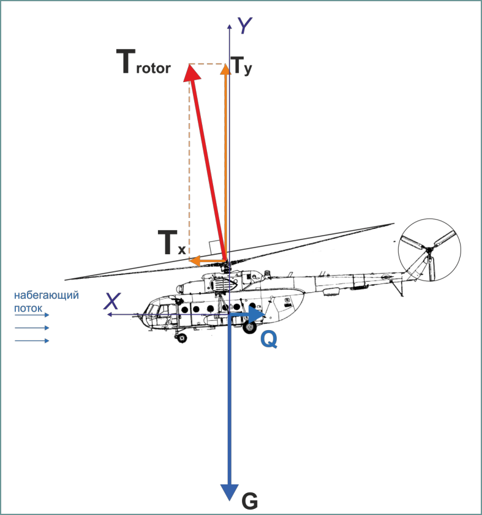
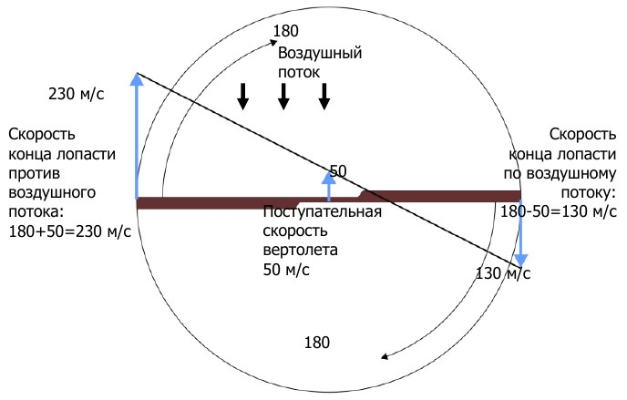
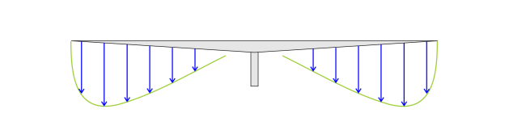
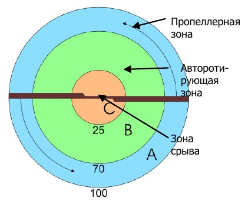
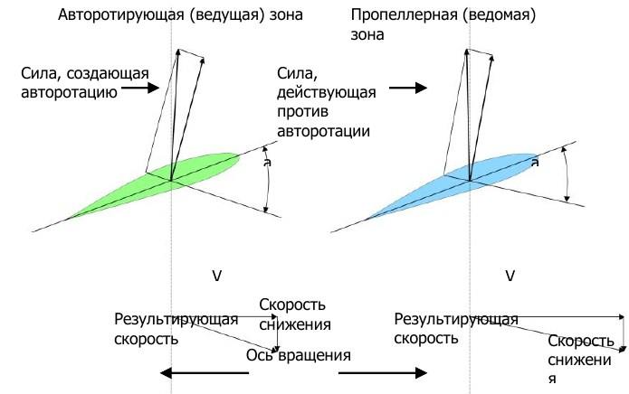

# Динамика полёта вертолета

Если бы разработка вертикально взлетающих аппаратов была настолько же
простой, как сама идея, то геликоптер наверняка был бы первым ЛА в истории.
Первооткрывателем идеи вертолета был Леонардо да Винчи, который создал
эскиз винтокрыла, названного им "Хеликсптерон", еще в начале XVI века. В
названии аппарата Да Винчи использовал греческое слово Helix, обозначающее
"спираль", скомбинированное с греческим словом "Pteron", обозначающим
"крыло". Отсюда родился современный термин, обозначающий ЛА с подвижным
вращающимся крылом – геликоптер. В русском языке такие ЛА принято
называть вертолетами.

Разработка винтокрылого вертикальновзлетающего ЛА была связана с рядом
трудностей и, в первую очередь, с отсутствием подходящего двигателя,
который мог бы обеспечить полёт. Когда достаточно мощные и легкие
авиационные двигатели были разработаны, мечта о вертолете стала
реальностью.

На вертолет распространяются те же законы физики и аэродинамики, что и на
самолёт. Но управление вертолетом сложнее и пилоту приходится иметь дело с
такими понятиями, как: несущий винт (НВ), рулевой винт (РВ), крутящий
момент, гироскопическая прецессия, асимметричность подъемной силы, срыв
потока на "отступающей" по потоку лопасти (при движении вперед) и обратное
обтекание (лопастей).

В этой главе описаны базовые понятия, касающиеся управления вертолетом,
скорости, реактивного момента, гироскопической прецессии, асимметрии
подъемной силы, срыва потока с лопастей, вихревого кольца, висения, эффекта
земли, скоса потока и авторотации.

### Четыре силы, действующие на вертолет

Сила тяжести (G, 4-2) и сопротивление воздуха (Q) действуют на вертолет,
как и на все ЛА. Однако подъемная (Ty) и пропульсивная (Tx, толкающая
вперед) силы создаются несущим винтом (Trotor). В простейшем понимании –
несущий винт для вертолета то же самое, что и крыло с винтом для самолёта.
Кроме того, наклоняя вектор тяги несущего винта, пилот вертолета может
выполнять полёт в сторону или назад.

### Управление

1. Управление по тангажу: перемещение РППУ вперед/назад наклоняет несущий   винт вперед/назад и вслед за ним нос  вертолета
2. Управление по крену: перемещение РППУ влево/вправо наклоняет несущий   винт влево/вправо и вслед этим кренит вертолет                
3. Управление общим шагом НВ: перемещение рычага ОШ вверх/вниз увеличивает/уменьшает угол установки всех лопастей НВ и вслед за этим увеличивает/уменьшает тягу НВ (приводит к набору высоты или снижению)
4. Путевое управление: перемещение педалей влево/вправо изменяет тягу РВ и перемещает хвостовую балку вертолета вправо/влево

На приведенном рисунке показана схема проводки управления классического
вертолета. Сюда входят: несущий винт, ручки управления циклическим и общим
шагом, педали, и рулевой винт. Ручка общего шага управляет общим шагом
(углом установки носка лопасти относительно плоскости вращения НВ) всех
лопастей несущего винта, одновременно и на одинаковое значение увеличивая
или уменьшая подъемную силу каждой лопасти (значит и НВ в целом). Ручка
циклического шага управляет автоматом перекоса, за счет чего шаг лопастей
изменяется циклически, лишь в определенном месте диска НВ, за счет чего
формируются несимметричные силы в различных частях НВ тем самым
наклоняя его в соответствующую сторону. Шаг отдельно взятой лопасти в
каждый момент времени складывается из общего шага и циклического шага.
Педали вертолета управляют шагом рулевого винта, увеличивая или уменьшая
шаг его лопастей и позволяя выполнять разворот вертолета в горизонтальной
плоскости на висении.

### Скорость

Лопасти несущего винта вертолета должны двигаться в воздухе с относительно
высокой скоростью, чтобы создавать достаточную подъемную силу. Несущий
винт вращается со скоростью, достаточной для создания потребной подъемной
силы, в то время как рулевой винт, вращаясь, создает силу, удерживающую
вертолет от разворота под воздействием реактивного момента от несущего
винта.

Вертолет может перемещаться вперед и ограниченно вбок и назад. Вертолет
также может находиться в режиме висения с нулевой поступательной
скоростью.

### Реактивный момент несущего винта

Проблема реактивного момента характерна для одновинтовых (классических)
схем вертолетов. Несущий винт вертолета вращается в одну сторону и создает
реактивный момент, который стремится развернуть фюзеляж вертолета в
другую сторону. Этот эффект следует из третьего закона Ньютона: "действие
равно противодействию". У вертолетов реактивный момент несущего винта
уравнивается компенсирующим моментом от тяги хвостового винта.
На вертолетах с двумя несущими винтами и, в частности, при использовании
соосной схемы реактивный момент одного винта компенсируется
противоположным моментом от другого винта.

### Рулевой винт

Приведенный рисунок показывает направление вращения несущего винта,
направление реактивного момента и положение рулевого (хвостового) винта.
Рулевой винт установлен на конце хвостовой балки вертолета и предназначен
для компенсации реактивного момента от несущего винта. Он вращается от
привода основного двигателя вертолета с постоянной скоростью и создает силу,
действующую в горизонтальной плоскости в направлении, противоположном
реактивному моменту несущего винта.

### Гироскопическая прецессия

Управление вектором тяги винта через его гироскопическую прецессию
справедливо рассматривать только для схемы винтов имеющих один осевой
шарнир лопасти.

Результирующая от начальной силы, приложенной к вращающемуся телу,
прикладывается в точке, находящейся в 90 градусах от точки приложения
начальной силы в направлении вращения тела. Этот эффект называют
гироскопической прецессией. Например, если сила, действующая вниз,
прикладывается к винту в точке 3-х часов (начальная сила), как на рисунке, то
результирующая сила будет действовать в точке 6-ти часов.

1. Направление воздействия управляющих
2. Направление вращения
3. Угол 90 градусов вперед по вращению.
сил и изменения циклического шага

Угловое смещение управляющих связей винта требуется как раз из-за этого
эффекта, для того, чтобы пилот мог направлять вектор тяги в желаемом
направлении. На картинке показан поводок лопасти несущего винта,
вынесенный вперед по вращению винта на угол 90 градусов. Если бы не было
такого углового смещения, то пилоту пришлось бы постоянно перемещать ручку
циклического шага на 90 градусов вперед по вращению винта относительно
желаемого направления движения. Например, если пилот Ми-8 хотел бы
двигаться вперед, ручку ему пришлось бы перемещать влево.

### Асимметрия подъемной силы

Поверхность, находящаяся под окружностью, которую описывают законцовки
лопастей несущего винта, называется ометаемой поверхностью. В режиме
висения подъемная сила, возникающая на каждой лопасти, одинакова в любой
точке окружности. Асимметрия подъемной силы возникает при поступательном
движении вертолета на встречных к потоку лопастях относительно идущих по
потоку.

Когда вертолет находится в режиме висения, скорость концов лопастей лежит в
диапазоне около 180 м/с в пределах всей окружности вращения. Асимметрия
подъемной силы возникает из-за разностей скоростей на лопастях, идущих
навстречу воздушному потоку (опережающих лопастях) и идущих по потоку
(отстающих лопастях). При движении по потоку к собственной скорости лопасти
прибавляется скорость потока, равная скорости вертолета; при отступании по
потоку из скорости лопасти вычитается скорость потока.

Рисунок иллюстрирует значение скорости концов лопастей при поступательном
движении вертолета. На рисунке вертолет движется вперед со скоростью
50 м/с, скорость концов лопастей составляет примерно 180 м/с. Следовательно,
мы имеем результирующую скорость конца лопасти, идущей навстречу потоку
180+50=230 м/с, а результирующая скорость конца лопасти, идущей по потоку,
составляет 180-50=130 м/с. В результате этого возникает различная подъемная
сила на опережающих и отстающих лопастях.

Для компенсации асимметрии подъемной силы на вертолетах установлен
автомат перекоса, который циклически изменяет шаг лопастей. Он уменьшает
шаг опережающих лопастей и увеличивает шаг отстающих лопастей для
компенсации асимметрии подъемной силы. При увеличении поступательной
скорости полёта летчик должен постоянно корректировать циклический шаг,
чтобы держать вертолет прямо. Изменение циклического шага производится во
всем диапазоне скоростей вертолета.

### Срыв потока с лопастей винта

Срыв потока происходит на лопастях винта, движущихся по потоку и с большим
углом атаки при поступательном движении вертолета. Это основной фактор,
ограничивающий максимальную скорость вертолетов. Также как срыв потока с
крыла ограничивает минимальную скорость самолёта - срыв потока с лопасти
винта вертолета ограничивает максимальную скорость вертолета, так как
результирующая скорость отстающей лопасти падает с увеличением скорости
вертолета. В идеальном случае, отстающая лопасть должна создавать
подъемную силу, равную подъемной силе, создаваемой опережающей
лопастью. Поскольку скорость отстающей лопасти меньше, чем опережающей,
то угол атаки отстающей лопасти должен быть увеличен, чтобы уравнять
подъемную силу по всей области диска несущего винта. При увеличении
скорости вертолета, угол атаки отстающей лопасти все больше увеличивается,
а ее скорость падает, пока не наступает срыв потока.

1. Зона отсутствия подъемной силы
2. Зона корневой части лопасти

1. Зона обратного обтекания             
2. Зона отсутствия подъёмной силы       
3. Подъёмная сила в этой зоне создается 
лопастями на малом угле атаки           
4. Подъёмная сила в этой зоне создается
лопастями на большом угле атаки (должна
быть равна подъёмной силе, создаваемой в
зоне 3).

1. Зона срыва с концов лопастей. Первые 
проявления вибрации и раскачки          
2. Если угол атаки лопастей продолжает
оставаться высоким, зона срыва потока
расширяется. Вертолет увеличивает тангаж
и кренится вправо ("валёжка")

Эффект срыва потока с лопастей проявляется в общем случае как усиление
вибрации вертолета, задирание носа и кренение. Если ручка управления
(циклического шага) продолжает удерживаться впереди и общий шаг не
уменьшен, явления срыва потока усугубляются и вибрация заметно возрастает.

В такой ситуации контроль над вертолетом может быть потерян. Процедура
выхода из "валёжки":

- уменьшить общий шаг;
- ручку управления в нейтральное положение;
- уменьшить скорость;
- увеличить обороты несущего винта.

### Вихревое кольцо

Режим вихревого кольца возникает при снижении вертолета и попадании
несущего винта в возмущенный воздушный поток, в результате чего происходит
резкий "провал" подъемной силы.

Чаще всего это происходит при вертикальном или близком к вертикальному
снижении, происходящем со скоростью более 3 м/с, при низкой поступательной
скорости и работающем двигателе с недостаточным запасом мощности для
уменьшения скорости снижения. Эти условия создаются при наличии попутного
ветра или при попадании вертолета в спутный след от другого вертолета.

В таких условиях вертолет снижается с высокой скоростью, превышающей
скорость отбрасываемого потока воздуха от внутренних секций несущего винта.

В результате, на внутренних секциях винта возникает эффект обратного
перетекания, то есть во внутренней части поверхности ометания винта
воздушный поток перемещается не вниз, в вверх, что приводит к образованию
вторичного вихревого кольца (первичное вихревое кольцо существует в районе
концов лопастей несущего винта всегда), которое приводит к значительному
падению подъемной силы.

Скорость отбрасываемого винтом потока воздуха максимальна у наружных
секций винта и падает к внутренним секциям из-за меньшей скорости движения
внутренних частей лопастей.

Приведенный ниже рисунок показывает направление скорости потока по
диаметру винта при возникновением вихревого кольца.

В режиме вихревого кольца скорость снижения вертолета значительна,
начинается обратное перетекание потока снизу-вверх через внутренние секции
воздушного винта. На рисунке такие потоки отмечены красными стрелками.

Если пилот вертолета не предпринимает попыток выхода из опасного режима
при ранних его проявлениях, в условиях недостатка мощности винт попадает в
режим вихревого кольца.

В режиме вихревого кольца возможна потеря управляемости вертолетом из-за
значительной турбулентности и неустойчивости потока по диаметру несущего
винта.

Режим вихревого кольца нестабилен. На ранних стадиях выход из него
возможен увеличением шага и мощности. Если мощности двигателя
недостаточно, увеличение шага винта может только ухудшить ситуацию. Если
вертолет втянулся в режим вихревого кольца и не имеет запаса мощности, то
единственным способом для выхода является отклонение ручки управления от
себя для увеличения поступательной скорости. Оба приведенных выше способа
требуют наличия достаточной высоты для восстановления нормального полёта.

### Висение

Висением вертолета называется режим, в котором вертолет находится
неподвижно относительно точки в воздухе, обычно на сравнительно небольшой
высоте. При висении несущий винт вертолета должен создавать подъемную
силу, равную весу вертолета. Величина подъемной силы изменяется общим
шагом винта.

На висении несущий винт отбрасывает значительный объем воздуха, который
захватывается над винтом и по сторонам от него. Для висения требуется
большая мощность, чем для прямолинейного горизонтального полёта.

В режиме висения фюзеляж и крыло вертолета создают сопротивление потоку
воздуха, отбрасываемому винтом, что приводит к потерям тяги. Из-за этого
требуется большая мощность и расходуется большее количество топлива. В
дополнение ко всему, на малой высоте несущий винт и двигатели работают в
условиях запыления, что влечет за собой увеличение износа.

### Эффект земли

Эффект земли проявляется в увеличении подъемной силы несущего винта при
висении вертолета над поверхностью. Эффект начинает сказываться при
высоте висения, равной радиусу несущего винта и ниже; для стандартного
вертолета эта высота составляет 5-10 метров.

К увеличению подъемной силы и эффективности винта вблизи земли приводят
различные факторы. Первый и наиболее важный фактор – уменьшение размера
первичных вихрей у законцовок лопастей. В обычной ситуации первичные
вихри создаются благодаря входящему и отбрасываемому от винта потокам;
перетекание наверх части отбрасываемого вниз потока уменьшает подъемную
силу винта; когда размер этих вихрей, а, значит, и перетекающего воздуха
уменьшается – подъемная сила винта увеличивается. Вторым важным фактором
является то, что воздушный поток тормозится благодаря экрану - земле и
создает зону повышенного давления под вертолетом, воздействующую на винт
и увеличивающую подъемную силу. Максимальный коэффициент увеличения
подъемной силы за счет эффекта земли составляет 1,2 на нулевой высоте.

### Косая обдувка

Эффективность несущего винта возрастает с увеличением поступательной
скорости движения и при наличии встречного ветра. При движении вертолета
вперед исчезает проблема "дефицита" воздуха, который должен отбрасывать
винт, характерная для висения; воздух поступает в достаточном количестве с
увеличением скорости вертолета. Уже на скорости приблизительно около 40
км/ч начинает расти объем назахватываемого нетурбулентного воздуха. В этот
момент подъемная сила возрастает и вертолет при той же мощности начинает
набирать высоту.

В нормальном полёте поток воздуха, проходящий через заднюю часть диска
винта, приобретает большую скорость, чем поток, проходящий через
переднюю. Это явление называется косой обдувкой несущего винта. Разница в
скоростях объясняется увеличением траектории поступления потока воздуха (на
которой он успевает приобрести большую скорость) при подсасывании его
задней частью несущего винта.

На скоростях перехода от висения к горизонтальному полёту, при смене осевой
обдувки на косую (примерно от 20 до 40 км/ч), из-за возникновения разницы в
подъемной силе лопастей в левой и правой части НВ наблюдается кренение
вправо для вертолетов с направлением вращения винта по часовой стрелке
(если смотреть сверху).

### Авторотация (РСНВ)
    
При отказе двигателей или каких-либо других повреждениях вертолета, не
позволяющих использовать тягу двигателей, вертолет может совершить
безопасное приземление в режиме авторотации (режим самовращения
несущего винта). Трансмиссия вертолета устроена так, что позволяет
вращаться винтам при остановке двигателей. В этом случае для раскрутки
несущего винта используется энергия воздушного потока, и такой полёт
называется авторотацией.

В режиме авторотации пилот вертолета начинает разменивать потенциальную
энергию ЛА (его высоту) на кинетическую (скорость), необходимую для
осуществления вращения несущего винта. Для этого пилот направляет вертолет
в пологое снижение и поддерживает обороты винта на достаточном уровне. На
рисунке показана схема планирования вертолета на авторотации.

Для понимания сил, действующих на несущий винт в режиме авторотации, его
делят на три зоны, в каждой из которых действия сил различаются.

ЗОНА А называется пропеллерной или ведомой, она располагается во внешнюю
сторону от 70% радиуса винта. Анализ сил, действующих на эту зону,
показывает, что аэродинамическая сила наклонена слегка назад от оси
вращения. Следовательно, эта зона тормозит винт.

ЗОНА В называется авторотирующей или ведущей. Она располагается кольцом
от 25% до 70% на радиусе винта. Эта зона работает на сравнительно большом
угле атаки, аэродинамическая сила в этой области наклонена слегка вперед.
Именно этот небольшой наклон силы обеспечивает поддержание вращений
винта на необходимых оборотах.

ЗОНА С находится внутри от 25% радиуса винта и называется зоной срыва. Винт
в этой зоне работает на срывных углах атаки и создает только сопротивление.
Авторотирующая (ведущая) зона Пропеллерная (ведомая)
зона

Перед посадкой на режиме авторотации пилот должен выдерживать
экономическую скорость, а также угол планирования в пределах 14-16°. Для
приблизительного расчета удаления площадки, на которую можно
спланировать, рекомендуется применять следующее правило: удаление
площадки примерно равно четырем высотам. Перед приземлением для
погашения вертикальной скорости необходимо увеличить общий шаг винта и
выполнить так называемый "подрыв". При этом необходимо точно определить
высоту начала "подсечки". В общем случае для вертолетов рекомендуют
производить "подрыв" на высоте трех – четырех вертикальных скоростей.
Например, если у вертолета вертикальная скорость снижения составляет 10
метров секунду, то "подрыв" необходимо начинать на высоте 30-40 метров от
земли, однако в случае использования интенсивного гашения скорости РППУ
высота взятия ОШ уменьшается примерно в два раза.

В нижеприведенной диаграмме в масштабе скорость – высота показаны
опасные зоны, в которых не рекомендуется пилотировать вертолет, так как при
отказах двигателей безопасная посадка на авторотации не гарантируется.

### Выводы

Вес, подъемная сила, тяга и сила сопротивления – четыре основные силы,
действующие на вертолет. Циклический шаг для управления направлением
полёта, общий шаг для управления высотой полёта, педали для управления
рулевым винтом, - три основных управляющих органа вертолета.
Реактивный момент несущего винта является неотъемлемой проблемой для
одновинтовых вертолетов, и отсутствует у двухвинтовых и соосных вертолетов.
Гироскопическая прецессия проявляется в направлении 90° по вращению винта
к точке приложения силы. Асимметрия подъемной силы проявляется при
поступательном движении вертолета на опережающих и отстающих лопастях
несущего винта.

Попадание в режим вихревого кольца возможно на винте, использующем от 20
до 100% мощности двигателя и малой горизонтальной скорости (менее
20 км/ч). В режиме висения несущий винт вертолета требует большей мощности
двигателя.

Эффект земли заметно увеличивает подъемную силу вблизи земли на
расстоянии около половины диаметра винта. Косая обдувка винта проявляется
на скоростях более 20 км/ч и способствует увеличению тяги за счет увеличения
секундно-массового расхода воздуха через НВ при одной и той же подводимой
мощности. Авторотация дает возможность безопасно приземлить вертолет при
отказе двигательной установки.

