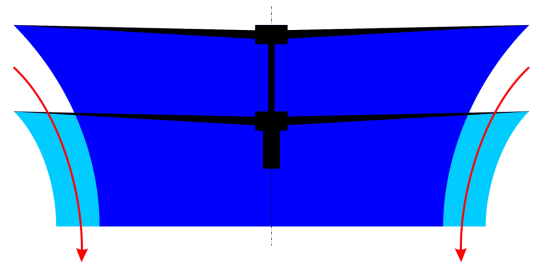
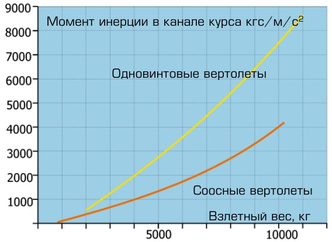
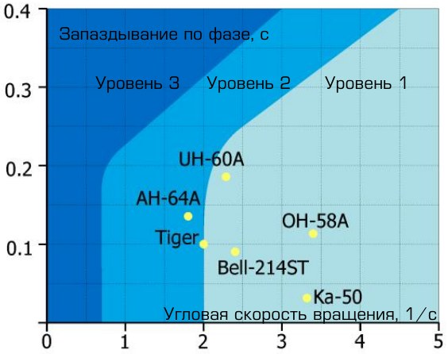
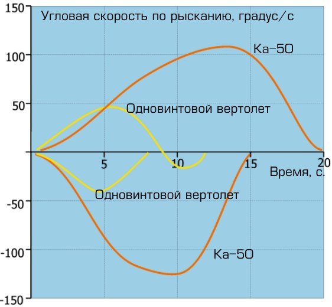

# ДИНАМИКА ВЕРТОЛЁТА СООСНОЙ СХЕМЫ

Сегодня в мировом вертолётостроении используются, в основном, три схемы вертолётов: одновинтовая, соосная и продольная, причем подавляющее большинство
винтокрылых машин построено по одновинтовой схеме. Пионеры вертолётостроения хорошо знали принципиальные преимущества соосной схемы летательного аппарата. Однако зарубежным конструкторам удалось довести до массового производства и широкой эксплуатации только вертолёты одновинтовой схемы с рулевым
винтом. Эта схема и стала называться классической. В России одновинтовые вертолёты также получили широкое распространение.
Области применения соосных вертолётов определялись их характерными особенностями - малыми габаритами, высокими тяговооруженностью и маневренностью,
аэродинамической симметрией. Эти особенности обеспечили им удобное базирование на малоразмерных взлетно-посадочных площадках кораблей различного назначения. В условиях взлета и посадки на качающуюся палубу и полета над морем
ярко проявились уникальные качества соосных вертолётов. На кораблях ВоенноМорского Флота нашли применение вертолёты Ка-25 и Ка-27. В гражданской авиации эксплуатировались Ка-26 и Ка-32.

В начале 80-х годов фирма КАМОВ создала новый вертолёт соосной схемы Ка-50,
спроектированный для выполнения боевых задач. Летные испытания подтвердили
высокие летно-технические и маневренные характеристики летательного аппарата
и показали его преимущества по сравнению с боевыми вертолётами, построенными
по одновинтовой схеме. В свете этого особенно важно провести объективный сравнительный анализ особенностей вертолётов соосной и классической одновинтовой
схемы.

## Компенсация реактивных моментов несущих винтов

Особенности соосных вертолётов связаны с реализацией принципиально нового
способа компенсации реактивного момента несущих винтов по сравнению с одновинтовыми вертолётами. Реактивные моменты винтов соосного вертолёта взаимно
уравновешиваются непосредственно на оси их вращения. На вертолёте одновинтовой схемы для компенсации реактивного момента несущего винта необходимо создание боковой силы рулевого винта, приложенной к фюзеляжу.
Конструкторами соосных вертолётов, по существу, был создан новый тип несущей
системы без реактивного момента. Реактивные моменты на винтах компенсируются
автоматически на протяжении всего полета без какого-либо вмешательства летчика. В силу этого изменение мощности на винтах соосного вертолёта не приводит
к разбалансировке вертолёта в путевом отношении. В установившемся полете верхний и нижний винты соосного вертолёта имеют нулевой суммарный реактивный момент. При перемещении педалей возникает разница реактивных моментов, благодаря которой осуществляется управление вертолётом по курсу.

Способ компенсации реактивного момента, используемый на одновинтовом вертолёте, требует в полете постоянного внимания летчика и регулирования тяги рулевого винта в целях балансировки вертолёта.

## Энергетические возможности

С энергетической точки зрения оптимальными для летательного аппарата являются
такие решения, при которых мощность силовой установки идет преимущественно на
полезные нужды. Для вертолёта это - создание необходимых подъемной и пропульсивной сил на заданном режиме полета.

На одновинтовом вертолёте часть мощности расходуется на привод рулевого винта,
который создает силу тяги, потребную для компенсации крутящего момента несущего винта. Эти затраты составляют до 10-12 % от мощности, приходящей на вал
несущего винта, и являются чистыми потерями.

На соосном вертолёте вся
свободная мощность силовой
установки используется для
привода несущих винтов, то
есть для создания подъемной
силы. При этом реактивные
моменты взаимно уравновешены. Следовательно, на
компенсацию реактивных моментов нет прямых затрат
мощности. Кроме того, в режиме висения соосные винты
оказывают друг на друга положительное влияние, что
также приводит к экономии
мощности. 

Поскольку струя от верхнего винта сужается в плоскости нижнего винта
на 15-20 %, то нижний винт имеет возможность осуществлять дополнительный подсос воздуха. Это в целом увеличивает сечение струи и снижает затраты мощности
на создание подъемной силы. Кроме того, благодаря противоположному направлению вращения винтов, на соосной несущей системе существенно уменьшаются затраты энергии на закручивание струи, что также приводит к снижению непроизводительных потерь мощности.

Результаты летных испытаний и данные других экспериментов свидетельствуют,
что коэффициент полезного действия соосных несущих винтов в среднем в 1,06-1,1
раза (на 6-10 %) выше, чем одиночных. Учитывая экономию мощности, идущей на
компенсацию реактивного момента (10-12 %), получаем, что в целом коэффициент
полезного действия соосных вертолётов на 16-22 % выше, чем одновинтовых. Перечисленные энергетические особенности обеспечивают соосной схеме существенные преимущества в потолке висения и вертикальной скороподъемности.
На первый взгляд кажется, что за счет наличия двухвинтовой колонки соосные вертолёты должны иметь большее лобовое сопротивление, чем одновинтовые летательные аппараты. Однако при летных испытаниях это преимущество одновинтовых
вертолётов в потребной мощности не проявилось, что можно объяснить следующими факторами:

-   благоприятным взаимным влиянием соосных несущих винтов в поступательном движении (эффект «бипланной коробки», обеспечивающий заметную экономию части располагаемой мощности силовой установки, которая
идет на создание подъемной силы и эквивалентной потребной индуктивной
мощности);
-   дополнительными затратами мощности на привод рулевого винта на одновинтовых вертолётах;
-   дополнительным сопротивлением рулевого винта одновинтового вертолёта, особенно с учетом интерференции рулевого винта и хвостовой балки
вертолёта;
-   дополнительным вредным сопротивлением фюзеляжа одновинтового вертолёта в полете со скольжением, так как летчику предпочтительнее пилотировать вертолёт без крена;
-   рядом мер, существенно уменьшающих на соосном вертолёте лобовое сопротивление (например, на Ка-50 - убирающееся в полете шасси).

## Массогабаритные характеристики

Соосная конструкция позволяет уменьшить габариты и массу вертолёта, что дает
ему ряд преимуществ.

Для сравнительной оценки массогабаритных характеристик соосных и одновинтовых вертолётов с рулевым винтом целесообразно рассмотреть два случая: первый,
когда соосный и одновинтовой вертолёты имеют одну и ту же полетную массу и
одинаковую располагаемую мощность силовой установки, и второй, когда соосный и
одновинтовой вертолёты имеют одинаковые диаметры винтов.

В первом случае, использование соосной несущей системы позволяет уменьшить габаритные размеры вертолёта на 35-40 % по сравнению с одновинтовым. Во втором
случае, меньшее аэродинамическое качество и дополнительные потери мощности
на привод рулевого винта у одновинтового вертолёта обуславливают меньшее значение полетной массы. Из-за наличия рулевого винта габаритные размеры одновинтового вертолёта на 20 % больше соосного. Компактность планера соосного вертолёта и сосредоточение тяжелых агрегатов вблизи центра масс приводят к заметному уменьшению моментов инерции относительно вертикальной и поперечной
осей, что играет важную роль в обеспечении высоких характеристик управляемости
и маневренности.

## Устойчивость и управляемость

Важнейшей особенностью соосного вертолёта, существенно улучшающей характеристики устойчивости и управляемости, является его аэродинамическая симметрия.

В процессе развития и становления авиастроения конструкторы неоднократно обращались к аэродинамически симметричным схемам. Аэродинамическая симметрия летательного аппарата обеспечивает целый ряд важных пилотажных свойств и, главное, простоту управления. Весьма наглядным в этом плане является пример развития самолетостроения: проектировались и строились только симметричные самолеты.

Вертолёт одновинтовой схемы является аэродинамически несимметричным летательным аппаратом с присущим только ему рядом характерных особенностей. В
вертолётостроении с этим смирились как с неизбежной платой за простоту технического решения. Однако история развития вертолётостроения показала, что эта простота - лишь кажущаяся. Создание работоспособного рулевого винта и трансмиссии,
имеющих приемлемые ресурс и характеристики - это чрезвычайно сложная проблема, и в настоящее время являющаяся актуальной.

Аэродинамическая симметрия вертолёта соосной схемы обеспечивается отсутствием
реактивного момента на его корпусе, относительной близостью верхнего и нижнего
винтов и благоприятным влиянием их друг на друга, что приводит к малой разности
тяг в сбалансированном положении. Направленные в противоположные стороны боковые силы винтов уравновешивают друг друга, а поперечный момент, возникающий из-за малого разноса винтов, невелик. Благодаря отсутствию рулевого винта
на соосном вертолёте нет постоянно действующей переменной боковой силы. Конструкция соосных вертолётов обеспечивает гармоничное сочетание эффективности
управления и аэродинамического демпфирования, что влечет за собой улучшение
характеристик управляемости. На рисунке 5-5 представлены оценки характеристик
управляемости ряда вертолётов в поперечном канале по стандарту Авиационного
управления армии США ADS-33C «Требования к ручному управлению для военных
вертолётов» для режима висения и полета на малой скорости. График зависимости
постоянной времени запаздывания от характерной частоты отображает различные
уровни управляемости вертолётов. Видно, что вертолёт Ка-50 по своим характеристикам соответствует уровню управляемости 1 (отличные характеристики управляемости) «Требований» ADS-33C. При этом он имеет существенные преимущества перед другими вертолётами по величине запаздывания и по частоте.

Благодаря аэродинамической симметрии на соосном вертолёте практически отсутствуют связи между продольным и боковым движением, обеспечивается независимость каналов управления и простота пилотирования. Управление таким вертолётом доступно летчикам средней квалификации.

Аэродинамическая симметрия в значительной степени меняет «лицо» вертолёта.
Отсутствие переменного (по режимам полета) момента рыскания и боковой силы,
действующих на фюзеляж, улучшает характеристики устойчивости и управляемости, повышает безопасность полета и облегчает решение боевых задач в экстремальных условиях. На соосном вертолёте отсутствуют связи между изменением
мощности двигателей (общим шагом винтов), путевым и поперечным управлением.
На одновинтовом вертолёте все маневры, в процессе которых меняется режим работы двигателей (разгоны и торможения, изменения высоты полета, «горки» и пикирования, боевые развороты и др.), сопровождаются путевой перебалансировкой
и возникновением необходимости парирования возникающих боковых сил креном и
скольжением. Из-за отсутствия симметрии, а также постоянного изменения взаимосвязи между движением в вертикальной и горизонтальной плоскостях пилотирование одновинтового вертолёта усложняется, что требует большей тщательности обучения.

Соосные вертолёты по простоте управления сопоставимы с самолетами для первоначального обучения. В то же время по летным характеристикам устойчивости, управляемости и маневренности они имеют превосходство над одновинтовыми вертолётами.

## Маневренность

В процессе маневрирования решаются две задачи: выход на заданное направление
и обеспечение требуемой разности высот по отношению к цели. Конечно, на практике эти задачи решаются в комплексе, но для лучшего понимания физической природы явлений рассмотрим их раздельно.

Маневры с изменением направления движения могут быть выполнены как под действием перегрузки (об этом мы поговорим отдельно), так и без нее. Маневры, при
которых продольная ось вертолёта ориентируется в заданном направлении, как
правило, путем ввода вертолёта в глубокое скольжение, называются «плоскими».

Специфическая особенность вертолёта - способность производить «плоские» развороты, реализуемая на висении и при перемещениях с малыми скоростями полета.

Наиболее известным «плоским» маневром является разворот вертолёта по курсу на
режиме висения. Нужно отметить, что интенсивность современного боя и необходимость достижения тактического превосходства в боевой обстановке требуют расширения диапазона скоростей полета, на которых может быть использован «плоский»
маневр.

Благодаря своим конструктивным особенностям соосный вертолёт имеет неограниченные возможности в реализации «плоского» разворота, намного превосходящие
возможности одновинтовых вертолётов. Особенности конструкции обеспечивают
концентрацию на соосном винте всех важнейших функций: создание подъемной и
пропульсивной (движущей) сил, продольного, поперечного и путевого управления,
а также управления общим шагом.

Путевое управление вертолётом с соосным несущим винтом осуществляется при использовании разницы моментов вращения на верхнем и нижнем винтах. Это приводит к тому, что система управления в целом становится практически независимой
от угла скольжения. Именно это обстоятельство, а также отсутствие рулевого винта
позволяет соосному вертолёту выполнять «плоский» разворот с большими углами
скольжения.

Для одновинтового вертолёта «плоский» разворот принципиально невозможен. На
одновинтовом вертолёте допустимые углы скольжения существенно ограничиваются наличием рулевого винта. Дело в том, что изменение угла скольжения приводит к изменению угла атаки рулевого винта, условий его работы и махового движения его лопастей, особенно на больших скоростях полета. Увеличение амплитуды
махового движения лопастей рулевого винта сверх допустимой является прямой
угрозой безопасности полета. Это обусловлено тем, что на рулевых винтах отсутствуют автоматы перекоса, а предотвращение чрезмерного роста амплитуды махового движения обеспечивается только регулятором взмаха, возможности которого
ограничены. Поэтому при росте амплитуды махового движения сверх допустимой
возможны удары лопастей рулевого винта о балку. Кроме того, с ростом амплитуды
махового движения растут нагрузки в элементах конструкции рулевого винта, что
также накладывает ограничения на углы скольжения.

На соосных вертолётах допустимы значительные углы скольжения. Как уже отмечалось, это объясняется отсутствием рулевого винта и независимостью системы путевого управления от угла скольжения. Хвостовое оперение соосного вертолёта не
накладывает каких-либо ограничений на величину угла скольжения, так как рассчитано на изменение угла скольжения в диапазоне до 180°.

«Плоский» разворот был отработан на боевом вертолёте Ка-50. При этом в диапазоне скоростей от 90 до 100 км/ч этот маневр можно выполнять в пределах скольжений (поворотов по курсу) до 180° как вправо, так и влево, а на больших скоростях (до 230 км/ч) - в пределах 90°, при этом крен вертолёта близок к нулю. «Плоский» разворот на большие углы является сугубо боевым маневром и обеспечивает
направление неуправляемого оружия вертолёта в сторону цели в кратчайшее
время. Использование «плоского» разворота дает боевому вертолёту преимущество
в бою против любого противника - как наземного, так и воздушного. Именно из-за
отсутствия рулевого винта на соосном вертолёте имеется возможность выполнять
маневры с большей эффективностью, используя отклонения педалей до упора с
максимально возможным темпом и созданием угловых скоростей рыскания без каких-либо ограничений.
На одновинтовом вертолёте эффективность путевого управления избыточна. Это
связано с необходимостью обеспечения путевой балансировки во всем диапазоне
изменения мощности силовой установки. Однако эта эффективность не может быть
полностью реализована в полете. Ограничение угловых скоростей вращения на
этих вертолётах вызвано необходимостью предотвращения попадания рулевого
винта в режим вихревого кольца, а также условиями прочности хвостовой балки,
рулевого винта и трансмиссии.

На соосных вертолётах путевое управление является сбалансированным, при этом
обеспечивается оптимальная степень эффективности путевого управления. Руль
направления увеличивает эффективность путевого управления соразмерно возрастающим аэродинамическим моментам планера при увеличении скорости полета. Пилотируя соосный вертолёт, летчики быстро привыкают к новым условиям и убеждаются, что на нем можно выполнять маневры, недоступные одновинтовому вертолёту.

На режимах снижения, близких к режиму самовращения, и при неизменной частоте
вращения несущих винтов у соосных вертолётов отмечается некоторое снижение
эффективности путевого управления. Необходимая степень эффективности путевого управления на этих режимах обеспечивается также благодаря рулям направления. Для увеличения эффективности путевого управления на соосных вертолётах
используется также перенастройка частоты вращения несущих винтов с уменьшением ее на 3-4 %.

Отсутствие рулевого винта на соосном вертолёте дает летчику возможность осуществлять управление по курсу путем отклонения педалей до упора с максимально
возможным темпом, что обеспечивает кратчайшее время разворота на данный угол.

Это видно на рисунке, где отражены параметры движения при выполнении соосным
и одновинтовым вертолётами разворотов на режиме висения. Соосный вертолёт
имеет большое преимущество перед одновинтовым по темпу нарастания и по максимальной величине угловой скорости разворота, а также больший запас путевого
управления на висении, в том числе и на статическом потолке, независимо от
барометрической высоты. Это преимущество переходит в значительное тактическое
превосходство и обеспечивает выигрыш в дуэльной ситуации.

На одновинтовом вертолёте с ростом высоты полета или с ростом температуры
наружного воздуха из-за уменьшения избытка мощности силовой установки и увеличения шага рулевого винта существенно уменьшается располагаемый ход путевого управления, а следовательно, и эффективность разворота: на потолке висения, где используется вся располагаемая мощность, одновинтовой вертолёт не может совершать развороты без потери высоты.

## Маневры с использованием перегрузок

Маневры с использованием вертикальных и тангенциальных перегрузок обеспечивают изменение траектории и скорости полета вертолёта. По принятой терминологии, обычно эти маневры подразделяются на вертикальные («горки», пикирования
и др.), горизонтальные (виражи, форсированные виражи, разгоны, торможения и
др.) и пространственные (восходящие и нисходящие спирали, боевые развороты,
повороты на «горке», развороты на пикировании).

Маневренные возможности вертолётов характеризуются, с одной стороны, допустимым уровнем перегрузок, а с другой - способностью эффективно их реализовывать.

Параметры несущей системы для соосных и одновинтовых вертолётов одного класса
определяют из одинакового уровня допустимых перегрузок. Сравнение же располагаемых перегрузок требует особого рассмотрения.
Маневры в вертикальной плоскости. При выполнении таковых существенно изменяется скорость полета, что сказывается на характеристиках маневренности. Вывод
вертолёта на заданную вертикальную перегрузку обеспечивается, как правило, увеличением угла тангажа и, соответственно, угла атаки несущего винта. При этом
темп роста перегрузки прямо связан с темпом роста угла тангажа, то есть с возможностями системы продольного управления, ее эффективностью и мощностью. Чем
выше эффективность продольного управления, тем быстрее изменяются угол тангажа и перегрузка. При этом за время роста перегрузки скорость полета не успевает
существенно уменьшиться, что увеличивает эффективность маневра. В случае недостаточной эффективности управления при выполнении маневра скорость полета
уменьшается быстрее, чем растет перегрузка, могут возникнуть проблемы при достижении заданных перегрузок.

Эффективность и мощность продольного управления у соосного вертолёта значительно выше, чем у одновинтового. Это обеспечивается меньшими моментами инерции и большими располагаемыми моментами управления, что объясняется большим
значением плеч сил, приложенных к втулкам верхнего и нижнего винтов относительно центра масс аппарата.
Ввод соосного вертолёта в пикирование выполняется эффективнее и безопаснее,
чем одновинтового. Дело в том, что при вводе в пике требуется дать ручку от себя,
при этом вертикальная перегрузка существенно уменьшается, происходит соответствующее искривление траектории и растет угловая скорость фюзеляжа на пикирование. В процессе гашения этой угловой скорости для перехода в установившееся
пикирование пилот берет ручку на себя.

При этом маховое движение лопастей развивается быстрее, чем изменяется угловая
скорость фюзеляжа. Если изменение угловой скорости фюзеляжа оказывается недостаточным из-за малой эффективности продольного управления (как, например, у
одновинтового вертолёта), то вследствие встречного относительного движения хвостовой балки и лопастей возможно их опасное сближение и даже соударение. На
вертолётах соосной схемы подобные явления невозможны. Таким образом, выполнение маневров с уменьшением вертикальной перегрузки на соосном вертолёте является более эффективным и безопасным.
Маневры в горизонтальной плоскости. Среди горизонтальных маневров целесообразно выделить маневры прямолинейные и криволинейные. Наиболее часто выполняются разгоны и торможения в горизонтальной плоскости, особенно при выполнении боевой задачи в полетах у земли. Возможность быстрого перемещения у земли
из одной точки в другую резко повышает живучесть вертолёта при выполнении им
боевых задач.

В качестве примера рассмотрим разгоны с режима висения (направление любое вперед, назад, вправо, влево). Эти маневры можно оценить следующими параметрами: максимальным ускорением разгона при использовании избытка мощности,
максимально допустимыми скоростями перемещения и временем выхода на эти скорости.
Больший избыток мощности из-за отсутствия рулевого винта и более высокое аэродинамическое качество соосных винтов по сравнению с одиночными позволяют соосному летательному аппарату выполнять разгон с режима висения с максимальным
ускорением и гораздо быстрее достигать заданной скорости. Это также повышает
боевые возможности винтокрылой машины.

Максимально допустимые скорости полета вбок и назад тоже характеризуют маневренность, так как в итоге определяют быстроту перемещения вертолёта из одной
точки в другую, что особенно важно в условиях боя. Скорость перемещения соосного вертолёта в любом направлении с режима висения ограничивается только максимальными располагаемыми ходами в системе управления винтами. На одновинтовом вертолёте наличие рулевого винта накладывает существенное ограничение на
скорость перемещения вбок с режима висения вследствие возможности попадания
рулевого винта в режим вихревого кольца.

Следует особо остановиться на криволинейных маневрах в горизонтальной плоскости. Здесь необходимо отметить возможность выполнения на соосных вертолётах
принципиально нового маневра - «воронки». Тактический смысл применения «воронки» заключается в том, что при ее выполнении вертолёт может длительное
время держать в зоне прицеливания наземные цели и производить по ним стрельбу,
несмотря на отрицательный угол тангажа.

«Воронка» - сугубо боевой маневр, который выполняется на скорости 100-180 км/ч
с отрицательным углом тангажа до 30-35° и, по существу, является боковым виражом, при котором углы крена и тангажа меняются местами. При выполнении маневра составляющая тяги винта, параллельная горизонтальной плоскости, направлена к центру «воронки». Эта сила уравновешивается инерционными силами, возникающими при движении вертолёта по траектории, близкой к круговой, с углом
скольжения 90°.

Таким образом, выполнение «воронки» на соосном вертолёте основано на его способности совершать глубокие скольжения и перемещения вбок с большими скоростями.

Боевым маневром, который применяется для быстрого изменения направления движения, является форсированный вираж. Он может быть эффективен при атаке
наземных целей и в воздушном бою, при атаке на встречных курсах. На соосных
вертолётах обеспечивается большая интенсивность выполнения форсированных виражей. Это объясняется отсутствием ограничений по угловой скорости вращения и
возможностью выполнения форсированного виража с глубоким (до 60°) скольжением.

Соосные вертолёты имеют преимущества и при выполнении всех пространственных
маневров, особенно при выполнении маневров типа поворота на «горке», когда
необходимо развивать большие угловые скорости и использовать глубокие скольжения.
Кроме вышеперечисленных маневров, на соосных вертолётах успешно выполняются
такие фигуры высшего пилотажа, как: косая петля, кувырок, восходящая бочка и
другие.

## Авторотация

Анализ статистических материалов, полученных на основе летных испытаний, показывает, что при одинаковой нагрузке на квадратный метр ометаемой несущим
винтом площади минимальные вертикальные скорости снижения на режиме авторотации у соосных вертолётов несколько меньше, чем у одновинтовых вертолётов.

Это объясняется наличием на соосной несущей системе бипланного эффекта,
уменьшающего индуктивные потери мощности.

Сравнение показывает, что минимальная вертикальная скорость боевого соосного
вертолёта, имеющего нагрузку на ометаемую площадь 57 кгс/м2, на 8-10 % больше,
чем вертикальная скорость одновинтового вертолёта с нагрузкой 43 кгс/м2. Однако
на посадочных характеристиках вертолётов эта разница не сказывается по следующим причинам:

- благодаря аэродинамической симметрии соосного вертолёта, отсутствию в
каналах управления перекрестных связей типа «общий шаг - педали» не
происходит существенной разбалансировки машины в пространстве при переходе от моторного полета на режим авторотации;
- посадочные скорости соосных вертолётов на режиме авторотации примерно на 15 км/ч меньше, чем одновинтовых. Это объясняется более низким
(на 20-30 м) энергичным выравниванием машин с большими (до 10°) углами
тангажа, что обеспечивается более высокой мощностью продольного
управления и меньшими габаритами планера. Меньшие посадочные скорости увеличивают безопасность посадки, особенно на пересеченной местности.

Путевая управляемость соосных вертолётов на режиме авторотации обеспечивается
за счет развитого вертикального хвостового оперения и разности крутящих моментов на винтах.

## Полет в режиме "вихревого кольца"

На фирме КАМОВ, в ЛИИ, ГНИКИ ВВС, ЦАГИ был проведен большой объем модельных и летных исследований соосных вертолётов и винтов на режиме «вихревого
кольца». Из полученных данных следует:

- верхние границы зон «вихревого кольца» для соосных и одиночного винтов
практически совпадают. При этом правая и нижняя границы зоны, где признаки этого режима достаточно слабы, для соосных винтов несколько шире;
- верхняя граница зоны «вихревого кольца» существенно зависит от нагрузки
на квадратный метр ометаемой площади несущего винта. При этом с увеличением нагрузки растет допустимое в летной эксплуатации значение вертикальной скорости снижения винтокрылой машины. На соосных вертолётах с нагрузкой более 40-50 кг/м2 допустимая вертикальная скорость снижения на малых скоростях планирования такая же, как у одновинтовых вертолётов (не менее 5 м/с);
- попадание соосного вертолёта в режим «вихревого кольца» и вывод машины из него являются безопасными, как и у одновинтового вертолёта. Для
вывода винтокрылой машины любой схемы из режима «вихревого кольца»
необходимо иметь определенный запас высоты.

## Безопасность полетов

В вопросах обеспечения безопасности полета решающее значение имеет человеческий фактор. Соосные вертолёты безопаснее одновинтовых, так как они более просты в управлении, имеют лучшие характеристики управляемости и маневренности,
высокое аэродинамическое качество.

Соосный вертолёт с меньшими, по сравнению с одновинтовым вертолётом того же
класса, габаритами более безопасен при маневрировании вблизи препятствий и на
малых высотах. Ввиду того, что габариты соосной машины определяются диаметрами несущих винтов, в процессе полета вблизи препятствий повреждение хвостового оперения соосного вертолёта маловероятно. Однако даже повреждение или
потеря хвостового оперения, например, при грубой посадке, не оказывает существенного влияния на безопасное завершение полета, так как путевая управляемость обеспечивается соосными винтами.

При сравнении безопасности полета соосных и одновинтовых вертолётов часто обращают внимание на опасность соударения лопастей на вертолётах соосной схемы.

Необходимо отметить, что проблема сближения лопастей с элементами конструкции
одинаково актуальна как для соосных, так и для одновинтовых вертолётов и решается известными методами.
Несущие винты соосных вертолётов конструируются с учетом обеспечения требуемой безопасности полета. Кроме того, в процессе проектирования вертолёта предусматриваются конструктивные запасы между лопастями нижнего винта и элементами конструкции вертолёта. На основе измерений и обобщения результатов испытаний соосных вертолётов на всех эксплуатационных режимах, в том числе и при
выполнении фигур высшего пилотажа, выработаны конструктивные меры по
предотвращению опасного сближения лопастей верхнего и нижнего винтов, а также
лопастей нижнего винта с элементами конструкции планера.

