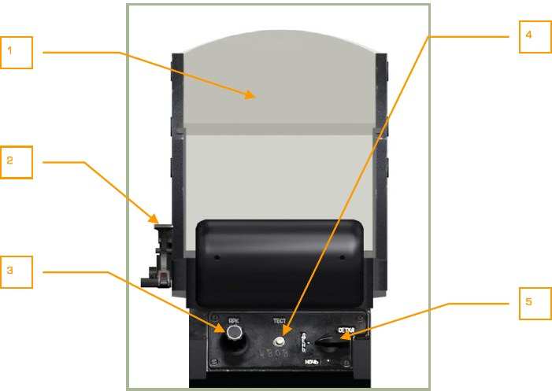
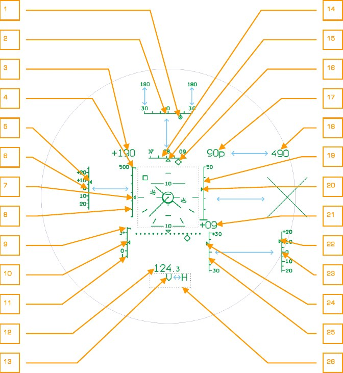
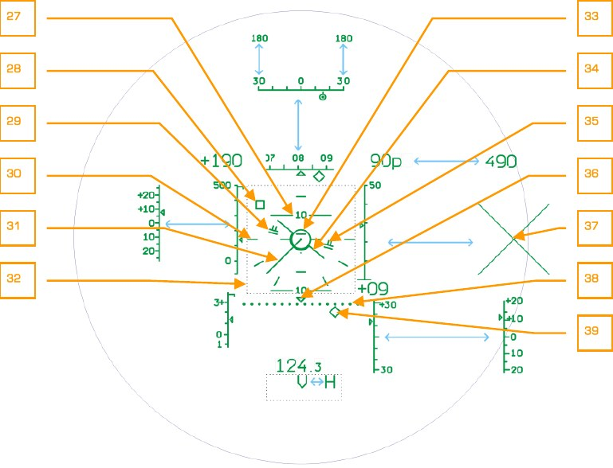

# СИСТЕМА ОТОБРАЖЕНИЯ ИНФОРМАЦИИ

Система отображения информации (СОИ) предназначена для отображения на полупрозрачном отражателе индикатора на лобовом стекле (ИЛС) прицельной и пилотажно-навигационной информации во всех режимах работы ПрПНК, а также символьной прицельной и пилотажно-навигационной информации на ИТ-23МВ.

Режимы работы канала ИЛС: функциональный, ручной, СЕТКА.

Выбор режима (функциональный или ручной) происходит по сигналу ПрПНК автоматически. Переход в режим СЕТКА осуществляется только вручную, установкой переключателя НОЧЬ-ДЕНЬ-СЕТКА на ИЛС в положение СЕТКА.

В состав системы входят:

- Коллиматорный индикатор ИЛС на лобовом стекле, предназначенный для
отображения информации во всех режимах работы СОИ.
- Генератор символов телевизионный, предназначенный для формирования
сигнала телевизионного изображения ИТ-23МВ в соответствии с программой БЦВМ.

Управление работой СОИ осуществляется органами управления, расположенными
на пультах ПВР, ПУР и коллиматорного индикатора.

1.   Отражатели коллиматорного индикатора.
2.   Рычаг подъема светофильтра [[RShift + H]].
3.   Ручка потенциометра регулировки яркости индикации. Влево - [[RAlt + RShift + H]], вправо - [[RCtrl + RShift + H]].
4.   Кнопка включения ТЕСТ-КОНТРОЛЯ [[RAlt + RCtrl + RShift + H]].
5.   Переключатель режимов отображения индикации [[RShift + 8]].

    ДЕНЬ – нормальное изображение индикации.

    НОЧЬ – включение ночного светофильтра.
    
    СЕТКА – включение прицельной сетки.

Включение СОИ обеспечивается при включении ПрПНК выключателем К-041 на
ПВР. Управление режимами работы производится переключателем ОГР ИНФ –
ПОЛН на ПУР [[RCtrl + S]]. В режиме ОГР ИНФ выводится только боевая (ограниченная) информация, при этом крен, тангаж, вертикальная скорость и индекс ЛА на
ИЛС и ИТ не индицируются.

В ИЛС предусмотрена ручная регулировка яркости изображения соответствующим
регулятором на панели ИЛС.

## Вид пилотажно-навигационной информации на ИЛС

1.    Символ курсового угла цели (КУЦ).
2.    Шкала курсового угла цели.
3.    Значение путевой скорости.
4.    Индекс максимально допустимой скорости.
5.    Индекс отклонения от заданной приборной скорости.
6.    Шкала отклонения от заданной приборной скорости.
7.    Индекс приборной скорости.
8.    Шкала приборной скорости.
9.    Индекс максимально допустимой нормальной перегрузки.
10. Индекс нормальной перегрузки.
11. Шкала нормальной перегрузки.
12. Значение дальности.
13. Символ разовых команд.
14. Шкала курса.
15. Отсчетный неподвижный индекс курса.
16. Заданный курс.
17. Радиовысота геометрическая (заменяется на барометрическую выше 300
м).
18. Барометрическая высота (заменяется на геометрическую ниже 300 м).
19. Шкала геометрической высоты (индицируется при радиовысоте ниже 50
м).
20. Индекс геометрической высоты.
21. Значение вертикальной скорости.
22. Индекс отклонения от заданного значения геометрической высоты.
23. Шкала отклонения от заданного значения геометрической высоты.
24. Индекс вертикальной скорости.
25. Шкала вертикальной скорости.
26. Условная граница поля разовых команд (не индицируется).
27. Шкала тангажа.
28. Символ отклонения от заданной позиции на висении (заданная точка висения).
29. Директор управления по крену и тангажу (развернут на угол пропорционально команде по крену и тангажу).
30. Шкала крена (разметка через 30°).
31. Символ вектора путевой скорости (индицируется при скорости менее 50
км/ч).
32. Электронное окно (не индицируется).
33. Неподвижная зона ограничения удержания символа отклонения от заданной позиции на висении.
34. Символ ЛА (подвижный по крену).
35. Директор управления по высоте.
36. Отсчетный неподвижный символ отклонения от линии заданного пути.
37. Запрещающий крест.
38. Шкала отклонения от линии заданного пути.
39. Индекс отклонения от линии заданного пути.

**Перечень и содержание символов разовых команд на ИЛС**

№№  | Символ      | Описание
----|------------------|-----------------------------
1.  |  Н               |  Опасное сближение с землей
2.  |  V               |  Превышение максимально допустимой скорости
3.  |  ОТ              |  Выполнение записи координат оперативной точки
4.  |  РЕЗ-Н           |  Решение навигационных задач БЦВМ
5.  |  ИД              |  Работает лазерный дальномер
6.  |  ТА              |  Сопровождение цели телеавтоматом
7.  |  П               |  Перерыв оптической связи с целью
8.  |  С               |  Символ разрешения пуска (стрельбы)
9.  |  ИУ              |  Работает лазерный канал управления ракетой
10. |  ПАУЗА           |  Символ времени запрета включения лазерного дальномера (нажатия кнопки  АЗ) в режиме ПМ
11. |  РУ-ТА           |  Резервное управление телеавтоматом
12. |  ТА-ИД           |  Работает лазерный дальномер при автосопровождении цели
13. |  ТА-ИУ           |  Работает лазерный канал управления ракетой при автосопровождении цели
14. |  ТРЕНАЖ          |  Включен режим тренажа
15. |  КОРР            |  Выполнение коррекции координат по И-251 (нажатие кнопки ЦУ)
16. |  КУРС НВ      |  Ошибочный ввод стояночного курса (режим ЗК) или магнитного склонения (режим МК) при коррекции курса
17. |  ИКВ  ЭВ      |  Процесс экстренной подготовки ИКВ
18. |  ИКВ  УВ      |  Процесс ускоренной подготовки ИКВ
19. |  ИКВ  НВ      |  Процесс нормальной подготовки ИКВ
20. |  ИКВ  ТВ      |  Процесс гирокомпасирования при положении гироплатформы на 0°
21. |  ИКВ  ВГП     |   Процесс гирокомпасирования при положении гироплатформы на 180° (символ мигает)

**Индикация пилотажно-навигационных параметров на ИЛС**

Параметры | Соответствующий режим работы ПНК | Направление движения символов, индексов, шкал
-----------------------------------------------------------------------------------------------------
Крен γ | Все режимы: - стабилизация и управление; - маршрут (стабилиза- ция Нг, Нбар, ЗК, ЛЗП, скорость приборная); - висение; - снижение.
Тангаж           Все режимы                Движение шкалы 27. Вверх – пикирование.

Цена деления – 5°.

Текущий курс     Все режимы                Перемещение шкалы 14 относительно неподвижного индекса 15.
 тек                                      Влево – правый разворот.
Индицируется отрезок шкалы курсов ±15° относительно текущего
значения.
Цена деления – 5°.

Истинная (гео-   Все режимы                До Нг менее 50 м – перемещение
метрическая,                               индекса 20 по шкале 19.
радио) высота.                                      Вверх – увеличение высоты. Диапазон шкалы 0…50 м. Цена деления Hг                                         10 м.
Показания счетчика 17. При Нг от
50 до 300 м – показания счетчика
17, при этом шкала 19 и индекс 20
не индицируются.
При Нг более 300 м – показания
Нбар на счетчике 18, при этом счетчик 17 не индицируется.

Барометриче-     Все режимы                Счетчик 18 при Нг более 300 м или
ская высота                                при отказе радиовысотомера.
(Hбар)
Отклонение от   Стабилизация и управ-     Перемещение индекса 22 по шкале
заданной гео-   ление:                    23.
метрической
(истинной)      - маршрут, стабилизация   Вверх – увеличение фактической
высоты          Нг;                       истинной высоты относительно за- висение.                данной.
 Нг
Диапазон ±30 м, цена деления - 5
м. Шкала 23 при включении указанных режимов индицируется вместо
шкалы 25.

Вертикальная    Стабилизация и управ-     Перемещение индекса 24 по шкале
скорость        ление:                    25.
Vy              - снижение.               Вверх – набор высоты.
Счетчик (указатель) вертикальной
скорости 21.

Вертикальная    Стабилизация и управ-     Перемещение индекса 10 по шкале
перегрузка      ление;                    11.
ny              - маршрут, стабилизация   Вверх – положительное значение
Нг;                       перегрузки. Диапазон шкалы -1…+3
g. Цена деления - 1.
- снижение.

Приборная       Все режимы, кроме ста-    Перемещение индекса 7 по шкале
скорость        билизации Vпр (при        8.
этом индицируется
Vпр             шкала и индекс  Vпр)     Вверх – увеличение скорости. Диапазон шкалы – 100…500 км/ч. Цена
деления - 100 км/ч.

Отклонение от   Маршрут, стабилизация     Перемещение индекса 5 по шкале
заданной при-   Vпр                       6.
борной скорости                                       Вверх – уменьшение фактической
Vпр относительно заданной. Шкала
 Vпр                                     6 при включении указанного режима индицируется вместо шкалы
8. Диапазон ±20 км/ч, цена деления
- 5 км/ч.

Путевая ско-    Все режимы                Счетчик 3.
рость
При скорости менее 50 км/ч – векW                                         тор 31.

Отклонение от   Висение, снижение         Перемещение символа 28 относиточки висения                             тельно зоны 33.
Вправо – отклонение от точки висения влево. Вверх – отклонение вертолёта назад.
Отклонение от   Маршрут, ЛЗП              Перемещение индекса 39 по шкале
ЛЗП                                       38.
Вправо – отклонение от ЛЗП влево.
Цена деления - 40 м.

Заданный курс   Стабилизация и управ-     Перемещение индекса 16 по шкале
ление;                    14.
ЗК
- маршрут, стабилизация
ЗК, ЛЗП.

Курсовой угол   Стабилизация и управ-     При включении режима ВЫХОД.
цели            ление;
Индицируется отрезок шкалы курКУЦ             - режим ВЫХОД;            совых углов 2 в диапазоне ±30°
вместо шкалы курсов 14. КУЦ от- боевой режим (после     считывается символом 1 по шкале
нажатия кнопки ЦУ до      2. Перемещение символа 1 вправо –
снятия задачи кнопкой     доворот вправо. Цена деления СБРОС или ЦУ).            10°.

Директорное     Маршрут, стабилизация     Вращение символов 29 относиуправление по   ЗК, ЛЗП;                  тельно символа вертолёта 34.
крену
- висение;                По часовой стрелке – ручку ППУ
вправо.
- снижение.

Директорное     Маршрут, стабилизация     Вращение символов 29 относиуправление по   Vпр;                      тельно символа вертолёта 34.
тангажу
- висение;                Вверх – ручку ППУ на себя.
- снижение.

Директорное     Маршрут, стабилизация     Появление и увеличение (уменьшеуправление по   Hг;                       ние) высоты штрихов символов 35
высоте                                    над или под штрихами символа 29.
- висение;
Символ 35 выше символа 29 – РОШ
- снижение.               вверх до их исчезновения.

Опасное сбли-   Все режимы                В условном поле 26 мигает символ
жение с зем-                              H.
лей

Достижение      Все режимы                В условном поле 26 мигает символ
максимально                               V.
допустимой
скорости полета
Vmax доп
Индикация на ИЛС в прицельных режимах работы ПрПНК в зависимости от вида
применяемого оружия и режима ведения огня показана в соответствующих разделах главы Боевое применение.
Круглосуточный автоматический прицельный
комплекс КАПК И-251
КАПК предназначен для обнаружения целей с помощью оптико-телевизионной системы, обеспечивающей 7х или 23х кратное увеличение изображения днем при визуальной видимости, и выработки параметров для выполнения автоматизированного прицеливания и боевого применения оружия вертолёта.
КАПК в составе ПрПНК обеспечивает:
- Обнаружение цели на телевизионном индикаторе (ИТ), автоматическое,
программное или ручное (с помощью кнюппеля) сопровождение ее при
прицеливании по наземным подвижным и неподвижным целям, в том
числе малоразмерным типа «танк».
- Наведение ПТУР «Вихрь» на подвижную и неподвижную цель.
- Прицельную стрельбу из пушки (НППУ) в подвижном и неподвижном режимах ее применения.
- Прицеливание и пуск НАР.
- Измерение дальности, курсового угла и угла места цели (ориентира).
- Формирование и выдачу в вычислительные средства ПрПНК информации
об угловых координатах цели (ориентира) и замеряемой дальности до нее
для воспроизведения на телевизионном индикаторе (ИТ) информации,
обеспечивающей решение задач автоматизированного прицеливания при
боевом применении всех видов оружия, а также коррекции счисления координат вертолёта или определения координат цели (ориентира).
- Воспроизведение на телевизионном индикаторе (ИТ) изображения местности (целей) в укрупненном масштабе с 7х или 23х кратным увеличением с
наложением на него прицельной информации.
Система - оптико-телевизионная, обеспечивающая формирование и воспроизведение на экране индикатора телевизионного (ИТ), расположенного в кабине летчика,
изображения цели и окружающей ее местности. Система имеет сменное поле зрения: широкое (2,7 х 3,6)° с 7-ми кратным увеличением, и узкое (0,7 х 0,9)° с 23-х
кратным увеличением.
Выбор широкого поля зрения (ШПЗ) или узкого поля зрения (УПЗ) производится переключателем ШПЗ-УПЗ [[+]], [[-]] на ручке общего шага.
На изображение местности (целей) на экране ИТ накладывается электронная графическая информация, обеспечивающая прицеливание и пилотирование вертолёта.
Регулировка качества изображения на ИТ производится рукоятками ЯРКОСТЬ ([RAlt
+ RCtrl + ]] и [RAlt + RCtrl + [[]] ) и КОНТРАСТ ([RCtrl + RShift + [[]] и [RCtrl + RShift +
]] ) на ПУР, выбор цвета графической информации (символов), черный или белый –
переключателем ФОН БЕЛЫЙ – ЧЕРНЫЙ [[RCtrl + RShift + B]] на ПУР.
1                                                                          6

2                                                                          7

3                                                                          8

4                                                                          9

5                                                                          10

8-4: Вид индикации на ИТ-23ВМ в режиме поиска цели (широкое поле зрения)
1.   Значение скорости вертолёта
2.   Шкала и индекс вертикальных углов линии визирования +15°…-80°.
3.   Линия авиагоризонта.
4.   Границы узкого поля зрения (0,7 х 0,9) °.
5.   Мигающие символы «H», «V» - опасное сближение с землей, превышение
максимально допустимой скорости.
6.   Шкала и индекс курсовых углов линии визирования.
7.   Прицельная рамка.
8.   Линии нулевого крена.
9.   Шкала и индекс геометрической высоты (индицируются ниже 50 м.).
10. Центральная метка прицельной рамки. Индицируется, начиная с четвертого размера прицельной рамки и более.
Для компенсации наклона изображения на ИТ, вызываемого эволюциями вертолёта
по крену и тангажу, имеется стабилизирующее устройство.
Система стабилизации и наведения предназначена для наведения оптико-телевизионной оси КАПК на цель (ориентир) и гиростабилизации ее направления на цель в
пространстве при эволюциях вертолёта.
Оптико-телевизионная ось может управляться от системы внешнего целеуказания,
нашлемной системы целеуказания, кнюппеля на ручке ППУ и от телевизионного автомата.
Оптическая ось системы соответствует центру экрана ИТ, согласована с положением метки визирования на ИЛС и может управляться в пределах углов прокачки:
по курсу ±35°, вверх 15°, вниз 80°.
В походном положении оптическая ось оптико-телевизионной системы заарретирована и направлена вдоль СГФ.
Для расширения возможности поиска цели имеется режим СКАНИРОВАНИЕ, который
обеспечивает сканирование линии визирования и, соответственно, поля зрения оптико-телевизионной системы в пределах ±10° относительно ее положения до включения сканирования с регулируемой скоростью от 0,25 до 3°/с.
Разарретирование, наведение оптической оси и ее гиростабилизация происходит
при нажатии кнопки ЦУ [[O]] на ручке ППУ. Если курсовой угол цели более ±35° (от
НСЦ или ВЦУ), после разарретирования оптическая ось отклоняется до предела
±35°, выполняется автоматизированный доворот на цель (АДВ) или вручную. При
уменьшении курсового угла на цель менее ±35° оптическая ось И-251 начинает отслеживать курсовой угол цели от НСЦ (ВЦУ). Первоначальное (грубое) наведение
оптико-телевизионной оси производится путем совмещения метки визирования на
ИЛС с целью (кнюппелем на ручке ППУ, НСЦ или ВЦУ), обнаружения цели на экране
в ШПЗ и, затем, опознавания в УПЗ.
При нажатии на кнопку СБРОС [[BACKSPCE]] система стабилизации и наведения приводится по углам в нулевое положение и арретируется.
Автомат телевизионный (АТ) обеспечивает автоматическое сопровождение (АС) подвижных и неподвижных целей прицельной рамкой на ИТ.
После обнаружения и опознавания цели на ИТ летчик кнюппелем помещает цель в
центр экрана и обрамляет ее прицельной рамкой (размер которой изменяется переключателем «РАМКА больше – меньше» [[]], [[]] на ручке общего шага от минимального до максимального в зависимости от дальности и размеров цели), уточняет положение цели в подобранной рамке и переводит систему в режим автосопровождения, нажав и отпустив кнопку АВТ ЗАХВ [[Enter]] на ручке общего шага (РОШ), при
этом линия визирования (оптическая ось) при сближении с целью автоматически
следит за ней до окончания процесса боевого применения.
Это достигается аппаратурой слежения путем сравнения положения «эталонного»
образа цели, запомненного аппаратурой в момент включения АС, и текущего. Разность положений эталонной и текущей цели в прицельной рамке определяется аппаратурой и автоматически отрабатывается до их совмещения, управляя при этом и
линией визирования.
В процессе слежения размер прицельной рамки меняется автоматически. Включение автосопровождения происходит после обрамления цели рамкой соответствующего размера и готовности аппаратуры к автозахвату (символ ТГ на ИТ), после чего
необходимо нажать кнопку АВТ ЗАХВ на РОШ (включается лазерный дальномер
«Причал», на ИЛС появляется символ ИД) и отпустить ее.
При отпускании кнопки АЗ включается режим АС и на ИТ вместо символа ТГ (телеавтомат готов) появляется символ ТА.
В процессе автосопровождения цели на экране ИТ наблюдаются некоторые периодические смещения прицельной рамки относительно центра экрана, обусловленные
флюктуациями изображения цели, при этом линия визирования цели остается совмещенной с центром экрана ИТ и является осредненным значением, соответствующим наиболее точному направлению на цель.
В режиме АС для исключения срыва автосопровождения при непроизвольном нажатии на кнюппель управления, линии визирования от кнюппеля блокируется.
В режиме АС летчик может подкорректировать положение цели в прицельной рамке
только при нажатой кнопке АВТ ЗАХВ (отключение АС и подключение кнюппеля).
Для этого нажать и удерживать кнопку АВТ ЗАХВ, уточнить кнюппелем положение
цели в прицельной рамке и отпустить кнопку АВТ ЗАХВ – режим автосопровождения
при этом восстанавливается.
В режиме АС возможны перерывы видимости цели (затенение рельефом, деревьями, зданиями), которые приводят к потере видеосигнала от цели. При этом на ИТ
символ ТА заменяется на символ П (память). Телеавтомат запоминает предыдущее
положение линии визирования, параметры ее изменения и производит пролонгацию траектории движения с теми же параметрами не более 3 секунд. При появлении видимости цели за это время автосопровождение восстанавливается и продолжается.
При перерыве оптической видимости цели более 3-х секунд АС прекращается (символ ТА исчезает) и система переходит в режим программного слежения, получая
данные из ЦВМ на основе дальности до цели, ее угловых координат и параметров
движения вертолёта.
Режим программного слежения (ПКС) включается всякий раз при первом нажатии
кнопки АВТ ЗАХВ на РОШ и получении при этом замеренной дальности до цели и
корректируется (суммирование параметров программного и автоматического слежения) при включении режима АС. При отключении АС программное слежение снимается. В режиме ПКС возможно ручное управление линией визирования от кнюппеля
без повторного нажатия и удержания кнопки АВТ ЗАХВ, при этом скорость перемещения ЛВ от кнюппеля суммируется со скоростью ее программного изменения и
летчик ощущает это по разной эффективности управления ЛВ в разных направлениях ее движения.
Выключаются режимы слежения автомата телевизионного нажатием кнопки-табло
СБРОС на ПВР.
Лазерный дальномер (ЛД) «Причал» в составе КАПК обеспечивает измерение
наклонной дальности до наземных целей.
Направление лазерного луча в пространстве совмещено с направлением линии визирования оптико-телевизионной оси прицела.
При установке переключателя АС-ПМ [[P]] на ПВР в положение АС, а также при установке галетного переключателя на ПВР в положение ППУ лазерный дальномер
включается по первому нажатию кнопки АВТ ЗАХВ и выключается через 3 с.
Также ЛД включается при взятии цели на автосопровождение (символ ТА) на время
3 секунды или 8 секунд в зависимости от дальности цели и скорости сближения с
ней.
При установке переключателя АС-ПМ в положение ПМ дальномер включается по
каждому нажатию кнопки АВТ ЗАХВ и выключается по ее отпусканию, при этом после отпускания кнопки АВТ ЗАХВ на ИЛС индицируется сигнал ПАУЗА и время,
оставшееся до конца паузы (возможность нового включения ЛД). В течение паузы
включение ЛД блокируется (время паузы примерно равно времени предшествующего излучения).
В процессе излучения на ИЛС индицируется символ ИД (измерение дальности).
Система лазерно-лучевого канала управления (ЛЛКУ) обеспечивает в пространстве
формирование зоны информационного поля, направленного своей осью (центром
зоны) по линии визирования вертолёт-цель для телеуправления в ней ПТУР. Зона
представляет собой пространство радиусом около 7 м вокруг линии визирования,
начинающееся на расстоянии 100 м от вертолёта и заканчивающееся на цели, которое формируется посредством сканирования по курсу и тангажу двух лазерных лучей. В это пространство в зависимости от величины и удаления от ее оси (линии визирования) передаются кодовые сигналы телеуправления ПТУР для вывода траектории ее полета на линию визирования и последующего удержания ПТУР на линии
визирования. Для обеспечения постоянных линейных размеров зоны управления по
всей дальности полета ПТУР после пуска ракеты углы излучения лазерных лучей,
по мере удаления, программно уменьшаются с помощью объектива, управляемого
программным механизмом.
При одиночном пуске ПТУР при нажатии на гашетку ручки ППУ [[RAlt + Space]] запускается сканирующее устройство. В момент схода ПТУР запускается программный
механизм, включающий излучение (теленаведение). По окончании теленаведения
(конец программы) или при нажатии на кнопку СБРОС [[Backspace]] на ПВР программный механизм выключает излучение и возвращается в начальное положение. При
парном (залповом) пуске после схода первой ракеты включается только излучение,
а запуск программного механизма происходит при сходе второй ракеты.
Аппаратура ручного управления угловым перемещением оптико-телевизионной оси
КАПК обеспечивает летчику совмещение линии визирования на цель с оптико-телевизионной системой И-251. Управление осуществляется с помощью кнюппеля
МЕТКА на ручке ППУ [[;]], [[,]], [[.]], [[/’]].
Диапазон измерения дальности ЛД - 10…0,6 км.
Допустимые при сопровождении цели крены в режиме АС ±45°, по угловым скоростям тангажа и рысканья ±20°/с.
Нашлемная система целеуказания
Нашлемная система целеуказания (НСЦ) предназначена для определения угловых
координат линии визирования визуально наблюдаемой цели (сопровождаемой с помощью разворотов головы летчика) и выдачи сигналов целеуказания в ПрПНК для
наведения оптико-телевизионной системы И-251В на цель. НСЦ выдает в И-251 сигналы, пропорциональные угловым координатам линии визирования в системе координат вертолёта.
С использованием НСЦ в ПрПНК решается задача выполнения режима предварительного наведения вертолёта на цель, обеспечивающего боевое применение ПТУР,
стрельбу из НППУ, прицеливание и пуск НАР.
В состав НСЦ входят:
- Нашлемное визирное устройство НВУ-2М на защитном шлеме летчика (три
излучателя и визирное устройство для формирования и ввода в поле зрения летчика прицельной марки (ПМ).
- Сканирующее устройство рядом с ИЛС для определения положения излучателей нашлемного визирующего устройства (НВУ).
НСЦ взаимодействует с пультами ПрПНК. В НСЦ от ПрПНК подаются разовые команды: встроенный контроль (ВСК), шлем (Ш), захват цели (ЗЦ), пуск разрешен
(ПР). При поступлении команды «Ш» НСЦ выдает сигналы курсового угла и угла места цели и разовые команды НСЦ и ДОВОРОТ.
Управление работой НСЦ осуществляется органами управления, расположенными
на пультах ПрПНК. Включение НСЦ обеспечивается при включении ПрПНК выключателем К-041 [[LShift + D]] на ПВР и включении выключателя ОБЗ [[H]] для выдачи
признака работы в НСЦ. Регулировка яркости индикации, выводимой в поле зрения
летчика, производится ручкой ЯРКОСТЬ [RAlt + RCtrl + RShift + [[]] и [RAlt + RCtrl +
RShift + ]] на ПУР. Кнопка ЦЕЛЬ УКАЗ [[O]] на ручке ППУ обеспечивает выдачу целеуказания (курсовой угол и угол места) из НСЦ в ПрПНК для наведения И-251В на
цель.
Индикация разовых команд и сигналов, поступающих в НСЦ из ПрПНК, осуществляется в нашлемном визирном устройстве и выводится в поле зрения летчика.
Индикация разовых команд
РАБОТА
Индикация: две постоянных концентрических окружности. Индицируется при включенных И-251 и НСЦ с выполнением условий:
-   Включен режим АС.
-   Нет выхода НВУ за пределы прокачки И-251.
-   Нет ТА.
-   Не нажата кнопка ЦУ.

8-5: НВУ РАБОТА

ОШ
Отработка ШКВАЛА. Индикация: две постоянных концентрических окружности и мигающее прицельное перекрестие. Индицируется при включенных И-251 и НСЦ с выполнением условий:
-   Включен режим АС.
-   Нет выхода НВУ за пределы прокачки И-251.
-   Нет ТА.
-   Нажата кнопка ЦУ и угол рассогласования оси НВУ и И-251 более 2°.

8-6: НВУ ОШ
Шквал разарретирован и следит за ЛВ НВУ. При отпускании ЦУ в режиме ОШ И-251
арретируется по текущему углу на момент отпускания ЦУ, без стабилизации и замера дальности.

ОШВ/ЗАХВАТ
Отработка ШКВАЛА выполнена / И-251 в режиме автосопровождения. Индикация:
две постоянных концентрических окружности и постоянное прицельное перекрестие.

8-7: НВУ ОШВ/ЗАХВАТ
Индицируется при включенных И-251 и НСЦ, с выполнением одного из двух вариантов условий.
Условия 1:
- Включен режим АС.
- Нет выхода НВУ за пределы прокачки И-251.
- Нажата кнопка ЦУ и угол рассогласования оси НВУ и И-251 менее 2°.
Шквал разарретирован и следит за ЛВ НВУ. При отпускании кнопки ЦУ в режиме
ОШВ И-251 переходит в ТГ с замером дальности по текущим углам на момент отпускания ЦУ.
Условия 2:
- Включен режим АС.
- Нет выхода НВУ за пределы прокачки И-251.
- Есть ТА.

ПУСК РАЗРЕШЕН
Индикация: постоянное прицельное перекрестие. Индицируется при включенных И251 и НСЦ с выполнением условий:
- Включен режим АС.
- Нет выхода НВУ за пределы прокачки И-251.
- Выдается признак ПР.
8-8: НВУ ПУСК РАЗРЕШЕН
Признак ПР может перекрываться всеми командами, кроме:
-   РАБОТА.
-   ОШВ по ТА (второй вариант).

ВЫХОД НВУ
Индикация: две мигающих концентрических окружности. Индицируется при включенных И-251 и НСЦ, с выполнением условий:
-   Включен режим АС.
-   ЛВ НВУ вышла за пределы прокачки И-251 (по вертикали или по горизонтали). Визирование целей, курсовые углы которых более ±30°.
-   Не нажата кнопка ЦУ.

8-9: НВУ ВЫХОД НВУ

ДОВОРОТ
Индикация: две мигающих концентрических окружности и мигающее прицельное
перекрестие. Индицируется при включенных И-251 и НСЦ, с выполнением условий:
-   Включен режим АС.
-   ЛВ НВУ вышла за пределы прокачки И-251 по горизонтали.
-   Нажата кнопка ЦУ.
8-10: НВУ ДОВОРОТ
При этом координатор И-251 встает на упоры, автопилот выполняет доворот при
включенном режиме АДВ.

НЕТ СИГНАЛА НВУ
Индикация отсутствует.
Индикация исчезает при включенных И-251 и НСЦ с выполнением любого из условий:
-   НВУ на шлеме летчика вышло за пределы рабочей зоны датчиков НВУ.
-   НВУ на шлеме летчика повернуто более чем на 60° в любом направлении
от центра ИЛС.
-   Включен режим ПМ.
ТЕСТ - ИСПРАВНОСТЬ. Индикация: постоянное прицельное перекрестие.
ТЕСТ - НЕТ ИСПРАВНОСТИ. Индикация: мигающие концентрические окружности.
ПРЕДПОЛЕТНАЯ
9     ПОДГОТОВКА
9 ПРЕДПОЛЕТНАЯ ПОДГОТОВКА
Указания по подготовке и проверке даются исходя из следующих условий:
-   Вертолёт снаряжен и заправлен топливом согласно заданию на полет.
-   Вертолёт обесточен, на ПрПНК выполнена подготовка согласно заданию
на полет, в ПНК введены исходные данные (по умолчанию подготовка выполнена, данные введены).
-   В АБРИС загружен маршрут и план полета из редактора миссий (по умолчанию загружен).

Включение и проверки систем
Основной вариант процедуры подготовки и запуска подразумевает использование
аэродромного источника питания.
В случае отсутствия аэродромного источника возможно выполнение процедур с использование только бортовых аккумуляторных батарей (с ограничениями):
-   Включить выключатели аккумуляторных батарей АКК1 ([LCtrl + LAlt +
LShift + E] крышка, [[LCtrl + LShift + E]] выключатель) и АКК2 ([LCtrl + LAlt
+ LShift + W] крышка, [[LCtrl + LShift + W]] выключатель).
-   Проверить установку выключателя ПРЕОБР [[LCtrl + LShift + I]] в положение
АВТ.
-   Включить выключатель АВСК [[LCtrl + LAlt + Z]].
Подключение аэродромного источника электроснабжения постоянным и переменным током:
-   Включить выключатель постоянного тока = ТОК АЭР ПИТ ([LCtrl + LAlt +
LShift + Q] крышка, [[LCtrl + LShift + Q]] выключатель).
-   Включить выключатель переменного тока ~ ТОК АЭР ПИТ [LCtrl + LShift +
R].
Включить и проверить работоспособность системы ЭКРАН, для чего:
-   Включить выключатель ВМГ ГИДРО ЭКРАН [[LCtrl + LShift + N]] на пульте
контроля (выключатель вниз), при этом на УСТ кратковременно высветится и выключится сигнал ОТКАЗ.
-   Нажать и отпустить кнопку ЦСО [[M]], при этом на УСТ высветится сигнал
САМОКОНТ, который должен смениться на сигнал ЭКРАН ГОДЕН через 5
секунд при исправной системе.
В случае если ЦСО сигнализирует отказ и находится в мигающем режиме,
то следует первым нажатием снять отказ, а вторым нажатием провести самоконтроль системы ЭКРАН.
Проверить систему аварийной сигнализации (САС) и светотехническое оборудование, для чего:
- На левой приборной доске нажать кнопку КОНТРОЛЬ СИГНАЛИЗАЦИИ
[[LShift + L]], при этом должны высветиться все табло САС.
- Отпустить кнопку КОНТРОЛЬ СИГНАЛИЗАЦИИ, все табло перейдут в исходное состояние (свечение или отсутствие свечения).
- Перед ночным полетом включить осветительное оборудование приборных
досок, пультов и приборов: (на задней панели за левым плечом) ПЛАФОН
кабины [[K]], (на пульте правом боковом) ПОДСВЕТ ПУЛЬТЫ [[RCtrl + K]] и
ПОДСТВЕТ АГР ПКП [[RAlt + RShift + K]]. Включить АНО КОД (верхний
пульт) [[RAlt + L]], контурные огни КОНТУР ОГНИ [[RAlt + J]], строевые огни
СТРОЕВ ОГНИ [[RCtrl + J]], проблесковый маяк ПРОБЛЕСК МАЯК [[RShift + J]],
фары ПОСАД ФАРЫ (центральный пульт) [[RShift + L]] в положение УПР.
СВЕТ.
В случае использования очков ночного видения ОВН-1, перед взлетом включить
адаптивное синее освещение кабины ПОДСВЕТ ПРИБОРЫ [[RShift + K]] и выключить
белое освещение ПОДСВЕТ ПУЛЬТЫ и ПОДСВЕТ АГР ПКП.

Включение АБРИС
Включить выключатель питания АБРИС [[RShift + 0]].

Подготовка ПрПНК
Основные элементы предполетной подготовки ПНК:
1.   Ввод исходных данных. По умолчанию исходные данные введены из
файла миссии.
2.   Контроль введения данных (по обстановке).
3.   Выставка ИКВ. По умолчанию происходит точная выставка (ТВ).
4.   Коррекция курса (при необходиости).

После включения ПрПНК происходит самотестирование и запуск подсистем ПрПНК.
Время готовности к работе ДИСС составляет около 150 секунд. До этого момента путевая скорость на ИЛС не отображается.
Если предполетная подготовка ПрПНК проводится одновременно с выставкой ИКВ,
то перед включением ИКВ следует сначала на ПВИ задать, если требуется, нажатием одной из кнопок, нормальную (НВ) или точную с гирокомпасированием (ТВ)
выставку ИКВ, (ускоренная выставка не задается).

В общем случае, если не требуется редактирование плана полета, заданного в миссии, следует перейти к следующему пункту подготовки – Выставка ИКВ.

Процедура редактирования плана полета (маршрута) представлена ниже.
При необходимости отредактировать существующий или ввести в ПНК новый план
полета, необходимо первоначально составить его в АБРИС.
Ввод координат навигационных точек в ПНК
1.   На АБРИС загрузить требуемый план полета, который необходимо запрограммировать в ПНК и перейти в режим ШБЖ для считывания координат
ППМ.
2.   Галетный переключатель ПВИ (влево - [[RAlt + V]] или вправо - [[RAlt + B]])
установить в положение ВВОД.
3.   На ПВИ включить подрежим ВВОД ППМ (АЭР, ОТ, ОР) нажатием кнопки
ППМ (АЭР, ОТ, ОР), при этом включается ее подсвет, на одиночном индикационном окне (ОИТ НОТ) индицируется число ранее запрограммированных точек.
4.   Нажать (включить) кнопку с цифрой, соответствующей номеру ППМ (АЭР,
ОТ, ОР), при этом номер ППМ индицируется на одиночном индикационном
табло ППМ (ОИТ ППМ), а номер АЭР, ОТ, ОР на ОИТ НОТ.
5.   На ПВИ произвести ввод координат первой точки с помощью кнопок
набора числовой информации.
    - Ввести знак географической широты с помощью кнопки 0 «+»
или 1 «-» (вся территория, смоделированная в игре, имеет положительный знак широты и долготы). Знак «+» при наборе не
отображается.
    - Последовательно ввести цифры географической широты с точностью до десятых секунд. Значение широты индицируется на ВИТ.
    - Ввести знак «+» географической долготы с помощью кнопки 0.
Знак «+» при наборе не отображается.
    - Последовательно ввести цифры географической долготы с точностью до десятых секунд. Значение широты индицируется на
НИТ.
6.   После набора значений широты и долготы загорается подсветка кнопки
ВВОД.
7.   Убедиться в правильности набора и нажать кнопку ВВОД [[RAlt + I]].
8.   При ошибке набора нажать кнопку СБРОС [[RAlt + O]] и повторить действия
по вводу координат данной точки.
9.   Отключить подрежим ВВОД ППМ (АЭР, ОТ, ОР) повторным нажатием
кнопки ППМ (АЭР, ОТ, ОР), при этом отключается ее подсвет.
10. В указанном порядке, считывая данные с АБРИС, произвести ввод координат всех требуемых ППМ, АЭР, ОТ и ОР.

В АБРИС координаты любой точки поверхности можно получить, используя курсор в
режиме ИНФО (НАВ→КАРТА→ИНФО).

Далее, необходимо установить очередность пролета точек по нижеописанной процедуре.
Смена очередности пролета ППМ
В случае необходимости смены очередности пролета ППМ, формировании нового
маршрута или при добавлении нового ППМ в текущий маршрут необходимо выполнить следующие действия:
1.   Галетный переключатель на ПВИ установить в положение РАБ.
2.   Переключатель ЗК-ЛЗП на ППР (правый пульт) установить в положение
ЗК.
3.   Нажать кнопку-табло ППМ на ПВИ.
4.   Нажать на наборном поле ПВИ кнопку с цифрой номера ППМ, выбранного
в качестве первого (исходный пункт маршрута - ИПМ). При этом в ОИТ
ППМ высвечивается номер запрограммированного ППМ и координаты.
5.   Нажать кнопку ВВОД, исходный ППМ (ИПМ) записывается в ПНК.
6.   Аналогичным способом (пункты 4-5) произвести ввод последующих ППМ в
порядке очередности. При выборе последующих ППМ, в ОИТ выводятся
номера точек, координаты не выводятся.
7.   По окончании ввода конечного ППМ (КПМ) выключить кнопку ППМ. Порядок пролета запоминается в ЦВМ-Н.

Выставка ИКВ
ИКВ предназначена для определения:
- Истинного (при гирокомпасировании) или гироскопического (ортодромического) курса;
- Углов крена и тангажа вертолета;
- Составляющих абсолютного ускорения по продольной, поперечной и вертикальной осям вертолета;
- Продольной и поперечной составляющих инерциальной скорости.

Включить выключатель К-041 (на ПВР) [[LShift + D]].
Принять решение какой вид выставки ИКВ использовать при запуске системы.
Предусмотрены следующие виды подготовки (выставки) ИКВ:
На земле:
- Ускоренная (происходит автоматически после включения ИКВ на основании запомненных в ЦВМ параметров нормальной или точной с гирокомпасированием выставки ИКВ);
- Нормальная (кнопка НВ на ПВИ);
- Точная с гирокомпасированием (кнопка ТВ на ПВИ).
В полете:
-    Ускоренная выставка в режиме повторного запуска (кнопка ПЗ). Повторный запуск происходит относительно истинной вертикали в горизонтальном (в течение не менее 2 мин) полете с учетом координат места вертолета, получаемых в соответствующем режиме счисления из ЦВМ-Н.

Время, затрачиваемое на соответствующую подготовку ИКВ и выходная информация после их проведения приведены в таблице:

Время,
Вид выставки                          Выдаваемая информация
мин

Крен, тангаж,
Ускоренная                              3       истинный курс (ИК) из
памяти ЦВМ-Н или гирокурс 0°

Крен, тангаж,
истинный курс (ИК) из
памяти ЦВМ-Н
Нормальная                             15       или гирокурс 0 ° ,
измеренные составляющие
абсолютной инерциальной
скорости

Крен, тангаж,
Точная (с гирокомпасирова-                      истинный курс (ИК),
20       измеренные составляющие
нием)
абсолютной инерциальной
скорости
Ускоренная выставка ИКВ
Ускоренную выставку ИКВ производить в следующем порядке.
До включения ИКВ на ПВИ установить галетный переключатель в положение РАБ
(влево - [[RAlt + V]] или вправо - [[RAlt + B]]). На ППК (пульт контроля) включить выключатели ИКВ [[RCtrl + RAlt + I]] и ОБОГРЕВ ИКВ [[RShift + RAlt + I]] (обогрев включать независимо от температуры наружного воздуха при каждом включении ИКВ),
на боковом пульте включить питание резервного авиагоризонта РЕЗЕРВ АГ [RShift +
N], при этом:
- На ИЛС индицируется символ ИКВ/УВ (если с момента включения выключателя К-041 прошло 3 мин и ручка ЯРКОСТЬ на ИЛС - в рабочем положении);
- На ПНП убираются бленкеры К и Г.
По окончании ускоренной подготовки ИКВ (примерно через 3 мин) на ИЛС
гаснет символ ИКВ/УВ, ИКВ переходит в рабочий режим, при этом:
- На ПНП убирается бленкер КС, индицируется значение курса, запомненного ЦВМ при выключении ПНК;
- На ИКП убирается бленкер АГ, индицируются стояночные крен и тангаж
вертолета.

1                                       2
3                       4

5                       6

3 мин.

9-1: Ускоренная выставка ИКВ
Процедуры ускоренной и нормальной выставки требуют произвести коррекцию индицируемого курса на ПНП.

Нормальная выставка ИКВ
Нормальную выставку ИКВ производить до запуска двигателей вертолета в следующем порядке.

ПРЕДУПРЕЖДЕНИЕ. Запуск нормальной и точной выставок ИКВ при работающих
двигателях, а также прерывание этих выставок раньше необходимого времени не
обеспечит правильное счисление координат места вертолёта. В дальнейшем это повлечёт некорректные показания скорости, координат и их передачу звену, а также
ошибочную работу автопилота по маршруту.

До включения ИКВ на ПВИ установить галетный переключатель в положение РАБ
(влево - [[RAlt + V]] или вправо - [[RAlt + B]]) и нажать кнопку-табло НВ [[RAlt + Y]], при
этом включается ее подсвет. На ППК (пульт контроля) включить выключатели ИКВ
[[RCtrl + RAlt + I]] и ОБОГРЕВ ИКВ [[RShift + RAlt + I]], на боковом пульте включить
питание резервного авиагоризонта РЕЗЕРВ АГ [[RShift + N]], при этом:
- На ИЛС индицируется символ ИКВ/УВ;
- На ПНП убираются бленкеры К и Г.
Примерно через 3 мин после включения ИКВ символ ИКВ/УВ на ИЛС заменяется
на мигающий символ ИКВ/УВ.
Примерно через 9 мин мигающий символ ИКВ/УВ заменяется на символ ИКВ/НВ.
Рассчитываются значения методических погрешностей и угловых скоростей
дрейфов гироскопов.
Примерно через 15 мин на ПВИ включается мигающий подсвет кнопки-табло НВ
(окончание нормальной подготовки). Отключить кнопку-табло НВ [[RAlt + Y]], гаснет
ее подсвет, ИКВ переходит в рабочий режим, при этом:
- На ИЛС гаснет символ ИКВ/НВ;
- На ПНП убирается бленкер КС, индицируется значение курса, запомненного ЦВМ при выключении ПНК;
- На ИКП убирается бленкер АГ, индицируются стояночные крен и тангаж
вертолета.
1   2

3   4
5                                     6

9 мин.                               6 мин.

7                                     8

9-2: Нормальная выставка ИКВ

Процедуры ускоренной и нормальной выставки требуют произвести коррекцию индицируемого курса на ПНП.
Точная выставка ИКВ
Точную выставку ИКВ производить до запуска двигателей вертолета в следующем
порядке.
До включения ИКВ на ПВИ установить галетный переключатель в положение РАБ
(влево - [[RAlt + V]] или вправо - [[RAlt + B]]) и нажать кнопку-табло ТВ [[RAlt + R]] на
ПВИ, при этом включается ее подсвет.

ПРЕДУПРЕЖДЕНИЕ. Не допускается включение кнопки-табло ТВ на ПВИ при
включенной ИКВ.

На ППК (пульт контроля) включить выключатели ИКВ [[RCtrl + RAlt + I]] и ОБОГРЕВ
ИКВ [[RShift + RAlt + I]], на боковом пульте включить питание резервного авиагоризонта РЕЗЕРВ АГ [[RShift + N]], при этом:
- На ИЛС индицируется символ ИКВ/УВ;
- На ПНП убираются бленкеры К и Г, шкала текущего курса разворачивается на значение примерно 180°.
Примерно через 3 мин после включения ИКВ символ ИКВ/УВ заменяется на мигающий символ ИКВ/ВГП.
Примерно через 12 мин на ИЛС мигающий символ ИКВ/ВГП заменяется на символ
ИКВ/ТВ, происходит гирокомпасирование, шкала текущего курса ПНП устанавливается на значение истинного курса вертолета. Рассчитываются значения методических погрешностей и угловых скоростей дрейфов гироскопов.
Примерно через 20 мин на ПВИ включается мигающий подсвет кнопки-табло ТВ
(окончание процесса выставки истинного курса - гирокомпасирования) после
чего нажать (отключить) кнопку-табло ТВ [[RAlt + R]] на ПВИ, гаснет ее подсвет, ИКВ
переходит в рабочий режим, при этом:
- На ИЛС гаснет символ ИКВ/ТВ;
- На ПНП убирается бленкер КС, индицируется значение истинного курса
вертолета;
- На ИКП убирается бленкер АГ, индицируются стояночные крен и тангаж
вертолета.

После точной выставки коррекции курса не требуется.
1   2

3   4
5                                     6

3 мин.                                 9 мин.

7                                      8

8 мин.

9-3: Точная выставка ИКВ
Процедуры нормальной и точной выставки могут быть принудительно завершены,
если уже был закончен первый этап ускоренной выставки (УВ). Для этого нужно
нажать на подсвеченную в данный момент кнопку – НВ или ТВ. Точность гиростабилизированной платформы зависит от выбранного режима выравнивания для ИКВ.
До завершения процедуры выставки ИКВ, блокируется возможность активации каналов автопилота КРЕН и ТАНГАЖ.
Повторный запуск ИКВ
Режим является аварийным и используется для повторного запуска инерциальной
курсовертикали после кратковременного отключения электропитания при появлении бленкера КС на ПНП, мигающем символе ОТКАЗ/ИКВ на ИЛС и мигающем подсвете кнопки-табло ПЗ (повторный запуск) на ПВИ.

При выполнении режима должен быть обеспечен прямолинейный горизонтальный
равномерный полет вертолета в течение не менее 2 мин. Выполняется ускоренная
подготовка ИКВ.

Повторный запуск ИКВ включается нажатием кнопки-табло ПЗ на ПВИ.

Режим отключается автоматически после завершения УВ.

1                                     2
3                                     4

2 мин.

5                                     6

3 мин.

9-4: Повторный запуск ИКВ в полёте

Коррекция курса
Коррекция курса проводится, при необходимости, летчиком после окончания цикла
ускоренной выставки (не ранее, чем через 2 мин после включения ИКВ) во время
подготовок ускоренной (УВ) и нормальной (НВ) выставок.
Предусмотрены следующие способы коррекции курса:
-   Коррекция по известному истинному курсу вертолета;
-   Коррекция по данным магнитного датчика ИД-6.

На стоянке вертолёта возможна коррекция курса по ЗК и МК.
В полёте возможна только коррекция по МК.

Коррекция курса по ЗК
Порядок коррекции:
-   При известном стояночном курсе на ЗМС рукояткой выставить значение с
стояночного истинного курса вертолета;
-   Переключатель ЗК-ГПК-МК на правом боковом пульте установить в положение ЗК, при этом шкала курсов ПНП развернется на значение истинного
курса (повторит значение, выставленное на ЗМС);
-   Переключатель ЗК-ГПК-МК установить в положение ГПК;
-   Произвести сопоставление курсов ПНП с магнитным компасом КИ-13;
-   На ЗМС установить величину магнитного склонения (на случай коррекции
в полете по МК).
Стояночный курс вертолёта и величину магнитного склонения можно узнать при замере инструментом "Линейка" на аэродроме или ФАРП, вид карты F10. Так же величина магнитного склонения указана на виде компаса (компасной розы) с истинным
и магнитным севером.

1                                 2
3                 4

5                6

7           8

9-5: Коррекция курса по ЗК
Коррекция курса по МК
Порядок коррекции:
-   Для получения истинного курса на ЗМС выставить величину магнитногосклонения места вертолета;
-   Переключатель ЗК-ГПК-МК установить в положение МК, при этом шкала
курсов ПНП развернется на значение курса с магнитного датчика ИД-6, исправленное на величину магнитного склонения с ЗМС, т.е. на истинный
курс;
-   Переключатель ЗК-ГПК-МК установить в положение ГПК;
-   Произвести сопоставление курсов ПНП с магнитным компасом КИ-13.

1                                2

3                                      4
5                                       6

9-6: Коррекция курса по МК

П р и м е ч а н и е. На земле при проведении коррекции по МК возможна ошибочная выставка курса из-за непредвиденного влияния на ИД - 6 различных металлических изделий вблизи вертолета, в т.ч. и в грунте на стоянке.

При коррекции (выставке) курса на стоянке к нулевому значению добавится величина курса, выставленного на ЗМС (режим ЗК) или суммарная величина значения с
ЗМС (магнитного склонения) и значения магнитного курса с ИД-6 (режим МК). В
дальнейшем при движении вертолета при рулении и в полете в режиме ГПК к стояночным показаниям курса на ПНП будут добавляться и суммироваться углы разворота вертолета относительно направления продольной оси вертолета на стоянке,
т.е. отслеживаться текущий курс.
Для получения инерциальных скоростей и при гирокомпасировании требуется высокая точность первоначальной выставки гироплатформы в плоскость горизонта с
определением и учетом собственных уходов гироплатформы и угловой скорости
вращения Земли на данной широте. Это достигается только при выполнении нормальной и точной выставке ИКВ, когда вступают в работу цифровые интеграторы.
При ускоренной выставке происходит только коррекция гироплатформы по горизонту и курсу, определение инерциальных скоростей не производится.

Включение системы управления оружием
Включить выключатель СУО [[LCtrl + LAlt + LShift + D]], [[LAlt + LShift + D]] на боковом
пульте.

Включение и проверка АРК
Убедиться, что переключатель каналов АРК [[LCtrl + =]], [[LCtrl + -]] установлен в положение, соответствующее частотам ДПРС и БПРС аэродрома вылета, по таблице
КАНАЛЫ АРК закрепленной на правой двери кабины. По умолчанию в АРК введены
следующие аэродромы: Краснодар, Майкоп, Крымск, Анапа, Сочи, Нальчик, МинВоды.
- Переключатель ПРИВОД РС: БЛИЖН – АВТ – ДАЛЬН (центральный пульт,
панель управления освещением и речевым информатором) [[LAlt + =]] установить в положение БЛИЖН (по умолчанию АВТ).
- Переключатель КОМП – АНТ (на пульте АРК) [LCtrl + LAlt + [[]] установить в
положение АНТ и прослушать позывные БПРС (раз в 15 секунд).
- Переключатель КОМП – АНТ установить в положение КОМП и убедиться,
что стрелка КУР на ПНП указывает направление на БПРС.
- Аналогичным образом проверить настройку АРК на ДПРС, установив переключатель БЛИЖН – АВТ – ДАЛЬН в положение ДАЛЬН.
После проверки установить переключатель БЛИЖН – АВТ – ДАЛЬН в положение
АВТ или ДАЛЬН.

Подготовка программы выброса ЛТЦ на УВ-26
Подготовка и проверка УВ-26 производится при наличии наземного электропитания,
либо при задействованных генераторах после запуска двигателей. Аппаратура УВ26 не работает от аккумуляторов.
Набрать, в соответствии с заданием на полет и предполагаемым типом угроз, программу выброса УВ-26, для чего:
- Включить выключатель УВ-26 (пульт контроля, нижняя панель) [LAlt +
LShift + C] [[LCtrl + LShift + C]].
- Переключатель НАЛИЧ – ПРОГР (верхняя панель) [[RCtrl + ]] установить в
положение ПРОГР.
- Кнопкой СЕРИЯ [[RShift + Insert]] набрать количество залпов.
- Кнопкой ЗАЛП [[RCtrl + Insert]] набрать количество патронов в залпе.
- Кнопкой ИНТЕРВАЛ [[RAlt + Insert]] задать интервал между залпами.
- Установить переключатель НАЛИЧ – ПРОГР в положение НАЛИЧ для контроля остатка ЛТЦ.

Запуск и опробование двигателей
Подготовка к запуску
Закрыть дверь кабины [[RCtrl + C]].
Проверка указателя температуры выходящих газов двигателей.
Над указателем температуры выходящих газов нажать кнопку НЕ РАБОТ [[LAlt + P]],
при этом стрелки указателя температуры должны установиться на отметке шкал более 800 °C.
Проверка аппаратуры системы пожаротушения.
- Переключатель ОГНЕТУШ – ОТКЛ – КОНТР [[LCtrl + LAlt + LShift + Z]] [LCtrl
+ LShift + Z] (пульт правый боковой) установить в положение КОНТР.
- Включить выключатель СИГНАЛИЗ [[RAlt + RShift + Z]].
- Переключатель КОНТР IГР – IIГР – IIIГР установить в положение IГР
(кликнуть левой кнопкой мыши по надписи IГР под переключателем). При
исправности системы высветятся табло ПОЖАР ЛЕВ ДВИГ, ПОЖАР ПРАВ
ДВИГ, ПОЖАР ГИДРО, ПОЖАР ВЕНТИЛ, ПОЖАР ВСУ (пульт правый боковой), а на приборной доске высветится ЦСО и табло ПОЖАР.
- Отпустить переключатель КОНТР ДАТЧИКОВ в нейтральное положение.
- Выключить и вновь включить выключатель СИГНАЛИЗАЦИЯ, при этом все
световые табло должны погаснуть.
- Произвести аналогичным образом проверку II и III групп датчиков. Переключатель КОНТР IГР – IIГР – IIIГР устанавливать в соответствующее положение левым кликом мыши по надписям над переключателем.
- Установить переключатель ОГНЕТУШ – ОТКЛ – КОНТР в положение
ОГНЕТУШ.
- Переключатель БАЛЛОНЫ [[RAlt + RCtrl + RShift + Z]] [[RCtrl + RShift + Z]]
установить в положение АВТ (первый баллон). При исправности системы
светосигнальные табло «1» и «2» над переключателем БАЛЛОНЫ не светятся.
Включить УКВ радиостанцию Р-800 выключателем УКВ-2 [[LCtrl + LAlt + P]] (правый
боковой пульт) для связи с руководителем полетов и вертолётами звена.
Проверить исправность речевого информатора, нажав кнопку ПРОВЕРКА – РЕЧЬ
[[RAlt + RCtrl + V]] (пульт контроля), при этом должно быть подано сообщение: «Речевой информатор исправен».
Получив разрешение на запуск, убедиться, что в зоне вращения несущих винтов нет
людей и посторонних предметов. В условиях недостаточной видимости включить
переключатели КОД АНО [[RAlt + L]] (верхний пульт) и КОНТУРНЫЕ ОГНИ [[RAlt + J]]
(правый боковой пульт).
Включить выключатель ТОПЛИВОМЕР [[LCtrl + LShift + H]] (правый боковой пульт).

Запуск ВСУ
Процедура запуска ВСУ.
- Открыть перекрывной кран ВСУ [[RAlt + RCtrl + RShift + L]] [RCtrl + RShift +
L], при этом на панели ВСУ загорается светосигнальное табло КРАН ВСУ
ОТКРЫТ.
- Включить подкачивающие насосы переднего и заднего баков выключателями НАСОСЫ БАКОВ – ПЕРЕД [[LCtrl + LShift + A]], НАСОСЫ БАКОВ – ЗАДН
[[LCtrl + LShift + D]], при этом на САС верхнего пульта загораются табло зеленого цвета уведомляющих сигналов БАК ПЕРЕДНИЙ и БАК ЗАДНИЙ.
- Установить переключатель режима работы ЗАПУСК – ПРОКРУТКА –
ЛОЖНЫЙ ЗАПУСК [[LAlt + E]] в положение ЗАПУСК (панель управления запуском двигателей на левом пульте).
- Установить переключатель двигателей ВСУ – ДВИГ ЛЕВ – ДВИГ ПРАВ –
ТУРБОПРИВОД [[E]] в положение ВСУ (панель управления запуском двигателей на левом пульте).
- Нажать кнопку ЗАПУСК [[Home]].
- Выход двигателя на режим холостого хода происходит автоматически и
контролируется по загоранию табло зеленого цвета ВСУ ВКЛЮЧЕНА (на
панели ВСУ).
В процессе запуска контролировать параметры работы ВСУ:
- Заброс температуры выходящих газов (по термометру панели ВСУ) не более 850 С°.
- Время выхода на режим холостого хода (по загоранию табло ВСУ
ВКЛЮЧЕНА) – не более 24 секунд.
После выхода ВСУ на режим холостого хода убедиться, что:
- На панели ВСУ высветилось табло зеленого цвета ВСУ ВКЛЮЧЕНА.
- Температура выходящих газов не более 720 С°.
- Включено табло зеленого цвета Р масла ВСУ (нормальное давление масла
ВСУ).
Прогрев ВСУ на режиме холостого хода (без отбора воздуха) производится в течение 1 минуты, после чего, убедившись в ее нормальной работе, следует приступить
к запуску основных двигателей.

Запуск двигателей
Запуск двигателей производится при работающей ВСУ.
Процедура запуска двигателей:
- Растормозить несущие винты, установив рычаг тормоза винтов [[RShift + R]]
в положение РАСТОРМОЖЕНО (передвинуть вниз).
- Открыть перекрывной кран [[RAlt + RCtrl + RShift+ J]] [[RCtrl + RShift + J]]
левого двигателя, при этом гаснет табло желтого цвета уведомляющей
сигнализации КРАН ЛЕВ ЗАКРЫТ.
- Проконтролировать включение подкачивающих насосов переднего и заднего баков по высвечиванию табло зеленого цвета уведомляющей сигнализации БАК ПЕРЕДНИЙ и БАК ЗАДНИЙ.
- Включить выключатель электронного регулятора левого двигателя [RAlt +
RCtrl + Home] [[RCtrl + Home]] ЭРД ЛЕВ.
- Проконтролировать установку переключателя режима работы ЗАПУСК –
ПРОКРУТКА – ЛОЖНЫЙ ЗАПУСК [[LAlt + E]] в положение ЗАПУСК (панель
управления запуском двигателей на левом пульте).
- Установить переключатель двигателей ВСУ – ДВИГ ЛЕВ – ДВИГ ПРАВ –
ТУРБОПРИВОД [[E]] в положение запускаемого двигателя ДВИГ ЛЕВ.
- Нажать на 1-2 с кнопку ЗАПУСК [[Home]].
- Перевести рычаг стоп-крана левого двигателя [[RCtrl + Page Up]] в положение ОТКРЫТО, при этом двигатель автоматически выходит на режим малого газа за время не более 60 с.
При достижении нормального давления масла в коробках приводов загорается
табло зеленого цвета уведомляющих сигналов Р масла ПРИВОДОВ.

!!! attention "Внимание!"
	Запрещается запуск двигателей при выключенных подкачивающих топливных насосах.

В процессе запуска контролировать:
- Непрерывность нарастания частоты вращения турбокомпрессора (отсутствие зависания частоты вращения).
- Рост температуры газов.
- Начало страгивания несущих винтов должно произойти при частоте вращения турбокомпрессора не более 25 % (контролировать путем наблюдения за лопастями).
- Отключение воздушного стартера. Происходит при частоте вращения турбокомпрессора (60…65) %, при этом гаснет табло КЛАПАН ЗАПУСКА (панель управления запуском двигателей на левом пульте).
- Рост давления рабочей жидкости в гидросистемах по указателям давления
на пульте контроля.
После запуска двигателя проконтролировать частоту вращения несущих винтов на
малом газе.
Запустить правый двигатель в той же последовательности, что и первый.

!!! attention "Внимание!"
	Запрещается устанавливать переключатель двигателей в положение
запуска второго двигателя до выхода первого двигателя на частоту вращения малого газа. Работа при частоте вращения несущих винтов в диапазоне 54…62 % запрещается.

После запуска двух двигателей проконтролировать частоту вращения несущих винтов на малом газе, при этом не допускается уменьшение частоты вращения несущих
винтов ниже 62 %. Это требование выполнять перемещением РРУД вверх, в сторону
положения АВТОМАТ, обеспечив частоту вращение винтов 62…70 %.
Выключить ВСУ нажатием кнопки ОСТАНОВ ВСУ [[End]] и закрыть перекрывной кран
ВСУ [[RAlt + RCtrl + RShift + L]] [[RCtrl + RShift + L]]. При этом должны погаснуть табло
уведомляющей сигнализации ВСУ ВКЛЮЧЕНА, КРАН ВСУ ОТКРЫТ и Р масла ВСУ.
Прогрев двигателей вести на режиме малого газа до достижения температуры
масла на выходе из двигателей не менее +30 °С и на входе в редукторы не менее 15 °С.
Перевод РРУД в положение АВТОМАТ производить только после прогрева двигателей.

Нештатные ситуации при запуске ВСУ
Запуск прекратить в случаях:
- Через 9 секунд после нажатия кнопки старта не начался рост температуры.
- Замечены отклонения от нормы в работе ВСУ.
- Произошло самопроизвольное выключение ВСУ.
В случае прекращения запуска из-за отсутствия роста температуры газов или при
самопроизвольном выключении, перед последующим запуском произвести холодную прокрутку.
Двигатель ВСУ АИ-9К останавливается автоматически при превышении максимально
допустимой частоты вращения турбины, при этом на пульте ВСУ включается табло
уведомляющей сигнализации ОСТАНОВ ВСУ по n.

Ложный запуск и холодная прокрутка ВСУ
Ложный запуск ВСУ производится для проверки систем ВСУ без зажигания.
Для ложного запуска:
- Проверить включение источников электроэнергии.
- Открыть перекрывной кран ВСУ, включить подкачивающий насос заднего
бака.
- Установить переключатель режима работы в положение ЛОЖНЫЙ
ЗАПУСК, а переключатель двигателей панели запуска в положение – ВСУ.
- Нажать кнопку ЗАПУСК.
- Через 15 секунд после начала запуска нажать на кнопку ОСТАНОВ ВСУ.
После проведения ложного запуска для удаления топлива из камеры сгорания необходимо произвести холодную прокрутку.
Холодная прокрутка ВСУ производится для продувки камер сгорания от топлива после неудавшегося запуска или после ложного запуска.
Для холодной прокрутки:
- Проверить включение источников электроэнергии.
- Открыть перекрывной кран ВСУ.
- Включить подкачивающий насос заднего бака.
- Установить переключатель режима работы двигателей на панели запуска
в положение ПРОКРУТКА, а переключатель двигателей в положение ВСУ.
- Нажать кнопку ЗАПУСК.
- Через 15 секунд нажать на кнопку ОСТАНОВ ВСУ.
Длительность ложного запуска и холодной прокрутки должна составлять не более
15 секунд, для чего на 15-ой секунде после нажатия на кнопку запуска необходимо
нажать и отпустить кнопку ОСТАНОВ ВСУ для прекращения подачи топлива.

Нештатные ситуации при запуске двигателей
Запуск двигателя прекратить закрытием СТОП-КРАНА с последующим нажатием
кнопки прекращения запуска СТОП ЗАПУСК в следующих случаях:
- Не начинают вращаться несущие винты при достижении частоты вращения турбокомпрессора 25 %.
- Не растет температура газов и частота вращения турбокомпрессора (нет
воспламенения топлива).
- Температура газов возрастает больше максимально допустимой.
- Зависание частоты вращения турбокомпрессора продолжительностью
свыше 3 секунд.
- Двигатель не вышел на частоту вращения малого газа через 60 секунд после начала запуска.
- Давление масла на входе в двигатель, вышедшего на режим малого газа
менее 2 кг/см2.
- Нет давления рабочей жидкости в гидросистемах.
- При выходе турбокомпрессора на частоту вращения 66-67 % не погасло
табло КЛАПАН ЗАПУСКА на панели запуска.
Повторный запуск двигателя после неудавшегося запуска разрешается производить
после полной остановки турбокомпрессора и устранения причин неудавшегося запуска. Перед повторным запуском выполнить холодную прокрутку.

Ложный запуск и холодная прокрутка двигателей
Ложный запуск основных двигателей производится для проверки работы систем,
участвующих в запуске, в том же порядке, как и обычный, но без поджига топлива.
Для ложного запуска:
- Затормозить несущие винты.
- Включить подкачивающий насос топливной системы запускаемого двигателя, открыть перекрывной кран и СТОП-КРАН запускаемого двигателя.
- Установить переключатель режима работы панели запуска в положение
ЛОЖНЫЙ ЗАПУСК.
-   Установить переключатель двигателей панели запуска в положение запускаемого двигателя (левый или правый).
-   Нажать кнопку ЗАПУСК.
В процессе ложного запуска контролировать:
-   Давление масла в двигателе должно быть не менее 0,5 кг/см2.
-   Частота вращения ротора турбокомпрессора не должна быть менее 20 %.
После проведения ложного запуска необходимо провести холодную прокрутку.
Холодная прокрутка основного двигателя производится аналогично ложному запуску, но с закрытым СТОП-КРАНОМ для продувки камеры сгорания от топлива, попавшего в камеру при ложном запуске, или после неудавшегося запуска.
Для холодной прокрутки:
-   Затормозить несущие винты.
-   Открыть перекрывной кран, включить подкачивающий насос запускаемого
двигателя. СТОП-КРАН запускаемого двигателя должен быть закрыт (опущен вниз).
-   Установить переключатель режима работы панели запуска в положение
ПРОКРУТКА.
-   Установить переключатель двигателей панели запуска в положение запускаемого двигателя (левый или правый).
-   Нажать кнопку ЗАПУСК.
В процессе холодной прокрутки контролировать:
-   Давление масла в двигателе должно быть не менее 0,5 кг/см2.
-   Частота вращения ротора турбокомпрессора не должна быть менее 20 %.

Предполетное опробование
Опробование двигателей производить после прогрева на режиме малого газа.

Проверка работоспособности ПЗУ двигателей
Проверку ПОС производить при температуре наружного воздуха менее 5 °С.
Установить рычаг общего шага до упора вниз (минимальный шаг). Установить РРУД
в положение АВТОМАТ (нажать два раза [[Page Up]] из положения МАЛЫЙ ГАЗ). Установить выключатель ПОС ДВИГ – ОТКЛ – ПЗУ [[LAlt + I]] в положение ПОС ДВИГ, при
этом на верхнем пульте должны загореться табло уведомляющей сигнализации ПОС
ЛЕВ ДВИГ и ПОС ПРАВ ДВИГ. Температура газов перед турбиной не должна увеличиться более чем на 60 °С, увеличение частоты вращения турбокомпрессоров возможно не более чем на 2 %.
Выключить ПОС двигателей, при этом табло погаснут.
Проверить работоспособность ПЗУ двигателей.
Выключатель ПОС ДВИГ – ОТКЛ – ПЗУ [[LAlt + I]] установить в положение ПЗУ. При
этом должны загореться табло ПЗУ ЛЕВ ДВИГ и ПЗУ ПРАВ ДВИГ. Температура газов
перед турбиной не должна увеличиться более чем на 30 °С, увеличение частоты
вращения турбокомпрессоров возможно не более чем на 0,5 %.
Выключить ПЗУ двигателей, при этом табло погаснут.
Проверка работы контура ТК и СТ ЭРД
Проверить работу контура турбокомпрессора электронных регуляторов двигателей
(ТК ЭРД), для чего:
- Открыть колпачок и установить переключатель КОНТР. ЭРД ТК [RCtrl +
RShift + End] [[RAlt + RShift + End]] в положение ТК.
- РРУ проверяемого двигателя установить на верхний упор (максимал).
- Увеличить общий шаг для уменьшения частоты вращения несущих винтов
до 86…87 %, при этом на верхнем пульте загорается светосигнальное
табло желтого цвета ОГРАН РЕЖ ЛЕВ или ОГРАН РЕЖ ПРАВ.
- Частота вращения турбокомпрессора должна установиться на 4 % меньше
расчетного максимального значения.
Установить переключатель КОНТРОЛЬ ЭРД ТК в положение РАБОТА и закрыть колпачком, при этом табло ОГРАН РЕЖ ЛЕВ или ОГРАН РЕЖ ПРАВ погаснут.

!!! attention "Внимание!"
	Не увеличивать режим работы двигателя до отрыва вертолёта от земли.

Проверить работу контура свободной турбины электронных регуляторов двигателей
(СТ ЭРД), для чего:
- РРУ двигателей установить в положение МАЛЫЙ ГАЗ.
- Откинуть колпачок и установить переключатель КОНТР. ЭРД [LCtrl + LShift
+ End] [[LCtrl + LAlt + End]] в положение СТ-1.
- РРУ двигателей из положения МАЛ ГАЗ увеличить обороты до срабатывания аварийных табло превышения оборотов двигателей «n ст ПРЕД ЛЕВ
ДВИГ» и «n ст ПРЕД ПРАВ ДВИГ». Срабатывание аварийных табло должно
происходить при частоте вращения несущих винтов около 86 %.
Одновременно выдаются речевые сообщения «Раскрутка турбины левого
двигателя» и «Раскрутка турбины правого двигателя».
- Перемещением РРУД уменьшить частоту вращения несущих винтов на 5…7
%, при этом табло должно продолжать гореть.
- Переключатель КОНТР. ЭРД установить в положение РАБОТА, табло
должно погаснуть.
- РРУ двигателей установить в положение МАЛЫЙ ГАЗ.
- Переключатель КОНТР. ЭРД установить в положение СТ-2 и выполнить все
проверки аналогично описанной выше процедуре.
После проверки переключатель КОНТР. ЭРД установить в положение РАБОТА (среднее положение) и закрыть колпачком.
Кнопки РТ-12-6 ЛЕВ и ПРАВ снижают порог контроля регуляторов температуры для
проверки работоспособности работы ЭРД. При нажатии автоматически отключаются
контуры ТК ЭРД, при этом, если температура газов была не менее 850 °С, а частота
вращения составляла не менее 87 %, то температура газов снизится на 30 °С или
более, а частота вращения турбокомпрессора упадет до 84 % от максимального
значения.
Проверка диапазона перенастройки НВ
Проверить диапазон перенастройки частоты вращения НВ, для чего при положении
рычага ОШ на нижнем упоре и РРУ обоих двигателей в положении АВТОМАТ перевести переключатель перенастройки на рукоятке ОШ из положения НОМИНАЛ в положение НИЗК [[RAlt + Num-]]. Убедиться, что после этого равновесная частота вращения уменьшается примерно на 5 %.
После проверки установить переключатель частоты вращения НВ в положение
НОМИНАЛ [[RAlt + Num+]]. При этом частота вращения возрастает до номинального
уровня.

Проверка работы органов управления и гидросистем
Проверить работу органов управления и гидросистем:
- Поочередно отклоняя ручку ППУ, педали и рычаг ОШ (не более 1/3 хода)
убедиться в работоспособности органов управления.
- По показаниям манометров гидросистем убедиться, что при перемещении
органов управления, давление в гидросистемах составляет 65…80 кг/см2.
- Отключить основную гидросистему, для чего установить переключатель
ГИДРОСИСТ ОСН ОТКЛ [[LCtrl + LAlt+ LShift + H]] [[LAlt + LShift + H]] в положение ОСН ОТКЛ (вверх). При этом загораются табло зеленого цвета
КЛАПАН 1 ГИДРО и КЛАПАН 2 ГИДРО уведомляющей сигнализации, а на
табло УСТ высвечивается тест ОСНОВНАЯ ГИДРО.
- Установить переключатель ГИДРОСИСТ ОСН ОТКЛ в положение ВЫКЛ.
При этом погаснут указанные табло.
- Проверить давление в аварийном гидроаккумуляторе, которое должно
быть таким же, как и в основной гидросистеме.

Отключение аэродромного источника питания
Отключение аэродромного источника питания.
- При установленных РРУ двигателей в положение АВТОМАТ включить генераторы ТОК ГЕН. ПРАВ и ТОК ГЕН. ЛЕВ [[LCtrl + LShift + U]] [LCtrl + LShift +
Y] (на пульте правом боковом).

Указанный порядок действий до отключения аэродромного источника питания обязателен, чтобы не допустить перерыва в электроснабжении ИКВ переменным током.

- Выключить выключатели АЭР ПИТ, =ТОК АЭР ПИТ. Дать команду наземной
службе на отключение кабеля наземного электропитания (галетный переключатель панели Радио должен находиться в положении НОП). Проконтролировать отключение по докладу наземного персонала.
- Установить переключатель ПРЕОБР АВТ – ОТКЛ – РУЧН в положение АВТ,
при этом табло ПРЕОБРАЗ должно отключиться.
ВЫПОЛНЕНИЕ
10      ПОЛЕТОВ
10 ВЫПОЛНЕНИЕ ПОЛЕТОВ
Общие указания
Ниже даны указания и рекомендации по выполнению всех видов и элементов полета при исправной работе систем и оборудования.
При изложении указаний и рекомендаций приведены только основные действия
летчика. Особое внимание обращено на выполнение элементов полета и контроль
параметров, при отклонении от которых возможен выход за пределы установленных
ограничений.
Все полеты на вертолёте выполняются с включенным автопилотом, что облегчает
пилотирование на всех режимах полета. Тем не менее, полеты могут выполняться
также и без включенного автопилота в случае отказа или в учебных целях. Вертолёт в пилотировании без автопилота достаточно прост и доступен для полетов.
Основной способ пилотирования вертолёта по приборам – по авиагоризонту и индикации ИЛС.
Изменения высоты полета следует производить рычагом ОШ, ручкой ППУ удерживая неизменным тангаж (по ИКП или ИЛС), соответствующий заданной скорости.
Изменение скорости полета следует производить изменением тангажа.

Подготовка к выруливанию и руление
Убедиться по приборам в нормальной работе двигателей, несущей системы, агрегатов и систем вертолёта, в отсутствии свечения аварийных табло САС и сигналов на
УСТ системы ЭКРАН. Уведомляющие сигналы должны информировать о нормальной
работе систем.
Ручки раздельного управления двигателями должны находиться в положении
АВТОМАТ.
В случае взлета с ВПП базового аэродрома запросить и получить у РП разрешение
на выруливание.
Включить на пульте ППР каналы автопилота:
- К – крен [[LShift + B]].
- Т – тангаж [[LShift + P]].
- Н – направление [[LShift + H]].
Включить выключатели системы аварийного покидания. Для этого открыть крышку
выключателей (красно-черная зебра) [[RAlt + RCtrl + RShift + E]] и включить три выключателя АВАР ПОКИДАН ([[RAlt + RShift + E]] [[RAlt + RShift + R]] [RAlt + RShift +
T]).
Разарретировать резервный авиагоризонт.

Выруливание
Для выполнения руления:
-  Убедиться что на пути руления нет препятствий и посторонних предметов,
растормозить колеса шасси.
-  Увеличить общий шаг НВ на четверть хода и плавным отклонением ручки
ППУ «от себя» начать движение.
Скорость руления регулировать отклонением ручки ППУ, рычагом ОШ и тормозами
колес, ориентируясь по земле.
Руление производить по твердой поверхности со скоростью до 15 км/ч и при скорости ветра не более 20 м/с.
Для останова вертолёта при рулении необходимо ручку ППУ установить нейтрально
и уменьшить общий шаг, применяя тормоза. При отказе тормозов или в случае экстренного торможения допускается производить торможение отклонением ручки
ППУ «на себя» с увеличением общего шага вплоть до зависания. При этом необходимо контролировать вертолёт ручкой ППУ во избежание опрокидывания на хвост.
В условиях ограниченной видимости следует включить контурные огни, АНО, проблесковый маяк.

Руление
Развороты на рулении выполнять плавным одновременным отклонением педали и
ручки ППУ в сторону разворота, не допуская кренения в сторону разворота более 5°
и разворотов на повышенной скорости.

!!! attention "Внимание!"
	Запрещается руление назад и развороты на месте относительно одного колеса.

При рулении с боковым ветром вертолёт имеет тенденцию к развороту против
ветра, для ее устранения необходимо не парировать естественное кренение по
ветру до величины 5°.
Руление по мягкому грунту или снегу следует производить с особой осторожностью,
со скоростью не более 5 км/ч. Чтобы передние колеса не зарывались, необходимо
ручкой ППУ и рычагом ОШ поддерживать вертолёт от зарывания.

Взлет и набор высоты
Взлет производится одним из двух способов:
-  По-вертолётному – без разбега, с отрывом по вертикали и последующим
разгоном поступательной скорости.
-  По-самолетному – с разбегом до скорости, необходимой для отрыва.
Способ взлета выбирают в зависимости от характера площадки (размеров, состояния, высоты расположения), метеоусловий и загрузки вертолёта. Взлет производится, как правило, против ветра.
Перед полетом, для проверки работы силовой установки, системы управления, центровки и определения возможностей взлета по вертолётному в данных атмосферных условиях выполняется контрольное висение на высоте 2…10 м.

Контрольное висение
Для выполнения вертикального взлета и висения необходимо:
- Установить вертолёт против ветра и прорулить 2-3 метра для ориентирования колес, после чего затормозить колеса.
- Проверить величину угла тангажа.
- Убедиться, что показания приборов в норме.
- Осмотреть пространство в секторе взлета и запросить разрешение на
взлет у РП.
- Получив разрешение, растормозить колеса, плавным увеличением общего
шага набрать заданную высоту висения, удерживая вертолёт от разворотов и кренов.
- Снять нагрузку с органов управления триммерным механизмом [[T]]. В случае использования джойстика без технологии Force Feedback, после нажатия кнопки триммирования перевести ручку джойстика в нейтральное положение.
- Заданную высоту висения выдерживать плавным изменением общего шага
с контролем по РВ и визуально, развороты выполнять плавным отклонением педалей в сторону разворота, удерживая вертолёт от перемещения
ручкой ППУ.
- Смещение вертолёта контролировать по земле.
Вертолёт на висении обладает флюгерной устойчивостью и стремиться развернуться против ветра, поэтому при вращении с полностью отклоненной педалью
необходимо учитывать, что если в первой половине разворота вертолёт неохотно
разворачивается, то во второй половине разворота возникает энергичное увеличение темпа разворота, который зависит от скорости ветра.
При выполнении контрольного висения проверить:
- Совместную работу двигателей на режиме, обеспечивающем висение на
заданной высоте.
- Управление вертолётом. При отклонении органов управления вертолёт
выполняет соответствующие эволюции, при этом запасы путевого управления достаточны.
- Центровку вертолёта – по положению ручки ППУ (джойстика) после балансировки вертолёта на висении. При средней центровке в штиль ручка
ППУ должна находиться в среднем положении, при этом триммерные механизмы должны находиться в нейтральном положении.
- Стабилизацию режима ВИСЕНИЕ. Для этого на высоте не менее 4 м сбалансировать вертолёт, затриммировать [[T]] и включить режим нажатием
кнопки ВИСЕНИЕ [[LAlt + T]], при этом включится табло ВИСЕНИЕ, а на приборе ПНП стрелки займут перпендикулярное положение, их отклонение
будет соответствовать смещению вертолёта. После проверки - выключить
режим, уточнить нулевое положение шкалы тангажа на ИКП [LAlt + LShift
+ ,] [[LAlt + LShift + .]].
- Возможность взлета по-вертолётному в данных атмосферных условиях.
Если при выполнении контрольного висения вертолёт не достигает заданной высоты висения, необходимо произвести посадку для уменьшения взлетной массы.

Взлет по-вертолётному с использованием эффекта воздушной подушки
Взлет выполнять в случае, если вертолёт устойчиво висит на высоте не менее 2
метров от земли при взлетном режиме двигателей.
Для выполнения взлета необходимо:
- Выполнить контрольное висение на высоте 2…3 м.
- Убедиться, что показания приборов нормальные, снизиться до высоты 1 м.
- Плавным отклонением ручки ППУ «от себя» перевести вертолёт в разгон с
одновременным увеличением мощности двигателей до взлетной (в случае
имеющегося запаса), для предотвращения просадки вертолёта.
- Разгон выполнять в зоне воздушной подушки с постепенным набором высоты с таким расчетом, чтобы на высоте 15 м скорость по прибору составляла 90…100 км/ч.
- Дальнейший разгон выполнять с небольшим набором высоты.

Взлет по-вертолётному без использования эффекта воздушной подушки
Взлет выполнять в том случае, если вертолёт устойчиво висит на высоте не менее
10 м, превышающей высоту препятствий в направлении взлета, при режиме работы
двигателей вплоть до взлетного.
Для выполнения взлета необходимо:
- Выполнить контрольное висение на высоте не менее 10 м.
- Убедиться, что показания приборов нормальные, а высота достаточная
для взлета по-вертолётному.
- Плавным отклонением ручки ППУ «от себя» перевести вертолёт в разгон с
одновременным увеличением мощности двигателей, для предотвращения
просадки вертолёта.
- Если парировать снижение (просадку вертолёта) увеличением общего
шага до взлетной мощности не удается, необходимо отклонением ручки
ППУ «на себя», увеличить тангаж для уменьшения темпа разгона и
предотвращения просадки.
Взлет по-самолетному
Взлет выполнять в случае, если вертолёт устойчиво висит на высоте не менее 1 м
при режиме работы двигателей вплоть до взлетного, а состояние грунта и размеры
площадки позволяют выполнить разбег и последующий разгон в зоне влияния воздушной подушки.
Для выполнения взлета необходимо:
-   Выполнить контрольное висение.
-   После контрольного висения плавно приземлить вертолёт.
-   Плавным отклонением ручки ППУ «от себя» с одновременным увеличением мощности двигателей вплоть до взлетной выполнить разбег вертолёта с максимально возможным темпом (с углом тангажа не более -10°).
Колеса основного шасси при этом могут отделиться от земли.
-   На скорости 30…40 км/ч незначительными движениями ручки ППУ «на
себя» отделить вертолёт от земли.
-   После отрыва вертолёта разгон выполнять с постепенным набором высоты, довести скорость вертолёта до 100…120 км/ч и перевести в набор
высоты на заданной скорости.

Особенности взлета
При взлете с боковым ветром следует отклонить ручку ППУ в сторону против ветра
для устранения сноса в момент отрыва, с одновременным отклонением педали в
противоположную сторону для предотвращения разворота вертолёта. Величина отклонения органов управления зависит от силы ветра и определяется при балансировании вертолёта до отрыва.
При выполнении взлетов и посадок на пыльных или заснеженных площадках вертолёт создает вокруг себя пыльные или снежные вихри, которые ухудшают видимость.
Взлеты и посадки на запыленных площадках проводятся с включенным ПЗУ двигателей.
Перед взлетом рекомендуется струей от несущих винтов раздуть пыль вокруг вертолёта.

Набор высоты
Набор высоты производится в соответствии с установленной схемой полетов для
данного аэродрома.
После взлета и перехода в набор высоты установить заданный режим полета, снять
триммером нагрузку с органов управления и выполнить полет в заданную зону или
по маршруту.
Набор высоты производить на номинальном режиме работы двигателей и наивыгоднейшей скорости, при необходимости использовать взлетный режим и режим ниже
номинального.
В полете не допускать падения частоты вращения НВ ниже минимального допустимой. При частоте ниже 85 % загорается табло «зебра» в проблесковом режиме.
Набрав заданную высоту полета, перевести вертолёт в горизонтальный полет, установить ручкой ППУ заданную скорость, а рычагом ОШ - режим работы двигателей,
соответствующий скорости полета. Нагрузку с органов управления снять триммерными механизмами, включить режим стабилизации высоты.

Горизонтальный полет и переходные режимы
Горизонтальный полет в зависимости от полетной массы и высоты полета производится в диапазоне разрешенных скоростей. Длительные полеты по маршруту рекомендуется выполнять на крейсерских скоростях.
Рекомендуемые скорости полета по кругу 160…200 км/ч.
Стабилизацию барометрической высоты разрешается включать в горизонтальном
полете на высотах более 50 м. Для изменения высоты полета более чем на 100 м
отключить на ППР канал стабилизации высоты нажатием кнопки-табло В [LShift +
A] и после занятия заданной высоты включить этот канал (при этом кнопка-табло
должна загореться).

Полет по кругу визуально
Полет по кругу выполняется на высотах, скоростях и способом в соответствии с инструкцией по производству полетов на данном аэродроме (площадке). На площадках, не оборудованных радиотехническими средствами - полет выполнять визуально
по наземным ориентирам и расчету времени с использованием, как правило,
стрелки ЗПУ на ПНП в ручном режиме (установить переключатель ЗПУ [[LCtrl + H]] в
положение РУЧН).
После взлета на высоте 40 м при достижении скорости 120 км/ч, убедившись в нормальной работе силовой установки и систем вертолёта, убрать шасси.
Набор высоты производить на скорости 120…140 км/ч с заданной вертикальной скоростью 3…5 м/с. В наборе высоты с курсом взлета на высоте 100…150 м выполнить
первый разворот влево (вправо) на 90°. На высоте круга при скорости 160 км/ч перевести вертолёт в горизонтальный полет, нагрузки с органов управления снять
триммерными механизмами [[T]].
После установления режима горизонтального полета выполнить второй разворот на
курс, обратный посадочному.
Третий разворот выполнить в режиме горизонтального полета на 90°, установить
скорость 120…140 км/ч, выпустить шасси и запросить разрешение на посадку (при
наличии РП).
После разворота установить скорость 120…140 км/ч, перевести вертолёт на снижение с вертикальной скоростью 3…4 м/с и выполнить 4-й разворот; выход из разворота осуществить на высоте не менее 100 м.
На посадочном курсе выдерживать такую вертикальную скорость, чтобы вертолёт
снижался в расчетную точку посадки. При посадке по-вертолётному (основной способ) расчетная точка выбирается за 50…100 метров до точки приземления.
На удалении 400…500 м до точки приземления и высоте 50…70 м начать плавное
гашение скорости.
Перед посадкой проверить положение шасси (выпущено).

Переходные режимы полета
Стабилизацию барометрической высоты разрешается включать в горизонтальном
полете на высоте более 50 м. Для изменения высоты в режиме стабилизации высоты нажать гашетку стопора рычага ОШ и удерживать ее в процессе всего маневра, а по достижении заданной высоты отпустить. После этого будет поддерживаться новая высота.
Для перехода с режима вертикального набора высоты на висение - плавным движением рычага ОШ вниз прекратить набор высоты. Отклонение от заданной высоты
висения устранять плавным движением рычага ОШ.
Для перехода с режима висения на вертикальное снижение в ручном режиме уменьшить общий шаг настолько, чтобы вертикальная скорость на высотах более 10 м не
превышала 3 м/с.
Для перехода с режима висения в горизонтальный полет - отклонением ручки ППУ
«от себя» создать тангаж, соответствующий заданному темпу разгона, одновременно рычагом ОШ удерживать вертолёт на заданной высоте. При достижении заданной скорости отклонением ручки ППУ установить тангаж, соответствующий этой
скорости.
Для разгона вертолёта в горизонтальном полете плавно отклонить ручку ППУ от
себя с одновременным увеличением общего шага. Высоту полета выдерживать рычагом ОШ. Если для выдерживания заданной высоты мощность двигателей использована полностью (произошло уменьшение частоты вращения НВ, сработала сигнализация падения частоты вращения НВ), необходимо отклонением ручки ППУ «на
себя» уменьшить темп разгона увеличением тангажа с одновременным уменьшением ОШ до восстановления частоты вращения НВ до заданной. От разворотов и
кренов удерживать вертолёт соответствующими отклонениями ручки ППУ и педалей.
Для торможения в горизонтальном полете плавным отклонением ручки ППУ «на
себя» создать тангаж для обеспечения заданного темпа уменьшения скорости до заданной величины. Высоту полета поддерживать рычагом ОШ.
Для перехода с горизонтального полета на висение на той же высоте плавным отклонением ручки ППУ «на себя» установить соответствующий тангаж и произвести
торможение вертолёта с заданным темпом. Тенденцию вертолёта к набору высоты
или снижению парировать соответствующим отклонением рычага ОШ, а стремление
к развороту и кренению – отклонениями педалей и ручки ППУ.
Для перехода с горизонтального полета на моторное планирование - плавно отклонить рычаг ОШ вниз до получения заданной вертикальной скорости, при этом ручкой ППУ сохранять величину тангажа, контролируя неизменность скорости полета.
Для перехода с режима моторного планирования в горизонтальный полет - плавным
движением рычага ОШ погасить вертикальную скорость, перевести вертолёт в горизонтальный полет.
Для перехода с режима моторного планирования в режим висения - отклонить
ручку ППУ «на себя» для создания заданного тангажа и начать торможение. Вертикальную скорость уменьшать плавным отклонением рычага ОШ вверх до полного
зависания вертолёта, а ручкой ППУ полностью погасить поступательную скорость
полета и установить ручку в балансировочное положение для висения.
При переходе с режима набора высоты в горизонтальный полет ручкой ППУ установить тангаж для обеспечения заданной скорости, а рычагом ОШ удерживать заданную высоту полета.
Переход с горизонтального полета в набор высоты выполнять плавным увеличением общего шага с одновременным удерживанием ручкой ППУ неизменного тангажа.
При выполнении переходных режимов полета отклонение ручки ППУ и рычага ОШ
производить на такую величину и с таким темпом, чтобы не допускать уменьшения
частоты вращения НВ ниже минимально допустимых и увеличения выше максимально допустимых.
Возникающие при выполнении переходных режимов усилия на органах управления
снимать триммерными механизмами, а тенденции отклонения по крену, тангажу и
направлению устранять соответствующими отклонениями ручки ППУ и педалей.

Снижение
На вертолёте применяются следующие режимы снижения:
-   Снижение с работающими двигателями и поступательной скоростью.
-   Вертикальное снижение с работающими двигателями.
-   Снижение в режиме самовращения несущих винтов (авторотации).
Снижение с работающими двигателями и поступательной скоростью по наклонной
траектории является основным видом снижения.
Перед заходом на посадку, в горизонтальном полете получить разрешение на посадку у РП и установить на барометрическом высотомере давление аэродрома (площадки) посадки.
На скоростях ниже 50 км/ч не превышать скорость снижения более 5 м/с для
предотвращения ввода вертолёта в режим «вихревого кольца».
Снижение с работающими двигателями и поступательной скоростью
Для выполнения снижения:
- Установить тангаж, соответствующий заданной скорости (не менее 70
км/ч). Рекомендуемая поступательная скорость 120…140 км/ч.
- Установить общий шаг несущих винтов, соответствующий заданной вертикальной скорости, при этом не допуская раскрутки НВ выше допустимых
оборотов. Допускается кратковременный (до 20 с) заброс частоты вращения в пределах 91…98 %.
- На заданной высоте перевести вертолёт в горизонтальный полет.

Вертикальное снижение с работающими двигателями
Вертикальное снижение с работающими двигателями разрешается:
- На высотах ниже 10 м до земли во всех случаях.
- На высотах от 200 м до 10 м в случае невозможности снижения с поступательной скоростью или в случае выполнения боевых задач.
При этом снижение необходимо производить с вертикальной скоростью не более 3
м/с. Вертикальное снижение в непосредственной близости от земли выполнять (по
возможности) против ветра, не допуская смещений и разворотов вертолёта к моменту приземления.
Для выполнения вертикального снижения необходимо:
Зависнуть на заданной высоте.
Плавно уменьшить общий шаг НВ с таким расчетом, чтобы вертикальная скорость
не превышала 3 м/с.
При увеличении вертикальной скорости более 3 м/с плавно увеличить общий шаг во
избежание попадания в режим «вихревого кольца».
Если вертикальная скорость непреднамеренно увеличилась более 5 м/с - необходимо отклонить ручку ППУ «от себя» и немного уменьшить общий шаг, чтобы придать вертолёту поступательную скорость, произведя впоследствии торможение при
выходе из опасного режима.
При приближении к земле с высоты 10 м плавно увеличить общий шаг с уменьшением вертикальной скорости и произвести плавное приземление.
Контроль за снижением производить по земле, не допуская смещений вертолёта к
моменту приземления.

Снижение вертолёта в режиме самовращения несущих винтов
Снижение на режиме, близком к самовращению несущих винтов, выполняется на
режиме минимальной мощности двигателей:
- В учебных целях, для имитации отказа в полете двух двигателей.
-   При необходимости экстренного снижения. Вертикальная скорость в зависимости от полетной массы и скорости полета составляет 13…16 м/с.
Наименьшая вертикальная скорость снижения достигается при поступательной скорости 130 км/ч.
Для выполнения снижения:
-   В горизонтальном полете установить скорость, на которой будет выполняться снижение, сбалансировать вертолёт и снять нагрузки с органов
управления триммерным механизмом.
-   Уменьшить общий шаг НВ до минимального, не допуская перераскрутки
НВ.
-   Перевести РРУ обоих двигателей в положение МАЛЫЙ ГАЗ, повторно подкорректировать рычагом ОШ частоту вращения НВ, которая на установившемся снижении должна быть в пределах 86…90 %. Развороты на снижении выполнять с креном не более 30°.
-   На высоте не менее безопасной перевести РРУ обоих двигателей в положение АВТОМАТ, начать вывод вертолёта из режима снижения, сохраняя
частоту вращения НВ в пределах 86…90 %.

!!! attention "Внимание!"
	Эффективность путевого управления при малой величине общего
шага и большой частоте вращения снижается, поэтому уменьшение поступательной
скорости на самовращении менее 100 км/ч не рекомендуется. Уменьшение путевой
управляемости от педалей частично компенсируется соответствующими скольжениями, задаваемыми ручкой ППУ.
Для выполнения снижения вертолёта с большими вертикальными скоростями (в экстренных случаях) после перенастройки в полете частоты вращения НВ с номинальной (89 %) на низкую (84 %):
-   В горизонтальном полете установить скорость полета, на которой будет
выполняться снижение.
-   Минимальная скорость по прибору должна быть не менее 70 км/ч, максимальная - не должна превышать 200 км/ч. Рекомендуемая скорость
120…140 км/ч.
-   Изменить равновесную частоту вращения НВ с номинального значения на
низкое, для чего в горизонтальном полете переключатель перенастройки
ОБОРОТЫ НОМИНАЛ – НИЗК на рукоятке рычага ОШ перевести из положения НОМИНАЛ в положение НИЗК [[RAlt + Num-]]. При этом равновесная
частота вращения НВ уменьшится до 84 % и загорится светосигнальное
табло «зебра».
-   Уменьшить общий шаг НВ до минимального, при этом интенсивно увеличивается вертикальная скорость снижения, которая в зависимости от полетной массы, скорости и высоты полета может достигать 15…18 м/с.
Частота вращения НВ при снижении несколько увеличивается и составляет 85…86 %. При снижении с высоты более 1000 м, в случае необходимости, следует подкорректировать рычагом ОШ частоту вращения НВ, не
допуская их раскрутки более 86 %.
В случае загорания ЦСО и аварийного табло (Vmax доп), что может иметь место на больших высотах, уменьшить приборную скорость вертолёта.
Для выполнения снижения с еще большими вертикальными скоростями
необходимо выполнять снижение вертолёта по нисходящей спирали с углами крена в пределах ограничений. Вертикальная скорость снижения в
этих случаях может достигать 25…35 м/с.
-   Вывод вертолёта из режима снижения производить с учетом запаса высоты, необходимой для погашения вертикальной скорости.
-   Вывести вертолёт в горизонтальный полет. Установить номинальное значение частоты вращения НВ, для чего переключатель ОБОРОТЫ
НОМИНАЛ – НИЗК на рукоятке рычага ОШ перевести из положения НИЗК
в положение НОМИНАЛ с одновременным незначительным увеличением
ОШ для уменьшения времени выхода на номинальную частоту вращения
НВ 89 %. После этого светосигнальное табло «зебра» должно погаснуть.

Посадка в простых метеоусловиях
Посадка производится одним из следующих способов:
-   По-вертолётному, без пробега, с предварительным зависанием над местом
приземления и последующим вертикальным снижением до приземления.
-   По-самолетному, с приземлением на установленной поступательной скорости и последующим пробегом.
Способ посадки выбирается в зависимости от характера площадки (размеров, состояния, высоты расположения), метеоусловий и загрузки вертолёта. Посадка производится (по возможности) против ветра.
Посадка разрешается при скорости ветра и массе вертолёта, не превышающих ограничений.

Посадка по-вертолётному с использованием эффекта воздушной подушки
Данный способ посадки является основным. Зависание производится в зоне влияния воздушной подушки.
Для выполнения посадки необходимо:
-   На предпосадочном снижении (после прохода БПРС) с высоты 70 м плавным отклонением ручки «на себя» создать соответствующий тангаж для
уменьшения поступательной скорости с таким расчетом, чтобы на высоте
20…30 м она составляла 40…50 км/ч.
-   Дальнейшее уменьшение поступательной и вертикальной скоростей производить так, чтобы вертолёт над заданной точкой произвел зависание на
высоте 2…3 м.
-   Уменьшением общего шага произвести плавное приземление, перед приземлением не допускать боковых перемещений.
-   Убедившись, что вертолёт устойчиво стоит на площадке, уменьшить общий шаг до минимального.
Посадка по-вертолётному без использования эффекта воздушной подушки
Данный способ применяют, как правило, при посадке на площадки ограниченных
размеров и с препятствиями, а также на заснеженные и запыленные площадки. Зависание выполняется вне зоны действия воздушной подушки.
Для выполнения посадки необходимо:
-   На предпосадочном снижении (после прохода БПРС) с высоты 70 м плавным отклонением ручки ППУ «на себя» создать тангаж для уменьшения
поступательной скорости относительно намеченной точки зависания с таким расчетом, чтобы высота прохода над препятствиями была не менее 10
м.
-   Перед самой площадкой или над ней уменьшить скорость до 40…50 км/ч,
не допуская при этом вертикальную скорость более 2 м/с.
-   Контроль за высотой и вертикальной скоростью осуществлять визуально с
высоты 20…30 м при наличии четко видимых наземных предметов, по которым можно определить высоту.
-   Зависание над площадкой выполнять на высоте, превышающей высоту
препятствий на 5 м.
-   После зависания произвести плавное снижение и приземление, перед приземлением на допускать боковых перемещений.
-   Убедившись, что вертолёт устойчиво стоит на площадке, уменьшить общий шаг до минимального.

Посадка по-самолётному
Посадка производится в том случае, если невозможно выполнить зависание из-за
недостаточной мощности двигателей (высокогорные посадочные площадки, высокие температуры наружного воздуха). Посадка производится на аэродром или на
проверенную площадку при наличии открытых подходов.
Для выполнения посадки необходимо:
-   На предпосадочном снижении (после прохода БПРС) с высоты 70 м плавным отклонением ручки ППУ «на себя» создать тангаж для уменьшения
поступательной скорости с таким расчетом, чтобы на высоте 20…30 м она
составляла 60..70 км/ч.
-   Дальнейшее снижение производить с постепенным уменьшением поступательной и вертикальной скоростей с таким расчетом, чтобы перед касанием приборная скорость уменьшилась до 30…40 км/ч.
-   Плавно приземлить вертолёт на основные колеса с последующим касанием переднего колеса и уменьшить общий шаг до минимального.
-   Для уменьшения длины пробега торможение вертолёта производить несущими винтами, плавно отклоняя ручку ППУ «на себя», тормоза колес применять на скорости менее 40 км/ч.
Особенности посадки
Заход на посадку следует выполнять с поступательной и вертикальной скоростями,
обеспечивающими пилотирование вне зоны пылевого вихря.
Оценивая возможность посадки на выбранную в полете площадку, летчик должен
грамотно оценить обстановку и принять правильное решение о возможности ее выполнения, исходя из конкретных условий местности, размеров и состояния поверхности площадки, высоты над уровнем моря, характера препятствий в полосе посадки, а также направления и скорости ветра.

Останов двигателей и выключение оборудования
Нормальный останов двигателей производится по следующей процедуре:
-   Установить ручку ППУ и педали в нейтральное положение, а рычаг ОШ на
нижний упор.
-   Выключить АБРИС.
-   Выключить ПрПНК переключателем К-041.
-   Выключить генераторы на правом боковом пульте. Проконтролировать автоматическое включение преобразователей тока (на верхнем пульте
должно загореться табло ПРЕОБРАЗ).
-   Установить РРУД в положение МАЛ ГАЗ (два раза нажать [[Page Down]] из
положения АВТОМАТ).
-   Выключить потребители электроэнергии, кроме приборов контроля силовой установки.
-   Выключить двигатели переводом рычагов двигателей СТОП-КРАН [RCtrl +
Page Up] [[RCtrl + Page Down]] в положение ЗАКРЫТО.
-   Включение тормоза винтов [[LShift + R]] произвести после достижения частоты вращения менее 30 %.
-   После полной остановки роторов турбокомпрессоров закрыть перекрывные краны двигателей. Левый двигатель: крышка [RAlt + RCtrl + RShift +
J], выключатель [[RCtrl + RShift + J]]. Правый двигатель: крышка [RAlt +
RCtrl + RShift + K], выключатель [[RCtrl + RShift + K]].
-   Выключить подкачивающие насосы.
Внешние ПТБ: [[LCtrl + LShift + G]].
Внутренние ПТБ: [[LCtrl + LShift + F]].
Передний бак: [[LCtrl + LShift + A]].
Задний бак: [[LCtrl + LShift + D]].
-   Заарретировать резервный авиагоризонт.
-   Выключить все выключатели.
-   Выключить аккумуляторы.
Заход на посадку с использованием посадочных систем
Установленное на вертолёте оборудование позволяет выполнять заходы на посадку
с применением радиокомпаса АРК на аэродромы, оборудованные системой ОСП, в
простых и сложных метеоусловиях.
Задатчик опасной высоты радиовысотомера устанавливается на рубеже – после перехода на давление аэродрома, а в тренировочных полетах – перед выруливанием
вертолёта.

Способы захода и расчёта на посадку
В зависимости от радиотехнических систем аэродрома, пилотажно-навигационного
и радиотехнического оборудования вертолёта, условий базирования заход и расчет
на посадку производится одним из следующих способов:
- С прямой.
- С рубежа начала снижения.
- По коробочке (малой или большой).
- Двумя разворотами на 180°.
Заход и расчет на посадку с прямой отворотом на расчетный угол выполняется в
случаях выхода на ДПРС с курсом, отличающимся от обратного посадочному, на
угол 30…45°, но не более 60°.
Заход и расчет на посадку с рубежа начала снижения применяется при заходе и
расчете на посадку непосредственно с маршрута полета.
Заход и расчет на посадку по коробочке и двумя разворотами на 180° применяется
при уходе на второй круг, выходе на ДПРС с маршрута в облаках, для обучения и
тренировки захода на посадку по приборам, а также для сокращении времени и
пространства, необходимых для выполнения маневра перед посадкой.
Контроль положения вертолёта относительно расчетных точек начала посадочных
маневров можно вести по АБРИС только в случае устойчивой работы системы спутниковой навигации.
При подготовке к полету по известному ветру необходимо рассчитать: курсы, путевое время, КУР начала разворотов и траверз для полета по большой коробочке;
расчетный угол отворота и расчетное время горизонтального полета для полета с
прямой.
Перед полетом проверить настройку радиокомпаса. Полет выполняется на установленной высоте круга для данного аэродрома. С началом взлета включить секундомер.
При выходе на аэродром с применением АРК необходимо:
- Включить и настроить АРК на заданную ПРС (БПРС или ДПРС), при этом
стрелка КУР на ПНП будет указывать КУР.
- Развернуть вертолёт, чтобы стрелка КУР установилась на 0° и пилотировать вертолёт по нулевому положению стрелки с учетом угла сноса.
- Момент пролета ПРС определяется по развороту стрелки КУР на 180°.
- Заход на посадку выполнять одним из способов, в зависимости от условий
и обстановки.
Заход и расчет на посадку по приборам, в облаках выполнять по ДПРС. Вследствие
относительно малых скоростей полета вертолёта и сокращения времени при заходе
на посадку по коробочке или с прямой, построение маневра может выполняться по
БПРС, расположенной в створе ВПП на удалении 1000 м.

Заход на посадку по большой коробочке (кругу)
До взлета установить кремальерой ЗПУ на ПНП заданный посадочный курс.
После взлета установить заданный режим набора высоты, на скорости 120…140
км/ч с вертикальной скоростью 2…3 м/с, на высоте 40 м убрать шасси. Первый разворот влево (вправо) на 90° выполнить по времени с учетом ветра в режиме набора
высоты. Крен на разворотах - 15°.
По достижению высоты круга перевести вертолёт в горизонтальный полет на скорости 160…200 км/ч. При повторном заходе без посадки первый разворот выполнять
через 2 минуты после пролета БПРС. Второй разворот выполнять при КУР = 240°
(при правом круге КУР = 120°) с контролем по времени.
На траверзе при КУР = 270° (при правом круге КУР = 90°) проверить установку сигнализатора опасной высоты радиовысотомера на опасную высоту.
Третий разворот выполнять при КУР = 240° (при правом круге 120°). После третьего разворота уменьшить скорость полета до 120…140 км/ч, выпустить шасси и перевести вертолёт на снижение с вертикальной скоростью 2…3 м/с, запросить разрешение на посадку.
Четвертый разворот выполнять в режиме горизонтального полета на высоте 200 м
при КУР = 285° (на правом круге 75°).
При выполнении разворота добиваться точности выхода на посадочный курс, ориентируясь на стрелку курсозадатчика на ПНП (стрелка ЗПУ). В момент ввода в разворот угол между стрелками радиокомпаса и курсозадатчика на ПНП будет равен
15° (без учета ветра). При правильном выполнении разворота на 30° до выхода на
посадочный курс обе стрелки должны совместиться. Дальнейший разворот выполнять при совмещенных стрелках.
Если в первой половине разворота угол между стрелками радиокомпаса и ЗПУ остается неизменным или даже увеличивается, крен необходимо уменьшить.
Если после совмещения стрелок стрелка радиокомпаса начнет отставать от стрелки
ЗПУ, крен необходимо увеличить, но не более чем до 20°. При наличии сноса от
ветра совмещать стрелки с учетом угла сноса.
Прямолинейные участки большой коробочки выдерживать с учетом ветра, вводя поправку в курс на УС.
Начало разворота и траверс контролировать по заранее рассчитанному путевому
времени.
После вывода из 4-го разворота перевести вертолёт на снижение на скорости
120…140 км/ч с вертикальной скоростью 2…3 м/с, выдерживая заданный курс с учетом угла сноса.
Пролет БПРС выполнить на высоте 70…80 м. Если снижение до высоты 70 м выполнено до прохода БПРС, перевести вертолёт в режим горизонтального полета.
На посадочном курсе скорректировать угол сноса, если имеется расхождение между
стрелкой КУР и курсом посадки (стрелкой ЗПУ).
После пролета БПРС выдерживать скорректированный курс, продолжать снижение с
вертикальной скоростью 2…3 м/с.
10-1: Схема захода на посадку по большой левой коробочке (левому
кругу)
S – расстояние;
V – скорость;
H – высота;
 - угол крена;
t – время;
tр – время разворота;
КУР – курсовой угол радиостанции;
УС – угол сноса;
МПР – магнитный пеленг радиостанции;
МКпос – магнитный курс посадочный.
При построении большой коробочки (круга) по ДПРС снижение начинать после четвертого разворота, пролет ДПРС выполнить на высоте 200 м. В момент пролета
ДПРС переключить АРК на БПРС. Пролет БПРС произвести на высоте 70…80 м по РВ.
Для захода на посадку по большой коробочке (кругу) после возвращения с задания
необходимо после пролета БПРС выполнить разворот на посадочный курс и по истечении расчетного времени (для штилевых условий – 2 мин) выполнить первый разворот и далее выполнять полет описанным способом. Такой маневр удобно выполнять, когда выход на БПРС произведен с магнитным курсом, близким к посадочному
(разница не более 60°).

Заход на посадку по малой коробочке (кругу)
Заход и расчет на посадку по малой коробочке выполняется в случаях, когда выход
на БПРС произведен с курсом, отличающимся от посадочного, более чем на 60°.
Для захода на посадку по малой коробочке после прохода БПРС взять курс, перпендикулярный посадочному, с учетом угла сноса. По истечении расчетного времени
(для штилевых условий 1 мин 15 с) выполнить разворот на курс, обратный посадочному с учетом УС. Дальнейший маневр выполнять так же, как и по большой коробочке.
10-2: Схема захода на посадку по малой левой коробочке (левому кругу)
S – расстояние;
V – скорость;
H – высота;
 - угол крена;
t – время;
tр – время разворота;
КУР – курсовой угол радиостанции;
УС – угол сноса;
МПР – магнитный пеленг радиостанции;
МКпос – магнитный курс посадочный.
Заход и расчёт на посадку с прямой
При заходе на посадку с прямой отворотом на расчетный угол вывести вертолёт на
заданной высоте на БПРС. После пролета БПРС выполнить отворот вправо (влево)
на расчетный угол (РУ) с учетом УС и продолжать полет с этим курсом до разворота
в расчетной точке.
По истечении расчетного времени выполнить разворот на посадочный курс с креном 15° на скорости 140 км/ч по прибору, выпустить шасси и перевести вертолёт на
снижение.
Если полет до разворота в расчетной точке выполняется на высоте больше заданной, то разворот выполнять со снижением до заданной высоты.
После выхода из облаков визуально уточнить расчет и произвести посадку.

10-3: Схема захода с прямой отворотом на расчетный угол
S – расстояние;
V – скорость;
H – высота;
R – радиус разворота;
 - угол крена;
t – время;
tр – время разворота;
РУ – расчетный угол.

Заход и расчёт на посадку по ОСП
Выход на посадочный курс выполнить одним из вышеописанных способов, предварительно выставив стрелку ЗПУ на ПНП на посадочный курс.
Скорректировать курс с учетом УС, выдерживать скорость на планировании 140
км/ч и вертикальную скорость снижения 2…3 м/с.
Высоту полета на глиссаде снижения выдерживать в соответствии с формулой:
𝐷
𝐻=       + 𝐻вис
20
Где:
D – дальность до расчетной точки зависания (м);
Hвис – высота в расчетной точке зависания (м).
После пролета БПРС, на удалении 1000 м приступить к плавному уменьшению скорости полета, используя для контроля формулу:
𝐷
𝑉=      + 𝑈𝑥
10
Где:
D – дальность до расчетной точки зависания (м);
𝑈𝑥 – встречная составляющая скорости ветра.

10-4: Схема захода на посадку с использованием ОСП
Полет по маршруту
В главе описывается полет по маршруту, составленному в редакторе миссий. Необходимо помнить, что ПНК вертолёта оперирует только 6-ю введенными ППМ, поэтому для полета с использованием маршрутного режима автопилота следует учитывать ограничение по количеству пунктов маршрута при составлении миссии.
Маршруты, созданные в системе АБРИС, не могут быть введены в ПНК и не могут
использоваться в маршрутном режиме автопилота.
В период предполетной подготовки выполнить проверку ПНК и навигационного оборудования.
Перед взлетом:
- Установить стрелки высотомера на ноль [[RShift + -]] [[RShift + =]].
- Установить значение опасной высоты [[LShift + ,]] [[LShift + .]].
- Сличить показания курса на ПНП и КИ-13 с курсом взлета (ВПП).
- Проверить показания стрелки КУР на ПНП в направлении на выбранную
радиостанцию.
- Проверить установку галетного переключателя ПВИ в положение РАБ.
Проверить включение кнопки-табло ППМ и соответствующего номера ППМ
на табло.
- Проверить установку переключателя ЗПУ-ЗК АВТ – РУЧН [[CTRL + H]] в положение АВТ.
- Проверить установку переключателя ЗК-ЛЗП на ППР в положение, соответствующее заданию.
- Проверить на АБРИС положение вертолёта в точке старта с курсом на первый ППМ.
- Включить время полета [[RAlt + RCtrl + RShift + C]].

Полет по заданному маршруту в автоматическом режиме
Полет выполнять при работе ИКВ в режиме ГПК. Переключатель ЗПУ-ЗК АВТ – РУЧН
в положение АВТ.
После взлета и стабилизации вертолёта по скорости и курсу - снять нагрузки кнопкой триммирования и включить режим ПОЛЕТ ПО МАРШРУТУ установкой переключателя МАРШРУТ-СНИЖЕН на рычаге ОШ в положение МАРШРУТ [[R]]; при этом
включается индикация МАРШРУТ ЗК (МАРШРУТ ЛЗП), вертолёт начинает автоматизированный разворот с креном до 15° на курс, соответствующий ЗПУ на первый
ППМ.
В соответствии с положением переключателя ЗК-ЛЗП на ППР вертолёт выполняет
автоматизированный полет в направлении ППМ из текущего места вертолёта или с
выводом и последующей стабилизацией вертолёта на линии заданного пути.
После набора заданной высоты установить переключатель стабилизации высоты
БАР-РВ на ППР в соответствующее заданию положение и нажать кнопку включения
канала стабилизации высоты автопилота - «В».
В подрежиме СТАБИЛИЗАЦИЯ РВ на ИЛС появляется шкала и счетчик геометрической высоты. В подрежиме СТАБИЛИЗАЦИЯ БАР на ИЛС индицируется счетчик барометрической высоты.
При подлете к очередному ППМ при маршрутном способе управления (ЛЗП) рассчитывается линейное упреждение разворота (ЛУР), на величину которого, не долетая
до ППМ, начинается автоматизированный разворот для вписывания в заданную линию пути очередного отрезка маршрута.
При путевом способе управления (ЗК) разворот начинается над ППМ.
Как при маршрутном, так и при путевом способах управления за несколько сот метров до начала разворота включается табло ППМ РАЗВОРОТ и начинается автоматизированный разворот с креном 15° на следующий ППМ.
В начале разворота текущие навигационные параметры маршрута заменяются на
параметры очередного этапа полета. За 5° до нового курса отключается табло ППМ
РАЗВОРОТ, автоматизировано подбирается курс с учетом фактического места вертолёта после разворота и угол сноса.
Порядок полета по следующим этапам маршрута аналогичен описанному выше.
За 250 м до конечного пункта маршрута (КПМ) включается табло КОНЕЦ
МАРШРУТА. При пролете КПМ на 2 км режим ПОЛЕТ ПО МАРШРУТУ отключается,
табло КОНЕЦ МАРШРУТА выключается, вертолёт стабилизируется на текущем
курсе.
В процессе полета необходимо контролировать положение символа вертолёта на
карте АБРИС, контролировать автоматический расчет навигационных элементов полета, сличать показания курса на ПНП и КИ-13.
В соответствии с планом полета производить переключение каналов АРК и использовать показания КУР для контроля полета.

Полет с директорным управлением
При полете с директорным управлением задача летчика - выдерживать угловые положения вертолёта ручкой ППУ и высоту ручкой ОШ по директорам, индицирующимся на ИЛС и ИКП.
Подготовка и включение режима производятся так же, как и в случае полета по
маршруту в автоматическом режиме.
Для отключения автоматического режима и включения директорного управления
необходимо нажать кнопку ДИР УПР на пульте пилотажных режимов ППР-800. При
этом отключается контур автоматического управления по угловому положению вертолёта, но остается демпфирование по всем каналам.
На ИЛС появятся совмещенный директор тангаж-крен и директор управления по
высоте.
1                                                                         4

2                                                                         5

3                                                                         6

10-5: Директорный режим управления. Высота и скорость меньше заданных.
1.   Директор управления по высоте показывает необходимость увеличения
высоты.
2.   Директор управления по крену и тангажу показывает необходимость создания правого крена около 15° с небольшим отрицательным тангажом.
3.   Индекс отклонения от заданной приборной скорости показывает отклонение от заданной скорости -6 км/ч.
4.   Заданный курс показывает отклонение на 7° влево.
5.   Символ ЛА.
6.   Индекс отклонения от заданного значения геометрической высоты показывает отклонение от заданной высоты более чем на -20 м (индекс на нижнем упоре).
Заданная скорость поддерживается углом тангажа, а высота – режимом работы двигателей.
При полете с директорным управлением необходимо ручкой ППУ создать крен и
тангаж для совмещения символа ЛА с директором крена и тангажа, а с помощью
ручки ОШ добиться уменьшения директора высоты до минимального значения. Если
директор высоты «растет» вверх, необходимо увеличивать общий шаг, если вниз –
уменьшать общий шаг.
В данном примере летчику необходимо создать правый крен 15° с небольшим отрицательным тангажом (смотри 2) для набора заданной скорости (смотри 3, отклонение -6 км/ч) и увеличить общий шаг для набора заданной высоты (смотри 1 и 6, отклонение по высоте более чем -20 м).
10-6: Директорный режим управления. Правильное выдерживание заданного режима.
Для изменения заданной скорости и высоты необходимо, удерживая кнопку триммера, изменить скорость и высоту полета, затем отпустить кнопку; при этом текущие значения скорости и высоты будут запомнены как заданные.

1                                                                          4

2                                                                          5

3                                                                          6

10-7: Директорный режим управления. Высота и скорость больше заданных.
1.   Индекс отклонения от заданной приборной скорости показывает отклонение от заданной скорости +12 км/ч.
2.   Директор управления по крену и тангажу показывает необходимость создания левого крена около 15° с небольшим положительным тангажом.
3.   Директор управления по высоте показывает необходимость уменьшения
высоты.
4.   Заданный курс показывает отклонение более чем на 15° вправо.
5.   Символ ЛА.
6.   Индекс отклонения от заданного значения геометрической высоты показывает отклонение от заданной высоты на +15 м.
В данном примере летчику необходимо создать левый крен 15° с небольшим положительным тангажом (смотри 2) для снижения скорости до заданной (смотри 1, отклонение +12 км/ч) и уменьшить общий шаг для снижения до заданной высоты
(смотри 3 и 6, отклонение по высоте более чем +15 м).

10-8: Директорный режим управления. Правильное выдерживание заданного режима.
При повторном нажатии кнопки ДИР УПР на пульте пилотажных режимов ППР-800
режим директорного управления отключается и включается режим автоматического
управления.

Изменение порядка пролета ППМ в полете
При изменении очередности пролета ППМ, следует выполнить следующие действия:
- Отключить режим МАРШРУТ, установив переключатель МАРШРУТСНИЖЕНИЕ на рычаге ОШ в нейтральное положение.
- Отключить кнопку-табло ППМ на ПВИ, при этом отключится ее подсвет и
индикация номера ППМ на табло ПВИ.
- Включить кнопку-табло ППМ, при этом включается ее подсвет.
- На наборном поле ПВИ нажать кнопку с цифрой номера ППМ, выбранного
в качестве исходного пункта маршрута (ИПМ), при этом в ОИТ высвечивается номер ППМ.
- Нажать кнопку ВВОД, исходный (первый) пункт маршрута запоминается в
ЦВМ-Н ПНК.
- Повторить аналогичным способом ввод других ППМ (всего до 6 ППМ) в порядке очередности пролета.
- По окончании ввода очередности пролета последнего ППМ выключить
кнопку ППМ. Маршрут полета запоминается в ЦВМ-Н.
- Для активации нового маршрута снова нажать кнопку ППМ, при этом на
табло появляется индикация номера исходного пункта маршрута и навигационных параметров для полета на него. Оценить правильность направления полета на ИПМ нового маршрута.
- Включить режим МАРШРУТ, установив переключатель МАРШРУТСНИЖЕНИЕ на рычаге ОШ в положение МАРШРУТ, при этом в соответствии с выбранным подрежимом ЗК или ЛЗП включится табло МАРШРУТ
ЗК (МАРШРУТ ЛЗП), вертолёт начнет автоматизированный разворот для
полета по новому маршруту.

Выход в оперативную точку
Выход в одну из 10 оперативных точек (ОТ), координаты которых введены в ЦВМ из
редактора миссий либо в полете, может быть выполнен автоматизировано из любой
точки маршрута по кратчайшему расстоянию в режиме МАРШРУТ со стабилизацией
направления полета в подрежимах ЗК или ЛЗП. Индикация навигационных параметров при этом такая же, как при полете на очередной ППМ.
Кроме этого, на ИЛС индицируется символ ОТ, курсовой угол цели и дальность до
ОТ (при дальности менее 100 км).
Порядок выхода:
- Отключить режим МАРШРУТ, установив переключатель МАРШРУТСНИЖЕНИЕ на рычаге ОШ в нейтральное положение, при этом выключится табло МАРШРУТ ЗК (МАРШРУТ ЛЗП).
- Отключить кнопку-табло ППМ на ПВИ, при этом выключится ее подсвет,
индикация очередного номера ППМ на табло ПВИ.
- Включить кнопку-табло ОТ на ПВИ, при этом включается ее подсвет.
- На наборном цифровом поле ПВИ нажать кнопку с номером ОТ, при этом
на табло индицируется этот номер и производится расчет навигационных
параметров автоматизированного полета в ОТ из текущего местоположения вертолёта с соответствующей их индикацией на ПНП, ПВИ и ИЛС.
- Включить режим МАРШРУТ, установив переключатель МАРШРУТСНИЖЕНИЕ на рычаге ОШ в положение МАРШРУТ, при этом вертолёт
начнет автоматизированный доворот для полета на ОТ.
При подлете к ОТ (цели) включается табло КОНЕЦ МАРШРУТА, а после пролета ОТ
на 2 км табло КОНЕЦ МАРШРУТА выключается, автоматизированное управление полетом прекращается, вертолёт стабилизируется на текущем курсе.

Возврат на аэродром
Возврат на один из двух запрограммированных аэродромов может быть выполнен
автоматизированно из любой точки маршрута по кратчайшему расстоянию в режиме МАРШРУТ со стабилизацией направления полета в подрежимах ЗК или ЛЗП.
Индикация навигационных параметров при этом такая же, как и при полете на очередной ППМ.
Порядок выхода:
-   Выключить режим МАРШРУТ, установив переключатель МАРШРУТСНИЖЕНИЕ на рычаге ОШ в нейтральное положение, при этом выключается табло МАРШРУТ ЗК (МАРШРУТ ЛЗП).
-   Отключить кнопку-табло ППМ на ПВИ, при этом выключается ее подсвет,
индикация номера ППМ и навигационных параметров.
-   Включить кнопку-табло АЭР на ПВИ, при этом включается ее подсвет.
-   На наборном поле ПВИ нажать кнопку с номером, соответствующим номеру аэродрома возврата (1 или 2); на табло ИПВ индицируется этот номер и производится расчет навигационных параметров автоматизированного полета из текущего местоположения вертолёта на аэродром возврата
с соответствующей их индикацией на ПНП и ПВИ.
-   Включить режим МАРШРУТ, установив переключатель МАРШРУТСНИЖЕНИЕ на рычаге ОШ в положение МАРШРУТ, при этом вертолёт
начнет автоматизированный доворот для полета на аэродром возврата.
При подлете к аэродрому включается табло КОНЕЦ МАРШРУТА, а после пролета
расстояния 2 км табло КОНЕЦ МАРШРУТА выключается, также выключается индикация на ПВИ; автоматизированное управление полетом прекращается, вертолёт стабилизируется на текущем курсе.

Полёт без задачи
В случае отсутствия навигационной задачи ПНК, когда на ПВИ не выбран ни один из
режимов ППМ, ОР, АЭР или ОТ возможно включение режима МАРШРУТ для поддержания текущих параметров полета. При этом в ПНК запоминаются и поддерживаются текущие параметры тангажа, крена, рыскания и высоты (при включенном канале высоты).
Для включения режима МАРШРУТ без задачи - отключить на пульте ПВИ все кнопки
задач: ППМ, ОР, АЭР, ОТ.
Положение переключателя ЗК-ЛЗП не влияет на режим навигации.
После установки и стабилизации требуемого режима полета включить режим
ПОЛЕТ ПО МАРШРУТУ установкой переключателя МАРШРУТ-СНИЖЕН на рычаге ОШ
в положение МАРШРУТ, при этом вертолёт будет поддерживать текущие параметры
полета.
Для смены режима полета необходимо:
-   На ручке ППУ нажать и удерживать кнопку ТРИММЕР.
-   Установить новый режим полета (курс, крен, тангаж).
-   Отпустить кнопку ТРИММЕР.
В процессе полета летчику необходимо контролировать положение символа вертолёта на карте АБРИС, сличать показания курса на ПНП и КИ-13.
В соответствии с планом полета производить переключение каналов АРК и использовать показания КУР для контроля полета.

Висение и вертикальное снижение
Для висения в автоматическом режиме, после торможения и зависания над точкой,
включить режим ВИСЕНИЕ, для чего:
- Переключатель МАРШРУТ-СНИЖЕНИЕ установить в нейтральное положение.
- Включить кнопку ВИСЕНИЕ на ручке ППУ, при этом включается табло
ВИСЕНИЕ, происходит стабилизация вертолёта над точкой висения, включается канал стабилизации геометрической высоты автопилота, высвечивается табло Нрв СТАБ на верхнем пульте.
При отклонении от точки висения происходит автоматизированное управление вертолётом для возврата в заданную точку.
В режиме ВИСЕНИЕ и включенном директорном управлении индицируется:
- На ИКП – отклонение от заданной в момент включения режима ВИСЕНИЕ
высоты и боковое отклонение от точки висения, директорное отклонение
стрелок по крену и тангажу для возврата в точку висения.
- На ПНП – отклонение от точки висения в продольном и поперечном
направлении.
- На ИЛС – зона и символ висения, отклонение от заданной высоты висения,
директорные отклонения символа по крену, тангажу и высоте для возврата в точку и на заданную высоту висения, вектор путевой скорости
смещения от точки висения.
Для выключения режима висения - повторно нажать кнопку ВИСЕНИЕ на ручке ППУ,
при этом выключается табло ВИСЕНИЕ и соответствующая режиму индикация на
ПКП, ПНП и ИЛС.

Вертикальное снижение
Если в режиме ВИСЕНИЕ потребовалось уменьшить высоту, следует применить режим ВЕРТИКАЛЬНОЕ СНИЖЕНИЕ, для чего нажать и удерживать нажатым переключатель МАРШРУТ-СНИЖЕНИЕ на рычаге ОШ в положении СНИЖЕН, при этом гаснет
табло ВИСЕНИЕ и Нрв СТАБ, включается табло СНИЖЕН.
Вертолёт начнет вертикальное снижение со скоростью не более 2 м/с при сохранении режима стабилизации над точкой висения и индикации в режиме ВИСЕНИЕ.
При достижении требуемой высоты висения, отпустить нажимной переключатель из
положения СНИЖЕН в нейтральное положение, при этом снижение прекращается,
выключается табло СНИЖЕН, включается табло ВИСЕНИЕ и Нрв СТАБ, выполняется
режим ВИСЕНИЕ на новой высоте.
При нажатом переключателе СНИЖЕН вертолёт снижается до истинной высоты 4 м,
после чего снижение прекращается.

Коррекция координат ПНК
Инерциальная навигационная система имеет свойство накапливать ошибку с течением времени за счет неточности информации датчиков (гироскопов и акселерометров) и ошибок метода счисления. Суммарная ошибка в определении координат вертолёта может составлять до 4 км за час полета.
Ошибка в определении координат влияет на точность прохождения маршрута,
определения координат целей и целеуказания. Чтобы устранить ошибки счисления
координат необходимо проводить коррекцию координат одним из возможных способов.
При планировании маршрута в редакторе миссий для проведения коррекции необходимо определить координаты ориентиров коррекции (ОР, до 4-х). В качестве ориентиров коррекции рекомендуется выбирать хорошо заметные на местности точечные ориентиры – сооружения и природные объекты (вышки, отдельно стоящие сооружения, мосты, пересечения дорог, слияния рек и т.д.), расположенные вдоль
маршрута.

Коррекция координат пролетом
При вхождении в зону радиусом 18 км от одного из запрограммированных ориентиров коррекции (ОР) на УСТ системы ЭКРАН выдается сигнал ПРОВЕДИ КОРРЕКЦ
КООРД.
Порядок коррекции:
- На ПВИ включить кнопку-табло ОР [[RAlt + E]], при этом включается ее подсвет.
- Нажать кнопку с номером, соответствующим номеру очередного ориентира коррекции, при этом на табло индицируется этот номер.
- Переключатель И-251В – ПРОЛ [[RCtrl + V]] установить в положение ПРОЛ.
- Визуально обнаружить ориентир коррекции, произвести точный выход на
него и в момент нахождения над ориентиром нажать кнопку ЦУ [[O]] на
ручке ППУ, при этом счисленные координаты в ПНК заменяются на координаты ОР.
По окончании коррекции отключится подсвет кнопки-табло ОР и индикация номера
ОР на табло.

Коррекция координат по И-251В
Если запрограммированный ориентир коррекции находится в стороне от линии
пути, рекомендуется использовать коррекцию через И-251В Шквал.
Порядок коррекции:
-   На ПВИ включить кнопку-табло ОР [[RAlt + E]], при этом включается ее подсвет.
-   Нажать кнопку с номером, соответствующим номеру очередного ориентира коррекции, при этом на табло индицируется этот номер.
-   Переключатель И-251В – ПРОЛ [[RCtrl + V]] установить в положение И251В.
-   Визуально обнаружить ориентир коррекции.
-   Выключатель ИЗЛ – ОТКЛ [[RShift + O]] на ПВР установить в положение
ИЗЛ.
-   Нажать кнопку ЦУ [[O]] на ручке ППУ (разарретировать Шквал) и, с помощью кнюппеля джойстика или клавиш управления [[ ‘]], [[,]], [[.]], [[/]], совместить линию визирования с ОР по ИЛС.
-   На телевизионном индикаторе ИТ-23 опознать ориентир и скорректировать положение линии визирования.
-   На ИТ обрамить изображение ОР прицельной рамкой (переключателем
РАМКА на рычаге общего шага [[]], [[]]) и нажать кнопку АЗ [[Enter]].
-   При появлении на ИТ символа ТА (Телеавтомат) - повторно нажать кнопку
ЦУ [[O]] на ручке ППУ, при этом передаются и вводятся в ЦВМ значения
наклонной дальности, курсовой и вертикальный углы визирования.
По значению этих параметров и координатам ОР рассчитываются координаты вертолёта и вводятся в ПНК, заменяя счисленные. При этом на ИЛС индицируется разовая команда КОРР.
По окончании коррекции на ПВР - нажать кнопку СБРОС [[Backspace]], при этом отключается индикация разовой команды КОРР на ИЛС, подсвет кнопки-табло ОР на
ПВИ, индикация номера ОР на табло ПВИ; И-251В Шквал арретируется.

Предельные режимы двигателя
Предельные режимы двигателя ТВ3-117 ограничиваются электронным регулятором
двигателя ЭРД-3ВМ, который, в частности, контролирует частоту вращения ротора
турбокомпрессора (ТК) и, совместно с регулятором температуры РТ-12-6, предельную температуру газа перед турбиной.
Превышение этих параметров резко снижает ресурс двигателя, увеличивает вероятность разрушения и деформации лопаток турбины ТК. Особенно опасным является
превышение температуры газа перед турбиной, в результате которого резко снижается сопротивление лопаток нагрузкам, что приводит к их пластическим деформациям и нарушению геометрии Деформация лопаток ведет в свою очередь к ухудшению параметров турбины. Возможно также разрушение лопаток.
В связи с этим при отказе ЭРД необходимо очень аккуратно управлять РОШ, не допуская загорания табло ОГРАН. РЕЖ. при работающем РТ-6-12 (без ЭРД работает
только в режиме индикации). В качестве резервного средства контроля, необходимо
ориентироваться на указатель режимов двигателя и приборы контроля двигателя, в
первую очередь на указатель температуры газа, не допуская превышения температуры выше 980 С.

Обледенение
При выполнении полетов при отрицательных температурах и высокой влажности существует вероятность обледенения элементов вертолёта. Для сигнализации обледенения предназначен датчик обледенения.

Принцип действия датчика обледенения
Чувствительность датчика – 0,3 мм льда. Как только слой льда превысит порог чувствительности, датчик включает сигнализацию, которая поступает в ЭКРАН с соответствующим сообщением «Обледенение». Выдается звуковое сообщение «Смотри
экран».
На 160 секунд включается противообледенительная система датчика для освобождения его от льда. По истечении этого времени сигнализация и ПОС датчика отключаются. Работа датчика не зависит от работы ПОС двигателей и винтов, поэтому
в условиях обледенения возникают периодические предупреждения когда датчик
покрывается льдом.

Обледенение воздухозаборника
Обледенение воздухозаборника приводит к уменьшению его проходного сечения,
уменьшается расход воздуха, рабочая точка компрессора сдвигается ближе к границе газодинамической устойчивости (снижается запас устойчивости). Из-за уменьшения расхода воздуха падает мощность двигателя, для компенсации этого автоматика увеличивает расход топлива, растет температура газа перед турбиной, что
опять же уменьшает запас устойчивости компрессора.
При определенных условиях возможно возникновение помпажа и срыв горения в
камере сгорания. Как правило, это происходит при увеличении режима двигателя
(приемистости), когда увеличивается подача топлива в КС.
Условия для обледенения возникают при наличии в воздухе свободной влаги и температуре воздуха ниже нуля. Скорость обледенения зависит от скорости воздушного потока и водности (содержания влаги в воздухе).
Признаками начала обледенения служит повышение температуры газа перед турбиной.
Для исключения возникновения обледенения необходимо включать систему ПОС
двигателя в условиях, когда оно возможно.

Обледенение винтов
Лед, нарастающий на лопастях НВ, приводит к ухудшению аэродинамических
свойств профиля, снижая тягу винта и увеличивая мощность, требуемую для его
вращения.
Обледенение ПВД и ДУАС
Обледенение ПВД вызывает искажения показаний барометрических приборов (указателя приборной скорости, вариометра, высотомера) вплоть до полной их неработоспособности.
То же происходит и с ДУАС - при намерзании льда на флюгарки нарушается их свободное вращение.
При угрозе обледенения необходимо включать подогрев ПВД и ДУАС.

Влияние пыли на двигатели
Работа двигателей в облаке пыли, поднятой несущими винтами, приводит к его повышенному износу. Для исключения этого необходимо при работе с пыльных площадок или вблизи земли включать систему ПЗУ двигателей. Количество пыли попадающей в двигатели, зависит как от расхода воздуха через него, так и от интенсивности пылевого облака, которое, в свою очередь, зависит от скорости отбрасываемого винтами воздуха, поэтому до взлета не допускается работа двигателей на режимах выше МГ.
Пилотаж
Общие указания
Полеты на пилотаж выполняются с целью отработки боевого маневрирования. Пилотаж разрешается выполнять в простых метеоусловиях.
Вертолёт обеспечивает выполнение следующих маневров:
-   Виражи, развороты, восьмерки, змейки.
-   Восходящие и нисходящие спирали.
-   Боевые и форсированные развороты.
-   Скольжения.
-   Горки и развороты на горке.
-   Разгоны и торможения.
-   Маневрирование на предельно малых высотах.
-   Плоские развороты.
Минимальная допустимая высота при пилотировании - не менее 10 м над рельефом
(препятствиями).
Текущие и максимально допустимые значения перегрузки отображаются на ИЛС на
шкале перегрузок. При достижении максимально допустимой перегрузки подвижный индекс текущей перегрузки совпадает с символом максимально допустимой перегрузки и переходит в мигающий режим. Кроме того, высвечивается табло САС
«ny». Текущая перегрузка также может контролироваться по указателю перегрузки
на левой приборной доске.

1

2

3

4

10-9: Шкалы скорости и перегрузки на ИЛС
1.   Индекс максимально допустимой скорости.
2.   Индекс приборной скорости.
3.   Индекс максимально допустимой нормальной перегрузки.
4.   Индекс нормальной перегрузки.
Текущие и максимально допустимые значения скорости также отображаются на ИЛС
по шкале приборной скорости, при достижении максимально допустимой скорости
подвижный индекс текущей скорости совпадает с символом максимально допустимой скорости и переходит в мигающий режим. Высвечивается табло САС «Vmax
доп.».
Высвечивание табло «ny» и «Vmax доп.» допускается кратковерменно. При высвечивании табло «ny» следует уменьшить общий шаг и несколько отдать ручку ППУ «от
себя» до выключения табло. При высвечивании табло «Vmax доп.» следует выполнить торможение установленным порядком до уменьшения скорости и выключения
табло.
ПРИМЕЧАНИЕ: С увеличением высоты полета на каждые 1000 м максимально допустимые значения «ny» и «Vmax доп.» уменьшаются на 0,3…0,4 единицы и на 30…40
км/ч соответственно.

Виражи, развороты и спирали
Перед выполнением виража следует наметить ориентир для вывода или запомнить
курс вывода.
Ввод в правильный координированный вираж выполнять с заданным креном координированными отклонениями ручки ППУ и педалей в сторону виража с одновременным увеличением общего шага для сохранения заданной высоты и скорости полета.
За 20…30° до вывода из виража координированными отклонениями ручки ППУ и педалей в сторону, обратную развороту, начать вывод вертолёта из разворота с таким
расчетом, чтобы к моменту выхода на заданный ориентир (курс) крен убрать полностью.
Техника пилотирования при выполнении горизонтальных восьмерок и змеек аналогична технике пилотирования при выполнении виражей и разворотов. Перекладывание вертолёта из одного крена в другой выполнять непрерывными координированными движениями ручки ППУ и педалей.
10-10: Координированный вираж
При выполнении виражей и разворотов на предельно малых высотах особое внимание уделять сохранению заданной высоты полета. Контроль за высотой производить визуально, с учетом высоты препятствий, с периодическим уточнением высоты
по показаниям радиовысотомера. Учитывать, что нарушение координации при разворотах (внешнее или внутреннее скольжение) приводит к изменению высоты полета.
Методика выполнения спирали аналогична методике выполнения виража с изменением высоты полета (набор или снижение).

Боевой разворот
Ввод в разворот рекомендуется выполнять на скоростях 150…300 км/ч, с учетом
ограничения тангажа до 30° и крена до 45° на взлетной мощности, не допуская
превышения значений вертикальных перегрузок.
При достижении заданной скорости ввода отклонением ручки ППУ «на себя» и в
сторону разворота с одновременным отклонением педалей в ту же сторону и увеличением общего шага до взлетной мощности перевести вертолёт в набор высоты по
восходящей спирали с увеличением углов крена и тангажа.
За 20…30° до курса вывода координированными отклонениями педалей и ручки
ППУ в сторону, противоположную крену и «от себя», начать вывод вертолёта из
разворота с таким расчетом, чтобы к моменту разворота на 180° вертолёт вышел в
горизонтальный полет без крена и на скорости не менее 80 км/ч.

10-11: Боевой разворот
Высоту набора и время разворота регулировать изменением крена, тангажа и мощности двигателей.
Набор высоты за боевой разворот при рекомендованных значениях углов крена и
тангажа до барометрических высот 1000 м составляет:
- При вводе на скорости 150 км/ч – 50…100 м.
- При вводе на скорости 250 км/ч – 200…230 м.
- При вводе на скорости 300 км/ч – 230…290 м.
Время выполнения разворота на 180° составляет примерно 20 с.
Для ускорения разворота возможно создание глубоких скольжений во внешнюю к
развороту сторону.

Форсированный разворот
Ввод в разворот выполнять энергичными координированными движениями ручки
ППУ и педалей в сторону разворота. Изменением общего шага выдерживать горизонтальную плоскость маневра.
При достижении крена 30°, продолжая движение педалью в сторону разворота (до
2/3 хода), ручку ППУ отклонять «на себя» с темпом, обеспечивающим удержание
вертолёта в горизонтальной плоскости, контролируя перегрузку. Чем больше крен и
меньше скорость – тем большее требуется отклонение ручки ППУ «на себя».
Разворот выполняется с внешним скольжением (шарик на упоре) и уменьшением
скорости.
За 15…20° до намеченного вывода из разворота начать вывод с одновременным
уменьшением общего шага для предотвращения набора высоты.

10-12: Форсированный разворот
Скорость после вывода должна быть не менее 60 км/ч. Создание глубокого скольжения существенно увеличивает эффективность маневра.
Минимальное время разворота на 180° с креном 60° и вводом на скорости 250 км/ч
составляет 7 с.

Горка
Ввод в горку выполнять отклонением ручки ППУ «на себя» на скорости более 150
км/ч с углами тангажа до 60°. Ввод и вывод из горки разрешается выполнять как
при постоянном значении общего шага, так и при переменном.
При достижении заданного угла тангажа незначительным отклонением ручки ППУ
«от себя» зафиксировать этот угол.
Вывод из горки производить отклонением ручки ППУ «от себя» с таким расчетом,
чтобы в процессе вывода скорость была не менее 50 км/ч выше статического потолка и до 0 км/ч на высотах ниже статического потолка. Перегрузка в процессе вывода рекомендуется не менее 0,1.
10-13: Горка
Набор высоты при выполнении горки у земли при угле тангажа 30°:
- Скорость ввода 300 км/ч – изменение высоты 400 м.
- Скорость ввода 270 км/ч – изменение высоты 350 м.
- Скорость ввода 250 км/ч – изменение высоты 200 м.
- Скорость ввода 200 км/ч – изменение высоты 100 м.
Высота набора может быть заметно увеличена при увеличении общего шага.

Поворот на горке
Ввести вертолёт в горку, при достижении скорости 100 км/ч начать вывод из горки,
энергичными отклонениями ручки ППУ и педалей ввести вертолёт в разворот с креном 30…45°. После достижения заданного крена отклонениями ручки ППУ и педалей удерживать вертолёт в координированном развороте, не допуская уменьшения
скорости менее 60 км/ч.
За 20…30° до курса вывода координированными отклонениями ручки ППУ и педалей начать вывод вертолёта из разворота с таким расчетом, чтобы к моменту разворота на 180° вертолёт вышел в горизонтальный полет без крена и с заданным курсом.
10-14: Поворот на горке

Пикирование
Пикирование в зависимости от высоты полета и исходной скорости выполнять с углами, не превышающими 60°.
Ввод в пикирование выполнять с режима горизонтального полета или с разворота,
как при постоянном значении общего шага, так и при переменном – для уточнения
движения вертолёта по заданной траектории.
Ввод в пикирование с горизонтального полета выполнять отклонением ручки ППУ
«от себя», удерживая вертолёт от кренов и разворотов координированными отклонениями ручки ППУ и педалей.
При выполнении пикирования в конкретную точку на земле наклон заданной траектории удерживать соответствующими изменениями положения рычага ОШ и ручки
ППУ.
Вывод из пикирования выполнять отклонением ручки ППУ «на себя» и увеличением
общего шага, при этом взятие ручки должно быть с опережением к общему шагу.
При выводе из пикирования контролировать максимально допустимую величину
вертикальной перегрузки и скорости.
10-15: Пикирование
Потеря высоты на выводе будет минимальной, если вывод выполнять взятием ручки
ППУ «на себя» до создания тангажа на кабрирование до 5…10° с одновременным
увеличением общего шага.
На выводе из пикирования увеличение частоты вращения несущих винтов выше допустимых удерживать соразмерным увеличением общего шага. Высоту вывода выбирать с учетом просадки вертолёта.

Плоский разворот
Плоский разворот – разворот вертолёта по курсу на величину до 90° в плоскости
движения с торможением, практически без крена. Выполнение плоских разворотов
разрешается до скорости 220 км/ч.
Ввод вертолёта в разворот выполнять путем энергичного отклонения педали на величину, соответствующую требуемому изменению курса, вплоть до упора. После
выдерживания заданного изменения курса отпусканием педали в обратную сторону,
не допуская «перехлеста» через нейтральное положение, вывести вертолёт из разворота.
В процессе выполнения разворотов следует парировать изменение крена, тангажа,
высоты, вертикальной скорости.
При плоском развороте скорость полета уменьшается. Величина, на которую уменьшается скорость полета, зависит, в основном, от скорости ввода, угла разворота и
времени его выдерживания.
10-16: Плоский разворот

Разгон и торможение с максимальным темпом
Максимальные углы тангажа при разгоне и торможении не должны превышать
±30°.
Интенсивность разгона зависит от величины избытка мощности двигателей. Для
разгона с режима висения следует увеличить общий шаг до взлетной мощности с
одновременным наклоном вперед, не допуская снижения. По мере увеличения скорости (до 120 км/ч) возникающий избыток мощности можно использовать для большего наклона вперед и увеличения темпа разгона.

10-17: Разгон

Интенсивное торможение в полете возможно с максимально разрешенными углами
тангажа. Ввод в режим торможения на большой скорости для предотвращения
взмывания должен сопровождаться значительным уменьшением общего шага и увеличением частоты вращения несущих винтов. Темп торможения зависит от величины угла тангажа.
При интенсивном торможении примерно за 5 с до зависания необходимо плавно
уменьшить тангаж до 10…15°, не допуская снижения увеличением общего шага.

10-18: Торможение
При необходимости быстрого перелета в любом направлении с режима висения
против ветра необходимо отклонить ручку ППУ в сторону заданного направления и
создать необходимый темп разгона.
В процессе увеличения скорости вертолёт начинает разворот фюзеляжа по набегающему потоку за счет флюгерной устойчивости. Летчик может корректировать
направление движения вертолёта органами управления.
При подлете к точке зависания, в процессе гашения скорости вертолёт при
нейтральных педалях самостоятельно развернется носом против ветра.
При разгоне на хвост разворот вертолёта в сторону движения начинать вместе с
началом разгона плавной дачей педали.
При вводе вертолёта в режим торможения при строго попутном ветре, необходимо
взятием ручки ППУ на себя создать тангаж до 15° и при уменьшении скорости до
50…70 км/ч плавной дачей педали начать разворот на 180° (по ветру), одновременно увеличением общего шага удерживать вертолёт от вертикального снижения.
Техника пилотирования при разгонах и торможениях с боковым ветром аналогична
приведенной выше.
При висении с боковым ветром возможна постановка педали на упор. Для восстановления запасов управления необходимо довернуть вертолёт в сторону ветра или
начать перемещение по ветру.

Маневрирование на предельно малых высотах
Боковые перемещения и разгоны вбок выполняются вплоть до постановки противоположной педали на упор. Скорость бокового перемещения при этом составляет до
90…100 км/ч. Дальнейшее увеличение скорости бокового перемещения приводит к
развороту вертолёта в сторону движения. Направление полета вбок выдерживать
дачей педали, противоположной направлению полета.
Разрешается разгон и полет на хвост без снижения до скоростей 90…100 км/ч. Возникновение самопроизвольного разворота по курсу свидетельствует о превышении
максимальной скорости полета на хвост, при этом:
- Если вертолёт самопроизвольно начал разворачиваться на 180°, этому не
препятствовать.
- Если ручка ППУ встала на задний упор или появилась тенденция к энергичному опусканию носа - не уменьшая общий шаг, развернуть вертолёт
на 180°.
- Если возникла необходимость затормозиться с большой скорости полета
назад, то необходимо сначала развернуть вертолёт в сторону движения и
далее тормозиться обычным способом.
Интенсивность вертикального маневрирования обеспечивается избытком располагаемой мощности двигателей. При маневрировании с уменьшением высоты полета, в
целях предупреждения попадания в режим вихревого кольца необходимо иметь в
виду, что при скоростях менее 50 км/ч вертикальная скорость снижения не должна
превышать 3 м/с ниже высоты 200 м и 5 м/с – выше 200 м.
Особые случаи в полёте
В данном разделе приведены только случаи отказов оборудования или попадания
вертолёта в условия, которые могут привести к аварийным ситуациям. При других,
не описанных здесь нестандартных ситуациях, действия летчика, направленные на
сохранение жизни и вертолёта, определяются обстановкой, условиями полета и
временем, которым располагает летчик; решение по ним в каждом конкретном случае принимает летчик.
Для информирования летчика о возникновении в полете опасных режимов, неисправностей и отказов на вертолёте установлены системы: аварийной сигнализации
САС, встроенного контроля и предупреждения ЭКРАН, речевой информации и индикации предельных режимов полета.
При появлении речевой и светосигнальной информации летчику необходимо быстро
определить, в какой системе произошел отказ, принять решение о дальнейших действиях.
Одним из первых действий летчика, при любом изменении условий полета, должно
быть обращение внимания на частоту вращения несущих винтов:
-   Если частота вращения НВ находится в заданных пределах (87…90 %), то
летчик спокойно выясняет причину изменений условий полета.
-   Если частота вращения НВ выходит из заданных пределов или самопроизвольно изменяется, то необходимо немедленно энергичным движением
рычага ОШ в соответствующую сторону установить ее в заданных пределах и выяснить причину отклонения.
-   Если частота вращения упала ниже 75 % и полный сброс рычага ОШ с
уменьшением скорости полета до 120 км/ч не останавливает ее дельнейшее падение - следует покинуть вертолёт.

Запуск двигателя в полёте
Разрешается производить в полете запуск двигателя, остановленного летчиком в
результате ошибочных действий.
Запуск в полете отказавшего двигателя запрещается.
Запуск двигателя в полете разрешается производить при частоте вращения турбокомпрессора на авторотации не выше 7 %, что соответствует приборной скорости
120 км/ч.
Для запуска двигателя необходимо:
-   Запустить ВСУ (горит сигнальное табло ВСУ ВКЛЮЧЕНА).
-   Убедиться, что РРУ запускаемого двигателя находится в положении МАЛ
ГАЗ (из положения АВТОМАТ два раза вниз [[RShift + Page Down]] или [RAlt
+ Page Down], в зависимости от двигателя). СТОП-КРАН в положении
ЗАКРЫТО ([[RCtrl + Page Up]] или [[RCtrl + Page Down]], в зависимости от
двигателя).
-   Установить переключатель двигателя в положение запускаемого двигателя, а переключатель ЗАПУСК – ХОЛОДН ПРОКР в положение ЗАПУСК.
-   Нажать и отпустить кнопку ЗАПУСК.
-   По достижении оборотов турбокомпрессора более 10 % перевести рычаг
СТОП-КРАН запускаемого двигателя в положение ОТКРЫТО, при этом двигатель автоматически выходит на режим малого газа.
-   Проработать на этом режиме 1 минуту и установить РРУД в положение автомат (два раза [[RShift + Page Down]] или [[RAlt + Page Down]], в зависимости от двигателя).
-   После запуска проверить работу двигателя по показаниям приборов, после чего выключить ВСУ.

Пожар на вертолёте
Во всех случаях возникновения пожара на земле или в воздухе необходимо принять
меры к ликвидации пожара.
В аварийных случаях двигатель останавливается переводом рычага СТОП-КРАН в
положение ЗАКРЫТО и немедленным закрытием перекрывного крана.

10-19: Панель управления системами пожаротушения
Признаки пожара в отсеке силовой установки:
-   Высвечивание в проблесковом режиме ЦСО и табло ПОЖАР на левой приборной доске.
-   Голосовое сообщение о возникновении пожара в одном из отсеков.
-   Высвечивание на правом бортовом пульте (панель СИСТЕМА
ПОЖАРОТУШЕНИЯ) светосигнализатора красного цвета с надписью, указывающей отсек, в котором возник пожар (ПОЖАР ЛЕВ ДВИГ, ПОЖАР ВСУ,
ПОЖАР ПРАВ ДВИГ, ПОЖАР ВЕНТИЛ).
Действия:
-   Проверить по высвечиванию табло желтого цвета «1» на правом боковом
пульте срабатывание автоматической системы пожаротушения первой
очереди. Если автоматическая система не сработала, включить эту
систему вручную нажатием соответствующей кнопки (ПОЖАР ЛЕВ ДВИГ,
ПОЖАР ВСУ, ПОЖАР ПРАВ ДВИГ, ПОЖАР ВЕНТИЛ) под горящим светосигнализатором.
- При возникновении пожара в отсеке одного из двигателей, выключить
двигатель, в отсеке которого возник пожар, для чего закрыть СТОП-КРАН
и перекрывной кран этого двигателя, перейти на полет с одним работающим двигателем.
- При возникновении пожара в отсеке ВСУ при ее работе - выключить ВСУ,
для чего нажать кнопку ОСТАНОВ ВСУ и установить выключатель ПЕРЕКР.
КРАН ВСУ в положение ЗАКРЫТО.
- Убедиться в ликвидации пожара по погасанию табло ПОЖАР и ЦСО. При
этом аварийный светосигнализатор пожара в отсеке и табло срабатывания
системы пожаротушения первой очереди «1» не гаснут.
- Если после срабатывания автоматической системы первой очереди табло
ПОЖАР и ЦСО не погасли, произвести включение второй очереди системы
пожаротушения, для чего переключатель БАЛЛОНЫ АВТ – РУЧН на правом
боковом пульте установить в положение РУЧН (второй баллон) и нажать
кнопку отсека, в котором возник пожар. При этом высветится табло желтого цвета «2», сигнализирующее о срабатывании второй очереди.

!!! attention "Внимание!"
	Быть предельно внимательным при работе со стоп-краном и перекрывным краном, чтобы не остановить исправный двигатель.

После ликвидации пожара запрещается запускать двигатель, в отсеке которого возник пожар.
Если пожар ликвидировать не удается - произвести экстренную посадку или покинуть вертолёт (по обстановке).

Отказ одного двигателя в полете
Отказ одного двигателя в полете или автоматическое выключение одного двигателя
контуром СТ ЭРД при превышении частоты вращения свободной турбины двигателя
выше предельно допустимой.
Признаки:
- Падение частоты вращения несущих винтов и срабатывание лампы аварийной сигнализации «ЗЕБРА», при уменьшении частоты вращения несущих винтов ниже 85 %.
- Характерный звук останавливающегося двигателя.
- Самопроизвольное снижение вертолёта.
- Падение частоты вращения и температуры газов двигателя.
- Падение давления масла на входе в двигатель (по указателю давления).
- Увеличение частоты вращения турбокомпрессора работающего двигателя.
Действия летчика:
- Уменьшить общий шаг, не допуская снижения частоты вращения несущих
винтов ниже 85 %.
- Определить по показаниям приборов отказавший двигатель и закрыть его
СТОП-КРАН и перекрывной кран.
- Установить скорость полета 110…120 км/ч и перевести РРУ работающего
двигателя вверх до упора в максимальное положение для восстановления
частоты вращения несущих винтов.
- Убедиться в отсутствии пожара на вертолёте. Открыть кран кольцевания.
- Убедиться в нормальной работе оставшегося двигателя и возможности выполнения горизонтального полета.
- Принять решение о совершении вынужденной посадки или продолжении
полета.
В диапазоне скоростей, обеспечивающих однодвигательный полет, допускается, в
случае необходимости, работа на высоких режимах работы двигателей с частотой
вращения несущих винтов не ниже 83 %.

!!! attention "Внимание!"
	Минимальная приборная скорость полета вертолёта с одним работающим двигателем 70 км/ч.
Запускать в полете отказавший двигатель запрещается.

Посадка с одним работающим двигателем
Посадку с одним работающим двигателем на неподготовленную площадку выполнять по-вертолётному (без пробега), а на аэродром – по-самолетному (с коротким
пробегом).
По возможности, заход на посадку выполнять против ветра.
Для выполнения посадки по-вертолётному необходимо:
- К высоте 60 м обеспечить снижение вертолёта в расчетную точку на скорости 100…120 км/ч.
- На высоте 60 м начать торможение вертолёта, чтобы в процессе дальнейшего снижения в расчетную точку установилась скорость 50…70 км/ч.
- На высоте 8…10 м соразмерным увеличением угла тангажа до 15° и общего шага НВ окончательно погасить поступательную скорость.
- На высоте 2…3 м энергично увеличить общий шаг для гашения вертикальной скорости к моменту приземления до минимальной величины.
- Приземлить вертолёт на основные колеса и без задержки плавно опустить
рычаг ОШ вниз до упора.
Для выполнения посадки по-самолетному необходимо:
- Обеспечить снижение вертолёта в расчетную точку на скорости 100…120
км/ч.
- С высоты 50 м перевести взгляд на землю и выполнять снижение при постоянном визуальном контроле за высотой.
- На высоте 30 м начать плавное выравнивание вертолёта отклонением
ручки ППУ «на себя» с таким расчетом, чтобы на высоте 0,5…1 м вертолёт
имел посадочный угол тангажа с околонулевой вертикальной скоростью.
- На выдерживании, сохраняя посадочный угол тангажа, обеспечить плавное приземление вертолёта на основные колеса с поступательной скоростью 30…40 км/ч.
- Плавно уменьшить ОШ до упора.
- Опускание вертолёта на переднее колесо ручкой ППУ не парировать.

!!! attention "Внимание!"
	При приземлении не допускать боковой снос вертолёта, а если перед
приземлением снос появился – педалью развернуть нос вертолёта по сносу
(навстречу набегающей земле).

Отказ одного двигателя на висении
При отказе двигателя на высоте около 10 м, ниже опасной зоны «высота-скорость»,
вертолёт к моменту приземления не успевает развить вертикальную скорость
больше безопасной величины 3,6 м/с.

10-20: Опасные зоны «высота-скорость»
Действия летчика:
- Выполнить сброс общего шага на 2…3° с одновременной отдачей ручки
ППУ от себя для придания вертолёту угла тангажа 20…25° на пикирование.
- С высоты 3…5 м энергичным увеличением общего шага на ¾ от полного
хода выполнить подрыв для уменьшения вертикальной скорости снижения, ручкой ППУ придать вертолёту посадочный угол тангажа (аналогичный углу тангажа на висении).
- По возможности плавно приземлить вертолёт на основные колеса, не допуская боковых перемещений.
- Убрать ОШ вниз до упора.
- Опускание вертолёта на переднее колесо ручкой ППУ не парировать.
При отказе двигателя в зоне опасных высот и скоростей (рис. 10-20) безопасная посадка не гарантируется, поэтому, по возможности, стоит избегать полетов в опасных зонах.
При отказе двигателя на верхней границе опасной зоны или выше ее запас высоты
обеспечивает выполнение разгона вертолёта:
- Энергично выполнить сброс общего шага приблизительно на 1/3 хода с
одновременной отдачей ручки ППУ от себя для придания вертолёту угла
тангажа 20…25° на пикирование.
- При достижении приборной скорости 40…50 км/ч увеличением общего
шага приступить к выводу вертолёта из режима снижения в горизонтальный полет.
- Закрыть СТОП-КРАН и перекрывной кран отказавшего двигателя.
- Установить скорость горизонтального полета 110…120 км/ч по прибору и,
в зависимости от обстановки, принять решение на выполнение посадки
или на продолжение полета с одним работающим двигателем.

Отказ двух двигателей в полёте
Признаки:
- Резкое уменьшение частоты вращения несущих винтов. Загорание светосигнального табло «ЗЕБРА» и ЦСО.
- Характерный звук останавливающихся двигателей.
- Разбалансировка вертолёта в продольном отношении в полете с поступательной скоростью (изменение угла тангажа на пикирование).
- Изменение высоты полета и увеличение вертикальной скорости снижения.
- Быстрое падение частоты вращения и температуры газов двигателей, падение давление масла двигателей.
Действия летчика:
- Немедленно уменьшить общий шаг до минимального для обеспечения
поддержания частоты вращения несущих винтов.
- Ручкой ППУ установить заданную приборную скорость на режиме самовращения несущих винтов 100…180 км/ч.
- Закрыть стоп-краны и перекрывные краны двигателей.
- Произвести сброс грузов на подвесках.
- Снять нагрузки с органов управления.
- Выпустить шасси.
- Выбрать площадку и зайти на посадку, по возможности против ветра.

Посадка на режиме самовращения несущих винтов
К высоте 50 м установить скорость 100…120 км/ч по прибору, частоту вращения несущих винтов 86±1 %, перевести взгляд на землю, выполняя дальнейшее снижение
при постоянном визуальном контроле высоты.
Дальнейшие действия зависят от выбранной точки посадки (аэродром или неподготовленная площадка).
Посадка на неподготовленную площадку выполняется по-вертолётному или с вынужденным коротким пробегом, скоротечна и требует от летчика энергичных, соразмерных действий органами управления.
Для выполнения посадки необходимо:
- Подвести вертолёт к высоте выравнивания (30 м) на скорости 100…120
км/ч.
- С высоты 30 м выполнить выравнивание, для чего энергичным отклонением ручки ППУ на себя создать угол тангажа до 25° с последующим энергичным взятием рычага ОШ на 2/3 полного хода. Тангаж удерживать до
полного торможения или до высоты не менее 3 м.
- С высоты 3 м энергичным отклонением ручки ППУ от себя придать вертолёту посадочный угол тангажа и одновременно по мере приближения вертолёта к земле произвести подрыв - увеличить общий шаг несущих винтов
до максимального.
- Приземление произвести на основные колеса, удерживая вертолёт ручкой
ППУ от энергичного опускания на переднее колесо.
- После касания земли передним колесом, ручку ППУ установить в
нейтральное положение и уменьшить общий шаг до минимального. При
необходимости применить тормоз колес.
Посадка на подготовленную площадку (аэродром) выполняется по-самолетному с
пробегом. Посадка с пробегом по сравнению с посадкой без пробега носит более
спокойный характер и позволяет контролировать ситуацию на любом этапе посадки.
Для выполнения посадки необходимо:
- Подвести вертолёт к высоте выравнивания на скорости 100…120 км/ч.
- С высоты 30…50 м начать плавное выравнивание вертолёта отклонением
ППУ «на себя» с последующим плавным увеличением общего шага несущих винтов. Действия ручкой ППУ и рычагом ОШ должны быть такими,
чтобы обеспечить плавный подвод вертолёта к земле на высоте 0,5…1 м с
посадочным углом тангажа.
- На выдерживании, сохраняя посадочный угол тангажа, соразмерно с приближением вертолёта к земле, увеличить общий шаг до максимального и
плавно приземлить вертолёт на основные колеса, удерживая его ручкой
ППУ от энергичного опускания на переднее колесо. Поступательная скорость приземления должна составлять 40…60 км/ч.
- После касания земли передним колесом ручку ППУ установить в нейтральное положение, уменьшить общий шаг до минимального и применить тормоза колес для сокращения пробега.

!!! attention "Внимание!"
	Допустимая скорость пробега на посадке по условиям предотвращения
колебаний типа «шимми» не более 80 км/ч

Отказ двух двигателей на висении
При отказе двигателей на рабочих высотах висения (25 м):
- Энергично уменьшить общий шаг, примерно на половину хода.
- С высоты 5…7 м энергично увеличить общий шаг до максимального (выполнить подрыв) для гашения вертикальной скорости снижения.
- Приземление произвести на основные колеса с последующим опусканием
вертолёта на переднее колесо.
- После приземления немедленно опустить рычаг ОШ вниз до упора.
- Закрыть стоп-краны и перекрывные краны обоих двигателей.
- Обесточить вертолёт.

Режим вихревого кольца
Признаки:
- Самопроизвольное увеличение вертикальной скорости снижения и ухудшение управляемости вертолёта на режимах вертикальных снижений при
скоростях полета менее 50 км/ч.
Действия летчика:
- Энергично выполнить сброс общего шага несущих винтов (примерно на
1/3 хода) и одновременно отдать ручку ППУ «от себя» до придания вертолёту угла тангажа 20…25° на пикирование.
- При достижении поступательной скорости более 50 км/ч вывести вертолёт
из снижения.
-   При нехватке высоты для вывода из вихревого кольца - покинуть вертолёт.

Отказ гидросистем
Отказ основной гидросистемы.
Признаки:
-   Загорание ЦСО в проблесковом режиме и появление на табло УСТ системы
ЭКРАН информации ОСНОВНАЯ ГИДРО.
-   Загорание табло КЛАПАН 1 ГИДРО и КЛАПАН 2 ГИДРО на пульте гидросистемы, что свидетельствует об автоматическом вступлении в работу общей гидросистемы.
-   Падение давления в основной гидросистеме (по манометру).
Действия летчика:
-   Выполнение задания прекратить, выполнить возврат на аэродром.
Отказ общей гидросистемы при работающей основной.
Признаки:
-   Загорание ЦСО в проблесковом режиме и появление на табло УСТ системы
ЭКРАН информации ОБЩАЯ ГИДРО.
-   Падение давления в общей гидросистеме (по манометру).
Действия летчика:
-   Выполнение задания прекратить, выполнить возврат на аэродром.
БОЕВОЕ
11   ПРИМЕНЕНИЕ
11 БОЕВОЕ ПРИМЕНЕНИЕ
Полет в район боевых действий выполнять на наивыгоднейших режимах полета.
Подход к цели и выход на цель должны быть скрытными, с использованием рельефа
местности и препятствий. Хорошие результаты может дать действие из засад.
Маневрирование в районе цели выполнять на скоростях, с кренами и тангажами в
пределах установленных ограничений для вертолёта и на высотах, обеспечивающих
безопасность полета и защиту от противодействия ПВО.
Режимы и профили полета с применением оружия (высота, скорость, дальность,
углы крена и тангажа) выбираются в пределах установленных ограничений для
применяемого оружия.
Дальность визуального обнаружения днем малоразмерных наземных целей при максимальной дальности видимости равна 10-15 км. Распознавание типа цели с помощью комплекса И-251В «Шквал» – 5-10 км.

Ограничения ПТУР «Вихрь»
Минимальная высота полета над рельефом местности по условиям загрузки летчика:
- На режиме висения – 10 м.
- В горизонтальном полете – 50 м.
На меньших высотах резко возрастает вероятность столкновения с землей или препятствиями в случае потери управления и дезориентации при активной работе с системой вооружения.
Максимальная барометрическая высота пуска ПТУР - 4000 м.
На высотах до 3000 м пуск ПТУР обеспечивается во всем диапазоне скоростей, в
том числе и на режиме висения.
Дальность пуска ПТУР:
- Минимальная – 800 м.
- Максимальная – 8000 м.
Угол поворота в вертикальной плоскости подвижного пускового устройства ракет
«Вихрь» составляет от минус 11°30’, до 0°. Поворот пускового устройства ПТУР с одновременным отклонением прицельной марки на ИЛС по углу места цели вниз обеспечивается только в основном режиме наведения ПТУР.

Ограничения стрельбы из несъемной подвижной пушечной установки
(НППУ)
Минимальная высота полета вертолёта над рельефом местности днем по условиям
загрузки летчика:
- На режиме висения – 10 м.
- В горизонтальном полете с использованием И-251В – 30 м.
- В горизонтальном полете без использования И-251В – 20 м.
Максимальная высота боевого применения – 5000 м.
Максимальная скорость горизонтального полета по прибору – 300 км/ч.
Минимальная дальность стрельбы из НППУ – 800 м.
Максимальная прицельная дальность стрельбы из НППУ – 2000 м.
Максимальные допустимые углы вертолёта:
- По крену - ±45°.
- По тангажу - ±60°.

Ограничения НАР
Минимальная высота полета вертолёта над рельефом местности днем по условиям
загрузки летчика:
- В горизонтальном полете с использованием И-251В – 30 м.
- В горизонтальном полете без использования И-251В – 20 м.
Максимальная высота боевого применения – 4000 м.
Минимальная дальность пуска – 1000 м.
Максимальная прицельная дальность пуска – 2000 м.
Разрешенная дальность – 4000 м (без автоматического ввода поправок).

Подготовка к боевому вылету
Для успешного выполнения боевого задания необходимо обеспечить надлежащую
подготовку к полету. Для этого необходимо:
- Изучить особенности задания на полет, возможные способы его выполнения, применяемое оружие, возможное противодействие.
- Уточнить маршрут и профиль полета.
- Проанализировать обстановку в районе цели, характеристики цели и прикрывающих средств ПВО.
- Откорректировать план полета в случае необходимости.
- Определить способы атаки цели и схемы повторных заходов.
- Определить порядок связи и способы взаимодействия.
Полет в зону боевого соприкосновения
Общие указания
Основным способом полета вертолёта или группы вертолётов в зону боевого соприкосновения является полет по запрограммированному в ПНК и систему АБРИС
маршруту.
Полет по маршруту выполнять на наивыгоднейших режимах. С целью скрытного
подхода к цели использовать предельно малые высоты.
При действиях в условиях быстро меняющейся обстановки при подходе к зоне боевого соприкосновения использовать доразведку с применением аппаратуры внешнего целеуказания (ВЦУ), а также самостоятельный поиск.
Проверить включение опции отображения тактической обстановки в системе АБРИС
(по умолчанию включена). Для этого нажать на АБРИС первую кнопку ОПЦИИ [[1]],
появится страница ОПЦИИ. Далее еще раз нажать первую кнопку – УСТАН [[1]], появится выпадающее меню. С помощью манипулятора курсора АБРИС или с помощью
кнопок стрелок ВВЕРХ [[2]] и ВНИЗ [[3]], выбрать пункт КАРТЫ и еще раз нажать
кнопку УСТАН [[1]]. После этого появится страница ОПЦИИ. Напротив позиции
ТАКТИКА должен стоять знак «+».
Включить режим НАВ (КАРТА) на АБРИС. Для этого нажать пятую кнопку НАВ [[5]].
Настроить масштаб карты на АБРИС. Для этого в режиме НАВ нажать кнопку КАРТА
[[2]], после этого кнопки [[3]] и [[4]] приобретут значения МСШТБ+ и МСШТБ-. С помощью этих кнопок настроить нужный масштаб и вернуться обратно в режим НАВ,
нажав на кнопку НАВ [[5]].
При подходе к району боевых действий:
-   Включить выключатель ГЛАВНЫЙ.
-   Установить необходимый режим применения оружия.
-   Установить выключатель ИЗЛ – ОТКЛ на ПВР в положение ИЗЛ.
-   Включить аппаратуру выброса ловушек УВ-26 и ввести необходимую программу выброса, исходя из предполагаемых угроз.
-   Произвести построение группы вертолётов, исходя из тактического замысла.
По окончании работы:
-   Выключить выключатель ГЛАВНЫЙ.
-   Проверить работу систем и оборудования.
-   Выполнить маневр ухода от цели и возвратиться на базу по запрограммированному маршруту.
Ввод оперативных точек в ПрПНК
ПрПНК вертолёта имеет возможность хранить в памяти до 10 оперативных точек
(ОТ), которые могут являться целями или точками выхода.
В полете определение ОТ осуществляется двумя способами:
-   Пролетом вертолёта над ОТ с запоминанием координат в момент пролета.
В этом случае координаты цели соответствуют координатам вертолёта,
находящегося непосредственно над ОТ.
-   С помощью комплекса И-251В и лазерного дальномера (угломестный способ), когда определяется азимут-удаление до ОТ относительно собственных координат вертолёта.

Ввод ОТ методом пролета
-   Установить галетный переключатель ПВИ в положение ВВОД.
-   Установить переключатель И-251В – ПРОЛ [[RCtrl + V]] в положение ПРОЛ.
-   Нажать на ПВИ кнопку-табло ОТ [[RAlt + U]].
-   Присвоение номера ОТ осуществляется путем нажатия на цифровом
наборном поле ПВИ кнопки, соответствующей желаемому номеру вводимой ОТ.
-   В момент пролета над ОТ нажать кнопку ЦУ [[O]] на ручке ППУ, при этом
счисленные координаты вертолёта выводятся на табло ПВИ как координаты ОТ, на ИЛС индицируется разовая команда ОТ.
-   Нажать на ПВИ кнопку ВВОД [[RAlt + I]], при этом счисленные координаты
запоминаются как координаты ОТ. Разовая команда ОТ на ИЛС исчезает.
-   После ввода ОТ установить галетный переключатель ПВИ в положение
РАБ.

Ввод ОТ с помощью И-251
-   Убедиться, что выключатель ИЗЛ-ОТКЛ [[RShift + O]] на ПВР установлен в
положение ИЗЛ.
-   Установить галетный переключатель ПВИ в положение ВВОД.
-   Установить переключатель И-251В – ПРОЛ [[RCtrl + V]] в положение И251В.
-   Нажать на ПВИ кнопку-табло ОТ [[RAlt + U]].
-   Присвоение номера ОТ осуществляется путем нажатия на цифровом
наборном поле ПВИ кнопки, соответствующей желаемому номеру вводимой ОТ.
-   Нажать кнопку ЦУ [[O]] на ручке ППУ, при этом на телевизионном индикаторе появляется изображение.
- С помощью кнюппеля джойстика или клавиш управления [[ ‘]], [[,]], [[.]], [[/]]
совместить линию визирования с целью (ОТ) по ИЛС и обнаружить ее на
ИТ.
- На ИТ обрамить изображение цели прицельной рамкой переключателем
РАМКА на рычаге общего шага (РОШ) [[]], [[]] и нажать кнопку АЗ [[Enter]].
При этом на ИТ должна появиться индикация дальности до цели.
- Нажать кнопку ЦУ [[O]] на ручке ППУ, при этом счисленные координаты ОТ
выводятся на табло ПВИ, на ИЛС индицируется разовая команда ОТ.
- Нажать на ПВИ кнопку ВВОД [[RAlt + I]], при этом счисленные координаты
запоминаются как координаты цели. Разовая команда ОТ на ИЛС исчезает.
- После ввода ОТ установить галетный переключатель ПВИ в положение
РАБ. На ПВР нажать кнопку СБРОС [[Backspace]].

Ввод типов целей и точек выхода
Включить выключатели ТЛК [[LCtrl + LShift + O]], УКВ-ТЛК [[LCtrl + LShift + P]] (пульт
правый боковой) и ВЦУ [[RCtrl + B]] (ПВИ).
Убедиться, что выключатель ИЗЛ-ОТКЛ [[RShift + O]] на ПВР установлен в положение
ИЗЛ.
Галетный переключатель КТО Я [[LCtrl + I]] на ПВЦ должен быть установлен в положение, соответствующее номеру вертолёта. Командир группы должен иметь номер
1.
Галетный переключатель РЕЖИМ [[LCtrl + M]] на ПВЦ установить на вертолёте командира в положение КОМ.
Определение координат цели (точки подхода) вертолётами Ка-50 осуществляется c
помощью комплекса И-251В и лазерного дальномера (угломестный способ), когда
определяется азимут-удаление до цели относительно собственных координат вертолёта.
После визуального обнаружения цели летчику необходимо:
- Нажать кнопку ЦУ [[O]] на ручке ППУ, при этом на телевизионном индикаторе появляется изображение.
- С помощью кнюпеля джойстика или клавиш управления [[ ‘]], [[,]], [[.]], [[/]]
совместить линию визирования с целью по ИЛС и обнаружить ее на ИТ.
- Провести распознавание и классификацию цели, переключившись в узкое
поле зрения [[=]].
- На ИТ обрамить изображение цели прицельной рамкой переключателем
РАМКА на рычаге общего шага (РОШ) [[]], [[]] и нажать кнопку АЗ [[Enter]].
- На ПРЦ нажать кнопку-табло, соответствующую наблюдаемому типу цели
или точки выхода [[LShift + 1…4]] (при этом включается ее подсвет).
- На ПРЦ нажать кнопку-табло ПРД/ПАМ [[LShift + U]] для запоминания координат цели (при этом происходит кратковременное включение ее
подсвета и выключение подсвета нажатой ранее кнопки типа цели. На
АБРИС появляется символ, соответствующий типу цели с присвоенным номером.
- На ПВР нажать кнопку СБРОС [[Backspace]], при этом происходит ориентирование линии визирования И-251В по продольной оси вертолёта.

Передача цели ударным вертолётам
Запомненные координаты цели с вертолёта-разведчика передаются с помощью аппаратуры ВЦУ, при этом летчику вертолёта-разведчика необходимо:
- На ПРЦ нажать кнопку-табло типа цели:

/1 – подвижная малоразмерная цель, бронетехника [[LShift + 1]];

/2 – средства ПВО [[LShift + 2]];
/3 – прочие объекты [[LShift + 3]];
– точки подхода к цели [[LShift + 4]]. При этом значок выбранной цели
начнет мигать на экране.
- Если в памяти системы находится несколько однотипных целей, то необходимо нажимать кнопку цели несколько раз, перебирая все однотипные
цели циклически и контролируя перебор по экрану системы АБРИС.
- На ПРЦ нажать кнопку-табло с номером вертолёта, которому адресовано
ЦУ [[LCtrl + 1…4]], или кнопку-табло ВСЕМ [[LCtrl + 5]] (подсвет кнопки включен).
- На ПРЦ нажать кнопку-табло ПРД/ПАМ [[LShift + U]] (подсвет кнопки включен).
- На дисплее АБРИС индицируется мигающий значок передаваемой цели.
В случае, если ударный вертолёт принял информацию от вертолёта-разведчика и
ответил ему, на ПРЦ последнего выключается подсвет указанных кнопок. При отсутствии «квитанции» о приеме начинается мигание подсвета кнопки ПРД/ПАМ. В этом
случае необходимо повторно нажать кнопку ПРД/ПАМ [[LShift + U]], при этом выключается подсвет кнопок ПРД/ПАМ, номера вертолёта и номера цели, прекращается
мигание символа цели на дисплее АБРИС. Если вместо номера вертолёта была
нажата кнопка ВСЕМ [[LCtrl + 5]], то после нажатия кнопки ПРД/ПАМ подсвет кнопок
выключается вне зависимости от получения квитанции о приеме.
В случае передачи координат определяемой цели другому вертолёту без их запоминания после взятия цели на автосопровождение комплексом И-251В необходимо
нажать кнопку-табло номера вертолёта [[LCtrl + 1…4]], которому передается местоположение цели, и нажать кнопку ПРД/ПАМ [[LShift + U]].
Для передачи запомненных координат оперативной точки на ударный вертолёт
необходимо:
- На ПВИ нажать кнопку-табло ОТ [[RAlt + U]] (загорается ее подсвет).
-   На ПВИ нажать кнопку-табло с цифрой, соответствующей номеру оперативной точки [[RAlt + 0…9]]. При этом загорается номер оперативной точки
на ПВИ, на дисплее АБРИС начинает мигать символ точки.
-   На ПРЦ нажать кнопку-табло назначенного типа цели или точки выхода
[[LShift + 1…4]] для этой ОТ (загорается подсвет нажатой кнопки).
-   Нажать кнопку-табло номера вертолёта [[LCtrl + 1…4]], которому адресуется передача (загорается подсвет нажатой кнопки).
-   Нажать кнопку-табло ПРД/ПАМ [[LShift + U]] (загорается подсвет нажатой
кнопки) для осуществления передачи.
После прихода «квитанции» о приеме подсвет указанных кнопок гаснет.

Работа с ВЦУ при сближении ударного вертолёта с целью
Прием целеуказания ударным вертолётом осуществляется при установке галетного
переключателя на ПВЦ в положение ПРИЕМ, ВЕДОМ или КОМ [[LCtrl + M]].
При приеме информации от вертолёта разведчика (командира) о местоположении
цели на ударном вертолёте речевой информатор и УСТ выдают сообщение летчику
«Принять ЦУ».
Одновременно на ПРЦ включается мигающий подсвет кнопки-табло номера типа
цели или точки подхода и кнопки-табло с номером вертолёта, передающего информацию.
После приема информации в режиме ВЕДОМ происходит автоматическая выдача
«квитанции» на вертолёт, передавший координаты цели.
После приема целеуказания от вертолёта-разведчика летчик ударного вертолёта
имеет возможность запомнить принятую информацию. Для этого ему необходимо
нажать кнопку-табло типа цели [[LShift + 1…4]] (при необходимости изменить тип
цели), а затем кнопку ПРД/ПАМ [[LShift + U]] на ПРЦ (на дисплее АБРИС символы
принимаемой цели и вертолёта, передающего координаты цели, а также подсвет
кнопок-табло прекращает мигать).
При необходимости стирания информации с дисплея АБРИС необходимо:
-   Для стирания символа цели нажать нужное количество раз кнопку-табло
типа цели [[LShift + 1…4]] для выделения цели, затем кнопку-табло СТИР
[[LShift + T]].
-   Для стирания символа вертолёта, нажать кнопку-табло с номером вертолёта [[LCtrl + 1…4]], затем кнопку-табло СТИР [[LShift + T]].

Автоматический выход на цель
При подходе к району боевых действий летчику ударного вертолёта для осуществления автоматического выхода на цель необходимо:
-   Нажать кнопку табло типа цели [[LShift + 1…4]] (перебором выбрать необходимую цель), при этом включается подсвет кнопки-табло типа цели, а
на дисплее АБРИС начинает мигать символ цели.
- Нажать кнопку-табло ВЫХОД [[LShift + Y]] на ПРЦ (при этом включается ее
подсвет, а подсвет кнопки-табло типа цели выключается), а также включить выключатель ЗК на ППР и установить переключатель СНИЖМАРШРУТ на РОШ в положение МАРШРУТ [[R]].
- Нажать кнопку-табло АДВ [[Q]] на ПВР (при этом происходит автоматизированный доворот вертолёта на цель, символ цели на дисплее АБРИС перестает мигать и обрамляется перекрестием).
Одновременно на ИЛС вместо шкалы курса индицируется шкала КУЦ и счетчик
дальности до цели, на которую производится выход, а на ПНП - пеленг на цель и
дальность до нее. При подлете к цели на удалении 8 км - нажать кнопку ЦУ [[O]],
приступить к обнаружению цели на ИТ-23. При необходимости включить режим сканирования повторным нажатием ЦУ [[O]].
При обнаружении цели необходимо слегка сдвинуть кнюппель джойстика или
нажать на любую управляющую клавишу [[;]], [[,]], [[.]], [[/]] (сканирование прекращается), обрамить цель [[]], [[]] и взять ее на сопровождение [[Enter]].
Снятие режима ВЫХОД осуществляется повторным нажатием кнопки ВЫХОД [LShift
+ Y].

Управление ведомыми – задача «Разведка»
При необходимости командир группы может поставить задачу разведки для любого
ведомого в группе.
Для этого необходимо:
- Вызвать меню радиопереговоров [[\]].
- Выбрать ведомого [[F2]], [[F3]], [[F4]].
- Вызвать меню разведки [[F9]].
- Выбрать в меню требуемую глубину разведки или направить ведомого на
переданную через канал ВЦУ точку.
После отдачи приказа вертолёт-разведчик начнет двигаться на малой высоте по
курсу игрока в режиме сканирования местности на указанную глубину.
При обнаружении цели вертолёт-разведчик будет передавать через аппаратуру ВЦУ
координаты и тип цели командиру группы.

Поиск цели в режиме автоматического сканирования
При выполнении боевых и навигационных задач можно использовать режим автоматического сканирования оптической оси телевизионной системы И-251 (линии визирования) в секторе ±10° относительно первоначального курсового угла.
Порядок работы.
Включение сканирования:
- Нажать кнопку ЦУ [[O]] и навести в район поиска линию визирования с помощью кнюппеля МЕТКА [[;]], [[,]], [[.]], [[/]] на ручке ППУ.
- Включить сканирование, для чего повторно нажать кнопку ЦУ [[O]] на
ручке ППУ; при этом оптическая ось телевизионной системы И-251 и символ линии визирования на ИЛС начинают перемещение влево и вправо на
10° относительно начального положения линии визирования.
- Подобрать требуемую скорость сканирования установкой галетного переключателя СКАНИР [[LCtrl + LShift + M]] [[RAlt + LCtrl + M]]на правом пульте
(от 0,25 до 3-х градусов в секунду).
Далее необходимо контролировать перемещающуюся картинку местности на экране
телевизионного индикатора ИТ-23.
При обнаружении цели на ИТ-23 - остановить сканирование, тронув кнюппель [[;]],
[[,]], [[.]], [[/]] (при любом прикосновении к кнюппелю сканирование останавливается).
В случае необходимости выполнить опознавание цели, переключившись в узкое
поле зрения переключателем ШПЗ – УПЗ [[-]], [[=]] на РОШ.
Для продолжения поиска после остановки вновь нажать на кнопку ЦУ [[O]], при этом
сканирование возобновляется.
Перемещение зоны сканирования:
- Кнюппелем переместить символ линии визирования на ИЛС в район нового поиска, при этом сканирование останавливается.
- Включить сканирование новым нажатием на кнопку ЦУ [[O]], при этом сканирование возобновляется в секторе ±10° относительно вновь заданного
направления линии визирования.
Выключение режима сканирования происходит при нажатии кнопки СБРОС
[[Backspace]] на ПВР, при этом сканирование отключается и ось И-251 устанавливается в нулевом положении.
Подготовка к применению оружия
Готовность системы управления оружием (СУО):
-  Пульт ПУИ. На индикаторе ОСТАТОК ВПУ высвечена информация о наличии боеприпасов к пушке. Высвечивается остаток снарядов в выбранной
ленте в десятках. Индекс «23» обозначает, что выбранная лента снаряжена 230 снарядами.
-  Пульт ПУИ. Под символом вертолёта высвечены нижние желтые светосигнализаторы наличия оружия на консолях крыла.
-  На индикаторе ТИП в зависимости от положения переключателя ВНЕШН
[[Y]] – ВНУТР [[I]] (на ручке общего шага) высвечена информация о типе
подвешенного оружия: НР (неуправляемые ракеты), ПС (противотанковые
снаряды), АБ (авиационные бомбы), СП (съемные пушки).

Установка переключателей СУО при подготовке к пуску ПТУР
На пульте ПВР:
-  Галетный переключатель ОСН РЕЖ – положение, соответствующее варианту управления пуском. В случае полной функциональности комплекса ППУ. В случае неполной функциональности - НПУ или РУ.
-  Выключатель ИЗЛ – ОТКЛ (излучение – отключено) [[RShift + O]] в положение ИЗЛ.
-  Переключатель АС – ПМ (автоматическое сопровождение – прицельная
марка) [[P]] в положение АС.
-  Кнопка НПЦ (наземная подвижная цель) [[N]] нажата – включен подсвет
кнопки.
На ПУИ:
-  Переключатель АВТ – РУЧН (автомат – ручное) [[A]] в положение АВТ.
-  Переключатель ДЛ – СР – КОР (длинная – средняя – короткая) [[S]] в положение выбранного режима пуска. ДЛ и СР - залповый пуск двух ракет.
КОР – пуск одной ракеты.
Переключатель ВНЕШН – ВНУТР на рычаге общего шага в положение ВНЕШН, при
этом на ПУИ высветятся верхние зеленые светосигнализаторы о готовности к применению ПТУР.
Выключатель ГЛАВНЫЙ [[LAlt + W]] – включить.
Установка переключателей СУО при подготовке к пуску НАР
На ПУИ:
-  Переключатель ДЛ – СР – КОР (длинная – средняя – короткая) [[S]] в положение выбранного режима пуска ракет:
ДЛ – осуществляется пуск 10 ракет C-8 (половина боекомплекта) из каждого блока;
СР – 5 ракет C-8 (четверть боекомплекта) из каждого блока;
КОР – по одной ракете из каждого блока.
Положения других переключателей на ПУИ при пуске НАР не контролируются.
Выключатель ГЛАВН [[LAlt + W]] – включить.
На рычаге общего шага переключатель ВНЕШН – ВНУТР - в положение, соответствующее выбранным к применению блокам, при этом на ПУИ высветятся верхние
зеленые светосигнализаторы о готовности к применению выбранного оружия, а
также информация об остатке боекомплекта в выбранных блоках.

Установка переключателей СУО при подготовке к стрельбе из пушки
На ПВР:
-  Галетный переключатель – в положение, соответствующее варианту применения пушки:
ППУ – подвижная пушка;
НПУ – неподвижная пушка.
-  Выключатель ИЗЛ – ОТКЛ (излучение – отключено) [[RShift + O]] в положение ИЗЛ (при стрельбе с измерением дальности).
-  Переключатель АС – ПМ (автоматическое сопровождение – прицельная
марка) [[P]] в положение АС с уточнением прицеливания и вычисления
точки упреждения или ПМ – без уточнения.
-  Кнопка НПЦ (наземная подвижная цель) [[N]] нажата – включен подсвет
кнопки.
На ПУИ:
-  Переключатель АВТ – РУЧН (автомат – ручное) [[A]] в положение выбранного варианта управления стрельбой:
АВТ – основной режим стрельбы с расчетом разрешенной дальности;
РУЧН – резервный режим без учета разрешенной дальности.
-  Переключатель ДЛ – СР – КОР (длинная – средняя – короткая) [[S]] в положение, соответствующие выбранному режиму стрельбы:
ДЛ и СР – длина очереди 20 выстрелов;
КОР – 10 выстрелов.
-  Переключатель МТ-БТ (малый темп – большой темп) в положение выбранного темпа стрельбы:
МТ – 300 выстрелов в минуту;
БТ – 600 выстрелов в минуту.
-  Переключатель ОФ – БР (осколочно-фугасные – бронебойные снаряды)
[[LCtrl + C]] в положение требуемого типа снарядов.
Выключатель ГЛАВН [[LAlt + W]] – включить.

Установка переключателей СУО при подготовке к бомбометанию
Система управления оружием вертолёта Ка-50 не имеет режима расчета точки падания бомб. Применение бомбового вооружения производится глазомерно.
Положения переключателей на ПУИ при бомбометании не контролируются.
Выключатель ГЛАВН [[LAlt + W]] – включить.
На рычаге общего шага переключатель ВНЕШН [[Y]] – ВСЕ [[U]] – ВНУТР [[I]] - в положение, соответствующее выбранным к применению точкам подвески с бомбами или
КМГУ, при этом на ПУИ на индикаторе типа оружия высветятся АБ, верхние зеленые
светосигнализаторы о готовности к применению выбранного оружия, а также информация об остатке бомб или КМГУ.

Установка переключателей СУО при подготовке к пуску УРВВ
На пульте ПВР:
-  Выбрать полусферу атаки цели, по умолчанию ЗПС. При выборе ППС
нажать кнопку [[LAlt + S]] – включен подсвет кнопки.
На ПУИ:
-  Переключатель АВТ – РУЧН (автомат – ручное) [[A]] в положение выбранного режима пуска – полуавтоматический или ручной.
На рычаге общего шага переключатель выбора подвесок в положение ПС ВОЗД
[[LCtrl + U]].
Выключатель ГЛАВНЫЙ [[LAlt + W]] – включить.

Выключение режима применения оружия
Нажать на кнопку СБРОС [[Backspace]] на ПВР.
Убедиться в отключении табло ППУ (встроенная пушечная установка расстопорена),
если велась стрельба из подвижной пушки.
Выключатель ГЛАВН [[LAlt + W]] – выключить.
Выход на цель в автоматическом режиме
Включить режим, для чего:
-   Установить выключатели и переключатели на ПВР и ПУИ в положение, соответствующее выбранному оружию, режиму и условиям его применения.
-   Нажать на кнопку АДВ (автоматический доворот) [[Q]] на ПВР.
-   Выключатель ОБЗ – ОТКЛ (обзор – отключен) [[H]] на ПВР установить в положение ОБЗ (в случае применения нашлемной системы целеуказания
НСЦ) или в положение ОТКЛ (без применения НСЦ).
-   Убедиться в том, что выключатель ИЗЛ – ОТКЛ (излучение – отключено)
[[RShift + O]] находится в положении ИЗЛ, а переключатель АС - ПМ (автоматическое сопровождение – прицельная марка) [[P]] - в положении АС.
-   Переключатель ШПЗ – УПЗ (широкое поле зрения – узкое поле зрения) на
ручке управления общим шагом установить в положение ШПЗ [[-]].
-   Проконтролировать появление в нашлемном устройстве (если применяется) и на ИЛС прицельной марки, а на ИТ – изображения местности, прицельной рамки и границ УПЗ. Одновременно на ИЛС и ИТ появляется соответствующая пилотажная информация и индикация положения линии визирования И-251.

Визуальный поиск в режиме автоматического выхода на цель
Определить примерное расположение цели на местности и развернуть вертолёт на
цель, после чего:
-   Нажать кнопку ЦУ [[O]] на ручке ППУ и кнюппелем МЕТКА [[;]], [[,]], [[.]], [[/]]
наложить символ линии визирования по ИЛС на цель.
-   Перенести взгляд на ИТ, обнаружить изображение цели сначала в ШПЗ,
затем переключателем ШПЗ –УПЗ [[-]], [[=]] переключиться в УПЗ и распознать цель.
-   С помощью кнюппеля МЕТКА [[;]], [[,]], [[.]], [[/]] навести рамку на изображение
цели.
-   Произвести первичное обрамление цели с помощью переключателя
РАМКА М – Б [[]], [[]] на рычаге общего шага.
-   Контролировать автоматический доворот и устойчивость полета вертолёта
в направлении на цель.
-   В процессе сближения с целью (при необходимости) корректировать с помощью кнюппеля МЕТКА расположение цели в центре рамки на ИТ и уточнять ее обрамление.
Визуальный поиск с целеуказанием от НСЦ в режиме автоматического
выхода на цель
При подходе к району цели включить выключатель ОБЗ – ОТКЛ на ПВР, после чего:
-   Определить район цели, поворотом головы навести на него нашлемное
визирное устройство (НВУ), нажать кнопку ЦУ [[O]] на ручке ППУ, при этом
на НСЦ появляется сигнал ОТРАБОТКА (две концентрические окружности
и мигающее перекрестие); удерживать кнопку до появления на НВУ сигнала «отработка И-251 выполнена» (две концентрические окружности и
перекрестие индицируются устойчиво), после чего отпустить ее. В момент
нажатия кнопки ЦУ включается автоматический доворот на цель. На ИЛС
индицируется пилотажно-навигационная информация, символ линии визирования перемещается в район цели и совмещается с прицельной маркой
НСЦ.
Если в момент нажатия кнопки ЦУ углы НСЦ меньше максимальных углов отклонения И-251, происходит разарретирование И-251 и отработка им углов НСЦ.
Если в момент нажатия кнопки ЦУ углы НСЦ больше максимальных углов И-251, то
происходит разарретирование И-251 и отработка им максимального значения курсового угла в сторону цели; на нашлемном визирном устройстве появляется сигнал
«доворот» (две мигающие концентрические окружности и мигающее перекрестие).
Выполняется автоматизированный доворот вертолёта в сторону цели. При вхождении цели в зону обзора И-251 сигнал «доворот» в НСЦ снимается, а линия визирования следит за прицельной маркой НСЦ, совмещенной с целью. Вертолёт продолжает автоматизированный разворот продольной осью на цель.
-   Сопровождать цель прицельной маркой НСЦ и удерживать кнопку ЦУ [[O]]
нажатой до появления сигнала «отработка И-251 выполнена», после чего
кнопку ЦУ [[O]] отпустить, при этом символ линии визирования на ИЛС
грубо совместится с целью.
-   В случае отпускания кнопки ЦУ [[O]] в процессе доворота, доворот будет
осуществляться на последнюю запомненную точку целеуказания.
-   При необходимости корректировать доворот вертолёта вручную.
-   Убедиться по ИЛС, что символ линии визирования совмещен с целью, перенести взгляд на ИТ, обнаружить изображение цели сначала в ШПЗ, затем переключателем ШПЗ –УПЗ [[-]], [[=]] переключиться в УПЗ и распознать
цель.
-   Произвести первичное обрамление цели с помощью переключателя
РАМКА М – Б [[]], [[]] на рычаге общего шага.
-   Контролировать автоматический доворот и устойчивость полета вертолёта
в направлении цели.
-   В процессе сближения с целью корректировать (при необходимости) с помощью кнюппеля МЕТКА расположение цели в центре рамки на ИТ и уточнять ее обрамление.
Применение оружия в режиме автоматического
управления
Пуск и наведение ПТУР
При выходе на боевой курс уточнить наводку оптико-телевизионной оси И-251 на
цель:
-   Отклонением кнюппеля МЕТКА [[;]], [[,]], [[.]], [[/]] на ручке ППУ уточнить
наводку мушки рамки по ИТ на цель, а переключателем РАМКА М-Б [[]], [[]]
на ручке общего шага скорректировать размер рамки по контуру цели.
-   По уточнению наводки нажать кнопку АЗ [[Enter]] на ручке общего шага.
Корректировка положения рамки после этого возможна только при нажатой кнопке АЗ [[Enter]].
-   При появлении символа ТГ с индикацией дальности до цели отпустить
кнопку АЗ [[Enter]], при этом на ИТ должен появиться символ ТА (телеавтомат активен), на ИЛС – символ ТА-ИД (телеавтомат – индикация дальности), а также кольцо со шкалой дальности, обозначающее зону встреливания ПТУР.
-   В процессе сближения с целью отслеживать по индикации на ИЛС приближение к разрешенной дальности пуска, по ИТ контролировать устойчивость захвата и, при необходимости, зажав кнопку АЗ [[Enter]], кнюппелем
МЕТКА [[;]], [[,]], [[.]], [[/]] корректировать положение рамки на цели. После выполнения коррекции вновь включить режим АС, отпустив кнопку АЗ
[[Enter]].
При подходе к разрешенной дальности пуска:
-   Маневром вертолёта наложить кольцо зоны встреливания ПТУР на цель
(совместить кольцо встреливания с линией визирования), удерживать это
положение до пуска ПТУР и в течение 1 секунды после ее пуска.
-   При необходимости осуществлять коррекцию положения рамки на цели.
При высвечивании символа «С» (выход на разрешенную дальность стрельбы):
-   Зажать гашетку на ручке ППУ и удерживать ее до схода ПТУР (1-2 секунды).
-   После схода контролировать включение лазерно-лучевого канала управления (ЛЛКУ) по смене на ИЛС символа ТА-ИД на ТА-ИУ и индикацию времени до конца атаки с момента пуска ПТУР.
-   При необходимости осуществлять коррекцию положения рамки на цели.
-   При отвороте вертолёта в процессе полета ракеты к цели с выходом линии визирования (цели) из поля зрения ИЛС на нем появляется рамка
(зона прокачки И-251) с индикацией линии визирования в масштабе этой
рамки. При приближении линии визирования к границе зоны прокачки за
5° символ линии визирования и символы угловых положении линии
визирования на ИТ начинают мигать. При этом маневром вертолёта необходимо осуществить доворот в сторону цели, не позволяя линии визирования выйти за пределы зоны прокачки И-251, и устранить мигание.
-  Признаками окончания атаки являются: поражение цели, индикация времени конца атаки (равного расчетному времени полета ракеты плюс шесть
секунд запаса), появление запрещающего креста на ИЛС. После окончания атаки выполнить отворот от цели.

Последовательность действий летчика при пуске ПТУР
Подход к району цели
Действия летчика:
Выбрать оружие – ПТУР.
Рычаг ОШ:
-  переключатель выбора оружия – внешняя подвеска [[Y]]. На ПУИ - индикация ПТУР (12) и тип (ПС);
-  переключатель поля зрения – узкое поле зрения [[=]]. На ИТ - узкое поле
зрения (УПЗ) – 0,7° х 0,9°.
ПУИ:
-  ДЛ – СР – КОР в положение КОР [[S]]. Пуск одной ПТУР;
-  РУЧН – АВТ в положение АВТ [[A]];
-  ГЛАВНЫЙ – включить [[LAlt + W]].
Подготовить режим НСЦ.
На ПВР включить:
-  ОБЗ [[H]]. На нашлемном визирном устройстве (НВУ) - прицельная марка
НВУ.
-  ИЗЛ [[RShift +O]]. Снимается блокировка включения лазерного дальномера.
-  НПЦ [[N]]. Прицеливание по наземной подвижной цели.
-  АДВ [[Q]]. Выдача автопилоту готовности для автоматизированного доворота на цель.
На ПУР:
-  Соответствующим потенциометром на ПУР настроить яркость прицельной
марки НВУ.
-  Соответствующими потенциометрами на ПУР настроить яркость и контрастность изображения на ИТ.
-  ОГР ИНФ – ПОЛН [[RCtrl + S]]. Включить требуемый режим вывода информации на ИЛС и ИТ. В положении ОГР ИНФ крен, тангаж, скорость и индекс ЛА на ИЛС и ИТ не индицируются.
Индикация на ИЛС и ИТ:
- На ИЛС - пилотажно-навигационная информация. При высоте менее 50
метров - шкала высоты.
- На нашлемном устройстве - прицельная марка НВУ.

Обнаружение района цели
Курсовой угол цели более 30°. Доворот. Начало предварительного наведения на
цель.
Поворотом головы навести прицельную марку НВУ на цель. Нажать и удерживать
кнопку ЦУ [[O]] на ручке ППУ.

На нашлемном визирном устройстве при курсовом угле цели (КУЦ) более 30° - сигнал «доворот».
На ИТ – телевизионное изображение местности по курсу полета с кратностью увеличения при УПЗ – 23х, ШПЗ – 7х.
На ИЛС - прямоугольное поле отклонения линии визирования в уменьшенном масштабе, по вертикали +10°…-85°, по горизонтали ±30°, для индикации относительного положения линии визирования. Также вместо шкалы курсов появляется шкала
КУЦ (±30°) с символом курсового угла цели.
Вертолёт начинает автоматизированный доворот в сторону цели.
11-1: Индикация на ИЛС, ИТ и НВУ на этапе обнаружения района цели

Автоматизированный доворот вертолёта на цель
В процессе разворота поворотом головы удерживать прицельную марку НВУ на
цели.
При КУЦ менее 30° разарретируется гиростабилизатор ШКВАЛ, на ИЛС исчезает
прямоугольная рамка относительного положения линии визирования и начинает индицироваться истинное положение линии визирования. Телевизионная система отрабатывает курсовой и вертикальный углы наведения.

При появлении на НВУ сигнала ОШ (отработка ШКВАЛА отпустить кнопку ЦУ [[O]].
При окончании отработки комплексом И-251 углов нашлемной системы целеуказания на НВУ появляется сигнал ОШВ/ЗАХВАТ. Цель находится в зоне обзора на ИТ.
Дальнейшее управление линией визирования производить кнюппелем на ручке ППУ
[[;]], [[,]], [[.]], [[/]].
Продолжение автоматизированного доворота на цель до курсового угла - 0° (±5°).
Индекс курсового угла цели на ИЛС начинает отслеживать текущий курсовой угол
цели.
11-2: Индикация на ИЛС, ИТ и НВУ на этапе автоматизированного доворота вертолёта на цель

Вывод из разворота, обнаружение цели на ИТ
Убедиться, что цель находится в поле зрения ИЛС. На ИЛС - курсовой угол цели
±5°.
Обнаружить и распознать цель на ИТ в узком поле зрения. В случае отсутствия цели
на ИТ, переключиться в широкое поле зрения, обнаружить цель, навести центр
поля обзора на цель и переключиться в узкое поле зрения.

11-3: Индикация на ИЛС, ИТ и НВУ на этапе вывода из разворота и обнаружения цели на ИТ

Захват цели на автосопровождение
Обрамить цель прицельной рамкой переключателем РАМКА Б – М [[]], [[]] на РОШ.
При появлении символа ТГ (телеавтомат готов) на ИТ - нажать кнопку АЗ [[Enter]].
Отпустить кнопку АЗ после появления индикации дальности до цели.
При нажатии кнопки АЗ [[Enter]] происходит включение лазерного дальномера на
время около 3-х секунд, на ИЛС появляется символ ИД и индицируется обратный
отсчет времени до окончания цикла дальнометрирования.
Признак включения автосопровождения цели – появление на ИЛС и ИТ символа автосопровождения ТА (телеавтомат активен), появление счетчика дальности до
цели, появление на ИЛС зоны встреливания с указанием текущей, разрешенной и
минимальной дальности пуска.

1                                                3

2

1.   Текущая дальность.
2.   Разрешенная дальность.
3.   Минимальная дальность.
На НВУ – сигнал автосопровождения цели.

1           2           3      4

11-4: Индикация на ИЛС, ИТ и НВУ на этапе захвата цели на автосопровождение
1.     Символ ТА-ИД (телеавтомат активен – измерение дальности).
2.     Счетчик дальности до цели (в километрах).
3.     Символ ТГ (телеавтомат готов) меняется на символ ТА (телеавтомат активен).
4.     Индикация на НВУ
Прицеливание
При подлете на разрешенную дальность пуска произвести прицеливание – маневром вертолёта совместить и удерживать прицельную марку (зону встреливания) с
линией визирования, совмещенной с целью.
При окончании прицеливания символ ЛВ, совмещенный с целью, должен находиться внутри окружности зоны встреливания.

При текущей дальности до цели в пределах разрешенной дальности пуска, а также
при отсутствии угловых перемещений вертолёта более 3 градусов в секунду, на ИЛС
и ИТ появляется символ «С» - разрешение пуска, а на НВУ - сигнал ПУСК
РАЗРЕШЕН.

11-5: Индикация на ИЛС, ИТ и НВУ на этапе прицеливания
Пуск ПТУР
С появлением символа «С» убедиться в наличии символа ТА на ИТ и произвести
пуск – нажать и удерживать гашетку «огонь» на ручке ППУ до схода ПТУР [RAlt +
Space].
При нажатии на гашетку включается лазерно-лучевой канал управления (ЛЛКУ)
ПТУР.

11-6: Индикация на ИЛС, ИТ и НВУ на этапе пуска ПТУР

Наведение ПТУР на цель
После схода ПТУР пилотировать вертолёт так, чтобы линия визирования не выходила за пределы углов прокачки И-251. Избегать перемещений вертолёта с большими угловыми скоростями во избежание вылета ракеты из канала наведения.
- На ИЛС - прицельная марка с индикацией текущей дальности до цели и
отметкой минимальной дальности пуска.
- Появление символа ТА-ИУ (работа ЛЛКУ при телеавтосопровождении
цели).
- Включается излучение в ЛЛКУ.
- Включается программный механизм в ЛЛКУ.
- На ИЛС и ИТ включается индикация оставшегося времени полета ПТУР с
запасом (плюс) в 6 секунд.
Маневром вертолёта устранять приближение линии визирования к границе зоны
прокачки. В этом случае при приближении индекса ЛВ к границе зоны углов прокачки И-251 «Шквал» на величину менее 5° индекс линии визирования на ИЛС и индексы углов на ИТ начинают мигать.
1       3              4

2

11-7: Индикация на ИЛС, ИТ и НВУ на этапе наведения ПТУР на цель при
приближении линии визирования к границе зоны по горизонтали
1.   Индикация оставшегося времени полета ПТУР с запасом в 6 секунд.
2.   Прицельная марка со шкалой дальности на ИЛС.
3.   Мигающий индекс курсового угла на ИТ.
4.   Индикация на НВУ.

Конец атаки. Отворот
При подрыве ПТУР, приближении к цели на минимальную дальность пуска по прицельной марке - нажать кнопку СБРОС [[Backspace]] на ПВР и произвести отворот
(уход) от цели.
На ИЛС и ИТ появляется сигнал запрета – мигающий крест.

После нажатия кнопки СБРОС арретируется И-251, выключаются телеавтомат (ТА) и
ЛЛКУ, сбрасывается код выбранного оружия, ПрПНК переходит в режим навигации.
11-8: Индикация на ИЛС, ИТ и НВУ на этапе конца атаки

Стрельба из подвижной пушки в режиме АС
Выбрать пушку [[C]]. При этом на ИЛС появится изображение зоны допустимых границ отклонения пушки – «ворота».
Маневром вертолёта ввести цель в границы отклонения пушки.
По ИТ уточнить наводку оптико-телевизионной оси И-251 на цель. Удерживать символ линии визирования в пределах границ отклонения пушки.
При подлете на разрешенную дальность стрельбы (максимальная прицельная дальность 2000 м) и наличии разрешения стрельбы – символа «С» нажать гашетку
пушки [[Space]]. Удерживать гашетку нажатой до окончания очереди. Для продолжения стрельбы отпустить и снова нажать гашетку.
Если на ИЛС включается мигание границ отклонения пушки, сигнализирующее о достижении предельных углов ее отклонения, при которых не проходит сигнал от гашетки и прекращается стрельба - следует выполнить маневр для ввода линии визирования (цели) в границы зоны допустимых углов отклонения пушки.
При поражении цели или при появлении сигнала запрета стрельбы (большой знак
«Х») - выйти из атаки.
1                                                                 5

2                                                                 6

3                                                                 7

4

11-9: Индикация ИЛС на этапе прицеливания и стрельбы из пушки с автоматическим сопровождением цели
1.       Телеавтомат активен (цель сопровождается).
2.       Символ разрешения стрельбы «С».
3.       Указатель текущей скорости.
4.       Дальность до цели.
5.       Текущая геометрическая высота.
6.       «Ворота» - зона допустимых отклонений пушки.
7.       Прицельная марка со шкалой дальности, наложенная поверх линии визирования цели.

Пуск НАР и стрельба из неподвижной пушки в режиме АС
Для включения режима стрельбы из неподвижного оружия необходимо галетный
переключатель на пульте ПВР (левая панель) установить в положение НПУ (неподвижная пушечная установка).
При ведении огня из неподвижного оружия в режиме автосопровождения необходимо:
-     Уточнить наводку оптико-телевизионной оси И-251 на цель.
-     При подходе к разрешенной дальности пуска (стрельбы) маневром вертолёта наложить прицельную марку (ПМ) ИЛС на линию визирования (цель).
Удерживать ПМ на цели до открытия огня.
-     С высвечиванием символа «С» (разрешение огня) нажать гашетку ПУСК
[[RAlt + Space]] или нажать гашетку стрельбы [[Space]], при этом произойдет
стрельба согласно выбранному режиму.
-     При поражении цели или при появлении сигнала запрета стрельбы (большой знак «Х») - выйти из атаки.

1                                                               5

2                                                               6

3                                                               7

4

11-10: Индикация ИЛС на этапе прицеливания из неподвижной пушки или
НАР с автоматическим сопровождением цели
1.       Телеавтомат активен (цель сопровождается).
2.       Символ разрешения стрельбы «С».
3.       Указатель текущей скорости.
4.       Дальность до цели.
5.       Текущая геометрическая высота.
6.       Индекс линии визирования цели.
7.       Прицельная марка со шкалой дальности.
Стрельба из неподвижной пушки и пуск НАР без использования режима автосопровождения
Стрельба из неподвижного оружия без использования режима автосопровождения
цели возможна с использованием прицельной марки с замером дальности, а также
без замера дальности по прицельной сетке ИЛС.

Стрельба из пушки и пуск НАР с измерением дальности
После подготовки СУО к ведению огня на пульте ПВР переключатель АС - ПМ установить в положение ПМ (прицельная марка) [[P]].
На ИЛС появится прицельная марка (ПМ), совмещенная с оптической осью лазерного дальномера.

3
1

2                                                            4

11-11: Индикация ИЛС на этапе прицеливания из неподвижного оружия
без АС перед замером дальности
1.       Прицельная марка.
2.       Указатель текущей скорости.
3.       Текущая геометрическая высота.
4.       Цель.
Маневром вертолёта совместить ПМ с целью и нажать кнопку АЗ [[Enter]] (замерить
дальность), после появления на ПМ сектора-шкалы текущей дальности – кнопку отпустить. После замера дальности ПМ отстраивается (перемещается) в точку падения снарядов (НАР). На ИЛС высвечивается обратный счетчик времени, до обнуления которого запрещается повторное нажатие АЗ.
5
1

6
2

7
3

8
4

11-12: Индикация ИЛС на этапе прицеливания из неподвижного оружия
без АС после замера дальности
1.       Символ разрешения стрельбы «С».
2.       Указатель текущей скорости.
3.       Обратный счетчик времени до разрешения на повторное нажатие АЗ.
4.       Дальность до цели.
5.       Геометрическая высота.
6.       Цель.
7.       Прицельная марка со шкалой текущей дальности.
8.       Команда «ПАУЗА» - запрет на нажатие АЗ.
Повторным маневром вертолёта совместить ПМ с целью, на разрешенной дальности
при появлении символа «С» - нажать гашетку пушки [[Space]] или гашетку подвесного оружия [[RAlt + Space]].

Стрельба из пушки и пуск НАР с использованием прицельной сетки
После подготовки СУО к ведению огня, галетный переключатель на ИЛС переключить в положение СЕТКА.
Маневром вертолёта ввести цель в поле сетки на ИЛС с учетом поправок и нажать
гашетку пушки [[Space]] или гашетку подвесного оружия [[RAlt + Space]].
Направление выноса перекрестия сетки от цели:
-     При учете поправки на скорость ветра – в сторону против ветра;
-     При учете скорости движения цели – в сторону движения цели.
1                                                              5

2

3

6
4

11-13: Индикация ИЛС на этапе прицеливания из неподвижного оружия
без АС с использованием прицельной сетки
1.   Курсовая черта (продольная ось вертолёта).
2.   Отметка (перекрестие), соответствующая направлению строительной горизонтали фюзеляжа вертолёта (СГФ).
3.   Отметка (перекрестие), соответствующая вертикальному углу (углу места)
от СГФ минус 2° и курсовому углу 3°.
4.   Перекрестие, соответствующее центральной линии визирования ИЛС (минус 2° от СГФ).
5.   Отметка, соответствующая вертикальному углу плюс 1° от СГФ.
6.   Оцифровка отметок в десятках тысячных долей.

Применение бомбового вооружения
Применение бомбового вооружения на вертолёте возможно глазомерным способом:
- Построить маневр вертолёта прямо на цель без крена и скольжения на
безопасной высоте не менее 200 м в случае применения фугасных авиабомб (на высоте менее 200 м сброс блокируется). В случае применения
КМГУ минимальная высота не ограничивается.
- В зависимости от скорости и высоты полета глазомерно рассчитать момент
сброса, нажать и удерживать гашетку подвесного оружия [[RAlt + Space]].
Следует учитывать, что с момента нажатия гашетки до начала сброса суббоеприпасов из КМГУ проходит около 1,5 с.
Применение целеуказательных НАР С-8ЦМ
Целеуказательные, маркерные НАР С-8ЦМ предназначены для повышения эффективности действия ударных ЛА за счет целеуказания (маркирования) наземных объектов. Боевая часть таких ракет содержит корпус, контейнер, обтекатель, поршень.
В контейнере расположен дымовой элемент с установленным в нем замедлителем и
вышибным зарядом. При падении на землю образуют хорошо заметное облако
дыма, маркируя цель или точку поверхности.
Применение этих ракет ничем не отличается от применения фугасных НАР и возможно из режимов с измерением дальности или ручном режиме.
Пускать ракеты рекомендуется в режиме короткой очереди, на пульте ПУИ переключатель режима применения оружия в положении КОР. При этом в каждом залпе
будет расходоваться 2 ракеты.

Применение осветительных НАР С-8О (ОМ)
Осветительные ракеты С-8О (ОМ) предназначены для повышения эффективности
действия авиации и других родов войск в ночных условиях. Боевая часть таких ракет включает в себя парашютную систему, осветительный факел, взрыватель, замедлитель и воспламенитель. Через 17 секунд после пуска ракеты срабатывает воспламенитель осветительного факела, факел отделяется от ракетной части и вводится в действие парашютная система. Горящий факел опускается на парашюте,
освещая местность в течение 35 секунд, со средней скоростью снижения 8,2 м/с.
После пуска, за 17 секунд до отделения осветительного факела, ракета пролетает
около 7 км. Это стоит учитывать в расчете точки прицеливания.
Для создания оптимальных условий освещения цели необходимо пустить ракеты с
таким расчетом, чтобы факел отделился от ракеты прямо над целью на высоте от
500 до 1000 метров.
Для этого необходимо из заранее рассчитанной точки, за 7 км до цели, пустить ракеты с углом кабрирования 15…20 градусов в направлении цели.
Пускать ракеты рекомендуется последовательно, в режиме короткой очереди, на
пульте ПУИ переключатель режима применения оружия в положении КОР. При этом
в каждом залпе будет расходоваться 2 ракеты.

Особенности прицеливания и применения оружия по
воздушным целям
Прицеливание по ВЦ возможно при условии наличия достаточной контрастности
цели и фона, при этом на дальностях до цели более 1500 м целесообразно применять ПТУР, на дальностях менее 1500 м – пушку.
Пуск ПТУР и стрельбу из пушки осуществлять в режиме автосопровождения (АС)
при подвижной пушке (режим ППУ).
Для активации дистанционного взрывателя ПТУР, который будет срабатывать в случае пролета ракеты на небольшом расстоянии от цели - на пульте ПВР включить
кнопку ВЦ.
В зависимости от полусферы атаки воздушной цели необходимо настроить задержку
взрывателя ПТУР:
- Если атака производится вдогон или на боковых ракурсах, настройка не
требуется.
- Если атака производится в ППС (цель летит навстречу), необходимо
уменьшить задержку дистанционного взрывателя для более надежного поражения – на пульте ПВР включить кнопку ППС.
При значительных угловых перемещениях цели (прицеливание под большими ракурсами) маневром вертолёта удерживать цель в поле зрения ИЛС.
При взятии на автосопровождение цель на телевизионном индикаторе обрамлять
полностью, чтобы в рамку входили все видимые элементы.
При выполнении прицеливания и стрельбы из НППУ на пикировании учитывать скоротечность режима пикирования, особенно при достижении углов тангажа, близких
к максимально допустимым (-60°) из-за быстрого нарастания приборной скорости
вертолёта (прирост скорости составляет около 30 км/ч за секунду). Углы тангажа на
пикировании выдерживать в пределах ограничений, учитывая потерю высоты вертолётом при выводе из пикирования, не допуская выхода вертолёта за ограничения
по скорости полета.
При выполнении прицеливания и стрельбы из НППУ на кабрировании учитывать интенсивность падения приборной скорости, особенно при достижении углов тангажа
близких к максимально допустимому (+60°), которая может составлять около 40
км/ч за секунду. При этом рекомендуемые углы тангажа выдерживать в зависимости
от скорости вертолёта в начале выполнения горки, не допуская падения скорости
на выходе из горки менее 50 км/ч по прибору.
При стрельбе в основном режиме (пушка подвижна) и выполнении вертикального
маневра следить по ИЛС за нахождением ЛВ в пределах зоны пушки по верхнему и
боковым пределам, а по ИТ – по нижнему пределу ее отклонения.
В силу большой разницы в скоростях атака самолетов может вестись только на
встречных и встречно-пересекающихся курсах, что при крайнем дефиците времени
является трудной задачей.
В случае позднего обнаружения атаки самолета наиболее простым и быстрым способом обороны является стрельба из пушки «навскидку» по неподвижной сетке
прицела.
Применение УРВВ «Игла»
Для применения УР «Игла» летчик с помощью кнюппеля выбора подвесок на РОШ
вызывает режим ПС ВОЗД [[LCtrl + U]].

11-14: Кнюппель выбора подвесок на позицию ПС ВОЗД
На пульте ПВР автоматически включится подсвет кнопки-табло ВЦ (воздушная
цель) [[V]], указывающий на работу режима.

2

1                                                           3

11-15: Пульт выбора режимов ПВР
1.       Кнопка-табло ВЦ [[V]]. Задание признака воздушной цели.
2.       Кнопка-табло ППС [[LAlt + S]].
3.       Кнопка-табло СБРОС [[Backspace]]. Сброс задачи.
На ИЛС появится кадр ИГЛА с прицельной маркой (ПМ), с индексами типа авиационного средства поражения (АСП) на пилонах, индикацией количества имеющихся
ракет и командой «НАКОЛИ НИП».

1                                                              4

2                                                              5

3

6

11-16: Индикация ИЛС в режиме применения УРВВ «Игла»
1.       Прицельная марка (ПМ).
2.       Тип и количество АСП (ракет).
3.       Индексы пилонов, на которых подвешены АСП.
4.       Команда «НАКОЛИ НИП» указывает летчику задействовать источники питания, для задействования ракеты.
5.       Полусфера атаки цели (ЗПС).
6.       Индекс выбранных АСП на пилонах.

Прицельная марка отображает зону захвата ГСН ракеты с углом поля зрения 1°, до
момента захвата цели. ПМ располагается в нулевой точке ИЛС, по строительной
оси.
НИП – наземный источник питания, сохранивший название от наземного ПЗРК. В
данном контексте на слово «наземный» не стоит обращать внимание. «Накол НИП»
термин также пришедший из ПЗРК, когда специальная тяга накалывает мемебрану
баллона с азотом и давит на боек батареи для задействования НИП.
НИП выполняет следующие функции:
1.       Снабжение сжатым азотом ГСН ракеты для охлаждения.
2.       Обеспечиение ракеты электроэнергией в период подготовки к пуску.
Один НИП работает в течение 30 секунд. К каждой ракете подключены два НИП, задействуемых последовательно, что дает суммарное время на подготовку и прицеливание до 55 секунд. В случае если летчик выполнит сброс задачи кнопкой СБРОС,
до момента задействования второго НИП, при остатке времени более 30 секунд,
есть возможность задействовать ракету повторно со вторым НИП, но уже с ограничением времени 25 секунд.
После расхода обоих НИП ракета обесточивается и больше не может быть использована.

Суммарное время прицеливания ограничено временем работы НИП, летчику нужно
успеть за 55 секунд выполнить прицеливание и произвести пуск ракеты.

Для задействования УР «Игла» летчику необходимо однократно нажать на гашетку
РС подвесного оружия [[RAlt + Space]] на РППУ. При этом происходит задействование
НИП, подача электропитания и хладагента на ракету. На ИЛС исчезает команда
«НАКОЛИ НИП».
Для отказа от применения УР летчик нажимает на кнопку СБРОС [[Backspace]] на ПВР
и выходит из режима боевого применения.

Пуск УРВВ «Игла» в полуавтоматическом режиме
Применение УР «Игла» возможно в двух режимах пуска – полуавтоматическом и
ручном. Выбор режима пуска задается переключателем РУЧН - АВТ [[A]] на пульте
ПУИ (центральный пульт).
По умолчанию включен режим полуавтоматического пуска. В этом режиме разарретирование ГСН происходит автоматически после накалывания наземного источника
питания (НИП).

11-17: ПУИ, режим пуска АВТ
Режим применения УР «Игла» включается расположенным на РОШ кнюппелем выбора подвесок. Клавишами [[LCtrl + U]] выполните нажатие кнюппеля вверх в позицию ПС ВОЗД. После включения режима на ИЛС появляется индикация прицельной
марки, сигнал «НАКОЛИ НИП», индикация типа и количества ракет «ИГЛА 4» и признак полусферы атаки ЗПС.
11-18: Индикация ИЛС, команда «НАКОЛИ НИП»
Для накалывания НИП необходимо однократно нажать на РППУ гашетку подвесного
оружия РС [[RAlt + Space]]. На ИЛС выдается индикация задействованной первой ракеты из четырех.
Через 5 секунд, после раскрутки гироскопа, а также охлаждения ГСН поступившим
хладагентом, на ИЛС вместо «НАКОЛИ НИП» индицируется признак «ГОТОВ» и
отображается обратный отсчет времени до окончания боевого цикла работы. Время
боевого цикла одной ракеты не может превышать 55 сек. при наличии двух НИП на
МУП (модуль универсальный пусковой).

1                                                            2
11-19: Индикация ИЛС, готовность к наведению УРВВ «Игла»
1.    Признак «ГОТОВ».
2.    Обратный счётчик времени боевого цикла задействованной ракеты.

Пока идет обратный отсчет времени необходимо навести и удерживать ПМ на цели.
В случае наличия в зоне цели с приемлемым уровнем ИК излучения захват цели
происходит в течение 1-2 секунд.

После захвата цели на ИЛС индицируется признак «С» (стреляй), надпись «ГОТОВ»
гаснет. Обратный отсчёт времени боевого цикла задействованной ракеты продолжает отображаться. Размер зоны захвата на ИЛС увеличивается до 4°. Прицельная
марка, крестик размером 0,6°, перемещается в зависимости от положения оптической оси ГСН ракеты.

Для пуска ракеты необходимо второй раз нажать на РППУ гашетку подвесного оружия РС [[RAlt + Space]], после чего происходит сход ракеты.

1                                                         3

2                                                         4

11-20: Индикация ИЛС, разрешение пуска УРВВ «Игла»
1.    Признак разрешения стрельбы «С».
2.    Обратный счётчик времени боевого цикла задействованной ракеты.
3.    Прицельная марка (положение оптической оси ГСН ракеты).
4.    Зона захвата ИК излучения цели.
В случае выхода цели за пределы зоны захвата или ручного сброса захвата цели
кнопкой СБРОС [[Backspace]] на пульте выбора режимов (ПВР), индикация «С» меняется на «ГОТОВ» со сбросом зоны захвата обратно до 1°. Необходимо заново маневром вертолета совместить ПМ на ИЛС с целью и дождаться захвата ГСН ракеты.

После истечения времени боевого цикла 55 секунд, в случае если ракета не была
запущена, СУО автоматически выбирает следующую ракету и заново индицирует
сигнал «НАКОЛИ НИП». Индикация на ИЛС ракеты с оконченным временем боевого
цикла пропадает. Активной становится следующая ракета.

В случае повторной атаки цели необходимо выполнить все действия сначала. Если
задача выполнена, нажатием на кнопку СБРОС [[Backspace]] на ПВР выполнить выход
из режима боевого применения УРВВ.

11-21: Индикация ИЛС, следующая ракета

Режим ручного пуска
Включить режим ручного пуска переключателем РУЧН - АВТ [[A]] на пульте ПУИ (центральный пульт) в положение РУЧН.

Режим ручного пуска отличается от полуавтоматического только тем, что перед захватом цели летчику требуется самому разарретировать ГСН ракеты нажатием
кнопки АВТ ЗАХВ [[Enter]] на РОШ, после чего на ракету выдается команда разрешения захвата цели.

11-21: ПУИ, режим пуска РУЧН
ПОШАГОВЫЕ
12   ПРОЦЕДУРЫ
12 ПОШАГОВЫЕ ПРОЦЕДУРЫ
Предполетная подготовка
Включение электропитания и переговорного устройства
Панель,      Орган управления,      Установка,         Клавиатурная
пульт        объект контроля        действие,          комбинация
сообщение

Боковой    АКК1                    ВКЛ               [LCtrl + LAlt + LShift
пульт                                                + E]
[[LCtrl + LShift + E]]

Боковой    АКК2                    ВКЛ               [LCtrl + LAlt + LShift
пульт                                                + W]
[[LCtrl + LShift + W]]

Боковой    ПРЕОБР                  АВТ               [[LCtrl + LShift + I]]
пульт

Боковой    АВСК                    ВКЛ               [[LCtrl + LAlt + Z]]
пульт

Боковой    = ТОК АЭР ПИТ           ВКЛ               [LCtrl + LAlt + LShift
пульт                                                + Q]
[[LCtrl + LShift + Q]]

Боковой    ~ ТОК АЭР ПИТ           ВКЛ               [[LCtrl + LShift + R]]
пульт

Включение и проверка системы ЭКРАН
Панель,      Орган управления,      Установка,         Клавиатурная
пульт        объект контроля        действие,          комбинация
сообщение

Пульт      ВМГ ГИДРО ЭКРАН        ВКЛ (вниз)         [LCtrl + LAlt +
контроля                                             LShift + N]
[[LCtrl + LShift + N]]
(нижняя
часть)

Правая     УСТ ЭКРАН              ОТКАЗ (краткоприборн.                          временное выдоска                             свечивание)
Левая      ЦСО                     Нажать             [[M]]
приборн.
доска

Правая     УСТ ЭКРАН               САМОКОНТ (на 5
приборн.                           сек)
доска

Правая     УСТ ЭКРАН               ЭКРАН ГОДЕН
приборн.                           (на 5 сек)
доска

Проверка САС, включение светотехнического оборудования
Панель,      Орган управления,       Установка,        Клавиатурная
пульт        объект контроля         действие,         комбинация
сообщение

Левая      КОНТРОЛЬ                 НАЖАТЬ (дер-      [[LShift + L]]
приборн.   СИГНАЛИЗАЦИИ             жать)
доска

Все па-    Световые табло           Все горят
нели
Звуковой сигнал

Боковой    ПОДСВЕТ ПУЛЬТЫ           ВКЛ (ночью)       [[RCtrl + K]]
пульт

Боковой    ПОДСВЕТ АГР ПКП          ВКЛ (ночью)       [[RAlt + RShift + K]]
пульт

Боковой    КОНТУР ОГНИ              ВКЛ (ночью)       [[RAlt + J]]
пульт

Боковой    СТРОЕВ ОГНИ              ВКЛ (ночью)       [[RCtrl + J]]
пульт

Боковой    ПРОБЛЕСК МАЯК            ВКЛ (ночью)       [[RShift + J]]
пульт

Верхний    АНО 10%/30%/100%/ВЫКЛ    ВКЛ (ночью)       [[RAlt + L]]
пульт

Центр.     ПОСАД ФАРЫ               УПР. СВЕТ (но-    [[RShift + L]]
пульт                               чью)
внизу

Боковой    ПОДСВЕТ ПРИБОРЫ          ВКЛ (при ра-      [[RShift + K]]
пульт                               боте с ОВН-1)

Пульт      ПОДСВЕТ ПУЛЬТ КОНТР      ВКЛ (по необхо-   [[RAlt + RShift + L]]
контроля                            димости)
Подготовка ПрПНК
Панель,       Орган управления,       Установка,        Клавиатурная
пульт         объект контроля         действие,         комбинация
сообщение

ПВР         К-041                    ВКЛ              [[LShift + D]]

Пульт       ИКВ                      ВКЛ              [[RCtrl + RAlt + I]]
контроля

Пульт       ОБОГРЕВ ИКВ              ВКЛ              [[RShift + RAlt + I]]
контроля

Боковой     РЕЗЕРВ АГ                ВКЛ              [[RShift + LShift + N]]
пульт
[[RShift + N]]

ПВИ         Галетный переключатель   РАБ              Влево: [[RAlt + V]]
Вправо: [[RAlt + B]]

Верхний     Табло САС                Табло РАНЕТ
пульт

Прибор-     Бленкеры на приборах     ОТКЛ
ная доска

Прибор-     ИТ-23                    ВКЛ
ная доска

Включение АБРИС
Панель,       Орган управления,       Установка,        Клавиатурная
пульт         объект контроля         действие,         комбинация
сообщение

Прибор-     АБРИС ВКЛ – ОТКЛ         ВКЛ              [[RShift + 0]]
ная доска
правая

После загрузки компьютера АБРИС

АБРИС       Кнопка НАВ (5)           Нажать           [[5]]

АБРИС       Кнопка КАРТА (2)         Нажать           [[2]]

АБРИС       Кнопки МСШТБ+(3) и       Настроить мас-   [[3]]
МСШТБ- (4)               штаб             [[4]]
АБРИС       Кнопка НАВ (5)            Нажать          [[5]]

Операции с АБРИС выполнять по необходимости.
Смотри соответствующую главу руководства.

Проверка и настройка АРК
Панель,       Орган управления,         Установка,      Клавиатурная
пульт         объект контроля           действие,       комбинация
сообщение

Пульт      КАНАЛЫ АРК                 Канал аэро-     [[LCtrl + =]]
АРК                                   дрома вылета    [[LCtrl + -]]

Центр.     ПРИВОД РС                  БЛИЖН           [[LAlt + =]]
Пульт
внизу

Пульт      КОМП – АНТ                 АНТ             [LCtrl + LAlt + [[]]
АРК

Звук       Позывные БПРС              Прослушиваются

Пульт      КОМП – АНТ                 КОМП            [LCtrl + LAlt + [[]]
АРК

ПНП        Стрелка КУР                На БПРС

Центр.     ПРИВОД РС                  ДАЛЬН           [[LAlt + =]]
Пульт
внизу

Пульт      КОМП – АНТ                 АНТ             [LCtrl + LAlt + [[]]
АРК

Звук       Позывные ДПРС              Прослушиваются

Пульт      КОМП – АНТ                 КОМП            [LCtrl + LAlt + [[]]
АРК

ПНП        Стрелка КУР                На ДПРС

Центр.     ПРИВОД РС                  АВТ или ДАЛЬН   [[LAlt + =]]
Пульт
внизу

Пульт      КАНАЛЫ АРК                 По заданию      [[LCtrl + =]]
АРК                                                   [[LCtrl + -]]
Подготовка программы УВ-26
Панель,       Орган управления,         Установка,         Клавиатурная
пульт         объект контроля           действие,          комбинация
сообщение

Пульт      УВ-26                      ВКЛ                [[LAlt + LShift + C]]
контроля
средняя                                                  [[LCtrl + LShift + C]]
панель

УВ-26      НАЛИЧ - ПРОГР              ПРОГР              [[RCtrl + ]]]

УВ-26      СЕРИЯ                      Набрать кол-во     [[RShift + Insert]]
залпов

УВ-26      ЗАЛП                       Набрать количе-    [[RCtrl + Insert]]
ство патронов

УВ-26      ИНТЕРВАЛ                   Набрать интер-     [[RAlt + Insert]]
вал

УВ-26      НАЛИЧ - ПРОГР              НАЛИЧ              [[RCtrl + ]]]

УВ-26      БОРТ (ЛЕВ-ОБА-ПРАВ)        По                 [[RAlt + ]]]
предполагаемой
угрозе

Подготовка аппаратуры лазерной разведки Л-140
Панель,       Орган управления,          Установка,        Клавиатурная
пульт         объект контроля            действие,         комбинация
сообщение

Пульт       Выключатель Л-140          ВКЛ               [[LCtrl + N]]
контроля
средняя
панель

Проверка аппаратуры системой встроенного контроля – 30 секунд

Л-140       СБРОС                      Нажать            [[L]]

Пульт       Кнопка Л-140 КОНТР         Нажать            [[LCtrl + LAlt + N]]
контроля
средняя
панель

Л-140       Лампы сигнализаторы        Облучение;
Полусфера
Прибор-     ЦСО;                     Мигают
ная доска   АТАКА БЕРЕГИСЬ
левая

Л-140       СБРОС                    Нажать         [[L]]

Настройка СЕИ
Панель,       Орган управления,       Установка,      Клавиатурная
пульт         объект контроля         действие,       комбинация
сообщение

Верхний     Через 2-3 минуты после   Табло РАНЕТ
пульт       включения К-041          гаснет

ИЛС         Ручка ЯРК                Настроить      [[RCtrl + RShift + H]]
[[RAlt + RShift + H]]

ПУР         Ручка ЯРКОСТЬ ИТ         Настроить      [[RAlt + RCtrl + ]]]
[RAlt + RCtrl + [[]]

ПУР         Ручка КОНТРАСТ ИТ        Настроить      [[RCtrl + RShift + ]]]
[RCtrl + RShift + [[]]

ПВР         Выключатель ОБЗ          ВКЛ            [[H]]

ПУР         Ручка ЯРКОСТЬ НВУ        Настроить      [RAlt + RCtrl +
RShift + ]]
[RAlt + RCtrl +
RShift + [[]]

Проверка аппаратуры пожаротушения
Панель,        Орган управления,       Установка,     Клавиатурная
пульт          объект контроля         действие,      комбинация
сообщение

Боковой     ОГНЕТУШ – ОТКЛ –         КОНТР          [[LCtrl + LShift + Z]]
пульт       КОНТР
[LCtrl + LAlt +
LShift + Z]

Боковой     СИГНАЛИЗ                 ВКЛ            [[RAlt + LShift + Z]]
пульт

Боковой     КОНТР ДАТЧИКОВ           IГР            [[RShift + Z]]
пульт
Боковой     ПОЖАР ЛЕВ ДВИГ      Высвечиваются
пульт
ПОЖАР ПРАВ ДВИГ
ПОЖАР ГИДРО
ПОЖАР ВЕНТИЛ
ПОЖАР ВСУ

Прибор-     ЦСО                 Высвечиваются
ная доска
левая       ПОЖАР

Боковой     КОНТР ДАТЧИКОВ      В нейтральное      [[RShift + Z]]
пульт                           положение.

Боковой     СИГНАЛИЗ            ОТКЛ затем ВКЛ     [[RAlt + LShift + Z]]
пульт
Все табло гаснут

Боковой     КОНТРОЛЬ ДАТЧИКОВ   IIГР               [[RShift + Z]]
пульт
Высвечиваются
сигнальные
табло

Боковой     КОНТР ДАТЧИКОВ      В нейтральное      [[RShift + Z]]
пульт                           положение.

Боковой     СИГНАЛИЗ            ОТКЛ затем ВКЛ     [[RAlt + LShift + Z]]
пульт
Все табло гаснут

Боковой     КОНТРОЛЬ ДАТЧИКОВ   IIIГР              [[RShift + Z]]
пульт
Высвечиваются
сигнальные
табло

Боковой     КОНТР ДАТЧИКОВ      В нейтральное      [[RShift + Z]]
пульт                           положение.

Боковой     СИГНАЛИЗ            ОТКЛ затем ВКЛ     [[RAlt + LShift + Z]]
пульт
Все табло гаснут.

Боковой     БАЛЛОНЫ             АВТ                [[RCtrl + RShift + Z]]
пульт
[RAlt + RCtrl +
RShift + Z]

Запуск двигателей и опробование
Подготовка к запуску
Панель,         Орган управления,        Установка,      Клавиатурная
пульт           объект контроля          действие,       комбинация
сообщение

Боковой        УКВ-2                    ВКЛ              [[LCtrl + LAlt + P]]
пульт

Пульт кон-     ПРОВЕРКА РЕЧЬ            НАЖАТЬ           [[RAlt + RCtrl + V]]
троля

Звук           Сообщение                «Речевой информатор исправен»

Радио          Запрос на запуск у РП    Разрешение на
запуск

Дверь          Дверь кабины             Закрыть          [[RCtrl + C]]

Боковой        ТОПЛИВОМЕР               ВКЛ              [[LCtrl + LShift + H]]
пульт

Пульт          Рычаги РУД               Положение
управления                              МАЛЫЙ ГАЗ
двигателями

Запуск ВСУ
Панель,        Орган управления,        Установка,        Клавиатурная
объект контроля          действие,         комбинация
пульт                                  сообщение

Боковой      ПЕРЕКР. КРАНЫ – ВСУ       ОТКРЫТО          [[RCtrl + RShift + L]]
пульт
[RAlt + RCtrl +
RShift + L]

Боковой      НАСОСЫ БАКОВ – ПЕРЕДН.    ВКЛ              [[LCtrl + LShift + A]]
пульт

Верхний      Табло САС                 Контроль
пульт                                  БАК ПЕРЕДН

Боковой      НАСОСЫ БАКОВ – ЗАДН.      ВКЛ              [[LCtrl + LShift + D]]
пульт

Верхний      Табло САС                 Контроль
пульт                                  БАК ЗАДН
Левый      ЗАПУСК – ПРОКРУТКА –      ЗАПУСК           [[LAlt + E]]
пульт      ЛОЖНЫЙ ЗАПУСК

Левый      ВСУ – ДВИГ ЛЕВ – ДВИГ     ВСУ              [[E]]
пульт      ПРАВ – ТУРБОПРИВОД

Левый      Кнопка ЗАПУСК             Нажать           [[Home]]
пульт

Панель     Термометр панели ВСУ      Контроль роста
ВСУ                                  температуры.
Не более 720°С

Панель     Табло панели ВСУ          Контроль
ВСУ                                  ВСУ ВКЛЮЧЕНА;
Р МАСЛА ВСУ

Запуск двигателей
Панель,       Орган управления,        Установка,      Клавиатурная
пульт         объект контроля          действие,       комбинация
сообщение

Левый        Тормоз винтов            ОТКЛ            [[LShift + R]]
пульт

Запуск левого двигателя

Боковой      ПЕРЕКРЫВ КРАНЫ –         ОТКРЫТО         [[RCtrl + RShift + J]]
пульт        ДВИГ. ЛЕВ.
[RAlt + RCtrl +
RShift + J]

Верхний      Табло САС                Гаснет
пульт
КРАН ЛЕВ
ЗАКРЫТ

Боковой      ЭРД ЛЕВ.                 ВКЛ             [[RCtrl + Home]]
пульт
[RAlt + RCtrl +
Home]

Левый        ЗАПУСК – ПРОКРУТКА –     ЗАПУСК          [[LAlt + E]]
пульт        ЛОЖНЫЙ ЗАПУСК

Левый        ВСУ – ДВИГ ЛЕВ – ДВИГ    ДВИГ ЛЕВ        [[E]]
пульт        ПРАВ – ТУРБОПРИВОД

Левый        Кнопка ЗАПУСК            Нажать          [[Home]]
пульт
Левый        Стоп-кран левого двига-   ОТКРЫТО           [[RCtrl + Page Up]]
пульт        теля

Приборная    Указатель частоты вра-    Обороты непредоска пра-   щения двигателей          рывно нарасвая                                    тают

Приборная    Указатель температуры     Температура
доска пра-   газов двигателей          газов непревая                                    рывно нарастает

Страгивание несущих       Обороты около
винтов                    25%

Левый        Световое табло КЛАПАН     Гаснет при обопульт        ЗАПУСКА                   ротах 60…65%

Пульт        Манометры гидроси-        Рост давления
контроля     стемы

Запуск правого двигателя

Боковой      ПЕРЕКРЫВ КРАНЫ –          ОТКРЫТО           [[RCtrl + RShift + K]]
пульт        ДВИГ. ПРАВ.
[RAlt + RCtrl +
RShift + K]

Верхний      Табло САС                 Гаснет
пульт
КРАН ПРАВ
ЗАКРЫТ

Боковой      ЭРД ПРАВ.                 ВКЛ               [[RCtrl + End]]
пульт
[RAlt + RCtrl +
End]

Левый        ЗАПУСК – ПРОКРУТКА –      ЗАПУСК            [[LAlt + E]]
пульт        ЛОЖНЫЙ ЗАПУСК

Левый        ВСУ – ДВИГ ЛЕВ – ДВИГ     ДВИГ ПРАВ         [[E]]
пульт        ПРАВ – ТУРБОПРИВОД

Левый        Кнопка ЗАПУСК             Нажать            [[Home]]
пульт

Левый        Стоп-кран правого дви-    ОТКРЫТО           [RCtrl + Page
пульт        гателя                                      Down]

Приборная    Указатель частоты вра-    Обороты непредоска пра-   щения двигателей          рывно нарасвая                                    тают

Приборная    Указатель температуры     Температура
доска пра-   газов двигателей          газов
вая
непрерывно
нарастает

Приборная      Индикатор частоты вра-     Частота вращедоска левая    щения винтов               ния винтов после запуска
двух двигателей (малый газ)
не ниже 62%

Выключение ВСУ и прогрев двигателей

Левый          ОСТАНОВ ВСУ                Нажать            [[End]]
пульт

Боковой        ПЕРЕКР. КРАНЫ – ВСУ        ЗАКРЫТО           [[RCtrl + RShift + L]]
пульт
[RAlt + RCtrl +
RShift + L]

Боковой        Индикаторы темпера-        Ждать прогрева
пульт          туры масла двигателей и    до 30°С
редуктора

Предполётное опробование
Панель,         Орган управления,         Установка,          Клавиатурная
пульт           объект контроля           действие,           комбинация
сообщение

РОШ           Общий шаг                  До упора вниз      [[Numpad -]]

РРУД          Режим работы               АВТОМАТ            Два раза [[Page Up]]

Прибор-       Индикатор частоты вра-     Частота вращеная доска     щения винтов               ния винтов (Авлевая                                    томат) 86…87%

Верхний       При температуре ниже       ВКЛ                [LCtrl + LAlt + LShift
пульт         5°С                                           + S]
ПОС ВИНТОВ

Верхний       При температуре ниже       ВКЛ                [[LAlt + I]]
пульт         5°С
ПОС ДВИГ

Ручка ППУ     Циклический шаг,           Отклонить не-      [[Arrow Up]], [Arrow
сколько раз не     Down], [[Arrow Left]],
и педали      Путевое управление         более 1/3 хода     [[Arrow Right]]
[[Z]], [[X]]
Пульт      Манометры гидросистемы   Давление не
контроля                            менее 65…80
кгс/см2

Боковой    ~ТОК ГЕН. ЛЕВ.           ВКЛ           [[LCtrl + LShift + Y]]
пульт

Боковой    ~ТОК ГЕН. ПРАВ.          ВКЛ           [[LCtrl + LShift + U]]
пульт

Боковой    =ТОК АЭР. ПИТ.           ОТКЛ          [[LCtrl + LShift + Q]]
пульт
[LCtrl + LAlt + LShift
+ Q]

Боковой    ~ТОК АЭР. ПИТ.           ОТКЛ          [[LCtrl + LShift + R]]
пульт
Выруливание и руление
Панель,       Орган управления,         Установка,         Клавиатурная
пульт         объект контроля           действие,          комбинация
сообщение

Верхний      Световые табло САС         Не горят авапульт                                   рийные

Приборная    УСТ системы ЭКРАН          Нет аварийных
доска пра-                              сигналов
вая

Приборная    Радиовысотомер             Установить 10 м   [[LShift + ,]]
доска        Ручка задатчика опасной
левая        высоты                                       [[LShift + .]]

Приборная    Радиовысотомер ТЕСТ        Нажать и дер-     [[LAlt + LShift + R]]
доска ле-                               жать до конца
вая                                     перемещения
стрелки, затем
отпустить

Приборная    Радиовысотомер.            Загорается при
доска ле-    Сигнальная лампа жел-      прохождении
вая          того цвета на ручке за-    значения опасдатчика опасной высоты     ной высоты

Приборная    Радиовысотомер.            Звуковой сигнал
доска        Звуковая сигнализация
левая

Приборная    Радиовысотомер             Установить        [[LShift + ,]]
доска        Ручка задатчика опасной    опасную высоту
левая        высоты                     согласно плану    [[LShift + .]]
полета

Приборная    ЗПУ-ЗК АВТ – РУЧН          Установить пе-    [[LCtrl + H]]
доска                                   реключатель солевая                                   гласно плану
полета

Радио        Запрос на выруливание у    Разрешение на
РП                         выруливание

Пульт ППР    Автопилот. Канал крена –   ВКЛ               [[LShift + B]]
К.

Пульт ППР    Автопилот. Канал           ВКЛ               [[LShift + P]]
тангажа – Т.

Пульт ППР    Автопилот. Канал направ-   ВКЛ               [[LShift + H]]
ления – Н.
Боковой      Система аварийного        ВКЛ               [RShift + RCtrl +
пульт        покидания                                   RAlt + E]
[[RAlt + RShift + E]]
[[RAlt + RShift + R]]
[[RAlt + RShift + T]]

Приборная    Резервный авиагоризонт    Разарретиродоска пра-                             вать (прокрувая                                    тить ручку против часовой
стрелки до момента ее вжатия)

Убедиться, что нет препятствий для руления

Руление

РОШ          Общий шаг                 ¼ хода            [[Numpad +]]
[[Numpad -]]
Ручка ППУ    Циклический шаг           Плавно от себя    [[Arrow Up]], [Arrow
Down], [Arrow
Left], [[Arrow Right]]
Скорость руления по       До 15 км/ч
твердой поверхности

Останов

РОШ          Общий шаг                 Вниз до упора     [[Numpad +]]

[[Numpad -]]

Ручка ППУ    Циклический шаг           Нейтрально        [[Arrow Up]], [Arrow
Down], [Arrow
Left], [[Arrow Right]]

Ручка ППУ    Колесный тормоз           ВКЛ               [[W]]
Перед взлётом
Панель,      Орган управления,         Установка,        Клавиатурная
пульт        объект контроля           действие,         комбинация
сообщение

Приборная   Барометрический высото-   Установить        [[RShift + =]]
доска ле-   мер                       стрелки на нуль
вая                                                     [[RShift + -]]

ПНП         Стрелка ЗПУ               Курс взлета

ПНП         Стрелка КУР               На выбранную
РС

ПНП         ЗПУ - ЗК АВТ – РУЧН       Cогласно плану
полета

ПВИ         Галетный переключатель    РАБ

ПВИ         ППМ                       ВКЛ               [[RAlt + Q]]

ПВИ         Наборное поле             Нажать номер      [[RAlt + 1…6]]
исходного
пункта маршрута

ПВИ         Табло                     Индикация номера ИПМ

АБРИС       Положение вертолёта       В точке старта

ППР         ЗК-ЛЗП                    По заданию        [[LAlt + X]]

Приборная   Часы                      Включить время    [RAlt + RCtrl +
доска                                 полета            RShift + C]
левая

Контрольное висение
Панель,       Орган управления,        Установка,         Клавиатурная
пульт         объект контроля          действие,          комбинация
сообщение

Положение вертолёта       Установить против ветра

Руление вперед            2…3 метра для
ориентации колес
Ручка ППУ   Колесный тормоз            ВКЛ              [[W]]

Приборы                    В норме

Осмотр закабиннного про-   Нет препятстранства                  ствий

Радио       Запрос на взлет            Разрешение на
взлет

Ручка ППУ   Колесный тормоз            ОТКЛ             [[W]]

РОШ         Общий шаг                  Увеличить        [[Numpad +]]
вплоть до
взлетного ре-    [[Numpad -]]
жима

Набрать заданную высоту висения

Ручка ППУ   Триммер                    Снять нагрузки   [[T]]

РОШ         Общий шаг                  Удерживать вы-   [[Numpad +]]
соту
[[Numpad -]]
Приборы двигателей         В норме
Управляемость              В норме
Центровка                  В норме

Ручка ППУ   ВИСЕНИЕ                    ВКЛ              [[LAlt + T]]

Верхний     Табло САС                  ВИСЕНИЕ
пульт

ИЛС         Индикация точки висения    Отображается

ПНП         Стрелки отклонения от      В норме
точки висения

ИКП         Нулевое значение тан-      Установить       [[LAlt + LShift + ,]]
гажа
[[LAlt + LShift + .]]

Ручка ППУ   ВИСЕНИЕ                    ОТКЛ             [[LAlt + T]]
Взлёт
Взлёт по-вертолётному
Панель,     Орган управления,        Установка,        Клавиатурная
пульт       объект контроля          действие,         комбинация
сообщение

Контрольное висение на    Выполнено
высоте 10 м

Ручка     Циклический шаг           Плавно от себя   [[Arrow Up]], [Arrow
ППУ                                                  Down], [[Arrow Left]],
[[Arrow Right]]
РОШ       Общий шаг                 Предотвраще-     [[Numpad +]]
ние просадки     [[Numpad -]]

Разгон с набором высоты   До 100…120       [[Numpad +]]
км/ч             [[Numpad -]]

Взлёт по-самолётному
Панель,     Орган управления,        Установка,        Клавиатурная
пульт       объект контроля          действие,         комбинация
сообщение

Контрольное висение на    Выполнено
высоте 1 м

Приземлить вертолёт

Ручка     Циклический шаг           Плавно от себя   [[Arrow Up]], [Arrow
ППУ                                                  Down], [[Arrow Left]],
[[Arrow Right]]
РОШ       Общий шаг                 До взлетного     [[Numpad +]]
[[Numpad -]]
Тангаж                    Не более -10°

Скорость 30…40 км/ч       Ручку ППУ на
себя, взлет

Разгон с набором высоты   До 100…120
км/ч
Полёт
Полёт по маршруту
Панель,        Орган управления,         Установка,        Клавиатурная
пульт          объект контроля           действие,         комбинация
сообщение

РОШ         МАРШРУТ-СНИЖЕН              МАРШРУТ          [[R]]

Верхний     Табло САС                   МАРШРУТ ЗК
пульт                                   (МАРШРУТ ЛЗП)

Автоматизированный разворот на ППМ

Набор высоты

ППР         БАР-РВ                      По заданию

ППР         Кнопка табло «В»            Нажать           [[LShift + A]]

ППР         Кнопка табло «В»            Подсвет

За 200-300 м до точки начала разворота ППМ (в зависимости от положения ЗКЛЗП)

Верхний     Табло САС                   ППМ РАЗВОРОТ
пульт

ПВИ         Навигационные пара-         Следующий
метры                       ППМ

АБРИС       Положение вертолёта         Текущий ППМ

ПНП         Стрелка ЗК и ЗПУ            Следующий
ППМ

Порядок полета по следующим этапам маршрута аналогичен

За 250 м до конечного пункта маршрута

Верхний     Табло САС                   КОНЕЦ
пульт                                   МАРШРУТА

Выход в оперативную точку
Панель,        Орган управления,         Установка,        Клавиатурная
пульт          объект контроля           действие,         комбинация
сообщение
РОШ         МАРШРУТ-СНИЖЕН             В нейтраль (из   [[R]]
режима
МАРШРУТ)

ПВИ         ППМ                        ОТКЛ             [[RAlt + Q]]

ПВИ         ОТ                         ВКЛ              [[RAlt + U]]

ПВИ         Наборное поле              Нажать номер     [[RAlt + 0…9]]
ОТ

ПВИ         Табло                      Индикация номера ОТ

РОШ         МАРШРУТ-СНИЖЕН             МАРШРУТ          [[R]]

Висение и вертикальное снижение
Панель,       Орган управления,          Установка,       Клавиатурная
пульт         объект контроля            действие,        комбинация
сообщение

Затормозиться и зависнуть над точкой в ручном режиме

РОШ         МАРШРУТ-СНИЖЕН             В нейтраль (из   [[R]]
режима
МАРШРУТ)

Ручка ППУ   ВИСЕНИЕ                    ВКЛ              [[LAlt + T]]

Верхний     Табло САС                  ВИСЕНИЕ
пульт

Верхний     Табло САС                  Нрв СТАБ
пульт

При необходимости уменьшить высоту

РОШ         МАРШРУТ-СНИЖЕН             СНИЖЕНИЕ         [[D]]
(нажать –
держать)

Верхний     Табло САС                  СНИЖЕН
пульт

При достижении требуемой высоты

РОШ         МАРШРУТ-СНИЖЕН             СНИЖЕНИЕ         [[D]]
(отпустить)

Верхний     Табло САС                  ВИСЕНИЕ
пульт

Верхний     Табло САС                  Нрв СТАБ
пульт
Возврат на аэродром
Панель,      Орган управления,     Установка,       Клавиатурная
пульт        объект контроля       действие,        комбинация
сообщение

РОШ       МАРШРУТ-СНИЖЕН         В нейтраль (из   [[R]]
режима
МАРШРУТ)

ПВИ       ППМ                    ОТКЛ             [[RAlt + Q]]

ПВИ       АЭР                    ВКЛ              [[RAlt + T]]

ПВИ       Наборное поле          Нажать номер     [[RAlt + 1…2]]
аэродрома

ПВИ       Табло                  Индикация номера аэродрома

РОШ       МАРШРУТ-СНИЖЕН         ВКЛ              [[R]]
Отказы и нештатные ситуации
Отказ одного двигателя в полёте
Панель,        Орган управления,            Установка,        Клавиатурная
объект контроля            действие, со-       комбинация
пульт                                       общение

При отказе одного из двигателей в полете

РОШ         Общий шаг                      Частоту винтов
держать не
ниже 85%

Левый       Стоп-кран отказавшего          ЗАКРЫТО          [[RCtrl + Page Up]]
пульт       двигателя
[RCtrl + Page
Down]

Боковой     ПЕРЕКРЫВ КРАН отказав-         ЗАКРЫТО          Левый двигатель:
пульт       шего двигателя
[RAlt + RCtrl +
RShift + J]
[[RCtrl + RShift + J]]
или
Правый двигатель:
[RAlt + RCtrl +
RShift + K]
[[RCtrl + RShift + K]]

Скорость полета                110…120 км/ч

РРУД        Режим двигателя                МАКСИМАЛ         [[RAlt + Page Up]]
или
[[RShift + Page Up]]

Проверить отсутствие пожара

Боковой     КРАН КОЛЬЦЕВАНИЯ               ОТКРЫТО          [[RCtrl + RShift + ;]]
пульт
[RAlt + RCtrl +
RShift + ;]

Оценить возможность продолжения горизонтального полета на скорости не менее 70 км/ч. Запускать отказавший двигатель запрещается.

Принять решение о совершении вынужденной посадки
Отказ одного двигателя на висении
Панель,        Орган управления,         Установка,        Клавиатурная
объект контроля         действие, со-       комбинация
пульт                                   общение

При отказе одного из двигателей на висении не выше 10 м (ниже опасной зоны
высота-скорость) произвести вынужденную посадку

РОШ           Общий шаг                  Сброс на 2-3°

Ручка ППУ     Тангаж                     От себя.          [[Arrow Up]], [Arrow
Down], [Arrow
Тангаж 20…25°     Left], [[Arrow Right]]
на пикирование

Высота 3…5 метров

РОШ           Общий шаг                  Энергично уве-    [[Numpad +]]
личить на ¾       [[Numpad -]]
(подрыв)

Ручка ППУ     Тангаж                     Посадочный        [[Arrow Up]], [Arrow
Down], [Arrow
Left], [[Arrow Right]]

Приземлить вертолёт без боковых перемещений

РОШ           Общий шаг                  Вниз до упора     [[Numpad +]]
[[Numpad -]]

При отказе двигателя в зоне опасных высот и скоростей безопасная посадка не
гарантируется

При отказе двигателя на верхней границе опасной зоны или выше ее запас высоты обеспечивает выполнение разгона вертолёта

РОШ           Общий шаг                  Энергично вы-     [[Numpad +]]
полнить сброс
на 1/3            [[Numpad -]]

Ручка ППУ     Тангаж                     От себя.          [[Arrow Up]], [Arrow
Down], [Arrow
Тангаж 20…25°     Left], [[Arrow Right]]
на пикирование

При достижении приборной скорости 40…50 км/ч

РОШ           Общий шаг                  Увеличить для     [[Numpad +]]
вывода в горизонтальный по-    [[Numpad -]]
лет
Левый пульт   Стоп-кран отказавшего     ЗАКРЫТО          [[RCtrl + Page Up]]
двигателя
или
[RCtrl + Page
Down]
Боковой       ПЕРЕКРЫВ КРАН отка-       ЗАКРЫТО          Левый двигатель:
пульт         завшего двигателя
[RAlt + RCtrl +
RShift + J]
[[RCtrl + RShift + J]]
или

Правый двигатель:
[RAlt + RCtrl +
RShift + K]
[[RCtrl + RShift + K]]

Оценить возможность продолжения горизонтального полета на скорости не менее 70 км/ч. Запускать отказавший двигатель запрещается.

Принять решение о совершении вынужденной посадки

Отказ двух двигателей в полёте
Панель,        Орган управления,        Установка,       Клавиатурная
пульт          объект контроля        действие, со-      комбинация
общение

При отказе двух двигателей в полете

РОШ           Общий шаг                 Энергично вы-    [[Numpad +]]
полнить сброс
для поддержа-    [[Numpad -]]
ния частоты
вращения винтов

Ручка ППУ     Тангаж                    От себя.         [[Arrow Up]], [Arrow
Down], [Arrow
Поддерживать     Left], [[Arrow Right]]
скорость
100…180 км/ч

Левый пульт   Стоп-краны двигателей     ЗАКРЫТО          [[RCtrl + Page Up]]
или
[RCtrl + Page
Down]
Боковой       ПЕРЕКРЫВ КРАН двигате-    ЗАКРЫТО          Левый двигатель:
пульт         лей
[RAlt + RCtrl +
RShift + J]
[[RCtrl + RShift + J]]
или
Правый двигатель:
[RAlt + RCtrl +
RShift + K]
[[RCtrl + RShift + K]]

Централь-     АВАР СБРОС                Нажать           [[LAlt + R]]
ный пульт

Централь-     УСКОР РАЗГРУЗ             Нажать – дер-    [[RCtrl + W]]
ный пульт                               жать
до окончания
разгрузки

Ручка ППУ     Триммер                   Снять нагрузки   [[T]]

Левая при-    Шасси                     Выпустить        [[G]]
борная
доска

Выбрать площадку для посадки и построить заход по возможности против ветра
Посадка в режиме самовращения несущих винтов
Панель,         Орган управления,        Установка,       Клавиатурная
пульт           объект контроля        действие, со-      комбинация
общение

К высоте 50 м установить скорость 100…120 км/ч, частоту вращения несущих
винтов 86%

На высоте 30 м выполнить выравнивание

Ручка ППУ       Тангаж                  До 25°.           [[Arrow Up]], [Arrow
Down], [Arrow
Удерживать до     Left], [[Arrow Right]]
полного торможения, или до
высоты 3 м

РОШ             Общий шаг               Увеличить на      [[Numpad +]]
2/3 хода
[[Numpad -]]

На высоте 3 м

Ручка ППУ       Тангаж                  Посадочный        [[Arrow Up]], [Arrow
Down], [Arrow
Left], [[Arrow Right]]

РОШ             Общий шаг               На максимум       [[Numpad +]]
(подрыв)
[[Numpad -]]

Приземление на основные колеса, ручкой ППУ удерживать от энергичного опускания носа

Ручка ППУ       Тангаж                  В нейтраль        [[Arrow Up]], [Arrow
Down], [Arrow
Left], [[Arrow Right]]

РОШ             Общий шаг               Вниз до упора     [[Numpad +]]
[[Numpad -]]

Ручка ППУ       Тормоз колес            ВКЛ               [[W]]
Запуск остановленного двигателя в полёте
Панель,           Орган управления,      Установка,       Клавиатурная
пульт             объект контроля      действие, со-      комбинация
общение

Частота вращения турбокомпрессора остановленного двигателя не выше 7%

Запустить ВСУ (сигнальное табло ВСУ включена)

РРУД        Режим работы                МАЛЫЙ ГАЗ       Нажать два раза из
АВТО:
[[RAlt + Page Down]]
или
[RShift + Page
Down]

Левый       Стоп-кран остановленного    ЗАКРЫТО         [[RCtrl + Page Up]]
пульт       двигателя                                   или
[RCtrl + Page
Down]

Левый       ЗАПУСК – ПРОКРУТКА –        ЗАПУСК          [[LAlt + E]]
пульт       ЛОЖНЫЙ ЗАПУСК

Левый       ВСУ – ДВИГ ЛЕВ – ДВИГ       Остановленный   [[E]]
пульт       ПРАВ – ТУРБОПРИВОД          двигатель

Левый       Кнопка ЗАПУСК               Нажать          [[Home]]
пульт

Левый       Стоп-кран запускаемого      ОТКРЫТО         [[RCtrl + Page Up]]
пульт       двигателя                                   или
[RCtrl + Page
Down]
Двигатель автоматически выходит на режим малого газа.
Через 1 минуту.

РРУД        Режим работы                АВТОМАТ         Нажать два раза:
[[RAlt + Page Up]]
или
[[RShift + Page Up]]

Проверить работу двигателя по показаниям приборов

Выключить ВСУ
Выход из режима вихревого кольца
Панель,        Орган управления,          Установка,        Клавиатурная
пульт          объект контроля          действие, со-       комбинация
общение

РОШ         Общий шаг                   Энергичный        [[Numpad +]]
сброс на 1/3
хода              [[Numpad -]]

Ручка ППУ   Тангаж                      Ручку от себя
на пикирование.
Тангаж 20…25°

Разгон со снижением до скорости более 50 км/ч

РОШ         Общий шаг                   Увеличить для     [[Numpad +]]
вывода в горизонтальный по-    [[Numpad -]]
лет

Ручка ППУ   Тангаж                      Горизонталь-      [[Arrow Up]], [Arrow
ный полет         Down], [[Arrow Left]],
[[Arrow Right]]

В случае нехватки высоты для вывода – покинуть вертолёт
ОГРАНИЧЕНИЯ
13     И СИСТЕМЫ
13 ОГРАНИЧЕНИЯ И СИСТЕМЫ
Эксплуатационные ограничения
В разделе приведены только основные ограничения, связанные с эксплуатацией
вертолёта, приведенные по условиям безопасности полета при исправной работе
систем и оборудования.

Наименование                     Вели-          Причина
чина

Максимальная взлетная и посадочная      10800       По прочности вертолёта
масса, кг                                           и шасси.
Максимальная перегоночная взлетная и    11900
посадочная масса, кг

Максимально допустимые скорости,
км/ч:
300         По срыву потока с лопаприборная в полете с убранным и вы-                 стей, флаттеру и прочпущенным шасси                                      ности.

200         По прочности створок
приборная уборки и выпуска шасси                    шасси.

80          По эффекту «шимми»
путевая посадочная                                  передних колес.

Вертикальная скорость при планирова-                По условиям предотврании на приборной скорости 50 км/ч,                  щения попадания в рем/с:                                                жим вихревого кольца.
5
на геометрических высотах более 200 м
3
на геометрических высотах до 200 м

Максимально допустимая скорость                     По запасам управления.
ветра, м/с:
для руления:
встречный                               20
боковой и попутный                      10
для взлета и посадки:
боковой и попутный                      10

Максимально допустимый угол тангажа     60
на кабрирование и пикирование, град
Максимально допустимый угол крена,      65
град

Перегрузки, ед:
максимально допустимая до приборной     3,0      По прочности.
скорости 250 км/ч
минимально допустимая                   0        По минимально необходимому расстоянию
между лопастями винта
и фюзеляжем.

максимально допустимая перегрузка       1,5
при перегоночной массе

Максимально допустимая частота вра-              По флаттеру.
щения несущих винтов, %:
до 190 км/ч                             98
190…245 км/ч                            95
245…265 км/ч                            93
265…280 км/ч                            91
280…300 км/ч                            90

Минимально допустимая частота вращения несущих винтов, %:
на взлетном режиме                      86
на переходных режимах при выполне-      83
нии маневров

По двигателям ТВ3-117ВМА

Допустимое время непрерывной работы              По надежности и ресурсу
двигателя по режимам, мин:                       двигателя.
на взлетном:
в нормальной обстановке                 6
в чрезвычайной обстановке               6…30
при отказе одного двигателя             90
на номинальном                          60
на малом газе                           20

Максимально допустимое значение ча-     101,15   По прочности двигателя.
стоты вращения ротора турбокомпрессора на взлетном режиме, %

Максимально допустимая температура               По термопрочности двигазов перед турбиной компрессора, °С:            гателя.
на взлетном режиме                      990
при запуске и режиме малого газа       780
2
Давление масла, кг/см :
минимально допустимое                  2
максимально допустимое                 4

По редукторам

Давление масла, кг/см2:
минимально допустимое на режиме ма-    0,5
лого газа
минимально допустимое на других ре-    1,3
жимах

Температура масла, °С:
минимально допустимая при запуске      -30
двигателя и на режиме малого газа
максимально допустимая                 +90

Эксплуатационные ограничения И251В Шквал

Диапазон измерения дальности, км:      9,9…0,6

Режим работы лазерного дальномера      5
за полет, серий:
Одна серия включает в себя 16 циклов
по 10 секунд каждый, с перерывами
между циклами 5 сек.

Перерыв между сериями, мин:            30

Допустимые при сопровождении цели      ±45
крены в режиме АС, градусов:

Допустимые при сопровождении цели      ±50
углы тангажа в режиме АС, градусов:

Диапазон угловых скоростей, градусов
в секунду:
- по направлению:                      ±30
- по тангажу:                          ±20
- по крену:                            ±60
Эксплуатационные ограничения
ДИСС

Допустимые углы, градусов:           При маневрировании с
углами крена и тангажа,
- по тангажу:                  ±10   превышающими 10° –
- по крену:                    ±10   ДИСС переходит в режим
ПАМЯТЬ.
Опасная зона высота-скорость
Опасная зона высота-скорость определена из условия обеспечения безопасной посадки в случае отказа одного из двигателей.
В случае отказа двигателя в опасной зоне не гарантируется безопасная посадка
вертолёта, поэтому в случаях, когда это не обусловлено выполнением конкретного
задания, следует избегать полетов в опасной зоне.
Верхняя граница опасной зоны определяется запасом высоты, необходимым для выполнения разгона и предпосадочного маневра при работе одного двигателя. Нижняя граница – это высоты, с которых вертолёт до момента приземления не успевает
развить большую вертикальную скорость и производит безаварийную посадку.
Размер зоны зависит от полетной массы и атмосферных условий. На рисунке приведены опасные зоны для вертолёта с нормальной и максимальной взлетными массами 9800 и 10800 кг на уровне моря.

13-1: Опасная зона высота-скорость
Области режимов вихревого кольца
Области режимов вихревого кольца построены для вертолёта с полетной массой 9,2
т при значениях нормальной перегрузки ny = 1 и 1,5 на высоте 0,5 км.
В случае непреднамеренного попадания вертолёта в режим вихревого кольца летчик должен немедленно принять меры по выводу вертолёта из этого режима.
Наиболее надежно вертолёт выводится из режима вихревого кольца путем сброса
общего шага примерно на 1/3 хода и энергичного перевода вертолёта в разгон скорости.

13-2: Области режимов вихревого кольца
Несущая система
Несущая система вертолёта состоит из двух соосных винтов (установленных на соосных валах главного редуктора), которые служат для создания подъемной и пропульсивной сил, а также для управления вертолётом.
Втулки винтов и агрегаты управления лопастями конструктивно объединены в колонку несущих винтов, которая состоит из: втулок верхнего и нижнего винтов, верхнего и нижнего автоматов перекоса, ползушки, тяг, качалок и рычагов, связывающих эти агрегаты.
Втулка нижнего винта устанавливаются на наружном валу главного редуктора, а
втулка верхнего винта - на внутреннем валу.
Втулки передают на лопасти крутящий момент от силовой установки, а также, через
главный редуктор, передают на фюзеляж силы и моменты, создаваемые несущими
винтами.
Конструкция втулок верхнего и нижнего винтов одинакова. Втулки - бесшарнирные,
с упругим креплением лопастей, роль которых выполняют торсионы, представляющие собой пакеты стальных пластин. Торсион имеет малую жесткость в плоскости
взмаха и на кручение, что позволяет ему, воспринимая центробежную силу, обеспечивать маховое движение лопасти в плоскости тяги и поворот лопасти относительно продольной оси для изменения ее угла установки.
Автоматы перекоса винтов предназначены для изменения циклического шага винтов.
Ползушка служит для управления общим и дифференциальным шагом винтов.
Конструкция лопастей верхнего и нижнего винтов одинакова. Лопасти отличаются
только направлением вращения: лопасти верхнего винта вращаются по часовой
стрелке, если смотреть на винты сверху, а нижнего винта – против часовой стрелки.
Противообледенительная система – электротепловая. На концах лопастей нижнего
винта установлены контурные огни.
1                                                             16

2                                                             17

3                                                             18

4                                                             19

5                                                             20

6                                                             21

7                                                             22

8                                                             23

9                                                             24

10                                                            25

11                                                            26

12                                                            27

13                                                            28

14                                                            18

15

13-3: Схема колонки несущих винтов вертолёта
1.   Лопасть верхнего несущего винта.
2.   Осевой шарнир лопасти.
3.   Торсион.
4.   Вертикальный шарнир лопасти.
5.   Лопасть нижнего несущего винта.
6.   Поводок лопасти нижнего несущего винта.
7.   Тяга динамической регулировки нижнего винта.
8.   Нижний автомат перекоса.
9.   Рычаг управления общим шагом винтов.
10. Рычаг управления дифференциальным шагом.
11. Внешний вал редуктора.
12. Внутренний вал редуктора.
13. Корпус редуктора.
14. Рычаг управления дифференциальным шагом.
15. Рычаг управления шагом верхнего винта.
16. Качалка ползушки.
17. Корпус ползушки.
18. Тяга ползушки.
19. Тяга динамической регулировки верхнего винта.
20. Верхний автомат перекоса.
21. Внутренний вал редуктора.
22. Верхний ползун.
23. Тяга статической регулировки верхнего винта.
24. Шлиц-шарнир верхнего автомата перекоса.
25. Соединительная тяга.
26. Шлиц-шарнир нижнего автомата перекоса.
27. Внешний вал редуктора.
28. Качалки управления продольным и поперечным наклоном автоматов перекоса.

Управление вертолётом
Управление вертолётом состоит из систем продольного, поперечного, путевого
управлений и системы управления общим шагом несущих винтов. Продольное и поперечное управление воздействует только на лопасти несущих винтов и имеет общий орган управления – ручку продольно-поперечного управления (ППУ). Путевое
управление воздействует на лопасти несущих винтов и на руль направления, органом управления являются педали путевого управления.
Система управления общим шагом воздействует на лопасти несущих винтов и на
мощность двигателей, органом управления для изменения общего шага является
рычаг общего шага (РОШ).
Органы управления вертолётом, находящиеся в кабине летчика, связаны через необратимые гидроусилители с соответствующими агрегатами управления колонки,
воздействующими на лопасти винтов. Отклонение органов управления через системы управления воздействует на лопасти винтов и руль направления таким образом, что возникают неуравновешенные аэродинамические силы и моменты относительно трех осей вертолёта: продольной, поперечной и вертикальной. Эти неуравновешенные силы и моменты, воздействуя на вертолёт, меняют его положение в
пространстве, то есть осуществляют управление.
При отклонении ручки ППУ в продольном и поперечном направлениях наклоняются
автоматы перекоса, что вызывает циклическое изменение шага лопастей, приводящее к наклону конуса вращения винтов, то есть к наклону силы тяги винтов и изменению момента этой силы.
Продольное управление вызывает изменение силы вдоль продольной оси (движение вперед-назад) и момента относительно поперечной оси (пикирование или кабрирование). Поперечное управление вызывает изменение силы вдоль поперечной
оси (движение вбок) и момента относительно продольной оси (правый или левый
крен).
При отклонении педалей дифференциально изменяется шаг верхнего и нижнего
винтов: шаг лопастей одного винта увеличивается, а другого – уменьшается, одновременно отклоняется руль направления. Это приводит к неравенству крутящих моментов винтов, что вызывает появление неуравновешенного момента, равного разности реактивных моментов несущих винтов, и действующего на вертолёт относительно вертикальной оси. Таким образом, путевое управление вызывает появление
момента относительно вертикальной оси (разворот влево-вправо).
При отклонении рычага общего шага одновременно и одинаково происходит изменение шага всех лопастей (общего шага) обоих винтов, приводящее к увеличению
или уменьшению тяги. Управление общим шагом воздействует на лопасти и вызывает изменение силы, действующей вдоль вертикальной оси (движение вверх-вниз).
Одновременно при изменении общего шага происходит изменение мощности работающих двигателей (через топливную автоматику двигателей). При увеличении общего шага мощность увеличивается, при уменьшении – уменьшается.
Каждая система управления включает органы управления (ручку ППУ, педали, рычаг общего шага) и проводку управления до качалок и рычагов колонки несущих
винтов и руля направления. В проводку управления всех систем включены гидравлические рулевые приводы, предназначенные для уменьшения усилий на органах
управления вертолёта и для разгрузки их от аэродинамических и других сил, действующих на несущие винты и руль направления.
В системе управления параллельно проводкам продольного, поперечного и путевого управлений установлены триммерные механизмы, выполняющие функции:
- Создания на ручке ППУ и педалях нагрузки, направленной в сторону, противоположную их отклонению, и возрастающей по мере их отклонения
(создание градиента усилий, имитирующих аэродинамические нагрузки).
- Снятие нагрузки с ручки ППУ и педалей при любом их отклоненном положении во всем диапазоне перемещений (создание нейтрали по нагрузке,
т.е. балансирование ручки и педалей в любом положении).
Особенности управления вертолётом в симуляторе
Главным отличием метода управления вертолётом в симуляторе от управления реальным прототипом (в случае использования джойстика без технологии Force
Feedback) является необходимость возвращать ручку джойстика в нейтраль после
каждого нажатия кнопки триммера. В реальном вертолёте ручка остается отклоненной в затриммированном положении, что возможно реализовать только на
джойстике с Force Feedback.
Крайне рекомендуется использовать педали для управления по рысканию, т.к. это
значительно облегчает управление вертолётом в симуляторе.
Движение левой руки летчика вертолёта физически противоположно движению
руки летчика самолета. Традиционно, для увеличения скорости и высоты летчик самолета толкает ручку газа «от себя», в то время как вертолётчик тянет ручку общего шага «на себя». Для большей степени имитации вертолётного управления рекомендуется инвертировать ось ручки общего шага, для которой обычно используется ручка газа джойстика.

Индикатор положения органов управления
Для индикации положения органов управления в симуляторе введен специальный
индикатор, который отображает положение ручки ППУ, рычага общего шага (РОШ),
ручек раздельного управления двигателями (РРУД) и педалей.
Включение и выключение индикатора происходит при нажатии комбинации клавиш
[[Enter + RCtrl]].

1                                                                          8

2                                                                          9

10
3

11
4

12
5

13
6

14
7

13-4: Индикатор положения органов управления
1.   Шкала положения РОШ.
2.   Текущее положение РОШ.
3.   Шкала РРУД. Положение МАКСИМАЛ.
4.   Шкала РРУД. Положение АВТОМАТ.
5.   Текущее положение РРУД.
6.   Шкала РРУД. Положение ОТКАЗ РО.
7.   Шкала РРУД. Положение МАЛЫЙ ГАЗ.
8.   Индикатор включенного стояночного тормоза.
9.   Шкала колесного тормоза.
10. Шкала оси тангажа (продольное управление).
11. Текущее положение ручки ППУ.
12. Шкала крена (поперечное управление).
13. Шкала направления (педалей).
14. Текущее положение педалей.
Схема силовой установки
6

7

1

2

3

4

5                                                          8

9

10

11

12

13-5: Схема силовой установки вертолёта
1.   Турбостартер правого двигателя.
2.   Правый двигатель ТВ3-117ВМА.
3.   Главный редуктор ВР-80.
4.   Левый двигатель ТВ3-117ВМА.
5.   Турбостартер левого двигателя.
6.   Промежуточный редуктор ПВР-800.
7.   Двигатель ВСУ АИ-9В.
8.   Трубопроводы системы отбора воздуха от ВСУ.
9.   Правый генератор.
10. Турбопривод ТП-35.
11. Левый генератор.
12. Входной вал.

Двигатель ТВ3-117

1         2            3        4     5   6      7

13-6: Турбовальный двигатель ТВ3-117
1.   Компрессор.
2.   Вал компрессора.
3.   Кольцевая камера сгорания.
4.   Турбина компрессора.
5.   Свободная турбина.
6.   Сопло.
7.   Выходной вал.
nтк, %                                                                                       Уд. расх.,
T3, 0Cx10                       Двигатель ТВ3-117ВМА в симуляторе                              кг/кВт/ч
100                                                                                                 0,5

90

80                                                                                nтк              0,45

70                                                                                T3
nтк реал
60                                                                                                 0,4
T3 реал
50
htfk
Уд. расх.
40                                                                                Уд. расх.        0,35
реал
30

20                                                                                                 0,3

10

0                                                                                        0,25
850   900   950 1000 1050 1100 1150 1200 1250 1300 1350 1400 1450 1500 1550 1600 1650

Мощность, кВт

13-7: Моделирование двигателя ТВ3-117ВМА в симуляторе
-  nтк – обороты турбокомпрессора в модели двигателя.
-  nтк. реал – обороты турбокомпрессора реального двигателя.
-  Т3 – температура перед турбиной в модели двигателя.
-  Т3 реал – температура перед турбиной реального двигателя.
-  Уд. расх. – удельный расход топлива в модели двигателя.
-  Уд. расх. реал – удельный расход топлива реального двигателя.
-  nст – обороты свободной турбины.

Взлетный
Авто

Минимал

Клапаны перепуска
воздуха закрыты

13-8: Моделируемые процессы двигателя в симуляторе
Топливная система
Топливная система предназначена для питания топливом основных двигателей и
двигателя ВСУ и состоит из: баков для топлива, трубопроводов, системы дренажа,
агрегатов и приборов контроля.
Емкости для топлива - основные и подвесные топливные баки. Основные баки состоят из переднего и заднего мягких баков. Четыре подвесных металлических бака
располагаются по два с правого и левого бортов под крыльевыми пилонами и соединяются с основными баками трубопроводами перекачки топлива: два правых соединены с передним баком, а два левых - с задним. Передний бак обеспечивает
топливом левый двигатель, а задний – правый двигатель; ВСУ АИ-9 питается от заднего бака. Передний и задний баки соединены трубопроводом кольцевания с краном кольцевания, при открытии которого возможно питание двигателя от любого
основного бака или от обоих сразу, либо питание обоих двигателей от одного бака.
Основные баки являются расходными, из них топливо подается к двигателям центробежными насосами, смонтированными по одному. По мере расхода топлива из
основных баков они пополняются топливом из подвесных баков.
Перетеканию топлива при перекачке из внешних баков во внутренние и наоборот
препятствуют обратные клапаны в системе перекачки.
Насосы подкачки и перекачки топлива включаются и выключаются вручную выключателями насосов, а сигнализация работы каждого насоса выведена на светосигнальное табло верхнего пульта.
После выработки топлива в подвесных баках гаснут соответствующие табло: БАК
ЛЕВ ВНЕШ, БАК ПРАВЫЙ ВНЕШ, БАК ЛЕВ ВНУТР, БАК ПРАВЫЙ ВНУТР.
Увеличение живучести топливной системы достигается:
- Подключением насосов баков к аварийной шине электропитания, что
обеспечивает питание насосов от аккумуляторных батарей при отказе основной электросистемы.
- Способностью топливных насосов, установленных на двигателях, подсасывать топливо из расходных баков при отказе подкачивающих насосов.
Топливо подсасывается через обводной обратный клапан.
Контроль работы топливной системы осуществляется системой управления и измерения топлива, сигнализаторами давления и светосигнальными табло.
Органы управления и сигнализации топливной системы:
- Выключатель топливомера, выключатели насосов на панели ТОПЛИВО
правого бокового пульта.
- Индикатор топливомера на правой приборной доске.
- Выключатели перекрывных кранов двигателей, ВСУ и крана кольцевания
на правом боковом пульте.
- Светосигнальное табло на верхнем пульте.
При минимальном аварийном остатке топлива в одном из основных баков мигает
ЦСО и одновременно на УСТ системы ЭКРАН высвечивается информация ПЕРЕДНИЙ
БАК 110 кг или ЗАДНИЙ БАК 110 КГ.

1
ПТБ ПРАВ. ВНЕШН.
2

СД
3

4
ПТБ ПРАВ. ВНУТР.
5
СД
6

ПРАВЫЙ ДВИГАТЕЛЬ

ПЕРЕДНИЙ        ЗАДНИЙ
БАК             БАК

ЛЕВЫЙ ДВИГАТЕЛЬ
СД              СД

ВСУ

7

8                                                         ПТБ ЛЕВ. ВНУТР.

9
СД

10

11                                                         ПТБ ЛЕВ. ВНЕШН.

СД

13-9: Принципиальная схема топливной системы
1.     Насосный узел (для каждого бака).
2.     Сигнализатор давления (для каждого бака).
3.     Обратный клапан.
4.     Поплавковый клапан уровня.
5.     Заливная горловина. На переднем и заднем баках.
6.     Датчик топливомера. На переднем и заднем баках.
7.   Перекрывной кран левого двигателя.
8.   Кран кольцевания.
9.   Перекрывной кран правого двигателя.
10. Обводной обратный клапан.
11. Перекрывной кран ВСУ.

Максимальная масса топлива при полной заправке внутрифюзеляжных баков                                         1450 кг

передний бак                                             705 кг
задний бак                                               745 кг

Максимальная масса топлива при полной заправке
внутрифюзеляжных и четырех подвесных топливных баков     3210 кг

Минимальный аварийный остаток топлива:
передний бак                                             110 кг
задний бак                                               110 кг

Аварийный сброс подвесных топливных баков производится от кнопки АВАР-СБРОС
на центральном пульте (пульт ПУИ-800).
Система электроснабжения
Система электроснабжения включает в себя:
- Основную систему электроснабжения переменным током 115/200 В.
- Систему аварийного электроснабжения переменным током.
- Систему электроснабжения постоянным током.
- Сеть подключения внешнего источника электроснабжения.
Органы управления системы электроснабжения расположены на правом боковом
пульте, органы контроля – на пульте контроля, сигнализация – на верхнем пульте и
УСТ системы ЭКРАН.
Основная система питания потребителей электроэнергией – система трехфазного
переменного тока напряжением 115/200 В. Выработка электроэнергии осуществляется двумя генераторами трехфазного тока.
Потребители постоянного тока напряжением 27 В питаются от двух выпрямительных устройств, каждое из которых подключено к своему генератору.
Для обеспечения полета при отказе основных источников электроэнергии имеется
система аварийных шин, питающихся от аккумуляторных батарей. В этом случае питание потребителей напряжением ~115 В осуществляется от статического преобразователя ПОС-500Б, подключенного к аварийным шинам.
Аэродромный источник переменного тока подключается через розетку на левом
борту вертолёта, а при его отсутствии питание для запуска двигателей подается от
аккумуляторной батареи.
Проверка работоспособности оборудования на земле при неработающих двигателях
и отсутствии аэродромного источника электроэнергии производится от бортовых генераторов переменного тока при работающем турбоприводе.

Основная система электроснабжения переменным током
Система включает в себя два раздельных канала генерирования для левого и правого борта. Источниками электроэнергии переменного тока напряжением 115/200 В
являются два синхронных генератора трехфазного переменного тока с приводом от
главного редуктора или от турбопривода.
Левый генератор подключен к ЦРУ-1, а правый - к ЦРУ-2, от шин которых питаются
потребители электроэнергии. При отказе или отключении одного из генераторов,
его шины подключаются к шинам ЦРУ работающего генератора.
Генераторы включаются выключателями ЭНЕРГЕТИКА ~ТОК, ГЕН ЛЕВ, ГЕН ПРАВ,
при работающих двигателях в положении РРУД АВТОМАТ или при работе турбопривода.
При отказе двух генераторов на табло УСТ высвечивается кадр СЕТЬ НА АККУМУЛ,
в телефонах прослушивается речевое сообщение «Смотри УСТ», на верхнем пульте
загорается табло ПРЕОБРАЗ, сигнализирующее о включении преобразователя ПОС500Б, а на левой приборной доске загорается ЦСО в проблесковом режиме.

13-10: Схема электроснабжения вертолёта в симуляторе

Система аварийного электроснабжения переменным током
При отказе основной системы электроснабжения переменным током потребители
переменного тока питаются от статического преобразователя ПОС-500Б,
преобразующего постоянное напряжение 27 В аккумуляторной батареи в переменное напряжение 115 В.
От аварийных шин преобразователя ПОС-500Б питаются переменным током следующие потребители:
-   Радиовысотомер.
-   Сигнализаторы температуры масла силовой установки.
-   Топливомер, датчик перегрузки, приборы измерения оборотов и температуры газов двигателей, измеритель вибраций.
-   Самолетный радиолокационный ответчик (СРО).
-   Система ограничительных сигналов (СОС).
-   Звуковая сигнализация падения частоты вращения винтов.
-   Аварийный подсвет приборных досок, пультов и панелей.
Питание резервного авиагоризонта осуществляется от отдельного статического преобразователя ПОС-25М, питающегося от аккумуляторной батареи.
При отказе обоих генераторов к приведенному перечню добавляются потребители,
питающиеся от аварийной шины постоянного тока.
Для обеспечения автоматического подключения преобразователя ПОС-500Б переключатель ЭНЕРГЕТИКА ~ТОК ПРЕОБР должен быть установлен в положение АВТ.

Система электроснабжения постоянным током
Система состоит из двух электрически независимых каналов, проложенных по левому и правому бортам.
Каждый канал включает в себя выпрямительное устройство ВУ-6Б, ЦРУ-3 для левого и ЦРУ-4 для правого каналов.
При отказе одного из каналов электропитания распределительного устройства,
шины этого устройства подключаются у ЦРУ работающего канала, что обеспечивает
резервирование питания потребителей.
На вертолёте установлены две аккумуляторные батареи, которые обеспечивают автономный запуск двигателей и питание аварийных шин при отказе обоих генераторов. Непосредственно от батарей питается самолетный радиолокационный ответчик
госопознавания.
В ЦРУ-3 и ЦРУ-4 имеется по две шины. Шины №1 – аварийные, которые при отказе
обоих выпрямительных устройств (ВУ) питаются от аккумуляторных батарей. Шины
№2 – шины отключения, которые при отказе обоих ВУ обесточиваются.
От аварийных шин постоянного тока (при отказе обоих генераторов или при отказе
обоих выпрямительных устройств) питаются следующие потребители электроэнергии:
-   Преобразователь ПОС-500Б для питания аварийных потребителей переменным током.
- Радиосвязное оборудование: УКВ радиостанции, АВСК.
- Радиовысотомер.
- Самолетный радиолокационный ответчик.
- Система управления вооружением.
- Приборы контроля силовой установки и гидросистемы.
- Топливомер, топливные насосы, перекрывные краны.
- Преобразователь ПТС-25 для питания резервного авиагоризонта.
- Светотехническое оборудование.
- Обогрев ПВД.
- Системы САС, ЭКРАН.
Подключение аккумуляторов к бортсети осуществляется выключателями
ЭНЕРГЕТИКА =ТОК, АКК1 и АКК2 на правом боковом пульте. Выпрямительные
устройства автоматически подключаются к бортсети при включенном аэродромном
питании или бортовых генераторах.
При отказе одного из ВУ на табло УСТ высвечивается информация ЛЕВ ВЫПРЯМИТ
или ПРАВ ВЫПРЯМИТ. Одновременно на левой приборной доске включается ЦСО в
проблесковом режиме.
При отказе двух ВУ на табло УСТ высвечивается сигнал СЕТЬ НА АККУМУЛ. Одновременно на левой приборной доске включается ЦСО в проблесковом режиме.

Гидравлическая система
Гидравлическая система предназначена для привода гидравлических механизмов
различных систем вертолёта и состоит из двух автономных систем: основной и общей.
Основная гидросистема обеспечивает питание блока рулевых приводов, продольного, поперечного, путевого управлений и управления общим шагом, а при отказе
общей гидросистемы обеспечивает аварийный выпуск шасси.
Общая гидросистема обеспечивает питанием систему уборки и выпуска шасси, систему торможения основных колес шасси, систему управления подвижной пушечной
установки, а при выходе из строя основной гидросистемы обеспечивает питанием
блок рулевых приводов.
Каждая гидросистема состоит из: гидронасоса, гидробака, фильтров, клапанов, трубопроводов и элементов управления. Источниками питания обоих систем являются
гидронасосы переменной производительности. Гидронасос основной гидросистемы
установлен на левой коробке приводов главного редуктора и работает при вращении несущих винтов как на моторном режиме, так и на режиме авторотации. Гидронасос общей гидросистемы установлен на задней коробке приводов главного редуктора и работает как при вращении несущих винтов, так при работающей ВСУ на
земле.
В магистрали каждой гидросистемы установлены гидроаккумуляторы для гашения
колебаний давления. В тормозной системе колес шасси установлен свой гидроаккумулятор для обеспечения стояночного торможения колес (до 2-х часов) после выключения двигателей, а также для обеспечения работоспособности тормозов на рулении в случае отказа общей гидросистемы.
Бак основной гидросистемы имеет объем 13 л, бак общей гидросистемы – 17 л. Для
контроля работы гидросистемы установлены индикаторы для измерения давления и
температуры и сигнализаторы давления.
Индикаторы установлены на верхней панели пульта контроля в кабине. На приборах нанесены метки предельных значений параметров:
- Индикаторы давления в основной и общей гидросистемах. Отметки: 64 и
90 кгс/см2.
- Индикатор давления в гидроаккумуляторе. Отметки: 60 и 90 кгс/см2.
- Индикатор давления в тормозной системе. Отметки: 0 и 22 кгс/см2.
- Индикаторы температуры в гидросистемах. Отметки: минус 10 °С и +90
°С.
Рабочий диапазон давлений в гидросистемах 65…90 кгс/см2.
Температура рабочей жидкости (АМГ-10) в полете - не более +85 °С.
Сигнализаторы давления установлены:
- В каналах блока рулевых приводов для сигнализации падения давления.
- В тормозной системе колес шасси для сигнализации падения давления в
гидроаккумуляторе.
- В магистрали наддува гидробаков.
Переключение питания рулевых приводов с основной гидросистемы на общую (автоматически или с помощью переключателя ОСН. ГИДРО ОТКЛ) сигнализируется
светосигнализаторами клапанов КЛАПАН 1 ГИДРО, КЛАПАН 2 ГИДРО, которые размещены на пульте контроля над индикаторами давления.
1                    2                     3             4      5

29                                                                             6

28                                                                             7

8
27
9
26

25

24                                                                             10

23                                                                             11

22                                                                             12

21                                                                             13

20                                                                             14

15
19

16
18

17
Основная ГС. Магистраль нагнетания
Основная ГС. Магистраль слива
Общая ГС. Магистраль нагнетания
Общая ГС. Магистраль слива
Магистраль нагнетания рулевых приводов
Магистраль слива рулевых приводов
Магистрали изменяемого цикла, другие трубопроводы

13-11: Схема гидравлической системы вертолёта в симуляторе
1.        Манометр основной гидросистемы.
2.        Манометр общей гидросистемы.
3.        Переключатель питания рулевых приводов с основной гидросистемы на
общую.
4.   Блок рулевых приводов продольного, поперечного, путевого управлений и
управления общим шагом.
5.   Гидроаккумуляторы приводов подвижной пушечной установки.
6.   Стопор пушечной установки.
7.   Привод пушечной установки по вертикали.
8.   Привод пушечной установки по горизонтали.
9.   Подвижная пушечная установка.
10. Переключатель аварийного выпуска шасси.
11. Кран шасси.
12. Гидрозамок убранного (выпущенного) положения левой стойки шасси.
13. Гидрозамок убранного (выпущенного) положения передней стойки шасси.
14. Гидрозамок убранного (выпущенного) положения правой стойки шасси.
15. Привод левой стойки шасси.
16. Привод передней стойки шасси.
17. Привод правой стойки шасси.
18. Привод правой створки шасси.
19. Привод левой створки шасси.
20. Манометр тормозной системы.
21. Привод тормоза левого колеса.
22. Привод тормоза правого колеса.
23. Гидроаккумулятор тормозной системы.
24. Гидронасос общей гидросистемы.
25. Гидробак общей гидросистемы.
26. Гидроаккумулятор общей гидросистемы.
27. Гидронасос основной гидросистемы.
28. Гидробак основной гидросистемы.
29. Гидроаккумулятор основной гидросистемы.
Прицельно-пилотажно-навигационный комплекс
(ПрПНК)
ПрПНК представляет собой комплекс связанных радиотехнических, гироскопических, оптических, телевизионных и лазерных систем, обеспечивающих с помощью
вычислительных средств автоматизированное пилотирование, воздушную навигацию и боевое применение всех видов вооружения вертолёта по визуально видимой
цели.

Принцип работы
Боевой вылет до поражения цели делится на следующие этапы: полет по маршруту
в район боевых действий, поиск и обнаружение цели в районе боевых действий, перенацеливание по целеуказанию от ведущего группы или с земли, сближение с целью и атака с применением соответствующего вида оружия, возвращение на заданный аэродром.
В ПрПНК предусмотрено следующее автоматизированное решение указанных этапов:
-   Полет по запрограммированному маршруту в район боевых действий.
-   Поиск и обнаружение цели с использованием аппаратуры внешнего целеуказания (ВЦУ) и автоматического прицельного комплекса (режим сканирования).
-   Сближение с целью и атака с применением выбранного вида оружия, режим автоматизированного доворота (АДВ) на цель и автосопровождение
цели КАПК Шквал.
-   Возвращение на аэродром посадки (режим ВОЗВРАТ).
Могут применяться следующие способы автоматизированного сближения с целью и
наведения на нее выбранного оружия:
-   Целеуказание для КАПК с помощью НСЦ с последующим выполнением автоматизированного доворота на цель (режим АДВ).
-   Целеуказание для КАПК после ручного доворота на цель, ввод цели в
поле зрения прицельной системы, захват с автосопровождением до поражения.
Комплекс построен на основе цифровых вычислительных машин, обеспечивающих
автоматизированное решение пилотажно-навигационных и боевых задач.
Работоспособность комплекса обеспечивается при наличии на борту электроснабжения переменным током.

Органы управления ПрПНК
Органы управления ПрПНК расположены на следующих пультах:
-   Пульт ввода и индикации (ПВИ) – основной пульт управления ПНК, обеспечивающий выбор режимов его работы и взаимодействия с другими системами. Расположен на правом пульте.
-   Пульт выбора режимов (ПВР) обеспечивает включение ПрПНК и выбор режимов автоматизированного управления вертолётом и оружием при атаке
цели. Расположен на левом пульте.
-   Пульт управления и индикации (ПУИ) обеспечивает приведение в готовность к применению, выбор режимов применения и контроль за наличием
на борту вооружения и остатком боекомплекта. Расположен на центральном пульте.
-   Пульт управления режимами (ПУР) обеспечивает регулировку изображения и объем отображаемой информации на индикаторе телевизионном
ИТ-23, ИЛС и нашлемном визирном устройстве (НВУ). Расположен на центральном пульте.
-   Пульт подготовки и контроля (ППК) используется наземными специалистами для включения и наземного контроля работоспособности отдельных
элементов ПрПНК. Расположен на пульте контроля.
-   Пульт включения целеуказания (ПВЦ) на правом пульте и пульт режимов
целеуказания (ПРЦ) на верхнем пульте обеспечивают включение и управление работой аппаратуры внешнего целеуказания.
Предназначение и положение остальных выключателей, обеспечивающих включение и работу отдельных устройств ПрПНК на различных режимах работы и полета
указаны в отдельных разделах.

Состав комплекса
В состав ПрПНК входят следующие комплексы, системы и приборы:
-   Пилотажно-навигационный комплекс ПНК-800.
-   Система управления оружием СУО-800.
-   Круглосуточный автоматический прицельный комплекс КАПК И-251В
Шквал.
-   Система отображения информации СОИ-800.
-   Нашлемная система целеуказания (НСЦ).
-   Аппаратура внешнего целеуказания (ВЦУ).
-   Датчик углов атаки и скольжения ДУАС-В.
-   Цифровые вычислительные машины, обеспечивающие решение пилотажно-навигационных задач (ЦВМ-Н), боевого применения (ЦВМ-Б), отображения информации (ЦВМ-И) и внешнего целеуказания (ЦВМ-Ц).
-   Пульты управления.
-   Блоки питания, связи и коммутации.
Пилотажно-навигационный комплекс ПНК-800
ПНК является основной составной частью ПрПНК, обеспечивающей решение задач
автоматизированного пилотирования, навигацию и выполнение боевых задач.
Пилотажные задачи, решаемые комплексом:
-   Автоматическая стабилизация угловых положений вертолёта.
-   Автоматическая стабилизация заданной барометрической высоты полета.
-   Автоматическая стабилизация заданной воздушной скорости.
-   Стабилизация истинной высоты полета.
-   Стабилизация висения по сигналам ДИСС и РВ.
-   Вертикальное снижение с заданной скоростью при висении.
-   Автоматическое управление вертолётом в горизонтальном полете по
маршруту и при выходе на цель с выдерживанием заданных пилотажных и
навигационных параметров.
-   Корректировка возмущений вертолёта, возникающих от отдачи оружия
при стрельбе.
-   Формирование пилотажной информации при директорном управлении полетом.
Навигационные задачи, решаемые комплексом:
-   Ввод в память ЦВМ координат поворотных пунктов маршрута (ППМ), аэродромов (АЭР), ориентиров коррекции (ОР), оперативных точек целей (ОТ).
-   Программирование очередности пролета ППМ.
-   Расчет навигационных параметров при полете по маршруту и выходе на
цель.
-   Автоматическое счисление координат текущего места вертолёта.
-   Ручная коррекция координат при пролете над запрограммированными
ориентирами или при визировании ориентиров через КАПК И-251В Шквал.
-   Снятие координат целей при пролете над ними или при визировании через КАПК И-251В Шквал.
-   Индикация текущих координат места вертолёта.
-   Индикация номера очередного ППМ.
-   Автономная выставка стояночного курса вертолёта при экстренной, ускоренной и нормальной с гирокомпасированием подготовках информационного комплекса вертикали и курса (ИК-ВК).
-   Ручная коррекция начальной выставки курса.
- Расчет возврата на один из двух запрограммированных аэродромов по
кратчайшему пути.
- Расчет и индикация оставшегося расстояния и времени полета до заданной точки маршрута.
- Автоматическое определение и индикация курсового угла радиостанции
(КУР).
В состав комплекса входит следующее оборудование, инструменты и приборы:
- Бортовая цифровая вычислительная машина (БЦВМ-Н).
- Вычислитель угловой стабилизации (основная часть комплекса).
- Блок гироскопов.
- Информационный комплекс вертикали и курса ИК-ВК.
- Допплеровский измеритель составляющих скоростей ДИСС.
- Информационный комплекс высотноскоростных параметров ИК-ВСП.
- Авиагоризонт резервный АГР-81.
- Индикатор командно–пилотажный ИКП-81.
- Прибор навигационный плановый ПНП-72.
- Вычислитель спецрежима ВСС.
- Пульт пилотажных режимов ППР.
- Компас магнитный КИ-13.
- Датчик линейных ускорений.
Кроме того, к ПНК относятся:
- Автоматический радиокомпас АРК-22.
- Радиовысотомер А-036.
С ПНК скомплексирована система АБРИС.

Основные тактико-технические характеристики
Работоспособность комплекса обеспечивается при следующих условиях:
- Угол крена и тангажа ±70°.
- Угловые скорости по всем осям до 60°/с.
- Воздушная скорость от минус 70 до 400 км/ч.
- Высота до 6000 м.
- Время готовности комплекса к работе при нормальной подготовке – 15
мин.
- В режиме ускоренной подготовки – 3 мин.
- В режиме с гирокомпасированием – 20 мин.
Точности выдерживания пилотажных параметров на установившихся режимах полета:
- По углам крена и тангажа - 1°.
- По углам курса – 1,5°.
- По барометрической высоте ±20 м.
- По геометрической высоте висения ±1,5 м.
- По заданной воздушной скорости – 10 км/ч.
Точность автономного счисления координат в полете по маршруту при подготовке
ИК-ВК с гирокомпасированием, за час полета в процентах от пройденного пути:
- В инерциально-допплеровском режиме – 1,2 %.
- В курсо-допплеровском режиме – 1,6 %.
- В курсо-воздушном режиме – 10 %.
- В курсо-допплеровском режиме при ускоренной подготовке к полету – 2,4
%.

Органы управления, контроля и сигнализации
Управление работой комплекса осуществляется со следующих пультов и рычагов:
- Пультов ППР, ПВИ, ППК, ПВР, ПУР, входящих в состав ПрПНК.
- Рычага ОШ и ручки ППУ.
- Пульта ПУИ системы управления оружием.

Включение комплекса совместно с ПрПНК производится выключателем К-041 на
пульте ПВР.

Режим стабилизации угловых положений
Режим стабилизации угловых положений, высоты и скорости задается летчиком при
включенных каналах автопилота (кнопки К, Т, Н, В на ППР нажаты).
Нажатие кнопки ТРИММЕР на ручке ППУ снимает и передает в автопилот позиционные сигналы по крену (К), тангажу (Т) и направлению (Н), а отпускание кнопки приводит к запоминанию заданных угловых положений вертолёта в пространстве.
Стабилизация углового положения по тангажу приводит к установлению соответствующей этому тангажу скорости.
Нажатие гашетки на РОШ (являющейся одновременно тормозом РОШ и кнопкой
триммера по высоте) снимает позиционный сигнал по высоте (В), а отпускание гашетки после установки РОШ в новое положение и выхода на новую высоту приводит к запоминанию и стабилизации этой высоты. Стабилизируется барометрическая
либо геометрическая высота, в соответствии с положением переключателя БАР-РВ
на пульте ППР; при этом, если переключатель установлен в положение РВ при
включенном канале «В», но полет совершается на высоте более 300 м - автопилот
переводится на стабилизацию барометрической высоты.

Режим стабилизации висения
В режиме стабилизации висения обеспечивается сохранение постоянного положения вертолёта относительно заданной точки висения и поддержание заданной высоты висения по сигналам РВ.
Включение режима осуществляется после зависания на высоте не менее 4 м нажатием кнопки ВИСЕНИЕ на ручке ППУ, при нейтральном положении переключателя
МАРШРУТ-СНИЖЕНИЕ на РОШ, при этом автоматически включается режим стабилизации высоты (В). После нажатия кнопки ВИСЕНИЕ включается табло ВИСЕНИЕ на
САС, Нрв СТАБ, а на ИЛС индицируется символ и зона висения, отклонение от заданной высоты висения. На ИКП выключается директорный индекс по крену и тангажу, индикация отклонения по высоте, боковое отклонение. На ПНП отображаются
продольное и боковое отклонения.
Выключение режима производится повторным нажатием кнопки ВИСЕНИЕ.

Режим вертикального снижения
В данном режиме обеспечивается автоматическое вертикальное снижение с режима
висение при переводе и удержании переключателя МАРШРУТ-СНИЖЕНИЕ в положение СНИЖЕНИЕ.
При этом обеспечивается автоматическое поддержание скорости снижения не более
2-3 м/с и сохранение постоянного положения вертолёта над точкой снижения.

Режим автоматического управления полётом
Режим предназначен для автоматического управления вертолётом в полете по
маршруту и при выходе на цель.
В этом режиме автопилот осуществляет управление пространственным положением
вертолёта для обеспечения полета по заданной траектории: полет с заданным курсом, полет по ЛЗП, развороты. Режим задается после взлета установкой переключателя МАРШРУТ-СНИЖЕН на РОШ в положение МАРШРУТ, а переключателей ЗК-ЛЗП
и БАР-РВ на ППР в положение соответствующее выбранному режиму полета.
В режиме МАРШРУТ после разворота на заданный курс одновременно реализуются
режимы стабилизации угловых положений вертолёта, высоты и скорости.

Специальный режим
В спецрежиме обеспечивается автоматическая стабилизация вертолёта при пусках
НАР и стрельбе из пушки путем формирования упреждающих и стабилизирующих
импульсов, подаваемых в соответствующие каналы автопилота.
Включение спецрежима при применении НАР и пушки производится при нажатии
соответствующей боевой кнопки на применение оружия.
Расчет параметров полета ПНК
Расчет параметров полета производится для обеспечения автоматического или директорного управления вертолётом в полете по запрограммированному маршруту
или при выходе на цель.

Режим СЧИСЛЕНИЕ координат вертолёта
В комплексе использован метод непрерывного счисления координат места вертолёта путем обработки информации о скорости и направлении движения.
Наличие в комплексе информации о скорости от датчиков ИК-ВК, ИК-ВСП и ДИСС
дает возможность осуществлять счисление координат в одном из четырех режимов
с различной точностью:
-   Инерциально-допплеровском (ИДР).
-   Курсо-допплеровском (КДР).
-   Курсо-воздушном (КВР).
-   Инерциальном (ИР).
ИДР используется в качестве основного режима счисления, который автоматически
включается при исправной работе ДИСС и наличии информации об абсолютной скорости от инерциальной системы ИК-ВК.
В режиме счисления производится расчет следующих параметров:
-   Текущих географических координат вертолёта.
-   Путевой скорости.
-   Угла сноса.
-   Направления и скорости навигационного и метеорологического ветра.
В режиме счисления индицируются следующие навигационные парамтеры:
-   Текущие географические координаты (на индикационном табло ИТ ПВИ
при включенной кнопке табло φ/λ на ПВИ).
-   Направление и скорость метеорологического ветра (при включенной
кнопке δ/V на ПВИ).
Режим счисление включается автоматически в момент отрыва колес вертолёта от
ВПП. Отключение режима происходит по окончании полета при касании земли колесами вертолёта.

Режим МАРШРУТ
Режим предназначен для расчета и индикации пилотажно-навигационных параметров, обеспечивающих автоматизированное или директорное управление вертолётом
при полете по маршруту с числом ППМ не более 6.
Расчет навигационных параметров производится от текущего места вертолёта до
очередного ППМ поэтапно.
Рассчитываются следующие навигационные параметры:
- Заданный путевой угол на очередной ППМ с учетом бокового уклонения от
ЛЗП.
- Заданный курс на очередной ППМ с учетом ветра и бокового уклонения от
ЛЗП.
- Боковое уклонение от ЛЗП.
- Оставшееся расстояние и время полета до очередного ППМ.
Реализованы два способа автоматического полета по маршруту:
- Путевой (при установке переключателя ЗК-ЛЗП на ППР в положение ЗК).
- Маршрутный (при установке переключателя ЗК-ЛЗП на ППР в положение
ЛЗП).
Путевой способ обеспечивает выход на ППМ путем постоянного обнуления угла
между вектором путевой скорости и направлением на ППМ. При этом способе траектория полета не совпадает с линией заданного пути. Разворот на курс следующего
этапа происходит над ППМ без линейного упреждения разворота (ЛУР).
Достоинством способа является то, что в каждый момент времени вертолёт направляется в заданную точку по кратчайшему расстоянию.
Маршрутный способ обеспечивает выход на ППМ по линии заданного пути. При
этом обеспечивается выход на ППМ или к цели с заданного направления. Для вписывания в следующий за ППМ отрезок маршрута разворот происходит перед ППМ
на расстоянии линейного упреждения разворота (ЛУР). При расчете ЛУР автоматически учитывается угол разворота, направление и скорость ветра, время ввода вертолёта в крен.
Достоинством способа является то, что полет выполняется по линии заданного
пути.
За 250 м до начала разворота при любом из способов управления на верхнем
пульте включается табло ППМ РАЗВОРОТ. В начале разворота текущие навигационные параметры заменяются на параметры очередного этапа маршрута. Автоматизированный разворот производится с креном до 15°.
Режим МАРШРУТ включается при включении кнопки-табло ППМ на ПВИ и установке
переключателя МАРШРУТ-СНИЖЕН на РОШ в положение МАРШРУТ.
Отключение режима производится при выключении кнопки–табло ППМ или установке переключателя МАРШРУТ-СНИЖЕН в нейтральное положение.
Режим автоматически отключается при пролете конечного пункта маршрута на 2
км, при этом гаснут табло КОНЕЦ МАРШРУТА, МАРШРУТ ЗК (ЛЗП) на верхнем пульте
и табло на ПВИ.
Режим ВОЗВРАТ
Режим предназначен для автоматизированного или ручного директорного управления вертолётом при возвращении из любой точки маршрута на один из двух запрограммированных аэродромов по кратчайшему расстоянию.
Задание номера аэродрома возврата осуществляется нажатием кнопки с соответствующим номером аэродрома после включения кнопки-табло АЭР. Номер АЭР индицируется на табло.
Полет выполняется в подрежимах ЗК или ЛЗП.
Расчет и индикация пилотажно-навигационных параметров аналогичны режиму
МАРШРУТ.
Включение режима осуществляется при установке переключателя МАРШРУТСНИЖЕН на РОШ в положение МАРШРУТ при включенной кнопке-табло АЭР на ПВИ.
При подлете к аэродрому на верхнем пульте включается табло КОНЕЦ МАРШРУТА.
Выключение режима происходит при выключении кнопки-табло АЭР или установке
переключателя МАРШРУТ-СНИЖЕН на РОШ в нейтральное положение, а также автоматически при пролете аэродрома на 2 км.

Режим ВЫХОД
Режим предназначен для автоматизированного или ручного директорного управления вертолётом при выходе на одну из десяти запрограммированных оперативных
точек (ОТ) или целей из любой точки маршрута по кратчайшему пути. В режиме выполняется расчет параметров азимута и дальности до ОТ.
Индикация азимута и дальности осуществляется на табло ПВИ при включенной
кнопке-табло Ац/Дц.
Расчет и индикация остальных пилотажно-навигационных параметров аналогичны
режиму МАРШРУТ.
Включение режима производится при установке переключателя МАРШРУТ-СНИЖЕН
на РОШ в положение МАРШРУТ при включенной кнопке-табло ОТ на ПВИ.
Задание номера ОТ производится нажатием на соответствующую цифровую кнопку
после включения кнопки-табло ОТ.
Выключение режима производится выключением кнопки-табло ОТ на ПВИ или при
установке переключателя МАРШРУТ-СНИЖЕН на РОШ в нейтральное положение, а
также автоматически при пролете цели на 2 км.

Режим КОРРЕКЦИЯ
Режим предназначен для коррекции погрешностей счисления координат места вертолёта, возникающих за счет неточности информации датчиков и метода счисления.
В комплексе реализованы следующие подрежимы коррекции:
-   Коррекция пролетом.
-   Коррекция с захватом ориентира через И-251В.
Коррекция пролетом и коррекция по И-251В выполняются по ориентирам (до четырех), координаты которых введены в ПНК. Коррекция происходит при включенной
кнопке-табло ОР на ПВИ.
Коррекция пролетом выполняется при нахождении над любым из четырех запрограммированных ориентиров. При подлете к зоне коррекции необходимо:
-   Включить кнопку-табло ОР на ПВИ. Переключатель И-251В – ПРОЛ на ПВИ
установить в положение ПРОЛ.
-   Нажать на наборном поле ПВИ кнопку с номером, соответствующим номеру ориентира. Номер ориентира индицируется на табло НОТ.
-   В момент пролета над ориентиром нажать кнопку ЦУ на ручке ППУ, при
этом счисленные текущие координаты заменяются на координаты ориентира коррекции, отключается подсвет кнопки-табло ОР на ПВИ и отключается индикация номера ОР на табло.
Коррекция с захватом ориентира через И-251В выполняется при нахождении в зоне
прямой видимости любого из запрограммированных ориентиров, при установке переключателя И-251В – ПРОЛ в положение И-251В.
При подлете к зоне коррекции необходимо:
-   Включить кнопку-табло ОР и нажать кнопку с номером ориентира.
-   Включить И-251В и, управляя зоной обзора, направить линию визирования на ориентир коррекции.
-   Выключатель ИЗЛ-ОТКЛ на ПВР установить в положение ИЗЛ.
-   По индикатору ИТ-23 наложить прицельную рамку на ориентир и подогнать прицельную рамку под размеры ориентира.
-   Произвести захват на автосопровождение ориентира нажатием кнопки АЗ
на РОШ.
-   После появления символа ТА (захват телеавтомата) повторно нажать
кнопку ЦУ на ППУ, при этом снимаются значения наклонной дальности и
углы визирования (курсовой и вертикальный) ориентира. По значению
этих параметров и известных координат ориентира рассчитываются уточненные координаты вертолёта.
Отключение режима производится нажатием кнопки-табло СБРОС на ПВР.

Режим ЗАПИСЬ
Режим предназначен для записи в полете географических координат оперативных
точек (ОТ) в память ЦВМ-Н (до 10).
Записи производится в одном из двух подрежимов:
-   Запись пролетом.
-   Запись с помощью И-251В Шквал.
Запись в обоих подрежимах производится при включенной кнопке-табло ОТ на ПВИ
после присвоения данной ОТ номера нажатием соответствующей кнопки-табло
наборного поля ПВИ. Галетный переключатель ПВИ должен быть при этом установлен в положение ВВОД.
Запись пролетом производится при установке переключателя И-251В – ПРОЛ в положение ПРОЛ в момент нахождения строго над ОТ нажатием кнопки ЦУ на ручке
ППУ, при этом счисленные координаты вертолёта в ЦВМ-Н запоминаются как координаты ОТ.
Запись с помощью И-251В производится при пролете в стороне от ОТ, при установке переключателя И-251В – ПРОЛ на ПВИ в положение И-251В. Визирование ОТ
с помощью И-251В и действия летчика с органами управления аналогичны действиям, изложенным в подрежиме КОРРЕКЦИЯ по И-251В.
Координаты ОТ рассчитываются по значениям наклонной дальности до ОТ, курсового и вертикального углов, измеренных И-251В, и счисленным координатам места
вертолёта, и запоминаются в момент повторного нажатия кнопки ЦУ на ручке ППУ,
при этом на ИЛС индицируется разовая команда ОТ.
Выключение режима выполняется нажатием кнопки СБРОС на ПВР, при этом И-251В
арретируется.
Летчик имеет возможность перезаписать координаты существующей ОТ с любым
номером (0…9), выполнив запись координат новой ОТ под тем же номером.

Режим ДОВОРОТ
В режиме ДОВОРОТ обеспечивается автоматическое управление вертолётом при
выходе на цель по сигналам КАПК И-251В.
Включение режима осуществляется кнопкой АДВ на ПВР. В режиме обеспечивается
координированный разворот вертолёта на цель – точку, визируемую И-251В. Режим
ДОВОРОТ может быть включен при любом другом пилотажном режиме.
РАДИОСООБЩЕНИЯ
14   И ВЗАИМОДЕЙСТВИЕ
14 РАДИОСООБЩЕНИЯ И ВЗАИМОДЕЙСТВИЕ
В игре доступны радиосообщения и радиокоманды для взаимодействия с объектами
виртуального мира: ведомыми вертолётами звена, наземным обслуживающим персоналом, службой управления полетами.

Радиочастоты
Все доступные через меню радиосвязи сообщения и команды передаются и принимаются через радиостанции. Как в реальности, так и в игре для радиосвязи с любым абонентом необходимым условием является работа радиостанций на общей частоте. Если это условие не соблюдается, сообщение гарантированно не будет принято абонентом.
На вертолёте Ка-50 для связи между вертолётами и наземными службами используется командная УКВ радиостанция Р-800, работающая в метровом (100-149 МГц) и
дециметровом (220-400 МГц) диапазоне волн.

Индикация значения набранной
частоты

Задатчик частот. 4 маховика.
Частота задается с шагом 25
кГц. Два левых маховика задают целые значения МГц, два
правых – тысячные МГц.

14-1: Блок командной радиостанции Р-800
В игре радиосвязь между вертолётами звена ведется на счастоте звена, которая выставляется в редакторе мисси. Радиосвязь с руководителями полетов (РП) на всех
аэродромах ведется на частоте аэродрома. Частоты РП аэродромов указаны в таблице "Данные аэродромов" в главе ПРИЛОЖЕНИЯ.
В случае изменения предустановленных частот для связи с абонентом необходимо
использовать частоту данного абонента.
В реальной жизни УКВ радиосвязь устойчиво работает только в пределах прямой
видимости. В симуляторе также заложены алгоритмы просчета дальности и затенения радиогоризонта рельефом местности. Необходимым условием для передачи сообщения или команды абоненту является прямая видимость и дальность не более
100…150 км. В случае нахождения абонента за пределами дальности или за рельефом местности радиосообщение не будет принято.
Передача телекодовой информации системы внешнего целеуказания (ВЦУ) также
осуществляется через радиостанцию Р-800 с теми же ограничениями.
Передача телекодовой информации корректно работает только в составе звена из
4-х вертолётов с назначенными номерами вертолётов.
В одиночной игре все ведомые звена автоматически выставляют корректные номера, соответствующие положению в звене. В сетевой игре звену вертолётов (до 4х игроков) следует договориться о выделенной частоте в диапазоне станции Р-800 и
назначить номера вертолётов. Выбор частоты возможен с шагом 25 кГц (всего 9200
возможных значений).

В сетевой игре для использования канала ВЦУ (до 4-х вертолётов) игроки должны
выставить на радиостанции Р-800 единую частоту связи и распределить номера с
помощью галетного переключателя КТО Я.

Появление дополнительных игроков на выбранной частоте приведет к некорректному отображению позиций вертолётов звена на дисплее АБРИС и ошибкам передачи данных ВЦУ.

Наземные службы
К наземным службам в игре относится руководитель полетов (РП) и наземный обслуживающий персонал (НОП).
Необходимым условием функционирования наземных служб является наличие определенных наземных объектов ассоциированных с данными службами. Например,
для ответа на запросы игрока к РП, на аэродроме должна быть неповрежденная
вышка контрольно-диспетчерского пункта, а на вертолётной площадке передвижная машина СКП-11 для красной коалиции или машина M1025 HMMVW для синей
коалиции.
Ниже приводится список необходимых условий работы наземных служб в миссиях
игры.

Необходимые        Необходимые
Служба          объекты (крас-     объекты (синяя           Условия
ная коалиция)        коалиция)

Аэродром, РП        Здание КДП         Здание КДП          Неразрушено

Аэродром, НОП,      Не требуется       Не требуется        Ремонт производится
перевооружение,                                            автоматически в тедозаправка, элек-                                          чение 3-х минут потропитание, ре-                                            сле остановки винтов
монт
Площадка, РП       СКП-11,               БМ M1025 HMMWV,       В радиусе 150 метров
Передовой КП          Передовой КП          от центра площадки

Площадка, НОП,     ГАЗ-3308,             M818,                 В радиусе 150 метров
перевооружение     ГАЗ-66,               Передовой склад БП    от центра площадки
КАМАЗ-43101,
КрАЗ-6322,
Урал-375 КУНГ,
Урал-375,
Урал-4320-09-31,
Урал-4320T,
Передовой склад БП

Площадка, НОП,     АТМЗ-5, АТЗ-10,       АТЗ М978 HEMTT,       В радиусе 150 метров
дозаправка         Передовой пункт       Передовой пункт       от центра площадки
ГСМ                   ГСМ

Площадка, НОП,     АПА-5Д, АПА-80        M818                  В радиусе 150 метров
электропитание                                                 от центра площадки

Площадка, ночное   СКП-11                БМ M1025 HMMWV        В радиусе 150 метров
освещение                                                      от центра площадки

Площадка, Ремонт   УАЗ-469,              M818,                 В радиусе 150 метров
Урал-4320-09-31,      Передовое укрытие -   от центра площадки.
Урал-4320Т,           палатка               Ремонт производится
ЗиЛ-131 КУНГ,                               автоматически в теКАМАЗ-43101,                                чение 3-х минут поПередовое укрытие -                         сле остановки винтов
палатка

Если на аэродроме уничтожена вышка КДП, запросы игрока к РП останутся без ответа, но работа наземных служб по дозаправке и перевооружению возможна.
Если на вертолётной площадке нет объектов наземных служб или существующие
объекты уничтожены, любые запросы игрока останутся без ответа.
Запросы игрока к площадке противоположной коалиции также останутся без ответа.

Ремонт вертолёта игрока осуществляется в зоне аэродрома или площадки в течение
3-х минут после остановки винтов
Меню команд
Вызов меню команд производится нажатием клавиши [[\]].
При этом игроку будет доступно меню команд:
[[F1]] Звено…
[[F2]] 2-й Ведомый…
[[F3]] 3-й Ведомый…
[[F4]] 4-й Ведомый…
[[F5]] РП…
[[F8]] Наземный персонал…
Пункты «Звено…», «2-й Ведомый…», «3-й Ведомый…», «4-й Ведомый…» позволяют
отдавать команды всему звену или каждому ведомому индивидуально. Пункт «РП…»
позволяет взаимодействовать с руководителем полетов. Пункт «Наземный персонал…» позволяет взаимодействовать с наземным обслуживающим персоналом.
Выход из меню команд осуществляется нажатием клавиши [[F12]] или [[ESC]].
Названия сообщений и команд меню отличаются от их произношения (звукового сообщения). Это связано со спецификой радиообмена и терминологии ВВС.
Описание команд и способы взаимодействия со всеми объектами приводятся ниже.

Меню команд звена
Вызов меню команд производится последовательным нажатием клавиш:
[[\]] Команды → [[F1]] Звено...
Группа команд звена:
[[F1]] – Атаковать…
[[F2]] – Охват…
[[F3]] – Следуй…
[[F4]] – Прикрой меня
[[F5]] – Боевой порядок…
[[F6]] – Держать позицию
[[F7]] – Сбор
[[F10]] – Подвески, сброс
Меню команд ведомых
Вызов меню команд для ведомых производится последовательным нажатием клавиш:
[[\]] Команды → [[F2]] 2-й Ведомый …
[[\]] Команды → [[F3]] 3-й Ведомый …
[[\]] Команды → [[F4]] 4-й Ведомый …
Меню команд ведомых в основном повторяет команды звена:
[[F1]] – Атаковать…
[[F2]] – Охват…
[[F3]] – Следуй…
[[F4]] – Прикрой меня
[[F5]] – Разведка…
[[F6]] – Держать позицию
[[F7]] – Сбор
[[F10]] – Подвески, сброс

Атаковать
Группа команд «Атаковать» предназначена для боевого управления ведомыми вертолётами звена и руководства атаками различных целей. Команды можно отдавать
как всему звену, так и каждому ведомому индивидуально.
Группа радиокоманд, позволяющая отдать приказ на атаку всем ведомым звена, вызывается последовательным нажатием клавиш:
[[\]] Команды → [[F1]] Звено → [[F1]] Атаковать…
Группа радиокоманд, позволяющая отдать приказ на атаку отдельным ведомым, вызывается последовательным нажатием клавиш:
[[\]] Команды → [[F2]] 2-й Ведомый → [[F1]] Атаковать…
[[\]] Команды → [[F3]] 3-й Ведомый → [[F1]] Атаковать…
[[\]] Команды → [[F4]] 4-й Ведомый → [[F1]] Атаковать…
При этом игроку (лидеру группы) будет доступно меню команд атаки:
[[F1]] – Мою цель
[[F2]] – Моего противника
[[F3]] – Воздушные цели
[[F4]] – Объекты ПВО
[[F5]] – Наземные цели
[[F6]] – Выполнить задачу и сбор
[[F7]] – Выполнить задачу и возврат на точку
[[F8]] – Цель ВЦУ...

Атаковать мою цель
По команде «Атаковать мою цель» ведомые прекращают выполнение текущей задачи и начинают атаку цели игрока. Целью игрока считается цель, находящаяся в
падлоке игрока или захвате комплексом Шквал вертолёта игрока.
Следовательно, на момент отдачи команды «Атаковать мою цель» лидер группы
(игрок) должен иметь цель, захваченную в падлок, или цель, захваченную собственным прицельным комплексом.

Атаковать моего противника
По команде «Атаковать моего противника» ведомые прекращают выполнение текущей задачи и начинают атаку противника, угрожающего вертолёту игрока (ЛА противника, ПВО противника).
При этом ведомые анализируют обстановку и начинают атаку наиболее угрожающего вертолёту игрока объекта противника.

Атаковать воздушные цели
По команде «Атаковать воздушные цели» ведомые прекращают выполнение текущей задачи и начинают поиск и атаку воздушных целей – вертолётов противника в
пределах визуальной видимости в соответствии с условиями обнаружения целей.
Дальность и вероятность обнаружения воздушных целей зависит от условий видимости и уровня подготовки ведомых. При определенных условиях ведомые не способны обнаружить цель, в этом случае они докладывают о невозможности выполнения приказа.

Атаковать объекты ПВО
По команде «Атаковать объекты ПВО» ведомые прекращают выполнение текущей
задачи и начинают вести поиск и атаку средств ПВО противника в пределах визуальной видимости в соответствии с условиями обнаружения целей.
После получения команды и при наличии запаса ПТУР вертолёты ИИ будут атаковать радиолокационные средства стационарных комплексов ПВО (С-300, Бук, Куб,
Patriot, Hawk), а также мобильные войсковые комплексы и машины ПВО (Тор,
Стрела, Оса, Avenger, Linebacker и др.) с максимально возможной дальности.
В случае отсутствия ПТУР вертолёты ИИ не будут атаковать ракетные комплексы
ПВО, но смогут атаковать ствольную зенитную артиллерию (Шилка, Вулкан, ЗУ-23)
с помощью НАР.
Расчеты ПЗРК обнаруживаются вертолётами ИИ только по факту пуска ракеты.
Атаковать наземные цели
По команде «Атаковать наземные цели» ведомые прекращают выполнение текущей
задачи и начинают вести поиск и атаку наземных целей противника в пределах визуальной видимости в соответствии с условиями обнаружения целей.
В категорию наземных целей входит подвижная и неподвижная техника противника.
После получения команды вертолёты ИИ будут атаковать технику противника в соответствии с приоритетом. Большим приоритетом пользуются средства ПВО и боевая техника, меньшим – невооруженная техника.
В случае отсутствия ПТУР и НАР вертолёты ИИ будут атаковать технику противника,
используя пушечные и пулеметные стрелковые установки, но только при отсутствии
в зоне действия средств ПВО противника.

Выполнить задачу и сбор
По команде «Выполнить задачу и сбор» ведомые прекращают выполнение текущей
задачи и выполняют атаку цели миссии. После выполнения задачи ведомые возвращаются в боевой порядок.

Выполнить задачу и возврат на точку
По команде «Выполнить задачу и возврат на точку» ведомые прекращают выполнение текущей задачи и выполняют атаку цели миссии. После выполнения задачи ведомые самостоятельно возвращаются на аэродром посадки.

Атаковать цель ВЦУ
Группа команд «Атаковать цель ВЦУ» предназначена для атаки различных целей
распределенных между вертолётами звена по каналам системы внешнего целеуказания. Команды можно отдавать как всему звену, так и каждому ведомому индивидуально.
Группа радиокоманд, позволяющая отдать приказ на атаку всем ведомым звена, вызывается последовательным нажатием клавиш:
[[\]] Команды → [[F1]] Звено → [[F1]] Атаковать → [[F8]] Цель ВЦУ…
Группа радиокоманд, позволяющая отдать приказ на атаку отдельным ведомым, вызывается последовательным нажатием клавиш:
[[\]] Команды → [[F2]] 2-й Ведомый → [[F1]] Атаковать → [[F8]] Цель ВЦУ…
[[\]] Команды → [[F3]] 3-й Ведомый → [[F1]] Атаковать → [[F8]] Цель ВЦУ…
[[\]] Команды → [[F4]] 4-й Ведомый → [[F1]] Атаковать → [[F8]] Цель ВЦУ…
При этом игроку (лидеру группы) будет доступно меню команд атаки:
[[F1]] – Цель
[[F2]] – Цели
[[F3]] – Цель по типу
[[F4]] – Цели по типу
1.   По команде «Цель ВЦУ - Цель» ведомые прекращают выполнение текущей
задачи и выполняют атаку ближайшей цели (группы) к переданной точке.
2.   По команде «Цель ВЦУ - Цели» ведомые прекращают выполнение текущей
задачи и выполняют атаку всех целей в радиусе 3 км от переданной
точки.
3.   По команде «Цель ВЦУ – Цель по типу» ведомые прекращают выполнение
текущей задачи и выполняют атаку ближайшей цели (группы) к переданной точке в соответствии с переданным типом цели (ПВО, техника, другие).
4.   По команде «Цель ВЦУ – Цель по типу» ведомые прекращают выполнение
текущей задачи и выполняют атаку целей в радиусе 3 км от переданной
точки в соответствии с переданным типом цели (ПВО, техника, другие).
После выполнения задачи ведомые возвращаются в боевой порядок.

Условия обнаружения целей
Для летательных аппаратов, находящихся под управлением ИИ, в симуляторе разработана новая модель визуального обнаружения целей, учитывающая следующие
факторы:
- Геометрия кабины ЛА. Обнаружение целей происходит в секторах, видимых через остекление кабины. Например, ЛА типа Су-25 или Ка-50 из-за
особенностей остекления имеют меньший сектор обнаружения в задней
полусфере, чем ЛА с каплевидным фонарем (например, А-10 или Су-27).
- Угловой размер цели. Дальность обнаружения цели зависит от ее углового
размера. Чем больше или чем ближе цель, тем быстрее она будет обнаружена. Например, корабль вдалеке будет обнаружен одновременно с танком на близком расстоянии, т.к. они будут иметь одинаковые угловые размеры.
- Освещенность солнцем (без учета закрытия солнца кучевыми облаками).
Днем освещенность солнца выше, соответственно выше дальность и
меньше время обнаружения цели. Ночью цели визуально не обнаруживаются.
- Закрытие цели объектами. Проверяется закрытие цели объектами мира
(рельеф, сооружения). Если цель закрыта объектом мира - она не обнаруживается.
- Туман. Проверяется наличие и плотность тумана, закрывающего цель. От
этого зависит дальность и время обнаружения цели. В плотном тумане
цель не обнаруживается.
- Сплошная облачность. Проверяется наличие сплошной облачности на линии визирования цели. Если цель находится под облачным слоем - она не
обнаруживается.
- Группы целей. Если рядом с обнаруженной целью находятся другие цели,
время их обнаружения уменьшается. Групповая цель обнаруживается
быстрее одиночной.
Максимальная дальность обнаружения объекта типа «танк» составляет около 7 км.
Дальность «мгновенного» обнаружения составляет около 2,5 км. Чем меньше скорость ЛА, тем выше вероятность обнаружить цель.

Манёвр охвата
Манёвр охвата может использоваться для атаки цели с разных направлений. В симуляторе для группы вертолётов используются две команды охвата: «охват справа»
и «охват слева».
Манёвр охвата целесообразно производить после пролета точки выхода на цель в
соответствии с типом цели и боевой обстановкой, на дальности, превышающей
дальность обнаружения средств ПВО противника. В общем случае, при выходе к
цели на малых и сверхмалых высотах, дальность начала манёвра охвата от точки
цели может составлять 8-15 км.
При необходимости можно отдать команды на охват цели с обеих сторон. Например,
третьему ведомому отдать команду «охват справа», четвертому – «охват слева», а
самому атаковать цель с прямого курса вместе со вторым ведомым.
После подтверждения ведомыми начала выполнения маневра охвата лидеру группы
целесообразно снизить скорость и подождать завершения маневра, после чего дать
приказ на атаку.

Цель                                                                Охват
справа

Лидер

Точка
выхода

Охват
слева

14-2: Схема выполнения манёвра «охват» в симуляторе
Группа радиокоманд, позволяющая отдать приказ на охват всем ведомым звена, вызывается последовательным нажатием клавиш:
[[\]] Команды → [[F1]] Звено → [[F2]] Охват…
Группа радиокоманд, позволяющая отдать приказ на охват отдельным ведомым, вызывается последовательным нажатием клавиш:
[[\]] Команды → [[F2]] 2-й Ведомый → [[F2]] Охват…
[[\]] Команды → [[F3]] 3-й Ведомый → [[F2]] Охват…
[[\]] Команды → [[F4]] 4-й Ведомый → [[F2]] Охват…
При этом игроку (лидеру группы) будет доступно меню команд охвата:
[[F1]] – Справа
[[F2]] – Слева

Охват справа
По команде «охват справа» ведомые производят отворот из боевого порядка на 90°
вправо, затем, достигнув удаления 3 км от точки отворота, разворачиваются влево
на начальный курс.

Охват слева
По команде «охват слева» ведомые производят отворот из боевого порядка на 90°
влево, затем, достигнув удаления 3 км от точки отворота, разворачиваются вправо
на начальный курс.
Команды следования
Команды следования используются для указания пути следования и руководства
действиями ведомых вертолётов звена.
Группа радиокоманд, позволяющая отдать приказ на следование всем ведомым
звена, вызывается последовательным нажатием клавиш:
[[\]] Команды → [[F1]] Звено → [[F3]] Следуй…
Группа радиокоманд, позволяющая отдать приказ на следование отдельным ведомым, вызывается последовательным нажатием клавиш:
[[\]] Команды → [[F2]] 2-й Ведомый → [[F3]] Следуй…
[[\]] Команды → [[F3]] 3-й Ведомый → [[F3]] Следуй…
[[\]] Команды → [[F4]] 4-й Ведомый → [[F3]] Следуй…
При этом игроку (лидеру группы) будет доступно меню команд следования:
[[F1]] – Возврат на точку
[[F2]] – По маршруту
[[F3]] – Точка ВЦУ

Следуй возврат на точку
По команде «Следуй возврат на точку» ведомые прекращают выполнение текущей
задачи и выполняют возврат на аэродром посадки. В российской военной авиационной терминологии понятие «точка» обозначает аэродром.

Следуй по маршруту
По команде «Следуй по маршруту» ведомые прекращают выполнение текущей задачи и следуют по текущему маршруту до аэродрома посадки.

Следуй на точку ВЦУ
По команде «Следуй на точку ВЦУ» ведомые прекращают выполнение текущей задачи и следуют на точку, переданную через канал внешнего целеуказания (ВЦУ).
При достижении точки ВЦУ ведомые переходят в режим висения и ожидают дальнейших указаний.

Прикрой меня
Команда «Прикрой меня» используется в боевой обстановке в случае наличия
угрозы вертолёту игрока со стороны ЛА противника.
После получения этой команды ведомые вертолёты звена игрока прекращают выполнение текущей задачи и осуществляют прикрытие игрока. В случае обнаружения
ЛА противника, угрожающего вертолёту игрока, ведомые без отдельной команды
начинают его атаку.
Группа радиокоманд, позволяющая отдать приказ на прикрытие всем ведомым
звена, вызывается последовательным нажатием клавиш:
[[\]] Команды → [[F1]] Звено → [[F4]] Прикрой меня
Группа радиокоманд, позволяющая отдать приказ на прикрытие отдельным ведомым, вызывается последовательным нажатием клавиш:
[[\]] Команды → [[F2]] 2-й Ведомый → [[F4]] Прикрой меня
[[\]] Команды → [[F3]] 3-й Ведомый → [[F4]] Прикрой меня
[[\]] Команды → [[F4]] 4-й Ведомый → [[F4]] Прикрой меня

Разведка
Проведение разведки необходимо перед атакой в случае отсутствия точной информации о целях.
В симуляторе лидеру группы (игроку) доступен ряд команд, предназначенных для
организации разведки силами ведомых вертолётов. Приказы отдаются каждому ведомому индивидуально.
Разведка заключается в полете по заданному курсу на заданную глубину или полете в заданную через ВЦУ точку. После получения команды вертолёт-разведчик
следует на малой высоте в режиме сканирования местности прицельным комплексом Шквал. Сканирование производится в секторе ±35° от оси вертолёта. При обнаружении объекта противника разведчик производит опознавание типа объекта и
определение координат, после чего передает координаты и тип цели по каналу ВЦУ
лидеру группы (игроку).
После достижения заданной глубины разведки ведомый докладывает о выполнении
задачи и возвращается в боевой порядок.
Дальность обнаружения целей зависит от уровня подготовки вертолёта-разведчика:
-   Превосходный - дальность обнаружения до 8 км.
-   Высокий - дальность обнаружения до 6 км.
-   Средний - дальность обнаружения до 4 км.
Стоит учитывать, что с уменьшением уровня подготовки ведомого возрастает вероятность пропуска цели.

Как и в реальной жизни, выполнение задачи «разведка» не гарантирует обнаружение всех целей в районе.

Группа радиокоманд, позволяющая отдать приказ на разведку отдельным ведомым,
вызывается последовательным нажатием клавиш:
[[\]] Команды → [[F2]] 2-й Ведомый → [[F5]] Разведка…
[[\]] Команды → [[F3]] 3-й Ведомый → [[F5]] Разведка…
[[\]] Команды → [[F4]] 4-й Ведомый → [[F5]] Разведка…
При этом игроку (лидеру группы) будет доступно меню задания глубины разведки:
[[F1]] – На глубину 1 км
[[F2]] – На глубину 2 км
[[F3]] – На глубину 3 км
[[F4]] – На глубину 5 км
[[F5]] – На глубину 8 км
[[F6]] – На глубину 10 км
[[F7]] – К точке ВЦУ

Разведка на глубину
После получения команды вертолёт-разведчик начнет двигаться на малой высоте
по заданному курсу в режиме сканирования местности на указанную глубину (1, 2,
3, 5, 8, 10 км). Заданный курс определяется по текущему курсу лидера группы (игрока) в момент получения команды ведомым.

Разведка к точке ВЦУ
После получения команды вертолёт-разведчик начнет двигаться на малой высоте в
режиме сканирования местности по прямой в последнюю переданную по ВЦУ точку.
Точкой может являться цель, оперативная точка или точка выхода.

Боевой порядок группы вертолётов
Боевой порядок группы является тактическим построением группы на различных
этапах полета и ведения боевых действий.
Боевой порядок строится с учётом выполняемой задачи, способа действий, применяемых средств поражения, ожидаемого противодействия ПВО противника и уровня
подготовки экипажей. Боевой порядок имеет три измерения: дистанция, интервал и
высота. В зависимости от значений этих параметров боевой порядок может быть сомкнутым и разомкнутым. В сомкнутом боевом порядке экипажи выполняют полет на
минимально допустимых по условиям безопасности интервалах и дистанциях, в
разомкнутом — на увеличенных дистанциях и интервалах в пределах визуальной
видимости.
Группа радиокоманд, позволяющая управлять боевым порядком группы, вызывается последовательным нажатием клавиш:
[[\]] Команды → [[F1]] Звено → [[F5]] Боевой порядок…
В каждой момент доступны только те команды боевых порядков, которые применимы в данной ситуации. Например, если полёт выполняется в строю Клин, то
команда Клин будет отсутствовать в меню. Также, если порядок сомкнутый, то соответствующая команда также будет отсутствовать.
Полное меню команд управления боевым порядком:
[[F1]] – Клин
[[F2]] – Пеленг
[[F3]] – Фронт
[[F4]] – Колонна
[[F5]] – Замыкающему назад, 1500
[[F6]] – Слева
[[F7]] – Справа
[[F8]] – Парадный
[[F9]] – Сомкнутый
[[F10]] – Разомкнутый
С помощью приведенных выше команд игрок может сформировать каждый из трех
боевых порядков звена «клин», «пеленг», «фронт» в правом или левом построении
и трех вариантах плотности: «парадный», «сомкнутый», «разомкнутый».
Для боевого порядка «колонна» применяются только команды плотности: «парадный», «сомкнутый», «разомкнутый».

Боевой порядок «Клин»

14-3: Боевой порядок правый «клин»
Боевой порядок «парадный правый клин» используется в симуляторе по умолчанию.
Лидер группы (игрок) находится впереди, слева от него - второй ведомый, справа –
третий ведомый, далее - четвертый ведомый.

Боевой порядок «Пеленг»

14-4: Боевой порядок «правый пеленг»

В боевом порядке «правый пеленг» лидер группы (игрок) находится впереди с левого края, правее и сзади находится второй, а далее - третий и четвертый ведомые.
Боевой порядок «пеленг» применяется для быстрого и скрытного полета. В разомкнутом порядке ведомые имеют хороший обзор, свободу маневра и обеспечивают
оборону своего ведущего.

Боевой порядок «Фронт»

14-5: Боевой порядок «правый фронт»
В боевом порядке «правый фронт» лидер группы находится с левого края, правее
находится второй, а далее - третий и четвертый ведомые.
Боевой порядок «фронт» применяется в бою для свободы маневра каждого вертолёта и максимальной концентрации огневого воздействия на противника. Секторы
обзора и ведения огня вертолётов перекрываются, что позволяет сосредоточить
удар на наиболее приоритетных целях.

Боевой порядок «Колонна»

14-6: Боевой порядок «колонна»
В боевом порядке «колонна» лидер группы (игрок) находится впереди, сзади от
него последовательно выстраиваются второй, третий и четвертый ведомые.
Боевой порядок «колонна» применяется при быстром и скрытном перемещении в
холмистой и гористой местности для уменьшения риска столкновения с землёй ведомых вертолётов.

Назначение замыкающего вертолёта наблюдателем
С помощью радиокоманды «Замыкающему назад, 1500» лидер группы (игрок) может назначить наблюдателем крайнего ведомого в группе. После получения команды ведомый занимает место позади группы на удалении 1500 метров.
Вертолёт-наблюдатель имеет хороший обзор своей группы и окружающей местности, что позволяет ему своевременно предупреждать вертолёты группы об обнаруженных угрозах.

Левые и правые боевые порядки
Боевые порядки «клин», «пеленг» и «фронт» могут строиться в правую и левую
сторону от лидера (игрока). В зависимости от стороны построения они называются
правыми или левыми.
Например: боевой порядок «левый фронт» образуется при последовательном построении ведомых по левую руку от лидера.
В симуляторе по умолчанию приняты правые боевые порядки.

Плотность боевых порядков
В реальной жизни боевые порядки звена могут быть сомкнутыми и разомкнутыми. В
симуляторе введен дополнительный, максимально плотный боевой порядок – парадный.
-   Парадный боевой порядок. Вертолёты расположены с минимально допустимыми дистанциями и интервалами. Расстояние между вертолётами около 50 м.
-   Сомкнутый боевой порядок. Используется для скрытного перемещения
на маршруте. Расстояние между вертолётами - около 100 м.
-   Разомкнутый боевой порядок. Используется в бою для свободы маневра и применения оружия. Расстояние между вертолётами - около 200
м.

Восстановление боевого порядка
При ведении боевых действий боевой порядок группы распадается, ведомые атакуют выявленные цели и выполняют оборонительные маневры. При необходимости
восстановить боевой порядок лидер группы (игрок) может воспользоваться командой «Сбор».
[[\]] Команды → [[F1]] Звено → [[F7]] Сбор
После получения команды «Сбор» ведомые подтверждают получение приказа, прекращают выполнение текущих задач и возвращаются в боевой порядок. После занятия своего места в боевом порядке ведомый докладывает: «2-й (3-й, 4-й) справа
(слева) на месте».

Держать позицию
По команде «Держать позицию» ведомые прекращают выполнение текущей задачи
и встают в пологий вираж над указанной точкой до дальнейших указаний.
Группа команд, позволяющая отдать приказ «Держать позицию» всем ведомым
звена, вызывается последовательным нажатием клавиш:
[[\]] Команды → [[F1]] Звено… → [[F6]] Держать позицию
Группа команд, позволяющая отдать приказ «Держать позицию» отдельным ведомым, вызывается последовательным нажатием клавиш:
[[\]] Команды → [[F2]] 2-й Ведомый → [[F6]] Держать позицию
[[\]] Команды → [[F3]] 3-й Ведомый → [[F6]] Держать позицию
[[\]] Команды → [[F4]] 4-й Ведомый → [[F6]] Держать позицию
Сброс подвесок
При получении команды «Сброс подвесок» ведомые вертолёты производят сброс
всех наружных подвесок.
Сброс подвесок позволяет облегчить вертолёт для улучшения маневренности, повышения запаса по тяге, уменьшения лобового сопротивления и повышения дальности
полета.
Сброс подвесок применяют в аварийных и экстренных ситуациях. Например, в случае выполнения экстренных противозенитных маневров, при повреждениях вертолёта и потере тяги двигателей, нехватке топлива.
После сброса всего оружия на подвесках ведомые, как правило, не имеют возможности продолжать выполнение боевой задачи, т.к. из вооружения у них остается
только встроенная пушка.
Группа радиокоманд, позволяющая отдать приказ на сброс подвесок всем ведомым
звена, вызывается последовательным нажатием клавиш:
[[\]] Команды → [[F1]] Звено → [[F10]] Сброс подвесок
Группа радиокоманд, позволяющая отдать приказ на сброс подвесок отдельным ведомым, вызывается последовательным нажатием клавиш:
[[\]] Команды → [[F2]] 2-й Ведомый → [[F10]] Сброс подвесок
[[\]] Команды → [[F3]] 3-й Ведомый → [[F10]] Сброс подвесок
[[\]] Команды → [[F4]] 4-й Ведомый → [[F10]] Сброс подвесок
Руководство полётами
Группа радиосообщений, относящаяся к взаимодействию с руководителем полетов
(РП), включает в себя меню запросов на выполнение запуска двигателей, руления,
взлета и возврата на аэродром.
Группа сообщений-запросов к руководителю полетов вызывается последовательным
нажатием клавиш:
[[\]] Команды → [[F5]] РП…
После этого появится меню с позывными РП 10-ти ближайших аэродромов и вертолётных площадок F1…F10. После выбора требуемого РП будет доступны соответсвующие запросы уместные в текущей ситуации.

!!! attention "Внимание!"
	НЕ ВСЕ КОМАНДЫ И ЗАПРОСЫ ДОСТУПНЫ В ЛЮБОЙ
МОМЕНТ ВРЕМЕНИ, ТОЛЬКО ИМЕЮЩИЕ СМЫСЛ
Например, если ваша группа в воздухе, то в меню отсуствуют запросы на запуск и
взлет, но есть запросы на возврат и посадку.
- Полный список команд:
- Запрос на запуск
- Запрос на руление
- Запрос на контрольное висение
- Запрос на взлет
- Возврат на точку
- Запрос на посадку
- Прибой

Запрос на запуск
Игрок запрашивает у руководителя полетов (РП) разрешение на запуск двигателей.
Если погодные условия не превышают ограничение на запуск двигателя, РП дает
разрешение на запуск. Максимальная скорость ветра, при которой разрешается запуск двигателей, составляет 20 м/с для встречного и 10 м/с для бокового и попутного ветров.

Запрос на руление
Игрок запрашивает у руководителя полетов (РП) разрешение на выруливание. Если
погодные условия не превышают ограничение на руление, РП дает разрешение на
выруливание. Максимальная скорость ветра, при которой разрешается руление, составляет 20 м/с для встречного и 10 м/с для бокового и попутного ветров.

Запрос на контрольное висение
Игрок запрашивает у руководителя полетов (РП) разрешение на контрольное висение. Если погодные условия не превышают ограничение на взлет, РП дает разрешение на контрольное висение. Максимальная скорость ветров бокового и попутного
направлений, при которой разрешается взлет, составляет 10 м/с.

Запрос на взлёт
Игрок запрашивает руководителя полётов (РП) разрешение на взлет. При отсутствии других ЛА в зоне взлёта и допустимых погодных условиях, РП даёт разрешение на взлет. Максимальная скорость ветров бокового и попутного направлений,
при которой разрешается взлет, составляет 10 м/с.

Возврат на точку
Игрок запрашивает у руководителя полетов (РП) информацию для возврата на
аэродром (площадку). РП сообщает игроку курс (в градусах), удаление до точки (в
километрах), давление полосы или площадки в миллиметрах ртутного столба и рекомендует занять высоту круга. Высота круга на каждом аэродроме может устанавливаться индивидуально согласно схеме, но в общем случае можно принять стандартную высоту вертолётного круга, равную 300 м.

Запрос на посадку
При подходе к точке с рубежа 5 км у игрока появляется возможность запросить у
руководителя полетов (РП) разрешение на посадку. В случае, если полоса свободна,
РП дает разрешение и сообщает посадочный курс, а также направление и скорость
ветра у земли. Если полоса или площадка занята, РП запрещает посадку и дает указание уходить на второй круг. После освобождения полосы, РП без запроса дает
разрешение на посадку.
Если игрок не произвел запрос на посадку, на удалении 1 км РП сообщает о возможности посадки и параметры ветра.

Прибой
Запрос «прибой» подается автоматическому радиопеленгатору аэродрома при потере ориентировки в полете.
В реальности запрос «прибой» подается в случае потери ориентировки в полете
при отказе навигационного оборудования, сложных метеоусловиях или ночью. Запрос принимается автоматическим радиопеленгатором (АРП) на аэродроме, после
чего оператор АРП сообщает прямой курс на аэродром.
В игре, в случае потери ориентировки игрок может запросить «прибой». После запроса ему будет сообщен «прибой» - прямой курс на ближайший аэродром или площадку. Для выхода на аэродром требуется направить вертолёт по указанному курсу.
Наземная подготовка - НОП
Группа команд, относящаяся к наземному обслуживающему персоналу (НОП), включает в себя меню подвески вооружения, заправки топливом, выбора источника
электроснабжения, выбора нашлемного устройства и подключения ВСУ к турбоприводу.
В реальной жизни все виды подготовки выполняет наземный обслуживающий персонал, связь с которым поддерживается через вертолётное переговорное устройство (СПУ) и абонентский аппарат персонала (радиотелефонная гарнитура, подключаемая к СПУ соединительным шнуром) при установке галетного переключателя на
левом пульте в положение НОП.

Положение переключателя для связи с
наземным персоналом

14-7: Панель радио
На «холодном» вертолёте летчик поддерживает связь с наземным персоналом голосом через открытую дверь кабины.
По аналогии с реальной жизнью в симуляторе реализовано два метода связи с
наземным персоналом:
- Связь через СПУ и абонентский аппарат. Доступна при установке галетного переключателя на панели радио левого пульта в положение НОП и
включенном переключателе АВСК на боковой панели.
- Связь голосом на «холодном» вертолёте при открытой двери кабины. При
этом двигатели вертолёта, ВСУ и винты должны быть остановлены.
На аэродромах связь с наземным персоналом обеспечивается только на бетонном
покрытии. На вертолётных площадках – на всей территории площадки.
После получения команды наземный персонал должен выдать квитанцию - подтверждение приема фразой: «Принял». В случае отсутствия подтверждения команда
считается не принятой абонентом. При этом стоит обратить внимание на установку
галетного переключателя на панели радио, либо на факторы, мешающие прохождению голосовой команды: закрытая дверь, шум от двигателей, ВСУ или винтов вертолёта.
Время выполнения команды зависит от операции и составляет от 1 до 3-х минут.
Группа команд, относящаяся к наземной подготовке, вызывается последовательным
нажатием клавиш:
[[\]] Команды → [[F8]] Наземный персонал…
При этом игроку будет доступны следующие подгруппы команд:
[[F1]] – Перезарядка и заправка
[[F2]] – Наземное электропитание...
[[F3]] – Запрашиваю ремонт
[[F4]] – Сменить нашлемное устройство...
[[F5]] – Подключение турбопривода...

Перезарядка и заправка
Вызов окна перевооружения производится последовательным нажатием клавиш:
[[\]] Команды → [[F8]] Наземный персонал… → [[F1]] Перезарядка и заправка

14-8: Окно перевооружения

Из имеющихся в симуляторе схем подвесок вооружения игрок может выбрать подвеску вооружения, соответствующую задаче вылета:
- По заданию
- Противотанковые
- Перегоночный вариант
- Облегчённые
- Дальний удар
- Авиационная поддержка

Схема по заданию
Схема вооружения по заданию определена в миссии и подвешена по умолчанию.
Противотанковые задачи
Группа схем подвески для выполнения задач по уничтожению бронетанковой техники. Схемы оптимизированы для достижения максимальных противотанковых возможностей вертолёта.
- 12*9А4172; 2*УПК-23; 2А42 (12 ПТУР «Вихрь», 2 подвесных пушечных контейнера УПК-23, боекомплект пушки).
- 12*9А4172; 2*КМГУ (ПТАБ); 2А42 (12 ПТУР «Вихрь», 2 КМГУ с противотанковыми бомбами ПТАБ-2,5, боекомплект пушки).
- 12*9А4172; 10*С-13; 2А42 (12 ПТУР «Вихрь», 10 НАР С-13, боекомплект
пушки).
- 12*9А4172; 40*С-8КОМ; 2А42 (12 ПТУР «Вихрь», 40 НАР С-8КОМ, боекомплект пушки).

Перегоночный вариант
Группа схем подвески для перегонки, перебазирования и дальних перелетов. Схемы
оптимизированы для достижения максимальной дальности полёта без подвесного
оружия.
- 2*ПТБ (2 ПТБ по 440 кг).
- 4*ПТБ (4 ПТБ по 440 кг).

Облегчённые схемы
Группа схем подвески для выполнения задач в условиях высокогорья и жаркого
климата. Схемы оптимизированы для использования в условиях повышенных температур и при действии с высокогорных площадок.
При действиях в высокогорье и при повышенной температуре воздухе тяга двигателей падает, в этих условиях используются более лёгкие варианты подвесок оружия,
для наличия достаточного запаса тяги при выполнении взлёта по-вертолётному.
- 10*С-13; 2А42 (10 НАР С-13, боекомплект пушки).
- 12*9А4172; 2А42 (12 ПТУР «Вихрь», боекомплект пушки).
- 2*УПК-23; 2А42 (2 подвесных пушечных контейнера УПК-23, боекомплект
пушки).
- 40*С-8КОМ; 2А42 (40 НАР С-8КОМ, боекомплект пушки).
- 6*9А4172; 2А42 (6 ПТУР «Вихрь», боекомплект пушки).

Дальний удар
Группа схем подвески для выполнения ударных задач на максимальных дальностях
действия. Схемы оптимизированы для достижения повышенной дальности полета с
двумя подвесными баками и оружием на двух внешних точках подвески.
- 2*ПТБ; 2*КМГУ (ПТАБ); 2А42 (2 ПТБ по 440 кг, 2 КМГУ с противотанковыми
бомбами ПТАБ-2,5, боекомплект пушки).
- 2*ПТБ; 2*КМГУ (АО); 2А42 (2 ПТБ по 440 кг, 2 КМГУ с осколочными бомбами
АО-2,5, боекомплект пушки).
- 2*ПТБ; 10*С-13; 2А42 (2 ПТБ по 440 кг, 10 НАР С-13, боекомплект пушки).
- 2*ПТБ; 12*9А4172; 2А42 (2 ПТБ по 440 кг, 12 ПТУР «Вихрь», боекомплект
пушки).
- 2*ПТБ; 2*УПК-23; 2А42 (2 ПТБ по 440 кг, 2 подвесных пушечных контейнера
УПК-23, боекомплект пушки).
- 2*ПТБ; 2*ФАБ-250; 2А42 (2 ПТБ по 440 кг, 2 ФАБ-250, боекомплект пушки).
- 2*ПТБ; 2*ФАБ-500; 2А42 (2 ПТБ по 440 кг, 2 ФАБ-500, боекомплект пушки).
- 2*ПТБ; 40*С-8КОМ; 2А42 (2 ПТБ по 440 кг, 40 НАР С-8КОМ, боекомплект
пушки).

Авиационная поддержка
Группа схем подвески для выполнения задач по непосредственной авиационной
поддержке сухопутных частей на поле боя. Схемы оптимизированы для уничтожения различных типов целей на поле боя: бронированной и небронированной техники, позиций артиллерии, огневых точек и живой силы противника.
- 10*С-13; 2А42 (10 НАР С-13, боекомплект пушки).
- 4*УПК-23; 2А42 (4 подвесных пушечных контейнера УПК-23, боекомплект
пушки).
- 4*КМГУ (АО); 2А42 (4 КМГУ с осколочными бомбами АО-2,5, боекомплект
пушки).
- 4*КМГУ (ПТАБ); 2А42 (4 КМГУ с противотанковыми бомбами ПТАБ-2,5, боекомплект пушки).
- 4*ФАБ-250; 2А42 (4 бомбы ФАБ-250, боекомплект пушки).
- 4*ФАБ-500; 2А42 (4 бомбы ФАБ-500, боекомплект пушки).
- 80*С-80КОМ; 2А42 (80 НАР С-8КОМ, боекомплект пушки).

Наземное электропитание
В штатной ситуации запуск вертолёта на аэродромах и площадках производится от
внешнего источника электроэнергии – аэродромного подвижного электроагрегата
(АПА). Проверка оборудования и запуск двигателей от бортовых аккумуляторов допускается только в нештатной ситуации или в боевой обстановке при отсутствии
АПА.
Аэродромный подвижной электроагрегат АПА предназначен для питания бортового
оборудования и аппаратуры летательных аппаратов при обслуживании их в наземных условиях, а также для электростартерного запуска авиационных двигателей.
14-10: Аэродромный подвижной электроагрегат (АПА)
Вызов меню команд подключения наземного электропитания производится последовательным нажатием клавиш:
[[\]] Команды → [[F8]] Наземный персонал… → [[F2]] Наземное электропитание…
Группа команд наземного источника электропитания:
[[F1]] – Подключить
[[F2]] – Отключить

По умолчанию, при «холодном» старте вертолёта в начале миссии, наземное электропитание подключено к вертолёту и необходимости в подаче команды на подключение нет.

Подавать команду на подключение наземного электропитания необходимо в случае
промежуточной посадки вертолёта с выключением двигателей в процессе миссии. В
этом случае следует подать команду на подключение голосом при открытой двери
кабины.
Возможность подключить наземное электропитание существует на всех аэродромах
и вертолётных площадках. При посадке вне аэродромов и площадок наземное электропитание недоступно.

Ремонт
Вызов команды ремонта производится последовательным нажатием клавиш:
[[\]] Команды → [[F8]] Наземный персонал… → [[F3]] Запрашиваю ремонт
Ремонт вертолёта игрока осуществляется в зоне аэродрома или площадки в течение
3-х минут после остановки винтов.

Нашлемное устройство
В составе оборудования вертолёта Ка-50 летчик может использовать два вида
нашлемных устройств. Это нашлемная система целеуказания (НСЦУ) и очки ночного
видения (ОВН-1).
Нашлемная система целеуказания Щель-3УМ предназначена для определения угловых координат линии визирования наблюдаемой цели (сопровождаемой с помощью
поворота головы летчика) и выдачи сигналов целеуказания в ПрПНК для наведения
оптико-телевизионной системы И-251В Шквал на цель.

14-8: Нашлемная система целеуказания (НСЦУ)
Вертолётные очки ночного видения ОВН-1 «Скосок» предназначены для наблюдения закабинного пространства вертолёта в темное время суток с целью обеспечения возможности взлета, пилотирования на предельно малых высотах, поиска и обнаружения объектов, а также для осуществления посадки на неосвещенные площадки.

14-9: Очки ночного видения ОВН-1
В зависимости от полетного задания и условий освещения игрок может дать команду наземному персоналу на замену текущего нашлемного устройства.
Стандартным нашлемным устройством является НСЦУ, позволяющая вести боевое
применение в соответствии со штатными возможностями вертолёта, но при необходимости выполнения маловысотных ночных полетов необходимо использовать очки
ночного видения.
Вызов меню команд смены нашлемного устройства производится последовательным
нажатием клавиш:
[[\]] Команды → [[F8]] Наземный персонал… → [[F4]] Нашлемное устройство…
Группа команд выбора нашлемного устройства:
[[F1]] – Установить НСЦУ
[[F2]] – Установить ОВН

Подключение турбопривода
Для выполнения контрольных проверок агрегатов и оборудования без запуска основных двигателей вертолёта используется турбопривод, который питается сжатым
воздухом от ВСУ. Турбопривод обеспечивает привод генератора переменного тока и
гидронасоса.
В реальности запуск турбопривода обеспечивается наземным персоналом путем
установки в соответствующее положение рычага на корпусе редуктора вертолёта.
При этом в кабине на верхнем пульте высвечивается светосигнальное табло МУФТА
ОТКЛ и отключаются цепи запуска основных двигателей.
Вызов меню команд подключения турбопривода производится последовательным
нажатием клавиш:
[[\]] Команды → [[F8]] Наземный персонал… → [[F5]] Подключение турбопривода…
Группа команд наземного подключения турбопривода:
[[F1]] – Подключить турбопривод.
[[F2]] – Отключить турбопривод.
По умолчанию на вертолёте турбопривод отключён.
Для подключения турбопривода к коробке приводов и его запуска необходимо:
- Подать команду наземному персоналу на подключение турбопривода к коробке приводов и убедиться в её выполнении по высвечиванию табло
МУФТА ОТКЛ.
[[\]] Команды → [[F8]] НОП → [[F5]] Подключение турбопривода → [[F1]] Подключить
- Запустить и прогреть ВСУ установленным порядком.
- Перевести переключатель двигателей ВСУ – ДВИГ ЛЕВ – ДВИГ ПРАВ –
ТУРБОПРИВОД [[E]] в положение ТУРБОПРИВОД (панель управления запуском двигателей на левом пульте).
- Включить генераторы и, по необходимости, другие системы.
Отключение турбопривода перед запуском основных двигателей производится в обратном порядке.

F10. Другие
Разработчик миссии через панель триггеров может задать собственные радиокоманды требуемые в миссии. Эти триггерные радиокоманды будут отображаться в
меню F10 Другие.
Команды и сообщения
Все радиосообщения и команды строятся по определенному принципу:
позывной «кому», позывной «от кого», сообщение.
- Позывной «кому» - указывает, кому предназначено сообщение.
- Позывной «от кого» - указывает, от кого исходит сообщение.
- Сообщение - содержит передаваемую информацию.
Пример 1:
Майкоп, 251, удаление 5, полосу наблюдаю, шасси выпустил, к посадке
готов.
Это сообщение передано руководителю полетов (РП) с позывным «Майкоп» (аэродром Майкоп) от борта с позывным «251». Летчик борта сообщает РП, что находится на удалении 5 км от взлетно-посадочной полосы, полосу наблюдает визуально, шасси выпустил и подготовился к посадке.
Пример 2:
Второй, пуск ЗРК, 3 часа, выполняю оборонительный маневр.
При взаимодействии внутри звена все сообщения ведомых адресованы командиру
звена (игроку), поэтому позывной игрока в начале сообщения опускается.
В данном сообщении второй ведомый сообщает игроку, что обнаружил пуск ракеты
ЗРК в направлении «3 часа» и начинает выполнение оборонительного маневра с целью уклонения от ракеты.
Определение направления по часам получило широкое распространение в военновоздушных силах стран антигитлеровской коалиции во время второй мировой
войны. Способ очень прост: летчик представляет свое положение в плане (на
карте) в центре циферблата часов. Направление полета (нос самолета) указывает
на 12 часов, хвост на 6 часов, справа – 3 часа, слева – 9 часов.
Принимая указание типа «цель ниже, 4 часа» летчик понимает, что цель находится ниже его ЛА направлением направо и чуть назад.

Радиосообщения должны быть короткими и понятными.

Следующая таблица описывает виды сообщений и радиокоманд в игре. В зависимости от типа сообщения может потребоваться от двух до четырех последовательных
нажатий клавиш (F1-F10) для выбора требуемого сообщения.
- Получатель сообщения – эта колонка указывает, кому предназначено сообщение, это может быть: звено, отдельный ведомый, РП, наземный персонал.
- Команда – указывает тип сообщения («Атаковать», «Запрос на взлет…», и
т.д.)
- Подкоманда – уточнение (например, «Атакуй мою цель» или «Боевой порядок пеленг»).
-    Ответ и комментарии – описание ответа абонента и комментарии.

Список команд и запросов игрока
Получатель
Команда         Подкоманда
сообщения                                       Ответ и комментарии
(Клавиша)       (Клавиша)
(Клавиша)
(F1)           (F1)            (F1)           Если ведомый может выполнить эту команду, он сообщает «[[X]] Работаю
Звено,         Атаковать ...   Мою цель       по указанной цели». Если ведомый не может выполнить команду, он до(F2)                                          кладывает: «[[X]] Не подтверждаю», или: «[[X]] Не имею возможности».
2-й ведомый                    (F2)           Если ведомый может выполнить эту команду, он сообщает: «[[X]] Принял»,
(F3)                           Моего          «[[X]] Понял», или: «[[X]] Подтверждаю». Если ведомый не может выполнить
3-й ведомый,                   противника     команду, он докладывает: «[[X]] Не подтверждаю», или «[[X]] Не имею воз(F4)                                          можности».
4-й ведомый                    (F3)           Если ведомый может выполнить эту команду, он сообщает: «[[X]] Работаю
Воздушные цели по воздушной цели». Если ведомый не может выполнить команду, он докладывает: «[[X]] Не подтверждаю», или: «[[X]] Не имею возможности».
(F4)           Если ведомый может выполнить эту команду, он сообщает: «[[X]] Работаю
Объекты ПВО    по объектам ПВО». Если ведомый не может выполнить команду, он докладывает: «[[X]] Не подтверждаю», или: «[[X]] Не имею возможности».
(F5)           Если ведомый может выполнить эту команду, он сообщает: «[[X]] Работаю
Наземные Цели по земле». Если ведомый не может выполнить команду, он докладывает:
«[[X]] Не подтверждаю», или: «[[X]] Не имею возможности».
(F6)           Если ведомый может выполнить эту команду, он сообщает: «[[X]] Работаю
Выполнить за-  по плановой». Если ведомый не может выполнить команду, он докладыдачу и сбор    вает: «[[X]] Не подтверждаю», или: «[[X]] Не имею возможности».
(F7)           Если ведомый может выполнить эту команду, он сообщает: «[[X]] Работаю
Выполнить за-  по плановой». Если ведомый не может выполнить команду, он докладыдачу и возврат вает: «[[X]] Не подтверждаю», или: «[[X]] Не имею возможности».
на точку
(F8)           Если ведомый может выполнить эту команду, он сообщает: «[[X]] ЦУ полуЦель ВЦУ…      чил, работаю». Если ведомый не может выполнить команду, он докладывает: «[[X]] Не подтверждаю», или: «[[X]] Не имею возможности».
(F1)           (F2)            (F1) Справа    Если ведомый может выполнить эту команду, он сообщает: «[[X]] Принял»,
Звено,         Охват...        (F2) Слева     «[[X]] Понял», или: «[[X]] Подтверждаю». Если ведомый не может выполнить
(F2)                                          команду, он докладывает: «[[X]] Не подтверждаю», или: «[[X]] Не имею воз2-й ведомый                                   можности».
(F3)
3-й ведомый,
(F4)
4-й ведомый
(F1)           (F3)         (F1)             Если ведомый может выполнить эту команду, он сообщает: «[[X]] Иду на
Звено,         Следуй…      Возврат на точку точку». Если ведомый не может выполнить команду, он докладывает: «[[X]]
(F2)                                         Не подтверждаю», или: «[[X]] Не имею возможности».
2-й ведомый                 (F2)             Если ведомый может выполнить эту команду, он сообщает: «[[X]] Следую
(F3)                        По маршруту      по плану». Если ведомый не может выполнить команду, он докладывает:
3-й ведомый,                                 «[[X]] Не подтверждаю», или: «[[X]] Не имею возможности».
(F4)                        (F3)             Если ведомый может выполнить эту команду, он сообщает: «[[X]] Принял»,
4-й ведомый                 Точка ВЦУ        «[[X]] Понял», или: «[[X]] Подтверждаю». Если ведомый не может выполнить
команду, он докладывает: «[[X]] Не подтверждаю», или: «[[X]] Не имею возможности».
После прибытия в точку указанную через ВЦУ ведомый докладывает «[[X]]
прибыл на точку, ожидаю указаний».
(F1)           (F4)                          Если ведомый может выполнить эту команду, он сообщает: «[[X]] Принял»,
Звено,         Прикрой меня                  «[[X]] Понял», или: «[[X]] Подтверждаю». Если ведомый не может выполнить
(F2)                                         команду, он докладывает: «[[X]] Не подтверждаю», или: «[[X]] Не имею воз2-й ведомый                                  можности».
(F3)
3-й ведомый,
(F4)
4-й ведомый
(F1)           (F5)            (F1)             Если ведомый может выполнить эту команду, он сообщает: «[[X]] Принял»,
Звено,         Боевой поря-    Клин             «[[X]] Понял», или: «[[X]] Подтверждаю». Если ведомый не может выполнить
док                              команду, он докладывает: «[[X]] Не подтверждаю», или: «[[X]] Не имею возможности».
(F2)             Если ведомый может выполнить эту команду, он сообщает: «[[X]] Принял»,
Пеленг           «[[X]] Понял», или: «[[X]] Подтверждаю». Если ведомый не может выполнить
команду, он докладывает: «[[X]] Не подтверждаю», или: «[[X]] Не имею возможности».
(F3)             Если ведомый может выполнить эту команду, он сообщает: «[[X]] Принял»,
Фронт            «[[X]] Понял», или: «[[X]] Подтверждаю». Если ведомый не может выполнить
команду, он докладывает: «[[X]] Не подтверждаю», или: «[[X]] Не имею возможности».
(F4)             Если ведомый может выполнить эту команду, он сообщает: «[[X]] Принял»,
Колонна          «[[X]] Понял», или: «[[X]] Подтверждаю». Если ведомый не может выполнить
команду, он докладывает: «[[X]] Не подтверждаю», или: «[[X]] Не имею возможности».
(F5)               Если ведомый может выполнить эту команду, он сообщает: «[[X]] Принял»,
Замыкающему        «[[X]] Понял», или: «[[X]] Подтверждаю». Если ведомый не может выполнить
назад 1500         команду, он докладывает: «[[X]] Не подтверждаю», или: «[[X]] Не имею возможности».
(F6)               Если ведомый может выполнить эту команду, он сообщает: «[[X]] Принял»,
Левый              «[[X]] Понял», или: «[[X]] Подтверждаю». Если ведомый не может выполнить
команду, он докладывает: «[[X]] Не подтверждаю», или: «[[X]] Не имею возможности».
(F7)               Если ведомый может выполнить эту команду, он сообщает: «[[X]] Принял»,
Правый             «[[X]] Понял», или: «[[X]] Подтверждаю». Если ведомый не может выполнить
команду, он докладывает: «[[X]] Не подтверждаю», или: «[[X]] Не имею возможности».
(F8)               Если ведомый может выполнить эту команду, он сообщает: «[[X]] Принял»,
Парадный           «[[X]] Понял», или: «[[X]] Подтверждаю». Если ведомый не может выполнить
команду, он докладывает: «[[X]] Не подтверждаю», или: «[[X]] Не имею возможности».
(F9)               Если ведомый может выполнить эту команду, он сообщает: «[[X]] Принял»,
Сомкнутый          «[[X]] Понял», или: «[[X]] Подтверждаю». Если ведомый не может выполнить
команду, он докладывает: «[[X]] Не подтверждаю», или: «[[X]] Не имею возможности».
(F10)              Если ведомый может выполнить эту команду, он сообщает: «[[X]] Принял»,
Разомкнутый        «[[X]] Понял», или: «[[X]] Подтверждаю». Если ведомый не может выполнить
команду, он докладывает: «[[X]] Не подтверждаю», или: «[[X]] Не имею возможности».
(F2)           (F5)            (F1)               Если ведомый может выполнить эту команду, он сообщает: «[[X]] Следую в
2-й ведомый    Разведка        На глубину 1 км    режиме сканирования». Если ведомый не может выполнить команду, он
(F3)                           (F2)               докладывает: «[[X]] Не подтверждаю», или: «[[X]] Не имею возможности».
3-й ведомый,                   На глубину 2 км    При обнаружении цели ведомый докладывает: «[[X]] Обнаружена цель,
(F4)                           (F3)               азимут YYY, удаление ZZZ, бронетехника (объект ПВО, малоразмерная)»
4-й ведомый                    На глубину 3 км    с одновременной передачей данных по каналу ВЦУ.
(F4)               После окончания разведки ведомый докладывает: «[[X]] Разведку законНа глубину 5 км    чил, возвращаюсь в строй».
(F5)               Если при выполнении разведки ведомый был подвергнут обстрелу и поНа глубину 8 км    лучил повреждения, он докладывает: «[[X]] Обстрелян средствами ПВО.
(F6)               Прекращаю выполнение задачи».
На глубину 10 км
(F7)
К точке ВЦУ
(F1)           (F6)                               Если ведомый может выполнить эту команду, он сообщает: «[[X]] Принял»,
Звено,         Держать пози-                      «[[X]] Понял», или: «[[X]] Подтверждаю». Если ведомый не может выполнить
(F2)           цию                                команду, он докладывает: «[[X]] Не подтверждаю», или: «[[X]] Не имею воз2-й ведомый                                       можности».
(F3)
3-й ведомый,
(F4)
4-й ведомый
(F1)           (F7)                               Если ведомый может выполнить эту команду, он сообщает: «[[X]] Понял,
Звено,         Сбор                               занимаю строй». Если ведомый не может выполнить команду, он докла(F2)                                              дывает: «[[X]] Не подтверждаю», или: «[[X]] Не имею возможности».
2-й ведомый                                       После того как ведомый занимает свое место в боевом порядке, он до(F3)                                              кладывает: «[[X]] справа (слева) на месте».
3-й ведомый,
(F4)
4-й ведомый
(F1)           (F10)                              Если ведомый может выполнить эту команду, он сообщает: «[[X]] Принял»,
Звено,         Подвески,                          «[[X]] Понял», или: «[[X]] Подтверждаю». Если ведомый не может выполнить
(F2)           сброс                              команду, он докладывает: «[[X]] Не подтверждаю», или: «[[X]] Не имею воз2-й ведомый                                       можности».
(F3)
3-й ведомый,
(F4)
4-й ведомый
(F5) РП       (F1…F10)     (F1)             Если погодные условия не превышают ограничение на запуск двигателей,
Список бли-  Запрос на запуск РП дает разрешение на запуск: «[[N]], [[M]], запуск разрешаю, ветер на
жайших аэро-                  старте ZZZ, скорость SSS метров в секунду».
дромов                        Если погодные условия превышают ограничение на запуск двигателей,
РП не дает разрешение на запуск: «[[N]], [[M]], запуск запрещаю».
(F2)             Если погодные условия не превышают ограничение на руление, РП дает
Запрос на руле- разрешение на руление: «[[N]], [[M]], разрешаю руление на полосу ZZZ».
ние              Если погодные условия превышают ограничение на руление, РП не дает
разрешение на руление: «[[N]], [[M]], руление запрещаю».
(F3)             Если погодные условия не превышают ограничение на взлет, РП дает
Запрос на кон-   разрешение на контрольное висение: «[[N]], [[M]], разрешаю контрольное
трольное висение висение, ветер на старте [[ZZZ]], скорость [[SS]] метров в секунду».
Если погодные условия превышают ограничение на взлет, РП не дает
разрешение на взлет: «[[N]], [[M]], запрещаю контрольное висение».
(F4)             Если погодные условия не превышают ограничение на взлет, РП дает
Запрос на взлет  разрешение на взлет: «[[N]], [[M]], взлет по готовности».
Если погодные условия превышают ограничение на взлет, РП не дает
разрешение на взлет: «[[N]], [[M]], взлет запрещаю».
(F5)             РП дает ответ: «[[N]], [[M]], следуйте курсом [[ZZZ]], удаление [[YYY]], давление
Возврат на точку [[PPP.P]] занимайте высоту круга».

(F6)              Если полоса или площадка свободна, РП дает разрешение на посадку и
Запрос на по-     сообщает параметры ветра: «[[N]], [[M]], посадку разрешаю, посадочный
садку             [[ZZZ]], ветер у земли [[ZZZ]], скорость [[SSS]] метров в секунду».
Если полоса или площадка занята, РП запрещает посадку: «[[N]], [[M]], посадку запрещаю, уходите на второй круг.». После освобождения полосы
РП без запроса дает разрешение на посадку.
Если игрок не произвел запрос на посадку, на удалении 1 км РП сообщает о возможности посадки и параметры ветра: «[[N]], [[M]], посадочный
[[ZZZ]], ветер у земли [[ZZZ]], скорость [[SSS]] метров в секунду, проверьте
выпуск шасси».
(F7) Потерял      Оператор АРП сообщает: «[[N]], [[M]]-Пеленг, ваш прибой [[ZZZ]]».
ориентировку
(Прибой)
(F8)          (F1)                            После выполнения настроек в окне перевооружения игрок нажимает Ок.
Наземный      Перезарядка и                   Если наземный персонал получил команду, он сообщает: «Принял».
персонал      заправка                        После выполнения команды следует доклад: «Командир, борт заправлен».и «Командир, оружие подвешено».
(F2)            (F1)            Если наземный персонал получил команду, он сообщает: «Принял».
Наземное        Подключить      После выполнения команды следует доклад: «Командир, наземное элекэлектропита-                    тропитание подключено».
ние…            (F2)            Если наземный персонал получил команду, он сообщает: «Принял».
Отключить       После выполнения команды следует доклад: «Командир, наземное электропитание отключено».
(F3)                            Если наземный персонал получил команду, он сообщает: «Принял».
Запрашиваю                      Ремонт длится 180 секунд. После выполнения команды следует доклад:
ремонт                          «Командир, ремонт выполнен».
(F4)            (F1)            Если наземный персонал получил команду, он сообщает: «Принял».
Сменить         Установить НСЦУ После выполнения команды следует доклад: «Командир, НСЦУ установнашлемное                       лена».
устройство…     (F2)            Если наземный персонал получил команду, он сообщает: «Принял».
Установить ОВН После выполнения команды следует доклад: «Командир, ОВН установлены».
(F5)            (F1)            Если наземный персонал получил команду, он сообщает: «Принял».
Подключение     Подключить      После выполнения команды следует доклад: «Командир, турбопривод
турбопри-                       подключен».
вода…           (F2)            Если наземный персонал получил команду, он сообщает: «Принял».
Отключить       После выполнения команды следует доклад: «Командир, турбопривод отключен».
[[X]] - номер ведомого в боевом порядке.
[[N]] - позывной игрока.
[[M]] - позывной аэродрома или площадки.

Радиосообщения объектов ИИ
В процессе игры объекты ИИ будут посылать радиосообщения игроку. Во время боевого вылета ведомые будут сообщать о своих действиях и предупреждать об обнаруженных угрозах, руководитель полетов будет давать информацию, касающуюся
взлетно-посадочных операций.
-    Инициатор сообщения – указывает, кто посылает сообщение.
-    Событие – ситуация, в которой генерируется сообщение.
-    Радиосообщение – текст радиосообщения, которое слышит игрок.
Инициатор        Событие                                    Радиосообщение
сообщения
Ведомый        Взлет                                  «[[X]], взлетаю»
Ведомый        Убрал шасси                            «[[X]], шасси убрал»
Ведомый        Наблюдает лазерное облучение           «[[X]], облучение с земли, [[Y]] час»
Ведомый        По ведомому был произведен пуск        «[[X]], пуск ЗРК, [[Y]] час»
ракеты класса земля-воздух или воздух-воздух
Ведомый        Выполняет оборонительный маневр        «[[X]], выполняю оборонительный маневр»
Ведомый        Был поражен противником                «[[X]], получил повреждения»
Ведомый        Покидает вертолёт                      «[[X]], катапультируюсь», или «[[X]] прыгаю»
Ведомый        Наблюдает новую цель                   «[[X]], обнаружил цель, азимут [[ZZZ]] удаление [[YYY]]»
Ведомый        Наблюдает приоритетную цель и за-      «[[X]], разрешите работу по приоритетной цели»
прашивает разрешение на атаку
Ведомый        Начинает атаку цели                    «[[X]], на боевом» или «[[X]], начинаю работу»
Ведомый        Произвел сброс бомб                    «[[X]], сброс»
Ведомый        Произвел пуск ракеты                   «[[X]], пуск ракеты»
Ведомый        Произвел пуск НАР                      «[[X]], отработал НАРами»
Ведомый        Ведет стрельбу из пушки                «[[X]], веду стрельбу»
Ведомый        Поразил наземный объект или ко-        «[[X]], объект поражен», или «[[X]] есть попадание»
рабль
Ведомый        Визуально наблюдает ЛА противника      «[[X]], наблюдаю воздушную цель, [[Y]] час»
Ведомый        Поразил ЛА противника                  «[[X]], цель поражена», «[[X]], наблюдаю попадание», или «[[X]],
есть попадание!»
Ведомый        Возвращается на базу после получе-     «[[X]], возврат», или «[[X]], иду на точку»
ния повреждений
Ведомый        Остается запас топлива только для      «[[X]], рубеж возврата»
возвращения на базу
Ведомый        Закончился боезапас                    «[[X]], боекомплект израсходовал»
Ведомый        Наблюдает, что ЛА противника нахо-     «Сзади!»
дится сзади самолета игрока
Ведомый        Наблюдает, что вертолёт игрока пора-   «Прыгай!»
жен
Руководитель   Если игрок не произвел запрос на по-   «[[N]], [[M]], посадочный [[ZZZ]], ветер у земли [[ZZZ]], скорость
полетов (РП)   садку, на удалении 1 км РП сообщает    [[SSS]] метров в секунду, проверьте выпуск шасси».
о возможности посадки и параметры
ветра
Руководитель   После освобождения ранее занятой       «[[N]], [[M]], посадку разрешаю, посадочный [[ZZZ]], ветер у
полетов (РП)   полосы РП дает разрешение на по-       земли [[ZZZ]], скорость [[SSS]] метров в секунду»
садку
Руководитель   Игрок произвел посадку на полосу       «[[N]], [[M]], заруливайте на стоянку»
полетов (РП)
Руководитель   Во время посадки игрока на полосе      «[[N]], [[M]], выполняйте уход»
полетов (РП)   появился посторонний объект
[[X]] - номер ведомого в боевом порядке.
[[N]] - позывной игрока.
[[M]] - позывной аэродрома или площадки.
РЕДАКТОР
15    МИССИЙ
15 РЕДАКТОР МИССИЙ
Новые опции
Более подробно о функциях редактора миссий и настройке ЛА при создании миссии
рассказано в "DCS Руководство пользователя", которое можно найти в папке с установленным авиасимулятором DCS World по пути
… :\DCS World\Doc\DCS User Manual RU.

Здесь же расскажем о новых опциях для Ка-50 III.

В середине панели вертолётной группы расположены вкладки режимов – некоторые
из них претерпели изменения и добавились новые.

Редактор подвесок, вызываемый по нажатию вкладки ПОДВЕСКИ         , получил
новое интерактивное 3D-окно просмотра ЛА с подвесками. Пользователь может
наблюдать в реальном времени свои изменения по вооружению на выбранном типе
ЛА.

15-1: Вкладка редактора вооружения и окраски

Панели с прежних вкладок "Ориентир коррекции" и "Оперативные точки" теперь

объединены под одной вкладкой        :
15-2: Вкладка ориентира коррекции и оперативных точек

На вкладке "Отказы"       расширился выбор систем в связи с реализацией продвинутой инерциальной курсовертикали:

15-3: Вкладка отказов
Помните, что теперь при отказе ДИСС и/или инерциальной курсовертикали вы можете запросто прилететь не в тот пункт, который вы намечали. И этому будет способствовать фактор накапливающихся ошибок счисления авионикой Ка-50 III, в результате её отказов и/или повреждений.
Появилась новая вкладка "Дополнительные параметры ЛА".

15-4: Вкладка дополнительных параметров ЛА

На ней представлены следующие опции, которые будут установлены на борт Ка-50
сразу же при старте миссии:

Модификация. Выбор модели Ка-50:
-   2011 года
-   2022 года
Вариант выставки ИКВ. Выбор варианта выставки ИКВ при старте:
-   Быстрая выставка
-   Стандартная выставка
-   Стандартная + гирокомпас
Реалистичная ИКВ. Выбор реалистичной или упрощённой ИКВ.
Нашлемное устройство. Выбор варианта нашлемного устройства:
-   Авто
-   НСЦУ
-   ОНВ
16   ПРИЛОЖЕНИЯ
16 ПРИЛОЖЕНИЯ
Телеграфная азбука
Телеграфные знаки                  Буквы

Русские           Латинские

•−                           Аа                Аа

−•••                         Бб                Bb

•−−                          Вв                Ww

−−•                          Гг                Gg

−••                          Дд                Dd

-                         Ее                Ee

•••−                         Жж                Vv

−−••                         Зз                Zz

••                           Ии                Ii

−•−                          Кк                Kk

•−••                         Лл                Ll

−−                           Мм                Mm

−•                           Нн                Nn

−−−                          Оо                Oo

•−−•                         Пп                Pp

•−•                          Рр                Rr

•••                          Сс                Ss

−                            Тт                Tt

••−                          Уу                Uu

••−•                         Фф                Ff

••••                         Хх                Hh

−•−•                         Цц                Cc

− − −•                       Чч                Oo
−−−−                         Шш           Ch ch

−−•−                         Щщ           Qq

−•−−                         Ыы           Yy

••−−                         Юю           Uu

•−•−                         Яя           Aa

•−−−                         Йй           Jj

−••−                         Ьь           Xx

••−••                        Ээ           Ee

Телеграфные знаки        Цифры полностью

•−−−−                        1

••−−−                        2

•••−−                        3

••••−                        4

•••••                        5

−••••                        6

−−•••                        7

−−− ••                       8

−−−−•                        9

−−−−−                        0

Телеграфные знаки        Цифры сокращенно

•−                           1

••−                          2

•••−                         3

••••−                        4

•••••                        5

−••••                        6

−•••                         7

−••                          8
−•                           9

−                            0

Телеграфные знаки            Знаки препинания

•−•−•−                       запятая

−•−•−•                       точка с запятой

−−−•••                       двоеточие

•• •• ••                     точка

••−−••                       точка

•−••−•                       кавычки

−−••−−                       кавычки

−•−−•−                       скобки
Список терминов и сокращений
АБРИС   Авиационная бортовая радиотехническая интегрированная система
АВСК    Аппаратура внутренней связи и коммутации
АДВ     Автоматизированный доворот (на цель)
АЗС     Автомат защиты сети
АНО     Аэронавигационные огни
АРК     Автоматический радиокомпас
АРП     Автоматический радиопеленгатор
АЦП     Аналогово-цифровой преобразователь
АЭР     Аэродром
БАНО    Бортовые аэронавигационные огни. Красный – левый, зеленый – правый.
БЧ      Боевая часть
БМД     Боевая машина десанта
БМП     Боевая машина пехоты
БПРМ    Ближняя приводная радиостанция с маркером
БПРС    Ближняя приводная радиостанция (1000 м от торца ВПП)
БРДМ    Боевая разведывательно-дозорная машина
ВИТ     Верхнее информационное табло (на ПВИ)
ВМГ     Винтомоторная группа
ВПП     Взлетно-посадочная полоса
ВС      Воздушное судно
ВСУ     Вспомогательная силовая установка
ВЦУ     Внешнее целеуказание
ГЛОНАСС           ГЛОбальная НАвигационная Спутниковая Система (среднеорбитальная), Россия
ГПК       Гирополукомпас
ДИСС    Доплеровский измеритель составляющих скоростей
ДПРМ    Дальняя приводная радиостанция с маркером
ДПРС    Дальняя приводная радиостанция (4000 м от торца ВПП)
ДУАС    Датчик угла атаки и скольжения
ЖБУ     Железо-бетонное укрытие
ЖКИ     Жидкокристаллический индикатор
ЗПУ     Заданный путевой угол
ИВС     Истинная воздушная скорость
ИИ      Искусственный интеллект
ИК-ВК   Информационный комплекс вертикали и курса.
ИКВ     Инерциальная курсо-вертикаль
ИКВ/УВ Процесс ускоренной выставки ИКВ
ИКВ/НВ Процесс нормальной выставки ИКВ
ИКВ/ВГП Процесс гирокомпасирования при положении гироплатформы на 180°
ИКВ/ТВ Процесс гирокомпасирования при положении гироплатформы на 0°
ИКП     Индикатор командный пилотажный
ИЛС     Индикатор на лобовом стекле
ИПМ     Исходный пункт маршрута
ИТ      Индикатор телевизионный
КАПК    Круглосуточный автоматический прицельный комплекс
КОРР    выполнение коррекции координат по И-251 (нажатие кнопки ЦУ), индицируется в левой части ИЛС
КМГУ    Контейнер мелких грузов универсальный
КПМ     Конечный пункт маршрута
КУР     Курсовой угол радиостанции
КУЦ     Курсовой угол цели
ЛА      Летательный аппарат
ЛБУ     Линейное боковое уклонение
ЛД      Лазерный дальномер
ЛЛКУ    Лазерно-лучевой канал управления
ЛУР     Линейное упреждение разворота
МК      Магнитный курс
МПР     Магнитный пеленг радиостанции
МСА     Международная стандартная атмосфера
МУП     Модуль универсальный пусковой
НАР     Неуправляемая авиационная ракета
НВ      Несущий винт (винты)
НВУ     Нашлемное визирное устройство
НИП     Наземный (внешний) источник питания ракеты
НИТ     Нижнее информационное табло (на ПВИ)
НОП     Наземный обслуживающий персонал
НППУ    Несъемная подвижная пушечная установка
НСЦУ    Нашлемная система целеуказания
ОПРС    Отдельная приводная радиостанция (NDB)
ОПС     Оптическая прицельная система
ОСП     Оборудование системы посадки. Система посадки по дальней и ближней
приводным радиостанциям (ICAO 2NDB Approach)
ОТ      Оперативная точка
ОШ      Общий шаг винтов
ПВД     Приемник воздушного давления
ПВИ     Пульт ввода и индикации
ПВО     Противовоздушная оборона
ПВР     Пульт выбора режимов
ПЗУ     Пылезащитное устройство
ПВЦ     Пульт включения целеуказания
ПНК     Пилотажно-навигационный комплекс
ПНП     Планово-навигационный прибор
ПОС     Противообледенительная система
ППД     Приемник полного давления
ППМ     Промежуточный пункт маршрута
ППР     Пульт пилотажных режимов
ППУ     Продольно-поперечное управление (ручка)
ПрПНК   Прицельно-пилотажно-навигационный комплекс
ПРС     Приводная радиостанция
ПРЦ     Пульт режимов целеуказания
ПТБ     Подвесной топливный бак
ПТРК    Противотанковый ракетный комплекс
ПТУР    Противотанковая управляемая ракета
ПУ      Путевой угол
ПУИ     Пульт управления и индикации
ПУР     Пульт управления режимами
РОШ     Рычаг общего шага
РРУ (РРУД)       Рычаги раздельного управления (двигателями)
РУ      Расчетный угол
САП     Система аварийного покидания
САС     Система аварийной сигнализации
СГФ     Средняя горизонталь фюзеляжа
СНС     Спутниковая навигационная система
СРО     Самолетный радиолокационный ответчик госопознавания
СТ      Свободная турбина
СУО     Система управления оружием
ТК      Турбокомпрессор
ТТХ     Тактико-технические характеристики
УВД     Управление воздушным движением
УВЗ     Ухтомский вертолётный завод (г. Москва)
УСТ     Универсальное сигнальное табло
УЦО     Устройство цифрового обмена
ФПУ     Фактический путевой угол
ХС      Хвостовой сигнал. Белого цвета, установлен на киле
ЦАП     Цифро-аналоговый преобразователь
ЦВМ     Цифровая вычислительная машина
ЦВМ-Н   Цифровая вычислительная машина – навигационная
ЦВМ-Б   Цифровая вычислительная машина – боевая
ЦРУ     Центральное распределительное устройство (энергетика)
ЦСО     Центральный сигнальный огонь
ШБЖ     Штурманский бортовой журнал
ЭВУ     Экранно-выхлопное устройство
ЭРД     Электронный регулятор двигателя
GPS      Global Positioning System – среднеорбитальная спутниковая радионавигационная система НАВСТАР, разработанная в США
NDB      Nondirectional radio-beacon (отдельная приводная радиостанция ОПРС)
NAVSTAR - NAVigation Satellites for Timing And Ranging (навигационные спутники для
определения времени и расстояний) – название системы GPS в англоговорящих странах, отсюда русское НАВСТАР
VOR   Very-high-frequency omnidirectional range (всенаправленный курсовой радиомаяк УKB-диапазона)
Список источников
-   Air Fleet - Russian Air Force, Aircraft & Space Review magazine
-   World Air Power journal. Aerospace Publishing Ltd.
-   US Army Aviation Logistics School: HELICOPTER FUNDAMENTALS
-   Army Field Manual FM 1-203, Fundamentals Of Flight
-   Jane’s. Paul Jackson. All the World’s Aircraft. Eighty-seven year of issue 199697.
-   V.Mikheyev. "Mil Moscov Helicopter Plant 50 Years". 1998.
-   Мазепов А., Михеев С., Зенкин В., Жирнов А., Ка-50 Армейский боевой
вертолёт. POLYGON. Авиационная серия. – М.: «Любимая книга», 1996.
-   Михеев С. Боевые вертолёты фирмы КАМОВ. Состояние и перспективы
развития. – Вестник Московского Авиационного Института. 2000.
-   Петросян Э. Особенности аэродинамики вертолёта сосной схемы. – Вертолёт. 2002. №3.
-   Ганюшкин Ю. Приоритет за ОКБ Камова. – Вертолёт. 2003. №3.
-   Кузнецов Г. Летчику на заметку. – Вертолёт. 2005. №2.
-   Ковалев В. Устройство вертолёта.
-   Дмитриев В., Вождаев Е., Каргопольцев Е., Приоритетные направления повышения конкурентоспособности вертолётной техники. – ЦАГИ. 2002.
-   Гессоу А., Мейерс Г. Аэродинамика вертолёта. Перевод Бирюлина В. Под
редакцией Братухина И. – М.: Государственное издательство оборонной
промышленности. 1954.
-   Загордан А. Элементарная теория вертолёта. – М.: Военное Издательство
Министерства Обороны Союза ССР. 1955.
-   http://www.kamov.ru

-   http://www.dynamicflight.com

-   http://www.aviastar.org

-   http://pvo.guns.ru

-   http://www.fas.org

