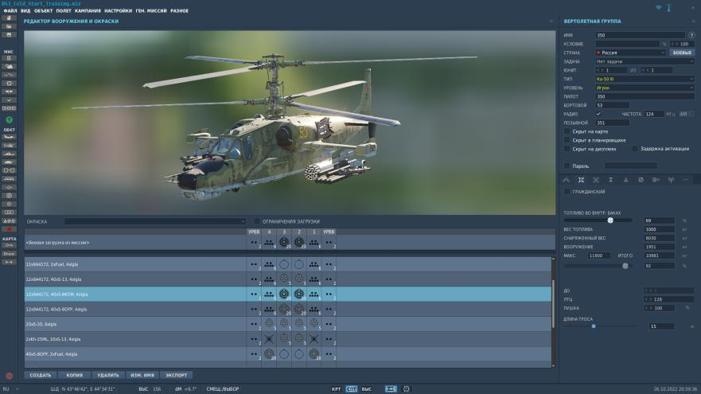
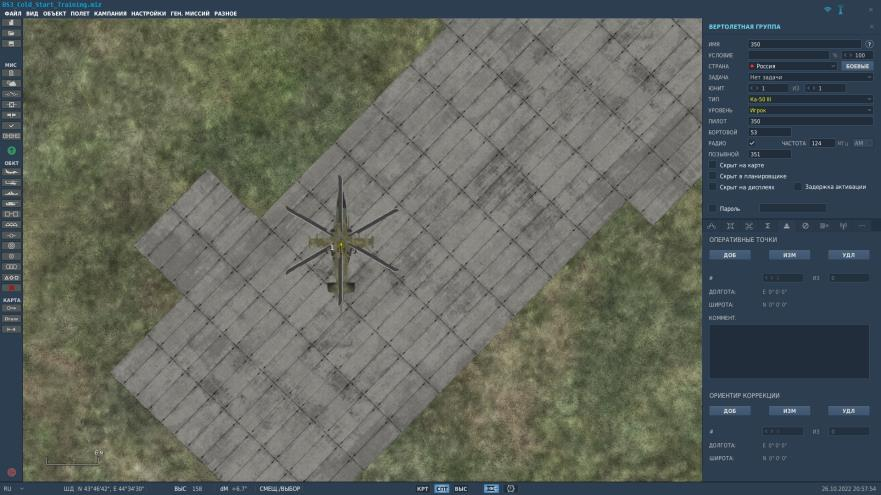
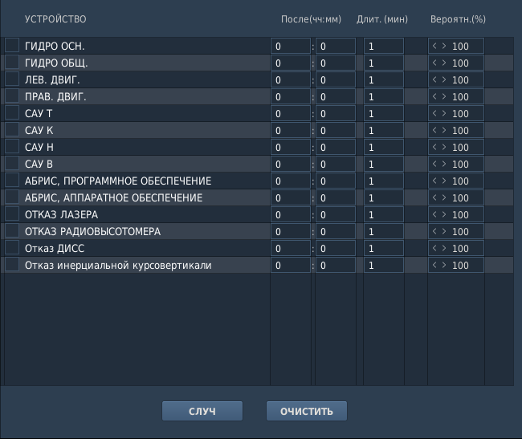

# РЕДАКТОР МИССИЙ

Новые опции

Более подробно о функциях редактора миссий и настройке ЛА при создании миссии
рассказано в "DCS Руководство пользователя", которое можно найти в папке с установленным авиасимулятором DCS World по пути
… :\DCS World\Doc\DCS User Manual RU.

Здесь же расскажем о новых опциях для Ка-50 III.

В середине панели вертолётной группы расположены вкладки режимов – некоторые
из них претерпели изменения и добавились новые.

Редактор подвесок, вызываемый по нажатию вкладки ПОДВЕСКИ

, получил
новое интерактивное 3D-окно просмотра ЛА с подвесками. Пользователь может
наблюдать в реальном времени свои изменения по вооружению на выбранном типе
ЛА.

Панели с прежних вкладок "Ориентир коррекции" и "Оперативные точки" теперь
объединены под одной вкладкой

На вкладке "Отказы" 

расширился выбор систем в связи с реализацией продвинутой инерциальной курсовертикали:

Помните, что теперь при отказе ДИСС и/или инерциальной курсовертикали вы можете запросто прилететь не в тот пункт, который вы намечали. И этому будет способствовать фактор накапливающихся ошибок счисления авионикой Ка-50 III, в результате её отказов и/или повреждений.

Появилась новая вкладка "Дополнительные параметры ЛА".

На ней представлены следующие опции, которые будут установлены на борт Ка-50
сразу же при старте миссии:

Модификация. Выбор модели Ка-50:

-   2011 года
-   2022 года

Вариант выставки ИКВ. Выбор варианта выставки ИКВ при старте:

-   Быстрая выставка
-   Стандартная выставка
-   Стандартная + гирокомпас

Реалистичная ИКВ. Выбор реалистичной или упрощённой ИКВ.

Нашлемное устройство. Выбор варианта нашлемного устройства:

-   Авто
-   НСЦУ
-   ОНВ

